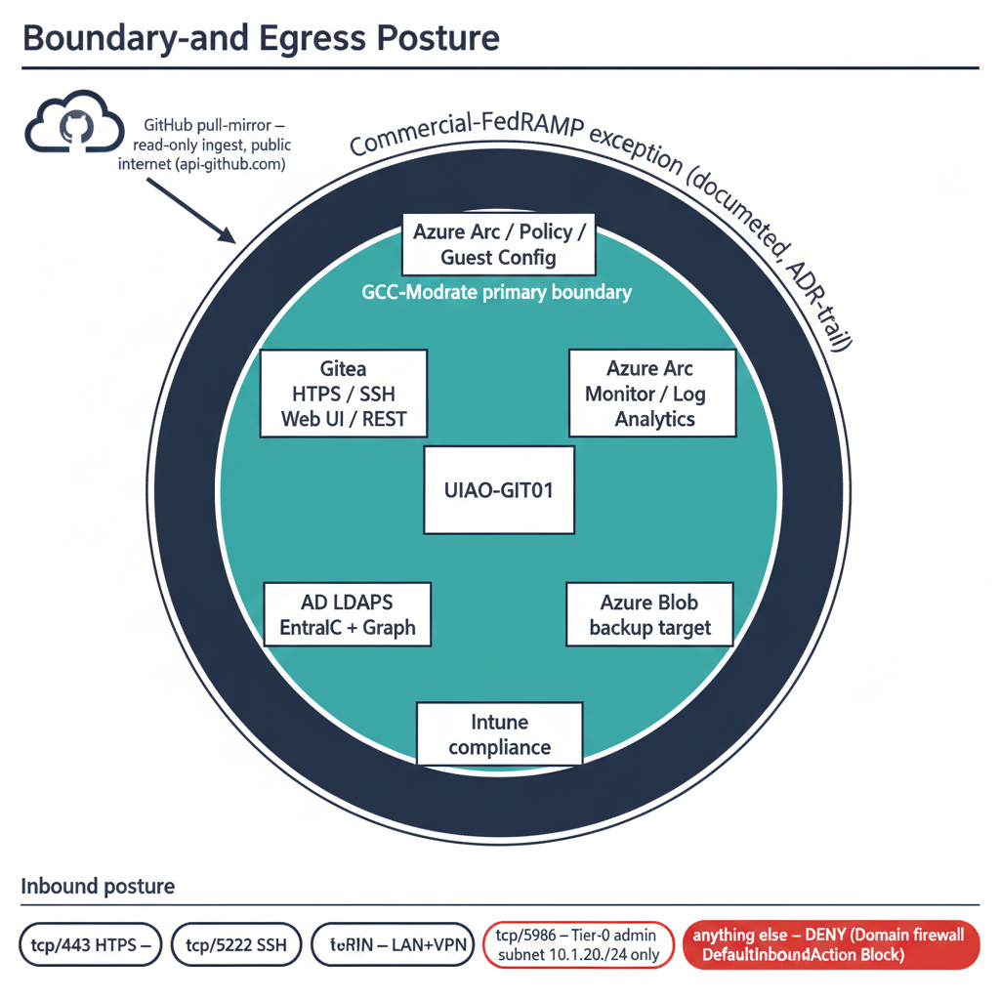

# UIAO Git Server Interfaces — Windows Server 2025 Deployment {.unnumbered}

::: {.callout-note title="Scope of this whitepaper"}
This paper enumerates **every interface plane** the UIAO Git infrastructure
exposes once a Windows Server 2025 host has been brought up through the
14-phase runbook in
[`platform-server-build.qmd`](../platform/platform-server-build.qmd) under
the architecture set by
[ADR-041 — UIAO Git Infrastructure](../../../src/uiao/canon/adr/adr-041-uiao-git-infrastructure.md).

Where the build guide answers *"how do I install it?"*, this paper answers
*"once it is installed, what does it talk to, what talks to it, and what
governs each conversation?"* Every interface is mapped to its boundary
(GCC-Moderate vs. commercial-FedRAMP exception), its authentication model,
its provenance into UIAO canon, and the controls it supports under
NIST SP 800-53 Rev 5.

Two architectural options for the substrate-authority Git service are
documented in the repository — **Option A** (IIS + `git-http-backend.exe`
CGI) and **Option B** (Gitea behind IIS reverse proxy). ADR-041 selects
Option B as canon. This whitepaper inventories the **Option B** interface
surface; Option A's reduced surface is summarized in
[Appendix B](#appendix-b--option-a-interface-delta-cgi-only).
:::

## Executive summary

The UIAO Git host (`UIAO-GIT01`) is a single Windows Server 2025 VM that
runs Gitea on `127.0.0.1:3000` behind IIS terminating HTTPS on `:443`. It
sits inside the customer's GCC-Moderate boundary, is domain-joined to the
legacy AD forest, is hybrid-registered to the customer's Entra tenant,
enrolls into Azure Arc + Intune for compliance and policy projection, and
emits drift telemetry to the UIAO_163 engine. From the outside it looks
like one TLS endpoint; from the inside it is a federation of **six
interface families**:

| Family | Planes inventoried | Primary consumer |
|---|---|---|
| **A. Client / operator transport** | HTTPS Git Smart-HTTP, Gitea SSH, Gitea Web UI, Gitea REST API v1, Git LFS, optional FastAPI (UIAO API) | UIAO contributors, automation, auditors |
| **B. Identity & authentication** | AD LDAPS (`:636`), Entra OIDC, Kerberos / NTLM (Negotiate), hybrid Entra device join, GPG signed-commit verification | Operators + service principals |
| **C. Cloud management plane** | Azure Arc agent, Azure Policy + Guest Configuration, Intune compliance attestation, Azure Monitor Agent, Azure Blob (backup target) | Platform engineering, security operations |
| **D. Governance & telemetry** | Server-side Git hooks (pre-receive / update / post-receive), Gitea webhooks, UIAO_163 drift reporter, `uiao-git-server` conformance adapter, IIS W3C access logs | UIAO governance pipeline + ConMon |
| **E. Local management** | PowerShell 7.4 (signed-only via WDAC + AppLocker), Windows PowerShell 5.1 (legacy IIS cmdlets), Gitea CLI, IIS Manager / `appcmd`, NTFS storage on `D:\GitRepos\` and `D:\Gitea\` | Tier-0 administrators |
| **F. Outbound integrations** | GitHub upstream pull-mirror (`api.github.com`), PostgreSQL relational backend (`pg01.corp.contoso.com:5432`), PSGallery / Microsoft-CDN / GitHub-Releases (build only) | Substrate canon ingest, supply chain |

**Canonical claim.** Every plane in the table above is enforced by the
operational PowerShell in
[`platform-server-build.qmd`](../platform/platform-server-build.qmd)
(Phases 0-14), pinned by the binaries in
[`platform-server-v1.2.yaml`](../../../src/uiao/canon/release-manifests/platform-server-v1.2.yaml),
and observed by the conformance adapter
[`uiao-git-server`](../adapter-specs/uiao-git-server/uiao-git-server.qmd).
Anything not in this table is not authorized on the host.

{#fig-git-server-interfaces-whitepaper-image-01 fig-alt="Hub-and-spoke radial diagram. At the center, a labeled rectangular host card \"UIAO-GIT01 — Windows Server 2025 (Tier-0, GCC-Moderate, OrgPath: ORG-IT-INF-PLATFORM, AU: AU-ORG-IT-INF-PLATFORM)\" with a small Gitea-on-IIS stack icon underneath. Six labeled spoke clusters radiate outward at evenly-spaced angles; each cluster lists four to six plane names: Spoke A \"Client / operator transport\" — HTTPS Git Smart-HTTP, Gitea SSH :2222, Web UI, REST API v1, Git LFS, optional FastAPI; Spoke B \"Identity & authentication\" — AD LDAPS, Entra OIDC, Kerberos / NTLM, Hybrid Entra device join, GPG signed-commit verify; Spoke C \"Cloud management plane\" — Azure Arc, Azure Policy + Guest Config, Intune compliance, Azure Monitor Agent, Azure Blob backup; Spoke D \"Governance & telemetry\" — pre-receive / update / post-receive hooks, Gitea webhooks, UIAO_163 drift reporter, uiao-git-server conformance adapter, IIS W3C logs; Spoke E \"Local management\" — PowerShell 7.4 (signed-only), Gitea CLI, IIS Manager / appcmd, NTFS storage; Spoke F \"Outbound integrations\" — GitHub upstream pull-mirror, PostgreSQL backend, build-time supply chain (pinned SHAs). Around the outer edge of the diagram, a thin teal ring labeled \"Finite. Named. Observable. Anything outside this taxonomy is a finding.\" Clean engineering blueprint style, dark navy (#0D1B2E) and teal (#1E8C8C) on white background. No photographs, purely diagrammatic." width="85%"}

## 1. Architectural context — what is being deployed

### 1.1 One host, six interface families

```
                ┌──────────────────────────────────────────────────────┐
   Operators ─▶ │  TCP/443 HTTPS  ─── IIS  ─── 127.0.0.1:3000 ─── Gitea│
                │     (HSTS, X-Frame DENY, X-Content-Type nosniff)     │
   Operators ─▶ │  TCP/2222 SSH (Gitea built-in SSH server)           │
   Operators ─▶ │  TCP/5986 WinRM (Tier-0 admin subnet allowlist)     │
                │                                                       │
   Forest    ─▶ │  TCP/636 LDAPS (outbound — Gitea binds to dc01)     │
   Tenant    ─▶ │  HTTPS to login.microsoftonline.com / graph.*        │
   Arc plane ─▶ │  HTTPS to *.his.arc.azure.com / *.guestconfig.*     │
   Backup    ─▶ │  HTTPS to *.blob.core.windows.net (RG-scoped)       │
   ConMon    ─▶ │  HTTPS to *.ods.opinsights.azure.com (Log Analytics)│
   GitHub    ─▶ │  HTTPS to api.github.com (pull-mirror, every 15 min)│
                │                                                       │
                │  D:\GitRepos\  ── bare repos (NTFS, gMSA-owned)      │
                │  D:\Gitea\     ── binary, app.ini, lfs, hooks        │
                │                                                       │
                │  OrgPath:  ORG-IT-INF-PLATFORM (extensionAttribute1) │
                │  AU:       AU-ORG-IT-INF-PLATFORM (Tier-3, restricted)│
                └──────────────────────────────────────────────────────┘
```

The host is **Tier-0** by classification — it carries the canon, every
plan, every authorization decision, and every drift signal traces back to
a commit on it. CIS Level-2, AppLocker (publisher `CN=UIAO Canon
Signing`), WDAC UMCI, Defender for Servers Plan 2, and Intune compliance
all apply (see
[`platform-server-build.qmd` Phase 13](../platform/platform-server-build.qmd)).
The interfaces below inherit that posture; nothing on the host is
"informally available".

### 1.2 Single substrate authority — replication is for DR, not load

Two hosts cannot both be authoritative for the canon — they would
diverge. The interface inventory below describes a **single-instance
service**; a passive replica exists for the 4-hour RTO target and shares
the interface contract identically, but only the active node terminates
client traffic. Horizontal scale, where required, is delegated to the
target-surface adapters (Entra, Intune, Arc), not to the substrate
authority. This is the same architectural claim asserted by
[`01-platform-foundation.qmd:19-26`](../modernization/client-server-to-hybrid-cloud/01-platform-foundation.qmd).

## 2. Interface family A — Client and operator transport

The four planes in this family are the only ones ordinary contributors
ever see. Three of them (HTTPS, SSH, Web UI) ride the same TLS
termination at IIS; the fourth (FastAPI) is an optional service
co-resident on the host when the `[api]` extra is installed.

### 2.1 HTTPS Git Smart-HTTP — `tcp/443`

| Attribute | Value |
|---|---|
| Listener | IIS site `UIAOReverseProxy`, host header `git.uiao.corp.contoso.com:443` |
| TLS | Enterprise-CA-issued cert (template `WebServerV2`), 4096-bit RSA, private key ACL'd to `NT SERVICE\gitea` and `IIS AppPool\UIAOReverseProxy` |
| Backend | `http://127.0.0.1:3000` (Gitea), via ARR + URL Rewrite |
| Headers injected | `X-Forwarded-Proto: https`, `X-Forwarded-For`, `X-Forwarded-Host` |
| Security headers | `Strict-Transport-Security: max-age=31536000; includeSubDomains`, `X-Content-Type-Options: nosniff`, `X-Frame-Options: DENY` |
| Body limit | `maxAllowedContentLength = 524288000` (500 MB) |
| Auth | Whatever the user picked — interactive Web SSO via Entra OIDC, or PAT/credential prompt for `git push/clone` |
| Audit | IIS W3C extended logs in `%SystemDrive%\inetpub\logs\LogFiles\` (read by the conformance adapter) |

This is the only plane that talks to the public-facing IP. Gitea is bound
to loopback and is unreachable directly. The reverse-proxy rewrite rule
is single, catch-all, and stop-processing — there is no static-content
fall-through.

**Used by:** every `git clone`, `git fetch`, `git push` against the
canonical mirror; every browser session against the Web UI; every
REST-API call against Gitea.

### 2.2 SSH Git transport — `tcp/2222`

Gitea ships its own SSH server (`DISABLE_SSH = false`,
`SSH_LISTEN_PORT = 2222`). It is bound to the host network, advertises
host key `git.uiao.corp.contoso.com`, and authenticates with SSH public
keys uploaded by the user through the Web UI or the REST API
(`POST /api/v1/user/keys`). It is **not** the OpenSSH service — port 22
is not used and the OS-level OpenSSH server feature is not installed.

The SSH plane is functionally equivalent to the HTTPS plane for `git`
operations but bypasses IIS, so it does **not** appear in the IIS W3C
logs. Its audit trail is the Gitea event log (`D:\Gitea\log\`), which
the `uiao-git-server` adapter reads as a complement to the IIS log.

::: {.callout-tip title="Why two transports?"}
HTTPS terminates at IIS, gets the full security-header treatment, and is
routable through the corporate forward proxy. SSH does not honor HTTP
proxies, so it is the escape hatch for build agents that cannot speak
HTTPS through Kerberos-authenticated proxies. Operators are pushed
toward HTTPS by default (Web UI, README, `git config --global` push
URLs); SSH is for automation that needs raw socket access.
:::

### 2.3 Gitea Web UI — browser, on the same `tcp/443`

Routed through IIS to Gitea's HTML surface. Carries:

- Repository browser, blame, raw-file view, diff/PR view
- Issues + pull requests + reviews
- **Settings → Webhooks → Git Hooks** — the only place where
  server-side hook bodies are edited from a browser; signed by the
  Phase 0.6 code-signing cert before deployment
- OAuth2 consumer-app management (organizations can register their own)
- Personal access token (PAT) issuance for the signed-in operator
- Mirror status and forced-resync controls for the GitHub upstream pull-mirror

Anonymous access is disabled (`DISABLE_REGISTRATION = true`,
`REQUIRE_SIGNIN_VIEW = true`); every page render is bound to an
authenticated session.

### 2.4 Gitea REST API v1 — `https://git.uiao.corp.contoso.com/api/v1/`

The substrate uses the REST API as the **machine-to-machine control
plane** for Gitea. Everything the Web UI does is also reachable here
under the same auth model (PAT, OAuth2 token, or session cookie).

Documented call paths used by the Phase 6-8 build PowerShell:

| Endpoint | Method | Phase | Purpose |
|---|---|---|---|
| `/api/v1/admin/sources` | `POST` | 6, 7 | Register `corp-ad-ldaps` and `EntraID` source-configs |
| `/api/v1/orgs` | `POST` | 8 | Create the `uiao` organization |
| `/api/v1/repos/migrate` | `POST` | 8 | Configure the GitHub pull-mirror with `mirror_interval = 15m0s` |
| `/api/v1/orgs/uiao/teams` | `GET` | 14.4 | UIAO_163 reporter compares team list to dynamic-group claims |
| `/api/v1/admin/users` | `GET` | runtime | Audit + drift reporting |
| `/api/v1/repos/{owner}/{repo}/hooks` | `*` | 9 | Webhook fan-out registration |

The same REST surface is what UIAO modernization adapters and the CI
mirror use; the surface is **not** customer-extensible — adapters that
want new behavior add server-side hooks, not Gitea endpoints.

### 2.5 Git LFS server — `LFS_START_SERVER = true`

The Gitea-hosted LFS server runs on the same `127.0.0.1:3000` listener
as everything else; its content-addressed chunks live under
`D:\Gitea\data\lfs\`. There is **no** separate LFS S3/Azure backend —
the LFS plane is a first-class part of the substrate authority, with
the same backup, ACL, and quota posture as the bare repos in
`D:\GitRepos\`.

The conformance adapter (`uiao-git-server`) emits LFS bytes-stored as
part of the per-poll `git-repo-inventory.json` record; LFS-quota drift
shows up as a `CM-8` finding.

### 2.6 Optional FastAPI plane — `uiao.api.app:app` via HttpPlatformHandler

Distinct from Gitea. When the `[api]` optional extra is installed
(`pip install -e ".[api]"`), the FastAPI app at `uiao.api.app:app` runs
under IIS HttpPlatformHandler per
[`deploy/windows-server/web.config`](../../../deploy/windows-server/web.config).
This is the **UIAO API**, not the Git API; it exposes the
substrate-walker, KSI, evidence-graph, and ATO surfaces.

Key contract:

| Property | Value | Source |
|---|---|---|
| Process | `python.exe C:\inetpub\uiao-api\run.py` (uvicorn, single worker, loopback) | `deploy/windows-server/run.py` |
| Bind | `127.0.0.1:%HTTP_PLATFORM_PORT%` (ephemeral) | same |
| TLS | Terminated at IIS — same enterprise cert as Gitea or a sibling cert | `web.config` |
| Auth | `windowsAuthentication enabled="true"`, providers `Negotiate, NTLM` (Kerberos preferred); anonymous **disabled** | `web.config:62-75` |
| Token forwarding | `forwardWindowsAuthToken="true"` — Python sees the impersonated principal | `web.config:33` |
| Headers | HSTS, `X-Frame-Options DENY`, `X-Content-Type-Options nosniff`, `X-XSS-Protection`, `X-Powered-By` removed | `web.config:99-109` |
| Logging | IIS W3C log is authoritative; uvicorn `access_log=False` deliberately | `run.py:40` |

The FastAPI plane is **off by default** — Phase 4 does not install it,
and the canonical interface contract (`pip install uiao` without
`[api]`) ships only the CLI surface. Customers turn it on when they
need a REST entry point for non-CLI consumers; the substrate's own
governance pipeline does not depend on it.

## 3. Interface family B — Identity and authentication

### 3.1 AD LDAPS — outbound `tcp/636` to `dc01.corp.contoso.com`

Configured as a Gitea `source-config` named `corp-ad-ldaps` via the
REST API in Phase 6. Bind account is least-privilege
(`CN=svc-uiao-ldap,OU=ServiceAccounts,...`), search base is **scoped to
the OrgPath-governed Users OU** (`OU=Users,OU=ORG-IT-INF-PLATFORM,...`),
and the admin filter is the OrgTree dynamic group
`OrgTree-IT-INF-PLATFORM-CanonStewards`.

This is the operator path for "AD-only" users — anyone whose identity
lives in the legacy forest but has not yet been federated to Entra. A
successful LDAP bind creates a native Gitea identity on first sign-in;
the user's group memberships are synced on each sign-in.

The host's own machine account uses Kerberos (separate from this LDAPS
bind) for AD domain-join services and Group Policy resolution.

### 3.2 Entra OIDC — `login.microsoftonline.com` + `graph.microsoft.com`

The federated SSO path. Phase 7 registers the app `UIAO-Gitea-OIDC` in
the customer tenant with:

- Sign-in audience: `AzureADMyOrg`
- Redirect URI: `https://git.uiao.corp.contoso.com/user/oauth2/EntraID/callback`
- Optional claim: `groups` in the ID token
- Group-membership claim type: `SecurityGroup`

Gitea is then configured (also via `/api/v1/admin/sources`) with:

- `provider: openidConnect`
- `openid_connect_auto_discovery_url: https://login.microsoftonline.com/{tenantId}/v2.0/.well-known/openid-configuration`
- `scopes: openid profile email groups`

The critical property is the **groups claim**: when an operator signs
in, the ID token carries their Entra security-group memberships, and
Gitea maps those memberships to its team model on the `uiao` org via
the rules in
[`platform-server-build.qmd` §14.3](../platform/platform-server-build.qmd).
A joiner/mover/leaver event in the HR feed propagates through the
Entra dynamic-group recalculation and arrives as a Gitea permission
change within roughly fifteen minutes — no hand-maintained team
membership.

### 3.3 Kerberos / NTLM (Negotiate) — for the FastAPI plane

When the optional FastAPI plane is enabled, IIS terminates Windows
Authentication via Negotiate (Kerberos preferred, NTLM fallback) and
forwards the impersonated token into the Python process. This auth
surface does **not** apply to the Gitea reverse proxy — Gitea handles
its own auth via LDAPS or OIDC.

### 3.4 Hybrid Entra device join — `extensionAttribute1` carries OrgPath

The host is registered as a device object in the customer's Entra
tenant. Two attributes are critical to the governance plane:

- `extensionAttribute1 = ORG-IT-INF-PLATFORM` — the OrgPath, validated
  against UIAO_151 codebook and UIAO_158 schema
- Azure Arc resource tags mirror the same OrgPath plus `DeviceRole` and
  `DeviceTier` (Phase 14.1)

These attributes are how the drift engine (UIAO_163) recognizes the
host as a first-class OrgTree object rather than an unmanaged
appliance.

### 3.5 GPG — signed-commit verification (`gpg.exe` on the host)

The Phase 9 pre-receive hook chain calls `gpg.exe` (from gpg4win 4.3.x,
pinned in the release manifest) to validate signatures on canon-bearing
commits. The keyring lives under the gMSA's profile; trust roots are
the enterprise PKI's signing certs plus the explicit operator signing
keys uploaded through the Gitea Web UI. Unsigned pushes to `main`,
`canon/*`, or any path under `src/uiao/canon/` are rejected at
pre-receive.

### 3.6 Authentication identity matrix

| Caller | Auth path | Where the identity comes from | Bound to |
|---|---|---|---|
| Federated UIAO contributor | Entra OIDC SSO (Web UI), then PAT for `git` | Entra tenant + group claims | `OrgTree-IT-INF-*` dynamic groups |
| Legacy / AD-only contributor | LDAPS bind through Gitea source-config | Forest user object in OrgPath OU | `OrgTree-IT-INF-PLATFORM-CanonStewards` admin filter |
| FastAPI plane caller (optional) | IIS Negotiate (Kerberos / NTLM) | Forest user; impersonated to Python | NTFS ACL on whatever resource the API touches |
| Gitea service itself | gMSA `corp\svc-uiao-gitea$` | Forest service account | `D:\GitRepos`, `D:\Gitea`, TLS private key |
| IIS reverse-proxy app pool | `IIS AppPool\UIAOReverseProxy` | Built-in app-pool identity | TLS private key (Read), nothing else |
| Backup / Arc plane | Service principal in customer subscription | Tenant SPN, secrets in `SecretStore` | Storage account + Arc resource scope |
| GitHub upstream mirror | Read-only (anonymous over HTTPS) | n/a — `WhalerMike/uiao` is public | n/a |

## 4. Interface family C — Cloud management plane

### 4.1 Azure Arc — `azcmagent` connect

Phase 11 onboards the host as an `Microsoft.HybridCompute/machines`
resource named `UIAO-GIT01` in the resource group
`rg-uiao-governance`. The agent runs as a Windows service, talks
outbound to:

- `*.his.arc.azure.com` — agent registration + heartbeat
- `*.guestconfiguration.azure.com` — Azure Policy / Guest Configuration
  evaluation
- `management.azure.com` — ARM control plane (resource updates,
  extension installs)

Arc projection is what makes Azure Policy and Defender for Servers
Plan 2 reach the on-prem host. The `OrgPath`, `OrgPathBranch`,
`OrgPathDivision`, `DeviceRole`, and `DeviceTier` tags are set on the
Arc resource so Azure Policy assignments can be scoped via tag
expressions instead of resource IDs.

### 4.2 Azure Policy + Guest Configuration

Inherits the Arc plane. Once the host is Arc-enrolled, Azure Policy
assignments scoped to `rg-uiao-governance` (or to `OrgPath` tags)
project Guest Configuration audits onto the host. The audit results
flow back through the Arc agent into the Azure portal and into the
UIAO_163 drift engine via the Azure-side payload.

### 4.3 Intune compliance attestation

Phase 10 publishes a `windows10CompliancePolicy` named
`UIAO-GIT-ServerCompliance-v2` and assigns it to the dynamic group
`OrgTree-IT-INF-PLATFORM-Devices` (Phase 14.5). The host's Intune
agent attests the eight required signals (Secure Boot, BitLocker, code
integrity, storage encryption, firewall, antivirus, real-time
protection, TPM) to `*.events.data.microsoft.com`; non-compliance
opens an SLA ticket through UIAO_167.

### 4.4 Azure Monitor Agent — Log Analytics forwarding

Installed as the Arc extension `AzureMonitorWindowsAgent` in Phase 11.
Forwards the W3C IIS access log, the Gitea event log, the Windows
audit log (Phase 13.e categories: Logon/Logoff, Object Access,
Privilege Use, System, Account Management, Policy Change), and the
Defender event log to the customer's Log Analytics workspace at
`*.ods.opinsights.azure.com` / `*.oms.opinsights.azure.com`. This is
the SIEM-feed plane — one Arc extension projects into whatever
downstream SIEM the customer has wired to that workspace.

### 4.5 Azure Blob — backup target

Phase 12's `Backup-UIAOGitea` function uploads the nightly `gitea dump`
plus the zipped `D:\GitRepos\` to a storage account
(`stuiaogovernance`, container `gitea-backups`) using the managed
identity assigned to the Arc resource. RPO 24 h, RTO 4 h, retention
30 days. The blob endpoint is the only outbound "data" path on the
host; everything else outbound is control-plane traffic.

## 5. Interface family D — Governance and telemetry

This is where the host stops looking like a Git server and starts
looking like a UIAO substrate node.

### 5.1 Server-side Git hooks — pre-receive / update / post-receive

Native to every bare repo under `D:\GitRepos\`. The bodies are
authored in
[`git-server-implementation.qmd` §15](../platform/git-server-implementation.qmd)
(canonical for both Option A and Option B) and apply unchanged to
Gitea. They run **inside** the Gitea process under the gMSA, with
their own audit log written to `D:\Gitea\log\hooks\`.

| Hook | Mandatory rule | Source |
|---|---|---|
| `pre-receive` | Reject `main` pushes unless author ∈ `OrgTree-IT-INF-PLATFORM-CanonStewards` | §15 Rule 1 |
| `pre-receive` | Reject any commit containing `FOUO` / `For Official Use Only` markings | §15 Rule 2 |
| `pre-receive` | Validate canon-file YAML frontmatter (document_id, version, status, classification, owner, boundary) | §15 Rule 3 |
| `pre-receive` | Reject canon files not matching `^UIAO_\d{3}_[\w]+_v\d+\.\d+\.md$` | §15 Rule 4 |
| `pre-receive` | Reject unsigned `.ps1` files under `scripts/` (Authenticode + WDAC requirement) | Phase 0.6 |
| `update` | Enforce branch-naming allowlist: `main, develop, feature/*, bugfix/*, hotfix/*, canon/*, release/*` | §15 |
| `post-receive` | Log push + emit `repository_dispatch` to GitHub Actions for canonical CI mirroring | §15 |

Each hook is signed with the `CN=UIAO Canon Signing` certificate
before deployment; AppLocker would refuse to execute any unsigned
script anyway.

### 5.2 Gitea webhooks — outbound HTTP fan-out

Configured per repository through the Web UI or
`/api/v1/repos/{owner}/{repo}/hooks`. The substrate uses webhooks for:

- **`repository_dispatch` to GitHub** — keeps the public mirror's CI
  in sync after a canonical push
- **UIAO_163 drift engine** — push events emit a payload that the
  drift reporter consumes alongside the scheduled Arc-agent state
- **Quarto rebuild trigger** — push events on `docs/**` paths trigger
  the Quarto pipeline to regenerate the documentation site

Webhooks are HTTP POST with HMAC-SHA256 signatures; the receiver
verifies the signature before acting. Failed webhooks are retried by
Gitea with exponential backoff and surface in the Web UI under
**Settings → Webhooks → Recent Deliveries**.

### 5.3 UIAO_163 drift reporter — scheduled task

Phase 14.4 registers a scheduled task that runs under the Arc service
principal (no interactive credentials on the host). The task collects:

- Entra device `extensionAttribute1` value
- Azure Arc resource `OrgPath` tag value
- Gitea team list via `GET /api/v1/orgs/uiao/teams`
- Administrative Unit membership via Graph
- Arc agent `lastHeartbeat`

…and submits them to UIAO_163 via `Submit-DriftReport`. The drift
engine emits the standard taxonomy: `DRIFT-SCHEMA`, `DRIFT-SEMANTIC`,
`DRIFT-PROVENANCE`, `DRIFT-AUTHZ`, `DRIFT-IDENTITY`. Non-zero counts
open SLA tickets per UIAO_167.

### 5.4 `uiao-git-server` conformance adapter

Documented in
[`adapter-specs/uiao-git-server/uiao-git-server.qmd`](../adapter-specs/uiao-git-server/uiao-git-server.qmd)
and registered as `active` in
[`adapter-registry.yaml`](../../../src/uiao/canon/adapter-registry.yaml).
Read-only. Emits four evidence files per polling interval:

- `git-server-health.json` — IIS app-pool state, Gitea service status,
  `git-http-backend` responsiveness
- `git-tls-inventory.json` — TLS certificate inventory with expiry
  timestamps, chain validity, key algorithm, SAN coverage
- `git-repo-inventory.json` — repos with size, last-push, branch
  count, quota state, LFS bytes
- IIS access-audit summaries — per-period request volume, response-code
  distribution, top-N principal patterns

Maps to NIST controls **CA-7** (continuous monitoring), **CM-8**
(component inventory), **AU-2** (event logging), **AU-6** (audit
review), **SI-4** (system monitoring).

### 5.5 IIS W3C extended logs

The deterministic record of every `:443` request — the authenticated
principal, the URL, the user-agent, the response code, and the bytes
moved. Files land in `%SystemDrive%\inetpub\logs\LogFiles\<siteId>\`,
get rolled daily, and feed both the conformance adapter (§5.4) and the
SIEM forwarder (§4.4). Treated as evidence under AU-2 / AU-6.

## 6. Interface family E — Local management

### 6.1 PowerShell 7.4 — `pwsh` (signed-only)

The administrative shell. Execution policy is `AllSigned` on the user
scope; AppLocker (Phase 13.b) and WDAC UMCI (Phase 13.c) refuse to
execute any script not signed by `CN=UIAO Canon Signing`. Every Gitea
hook carries `#!/usr/bin/env pwsh`. PowerShell 5.1 is retained only
for `Install-WindowsFeature` and a small set of legacy IIS cmdlets
(`WebAdministration`); all new automation runs on `pwsh`.

### 6.2 Gitea CLI — `gitea.exe`

Local management surface for the Gitea service:

- `gitea service install` — the Phase 4 service registration
- `gitea dump` — the backup primitive (Phase 12)
- `gitea admin user *` — emergency operator break-glass
- `gitea generate secret` — JWT / internal-token rotation

Always invoked under the gMSA via `Run-As`. There is **no SSH-into-the-host**
operator workflow; Tier-0 administration uses the WinRM 5986 surface
restricted to the admin subnet (`10.1.20.0/24`).

### 6.3 IIS Manager + `appcmd` + `IISAdministration` module

The IIS configuration plane. Used at install time (Phase 2 / Phase 5)
and during incident response. Read-only access for the conformance
adapter is granted via the `Web Server (IIS) Tools` RSAT group
membership on the gMSA.

### 6.4 Storage — `D:\GitRepos\` and `D:\Gitea\`

The bare-metal interfaces. Every byte the Git substrate cares about
lives under one of two roots:

| Path | Owner | Contents |
|---|---|---|
| `D:\GitRepos\` | gMSA `corp\svc-uiao-gitea$` (Modify, OI/CI) | Bare repos and their `hooks/`; the actual Git object store |
| `D:\Gitea\` | gMSA (Modify, OI/CI) | `gitea.exe`, `custom\conf\app.ini`, `data\`, `data\lfs\`, `log\` |
| `E:\Backups\Staging\` | Service-account-owned, opt-in | `Backup-UIAOGitea` staging area before Blob upload |

NTFS ACLs are the only authorization boundary inside the host;
Postgres metadata lives off-host on `pg01.corp.contoso.com:5432`.

## 7. Interface family F — Outbound integrations

### 7.1 GitHub upstream pull-mirror — `api.github.com`

Phase 8 configures the canonical `WhalerMike/uiao` repo as a
**pull-mirror** in Gitea via `POST /api/v1/repos/migrate` with
`mirror_interval = 15m0s`. Every 15 minutes Gitea pulls from
`https://github.com/WhalerMike/uiao.git` and updates local refs.
Authentication is anonymous (the upstream is public); commits are
verified by the same hook chain that governs operator pushes.

GitHub is the **source of canon ingest**; the on-prem Gitea is the
**source of canon authority**. A push to GitHub does not become canon
until the pull-mirror has fetched it and the hook chain has accepted
it.

### 7.2 PostgreSQL relational backend — `pg01.corp.contoso.com:5432`

Gitea's metadata (users, teams, OAuth apps, issue/PR state, webhook
delivery history) lives in the database `uiao_gitea` on a separate
PostgreSQL host, not in the host's local SQLite. Connection details
(user, password from `Microsoft.PowerShell.SecretManagement`) live in
the `[database]` section of `app.ini`. Backup is the responsibility of
the database team; the Gitea-side `gitea dump` includes a logical
dump of this database for cold-restore use.

### 7.3 Build-time supply chain — pinned to `platform-server-v1.2.yaml`

Every binary the Phase 1-13 PowerShell downloads is pinned to a
`canonical_url` + `sha256` in
[`platform-server-v1.2.yaml`](../../../src/uiao/canon/release-manifests/platform-server-v1.2.yaml).
Hosts: `github.com`, `objects.githubusercontent.com`,
`download.microsoft.com`, `aka.ms`, `dotnetcli.azureedge.net`,
`packages.microsoft.com`, `www.gpg4win.org`, `*.powershellgallery.com`,
`timestamp.digicert.com`. Internal-mirror operators (§0.5) substitute
the canonical URLs with their Artifactory / Azure Artifacts mirror;
the SHA-256 stays the same.

This plane is **build-only**. After cutover, the only outbound
"package" path is the GitHub pull-mirror in §7.1; the supply-chain
URLs are not on the runtime egress allowlist.

## 8. Boundary and egress posture

{#fig-git-server-interfaces-whitepaper-image-02 fig-alt="Boundary-zone diagram with two concentric rings around the central host card \"UIAO-GIT01\". Inner ring labeled \"GCC-Moderate primary boundary\" filled in teal contains plane chips: \"Gitea HTTPS / SSH / Web UI / REST\", \"AD LDAPS\", \"Entra OIDC + Graph\", \"Intune compliance\". Outer ring labeled \"Commercial-FedRAMP exception (documented, ADR-trail)\" filled in a lighter navy contains plane chips: \"Azure Arc / Policy / Guest Config\", \"Azure Monitor / Log Analytics\", \"Azure Blob backup target\". Outside both rings, a small public-internet cloud icon labeled \"GitHub pull-mirror — read-only ingest, public internet (api.github.com)\" with a single inbound arrow into the inner ring. Across the bottom, an inbound-allowlist legend strip labeled \"Inbound posture\": three pill items \"tcp/443 HTTPS — LAN+VPN\", \"tcp/2222 SSH — LAN+VPN\", \"tcp/5986 WinRM — Tier-0 admin subnet 10.1.20.0/24 only\", and a fourth red-bordered pill \"anything else — DENY (Domain firewall DefaultInboundAction Block)\". Title above: \"Boundary-and-Egress Posture\". Red (#C74040) reserved for the deny-by-default pill; clean engineering blueprint style, dark navy (#0D1B2E) and teal (#1E8C8C) on white background. No photographs, purely diagrammatic." width="85%"}

### 8.1 GCC-Moderate primary; commercial-FedRAMP exception for IaaS

| Plane | Boundary | Authority |
|---|---|---|
| Gitea HTTPS / SSH / Web UI / REST | GCC-Moderate (on-prem, customer LAN) | ADR-041 |
| AD LDAPS | Customer-internal (forest) | ADR-041 |
| Entra OIDC + Graph | GCC-Moderate (M365 SaaS) | ADR-033, substrate manifest |
| Intune compliance | GCC-Moderate | UIAO_171 |
| Azure Arc / Policy / Guest Config | Commercial-FedRAMP exception | ADR-041, ADR-059 pattern |
| Azure Monitor / Log Analytics | Commercial-FedRAMP exception | same |
| Azure Blob (backup target) | Commercial-FedRAMP exception | same |
| GitHub pull-mirror | Public internet (read-only ingest) | ADR-041 |

The Arc / Monitor / Blob set is recorded as a discrete commercial
exception in every artifact's frontmatter; it is **not** a covert
violation of GCC-Moderate, it is a documented exception with an ADR
trail and a risk acceptance.

### 8.2 Egress allowlist (runtime)

Phase 0.5.b enumerates the runtime egress allowlist. The proxy /
firewall team configures the corporate forward proxy to permit only
those hostnames; everything else is denied by default. The
`HTTPS_PROXY` / `HTTP_PROXY` / `NO_PROXY` environment variables on the
host are persisted at machine scope (Phase 0.5.c) so Git, PowerShell,
and the Arc agent all consume the same proxy.

### 8.3 Inbound posture — what the public IP is allowed to receive

| Port | Protocol | Source allowlist | Purpose |
|---|---|---|---|
| 443 | HTTPS | Customer LAN + VPN ranges | Gitea Web UI, REST API, Git Smart-HTTP, optional FastAPI |
| 2222 | SSH | Customer LAN + VPN ranges | Git over SSH (Gitea built-in SSH server) |
| 5986 | WinRM/HTTPS | `10.1.20.0/24` (Tier-0 admin subnet) only | Tier-0 administration |
| anything else | — | denied by Domain firewall profile (`DefaultInboundAction Block`) | n/a |

There is **no inbound from the public internet** to the canonical
instance. Operator access from outside the LAN goes through the
customer's documented VPN / Privileged Access Workstation path.

## 9. Governance and control mapping

{#fig-git-server-interfaces-whitepaper-image-03 fig-alt="Interface-to-control crosswalk matrix. Rows on the left are thirteen interface planes from the inventory: \"HTTPS Git Smart-HTTP\", \"Gitea REST API\", \"SSH transport\", \"AD LDAPS\", \"Entra OIDC\", \"Server-side hooks (pre-receive / update / post-receive)\", \"UIAO_163 drift reporter\", \"uiao-git-server adapter\", \"Azure Arc + Guest Config\", \"Intune compliance\", \"Azure Monitor Agent\", \"Azure Blob backup\", \"Code-signing (AppLocker / WDAC)\". Columns across the top are NIST SP 800-53 Rev 5 controls: \"SC-8\", \"SC-13\", \"AC-2\", \"AC-3\", \"AC-6\", \"AU-2\", \"AU-6\", \"AU-9\", \"AU-12\", \"IA-2\", \"IA-5\", \"IA-8\", \"CA-7\", \"CM-2\", \"CM-3\", \"CM-5\", \"CM-6\", \"CM-7\", \"CM-8\", \"CP-9\", \"CP-10\", \"SI-2\", \"SI-4\", \"SI-7\", \"IR-4\". Cells where the row interface contributes to the column control are filled teal; empty cells are white. Across the bottom edge of the matrix, a thin labeled summary band \"Every interface anchors to ≥ 1 NIST 800-53 Rev 5 control; coverage closure is a canon property, not an audit-cycle artifact\". Title above the matrix: \"Interface ↔ NIST SP 800-53 Rev 5 Crosswalk\". Clean engineering blueprint style, dark navy (#0D1B2E) and teal (#1E8C8C) on white background. No photographs, purely diagrammatic." width="85%"}

### 9.1 NIST SP 800-53 Rev 5 — interface-to-control crosswalk

| Interface | Control(s) | Adapter / mechanism |
|---|---|---|
| HTTPS Git Smart-HTTP | SC-8, SC-13, AU-2, AU-12 | TLS 1.2+ at IIS, IIS W3C log, `uiao-git-server` |
| Gitea REST API | AC-3, AC-6, AU-2 | OIDC + LDAPS auth, IIS W3C log, Gitea audit log |
| SSH transport | SC-8, AU-2 | Gitea host key + per-user pubkey, Gitea event log |
| AD LDAPS | IA-2, IA-5 | Least-privilege bind, OrgPath-scoped search base |
| Entra OIDC | IA-2, IA-8, AC-2 | Group-claim mapping to dynamic groups |
| Server-side hooks | CM-3, CM-5, SI-7 | Pre-receive validators, signed-commit enforcement |
| UIAO_163 drift reporter | CM-8, SI-4, IR-4 | Scheduled task, drift taxonomy |
| `uiao-git-server` adapter | CA-7, CM-8, AU-2, AU-6, SI-4 | Health, TLS, repo, access-log evidence |
| Azure Arc + Guest Config | CM-2, CM-6, CM-7 | Azure Policy projection |
| Intune compliance | CM-6, SI-2, SI-7 | Compliance policy + attestation |
| Azure Monitor Agent | AU-6, AU-9, SI-4 | Log Analytics forwarding |
| Azure Blob backup | CP-9, CP-10 | Nightly snapshot + retention |
| Code-signing (AppLocker / WDAC) | CM-7, SI-7 | Publisher allowlist |

### 9.2 OrgTree governance — who can use which interface

Every interface above is gated by membership in one of three OrgTree
dynamic groups, defined in
[`platform-server-build.qmd` §14.3](../platform/platform-server-build.qmd):

| Gitea role | Dynamic group | Membership rule |
|---|---|---|
| Owner | `OrgTree-IT-INF-PLATFORM-CanonStewards` | `extensionAttribute1 -eq "ORG-IT-INF-PLATFORM-STW"` |
| Write | `OrgTree-IT-INF-PLATFORM-Contributors` | `extensionAttribute1 -startsWith "ORG-IT-INF-PLATFORM"` |
| Read | `OrgTree-IT-INF-Users` | `extensionAttribute1 -startsWith "ORG-IT-INF"` |

A move in the HR feed propagates through dynamic-group recalculation
into a Gitea permission change in roughly fifteen minutes; no
hand-maintained team membership exists on the host.

### 9.3 Key Security Indicators (KSIs)

The KSI library (`uiao.rules.ksi`) carries the following families that
test the Git host's interface posture as part of every `uiao ksi
evaluate` run:

- **KSI-CA-7 family** — continuous-monitoring presence and freshness
- **KSI-CM-8 family** — repo + TLS inventory completeness
- **KSI-AU-2 / AU-6 family** — IIS W3C log presence + retention
- **KSI-SI-4 family** — system-monitoring evidence freshness
- **KSI-RECIP family** (v0.6.0) — reciprocity-record health for the
  ATO surface (see
  [federal-hrit-productization](./federal-hrit-productization.qmd))

Failure of any KSI in these families opens an SLA ticket through
UIAO_167 and gates the next ATO recertification.

## 10. Disposition relative to other deployment options

ADR-041 evaluated five alternatives before selecting Gitea behind IIS
on Windows Server 2025. The interface inventory above changes
materially under each:

| Option | Interface delta vs. canon |
|---|---|
| **Option A — IIS + `git-http-backend.exe` CGI** (retained for lab use only) | No Web UI, no native LFS, no built-in OIDC, no team/group semantics, no REST API, no webhooks. Auth collapses to IIS Windows Authentication. See [Appendix B](#appendix-b--option-a-interface-delta-cgi-only). |
| **GitHub Enterprise Server (on-prem appliance)** | Linux appliance interface (GHES upgrade ladder, GHES REST API instead of Gitea API). Adds vendor licensing surface. |
| **Bitbucket Data Center / GitLab self-managed** | Linux-first; adds clustered-DB / Redis / Sidekiq / NGINX / Puma surfaces. Heavier interface footprint without proportional governance value at this scale. |
| **Azure DevOps Services (SaaS)** | Excluded by boundary — same reason GitHub SaaS cannot serve as substrate authority. ADO Server (on-prem) is retired post-2020. |
| **Plain bare repos over SSH** | No URL-based access-control granularity, no read-operation audit, no LFS unless bolted on, no OIDC. Acceptable for an emergency offline mirror only. |

Operators who need to deviate from canon must file a new ADR
superseding ADR-041; the conformance adapter
(`uiao-git-server`) currently expects the Option B interface contract
and will emit `DRIFT-SCHEMA` against any non-canonical surface.

## 11. Closing position

The interface inventory above is **finite, named, and observable**.
That is the architectural claim of ADR-041 and the operational claim
of [`platform-server-build.qmd`](../platform/platform-server-build.qmd).
Every plane in the six families is either:

1. **Inbound and gated** by IIS, Gitea OIDC/LDAPS, or the firewall
   subnet allowlist;
2. **Outbound and pinned** to a canonical URL or hostname pattern in
   the egress allowlist;
3. **Local and signed**, with WDAC + AppLocker refusing anything
   outside `CN=UIAO Canon Signing`; or
4. **Telemetry**, observed by the conformance adapter and emitted to
   the drift engine.

Anything outside that taxonomy is a finding — `DRIFT-SCHEMA` if the
plane appeared without an ADR, `DRIFT-PROVENANCE` if its provenance
into canon cannot be resolved, `DRIFT-AUTHZ` if its authorization
posture diverged from the OrgTree group mapping. The substrate is
governed by the *closure* of this list, not by the absence of
incidents.

## Appendix A — Provenance and references

| Artifact | Path | Role |
|---|---|---|
| ADR-041 | [`src/uiao/canon/adr/adr-041-uiao-git-infrastructure.md`](../../../src/uiao/canon/adr/adr-041-uiao-git-infrastructure.md) | Architectural decision (Option B is canon) |
| Build runbook | [`docs/customer-documents/platform/platform-server-build.qmd`](../platform/platform-server-build.qmd) | Phases 0-14, operational source of truth |
| Release manifest | [`src/uiao/canon/release-manifests/platform-server-v1.2.yaml`](../../../src/uiao/canon/release-manifests/platform-server-v1.2.yaml) | Binary pins + SHA-256 |
| Conformance adapter spec | [`docs/customer-documents/adapter-specs/uiao-git-server/uiao-git-server.qmd`](../adapter-specs/uiao-git-server/uiao-git-server.qmd) | Telemetry interface contract |
| Adapter registry | [`src/uiao/canon/adapter-registry.yaml`](../../../src/uiao/canon/adapter-registry.yaml) | `uiao-git-server` entry |
| Option-A reference | [`docs/customer-documents/platform/git-server-implementation.qmd`](../platform/git-server-implementation.qmd) | Lab build (CGI), source of canonical hook bodies |
| FastAPI deployment | [`deploy/windows-server/web.config`](../../../deploy/windows-server/web.config), [`run.py`](../../../deploy/windows-server/run.py) | Optional `[api]` plane |
| Substrate manifest | [`src/uiao/canon/substrate-manifest.yaml`](../../../src/uiao/canon/substrate-manifest.yaml) | Boundary (GCC-Moderate + commercial exceptions) |
| OrgTree canon | UIAO_151, UIAO_152, UIAO_153, UIAO_154, UIAO_158, UIAO_163, UIAO_167, UIAO_171, UIAO_174 | Group mapping, schema, drift, SLA |
| Foundational architecture | [`docs/customer-documents/modernization/client-server-to-hybrid-cloud/01-platform-foundation.qmd`](../modernization/client-server-to-hybrid-cloud/01-platform-foundation.qmd) | "Single substrate authority" claim |

## Appendix B — Option A interface delta (CGI only)

The non-canonical Option A architecture in
[`git-server-implementation.qmd`](../platform/git-server-implementation.qmd)
exposes a strictly smaller interface set. Use this table when
inventorying a lab / proof-of-concept host that has not been promoted
to Option B.

| Interface family | In Option B (canon) | In Option A (lab only) |
|---|---|---|
| HTTPS Git Smart-HTTP | ✅ via Gitea behind IIS reverse proxy | ✅ via `git-http-backend.exe` as IIS CGI handler |
| SSH transport | ✅ Gitea built-in SSH server on `:2222` | ❌ not present |
| Web UI | ✅ Gitea (issues, PRs, OAuth apps, mirror UI) | ❌ none — Git CLI only |
| REST API | ✅ Gitea `/api/v1/...` | ❌ none |
| LFS | ✅ Gitea built-in (`LFS_START_SERVER = true`) | ⚠️ requires hand-rolled IIS handler |
| OIDC / Entra federation | ✅ via Gitea source-config | ❌ collapses to IIS Windows Authentication |
| AD LDAPS | ✅ via Gitea source-config | ⚠️ AD groups → IIS roles only, no per-repo team mapping |
| Server-side hooks | ✅ same hook bodies (canonical for both options) | ✅ same hook bodies |
| Webhooks | ✅ Gitea native, with HMAC signing + retries | ❌ requires custom PowerShell + Task Scheduler |
| Conformance adapter | ✅ `uiao-git-server` operates against the Gitea + IIS surface | ⚠️ partial coverage — TLS + IIS log only; no Gitea-specific telemetry |
| Drift integration (UIAO_163) | ✅ Gitea team list contributes to the drift payload | ⚠️ payload omits team/group state |

Any Option A deployment promoted to production requires a new ADR
superseding ADR-041; until then it is restricted to lab / PoC scope.
