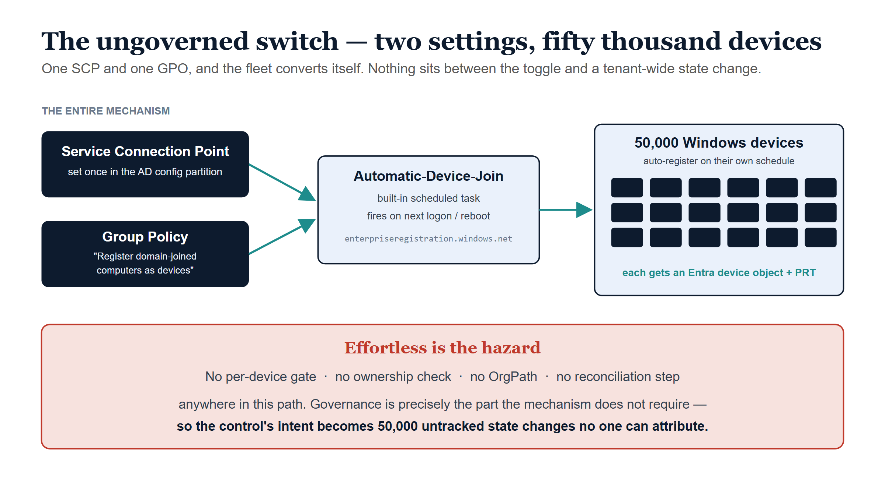
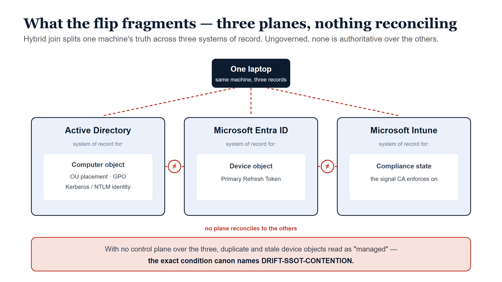
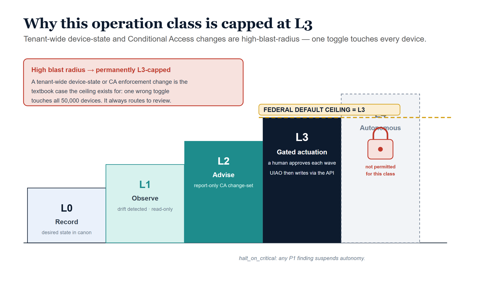
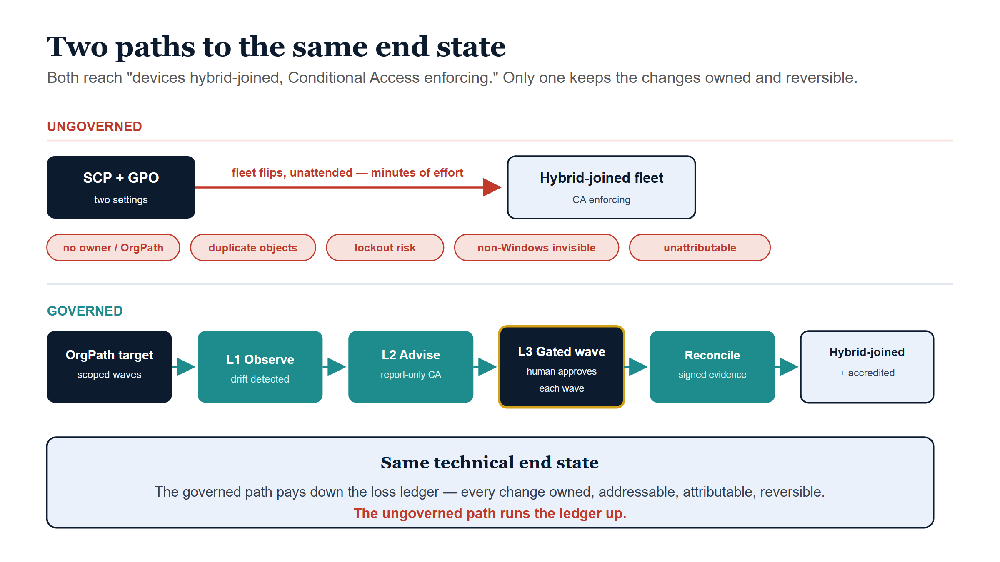

# Flipping 50,000 Devices to Hybrid Join — The Governed and Ungoverned Paths {.unnumbered}

::: {.callout-tip appearance="simple"}
**[Download this whitepaper as DOCX](hybrid-join-without-governance.docx)** — a
Word copy of this page, regenerated on every site deploy. (Also available from
the **Other Formats** link in the page sidebar.)
:::

::: {.callout-note}
## In this whitepaper

The federal Zero-Trust baseline carries a control that reads, in full, *"All
sign-in activity comes from managed devices"* — satisfied in practice by
**requiring compliant or hybrid-joined devices with Conditional Access**. On the
[AD-to-Entra crosswalk](../learning/entra-security-baseline-federal-crosswalk.qmd)
that single line is scored **T3 — a multi-quarter program gated on device, Intune,
and join maturity.**

This paper takes one agency-scale instance of that control — *"move 50,000
domain-joined Windows devices into Microsoft Entra hybrid join"* — and walks it
down **two paths**. The **ungoverned path** is a near-effortless tenant switch:
two settings and the fleet converts itself. The **governed path** reaches the
same end state under UIAO's active-governance control plane. The gap between them
is the subject of this paper, expressed as a **loss ledger**: what classic AD
gave you, what an ungoverned flip silently spends, and what governed
reconciliation restores.
:::

::: {.callout-tip}
## The one sentence this turns on

> The mechanism to convert a 50,000-seat estate to hybrid join requires **almost
> no governance** — and that is exactly why doing it ungoverned is dangerous. The
> provider data plane makes the bulk state change effortless; governance is
> precisely the part the mechanism does *not* require, so it is the part that
> gets skipped.
> — anchored to [ADR-092 Active Governance](../../../src/uiao/canon/adr/adr-092-active-governance.md)
:::

---

## 1. The control being satisfied

The crosswalk scores the control like this:

| Control | License | GCC | AD-friction | Tier |
|---|---|:--:|:--:|:--:|
| All sign-in activity comes from managed devices | P1 | ✅ | 🔴 *(Intune + join maturity)* | **T3** |

The 🔴 and the **T3** are the whole story. The *license* is already in hand (P1
ships with M365 G5) and the feature is *available* in government cloud (✅). What
makes it a multi-quarter program is not the toggle — it is the **20 years of
Active Directory entanglement** the toggle sits on top of. The ungoverned path,
below, is what it looks like when an organization treats the 🔴 as if it were a
🟢.

---

## 2. The ungoverned path — a tenant switch, not 50,000 decisions

Converting an existing AD-domain-joined fleet to Entra **hybrid join** is, at the
mechanism level, a *fleet-wide switch* — not a per-device project:

1. **Sync the computer objects.** Entra Connect (or Entra Cloud Sync) is almost
   certainly already syncing your users; extend the scope to synchronize the
   computer objects.
2. **Set the Service Connection Point (SCP) once.** Either the Entra Connect
   configuration wizard writes the SCP into AD's Configuration partition, or you
   push the *"Register domain-joined computers as devices"* device-registration
   policy by GPO. The SCP stamps every domain-joined machine with the tenant ID
   and a verified domain name — its instructions for where to register.
3. **The devices register themselves.** The built-in
   `Automatic-Device-Join` scheduled task fires on the next logon or reboot, the
   device reaches `enterpriseregistration.windows.net` /
   `device.login.microsoftonline.com` / `login.microsoftonline.com` (and
   `autologon.microsoftazuread-sso.com` for Seamless SSO), an Entra **device
   object** is created, and the device receives a **Primary Refresh Token (PRT)**
   for cloud SSO. `dsregcmd /status` then shows `AzureAdJoined : YES` +
   `DomainJoined : YES`.

That is the entire mechanism. One SCP, one GPO, and the whole estate begins
flipping state on its own schedule. **There is no per-device gate, no ownership
check, no organizational-position check, and no reconciliation step anywhere in
that path.** ([Microsoft Learn — plan hybrid
join](https://learn.microsoft.com/en-us/entra/identity/devices/hybrid-join-plan) ·
[how-to](https://learn.microsoft.com/en-us/entra/identity/devices/how-to-hybrid-join))

That effortlessness is not a convenience. It is the hazard: the control's intent
— *every sign-in comes from a known, owned, managed device* — gets converted into
**50,000 untracked state changes** that no one can subsequently attribute.

{#fig-ungoverned-switch fig-alt="Left-to-right blueprint diagram. Two navy input boxes, Service Connection Point and Group Policy, feed a central Automatic-Device-Join scheduled-task box, which fans out to a box of 50,000 Windows devices that each receive an Entra device object and PRT. A red band across the bottom reads: effortless is the hazard — no per-device gate, no ownership check, no OrgPath, no reconciliation; the control's intent becomes 50,000 untracked state changes." width="100%"}

---

## 3. The loss ledger — what "ungoverned" actually spends

Classic AD was a creaky governance system, but it *was* a governance system: a
computer object lived in an OU, had a delegated admin lineage, and was visible to
the same console that governed everything else. An ungoverned hybrid-join flip
keeps the *connectivity* benefit (cloud SSO, Conditional Access eligibility) while
quietly discarding the governance scaffolding underneath.

{#fig-three-plane fig-alt="Blueprint diagram. One laptop at top connects by red dashed lines to three side-by-side plane boxes: Active Directory (system of record for the computer object, OU, GPO, Kerberos), Microsoft Entra ID (device object, Primary Refresh Token), and Microsoft Intune (compliance state). Red not-equals markers sit between the planes labelled 'no plane reconciles to the others.' A red bottom band notes that duplicate and stale device objects read as managed — DRIFT-SSOT-CONTENTION." width="100%"}

The ledger:

| Capability under classic AD | What an ungoverned hybrid-join flip loses | What governed reconciliation restores (canon) |
|---|---|---|
| **Ownership** — each computer object sat in an OU with a delegated admin lineage | New Entra device objects appear with no human-owner mapping and no organizational position; "who owns this device, in what part of the org" is unanswerable at scale | Every governed object **carries OrgPath**; ownership and scoping **compose against** it ([UIAO_151](../../../src/uiao/canon/UIAO_151_OrgPath_Codebook.md), [ADR-092 §2](../../../src/uiao/canon/adr/adr-092-active-governance.md)) |
| **One object per machine** — the AD computer object was the single record | Prior Workplace-Join/registered states and stale-but-still-syncing AD objects produce **duplicate and phantom** device records that read as "managed" | The reconciliation loop detects the divergence as [`DRIFT-SSOT-CONTENTION`](../../../src/uiao/canon/adr/adr-074-drift-ssot-contention.md) and de-duplicates against canon |
| **Scoped, gradual rollout** — GPO applied per-OU, in waves | Turning the Conditional Access "require compliant *or* hybrid joined" policy to **enforce** before registration has actually completed fleet-wide → **tenant-wide lockout** | Device-state change is treated as a **high-blast-radius operation class**: report-only baking, then **L3 gated actuation** with a human approver ([ADR-092 §3–4](../../../src/uiao/canon/adr/adr-092-active-governance.md)) |
| **Provenance** — changes were at least logged in one directory | Each of 50,000 device-state changes happens with no signed, attributable record of *why* and *under whose authority* | Each `plan / apply / reconcile` step emits **signed evidence**; an unattributable state is [`DRIFT-PROVENANCE`](../../../src/uiao/canon/adr/adr-040-drift-engine.md) |
| **Lifecycle** — AD had a (creaky) join/leave lifecycle | No retirement story: decommissioned machines linger as stale Entra device objects, inflating the "managed" count indefinitely | Lifecycle is reconciled against canon; stale objects surface for access review rather than accumulating |
| **Single console of record** — AD owned the computer object end-to-end | State now spans **three planes** — AD owns the computer object, Entra owns the device object, Intune owns *compliance* — with nothing reconciling them | UIAO is the **control plane** that reconciles all three; providers remain **incorporated data planes**, not competing sources of truth ([ADR-092](../../../src/uiao/canon/adr/adr-092-active-governance.md)) |
| **Line-of-sight assumption was explicit** | Hybrid join's hard dependency on reaching a domain controller is left implicit; remote-first / VPN-only users **silently rot** (password/PIN/TPM failures) until unusable | The DC-reachability constraint is named as a known limit and drives the target state (Entra join) rather than being discovered as an outage |

The pattern across every row is the same: the ungoverned flip keeps the **runtime
benefit** and spends the **truth-and-accountability layer** — the exact
conflation UIAO exists to undo.

---

## 4. What hybrid join *still* doesn't satisfy

Even a flawless 50,000-device hybrid-join rollout does **not** by itself satisfy
*"all sign-in activity comes from managed devices."* Hybrid join only covers
**domain-joined Windows.** The control's denominator is larger:

- **macOS / iOS / Android / Linux** → need Entra join or Intune MDM enrollment
  plus a compliance policy — not hybrid join.
- **BYOD, contractors, B2B guests** → never hybrid-joinable at all.
- **Servers, VDI / AVD, shared kiosks, service accounts** → each needs its own
  posture decision.

So the population the assessment is *really* probing is precisely the slice an
ungoverned Windows-only flip renders invisible. Canon's answer is to make endpoint
onboarding a governed, **Intune-first** discipline across surfaces
([ADR-071 Intune-First Asset Onboarding](../../../src/uiao/canon/adr/adr-071-intune-first-asset-onboarding.md)),
so the uncovered surface is *surfaced as a gap* instead of hidden by a green
checkmark.

---

## 5. The governed path — same end state, under the control plane

The governed path reaches the identical technical outcome — devices hybrid-joined,
Conditional Access enforcing managed-device sign-in — but routes the bulk state
change through UIAO's **active reconciliation control plane** rather than letting
the provider data plane convert the fleet unattended. UIAO holds desired state,
observes actual state, classifies drift, and reconciles toward intent; Entra and
Intune remain the data planes that authenticate and enforce at runtime
([ADR-092](../../../src/uiao/canon/adr/adr-092-active-governance.md)). Concretely, the same
program looks like this:

1. **Address before you actuate.** Every device to be converted carries an
   **OrgPath** expressing its organizational position, so the rollout can be
   scoped, waved, and audited *in the same terms as every other plane* — not by
   ad-hoc OU guesswork ([UIAO_151](../../../src/uiao/canon/UIAO_151_OrgPath_Codebook.md)).
2. **Cap the blast radius by class.** "Tenant-wide device-state change" and
   "Conditional Access enforcement change" are exactly the high-blast-radius
   classes canon **caps at L3 — human-approved — permanently.** One wrong CA
   toggle touching 50,000 devices is the textbook case the ceiling exists for.

   | Rung | Name | Behavior |
   |---|---|---|
   | **L0** | Record | Desired state (hybrid-join target, CA intent) recorded in canon. |
   | **L1** | Observe | Actual join state collected per device; drift detected. Read-only. |
   | **L2** | Advise | Wave plan + report-only CA change-set generated and surfaced; no writes. |
   | **L3** | Gated actuation | A human approves each wave; UIAO executes through the provider API. **Federal default ceiling.** |
   | **L4** | Autonomous | Not permitted for this class — high blast radius, L3-capped. |

   {#fig-actuation-ceiling fig-alt="Ascending staircase blueprint of five steps L0 Record, L1 Observe, L2 Advise, L3 Gated actuation (emphasized navy), L4 Autonomous (faded, dashed). An amber dashed line across the top of L3 reads 'FEDERAL DEFAULT CEILING = L3.' A red lock on the L4 step reads 'not permitted for this class.' A red callout explains a tenant-wide device-state or CA change touches all 50,000 devices, so it is permanently L3-capped and always routes to review. Footer: halt_on_critical — any P1 finding suspends autonomy." width="100%"}

3. **Execute the wave through `plan()` / `apply()`, not ad hoc scripts.** The CLI
   entry point for adapter operations is `uiao adapter run entra` (a Typer
   command in `src/uiao/cli/adapter.py` that dispatches into the Entra adapter
   family under `src/uiao/adapters/`). The OrgPath-scoped wave itself is
   computed and executed by that family's `EntraDynamicGroupAdapter`: its
   `plan(observed)` method is pure — it diffs the canonical dynamic-group
   library (the wave's declared target state, keyed to the OrgPath-bound
   `extensionAttribute` slot) against the tenant's observed group state and
   returns a list of `FacetOperation` records, one per group whose membership
   rule needs to be created or updated, without making a single Graph call.
   That diff is what L1 Observe and L2 Advise are, concretely. `apply(operations,
   dry_run=True)` — `dry_run=True` is the method's default — is the
   report-only execution of that plan: every operation is evaluated and
   recorded as *would-send*, and nothing reaches Graph. Promotion to
   `dry_run=False` is a separate, explicit call an operator makes per wave
   after review — the code-level shape of the L3 gate above. One class of
   operation never crosses that gate regardless of `dry_run`: operations in
   `governance_review_ops` (today, the `phantom`-group verb, flagged for
   removal) are always skipped by `apply()` whether `dry_run` is `True` or
   `False` — a standing human-sign-off set that promoting a wave out of
   dry-run cannot silently sweep past. ([ADR-084
   §C4–C5](../../../src/uiao/canon/adr/adr-084-phase5-consumer-architecture.md))
4. **Bake the enforcement.** Conditional Access runs **report-only** first; the
   control plane reconciles "registered and compliant" coverage against the
   OrgPath-scoped target population before any wave flips CA to enforce — so the
   lockout failure mode in §3 cannot occur silently.
5. **Reconcile duplicates and lifecycle.** Phantom/stale device objects are
   classified as drift ([ADR-074](../../../src/uiao/canon/adr/adr-074-drift-ssot-contention.md))
   and resolved against canon, not left to inflate the managed-device count.
6. **Emit evidence an AO can sign.** Every wave produces signed
   `plan / apply / reconcile` evidence. The accreditation sentence is not "it
   enforces managed-device sign-in" but "this operation class is at L3, gated,
   with dry-run record and rollback" — a sentence an authorizing official can put
   their name to.
7. **Cover the whole denominator.** Non-Windows, BYOD, and guest surfaces are
   driven through Intune-first onboarding
   ([ADR-071](../../../src/uiao/canon/adr/adr-071-intune-first-asset-onboarding.md)) so the
   control is satisfied for its real population, not just the Windows slice.

The end state is the same as the ungoverned flip. The difference is that every one
of the 50,000 changes is **owned, addressable, attributable, reversible, and
accredited** — the loss ledger of §3 is paid down rather than run up.

---

## 6. The two paths side by side

§2 named the exact provider mechanism that flips the fleet unattended — SCP,
GPO, the `Automatic-Device-Join` scheduled task, `dsregcmd /status`. §5 names
the equivalent governed mechanism at the same level of specificity —
`EntraDynamicGroupAdapter.plan()` computing the wave's operations,
`apply(dry_run=True)` as the default report-only execution, an explicit
`dry_run=False` promotion as the L3 gate, and `governance_review_ops` as the
operations that stay human-gated no matter what. Both are real code paths in
this repository, not aspirational description. Same end state; the entire
difference is what stands between the plan and the write.

{#fig-two-paths fig-alt="Two-lane blueprint. Top lane 'UNGOVERNED': an SCP+GPO box, a red arrow 'fleet flips, unattended — minutes of effort' to a hybrid-joined fleet box, with red loss chips below: no owner/OrgPath, duplicate objects, lockout risk, non-Windows invisible, unattributable. Bottom lane 'GOVERNED': a teal pipeline OrgPath target → L1 Observe → L2 Advise (report-only CA) → L3 Gated wave (human approves, amber-outlined) → Reconcile (signed evidence) → Hybrid-joined + accredited. Caption: same technical end state; the governed path keeps every change owned, addressable, attributable, reversible." width="100%"}

| Dimension | Ungoverned flip | Governed reconciliation |
|---|---|---|
| Effort to start | Two settings (SCP + GPO) | A program, scoped by OrgPath waves |
| Who decides, per device | No one — auto-registration | Canon target + human-approved waves |
| Pre-enforcement safety | CA can lock out the fleet | Report-only baked against coverage first |
| Duplicate / stale objects | Accumulate as phantom "managed" devices | Classified as drift, reconciled to canon |
| Non-Windows / BYOD / guests | Invisible — false green | Surfaced as gap; Intune-first onboarding |
| Accountability | 50,000 unattributable changes | Signed `plan/apply/reconcile` evidence |
| AO sign-off | "It's enabled" | "This class is L3-gated, dry-run, rollback-capable" |
| Reversibility | No rollback plane | Rollback-capable, evidence-backed |

---

## 7. How this maps to UIAO canon

| Claim in this paper | Canon anchor | Note |
|---|---|---|
| The control is a multi-quarter program, not a toggle | [crosswalk T3 row](../learning/entra-security-baseline-federal-crosswalk.qmd) | The 🔴 / T3 score is the starting point this paper expands. |
| Governance is the part the mechanism doesn't require | [ADR-092 §1](../../../src/uiao/canon/adr/adr-092-active-governance.md) | AD conflated truth with the in-path enforcer; the data plane makes bulk change effortless and ungoverned. |
| Every governed device carries OrgPath; decisions compose against it | [UIAO_151](../../../src/uiao/canon/UIAO_151_OrgPath_Codebook.md), [ADR-092 §2](../../../src/uiao/canon/adr/adr-092-active-governance.md) | OrgPath is an *addressing attribute*, not a token; scoping/AU/CA/Intune compose against it. |
| Tenant-wide device/CA change is L3-capped | [ADR-092 §3–4](../../../src/uiao/canon/adr/adr-092-active-governance.md) | High-blast-radius classes are permanently human-gated at the federal L3 ceiling. |
| Duplicate/stale device objects are drift | [ADR-074](../../../src/uiao/canon/adr/adr-074-drift-ssot-contention.md) | `DRIFT-SSOT-CONTENTION` — structurally valid state directed at a record that should no longer be authoritative. |
| Unattributable state changes are a provenance gap | [ADR-040](../../../src/uiao/canon/adr/adr-040-drift-engine.md) | `DRIFT-PROVENANCE` — activity that cannot be traced to a declared, authorized source. |
| Whole-denominator coverage via endpoint onboarding | [ADR-071](../../../src/uiao/canon/adr/adr-071-intune-first-asset-onboarding.md) | Intune-first asset onboarding across surfaces, not Windows-only. |
| Control-plane / data-plane separation as the spine | [ADR-092](../../../src/uiao/canon/adr/adr-092-active-governance.md) | This paper is one worked operation inside that larger arc (the [*modernization-journey*](modernization-journey.qmd) whitepaper tells it end to end). |

::: {.callout-note}
## Provenance

The Entra hybrid-join mechanism in §2 is summarized from Microsoft Learn (linked
inline) and is provider behavior, not a UIAO canon claim. The loss ledger (§3) and
the governed path (§5) are reconciled to canon as tabulated in §7. Draft staged
2026-06-08 for review; published to the site as a Draft-status work.
:::

## Sources

- [Microsoft Entra hybrid join — concept](https://learn.microsoft.com/en-us/entra/identity/devices/concept-hybrid-join)
- [Plan your hybrid join deployment](https://learn.microsoft.com/en-us/entra/identity/devices/hybrid-join-plan)
- [How to configure hybrid join](https://learn.microsoft.com/en-us/entra/identity/devices/how-to-hybrid-join)
- Companion crosswalk: [Entra Security Baseline — A Federal AD-to-Entra Crosswalk](../learning/entra-security-baseline-federal-crosswalk.qmd) (the T3 row this paper expands).
- Companion narrative: [*From Mainframe to Application-Aware Modernization*](modernization-journey.qmd) — the control-plane/data-plane arc this paper sits inside.
- Series treatment of the device plane: [OrgPath narrative Book 05 — OrgPath and Microsoft Intune](../orgpath-narrative/Book_05.qmd) (the dynamic device-group library and compliance/CA bridge the governed path assumes), curated with the rest of the modernization surfaces at the [OrgMod hub](../../orgmod/index.qmd).

## Call to Action

The two paths in §6 reach the same technical end state. The only
question this paper actually poses is which one your agency is already
on — and whether anyone decided that on purpose.

::: {.callout-important}
## Four steps before the next tenant switch

1. **Check whether the ungoverned path is already live.** Confirm
   whether hybrid-join auto-registration (SCP + GPO) is enabled in your
   tenant today, and if so, since when. A control that "shipped itself"
   the moment the settings were flipped is drift, not policy — it needs
   to be found before it can be governed.
2. **Inventory before you enforce.** Run the ungoverned fleet against
   the loss ledger in §3 — count the duplicate objects, the
   unattributable device-state changes, the non-Windows/BYOD devices
   Conditional Access can't see. This inventory is the input to every
   later wave, not a formality.
3. **Enter at L1 Observe, report-only, before any CA policy can lock
   out the fleet.** The governed path in §5 exists precisely so
   enforcement never runs ahead of coverage data. Skipping straight to
   L3 is how a well-intentioned rollout becomes an outage.
4. **Assign the wave owner.** Someone needs to own the OrgPath-scoped
   wave plan, the AO sign-off on each L3-gated class, and the rollback
   path. If no one owns it, the tenant setting is the plan — which is
   the failure mode this paper describes.
:::

This is a single control, not a program — which is exactly why it's
worth getting right before the next 50,000-device decision arrives on a
shorter deadline.
