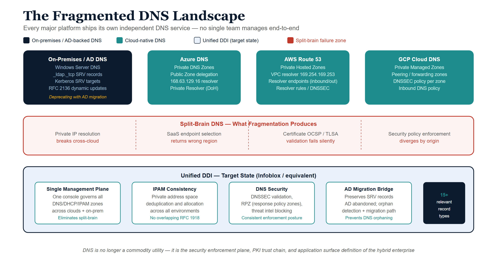
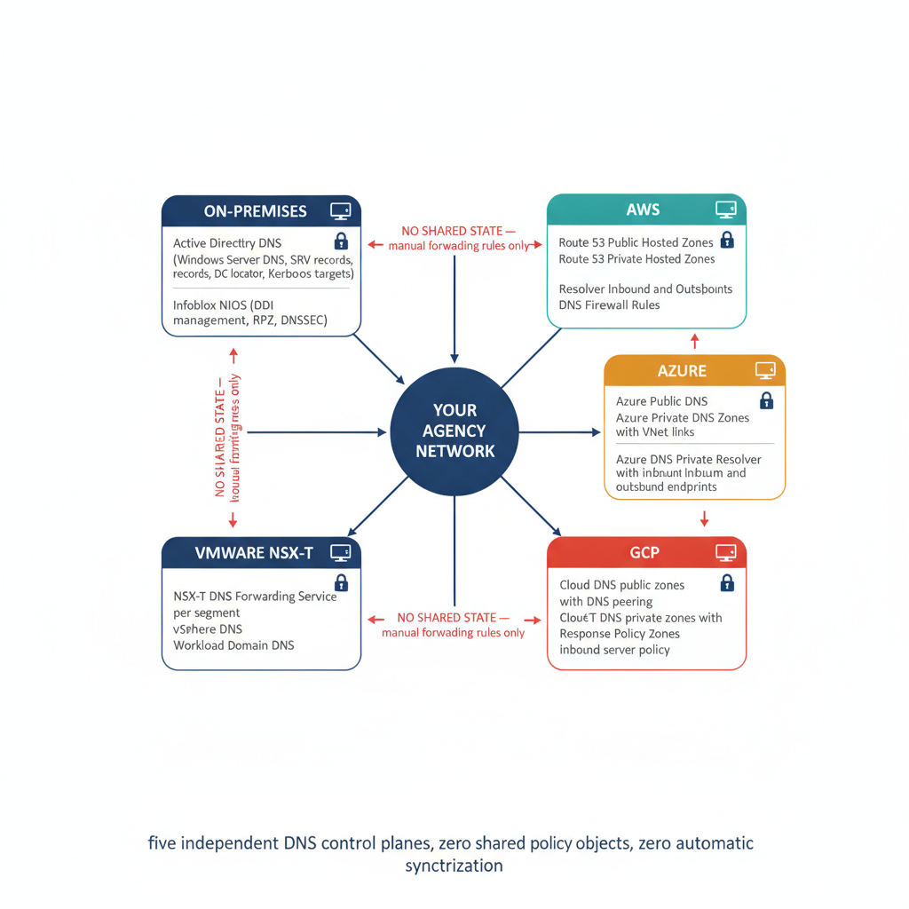
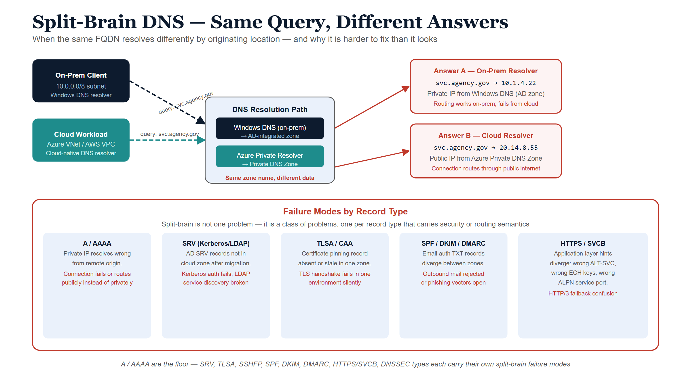
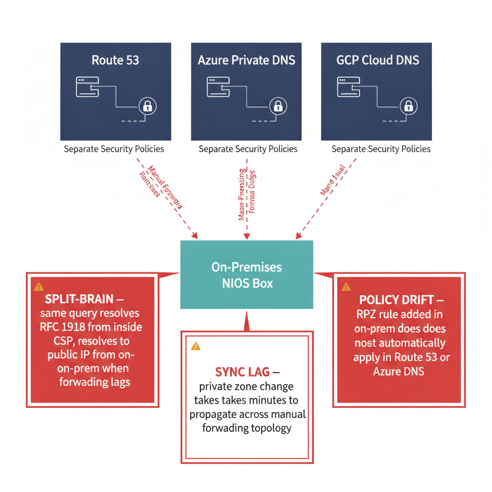
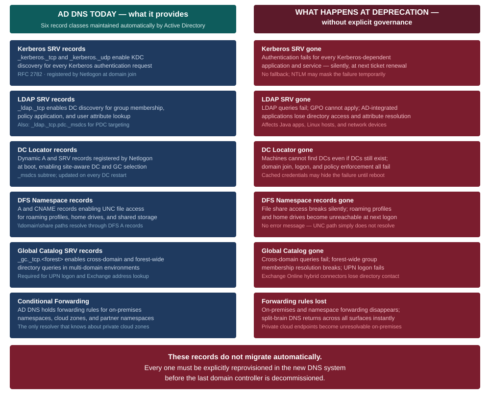
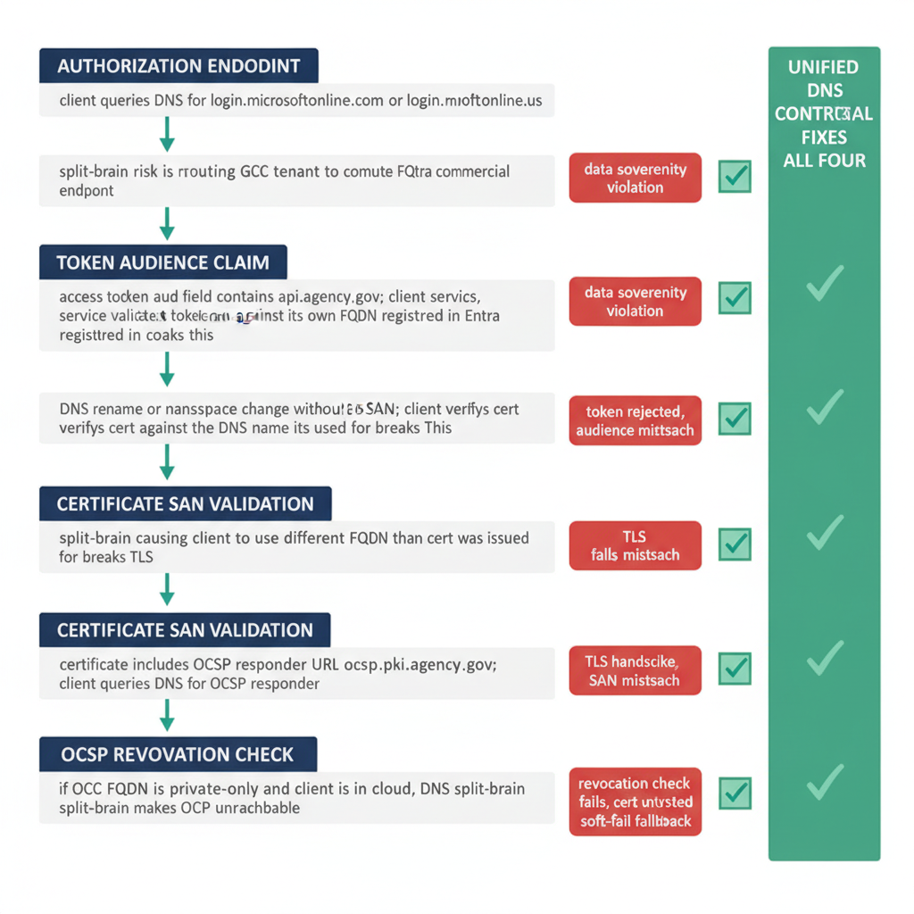
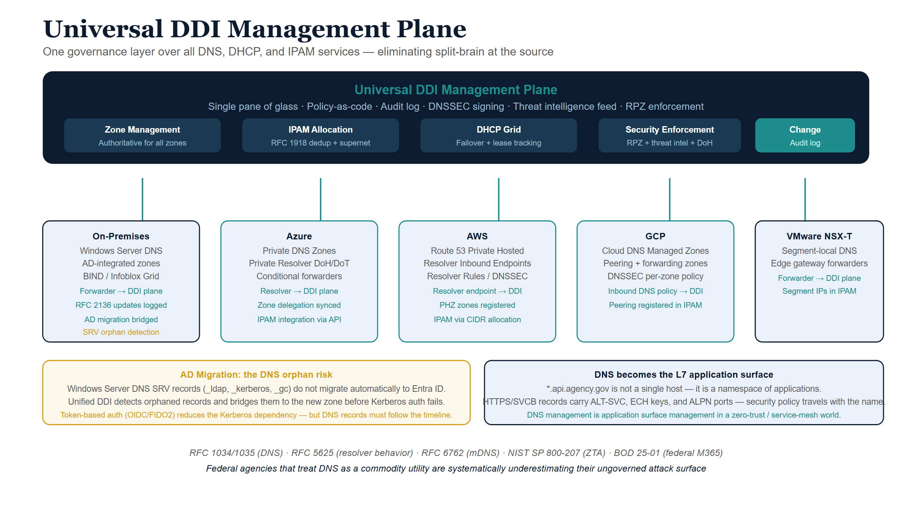
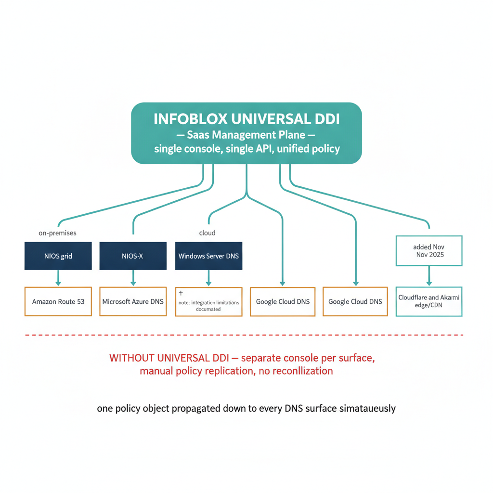
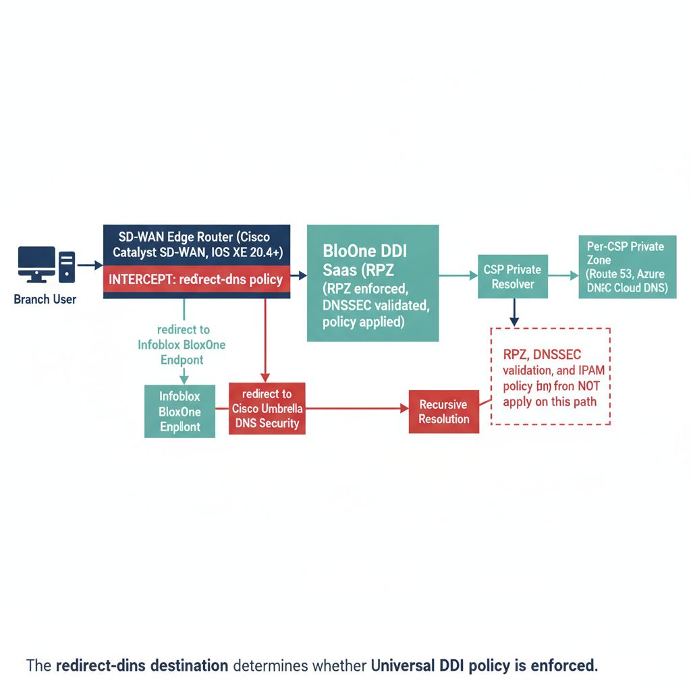
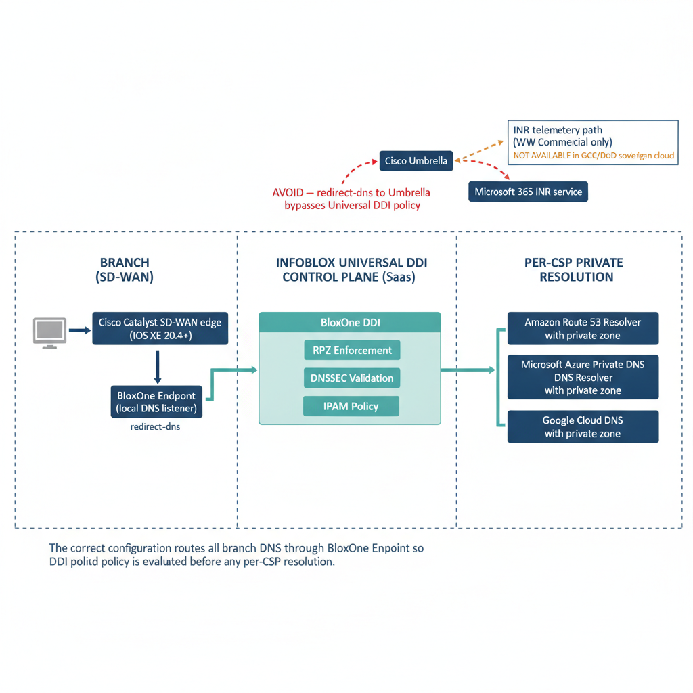

# Next Generation DNS {.unnumbered}

::: {.callout-tip appearance="simple"}
**[Download this whitepaper as DOCX](infoblox-hybrid-dns-unified-ddi.docx)** — a
Word copy of this page, regenerated on every site deploy. (Also available from
the **Other Formats** link in the page sidebar.)
:::

::: {.callout-note}
## In this whitepaper

DNS was designed in 1983 to answer one question: what is the IP address for
this hostname? Four decades later, it answers a much larger set of questions —
and federal agencies that treat DNS as a commodity network utility are
systematically underestimating how much of their security posture, application
availability, certificate trust chain, and identity infrastructure now depends
on DNS being correct, consistent, and governed.

This paper makes ten arguments, one per part. Taken together, they describe
a discipline that has quietly become the most consequential ungoverned surface
in the federal enterprise:

1. Every major cloud provider and on-premises virtualization platform ships
   its own independent DNS service. The aggregate result is a fragmented DNS
   landscape that no single team manages end-to-end.

2. When DNS is fragmented, a class of failure called **split-brain DNS** emerges:
   the same query resolves to different answers depending on where it originates.
   This breaks private IP addressing, public SaaS endpoint selection, and
   security policy enforcement simultaneously.

3. DNS is not a single record type — it is a protocol with more than fifty
   standardized record types, at least fifteen of which are directly relevant
   to federal security, certificate governance, email authentication, and
   application-aware routing. A/AAAA/CNAME are the floor, not the ceiling.
   SRV, CAA, TLSA, SSHFP, SPF, DKIM, DMARC, HTTPS/SVCB, and DNSSEC types
   each carry their own split-brain failure modes.

4. Active Directory has served as the hidden DNS substrate for on-premises
   federal networks for twenty years. As Microsoft deprecates AD and agencies
   migrate to Entra ID, the DNS records AD maintained — service locators,
   Kerberos targets, LDAP endpoints — do not migrate automatically. This
   creates a category of DNS orphaning that is not yet widely understood.

5. As Kerberos is replaced by token-based authentication, DNS does not become
   less important — it becomes more so. Token audience claims reference FQDNs.
   Certificate Subject Alternative Names reference FQDNs. OCSP validation
   endpoints are FQDNs. A split-brain DNS condition in a token/PKI environment
   produces certificate validation failures that are significantly harder to
   diagnose than Kerberos authentication failures.

6. As agencies transition from Layer 4 session networking to Layer 7
   application networking — service meshes, API gateways, zero trust proxies —
   DNS subdomains become the definition of the application surface. A wildcard
   DNS entry (`*.api.agency.gov`) now describes a namespace of applications,
   not a single host. DNS management is application surface management.

7. Infoblox Universal DDI is the industry's most complete answer to this
   governance problem. Its IPAM, DNS, and DHCP management capabilities span
   on-premises NIOS, all three major CSPs, and edge providers — and its
   security feature set (RPZ, DNSSEC, BloxOne Threat Defense) applies policy
   consistently across every surface it manages.

8. Cisco Catalyst SD-WAN — the only Microsoft-certified INR partner —
   intercepts DNS at the branch in ways that can silently bypass the Infoblox
   policy plane if not correctly configured. This interaction is undocumented
   by either vendor.

9. Federal agencies operating in GCC Moderate, GCC High, or DoD sovereign
   cloud environments cannot use Microsoft INR. The Infoblox DDI architecture
   is unchanged; only the SD-WAN telemetry loop is absent.

   For the per-CSP implementation of the architecture this paper argues for —
   landing-zone-level Infoblox DDI build-out on Azure, AWS, GCP, OCI, and
   VMware with a governed ServiceNow front door — see the companion
   [Volume VIII — Multi-Cloud DDI Landing-Zone Automation](../orgcomp-series/Vol_VIII_Book_00_OrgComp_DDI_Automation_Overview.qmd)
   of the Federal Organization Compliance series.

10. A complete reference architecture unifying all of the above — ten-part
    governance model, record type surface, AD DNS departure, cert-DNS surface,
    Layer 7 application namespace, Infoblox DDI management plane, and SD-WAN
    interception chain — does not exist in any vendor publication. It is
    synthesized here from first principles, vendor documentation, and RFC-level
    behavior.

The reference architecture in Part 10 does not exist in any vendor publication.
It is synthesized here from first principles, vendor documentation, and
RFC-level behavior.
:::

::: {.callout-important}
## Scope boundary — Cisco Catalyst SD-WAN only

The SD-WAN DNS interception analysis in Part 8 (Cisco Catalyst SD-WAN DNS Interception) addresses exclusively
**Cisco Catalyst SD-WAN (IOS XE SD-WAN ≥ 20.4/17.4)**, which as of the
Microsoft Learn INR documentation (updated 2026-03-10) is the only SD-WAN
vendor listed in the INR "Currently enabled solutions" table. No other SD-WAN
vendor is covered.
:::

---

{#fig-infoblox-diagram-01 fig-alt="DNS landscape diagram showing four platform islands in top row: On-Premises/AD DNS navy, Azure DNS teal, AWS Route 53 teal, GCP Cloud DNS teal. Below them a red-bordered split-brain failure zone listing four failure types: Private IP resolution breaks cross-cloud, SaaS endpoint returns wrong region, Certificate OCSP/TLSA validation fails silently, Security policy enforcement diverges by origin. Bottom section shows Unified DDI target state as ice-blue panel with four white cards: Single Management Plane, IPAM Consistency, DNS Security, AD Migration Bridge, plus a navy badge showing 15 plus relevant record types. White background." width="100%"}

## Part 1 — DNS in the Modern Hybrid Multi-Cloud Enterprise

### 1.1 What DNS was designed to do

The Domain Name System was specified in RFC 1034 and RFC 1035 in November 1983.
Its purpose was straightforward: allow humans to use memorable hostnames
(`www.example.com`) instead of numeric IP addresses (`93.184.216.34`), and
give network operators a distributed, hierarchical database to publish those
mappings. DNS resolved names to addresses. That was the whole job.

The protocol was designed for a world where every networked device had one
IP address, every service lived on a known host, and the boundary between
"inside" and "outside" a network was a physical wire. The recursive resolver
in a university computer center forwarded queries to authoritative name servers
on the internet; those servers answered; the answer was cached and served to
local clients. The model was elegant, scalable, and sufficient for its era.

That era ended.

### 1.2 What DNS has become

In a modern federal hybrid multi-cloud environment, DNS performs a list of
functions its designers did not anticipate:

**Private address publication.** Cloud platforms publish RFC 1918 addresses
for private endpoints, internal load balancers, and inter-service communication
through DNS. These addresses are meaningless — and unreachable — from outside
the network boundary where they were assigned. DNS must answer differently
depending on where the query comes from.

**Public SaaS endpoint selection.** Services like Microsoft 365 use DNS to
direct clients to the correct cloud environment. A GCC Moderate tenant must
resolve `outlook.office365.com` to GCC endpoints, not commercial endpoints.
The DNS answer determines which data sovereignty boundary the traffic crosses.

**Security policy enforcement.** DNS is now a control plane for threat
prevention. Response Policy Zones (RPZ) block malicious domains before a
connection is established. DNS Firewall rules in AWS Route 53, Azure DNS,
and GCP Cloud DNS filter traffic at the resolution layer. Infoblox BloxOne
Threat Defense uses DNS to detect data exfiltration, command-and-control
communications, and domain generation algorithm (DGA) activity.

**Certificate validation.** Online Certificate Status Protocol (OCSP)
responders and Certificate Revocation List (CRL) distribution points are
DNS names. A certificate's validity chain includes DNS lookups that must
succeed and resolve consistently for the chain to verify.

**Service identity.** In a zero trust architecture, the FQDN is the service
identity — not the IP address. A service mesh routes traffic to
`payments.internal.agency.gov`, not to `10.0.42.17`. The IP is ephemeral;
the FQDN is the stable identity that policy, certificates, and audit logs
reference.

**Application surface definition.** Wildcard DNS entries define namespaces
of applications. `*.api.agency.gov` is not a single host — it is a surface
declaration that any subdomain of `api.agency.gov` is a valid application
endpoint. API gateways, WAF rules, certificate SANs, and zero trust policies
are written against this surface.

DNS is no longer a name-lookup utility. It is the identity substrate, the
security enforcement plane, and the application surface definition layer of
the modern enterprise. Governing it is not an IT operations task — it is a
strategic security and architecture task.

### 1.3 The hybrid multi-cloud DNS landscape

Federal agencies do not choose to manage DNS in five places. The fragmentation
is an emergent property of how cloud platforms were adopted. Each platform
ships its own DNS service because DNS is the connective tissue of everything
else the platform does. Decoupling DNS from the cloud platform requires
deliberate architectural work that the platform's default experience does
not encourage.

The result, for most federal agencies today, is a DNS estate that spans:

- **On-premises:** Active Directory-integrated DNS (Windows Server DNS managed
  by AD) and/or Infoblox NIOS
- **AWS:** Amazon Route 53 (public and private hosted zones) with Route 53
  Resolver for hybrid forwarding
- **Azure:** Azure Private DNS zones linked to virtual networks, fronted by
  Azure DNS Private Resolver
- **GCP:** Google Cloud DNS with private zones and DNS peering
- **VMware NSX-T:** NSX-T DNS Service per logical segment, layered over
  vSphere DNS and AD integration

Each of these operates independently. Each has its own console, its own API,
its own zone model, and its own behavior under failure. None of them was
designed to share policy with the others.

{#fig-multi-cloud-topology fig-alt="Architecture diagram on a white background showing five independent DNS bubbles arranged around a central hub labeled YOUR AGENCY NETWORK. Each bubble is a rounded rectangle with a distinct color band at top. Top-left bubble labeled ON-PREMISES: Active Directory DNS (Windows Server DNS, SRV records, DC locator, Kerberos targets) and Infoblox NIOS (DDI management, RPZ, DNSSEC), connected by navy line. Top-right bubble labeled AWS: Route 53 Public Hosted Zones, Route 53 Private Hosted Zones, Resolver Inbound and Outbound Endpoints, DNS Firewall Rules. Middle-right bubble labeled AZURE: Azure Public DNS, Azure Private DNS Zones with VNet links, Azure DNS Private Resolver with inbound and outbound endpoints. Bottom-right bubble labeled GCP: Cloud DNS public zones, Cloud DNS private zones with DNS peering, Response Policy Zones, inbound server policy. Bottom-left bubble labeled VMWARE NSX-T: NSX-T DNS Forwarding Service per segment, vSphere DNS, Workload Domain DNS. Each bubble has a console icon and a padlock showing independent policy. Between every pair of bubbles, a red dashed double-headed arrow labeled NO SHARED STATE — manual forwarding rules only. Caption: five independent DNS control planes, zero shared policy objects, zero automatic synchronization. White background, navy #1F3A5F, teal #1A9E8F, amber #D4860B, red #C0392B." width="100%"}

### 1.4 How each platform implements DNS

Understanding why unified management is necessary requires understanding what
each platform's DNS service actually does — and where its behavior diverges
from the others.

**AWS Route 53** operates as both a public authoritative DNS service and a
private resolver infrastructure. Public hosted zones are authoritative for
internet-visible domains. Private hosted zones are authoritative for names
that should resolve only within a VPC. The Route 53 Resolver provides inbound
endpoints (for on-premises queries entering AWS) and outbound endpoints (for
AWS-originating queries leaving to on-premises or other CSPs). Outbound
Resolver rules define which namespaces are forwarded where. Route 53 Resolver
DNS Firewall applies domain-level block/allow rules to outbound queries. Each
of these components — hosted zones, Resolver, DNS Firewall rules — is
configured independently in the AWS console or CLI.

**Azure Private DNS** zones are sovereign: they do not exist in a global
hierarchy. They are linked to virtual networks via DNS zone links, and
resolution of a private zone's records is available only to VMs in a linked
VNet. Azure DNS Private Resolver provides inbound and outbound endpoints —
the inbound endpoint accepts queries from on-premises or other networks,
the outbound endpoint forwards queries to designated servers. Forwarding
rulesets on the outbound endpoint define per-namespace forwarding rules.
Private endpoint FQDNs (such as `storageaccount.blob.core.windows.net`)
resolve to RFC 1918 addresses only when the query arrives via an inbound
endpoint linked to a VNet that has the private endpoint. The same query
from outside that path resolves to a public IP. This is the structural root
of the Azure split-brain problem.

**GCP Cloud DNS** private zones are associated with VPC networks. Resolution
is handled by the metadata server at `169.254.169.254` within the VPC — a
well-known RFC 3927 link-local address that Google's hypervisor intercepts.
DNS peering allows a private zone in one VPC to be visible to another. An
inbound server policy adds a regional forwarding endpoint that accepts queries
from on-premises or other networks. GCP Cloud DNS supports Response Policy
Zones (functionally equivalent to Infoblox RPZ) for DNS-layer security
enforcement — an important distinction from Azure, which has no equivalent
native RPZ mechanism.

**VMware NSX-T DNS Service** operates at the logical segment level. The NSX-T
DNS Service is a gateway-level forwarder deployed on the Tier-1 or Tier-0
gateway; it intercepts DNS queries from workloads on managed segments and
forwards them to designated upstream resolvers. Multiple DNS service profiles
can be configured, each pointing to different forwarders for different
namespaces. This creates a DNS topology where the resolver a workload uses
is determined by which NSX-T segment it lives on — behavior that is entirely
opaque from the perspective of the on-premises DNS console. vSphere clusters
that are AD-joined use AD DNS directly; NSX-T managed workloads may or may
not, depending on how the DNS service profile is configured.

### 1.5 The management burden of independence

Managing these five DNS systems independently requires five distinct skill
sets, five separate operational playbooks, and five separate security posture
reviews. When a new private endpoint is provisioned in Azure, the engineer
provisioning it must also update the Azure Private DNS zone link, the
Azure DNS Private Resolver forwarding ruleset, the Route 53 outbound resolver
rule (if AWS workloads need to reach the endpoint), and the Infoblox NIOS
conditional forwarding configuration (if on-premises workloads need to reach
it). The provisioning step is one action; the DNS synchronization it requires
is four more, on four different consoles, with four different syntaxes.

No organization has a team that owns all five of those operations simultaneously.
The natural ownership boundary is: cloud team owns CSP DNS, network team owns
NIOS, Windows team owns AD DNS. The DNS that crosses those ownership boundaries —
the forwarding rules that connect them — typically falls into the gap between all
three teams.

---

## Part 2 — Split-Brain DNS: The Structural Problem

{#fig-infoblox-diagram-02 fig-alt="Split-brain DNS failure diagram. Left side shows two clients: On-Prem Client in navy box and Cloud Workload in teal box, each sending the query svc.agency.gov via dashed arrows to a DNS Resolution Path box. The resolution path box shows two resolvers: Windows DNS AD-integrated zone and Azure Private Resolver Private DNS Zone with a red warning Same zone name, different data. Right side shows two red-bordered answer boxes: Answer A from on-prem resolver returns private IP 10.1.4.22 with note routing fails from cloud; Answer B from cloud resolver returns public IP 20.14.8.55 with note connection routes through public internet. Bottom section shows five failure mode cards in ice blue: A/AAAA private IP wrong, SRV Kerberos/LDAP orphan, TLSA/CAA certificate pinning fails, SPF/DKIM/DMARC email auth diverges, HTTPS/SVCB application hints diverge. White background, navy teal red palette." width="100%"}

### 2.1 What split-brain DNS is

Split-brain DNS is the condition where a DNS query for the same name returns
different answers depending on where the query originates. The name is
correct — it maps to the right host in both cases — but the two answers point
to different addresses, and the difference in address determines whether the
traffic reaches its intended destination.

Split-brain is not a bug. It is often an intentional design: the same public
FQDN resolves to an RFC 1918 address for internal callers and a public IP
for external callers. That is a legitimate and common pattern. The problem
arises when the two views are inconsistent in ways that are not intentional —
when the internal view is stale, when the external view is incorrect for some
callers but not others, or when a security policy (RPZ block, DNS Firewall
rule) applies in one view but not the other.

In a hybrid multi-cloud environment managed with independent per-CSP DNS,
unintentional split-brain is structurally guaranteed. The independent DNS
systems diverge because they have no mechanism to stay consistent.

### 2.2 Private IP split-brain: the cross-cloud case

The clearest example of private IP split-brain is the Azure Private Endpoint
case. When an Azure Storage account is configured with a private endpoint,
Azure creates a DNS record in the `privatelink.blob.core.windows.net` private
zone that resolves the storage account's FQDN to a VNet-scoped RFC 1918
address — say `10.1.0.4`. Within the VNet, any query for
`storageaccount.blob.core.windows.net` resolves to `10.1.0.4`. Traffic stays
on the private network.

For an EC2 instance in AWS to reach the same storage account via its private
endpoint, the Route 53 outbound resolver must have a forwarding rule for
`privatelink.blob.core.windows.net` that directs queries to the Azure DNS
Private Resolver inbound endpoint. If that rule exists and is current, the
EC2 instance resolves the private endpoint correctly. If the rule is absent
or outdated, Route 53 falls through to public recursive resolution, the
storage account resolves to a public IP, and the EC2 instance either connects
over the public internet (bypassing private endpoint security controls) or
is blocked by the storage account's network access rules.

The failure is intermittent because the public FQDN resolves successfully —
just to the wrong address. The application layer sees a connection; the
network layer completes it. The fact that the traffic is not taking the
intended private path is invisible without explicit DNS query logging and
traffic flow analysis.

{#fig-per-csp-failure fig-alt="Blueprint diagram on a white background. Left half labeled PRIVATE IP SPLIT-BRAIN. Shows two query paths from different origins to Azure Private Endpoint storageaccount.blob.core.windows.net. Path A from on-premises or AWS EC2 without correct forwarding rule resolves via public recursive DNS to public IP 52.x.x.x, red label WRONG — bypasses private endpoint. Path B from Azure VNet with Private DNS zone linked resolves to 10.1.0.4, teal label CORRECT — private endpoint reached. Right half labeled PUBLIC SAAS SPLIT-BRAIN (M365). Shows same query outlook.office365.com resolved from two paths: Path A with no GCC forwarding resolves to commercial Microsoft 365 endpoint, red label WRONG — data sovereignty violation for GCC tenant. Path B with correct GCC DNS forwarding resolves to GCC endpoint, teal label CORRECT. Between the two halves a navy divider. Red callout at bottom: same FQDN, same query — different answer by query origin. This is split-brain. White background, navy #1F3A5F, teal #1A9E8F, red #C0392B." width="100%"}

### 2.3 Public SaaS split-brain: Microsoft 365 and sovereign cloud

Microsoft 365 presents a different form of split-brain that is particularly
consequential for federal agencies. M365 uses DNS to route clients to the
correct service endpoint — commercial, GCC Moderate, GCC High, or DoD. The
FQDNs are identical across environments (e.g., `outlook.office365.com`);
the DNS answers that clients receive determine which infrastructure they
connect to.

For a GCC Moderate tenant, M365 traffic must resolve to GCC endpoints.
This is enforced by DNS: Microsoft publishes different IP ranges for GCC
vs. commercial, and the expectation is that agency DNS infrastructure
resolves M365 FQDNs to the correct range. In practice, the agency's DNS
forwarders typically resolve M365 FQDNs via public recursive resolution,
which returns the anycast IP closest to the resolver — not necessarily the
GCC endpoint.

The result is that M365 DNS resolution for GCC tenants is often implicitly
correct (because Microsoft routes GCC tenants to GCC endpoints at the
application layer even if the client connects via a commercial IP) — but
it is not *explicitly governed*. When configuration changes, network path
changes, or conditional access policies enforce GCC-specific IP restrictions,
the implicit behavior breaks and the failure surfaces as authentication
failures or access denials that appear to have nothing to do with DNS.

Governing M365 endpoint selection via DNS — configuring conditional forwarding
or DNS policies that explicitly route M365 namespaces to the correct endpoints —
is the correct answer, and it requires a DNS management plane that covers both
on-premises resolvers and the cloud DNS services that branch users reach first.

### 2.4 Security policy split-brain: the invisible gap

DNS security policy — Response Policy Zones, DNS Firewall rules, block lists —
enforces at the resolver. If a malicious domain is blocked in Infoblox NIOS
but not in Route 53 DNS Firewall, workloads on EC2 instances that use Route 53
as their resolver are unprotected. If an RPZ block is applied in GCP Cloud DNS
Response Policy Zones but not in Azure, Azure-hosted workloads are unprotected.

The per-CSP model produces a security posture that is the *intersection* of
all five DNS security policies — meaning it is only as strong as the weakest
system. Because policy replication across five independent DNS systems is
manual, the intersection is never exactly equal. The systems diverge over time
as each is updated independently.

This is not merely a compliance gap. DNS-layer threat detection is one of the
most effective early-warning mechanisms for supply chain compromise, ransomware
pre-positioning, and data exfiltration — precisely because malicious actors
rely on DNS for command-and-control and staging infrastructure. A DNS security
policy that applies only to queries that reach NIOS provides no protection
for the majority of cloud-native queries that never touch NIOS.

### 2.5 Why process discipline cannot fix a structural problem

The standard response to split-brain DNS in a per-CSP model is process: write
a runbook, require engineers to update all five DNS systems when any DNS change
is made, and audit compliance. This response fails for three reasons.

First, the failure mode is silent. When a Route 53 forwarding rule is not
updated after an Azure private endpoint changes IP, no alarm fires. The
divergence accumulates quietly until a workload that happens to query from
AWS fails — and the failure looks like a network problem, not a DNS problem.

Second, the change surface is too large. Every private endpoint provisioning,
every IP address reassignment, every new workload deployment has DNS
implications across all five systems. In a large federal estate with dozens of
teams provisioning cloud resources, the rate of DNS changes exceeds any manual
synchronization process's ability to keep up.

Third, the five systems have different APIs, different rate limits, different
propagation delays, and different consistency models. Even a fully automated
synchronization process must solve the ordering and conflict-resolution problems
that arise when the five systems update at different speeds.

The only structural fix is a unified control plane that holds the authoritative
policy objects and propagates them to all five surfaces simultaneously — so that
the question of whether Route 53 has the current forwarding rules is answered
by the control plane, not by manual audit.

---

## Part 3 — The Modern DNS Record Catalog: Types, Security Integration, and Application-Aware Routing

DNS is most commonly described through its two workhorse record types — A and CNAME. But the modern DNS protocol supports more than fifty standardized record types, and at least fifteen of them are directly relevant to federal hybrid multi-cloud security, certificate governance, application-aware routing, and threat defense. This part provides a practitioner-level catalog of those record types, organized by function, with specific attention to how each integrates with security enforcement, certificate infrastructure, and Layer 7 routing systems.

### 3.1 Address and Alias Records

These records perform the core function DNS was designed for: mapping names to addresses or other names.

**A (Address, RFC 1035).** Maps a hostname to an IPv4 address. The fundamental record type. In a hybrid multi-cloud environment, A records are published by every DNS surface — NIOS, Route 53, Azure DNS, GCP Cloud DNS — and the inconsistency of those publications across surfaces is the structural cause of split-brain DNS. A records are the unit of inconsistency. Every private endpoint in AWS (VPC Resolver), Azure (Private DNS Zone), and GCP (Cloud DNS private zone) is ultimately an A record, and the split-brain condition manifests as the same A record returning different answers on different surfaces.

**AAAA (IPv6 Address, RFC 3596).** Maps a hostname to an IPv6 address. IPv6 is mandatory in federal environments under OMB M-21-07. In practice, many federal hybrid environments run dual-stack, meaning both A and AAAA records must be consistently published across all DNS surfaces. The governance complexity doubles: a split-brain condition in IPv6 space is often invisible to diagnostic tools that default to testing IPv4 resolution.

**CNAME (Canonical Name, RFC 1034).** Aliases one name to another. CNAME is prohibited at the zone apex (RFC 1034 §3.6.2) — you cannot create a CNAME for `agency.gov` itself, only for subdomains. This restriction creates real problems for load balancing and CDN integration, where operators want to alias the apex domain to a CDN endpoint. CNAME interaction with security records is also important: a CNAME chain delays resolution (each hop requires a new lookup), and a CNAME pointing into an attacker-controlled zone creates a dangling DNS record vulnerability (subdomain takeover). CNAME coexistence with DNSSEC records requires careful handling.

**ALIAS / ANAME (non-standard, widely implemented).** Infoblox NIOS, AWS Route 53 (where it is called an "Alias record"), Azure DNS ("Alias record set"), and most modern authoritative servers implement a pseudo-record type that resolves a CNAME-like reference at the zone apex. These records are synthesized as A/AAAA records at query time, avoiding the zone-apex restriction. They are not standardized in any RFC and their behavior varies between implementations — a governance gap when the same zone is managed across multiple surfaces.

**PTR (Pointer, RFC 1035).** Maps an IP address to a hostname, in the `in-addr.arpa.` (IPv4) or `ip6.arpa.` (IPv6) reverse zone. PTR records are the most commonly neglected DNS record type in cloud environments. They matter for: (1) email deliverability — sending MTAs that lack reverse DNS are frequently rejected or spam-scored; (2) security logging — SIEM rules that resolve source IPs to hostnames rely on PTR records; (3) LDAP/Kerberos — some Kerberos implementations perform reverse lookup to validate the client host during authentication; (4) compliance — NIST CSF logging requirements implicitly assume that log entries can be attributed to a named host. Cloud-managed private IP space requires explicit PTR record management, which Infoblox IPAM automates as part of address allocation.

### 3.2 Service Discovery Records

**SRV (Service, RFC 2782).** Maps a service name and transport protocol to a host and port, with priority and weight fields for load balancing. The SRV record format is:

```
_service._proto.name. TTL IN SRV priority weight port target.
```

SRV records are the most security-consequential record type in Active Directory environments, and the most underestimated in the context of AD deprecation. Active Directory publishes SRV records for:

- `_kerberos._tcp.<domain>` — points clients to Kerberos KDC servers
- `_kerberos._udp.<domain>` — same, for UDP
- `_ldap._tcp.<domain>` — points clients and applications to LDAP servers
- `_ldap._tcp.dc._msdcs.<domain>` — DC locator records; every domain-joined machine uses these at startup
- `_gc._tcp.<forest>` — Global Catalog servers
- `_kpasswd._tcp.<domain>` — Kerberos password change protocol
- `_ldap._tcp.pdc._msdcs.<domain>` — Primary Domain Controller
- `_msdcs.<domain>` — entire subtree of AD-specific service records

When Active Directory is deprecated, none of these records migrate automatically. Applications that perform SRV lookups for LDAP or Kerberos — including many legacy Java applications, Linux hosts joined to AD, and network devices — begin failing silently or with cryptic errors when the SRV records disappear. Part 4 covers this in detail; the key point here is that SRV records are the DNS-layer representation of service topology, and their lifecycle must be governed independently of the servers they point to.

Beyond Active Directory, SRV records are used by:

- **SIP and VoIP** (`_sip._tls`, `_sips._tcp`) — UCaaS platforms and telephony trunks use SRV for endpoint discovery; Cisco Unified Communications Manager, Microsoft Teams Direct Routing, and Zoom Phone all publish or consume SRV records
- **XMPP/Jabber** (`_xmpp-client._tcp`, `_xmpp-server._tcp`) — still used in some federal agencies for secure messaging
- **IMAP/POP/SMTP** (`_imap._tcp`, `_imaps._tcp`, `_smtp._tcp`) — email client autoconfiguration
- **Application-aware routing** — service meshes such as Istio and Consul use SRV records (or their own equivalent discovery protocols) for service endpoint registration; Cisco SD-WAN application-aware routing can consume DNS SRV data for FQDN-based path selection

**NAPTR (Naming Authority Pointer, RFC 3403).** Used primarily in VoIP and telephony. NAPTR records provide regular-expression-based rewriting of URIs, enabling E.164 phone numbers to be resolved to SIP URIs through the ENUM protocol (RFC 6116). In federal environments, NAPTR records appear in: (1) Cisco Unified Communications Manager integration with PSTN; (2) E911 routing, where the query `_e911._udp.agency.gov` or an ENUM lookup resolves to an emergency service routing target; (3) some UCaaS integration patterns for Microsoft Teams Phone. NAPTR records interact with SRV records in the resolution chain: a NAPTR record may rewrite a URI and then reference an SRV record for the resulting service name.

### 3.3 Certificate Governance Records

These records exist to govern certificate issuance and establish cryptographic trust through DNS.

**CAA (Certification Authority Authorization, RFC 8659).** Published in the zone served by the domain's authoritative DNS. Specifies which Certificate Authorities are authorized to issue certificates for the domain. The record has three tag types:
- `issue` — which CA may issue single-name or SAN certificates
- `issuewild` — which CA may issue wildcard certificates (can be more restrictive than `issue`)
- `iodef` — where to report unauthorized issuance attempts (an email or HTTPS URL)

CAA records are now mandatory: every public CA that is a member of the CA/Browser Forum must check CAA records before issuance (CA/B Forum Baseline Requirements §3.2.2.8, effective 2017). A CAA record mismatch causes certificate issuance to fail, which in a poorly governed DNS environment means certificate renewal failures that are blamed on the CA rather than on the DNS record.

In a hybrid multi-cloud split-brain environment, CAA records present a specific governance problem: if the authoritative DNS for `agency.gov` is managed by one system but private zones in AWS and Azure have local overrides, a cloud workload that queries its local resolver may receive a different (or missing) CAA record than the authoritative server publishes. This does not affect most issuance workflows (which query the public authoritative server), but it does affect internal ACME-based certificate automation that runs inside the private cloud environment.

**TLSA (TLS Authentication, RFC 6698) / DANE (DNS-Based Authentication of Named Entities).** Associates a TLS certificate or public key directly with a DNS name, allowing clients to validate TLS certificates through DNS rather than relying solely on the CA hierarchy. A TLSA record specifies: (1) Usage — whether the record pins an end-entity cert, an intermediate CA, a trust anchor, or pins any cert matching a public key; (2) Selector — whether to match the full certificate or only the public key; (3) Matching type — exact match, SHA-256, or SHA-512.

DANE/TLSA is significant for federal environments because it provides a second layer of TLS validation that does not depend on commercial CAs. An agency that operates its own CA hierarchy can publish TLSA records to assert that only certs issued by its own CA are valid for a given FQDN — even if a commercial CA could theoretically issue a certificate for the same name. **DNSSEC is required for DANE to be meaningful**: without DNSSEC, a TLSA record can be spoofed, eliminating the security benefit. This creates a chain: DANE → DNSSEC → authoritative DNS consistency across all surfaces.

**SSHFP (SSH Fingerprint, RFC 4255).** Associates an SSH host key fingerprint with a DNS name. Allows SSH clients to verify host keys through DNS rather than through the `known_hosts` file. Like DANE, SSHFP requires DNSSEC to be meaningful: without DNSSEC signing, the SSHFP record can be spoofed, replacing a legitimate fingerprint with an attacker's key. In a federal zero trust context, SSHFP provides a DNS-layer binding between a hostname and its cryptographic identity, analogous to what certificate SANs do for TLS.

**SMIMEA (S/MIME Certificate Association, RFC 8162).** Associates an S/MIME certificate with an email address, enabling certificate discovery for encrypted email without requiring a central directory. Published in the `_smimecert` subdomain of the email domain. Requires DNSSEC. Less widely deployed than TLSA or SSHFP, but relevant for agencies that operate S/MIME encrypted email between departments.

### 3.4 Email Authentication Records

Email authentication in DNS has evolved from a single TXT record to a layered ecosystem of five complementary mechanisms. All are published as TXT records or CNAME redirects; none require a new record type. Their complexity and interdependency make email authentication one of the most frequently misconfigured DNS surfaces in federal environments.

**SPF (Sender Policy Framework, RFC 7208).** A TXT record published at the domain apex (or a subdomain used as an email sender) that lists the IP addresses and hostnames authorized to send mail on behalf of the domain. The record uses a purpose-specific syntax (`v=spf1 include:... -all`). SPF has three well-known governance failure modes in multi-cloud environments:

1. **Multiple SPF records** — RFC 7208 §3.2 states exactly one SPF TXT record is permitted per domain; two records cause a permanent SPF failure. When cloud services (Microsoft 365, Salesforce, SendGrid) each add their own SPF includes, agencies frequently end up with multiple TXT records or exceed the 10-lookup limit.
2. **Lookup limit** — SPF processing may make at most 10 DNS lookups (for `include:`, `a:`, `mx:`, `ptr:`, `exists:` mechanisms). Modern cloud environments with multiple SaaS senders exceed this limit, causing SPF to fail during evaluation.
3. **Split-brain interaction** — an SPF TXT record that resolves differently on internal and external resolvers causes mail from internal relay hosts to fail SPF evaluation at receiving MTAs.

**DKIM (DomainKeys Identified Mail, RFC 6376).** A TXT record published at `<selector>._domainkey.<domain>` that contains the public key corresponding to the private key used to sign outgoing email. The receiving MTA fetches this TXT record, verifies the signature in the email header, and confirms that the body and headers were not modified in transit. DKIM selectors allow multiple concurrent keys (for key rotation and multiple sending systems). DKIM has no lookup limit issues; its primary governance challenges are key rotation (the private key lives in the mail system; the public key in DNS must be updated simultaneously) and orphaned selectors (selectors that remain published in DNS after the corresponding mail system is decommissioned, presenting a potential key misuse risk).

**DMARC (Domain-based Message Authentication, Reporting and Conformance, RFC 7489).** A TXT record published at `_dmarc.<domain>` that tells receiving MTAs what to do when SPF and/or DKIM fail, and where to send aggregate and forensic reports. DMARC policy has three settings: `none` (monitor only), `quarantine` (move to spam), and `reject` (discard). CISA BOD 18-01 requires federal agencies to implement DMARC at `p=reject` for all second-level domains. DMARC reporting provides the only mechanism for an agency to discover unauthorized use of its domain as a spoofed sender, because the aggregate reports show all mail sources claiming to be from the domain, including attackers.

**BIMI (Brand Indicators for Message Identification, IETF draft / AuthIndicators WG).** A TXT record at `default._bimi.<domain>` that points to an SVG logo file and optionally a Verified Mark Certificate (VMC). When DMARC is at `p=reject` and BIMI is properly configured, supported email clients (Gmail, Apple Mail, Yahoo) display the agency logo next to email from the domain. VMC issuance requires that DMARC be at enforcement (`quarantine` or `reject`). BIMI is an emerging standard; major federal agencies with constituent-facing communications are beginning to evaluate it.

**MTA-STS (Mail Transfer Agent Strict Transport Security, RFC 8461).** A combination of a TXT record (`_mta-sts.<domain>`) and an HTTPS policy file (`https://mta-sts.<domain>/.well-known/mta-sts.txt`) that tells sending MTAs to use TLS when delivering to the domain and to reject delivery if TLS negotiation fails. MTA-STS eliminates opportunistic TLS downgrade attacks in SMTP. It requires that `mta-sts.<domain>` resolve to an HTTPS endpoint — adding a DNS record dependency on a web server — and that the TLS certificate on that endpoint be valid, creating an additional PKI dependency.

### 3.5 Modern Service Binding Records

**HTTPS and SVCB (Service Binding, RFC 9460, August 2023).** The most significant new DNS record types in recent history. HTTPS is a special case of SVCB optimized for HTTP/HTTPS services. These records move application-layer service negotiation — previously performed through HTTP headers, TLS extensions, and client-side configuration — into DNS.

An HTTPS record for `agency.gov` can carry:
- **ALPN (Application-Layer Protocol Negotiation)** — whether the service supports HTTP/3 (QUIC), HTTP/2, or HTTP/1.1, eliminating the round-trip needed to negotiate protocol version
- **ECH (Encrypted Client Hello) configuration** — the public key needed to encrypt the TLS ClientHello, hiding the SNI from network observers before the connection is established
- **Port mapping** — redirect to a non-standard port without requiring a browser redirect
- **IPv4 and IPv6 hints** — IP address hints to avoid a separate A/AAAA lookup, reducing latency

HTTPS records are beginning to be deployed by major providers. Cloudflare serves HTTPS records for its customers; Google serves them for Google services. From a federal agency perspective, HTTPS records are significant for three reasons:

1. **Split-brain interaction** — if HTTPS records are published on the external authoritative DNS but not in private zones, cloud workloads that query internal resolvers will not receive ECH configurations, potentially exposing TLS SNI on internal networks that have deep packet inspection
2. **Infoblox DDI management** — Infoblox Universal DDI added HTTPS/SVCB record support; managing these records consistently across surfaces requires the same unified management plane as A records
3. **HTTP/3 and QUIC adoption** — federal agencies evaluating QUIC for application performance improvements will need to govern HTTPS records as part of that adoption

### 3.6 DNSSEC Record Types

DNSSEC (DNS Security Extensions, RFC 4033/4034/4035) adds cryptographic signing to the DNS protocol. DNSSEC does not encrypt DNS queries — it provides origin authentication and data integrity. Understanding the record types it adds is essential for understanding what DNSSEC can and cannot protect.

**DNSKEY.** Published in the zone; contains the public key used to verify signatures on records in that zone. There are two types: the Zone Signing Key (ZSK), which signs individual records, and the Key Signing Key (KSK), which signs the DNSKEY RRset. The separation allows more frequent ZSK rotation (lower operational impact) while the KSK changes less often.

**DS (Delegation Signer).** Published in the parent zone; contains a hash of the child zone's KSK. The DS record is the cryptographic link between parent and child zones — it is what makes the chain of trust traversable from the root. When an agency registers a subdomain and wants DNSSEC, the DS record must be published at the parent (the registrar or the parent zone operator). In a multi-cloud environment, the DS records for delegated subdomains must be kept synchronized; if a subdomain's KSK rotates, the parent's DS record must be updated within the TTL window or DNSSEC validation fails globally.

**RRSIG (Resource Record Signature).** Accompanies every signed RRset; contains the digital signature over the record data. RRSIG records have an expiration time — this is the operational challenge of DNSSEC. If zone signing does not complete before the RRSIG validity window expires, DNSSEC-validating resolvers begin returning SERVFAIL for all records in the zone, causing complete resolution failure. Zone signing must be automated; manual signing is not operationally viable at enterprise scale.

**NSEC / NSEC3 (Next Secure).** Provides authenticated denial of existence. When a DNSSEC-validating resolver asks for a name that does not exist, the authoritative server must prove that the name does not exist — it cannot simply return NXDOMAIN without a signature, because an attacker could forge NXDOMAIN responses. NSEC chains together all existing names in the zone alphabetically, proving that nothing exists between two adjacent names. NSEC3 hashes the names before chaining, preventing zone enumeration (an attacker walking the NSEC chain to discover all names in the zone). Federal zones handling sensitive subdomain names should use NSEC3 with opt-out.

**CDS / CDNSKEY (Child DS / Child DNSKEY, RFC 7344).** Allow the child zone to signal the parent that its KSK has changed and the DS record should be updated. This automates the most error-prone step of DNSSEC key rollover — the cross-zone coordination between child zone operator and parent zone operator. Infoblox NIOS supports CDS/CDNSKEY for automated KSK rollover.

### 3.7 Security Integration Matrix

The following table summarizes how each record type integrates with the security enforcement mechanisms relevant to federal hybrid environments.

| Record Type | Requires DNSSEC | CA/PKI Integration | Split-Brain Impact | Threat Defense Relevance | App-Aware Routing |
|---|---|---|---|---|---|
| A / AAAA | No | Indirect (cert SAN match) | **High** — core private/public divergence | RPZ blocking target | FQDN-based path selection |
| CNAME | No | Indirect | **High** — dangling records, takeover | RPZ resolves chain | FQDN forwarding |
| PTR | No | No | Medium | Logging, attribution | No |
| SRV | No | No | **High** — AD deprecation orphaning | No | Service mesh discovery |
| NAPTR | No | No | Low | No | UCaaS routing |
| CAA | No | **Direct** — controls issuance | Medium | Issuance audit | No |
| TLSA/DANE | **Required** | **Direct** — cert pinning via DNS | **High** — pin must match on all surfaces | Cert validation layer | No |
| SSHFP | **Required** | SSH key binding | Medium | Host key validation | No |
| SMIMEA | **Required** | S/MIME cert discovery | Low | Encrypted email | No |
| SPF (TXT) | No | No | **High** — multi-record failures | Email spoofing defense | No |
| DKIM (TXT) | No | Indirect (key rotation) | Low | Email integrity | No |
| DMARC (TXT) | No | No | Medium | **Spoofing enforcement** | No |
| BIMI (TXT) | No | VMC cert required | Low | Brand protection | No |
| MTA-STS (TXT) | No | TLS cert required | Medium | SMTP downgrade defense | No |
| HTTPS / SVCB | No | ECH public key | **High** — ECH config missing in private | Protocol negotiation | **HTTP/3, QUIC** |
| DNSKEY | Yes (is part of) | **Direct** — zone signing | High | Zone integrity | No |
| DS | Yes (parent) | **Direct** — chain of trust | **High** — KSK rotation coordination | Chain of trust | No |
| RRSIG | Yes (is part of) | **Direct** — record signing | High | Signature freshness | No |
| NSEC3 | Yes (is part of) | No | Medium | Zone enumeration prevention | No |
| CDS/CDNSKEY | Yes | **Direct** — automated rollover | Medium | Automated key management | No |

### 3.8 Infoblox DDI and the Full Record Type Surface

Infoblox Universal DDI manages the full record type surface described above. Key capabilities per category:

- **Address records (A/AAAA/PTR):** IPAM-driven automatic A and PTR record creation on address allocation; synchronization across NIOS, Route 53, Azure DNS, GCP Cloud DNS, and Windows Server DNS
- **SRV:** Managed SRV record lifecycle, including templated creation of AD service records during domain migration and explicit orphan detection when AD is deprecated
- **CAA:** CAA record management integrated with certificate lifecycle tracking; CAA record drift alerts when issuance policy changes
- **TLSA/DANE:** TLSA record creation from certificate metadata; integration with Infoblox Certificate Authority integration; automated TLSA update on certificate renewal
- **Email authentication (SPF/DKIM/DMARC):** SPF lookup count validation (flags records that exceed the 10-lookup limit at publication time); DKIM selector management; DMARC aggregate report integration
- **HTTPS/SVCB:** Full HTTPS record management as of BloxOne DDI release; ECH configuration distribution
- **DNSSEC:** Zone signing, key generation, key rollover automation, NSEC3 with opt-out, CDS/CDNSKEY for automated parent-child coordination; DNSSEC validation enforcement on BloxOne recursive resolvers; DNSSEC validation required for BloxOne Threat Defense DANE enforcement

The governance implication: DNS record types that appear unrelated to each other — a CAA record and an SSHFP record, for example — share the same consistency requirement. If the authoritative DNS surface is fragmented across five systems, each record type is independently subject to the split-brain failure mode. Unified DDI management is the only mechanism that applies consistency governance to all of these record types simultaneously.

---

## Part 4 — The Active Directory DNS Departure

### 4.1 What Active Directory DNS actually does

For twenty years, Active Directory has been the DNS server for most federal
on-premises networks — not as an architectural choice but as a consequence of
how AD works. When a Windows domain is deployed, the domain name (e.g.,
`agency.gov` or `agency.local`) becomes a DNS zone, and the domain controllers
become the authoritative DNS servers for that zone. Every domain-joined device
queries AD DNS for everything — not just domain-specific lookups, but all
recursive resolution. AD DNS is the default resolver for every workstation,
server, and network-joined device in the enterprise.

The DNS records AD maintains are not just name-to-address mappings. AD DNS is
the backbone of Windows authentication and directory service discovery:

**SRV records for Kerberos.** `_kerberos._tcp.agency.gov` is a DNS SRV record
that points clients to Kerberos KDCs. Every Kerberos authentication starts with
a DNS query for this record. If it is missing or wrong, Kerberos fails.

**SRV records for LDAP.** `_ldap._tcp.agency.gov` points clients to domain
controllers for LDAP queries — group membership, policy application, user
attribute lookup. Every AD-aware application queries this record.

**DC locator records.** Domain controllers register a family of SRV and A
records that allow clients to find the nearest DC by site, by service, and
by capability. These records are dynamically maintained by the Netlogon service
on every DC. They are not static; they change when DCs are decommissioned,
when AD sites are reconfigured, or when DC services change.

**DFS namespace records.** Distributed File System namespaces are published
via DNS. File share access for roaming profiles, home drives, and shared
storage all depend on DNS records that AD maintains.

**GPO application.** Group Policy Objects are applied to machines in a domain.
The policy application process begins with an LDAP query for the DC, which
begins with a DNS query for the LDAP SRV record. GPO does not function if
AD DNS is not functioning.

The operational implication: AD DNS is not a service that runs alongside
the enterprise. It is the service that everything else depends on. When AD
DNS is unavailable, authentication fails, policy fails, file access fails,
and every Windows-integrated application fails simultaneously.

### 4.2 Microsoft's deprecation trajectory

Microsoft has been systematically reducing the role of Active Directory in its
modern identity architecture. The trajectory is clear:

- **Entra ID (Azure AD)** replaces AD as the identity plane for cloud and
  modern applications. Entra ID is not AD — it has no LDAP endpoint, no
  Kerberos KDC (in the traditional sense), no Group Policy, and no SRV records.
- **Entra hybrid join** connects AD-joined devices to Entra ID, but the device
  is still fundamentally AD-dependent for its core operations.
- **Entra-only join** removes the AD dependency entirely. An Entra-only joined
  device authenticates via token, not Kerberos. It does not query AD DNS for
  SRV records. It does not require a domain controller to be reachable.
- **Microsoft's published guidance** for new deployments consistently recommends
  Entra-only join, cloud-only identities, and Entra ID as the primary identity
  provider — with AD described as a legacy dependency to be eliminated over time.

The UIAO SQL Server Identity Transformation series documents this trajectory
in the context of database authentication. The pattern is universal: every
place that AD authentication is used is a deprecation candidate, and every
deprecation exposes a DNS dependency that was previously invisible.

### 4.3 What happens to DNS when AD goes away

When an agency begins decommissioning domain controllers and migrating to
Entra-only identities, the DNS records that AD maintained do not migrate
automatically. They are not exported, not converted, and not reprovisioned
in a replacement DNS server unless someone explicitly plans for it. The
records simply stop being maintained — and when the last DC is decommissioned,
they disappear.

The applications that depended on those records are not notified. They continue
to query DNS for records that no longer exist. Kerberos-dependent applications
fail. LDAP-dependent applications fail. Any application that used AD DNS
as its recursive resolver and relied on the AD-managed conditional forwarding
rules to reach on-premises services now queries a resolver that may not have
those forwarding rules configured.

{#fig-ad-dns-departure fig-alt="Two-column diagram on a white background. Left column header: AD DNS TODAY — what it provides. Six stacked navy boxes: (1) Kerberos SRV records — _kerberos._tcp and _kerberos._udp enable KDC discovery for every Kerberos authentication request; RFC 2782, registered by Netlogon at domain join. (2) LDAP SRV records — _ldap._tcp enables DC discovery for group membership, policy application, and user attribute lookup; also _ldap._tcp.pdc._msdcs for PDC targeting. (3) DC Locator records — dynamic A and SRV records registered by Netlogon at boot enabling site-aware DC and GC selection; _msdcs subtree updated on every DC restart. (4) DFS Namespace records — A and CNAME records enabling UNC file access for roaming profiles, home drives, and shared storage. (5) Global Catalog SRV records — _gc._tcp.forest enables cross-domain and forest-wide directory queries in multi-domain environments; required for UPN logon and Exchange address lookup. (6) Conditional Forwarding — AD DNS holds forwarding rules for on-premises namespaces, cloud zones, and partner namespaces; the only resolver that knows about private cloud zones. Right column header: WHAT HAPPENS AT DEPRECATION — without explicit governance. Six matching dark red boxes with consequences: Kerberos SRV gone — authentication fails silently at next ticket renewal, NTLM may mask the failure; LDAP SRV gone — LDAP queries fail, GPO cannot apply, AD-integrated apps lose directory access; DC Locator gone — machines cannot find DCs even if DCs still exist, cached credentials may hide failure until reboot; DFS Namespace records gone — file share access breaks silently, UNC path does not resolve; Global Catalog gone — cross-domain queries fail, forest-wide group membership breaks, UPN logon fails; Forwarding rules lost — split-brain DNS returns across all surfaces instantly, private cloud endpoints become unresolvable. Red banner at bottom: These records do not migrate automatically. Every one must be explicitly reprovisioned in the new DNS system before the last domain controller is decommissioned. White background, teal header #0E5C5C, navy boxes #1F3A5F, crimson boxes #7B1D2E." width="100%"}

The agencies most at risk are those that have already begun Entra migration
but have not yet established a DNS governance program outside of AD. They are
consuming AD DNS without recognizing that it is the thread holding together
their hybrid DNS topology — and when that thread is cut, the topology
collapses.

### 4.4 What must be reprovisioned before AD leaves

A DNS governance program that runs alongside AD deprecation must explicitly
account for every DNS record category that AD currently maintains:

- Kerberos and LDAP SRV records must be reprovisioned in the replacement
  DNS system for any service that will continue to use them during a transition
  period. If Kerberos is being replaced by token authentication in parallel,
  the SRV records can be allowed to expire — but the timeline must be
  coordinated, not accidental.

- DC locator records must be maintained in the replacement DNS system until
  every workload that queries for them has been migrated to Entra-only
  authentication.

- Conditional forwarding rules must be inventoried, exported, and reprovisioned
  in the replacement DNS platform. This is the most commonly missed step:
  AD DNS conditional forwarding is configured in the DNS Manager GUI and
  is not easily exported. Many agencies have no record of what conditional
  forwarding rules their AD DNS servers maintain.

- The DNS namespace itself — the internal domain (`agency.gov` or `agency.local`)
  — must be reprovisioned as a zone in the replacement DNS system. Infoblox
  NIOS is the natural landing point for this zone, but the zone must be
  explicitly created and populated, not assumed.

---

## Part 5 — Kerberos to Tokens: The Certificate-DNS Surface Problem

### 5.1 How Kerberos uses DNS

Kerberos authentication has a deep and often underappreciated dependency on
DNS. When a client authenticates to a service using Kerberos, the process
begins with a DNS lookup:

1. The client queries DNS for the KDC SRV record (`_kerberos._tcp.<realm>`)
   to find the Key Distribution Center.
2. The client requests a Ticket-Granting Ticket (TGT) from the KDC.
3. The client requests a service ticket for the target service, identified
   by its Service Principal Name (SPN).
4. The SPN includes the FQDN of the target service. The KDC validates the
   SPN against the service account registered in AD.
5. The client presents the service ticket. The service validates it by
   resolving the SPN back to an IP and confirming it matches the connection.

Every step that involves an FQDN is a DNS dependency. If the KDC SRV record
is wrong, authentication fails at step 1. If the service's FQDN does not
resolve to the server's IP, the service ticket validation fails at step 5.
If split-brain DNS causes the client and the server to resolve the same FQDN
to different IPs, the service ticket is valid but the connection target
doesn't match — authentication fails at step 5 in a way that is extremely
difficult to diagnose without knowing to look at DNS.

### 5.2 How Entra ID tokens replace Kerberos — and why DNS still matters

Entra ID replaces Kerberos with OAuth 2.0 / OpenID Connect token-based
authentication. A client authenticates to Entra ID (via a browser redirect,
device code flow, or client credential grant), receives an access token, and
presents that token to the target service. The target service validates the
token's signature, issuer, and audience claims against Entra ID's public
key infrastructure — not against a KDC.

This sounds like DNS is no longer involved. It is not. The OAuth flow
introduces a different DNS surface:

**Authorization endpoints.** The client must reach `login.microsoftonline.com`
(commercial) or `login.microsoftonline.us` (GCC/DoD). These FQDNs must resolve
correctly and consistently. If split-brain DNS routes a GCC tenant's
authentication traffic to the commercial login endpoint, authentication fails.

**Token audience claims.** An access token's `aud` (audience) claim contains
the FQDN or application ID of the target service. For a custom agency
application, the audience is the FQDN registered in the app's Entra
registration — e.g., `api.agency.gov`. The service validates that the token
audience matches its own registered identifier. If the service's FQDN has
been changed (DNS rename, namespace migration) but the token audience claim
has not, validation fails.

**Certificate Subject Alternative Names.** Modern applications use TLS
everywhere. Every TLS certificate is issued for specific FQDNs, listed as
Subject Alternative Names (SANs). A certificate issued for `api.agency.gov`
is valid only for that FQDN and any wildcards explicitly included
(e.g., `*.api.agency.gov`). If DNS resolves `api.agency.gov` to the correct
server but the server presents a certificate that does not include that FQDN
as a SAN, the TLS handshake fails.

**OCSP and CRL endpoints.** Certificate validity is checked against OCSP
responders and CRL distribution points embedded in the certificate. Both are
DNS names. If the OCSP responder's FQDN does not resolve — or resolves to
the wrong IP, or resolves differently from different network locations —
certificate validation fails or falls back to a degraded mode.

### 5.3 The certificate split-brain problem

The certificate-DNS intersection produces a specific form of split-brain that
is more difficult to diagnose than the private IP form because it manifests
as a certificate error, not a DNS error.

Consider a federal agency that has deployed a service at `payments.agency.gov`.
The service has a TLS certificate with `payments.agency.gov` as a SAN, issued
by the agency's PKI. The OCSP responder for that PKI is at
`ocsp.pki.agency.gov`.

In the hybrid multi-cloud model, `payments.agency.gov` is a private zone
record — it resolves to an RFC 1918 address from inside the network, and
either does not resolve or resolves to a public IP from outside. The OCSP
responder at `ocsp.pki.agency.gov` must be reachable from any network
location that is validating the certificate — including cloud workloads
in AWS and Azure that might call the service.

If `ocsp.pki.agency.gov` is a private-only record in AD DNS, it does not
resolve from AWS EC2 instances unless the Route 53 outbound resolver has a
forwarding rule for `pki.agency.gov`. If that forwarding rule is absent,
the EC2 instance cannot reach the OCSP responder, certificate validation
fails with an `OCSP unreachable` error, and the TLS handshake either
fails (if the client enforces OCSP) or succeeds with a revocation warning
(if the client is configured to soft-fail on OCSP unreachability).

{#fig-cert-dns-surface fig-alt="Vertical flow diagram on a white background showing four DNS dependency layers for token and certificate authentication. Layer 1 at top labeled AUTHORIZATION ENDPOINT: client queries DNS for login.microsoftonline.com or login.microsoftonline.us; split-brain risk is routing GCC tenant to commercial endpoint, red callout: data sovereignty violation. Layer 2 labeled TOKEN AUDIENCE CLAIM: access token aud field contains api.agency.gov; client calls service; service validates token audience against its own FQDN registered in Entra; DNS rename or namespace change without updating app registration breaks this, red callout: token rejected, audience mismatch. Layer 3 labeled CERTIFICATE SAN VALIDATION: service presents TLS cert; cert must include FQDN as SAN; client verifies cert against the DNS name it used to connect; split-brain causing client to use different FQDN than cert was issued for breaks TLS, red callout: TLS handshake fails, SAN mismatch. Layer 4 at bottom labeled OCSP REVOCATION CHECK: certificate includes OCSP responder URL ocsp.pki.agency.gov; client queries DNS for OCSP responder; if OCSP FQDN is private-only and client is in cloud, DNS split-brain makes OCSP unreachable, red callout: revocation check fails, cert untrusted or soft-fail fallback. Right-side green column labeled UNIFIED DNS CONTROL PLANE FIXES ALL FOUR: teal checkmarks next to each layer showing that consistent DNS resolution from every query origin eliminates each failure mode. White background, navy #1F3A5F, teal #1A9E8F, red #C0392B, green #27AE60." width="100%"}

This failure is invisible in the DNS logs because the DNS query fails at the
forwarder level — no response is returned — and the client interprets the
failure as an OCSP unreachability event, not as a DNS failure. The incident
ticket is opened against PKI, not against DNS. The root cause — an absent
forwarding rule in Route 53 — may not be discovered for days.

### 5.4 The implication: DNS correctness is a PKI trust prerequisite

The logical conclusion is that PKI trust in a hybrid multi-cloud environment
is a dependent of DNS correctness. A certificate that is issued correctly,
by a trusted CA, for the right FQDN, and has not been revoked, can still
fail to be trusted if the DNS fabric that supports its validation chain has
split-brain conditions.

This means that the security case for unified DNS governance is not only about
network path correctness (Part 2) and threat enforcement (Part 3). It is also
about PKI integrity. An agency cannot claim to have a functioning PKI trust
chain in a hybrid multi-cloud environment unless DNS resolution is consistent
from every network location — on-premises, in every CSP, and at every branch.

### 5.5 Geographic certificate scoping and the DNS namespace

A related challenge emerges when agencies deploy applications across geographically distributed regions and need to scope certificate trust to specific geographic boundaries — for data residency, sovereignty compliance, or risk containment purposes.

**The question of mid-label wildcards.** It is natural to ask whether a certificate for `application.*.agency.gov` could serve this purpose, allowing the `*` to match region names (`eastus`, `westus`, etc.). The answer is: this was technically ambiguous for a brief historical window, is now formally prohibited for all public certificates, and does not work on any modern TLS client.

The history in brief:
- **RFC 2818 (2000)** — the original HTTPS specification described wildcard matching as applying to "component fragments," language ambiguous enough that some implementations allowed mid-label matching (`application.*.agency.gov` matching `application.eastus.agency.gov`)
- **RFC 6125 (2011)** — clarified that wildcards SHOULD apply only in the leftmost label; mid-label matching SHOULD NOT be supported
- **CA/Browser Forum Baseline Requirements (2012)** — prohibited public CAs from issuing certificates containing mid-label wildcards; any such certificate is non-compliant and browsers reject it
- **RFC 9525 (2023)** — codified MUST NOT; mid-label wildcards are now formally prohibited in all conformant TLS implementations
- **Current client behavior** — OpenSSL, BoringSSL (Chrome/Android), NSS (Firefox), SChannel (Windows/Edge) all reject mid-label wildcards at validation time; `application.*.agency.gov` will fail TLS handshake on every modern client

**How geographic scoping is actually done.** The correct pattern uses the DNS namespace structure and leftmost-position wildcards:

*DNS layer:* Publish per-region specific A records for application instances (`app.eastus.agency.gov`, `app.westus.agency.gov`), and optionally leftmost-position wildcard records for region namespaces (`*.eastus.agency.gov`, `*.westus.agency.gov`). These are DNS wildcards conforming to RFC 1034 — the `*` is in the leftmost label position.

*Certificate layer:* Use multi-SAN wildcard certificates, with one SAN per region: `*.eastus.agency.gov` and `*.westus.agency.gov` as separate Subject Alternative Names in a single certificate. This is current practice, widely deployed, and fully supported. The blast radius is wider than a per-region certificate — a compromised private key exposes all regions covered by the SANs — which is the principal operational trade-off.

*Trust boundary layer:* The strongest geographic scoping mechanism is Name Constraints on intermediate CA certificates. An agency that operates a subordinate CA for each geographic region can issue certificates from `Agency-EastUS-Intermediate` with a Name Constraints extension `permitted: eastus.agency.gov`. Any certificate issued by that intermediate CA is cryptographically constrained to names within the permitted subtree — a browser or TLS client will reject a certificate from `Agency-EastUS-Intermediate` that claims to cover `westus.agency.gov`, even if the certificate itself is otherwise valid. This is the only mechanism that provides cryptographic (rather than procedural) geographic enforcement.

**The three-layer geographic trust architecture:**

| Layer | Mechanism | Enforcement | Split-Brain Risk |
|---|---|---|---|
| DNS namespace | `*.eastus.agency.gov` zone | DNS resolution | High — zone must be consistent on all surfaces |
| Certificate SANs | Multi-SAN cert: `*.eastus.agency.gov`, `*.westus.agency.gov` | TLS handshake SAN matching | Medium — cert is issued once; DNS must resolve to correct region |
| Name Constraints | Intermediate CA with `permitted: eastus.agency.gov` | Cryptographic — client enforces | Low — the constraint is in the cert, not DNS |

The DNS layer is where split-brain re-enters this picture: even if the certificate is correctly scoped to `eastus.agency.gov`, a split-brain DNS condition that causes a client in Azure West US to receive the East US endpoint address means the client connects to the wrong region — the certificate validates (it covers the FQDN), but the data sovereignty boundary has been crossed silently. Correct geographic enforcement requires DNS consistency, not just correct certificate scoping.

---

## Part 6 — Layer 7 Networking and DNS as the Application Surface

### 6.1 Session networking versus application networking

For most of the internet's history, network policy was written in terms of
Layer 4 constructs: IP addresses and ports. A firewall rule said "allow
`10.0.0.5:443` to reach `10.1.0.12:8443`". A load balancer forwarded
connections by destination IP and port. A VPN policy granted access to
a subnet (`10.2.0.0/24`). The service identity was the IP address,
and IP addresses were relatively stable.

This model works when the number of services is small, the service topology
is static, and the policy granularity of IP:port is sufficient. It breaks
down in the cloud-native and zero trust era for three reasons:

First, IP addresses are ephemeral. Cloud workloads are created and destroyed
continuously. A Kubernetes pod runs on `10.0.5.42` today and `10.0.7.18`
tomorrow. Writing firewall policy against IP addresses requires continuous
policy updates that cannot keep pace with infrastructure change.

Second, IP addresses are insufficient policy identifiers. Two workloads on
the same IP address (different ports) may have entirely different security
postures. An IP-based policy that allows port 443 does not distinguish between
an agency's API gateway and a compromised container that has been moved to the
same IP.

Third, IP-based policy does not compose across cloud boundaries. The `10.0.0.0/8`
RFC 1918 space is used by every CSP and on-premises network simultaneously.
A policy written for `10.1.0.0/16` in AWS is meaningless in Azure where
the same CIDR block is assigned to a different VNet.

### 6.2 FQDN as the stable service identity

Application-layer networking resolves these problems by using the FQDN as
the stable service identity. A zero trust policy says "allow `payments-service`
to call `ledger-api.finance.agency.gov` on port 443" — regardless of what IP
address `ledger-api.finance.agency.gov` resolves to at any given moment.
A service mesh routes traffic to `payments.internal` and manages the
load-balancing, retry, and circuit-breaking logic based on that FQDN, not
on individual pod IPs. An API gateway validates the `Host:` header against
a registered FQDN list before routing the request.

The FQDN is stable; the IP is not. Policy, audit logs, certificates, and
access controls all reference the FQDN. The IP is a runtime detail that DNS
resolves on demand.

This architectural shift has a profound implication for DNS: **DNS is no
longer a name-lookup utility that supports networking. DNS is now the
registry of service identities.** The FQDN in DNS is the canonical reference
for a service. If DNS is inconsistent — if the same FQDN resolves differently
from different locations — then the service identity itself is inconsistent,
and policy, certificates, and access controls that reference that identity
may behave differently depending on where the caller is located.

### 6.3 Wildcard DNS and the application surface

As agencies adopt application-layer networking, a new DNS pattern has emerged:
the wildcard subdomain as application surface definition.

A wildcard DNS entry (`*.api.agency.gov`) matches any subdomain of `api.agency.gov`.
This is not a new DNS feature — wildcards have been defined since RFC 1034 —
but their use has expanded dramatically in the application-layer networking era
because they are the natural mechanism for publishing namespaces of applications:

- `payments.api.agency.gov` — the payments API endpoint
- `grants.api.agency.gov` — the grants management API
- `identity.api.agency.gov` — the identity service API
- `documents.api.agency.gov` — the document management API

All of these can be published with a single wildcard entry pointing to an API
gateway's IP address (or CNAME to a load balancer). The gateway inspects the
`Host:` header to route the request to the correct backend. From a DNS
perspective, the entire application surface is defined by one record.

{#fig-layer7-wildcard fig-alt="Two-panel comparison diagram on a white background. Left panel labeled LAYER 4 SESSION NETWORKING. Shows a firewall policy table with rows listing IP address port pairs: allow 10.0.5.42:443 to 10.1.0.12:8443 PAYMENTS, allow 10.0.5.43:443 to 10.1.0.14:8443 GRANTS, allow 10.0.5.44:443 to 10.1.0.16:8443 IDENTITY. Red callout: 300 services means 300 IP rules; pod restart changes IP and breaks rule. Right panel labeled LAYER 7 APPLICATION NETWORKING. Shows a single wildcard DNS record at top: asterisk.api.agency.gov pointing to API Gateway 10.2.0.1. Below it, a teal application surface box listing payments.api.agency.gov, grants.api.agency.gov, identity.api.agency.gov, documents.api.agency.gov. Three policy objects all referencing the same wildcard surface: TLS Certificate SAN asterisk.api.agency.gov, WAF Rule block known-bad on Host: asterisk.api.agency.gov, Zero Trust Policy allow identity-service to call asterisk.api.agency.gov. Teal callout: one DNS record defines the surface; policy, cert, and WAF all compose against it. Red warning at bottom right: if this wildcard resolves inconsistently from any origin, every application in the surface is affected simultaneously. White background, navy #1F3A5F, teal #1A9E8F, amber #D4860B, red #C0392B." width="100%"}

### 6.4 What wildcard DNS means for governance

The wildcard pattern amplifies the consequences of DNS misconfiguration. If
`*.api.agency.gov` is a wildcard that resolves to the API gateway, and that
wildcard record is inconsistent across the five DNS systems — correct in
NIOS but absent in Route 53, so cloud workloads in AWS cannot call any
`*.api.agency.gov` endpoint — the failure is not one broken service, it is
the entire application surface. Every API behind the gateway fails from
AWS-hosted callers simultaneously.

The certificate consequence is equivalent. A wildcard certificate issued for
`*.api.agency.gov` is valid for every subdomain in that namespace. The PKI
team issues one certificate; the application team deploys dozens of services
under it. If DNS resolution of `*.api.agency.gov` is split-brain, the
certificate is simultaneously valid (for callers whose DNS is correct) and
untrusted (for callers whose DNS is wrong) — a failure mode that cannot be
diagnosed by examining the certificate itself, only by examining DNS resolution.

### 6.5 The IPAM implication

IP Address Management was historically the management of IP address assignments —
tracking which IP address was assigned to which device, ensuring no conflicts,
and automating DHCP configuration. In the Layer 4 era, IPAM and DNS were
tightly coupled: an IP assignment produced a DNS A record, and a DNS A record
implied an IP assignment.

In the Layer 7 era, this coupling weakens in one direction and strengthens
in another. The IP address is less important as a policy identifier — an
application is identified by FQDN, not by IP. But DNS management becomes
more important because the FQDN namespace is the canonical application registry.

The implication: IPAM systems that track only IP assignments are incomplete.
The full picture requires tracking the FQDN namespace — which FQDNs are
registered, which wildcard namespaces are active, which subdomains are in use,
and which certificates are bound to which namespaces. This is the DNS side of
IPAM, and it is the side that has not been consistently governed in the
per-CSP model.

Infoblox Universal DDI's IPAM module tracks both IP assignments and DNS records
across all managed surfaces. This makes it the only currently available platform
that can answer the question "what is the complete FQDN namespace of our hybrid
multi-cloud estate?" from a single console.

### 6.6 Geographic namespace and the application surface boundary

As agencies deploy applications across multiple geographic regions — for performance, redundancy, data residency, or sovereignty — the DNS namespace must encode regional identity. The correct pattern is a hierarchical geographic namespace: `{app}.{region}.agency.gov`, where `{region}` is a stable label such as `eastus`, `westus`, or `govcloud-east`.

This namespace is populated with specific A records per application per region (`payroll.eastus.agency.gov`, `payroll.westus.agency.gov`) and optionally with leftmost-label wildcard records per region namespace (`*.eastus.agency.gov`, `*.westus.agency.gov`). These wildcard records are RFC 1034-compliant — the `*` occupies the leftmost label position.

The geographic namespace creates a new dimension of split-brain risk: **geographic split-brain**. In a per-CSP model, the AWS private zone in US-East might correctly resolve `payroll.eastus.agency.gov`, while the Azure private zone in US-West lacks the record entirely. A user whose DNS query is forwarded to the Azure resolver receives NXDOMAIN for a name that exists on AWS. The failure is not a different IP address (classic split-brain) but a missing record — which produces a different failure signature and may not trigger the same alerting thresholds.

Geographic split-brain also creates **data residency violations that appear as application behavior**. If `payroll.eastus.agency.gov` (which should route to the east datacenter) resolves to the west datacenter IP address on a client whose DNS forwarder has a stale or incorrect entry, payroll data crosses a geographic boundary that policy prohibits — with no network-layer indication that anything went wrong. The TLS connection succeeds; the certificate validates; the application responds. Only the data location is wrong.

Governing a geographic namespace requires that the same authoritative source of truth publish consistent records for `*.eastus.agency.gov` and `*.westus.agency.gov` across every DNS surface where clients may query. This is precisely the consistency problem that per-CSP DNS cannot solve and unified DDI management directly addresses.

---

## Part 7 — Infoblox Universal DDI: The Federal Answer

{#fig-infoblox-diagram-03 fig-alt="Universal DDI management plane diagram. Top navy banner labeled Universal DDI Management Plane with five dark-navy capability cards: Zone Management, IPAM Allocation, DHCP Grid, Security Enforcement, Change Audit log. Vertical teal connector lines descend to five infrastructure columns in ice-blue: On-Premises showing Windows Server DNS, AD-integrated zones, SRV orphan detection; Azure showing Private DNS Zones, Private Resolver, zone delegation synced; AWS showing Route 53 Private Hosted, Resolver Inbound Endpoints, IPAM via CIDR; GCP showing Cloud DNS Managed Zones, peering and forwarding zones; VMware NSX-T showing segment-local DNS, edge gateway forwarders. Bottom two panels: amber AD Migration orphan risk callout and ice DNS as L7 application surface callout. White background, navy teal ice palette." width="100%"}

### 7.1 What DDI is

DDI stands for DNS, DHCP, and IP Address Management — the three interrelated
network services that govern how devices get addresses, how those addresses
are published in DNS, and how the name space is managed as a whole. Historically,
these three services were managed separately: DNS on one server, DHCP on
another, IPAM as a spreadsheet. Infoblox built the first integrated DDI
platform to manage all three as a unified discipline.

The integration matters because the three services are not independent:

- DHCP assigns an IP address. That assignment should automatically create a
  DNS A record and a PTR (reverse lookup) record.
- DNS hosts those records. When the DHCP lease expires, the DNS records
  should be removed automatically.
- IPAM tracks the overall address space — which subnets are allocated, which
  addresses are in use, which are available — and feeds that information back
  into DHCP scope configuration.

When the three services are managed independently, these relationships must
be maintained manually. IP addresses are assigned by DHCP, DNS records are
created by hand, and IPAM is updated by spreadsheet — with the inevitable
result that the three are inconsistent. An IP address that DHCP has reclaimed
and reassigned still has an old DNS A record pointing at it. A new service
has a DHCP reservation but no DNS entry. IPAM shows addresses as available
that DNS records still reference.

Unified DDI eliminates this class of inconsistency by making the three
services a single managed object.

### 7.2 Infoblox NIOS: on-premises DDI

Infoblox NIOS (Network Identity Operating System) is Infoblox's on-premises
DDI platform, deployable as a physical appliance, a virtual appliance (vNIOS),
or a container. NIOS operates as a Grid — a cluster of appliances that share
a replicated database and present a unified management interface. The Grid
architecture provides high availability: any Grid member can serve DNS and
DHCP queries, and the database is replicated across all members in near
real-time.

**NIOS-X** is the newer cloud-native variant. Where classic NIOS runs as a
virtual appliance, NIOS-X is containerized and deployable in Kubernetes
environments, including cloud-native infrastructure in AWS, Azure, and GCP.
NIOS-X participates in the same Universal DDI management plane and is
particularly relevant for agencies that are expanding Grid coverage into
cloud environments without running full virtual appliance stacks per VPC.

Key NIOS capabilities relevant to the hybrid multi-cloud context:

**DNS authoritative and recursive resolution.** NIOS can serve as both
the authoritative server for internal zones (replacing AD DNS) and the
recursive resolver for all client queries. In the recursive role, NIOS
intercepts all DNS queries before they reach public resolvers or CSP
resolvers, enabling policy enforcement on every query.

**Response Policy Zones (RPZ).** RPZ is a DNS-layer security mechanism that
intercepts queries for domains in a block list and returns a policy response
(NXDOMAIN, NODATA, or a specific address) before the query is forwarded.
Infoblox maintains threat intelligence feeds that are automatically ingested
into RPZ, providing DNS-layer protection against malware, phishing, and
command-and-control infrastructure without requiring endpoint agents.

**DNSSEC.** NIOS implements full DNSSEC validation and signing. As a
validating resolver, it verifies the cryptographic signatures on DNS responses
received from authoritative servers, protecting clients from DNS spoofing and
cache poisoning attacks. As a signing authority, it signs the zones it is
authoritative for, enabling downstream validation.

**Conditional forwarding.** NIOS maintains a forwarding configuration that
maps DNS namespaces to upstream resolvers. This is the mechanism by which
on-premises clients reach per-CSP private DNS zones: NIOS forwards queries
for `privatelink.blob.core.windows.net` to the Azure DNS Private Resolver,
queries for `*.compute.internal` to the GCP Cloud DNS resolver, and queries
for Route 53 private hosted zones to the Route 53 Resolver inbound endpoint.
In the per-CSP model, these forwarding rules must be maintained manually.
In Universal DDI, they are managed through a single interface.

**Grid replication and WAN latency.** The NIOS Grid replicates its database
across all Grid members. This replication is subject to the same WAN physics
that govern any distributed system: propagation delay is fixed by distance
(approximately 5 ms per 1,000 km, one-way), and that floor cannot be
reduced by any networking technique. A Grid spanning a coast-to-coast
enterprise is therefore replicating across a propagation floor of roughly
25–30 ms round-trip minimum — meaning DNS record updates made at the Grid
Primary reach remote Grid Members with a physical minimum latency of that
magnitude before any congestion or routing overhead is added. Infoblox's
Grid tolerates this by allowing each member to serve authoritatively from
its local database copy, accepting bounded staleness in exchange for local
performance. In practice, the operational implication is: DNS record changes
propagate to all Grid members within seconds under normal WAN conditions,
but agencies should not rely on millisecond convergence for time-critical
security operations in WAN-distributed Grids. The BloxOne SaaS plane
provides a single authoritative source of truth that is not subject to
Grid replication latency between remote sites.

### 7.3 DHCP: the full governance surface

DHCP (Dynamic Host Configuration Protocol) is the most widely deployed
network service that most engineers think about least. Every device on a
managed network — workstation, server, printer, IoT sensor, mobile device,
VDI session — acquires its IP address, default gateway, DNS server, and
domain search suffix through DHCP. In a hybrid multi-cloud environment,
DHCP failures are invisible until they cascade into connectivity outages
whose root cause is not DNS, not routing, but address assignment.

Infoblox NIOS DHCP is a full enterprise DHCP server integrated with IPAM
and DNS. The governance surface it manages is larger than the "IP address"
abstraction suggests.

**Scopes, ranges, and exclusions.** A DHCP scope defines the address range
available for dynamic assignment within a subnet. Exclusion ranges carve out
addresses that are assigned statically (servers, printers, infrastructure).
Reservations bind a specific MAC address or client identifier to a specific
IP address, providing the benefits of static assignment without the overhead
of manual DNS record management — because the reservation triggers automatic
A and PTR record creation just like a dynamic lease. Infoblox NIOS tracks
all three (scope, exclusion, reservation) as a unified IPAM object, which
means the IPAM view always reflects what is actually assigned, not what was
last updated in a spreadsheet.

**DHCP options: the configuration broadcast.** Every DHCP response carries
option fields that tell the client how to configure itself. The options most
relevant to hybrid multi-cloud DNS governance:

| Option | Name | Function | Governance implication |
|---|---|---|---|
| 6 | DNS Servers | Which resolvers to use | Must point to Infoblox/NIOS, not per-CSP resolvers |
| 15 | Domain Name | Default search domain | Must match authoritative zone; wrong value causes unresolved FQDNs |
| 119 | Domain Search List | Ordered list of search suffixes | Complex multi-domain environments; stale entries cause resolution to wrong zone |
| 43 | Vendor-Specific | Vendor-specific config (PXE, phones) | Often carries IP Phone server addresses; must be consistent across sites |
| 60 | Vendor Class ID | Client identifies vendor class | Allows DHCP to return different option sets per device type (PXE vs. phone vs. workstation) |
| 82 | Relay Agent Info | Added by DHCP relay (router) | Circuit-ID and remote-ID identify the physical switch port; used for IPAM attribution and security logging |
| 252 | WPAD (Proxy Auto-Discovery) | Web proxy configuration URL | Carries the WPAD script location; incorrect value bypasses proxy; security-relevant |

Option 6 is the highest-consequence option in a hybrid DDI context: if
DHCP distributes the wrong DNS server address — or if multiple DHCP servers
in different parts of the estate are distributing different option-6 values
— clients resolve DNS through different resolvers and the RPZ, DNSSEC, and
forwarding policy is unevenly applied. In the per-CSP model, cloud DHCP
services (AWS VPC DHCP options sets, Azure DHCP) each distribute their own
option-6 values pointing to their own resolvers. Unifying this across the
estate requires pushing consistent option-6 values through all DHCP surfaces
— which Infoblox Universal DDI manages through its DHCP policy model.

**DHCP fingerprinting.** NIOS analyzes the sequence and content of DHCP
options presented by a requesting client to identify the operating system,
device type, and vendor class. Windows clients, macOS clients, Linux hosts,
Cisco IP phones, printers, and IoT devices each send characteristic option
patterns. DHCP fingerprinting enables: (1) policy decisions by device class
(different lease times, option sets, VLAN assignments per device type);
(2) rogue device detection (a device fingerprinting as a Cisco phone on
a workstation VLAN is anomalous); (3) visibility into device population
without requiring an MDM enrollment — DHCP fingerprinting is passive.

**DHCP failover and the Grid.** NIOS DHCP supports two high-availability
modes: (1) DHCP failover pairs — two NIOS members configured as primary
and secondary with synchronized lease state; if the primary fails, the
secondary takes over without loss of lease continuity; (2) Grid DHCP
redundancy — multiple Grid members serve overlapping address ranges with
the Grid database as the shared lease store. In a distributed environment,
the WAN latency physics described in §7.2 apply to lease synchronization:
a DHCP failover pair separated by a WAN with a 50 ms round-trip will have
a lease-state propagation latency of at least that magnitude. Infoblox
handles this with a split-scope model for sites with unreliable WAN: each
site serves a fraction of the total address pool locally, ensuring that a
WAN outage does not prevent new device connectivity in either location.

**Dynamic DNS update (DDNS).** The most operationally critical integration
between DHCP and DNS is the Dynamic DNS update: when a DHCP lease is
assigned, NIOS automatically creates an A record and a PTR record for the
leased address; when the lease expires or is released, those records are
removed. This automation is what keeps DNS accurate in environments where
device addresses change. Without DDNS, DNS becomes a stale map of where
things used to be. NIOS implements DDNS using two methods: (1) direct
internal update — NIOS-as-DHCP updates NIOS-as-DNS directly within the Grid
(zero latency, atomic, the default for integrated deployments); (2) RFC 2136
dynamic update — NIOS sends a signed DNS UPDATE message to an external DNS
server (used when the DNS server is Windows Server DNS or another non-NIOS
server). In Universal DDI, cloud-sourced addresses (from AWS VPC IP
assignment, Azure NIC allocation, etc.) are also published as DNS records
through API integration, extending DDNS semantics to cloud-native workloads.

**DHCP lease analytics and security audit trail.** Every DHCP lease event —
assignment, renewal, expiry, release, decline — is logged with timestamp,
client MAC address, hostname, leased address, and option fingerprint. This
log is the primary mechanism for answering the question "what device had
IP address X at time T?" — a question that arises constantly in security
investigations. In a per-CSP model, DHCP logs are scattered across AWS VPC
flow logs, Azure DHCP diagnostics, NIOS syslog, and Windows DHCP event logs,
each in a different format with a different retention policy. In Universal DDI,
the lease history is in one place, queryable with a unified interface, and
available to SIEM integrations through a consistent API.

**DHCP for IPv6.** DHCPv6 (RFC 3315) carries the same governance surface
as DHCPv4 with additional complexity from stateless address autoconfiguration
(SLAAC). In a dual-stack federal environment, NIOS manages both DHCPv4
scopes and DHCPv6 prefix delegation, and DDNS creates both A and AAAA
records on lease assignment. OMB M-21-07 requires IPv6 in federal
environments; DHCP governance for IPv6 is frequently the unfinished half
of compliance programs that have addressed IPv4.

**DHCP in cloud environments.** AWS VPCs, Azure VNets, and GCP VPCs each
run their own DHCP services that cannot be replaced by an external DHCP server.
Infoblox's integration approach for cloud DHCP is not to replace the per-CSP
DHCP service but to: (1) ingest cloud DHCP lease events via API, publishing
them into the IPAM model; (2) push DHCP option values (including option 6
DNS server addresses) through each CSP's DHCP options mechanism (AWS DHCP
Option Sets, Azure custom DNS server configuration, GCP DNS server policy),
ensuring clients in cloud environments receive the same resolver addresses
as on-premises clients; (3) track cloud-native IP allocations in IPAM,
providing a unified address map across the hybrid estate.

### 7.4 Universal DDI (formerly BloxOne DDI): the SaaS management plane

Universal DDI — Infoblox's current name for the SaaS-delivered DDI platform
formerly marketed as BloxOne DDI — is delivered through lightweight software
agents (formerly BloxOne Endpoints) deployed on-premises or in cloud
environments; they phone home to the SaaS plane, which provides centralized
management, policy enforcement, and analytics across all endpoints. Older
Infoblox documentation and licensing SKUs still use the BloxOne name for the
same components.

Universal DDI is the management layer that spans both NIOS (on-premises)
and BloxOne (SaaS) deployments, together with native integrations into
per-CSP DNS services. As of the November 2025 / January 2026 feature
release, Universal DDI manages:

| Surface | Integration type |
|---|---|
| Infoblox NIOS (on-premises) | Native Grid management |
| Infoblox NIOS-X | Native |
| Microsoft Windows Server DNS | Agent-based |
| Amazon Route 53 | API integration |
| Microsoft Azure DNS | API integration (with noted limitations) |
| Google Cloud DNS | API integration |
| Cloudflare DNS | API integration (added late 2025) |
| Akamai DNS | API integration (added late 2025) |

The integration model is overlay management: Universal DDI does not replace
per-CSP DNS services. Route 53 still serves Route 53 zones; Azure Private DNS
still serves Azure private zones. What Universal DDI provides is a single
policy object that is propagated to all managed surfaces simultaneously, and
a single console where the state of all surfaces is visible.

{#fig-universal-ddi fig-alt="Architecture diagram on a white background. At the top center, a large teal rounded rectangle labeled INFOBLOX UNIVERSAL DDI — SaaS Management Plane — single console, single API, unified policy. Below it, seven boxes arranged in two rows connected by solid teal lines downward: Row 1 — on-premises: NIOS grid (navy), NIOS-X (navy), Windows Server DNS (navy); Row 2 — cloud: Amazon Route 53 (amber outline), Microsoft Azure DNS (amber outline, dagger note: integration limitations documented), Google Cloud DNS (amber outline), Cloudflare and Akamai (teal outline, labeled edge/CDN, added Nov 2025). A horizontal red dashed line below the management plane labeled WITHOUT UNIVERSAL DDI — separate console per surface, manual policy replication, no reconciliation. Caption: one policy object propagated down to every DNS surface simultaneously. White background. Federal navy #1F3A5F, teal #1A9E8F, amber #D4860B." width="100%"}

**BloxOne Endpoint** is the lightweight agent component of BloxOne DDI.
Installed on endpoints — physical workstations, cloud instances, remote
workers' laptops — BloxOne Endpoint intercepts all DNS queries from the
device, applies local policy (RPZ, threat feeds), and forwards to the
BloxOne SaaS plane for analytics. This is significant in a zero trust
context: it extends DNS policy enforcement to the endpoint, ensuring that
a device that has bypassed the corporate resolver (because it is on a
hotel Wi-Fi network, for example) still receives threat protection and
still has its queries logged centrally. Endpoint-level DNS enforcement
closes the largest gap in resolver-based DNS security: the user who is
not on the corporate network.

**Cloud Services Portal (CSP)** is the web console for all BloxOne services.
It provides a single pane of glass across BloxOne DDI, BloxOne Threat
Defense, and the Universal DDI overlay. Role-based access control in the
CSP can be scoped to specific services, regions, or object types, enabling
delegation models appropriate for large agencies where different teams own
different parts of the address space.

### 7.5 Infoblox platform services: ecosystem, automation, and discovery

Beyond DDI core and BloxOne, the Infoblox platform provides a set of
services that are particularly relevant for federal agencies managing
large, heterogeneous networks.

**REST API and WAPI (Web API).** Every object in the NIOS and BloxOne DDI
data model is accessible through a REST API (WAPI for NIOS, CSP API for
BloxOne). This makes IPAM, DNS, and DHCP operations scriptable and
composable with infrastructure-as-code workflows. The practical implications
for federal agencies:

- *Terraform provider* — Infoblox maintains an official Terraform provider,
  enabling IPAM and DNS record lifecycle to be managed alongside compute,
  storage, and network infrastructure in a single Terraform plan. A new cloud
  workload and its DNS A record and PTR record are created and destroyed
  together, eliminating the gap between infrastructure and DNS.
- *Ansible integration* — Infoblox provides Ansible modules for IPAM and
  DNS operations, enabling DNS record management to be embedded in
  configuration management playbooks.
- *IPAM-driven CI/CD* — pipelines that provision cloud environments can
  allocate addresses from IPAM via API at deploy time, ensuring that
  every provisioned workload has a tracked, governed address and a
  corresponding DNS record.

**Network Insight (device and network discovery).** Network Insight is
Infoblox's active and passive network discovery service. It discovers devices
on the network using multiple methods: SNMP polling of network infrastructure,
passive monitoring of ARP tables, active scanning, and integration with
existing asset management systems. The output is populated back into IPAM:
discovered devices appear as IP objects with MAC addresses, vendor
fingerprints, and last-seen timestamps. The operational implication is that
IPAM becomes an accurate reflection of what is actually on the network,
not just what was manually entered. In a federal context where address space
management is a compliance requirement (FedRAMP, FISMA inventory), Network
Insight provides the automation necessary to keep IPAM current without a
manual reconciliation process.

Network Insight also detects **rogue DHCP servers** — DHCP servers that are
not managed by Infoblox and are distributing addresses (and potentially
incorrect option-6 DNS values) on segments where only Infoblox DHCP should
be responding. Rogue DHCP is a common attack vector (a rogue server can
distribute a malicious DNS server in option-6, redirecting all client
resolution through an attacker-controlled resolver); Network Insight flags
rogue responses for immediate investigation.

**Ecosystem Exchange integrations.** Infoblox publishes a catalog of
pre-built integrations with third-party security platforms:

| Integration partner | Integration type | Capability unlocked |
|---|---|---|
| Splunk | Log streaming + Splunk App | DNS query logs, lease events, threat events in Splunk; pre-built dashboards |
| ServiceNow | CMDB + ITSM connector | IPAM allocation requests via ServiceNow catalog; automatic CMDB population from IPAM |
| Palo Alto Networks NGFW | RPZ ↔ EDL sync | Threat intelligence sharing: Infoblox threat feeds flow into Palo Alto External Dynamic Lists; blocked domains and IPs shared bidirectionally |
| CrowdStrike Falcon | Host attribute enrichment | Device IP-to-hostname resolution at investigation time; DHCP history answers "who had this IP during the incident?" |
| Cisco ISE | IPAM ↔ policy context | Device IP address context fed into ISE for network access policy decisions |
| Microsoft Sentinel | Log connector | DNS query events and threat detections ingested into Sentinel; correlated with Entra ID and Defender signals |
| Qualys / Tenable | Scan target enrichment | Discovered IP inventory from IPAM drives vulnerability scanner scope |

The ecosystem integrations matter for a specific reason: DNS is often the
earliest signal of an incident. A C2 beacon DNS query happens before a
malicious network connection is established; a DHCP fingerprint anomaly
appears before a rogue device is enumerated by a vulnerability scanner.
The Infoblox platform's integration surface allows that early signal to
flow into the SIEM, SOAR, and EDR workflows that act on it — making DNS
a first-class input to the security operations center, not an afterthought.

**Audit trail and change control.** Every change in the NIOS Grid or
BloxOne management plane is logged: who made the change, what changed,
when, and from which management interface (Grid Manager, API call, or
pre-commit hook). The audit trail covers DNS record additions, deletions,
and modifications; DHCP scope changes; IPAM allocations and releases;
and policy object updates. For federal agencies, this log is the record
of accountability for the DNS and DHCP infrastructure — it answers the
question "when was this DNS record added, and by whom?" which arises in
incident investigations and in ATO documentation reviews.

NIOS's change control feature extends audit trail into an approval workflow:
DNS or IPAM changes that meet defined criteria (modifying a production zone,
changing an option-6 value that affects a large scope) can be required to go
through a change request queue rather than taking effect immediately. This
maps directly to federal change management requirements (ITIL-aligned change
management, NIST SP 800-53 CM controls).

### 7.6 BloxOne Threat Defense: DNS as the security enforcement plane

BloxOne Threat Defense is Infoblox's DNS security service. Its core function
is using DNS as the earliest point of detection in the kill chain —
intercepting malicious activity before network connections are established,
before file downloads occur, before exploits are executed.

**Threat Intelligence Data Exchange (TIDE).** TIDE is Infoblox's threat
intelligence platform. It aggregates indicators of compromise (IoCs) from
multiple sources — Infoblox's own research team, commercial threat feeds,
open-source threat intelligence, and customer-contributed data — and
normalizes them into a searchable, API-accessible data set. TIDE feeds
are automatically ingested into BloxOne Threat Defense RPZ rules and into
Infoblox NIOS RPZ configurations. Federal agencies with their own threat
intelligence feeds can contribute to TIDE and receive enriched, deduplicated
intelligence back — turning DNS telemetry into a bidirectional threat
intelligence loop.

**DNS tunneling detection.** DNS tunneling encodes data in DNS query and
response labels, allowing an attacker to exfiltrate data through a corporate
DNS resolver that allows external queries. Detection is based on multiple
signals: unusually long query labels (a tunneling query might encode
`aGVsbG8gd29ybGQ=.exfil.attacker.com`, where the first label is
base64-encoded exfiltrated data), high query frequency to a single domain,
high entropy in query labels, and the use of uncommon record types (TXT,
NULL) that are not typical of normal application traffic. BloxOne Threat
Defense classifies tunneling traffic with a confidence score and can
automatically block, alert, or redirect traffic matching tunnel signatures.

**Domain Generation Algorithm (DGA) detection.** Malware families that use
DGA generate thousands of algorithmically created domain names, querying
each one hoping that the attacker has registered one of them as the current
C2 endpoint. DGA domains have characteristic statistical properties —
high entropy, consonant clusters, lengths inconsistent with human-readable
names. BloxOne Threat Defense applies machine learning models trained on
known DGA families to classify new queries and flag DGA activity before the
C2 connection is established.

**Lookalike domain detection.** Attackers register domains that are
visually similar to legitimate targets — `rnyagency.gov` (r+n reads as m),
`agency-gov.com`, `агеncy.gov` (Cyrillic а). BloxOne Threat Defense
maintains a lookalike detection model seeded with the agency's authoritative
domain list and flags queries to known-lookalike domains as phishing
preparation indicators.

**SOC Insights.** SOC Insights is an AI-driven prioritization layer within
BloxOne Threat Defense. It aggregates DNS threat events across the estate,
correlates them with DHCP lease data (identifying the specific endpoint
and user behind each suspicious query), and presents a ranked list of
security events requiring investigation. The correlation between DNS signals
and DHCP history is what allows "this IP queried a C2 domain" to become
"this workstation, assigned to this user, queried a C2 domain at this time"
— the attribution chain that SOC analysts need to triage and escalate.

**The TIDE → RPZ → NIOS pipeline for federal environments.** In a NIOS-on-premises
federal deployment, the BloxOne Threat Defense detection pipeline connects
to NIOS through RPZ: threat intelligence from TIDE is translated into RPZ
policy objects and pushed to NIOS Grid members. This means that threat
feeds from the SaaS-delivered BloxOne Threat Defense reach on-premises
resolvers that may be in air-gapped or limited-internet environments,
as long as TIDE can push RPZ updates to a Grid member that is reachable.
Federal agencies with GCC Moderate or GCC High restrictions should verify
the network path from Infoblox's TIDE delivery endpoints to on-premises
NIOS Grid members as part of their architecture assessment.

### 7.7 Network Discovery and IPAM governance

For federal agencies, IPAM is not optional infrastructure — it is a FISMA
and FedRAMP compliance requirement. NIST SP 800-53 CM-8 (Information System
Component Inventory) requires a comprehensive inventory of all IT components,
updated continuously. For IP-connected devices, the IP address inventory
maintained by IPAM is the most current and automated form of that component
inventory available.

**Active discovery.** Infoblox Network Insight performs SNMP polling,
ICMP probing, and port scanning to discover devices. It queries network
infrastructure (routers, switches) for ARP tables and MAC address tables,
correlating MAC-to-IP bindings with DHCP lease history to build a device
population map that reflects current state rather than last-provisioned state.

**Passive discovery.** NIOS in the recursive resolver role observes every
DNS query made by every client on the network. The source IP of each query
is an asset assertion: that IP address has a device that is active and
resolving DNS. Passive observation does not require any active scan or
agent, making it the least intrusive discovery mechanism and the one most
likely to find devices that block active scans (ICS sensors, legacy
embedded systems, IoT devices).

**Cloud IPAM and address space management.** Each CSP's address space is
managed through a different tool (AWS IPAM, Azure IPAM, GCP IPAM). In a
multi-cloud environment, these produce isolated islands of address knowledge.
Universal DDI imports the address allocation data from each CSP via API,
presenting the entire RFC 1918 address space — on-premises and cloud —
as a unified hierarchy. This is necessary for: (1) detecting address overlap
(two VPCs with the same 10.x.x.0/24 that are being peered or connected
via transit gateway); (2) planning new subnet allocations without
collisions; (3) compliance reporting (what is the full inventory of
IP-connected assets in my hybrid estate?).

**IPAM and the zero trust inventory requirement.** Zero trust architectures
require continuous, authoritative knowledge of every device on the network —
its address, its identity, its compliance state. IPAM provides the address
layer of that inventory. When integrated with the ecosystem (CMDB for asset
attributes, MDM for device compliance, DHCP fingerprinting for device class),
IPAM becomes the join table between "IP address" and "identity" — the
lookup that turns a network observable (IP address seen in a log) into a
managed, identifiable asset.

### 7.8 Why federal agencies need to get ahead of this now

Federal agencies face a convergence of forces that makes DNS governance
urgent rather than optional:

**The Zero Trust mandate.** CISA's Zero Trust Maturity Model and OMB M-22-09
require agencies to move toward identity-based access controls that reference
service identities by FQDN, not by IP address. Zero trust network access
(ZTNA) implementations use DNS as the service registry. An agency cannot
implement a zero trust architecture on a fragmented DNS foundation — because
the service identities that zero trust policy references are DNS names, and if
those names are inconsistent across the estate, the policy is inconsistent too.

**The AD deprecation timeline.** Microsoft's direction is unambiguous:
Entra-only join is the future, AD is the legacy. Agencies that are in the
middle of AD deprecation — or that will begin it in the next two to three
years — must have a DNS governance program in place before the last DC is
decommissioned. Starting after the DC is gone means recovering from DNS
orphaning under operational pressure.

**The hybrid multi-cloud expansion.** Federal agencies are not consolidating
to a single cloud — they are expanding across multiple CSPs, often driven by
FedRAMP authorization timelines, mission system requirements, and data
classification constraints. Each new CSP addition adds another independent
DNS system. The management burden grows with each addition, and the number
of split-brain conditions grows combinatorially with the number of independent
DNS systems.

**The PKI modernization timeline.** Federal PKI is modernizing — migrating
from RSA-2048 to ECDSA, from SHA-1 to SHA-256, from legacy CRL distribution
to OCSP. Each of these migrations changes DNS records: new OCSP responder
FQDNs, new CRL distribution point FQDNs, new intermediate CA FQDNs. In a
unified DNS management plane, these changes propagate automatically. In the
per-CSP model, each change requires manual updates across five DNS systems.

**The Layer 7 transition.** Agencies deploying zero trust network access,
API gateways, and service mesh architectures are implicitly adopting
FQDN-based service identity. Once that transition is underway, the consequence
of DNS inconsistency is not "some workloads reach the wrong IP" — it is
"zero trust policy is unenforced for callers whose DNS is inconsistent."

**The DHCP option-6 attack surface.** A rogue DHCP server distributing a
malicious DNS resolver in option-6 can redirect every client on a subnet
through an attacker-controlled resolver, bypassing all RPZ and threat
defense controls in one step. This attack vector is not hypothetical —
it is a documented technique in red team playbooks and has been observed
in federal network incidents. Unified DHCP governance, with rogue DHCP
detection and option-6 consistency enforcement, closes this attack surface.

---

## Part 8 — Cisco Catalyst SD-WAN DNS Interception

### 8.1 The gap in vendor documentation

Neither Infoblox nor Cisco has published documentation explaining how Cisco
Catalyst SD-WAN DNS interception interacts with the Infoblox DDI resolution
chain. The Infoblox Universal DDI product page contains a single generic
bullet — "Optimize SD-WAN" — with no technical detail. The Cisco INR blog
covers URL categorization and traffic steering at a marketing level.

### 8.2 How Cisco Catalyst SD-WAN intercepts DNS

Cisco Catalyst SD-WAN (IOS XE SD-WAN ≥ 20.4/17.4) implements DNS interception
through its `redirect-dns` data policy feature. When a branch device sends a
DNS query, the SD-WAN edge router intercepts the query — regardless of its
configured resolver — and redirects it to a policy-designated DNS server.
The originating workstation receives a response indistinguishable from a
native response.

The interception determines whether Infoblox DDI policy is applied:

```
Correct path:
  Branch User → SD-WAN edge (intercept) → BloxOne Endpoint
    → BloxOne DDI (RPZ, DNSSEC, IPAM policy)
      → Per-CSP private resolver

Bypassed path:
  Branch User → SD-WAN edge (intercept) → Cisco Umbrella
    → Public recursive resolution
      [Infoblox DDI policy plane is bypassed entirely]
```

{#fig-sdwan-chain fig-alt="Left-to-right flow diagram on a white background. Far left: workstation icon labeled Branch User, arrow right to SD-WAN Edge Router box (Cisco Catalyst SD-WAN, IOS XE 20.4+) with a red INTERCEPT band across it labeled redirect-dns policy. From the intercept, two paths fork downward: Path A (teal) labeled redirect to Infoblox BloxOne Endpoint goes to a BloxOne box then up to BloxOne DDI SaaS (RPZ enforced, DNSSEC validated, policy applied) then to CSP Private Resolver; Path B (red) labeled redirect to Cisco Umbrella goes to Umbrella DNS Security box then directly to recursive resolution, bypassing Infoblox DDI entirely. A red callout box on Path B reads: RPZ, DNSSEC validation, and IPAM policy from Universal DDI do NOT apply on this path. At the far right, a green box shows Per-CSP Private Zone (Route 53, Azure DNS, GCP Cloud DNS). Caption: the redirect-dns destination determines whether Universal DDI policy is enforced. White background, navy #1F3A5F, teal #1A9E8F, red #C0392B." width="100%"}

If `redirect-dns` forwards to Cisco Umbrella, the Infoblox DDI policy plane
is bypassed for every branch query. From the Infoblox console, those queries
are invisible: no log entry, no RPZ evaluation, no DNSSEC validation.

### 8.3 DNSSEC validation and the forwarder position problem

DNSSEC validation requires the validating resolver to sit at the first
recursive position in the chain. When `redirect-dns` sends queries to Umbrella
and Umbrella performs recursive resolution, DNSSEC validation has occurred
at Umbrella — not within the agency's control plane. For compliance postures
that require DNSSEC validation within the agency's own infrastructure, a
Umbrella-first configuration is non-compliant.

**Correct configuration:** `redirect-dns` must point to the local Infoblox
BloxOne Endpoint. Umbrella, if used for DNS security, must be a downstream
forwarder within the BloxOne DDI chain — not the primary redirect target.

### 8.4 INR telemetry and DNS interaction

Cisco Catalyst SD-WAN's INR integration collects telemetry at the traffic-flow
level, not the DNS query level. DNS interception and INR are independent
mechanisms. However, if `redirect-dns` routes to Umbrella, and Umbrella returns
a different M365 anycast IP than Infoblox would have returned (due to different
ECS subnet tagging), the INR telemetry Microsoft receives reflects the
Umbrella-selected endpoint. In a split deployment, Microsoft's routing
recommendations may be suboptimal for the portion of traffic resolved
through Infoblox.

---

## Part 9 — The Federal Sovereign Cloud Gap

### 9.1 INR is WW Commercial only

Microsoft 365 Informed Network Routing (INR) is restricted to WW Commercial
cloud tenants. Microsoft Learn (updated 2026-03-10) states verbatim:

> *"Microsoft 365 informed network routing supports tenants in WW Commercial
> cloud but not the GCC Moderate, GCC High, DoD, Germany, or China clouds."*

Cisco Catalyst SD-WAN (IOS XE SD-WAN ≥ 20.4/17.4) is the only SD-WAN vendor
in Microsoft's INR "Currently enabled solutions" table. The INR integration
is real and valuable — but it is architecturally irrelevant to any federal
agency operating in a sovereign cloud environment.

{#fig-federal-inr-gap fig-alt="Two-column comparison diagram on a white background. Left column header: WW COMMERCIAL (green check badge). Shows Cisco Catalyst SD-WAN router connected by teal arrows to Microsoft 365 INR telemetry exchange, which returns routing recommendations. M365 services (Teams, SharePoint, Exchange) shown with optimized routing paths. Right column header: GCC MODERATE / GCC HIGH / DoD (red X badge). Shows same Cisco Catalyst SD-WAN router with a red blocked line across the INR telemetry path labeled EXCLUDED — sovereign cloud boundary. M365 GCC services shown with static routing only, no telemetry feedback loop. Red callout: INR not available — no published Microsoft alternative for federal tenants. Caption from Microsoft Learn 2026-03-10: INR supports WW Commercial cloud but not GCC Moderate, GCC High, DoD, Germany, or China clouds. White background, navy #1F3A5F, teal #1A9E8F, red #C0392B, green #27AE60." width="100%"}

### 9.2 What federal agencies use instead

The absence of INR does not eliminate SD-WAN value for federal agencies.
Available mechanisms:

**Direct internet breakout with DSCP marking** identifies M365-destined
traffic by Microsoft's published IP ranges and routes it via direct breakout,
bypassing MPLS backhaul. This is the primary M365 optimization pattern
recommended in Microsoft's network connectivity principles and is fully
available in sovereign cloud environments.

**Application-aware routing** measures real-time path quality (latency,
jitter, packet loss) and selects the best SD-WAN tunnel. Without INR, the
selection uses locally observed metrics rather than Microsoft-provided
telemetry — operationally sound, with an incremental gap.

**Infoblox DDI** operates identically in federal sovereign cloud environments.
DNS resolution, RPZ enforcement, DNSSEC validation, and IPAM management are
unaffected by INR availability. The `redirect-dns` configuration guidance
in Part 8 applies unchanged.

---

## Part 10 — Reference Architecture

### 10.1 The end-to-end resolution flow

This reference architecture synthesizes the components addressed in Parts 1–9
into a complete DNS governance model for a hybrid multi-cloud federal
environment. It encompasses on-premises AD DNS transition, multi-cloud
private DNS forwarding, Cisco Catalyst SD-WAN branch interception, and
the federal sovereign cloud boundary.

{#fig-reference-arch fig-alt="Comprehensive left-to-right architecture diagram on a white background. Three zones separated by vertical dashed navy lines. Zone 1 labeled BRANCH (SD-WAN). Contains workstation icon, arrow to Cisco Catalyst SD-WAN edge router (IOS XE 20.4+) with redirect-dns label, arrow to BloxOne Endpoint (local DNS listener). Zone 2 labeled INFOBLOX UNIVERSAL DDI CONTROL PLANE (SaaS). Contains BloxOne DDI box (teal, large) with three internal function blocks: RPZ Enforcement, DNSSEC Validation, IPAM Policy. Teal arrows connect from BloxOne Endpoint inbound and from BloxOne DDI outbound to Zone 3. Zone 3 labeled PER-CSP PRIVATE RESOLUTION. Contains three stacked boxes: Amazon Route 53 Resolver with private zone, Microsoft Azure Private DNS Resolver with private zone, Google Cloud DNS with private zone. A red dashed bypass arrow from SD-WAN to Cisco Umbrella (outside the Infoblox plane) labeled AVOID — redirect-dns to Umbrella bypasses Universal DDI policy. Top-right corner callout: INR telemetry path (WW Commercial only) — dashed amber line from SD-WAN edge to Microsoft 365 INR service, labeled NOT AVAILABLE in GCC/DoD sovereign cloud. Caption: the correct configuration routes all branch DNS through BloxOne Endpoint so Universal DDI policy is evaluated before any per-CSP resolution. White background, navy #1F3A5F, teal #1A9E8F, amber #D4860B, red #C0392B." width="100%"}

### 10.2 The five critical configuration decisions

**Decision 1 — redirect-dns destination.** Cisco Catalyst SD-WAN `redirect-dns`
must designate the local Infoblox BloxOne Endpoint as the redirect target.
Any other target bypasses Universal DDI for branch queries.

**Decision 2 — forwarding chain order.** Umbrella, if used, must be downstream
of BloxOne DDI in the forwarding chain — not an upstream redirect target.
Correct sequence: `BloxOne Endpoint → BloxOne DDI (policy) → Umbrella (optional) → recursive`.

**Decision 3 — per-CSP conditional forwarding.** Universal DDI must hold
authoritative forwarding rules for all private namespaces across all CSPs
and VMware segments. Rules maintained only in NIOS and not in Universal DDI
leave BloxOne Endpoint branches without private resolution capability.

**Decision 4 — AD DNS record inventory before deprecation.** Before any DC
is decommissioned, all SRV records, conditional forwarding rules, and
namespace authorizations maintained by AD DNS must be inventoried and
reprovisioned in NIOS or Universal DDI. This step is irreversible to skip —
the records cannot be recovered from a decommissioned DC.

**Decision 5 — OCSP and CRL reachability from all origins.** PKI validation
endpoints must be resolvable from every network origin — on-premises, every
CSP, every branch. OCSP FQDNs that are private-only in AD DNS must be
published in Universal DDI with forwarding rules that make them reachable
from cloud-originating queries.

### 10.3 Deployment comparison: Commercial versus federal

| Component | WW Commercial | GCC Moderate / GCC High / DoD |
|---|:--:|:--:|
| Infoblox Universal DDI | ✅ Full | ✅ Full |
| BloxOne Endpoint at SD-WAN branch | ✅ | ✅ |
| Cisco Catalyst SD-WAN redirect-dns | ✅ | ✅ |
| RPZ / DNSSEC via Universal DDI | ✅ | ✅ |
| AD DNS record migration to NIOS | ✅ Required | ✅ Required |
| OCSP/CRL reachability from cloud | ✅ | ✅ |
| Wildcard DNS application surface governance | ✅ | ✅ |
| Layer 7 FQDN-based policy support | ✅ | ✅ |
| Cisco SD-WAN INR telemetry loop | ✅ Available | ❌ Excluded |
| M365 optimization via DSCP / direct breakout | ✅ | ✅ (primary mechanism) |

---

## Appendix A — Source Inventory

| Source | Quality | Key claim supported |
|---|---|---|
| [Infoblox Multi-Cloud Solutions](https://www.infoblox.com/solutions/multi-cloud-networking/) | Primary vendor | Siloed DNS / split-brain problem statement |
| [Infoblox Universal DDI Product Page](https://www.infoblox.com/products/universal-ddi/) | Primary vendor | Management plane surface coverage |
| [Infoblox Federal Solutions Page](https://www.infoblox.com/solutions/government/federal/) | Primary vendor | Federal marketing and government hybrid-cloud claim |
| [Infoblox Innovations Blog, Nov 2025 – Jan 2026](https://www.infoblox.com/blog/company/november-2025-january-2026-innovations-whats-new-in-infoblox-ddi/) | Vendor blog | Cloudflare / Akamai integration additions |
| [Infoblox Security Blog — Unified Interception Point](https://www.infoblox.com/blog/security/unified-security-interception-point-for-hybrid-cloud-environments/) | Vendor blog | Single management plane |
| [Network World — Infoblox Universal DDI Nov 2025](https://www.networkworld.com/article/4083475/infoblox-bolsters-universal-ddi-platform-with-multi-cloud-integrations.html) | Trade press | Independent confirmation of edge integrations |
| [Microsoft Learn — INR CPE Documentation](https://learn.microsoft.com/en-us/microsoft-365/enterprise/office-365-network-mac-perf-cpe?view=o365-worldwide) | Primary (Microsoft) | Cisco-only INR table; GCC/DoD exclusion (2026-03-10) |
| [Cisco Blog — INR First Vendor](https://blogs.cisco.com/networking/cisco-is-the-first-sd-wan-vendor-with-informed-network-routing-for-microsoft-365) | Vendor blog | INR integration context |
| [Cisco Blog — INR Teams/SharePoint](https://blogs.cisco.com/networking/cisco-sd-wan-expands-microsoft-365-integration-with-informed-network-routing-for-microsoft-teams-and-sharepoint) | Vendor blog | 20.4.x starting version |
| RFC 1034 / RFC 1035 | IETF | DNS specification and wildcard behavior |
| RFC 5625 | IETF | DNS forwarder behavior in policy chain |
| NIST SP 800-207 | NIST | Zero Trust Architecture — FQDN as service identity |
| Infoblox DDI-for-SD-WAN PDF (`docs.infoblox.com/space/BloxOneCloud/2096169083`) | Primary vendor | *Unreachable during research* |
| Cisco redirect-dns config guide (`cisco.com` IOS XE 17 policies) | Primary vendor | *Unreachable during research — mechanics derived from RFC 5625* |

## Appendix B — Open Questions for Vendor Engagement

1. **Infoblox:** Does BloxOne Endpoint support transparent DNS proxy mode
   compatible with Cisco Catalyst SD-WAN `redirect-dns`? Or must the workstation
   explicitly configure BloxOne Endpoint as its resolver?

2. **Infoblox:** What are the specific Azure DNS integration limitations in
   `docs.infoblox.com`? Do they affect private endpoint FQDN resolution or
   conditional forwarding for Azure-managed namespaces?

3. **Infoblox:** Does Universal DDI IPAM track wildcard DNS records and
   subdomain namespace occupancy, or only host-level A/AAAA records?

4. **Cisco:** When `redirect-dns` redirects a query to a BloxOne Endpoint,
   does the source IP presented to BloxOne Endpoint reflect the originating
   workstation (for ECS subnet selection) or the SD-WAN edge router?

5. **Microsoft:** Is there a roadmap for INR in GCC Moderate or GCC High?
   Is there an alternative telemetry mechanism for sovereign cloud customers?

6. **Microsoft:** What is the recommended DNS governance approach for agencies
   mid-way through AD deprecation with an Infoblox DDI deployment? Is there
   a published migration guide for AD DNS → NIOS → Universal DDI?

---

::: {.callout-note}
## Document status

This whitepaper is **DRAFT v0.2** (June 2026). Parts 4 (AD DNS departure),
5 (Kerberos → token / certificate DNS surface), and 6 (Layer 7 wildcard DNS)
are synthesized from first principles, RFC behavior, and Microsoft product
documentation — not from Infoblox or Cisco publications, which do not address
these topics. The SD-WAN interception chain analysis in Part 8 is similarly
synthesized. Before customer distribution, verify against the two unreachable
sources in Appendix A and obtain Infoblox and Cisco technical review.
:::
