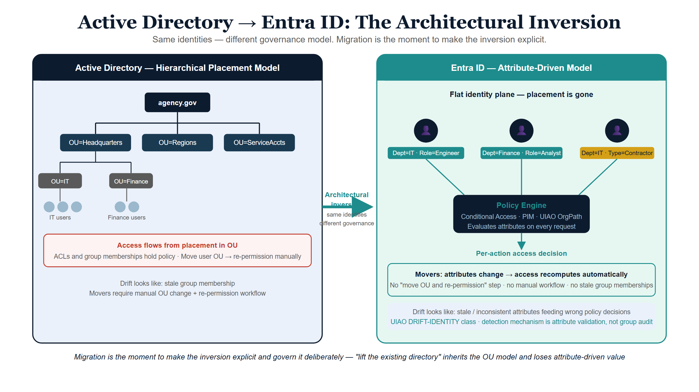
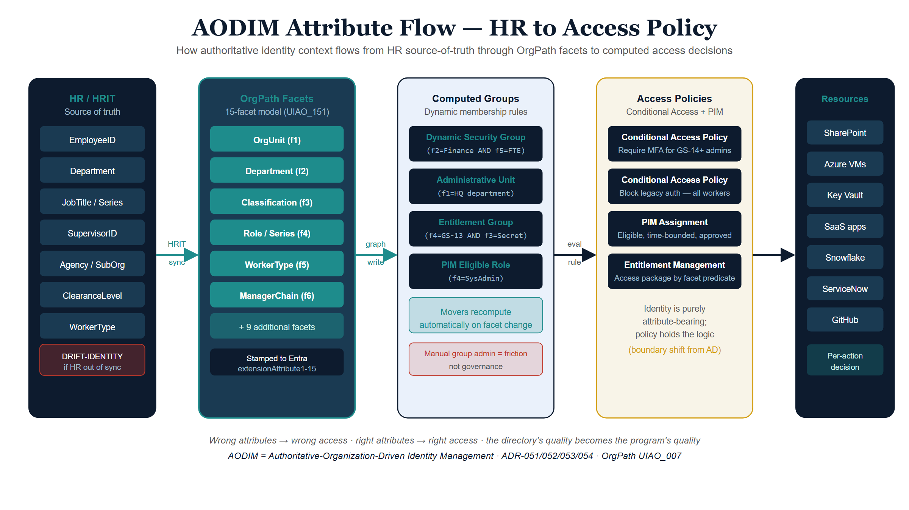
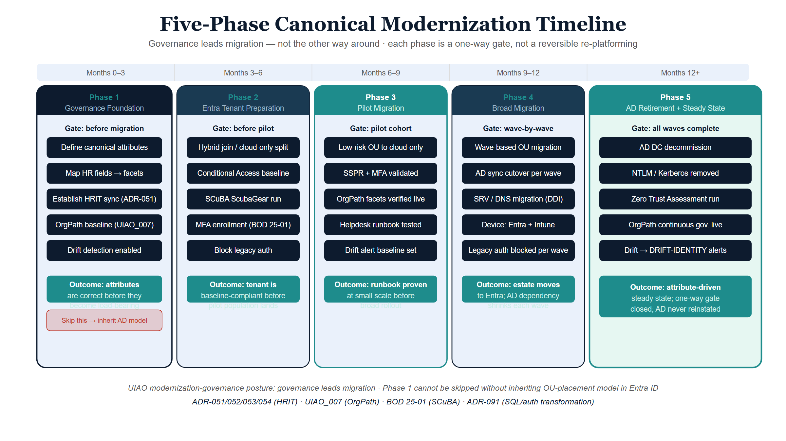

# Modernization Governance

## Governing the AD to Entra ID migration at federal scale

### Executive summary

The Active Directory → Entra ID migration is the most architecturally
consequential modernization most federal agencies will execute this
decade. It moves identity from a perimeter-administered, OU-hierarchical
directory into a cloud-native, attribute-driven identity plane — and in
doing so changes what "authoritative" means for downstream addressing,
network, telemetry, and compliance planes.

Most agency programs treat the migration as a tools project: deploy
Entra Connect, run hybrid sync, extend MFA, retire on-premises domain
controllers. UIAO's position is that this framing is structurally
incomplete: migration is an **architectural inversion** of the identity
plane, and an agency that runs it as a tools project will inherit the
old directory's hierarchical assumptions in the new tenant — and lose
most of the cloud-native value.

This whitepaper explains what changes structurally, why governance must
lead the migration rather than follow it, and how UIAO's substrate
provides the canonical fabric that makes the migration a one-way
modernization rather than a reversible re-platforming.

The companion executive brief is
[Modernization Overview](../executive-briefs/modernization-overview.qmd),
and the modernization pillar's curated surfaces — the transformation
series and the adapter interfaces this paper's approach rides on — are
collected at the [OrgMod hub](../../orgmod/index.qmd).
The migration's specific failure-mode-and-fix is documented in
[AD to Entra ID Migration Problem](ad-to-entraid-migration-problem.qmd)
and the
[AODIM Executive Whitepaper](aodim-executive-whitepaper.qmd). The
substrate this paper names as UIAO's is the same one the OrgComp
series' own
[Vol X — Governance Substrate Integration Overview](../orgcomp-series/Vol_X_Book_00_OrgComp_Governance_Substrate_Integration_Overview.qmd)
documents from the product-neutral side — see §4 below.

{#fig-modernization-governance-whitepaper-image-01 fig-alt="Two side-by-side panels with an arrow between them. Left panel labeled \"Active Directory — hierarchical placement model\" shows a tree of OUs with users positioned at leaves; thick lines indicate access flowing from placement. Right panel labeled \"Entra ID — attribute-driven model\" shows a flat layer of users carrying attribute tags, feeding into a Policy Engine box that emits per-action access decisions. The central arrow is labeled \"Architectural inversion — same identities, different governance\". A small footer note reads \"Migration is the moment to make the inversion explicit.\" Clean engineering blueprint style, dark navy (#0D1B2E) and teal (#1E8C8C) on white background. No photographs, purely diagrammatic." width="100%"}

### 1. The architectural inversion

On-premises Active Directory operates a *hierarchical placement* model:
identities are positioned within OUs, and access flows from that
placement. Entra ID operates an *attribute-driven* model: identities
carry attributes, and access is computed from those attributes by policy.

The two models are not interchangeable. Five concrete consequences for
governance:

1. **Movers stop being a manual workflow.** When attributes change, access
   recomputes. There is no "move the user OU and re-permission the
   shared drive" step — there are attributes and policies that
   evaluate them.
2. **Authoritative identity context becomes the primary engineering
   artifact.** Wrong attributes produce wrong access; right attributes
   produce right access. The directory's quality becomes the program's
   quality.
3. **Group membership shifts from administered to computed.** Dynamic
   groups, administrative units, and conditional access rules all
   consume attributes. Manual group administration is friction, not
   governance.
4. **The boundary between identity and policy moves.** In AD, ACLs and
   group memberships hold most policy. In Entra ID, conditional access,
   PIM, and entitlement management hold policy — and identity is
   purely attribute-bearing.
5. **Drift surface changes.** Identity drift in AD looks like stale
   group membership. Identity drift in Entra ID looks like stale or
   inconsistent attributes feeding policy decisions. Both matter; the
   detection mechanism is different.

Agencies that approach the migration as "lift the existing directory
into the cloud" inherit the OU-driven model in Entra ID and lose
attribute-driven value. UIAO's modernization-governance posture is that
the migration is the moment to make the inversion explicit and govern
it deliberately.

### 2. Why governance must lead, not follow

A common federal pattern is to run the technical migration first, then
"layer governance on top" once the new tenant is live. This pattern
fails for three structural reasons:

**Failure 1 — once attributes are wrong, every downstream decision is
wrong.** Attribute-driven identity makes the directory's content
load-bearing. Migrating without canonical attribute definitions produces
a tenant that *works* but does not *govern*; tightening governance
later means re-classifying every identity.

**Failure 2 — the addressing and telemetry planes drift first.**
Identity-derived addressing and identity-correlated telemetry begin
emitting against the new tenant the moment it is live. If the identity
plane's truth is not canonical at cutover, downstream evidence inherits
the inconsistency.

**Failure 3 — compliance evidence becomes uncorrelatable.** SSPs
authored against the old directory cannot be regenerated against the
new tenant if the canonical claim definitions changed. Every ATO touch
becomes a re-engineering exercise.

The UIAO approach is to **canonize the identity plane before cutover** —
declare the attribute model, the group computation rules, and the
provenance envelope in `src/uiao/canon/` — so the migration is a
substrate change rather than a tooling change.

{#fig-modernization-governance-whitepaper-image-02 fig-alt="Horizontal sequence: HR System (authoritative source) → Identity Attributes (canonical attribute set: scope, role, classification) → Computed Groups (dynamic group rules) → Access Policies (conditional access, PIM, entitlement management) → Resource Authorization. Each stage is labeled with a small governance checkpoint (e.g. \"schema validation\", \"drift detection\", \"evidence emission\"). A side panel highlights three authoritative attributes: assignment scope, organizational role, classification clearance. Clean engineering blueprint style, dark navy (#0D1B2E) and teal (#1E8C8C) on white background. No photographs, purely diagrammatic." width="100%"}

### 3. AODIM — the attribute-oriented directory and identity model

The architectural pattern UIAO uses to govern the inversion is
**AODIM** (Attribute-Oriented Directory & Identity Model): identity
attributes define organizational structure, and access is computed
from them rather than assigned. AODIM's authoritative-attribute set,
computed-group model, and policy-as-data mechanics are documented in
full in the
[AODIM Executive Whitepaper](aodim-executive-whitepaper.qmd).

### 4. The substrate's role in migration

The
[Governance OS](uiao-governance-os-whitepaper.qmd) provides four
structural mechanisms that make AODIM-anchored migration tractable:

| Mechanism | Migration role |
|---|---|
| **Canon SSOT** | The attribute model lives in canon, not in the directory. Migrating the tenant does not migrate the model. |
| **Modernization adapters** | `modernization-registry.yaml` (28 entries) declares change-making adapters, including first-class `bluecat-address-manager` and `infoblox` adapters for the addressing plane. Each maps a piece of pre-migration infrastructure to its post-migration target. |
| **Provenance envelope** | Identity claims emitted during and after migration carry `source_classification` (authoritative / derived / synthesized), making the migration's evidence reproducibly classifiable. |
| **Drift engine** | Schema and provenance drift surface attribute or group-rule mismatches in CI; runtime detection for identity and authorization drift is partially implemented and maturing. |

Because canon is the source of truth, the migration's evidence does not
have to be assembled from the directory's state — it can be regenerated
from canon plus telemetry, deterministically, before *and* after cutover.

The same four mechanisms are what [Vol X of the Federal Organization
Compliance series](../orgcomp-series/Vol_X_Book_00_OrgComp_Governance_Substrate_Integration_Overview.qmd)
calls, without naming UIAO, "a governance substrate that sits underneath
the whole series... general-purpose... not itself tied to this series."
Vol X's canon SSOT and drift-gate mechanics bind the OrgComp series' own
Identity-slot evidence (organizational-user authentication, account
management, device identity) to the same substrate this migration's
provenance envelope depends on — a second, independently-authored corpus
proving the substrate carries a regime it was never written for, which
is the concrete version of this paper's "canon, not the directory, is
the source of truth" claim above.

{#fig-modernization-governance-whitepaper-image-03 fig-alt="Horizontal Gantt-style bars for: Phase 1 Canon-First (longest teal bar, leftmost), Phase 2 Modernization-Adapter (overlapping with Phase 1 tail, teal), Phase 3 Compensating-Enforcement (smaller teal bar mid-timeline), Phase 4 Cutover (single thin amber decision-point bar), Phase 5 Drift-Driven Cleanup (long teal bar extending right past cutover). Below each phase, a brief deliverable label (canon authored, adapters registered, in-boundary telemetry, identity-plane source switched, drift findings remediated). A vertical line at Phase 4 labeled \"AO checkpoint\" indicates the technical cutover. Clean engineering blueprint style, dark navy (#0D1B2E) and teal (#1E8C8C) primary, with amber for the single Phase 4 cutover bar. No photographs, purely diagrammatic." width="100%"}

### 5. Phased modernization

The substrate's
[Modernization Timeline](../../docs/08_ModernizationTimeline.qmd) is the
canonical month-by-month program plan (six months, workstreams A–D). The
five phases below are this paper's distillation of how governance
sequences within that plan:

1. **Canon-first phase.** Author the attribute model, group computation
   rules, and provenance envelope in `src/uiao/canon/`. The substrate
   walker passes against the new canon before any runtime change.
2. **Modernization-adapter phase.** Stand up the modernization adapters
   for identity (Entra ID), addressing (BlueCat / Infoblox), and the
   telemetry surface required to correlate them. Adapters emit
   canonical claims with full provenance from day one.
3. **Compensating-enforcement phase.** Where platform features are
   unavailable (especially in GCC-Moderate per the
   [Boundary Impact Model](../architecture-series/boundary-impact-model.qmd)),
   stand up compensating enforcement adapters whose evidence flows
   through the same chain.
4. **Cutover.** The directory transition is itself a substrate event:
   the identity plane's authoritative source switches from on-prem AD
   to Entra ID, with canon already in place to interpret post-cutover
   claims.
5. **Drift-driven cleanup.** Post-cutover, the drift engine surfaces
   inherited inconsistencies (stale attributes, dangling group rules,
   broken provenance chains). Each is a tracked finding with a
   remediation contract, not a discovery exercise.

Steps 1–3 are governance-led. Step 4 is the technical event most
programs treat as the migration. Step 5 is what determines whether the
migration delivers cloud-native value.

**Walking one attribute through all five phases.** The phases above are
sequenced abstractly; concretely, here is what happens to a single
authoritative attribute — **classification clearance** — from canon
authoring through post-cutover cleanup:

1. **Canon-first.** Classification clearance is authored in
   `src/uiao/canon/` as one of AODIM's authoritative attributes: its
   allowed values, its authoritative source (the HR/personnel system of
   record), and the policies permitted to consume it are declared
   before any tenant work begins.
2. **Modernization-adapter.** The identity adapter for Entra ID is
   configured to read classification clearance from its authoritative
   source and write it into the tenant as a directory attribute,
   emitting a canonical claim with a `source_classification:
   authoritative` provenance tag from the first sync.
3. **Compensating-enforcement.** Where a GCC-Moderate boundary gap
   means Entra ID cannot itself enforce a classification-scoped
   conditional access rule, a compensating enforcement adapter
   evaluates the same attribute against the same canonical policy and
   emits evidence in the same shape — so the AO sees one continuous
   claim regardless of which layer enforced it.
4. **Cutover.** At the AO checkpoint, classification clearance's
   authoritative source switches from the on-prem AD attribute to the
   Entra ID directory attribute. Because the attribute's definition
   lives in canon and did not change at cutover, only its supplying
   system did, this is a single auditable event rather than a
   re-classification exercise.
5. **Drift-driven cleanup.** Post-cutover, the drift engine compares
   classification-clearance values and their provenance chains against
   canon. A record whose AD-era clearance value never migrated
   cleanly, or whose provenance chain breaks between HR system and
   tenant, surfaces as a tracked finding with a remediation contract —
   not a silent access-control error discovered later.

### 6. What this means for an ATO package

An AODIM-anchored migration produces an ATO package the AO can review
*continuously* through the migration rather than at the end:

- Canon citations for every attribute and policy intent.
- Modernization adapter findings emitted into OSCAL throughout the
  migration, not just post-cutover.
- Drift findings (and remediations) per migration phase, scoped to
  plane and layer.
- Boundary-aware evidence: GCC-Moderate feature gaps are first-class
  findings rather than implicit constraints.

The AO does not have to wait for cutover to evaluate the program's
identity posture. Each phase emits evidence the AO can consume, and the
phase's drift findings are themselves a measure of program quality.

### 7. Honest limits

- The migration is a multi-quarter program for a typical federal
  agency. UIAO compresses the *governance* timeline by canonizing the
  model up front; it does not compress the technical migration.
- Several runtime drift classes (identity, authorization, semantic) are
  only partially implemented today. Agencies in mid-migration will run
  with schema and provenance drift coverage in CI plus partial runtime
  coverage; full Optimal-grade runtime drift is engineering work
  ahead.
- AODIM is opinionated. Agencies that elect to keep an OU-driven model
  in Entra ID can still use UIAO, but they will not realize most of
  the substrate's value — the substrate's leverage is in
  attribute-driven access.

### 8. Conclusion

The AD → Entra ID migration is one of the rare programs where doing it
right and doing it well are the same thing. Doing it well requires a
substrate that canonizes the identity model independently of the
directory product, governs the migration as a substrate change, and
emits reproducible evidence at every phase. UIAO's Governance OS is
that substrate.

Agencies that adopt this posture do not just migrate. They modernize
the identity plane in a way that survives the next directory transition
— because the canon is the source of truth, and the directory product
is a consumer.
