# From Mainframe to Application-Aware Modernization {.unnumbered}

::: {.callout-note}
## In this narrative

This is the story of how one federal agency's architecture evolved across four
decades — and how, somewhere along the way, it stopped being able to answer the
simplest question in government: *what is true?* It is told in four acts, from
the mainframe's brutal single source of truth, through the Great
Decentralization, the years when cybersecurity ate the architecture, and the
cloud breaking point — and then forward into how the agency rebuilds.

Read it top to bottom as a single arc. The first three acts are the agency's
own history. The fourth act — the way forward — is anchored to UIAO canon, and
every doctrinal claim is footnoted to the ADR or specification that owns it.
:::

::: {.callout-tip}
## The one sentence the whole story turns on

> Active Directory conflated the directory (truth) with the domain controller
> (the in-path enforcer). Every act of this story is a consequence of that
> conflation — and the way forward is to **separate truth from runtime
> enforcement** and keep UIAO on the truth-and-reconciliation side of the line.
> — [ADR-092 §1](../../../src/uiao/canon/adr/adr-092-active-governance.md)
:::

---

## Prologue — The Mainframe Era (1940s–1990s)

Your agency's entire operation ran on mainframes. IBM systems, mostly. One
massive computer in a locked room. Everything happened there: all the data, all
the logic, all the state.

Users didn't have computers. They had **terminals**. Green screens, keyboards. A
terminal was a dumb device — it sent keystrokes to the mainframe and received
screen refreshes back. Text-based, synchronous, simple.

The model was brutally elegant: **one source of truth.** The mainframe *was* the
truth. When you asked "how many people received benefits this month," there was
one answer, and it came from one place. No ambiguity. No regional variations. No
hidden discrepancies.

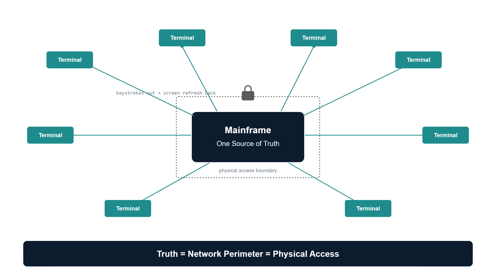{#fig-mainframe-single-truth fig-alt="A clean 16:9 conceptual diagram on a pure white background, engineering blueprint style. Center: a single large rounded rectangle labeled \"Mainframe — One Source of Truth\" in federal navy (#0D1B2E), drawn inside a thin locked-room boundary with a small lock glyph. Radiating outward from the mainframe to the edges: eight thin lines, each ending in a small simple rectangle labeled \"Terminal\" — drawn as plain green-screen boxes in teal (#1A9E8F). Each line is annotated \"keystrokes out / screen refresh back\" in small monospace text. A single callout band across the bottom in navy reads: \"Truth = Network Perimeter = Physical Access.\" No people, no logos, clean technical sans-serif labels, white background." width="85%"}

Security was implicit. If you weren't sitting at a terminal physically connected
to that mainframe room, you couldn't access anything. **The network was the
security perimeter.** Control physical access, and you controlled everything.

And crucially: the intelligence gatekeepers were in Washington. The mainframe
programmers. The database administrators. If you wanted a new report, you
waited. If you wanted to customize a process for your state, you couldn't. The
mainframe was the mainframe.

This worked for forty years. It was slow. It was inflexible. But it was *true* —
and, tellingly, the machine that *held* the truth was the same machine that
*enforced* access to it. Truth and enforcement lived in one box. Remember that;
it is the seed of everything that follows.

---

## Act 1 — The Great Decentralization (Late 1980s–2000)

By the late 1980s, the entire world was rejecting the mainframe model. Not
because mainframes stopped working — because the economics broke and the
technology changed.

Minicomputers — DEC VAX, Wang — had already proven you didn't need one godlike
machine. Departments could own their compute. Programmers could own their tools.
Intelligence spread.

Then PCs arrived. Networks got faster. The vision became irresistible: put a SQL
Server in every region. Put applications in every office. Spread programming
expertise to the edges. Let local teams build solutions for their local problems
— because they understood those problems better than Washington ever could.

For your agency, this was revolutionary. Twelve regional offices could each have
their own database administrators, their own application developers, their own
tools tailored to how their states and territories worked. The interaction with
state governments in California was different from Massachusetts — so why force
them into the same mold?

Email arrived. Then instant messaging. Suddenly you could communicate
asynchronously across the organization. Regional teams could coordinate without
waiting for Washington's approval. It was a genuinely good idea: the
decentralization of intelligence, expertise, and decision-making to the places
where the work actually happened.

**But here is where the architecture broke.**

With the mainframe, there was one source of truth. One database. One version of
the record. The moment you put SQL Servers in twelve regions, you lost that. Now
California had its own database. Massachusetts had its own. New York had its own.
And they didn't always talk to each other — or they did, but inconsistently.
Regional systems evolved their own schemas, their own business logic, their own
definitions of what a "benefit" even meant.

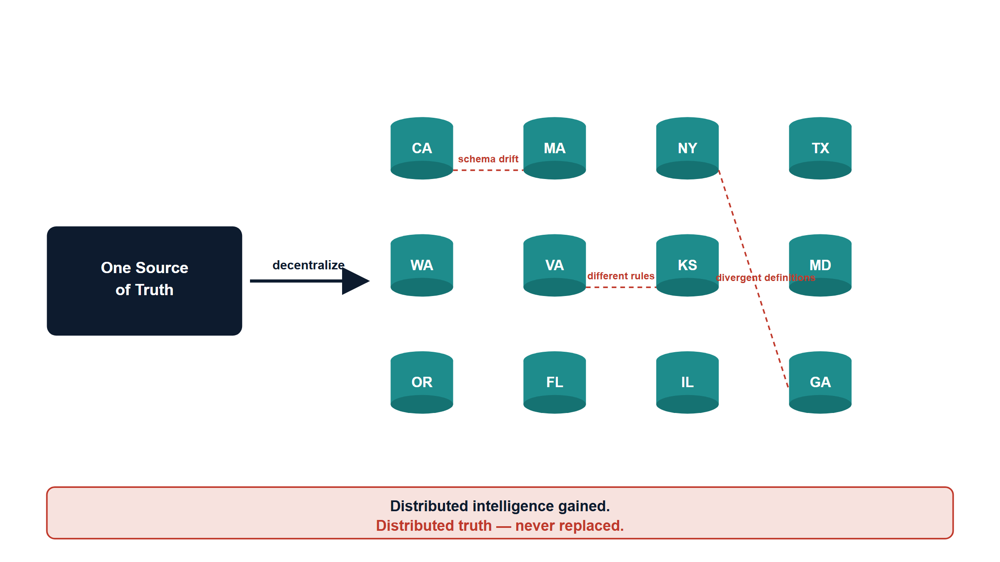{#fig-decentralization-fragmented-truth fig-alt="A clean 16:9 conceptual diagram on a pure white background, engineering blueprint style. Left side: a single navy (#0D1B2E) rounded rectangle labeled \"One Source of Truth\" with a large rightward arrow labeled \"decentralize\" pointing to the right side. Right side: twelve separate small database-cylinder icons arranged in a loose grid, each labeled with a different region abbreviation (CA, MA, NY, TX, WA, VA, KS, MD, OR, FL, IL, GA) in teal (#1A9E8F). Between several of the cylinders draw short broken or dashed connector lines in amber (#D4A017) annotated \"schema drift\", \"different rules\", \"divergent definitions\". A red (#C74040) caption band along the bottom reads: \"Distributed intelligence gained. Distributed truth — never replaced.\" No people, no logos, clean technical sans-serif labels, white background." width="85%"}

The vision of distributed intelligence was real and good. But it came at a cost:
**distributed truth.** And nobody replaced the single source of truth that the
mainframe had given you.

That became the original sin — the moment the architecture started to drift. In
UIAO's vocabulary, this is exactly the condition the substrate later learns to
*name*: divergence between what a record says in one place and what it says in
another, with no authoritative arbiter. Canon calls the contention case
[`DRIFT-SSOT-CONTENTION`](../../../src/uiao/canon/adr/adr-074-drift-ssot-contention.md) — a write
that is structurally correct but directed at an instance that should no longer be
authoritative. In 1995 there was no engine to detect it. The drift simply
accumulated, silently, for twenty-five years.

---

## Act 2 — When Security Ate the Architecture (2010–2020)

Around 2010, your agency started consolidating compute. Not radically, but
intentionally. The twelve regional data centers stayed, but the thinking
shifted: consolidate to four anchors — Richmond, California, two in Kansas City,
with Maryland as the hub.

Simultaneously — and this is the critical inflection — **cybersecurity became a
board-level imperative.** Not just "have a firewall." Defense-in-depth. Layered
security. Multiple inspection points.

But here is the problem: the tools chosen to enforce security were fundamentally
incompatible with the **session-based client-server model** your entire
infrastructure depended on.

F5 load balancers became inline proxies. Intrusion detection and prevention
systems were inserted into the traffic path. Multiple NAT sessions. Firewalls
stacked on firewalls. Every packet from a field office to a regional data center
had to traverse security devices designed to *break* sessions — to inspect,
decrypt, re-encrypt, verify, block.

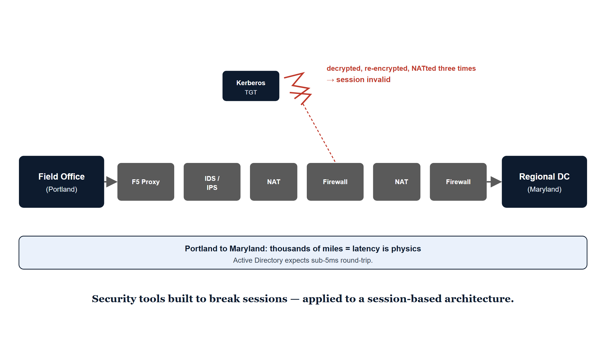{#fig-session-breaking-stack fig-alt="A clean 16:9 horizontal flow diagram on a pure white background, engineering blueprint style. Far left: a box labeled \"Field Office (Portland)\" in navy (#0D1B2E). Far right: a box labeled \"Regional DC (Maryland)\" in navy. Between them, left to right, a stacked row of inline security appliances drawn as boxes in slate gray: \"F5 Proxy\", \"IDS / IPS\", \"NAT\", \"Firewall\", \"NAT\", \"Firewall\". Above the chain a Kerberos ticket icon is shown as a small token shape that visibly cracks and shatters into fragments in red (#C74040) over the appliance stack, annotated \"TGT decrypted, re-encrypted, NATted three times — session invalid\". Below the chain a horizontal distance scale in amber (#D4A017) reads \"Portland to Maryland: thousands of miles = latency is physics\" with a small note \"AD expects sub-5ms\". No people, no logos, clean technical sans-serif labels, white background." width="90%"}

Active Directory Kerberos tickets have a lifespan. They are bound to a specific
session. When a packet gets intercepted, decrypted, re-encrypted, and NATted
three times, the session breaks. The Kerberos ticket becomes invalid. The
application loses trust in where the request came from.

Meanwhile, bandwidth exploded. Gigabits across the country. Leadership made a
fateful assumption: **high bandwidth equals low latency.** If we can push a
gigabit per second, the network is basically local.

That's the lie. Latency is physics. Portland to Maryland is thousands of miles —
thousands of milliseconds of round-trip delay against an Active Directory that
expects sub-five-millisecond latency. Add session-breaking security appliances
on top of that distance and sessions crater. Logon times creep up. GPO
processing stalls.

But the agency didn't rearchitect. They accepted the latency and kept the
regional AD forest as-is. They didn't rethink authentication — they added more
proxies. Service accounts. Cached credentials. Trust relationships that
*bypassed* the security stack because the security stack was incompatible with
the authentication model.

And here is the deeper loss: with every security layer added, you lost
**visibility into what the application was actually doing.** The security tools
worked at the network and session layers. They could see that a packet was
encrypted, that it came from an IP address, that it matched a rule. They could
not see: *Is this request legitimate? Does this user have permission to access
this data? Is the data being accessed the same data that was supposed to be
accessed?*

This is the precise failure UIAO canon later diagnoses. As
[ADR-066](../../../src/uiao/canon/adr/adr-066-application-aware-networking-and-token-bound-transport.md)
puts it, identity became "the new boundary, but only halfway" — the transport
carrying identity-derived claims stayed session-based, "a TLS connection
established once, then riding for minutes-to-hours carrying intent the issuer can
no longer attest to." Nobody said: *we are securing sessions in a way that breaks
them; we are adding complexity without adding truth; we are layering proxies
without adding application-aware intelligence.*

Instead, cybersecurity became the priority and performance became secondary.
Compliance became the metric — "Are we passing the security scan?" Yes. "Are
applications performing?" Separate conversation. "Can we still verify the data is
correct?" That question wasn't even on the table.

And you lost one more thing: **provenance.** When a claim gets paid, a benefit
gets issued, a record gets created — nobody can definitively say "this came from
this authorized source, processed by this authorized system, verified by this
authorized entity." The security layers broke sessions. They never restored
truth. Canon now has a name for that gap too —
[`DRIFT-PROVENANCE`](../../../src/uiao/canon/adr/adr-040-drift-engine.md), an active stream that
cannot be traced back to a declared, authorized source.

---

## Act 3 — The Breaking Point (2020–2026)

Then M365 happened. Microsoft forced the issue.

Your agency couldn't stay on-premises Exchange forever. Cloud was inevitable. So
you migrated to Microsoft 365 — Exchange Online, Teams, SharePoint. Suddenly your
email and collaboration lived in Azure, managed by Microsoft, unreachable by your
session-based authentication model.

But the agency didn't stop there. Application after application moved to the
cloud. SQL databases moved from regional data centers to Azure. Workloads moved
to AWS. The compute scattered.

And here is the critical moment: the agency still had **twelve regional Active
Directory domains.** Still had the OU tree structure designed for when compute
lived regionally. Still had MPLS circuits connecting field offices to regional
DCs that were increasingly just logical boundaries, not physical anchors.

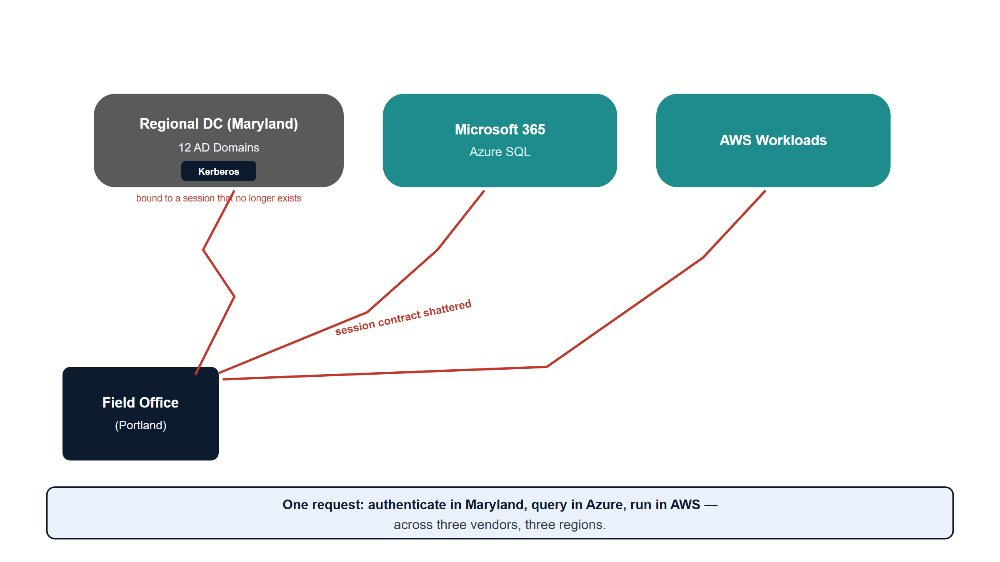{#fig-cloud-scatter-breaking-point fig-alt="A clean 16:9 conceptual diagram on a pure white background, engineering blueprint style. Bottom-left: a small box labeled \"Field Office (Portland)\" in navy (#0D1B2E). Three destination zones spread across the upper area, drawn as labeled cloud-rounded rectangles: \"Regional DC (Maryland) — 12 AD Domains\" in slate gray, \"Microsoft 365 / Azure SQL\" in teal (#1A9E8F), and \"AWS Workloads\" in teal. From the field office, three long thin arrows reach to each zone, each arrow drawn as a jagged broken line in red (#C74040) labeled \"session contract shattered\". A small token icon labeled \"Kerberos\" sits near the regional DC zone marked \"bound to a session that no longer exists\". Across the bottom an amber (#D4A017) band reads: \"One request: authenticate in Maryland, query in Azure, run in AWS — across three vendors, three regions.\" No people, no logos, clean technical sans-serif labels, white background." width="90%"}

Now a field office in Portland authenticates to a regional DC physically in
Maryland. A SQL query goes to a database in Azure. An application runs in AWS.
The session-based contract — the assumption that client and server are talking
synchronously over a trusted link — shattered across three continents and three
cloud vendors.

And the security stack? Still there. Still breaking sessions. Still working at
the network layer, not the application layer. Still unable to verify provenance
or trace where data actually came from.

Meanwhile, the regional variations that started in Act 1 had calcified into
institutional silos. California's benefit calculation differed from
Massachusetts's. Regional databases had evolved incompatible schemas. Local
applications had local business rules. And because single source of truth had
never been restored, **nobody could see the discrepancies.**

Then the consequences surfaced. The fragmentation that made the system agile in
1995 had become the hiding place for systemic error — duplicate payments across
states, records that should have been closed years ago, reconciliations nobody
could complete because there was no authoritative version to reconcile *to*.

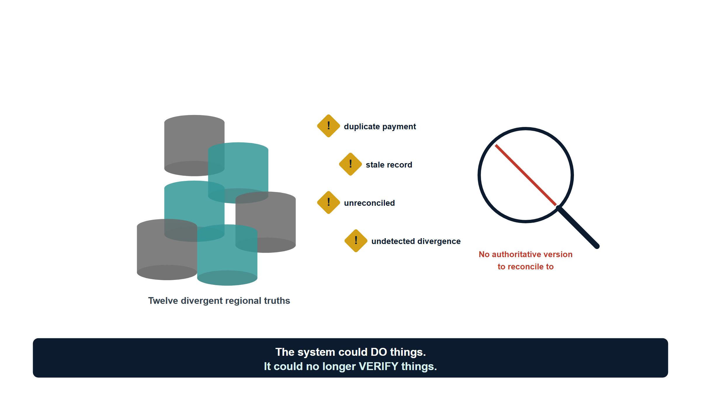{#fig-obscured-truth fig-alt="A clean 16:9 conceptual diagram on a pure white background, engineering blueprint style. Center: a cluster of overlapping, semi-opaque database-cylinder icons in slate gray and teal (#1A9E8F), deliberately drawn jumbled and overlapping so individual records are hard to distinguish, labeled \"Twelve divergent regional truths\". Floating between the overlaps, several small amber (#D4A017) warning-diamond glyphs labeled \"duplicate payment\", \"stale record\", \"unreconciled\", \"undetected divergence\". A single magnifying-glass outline in navy (#0D1B2E) hovers over the cluster with a red (#C74040) line through it, annotated \"No authoritative version to reconcile to\". Bottom caption band in navy reads: \"The system could DO things. It could no longer VERIFY things.\" No people, no logos, clean technical sans-serif labels, white background." width="85%"}

And the agency — and the federal government broadly — arrived at the hard
realization: **we don't know what's true anymore.**

The infrastructure built to distribute intelligence and autonomy had become an
infrastructure that *obscured* truth. The security added to protect data had
become security that hid provenance. The cloud migration undertaken to modernize
had scattered compute across vendors and regions without a unifying governance
model.

You had a system that could *do* things but couldn't *verify* things. With
electoral integrity and program integrity now national imperatives, that is no
longer acceptable.

---

## Act 4 — The Way Forward: Application-Aware Modernization

You can't fix this by patching the old model. You can't bolt Zero Trust onto a
Kerberos-in-MPLS architecture. You can't add more proxies. You can't hope
compliance scanning will restore integrity.

The only way forward is to rebuild the foundation around a single structural
move and four principles that follow from it.

The structural move is the one sentence this whole story turns on. Active
Directory conflated **the directory (truth)** with **the domain controller (the
in-path enforcer)** — exactly as the mainframe had, four decades earlier. The
modern split keeps them separate, and the governance substrate is deliberately on
the **truth-and-reconciliation** side of that line, never in the runtime path.
That is the thesis of [ADR-092 Active
Governance](../../../src/uiao/canon/adr/adr-092-active-governance.md), and it reframes every
principle below.

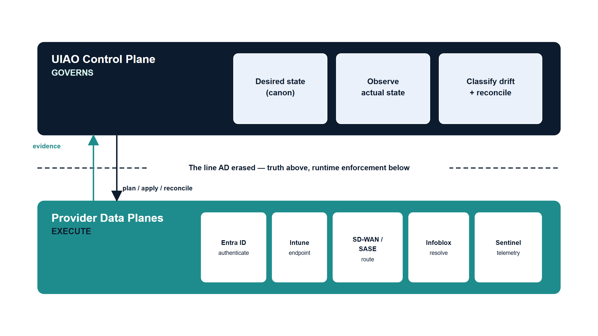{#fig-control-plane-data-plane fig-alt="A clean 16:9 two-tier architecture diagram on a pure white background, engineering blueprint style. Top tier: a wide navy (#0D1B2E) rounded rectangle labeled \"UIAO Control Plane — GOVERNS\" containing three small labeled boxes: \"Desired state (canon)\", \"Observe actual state\", \"Classify drift + reconcile\". Bottom tier: a wide teal (#1A9E8F) band labeled \"Provider Data Planes — EXECUTE\" containing five small boxes left to right: \"Entra ID (authenticate)\", \"Intune (endpoint)\", \"SD-WAN / SASE (route)\", \"Infoblox (resolve)\", \"Sentinel (telemetry)\". A clear horizontal dividing line separates the two tiers, labeled in amber (#D4A017): \"The line AD erased — truth above, runtime enforcement below\". Thin downward arrows from control plane to data plane labeled \"plan / apply / reconcile\". Thin upward arrows labeled \"evidence\". No people, no logos, clean technical sans-serif labels, white background." width="90%"}

### Principle 1 — Restore a single source of truth

Every data type the federal government manages — who is eligible, who owes, who
voted — must have **one authoritative source.** Not twelve regional databases
with eventual consistency. Not caches that drift. One source, cryptographically
verifiable, auditable: you must know where every piece of data came from, who
accessed it, when, and why.

For your agency, that means collapsing the twelve regional silos into a unified
model — not by *erasing* regional autonomy, but by making it **transparent.** If
California's benefit calculation differs from Massachusetts's, that difference is
documented, auditable, and traceable back to policy, not hidden in schema
variation.

**OrgPath** is how that becomes addressable. A precise note on what OrgPath *is*,
because it is easy to overclaim: OrgPath is the **organizational addressing
attribute that every governed object carries** — the "validated, machine-readable,
attribute-based expression of organizational position" stamped on users, devices,
and service principals
([UIAO_151](../../../src/uiao/canon/UIAO_151_OrgPath_Codebook.md)). It is *not* a token in
itself, and not every token "contains" it. Rather, every governed object
*expresses* its OrgPath "so the provider's state is addressable in the same terms
as every other plane" ([ADR-092
§2](../../../src/uiao/canon/adr/adr-092-active-governance.md)). Access decisions then **compose
against** it: dynamic group membership, Administrative Unit scoping, Conditional
Access targeting, and Intune scope tags all evaluate the OrgPath an object
carries. Where a credential needs to carry it across the wire, it rides as a
claim — for example the `{{OrgPath}}` token resolved into a device certificate's
subject ([ADR-073](../../../src/uiao/canon/adr/adr-073-policy-targeting-nac-third-transport.md)).
The cert is the token; OrgPath is its payload.

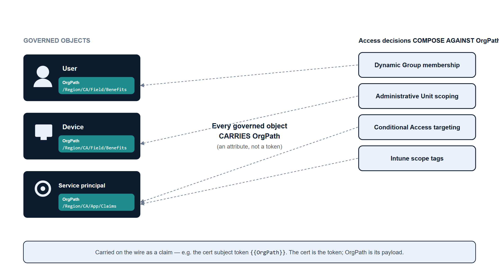{#fig-orgpath-addressing fig-alt="A clean 16:9 diagram on a pure white background, engineering blueprint style. Left column: three object icons stacked vertically — a user glyph, a device glyph, a service-principal gear glyph — each in navy (#0D1B2E), and each carrying a small attached tag in teal (#1A9E8F) labeled \"OrgPath\" with a sample monospace value like /Region/CA/Field/Benefits. A center vertical label reads \"Every governed object CARRIES OrgPath (an attribute, not a token)\". Right column: four decision boxes in amber (#D4A017) that each draw a thin line back to the OrgPath tags, labeled \"Dynamic Group membership\", \"Administrative Unit scoping\", \"Conditional Access targeting\", \"Intune scope tags\", under a header \"Access decisions COMPOSE AGAINST OrgPath\". A small footnote box in slate gray reads \"Carried on the wire as a claim, e.g. cert subject {{OrgPath}}\". No people, no logos, clean technical sans-serif labels, white background." width="90%"}

### Principle 2 — Application-aware networking and cybersecurity

You can't enforce security at the network layer anymore. The network is the
Internet now. Packets don't stay in a perimeter. Threats don't come from outside
a firewall — they come from compromised devices, supply-chain attacks, insider
threats, nation-states.

The only way to know whether a transaction is legitimate is to understand what
the application is doing: *Is this user authorized to access this data? Is the
data being accessed the data policy says they should access? Is the request from
a compliant device, from a location that makes sense?*

That is **application-aware networking** — and it is canonical doctrine, not
aspiration. [ADR-066](../../../src/uiao/canon/adr/adr-066-application-aware-networking-and-token-bound-transport.md)
retires the implicit, session-based transport plane and adopts **token-bound,
per-call transport authorization** as the canonical unit. A "session" — any
long-lived authorization context that survives a single authorized intent — "is
no longer a canonical concept in UIAO." Each governed call rides a typed overlay
binding `{identity, application, posture, location, token, lease,
certificate-chain}`: the transport itself carries the intent, freshly attested,
rather than a stale tunnel established once and trusted for hours.

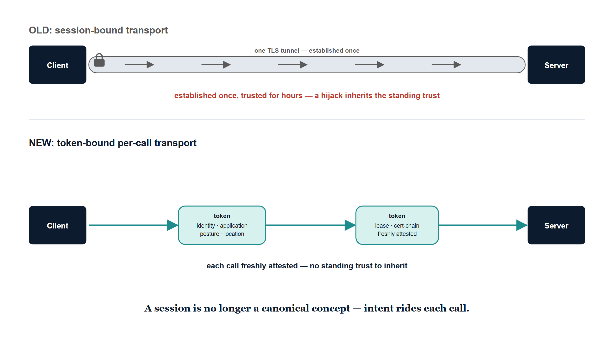{#fig-token-bound-transport fig-alt="A clean 16:9 comparison diagram on a pure white background, engineering blueprint style. Top half labeled \"OLD: session-bound transport\" in slate gray: a single long horizontal TLS tunnel drawn as one continuous pipe from \"Client\" to \"Server\", established once at the left with a small lock, then carrying many request arrows along its length, annotated in red (#C74040) \"established once, trusted for hours — hijack inherits trust\". Bottom half labeled \"NEW: token-bound per-call transport\" in navy (#0D1B2E): the same Client-to-Server span but broken into discrete per-call segments, each a short separate arrow carrying its own small labeled token capsule listing fields {identity, application, posture, location, token, lease, cert-chain} in teal (#1A9E8F), annotated in amber (#D4A017) \"each call freshly attested — no standing trust\". No people, no logos, clean technical sans-serif labels, white background." width="90%"}

Critically, this preserves **provenance.** Every request leaves a
cryptographically signed trail; you can trace why a decision was made and prove
who authorized what and when. A note on vendor specifics, so this stays honest:
UIAO is **provider-neutral** here. Canon names a vendor-neutral `sdwan-fabric`
slot and the SASE/ZTNA pattern in general, and it does name **Azure Policy** for
application-level enforcement and **Cisco ISE / Aruba ClearPass / Entra RADIUS**
for network admission ([Book_17](../orgpath-narrative/Book_17.qmd),
[ADR-073](../../../src/uiao/canon/adr/adr-073-policy-targeting-nac-third-transport.md)). Specific
products such as a particular SD-WAN platform or cloud on-ramp are
*illustrative* — they are incorporated as governed providers, not canon
mandates.

### Principle 3 — Move from session-based to token-based identity

Active Directory Kerberos assumes clients and servers are in the same room.
Tokens assume they are strangers on the Internet.

A token is a cryptographically signed assertion: *this user is who they claim to
be; this device is compliant; this request is authorized; timestamp now;
signature here.* The server doesn't need to trust the network or call back to a
domain controller — it just verifies the signature.

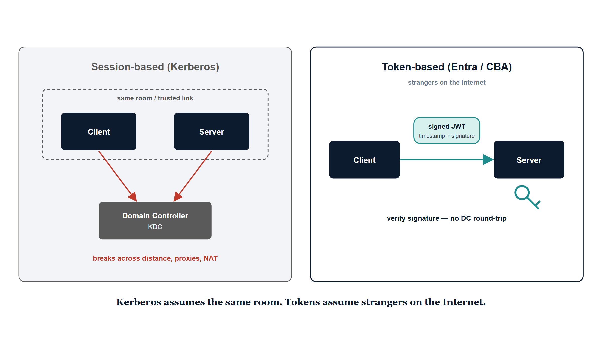{#fig-session-vs-token fig-alt="A clean 16:9 side-by-side comparison on a pure white background, engineering blueprint style. Left panel titled \"Session-based (Kerberos)\" in slate gray: a client box and a server box drawn close together inside a dashed boundary labeled \"same room / trusted link\", with a third box \"Domain Controller / KDC\" that both must talk to; arrows show the server calling back to the DC to validate a ticket, annotated in red (#C74040) \"breaks across distance, proxies, NAT\". Right panel titled \"Token-based (Entra / CBA)\" in navy (#0D1B2E): a client box and a server box far apart on opposite sides labeled \"strangers on the Internet\"; the client hands the server a signed JWT token capsule in teal (#1A9E8F); the server simply checks a signature against a published key (a small key glyph) with no callback, annotated in amber (#D4A017) \"verify signature — no DC round-trip\". No people, no logos, clean technical sans-serif labels, white background." width="90%"}

Entra ID, Conditional Access, and device-compliance policies are the token-based
equivalents of what AD used to do. Canon goes further and names the endpoint of
the journey: [ADR-068](../../../src/uiao/canon/adr/adr-068-kerberos-ntlm-elimination.md) makes
**Certificate-Based Authentication** the canonical replacement for legacy
Kerberos and stages the elimination of NTLM outright ("NTLM has no zero-trust
story; every NTLM event is opaque to telemetry"), with Cloud Kerberos trust as
the hybrid bridge.

But tokens only work if you have fixed the underlying governance model. If you
don't know what a user is actually authorized to do — if that is still encoded in
twelve regional OU trees — tokens won't save you; you will just be signing broken
authorizations. That is why Principle 3 depends on Principle 1: every
authorization decision composes against the OrgPath an object carries, so the
token asserts an authorization that is *true* rather than merely *well-formed*.

### Principle 4 — Govern actively: the control plane over the data plane

The first three principles describe the new materials. The fourth is the
operating posture that holds them together, and it is the keystone:
**[Active Governance](../../../src/uiao/canon/adr/adr-092-active-governance.md).**

UIAO is not a passive registry that records desired state and reports
divergence. It is an **active reconciliation control plane**: it holds desired
state, observes actual state, classifies drift, and reconciles toward intent —
while the providers (Entra, Intune, the SD-WAN/SASE fabric, Infoblox, Sentinel)
remain the **data planes** that authenticate, route, resolve, and store at
runtime. UIAO **governs** them; it never becomes the in-path enforcer. This is
the mainframe's and AD's fatal conflation, finally undone.

Providers are **incorporated, not competed with.** Each is bound to one
control-plane slot, exposes `plan / apply / reconcile`, carries OrgPath, and
advertises its governance metadata (`blast_radius`, `rollback_capable`,
`side_effects`). UIAO reconciles their state against canon and emits evidence —
it does not reimplement Entra or replace ISE.

And how far the loop closes without a human is **explicit and accreditable.**
Every operation class sits on a five-rung actuation ladder, and the federal
default has a deliberate ceiling:

| Rung | Name | Behavior |
|---|---|---|
| **L0** | Record | Desired state recorded in canon only. |
| **L1** | Observe | Actual state collected, drift detected. Read-only. |
| **L2** | Advise | Corrective change-set generated and surfaced; no writes. |
| **L3** | Gated actuation | A human approves; UIAO then executes through the provider API. Dry-run by default. |
| **L4** | Autonomous | UIAO closes the loop without a human, within declared guardrails. |

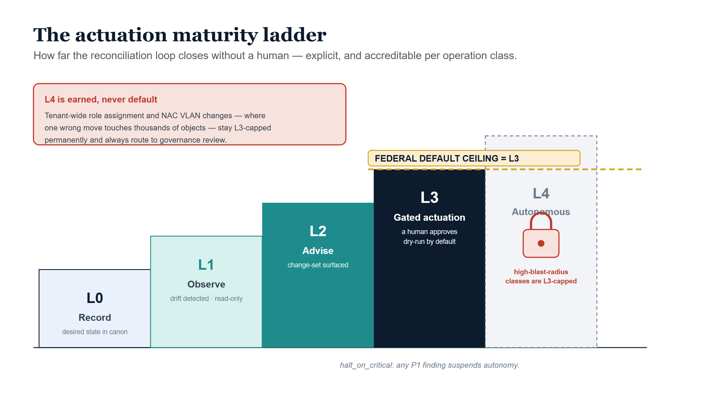{#fig-actuation-ladder fig-alt="A clean 16:9 ascending staircase diagram on a pure white background, engineering blueprint style. Five rising steps drawn left to right, each a labeled block: step 1 \"L0 Record\" lightest, step 2 \"L1 Observe\", step 3 \"L2 Advise\" in teal (#1A9E8F), step 4 \"L3 Gated actuation — human approves\" in navy (#0D1B2E) and emphasized, step 5 \"L4 Autonomous\" in slate gray and drawn faded. A bold horizontal dashed line in amber (#D4A017) sits on top of the L3 step labeled \"FEDERAL DEFAULT CEILING = L3\". A red (#C74040) lock glyph sits on the L4 step with a caption \"High-blast-radius classes (tenant-wide role, NAC VLAN) are L3-capped permanently\". A small side note in navy reads \"halt_on_critical: any P1 finding suspends autonomy\". No people, no logos, clean technical sans-serif labels, white background." width="90%"}

**The default production ceiling is L3 — human-approved actuation.** L4
autonomy is permitted only when the operation class is explicitly enumerated in
a governance decision, its blast radius is low, it is rollback-capable, it has a
clean dry-run record, and `halt_on_critical` remains in force. High-blast-radius
classes — tenant-wide role assignment, the NAC operations where one wrong VLAN
touches thousands of devices — are **L3-capped permanently** and always route to
governance review. This is what lets an authorizing official sign: not "it
enforces things," but "this operation class is at L2, with a roadmap to L3." A
sentence an AO can put their name to.

### The network spine that makes it physical

None of the above survives if every request still hairpins through regional data
centers that are now mostly empty. The transport underlay becomes an
identity-derived overlay — **SD-WAN with local Internet breakout, SASE/ZTNA, and
conditional-access traffic policy** ([ADR-066](../../../src/uiao/canon/adr/adr-066-application-aware-networking-and-token-bound-transport.md))
— where the path a request takes is chosen from *who and what it is*, not from
which regional DC it happens to be near. The regional AD forest stops being the
center of gravity. Addressing derives from OrgPath; routing derives from posture;
and the fabric itself is a governed provider in the network slot, not a
privileged in-path owner.

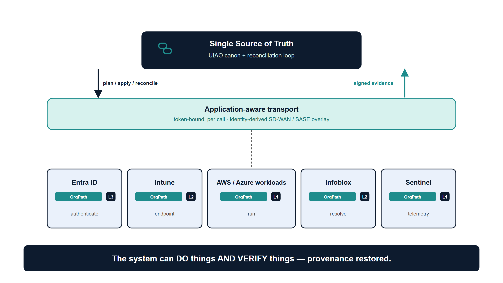{#fig-restored-picture fig-alt="A clean 16:9 summary architecture diagram on a pure white background, engineering blueprint style. Top center: a single navy (#0D1B2E) rounded rectangle labeled \"Single Source of Truth — UIAO canon + reconciliation loop\" with a small evidence-chain glyph. Below it, an identity-derived SD-WAN/SASE overlay drawn as a teal (#1A9E8F) horizontal mesh band labeled \"Application-aware transport — token-bound per call\". Below that, a row of governed provider data planes as boxes: \"Entra ID\", \"Intune\", \"AWS / Azure workloads\", \"Infoblox\", \"Sentinel\", each carrying a small OrgPath tag and a small rung badge (L1/L2/L3) in amber (#D4A017). Thin downward arrows labeled \"plan / apply / reconcile\" and thin upward arrows labeled \"signed evidence\" connect truth to providers. A bottom caption band in navy reads: \"The system can DO things AND VERIFY things — provenance restored.\" No people, no logos, clean technical sans-serif labels, white background." width="90%"}

---

## How this narrative maps to UIAO canon

The first three acts are the agency's lived history and are not canon claims.
Act 4 is anchored — here is the line-by-line provenance, including where earlier
framings were corrected to match canon.

| Narrative claim | Canon anchor | Reconciliation note |
|---|---|---|
| Separate truth from runtime enforcement; AD conflated directory + DC | [ADR-092 §1](../../../src/uiao/canon/adr/adr-092-active-governance.md) | Verbatim doctrine; the spine of Act 4. |
| OrgPath restores addressable truth | [UIAO_151](../../../src/uiao/canon/UIAO_151_OrgPath_Codebook.md), [ADR-092 §2](../../../src/uiao/canon/adr/adr-092-active-governance.md) | **Corrected:** OrgPath is an *addressing attribute every object carries*, not a "governance primitive," and **not** "every token includes an OrgPath." Decisions *compose against* it. |
| Application-aware networking; token-bound per-call transport | [ADR-066](../../../src/uiao/canon/adr/adr-066-application-aware-networking-and-token-bound-transport.md) | Canonical. "Session is no longer a canonical concept." |
| Vendor products (SD-WAN platform, cloud on-ramp) | [ADR-092 §2](../../../src/uiao/canon/adr/adr-092-active-governance.md), [Book_17](../orgpath-narrative/Book_17.qmd) | **Softened:** canon names a neutral `sdwan-fabric` slot, Azure Policy, ISE/ClearPass/Entra RADIUS. Specific platforms are illustrative, incorporated as providers. |
| Session→token identity; CBA replaces Kerberos | [ADR-068](../../../src/uiao/canon/adr/adr-068-kerberos-ntlm-elimination.md), [ADR-004](../../../src/uiao/canon/adr/adr-004-workload-identity-federation-default.md) | Canonical. NTLM elimination + CBA + Cloud Kerberos trust. |
| Active Governance; L0–L4 ladder; federal L3 ceiling | [ADR-092 §3–4](../../../src/uiao/canon/adr/adr-092-active-governance.md) | Verbatim; the keystone of the way forward. |
| Restore single source of truth / provenance | [ADR-074](../../../src/uiao/canon/adr/adr-074-drift-ssot-contention.md), [ADR-040](../../../src/uiao/canon/adr/adr-040-drift-engine.md) | Canonical, framed as **governance / accountability / integrity**. Program-integrity stakes are the agency's real-world motivation, not a UIAO canon claim. |

::: {.callout-note}
## Provenance

Acts 1–3 are a narrative synthesis of an agency modernization arc (mainframe →
regional decentralization → security-layer accretion → multi-cloud breaking
point); the specific institutional details (twelve regional domains, the named
data-center anchors) are the agency's own and are not asserted as UIAO canon.
Act 4 is reconciled to canon as tabulated above. Draft staged 2026-06-04 for
review; not yet promoted or published.
:::
