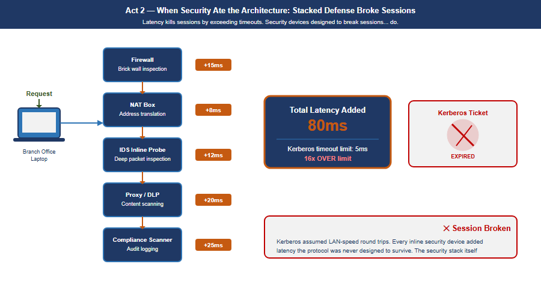

# Modernization Journey {.unnumbered}

::: {.content-visible when-format="html"}
::: {.callout-tip appearance="simple"}
**[Download this whitepaper as DOCX](modernization-journey.docx)** — a Word copy of
this page, regenerated on every site deploy. (Also available from the
**Other Formats** link in the page sidebar.)
:::
:::

## Executive Summary

::: {.callout-note}
## One narrative, one paper

Version 2.1 (2026-09-09) consolidates two earlier editions of this same
forty-year arc into a single paper and applies a review pass. Federal
requirements are cited to NIST, OMB, CISA and FedRAMP. **Named products
appear as concrete illustrations of a role** — an identity provider, a DDI
platform, an SD-WAN fabric — and any equivalent in the same role substitutes
cleanly; the architecture does not depend on the specific names. The
canon-anchored edition contributed the closing
[provenance appendix](#appendix-narrative-provenance-this-arc-mapped-to-uiao-canon),
which maps Act 4's claims to the UIAO ADRs behind them — it sits after the
Call to Action and is separable, so the paper can still be handed on without a
platform commitment attached.
:::

::: {.callout-note}
## Provenance

The "your agency" narrative running through this paper — twelve regional
offices, the named employee Jane Smith, the named systems and environments —
is a composite illustration, a narrative synthesis of a common federal
agency modernization arc. It is not a documented case study of any specific
agency.
:::

Federal agency IT architecture has evolved through four historical eras —
stark mainframe centralization, distributed decentralization, security-driven
complexity, and cloud-forced fragmentation — without ever replacing the single
source of truth the mainframe originally provided. The result: regional
identity domains that never reconciled, duplicate payments, records that
cannot be traced to an authoritative source, and a session-based
authentication model (Kerberos/Active Directory) that breaks under the
physics of distance and the security architecture layered on top of it.

This is not a technology gap. It is an architecture gap, and it is well
understood: commercial industries — banking, healthcare, manufacturing — hit
and solved this same problem between roughly 2014 and 2022. The physics is
fixed: bandwidth does not reduce latency, and no amount of infrastructure
spend changes the propagation floor of light through fiber. What changes the
outcome is architecture — separating the system of record from the in-path
enforcer, making the network application-aware rather than packet-aware,
replacing session-based identity with token-based identity, governing
infrastructure actively rather than assessing it periodically, and reducing
the number of synchronous round-trips an application makes to its data,
including at the mainframe boundary itself.

The agency-side deadlines are already behind us. **OMB M-22-09** set
government-wide zero-trust targets whose milestones came due in FY24;
**CISA BOD 25-01** binds agencies directly for Microsoft 365 secure
configuration; and **NIST SP 800-53 CA-7** with **OMB Circular A-130** has
required continuous monitoring of the agency's own authorized systems all
along. What **FedRAMP 20x** adds is direction of travel rather than a new
agency deadline: it obligates *cloud service providers*, and it establishes
that machine-readable, continuously-verified evidence is what federal
authorization now means. Agency ATOs are where that standard lands next, and
an architecture that cannot emit evidence continuously will meet it badly.
The path forward is five principles, each traced to a specific NIST, OMB,
CISA, or FedRAMP requirement. Concrete next steps are laid out in the
**Call to Action** at the end of this document.

::: {.callout-note}
## For decision makers: read this page first

This document tells the story of how a federal agency's IT architecture
evolved across forty years — and why the architecture that served it well
through 2010 is now working against its mission. The first three acts are
history. The fourth act is the path forward. **Federal requirements are cited
to NIST, OMB, CISA, or FedRAMP, and where a requirement binds someone other
than the agency this paper says so.** Named products appear as concrete
illustrations of a role — an identity provider, a DDI platform, an SD-WAN
fabric — and any equivalent in that role substitutes cleanly.

**The core problem is not a technology shortage.** Federal agencies have
invested heavily in security tools, network capacity, and cloud migration.
The problem is that the foundational services beneath those investments — the
network, the directory, the address management, the access control model —
were designed for a world that no longer exists.

**Five things every decision maker needs to understand:**

1. **High bandwidth does not mean low latency.** Large private circuits
   connecting field offices to regional data centers provide guaranteed
   bandwidth. They do not change the physics of distance.
2. **The federal government is five to ten years behind the commercial
   sector on this transition.** Major banks, healthcare networks, and
   manufacturers hit these same breaking points between 2015 and 2020 and
   modernized. The path is known. The delay has a cost measured in program
   integrity, not just performance.
3. **DNS, DHCP, and IP address management were not designed to be security
   controls — but they now are.** Zero Trust policy is written against named
   services rather than addresses, so name resolution becomes a policy
   surface; where enforcement is still expressed as IP or CIDR ranges, the
   address-management system is what makes those ranges meaningful and
   current. Either way the device and address inventory federal compliance
   requires is produced by DDI, not surveyed alongside it.[^cm8]
4. **VPN is not Zero Trust.** A VPN tunnel extends trust to everyone inside
   it. A compromised endpoint inside the tunnel has the same access as a
   trusted administrator. You cannot fully implement Zero Trust while VPN is
   the primary access mechanism.
5. **The cost of not modernizing is not abstract.** Duplicate payments,
   records that cannot be reconciled, benefits issued against data that
   cannot be traced to an authoritative source — these are the downstream
   consequences of accumulated architectural debt.
:::

::: {.callout-tip}
## The one sentence the whole story turns on

> Every era conflates the system of record with the in-path enforcer — the
> mainframe first, then Active Directory. NIST SP 800-207 and OMB M-22-09
> require agencies to separate these roles: a governance layer holds and
> reconciles authoritative state; identity providers, network enforcement
> points, and data platforms remain the runtime data planes beneath it.
:::

{#fig-four-acts fig-alt="A timeline overview diagram on a white background titled 'Forty Years of Federal IT Architecture — From brutal single source of truth, to distributed chaos, to the way forward'. Five colored boxes sit above a horizontal timeline: navy 'PROLOGUE — Mainframe (1940s-1990) — one machine, one source of truth, terminals to keystrokes, truth enforcer in one box'; blue 'ACT 1 — Decentralization (1988-2000) — regional SQL servers, 12 regional offices, original sin: distributed truth'; orange 'ACT 2 — Security Era (2010-2020) — firewalls stacked, proxies inline, Kerberos breaks, compliance metric: scans ≠ truth'; red 'ACT 3 — Breaking Point (2020-2026) — M365 cloud forced, 4 environments now, 12 AD domains linger, duplicate payments'; green 'ACT 4 — Way Forward (Now) — single source of truth, application-aware network, token-based identity, active governance, ZT + FedRAMP 20x'. Below the timeline, labeled dots read Brutal Truth, Distributed, Session Breaks, Siloed Truth, Rebuilt Truth. A bordered callout beneath states the one-sentence framing that every era conflates the system of record with the in-path enforcer. At the bottom, four environment labels — VMware On-Prem, Azure/M365, AWS GovCloud, Oracle OCI (government-wide HR platform) — with a note that 12 regional AD domains were designed for one environment and now span four." width="100%"}

---

## Prologue — The Mainframe Era (1940s–1990s)

Your agency's entire operation ran on mainframes. IBM systems, mostly. One
massive computer in a locked room. Everything happened there: all the data,
all the logic, all the state.

Users didn't have computers. They had **terminals** — green screens,
keyboards. A terminal was a dumb device that sent keystrokes to the mainframe
and received screen refreshes back. Text-based, synchronous, simple.

The model was starkly elegant: **one source of truth.** The mainframe *was*
the truth. When you asked "how many people received benefits this month,"
there was one answer, and it came from one place. No ambiguity. No regional
variations. No hidden discrepancies.

Security was implicit. If you weren't sitting at a terminal physically
connected to that mainframe room, you couldn't access anything. **The network
was the security perimeter.** Control physical access, and you controlled
everything.

And crucially: the machine that *held* the truth was the same machine that
*enforced* access to it. Truth and enforcement lived in one box. Remember
that; it is the seed of everything that follows.

{#fig-mainframe-scene fig-alt="A two-panel diagram on a white background. Left panel: a navy IBM System/360 mainframe cabinet with two tape-drive reels and an orange SSOT database cylinder inside it, connected by dashed lines to three green terminal icons labeled Term 1, Term 2, Term 3. Right panel, headed '1940s-1990s: One Source of Truth — What centralized architecture delivered': four green checkmarked bullets reading 'One version of every record', 'No regional discrepancies', 'Physical security = network security', and 'Truth and enforcement in one box'; below, a navy arrow captioned 'The architecture that worked... until it did not' points to a bordered callout titled 'Why the mainframe worked' explaining that the mainframe was an architecture, not merely a computer — every terminal was a dumb endpoint, and all logic, data, and enforcement lived in one place — closing with the orange line 'This is what modern SSOT/control-plane architectures must restore.'" width="100%"}

---

## Act 1 — The Great Decentralization (Late 1980s–2000)

By the late 1980s, the entire world was rejecting the mainframe model — not
because mainframes stopped working, but because the economics broke and the
technology changed.

Minicomputers had already proven you didn't need one godlike machine. Then PCs
arrived. Networks got faster. The vision became irresistible: put a SQL Server
in every region. Put applications in every office. Spread programming
expertise to the edges. Let local teams build solutions for their local
problems — because they understood those problems better than Washington
ever could.

For your agency, this was revolutionary. Twelve regional offices could each
have their own database administrators, their own application developers,
their own tools tailored to how their states and territories worked.

**But here is where the architecture broke.**

With the mainframe, there was one source of truth. One database. One version
of the record. The moment you put SQL Servers in twelve regions, you lost
that. Now California had its own database. Massachusetts had its own. New
York had its own. And they didn't always talk to each other — or they did,
but inconsistently. Regional systems evolved their own schemas, their own
business logic, their own definitions of what a "benefit" even meant.

{#fig-decentralization fig-alt="A diagram on a white background titled 'Act 1 — The Great Decentralization: One Became Twelve'. Left column, on a dark-green banner '1940s-1988: Single Source of Truth', shows one navy IBM Mainframe box with an orange SSOT cylinder and a dashed-oval caption 'Unity. One truth.' Right column, on a red banner '1988-2000: Distributed Truth (Schema Drift)', shows twelve small blue database boxes labeled with state abbreviations (California, New York, Texas, Florida, Illinois, Virginia, Ohio, Georgia, Arizona, Colorado, Michigan, Washington DC) arranged in three rows of four, with small red question marks and dashed red connector lines between several adjacent pairs in the top row indicating schema drift. An orange 'Late 1980s: PC Revolution' banner sits between the columns. A bordered red callout at the bottom reads 'Schema Drift — The Original Sin: 12 databases. No reconciliation. No authoritative record.'" width="100%"}

The vision of distributed intelligence was real and good. But it came at a
cost: **distributed truth.** And nobody replaced the single source of truth
that the mainframe had given you.

That became the original sin — the moment the architecture started to drift.

It is worth being precise about what was lost, because the usual telling gets
it backwards. **Active Directory was never the system of record for identity.
HR was.** AD became the de facto authority only because nothing upstream was
authoritative enough to reconcile against: with twelve regional databases and
no arbiter among them, the directory that every system happened to query
became the truth by default. That is the thread Principle 1 picks up — not
"replace AD with something better", but *give the estate an upstream authority
it never had*, so the directory can go back to being an enforcement surface
instead of an accidental system of record.
The regional variations that seemed like flexibility in 1993 would calcify
into incompatible silos by 2020.

---

## Act 2 — When Security Ate the Architecture (2000s–2020)

Around 2010, your agency started consolidating compute. Simultaneously — and
this is the critical inflection — **cybersecurity became a board-level
imperative.** Not just "have a firewall." Defense-in-depth. Layered security.
Multiple inspection points.

**But here is the problem:** the tools chosen to enforce security were
fundamentally incompatible with the session-based client-server model your
entire infrastructure depended on.

Load balancers became inline proxies. Intrusion detection systems were
inserted into the traffic path. Multiple NAT sessions. Firewalls stacked on
firewalls. Every packet from a field office to a regional data center had to
traverse security devices designed to *break* sessions — to inspect, decrypt,
re-encrypt, verify, block.

{#fig-security-stacking fig-alt="An engineering diagram on a white background titled 'Act 2 — When Security Ate the Architecture', subtitled 'Stacked inline inspection did not expire tickets. It degraded the operations that must reach a domain controller.' The left column, headed 'Where the latency actually comes from', ranks three causes. First, in red, 'The geographic detour': branch traffic is backhauled to the regional data center and back out, paying the full data-center round trip before the request reaches its destination — marked 'Dominant cost, tens of milliseconds'. Second, in amber, 'TLS inspection at the proxy': decrypt, inspect, re-encrypt, scaling with the number of objects fetched rather than the size of the pipe — marked 'Real, and second largest'. Third, in teal, 'The packet-layer devices': firewall, NAT and IDS, each adding well under a millisecond to a few milliseconds on current hardware — marked 'Not where the time goes'. A navy summary box beneath reads 'A backhauled branch path commonly runs 100 to 150 ms, and the detour is most of it', with an arrow leading right. The middle panel, 'What this actually degrades: the DC-dependent operations', lists four red-tinted entries: initial TGT acquisition at logon; SYSVOL and GPO retrieval, where many small file reads multiply latency per round trip; password change, written to a writable domain controller rather than a local cache; and hybrid Entra join registration, documented as needing on-premises domain controller reach. A note observes that steady-state application traffic is largely unaffected, so the problem presents as slow logons rather than an outage. A teal panel on the right, 'What does not happen', states that there is no Kerberos latency limit — RFC 4120 sets a five-minute clock-skew tolerance, a clock tolerance rather than a latency budget, with no millisecond threshold in the protocol; that NAT does not invalidate tickets, because Windows KILE ships ClientIpAddresses set to zero for stated DHCP and network-address-translation reasons; and that address checking, where enabled, is performed by the application server via KRB_AP_ERR_BADADDR rather than by the KDC. A navy footer reads 'The argument survives being stated correctly — and is stronger for it'. A caption records that the ranges are illustrative and should be measured, while the ordering of the three causes, the operation list and the Kerberos behaviour are not." width="100%"}

Active Directory Kerberos tickets have a lifespan — a default TGT lives ten
hours with seven-day renewal, and service tickets 600 minutes. They are **not**
bound to a network path. Windows KILE ships `ClientIpAddresses = 0`, so client
addresses are not written into the ticket at all, and Microsoft's stated reason
is verbatim *"because of Dynamic Host Configuration Protocol and network address
translation issues"*[^kile] — tolerating a changed source address is a design property
of the deployed protocol. Where RFC 4120's optional `caddr` field *is* populated,
it carries addresses the **client** supplies in the AS-REQ rather than the source
IP the KDC observes, and the check is performed by the **application server**
(`KRB_AP_ERR_BADADDR`), not by the KDC on a TGS-REQ. SNAT at a PoP writes
nothing into a ticket, and Kerberos FAST (RFC 6113) is pre-authentication
armouring, unrelated to source-IP binding.

What distance actually costs is narrower, and the argument is stronger for being
stated correctly: the **DC-dependent operations**. Initial TGT acquisition at
logon, SYSVOL/GPO retrieval, password changes, and hybrid Entra join
registration all require reaching a domain controller, and Microsoft documents
the last of these as needing line-of-sight to an on-premises DC. Stack enough
inline latency in front of those and logons crawl, GPO processing stalls, and
the estate feels exactly the pain this paper describes — without any ticket
being invalidated by NAT.

> **The physics that cannot be negotiated:** Portland to Washington is
> approximately 3,800 km great-circle. Real fiber routes are not straight;
> a routing factor of 20–40% puts the actual glass path at roughly
> 4,500–5,300 km. At 200,000 km/second — the speed of light through glass
> fiber — that sets an unavoidable propagation floor of **23–26 ms one-way,
> 45–53 ms round-trip**, before any queue delay, security inspection, or
> application processing. Active Directory has **no millisecond latency
> requirement** — the widely-quoted five-minute Kerberos figure is clock-skew
> tolerance, not a latency budget[^rfc4120] — but the DC-dependent operations are the ones
> that feel this distance: initial TGT acquisition at logon, SYSVOL/GPO
> retrieval, password changes, and hybrid Entra join registration, each of which
> Microsoft documents as requiring line-of-sight to an on-premises domain
> controller. **No amount of bandwidth changes this.
> Bandwidth is volume. Latency is distance. You cannot buy your way out of
> geography.**

### Asymmetric routing: the second session killer

Latency kills sessions by exceeding protocol timeouts. A second mechanism,
equally destructive and entirely independent of latency, operated
simultaneously: **asymmetric routing.** It occurs when the outbound path of a
session and the return path traverse different physical or logical routes
through stateful network devices. A stateful firewall maintains a session
table keyed on the five-tuple. When a SYN packet arrives, the device creates
an entry expecting the SYN-ACK to return through it. When the SYN-ACK returns
via a different path, that second device sees a SYN-ACK with no corresponding
session entry — it drops it as unsolicited. The TCP three-way handshake never
completes.

**Asymmetric routing vs. latency: independent killers that compound.**
Latency kills sessions by exceeding protocol timeouts. Asymmetric routing
kills sessions by preventing TCP from completing its three-way handshake at
all — even with perfect, sub-millisecond latency on both paths. In
environments where both conditions exist simultaneously — the federal
standard — they compound.

**How SD-WAN overlay eliminates asymmetric routing:** The SD-WAN overlay
tunnel is established between two edge devices as a single logical
connection. Inside the tunnel, individual packets may physically traverse any
available path. But at the application layer, both directions of every
session enter and exit the same SD-WAN edge device. The stateful inspection
happens at the tunnel endpoint, which sees both directions. Asymmetric
physical routing below the tunnel is structurally removed.

---

## Act 3 — The Breaking Point (2020–2026)

Then M365 happened. Microsoft forced the issue. Your agency migrated to
Microsoft 365 — Exchange Online, Teams, SharePoint. Suddenly your email and
collaboration lived in Azure, managed by Microsoft, unreachable by your
session-based authentication model.

And here is the critical moment: the agency still had **twelve regional
Active Directory domains.** Still had the OU tree structure designed for when
compute lived regionally. Still had MPLS circuits connecting field offices to
regional data centers that were increasingly just logical boundaries, not
physical anchors.

{#fig-four-environments fig-alt="A four-quadrant diagram on a white background titled 'Act 3 — The Breaking Point: Same Employee, Four Different Records'. Top-left, navy-bordered box 'VMware On-Prem Active Directory': Name Jane Smith, Status Active, Dept HR-Region-7, Last Logon 3 days ago, Employee ID 00421, UPN jsmith@agency.gov. Top-right, blue-bordered box 'Azure M365 GCC (Entra ID)': Name Jane E. Smith, Status Active, Dept HR, Last Login Today, Employee ID 00421, UPN Jane.E.Smith@agency.gov. Bottom-left, orange-bordered box 'AWS GovCloud (IAM)': User jsmith, Status DISABLED (red), Role hr_analyst, Employee ID not mapped, with a red note 'Status differs from all other systems!'. Bottom-right, green-bordered box 'Oracle OCI — HR/Benefits platform': Name Jane Smith, SSN-ref XXX-XX-0421, Benefits Active, Dept code HR-007 (stale, red), with a red note 'Dept code does not match any active record'. A red circle with a white question mark sits at the center with the label 'Which is authoritative?' above it and red lines connecting to all four boxes. A navy banner across the bottom reads 'Duplicate payments. Benefit calculations against stale data. No reconciliation possible without SSOT.'" width="100%"}

Now a field office in Portland authenticates to a regional DC physically in
Washington. An application running on VMware queries a service in AWS. Email
lives in Azure. The session-based contract — the assumption that client and
server are talking synchronously over a trusted link — is fracturing across
three environments and an upcoming fourth.

> **The hard realization.** The bulk of mission compute still runs on VMware
> on-premises. Red Hat workloads are moving to AWS GovCloud. Email and
> collaboration are in Azure. A government-wide HR platform on Oracle OCI is
> the next boundary arriving. Identity is still in twelve regional AD domains designed for a
> world where all four of those environments were the same room. The
> infrastructure could *do* things but could not *verify* them across that
> boundary. With program integrity now a national imperative, that is no
> longer acceptable.

Meanwhile, the regional variations that started in Act 1 had calcified into
institutional silos. California's benefit calculation differed from
Massachusetts's. Regional databases had evolved incompatible schemas. And
because single source of truth had never been restored, **nobody could see
the discrepancies.** The fragmentation that made the system agile in 1995 had
become the hiding place for systemic error — duplicate payments across
states, records that should have been closed years ago, reconciliations
nobody could complete.

---

## The Physics Argument Decision Makers Have Not Heard

When a decision maker hears "the MPLS hairpin is causing latency problems,"
the response is almost always: "add a Direct Internet Access circuit at the
branch." DIA eliminates the geographic hairpin. That improvement is real.

And then leadership will conclude that the network problem is solved. **It is
not.** DIA is a pipe. It is a better-positioned pipe than the MPLS circuit it
supplements, but it is still a single, unintelligent pipe with no visibility
into what is happening on it, no ability to respond when it degrades, and no
way to know whether it is actually the best available path to your
destination.

{#fig-physics-floor fig-alt="A diagram on a white background titled 'Physics the Network Cannot Escape'. Left box, blue-bordered, 'Terrestrial Fiber (MPLS / DIA)': a wavy blue line captioned 'Speed: 200,000 km/s (glass, refractive index ≈ 1.5)', 'Portland → DC fiber path: ~5,400 km', '27 ms one-way minimum propagation' in orange bold, and '+ queue delay + security inspection + AD latency'. Right box, green-bordered, 'LEO Satellite (Starlink)': a dashed arc path with a green SAT circle at its peak, captioned 'Speed: 299,792 km/s (vacuum, no glass)', '550 km up + ISL hops + 550 km down', '~20-40 ms end-to-end · improving' in green bold, and 'For long paths: may be faster than fiber'. Below, a horizontal bar chart titled 'One-Way Latency Comparison — Portland to AWS/Azure (ms)': a long red bar 'Portland → MPLS → DC → Cloud, 100-130 ms', a medium blue bar 'Portland → DIA, AWS us-west-2 · 5-15 ms', a short green bar '5G MEC, Local breakout · 5-10 ms', and a purple bar 'Starlink LEO, Portland → East Coast · 20-35 ms'. A bordered box at bottom-right titled '5G Architecture Advantage' explains the radio mechanism (0.125 ms slot time vs 1 ms LTE) and architectural mechanism (CUPS + MEC breaks traffic out at the cell tower), noting 5G and Starlink now reach most rural field offices and both join the SD-WAN multipath pool." width="100%"}

### Why satellite latency is no longer what you remember

The satellite internet that federal IT professionals evaluated and rejected
for decades was geostationary (GEO) — satellites parked at 35,786 km
altitude. The physics are unforgiving: approximately 238 ms of one-way
propagation delay. No enterprise application tolerates this gracefully. That
ruling does not apply to LEO.

Starlink and similar Low Earth Orbit constellations operate at approximately
550 km altitude. Current practical end-to-end latency: **20–40 ms and
improving.** That places LEO satellite in the same competitive range as
broadband DIA circuits.

**The vacuum advantage:** Light travels through optical fiber at
approximately 200,000 km/second — two-thirds the speed of light in vacuum,
due to the refractive index of glass. Light travels through the vacuum of
space at 299,792 km/second. Vacuum is **50% faster**, which means that over
the same physical path length the signal arrives in **two-thirds the time —
about 33% sooner**. (Speed and time are inverses; it is an easy sentence to
get backwards.) This is not a technology gap that better fiber will close.
It is physics.

For the longest domestic paths — Pacific Northwest to mid-Atlantic — the
terrestrial fiber route may traverse 4,500 km or more of physical cable. The
LEO vacuum path traverses 550 km up, geometrically direct inter-satellite
laser link hops through space, and 550 km down at propagation speed 50%
higher than fiber. **Under the right conditions the satellite path is not a
compromise — it is the physics-optimal path.**

### 5G: lower latency through architecture, not just physics

5G reduces latency through two distinct mechanisms.

**The radio mechanism:** 5G's scalable numerology[^5g] shortens the slot as
subcarrier spacing rises — 0.5 ms at the 30 kHz spacing typical of mid-band
sub-6 GHz deployments, and 0.125 ms only at the 120 kHz spacing used in
mmWave — against a fixed 1 ms slot in LTE. Practical mid-band sub-6 GHz 5G
achieves 5–10 ms across the air interface.

**The architectural mechanism:** 5G's Control and User Plane Separation
(CUPS) and Multi-access Edge Computing (MEC) allow traffic to break out of
the carrier's network locally — at the cell tower or a nearby edge node —
rather than backhauling to a central core. This is particularly significant
for federal field offices in locations where broadband ISP options are
limited.

---

## What Application-Aware Networking Actually Means

The phrase "application-aware networking" appears in policy documents and
vendor briefings without ever being explained in plain terms. Here is the
plain version.

**Your current network sees a packet.** Specifically, it sees: source IP
address, destination IP address, source port, destination port, protocol. It
has no idea who sent the packet, what application it belongs to, whether the
user is who they claim to be, whether the device is managed and compliant, or
whether the data being accessed is the data policy says they should access.
It sees a packet. It checks a rule. It allows or denies.

**Application-aware networking sees a transaction.** Specifically, it sees: a
specific employee, on a managed government laptop that passed compliance
check this morning, running Microsoft Teams, requesting a SharePoint document
classified as internal, from an office location that is consistent with
their normal work pattern, at a time of day that is expected, to access a
file that their role and organizational attributes authorize them to access.
The network enforces policy against the full context of the transaction —
not against a packet.

{#fig-packet-vs-aan fig-alt="A two-panel comparison diagram on a white background titled 'Packet-Layer vs. Application-Aware Networking — What the network sees, and the policy question that changes everything'. Left panel, red-bordered, 'Packet-Layer Network (Current federal standard)': a gray box 'What the firewall sees: Source 10.2.0.47, Dest 52.108.8.0, Port 443/TCP'; a red-bordered policy question '\"Should this IP reach this port?\" Answer: IF source in 10.2.0.0/24 AND port 443 → ALLOW'; then six red X items under 'Cannot answer' — who is the user, is the device managed and compliant, which application, is this authorized by role, is behavioral pattern normal, what data is being accessed — closing with 'Cannot satisfy AC-4 · SC-7 · SI-4 · AU-12 · CA-7'. Right panel, green-bordered, 'Application-Aware Network (Zero Trust + FedRAMP 20x target)': a gray box 'What the AAN sees' listing verified user, managed device, application identity, data classification, and context; a green-bordered policy question 'Should this user, on this device, from this location, using this app, access this specific data right now?'; then five green checkmarks under 'Can answer AND enforce' — allow Teams but block personal Dropbox on the same port, per-user/device/app/session policy, full audit trail, behavioral anomaly detection, and 'Satisfies AC-4 · SC-7 · SI-4 · AU-12 · CA-7'." width="100%"}

### What SD-WAN overlay does with new transports

The overlay treats 5G and LEO satellite exactly the same way it treats MPLS
and broadband DIA: as transports to probe continuously, measure precisely,
and steer traffic across based on what is performing best for each
application class at each moment. The agency does not need to decide in
advance that Starlink is better than DIA for Teams calls. The overlay makes
that determination empirically, in real time, and changes it when conditions
change.

---

## SD-WAN Active-Active Multipath

An SD-WAN overlay runs continuous, simultaneous probes on every available
transport using sub-second probe intervals. The probes measure three things
on each path independently: **latency**, **jitter**, and **packet loss**.
When a path degrades, the overlay knows within seconds.

{#fig-multipath fig-alt="A flow diagram on a white background titled 'SD-WAN Active-Active Multipath — Continuous measurement · per-DSCP steering · FEC · active-active, not just a DIA pipe'. A navy 'Branch / SD-WAN Edge' box on the left sends sequence-numbered, distributed packets along four colored arrows to four transport boxes: dark-blue 'MPLS — Private circuit, 22 ms · 0% loss · low jitter', blue 'DIA Broadband — Local internet, 21 ms · 0.1% loss', green '5G MEC — Local breakout, 8 ms · 0.3% loss', and purple 'Starlink LEO — Vacuum path, 28 ms · 0.4% loss'. All four converge into an orange 'Resequencing Buffer' box that holds early arrivals, delivers in-order, and fills lost packets via FEC, which feeds a green 'Application' box captioned 'sees one ordered byte stream, no awareness of 4 physical paths'. Below, a red-bordered box 'Active-Passive (DIA only)' warns that a path failure triggers a 30-90 second switchover and Kerberos times out, users call helpdesk. A blue callout box states the effective aggregate bandwidth (50+100+20+40 Mbps → ~160-190 Mbps bonded) at 75-90% bonding efficiency, active-active not load-balanced." width="100%"}

### Forward Error Correction: recovering toward the physics floor

**Forward Error Correction (FEC)** sends redundant data alongside the primary
transmission. The receiver can reconstruct a lost packet from the redundant
data without any retransmission. The application experiences only the
propagation delay — the physics floor — with no retransmission penalty. FEC
does not make the signal travel faster. It removes the latency tax that
lossy paths impose on top of the physics minimum.

### Active-active vs. active-passive: the failover that is not a failover

Traditional WAN design is **active-passive**: MPLS is the primary circuit,
DIA broadband is the standby. During switchover — typically 30–90 seconds —
authentication sessions time out. VPN tunnels drop. Users re-authenticate.

**Active-active multipath** carries traffic on all available paths
simultaneously, all the time. When a path fails or degrades, the remaining
paths absorb its load within milliseconds. A Kerberos ticket exchange that is
mid-flight when a path fails is retransmitted automatically. Under
active-passive failover, the client times out after several seconds — this is
the "logon takes 45 seconds" symptom field offices report. Under
active-active multipath, the request was already distributed across multiple
paths. The user experiences a 50 ms pause rather than a 30-second timeout.

### Why "DIA to M365 will solve it" is half the answer

| Capability | DIA Circuit Only | SD-WAN Intelligent Overlay |
|---|---|---|
| Eliminates MPLS geographic hairpin to cloud | Yes | Yes |
| Visibility into path quality (latency, jitter, loss) | None | Continuous, per-transport |
| Responds to path degradation before users notice | None | Sub-second reweighting |
| Splits a single conversation across multiple paths simultaneously | One path only | Active-active multipath with resequencing |
| Aggregates bandwidth from all transports | One path only | Bonded capacity = sum of all paths |
| Routes audio, video, and data streams of one call to different paths | None | Per-stream application steering |
| Fails over within milliseconds without dropping sessions | 30–90 second switchover | Seamless — all paths already active |
| Uses 5G local breakout when faster than wireline | None | Measured and included in multipath pool |
| Uses LEO satellite vacuum path when faster than fiber | None | Measured and included in multipath pool |
| Applies FEC to recover toward physics minimum on lossy paths | None | Per-transport FEC |
| Provides audit trail of path decisions (TIC 3.0 / AU-12) | None | Every decision is a logged event |

### What the commercial world figured out — and when

| Current Federal Practice | When Commercial Moved On | What Replaced It | Why |
|---|---|---|---|
| MPLS for all branch connectivity | 2014–2018 | SD-WAN on broadband + LTE | Cost, flexibility, local breakout |
| Central internet breakout through DC | 2016–2019 | Local internet breakout at branch | Cloud apps do not need to go through DC |
| VPN as primary remote access | 2019–2021 | ZTNA / SASE overlay | Per-app access replaces per-network trust |
| Windows DNS / per-site DNS servers | 2017–2020 | Unified DDI (InfoBlox, BlueCat) | DNS became a security control surface |
| DHCP as invisible per-site utility | 2017–2020 | IPAM as inventory and compliance evidence | Zero Trust requires authoritative device inventory |
| Network-layer firewall as primary security | 2018–2022 | Application-layer enforcement (SASE, ZTNA) | Packets carry no useful identity or intent |
| Session-based application authentication | 2015–2019 | Token-based (OAuth 2.0 / OIDC) | Sessions break across WAN; tokens are stateless |

> **This is not a forecast.** Every item in this table is a completed
> transition in the commercial sector. The federal government is executing
> these transitions now under obligations commercial enterprises never
> carried — **EO 14028**,[^eo14028] **OMB M-22-09**,[^m2209] and **CISA BOD
> 25-01**[^bod2501] — each of which binds agencies directly. (TIC 3.0 is
> guidance rather than a mandate, and FedRAMP 20x binds cloud service
> providers, not agencies; both are treated that way later in this paper.)
> That makes the federal transition harder, not easier. The path is known.
> The delay has a cost.

---

## Why Direct Internet Access Alone Does Not Satisfy NIST Controls

When agencies present DIA as a modernization achievement, they have solved a
connectivity problem. They have not solved a compliance problem. DIA is a
transit service — a pipe to the internet. It satisfies exactly one federal
requirement: it provides network connectivity to internet-hosted services.
Every security control governing what traverses that connectivity must be
applied by a separate control stack. The pipe itself contributes nothing to
compliance.

| NIST Control | What It Requires | What Provides It |
|---|---|---|
| AC-4 Information Flow Enforcement | Application-layer enforcement identifying the destination application, not just the destination IP | CASB in SASE stack |
| SC-7 Boundary Protection | Application-layer inspection; detect C2 on port 443, exfiltration in DNS | SWG / FWaaS in SASE stack |
| SC-8 Transmission Confidentiality and Integrity | Network-layer encryption | SD-WAN IPsec tunnel — DIA alone encrypts nothing |
| SI-3 Malware Protection | Inline malware inspection at appropriate locations | SWG with SSL inspection in SASE stack |
| SI-4 System Monitoring | Application-layer telemetry — user, device, app, data, behavioral pattern | AAN application telemetry |
| AU-2 / AU-12 Audit Events / Audit Record Generation | User Z on device D accessed application A, performed action V on data type C — not just IP flows | Application-layer logging via AAN |
| CA-7 Continuous Monitoring | Per-session: identity verified, device posture, access consistent with policy — machine-readable | AAN and SASE stack |

> **The precise relationship: DIA enables compliance; AAN and SASE achieve
> it.** DIA provides the connectivity that makes cloud-hosted services
> reachable without the MPLS hairpin. It is necessary. It is not sufficient.
> When an agency presents "we have DIA" as a compliance achievement, the
> correct technical response is: **you have the pipe. Where is the control
> stack?**

---

## Act 4 — The Way Forward: Application-Aware Modernization

You can't fix this by patching the old model. You can't bolt Zero Trust onto
a Kerberos-in-MPLS architecture. You can't add more proxies. The only way
forward is to rebuild the foundation around one structural move and five
principles that follow from it.

The structural move is the one sentence this whole story turns on. Active
Directory conflated **the directory (truth)** with **the domain controller
(the in-path enforcer)**. NIST SP 800-207[^nist207] and OMB M-22-09[^m2209] require the modern
architecture to keep these separate: the governance layer holds and
reconciles authoritative state, while identity providers, enforcement points,
and data platforms remain the runtime data planes.

{#fig-five-principles fig-alt="A hub-and-spoke diagram on a white background titled 'Act 4: The Five Principles of Application-Aware Modernization — The structural move, separated from the mainframe's conflation of truth and enforcement'. A navy circular hub at center reads 'Separated: Truth from Enforcement, NIST SP 800-207, OMB M-22-09'. Four corner boxes connect to it with dashed arrows: top-left navy 'Principle 1 — Single Source of Truth' (collapse 12 regional silos, one authoritative record per data type, FICAM · NIST SP 800-63); top-right green 'Principle 2 — Application-Aware Networking' (SD-WAN at transport layer, SASE delivers the capability, OMB M-22-09 §4 · TIC 3.0); bottom-left blue 'Principle 3 — Token-Based Identity' (OAuth 2.0/OIDC replaces Kerberos, eliminate NTLM, BOD 25-01); bottom-right orange 'Principle 4 — Active Governance' (control plane over data planes, gated actuation, FedRAMP ConMon). A fifth purple box below the hub, 'Principle 5 — Reduce Synchronous Round-Trips' (interface consolidation, caching, batching, async where tolerable, NIST SP 800-53 SA-8), connects up to the hub and via dashed arcs to Principles 3 and 4. A caption at the bottom reads 'P3 and P5 depend on P1: tokens must assert TRUE authorizations, and caches/aggregation must reconcile against one source — not just be well-formed.'" width="100%"}

### Principle 1 — Restore a Single Source of Truth

Every data type the federal government manages must have **one authoritative
source.** Not twelve regional databases with eventual consistency. Not caches
that drift. One source, cryptographically verifiable, auditable: you must
know where every piece of data came from, who accessed it, when, and why.

For your agency, that means collapsing the twelve regional silos into a
unified model — not by erasing regional autonomy, but by making it
**transparent.** If California's benefit calculation differs from
Massachusetts's, that difference is documented, auditable, and traceable back
to policy, not hidden in schema variation.

The **Federal Identity, Credential, and Access Management (FICAM)
Architecture** and NIST SP 800-63 require that every governed object carry a
complete, authoritative set of identity attributes derived from authoritative
sources such as HR systems and device management platforms. The **Evidence Act (2018)** and the
**Federal Data Strategy** push in the same direction — toward data that is
authoritative, traceable and usable as evidence — though neither mandates a
single system of record per data type with documented lineage. **That is this
paper's inference from them, and it is stated here as such**; the binding
requirements closest to it are NIST SP 800-53 CM-8 (system component
inventory) and SI-12 (information management and retention).

{#fig-ssot-restoration fig-alt="A before-and-after diagram on a white background titled 'Principle 1 — Restoring a Single Source of Truth', subtitled 'Active Directory was never the system of record. HR was. The directory became truth by default because nothing upstream was authoritative.' The BEFORE band, on a red banner reading 'twelve regional directories, no arbiter among them', shows twelve red boxes labelled Region 1 through Region 12 in a row, joined by dashed red connectors, captioned 'Schema drift between adjacent silos, duplicate records, no reconciliation, no authoritative answer to which one is right'. The AFTER band, on a teal banner reading 'an upstream authority the directory can be reconciled against', centres a blue box labelled 'Authoritative source of truth — HR-derived identity attributes, one authoritative record per data type, documented lineage from source to decision, not a runtime enforcer'. Solid teal arrows labelled 'plan / apply / reconcile' run down from it and dashed blue arrows labelled 'observed state / evidence' run back up, to a row headed 'Data planes — governed at runtime, not replaced' holding five boxes: Identity provider (authenticates at runtime, issues tokens and claims, e.g. Entra ID); Network fabric (routes and enforces path policy per transaction, e.g. SD-WAN / SASE); DDI platform (resolves names, allocates addresses, holds inventory — DNS, DHCP, IPAM); Device management (assesses posture and compliance state — MDM, EDR); and Telemetry and audit (logs, monitors and retains evidence continuously — SIEM). A navy footer states that the identity provider is a data plane, not the source of truth, and that putting the directory back in the enforcement role with an HR-derived authority above it is what stops the estate re-creating the original conflation of truth with the in-path enforcer, so that tokens can assert authorizations that are true. A caption notes that named products are illustrations of a role and any equivalent substitutes cleanly, and records alignment to the FICAM Architecture, NIST SP 800-63 Rev 4, NIST SP 800-53 Rev 5 CM-8 and SI-12, and NIST SP 800-207." width="100%"}

### Principle 2 — Application-Aware Networking and Cybersecurity

You can't enforce security at the network layer anymore. The network is the
Internet now. The only way to know whether a transaction is legitimate is to
understand what the application is doing: *Is this user authorized to access
this data? Is the data being accessed the data policy says they should
access? Is the request from a compliant device, from a location that makes
sense?*

That is application-aware networking. **NIST SP 800-207's** seven zero trust
tenets require exactly this: all communication secured regardless of network
location; access determined per-session with least privilege; integrity and
behavior monitored continuously. **OMB M-22-09** §4 requires agencies to
implement network visibility and traffic inspection that operates at the
application layer, not the IP/port layer. **TIC 3.0** publishes four use cases — Traditional TIC,
Branch Office (v1.0, April 2021), Remote User (v2.2, July 2025) and Cloud
(v1.2, July 2025). The Branch Office and Remote User cases describe
application-layer visibility at the policy enforcement point, but TIC 3.0 is
guidance rather than a mandate and prescribes no specific product class.

**Application-Aware Networking framework alignment:**

- **SD-WAN is AAN at the transport layer.** SD-WAN achieves application
  awareness through DPI or FQDN/signature-based identification, then applies
  per-application path selection dynamically based on real-time path quality
  measurement. SD-WAN alone does not enforce access control based on user
  identity or device posture. That requires SASE.
- **SASE is the delivery architecture that completes AAN.** SASE converges
  SD-WAN with cloud-delivered security services — CASB, FWaaS, ZTNA, SWG —
  at the network edge. It brings user identity (from the IdP via SAML/OIDC),
  device posture (from MDM/EDR), application identity (from DPI), and data
  classification (from CASB) into a single enforcement point distributed
  geographically near the user.
- **CISA ZTMM maps AAN to the Networks pillar maturity progression.**
  Traditional: all decisions at IP/port layer, no application visibility.
  Initial: basic application identification. Advanced: application-aware
  routing and enforcement — the posture this paper recommends as the
  production default. Optimal:
  fully dynamic, identity-driven, application-aware policy with continuous
  behavioral monitoring.

### Principle 3 — Move From Session-Based to Token-Based Identity

Active Directory Kerberos assumes clients and servers are in the same room.
Tokens assume they are strangers on the Internet.

A token is a cryptographically signed assertion: *this user is who they
claim to be; this device is compliant; this request is authorized; timestamp
now; signature here.* The server validates it offline, without trusting the
network.

Kerberos service-ticket validation is also offline — the application server
decrypts the ticket with its own key and calls no domain controller, as Act 2
established. **The difference is not validation, it is issuance topology and
where policy is evaluated.** A Kerberos ticket is issued by a KDC the client
must reach at logon, on the agency's network, and it carries no device or
authorization context to evaluate. A token is issued by an identity provider
reachable from anywhere over HTTPS, and the policy decision — device
compliance, location, risk, scope — is evaluated *at issuance* and travels
inside the assertion.

{#fig-token-vs-session fig-alt="A two-panel comparison diagram on a white background titled 'Session vs. Token Identity', subtitled 'The difference is issuance topology and where policy is evaluated — not offline validation. Both validate offline.' The left panel, under a navy banner 'Session-based identity (Active Directory / Kerberos)', has an 'Issuance topology' box explaining that the client must reach a KDC on the agency network to obtain a TGT at logon, and that where the KDC is unreachable there is no ticket and Windows may fall back to NTLM. A teal box headed 'Validation is offline — this is not the problem' states that the application server decrypts the service ticket with its own key and calls no domain controller. A red-headed list, 'What the ticket cannot carry', gives four items: no device compliance state to condition access on; no per-application authorization scope, so access is broad by default; no risk or location signal evaluated at request time; and NTLM fallback that is logged as events 4776 and 4624 but carries no device context, so Conditional Access cannot reach it at all — which BOD 25-01 eliminates. A teal arrow points to the right panel, under a teal banner 'Token-based identity (OAuth 2.0 / OIDC)', whose 'Issuance topology' box explains that the identity provider is reachable over HTTPS from any network including across a cloud boundary, with no line of sight to an on-premises domain controller required. Its teal box, 'Validation is offline — the same as Kerberos', notes the resource server verifies a signature against a published key and that this is not where the models differ. A checked list headed 'Policy is evaluated at issuance, and travels inside the assertion' gives device compliance asserted as a claim; per-application scope making least privilege expressible per request; location and risk signals evaluated before issuance; audit records carrying the context the decision was made on; and support for OMB M-22-09 phishing-resistant MFA and the CISA ZTMM Identity pillar. A navy footer reads that tokens only work if the authoritative identity model underneath them is correct — a token asserts an authorization, and if that authorization is wrong the token signs it faster, so Principle 3 depends on Principle 1." width="100%"}

Entra ID, Conditional Access, and device-compliance policies are the
token-based equivalents of what AD used to do. **BOD 25-01** mandates SCuBA
secure configuration baselines for Microsoft 365 that require modern
authentication throughout. **OMB M-22-09** requires phishing-resistant MFA
government-wide. The **CISA Zero Trust Maturity Model v2.0** Identity pillar
calls for phishing-resistant MFA at Advanced and Optimal; certificate-based
authentication is one way to get there, not a named requirement. NTLM has no
zero-trust story — not because it is invisible (events 4776 and 4624 log it
perfectly well)[^ntlm] but because it carries **no device or session context**: an
NTLM authentication cannot be conditioned on device compliance, location, or
risk, so it is unreachable by Conditional Access and cannot participate in a
per-transaction access decision at all.

> **Tokens only work if the authoritative identity model is correct.** If
> you don't know what a user is actually authorized to do — if that is still
> encoded in twelve regional OU trees with no authoritative HR-derived
> source — tokens won't save you. You will just be signing broken
> authorizations very efficiently. **That is why Principle 3 depends on
> Principle 1: the token must assert an authorization that is *true* rather
> than merely *well-formed*.**

## FedRAMP 20x Consolidated Rules — What Changed, and Who It Binds

FedRAMP published its **Consolidated Rules for 2026** on June 25, 2026,
establishing the most significant shift in federal cloud authorization since
FedRAMP's inception. The core change: **periodic evidence assembly is
replaced by continuously-verified, machine-readable Key Security Indicators
(KSIs).**

::: {.callout-important}
## Who this actually binds

**FedRAMP 20x obligates cloud service providers, not agencies.** The
Consolidated Rules define a Persistent FedRAMP Assessment (**FRD-PFA**) as
"follow-on assessments of a cloud service offering focused on Key Security
Indicators, coordinated by the provider"; a Provider (**FRD-PRV**) is "the
cloud service provider responsible for a cloud service offering"; and All
Necessary Parties (**FRD-ANP**) places the agency on the other side of the
transaction as "any agency customer who is using the cloud service
offering".[^cr26] An agency's own AD domains, SD-WAN fabric, DDI grid, and mainframe
are not a certified cloud service offering, and nobody will demand JSON KSI
evidence for them on January 1, 2027.

Read the dates below as a **procurement and supply-chain clock** — they
govern the cloud services the agency buys and the evidence those providers
will start handing over. Read the *architecture* argument as direction of
travel: FedRAMP has now defined what federal authorization means, and agency
ATOs under NIST SP 800-53 CA-7 and OMB Circular A-130 are where that
definition lands next. The agency's own binding deadlines are **OMB M-22-09**
(milestones due FY24, already passed), **BOD 25-01** for Microsoft 365, and
the continuous-monitoring obligations already inside its existing ATOs.

If you want to test this before acting on it, ask your FedRAMP/ATO office
which systems in this paper carry a 20x obligation. The expected answer is
none.
:::

What the modernization does buy is the capacity to answer a continuous-evidence
question at all — whoever ends up asking it:

| Continuous-evidence capability | What the modern architecture provides |
|---|---|
| Continuous, automated verification rather than periodic sampling | SD-WAN probes every transport continuously; SASE logs every session; DDI logs every DNS query |
| Machine-readable evidence (JSON) | SD-WAN telemetry APIs, SIEM structured exports, DDI platform APIs — all native JSON |
| Infrastructure-as-code guardrails | Terraform for DDI, IaC for SASE policy, GitOps for network config — guardrails enforced at commit |
| No manual evidence assembly for assessments | The control plane's continuous observation IS the evidence — not a report prepared for an assessor |
| CM-8 inventory that is current by construction | Address, name, and workload records emitted by the system that allocates them, not re-surveyed annually |
| AU-2/AU-12 provenance for every transaction | Session and resolution records carry the identity and device context the decision was made on |

These are **CA-7, CM-8 and AU-12 capabilities the agency already owes on its
own systems.** That they also happen to be the shape FedRAMP now demands of
providers is corroboration that the direction is right — not a deadline the
agency is under.

**Key dates — the provider clock the agency buys against:**

- **July 28, 2026:** FedRAMP Ready submissions cease — no new Ready pathway
  submissions accepted
- **August 3, 2026:** Class A pipeline opens
- **August 31, 2026:** Class B and C pipelines open
- **January 1, 2027:** Consolidated Rules mandatory for all certified
  cloud service offerings — provider ConMon evidence must meet the
  machine-readable KSI format
- **June 11, 2027:** No new Rev5 certifications accepted

::: {.callout-important}
**The alignment, stated precisely:** a control plane that holds desired
state, observes actual state, classifies drift, and reconciles toward intent —
generating structured JSON records of every observation and action — produces
exactly the kind of evidence FedRAMP now requires of providers, and exactly
what CA-7 continuous monitoring asks of the agency for its own systems. It
does **not** make the agency's infrastructure "FedRAMP 20x compliant": that
status belongs to certified cloud service offerings. It makes the agency able
to answer the continuous-evidence question on its own estate, which is the
obligation it actually carries.
:::

{#fig-fedramp-20x fig-alt="A two-band timeline diagram on a white background titled 'FedRAMP 20x: a provider clock, not an agency deadline'. The upper band, labelled 'The provider clock — binds cloud service providers', runs left to right through five dated markers: 'Jun 25, 2026 — Consolidated Rules for 2026 published, 10 KSI themes and 46 indicators in machine-readable JSON'; 'Jul 28, 2026 — FedRAMP Ready pathway ceases'; 'Aug 3 and Aug 31, 2026 — Class A, then Class B and C pipelines open'; 'Jan 1, 2027 — rules mandatory for certified cloud service offerings'; and 'Jun 11, 2027 — no new Rev5 certifications accepted'. The lower band, labelled 'The agency clock — binds the agency directly', carries three entries whose dates sit to the left of the whole provider band: 'OMB M-22-09 — zero-trust milestones, due end of FY24, already passed'; 'CISA BOD 25-01 — Microsoft 365 secure configuration, in force and continuous'; and 'NIST SP 800-53 CA-7 with OMB Circular A-130 — continuous monitoring inside every existing ATO, ongoing'. A footer band reads: 'What the agency buys is governed by the top row. What the agency operates is governed by the bottom row. Only the bottom row is late.'" width="100%"}

### Principle 4 — Govern Actively: The Control Plane Over the Data Plane

A governance substrate that embodies these principles is not a passive
registry that records desired state and reports divergence. It is an
**active reconciliation control plane**: it holds desired state, observes
actual state, classifies drift, and reconciles toward intent — while
identity providers, network fabrics, endpoint management platforms, DDI
systems, and SIEM platforms remain the **data planes** that authenticate,
route, resolve, and store at runtime.

| CISA ZT Stage | Governance Posture | What This Means in Practice |
|---|---|---|
| Traditional | Record and observe only | Desired state documented; actual state collected manually. No automated detection or correction. |
| Initial | Observe and advise | Automated detection of drift from policy. Corrective actions generated and surfaced to operators. No automated writes. |
| **Advanced** | **Gated actuation** | **Governance framework generates a corrective action; a human approves before it executes. Dry-run required before production. The posture this paper recommends as the production default — see the note below on why.** |
| Optimal | Autonomous within guardrails | Governance framework closes the loop without human intervention for enumerated low-blast-radius operation classes. High-blast-radius operations remain gated permanently. |

{#fig-active-governance fig-alt="A diagram on a white background titled 'Active Governance: Control Plane Over Data Planes — The actuation ladder, federal ceiling, gated actuation as the AO-signable posture'. A navy 'Governance Control Plane' box at top reads 'holds desired state · observes actual state · classifies drift · reconciles toward intent — NEVER becomes the in-path enforcer, that was AD's fatal conflation', connected by dashed lines to a row labeled 'Data Planes (runtime, governed not replaced)' containing five boxes: blue Entra ID (authenticates at runtime), dark-green SD-WAN/SASE (routes + enforces at network), orange InfoBlox DDI (resolves names + inventory), purple MDM/EDR (device posture assessment), red SIEM (logs + monitors + detects). Below, a horizontal 'Actuation Ladder — CISA ZT Maturity Progression' bar in five segments: gray Traditional (record + observe only), light-blue Initial (observe + advise), dark-green ADVANCED (gated actuation, federal ceiling, marked with a gold star 'target now'), and purple Optimal (autonomous within guardrails, high-blast-radius always gated). A bottom banner reads 'FedRAMP 20x: continuous, automated, machine-readable evidence — not assembled manually for annual assessments.'" width="100%"}

> **What this means for authorizing officials:** no federal mandate names a
> CISA ZTMM stage as a production requirement[^ztmm] — ZTMM is a maturity model, and
> M-22-09 sets outcomes (phishing-resistant MFA, encrypted DNS and HTTP,
> application inventory) rather than a stage. **Advanced is this paper's
> recommendation, and the reason is signability:** gated actuation, where the
> governance framework generates a corrective action and a human approves
> before it executes, keeps a named human in the accountability chain for
> every change to an authorized system. That is a posture an Authorizing
> Official can sign; fully autonomous reconciliation over a Moderate estate
> generally is not.
> High-blast-radius operations — tenant-wide role changes, network policy
> updates that touch thousands of endpoints — remain gated permanently
> regardless of overall maturity level.

### Principle 5 — Reduce Synchronous Round-Trip Count at the Application Layer

::: {.callout-note}
## Source

This principle's core argument — bandwidth does not reduce latency, and an
application's compute should remain co-located with its authoritative data
until modernization demonstrates distributed readiness — draws directly on an
internal architecture position paper on application–data separation and
cloud-migration readiness in hybrid environments (July 2026).
:::

::: {.callout-note}
## Key insight

SD-WAN multipath and token-based identity make a fixed number of round trips
faster and more resilient; they do not reduce the number of round trips a
chatty, synchronous application makes. A legacy transaction that issues 200
sequential calls to a mainframe 5,400 km away still pays the propagation
floor 200 times, regardless of how well the transport and identity layers
are engineered.
:::

Every application that depends on frequent synchronous communication with an
authoritative data store must reduce the number of network round trips a
single business transaction requires, before that application is separated
from its data across a distance that imposes a meaningful propagation floor.
Where round-trip reduction has not been demonstrated through transaction
profiling and performance validation, the application's compute should
remain co-located with its authoritative data.

Principles 1 through 4 govern truth, transport, session survival, and
identity. None of them touch application design. A well-architected SD-WAN
overlay carrying token-authenticated traffic over active-active multipath
still incurs the physics floor once per synchronous call. Only reducing the
number of calls — or converting them to a pattern that tolerates distance —
actually shrinks the latency budget a transaction consumes.

Round-trip reduction is an application and integration-architecture
discipline, not a network purchase:

| Technique | Mechanism | Effect on Latency Exposure |
|---|---|---|
| Interface consolidation (BFF) | One aggregated call replaces N fine-grained calls | Reduces round-trip count from N× floor to 1× floor per transaction |
| Async / event-driven processing | Producer does not block on a synchronous reply | Removes floor exposure from the user-facing critical path |
| Edge caching (read-through) | Serve repeat reads from a local cache | Eliminates the round trip entirely for cache hits |
| Batching | Multiple operations travel in one exchange | Amortizes the floor across many logical operations |
| Connection pooling | Handshake cost paid once, reused many times | Removes repeated setup latency, not the data round trip |
| Stateless transaction conversion | Pseudo-conversational sessions become atomic calls | Removes multi-step server affinity that forces sequential round trips |

Principle 5 depends on Principle 1 the same way Principle 3 does: a cache or
aggregation layer is only safe to build once there is one authoritative
source to cache from and reconcile against. Principle 2's application-layer
visibility (DPI, SASE telemetry) is the natural place to measure round-trip
count and transaction chattiness in production, giving Principle 5 an
evidence base rather than a guess. Principle 4's gated actuation should treat
"has this workload's round-trip count been profiled and reduced" as a
required check before approving separation of an application from its
authoritative data store.

---

## Mainframe Access Modernization: A Token-Based Implementation Path

This section describes an implementation pattern that is already mature and
productized — not an open feasibility question. It does not assume knowledge
of a specific z/OS estate's current subsystem versions or RACF configuration;
validating configuration against the actual environment is the first
implementation step, not an afterthought.

### Current state

Mainframe access is natively governed by RACF (Resource Access Control
Facility) through the System Authorization Facility (SAF) interface.
Interactive access is typically session-bound — 3270 terminal emulation, or
z/OS's own Kerberos implementation (Network Authentication Service) — and
CICS/IMS transactions execute within a region that expects a resolved RACF
identity for the duration of the unit of work. None of this is token-based in
the OAuth/OIDC sense: it is credential- or ticket-based, and tied to an
active session in the same way Kerberos in Principle 3 is tied to a domain
controller.

### How the gateway bridges to RACF

Token-based access to mainframe transactions is not a hypothetical — IBM has
shipped it for a decade. z/OS Connect (Enterprise Edition) has validated
OAuth 2.0 / OIDC tokens against CICS, IMS, and batch assets since the
mid-2010s, and RACF PassTicket itself dates to the 1990s. Commercial banks —
exactly the customer base with the least tolerance for standing still —
adopted this pattern years ago under PSD2 and open-banking mandates that
required OAuth-fronted core banking APIs. The federal gap here is not a
technology gap; it is the same adoption lag documented throughout this
whitepaper.

{#fig-mainframe-token-bridge fig-alt="A two-panel comparison diagram on a white background titled 'Mainframe Access Modernization: Token-Fronted RACF via Gateway and PassTicket — The translation happens at the boundary. CICS and IMS never learn what OAuth is.' Left panel, red banner 'Native Access (3270 / RACF / SAF)': a green terminal icon arrows into a navy 'CICS/IMS region' box (RACF identity resolved), captioned 'Session- and region-bound'; below, a red-bordered 'Constraints' box lists five red X items — no native OAuth 2.0/OIDC support, identity tied to an active RACF session, pseudo-conversational transactions hold state across multiple screen round-trips, a shared technical ID at the gateway would erase the real end user from the audit trail, and refactoring conversational state is a prerequisite (not a side effect) of tokens. Right panel, green banner 'Token-Fronted Access (API Gateway / z/OS Connect)': a navy OAuth envelope icon arrows into a green 'z/OS Connect' box (validates token, derives PassTicket), captioned 'Stateless per call — for supported transactions'; a 'What Bridges to RACF' box lists PassTicket (one-time, no static password), Identity Propagation (RACF ICRX), real user preserved in SMF audit, and CICS/IMS internals unchanged; a 'Recommendation' box below lists sequencing by transaction type (discrete/atomic/read-mostly first) and refactoring conversational transactions toward statelessness before token-fronting (Principle 5). An orange 'Gateway Boundary' box sits between the two panels. A bottom banner reads 'The same move as Principle 3, one layer further back — a signed, verifiable token assertion replaces a session-bound handshake, at the mainframe boundary instead of the network edge. Validate PassTicket/ICRX configuration against your z/OS estate first.'" width="100%"}

The established pattern: an API gateway or z/OS Connect (EE) layer exposes
CICS, IMS, or batch assets as REST/JSON services and terminates an OAuth 2.0 /
OIDC token issued by the enterprise identity provider (e.g., Entra ID). The
gateway validates the token's signature and claims, then derives a RACF
PassTicket — a one-time, algorithmically generated credential (from a shared
secret, user ID, application ID, and timestamp) — to authenticate to RACF
without storing or transmitting a static password. z/OS Identity Propagation
(RACF distributed identity filters / ICRX) maps the external token's subject
into the RACF audit and authorization context, so the transaction is
authorized and logged against the real end user rather than a shared
technical service ID. This is architecturally the same move as Principle 3 —
a signed, verifiable assertion replaces a session-bound handshake — applied
one layer further back, at the mainframe boundary instead of the network
edge.

### What does not change internally

CICS and IMS do not natively understand OAuth tokens, and the underlying
transaction engine remains region- and session-bound. Token-based access is
a translation at the boundary, not a replacement of the mainframe's internal
security model. Pseudo-conversational transactions that hold state across
multiple screen interactions are the harder case: they were designed around
a persistent session, and converting them to a stateless, per-request token
model is itself a round-trip-reduction and refactoring exercise — the same
work Principle 5 already calls for. In practice, token-based mainframe
access and round-trip reduction are not two separate modernization tracks;
they are the same gateway and the same refactoring effort viewed from two
angles.

### Recommendation

Treat mainframe token-based access as a byproduct of Principle 5's
interface-consolidation work, not a separate initiative. The same
API/gateway layer built to aggregate chatty synchronous calls is the natural
point to terminate tokens and bridge to RACF via PassTicket and Identity
Propagation. Sequence the work by transaction type: discrete, atomic,
read-mostly transactions are the near-term candidates for token-fronted
access; pseudo-conversational, multi-step transactions should be refactored
toward statelessness first, which is exactly the round-trip reduction
Principle 5 already requires. Validate PassTicket and Identity Propagation
configuration against the specific z/OS estate before committing a
modernization timeline — this assessment is general; the environment's
current CICS/IMS versions, RACF class configuration, and API gateway posture
will determine the actual sequencing.

---

## Federal Framework Alignment

The following table maps each concept in this narrative to the federal
mandate, standard, or policy that requires or validates it.

| Concept / Narrative Claim | Federal Mandate | Standard / Reference |
|---|---|---|
| Separate truth from runtime enforcement | EO 14028 (May 2021), OMB M-22-09 | NIST SP 800-207 §2 (Zero Trust tenets) |
| Single source of truth for identity and data | **No direct mandate** — inferred from the Evidence Act (2018) and Federal Data Strategy, which are directional, not prescriptive here | NIST SP 800-53 Rev 5 CM-8, SI-12 |
| Authoritative identity attributes from HR / authoritative sources | FICAM Architecture, OMB M-22-09 | NIST SP 800-63 Rev 4 Digital Identity Guidelines (31 Jul 2025) |
| Application-aware networking; per-transaction policy enforcement | OMB M-22-09 §4, EO 14028 | NIST SP 800-207, TIC 3.0 Branch Office and Remote User use cases |
| Phishing-resistant MFA / Certificate-Based Authentication | BOD 25-01, OMB M-22-09 | CISA ZTMM v2.0 Identity pillar (Advanced/Optimal) |
| Eliminate NTLM; move to token-based identity | BOD 25-01 (M365 SCuBA baselines) | CISA ZTMM v2.0 Identity pillar |
| Device compliance as input to access decisions | OMB M-22-09 §3 | CISA ZTMM v2.0 Devices pillar |
| SD-WAN local internet breakout; eliminate MPLS hairpin | TIC 3.0 (Trusted Internet Connections) | CISA ZTMM v2.0 Networks pillar |
| SASE / ZTNA as access model replacing VPN | OMB M-22-09 §4, TIC 3.0 | NIST SP 800-207, CISA ZTMM Networks pillar |
| DNS resolution integrity (DNSSEC validation, authoritative and recursive) | FedRAMP Moderate SC-20/21 | NIST SP 800-53 Rev 5 SC-20, SC-21 |
| DNS as a threat-blocking control (RPZ, reputation feeds) | **Not covered by SC-20/21** — supports SI-4 monitoring and the CISA ZTMM Networks pillar | NIST SP 800-53 Rev 5 SI-4 |
| IP address inventory as compliance evidence (CM-8) | FedRAMP Moderate | NIST SP 800-53 Rev 5 CM-8 |
| Audit provenance: every transaction traceable to authorized source | FedRAMP Moderate AU-2/12 | NIST SP 800-53 Rev 5 AU-2, AU-12 |
| Continuous monitoring of the agency's own authorized systems | OMB Circular A-130; the agency's existing ATOs | NIST SP 800-53 Rev 5 CA-7; NIST SP 800-37 Rev 2 |
| Gated actuation as recommended governance posture (Advanced maturity) | **No mandate — this paper's recommendation**; supports CA-7 and AU-12 accountability | CISA ZTMM v2.0 Automation and Orchestration pillar (a maturity model, not a requirement) |
| Machine-readable KSI evidence; no manual evidence assembly | FedRAMP 20x Consolidated Rules — **binds cloud service providers, not agencies**; relevant to the agency as a purchaser and as direction of travel | FedRAMP 20x JSON evidence format; 46 indicators across 10 KSI themes in the 2026 Consolidated Rules[^ksi-set] |
| Reduce synchronous round-trip count before separating an application from authoritative data | OMB Circular A-130 (sound engineering practice); EO 14028 | NIST SP 800-53 Rev 5 SA-8 (Security and Privacy Engineering Principles) |
| Bridge mainframe RACF/SAF access to token-based identity via API gateway and PassTicket | OMB M-22-09 (modern authentication); BOD 25-01 | NIST SP 800-207; CISA ZTMM v2.0 Identity pillar |

---

## Call to Action

This whitepaper describes a well-worn commercial transition your agency has
not yet completed, under a federal compliance deadline that is no longer
negotiable. The following steps convert the five principles into an
execution plan.

::: {.callout-important}
## Six steps to start this quarter

1. **Inventory the actual architecture, not the assumed one.** Document
   every regional AD domain, every MPLS circuit, every location where DIA
   has been installed without a SASE/SD-WAN control stack behind it, and
   every application that makes synchronous calls across a WAN boundary to
   a mainframe or legacy data store. Most agencies cannot answer this today
   — that is the first gap to close.
2. **Run a physics-based latency audit before the next migration
   decision.** For every workload being considered for cloud migration,
   measure — do not assume — its round-trip count and the fixed
   propagation floor of the distance involved. Do not approve a migration
   until the answer is known.
3. **Assign an owner to each of the five principles.** Single source of
   truth, application-aware networking, token-based identity, active
   governance, and round-trip reduction are five separate engineering
   disciplines with five different natural owners — data governance,
   network engineering, identity engineering, compliance/ConMon, and
   application architecture, respectively. None of them will move if
   nobody owns them.
4. **Put the agency's own clocks on the calendar — they are the late
   ones.** **OMB M-22-09**'s zero-trust milestones came due at the end of
   FY24 and have passed;[^m2209] **CISA BOD 25-01** is in force and
   continuous for Microsoft 365 secure configuration;[^bod2501] and
   **NIST SP 800-53 CA-7** with **OMB Circular A-130** already requires
   continuous monitoring of every system the agency has authorized.[^ca7]
   Continuous monitoring built after those obligations came due is a
   remediation project, not a modernization project. Separately, track the
   **provider** clock so you know when your vendors' evidence changes
   format: FedRAMP Ready ceases 28 July 2026, the Class A/B/C pipelines
   open 3 and 31 August 2026, the Consolidated Rules become mandatory for
   certified cloud service offerings on 1 January 2027, and no new Rev5
   certifications are accepted after 11 June 2027.[^cr26-dates] Those are
   procurement dates, not agency deadlines.
5. **Pilot the mainframe token-bridge pattern on one low-risk transaction
   class before committing to a timeline.** Discrete, atomic, read-mostly
   transactions are the correct first candidates — not the highest-value
   or highest-visibility ones. Prove the PassTicket/Identity Propagation
   pattern against your specific z/OS estate before scheduling the harder,
   pseudo-conversational transactions.
6. **Bring this document to the people who can act on it.** The CIO/CISO
   office owns the ATO and continuous-monitoring posture — the CA-7
   obligation inside each existing authorization, and the M-22-09 and
   BOD 25-01 positions; the network team owns Principles 2 and 5; the
   identity team owns Principle 3; the mainframe and application teams own
   the token-bridge chapter. This document is
   written to be handed to all four without modification.
:::

None of this requires a specific vendor decision on day one. It requires an
inventory, an owner, and a date. The architecture described in this
whitepaper is not aspirational — it is what the commercial sector already
runs, and what the agency's existing authorizations already oblige it to be
able to evidence.

## Sources

Federal requirements in this paper are cited to the issuing authority below.
Dates for FedRAMP and CISA events are the ones carried in this repository's
authority-deadline register, which records the issuing source and the date each
was last verified against it; a date in the corpus that disagrees with that
register fails a build gate, so the citations here and the dates elsewhere in
the corpus cannot drift apart.

Two claims in this paper are deliberately *not* attributed to a mandate, and
say so where they appear: the single-source-of-truth requirement is this
paper's inference from the Evidence Act and the Federal Data Strategy, and
Advanced-maturity gated actuation is this paper's recommendation rather than a
posture any federal document requires.

[^eo14028]: Executive Order 14028, *Improving the Nation's Cybersecurity*,
    86 FR 26633 (17 May 2021).
    <https://www.federalregister.gov/documents/2021/05/17/2021-10460/improving-the-nations-cybersecurity>

[^m2209]: OMB Memorandum M-22-09, *Moving the U.S. Government Toward Zero Trust
    Cybersecurity Principles* (26 January 2022). The memorandum sets specific
    outcomes — phishing-resistant MFA, encrypted DNS and HTTP traffic, an
    application inventory — against milestones due by the end of FY2024. It
    does not name a CISA Zero Trust Maturity Model stage as a requirement.
    <https://www.whitehouse.gov/wp-content/uploads/2022/01/M-22-09.pdf>

[^bod2501]: CISA Binding Operational Directive 25-01, *Implementing Secure
    Practices for Cloud Services*. The directive is in force and its obligation
    is continuous; the finalized-baseline set and the mandatory policy list are
    revised by CISA, so confirm the current set at the source rather than from
    any static snapshot.
    <https://www.cisa.gov/resources-tools/services/bod-25-01-implementing-secure-practices-cloud-services-required-configurations>

[^ca7]: NIST SP 800-53 Rev. 5, control CA-7 (Continuous Monitoring), applied
    through the authorization process in NIST SP 800-37 Rev. 2 and required of
    agency systems by OMB Circular A-130.
    <https://csrc.nist.gov/pubs/sp/800/53/r5/upd1/final> ·
    <https://csrc.nist.gov/pubs/sp/800/37/r2/final> ·
    <https://www.whitehouse.gov/wp-content/uploads/legacy_drupal_files/omb/circulars/A130/a130revised.pdf>

[^cm8]: NIST SP 800-53 Rev. 5, controls CM-8 (System Component Inventory) and
    SI-12 (Information Management and Retention).
    <https://csrc.nist.gov/pubs/sp/800/53/r5/upd1/final>

[^cr26]: FedRAMP, *Consolidated Rules for 2026*, machine-readable ruleset
    version `2026.06.24.01` (published 24 June 2026). Definitions cited by their
    FedRAMP Definition identifiers: FRD-PFA (Persistent FedRAMP Assessment),
    FRD-PRV (Provider), FRD-CSO (Cloud Service Offering), FRD-ANP (All Necessary
    Parties). A SHA-256-pinned copy is vendored in this repository at
    `src/uiao/canon/compliance/reference/fedramp-cr26/official/`.
    <https://github.com/FedRAMP/rules>

[^ksi-set]: Counted from the ruleset in [^cr26]: ten KSI themes (CED, CMT, CNA,
    IAM, INR, MLA, PIY, RPL, SCR, SVC) carrying forty-six indicators in total.
    Note that material predating the 2026 Consolidated Rules describes a larger
    KSI set across more themes; the figures here are the restructured CR26
    counts, which is why they differ.

[^cr26-dates]: FedRAMP, *Propelling change: FedRAMP launches Consolidated Rules
    for 2026* (25 June 2026), for the Ready, Class A/B/C and 1 January 2027
    dates; and FedRAMP's provider-transition guidance for the 11 June 2027 Rev5
    cutoff.
    <https://www.fedramp.gov/2026-06-25-propelling-change-fedramp-launches-consolidated-rules-for-2026/> ·
    <https://www.fedramp.gov/2026/providers/updating/>

[^rfc4120]: R. Neuman et al., *The Kerberos Network Authentication Service
    (V5)*, RFC 4120 (July 2005). The five-minute figure commonly quoted at
    Kerberos is the maximum tolerable clock skew; the protocol defines no
    latency bound. Optional address checking uses the `caddr` field the client
    supplies, and is enforced by the application server
    (`KRB_AP_ERR_BADADDR`), not by the KDC.
    <https://www.rfc-editor.org/rfc/rfc4120>

[^kile]: Microsoft, *[MS-KILE]: Kerberos Protocol Extensions*. Windows sets
    `ClientIpAddresses` to zero so client addresses are not written into
    tickets, stated to be "because of Dynamic Host Configuration Protocol and
    network address translation issues" — which is why source-address
    translation on a network path does not invalidate a ticket.
    <https://learn.microsoft.com/openspecs/windows_protocols/ms-kile/>

[^ntlm]: NTLM authentication is recorded by Windows Security events 4776
    (credential validation) and 4624 (logon). The objection to NTLM here is not
    visibility but the absence of device, location and risk context in the
    exchange, which is what places it outside a per-transaction access decision.

[^ztmm]: CISA, *Zero Trust Maturity Model*, version 2.0 (April 2023). A
    maturity model describing Traditional, Initial, Advanced and Optimal
    stages; it does not designate a stage as a federal production requirement.
    <https://www.cisa.gov/zero-trust-maturity-model>

[^nist207]: NIST SP 800-207, *Zero Trust Architecture* (August 2020).
    <https://csrc.nist.gov/pubs/sp/800/207/final>

[^5g]: 3GPP 5G NR scales slot duration with subcarrier spacing: 1 ms at 15 kHz,
    0.5 ms at the 30 kHz spacing typical of mid-band sub-6 GHz deployments, and
    0.125 ms at the 120 kHz spacing used in millimetre wave. The 0.125 ms
    figure is therefore an mmWave number and should not be quoted for a
    mid-band deployment.

## Appendix — Narrative provenance: this arc mapped to UIAO canon

**Everything above this appendix stands on its own** — federal requirements
cited to NIST, OMB, CISA and FedRAMP, and no dependency on anything below.
This appendix is separable: it exists for readers who want to know where Act
4's claims come from in the UIAO substrate, and it can be dropped when the
paper is handed to an audience that is not evaluating a platform.

The same arc also circulates as
[OrgComp Vol I Book 05](../orgcomp-series/Vol_I_Book_05_OrgComp_Network_Modernization.qmd),
which carries the federal control-closure framing (NIST 800-53, FedRAMP 20x
KSI, TIC 3.0) and the SD-WAN / INR implementation appendix. That book names no
automation engine at all — the OrgComp series is adoptable on its own — so
**this appendix is the canonical home of the mapping below.** The modernization
pillar's curated entry points for the arc are collected at the
[OrgMod hub](../../orgmod/index.qmd).

Acts 1–3 are the agency's lived history and are not canon claims. Act 4 is
anchored — here is the line-by-line provenance, including where earlier
framings were corrected to match canon.

| Narrative claim | Canon anchor | Reconciliation note |
|---|---|---|
| Separate truth from runtime enforcement; AD conflated directory + DC | [ADR-092 §1](../../../src/uiao/canon/adr/adr-092-active-governance.md) | Verbatim doctrine; the spine of Act 4. |
| OrgPath restores addressable truth | [UIAO_151](../../../src/uiao/canon/UIAO_151_OrgPath_Codebook.md), [ADR-092 §2](../../../src/uiao/canon/adr/adr-092-active-governance.md) | **Corrected:** OrgPath is an *addressing attribute every object carries*, not a "governance primitive," and **not** "every token includes an OrgPath." Decisions *compose against* it. |
| Application-aware networking; token-bound per-call transport | [ADR-066](../../../src/uiao/canon/adr/adr-066-application-aware-networking-and-token-bound-transport.md) | Proposed (amended by ADR-123); generalized by accepted ADR-092. "Session is no longer a canonical concept." |
| Vendor products (SD-WAN platform, cloud on-ramp) | [ADR-092 §2](../../../src/uiao/canon/adr/adr-092-active-governance.md), [Book_17](../orgpath-narrative/Book_17.qmd) | **Softened:** canon names a neutral `sdwan-fabric` slot, Azure Policy, ISE/ClearPass/Entra RADIUS. Specific platforms are illustrative, incorporated as providers. |
| Session→token identity; CBA replaces Kerberos | [ADR-068](../../../src/uiao/canon/adr/adr-068-kerberos-ntlm-elimination.md), [ADR-004](../../../src/uiao/canon/adr/adr-004-workload-identity-federation-default.md) | Canonical. NTLM elimination + CBA + Cloud Kerberos trust. |
| Active Governance; L0–L4 ladder; federal L3 ceiling | [ADR-092 §3–4](../../../src/uiao/canon/adr/adr-092-active-governance.md) | Verbatim; the keystone of the way forward. |
| Restore single source of truth / provenance | [ADR-074](../../../src/uiao/canon/adr/adr-074-drift-ssot-contention.md), [ADR-040](../../../src/uiao/canon/adr/adr-040-drift-engine.md) | Canonical, framed as **governance / accountability / integrity**. Program-integrity stakes are the agency's real-world motivation, not a UIAO canon claim. |

::: {.callout-note}
## Provenance

Acts 1–3 are a narrative synthesis of an agency modernization arc (mainframe →
regional decentralization → security-layer accretion → multi-cloud breaking
point); the specific institutional details (twelve regional domains, the named
data-center anchors) are the agency's own and are not asserted as UIAO canon.
Act 4 is reconciled to canon as tabulated above. Mapping first staged
2026-06-04; retained here through the 2026-09-09 consolidation of this paper's
two editions.
:::
