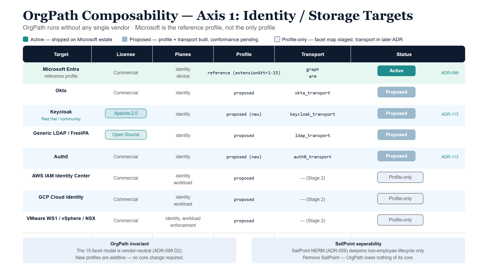
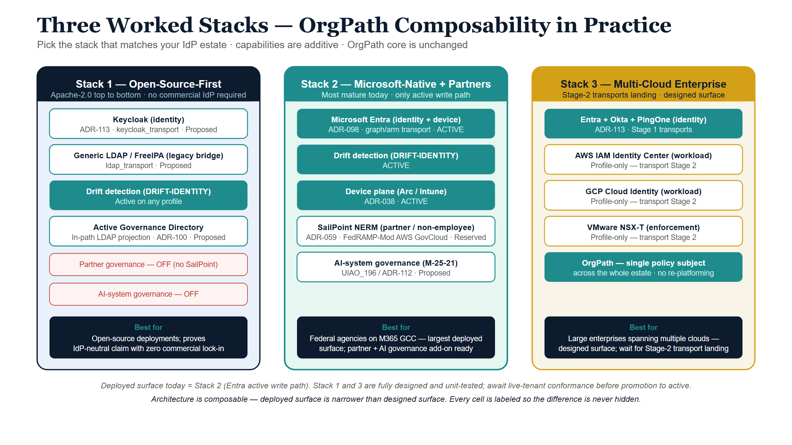

{#fig-orgpath-diagram-01 fig-alt="Table with eight rows of identity/storage targets showing target name, license, planes, profile, transport, and status. Row 1 Microsoft Entra green Active badge. Rows 2-5 Okta/Keycloak/Generic LDAP/Auth0 grey Proposed badges. Rows 6-8 AWS/GCP/VMware profile-only light-blue badges. Status legend at top: teal Active, grey Proposed, ice Profile-only. Bottom two ice panels: OrgPath invariant and SailPoint separability notes. White background, navy/teal palette." width="100%"}

## The substrate is à la carte by construction

UIAO is not a monolith you adopt whole. OrgPath — the 15-facet organizational
placement model (UIAO_151) — is the core substrate, and everything else is a
**profile** or an **adapter** that snaps onto it. [ADR-098](/docs/adr/adr-098-orgpath-vendor-neutral-binding-profiles.html)
states the rule directly: *"New profiles are additive — a vendor is onboarded by
writing a profile (locator map) + a transport... No core change is required."*

That means a customer chooses along two independent axes:

1. **Where identity lives** — which IdP / directory / cloud stores the facets.
2. **Which capabilities are switched on** — drift detection, Zero Trust
   enforcement, the non-employee / partner branch, AI-system governance, the
   device plane.

This paper makes those choices legible: a grid of what is **active** today,
what is **proposed** (built, pending live-tenant conformance), and what is
**N/A** for a given target — so a buyer can see exactly what they get by
picking a stack, and what each piece needs the others for.

## What needs what — the dependency truths

Three separability facts drive every cell below:

- **OrgPath runs without any single vendor.** The facet model is vendor-neutral;
  the Microsoft `extensionAttribute1..15` slot table is just the *reference*
  profile, not the schema (ADR-098 §D2). OrgPath governs humans, devices
  (ADR-038), and AI systems (UIAO_196) with or without any particular IdP.
- **SailPoint is an optional vertical, not a dependency.** The SailPoint NERM /
  ISC slots ([ADR-059](/docs/adr/adr-059-sailpoint-adapter-family.html)) are
  read-only (`ssot-mutation: never`), reserved, and only deepen the
  **non-employee / partner** branch (UIAO_141) that Microsoft has no
  FedRAMP-Moderate product for. Remove SailPoint and OrgPath loses nothing of
  its core; it loses only deep non-employee lifecycle.
- **Enforcement consumes facets through a profile's read side.** Zero Trust
  policy groups (NSX, Palo Alto, cloud-native) resolve a facet predicate
  (`Department=IT AND Classification=Contractor`) to a native construct
  (ADR-098 §D5) — so enforcement depends on a storage profile being present,
  not on a specific vendor.

## Axis 1 — Identity / storage targets

Status legend: **Active** = shipped and exercised on the Microsoft estate;
**Proposed** = profile + transport built, pending live-tenant conformance;
**Profile-only** = facet map exists, transport staged to a later ADR.

| Target | License | Plane(s) | Profile | Transport | Adapter status |
|---|---|---|---|---|---|
| Microsoft Entra | Commercial | identity, device | reference | `graph` + `arm` | **Active** |
| Okta | Commercial | identity | proposed | `okta_transport` | Proposed |
| Generic LDAP / FreeIPA | Open Source | identity | proposed | `ldap_transport` | Proposed |
| **Keycloak** (Red Hat / community) | **Apache-2.0** | identity | proposed | `keycloak_transport` | **Proposed (new, ADR-113)** |
| Auth0 | Commercial | identity | proposed | `auth0_transport` | **Proposed (new, ADR-113)** |
| PingOne | Commercial | identity | proposed | `pingone_transport` | **Proposed (new, ADR-113)** |
| AWS (IAM Identity Center) | Commercial | identity, workload | proposed | — (Stage 2) | Profile-only |
| GCP (Cloud Identity) | Commercial | identity, workload | proposed | — (Stage 2) | Profile-only |
| VMware (WS1 / vSphere / NSX) | Commercial | identity, workload, enforcement | proposed | — (Stage 2) | Profile-only |

::: {.callout-warning}
## ILLUSTRATIVE — replace before external release

**Deployment evidence for the Microsoft Entra Active row.** The status
legend above asserts Entra is "shipped and exercised on the Microsoft
estate," but this paper does not yet state the evidence behind that claim.
Before external release, replace this block with the real figures:

- **Tenant count:** exercised across `[N tenants]` in production
- **Scale:** `[X objects / users]` under active facet management (identity +
  device planes)
- **Time-in-production:** live since `[Month Year]`, i.e. `[Y months]` in
  production as of this paper's publication date

**Promotion criteria — moving a Proposed row to Active.** Unlike the figures
above, this is a real, statable policy, not an unknown fact: a Proposed row
(for example, **Keycloak**) promotes to Active once it (1) passes the full
adapter-conformance test suite defined in ADR-098 §D2 against a live
Keycloak instance, and (2) has at least one reference deployment running
the `keycloak_transport` write path in production for a sustained period.
Until both conditions are met and documented — with the same tenant count /
scale / time-in-production evidence template above — the row stays
Proposed, no matter how complete the profile and transport code are.
:::

The open-source path is real: **Keycloak + generic LDAP** give a customer a
fully open IdP storage layer under an Apache-2.0 substrate — no commercial IdP
required. The remaining cloud/multi-plane targets (AWS, GCP, VMware) have their
facet maps published; their write-back transports are staged because they are
multi-plane and SDK-bound.

## Axis 2 — Capability packs (mix and match)

| Capability | What it does | Depends on | Status |
|---|---|---|---|
| Facet stamping | Write the 10 named facets onto identity objects | any one Axis-1 target | Active (Entra) / Proposed (others) |
| Drift detection (DRIFT-IDENTITY) | Validate facet *values* vs codebook, independent of where stored | any profile | Active |
| Device plane | Stamp facets onto devices (Arc / Intune) | Entra/Arc | Active |
| AI-system governance | Govern AI systems as identity subjects (M-25-21) | OrgPath + ATO registry | Proposed (UIAO_196 / ADR-112) |
| Non-employee / **partner** branch | Contractor / vendor / sponsored-external lifecycle + risk | SailPoint NERM (optional) | Reserved (ADR-059) |
| Zero Trust enforcement | Facet predicate → native policy group | a profile's read side + enforcement vendor | Proposed (ADR-098 §D5) |
| Active Governance Directory | In-path LDAP read projection of the substrate | OrgPath | Proposed (ADR-100) |

{#fig-orgpath-diagram-02 fig-alt="Three vertical stack columns side by side. Stack 1 navy border: Open-Source-First with Keycloak, Generic LDAP, drift detection, Active Governance Directory, partner and AI governance off, Apache-2.0 top to bottom. Stack 2 teal border highlighted as most mature: Microsoft-Native plus Partners with Entra active, device plane, SailPoint NERM, AI-system governance, largest deployed surface. Stack 3 amber border: Multi-Cloud Enterprise with Entra plus Okta plus PingOne plus AWS GCP VMware profile-only, OrgPath as single policy subject. Each column has a navy best-for footer. White background." width="100%"}

## Three worked stacks

**Open-source-first.** Keycloak (identity) + generic LDAP (legacy directories) +
drift detection + Active Governance Directory. No commercial IdP, no SailPoint;
Apache-2.0 top to bottom. Governs employees and devices; partner governance off.

**Microsoft-native + partners.** Entra (identity + device, active) + SailPoint
NERM (non-employee/partner branch) + AI-system governance + drift. The most
mature stack today; the only one with an active write path.

**Multi-cloud enterprise.** Entra + Okta + PingOne (identity) with AWS/GCP
workload tagging and VMware NSX enforcement as those Stage-2 transports land —
OrgPath as the single policy subject across the whole estate.

## How to read the maturity honestly

A buyer should weight the matrix by status, not by row count. **Today's
demonstrable, write-capable path is Microsoft/Entra** plus read-only assessment.
The Okta/LDAP/Keycloak/Auth0/PingOne transports exist and are unit-tested but
await live-tenant conformance before promotion to `active`; AWS/GCP/VMware are
facet-mapped but transport-deferred. The architecture is genuinely composable;
the *deployed* surface is narrower than the *designed* surface, and this paper
labels every cell so the difference is never hidden.

## Companion series

- [OrgPath narrative](../orgpath-narrative/index.qmd) — the series-length telling of the substrate this matrix decomposes.
- [OrgPath for All Clouds](../orgpath-multicloud/index.qmd) — the multi-cloud binding-profile companion; the narrative form of the ADR-098 content that is this paper's canon source.

## References

- [ADR-098 — OrgPath Vendor-Neutral Binding Profiles](/docs/adr/adr-098-orgpath-vendor-neutral-binding-profiles.html)
- [ADR-099 — IdP Binding-Profile Expansion (PingOne, Keycloak, Auth0)](/docs/adr/adr-099-orgpath-idp-binding-profile-expansion.html)
- [ADR-113 — OrgPath IdP Transport Activation (Stage 1)](/docs/adr/adr-113-orgpath-idp-transport-activation.html)
- [ADR-059 — SailPoint Adapter Family](/docs/adr/adr-059-sailpoint-adapter-family.html)
- [ADR-085 — Universal-Enterprise Positioning](/docs/adr/adr-085-universal-enterprise-positioning.html)
