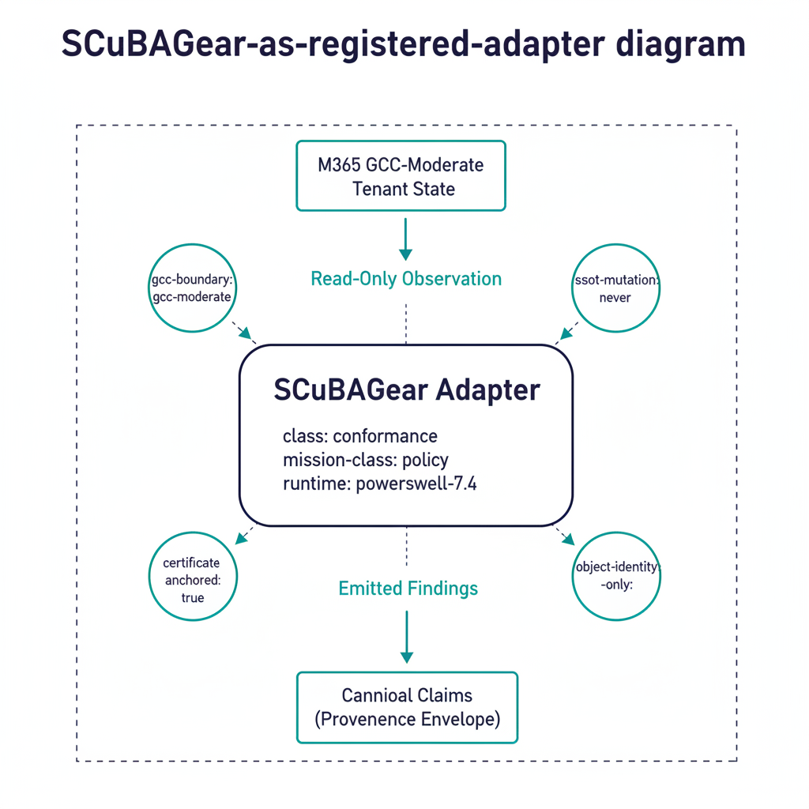

# SCuBAGear Integration

## Connecting CISA SCuBAGear outputs to UIAO's evidence pipeline

### Executive summary

CISA SCuBAGear is the federal community's PowerShell-based assessor that
evaluates Microsoft 365 tenant state against the **Secure Cloud Business
Applications (SCuBA)** baseline. It is widely deployed but is typically
operated as a **point assessor**: someone runs it, archives the report,
and revisits it at audit time.

UIAO's substrate treats SCuBAGear differently. Per
[`adapter-registry.yaml`](../../../src/uiao/canon/adapter-registry.yaml),
SCuBAGear is registered as the canonical **Phase-1 conformance / policy
adapter** for M365 — meaning its outputs flow through the canonical
evidence chain, its findings carry the canonical drift taxonomy, and its
report is one input to a continuous evidence pipeline rather than a
freestanding document.

This whitepaper explains the structural integration: what the SCuBAGear
adapter provides, how its OPA/Rego policy evaluations map onto UIAO's
canonical claims, and what an agency can do today versus what extends
the integration into target maturity.

The companion technical surface is the
[SCuBAGear Adapter Spec](../adapter-specs/scubagear/index.qmd), which
documents the runtime contract, configuration, and outputs in adapter-
implementer terms.

{#fig-scubagear-integration-whitepaper-image-01 fig-alt="Center shows the SCuBAGear adapter as a labeled rounded rectangle with its canonical metadata (class: conformance, mission-class: policy, runtime: powershell-7.4). Above the adapter, a teal arrow flowing in from \"M365 GCC-Moderate Tenant State\" represents read-only observation. Below the adapter, a teal arrow flowing out to \"Canonical Claims (provenance envelope)\" shows emitted findings. Surrounding the adapter, four canon invariants are labeled as small badges: gcc-boundary: gcc-moderate, ssot-mutation: never, certificate-anchored: true, object-identity-only: true. Clean engineering blueprint style, dark navy (#0D1B2E) and teal (#1E8C8C) on white background. No photographs, purely diagrammatic." width="85%"}

### 1. SCuBAGear as a registered adapter

The SCuBAGear adapter's canonical declaration:

```yaml
- id: scubagear
  name: CISA ScubaGear (M365 SCuBA Assessor)
  class: conformance
  mission-class: policy
  status: active
  phase: phase-1
  vendor: CISA
  license: CC0-1.0
  runtime: powershell-7.4
  runtime-version: "1.5.1"
  runner-class: github-hosted
  tenancy: per-customer
  evidence-class: interval
  retention-years: 3
```

Source: [`adapter-registry.yaml`](../../../src/uiao/canon/adapter-registry.yaml).

Five canonical properties matter for an authorizing official:

1. **`class: conformance`** — SCuBAGear observes; it does not mutate
   tenant state. Evidence emitted is read-only.
2. **`mission-class: policy`** — it evaluates state against canonical
   policies (the SCuBA OPA/Rego baselines), distinguishing it from
   pure telemetry adapters.
3. **`gcc-boundary: gcc-moderate`** (canon invariant) — the adapter is
   designed to operate inside GCC-Moderate, with explicit treatment of
   the boundary impact.
4. **`evidence-class: interval`** — findings carry a time interval, not
   a single instant. The canonical claim shape preserves this directly.
5. **`retention-years: 3`** — retention is canonical, not operator-
   chosen.

Registration in canon means the adapter's behavior is governed by the
substrate's drift engine: a SCuBAGear configuration that emits outside
its declared envelope is a `DRIFT-AUTHZ` finding, and a registry edit
that breaks the schema is a `DRIFT-SCHEMA` finding caught in CI.

### 2. From OPA/Rego policies to canonical claims

SCuBAGear's evaluation engine produces per-policy results: pass / fail /
manual / not-applicable, plus narrative detail. The UIAO adapter wraps
each result in the canonical provenance envelope (per
[`15_ProvenanceProfile.qmd`](../../docs/15_ProvenanceProfile.qmd)) and
maps it onto canonical KSI rules via the KSI mapping table at
[`uiao-control-to-ksi-mapping.yaml`](../../../src/uiao/rules/ksi/uiao-control-to-ksi-mapping.yaml).

The mapping yields three structural properties:

**Property 1 — every SCuBA policy result is a canonical claim.** Each
finding carries `claim_id`, `issuer_identity`, `source_classification`,
`extraction_timestamp`, `lineage_hash`. There is no "raw SCuBAGear
result" floating outside canon — every emission is structured.

**Property 2 — KSI mapping is canon-anchored.** The translation from a
SCuBA policy to a KSI rule is in canon, not in the adapter code. Adapter
authors cannot silently re-map a policy; mapping changes go through
schema-validated registry edits.

**Property 3 — interval evidence is preserved.** SCuBAGear runs on an
interval (workflow_dispatch, scheduled, or repository_dispatch). Each
run's claims carry the interval explicitly, and the bundle assembly
respects that — `evidence-class: interval` is not a hint, it is a
canonical attribute that the OSCAL emission consumes.

{#fig-scubagear-integration-whitepaper-image-02 fig-alt="Left side shows a stack of SCuBA OPA/Rego policy files (small Rego icon). Center shows a \"KSI Mapping (canon)\" registry box with arrows linking each SCuBA policy to one or more canonical KSI rules. Right side shows the canonical claim emerging with the full provenance envelope (claim_id, issuer_identity, source_classification: authoritative, extraction_timestamp, lineage_hash). Below the flow, an interval bar labeled \"evidence-class: interval\" shows time-windowed evidence emissions across multiple runs. Clean engineering blueprint style, dark navy (#0D1B2E) and teal (#1E8C8C) on white background. No photographs, purely diagrammatic." width="85%"}

### 3. Where SCuBAGear lands in the evidence chain

The four-stage evidence pipeline (see
[Evidence Chain](../architecture-series/evidence-chain.qmd)):

```
SCuBAGear run → claim normalization → bundle assembly+seal → OSCAL artifact
```

For a UIAO-anchored M365 deployment, SCuBAGear is one of the canonical
inputs at stage 1. Its findings:

- Feed the **KSI dashboard** for the M365 controls SCuBA covers.
- Populate **SSP narratives** for M365 control implementation status.
- Drive **POA&M items** when SCuBA returns a fail outside accepted
  exceptions.
- Anchor **Component Definition** evidence for M365 components.

Crucially, the bundle is **deterministic per ADR-006**: the same
tenant state plus the same SCuBA policy version plus the same canon
version yields a byte-identical bundle. A 3PAO can re-run the assembly
months after the original audit and verify the bundle hash.

{#fig-scubagear-integration-whitepaper-image-03 fig-alt="Vertical \"Authorization Boundary\" line splits the page; SCuBAGear adapter is positioned inside the boundary on the right side. Inside the boundary: SCuBAGear reads tenant configuration via in-boundary APIs (small API icon). Outside the boundary: greyed-out commercial-only telemetry features that SCuBA does not evaluate (small disabled-feature icons). The adapter's emitted claims flow downward across all four impact dimensions (telemetry fidelity, identity authority, enforcement responsibility, provenance classification) labeled as four colored lanes, with SCuBAGear's coverage shown in teal and uncovered gaps shown as dashed amber. Clean engineering blueprint style, dark navy (#0D1B2E) and teal (#1E8C8C) primary, with amber for uncovered gaps. No photographs, purely diagrammatic." width="85%"}

### 4. The GCC-Moderate boundary case

SCuBAGear is interesting in GCC-Moderate because it sits **inside the
boundary** and reads tenant state via in-boundary APIs. Per the
[Boundary Impact Model](../architecture-series/boundary-impact-model.qmd),
this means:

- **Telemetry fidelity:** SCuBAGear can read the configuration state
  the boundary actually exposes — which is *most* of what its policies
  evaluate, since the SCuBA baselines target configuration rather than
  the cloud-only telemetry features that GCC-Moderate attenuates.
- **Identity authority:** issuer identity for SCuBA findings is the
  tenant identity plane; resolution is in-boundary.
- **Enforcement responsibility:** SCuBAGear is conformance, not
  enforcement — it observes. Compensating enforcement adapters (where
  needed) are separate registry entries.
- **Provenance classification:** SCuBA findings are `authoritative` for
  configuration state, `derived` for any value computed from tenant
  data.

This is one of the cases where GCC-Moderate's structural constraints
work in the agency's favor: the SCuBA baselines were authored against
features that GCC-Moderate does expose, so the adapter has high
coverage in-boundary. Where coverage gaps exist (e.g. for cloud-only
telemetry features that SCuBA does not currently evaluate), the gap is
named and treated as a separate boundary finding.

### 5. SCuBA in the Federal SSOT story

SCuBAGear is one input to a larger compliance posture. UIAO's recent
canon work (PRs #390 / #393 / #394 / #395 / #397 / #402) frames the
identity layer as the SSOT root that federal data-governance mandates
sit on top of, and positions every adapter — including SCuBAGear — as a
node in a continuously-verified evidence chain rather than a
freestanding tool. This section maps SCuBAGear into that larger frame
so an authorizing official can see where the adapter fits in the
Federal SSOT posture, not just in M365 configuration assessment.

**What SCuBAGear sees, and what it does not.** SCuBAGear evaluates
configuration state in the M365 tenant — the cloud half of the
identity-and-data picture. The substrate's *on-premises half* is the
AD survey adapter at
[`src/uiao/adapters/modernization/active_directory/survey.py`](../../../src/uiao/adapters/modernization/active_directory/survey.py),
which produces the OrgTree readiness bundle including the phase-tagged
`spn_inventory` artifact introduced in PR #395 (defined in
[`src/uiao/schemas/orgtree-readiness/orgtree-readiness.schema.json`](../../../src/uiao/schemas/orgtree-readiness/orgtree-readiness.schema.json)
`#/definitions/spnInventory`). The two halves see different surfaces
and emit into the same Evidence Bundle — together they describe the
identity posture an agency carries through the AD → Entra ID transition,
not just the cloud baseline at a moment in time.

**Federal mandate alignment.** The
[Federal SSOT Alignment whitepaper](federal-ssot-alignment.qmd)
catalogues the federal mandates that the substrate as a whole supports
(Evidence Act, Federal Data Strategy, OMB M-22-09, FedRAMP 20x, NIST
800-63 AAL, DAMA-DMBOK, CDO Data Governance Board). SCuBAGear's role in
that catalogue is specific and bounded: it is the canonical
**configuration-conformance evidence source** for the M365 components
inside the GCC-Moderate boundary. CISA BOD 25-01's "core logging" intent
is satisfied directly by SCuBA configuration findings; CISA BOD 25-01's
"rapid detection and investigation" intent is *not* satisfied by
SCuBAGear alone — that requires the substrate's drift engine running
across SCuBA evidence plus the AD-side spn_inventory and the Purview
data-map state. SCuBAGear's `evidence-class: interval` and its
deterministic OSCAL emission are what make this drift comparison
mechanically possible.

**The GCC-Moderate three-way compliance conflict.** As §4 above notes,
SCuBAGear operates inside the GCC-Moderate boundary and its policies
were authored against features the boundary actually exposes. The
boundary itself, however, produces a structural compliance conflict
catalogued as a first-class finding in
[B.1.1 The Three-Way GCC-Moderate Compliance Conflict](../compliance/boundary-authorization/B1-1-gcc-moderate-three-way-conflict.qmd)
(TIC 3.0 × Zero Trust × FedRAMP 20x). SCuBAGear does not surface this
conflict directly — it is structural, not a per-policy finding — but
SCuBAGear's evidence is one of the artifacts the agency uses to
document the compensating controls that B.1.1 §4 catalogues. The B.1.1
finding (`GCC-BOUNDARY-3WAY-001`) references SCuBA conformance evidence
in its `compensating_controls` array as one of the agency-side controls
that demonstrates the boundary's risk is being continuously verified.

**Drift taxonomy cross-walk.** SCuBAGear findings map onto the
substrate's drift classes per the standard formalized in
[`docs/docs/16_DriftDetectionStandard.qmd`](../../docs/16_DriftDetectionStandard.qmd)
§2:

| SCuBA finding pattern | Drift class | Severity model reference |
|---|---|---|
| Tenant configuration drifts from a SCuBA baseline that previously passed | `DRIFT-SCHEMA` or `DRIFT-SEMANTIC` (depending on whether the schema or the value drifted) | §3 P3 by default; escalates to P2 if the drift affects a live KSI |
| SCuBA evidence claim emitted without a complete provenance envelope | `DRIFT-PROVENANCE` | §3 P1 — claim integrity is load-bearing |
| Conditional Access policy state contradicts the AAL recorded in the COR | `DRIFT-AUTHZ` | §3 P1 — authorization integrity is load-bearing |
| AAD principal in a SCuBA finding cannot be resolved in the identity plane | `DRIFT-IDENTITY` | §3 P1 — identity attribution is load-bearing |

§7 of the drift standard (Federal SSOT Context, added in PR #394) maps
these classes to the federal mandates each supports; §7.1 (SPN Drift
Detection, added in PR #397) catalogues the four SPN-specific drift
conditions that surface when the AD-side `spn_inventory` is compared
across migration phases. SCuBAGear evidence joins the spn_inventory
evidence in the same Evidence Bundle the 3PAO consumes — neither alone
is sufficient for the federal SSOT posture; together they are
continuous.

**Identity foundation beneath the Azure SSOT stack.** The
[OrgPath Narrative chapter 07a — UIAO Beneath the Azure SSOT Stack](../orgpath-narrative/07a-uiao-beneath-the-azure-ssot-stack.qmd)
positions the identity-governance substrate beneath the Microsoft
Fabric + OneLake + Purview Azure SSOT stack. SCuBAGear is the
configuration-baseline assessor for the Entra ID identity plane that
chapter 07a depends on. When chapter 07a says "the Azure SSOT stack
assumes a trusted, consistent, continuously-verified Entra ID identity
plane," SCuBAGear's interval-evidence emission is one of the substrate
mechanisms that produces that continuous verification.

**Reference deployment.** For a synthetic end-to-end engagement that
exercises SCuBAGear alongside the AD survey adapter, the spn_inventory
artifact, the OrgTree readiness bundle, the B.1.1 three-way conflict
finding, the SQL Server adapter, and the Azure SSOT bridge, see
[Federal Civilian AD → Entra ID + SQL Estate — Reference Deployment Pattern](../case-studies/reference-deployment-fedciv-ad-to-entra.qmd).
That case study is the canonical walkthrough showing where SCuBAGear's
output lands in the broader Evidence Bundle a federal civilian agency
produces under the substrate.

### 6. Why "interval" matters

An adapter declared `evidence-class: interval` is structurally different
from a `point-in-time` adapter:

- The bundle's SSP/POA&M/KSI emissions can express *windowed*
  conformance — e.g. "MS.AAD.1.1 passed for 100% of intervals in the
  last quarter except interval 2026-04-15..2026-04-22, which is
  POA&M-tracked."
- Drift findings detect *trend* changes, not just point changes. A
  control that was passing every interval and now fails one interval
  is a different finding from one that has been failing continuously.
- Determinism applies per interval: re-running for a specific interval
  produces the same bundle for that interval.

This is the structural reason SCuBAGear-anchored ATO packages can
carry continuous-conformance language honestly — the substrate
supports it.

### 7. Adoption posture

For an agency operating M365 today, the integration is incremental:

1. **Run the adapter** via the canonical runner (workflow_dispatch is
   the simplest entry point). Findings emit through the canonical
   evidence chain immediately; no separate operator process is needed.
2. **Map exceptions in canon, not narrative.** SCuBA findings that the
   agency has accepted as compensating-controlled belong in canon as
   exception declarations, not in a Word document. The schema gate
   catches dangling exceptions automatically.
3. **Pair with compensating-enforcement adapters where needed.**
   SCuBAGear observes but does not enforce. Where the agency needs
   enforcement for findings SCuBA reports, register the
   compensating adapter and let its evidence flow alongside.
4. **Surface drift findings to the AO, not just to the security
   operations team.** The adapter's drift findings (interval-to-
   interval changes, schema mismatches) are AO-visible artifacts in
   the OSCAL pipeline; treating them as such is a low-effort
   adoption step.

### 8. Honest limits

- SCuBAGear's coverage is per-policy. It evaluates the SCuBA baselines;
  it does not evaluate every M365 control. UIAO's adapter taxonomy
  includes additional Phase-1+ slots (`vuln-scan`, `stig-compliance`,
  `patch-state`) that round out coverage; SCuBAGear is the policy
  adapter, not the universal adapter.
- The adapter runs on an interval, not in continuous event-time mode.
  Continuous capture across all adapters is TARGET maturity for the
  substrate; SCuBAGear's interval mode is appropriate for its
  evaluation model.
- The canonical KSI mapping is curated. Mapping new SCuBA policies
  onto KSI rules is a canon-change operation, not an adapter-side
  edit.

### 9. Conclusion

CISA SCuBAGear is, in UIAO's substrate, **a canonical adapter, not a
freestanding tool.** Its findings carry full provenance, map onto KSI
rules through canon, flow through deterministic OSCAL emission, and
participate in the substrate-wide drift engine. For an agency operating
M365 in GCC-Moderate, SCuBAGear under UIAO is the most direct path
from "we run SCuBAGear periodically" to "we emit continuous, reproducibly
verifiable conformance evidence into our ATO package."

The substrate is what makes SCuBAGear's output assessable rather than
archived.
