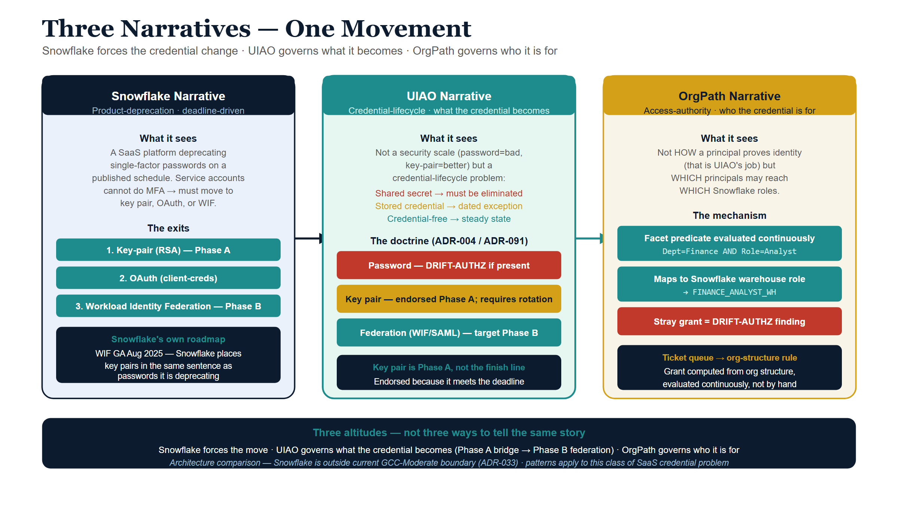
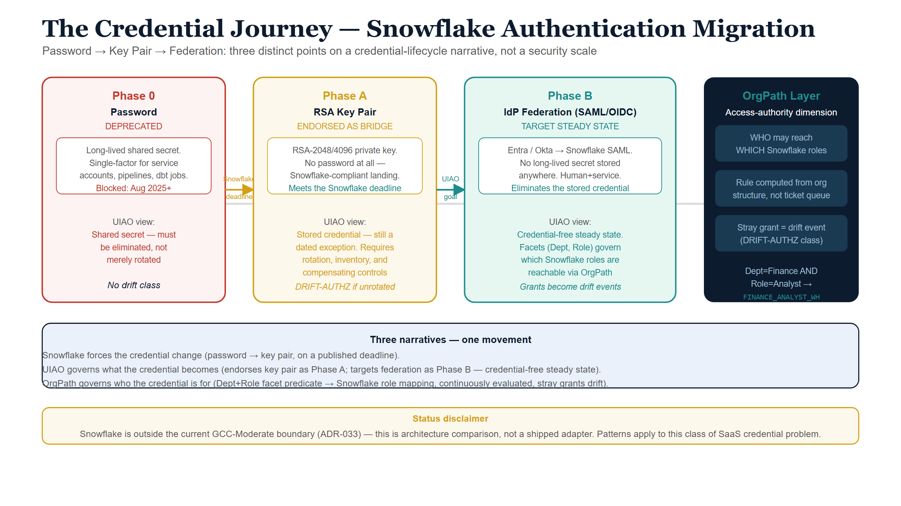

# Snowflake Key-Pair Conversion — the UIAO and OrgPath Reading {.unnumbered}

::: {.callout-important appearance="default"}
## Status — illustrative architecture comparison, not a shipped adapter
This whitepaper reads Snowflake's authentication migration through the UIAO and
OrgPath governance doctrine. It is an **architecture comparison**, not a claim
that UIAO ships a Snowflake adapter today. Snowflake is a **Commercial-cloud
SaaS platform outside the current GCC-Moderate deployment boundary** and is not
one of the named Commercial exceptions (Amazon Connect, SailPoint); for a
federal deployment, real Snowflake coverage would require a gating boundary
ADR in the pattern of `ADR-059` / `ADR-033`. (For non-federal engagements the
registration path now exists without a new enum value: ADR-129 added the
`commercial-general` boundary and ADR-133 added `state-local`.) Treat the patterns here as *how the substrate would
govern this class of problem*, not as accepted normative coverage of Snowflake.
The Snowflake product facts are cited to Snowflake's own documentation; the
UIAO/OrgPath positions are cited to canon.
:::

{#fig-snowflake-diagram-02 fig-alt="Three vertical columns representing three altitude narratives. Left column navy: Snowflake Narrative - product deprecation, deadline driven, exits are key pair, OAuth, and Workload Identity Federation. Center column teal: UIAO Narrative - credential lifecycle, what the credential becomes, three tiers: password must be eliminated red, key pair endorsed Phase A amber, federation target Phase B teal. Right column amber: OrgPath Narrative - access authority, who the credential is for, facet predicate Dept=Finance AND Role=Analyst maps to Snowflake warehouse role, stray grant equals DRIFT-AUTHZ finding. Bottom navy bar: three altitudes not three ways to tell same story. White background." width="100%"}

There are three narratives in this document, and the whole point is that they
are not the same story told three ways — they are three different altitudes of
the same migration.

The **Snowflake narrative** is a product-deprecation narrative: passwords are
being switched off on a published schedule, and every account has to land
somewhere else before the lights go out. Snowflake's recommended landing spot
for the accounts that cannot do interactive multi-factor authentication — the
service accounts, the pipelines, the dbt jobs — is **key-pair authentication**.
The "key-pair conversion" is the project that gets you off the password and onto
an RSA key before the deadline.

The **UIAO narrative** is a credential-lifecycle narrative. UIAO does not see a
password and a key pair as two points on a security scale where the key pair is
simply "more secure." It sees a *shared secret that must be eliminated* (the
password) and a *stored credential that should be a dated, compensated exception*
(the raw key pair) on the way to a *credential-free steady state* (federation to
the identity provider, where no long-lived secret is stored anywhere). The
key-pair conversion is endorsed — but as Phase A of a longer move, not as the
finish line.

The **OrgPath narrative** is an access-authority narrative. It is not about *how*
a principal proves who they are (that is the authentication question UIAO
answers); it is about *which* principals may reach *which* Snowflake roles, and
whether that grant is computed from the organization's own structure or
maintained by hand in a ticket queue. OrgPath is the coordinate system that
turns "who should have access to the finance warehouse" into a rule the
substrate evaluates continuously, and turns a stray grant into a drift event.

Read together, the three describe one movement: Snowflake forces the credential
change; UIAO governs *what the credential becomes*; OrgPath governs *who the
credential is for*. This document takes each in turn, then puts them
side-by-side.

{#fig-snowflake-diagram-01 fig-alt="Horizontal credential journey diagram with four phases connected by arrows. Phase 0 red-bordered: Password DEPRECATED, long-lived shared secret, blocked Aug 2025, UIAO view shared secret must be eliminated. Arrow labeled Snowflake deadline. Phase A amber-bordered: RSA Key Pair ENDORSED AS BRIDGE, meets deadline, UIAO view stored credential requires rotation and compensating controls, DRIFT-AUTHZ if unrotated. Arrow labeled UIAO goal. Phase B teal-bordered: IdP Federation SAML/OIDC TARGET STEADY STATE, no long-lived secret stored anywhere, grants become drift events. OrgPath navy column on right: facet predicate Dept=Finance AND Role=Analyst maps to FINANCE_ANALYST_WH, stray grant equals DRIFT-AUTHZ. Bottom ice panel: three narratives one movement summary. Amber disclaimer note at bottom. White background." width="100%"}

## Part 1 — The Snowflake narrative

### Why the conversion is happening at all

Snowflake is retiring single-factor password sign-ins on a published, phased
schedule. Human users on accounts without a custom authentication policy were
required to enroll in MFA the next time they signed in with a password
(beginning April 2025); MFA became mandatory for all password-based human
sign-ins regardless of policy (August 2025); and single-factor password sign-in
attempts are blocked outright thereafter, with the final enforcement phase
scheduled across 2026 ([Snowflake — *Planning for the deprecation of
single-factor password sign-ins*](https://docs.snowflake.com/en/user-guide/security-mfa-rollout)).
The driver is the credential-theft reality of a SaaS data platform: a password
is a reusable secret, and a reused secret is the entire attack.

The deprecation has a structural consequence that the human-MFA story tends to
bury. **MFA is not available to a non-interactive account.** A nightly ELT job,
a dbt run, an ingestion pipeline, a BI service connection — none of these can
answer a push prompt. So the password deprecation splits the estate in two:
human users move to MFA (or SSO), and **service users must move off passwords to
a non-interactive credential.** Snowflake names exactly which credentials remain
acceptable: the deprecation "doesn't apply to customers using key-pair
authentication or single sign-on users using … SAML or OAuth"
([Snowflake — *security-mfa-rollout*](https://docs.snowflake.com/en/user-guide/security-mfa-rollout)).
That sentence is the whole map. There are three exits from the password, and the
"key-pair conversion" is the first of them.

### What the key-pair conversion actually is

Snowflake key-pair authentication assigns an RSA **public** key to a user with
`ALTER USER <u> SET RSA_PUBLIC_KEY='…'`; the client holds the matching
**private** key and authenticates by signing a JWT that Snowflake verifies
against the stored public key. The method requires a **2048-bit RSA key pair**
as a minimum, and supports make-before-break rotation by allowing two active
public keys at once via the `RSA_PUBLIC_KEY` and `RSA_PUBLIC_KEY_2` parameters:
generate a new pair, set the unused slot, cut the client over, then remove the
old key ([Snowflake — *Key-pair authentication and key-pair rotation*](https://docs.snowflake.com/en/user-guide/key-pair-auth)).

For service workloads, the modern target is `TYPE = SERVICE` users, which cannot
hold passwords or do MFA and authenticate with key pair, OAuth, or workload
identity. The conversion project, in practice, is: inventory the password-bearing
service accounts, generate a key pair for each, register the public key, store
the private key where the workload can read it, and disable the password.

### Where the Snowflake narrative quietly points next

Snowflake's own documentation does not stop at the key pair. In August 2025 it
made **workload identity federation (WIF)** generally available, and it describes
WIF in terms that matter to this whole discussion: WIF lets workloads
authenticate "using their cloud provider's native identity system, such as AWS
IAM roles, Microsoft Entra ID, and Google Cloud service accounts," and — in
Snowflake's own words — **"removes the need to manage and store long-lived
credentials such as passwords, API keys, key pairs, and programmatic access
tokens"** ([Snowflake — *Workload identity federation*](https://docs.snowflake.com/en/user-guide/workload-identity-federation);
[GA announcement, 2025-08-14](https://docs.snowflake.com/en/release-notes/2025/other/2025-08-14-wif)).

Read that list again: Snowflake places **key pairs in the same sentence as the
passwords it is deprecating** — both are long-lived credentials WIF exists to
eliminate. The vendor's own roadmap therefore already contains the UIAO thesis.
The key-pair conversion is the move you make under deadline pressure; federation
is the move the platform tells you is the destination. The rest of this document
is about making that distinction governable rather than incidental.

## Part 2 — How UIAO would do it

UIAO already has a fully-formed doctrine for this exact problem shape. It was
written for SQL Server and for Kerberos/NTLM, but the logic is platform-agnostic
because the object classes are the same everywhere: a shared secret, a stored
credential, and a federated identity. UIAO's reading of the Snowflake conversion
is four moves, in order.

### Move 1 — The password is a `type-S` login; it must end, not rotate

`ADR-091` governs the SQL Server engine-authentication transformation, and its
governing sentence about SQL Authentication transfers to a Snowflake password
without modification: such a credential "produces no Entra ID sign-in events and
is invisible to Conditional Access and Defender for Identity; it is not an
acceptable steady-state credential." A Snowflake password is the identical
object — a platform-local shared secret, replayable, invisible to the identity
provider. UIAO's position on it is not "rotate it more often" or "make it
longer." It is **eliminate it**. On this point UIAO and Snowflake's deprecation
agree completely, which is why the conversion is endorsed without
qualification. The disagreement is entirely about what comes next.

### Move 2 — The raw key pair is the interim posture, not the destination

`ADR-068` (Kerberos/NTLM elimination) establishes the pattern that a
cryptographic, non-password credential can be the **authorized *interim* posture**
while the federated steady state is stood up — the role it assigns to
Certificate-Based Authentication as the interim NTLM-replacement, carried forward
in `ADR-091 §4` as "the authorized interim posture." A Snowflake RSA key pair
occupies that slot precisely. It is unambiguously better than a password — it is
replay-resistant and public-key based, which is the direction the IA-5(2)
(public-key authentication) and IA-2(8) (replay resistance) controls point — but
the authentication still **terminates at Snowflake**. No Entra sign-in event is
produced, so **Conditional Access never evaluates it**: not device compliance,
not Named Locations, not sign-in risk. Under UIAO doctrine that makes raw
key-pair auth an **exception-register entry**, and the exception process
(per `ADR-068` / `ADR-091 §4`) requires four things on each entry: the
inability-to-federate reason, a named compensating control, a maximum duration,
and a **sunset date**.

### Move 3 — The stored private key is a credential UIAO already named and rejected

This is the move most key-pair-conversion projects miss. A Snowflake private key
lives in a `.p8` PEM file on the client — exportable software key material unless
deliberately engineered otherwise. It can be copied, committed to a repository,
baked into a container image, or left on a developer laptop. UIAO has a name for
this object: it is a **stored bootstrap credential**, and `ADR-004` (Workload
Identity Federation as Default for External Integrations, *ACCEPTED*) rejects it
as the target for new integrations in language that reads as if it were written
for Snowflake. `ADR-004`'s decision: workload identity federation "is the default
target for all external platform integrations… **Client secrets are prohibited
for new integrations. Certificate-based auth is permitted only when the external
platform lacks OIDC issuer capability.**"

Map that onto Snowflake one-to-one: the Snowflake password is the prohibited
client secret; the RSA key pair is the certificate-based fallback "permitted only
when the external platform lacks OIDC issuer capability"; and WIF is the default.
UIAO's verdict is therefore not a novel opinion about Snowflake — it is the
direct application of an accepted ADR. The "key-pair conversion" relocates the
risk from *password in a config file* to *private key in a PEM file*; it does not
escape the stored-credential class. That is acceptable as a bridge and
unacceptable as a destination.

### Move 4 — The destination is federation; no long-lived secret anywhere

`ADR-002` makes the Managed Identity the credential-free destination (the
platform mints a short-lived token; nothing is stored), and `ADR-004` makes WIF
the default for exactly the external-platform integration class Snowflake service
accounts belong to. The Snowflake-native realizations that reach this bar are the
other two exits Snowflake named:

- **Human users → Entra SSO (SAML / OAuth).** The sign-in becomes an Entra
  event, so Conditional Access and Identity Protection apply — MFA, device
  compliance, location, and sign-in risk are enforced *at the IdP*, the
  zero-trust posture `ADR-008` requires, anchored to OMB M-22-09. The password
  is gone and so is the blind spot.
- **Service users → Workload Identity Federation.** An Azure **Managed Identity**
  (or other OIDC workload identity) is exchanged for a short-lived Snowflake
  token, **with no RSA private key at rest**. This is the Snowflake analogue of
  "Arc Managed Identity, not service-principal-with-secret," and it is the move
  Snowflake's own WIF documentation describes as removing stored key pairs
  entirely. Snowflake's WIF supports the Entra-ID provider directly, so the
  credential authority becomes the same Entra tenant that governs every other
  identity in the estate.

### Move 5 — Closure is continuous, not a point-in-time checkbox

`ADR-091` closes a transformation only under *continuous* verification: a new
`type-S` login appearing, or a mode reverting, is a compliance violation, not a
note for the next audit. The Snowflake equivalent of a closed conversion is:
**zero users with password authentication enabled outside the exception
register; every key-pair user inside the register carrying a sunset date toward
federation; every active key inside its rotation SLA.** A newly-created
password-enabled user, or a key past its rotation age, is not a finding that
waits for the annual review — under UIAO it is a live **DRIFT-IDENTITY** event,
which is precisely where OrgPath enters.

## Part 3 — How OrgPath would do it

Everything in Part 2 was about *the credential* — what a Snowflake principal uses
to prove identity. OrgPath governs the orthogonal axis: *which* principals reach
*which* Snowflake roles, and whether that mapping is computed or hand-maintained.
A key-pair conversion that perfectly modernizes the credential while leaving
role membership in a spreadsheet has solved the smaller half of the problem.

### OrgPath is the access-authority, not another authenticator

OrgPath is the organizational coordinate system Microsoft's identity stack does
not supply on its own: a vendor-neutral multi-facet schema (`ADR-078`, the
15-facet model; `ADR-098` defines per-IdP binding profiles, with the Entra
`extensionAttribute` slot table as the reference binding) — region, division,
department, account-type, clearance, and the rest — populated from HR data and
bound to a governed **Codebook** (`UIAO_151`, `ADR-035`) that defines the legal
values for each facet. It is not a packed path string in a single attribute and
it is not a credential; it is the structured truth about *who a principal is in
the organization*, which is exactly the input an access decision needs.

The SQL Server transformation already consumes OrgPath at one structural point —
access control — and the Snowflake case is the same seam in a different platform.
On SQL Server, OU-derived AD groups become **Entra dynamic security groups whose
membership is computed from OrgPath facets** rather than maintained by helpdesk
ticket; those groups become the database's `type-E` logins. The canonical rules
are not hand-authored `New-MgGroup` calls — they are **rendered** by the
dynamic-group library from
[`dynamic-groups.yaml`](https://github.com/WhalerMike/uiao/blob/main/src/uiao/canon/data/orgpath/dynamic-groups.yaml)
against the active Codebook, under `ADR-036` and `ADR-084`.

### The Snowflake mapping

Snowflake's access model is role-based: privileges attach to roles, roles are
granted to users. OrgPath's contribution is to make **role membership a function
of organizational facts** instead of an accumulation of manual `GRANT ROLE`
statements. The chain is the same shape as the SQL Server seam:

- An Entra **dynamic security group** is rendered from per-facet predicates
  (`ADR-036`) — e.g. *division = Finance* **and** *account-type = service* — with
  no hand-authored membership.
- That group is federated into Snowflake through the **SSO/SCIM** path, where it
  maps to a Snowflake **role**. (Snowflake supports SCIM provisioning and
  role mapping from Entra; the federation is the same one Move 4 stands up for
  authentication, now carrying authorization too.)
- A principal therefore obtains the Finance-service role **because their HR-driven
  OrgPath facets say they belong there**, and loses it automatically when those
  facts change — a mover/leaver event re-renders the group, and the Snowflake
  grant follows without a ticket.

Delegation rides the same structure. The people who manage those access groups
get a scope through an **Administrative Unit** (`ADR-037`) shaped by the same
OrgPath branch structure — a data-platform owner administers the Snowflake access
groups for their division and nothing else. The structure that drives the grants
also bounds who may edit them.

### Drift is where OrgPath closes the loop the conversion opens

Move 5 said a stray password-enabled user or an over-age key is a
**DRIFT-IDENTITY** event. OrgPath's drift engine (`ADR-040`, `UIAO_163`) is the
machinery that makes that statement operational rather than aspirational. It
compares the *observed* Snowflake state against the *computed* desired state and
emits a typed finding when they diverge:

| Observed condition on Snowflake | Desired state | Drift class |
|---|---|---|
| A user has password authentication enabled | Password disabled; key-pair (registered exception) or federated | DRIFT-IDENTITY |
| A key-pair user has no entry in the exception register / no sunset date | Every interim key-pair carries reason + compensating control + sunset | DRIFT-PROVENANCE |
| An active RSA key is past its rotation SLA | Key age within policy (`RSA_PUBLIC_KEY` / `RSA_PUBLIC_KEY_2` rotated) | DRIFT-IDENTITY |
| A role is granted to a user whose OrgPath facets don't satisfy the rule | Role membership = the rendered dynamic-group predicate | DRIFT-AUTHZ |
| A service user holds an exportable private key where WIF is available | Federated (WIF) per `ADR-004` default | DRIFT-IDENTITY |

The difference from a conventional Snowflake access review is the tense. A review
asks "is this correct *today*?" once a quarter. The drift engine asks it
continuously, expresses the answer as a typed event the substrate already knows
how to route, and treats a re-introduced password or an unauthorized grant as a
**change in who can reach the data**, not a cosmetic configuration delta. That is
the same continuous-closure posture `ADR-091` demands for SQL Server, applied to
the Snowflake estate.

## The three narratives, side by side

The clearest way to see the difference is to put the same migration through all
three lenses at once. The Snowflake narrative is correct about the destination
for humans (SSO) and correct that key-pair is *a* valid exit; UIAO and OrgPath
add the altitude that turns a deadline-driven credential swap into a governed
end-state.

| Dimension | Snowflake narrative | UIAO reading | OrgPath reading |
|---|---|---|---|
| **Password** | Deprecated on a schedule; block single-factor sign-in | `type-S` shared secret — **eliminate** (`ADR-091`) | n/a (credential, not access) |
| **Key pair (the conversion)** | An accepted, exempt credential; the recommended service-account exit | **Authorized interim posture** — exception-register entry with compensating control + sunset (`ADR-068`, `ADR-091 §4`); a *stored bootstrap credential* rejected as a *target* by `ADR-004` | n/a |
| **Human steady state** | MFA, or SSO (SAML/OAuth) | Entra SSO so Conditional Access applies (`ADR-008`, OMB M-22-09) | OrgPath facets → dynamic group → Snowflake role |
| **Service steady state** | Key pair, OAuth, or WIF | **WIF / Managed Identity — no stored secret** (`ADR-004`, `ADR-002`) | OrgPath facets (incl. account-type=service) → role |
| **Who gets which role** | Manual `GRANT ROLE`, or SCIM | (out of scope — authentication axis) | **Computed** from per-facet predicates (`ADR-036`, `ADR-078`); SCIM-federated |
| **Delegation** | Account/security admins | (out of scope) | Administrative Unit scoped to the OrgPath branch (`ADR-037`) |
| **Closure** | Deadline passes; project closed | **Continuously verified** (`ADR-091`) | Drift engine emits DRIFT-IDENTITY / -AUTHZ / -PROVENANCE (`ADR-040`, `UIAO_163`) |
| **Replay resistance (IA-2(8)) / public-key (IA-5(2))** | ✅ once on key pair or SSO | ✅ — and IdP-visible only at the federated end state | ✅ inherited |

### A worked sequence

For a single Snowflake service account that authenticates with a password today,
the governed conversion is:

1. **Inventory and classify** (OrgPath / drift): the account surfaces as a
   password-bearing principal → DRIFT-IDENTITY. Its OrgPath facets (or the lack
   of them) determine which role it *should* hold.
2. **Phase A — convert to key pair** (UIAO interim): register the RSA public key,
   disable the password, and **file the exception** — reason ("workload not yet
   on a WIF-capable runtime"), compensating control (passphrase-encrypted key in
   a restricted secret store, rotation SLA), and a **sunset date**. The deadline
   is met; the password is gone; the residual risk is named, not hidden.
3. **Phase B — federate** (UIAO destination): move the workload onto a
   WIF-capable identity (Azure Managed Identity / OIDC), configure Snowflake WIF
   for the `TYPE = SERVICE` user, and **retire the key pair**. The exception
   closes; no long-lived secret remains.
4. **Throughout — govern access** (OrgPath): the role the account holds is the
   one its facets compute to; a change in organizational fact re-renders the
   grant; an out-of-rule grant is DRIFT-AUTHZ. Closure is continuous.

A pure Snowflake project stops at step 2 and calls it done. The UIAO/OrgPath
reading treats step 2 as the bridge it is, drives toward step 3, and never lets
step 4 fall back to manual.

## Where this would sit in the substrate

This section is a *placement sketch*, not an authorization to build.

Snowflake is **Commercial-cloud SaaS, outside the current GCC-Moderate
deployment boundary**, and it is not one of the named Commercial exceptions
(Amazon Connect, SailPoint). Before any Snowflake adapter could exist, the
boundary question is a **gating ADR decision**. For a GCC-Moderate federal
deployment, a Snowflake exception would need its own `gcc-boundary` enum value
added in lockstep with an authorizing ADR — the pattern `ADR-059` set for
SailPoint and `ADR-033` defines for boundary drift. Since this paper was first
drafted, the enum has also gained `commercial-general` (ADR-129) and
`state-local` (ADR-133); a non-federal Snowflake engagement would register
under `commercial-general` rather than minting a new value, but the
authorizing-ADR requirement stands either way. Nothing in this whitepaper
authorizes that step.

*If* authorized, the natural shape follows the existing adapter taxonomy
(UIAO_003): a **modernization / identity** adapter that reads the Snowflake user
inventory and each user's `TYPE` and authentication policy, classifies every
principal as `password` / `keypair` / `federated`, plans the conversion, and
(dry-run by default, like every OrgPath writer) applies the `ALTER USER`
changes. A read-only conformance-axis counterpart would assess posture without
writing. The drift surface, the KSI family (key-rotation cadence + password
elimination, shaped like the existing KSI families), and the evidence binding to
**IA-5(2)**, **IA-2(8)**, and **IA-2 / AC-17** (the OMB M-22-09 zero-trust
anchor) would all reuse machinery the substrate already has.

## What this document does not claim

For the avoidance of doubt, and in keeping with the substrate's provenance
discipline:

- It does **not** claim UIAO ships a Snowflake adapter or governs a Snowflake
  estate today. This is an architecture comparison.
- It does **not** claim Snowflake is inside the GCC-Moderate boundary or is an
  authorized exception. Bringing it in-boundary is a gating-ADR decision
  (`ADR-059` / `ADR-033` pattern) this document does not make.
- It does **not** claim key-pair authentication is insecure or wrong. It is a
  correct, replay-resistant, public-key credential and a legitimate interim
  posture; the only claim is that a *stored* key pair is a bridge, not the
  credential-free destination `ADR-004` makes the default.
- It does **not** prescribe hand-authored Snowflake `GRANT` statements as the way
  to assign access. The governed path renders access from OrgPath facets
  (`ADR-036`) and federates it via SCIM.

## Companion canon

For the normative decisions this whitepaper reads Snowflake against:

- [ADR-004](/docs/adr/adr-004-workload-identity-federation-default.html) —
  Workload Identity Federation as Default for External Integrations (*ACCEPTED*);
  the credential-free destination and the prohibition on stored secrets for new
  integrations.
- [ADR-091](/docs/adr/adr-091-sql-server-authentication-transformation.html) —
  SQL Server Engine Authentication Transformation; `type-S` elimination, interim
  posture, and continuous closure (the platform-analogous template; **PROPOSED**).
- [ADR-068](/docs/adr/adr-068-kerberos-ntlm-elimination.html) — Kerberos / NTLM
  Elimination; the interim-posture pattern and exception register.
- [ADR-002](/docs/adr/adr-002-arc-entra-join-no-domain-join.html) — the
  credential-free Managed Identity destination.
- [ADR-008](/docs/adr/adr-008-zero-trust-identity.html) — Zero-Trust Identity
  (Conditional Access; OMB M-22-09 anchor).
- `ADR-036` — Dynamic Group Provisioning (OrgPath-driven Entra access groups).
- `ADR-037` — Administrative Unit Provisioning (the delegation surface).
- `ADR-078` — OrgPath 15-facet Attribute Schema; `ADR-035` / `UIAO_151` — the
  Codebook binding.
- `ADR-040` / `UIAO_163` — the drift engine that makes a re-introduced password
  or an out-of-rule grant a compliance signal.
- `ADR-059` / `ADR-033` — the Commercial-exception boundary pattern any real
  Snowflake coverage would have to follow.

## Companion series

- [SQL Server Identity Transformation](../sql-server-narrative/index.qmd) — the
  same authentication-transformation doctrine worked end-to-end on a different
  platform; the closest structural sibling to this whitepaper.
- [UIAO OrgPath](../orgpath-narrative/index.qmd) — the substrate this document's
  Part 3 consumes.
- [OrgPath × SQL Server — The Integration Bridge](../sql-server-narrative/bridge-orgpath-sql.qmd)
  — the seam model this whitepaper reuses for Snowflake.

## Sources (Snowflake product facts)

External facts about Snowflake's behavior are cited directly to Snowflake's
documentation, current as of June 2026; verify against the live pages before
relying on specific dates or parameter names, as vendor schedules move.

- [Planning for the deprecation of single-factor password sign-ins](https://docs.snowflake.com/en/user-guide/security-mfa-rollout)
- [Key-pair authentication and key-pair rotation](https://docs.snowflake.com/en/user-guide/key-pair-auth)
- [Workload identity federation](https://docs.snowflake.com/en/user-guide/workload-identity-federation)
  and its [GA announcement (2025-08-14)](https://docs.snowflake.com/en/release-notes/2025/other/2025-08-14-wif)
- [Overview of Snowflake authentication](https://docs.snowflake.com/en/user-guide/security-authentication-overview)
