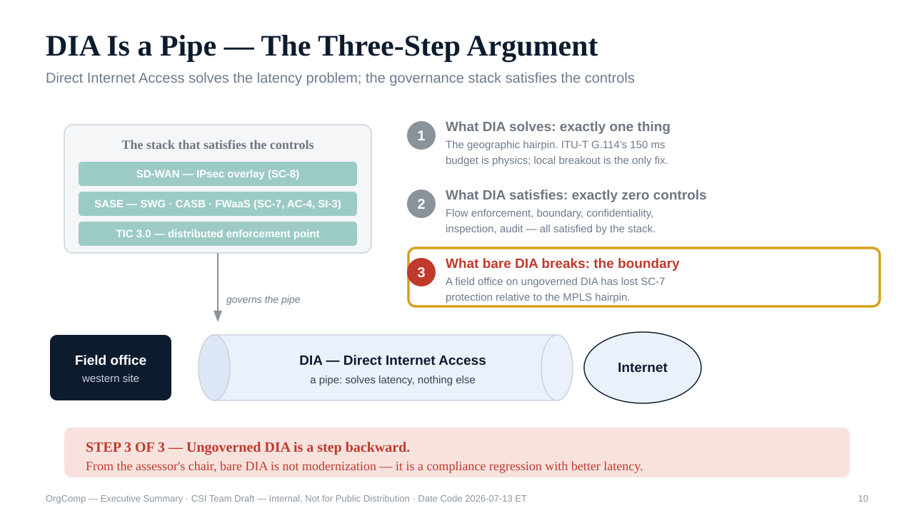
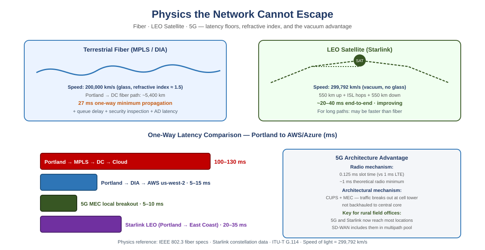
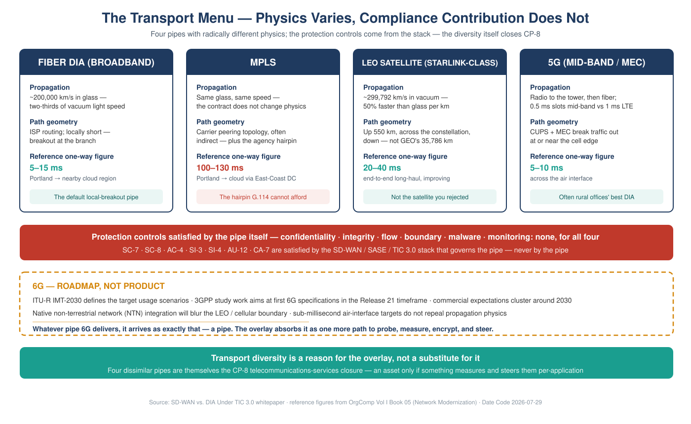
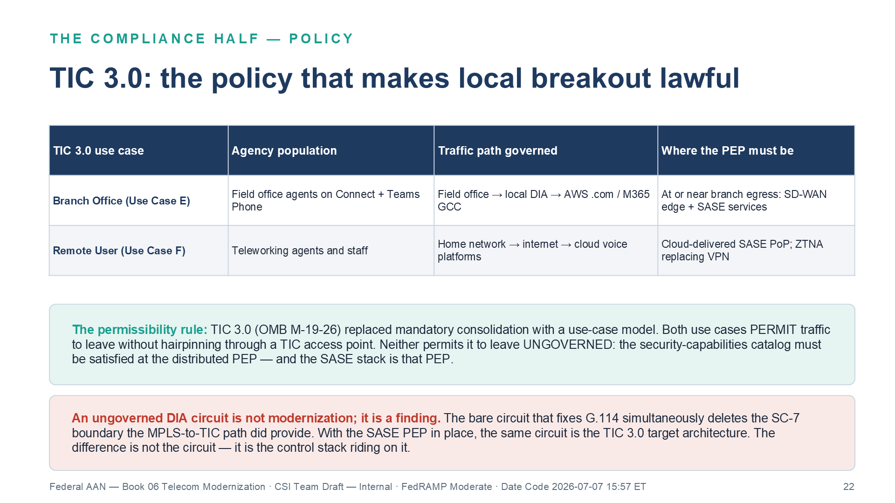
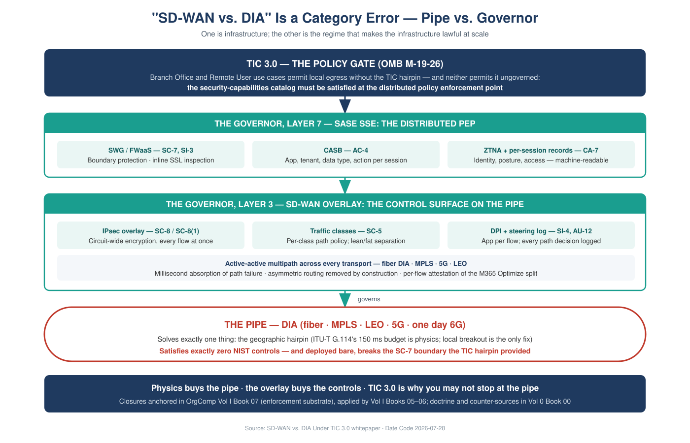
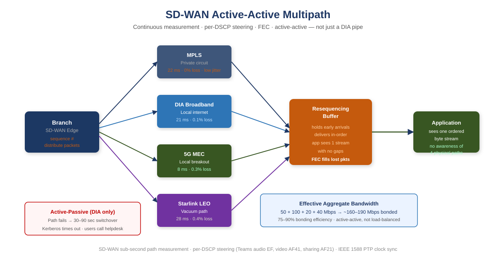
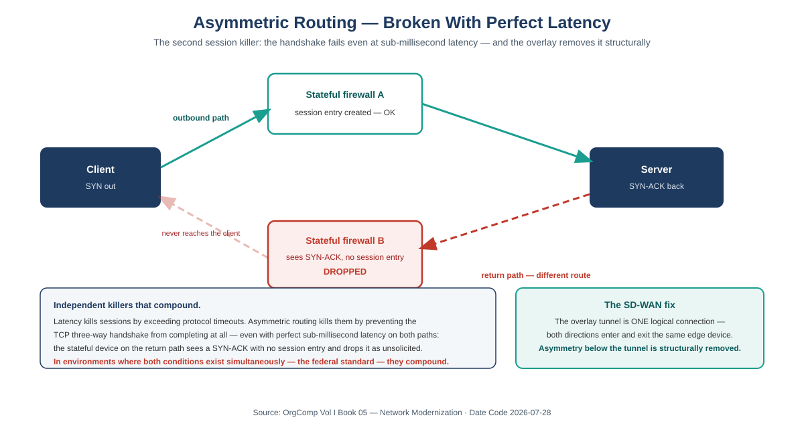
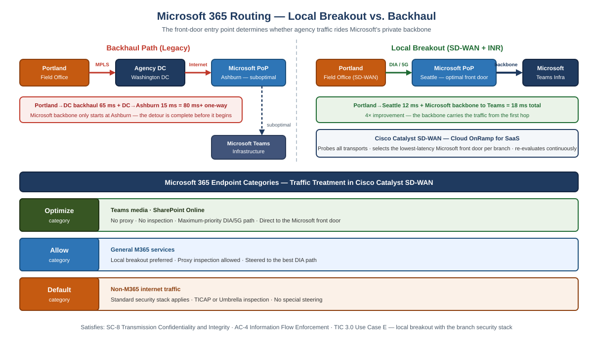
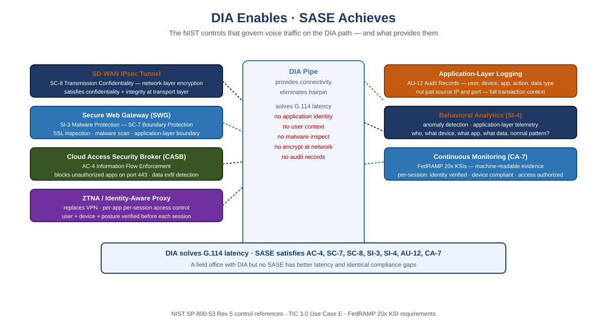
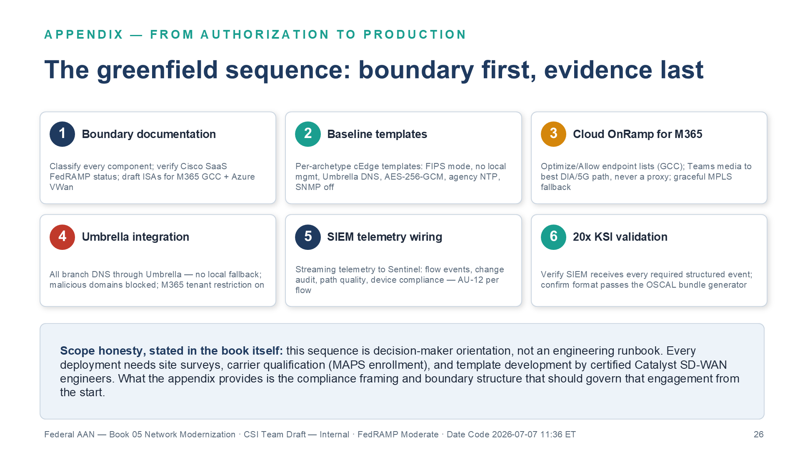

# SD-WAN vs. DIA Under TIC 3.0 {.unnumbered}

::: {.content-visible when-format="html"}
::: {.callout-tip appearance="simple"}
**[Download this whitepaper as DOCX](tic3-sdwan-vs-dia.docx)** — a Word copy of
this page, regenerated on every site deploy. (Also available from the
**Other Formats** link in the page sidebar.)
:::
:::

::: {.callout-note}
## In this whitepaper

Federal network modernization conversations keep framing a decision as
"SD-WAN vs. DIA" — as if the two were competing answers to the same question.
They are answers to different questions, and agencies that treat them as
alternatives end up with one of two failure modes: a governed network that is
too slow for voice, or a fast network that is a compliance finding.

This paper makes eight arguments, one per part:

1. **The versus is false.** DIA is a pipe; SD-WAN is the control surface that
   governs pipes. DIA solves exactly one problem (the geographic hairpin),
   satisfies none of the confidentiality, integrity, flow-enforcement,
   boundary, malware, or monitoring controls claimed near it — and, deployed
   bare, leaves the branch egress outside any assessed boundary.

2. **DIA exists because of physics, not preference.** Light in fiber travels
   at roughly 200,000 km/s, ITU-T G.114 budgets 150 ms one-way for voice, and
   no security product shortens a fiber path. Local breakout is the only
   latency fix that exists; everything else in the stack is there to make
   that fix lawful and evidenced.

3. **Every transport is a pipe — and the pipe menu closes exactly one
   control family.** Fiber DIA, MPLS, LEO satellite (Starlink), and 5G
   differ enormously in physics and not at all in their contribution to the
   protection controls, which is zero for all four. What transport selection
   *does* close is CP-8 Telecommunications Services — specifically its
   CP-8(2) and CP-8(3) provider- and path-diversity enhancements — which is
   precisely why you buy four pipes; the priority-of-service and
   provider-contingency-plan enhancements require separate contractual and
   provider artifacts (Part 8). 6G will extend the physics menu without
   changing that conclusion.

4. **TIC 3.0 is the policy gate — and it cuts both ways.** OMB M-19-26
   replaced mandatory TIC consolidation with a use-case model: branch
   traffic may egress locally *only when* the security-capabilities catalog
   is satisfied at a distributed policy enforcement point — and only while
   the agency's telemetry obligations to CISA are met. The PEP also has a
   location, and the paper's own physics argument applies to it.

5. **SD-WAN is the transport governor — necessary, not sufficient.** The
   overlay contributes circuit-wide IPsec encryption (SC-8), traffic-class
   separation (SC-6), and application-layer path telemetry (SI-4), plus
   active-active multipath. The boundary, flow, and malware closures come
   from the SASE stack above it: SD-WAN alone does not satisfy the TIC 3.0
   Branch Office use case.

6. **The governor is itself attack surface.** A controller with agency-wide
   routing and policy authority, and a fleet of internet-facing edges
   replacing two hardened egress points, are consequential new exposures —
   edge-management-plane products are among the most actively exploited
   categories in federal networks. A paper that credits the governor with
   eight closures owes the reader the controls that protect the governor.

7. **The coverage claims are honesty-clause claims, not absolutes.**
   FIPS-validated per-flow TLS closes SC-8 for the flows that negotiate it;
   the overlay closes it for every flow at once. And the M365 Optimize
   carve-out that bypasses the overlay also bypasses inline inspection —
   which the ledger states per control, anchored in SC-7(4)'s documented
   traffic-flow exceptions, instead of hiding it in one row.

8. **The decision sequence is knowable.** Buy the pipe on measured physics
   within the acquisition and supply-chain envelope, deploy the governor
   before production traffic, treat the boundary change as the significant
   change it is, and let the OrgComp series carry the control-by-control
   build. This paper owns the argument; the volumes own the build and the
   control closure.
:::

::: {.callout-note}
## For decision makers: read this page first

This paper resolves a question that keeps getting asked wrong. "Should we
buy SD-WAN or DIA?" is like asking "highway or traffic law?" — one is a
road, the other is what makes the road usable at scale. Get the framing
right and the rest of the paper is a checklist, not a debate.

**Five things worth knowing before you read further:**

1. **"SD-WAN vs. DIA" is a false choice.** DIA is the fast internet
   connection at a field office; SD-WAN is part of what governs it.
   Buying one does not substitute for the other — agencies that treat
   them as competing options end up with either a governed network too
   slow for phone calls, or a fast network that fails an audit.
2. **The speed problem is physics, not a vendor decision.** Data takes
   measurable time to travel long distances no matter whose equipment
   carries it. The only real fix is routing internet traffic out locally,
   near the user, instead of detouring it through a distant data center
   first. No security product shortens that physical path.
3. **The compliance problem is policy, not physics.** Federal rules now
   allow that faster, local routing — but only when real security
   controls sit at the point where traffic leaves the building, and the
   agency keeps sharing what those controls see with federal monitoring
   programs. Skip that condition and the speed fix becomes an audit
   finding instead of a solution.
4. **The system that provides those controls is itself worth protecting.**
   Centralizing routing and security policy in one governing platform is
   powerful, but it also becomes the single most attractive target on the
   network — so the paper insists on securing that platform, not just
   deploying it.
5. **The paper ends in a five-step order of operations (Part 8):** buy
   connections based on measured, real-world performance and
   supply-chain rules; turn on the governing security layer *before* any
   real traffic moves onto the new connections; treat the network-boundary
   change as the formal, reviewable decision it is; handle Microsoft 365
   traffic through its own documented exception rather than an ad hoc
   workaround; and register the supporting technical evidence where the
   program's companion volumes track it. Doing these out of order —
   especially lighting up fast connections before the security layer is
   live — is the single most common and most costly mistake this paper
   sees agencies make.
:::

---

## Part 1 — The False Versus

When a modernization proposal says "we will add Direct Internet Access at
field offices," it has answered a connectivity question. When a reviewer asks
"SD-WAN or DIA?", the question itself is malformed — like asking "highway or
traffic law?" One is infrastructure; the other is the regime that makes the
infrastructure usable at scale.

The [OrgComp Executive Summary](../orgcomp-series/Vol_0_Book_00_OrgComp_Executive_Summary.qmd)
states the three-step argument every DIA conversation must survive, and this
paper adopts it as its frame:

1. **What DIA solves: exactly one thing** — the geographic hairpin. The
   latency budget is a physics constraint, and local breakout is the only
   fix. No security product shortens a fiber path.

2. **What DIA satisfies: none of the protection controls claimed near it.**
   Information-flow enforcement, boundary protection, transmission
   confidentiality, malware inspection, monitoring, and audit — every
   protection control invoked around a DIA circuit (SC-7, SC-8, AC-4, SI-3,
   SI-4, AU-12, CA-7) is satisfied by the SD-WAN, SASE, and TIC 3.0 stack
   that governs the pipe, never by the pipe. The one control family
   transport selection *does* close is CP-8 (Telecommunications Services) —
   specifically CP-8(2) and CP-8(3) — through diversity — Part 3 returns to
   it, because it is an argument *for* the four-pipe menu, not against this
   claim.

3. **What bare DIA breaks: the assessed boundary.** "Bare" here has a
   precise meaning, used consistently in this paper: *a DIA circuit whose
   policy enforcement point does not satisfy the applicable TIC 3.0
   security-capabilities catalog entries* — which leaves that egress outside
   any boundary the SSP asserts and the assessor has assessed. (No one
   proposes a field office with a circuit and no firewall; the failure mode
   is a PEP that exists but does not meet the catalog.) A field office moved
   from the MPLS/TIC 2.0 hairpin to bare DIA in this sense has *lost*
   assessed SC-7 **network**-boundary protection relative to its starting
   point: a compliance regression with better latency.

{#fig-dia-three-step fig-alt="Diagram of the three-step DIA argument. A field office (western site) connects through a pipe labeled DIA — Direct Internet Access, a pipe: solves latency, nothing else — to the internet. Above the pipe, a governance stack box labeled the stack that satisfies the controls contains three layers: SD-WAN IPsec overlay (SC-8), SASE with SWG CASB FWaaS (SC-7, AC-4, SI-3), and TIC 3.0 distributed enforcement point; an arrow labeled governs the pipe points down to the pipe. Right rail lists the three steps: 1 what DIA solves — exactly one thing, the geographic hairpin, ITU-T G.114's 150 ms budget is physics and local breakout is the only fix; 2 what DIA satisfies — none of the protection controls: flow enforcement, boundary, confidentiality, inspection, audit are all satisfied by the stack; 3 (highlighted) what bare DIA breaks — the boundary: a field office on ungoverned DIA has lost SC-7 protection relative to the MPLS hairpin. Red banner: ungoverned DIA is a step backward — from the assessor's chair, bare DIA is not modernization, it is a compliance regression with better latency. White background. Source: OrgComp Vol 0 Book 00 Executive Summary." width="100%"}

Everything that follows elaborates one of those three steps: Part 2 and
Part 3 are step one (the physics), Part 4 is step three (the policy), and
Parts 5–7 are step two (the control stack — including the controls that
protect the control stack itself).

---

## Part 2 — The Physics That Created DIA

Light travels through optical fiber at approximately 200,000 km/s —
two-thirds of its vacuum speed, a consequence of the refractive index of
glass. For any physical path between two points there is therefore a minimum
latency set purely by distance, before a single switch, firewall, or proxy
adds a microsecond.
[Vol II Book 03](../orgcomp-series/Vol_II_Book_03_OrgComp_Database_Consolidation_Network_Physics.qmd)
derives this floor for database replication; the same floor governs voice.

Voice makes the floor a compliance number. **ITU-T G.114 budgets 150 ms
one-way delay** for acceptable conversational quality. The OrgComp reference
case — a Portland field office hairpinning over MPLS through a
Washington-area data center before reaching a West-Coast cloud region —
spends 100–130 ms one-way on the detour. That number deserves its own
honesty clause, because it is *not* pure geometry, and the decomposition is
the argument:

- **Propagation**: Portland→Washington great-circle is roughly 3,900 km;
  the full detour to a West-Coast region roughly doubles it. At 200,000 km/s
  that is ~20 ms out and ~39 ms for the round trip east-and-back — the
  irreducible physics term.
- **Routing inflation**: carrier paths are not great circles; a ~1.5×
  fiber-route factor over the geodesic is typical, lifting the propagation
  term toward ~60 ms.
- **The inspection stack**: the TIC 2.0-era security stack at the hairpin —
  queuing, serialization, proxy and inspection processing — supplies the
  remainder, and is frequently the *largest* term.

The decomposition matters because it makes the prescription precise: local
breakout deletes the first two terms, and the distributed PEP re-architects
the third — it does not delete inspection, it moves inspection to where the
latency budget can afford it. The same office breaking out locally to a
nearby cloud region measures 5–15 ms one-way. That difference is geometry
plus stack placement; neither is a product feature.

{#fig-physics-floor fig-alt="Two panels comparing terrestrial fiber at 200,000 km/s with squiggly path routing, versus LEO satellite at 299,792 km/s in vacuum with direct arc path at 550 km altitude. Bar chart shows: Portland via MPLS through DC at 100-130 ms one-way, Portland DIA to AWS us-west-2 at 5-15 ms, 5G MEC at 5-10 ms, Starlink LEO for long haul at 20-40 ms. 5G architecture note explains CUPS and MEC local breakout advantage for rural field offices. Source: OrgComp Vol I Book 05 Network Modernization." width="100%"}

Two properties of this problem shape everything downstream:

- **Distance is the only latency variable a buyer controls.** Direct
  Internet Access — local breakout — shortens the physical path by
  eliminating the geographic hairpin. There is no second latency fix, which
  is why every transport conversation eventually arrives at DIA.

- **Carrier topology is not geometry.** MPLS routes traffic along paths
  determined by the carrier's peering points, not the shortest physical
  path. A packet from Virginia to Oregon may transit Chicago and Denver
  because those are where the carrier interconnects. Buying a faster circuit
  does not straighten the path.

The trap is what leadership concludes next: that adding the DIA circuit
solved "the network problem." It solved the *latency* problem.
[Vol I Book 05](../orgcomp-series/Vol_I_Book_05_OrgComp_Network_Modernization.qmd)
is blunt about the remainder: DIA is a better-positioned pipe than the MPLS
circuit it supplements, but it is still a single, unintelligent pipe — no
visibility into what is happening on it, no ability to respond when it
degrades, no way to know whether it is currently the best available path.

---

## Part 3 — The Transport Menu: Fiber, MPLS, LEO, 5G — and 6G

The overlay doctrine of Part 5 only makes sense once the transport menu is
seen for what it is: four pipes with radically different physics and — for
the protection control families — identical compliance contribution: zero.
The table states each latency figure's measurement basis explicitly, because
the paper's budget (G.114) is one-way and the transports are conventionally
quoted on different bases:

| Transport | Propagation physics | Path geometry | Reference latency figure (basis stated) | Contribution to protection controls |
|---|---|---|---|---|
| **Fiber DIA (broadband)** | ~200,000 km/s in glass | ISP routing; locally short | 5–15 ms **one-way, end-to-end** Portland → nearby cloud region | None — a pipe |
| **MPLS** | Same glass, same speed | Carrier peering topology; often geographically indirect, plus the agency hairpin | 100–130 ms **one-way, end-to-end incl. inspection stack** Portland → cloud via East-Coast DC (decomposed in Part 2) | None — a pipe with a contract |
| **LEO satellite (Starlink-class)** | ~299,792 km/s in vacuum — 50% faster than glass per km | Up 550 km, across the constellation, down | 20–40 ms **round-trip, terminal to ground segment**, long-haul, improving | None — a pipe |
| **5G (mid-band / MEC)** | Radio to the tower, then fiber | CUPS + MEC allow breakout at or near the cell edge | 5–10 ms **air interface only** — end-to-end adds the wireline segment beyond the MEC breakout | None — a pipe |

: The transport menu — physics varies; protection-control contribution does not {.striped .hover}

**The one control family the menu itself closes — and only two of its four
enhancements.** The scoping in that last column is deliberate: transport
selection contributes nothing to confidentiality, integrity, flow
enforcement, boundary, malware, or monitoring — and it is the *only* thing
that closes the base **CP-8 (Telecommunications Services)** control and two
of its enhancements: **CP-8(2) Single Points of Failure** and **CP-8(3)
Separation of Primary and Alternate Providers**, genuinely closed by buying
dissimilar transports from independent providers over independent paths.
The other two enhancements are *not* satisfied by the transport menu
itself: **CP-8(1) Priority of Service Provisions** is a contractual
Telecommunications Service Priority (TSP) / NS-EP artifact that must be
written into the acquisition vehicle, not a byproduct of owning diverse
transports, and **CP-8(4) Provider Contingency Plan** requires the
*provider's own* documented contingency plan, not the buyer's diversity
choice — both route to the acquisition discussion in Part 8. No overlay
closes CP-8; provider and path diversity closes CP-8(2) and CP-8(3). That
is the compliance statement of this Part's punchline — four dissimilar
pipes are not a convenience, they are the CP-8(2)/CP-8(3) closure — and it
is why the table above is a shopping list rather than a beauty contest.

{#fig-transport-menu fig-alt="Four transport cards on a white background with navy headers. Fiber DIA (broadband): propagation ~200,000 km/s in glass, two-thirds of vacuum light speed; ISP routing, locally short with breakout at the branch; reference one-way figure 5-15 ms Portland to nearby cloud region; teal note: the default local-breakout pipe. MPLS: same glass, same speed — the contract does not change physics; carrier peering topology, often indirect, plus the agency hairpin; reference figure 100-130 ms in red, Portland to cloud via East-Coast DC; red note: the hairpin G.114 cannot afford. LEO satellite (Starlink-class): ~299,792 km/s in vacuum, 50% faster than glass per km; up 550 km, across the constellation, down — not GEO's 35,786 km; reference figure 20-40 ms end-to-end long-haul and improving; teal note: not the satellite you rejected. 5G (mid-band / MEC): radio to the tower then fiber, 0.5 ms slots mid-band vs 1 ms LTE; CUPS plus MEC break traffic out at or near the cell edge; reference figure 5-10 ms across the air interface; teal note: often rural offices' best DIA. Red banner: protection controls satisfied by the pipe itself — confidentiality, integrity, flow, boundary, malware, monitoring: none, for all four transports; SC-7, SC-8, AC-4, SI-3, SI-4, AU-12, CA-7 are satisfied by the SD-WAN / SASE / TIC 3.0 stack that governs the pipe, never by the pipe. Amber dashed strip: 6G — roadmap, not product; ITU-R IMT-2030 defines the target usage scenarios, 3GPP study work aims at first 6G specifications in the Release 21 timeframe, commercial expectations cluster around 2030; native non-terrestrial network integration will blur the LEO / cellular boundary; sub-millisecond air-interface targets do not repeal propagation physics; whatever pipe 6G delivers, it arrives as exactly that — a pipe the overlay absorbs. Teal banner: transport diversity is a reason for the overlay, not a substitute for it — and diversity across providers and paths is itself the CP-8 telecommunications-services closure. White background, navy #1F3A5F, teal #1A9E8F, amber #D4860B, red #C0392B." width="100%"}

Three of these deserve a word beyond the table:

**LEO is not the satellite you rejected.** The satellite ruling most federal
IT professionals carry — unusable latency — was earned by geostationary
birds parked at 35,786 km, where physics charges roughly 238 ms one-way
before anything else happens. Low Earth Orbit constellations at ~550 km
change the geometry entirely, and vacuum propagation beats glass by half
again per kilometer: for long-haul paths, the sky can be *faster* than the
ground. Practical round-trip latency of 20–40 ms puts LEO in the same
competitive range as broadband DIA — a real transport, not a last resort.

**5G is an architecture story, not just a radio story.** The radio mechanism
is real — 0.5 ms slot duration at mid-band 30 kHz numerology, 0.125 ms at
mmWave, versus 1 ms in LTE — but the federally interesting mechanism is
**Control and User Plane Separation (CUPS)** with **Multi-access Edge
Computing (MEC)**: user-plane traffic can break out of the carrier network
at or near the tower instead of backhauling to a central core. For rural
field offices with thin broadband markets, 5G local breakout is often the
best-performing DIA on the menu.

**6G will extend the menu, not the doctrine.** As of this writing, 6G is
roadmap, not product: ITU-R's IMT-2030 framework defines the target usage
scenarios, 3GPP's study work aims at first 6G specifications in the
Release 21 timeframe, and commercial deployment expectations cluster around
2030. Two roadmap directions matter for this paper's argument. First,
native **non-terrestrial network (NTN) integration** — satellite and
terrestrial radio as one standardized fabric — will blur the LEO/cellular
row boundary in the table above. Second, sub-millisecond air-interface
targets do not repeal propagation physics: the speed of light in glass and
vacuum still sets the floor for any path long enough to matter. Whatever
pipe 6G delivers, it arrives as exactly that — a pipe — and the overlay
absorbs it the way it absorbed the last four transports, as one more path
to probe, measure, encrypt, and steer. An agency whose compliance
architecture is transport-agnostic today does not re-architect for 6G; an
agency whose compliance story is welded to one transport does.

The punchline of the menu: **transport diversity is a reason for the
overlay, not a substitute for it — and it is the CP-8 closure.** Four pipes
with different failure modes, different loss profiles, and different
best-use windows are an availability asset and a compliance closure only if
something measures all four continuously and steers per-application — and a
liability if a human is expected to do it with static routes.

---

## Part 4 — TIC 3.0: The Policy That Makes DIA Lawful

The Trusted Internet Connections program began as consolidation: force
agency traffic through a small number of heavily instrumented TIC access
points. That architecture is precisely the geographic hairpin Part 2
condemned — the compliance design and the latency pathology were the same
design.

**OMB M-19-26** and CISA's **TIC 3.0** guidance replaced mandatory
consolidation with a use-case model. Two use cases govern the field-office
patterns in this paper, as
[Vol I Book 06](../orgcomp-series/Vol_I_Book_06_OrgComp_Federal_Telecommunications_Modernization.qmd)
lays out for agency voice:

- **Branch Office**: field-office traffic egresses locally over DIA, with
  the policy enforcement point (PEP) at or near the branch egress — the
  SD-WAN edge plus SASE services.
- **Remote User**: teleworker traffic reaches cloud platforms from home
  networks, with the cloud-delivered SASE PoP as the PEP and ZTNA replacing
  VPN.

{#fig-tic3-pep fig-alt="A two-row table mapping the TIC 3.0 use cases that govern agency voice. Branch Office, Use Case E: field office agents on Amazon Connect and Teams Phone, traffic path field office to local DIA to AWS .com or M365 GCC, policy enforcement point at or near the branch egress as SD-WAN edge plus SASE services. Remote User, Use Case F: teleworking agents and staff, home network to internet to cloud voice platforms, PEP as the cloud-delivered SASE PoP with ZTNA replacing VPN. Teal permissibility panel: TIC 3.0 under OMB M-19-26 replaced mandatory consolidation with a use-case model — both use cases permit traffic to leave without hairpinning through a TIC access point, and neither permits it to leave ungoverned; the security-capabilities catalog must be satisfied at the distributed PEP, and the SASE stack is that PEP. Red panel: an ungoverned DIA circuit is not modernization, it is a finding — the bare circuit that fixes G.114 deletes the SC-7 boundary the MPLS-to-TIC path did provide, while with the SASE PEP in place the same circuit is the TIC 3.0 target architecture. White background. Source: OrgComp Vol I Book 06 Telecom Modernization." width="100%"}

The permissibility rule is the entire point: **both use cases permit traffic
to leave without hairpinning through a TIC access point, and neither permits
it to leave ungoverned.** The applicable entries of the TIC security
capabilities catalog must be satisfied at the distributed PEP,
commensurate with the agency's risk tolerance. TIC 3.0 never asks "SD-WAN
or DIA?" — it asks "where is the PEP on this DIA circuit, and which catalog
capabilities does it satisfy?" An agency that cannot answer has not
modernized; it has opened a finding.

### 4.1 The other half of the bargain: telemetry to CISA

M-19-26's trade was not "distributed enforcement for free" — it was
distributed enforcement *in exchange for visibility*. An agency that
distributes its egress assumes an obligation to share security telemetry
with CISA; in the cloud-era architecture that means reporting patterns per
the **NCPS Cloud Interface Reference Architecture** into CISA's **Cloud Log
Aggregation Warehouse (CLAW)**. Neither CIRA nor CLAW answers "what telemetry
is required" — that is CISA's **extensible Visibility Reference Framework
(eVRF)**, which specifies the required telemetry by network vantage point;
CIRA and CLAW describe the reporting pattern and the pipeline the telemetry
travels once eVRF has said what must be collected. This matters to the compliance ledger in
Part 7: agency-side continuous monitoring (CA-7) and the federal telemetry
obligation are *different artifacts* — closing one does not close the
other, and a distributed-egress design that cannot feed CLAW has satisfied
its SSP and failed the program bargain. Two further mandates frame the
telemetry story: **OMB M-21-31** defines the event-logging maturity tiers
(EL0–EL3) that any AU-12 claim in this paper is actually measured against,
and **OMB M-22-09** speaks directly to encrypted traffic and the
inspection tradeoffs of Section 5.5.

### 4.2 The PEP has a location — apply Part 2 to it

This paper's own physics argument applies to the enforcement point. If the
Branch Office PEP is realized as a **cloud SASE PoP**, the flows it governs
travel branch → PoP → destination, and the PoP's location joins the latency
budget. The FedRAMP-authorized PoP footprint available to an agency is
materially thinner than the vendor's commercial footprint — and if the
nearest *authorized* PoP to a Portland field office is not near Portland,
the agency has traded a TIC hairpin for a SASE hairpin and spent the G.114
budget anyway. The decision rule falls out of Part 2:

- **Measure**, don't assume: probe round-trip from each branch to the
  nearest authorized PoP of each candidate vendor, from the FedRAMP
  Marketplace's authorized-services list, not the commercial PoP map.
- **If the detour to the authorized PoP consumes the voice budget**, the
  PEP belongs at the branch edge (on-premises SD-WAN + security services at
  or near the egress) for latency-critical classes, with the cloud PoP
  governing the classes that can afford it.
- **Steer per class, not per site**: the Optimize-category discussion of
  Section 5.5 is the same decision applied to Microsoft's latency-critical
  flows.

This is why the OrgComp series calls a bare DIA circuit (Part 1's precise
sense) a *step backward*: the MPLS hairpin it replaced was slow, but it did
pass through an assessed network boundary. Bare DIA has better latency and
no network boundary (endpoint- and host-based boundary controls, where
present, are unaffected by the transport change). The formal treatment of
boundary controls on distributed
egress — SC-7, SC-7(7), AC-4 — is anchored in
[Vol I Book 07](../orgcomp-series/Vol_I_Book_07_OrgComp_Network_Enforcement_Substrate.qmd)
and the [Executive Summary's](../orgcomp-series/Vol_0_Book_00_OrgComp_Executive_Summary.qmd)
necessity-anchor table.

---

## Part 5 — SD-WAN: The Governor of Pipes

SD-WAN is the mechanism class that turns the Part 3 menu into one governed
transport. Its contributions divide into three control closures no pipe can
provide, plus one availability property that changed field-office
operations. One scoping sentence up front, because the paper's title invites
the misreading: **SD-WAN alone does not satisfy the TIC 3.0 Branch Office
use case.** The overlay closes SC-8 (circuit-wide), SC-6, and the transport
share of SI-4; the boundary, flow-enforcement, and malware capabilities the
TIC catalog demands at the PEP come from the SASE stack above it. A reader
who buys the title's SD-WAN and stops has bought the governor's Layer 3 and
skipped its Layer 7 — and still fails the use case. The defensible framing
is *DIA vs. SASE, with SD-WAN as the transport-governance component*.

{#fig-pipe-vs-governor fig-alt="Vertical stack diagram on a white background. Top navy banner: TIC 3.0 — the policy gate (OMB M-19-26); Branch Office and Remote User use cases permit local egress without the TIC hairpin, and neither permits it ungoverned: the security-capabilities catalog must be satisfied at the distributed policy enforcement point. Arrow down to the governor Layer 7 — SASE SSE, the distributed PEP, with three teal cards: SWG / FWaaS for SC-7 and SI-3 (boundary protection, inline SSL inspection); CASB for AC-4 (app, tenant, data type, action per session); ZTNA plus per-session records for CA-7 (identity, posture, access, machine-readable). Arrow down to the governor Layer 3 — SD-WAN overlay, the control surface on the pipe, with three cards: IPsec overlay for SC-8 / SC-8(1), circuit-wide encryption of every flow at once; traffic classes for SC-6, per-class path policy with lean/fat separation; DPI plus steering log for SI-4 and AU-12, application identified per flow and every path decision logged. Full-width strip: active-active multipath across every transport — fiber DIA, MPLS, 5G, LEO — with millisecond absorption of path failure, asymmetric routing removed by construction for overlay-carried flows, and per-flow attestation of the M365 Optimize split. Arrow labeled governs points down to a red-outlined pipe: the pipe — DIA (fiber, MPLS, LEO, 5G, one day 6G); solves exactly one thing, the geographic hairpin (ITU-T G.114's 150 ms budget is physics, local breakout is the only fix); satisfies none of the protection controls — bare, it leaves the egress outside the assessed boundary; diversity across pipes closes CP-8. Bottom navy banner: physics buys the pipe, the overlay buys the controls, TIC 3.0 is why you may not stop at the pipe; closures anchored in OrgComp Vol I Book 07, applied by Vol I Books 05-06, doctrine and counter-sources in Vol 0 Book 00. White background, navy #1F3A5F, teal #1A9E8F, red #C0392B." width="100%"}

### 5.1 Circuit-wide encryption (SC-8)

The SD-WAN overlay encrypts at the network layer — IPsec tunnels between
WAN edges, with AES-256-GCM data-plane encryption on the platforms the
OrgComp series references. State the FIPS claim the way an assessor will
demand it: **FIPS 140-3 validates cryptographic modules, not cipher suites
or products**, and the validation applies only in the configuration the
CMVP certificate describes. The evidence bundle is a named CMVP certificate
number, the deployed module version, and configuration evidence that each
edge runs in the validated configuration (on several SD-WAN platforms, FIPS
mode restricts tunnel types or portions of the data plane — the restriction
is part of the evidence, not a footnote). Every packet the overlay carries
is encrypted regardless of what application generated it and regardless of
whether that application negotiated TLS. Part 7 states precisely what this
does and does not claim.

### 5.2 Traffic-class separation (SC-6)

A pipe carries whatever arrives. The overlay classifies: voice marked and
prioritized, bulk transfer kept out of the way of interactive traffic —
and, in the database estate,
[Vol II Book 03's](../orgcomp-series/Vol_II_Book_03_OrgComp_Database_Consolidation_Network_Physics.qmd)
lean/fat lane separation, where consensus heartbeats and quorum
acknowledgments ride a protected class that backup and async-replication
streams cannot starve. This is **SC-6 (Resource Availability)**, not SC-5:
allocating bandwidth by priority, quota, and unit allocation across classes
is a resource-allocation control, and only the overlay has classes to
allocate against. **SC-5 (Denial-of-Service Protection)** targets
adversarial DoS attacks specifically — attack-restriction, capacity,
bandwidth, and redundancy provisioning, and DoS detection — and this paper
names no rate-limiting or DoS-detection mechanism elsewhere that would earn
even partial SC-5 credit; closing SC-5 requires a separate, DoS-specific
control, not traffic-class separation alone.

### 5.3 Application-layer path telemetry (SI-4, AU-12, CA-7)

A bare circuit reports link state and byte counts. Flow records see
five-tuples. Neither can distinguish authorized use from exfiltration on
port 443, and neither records *why* traffic took the path it took. The
overlay's DPI classifies the application per flow; its steering decisions
are logged events; and the SASE stack above it records identity, posture,
and action per session. This is the telemetry that feeds the series'
continuous-monitoring evidence pipeline — the machine-readable per-session
records that CA-7 expects and that no collector can extract from a pipe
that never carried the information. (Two scope notes from Part 4: the
telemetry must also reach CLAW to honor the TIC bargain, and M-21-31's
EL tiers — not this paper — define what "logged" means for AU-12.)

### 5.4 Active-active multipath — the availability property

Traditional WAN design is active-passive: MPLS primary, broadband standby,
and a 30–90-second switchover during which VPN tunnels drop, sessions time
out, and field offices report the "45-second logon." Active-active
multipath carries traffic on all available paths — MPLS, fiber DIA, 5G,
LEO — simultaneously, resequencing at the far edge and absorbing a path
failure fast enough that sessions survive it.

{#fig-multipath fig-alt="Flow diagram showing Branch SD-WAN Edge distributing packets across four simultaneous paths: MPLS at 22 ms 0% loss, DIA Broadband at 21 ms 0.1% loss, 5G MEC at 8 ms 0.3% loss, Starlink LEO at 28 ms 0.4% loss. Packets are distributed with sequence numbers. Resequencing buffer holds early arrivals and delivers in-order using FEC to fill lost packets. Application sees one ordered byte stream with no awareness of four physical paths. Effective aggregate bandwidth 160-190 Mbps from four paths. Source: OrgComp Vol I Book 05 Network Modernization." width="100%"}

State the failover claim with its configuration basis, because the defaults
do not deliver it: path-failure *detection* is BFD hello interval ×
multiplier, and common default profiles land in the high hundreds of
milliseconds to seconds. A user-visible impact in the tens of milliseconds
on a protected class generally requires **per-packet duplication or forward
error correction on that class** — which is a bandwidth cost (duplication
doubles the protected class's consumption; FEC adds its coding overhead)
that belongs in the design, not in the fine print. The OrgComp reference
configuration names the tuned BFD profile and confines duplication/FEC to
the voice and interactive classes where the budget justifies it.

Two structural consequences matter beyond user experience. First,
**asymmetric routing is removed by construction — for overlay-carried
flows**: both directions of an overlay-encapsulated site-to-site
conversation enter and exit the same edge pair, so the stateful-middlebox
failure mode — SYN out one path, SYN-ACK back another, handshake never
completes — cannot occur above the overlay. Scope the claim honestly: it
does not cover locally broken-out internet and Optimize flows (which never
enter the overlay), dual-edge sites with independent breakout, or
multi-hub ECMP designs — those paths need conventional
symmetric-routing discipline.

{#fig-asymmetric-routing fig-alt="Diagram of the asymmetric routing failure. A client sends a SYN along the outbound path through stateful firewall A, which creates a session entry, to the server. The server's SYN-ACK returns along a different route through stateful firewall B, which sees a SYN-ACK with no session entry and drops it — the TCP three-way handshake never completes. Right panel, the SD-WAN fix: the overlay tunnel is one logical connection — both directions enter and exit the same edge device, and asymmetry below the tunnel is structurally removed. Bottom panel: independent killers that compound — latency kills sessions by exceeding protocol timeouts; asymmetric routing kills them by preventing the handshake from completing at all, even with perfect sub-millisecond latency on both paths; in environments where both conditions exist simultaneously — the federal standard — they compound. White background. Source: OrgComp Vol I Book 05 Network Modernization." width="100%"} Second, **every
path decision is a logged event**, which converts multipath from an audit
liability (four uncorrelated pipes) into an audit asset (one decision log).
[Vol I Book 05](../orgcomp-series/Vol_I_Book_05_OrgComp_Network_Modernization.qmd)
develops both, including the corrected Kerberos-under-failover analysis in
[Vol I Book 03](../orgcomp-series/Vol_I_Book_03_OrgComp_Certificates_Tokens_Cryptographic_Identity.qmd).

### 5.5 The M365 case — steering *around* the overlay, on purpose

Microsoft's network connectivity principles instruct agencies to egress
M365 traffic locally, avoid hairpins, and give **Optimize**-category
endpoints (Teams media above all) no inspection, no proxy, no detour. An
SD-WAN deployment honoring that guidance — Cloud OnRamp probing the M365
front door across every transport and steering Teams media to the
best-measured local path — may carry Optimize flows *outside* the IPsec
overlay entirely.

{#fig-inr-routing fig-alt="Side-by-side comparison of two routing paths for M365 traffic. Left panel (Legacy Backhaul): Portland field office sends traffic via MPLS to Agency DC in Washington DC, then to internet, entering Microsoft network at suboptimal Ashburn PoP — 80 ms plus total latency. Right panel (Local Breakout): Portland field office sends traffic directly via DIA or 5G to Microsoft's nearest Seattle front door PoP — 18 ms total latency. Bottom section shows M365 endpoint categories: Optimize (Teams media, no proxy, maximum priority), Allow (general M365, proxy OK), Default (standard inspection). Source: OrgComp Vol I Book 05 Network Modernization." width="100%"}

For SC-8, that is the per-flow concession of Part 7 made deliberate:
Optimize flows carry their own FIPS-validated encryption (TLS; SRTP for
media), and the overlay continues to encrypt every flow that does not. But
the honesty clause cannot stop at SC-8, because **the same carve-out
punctures the inspection controls identically**: a flow that bypasses the
proxy has no SWG inline inspection (SI-3), no visibility into the content
of encrypted communications (**SI-4(10)**, satisfied for proxied flows by
the SWG's TLS break-and-inspect and absent by design for Optimize-bypassed
flows), no CASB flow enforcement (AC-4), and no application-layer audit
record — for those flows the AU-12 evidence
is five-tuple plus steering metadata on encrypted media, not "user, device,
app, action, data type." One case is a hard contradiction rather than a
tradeoff: Microsoft's **tenant restrictions v2** enforcement requires
header injection at a proxy in the traffic path. You cannot bypass the
proxy for a flow and enforce tenant restrictions on that same flow;
tenant-to-tenant exfiltration over an Optimize-categorized path is exactly
the case an assessor will construct.

The compliant shape of the carve-out is therefore not "the steering log
says so" — documentation alone is not a compensating control. It is
**SC-7(4)'s documented traffic-flow exception discipline**: each
Optimize-category bypass recorded as a named exception with its supporting
mission need, reviewed on a cadence, with the steering log as the
*enforcement evidence* that the exception's boundaries hold — plus
compensating controls where they exist (identity-tier conditional access
and tenant allow-listing at the identity plane rather than the proxy;
endpoint DLP for content controls the network cannot see). Part 7's ledger
carries an explicit "applies to" scoping per control so the exception is
visible where an assessor will look for it.
[Vol I Book 05's M365 appendix](../orgcomp-series/Vol_I_Book_05_OrgComp_Network_Modernization.qmd)
carries the build, including the GCC Moderate caveat that Microsoft's
Informed Network Routing telemetry is unavailable in that cloud and
probe-based steering is the implementation.

### 5.6 The flows the honesty clause names: DNS

Part 7's honesty clause lists DNS among the flows that ride the circuit
bare — and DNS deserves more than a mention, because **Protective DNS is a
TIC security capability and a mandated federal shared service**, and local
breakout changes the branch's resolution story twice. First, every DIA
egress must resolve through the agency's protective resolver (in the
OrgComp reference build, the DDI platform's RPZ with the CISA Protective
DNS feed — [Vol I Book 01](../orgcomp-series/Vol_I_Book_01_OrgComp_SSA_Landing_Zone_IPAM_FedRAMP.qmd));
a branch whose DNS follows the default route to the ISP resolver has opened
an unmonitored control channel regardless of how good the overlay is.
Second, local breakout breaks split-horizon assumptions: a branch that
resolves internal names via the overlay and external names via local
breakout needs its resolution policy designed, not inherited. SC-20/SC-21
closure on the branch path is a naming-plane function and lives with the
DDI books, but a transport paper that names DNS as a bare flow owes the
reader the pointer.

---

## Part 6 — The Governor Is Also Attack Surface

A paper that credits the governor with eight control closures owes the
reader the other side of the entry: the governor is the most valuable
target on the WAN. Two structural facts drive the risk.

**The controller has agency-wide blast radius.** An SD-WAN orchestrator
holds routing and policy authority over every branch simultaneously; a
compromise is not a site incident but an enterprise event. This is not
hypothetical risk-register material: edge and management-plane products are
among the most actively exploited categories in federal networks, and the
canonical SD-WAN example — the Versa Director vulnerability
CVE-2024-39717, KEV-listed and attributed with **moderate confidence** by
Lumen Black Lotus Labs to Volt Typhoon activity — is precisely a compromise
of the governor, not the pipe. The
Ivanti and Fortinet edge-appliance campaigns are the same lesson from
adjacent categories.

**Distribution multiplies the exposed surface.** Moving from roughly two
hardened TIC egress points to a couple of hundred internet-facing edge
devices is a real increase in initial-access surface and a real loss of a
containment chokepoint. The design answer is not to un-distribute; it is
to treat the fleet as the security system it is.

The controls an assessor will expect on the governor itself:

| Exposure | Controls | Design answer |
|---|---|---|
| Orchestrator compromise | AC-17, SC-7, IA-2 | Controller isolated from the data plane; out-of-band management network; ZTNA in front of the orchestrator; no management interface on the internet — the baseline CISA **Binding Operational Directive 23-02** (Mitigating the Risk from Internet-Exposed Management Interfaces) sets for routers, switches, firewalls, VPN concentrators, proxies, load-balancers, and OOB management |
| Edge device identity | IA-3 | Certificate-based device authentication for every edge joining the fabric; no shared enrollment secrets |
| Fleet key management | SC-12, SC-13, SC-17 | Automated key establishment and rotation across the fleet; PKI-issued identities; documented CMVP module evidence per Section 5.1 |
| Fleet patch and vulnerability posture | SI-2, RA-5 | Patch cadence and authenticated scanning stated for 200 sites, not asserted for one; KEV-listed CVEs on edge platforms treated as clock-started events under CISA **Binding Operational Directive 22-01** (Reducing the Significant Risk of Known Exploited Vulnerabilities), which established the KEV catalog and its CVE-specific remediation deadlines |
| Configuration integrity | CM-3, CM-6, CM-7 | Template-driven configuration with change control; drift detection against the declared baseline; least functionality on every edge |
| Supply chain | SR-3, SR-5 | Provenance and acquisition controls for the edge fleet and its controller — the same discipline Part 8 applies to transport acquisition |
| Containment when an edge falls | IR-4 | A written answer to "how do we isolate one branch edge — and the controller — during an incident," rehearsed, not implied by the topology |

: The governor's own ledger — the controls that protect the control plane {.striped .hover}

**Crypto-agility is part of this surface.** A recommendation to standardize
agency-wide, long-lived IPsec invites the harvest-now-decrypt-later
objection, and the answer belongs in the design rather than a future
retrofit: post-quantum key establishment for IKEv2 exists in interim form
(RFC 8784 pre-shared augmentation; RFC 9370 multiple key exchanges) with
**ML-KEM standardized in FIPS 203**, and CNSA 2.0 under NSM-10 sets the
federal transition expectations. The two questions to put to any SD-WAN
vendor today: what is the PQ roadmap for the tunnel establishment path, and
what is the operational story for rekeying a 200-edge fleet when the
answer changes.

---

## Part 7 — The Compliance Ledger

The control-by-control ledger for the field-office path, stated as the
OrgComp series registers it. Scope note, stated plainly: **this ledger is
the pipe-vs-governor comparison, not the system's full control story.** The
operational controls a 200-site distributed-PEP design also carries —
IA-3, SC-12/SC-13/SC-17, CM-3/CM-6/CM-7, SI-2, RA-5, AC-20, IR-4 — are
Part 6's table; CP-8 is Part 3's; the RMF change controls are Part 8's.
Closures are anchored per book; this table is a reader's map, not a claims
register.

{#fig-sase-stack fig-alt="Layered architecture showing DIA pipe in center providing connectivity and eliminating the hairpin, but lacking application identity, user context, malware inspection, network encryption, and audit records. Left side shows SASE components: SD-WAN IPsec Tunnel satisfying SC-8, SWG satisfying SI-3 and SC-7, CASB satisfying AC-4, ZTNA replacing VPN. Right side shows Application-Layer Logging for AU-12, Behavioral Analytics for SI-4, Continuous Monitoring for CA-7. Summary: DIA solves G.114 latency, SASE satisfies the six NIST controls. Source: OrgComp Vol I Book 06 Telecom Modernization." width="100%"}

| NIST SP 800-53 Rev 5 control | Bare DIA provides | Provided on a governed circuit by | Applies to | Inheritance / responsibility | Closure anchored in |
|---|---|---|---|---|---|
| SC-8 / SC-8(1) Transmission Confidentiality and Integrity | Nothing — unencrypted at the network layer | SD-WAN IPsec overlay (circuit-wide) | All overlay-carried flows; **Optimize exception**: bypassing flows rest on their own FIPS-validated TLS/SRTP (the per-flow closure) | Agency-implemented — SD-WAN overlay procured and operated by the agency; not inherited from a CSO by default | [Vol I Book 07](../orgcomp-series/Vol_I_Book_07_OrgComp_Network_Enforcement_Substrate.qmd) |
| SC-7 Boundary Protection | Nothing — egress outside the assessed boundary | SASE SWG/FWaaS at the distributed PEP | All proxied flows; Optimize bypass documented as an SC-7(4) traffic-flow exception with mission justification and periodic review | **Shared** — inherited from the authorized SASE CSO at the distributed PEP; name the specific CSO and CRM line during acquisition (Part 8) — TBD, no vendor selected in this paper | Vol I Book 07 |
| SC-7(8) Route Traffic to Authenticated Proxy Servers | Nothing | SWG as the authenticated proxy for the routed classes | Proxied classes only — this is the control that makes the proxy claim assessable | **Shared** — inherited from the authorized SASE CSO; CSO and CRM line TBD at acquisition (Part 8) | Vol I Book 07 |
| AC-4 Information Flow Enforcement | Nothing | SASE CASB — application, tenant, data type, action | Proxied flows; **not deliverable on Optimize-bypassed flows** — tenant restrictions v2 requires in-path header injection; compensate at the identity plane | **Shared** — inherited from the authorized SASE CSO; CSO and CRM line TBD at acquisition (Part 8) | Vol I Book 07 |
| SC-6 Resource Availability | Nothing | SD-WAN traffic classes and per-class path policy — priority, quota, and unit allocation across classes | All overlay-carried flows | Agency-implemented — SD-WAN overlay traffic-class policy configured by the agency | [Vol II Book 03](../orgcomp-series/Vol_II_Book_03_OrgComp_Database_Consolidation_Network_Physics.qmd) |
| SC-5 Denial-of-Service Protection | Nothing | **Not closed by traffic-class separation alone** — SC-5 targets adversarial DoS (attack-restriction, capacity/bandwidth/redundancy provisioning, DoS detection); this paper names no rate-limiting or DoS-detection mechanism that would earn even partial credit | Not applicable to this design as described — requires a separate, DoS-specific control | Not applicable | — |
| SI-3 Malicious Code Protection | Nothing | SWG inline SSL inspection at the nearest PoP | Proxied flows; **no inline inspection on Optimize-bypassed flows** — compensate with endpoint protection and the SC-7(4) exception record | **Shared** — inherited from the authorized SASE CSO; CSO and CRM line TBD at acquisition (Part 8) | [Vol I Book 06](../orgcomp-series/Vol_I_Book_06_OrgComp_Federal_Telecommunications_Modernization.qmd) cross-references |
| SI-4 / SI-4(10) System Monitoring / Visibility of Encrypted Communications | Link state and byte counts | Overlay DPI + SASE per-session telemetry; SI-4(10) encrypted-traffic visibility satisfied by SWG TLS break-and-inspect | All flows for path/steering telemetry; session-content telemetry, including SI-4(10) visibility, on proxied flows only — absent by design on Optimize-bypassed flows | Agency-implemented (overlay DPI) / **Shared** (SASE per-session telemetry, incl. SI-4(10)) — CSO and CRM line TBD at acquisition (Part 8) | Vol I Books 05–07 |
| AU-12 Audit Record Generation | IP flow logs | Per-session records: user, device, app, action, data type | Proxied flows; Optimize-bypassed flows yield five-tuple + steering metadata only — measure against M-21-31 EL tiers | Agency-implemented (overlay steering log) / **Shared** (SASE session records) — CSO and CRM line TBD at acquisition (Part 8) | Vol I Books 05–07 |
| CA-7 Continuous Monitoring | Nothing machine-readable | Per-session evidence into the series' ConMon pipeline **and** telemetry to CISA CLAW (Part 4.1 — a distinct artifact) | All flows, at the fidelity each class permits | Agency-implemented — ConMon pipeline; CLAW is a separate federal-reporting obligation, not CSO inheritance | Evidence-fabric books |
| CP-8 Telecommunications Services (+ CP-8(2), CP-8(3) only) | **CP-8(2)/CP-8(3) closed by the transport menu itself** — no single point of failure, separation of primary and alternate providers; **CP-8(1)** priority of service requires contractual TSP/NS-EP provisions and **CP-8(4)** provider contingency plan requires the provider's own documented plan — neither satisfied by transport diversity alone | Transport selection and diversity (Part 3) for CP-8(2)/CP-8(3); acquisition vehicle (Part 8) for CP-8(1); provider deliverable (Part 8) for CP-8(4) | The circuit portfolio, not any single circuit | Agency-implemented via the acquisition vehicle (Part 8); CP-8(4) evidence is a provider deliverable, not agency-authored | Part 3 of this paper; acquisition controls in Part 8 |

: The ledger — what the pipe provides, what the governor provides, and where each claim actually applies {.striped .hover}

**The honesty clause.** The SC-8 row above is a **coverage-completeness
claim, not an exclusivity claim**, and the series states it that way on
purpose. FedRAMP's Rev 5 data-in-transit guidance ("The Rev. 5 Approach to
SC-8, and Protecting Data-in-Transit," 2023) requires FIPS 140-validated
encryption and names no protocol: FIPS-validated TLS closes SC-8 for the
flow that negotiates it, physical protection moved to **SC-8(5) Protected
Distribution System** — FedRAMP's Rev 5 SC-8 guidance glosses this
enhancement as a "Controlled Access Area" path, but that is FedRAMP's own
alternative-compliance-path language, not the enhancement's formal NIST
title — and SC-8 is inheritable for traffic that
originates and terminates inside an authorized boundary. None of those
paths reaches a field-office DIA circuit egressing over the public
internet — traffic originates outside every authorized boundary, no
Controlled Access Area encloses the internet, and per-flow TLS closure must
be demonstrated flow by flow while DNS lookups (Section 5.6), legacy
protocols, and misconfigured applications ride the same circuit bare. The
overlay's contribution is uniform coverage of *all* flows and a single
circuit-level attestation; among overlay classes (site-to-site IPsec, ZTNA
tunnels, WireGuard-class), SD-WAN is the one that also delivers the SC-6
and SI-4 closures of Part 5. The
[Executive Summary's rebuttal box](../orgcomp-series/Vol_0_Book_00_OrgComp_Executive_Summary.qmd)
carries the full counter-source treatment, including the "our traffic is
M365 and M365 is already encrypted" objection resolved in Section 5.5 —
and Section 5.5 extends the same honesty to SI-3, AC-4, and AU-12, where
the ledger's "applies to" column records it.

---

## Part 8 — The Decision Sequence

For a decision maker, the whole paper compresses to an ordered checklist:

{#fig-implementation-sequence fig-alt="Six numbered step cards in two rows. 1 boundary documentation: classify every component, verify Cisco SaaS FedRAMP status, draft ISAs for M365 GCC and Azure Virtual WAN. 2 baseline templates: per-archetype cEdge templates — FIPS mode, no local management, Umbrella DNS, AES-256-GCM, agency NTP, SNMP off. 3 Cloud OnRamp for M365: Optimize and Allow endpoint lists for GCC, Teams media to the best DIA or 5G path never a proxy, graceful MPLS fallback. 4 Umbrella integration: all branch DNS through Umbrella with no local fallback, malicious domains blocked, M365 tenant restriction on. 5 SIEM telemetry wiring: streaming telemetry to Sentinel — flow events, change audit, path quality, device compliance, AU-12 per flow. 6 FedRAMP 20x KSI validation: verify the SIEM receives every required structured event and the format passes the OSCAL bundle generator. Scope note: decision-maker orientation, not an engineering runbook — site surveys, MAPS carrier qualification, and template development belong to certified Catalyst SD-WAN engineers. White background. Source: OrgComp Vol I Book 05 Network Modernization." width="100%"}

1. **Buy the pipe on measured physics — within the acquisition and
   supply-chain envelope.** Choose DIA transports — fiber, 5G, LEO,
   retained MPLS — on measured latency to the destinations that matter
   (M365 front door, contact-center region, the nearest *authorized* SASE
   PoP per Section 4.2), on the G.114 budget, and on the CP-8 diversity the
   portfolio must deliver. Physics ranks the candidates; the envelope
   bounds them: Section 889 prohibitions, the agency's acquisition vehicles
   (EIS/GSA), SCRM obligations (SR-3, SR-5, SR-6), and — for managed LEO or
   5G MEC services — the provider's authorization status and ownership
   posture. No transport choice earns protection-control credit; the
   portfolio's diversity earns the CP-8(2)/CP-8(3) credit. Two further CP-8
   enhancements are decided here, in acquisition, not on the transport menu:
   **CP-8(1) Priority of Service Provisions** requires enrolling qualifying
   circuits in the Telecommunications Service Priority (TSP) program and
   writing NS-EP priority-restoration provisions into the acquisition
   vehicle itself — a contract artifact, not a purchasing decision — and
   **CP-8(4) Provider Contingency Plan** requires obtaining and retaining
   the provider's own documented contingency plan as acquisition evidence;
   neither is authored or satisfied by the buyer's diversity choice.

2. **Deploy the governor before the pipe carries production traffic — and
   protect the governor.** The SD-WAN overlay (encryption, classes,
   telemetry, multipath) and the SASE stack (SWG, CASB, FWaaS, ZTNA) are
   where the TIC 3.0 security capabilities live; Part 6's ledger is the
   price of admission for operating them. A DIA circuit lit before its PEP
   exists is a finding with good latency. Vendor selections for both layers
   are agency-procurement decisions; the OrgComp series names deployed
   examples of each mechanism class, with alternatives enumerated per
   layer.

3. **Treat distributed egress as the significant change it is.** Moving
   branches from the TIC hairpin to distributed egress changes the
   authorization boundary: SSP and boundary-diagram updates, a security
   impact analysis, and the CA-6 authorization decision on the change
   belong *before* cutover, and the CLAW telemetry path of Section 4.1
   belongs in the same package. This is the step that actually gates
   deployment, and it is missing from most modernization schedules.

4. **Steer M365 by Microsoft's categories, and file the exception.**
   Optimize-category traffic egresses locally on its own validated
   encryption; everything else rides the overlay; each bypass is an
   SC-7(4)-documented traffic-flow exception with its mission
   justification, review cadence, and compensating identity-plane
   controls — with the steering log as enforcement evidence that the
   exception's boundaries hold.

5. **Register the closures where the series anchors them.** The
   control-by-control builds, KSI evidence contracts, and ConMon wiring are
   owned by the OrgComp volumes:
   [Vol 0 Book 00](../orgcomp-series/Vol_0_Book_00_OrgComp_Executive_Summary.qmd)
   for the doctrine and its counter-sources,
   [Vol I Book 05](../orgcomp-series/Vol_I_Book_05_OrgComp_Network_Modernization.qmd)
   for transport physics, multipath, and the M365/Cloud OnRamp build,
   [Vol I Book 06](../orgcomp-series/Vol_I_Book_06_OrgComp_Federal_Telecommunications_Modernization.qmd)
   for voice, G.114, and the TIC 3.0 use cases,
   [Vol I Book 07](../orgcomp-series/Vol_I_Book_07_OrgComp_Network_Enforcement_Substrate.qmd)
   for the enforcement-substrate closure anchors, and
   [Vol II Book 03](../orgcomp-series/Vol_II_Book_03_OrgComp_Database_Consolidation_Network_Physics.qmd)
   for the physics floor and traffic-class doctrine.

The one-sentence version: **physics buys you the pipe, diversity buys you
CP-8, the governor buys you the protection controls, TIC 3.0 is why you may
not stop at the pipe — and no future transport, 6G included, changes which
of those you are allowed to skip: none.**

---

## References

Authorities and primary sources asserted in this paper. Verification status
for externally sourced claims is tracked in the OrgComp External
Verification Register (EV-M091–M096).

- **ITU-T Recommendation G.114** — One-way transmission time (the 150 ms
  one-way budget).
- **OMB Memorandum M-19-26** — Update to the Trusted Internet Connections
  (TIC) Initiative (the use-case model and the telemetry bargain).
- **CISA TIC 3.0 core guidance** — Program Guidebook, Reference
  Architecture, Security Capabilities Catalog (current published version),
  and the Branch Office use case.
- **NCPS Cloud Interface Reference Architecture, Vols. 1–2** — the
  reporting patterns for agency telemetry to CISA's Cloud Log Aggregation
  Warehouse (CLAW).
- **CISA extensible Visibility Reference Framework (eVRF)** — specifies the
  telemetry required at each network vantage point; CIRA/CLAW carry it, they
  do not define it.
- **OMB Memorandum M-21-31** — Improving the Federal Government's
  Investigative and Remediation Capabilities (EL0–EL3 logging maturity).
- **OMB Memorandum M-22-09** — Moving the U.S. Government Toward Zero Trust
  Cybersecurity Principles (encrypted-traffic and inspection posture).
- **FedRAMP, "The Rev. 5 Approach to SC-8, and Protecting
  Data-in-Transit"** (fedramp.gov, 2023-07-13).
- **NIST SP 800-53 Rev 5** — control text for SC-8 / SC-8(5) (Protected
  Distribution System), SC-6, SC-5, SC-7(4), SC-7(8), SI-4(10), CP-8 and its
  enhancements CP-8(1)–CP-8(4), and the Part 6 fleet controls; **NIST SP
  800-37 Rev 2** — the RMF significant-change discipline behind Part 8
  step 3.
- **CISA Binding Operational Directive 23-02** — Mitigating the Risk from
  Internet-Exposed Management Interfaces (Part 6's "no management interface
  on the internet" baseline).
- **CISA Binding Operational Directive 22-01** — Reducing the Significant
  Risk of Known Exploited Vulnerabilities (established the KEV catalog and
  its CVE-specific remediation deadlines).
- **Microsoft 365 network connectivity principles** and endpoint categories
  (Microsoft Learn); **tenant restrictions v2** proxy-enforcement
  requirements.
- **ITU-R Recommendation M.2160 (IMT-2030 framework)**; **3GPP Release
  20/21 6G study and specification timeline**.
- **RFC 8784, RFC 9370** — post-quantum interim key establishment for
  IKEv2; **NIST FIPS 203 (ML-KEM)**; **CNSA 2.0 / NSM-10** transition
  guidance.
- **CISA Known Exploited Vulnerabilities catalog** — CVE-2024-39717 (Versa
  Director) and the edge-management-plane exploitation record.
- **Lumen Black Lotus Labs** — exploitation of CVE-2024-39717 (Versa
  Director) attributed with moderate confidence to Volt Typhoon activity.
- **Section 889, FY2019 NDAA** — covered telecommunications equipment and
  services prohibitions.

---

## Call to Action

Part 8 already compresses this paper to an ordered checklist. What's
still missing from most modernization schedules is a date and an owner
for each of its five steps.

::: {.callout-important}
## Before the next transport or SD-WAN procurement decision

1. **Run Part 8 as a checklist against your current portfolio, not a
   future one.** For every circuit in flight today, answer step 1
   (measured physics within the acquisition envelope) and step 2 (is
   the governor deployed before the pipe carries production traffic) —
   in that order.
2. **File the CA-6 authorization boundary update before cutover, not
   after.** Step 3 is the step most schedules skip. Distributed egress
   is a significant change; the SSP and security-impact-analysis
   paperwork belongs before branches move off the TIC hairpin.
3. **Name the owner for each of the five steps.** Acquisition owns step
   1's SCRM/Section 889 envelope and the CP-8 enhancements; network
   engineering owns steps 2 and 4; the AO/ISSO owns step 3's
   authorization decision; the OrgComp volumes (step 5) are the
   register, not a substitute for an owner.
4. **Bring the physics argument to the acquisition conversation, not
   just the network diagram.** Part 8's one-sentence version — physics
   buys the pipe, diversity buys CP-8, the governor buys the protection
   controls, TIC 3.0 is why you can't stop at the pipe — is written to
   be handed to whoever signs the transport contract.
:::

No future transport class, 6G included, changes which of these four
steps is optional. None of them are.
