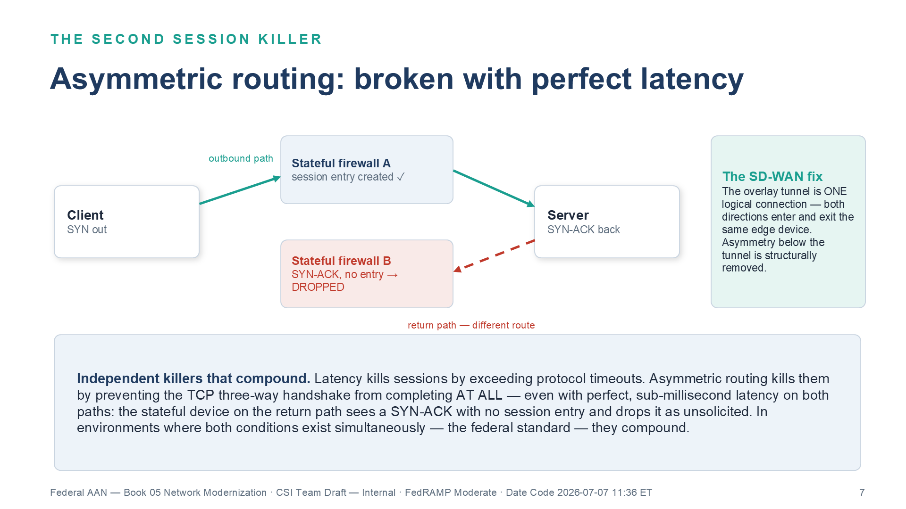

# SD-WAN vs. DIA Under TIC 3.0 {.unnumbered}

::: {.callout-tip appearance="simple"}
**[Download this whitepaper as DOCX](tic3-sdwan-vs-dia.docx)** — a Word copy of
this page, regenerated on every site deploy. (Also available from the
**Other Formats** link in the page sidebar.)
:::

::: {.callout-note}
## In this whitepaper

Federal network modernization conversations keep framing a decision as
"SD-WAN vs. DIA" — as if the two were competing answers to the same question.
They are answers to different questions, and agencies that treat them as
alternatives end up with one of two failure modes: a governed network that is
too slow for voice, or a fast network that is a compliance finding.

This paper makes seven arguments, one per part:

1. **The versus is false.** DIA is a pipe; SD-WAN is the control surface that
   governs pipes. DIA solves exactly one problem (the geographic hairpin),
   satisfies exactly zero NIST SP 800-53 controls, and — deployed bare —
   breaks the one boundary control the MPLS/TIC architecture it replaced did
   provide.

2. **DIA exists because of physics, not preference.** Light in fiber travels
   at roughly 200,000 km/s, ITU-T G.114 budgets 150 ms one-way for voice, and
   no security product shortens a fiber path. Local breakout is the only
   latency fix that exists; everything else in the stack is there to make
   that fix lawful and evidenced.

3. **Every transport is a pipe.** Fiber DIA, MPLS, LEO satellite (Starlink),
   and 5G differ enormously in physics — propagation medium, path geometry,
   breakout architecture — and not at all in compliance contribution, which
   is zero for all four. 6G will extend the physics menu without changing
   that conclusion.

4. **TIC 3.0 is the policy gate.** OMB M-19-26 replaced mandatory TIC
   consolidation with a use-case model: branch traffic may egress locally
   *only when* the security-capabilities catalog is satisfied at a
   distributed policy enforcement point. TIC 3.0 does not choose between
   SD-WAN and DIA — it forbids DIA *without* the governance layer SD-WAN
   and SASE provide.

5. **SD-WAN is what turns four dissimilar pipes into one governed
   transport.** The overlay contributes the three closures no pipe can:
   circuit-wide IPsec encryption (SC-8), traffic-class separation (SC-5),
   and application-layer path telemetry (SI-4) — plus active-active
   multipath, which structurally removes asymmetric-routing failures and
   30–90-second failover outages.

6. **The SC-8 claim is coverage-completeness, not exclusivity.**
   FIPS-validated application-layer TLS closes SC-8 per flow — M365 traffic
   included — and FedRAMP's own Rev 5 guidance is protocol-agnostic. What
   only a network-layer overlay provides is closure for *every* flow on the
   circuit at once, and an attestable record of which flows ride the tunnel
   and which rest on their own encryption.

7. **The decision sequence is knowable.** Buy the pipe for physics, deploy
   the overlay for control, satisfy TIC 3.0 at the distributed PEP, and let
   the OrgComp series carry the control-by-control build. This paper owns
   the argument; the volumes own the build and the control closure.
:::

---

## Part 1 — The False Versus

When a modernization proposal says "we will add Direct Internet Access at
field offices," it has answered a connectivity question. When a reviewer asks
"SD-WAN or DIA?", the question itself is malformed — like asking "highway or
traffic law?" One is infrastructure; the other is the regime that makes the
infrastructure usable at scale.

The [OrgComp Executive Summary](../orgcomp-series/Vol_0_Book_00_OrgComp_Executive_Summary.qmd)
states the three-step argument every DIA conversation must survive, and this
paper adopts it as its frame:

1. **What DIA solves: exactly one thing** — the geographic hairpin. The
   latency budget is a physics constraint, and local breakout is the only
   fix. No security product shortens a fiber path.

2. **What DIA satisfies: exactly zero NIST controls.** Information-flow
   enforcement, boundary protection, transmission confidentiality, malware
   inspection, monitoring, and audit — every control claimed near a DIA
   circuit (SC-7, SC-8, AC-4, SI-3, SI-4, AU-12, CA-7) is satisfied by the
   SD-WAN, SASE, and TIC 3.0 stack that governs the pipe, never by the pipe.

3. **What bare DIA breaks: the boundary it replaced.** A field office moved
   from the MPLS/TIC 2.0 hairpin to ungoverned DIA has *lost* SC-7 boundary
   protection relative to its starting point. From the assessor's chair,
   bare DIA is not modernization — it is a compliance regression with better
   latency.

{#fig-dia-three-step fig-alt="Diagram of the three-step DIA argument. A field office (western site) connects through a pipe labeled DIA — Direct Internet Access, a pipe: solves latency, nothing else — to the internet. Above the pipe, a governance stack box labeled the stack that satisfies the controls contains three layers: SD-WAN IPsec overlay (SC-8), SASE with SWG CASB FWaaS (SC-7, AC-4, SI-3), and TIC 3.0 distributed enforcement point; an arrow labeled governs the pipe points down to the pipe. Right rail lists the three steps: 1 what DIA solves — exactly one thing, the geographic hairpin, ITU-T G.114's 150 ms budget is physics and local breakout is the only fix; 2 what DIA satisfies — exactly zero controls: flow enforcement, boundary, confidentiality, inspection, audit are all satisfied by the stack; 3 (highlighted) what bare DIA breaks — the boundary: a field office on ungoverned DIA has lost SC-7 protection relative to the MPLS hairpin. Red banner: ungoverned DIA is a step backward — from the assessor's chair, bare DIA is not modernization, it is a compliance regression with better latency. White background. Source: OrgComp Vol 0 Book 00 Executive Summary." width="100%"}

Everything that follows elaborates one of those three steps: Part 2 and
Part 3 are step one (the physics), Part 4 is step three (the policy), and
Parts 5–6 are step two (the control stack).

---

## Part 2 — The Physics That Created DIA

Light travels through optical fiber at approximately 200,000 km/s —
two-thirds of its vacuum speed, a consequence of the refractive index of
glass. For any physical path between two points there is therefore a minimum
round-trip latency set purely by distance, before a single switch, firewall,
or proxy adds a microsecond.
[Vol II Book 03](../orgcomp-series/Vol_II_Book_03_OrgComp_Database_Consolidation_Network_Physics.qmd)
derives this floor for database replication; the same floor governs voice.

Voice makes the floor a compliance number. **ITU-T G.114 budgets 150 ms
one-way delay** for acceptable conversational quality. A field office in
Portland whose traffic hairpins over MPLS through a Washington-area data
center before reaching a West-Coast cloud region spends 100–130 ms one-way
on the detour alone — the budget is gone before the contact-center platform
answers. The same office breaking out locally to a nearby cloud region
measures 5–15 ms. That difference is not a product feature; it is geometry.

{#fig-physics-floor fig-alt="Two panels comparing terrestrial fiber at 200,000 km/s with squiggly path routing, versus LEO satellite at 299,792 km/s in vacuum with direct arc path at 550 km altitude. Bar chart shows: Portland via MPLS through DC at 100-130 ms one-way, Portland DIA to AWS us-west-2 at 5-15 ms, 5G MEC at 5-10 ms, Starlink LEO for long haul at 20-40 ms. 5G architecture note explains CUPS and MEC local breakout advantage for rural field offices. Source: OrgComp Vol I Book 05 Network Modernization." width="100%"}

Two properties of this problem shape everything downstream:

- **Distance is the only latency variable a buyer controls.** Direct
  Internet Access — local breakout — shortens the physical path by
  eliminating the geographic hairpin. There is no second latency fix, which
  is why every transport conversation eventually arrives at DIA.

- **Carrier topology is not geometry.** MPLS routes traffic along paths
  determined by the carrier's peering points, not the shortest physical
  path. A packet from Virginia to Oregon may transit Chicago and Denver
  because those are where the carrier interconnects. Buying a faster circuit
  does not straighten the path.

The trap is what leadership concludes next: that adding the DIA circuit
solved "the network problem." It solved the *latency* problem.
[Vol I Book 05](../orgcomp-series/Vol_I_Book_05_OrgComp_Network_Modernization.qmd)
is blunt about the remainder: DIA is a better-positioned pipe than the MPLS
circuit it supplements, but it is still a single, unintelligent pipe — no
visibility into what is happening on it, no ability to respond when it
degrades, no way to know whether it is currently the best available path.

---

## Part 3 — The Transport Menu: Fiber, MPLS, LEO, 5G — and 6G

The overlay doctrine of Part 5 only makes sense once the transport menu is
seen for what it is: four pipes with radically different physics and
identical compliance contribution — zero.

| Transport | Propagation physics | Path geometry | Typical one-way figure (OrgComp reference case) | What it contributes to NIST closure |
|---|---|---|---|---|
| **Fiber DIA (broadband)** | ~200,000 km/s in glass | ISP routing; locally short | 5–15 ms Portland → nearby cloud region | Nothing — a pipe |
| **MPLS** | Same glass, same speed | Carrier peering topology; often geographically indirect, plus the agency hairpin | 100–130 ms Portland → cloud via East-Coast DC | Nothing — a pipe with a contract |
| **LEO satellite (Starlink-class)** | ~299,792 km/s in vacuum — 50% faster than glass per km | Up 550 km, across the constellation, down | 20–40 ms end-to-end long-haul, and improving | Nothing — a pipe |
| **5G (mid-band / MEC)** | Radio to the tower, then fiber | CUPS + MEC allow breakout at or near the cell edge | 5–10 ms across the air interface | Nothing — a pipe |

: The transport menu — physics varies, compliance contribution does not {.striped .hover}

{#fig-transport-menu fig-alt="Four transport cards on a white background with navy headers. Fiber DIA (broadband): propagation ~200,000 km/s in glass, two-thirds of vacuum light speed; ISP routing, locally short with breakout at the branch; reference one-way figure 5-15 ms Portland to nearby cloud region; teal note: the default local-breakout pipe. MPLS: same glass, same speed — the contract does not change physics; carrier peering topology, often indirect, plus the agency hairpin; reference figure 100-130 ms in red, Portland to cloud via East-Coast DC; red note: the hairpin G.114 cannot afford. LEO satellite (Starlink-class): ~299,792 km/s in vacuum, 50% faster than glass per km; up 550 km, across the constellation, down — not GEO's 35,786 km; reference figure 20-40 ms end-to-end long-haul and improving; teal note: not the satellite you rejected. 5G (mid-band / MEC): radio to the tower then fiber, 0.5 ms slots mid-band vs 1 ms LTE; CUPS plus MEC break traffic out at or near the cell edge; reference figure 5-10 ms across the air interface; teal note: often rural offices' best DIA. Red banner: NIST SP 800-53 controls satisfied by the pipe itself: 0 — for all four transports; SC-7, SC-8, AC-4, SI-3, SI-4, AU-12, CA-7 are satisfied by the SD-WAN / SASE / TIC 3.0 stack that governs the pipe, never by the pipe. Amber dashed strip: 6G — roadmap, not product; ITU-R IMT-2030 defines the target usage scenarios, 3GPP study work aims at first 6G specifications in the Release 21 timeframe, commercial expectations cluster around 2030; native non-terrestrial network integration will blur the LEO / cellular boundary; sub-millisecond air-interface targets do not repeal propagation physics; whatever pipe 6G delivers, it arrives as exactly that — a pipe the overlay absorbs. Teal banner: transport diversity is a reason for the overlay, not a substitute for it. White background, navy #1F3A5F, teal #1A9E8F, amber #D4860B, red #C0392B." width="100%"}

Three of these deserve a word beyond the table:

**LEO is not the satellite you rejected.** The satellite ruling most federal
IT professionals carry — unusable latency — was earned by geostationary
birds parked at 35,786 km, where physics charges roughly 238 ms one-way
before anything else happens. Low Earth Orbit constellations at ~550 km
change the geometry entirely, and vacuum propagation beats glass by half
again per kilometer: for long-haul paths, the sky can be *faster* than the
ground. Current practical end-to-end latency of 20–40 ms puts LEO in the
same competitive range as broadband DIA — a real transport, not a last
resort.

**5G is an architecture story, not just a radio story.** The radio mechanism
is real — 0.5 ms slot duration at mid-band 30 kHz numerology, 0.125 ms at
mmWave, versus 1 ms in LTE — but the federally interesting mechanism is
**Control and User Plane Separation (CUPS)** with **Multi-access Edge
Computing (MEC)**: user-plane traffic can break out of the carrier network
at or near the tower instead of backhauling to a central core. For rural
field offices with thin broadband markets, 5G local breakout is often the
best-performing DIA on the menu.

**6G will extend the menu, not the doctrine.** As of this writing, 6G is
roadmap, not product: ITU-R's IMT-2030 framework defines the target usage
scenarios, 3GPP's study work aims at first 6G specifications in the
Release 21 timeframe, and commercial deployment expectations cluster around
2030. Two roadmap directions matter for this paper's argument. First,
native **non-terrestrial network (NTN) integration** — satellite and
terrestrial radio as one standardized fabric — will blur the LEO/cellular
row boundary in the table above. Second, sub-millisecond air-interface
targets do not repeal propagation physics: the speed of light in glass and
vacuum still sets the floor for any path long enough to matter. Whatever
pipe 6G delivers, it arrives as exactly that — a pipe — and the overlay
absorbs it the way it absorbed the last four transports, as one more path
to probe, measure, encrypt, and steer. An agency whose compliance
architecture is transport-agnostic today does not re-architect for 6G; an
agency whose compliance story is welded to one transport does.

The punchline of the menu: **transport diversity is a reason for the
overlay, not a substitute for it.** Four pipes with different failure modes,
different loss profiles, and different best-use windows are an asset only if
something measures all four continuously and steers per-application — and a
liability if a human is expected to do it with static routes.

---

## Part 4 — TIC 3.0: The Policy That Makes DIA Lawful

The Trusted Internet Connections program began as consolidation: force
agency traffic through a small number of heavily instrumented TIC access
points. That architecture is precisely the geographic hairpin Part 2
condemned — the compliance design and the latency pathology were the same
design.

**OMB M-19-26** and CISA's **TIC 3.0** guidance replaced mandatory
consolidation with a use-case model. Two use cases govern the field-office
patterns in this paper, as
[Vol I Book 06](../orgcomp-series/Vol_I_Book_06_OrgComp_Federal_Telecommunications_Modernization.qmd)
lays out for agency voice:

- **Branch Office**: field-office traffic egresses locally over DIA, with
  the policy enforcement point (PEP) at or near the branch egress — the
  SD-WAN edge plus SASE services.
- **Remote User**: teleworker traffic reaches cloud platforms from home
  networks, with the cloud-delivered SASE PoP as the PEP and ZTNA replacing
  VPN.

{#fig-tic3-pep fig-alt="A two-row table mapping the TIC 3.0 use cases that govern agency voice. Branch Office, Use Case E: field office agents on Amazon Connect and Teams Phone, traffic path field office to local DIA to AWS .com or M365 GCC, policy enforcement point at or near the branch egress as SD-WAN edge plus SASE services. Remote User, Use Case F: teleworking agents and staff, home network to internet to cloud voice platforms, PEP as the cloud-delivered SASE PoP with ZTNA replacing VPN. Teal permissibility panel: TIC 3.0 under OMB M-19-26 replaced mandatory consolidation with a use-case model — both use cases permit traffic to leave without hairpinning through a TIC access point, and neither permits it to leave ungoverned; the security-capabilities catalog must be satisfied at the distributed PEP, and the SASE stack is that PEP. Red panel: an ungoverned DIA circuit is not modernization, it is a finding — the bare circuit that fixes G.114 deletes the SC-7 boundary the MPLS-to-TIC path did provide, while with the SASE PEP in place the same circuit is the TIC 3.0 target architecture. White background. Source: OrgComp Vol I Book 06 Telecom Modernization." width="100%"}

The permissibility rule is the entire point: **both use cases permit traffic
to leave without hairpinning through a TIC access point, and neither permits
it to leave ungoverned.** The applicable entries of the TIC security
capabilities catalog must be satisfied at the distributed PEP,
commensurate with the agency's risk tolerance. TIC 3.0 never asks "SD-WAN
or DIA?" — it asks "where is the PEP on this DIA circuit, and which catalog
capabilities does it satisfy?" An agency that cannot answer has not
modernized; it has opened a finding.

This is why the OrgComp series calls an ungoverned DIA circuit a *step
backward*: the MPLS hairpin it replaced was slow, but it did pass through a
boundary. Bare DIA has better latency and no boundary — an SC-7 regression
wearing a modernization badge. The formal treatment of boundary controls on
distributed egress — SC-7, SC-7(7), AC-4 — is anchored in
[Vol I Book 07](../orgcomp-series/Vol_I_Book_07_OrgComp_Network_Enforcement_Substrate.qmd)
and the [Executive Summary's](../orgcomp-series/Vol_0_Book_00_OrgComp_Executive_Summary.qmd)
necessity-anchor table.

---

## Part 5 — SD-WAN: The Governor of Pipes

SD-WAN is the mechanism class that turns the Part 3 menu into one governed
transport. Its contributions divide into the three control closures no pipe
can provide, plus one availability property that changed field-office
operations.

{#fig-pipe-vs-governor fig-alt="Vertical stack diagram on a white background. Top navy banner: TIC 3.0 — the policy gate (OMB M-19-26); Branch Office and Remote User use cases permit local egress without the TIC hairpin, and neither permits it ungoverned: the security-capabilities catalog must be satisfied at the distributed policy enforcement point. Arrow down to the governor Layer 7 — SASE SSE, the distributed PEP, with three teal cards: SWG / FWaaS for SC-7 and SI-3 (boundary protection, inline SSL inspection); CASB for AC-4 (app, tenant, data type, action per session); ZTNA plus per-session records for CA-7 (identity, posture, access, machine-readable). Arrow down to the governor Layer 3 — SD-WAN overlay, the control surface on the pipe, with three cards: IPsec overlay for SC-8 / SC-8(1), circuit-wide encryption of every flow at once; traffic classes for SC-5, per-class path policy with lean/fat separation; DPI plus steering log for SI-4 and AU-12, application identified per flow and every path decision logged. Full-width strip: active-active multipath across every transport — fiber DIA, MPLS, 5G, LEO — with millisecond absorption of path failure, asymmetric routing removed by construction, and per-flow attestation of the M365 Optimize split. Arrow labeled governs points down to a red-outlined pipe: the pipe — DIA (fiber, MPLS, LEO, 5G, one day 6G); solves exactly one thing, the geographic hairpin (ITU-T G.114's 150 ms budget is physics, local breakout is the only fix); satisfies exactly zero NIST controls, and deployed bare breaks the SC-7 boundary the TIC hairpin provided. Bottom navy banner: physics buys the pipe, the overlay buys the controls, TIC 3.0 is why you may not stop at the pipe; closures anchored in OrgComp Vol I Book 07, applied by Vol I Books 05-06, doctrine and counter-sources in Vol 0 Book 00. White background, navy #1F3A5F, teal #1A9E8F, red #C0392B." width="100%"}

### 5.1 Circuit-wide encryption (SC-8)

The SD-WAN overlay encrypts at the network layer — IPsec tunnels between
WAN edges, with cipher suites configurable to FIPS 140-3 validated
AES-256-GCM on the platforms the OrgComp series references. Every packet the
overlay carries is encrypted regardless of what application generated it and
regardless of whether that application negotiated TLS. Part 6 states
precisely what this does and does not claim.

### 5.2 Traffic-class separation (SC-5)

A pipe carries whatever arrives. The overlay classifies: voice marked and
prioritized, bulk transfer kept out of the way of interactive traffic —
and, in the database estate,
[Vol II Book 03's](../orgcomp-series/Vol_II_Book_03_OrgComp_Database_Consolidation_Network_Physics.qmd)
lean/fat lane separation, where consensus heartbeats and quorum
acknowledgments ride a protected class that backup and async-replication
streams cannot starve. Denial-of-service protection through class
separation is a per-class path policy, and only the overlay has classes.

### 5.3 Application-layer path telemetry (SI-4, AU-12, CA-7)

A bare circuit reports link state and byte counts. Flow records see
five-tuples. Neither can distinguish authorized use from exfiltration on
port 443, and neither records *why* traffic took the path it took. The
overlay's DPI classifies the application per flow; its steering decisions
are logged events; and the SASE stack above it records identity, posture,
and action per session. This is the telemetry that feeds the series'
continuous-monitoring evidence pipeline — the machine-readable per-session
records that CA-7 expects and that no collector can extract from a pipe
that never carried the information.

### 5.4 Active-active multipath — the availability property

Traditional WAN design is active-passive: MPLS primary, broadband standby,
and a 30–90-second switchover during which VPN tunnels drop, sessions time
out, and field offices report the "45-second logon." Active-active
multipath carries traffic on all available paths — MPLS, fiber DIA, 5G,
LEO — simultaneously, resequencing at the far edge, applying forward error
correction per transport, and absorbing a path failure within milliseconds:
the user experiences a ~50 ms pause, not a re-authentication.

{#fig-multipath fig-alt="Flow diagram showing Branch SD-WAN Edge distributing packets across four simultaneous paths: MPLS at 22 ms 0% loss, DIA Broadband at 21 ms 0.1% loss, 5G MEC at 8 ms 0.3% loss, Starlink LEO at 28 ms 0.4% loss. Packets are distributed with sequence numbers. Resequencing buffer holds early arrivals and delivers in-order using FEC to fill lost packets. Application sees one ordered byte stream with no awareness of four physical paths. Effective aggregate bandwidth 160-190 Mbps from four paths. Source: OrgComp Vol I Book 05 Network Modernization." width="100%"}

Two structural consequences matter beyond user experience. First,
**asymmetric routing is removed by construction**: both directions of a
conversation enter and exit the same edge devices, so the
stateful-middlebox failure mode — SYN out one path, SYN-ACK back another,
handshake never completes — cannot occur above the overlay.

{#fig-asymmetric-routing fig-alt="Diagram of the asymmetric routing failure. A client sends a SYN along the outbound path through stateful firewall A, which creates a session entry, to the server. The server's SYN-ACK returns along a different route through stateful firewall B, which sees a SYN-ACK with no session entry and drops it — the TCP three-way handshake never completes. Right panel, the SD-WAN fix: the overlay tunnel is one logical connection — both directions enter and exit the same edge device, and asymmetry below the tunnel is structurally removed. Bottom panel: independent killers that compound — latency kills sessions by exceeding protocol timeouts; asymmetric routing kills them by preventing the handshake from completing at all, even with perfect sub-millisecond latency on both paths; in environments where both conditions exist simultaneously — the federal standard — they compound. White background. Source: OrgComp Vol I Book 05 Network Modernization." width="100%"} Second, **every
path decision is a logged event**, which converts multipath from an audit
liability (four uncorrelated pipes) into an audit asset (one decision log).
[Vol I Book 05](../orgcomp-series/Vol_I_Book_05_OrgComp_Network_Modernization.qmd)
develops both, including the corrected Kerberos-under-failover analysis in
[Vol I Book 03](../orgcomp-series/Vol_I_Book_03_OrgComp_Certificates_Tokens_Cryptographic_Identity.qmd).

### 5.5 The M365 case — steering *around* the overlay, on purpose

Microsoft's network connectivity principles instruct agencies to egress
M365 traffic locally, avoid hairpins, and give **Optimize**-category
endpoints (Teams media above all) no inspection, no proxy, no detour. An
SD-WAN deployment honoring that guidance — Cloud OnRamp probing the M365
front door across every transport and steering Teams media to the
best-measured local path — may carry Optimize flows *outside* the IPsec
overlay entirely.

{#fig-inr-routing fig-alt="Side-by-side comparison of two routing paths for M365 traffic. Left panel (Legacy Backhaul): Portland field office sends traffic via MPLS to Agency DC in Washington DC, then to internet, entering Microsoft network at suboptimal Ashburn PoP — 80 ms plus total latency. Right panel (Local Breakout): Portland field office sends traffic directly via DIA or 5G to Microsoft's nearest Seattle front door PoP — 18 ms total latency. Bottom section shows M365 endpoint categories: Optimize (Teams media, no proxy, maximum priority), Allow (general M365, proxy OK), Default (standard inspection). Satisfies SC-8, AC-4, TIC 3.0 Use Case E. Source: OrgComp Vol I Book 05 Network Modernization." width="100%"}

That is not a contradiction of Section 5.1; it is the per-flow concession
of Part 6 made deliberate. Optimize flows carry their own FIPS-validated
encryption (TLS; SRTP for media). The overlay continues to encrypt every
flow that does not. And the WAN edge's DPI steering records are the
per-flow evidence of which is which — the split-tunnel exception becomes an
attested design decision instead of an invisible gap.
[Vol I Book 05's M365 appendix](../orgcomp-series/Vol_I_Book_05_OrgComp_Network_Modernization.qmd)
carries the build, including the GCC Moderate caveat that Microsoft's
Informed Network Routing telemetry is unavailable in that cloud and
probe-based steering is the implementation.

---

## Part 6 — The Compliance Ledger

The control-by-control ledger for the field-office path, stated as the
OrgComp series registers it (closures anchored per book; this table is a
reader's map, not a claims register):

{#fig-sase-stack fig-alt="Layered architecture showing DIA pipe in center providing connectivity and eliminating the hairpin, but lacking application identity, user context, malware inspection, network encryption, and audit records. Left side shows SASE components: SD-WAN IPsec Tunnel satisfying SC-8, SWG satisfying SI-3 and SC-7, CASB satisfying AC-4, ZTNA replacing VPN. Right side shows Application-Layer Logging for AU-12, Behavioral Analytics for SI-4, Continuous Monitoring for CA-7. Summary: DIA solves G.114 latency, SASE satisfies the six NIST controls. Source: OrgComp Vol I Book 06 Telecom Modernization." width="100%"}

| NIST SP 800-53 Rev 5 control | Bare DIA provides | Provided on a governed DIA circuit by | Closure anchored in |
|---|---|---|---|
| SC-8 / SC-8(1) Transmission Confidentiality and Integrity | Nothing — unencrypted at the network layer | SD-WAN IPsec overlay (circuit-wide), with per-flow TLS/SRTP for flows that carry it | [Vol I Book 07](../orgcomp-series/Vol_I_Book_07_OrgComp_Network_Enforcement_Substrate.qmd) |
| SC-7 Boundary Protection | Nothing — and a regression vs. the TIC hairpin | SASE SWG/FWaaS at the distributed PEP | Vol I Book 07 |
| AC-4 Information Flow Enforcement | Nothing | SASE CASB — application, tenant, data type, action | Vol I Book 07 |
| SC-5 Denial of Service Protection | Nothing | SD-WAN traffic classes and per-class path policy | [Vol II Book 03](../orgcomp-series/Vol_II_Book_03_OrgComp_Database_Consolidation_Network_Physics.qmd) |
| SI-3 Malicious Code Protection | Nothing | SWG inline SSL inspection at the nearest PoP | [Vol I Book 06](../orgcomp-series/Vol_I_Book_06_OrgComp_Federal_Telecommunications_Modernization.qmd) cross-references |
| SI-4 System Monitoring | Link state and byte counts | Overlay DPI + SASE per-session telemetry | Vol I Books 05–07 |
| AU-12 Audit Record Generation | IP flow logs | Per-session records: user, device, app, action, data type | Vol I Books 05–07 |
| CA-7 Continuous Monitoring | Nothing machine-readable | Per-session evidence into the series' ConMon pipeline | Evidence-fabric books |

: The ledger — what the pipe provides vs. what the governor provides {.striped .hover}

**The honesty clause.** The SC-8 row above is a **coverage-completeness
claim, not an exclusivity claim**, and the series states it that way on
purpose. FedRAMP's Rev 5 data-in-transit guidance ("The Rev. 5 Approach to
SC-8, and Protecting Data-in-Transit," 2023) requires FIPS 140-validated
encryption and names no protocol: FIPS-validated TLS closes SC-8 for the
flow that negotiates it, physical protection moved to SC-8(5) as a
Controlled Access Area path, and SC-8 is inheritable for traffic that
originates and terminates inside an authorized boundary. None of those
paths reaches a field-office DIA circuit egressing over the public
internet — traffic originates outside every authorized boundary, no
Controlled Access Area encloses the internet, and per-flow TLS closure must
be demonstrated flow by flow while DNS lookups, legacy protocols, and
misconfigured applications ride the same circuit bare. The overlay's
contribution is uniform coverage of *all* flows and a single circuit-level
attestation; among overlay classes (site-to-site IPsec, ZTNA tunnels,
WireGuard-class), SD-WAN is the one that also delivers the SC-5 and SI-4
closures of Part 5. The
[Executive Summary's rebuttal box](../orgcomp-series/Vol_0_Book_00_OrgComp_Executive_Summary.qmd)
carries the full counter-source treatment, including the "our traffic is
M365 and M365 is already encrypted" objection resolved in Section 5.5.

---

## Part 7 — The Decision Sequence

For a decision maker, the whole paper compresses to an ordered checklist:

{#fig-implementation-sequence fig-alt="Six numbered step cards in two rows. 1 boundary documentation: classify every component, verify Cisco SaaS FedRAMP status, draft ISAs for M365 GCC and Azure Virtual WAN. 2 baseline templates: per-archetype cEdge templates — FIPS mode, no local management, Umbrella DNS, AES-256-GCM, agency NTP, SNMP off. 3 Cloud OnRamp for M365: Optimize and Allow endpoint lists for GCC, Teams media to the best DIA or 5G path never a proxy, graceful MPLS fallback. 4 Umbrella integration: all branch DNS through Umbrella with no local fallback, malicious domains blocked, M365 tenant restriction on. 5 SIEM telemetry wiring: streaming telemetry to Sentinel — flow events, change audit, path quality, device compliance, AU-12 per flow. 6 FedRAMP 20x KSI validation: verify the SIEM receives every required structured event and the format passes the OSCAL bundle generator. Scope note: decision-maker orientation, not an engineering runbook — site surveys, MAPS carrier qualification, and template development belong to certified Catalyst SD-WAN engineers. White background. Source: OrgComp Vol I Book 05 Network Modernization." width="100%"}

1. **Buy the pipe for physics.** Choose DIA transports — fiber, 5G, LEO,
   retained MPLS — on measured latency to the destinations that matter
   (M365 front door, contact-center region), on the G.114 budget, and on
   path diversity. No transport choice earns compliance credit; make it on
   physics alone.

2. **Deploy the governor before the pipe carries production traffic.** The
   SD-WAN overlay (encryption, classes, telemetry, multipath) and the SASE
   stack (SWG, CASB, FWaaS, ZTNA) are where the TIC 3.0 security
   capabilities live. A DIA circuit lit before its PEP exists is a
   finding with good latency. Vendor selections for both layers are
   agency-procurement decisions; the OrgComp series names deployed examples
   of each mechanism class, with alternatives enumerated per layer.

3. **Steer M365 by Microsoft's categories, and attest the split.**
   Optimize-category traffic egresses locally on its own validated
   encryption; everything else rides the overlay; the steering log is the
   evidence that the split is design, not drift.

4. **Register the closures where the series anchors them.** The
   control-by-control builds, KSI evidence contracts, and ConMon wiring are
   owned by the OrgComp volumes:
   [Vol 0 Book 00](../orgcomp-series/Vol_0_Book_00_OrgComp_Executive_Summary.qmd)
   for the doctrine and its counter-sources,
   [Vol I Book 05](../orgcomp-series/Vol_I_Book_05_OrgComp_Network_Modernization.qmd)
   for transport physics, multipath, and the M365/Cloud OnRamp build,
   [Vol I Book 06](../orgcomp-series/Vol_I_Book_06_OrgComp_Federal_Telecommunications_Modernization.qmd)
   for voice, G.114, and the TIC 3.0 use cases,
   [Vol I Book 07](../orgcomp-series/Vol_I_Book_07_OrgComp_Network_Enforcement_Substrate.qmd)
   for the enforcement-substrate closure anchors, and
   [Vol II Book 03](../orgcomp-series/Vol_II_Book_03_OrgComp_Database_Consolidation_Network_Physics.qmd)
   for the physics floor and traffic-class doctrine.

The one-sentence version: **physics buys you the pipe, the overlay buys you
the controls, TIC 3.0 is why you may not stop at the pipe — and no future
transport, 6G included, changes which of those three you are allowed to
skip: none.**
