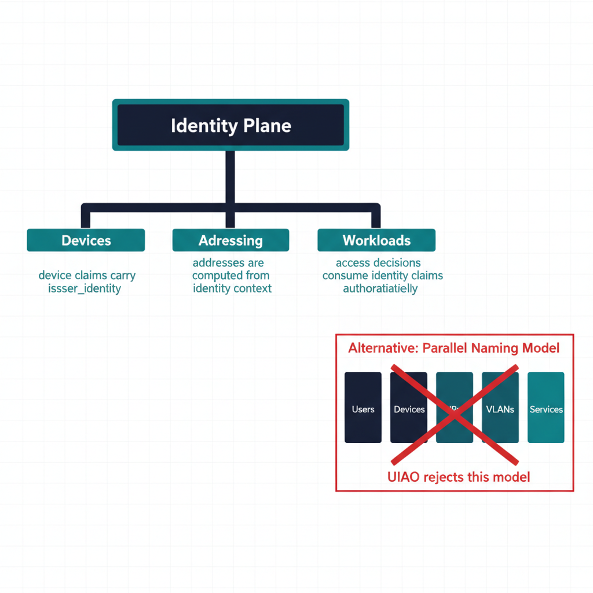
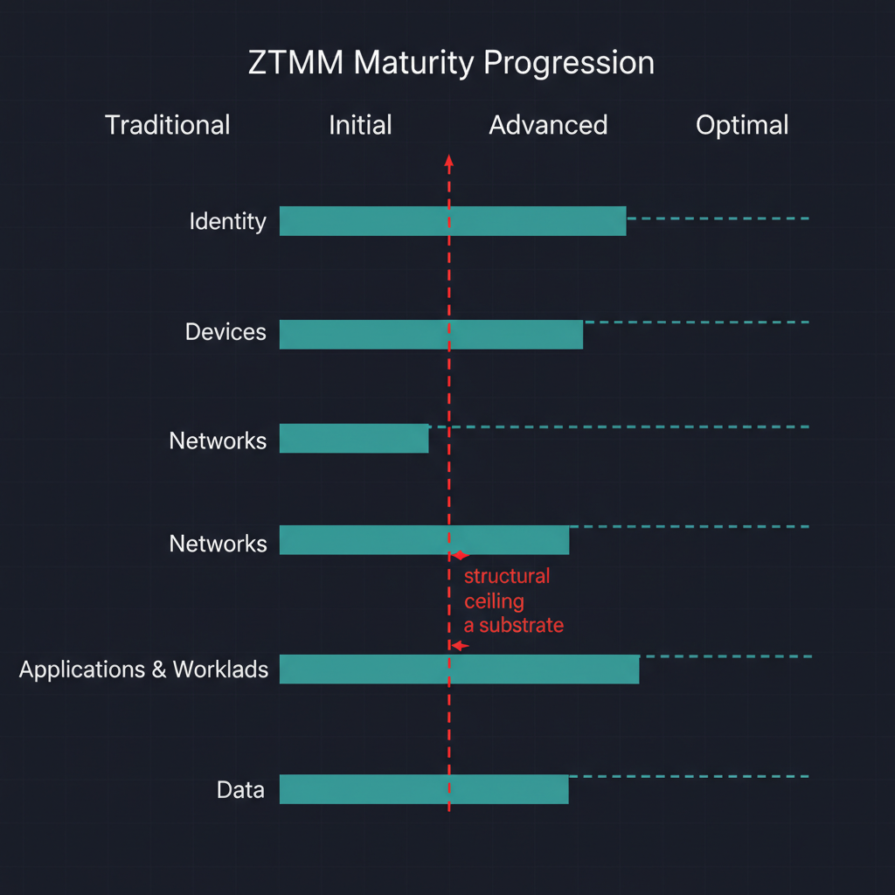

# Zero Trust Governance

## Implementing CISA Zero Trust maturity through UIAO's governance model

### Executive summary

CISA's Zero Trust Maturity Model (ZTMM) defines five pillars (Identity,
Devices, Networks, Applications & Workloads, Data) and four maturity
stages (Traditional → Initial → Advanced → Optimal). Most federal agency
Zero Trust programs spend their first two years assembling **point
solutions per pillar** and discover, late, that the program is structurally
unable to reach Advanced or Optimal because the substrate the pillars sit
on cannot produce continuous, canonical, drift-detected evidence.

UIAO closes that structural gap. This whitepaper explains how the
[Governance OS](uiao-governance-os-whitepaper.qmd) maps onto the five ZTMM
pillars, why Advanced/Optimal maturity requires a substrate (not just
better tools), and what an agency can ship today versus what remains
target-state.

### 1. Why Zero Trust programs stall at Initial maturity

Three structural patterns appear repeatedly:

**Pattern 1 — pillars are administered, not governed.** Each pillar has
an owner, a tool stack, and a roadmap, but no shared canonical truth.
Identity assertions in pillar 1 are not verifiable from pillar 5; device
posture in pillar 2 cannot be correlated with workload identity in pillar
4. Cross-pillar policy decisions degrade to lowest-common-denominator
attestation.

**Pattern 2 — evidence is per-tool, not per-claim.** Each pillar emits
evidence shaped by its tool vendor. Combining evidence into a single ATO
narrative is a manual exercise, and re-execution requires re-running every
tool with its current configuration — which has drifted since the last
audit.

**Pattern 3 — drift is discovered at audit time.** Without a substrate-
wide drift engine, mismatches between policy intent and runtime reality
surface only when a 3PAO finds them. By then, remediation is reactive
and costly.

The ZTMM's Advanced and Optimal columns explicitly call for *continuous*
verification, *automated* policy evaluation, and *cross-pillar* data
correlation. None of those is achievable with per-pillar tooling and per-
tool evidence.

{#fig-zero-trust-governance-whitepaper-image-01 fig-alt="Left side shows the five CISA Zero Trust pillars as vertical columns: Identity, Devices, Networks, Applications & Workloads, Data — each carrying its tool-stack icon. Right side shows the same five pillars but each one is labeled with one canonical UIAO contribution (Identity-as-root namespace, Provenance envelope per device, Identity-derived addressing, Adapter taxonomy, Deterministic evidence chain). A horizontal teal bar labeled \"UIAO Substrate (canon, drift engine, evidence chain)\" runs across all five columns at the base, connecting them as a shared canonical fabric. Clean engineering blueprint style, dark navy (#0D1B2E) and teal (#1E8C8C) on white background. No photographs, purely diagrammatic." width="85%"}

### 2. The substrate's contribution to each pillar

UIAO does not replace per-pillar tooling. It provides the **shared
canonical fabric** that ties pillars together. Per-pillar contribution:

| ZTMM pillar | UIAO contribution | Canon anchor |
|---|---|---|
| **Identity** | Identity-plane SSOT; identity-as-root-namespace per ADR-008 | `adr-008-zero-trust-identity.md` |
| **Devices** | Device claims normalized into the provenance envelope; drift findings per device | `15_ProvenanceProfile.qmd` |
| **Networks** | Identity-derived addressing; addressing plane is computed from identity, not parallel-administered | `01_UnifiedArchitecture.qmd` |
| **Applications & Workloads** | Adapter taxonomy maps workload controls onto canonical KSI rules | `adapter-registry.yaml`, `modernization-registry.yaml` |
| **Data** | Provenance envelope on every claim; deterministic evidence chain per ADR-006 / ADR-016 | `15_ProvenanceProfile.qmd`, ADR-006, ADR-016 |

The substrate's contribution is **uniform across pillars**: SSOT, provenance
envelope, drift taxonomy, and OSCAL-native evidence. Each pillar still
keeps its tool-level capability; the substrate is what makes those tools'
output reproducibly verifiable in one assessor-readable form.

### 3. Identity as the root namespace (ADR-008)

CISA's identity pillar treats identity as one of five concerns. UIAO's
canon takes a stronger position, declared in
[ADR-008](../../../src/uiao/canon/adr/adr-008-zero-trust-identity.md):
**identity is the root namespace.** Devices, addresses, network paths,
applications, and data classifications are *named* via identity; they do
not have parallel naming systems.

Operationally:

- A device claim's `issuer_identity` is an identity-plane object
  (e.g. an Entra ID object ID), not a separate device-pillar object.
- An address is computed from identity context per the addressing plane,
  not assigned by an independent IPAM.
- A workload's access decision consumes identity claims as authoritative
  input rather than as one signal among many.

This is the architectural reason UIAO can scale Zero Trust beyond Initial
maturity: the cross-pillar correlation problem reduces to *resolving
identity*, which the canon and the identity plane already do
authoritatively.

{#fig-zero-trust-governance-whitepaper-image-02 fig-alt="A central labeled \"Identity Plane\" root node sits at the top of a hierarchy. Four downward branches connect to dependent planes — Devices, Addressing, Networks, Workloads — each labeled with the property it derives from identity (e.g. \"device claims carry issuer_identity\", \"addresses are computed from identity context\", \"access decisions consume identity claims authoritatively\"). A small panel on the right shows the alternative \"parallel naming\" model with five disconnected silos and a red strikethrough indicating UIAO rejects this model. Clean engineering blueprint style, dark navy (#0D1B2E) and teal (#1E8C8C) on white background, with red (#C74040) reserved for the rejected pattern. No photographs, purely diagrammatic." width="85%"}

### 4. Continuous verification through drift

CISA's Optimal column requires continuous verification. UIAO's drift
engine is what makes that operationally tractable. The five drift classes
map onto Zero Trust concerns directly:

| Drift class | Zero Trust concern |
|---|---|
| `DRIFT-IDENTITY` | Identity assertion no longer resolves — denies access immediately |
| `DRIFT-AUTHZ` | Action emitted outside the consent envelope — alerts and halts |
| `DRIFT-PROVENANCE` | Claim chain broken — pillar evidence is no longer trustworthy |
| `DRIFT-SCHEMA` | Structural mismatch between declared and observed pillar state |
| `DRIFT-SEMANTIC` | Pillar state is structurally valid but semantically stale |

Today, schema and provenance drift ship in CI. The runtime detection
surface for identity, authorization, and semantic drift is canonical
(declared in `16_DriftDetectionStandard.qmd`) and partially implemented;
the structural pieces that matter most for ZT — provenance envelope,
remediation contract, severity model — already ship.

### 5. Evidence at Advanced/Optimal maturity

Advanced and Optimal maturity require evidence that is:

1. **Continuous** — emitted as state changes, not periodically.
2. **Cross-pillar** — single evidence record covers identity + device +
   workload context.
3. **Reproducible** — re-executable by an assessor without operator
   coordination.

UIAO's evidence chain delivers (2) and (3) today. Cross-pillar evidence
is structural: every claim carries the full provenance envelope, so the
evidence bundle inherently spans pillars. Reproducibility is structural
per ADR-006: same canon, same inputs → byte-identical bundle.

Continuous emission (property 1) is target state. The provenance envelope
and bundle lifecycle support continuous capture; the gap is end-to-end
wiring across every adapter. Adapters that ship continuous capture today
already exhibit the property; the program-level objective is to bring all
adapters to that maturity rather than to invent a new mechanism.

### 6. The boundary problem (GCC-Moderate)

Federal Zero Trust programs in GCC-Moderate hit an additional structural
constraint: many of the platform-emitted signals that commercial Microsoft
365 customers use for ZT analytics are **silently unavailable** in
GCC-Moderate (Endpoint Analytics, Device Health Attestation, Network Fence,
ARC Server Monitoring). See the
[Boundary Impact Model](../architecture-series/boundary-impact-model.qmd)
and the
[GCC-Moderate Boundary Problem Statement](../../docs/gcc-boundary-problem-statement.qmd).

UIAO addresses the boundary structurally rather than waiting for platform
fixes:

1. **Boundary probe** confirms which features actually function on each
   side of the boundary, producing structured capability disposition.
2. **In-boundary telemetry adapters** emit canonical claims with explicit
   `source_classification: derived` for signals substituting unavailable
   commercial features.
3. **Compensating enforcement adapters** provide agency-side enforcement
   for controls platform features cannot deliver.
4. **ATO documentation** treats the boundary as a first-class governed
   object, not as implicit assumption.

Per ADR-059, the substrate also recognizes two named Commercial
exceptions (Amazon Connect Contact Center, SailPoint Non-Employee Risk
Management) that operate FedRAMP Moderate on AWS GovCloud — each encoded
as a discrete enum value in the `gcc-boundary` schema and added in
lockstep with its authorizing ADR. The substrate's posture is that
boundary exceptions are governed, not glossed over.

{#fig-zero-trust-governance-whitepaper-image-03 fig-alt="Horizontal four-stage axis labeled Traditional → Initial → Advanced → Optimal. For each of the five ZT pillars (Identity, Devices, Networks, Applications & Workloads, Data) a horizontal lane shows current shipped substrate posture as a teal bar reaching to \"Advanced\" or partially into \"Optimal\", with a dashed extension to \"Optimal\" indicating TARGET maturity. A vertical red line between Initial and Advanced labeled \"structural ceiling without a substrate\" emphasizes the point that pillar-tooling alone cannot cross this line. Clean engineering blueprint style, dark navy (#0D1B2E) and teal (#1E8C8C) primary, with red (#C74040) reserved for the structural-ceiling marker. No photographs, purely diagrammatic." width="85%"}

### 7. Pillar-by-pillar maturity outlook

| Pillar | UIAO-anchored substrate posture |
|---|---|
| **Identity** | Identity-as-root-namespace per ADR-008 ships today; identity-plane SSOT enforced via schema gates |
| **Devices** | Device claims via provenance envelope ships; cross-pillar correlation ships; per-device runtime drift is TARGET |
| **Networks** | Addressing plane SSOT ships; identity-derived addressing is canonical and partially shipped |
| **Applications & Workloads** | Adapter taxonomy + KSI mapping ships; workload-side enforcement runtime is library-only (UIAO_111) |
| **Data** | Provenance envelope ships; deterministic evidence chain ships; continuous event-time capture is TARGET |

For each pillar the substrate's *structural floor* is in place; the gap
to Optimal is engineering at the runtime layer, not architectural
redesign.

### 8. What an agency can do this quarter

Concrete adoption posture, ordered:

1. **Inventory which pillar evidence is reproducible today.** For each
   ZTMM pillar, can you re-run the evidence pipeline without operator
   coordination? Where the answer is no, that is the substrate
   adoption boundary.
2. **Bring one adapter under the canonical taxonomy.** Pick the
   highest-leverage tool in any pillar; declare it in the modernization
   or conformance registry; emit its findings into OSCAL alongside the
   existing attestation evidence.
3. **Run `uiao substrate walk` in CI.** Schema and provenance drift
   findings are immediate; remediating them is the cheapest possible
   lift toward Advanced maturity.
4. **Model the boundary explicitly.** If the agency operates in
   GCC-Moderate, instantiate the boundary impact model with the four
   impact dimensions; treat platform feature gaps as governed findings
   rather than implicit constraints.

None of these requires a year-long program. Each is a structural step
that compounds.

### 9. Honest limits

- ZTMM Optimal requires continuous, automated, cross-pillar policy
  evaluation. UIAO ships the substrate that makes this tractable; it
  does not ship every per-pillar runtime today.
- Identity, authorization, and semantic drift are detected at runtime
  only by adapters that have implemented the runtime conformance
  contract. Coverage is growing, not complete.
- The boundary impact model is structural; the operational work of
  inventorying boundary impacts and authoring compensating mechanisms
  is per-agency.

### 10. Conclusion

CISA's ZTMM is a destination model. UIAO's contribution is the substrate
that makes the destination structurally reachable: SSOT for cross-pillar
truth, drift taxonomy for continuous verification, provenance envelope
for reproducible evidence, and boundary impact modeling for the federal
constraints (GCC-Moderate especially) that no per-pillar tool can
address alone.

Agencies adopting UIAO are not buying a Zero Trust product. They are
adopting the operating system that makes their existing pillar tooling
produce ZT-grade evidence — and the architectural foundation for every
runtime extension that follows.
