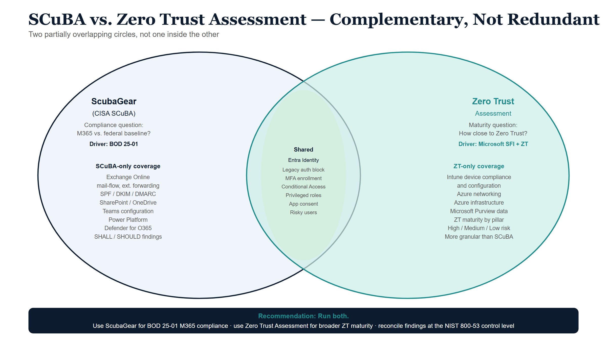

## Executive summary

Two free, read-only assessment tools evaluate the security posture of a Microsoft
cloud tenant, and agencies routinely ask whether they need both:

- **CISA SCuBA / ScubaGear** — checks Microsoft 365 against CISA's *Secure Cloud
  Business Applications* baselines. It answers a **compliance** question: *is our
  M365 configuration aligned with the federal baseline?* (relevant to **BOD
  25-01**).
- **Microsoft Zero Trust Assessment** — checks the broader Microsoft cloud
  (Entra, Intune, Azure, Purview) against Microsoft's Secure Future Initiative
  and the Zero Trust pillars. It answers a **maturity** question: *how close is
  our whole environment to Zero Trust?*

**They are complementary, not redundant.** They intersect almost entirely on one
surface — **Entra identity** — and barely overlap anywhere else. In an
illustrative run against Microsoft's published sample tenant, roughly **half** of
the Zero Trust Assessment's checks fall in an area SCuBA also covers (nearly all
of it identity), and **half are areas SCuBA does not assess at all** (Intune
devices, Azure networking and infrastructure, Microsoft Purview data). And even
where they share a surface, the Zero Trust Assessment is far more granular than
SCuBA's prescriptive baseline.

**Recommendation:** run **both**. Use ScubaGear to demonstrate and maintain
federal-baseline compliance for M365 workloads; use the Zero Trust Assessment to
drive broader Zero Trust maturity across identity, devices, network, and data.
Reconcile their findings at the **control level** (e.g., NIST 800-53 / the
FedRAMP Moderate baseline) rather than expecting one tool's output to substitute
for the other's.

::: {.callout-note}
The figures in this paper are **illustrative**, computed from Microsoft's public
demo report. Your tenant's split comes from running the assessment on your own
environment. Assessment output is sensitive — treat it as Controlled and keep it
inside your authorization boundary.
:::

{#fig-zta-scuba-diagram-01 fig-alt="Two partially overlapping ellipses on white background. Left ellipse navy: ScubaGear CISA SCuBA, compliance question, BOD 25-01 driver, lists SCuBA-only coverage including Exchange Online, SPF/DKIM/DMARC, SharePoint, Teams, Power Platform. Right ellipse teal: Zero Trust Assessment, maturity question, Microsoft SFI driver, lists ZT-only coverage including Intune devices, Azure networking, Azure infrastructure, Microsoft Purview data. Shared overlap region shows Entra identity: legacy auth, MFA, Conditional Access, privileged roles, app consent, risky users. Bottom navy bar: recommendation to run both." width="100%"}

## The two tools at a glance

| | **ScubaGear (CISA SCuBA)** | **Zero Trust Assessment (Microsoft)** |
|---|---|---|
| Question it answers | Compliance with a federal baseline | Maturity toward Zero Trust |
| Authoring body | CISA SCuBA baselines | Microsoft (SFI + ZT pillars; cites NIST/CISA/CIS) |
| Primary driver | **[BOD 25-01](https://cyber.dhs.gov/bod/25-01/)** | Microsoft hardening guidance |
| Scope | M365 workloads: Entra, Exchange Online, Defender for O365, SharePoint/OneDrive, Teams, Power Platform, Power BI | Entra, **Intune (devices)**, **Azure**, **Purview** — organized by Zero Trust pillars |
| How it runs | PowerShell + Graph/product APIs + policy evaluation | PowerShell + Graph |
| Output | HTML report + JSON, per product | HTML report + JSON, by pillar |
| Finding identifier | Policy ID, e.g. `MS.AAD.1.1v1` | Numeric / GUID `TestId` |
| Severity model | Criticality: **SHALL / SHOULD** | Risk: **High / Medium / Low** |
| Both are read-only | Yes | Yes |

## Where they overlap, where they don't

Think of two partially overlapping circles, not one inside the other:

| SCuBA-only (ScubaGear covers, ZT does not) | Shared surface (both) | ZT-only (ZT covers, SCuBA does not) |
|---|---|---|
| Exchange Online mail-flow, external forwarding, SPF/DKIM/DMARC | **Entra identity:** legacy auth, MFA, Conditional Access, privileged-role config, risky users, app consent | Intune device compliance & configuration |
| Defender for Office 365 (anti-phishing, Safe Links/Attachments) | | Azure RBAC, networking, DDoS/firewall |
| Microsoft Teams policies | | Microsoft Purview labels / DLP / RMS |
| Power Platform governance & DLP | | Global Secure Access |

Illustrative split of the Zero Trust Assessment's checks (Microsoft sample
tenant, 295 checks):

| Bucket | Checks | Share |
|---|---:|---:|
| Shared surface (a SCuBA baseline covers the area) | 140 | ~47% |
| ZT-only (no SCuBA baseline exists) | 155 | ~53% |

By pillar, the shared surface is **almost entirely Identity**; Devices, Network,
and Infrastructure are essentially all ZT-only, and the Data pillar is mostly
ZT-only (Microsoft Purview).

## Two caveats that matter more than the percentage

1. **"Shared surface" is not "duplicate checks."** SCuBA's Entra (`aad`) baseline
   is on the order of ~20 prescriptive policies; the Zero Trust Assessment has
   many more identity checks. So *shared* means *same area*, not *same check* —
   only a subset (legacy auth, MFA, Conditional Access basics, privileged-role
   hygiene, risky users, app consent) have a true one-to-one counterpart. The
   rest is the Zero Trust Assessment going deeper than the federal baseline.

2. **The inverse gap.** SCuBA's Exchange, Defender-for-O365, Teams, and Power
   Platform baselines have essentially **no** Zero Trust Assessment counterpart.
   Dropping ScubaGear because "the Zero Trust Assessment covers identity" would
   leave those M365 workloads unassessed against the federal baseline.

## What this means for your agency

- **Keep ScubaGear for BOD 25-01.** It is the tool aligned to the federal M365
  baseline, including the workloads (Exchange, Teams, Power Platform) the Zero
  Trust Assessment doesn't touch.
- **Add the Zero Trust Assessment for breadth and maturity.** It extends coverage
  to devices (Intune), Azure infrastructure, network, and data — and risk-ranks
  findings to help prioritize.
- **Reconcile at the control level.** Because the two use different identifiers
  and frameworks, line their findings up against a common spine — the specific
  tenant setting and/or **NIST 800-53** (and, for federal systems, the **FedRAMP
  Moderate** baseline) — rather than trying to match tool outputs directly.
  The operational form of exactly this reconciliation (SCuBA policy ID →
  NIST control → typed task, held as data) is
  [Vol VII Book 02](../orgcomp-series/Vol_VII_Book_02_OrgComp_M365_Control_Compliance_Automation.qmd)
  of the Federal Organization Compliance series. One federal caveat on the
  maturity side: in a GCC-Moderate tenant, ZTMM maturity in the Identity,
  Devices, and Networks pillars is structurally capped near Initial without
  agency-built analytics — see the
  [B.1 boundary model §4](../orgcomp-series/boundary/B1-gcc-moderate-boundary-model.qmd).
- **Treat all output as Controlled.** Both reports are effectively a map of where
  the tenant is weak; keep them in-boundary and remediate through normal
  change-control.

## Producing your own figures

The UIAO toolkit can ingest a Zero Trust Assessment report and emit this overlap
split for your tenant, alongside a prioritized remediation playbook:

```powershell
uiao zta overlap   --input .\ZeroTrustAssessmentReport.html      # shared vs ZT-only for your tenant
uiao zta remediate --input .\ZeroTrustAssessmentReport.html -o . # per-finding fix guidance
```

See the [Zero Trust Assessment Dashboard guide](../operational-guides/zero-trust-assessment/index.qmd)
for the full workflow. UIAO treats both ScubaGear and the Zero Trust Assessment
as evidence sources it incorporates — not competitors — and reconciles their
findings in a common, control-mapped evidence layer.
