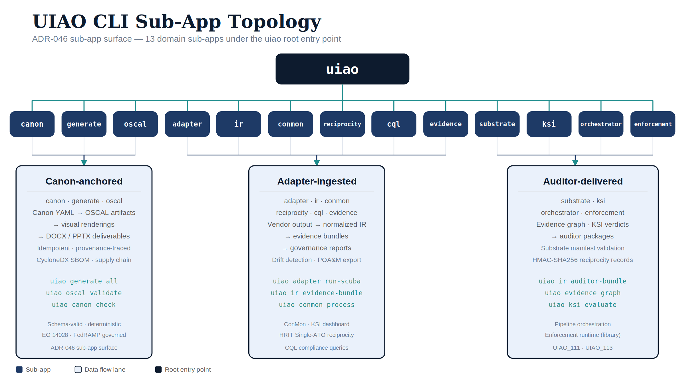
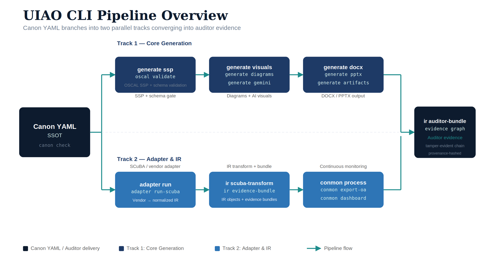
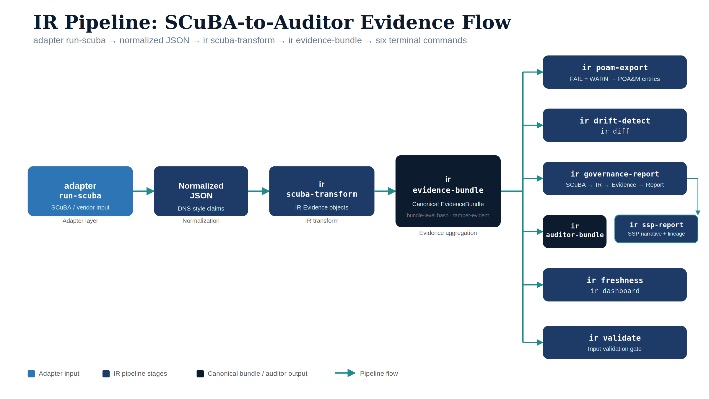
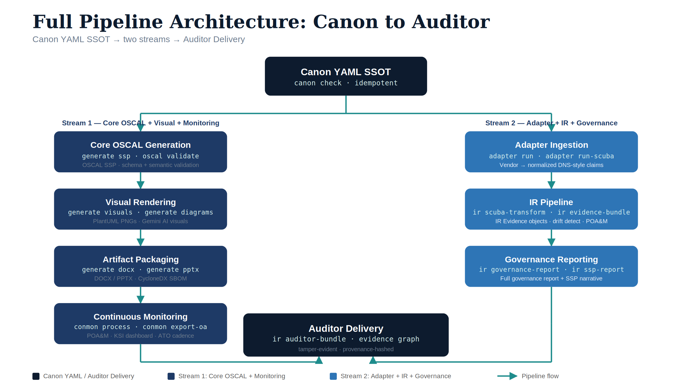

# UIAO CLI Reference {.unnumbered}

{#fig-cli-topology fig-alt="A horizontal blueprint-style diagram showing the uiao root entry point branching into 13 named sub-apps: canon, generate, oscal, adapter, ir, conmon, reciprocity, cql, evidence, substrate, ksi, orchestrator, enforcement. Below the sub-apps, three lanes labelled 'Canon-anchored', 'Adapter-ingested', 'Auditor-delivered' connect to the substrate's data flow. Clean engineering-blueprint aesthetic, dark navy and teal on white, no human figures." width="100%"}

::: {.callout-note title="Authoritative surface"}
This is the canonical CLI reference. The page at
`customer-documents/substrate/platform-tooling/uiao-cli-reference.html`
is a pointer to this document. The CLI surface was reorganized in
**ADR-046** so every command lives under a domain sub-app — flat
top-level commands like `uiao generate-ssp` are no longer accepted.
:::

**Version:** Current (May 2026) · **Environment:** Commercial Cloud
(FedRAMP-governed); GCC-Moderate applies to Microsoft 365 SaaS services
only. **Toolkit:** OSCAL compliance toolkit for US Government systems.

---

## 1. Overview

UIAO-Core is the canonical command-line toolkit for the **Unified
Identity-Addressing-Overlay Architecture (UIAO)** governance substrate.
It automates the full lifecycle of compliance artifact generation,
continuous monitoring, governance reporting, and auditor evidence
packaging — from canon YAML source-of-truth through OSCAL-compliant
outputs.

The CLI is organized around a deterministic pipeline architecture:
Canon YAML → OSCAL generation → visual rendering → artifact packaging
→ continuous monitoring → IR (Intermediate Representation) governance
pipeline. Every command is idempotent, auditable, and traceable to its
canon source.

{#fig-cli-pipeline fig-alt="Pipeline overview: Canon YAML branches into two parallel tracks. Top: generate ssp/oscal validate → generate visuals/diagrams/gemini → generate docx/pptx/artifacts. Bottom: adapter run/run-scuba → ir scuba-transform/evidence-bundle → conmon process/export-oa/dashboard. Both tracks converge into ir auditor-bundle/evidence graph." width="100%"}

::: {.callout-important title="Governance note"}
UIAO operates in **Commercial Cloud as governed by FedRAMP** unless
specifically noted. **GCC-Moderate** applies to Microsoft 365 SaaS
services only — it does not include Azure services. **UIAO is not
FedRAMP High.**
:::

---

## 2. Global Options

The following options are available on every UIAO-Core command invocation.

| Option | Short | Description |
|--------|-------|-------------|
| `--version` | `-V` | Show the UIAO-Core version and exit. |
| `--help` | | Show the top-level help message and exit. |

::: {.callout-tip title="Sub-app help"}
Every sub-app supports its own `--help`. Example:
`uiao ir --help` lists the eleven IR commands.
`uiao ir scuba-transform --help` shows the per-command flags.
:::

---

## 3. Command Reference by Pipeline Stage

### 3.1 Core OSCAL Generation & Validation

These commands form the foundation of the UIAO compliance pipeline. They produce and validate OSCAL (Open Security Controls Assessment Language) artifacts from the canonical YAML source-of-truth. Every downstream artifact — SSPs, POA&Ms, dashboards, briefings — traces its provenance back to the outputs of this stage.

| Command | Description | Pipeline Role |
|---------|-------------|---------------|
| `generate ssp` | Generate an OSCAL SSP from canon YAML and data files. | Primary SSP generation; authoritative compliance narrative. |
| `oscal validate` | Validate an OSCAL document against its schema. | Schema-level structural validation gate. |
| `canon check` | Check canon YAML files for consistency. | First-line defense against configuration drift. |
| `oscal validate-ssp` | Validate OSCAL artifacts with compliance-trestle Pydantic models. | Semantic validation beyond schema compliance. |

#### Details

**`generate ssp`** — Reads the canonical YAML configuration and data files to produce a fully-formed OSCAL System Security Plan. The SSP is the authoritative compliance narrative for the system boundary, control implementations, and responsible parties.

**`oscal validate`** — Performs schema-level validation of any OSCAL document (SSP, SAR, SAP, POA&M, component-definition) against the NIST OSCAL schema. Use this to catch structural errors before submission or downstream processing.

**`canon check`** — Ensures that all canon YAML files are internally consistent — cross-references resolve, required fields are present, enumerations are valid, and no drift has occurred between canon sources. This is the first-line defense against configuration drift.

**`oscal validate-ssp`** — Goes beyond schema validation by loading OSCAL artifacts through NIST compliance-trestle's Pydantic models. Catches semantic errors that pass schema validation — invalid control references, orphaned parameters, broken cross-links.

---

### 3.2 Visual & Artifact Generation

UIAO produces leadership-grade deliverables — DOCX briefings, PPTX decks, embedded diagrams, and AI-generated visuals. These commands render canon data into presentation-ready formats. All visuals use PlantUML for deterministic, version-controlled diagram generation.

| Command | Description | Pipeline Role |
|---------|-------------|---------------|
| `generate visuals` | Render PlantUML diagrams to PNG for DOCX/PPTX embedding. | Diagram rendering stage; produces publication-quality PNGs. |
| `generate gemini` | Generate images via Gemini API (requires `GEMINI_API_KEY`). | AI-generated visuals for executive-facing materials. |
| `generate pptx` | Generate a leadership briefing PPTX deck. | Executive communication; governance and risk posture. |
| `generate docx` | Generate a rich DOCX leadership briefing with embedded visuals. | Word-format leadership briefing with embedded diagrams. |
| `generate diagrams` | Generate PlantUML `.puml` files and render them to PNG from canon YAML. | Deterministic, version-controlled diagram generation. |
| `generate docs` | Render Jinja2 templates into Markdown docs using canon YAML and data files. | Parameterized documentation from templates. |
| `generate artifacts` | Generate DOCX + PPTX with embedded PlantUML and Gemini visuals. | Full visual artifact pipeline in a single invocation. |
| `generate briefing` | Generate personal briefing document from live repo state. | Daily operational awareness; live pipeline and governance status. |

---

### 3.3 Supply Chain Security

Software supply chain transparency is a FedRAMP and NIST requirement. UIAO generates machine-readable Software Bills of Materials (SBOMs) to document every dependency in the compliance toolkit itself and in assessed systems.

| Command | Description | Pipeline Role |
|---------|-------------|---------------|
| `generate sbom` | Generate a CycloneDX 1.4 Software Bill of Materials (SBOM). | Supply chain transparency; EO 14028 compliance. |

**`generate sbom`** — Produces a CycloneDX 1.4-compliant SBOM enumerating all software components, dependencies, and versions. Supports supply chain risk assessment, vulnerability tracking, and Executive Order 14028 compliance.

---

### 3.4 Reciprocity (HRIT Single-ATO)

The `reciprocity` sub-app implements the HRIT Single-ATO Reciprocity Model (UIAO_140 / ADR-054). It emits signed, schema-valid reciprocity records per consuming agency, verifies HMAC-SHA256 signatures, and enumerates all registered records with live expiry status.

| Command | Description | Pipeline Role |
|---------|-------------|---------------|
| `reciprocity onboard-agency` | Emit a signed reciprocity record for a consuming agency. | Primary record-creation command; calls WS-A2 emitter. |
| `reciprocity list-records` | Enumerate reciprocity records and display their Active/Expired status. | Record inventory and health check. |
| `reciprocity verify` | Verify the HMAC-SHA256 signature of a reciprocity record. | Signature integrity validation. |

#### `uiao reciprocity onboard-agency`

Emit a signed reciprocity record for a consuming agency. Writes the signed JSON to `<out-dir>/<consuming-agency>/reciprocity-record.json`.

**Synopsis:**

```
uiao reciprocity onboard-agency [OPTIONS]
```

| Option | Type | Required | Description |
|--------|------|----------|-------------|
| `--controlling-ato` | TEXT | Yes | Identifier of the controlling ATO (e.g. `OPM-HRIT-2026-001`). |
| `--consuming-agency` | TEXT | Yes | Two-to-six character agency code for the consuming agency (e.g. `TREAS`). |
| `--legal-basis` | ENUM | Yes | One of: `interagency-mou`, `economy-act`, `fisma-shared-service`, `fedramp-authorization`, `other-statutory-authority`. |
| `--configuration-latitude-ref` | TEXT | Yes | Reference identifier for the SSP configuration-latitude baseline. |
| `--reciprocity-basis` | TEXT | No | Reciprocity basis identifier string (default: `interagency-reciprocity`). |
| `--effective-at` | TEXT | No | ISO-8601 datetime at which the record becomes effective (default: now). |
| `--expires-at` | TEXT | No | ISO-8601 datetime at which the record expires (default: now + 365 days). |
| `--signer` | TEXT | No | Signer identity (default: `$USER` env var or `uiao-reciprocity-operator`). |
| `--out-dir` | PATH | No | Output directory root (default: `reciprocity-records`). |
| `--signing-key-env` | TEXT | No | Name of the env var that holds the HMAC signing key (default: `UIAO_RECIPROCITY_HMAC_KEY`). |
| `--dry-run` | FLAG | No | Print the record that would be emitted; do not write to disk. |

**Exit codes:** `0` success · `1` validation/write error · `3` WS-A2 emitter not yet merged.

```bash
uiao reciprocity onboard-agency \
    --controlling-ato OPM-HRIT-2026-001 \
    --consuming-agency TREAS \
    --legal-basis interagency-mou \
    --configuration-latitude-ref ssp-2026-latitude-baseline-v1 \
    --out-dir /tmp/hrit-recip

# Dry-run (no file written)
uiao reciprocity onboard-agency \
    --controlling-ato OPM-HRIT-2026-001 \
    --consuming-agency IRS \
    --legal-basis economy-act \
    --configuration-latitude-ref ssp-2026-latitude-baseline-v1 \
    --dry-run
```

#### `uiao reciprocity list-records` and `uiao reciprocity verify`

```bash
# Rich table of all records with Active/Expired status
uiao reciprocity list-records --records-dir /tmp/hrit-recip

# JSON array for downstream tooling
uiao reciprocity list-records --records-dir /tmp/hrit-recip --json

# Verify signature; non-zero exit on bad signature (CI-friendly)
export UIAO_RECIPROCITY_HMAC_KEY="my-secret-key"
uiao reciprocity verify \
    --record /tmp/hrit-recip/TREAS/reciprocity-record.json \
    || echo "signature invalid"
```

---

### 3.5 Continuous Monitoring (ConMon)

Continuous monitoring is the operational heartbeat of FedRAMP compliance. These commands process live security telemetry (Sentinel alerts), manage Plans of Action & Milestones (POA&Ms), export ongoing authorization evidence, produce KSI (Key Security Indicator) dashboards, and validate ATO lifecycle SLA cadence.

| Command | Description | Pipeline Role |
|---------|-------------|---------------|
| `conmon process` | Process a Sentinel alert and auto-upsert a POA&M entry. | Primary ConMon event processing automation. |
| `conmon export-oa` | Export an OSCAL ongoing-authorization evidence artifact. | ATO maintenance; evidence for authorizing officials. |
| `conmon dashboard` | Export the KSI continuous monitoring dashboard. | Governance-grade security posture summary. |
| `conmon ato-cadence-check` | Validate ATO lifecycle SLA cadence (30-day SSP-draft / 45-day SSP-final / 30-day reauth). | UIAO_140 §4 cadence enforcement; CI gate. |

#### `uiao conmon ato-cadence-check`

Validates the three ATO lifecycle SLAs defined in UIAO_140 §4 and ADR-054: draft SSP within 30 days of award (`SSP-Draft-30`), final SSP within 45 days of award (`SSP-Final-45`), and reauthorization package due at least 30 days before ATO expiry (`Reauthorization-30`). Verdicts are `PASS`, `WARN`, `FAIL`, or `N/A`; the overall verdict is the worst-case severity.

**Synopsis:**

```
uiao conmon ato-cadence-check [OPTIONS]
```

| Option | Metavar | Required | Description |
|--------|---------|----------|-------------|
| `--award-date` | `YYYY-MM-DD` | Yes | Contract award date. |
| `--ssp-draft-at` | `ISO-DATETIME` | No | ISO-8601 datetime when the draft SSP was submitted. |
| `--ssp-final-at` | `ISO-DATETIME` | No | ISO-8601 datetime when the final SSP was submitted. |
| `--current-ato-decision` | `YYYY-MM-DD` | No | Date of the most recent ATO authorization decision. |
| `--current-ato-expires` | `YYYY-MM-DD` | No | Date the current ATO expires. |
| `--json` | FLAG | No | Emit the CadenceReport as JSON instead of a rich table. |
| `--exit-on-fail` | FLAG | No | Exit with code 1 if the overall verdict is FAIL (CI-friendly). |

```bash
uiao conmon ato-cadence-check \
    --award-date 2026-01-01 \
    --ssp-draft-at 2026-01-25T12:00:00Z \
    --ssp-final-at 2026-02-10T12:00:00Z \
    --current-ato-decision 2026-03-01 \
    --current-ato-expires 2027-03-01 \
    --exit-on-fail

# JSON output for downstream tooling
uiao conmon ato-cadence-check \
    --award-date 2026-01-01 \
    --ssp-draft-at 2026-01-25T12:00:00Z \
    --json
```

Expected table output:

```
            ATO Cadence SLA Report
 SLA                  Threshold  Actual (days)  Verdict  Message
 SSP-Draft-30         30d        24             PASS     Draft SSP submitted 24 days after award.
 SSP-Final-45         45d        40             PASS     Final SSP submitted 40 days after award.
 Reauthorization-30   30d        —              N/A      No current ATO decision date provided.

Overall: PASS  (evaluated at 2026-05-11T00:00:00+00:00)
```

---

### 3.6 Full Pipeline

For end-to-end generation from canon YAML through all output artifacts in a single deterministic pass.

| Command | Description | Pipeline Role |
|---------|-------------|---------------|
| `generate all` | Run the full UIAO generation pipeline: YAML canon → all output artifacts. | Canonical "build everything" command; idempotent. |

**`generate all`** — Executes every generation stage in dependency order: canon validation → SSP generation → diagram rendering → Gemini visuals → DOCX/PPTX assembly → SBOM. Idempotent — safe to re-run at any time.

---

### 3.7 Adapter Layer

Adapters are the integration boundary between external vendor tools and the UIAO canonical data model. They ingest third-party assessment outputs and normalize them into UIAO's DNS-style claim format — lightweight, human-readable, and traceable — without requiring heavy OSCAL conversion at the adapter boundary.

| Command | Description | Pipeline Role |
|---------|-------------|---------------|
| `adapter run` | Run a vendor adapter and align claims (DNS-style, no heavy OSCAL conversion). | Generic adapter runner; normalizes vendor output. |
| `adapter run-scuba` | Run SCuBA adapter: ingest ScubaGear report and map to UIAO KSI evidence. | Primary M365 security posture assessment integration. |

Every adapter declares `class` (modernization | conformance) ×
`mission-class` (identity | telemetry | policy | enforcement |
integration) per UIAO_003. See the adapter registries
(`src/uiao/canon/adapter-registry.yaml`,
`src/uiao/canon/modernization-registry.yaml`) for the complete enumeration.

---

### 3.8 IR (Intermediate Representation) Pipeline

The IR pipeline is the analytical and governance core of UIAO. It transforms normalized adapter output (starting with SCuBA) through a deterministic chain: raw results → normalized IR objects → evidence bundles → governance actions → auditor packages. Every stage produces traceable, machine-readable artifacts.

{#fig-ir-pipeline fig-alt="IR pipeline: adapter run-scuba produces normalized JSON, which feeds ir scuba-transform, which produces ir evidence-bundle. The evidence bundle fans out to six terminal commands: ir poam-export, ir drift-detect/ir diff, ir governance-report (which feeds ir ssp-report), ir auditor-bundle, and ir freshness/ir dashboard." width="100%"}

| Command | Description | Pipeline Role |
|---------|-------------|---------------|
| `ir scuba-transform` | Transform normalized SCuBA JSON → IR Evidence objects and print summary. | IR pipeline entry point; canonical evidence creation. |
| `ir evidence-bundle` | Build a canonical EvidenceBundle from a SCuBA transform and print summary. | Evidence aggregation; auditor-consumable unit. |
| `ir poam-export` | Export POA&M rows (FAIL + WARN only) from a SCuBA run and print summary. | Non-passing findings → actionable POA&M entries. |
| `ir drift-detect` | Detect drift between two IR state JSON files and print classification. | Change detection; governance escalation trigger. |
| `ir governance-report` | Run full governance pipeline: SCuBA → IR → Evidence → Actions → Report. | Comprehensive governance report synthesis. |
| `ir ssp-report` | Generate SSP narrative + lineage from SCuBA → IR → Evidence → Governance. | SSP authoring with full provenance lineage. |
| `ir auditor-bundle` | Run full pipeline and write all auditor artifacts to a directory. | Auditor-facing artifact packaging. |
| `ir diff` | Diff two SCuBA runs: KSI changes, evidence hash deltas, status changes. | Trend analysis and regression detection. |
| `ir validate` | Validate a normalized SCuBA JSON file for IR pipeline conformance. | Input validation gate for IR pipeline. |
| `ir freshness` | Compute evidence freshness and generate refresh actions for stale evidence. | ConMon compliance; evidence currency enforcement. |
| `ir dashboard` | Build IR governance dashboard: evidence freshness + governance action summary. | Capstone governance visibility; daily operational use. |

---

### 3.9 CQL (Compliance Query Language) Engine

The CQL engine (UIAO_108) is an SQL-like query layer over compliance data. It lets operators interrogate evidence bundles, controls, drift records, and POA&M entries without writing Python.

| Command | Description | Pipeline Role |
|---------|-------------|---------------|
| `cql query` | Execute a CQL query against an evidence bundle JSON file. | Ad-hoc compliance data analysis; operator interrogation surface. |

**CQL syntax:**

```
SHOW CONTROLS  [WHERE field OP 'value' [AND ...]] [SINCE 'ISO-date'] [ORDER BY field [ASC|DESC]]
SHOW EVIDENCE  [FOR CONTROL 'control-id'] [WHERE ...] [SINCE '...'] [ORDER BY ...]
SHOW DRIFT     [WHERE ...] [SINCE '...'] [ORDER BY ...]
SHOW POAM      [WHERE ...] [SINCE '...'] [ORDER BY ...]
```

Supported operators: `=`, `!=`, `>=`, `<=`, `>`, `<`, `LIKE` (substring match).

```bash
# List all failing controls
uiao cql query "SHOW CONTROLS WHERE status = 'FAIL'" --bundle bundle.json

# Show evidence for a specific control
uiao cql query "SHOW EVIDENCE FOR CONTROL 'AC-2'" --bundle bundle.json --format json

# Find semantic drift events
uiao cql query "SHOW DRIFT WHERE drift_class = 'DRIFT-SEMANTIC'" --bundle bundle.json

# High-severity open POA&M items, most critical first
uiao cql query "SHOW POAM WHERE severity >= 'High' ORDER BY severity DESC" \
    --bundle bundle.json --output poam-high.json
```

---

### 3.10 Evidence Graph (UIAO_113)

The Evidence Graph is a directed property graph that links controls, IR objects, evidence nodes, provenance records, findings, and POA&M entries. Every edge carries typed metadata so you can trace any compliance claim back to its raw assessment output.

| Command | Description | Pipeline Role |
|---------|-------------|---------------|
| `evidence graph` | Build and inspect an Evidence Graph from a SCuBA run. | Provenance tracing; compliance claim lineage. |

```bash
# Print graph statistics
uiao evidence graph --input normalized.json

# Trace a specific control's evidence chain
uiao evidence graph --input normalized.json --trace KSI-IA-02

# Trace a control and export the full chain as JSON
uiao evidence graph --input normalized.json --trace AC-2 --format json --output trace.json
```

---

### 3.11 Substrate Walker, KSI, OSCAL Export, Orchestrator

Five additional sub-apps cover substrate self-observation, KSI evaluation, OSCAL export, and orchestration.

| Sub-app | Commands | Purpose |
|---------|----------|---------|
| `substrate` | `substrate walk`, `substrate drift` | Validate the substrate manifest (UIAO_200) and emit DRIFT-SCHEMA / DRIFT-PROVENANCE findings. `--json` for machine-readable; exit-code-only summary for CI. |
| `ksi` | `ksi evaluate`, `ksi report` | Evaluate the KSI library against current evidence; produce per-control verdicts and aggregate posture. |
| `oscal` | `oscal generate`, `oscal export`, `oscal validate`, `oscal validate-ssp` | OSCAL artifact generation, validation, and export. |
| `orchestrator` | `orchestrator run`, `orchestrator status` | Pipeline orchestration across adapter runs, IR transforms, and evidence assembly. |
| `tenant` / `orgtree` / `init` | per-domain helpers | Bootstrap and tenant-promotion workflows. See `uiao <sub-app> --help`. |

```bash
uiao substrate walk              # structured report
uiao substrate walk --json       # machine-readable
uiao substrate drift             # exit-code-only summary (CI-friendly)
```

---

## 4. Library-Only Features

The following modules are part of the `uiao` package but are intentionally **not** exposed through the CLI. They are stable Python APIs for advanced integration scenarios.

### 4.1 Enforcement Runtime (UIAO_111)

**Module:** `uiao.enforcement`

The Enforcement Runtime (`EnforcementRuntime`) is a policy evaluation and enforcement engine. Policies are expressed as Python callables (`EPLPolicy.condition: Callable[[dict], bool]`) and cannot be represented as simple CLI arguments. The runtime is designed to be embedded in Python automation scripts, GitHub Actions workflows, or orchestration pipelines.

```python
from uiao.enforcement import EnforcementRuntime, EPLPolicy, EnforcementResult, RuntimeState

policy = EPLPolicy(
    policy_id="POL-IA-01",
    control_id="IA-2",
    description="MFA must be enforced",
    adapter_id="noop",
    condition=lambda ir_obj: not ir_obj.get("mfa_enabled", True),
    severity="High",
    auto_enforce=False,
)

runtime = EnforcementRuntime(dry_run=True)
result = runtime.run(policy, ir_object={"id": "user-001", "mfa_enabled": False})
print(result.state)  # "VIOLATED"
```

**Key classes:**

| Class | Role |
|-------|------|
| `EnforcementRuntime` | Orchestrates evaluation, enforcement, evidence collection, POAM/SAR update. |
| `EPLPolicy` | Policy definition: control reference, condition callable, severity, adapter ID. |
| `EnforcementResult` | Per-run result: state, violation flag, evidence hash, POAM action taken. |
| `RuntimeState` | State constants: `EVALUATING`, `COMPLIANT`, `VIOLATED`, `ENFORCING`, `REMEDIATED`, `FAILED`. |
| `EnforcementAdapter` | Base class for enforcement adapters; extend to add real remediation logic. |

---

## 5. API Server (`[api]` Extra)

The `uiao.api` module provides a FastAPI REST service for the UIAO governance layer. It is gated behind the `[api]` optional extra because it requires `fastapi`, `httpx`, `uvicorn`, and `msal` — dependencies that most CLI users do not need.

**Installation:**

```bash
pip install "uiao[api]"
```

**Running the server:**

```bash
# Development (via uvicorn directly)
uvicorn uiao.api.app:app --host 0.0.0.0 --port 8080

# Production (IIS/Windows Server 2025 — see deploy/windows-server/)
python deploy/windows-server/run.py
```

**REST endpoints:**

| Endpoint | Method | Description |
|----------|--------|-------------|
| `/api/auditor/evidence` | GET | List evidence records with optional control/status filters. |
| `/api/auditor/evidence/{id}` | GET | Get a single evidence record by ID. |
| `/api/auditor/findings` | GET | List findings with optional severity filter. |
| `/api/auditor/summary` | GET | Aggregate evidence and finding statistics. |
| `/api/health` | GET | Service health check. |

**Authentication:** Bearer token required on all `/api/auditor/*` routes. Windows Authentication (Kerberos via IIS Negotiate) for inbound requests and MSAL client credentials for outbound Microsoft Graph calls.

**Swagger UI:** Available at `/api/docs` when the server is running.

::: {.callout-note}
The REST API is for server-side deployment in GCC-Moderate environments.
For local analysis, use the CLI commands in §§3.6–3.11 instead. The
canonical Windows Server 2025 deployment surface is documented in
[`platform-server-build.qmd`](../customer-documents/platform/platform-server-build.qmd)
and the
[Git Server Interfaces whitepaper](../customer-documents/whitepapers/git-server-interfaces-whitepaper.qmd).
:::

### 5.1 Multi-Tenant SaaS Control Plane (`[saas]` Extra — ADR-096)

The `uiao.saas` module turns the single-tenant `uiao.api` service into a **multi-tenant SaaS** on Azure Container Apps. It composes onto the existing data plane and adds a tenant-resolution middleware plus a control-plane API. Gated behind the `[saas]` optional extra (which pulls in `[api]` plus SQLAlchemy/asyncpg, PyJWT, and the Azure SDKs).

**Installation & entrypoint:**

```bash
pip install "uiao[saas]"
uvicorn uiao.saas.asgi:app --host 0.0.0.0 --port 8000
```

**Control-plane endpoints** (require a publisher-tenant bearer token carrying the `UIAO.SaaS.Admin` app role):

| Endpoint | Method | Description |
|----------|--------|-------------|
| `/control/v1/tenants` | POST | Onboard a customer tenant; returns the admin-consent URL + planned stamp steps. |
| `/control/v1/tenants` | GET | List onboarded tenants. |
| `/control/v1/tenants/{id}` | GET | Inspect a single tenant. |
| `/control/v1/tenants/{id}/suspend` | POST | Suspend a tenant (blocks its data-plane traffic). |
| `/control/v1/tenants/{id}/resume` | POST | Resume a suspended tenant. |
| `/control/v1/tenants/{id}` | DELETE | Deprovision a tenant (terminal). |
| `/healthz` | GET | Liveness/readiness probe (public). |

**Data-plane authentication:** every non-public request carries an Entra access token from the *customer's* tenant. `TenantResolutionMiddleware` verifies the token (RS256/JWKS in production), resolves the `tid` claim to a registered tenant, rejects non-onboarded/non-active tenants with `403`, and binds a per-request tenant context.

> **Deployment & operations:** see the [UIAO Azure SaaS](../customer-documents/platform/azure-saas.qmd) platform guide and [ADR-096](../adr/adr-096-azure-saas-architecture.qmd). The deploy workflow is manual-dispatch only (dormant until launched).

---

## 6. Pipeline Architecture

The UIAO-Core CLI implements a deterministic pipeline architecture. Every artifact produced by any command is traceable back to its canon YAML source-of-truth.

{#fig-cli-arch fig-alt="Full pipeline architecture, top-down. Canon YAML SSOT branches into two streams. Stream one: Core OSCAL Generation → Visual Rendering → Artifact Packaging → Continuous Monitoring. Stream two: Adapter Ingestion → IR Pipeline → Governance Reporting. Both streams converge into Auditor Delivery at the bottom." width="100%"}

```
Canon YAML (Source of Truth)
  → Core OSCAL Generation
  → Visual Rendering
  → Artifact Packaging
  → Continuous Monitoring
  → Adapter Ingestion
  → IR Pipeline
  → Governance Reporting
  → Auditor Delivery
```

The pipeline is **idempotent** — any stage can be re-run without side effects. Re-running a stage with identical inputs produces identical outputs.

The IR pipeline specifically enforces **provenance** by hashing evidence objects and tracking lineage through every transformation. Each IR Evidence object carries a content hash, a timestamp, and a reference to its source adapter output — creating an unbroken chain of custody from raw assessment data to auditor-facing artifacts.

---

## 7. Environment & Prerequisites

| Prerequisite | Details |
|--------------|---------|
| **Python** | Python 3.10+ (canonical runtime). |
| **compliance-trestle** | NIST compliance-trestle library for OSCAL Pydantic model validation. Required by `oscal validate-ssp`. |
| **PlantUML** | Java runtime required for diagram rendering. Used by `generate visuals` and `generate diagrams`. |
| **`GEMINI_API_KEY`** | Environment variable required for AI-generated visuals via `generate gemini`. |
| **Canon YAML** | Canon YAML files must be present and pass `canon check` before any generation command is run. |
| **`[api]` extra** | `pip install "uiao[api]"` required to run the FastAPI REST server. |

::: {.callout-warning title="Environment boundaries"}
- UIAO operates in **Commercial Cloud** as governed by FedRAMP unless specifically noted.
- **GCC-Moderate** applies to Microsoft 365 SaaS services only — it does not include Azure services.
- **Amazon Connect Contact Center** and **SailPoint NERM** are explicit named exceptions running in Commercial Cloud / FedRAMP Moderate on AWS GovCloud per ADR-059.
:::

---

## 8. Canonical Rules

The following governance rules are authoritative and apply to all UIAO operations, artifacts, and communications:

1. **UIAO is not FedRAMP High.** UIAO operates under FedRAMP governance at the applicable baseline; no artifacts, narratives, or communications should assert or imply FedRAMP High authorization.
2. **GCC-Moderate applies to Microsoft 365 SaaS services only.** Azure services, AWS, and other cloud infrastructure operate under their respective Commercial Cloud authorizations.
3. **UIAO operates in Commercial Cloud as governed by FedRAMP unless specifically noted.** Exceptions (Amazon Connect, SailPoint NERM) are explicitly documented.
4. **No references to any previous version in active canon context.** Artifacts are current-state only; ADRs are append-only with supersession markers.
5. **Every artifact must be canonical, deterministic, and provenance-aligned.** Outputs are reproducible from canon YAML, traceable through the pipeline, and consistent across invocations.
6. **New CLI commands live under domain sub-apps.** Flat top-level commands are disallowed by ADR-046 / Invariant I6; the smoke test in `tests/test_cli_help_smoke.py` walks the Typer tree and asserts `--help` returns exit 0 for every command.

---

## 9. Provenance & References

| Artifact | Path | Role |
|----------|------|------|
| ADR-046 | `src/uiao/canon/adr/adr-046-cli-surface-convention.md` | Sub-app reorganization decision; basis for §3 structure. |
| AGENTS.md | `AGENTS.md` | Public surface inventory (v0.5.0 + v0.6.0 deltas); rules for moving features between tiers. |
| ADR-054 / UIAO_140 | reciprocity canon | Source for §3.4. |
| UIAO_108 | CQL engine | Source for §3.9. |
| UIAO_113 | Evidence Graph | Source for §3.10. |
| UIAO_111 | Enforcement Runtime | Source for §4.1. |
| ADR-096 | `src/uiao/canon/adr/adr-096-azure-saas-architecture.md` | Multi-tenant SaaS architecture; source for §5.1. |
| Windows Server 2025 deployment | `docs/customer-documents/platform/platform-server-build.qmd` | Production runtime for the `[api]` extra. |
| CLI entry point | `src/uiao/cli/app.py` | Single Typer entry; resolves to `uiao = "uiao.cli.app:app"` in `pyproject.toml`. |
| CLI smoke test | `tests/test_cli_help_smoke.py` | Walks the Typer tree, asserts `--help` returns 0 for every command. |
