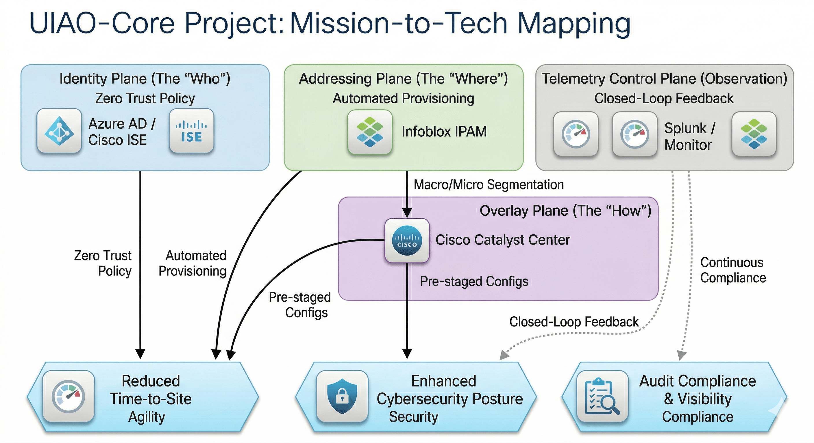
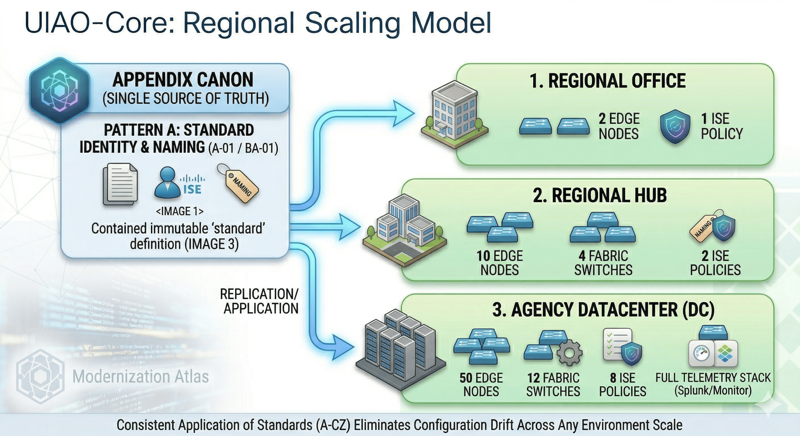

# Legacy vs. Modernized Infrastructure

To move at the speed of the agency's mission, we must transition away from manual, ticket-based workflows to an automated, policy-driven model.

## The Transformation
The diagram below contrasts our current "Siloed" state with the "Unified" model implemented by the uiao project.

PlantUML source

PlantUML source

PlantUML source

PlantUML source

PlantUML source

PlantUML source

PlantUML source

PlantUML source

PlantUML source

PlantUML source

PlantUML source

PlantUML source

PlantUML source

PlantUML source

### Key Value Transitions
| Capability | Legacy State | Modernized (uiao) |
| :--- | :--- | :--- |
| **Provisioning** | Manual (Hours/Days) | Automated (Minutes) |
| **Policy** | Static (VLAN-based) | Dynamic (Identity-based) |
| **Visibility** | Reactive (Logs) | Proactive (Telemetry Loops) |
| **Scaling** | Bespoke / Per-site | Standardized / Pattern-based |
