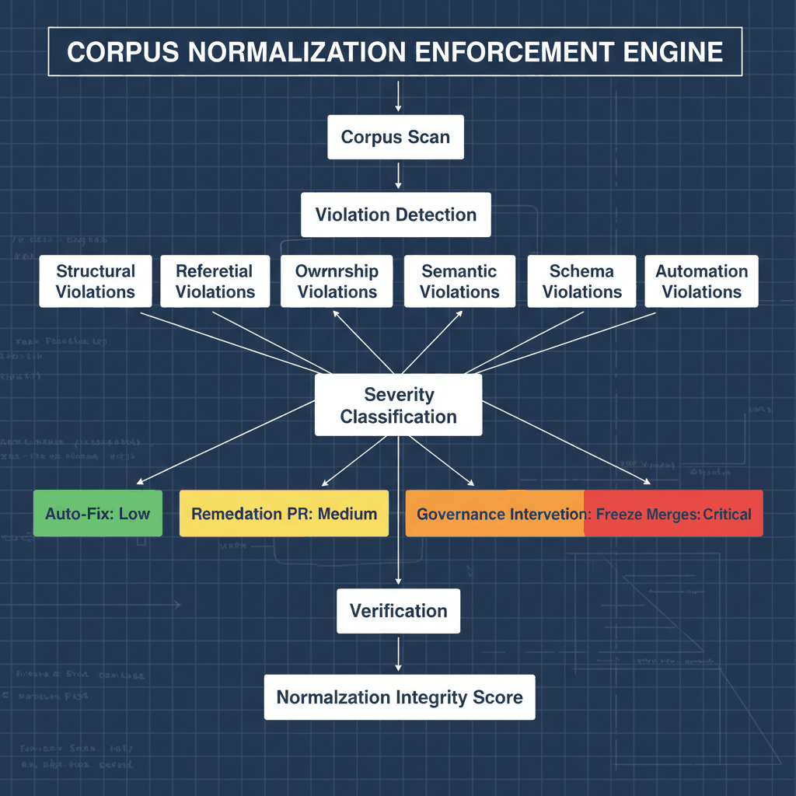

# UIAO Governance Corpus Normalization Enforcement Engine (Visual)

## Visual Architecture for Enforcing Metadata Consistency and Schema Alignment

This diagram visualizes the enforcement engine responsible for maintaining corpus-wide normalization.

---

## 1. Purpose

To provide a visual reference for the enforcement pipeline that detects, classifies, remediates, and verifies corpus normalization violations across all governance documents.

---

## 2. Architecture Diagram

{#fig-corpus-normalization-enforcement-engine-visual-diagram-01 fig-alt="Root box \"Corpus Scan\" flows down to \"Violation Detection\". Violation Detection fans into six parallel boxes arranged horizontally: Structural Violations, Referential Violations, Ownership Violations, Semantic Violations, Schema Violations, Automation Violations. All six converge into \"Severity Classification\". From Severity Classification, four severity-keyed branches fan out left-to-right with severity labels: \"Auto-Fix: Low\" (green), \"Remediation PR: Medium\" (yellow), \"Governance Intervention: High\" (orange), \"Freeze Merges: Critical\" (red). All four converge into \"Verification\", which feeds the terminal box \"Normalization Integrity Score\". Engineering blueprint style, severity-tier color coding on response boxes, federal navy headers, 16:9 landscape." width="85%"}

---

## 3. Enforcement Stages

### Stage 1: Corpus Scan

A full sweep of all documents in docs/governance/ is triggered on schedule (nightly) and on-demand after any schema change or bulk commit.

### Stage 2: Violation Detection

Each document is evaluated for six violation classes:

| Class | Examples |
|-------|---------|
| Structural | Missing required fields, malformed frontmatter |
| Referential | Broken cross-document IDs, dangling references |
| Ownership | Inactive owner, incorrect owner field |
| Semantic | Non-canonical status values, inconsistent classification |
| Schema | Deprecated fields present, wrong schema version |
| Automation | CI validator mismatch, workflow config drift |

### Stage 3: Severity Classification

| Severity | Criteria |
|----------|---------|
| Low | Single field error, auto-correctable |
| Medium | Cross-document impact, requires PR review |
| High | Owner reassignment or governance vote required |
| Critical | Merge freeze triggered, systemic integrity at risk |

### Stage 4: Remediation

| Severity | Remediation Path |
|----------|-----------------|
| Low | Automated fix committed directly to main |
| Medium | Remediation PR opened, assigned to owner |
| High | Governance board notified, intervention required |
| Critical | All merges frozen until resolution |

### Stage 5: Verification

After remediation, the CI validator re-runs the full scan and confirms:

- All violations resolved
- No new violations introduced
- Normalization Integrity Score updated

### Stage 6: Normalization Integrity Score

A composite 0-100 score reflecting corpus normalization health. Updated after every enforcement cycle.

---

## 4. Governance Actions

| Score Range | Action |
|-------------|--------|
| 90-100 | No action required |
| 75-89 | Schedule normalization sprint next cycle |
| 60-74 | Trigger targeted remediation for at-risk classes |
| 40-59 | Initiate governance intervention for affected owners |
| Below 40 | Declare normalization emergency, freeze merges |

> **SSOT Reference:** See /ssot/UIAO-SSOT.md
