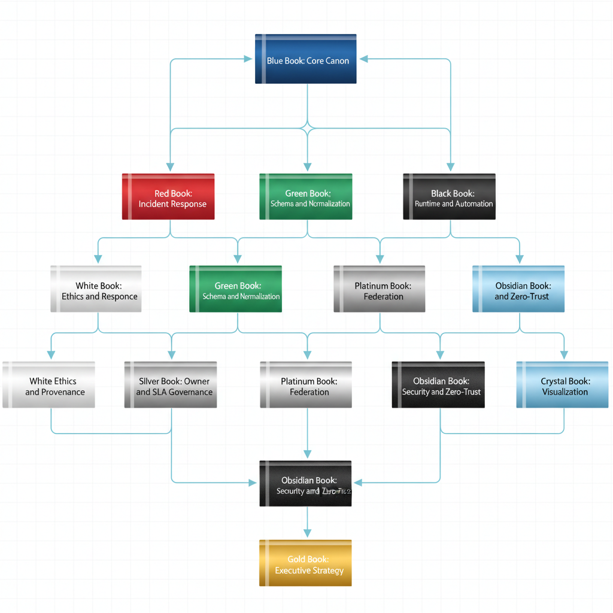

# UIAO Governance Canon Dependency Graph

## Cross-Volume Dependency Map

This document defines the dependency relationships between all canonical governance volumes.

---

## 1. Dependency Diagram

{#fig-governance-canon-dependency-graph-diagram-01 fig-alt="Apex node at top: \"Blue Book: Core Canon\" (deep blue). Blue feeds nine descendant boxes arranged in tiers: Red Book (Incident Response, crimson), Green Book (Schema and Normalization, green), Black Book (Runtime and Automation, charcoal), White Book (Ethics and Provenance, pearl), Silver Book (Owner and SLA Governance, silver), Platinum Book (Federation, platinum), Obsidian Book (Security and Zero-Trust, black), Crystal Book (Visualization, translucent crystal blue), Gold Book (Executive Strategy, gold) at the bottom apex. Inter-book dependency arrows: Red→Silver, Red→Black, Red→Obsidian; Green→Black, Green→Silver, Green→Obsidian; Black→Red, Black→Gold, Black→Obsidian; Platinum→Obsidian, Platinum→Gold; White→Silver, White→Gold, White→Crystal; Silver→Gold; Obsidian→Gold; Crystal→Gold. Each book rendered as a labeled book-spine icon in its named color, governance-board reference style, 16:9 landscape." width="85%"}

---

## 2. Dependency Rules

- Blue Book is the root of the canon. All other volumes extend it.
- Gold Book is the apex. It depends on all other volumes.
- No circular dependencies exist.
- Platinum Book (federation) and Obsidian Book (security) are peers that reinforce each other.
- Crystal Book (visualization) consumes outputs from all volumes but does not modify them.

---

## 3. Dependency Summary Table

| Volume | Depends On | Extended By |
|--------|-----------|-------------|
| Blue Book | None (root) | All others |
| Red Book | Blue, Black | Gold, Obsidian |
| Green Book | Blue | Black, Silver, Obsidian |
| Black Book | Blue, Green | Red, Gold, Obsidian |
| Platinum Book | Blue | Obsidian, Gold |
| Obsidian Book | Blue, Red, Green, Black, Platinum | Gold |
| Crystal Book | Blue, all others (data) | Gold |
| White Book | Blue | Silver, Gold, Crystal |
| Silver Book | Blue, Red, Green, White | Gold |
| Gold Book | All others | None (apex) |

---

## 4. Canonical Flow

    Blue Book (Root)
        -> Domain Books (Red, Green, Black, Platinum, Obsidian, White, Silver, Crystal)
        -> Gold Book (Apex)

> **SSOT Reference:** See /ssot/UIAO-SSOT.md
