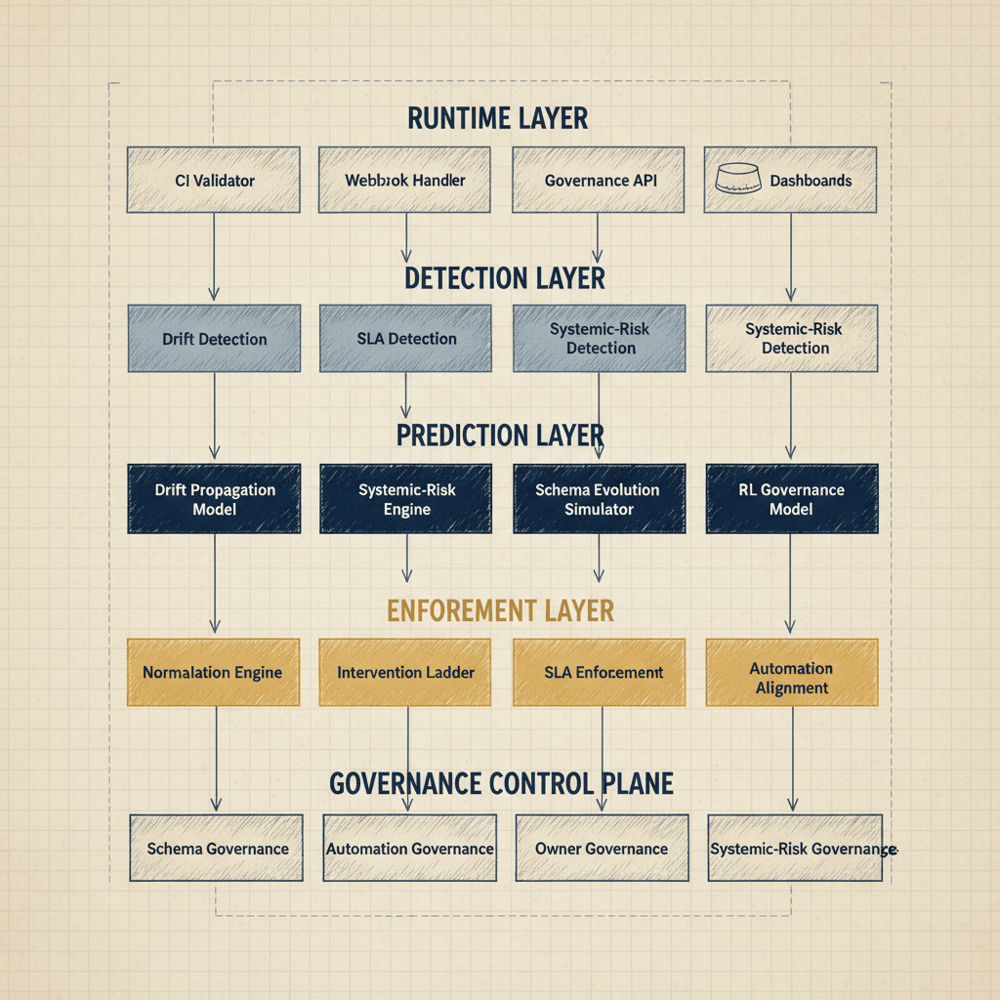

# UIAO Governance OS Architecture (End-to-End)

## The Complete, Layered Architecture of the Governance Operating System

This document defines the full governance OS from runtime ingestion to systemic-risk control, showing how all five architectural layers interlock.

---

## 1. Architecture Diagram

{#fig-governance-os-architecture-diagram-01 fig-alt="Layers arranged top-to-bottom, each as a labeled horizontal band containing component boxes. Band 1 \"Runtime Layer\" (slate gray): CI Validator, Webhook Handler, Weekly Drift Workflow, Governance API, PostgreSQL (drum icon), Dashboards — with vertical arrows from CI/Webhook/Workflow to API, API to PostgreSQL, PostgreSQL to Dashboards. Band 2 \"Detection Layer\" (steel blue): Drift Detection, SLA Detection, Systemic-Risk Detection — fed from Dashboards above. Band 3 \"Prediction Layer\" (deep blue): Drift Propagation Model, Systemic-Risk Engine, Schema Evolution Simulator, RL Governance Model — fed from Detection. Band 4 \"Enforcement Layer\" (amber): Normalization Engine, Intervention Ladder, SLA Enforcement, Automation Alignment — fed from Prediction. Band 5 \"Governance Control Plane\" (federal navy, bottom): Schema Governance, Automation Governance, Owner Governance, Systemic-Risk Governance — fed from Enforcement. Vertical flow arrows show layer-to-layer descent. Engineering blueprint style, federal navy (#1F3A5F) and amber (#D4A017) palette, layer-labeled bands, 16:9 landscape." width="85%"}

---

## 2. Architecture Layers

### Layer 1: Runtime

The foundation of the governance OS. All governance events originate here.

    CI Validator -> Webhook Handler -> Governance API -> PostgreSQL -> Dashboards

Components: GitHub Actions CI, webhook ingestion service, REST API, PostgreSQL data store, MkDocs-based documentation site.

### Layer 2: Detection

Consumes dashboard aggregates and database snapshots to detect governance signals.

- Drift Detection: identifies field-level, structural, and semantic drift events
- SLA Detection: monitors SLA timer state and breach velocity
- Systemic-Risk Detection: aggregates signals into systemic-risk scores

### Layer 3: Prediction

Applies models and simulators to forecast governance trajectory.

- Drift Propagation Model: predicts how detected drift will spread
- Systemic-Risk Engine: forecasts systemic failure probability
- Schema Evolution Simulator: models impact of schema changes
- RL Governance Model: reinforcement learning model for adaptive governance

### Layer 4: Enforcement

Translates predictions into governance actions.

- Normalization Engine: applies automated fixes, opens PRs, triggers interventions
- Intervention Ladder: escalates based on severity classification
- SLA Enforcement: closes SLA timers, triggers owner escalation
- Automation Alignment: patches CI validator, workflows, webhook handler

### Layer 5: Governance Control Plane

Orchestrates all governance domains based on enforcement outputs.

- Schema Governance: version pinning, deprecation management, migration
- Automation Governance: CI, workflow, and webhook configuration
- Owner Governance: assignment, reliability tracking, escalation
- Systemic-Risk Governance: threshold management, intervention triggers, merge freezes

---

## 3. Canonical Flow

    Runtime -> Detection -> Prediction -> Enforcement -> Governance Control Plane

---

## 4. Key Invariants

- No governance action bypasses the detection and prediction layers
- All enforcement actions are traceable to a detection event
- All control plane actions are traceable to an enforcement trigger
- Schema changes propagate through all five layers before taking effect
- Automation failures surface in the detection layer within 5 minutes

> **SSOT Reference:** See /ssot/UIAO-SSOT.md
