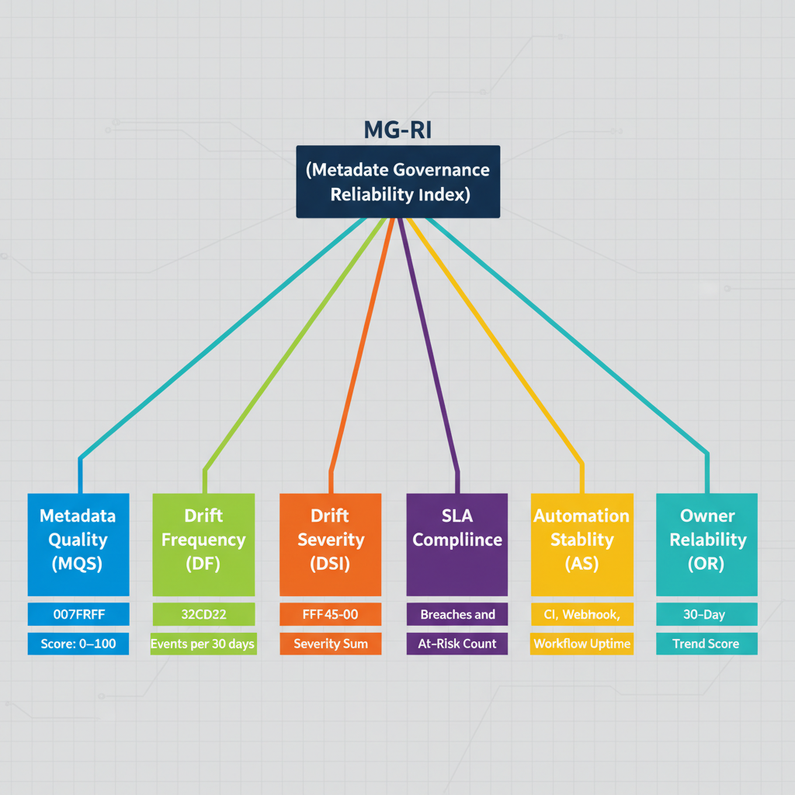

# UIAO Metadata Governance Reliability Index (Visual)

## Visual Decomposition of MG-RI Across Owners and Appendices

This artifact provides a visual representation of the Metadata Governance Reliability Index (MG-RI) and its components.

---

## 1. Purpose

To give governance operators and owners a clear visual decomposition of how MG-RI is computed and where reliability risks are concentrated.

---

## 2. Components of MG-RI

| Component | Symbol | Description |
|-----------|--------|-------------|
| Metadata Quality Score | MQS | 0-100 composite quality score |
| Drift Frequency | DF | Drift events per 30 days |
| Drift Severity Index | DSI | Weighted severity (4C + 3H + 2M + 1L) |
| SLA Compliance | SLA | Active SLA breaches and at-risk count |
| Automation Stability | AS | CI, webhook, and workflow uptime |
| Owner Reliability | OR | 30-day owner reliability trend |

---

## 3. Decomposition Diagram

{#fig-metadata-governance-reliability-index-visual-diagram-01 fig-alt="Central apex node \"MG-RI (Metadata Governance Reliability Index)\" at top center. Six branch boxes fan downward in a horizontal row: Metadata Quality (MQS), Drift Frequency (DF), Drift Severity (DSI), SLA Compliance, Automation Stability (AS), Owner Reliability (OR). Each of the six branches connects downward to a measurement-detail box below it: \"Score: 0–100\" under MQS; \"Events per 30 days\" under DF; \"Weighted Severity Sum\" under DSI; \"Breaches and At-Risk Count\" under SLA Compliance; \"CI, Webhook, Workflow Uptime\" under AS; \"30-Day Trend Score\" under OR. Each branch column color-coded. Federal navy (#1F3A5F) apex, distinct accent color per branch, engineering scorecard style, 16:9 landscape." width="85%"}

---

## 4. Dashboard View

### A. MG-RI Gauge

- 0-100 composite score rendered as a radial gauge
- Color-coded bands: green (90-100), yellow (75-89), orange (60-74), red (below 60)
- Current score and 30-day trend indicator

### B. Component Bars

- Each of the 6 components normalized to 0-1 scale
- Side-by-side bar comparison per owner or appendix
- Hover to reveal raw values and contribution percentage to overall MG-RI

### C. Trend Panel

- 90-day MG-RI trend line
- Overlaid markers for major schema changes and automation deployments
- Annotation for any governance interventions applied

---

## 5. Interactions

| Interaction | Result |
|-------------|--------|
| Click owner | Open owner reliability detail panel |
| Click appendix | Open appendix drift and SLA profile |
| Hover component bar | Show raw values and MG-RI contribution |
| Click trend annotation | Show intervention details |

---

## 6. Update Frequency

- MQS: daily
- DF and DSI: real-time on drift event
- SLA: real-time
- AS: every 5 minutes
- OR: daily

> **SSOT Reference:** See /ssot/UIAO-SSOT.md
