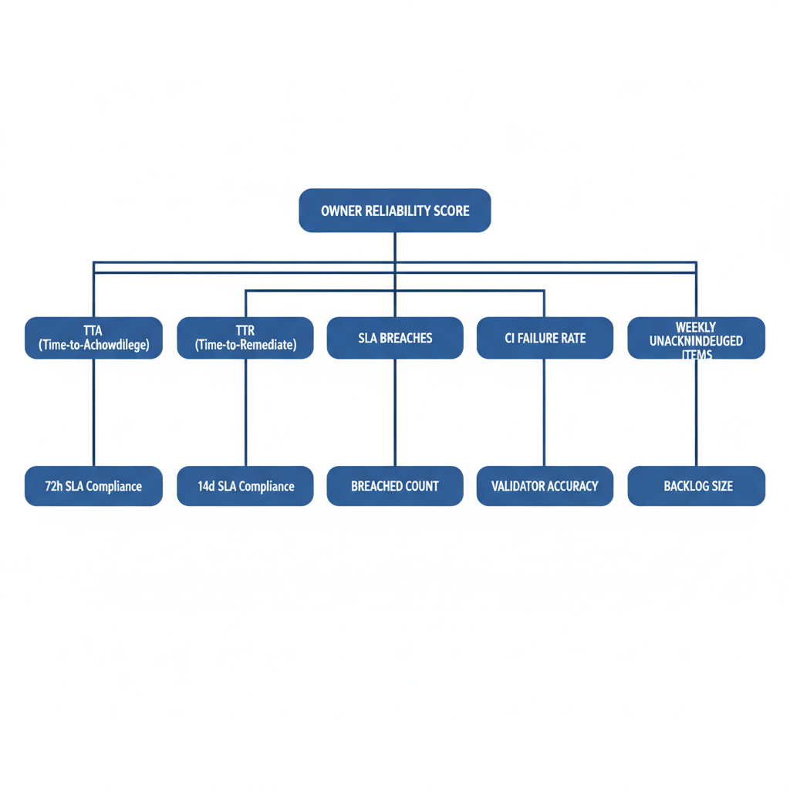

# UIAO Governance Reliability Score Decomposition Diagram

## Visual Breakdown of Owner Reliability Score Components

---

## Mermaid Diagram

{#fig-reliability-score-decomposition-diagram-diagram-01 fig-alt="Apex node centered at top: \"Owner Reliability Score\". Five branch boxes fan downward in a horizontal row: TTA (Time-to-Acknowledge), TTR (Time-to-Remediate), SLA Breaches, CI Failure Rate, Weekly Unacknowledged Items. Each branch connects downward to one or two metric-detail boxes: \"72h SLA Compliance\" under TTA; \"14d SLA Compliance\" under TTR; \"At-Risk Count\" and \"Breached Count\" both under SLA Breaches; \"Validator Accuracy\" under CI Failure Rate; \"Backlog Size\" under Weekly Unacknowledged Items. Clean technical scorecard style, federal navy primary boxes, no extraneous decoration, 16:9 landscape." width="85%"}

---

## ASCII Diagram

```
          Owner Reliability Score
      /        |         |         |         |
   TTA        TTR    SLA Breaches  CI Fail  Weekly Unacked
    |           |      /      |      |           |
 72h SLA    14d SLA  At-Risk Breach Accuracy  Backlog
```

---

## Component Definitions

### TTA - Time to Acknowledge

Measures how quickly owners acknowledge drift issues. Target: within 72 hours.

### TTR - Time to Remediate

Measures how quickly owners remediate acknowledged drift. Target: within 14 days for critical issues.

### SLA Breaches

Counts of at-risk and breached SLA items attributed to this owner.

### CI Failure Rate

Percentage of CI validator failures linked to documents owned by this owner.

### Weekly Unacknowledged Items

Backlog of unacknowledged drift items accumulated week-over-week.

> **SSOT Reference:** See /ssot/UIAO-SSOT.md
