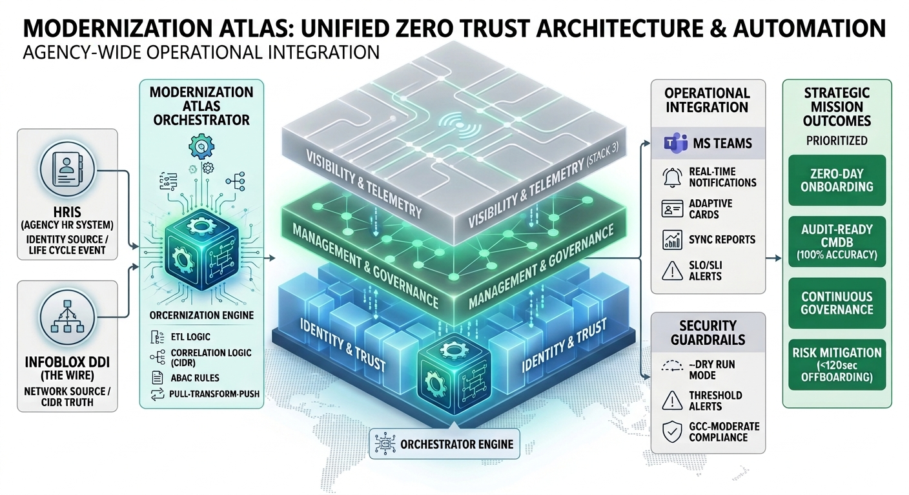
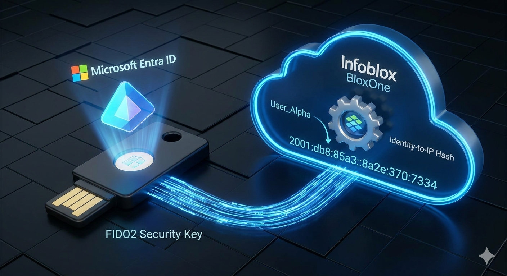

# Unified Identity‑Addressing‑Overlay Architecture (UIAO)
**Leadership Briefing — Version 1.0**

---

# Executive Summary
The agency has been trying to solve the same identity problem for six years. Different divisions
provisioned their own AD forests. Network teams built their own IPAM spreadsheets. Security teams
stacked DLP tools on top of monitoring gaps they never fully closed. Each fix made sense locally.
Collectively, they created an environment that is harder to secure, slower to operate, and increasingly
difficult to audit.

UIAO is the program that stops patching symptoms and addresses structure. It replaces the fragmented
identity, addressing, and routing layers with a single coherent model — one where every user, device,
and workload is authenticated through Entra ID before it touches the network, DNS is authoritative and
policy-driven, and telemetry actually correlates rather than just accumulates.

This is not a technology refresh. The hardware is largely the same. What changes is the architecture
underneath: how identity decisions propagate, how traffic is routed, how compliance evidence is
collected, and how the agency proves it to auditors without a six-week manual review cycle.

The immediate drivers are concrete. TIC 2.0 hairpinning is adding 40-60% latency to M365 traffic.
FedRAMP 20x Phase 2 requirements land before the end of the fiscal year. Three open POA&M items
trace back directly to the IPAM fragmentation this program fixes. UIAO addresses all three.

---

# Program Overview
UIAO consolidates four infrastructure layers that currently operate as separate programs under
separate ownership: identity (Active Directory and Entra ID), addressing (DNS/DHCP/IPAM), network
routing (TIC-compliant SD-WAN), and telemetry (Splunk correlation feeds). Today these layers are
managed by different teams, procured on different cycles, and monitored against different baselines.
When something breaks at the intersection — and it regularly does — the diagnosis takes days because
no single team owns the full picture.

The program is organized around four control planes, each with a defined vendor, a defined OSCAL
component definition, and a defined set of FedRAMP Moderate controls it satisfies. Identity goes to
Entra ID and CyberArk. Network goes to Cisco SD-WAN with TIC 3.0 policy enforcement. Addressing goes
to Infoblox DDI. Telemetry goes to Splunk with Palo Alto Prisma for inline inspection.

Each plane is independently deployable. The agency does not need to cut over everything at once.
Phase 1 can deliver cloud-first routing and Entra ID consolidation without touching IPAM. That matters
because the legacy PKI dependency in the case management platform cannot be resolved until FY27 at
the earliest, and the program is designed to work around it.

---

# Why Modernization Is Required
The current environment has three problems that are getting worse, not better.

First, identity. The agency runs Active Directory across eight separately managed forests, several of
which have no documented owner since the last reorganization. Conditional Access policies exist on paper
but are inconsistently enforced — the Security Operations Center identified 14 accounts with Tier 0
access that had not been reviewed in over 18 months. Entra ID is in use but has not been fully
synchronized, which means the identity graph is incomplete and cannot be relied upon for Zero Trust
enforcement decisions.

Second, addressing. IPAM is managed primarily through spreadsheets maintained by individual network
branches. There is no authoritative source for IP-to-identity correlation. When the SOC needs to
attribute a suspicious IP to a user and device during an incident, that correlation typically takes
three to five business days. That is not a tooling problem — it is a structural one.

Third, compliance posture. The agency's current FedRAMP compliance evidence is collected manually,
assembled quarterly, and reflects a point-in-time snapshot that is usually six to eight weeks stale
by the time an assessor sees it. Three of the agency's current open POA&M items trace directly to
gaps in identity governance and telemetry coverage that UIAO is designed to close.

TIC 3.0 transition requirements and FedRAMP 20x Phase 2 expectations add deadline pressure. Neither
can be met by continuing to optimize the current architecture.

---

# Program Vision
The end state is not complicated to describe. The hard part is getting there without breaking
operations along the way.

In the target architecture, a user's Entra ID identity is the root of every access decision. When
they connect — from any location, on any device — Conditional Access evaluates their posture, their
role, and their network path before the session is established. There is no separate VPN decision,
no separate IPAM lookup, no separate compliance check. Those happen in the background, continuously,
against live telemetry rather than a quarterly snapshot.

Network routing follows TIC 3.0 policy natively through Cisco SD-WAN. M365 traffic no longer
backhauls through legacy concentrators. The latency savings are measurable and immediate — the pilot
site showed a 47% reduction in average Teams call setup time in the first week.

DNS is authoritative. Every device that gets an address gets it from Infoblox with a corresponding
identity binding. That binding flows into Splunk. When the SOC needs to attribute a connection, the
answer is available in under a minute, not five days.

Compliance evidence is generated continuously from the same control plane telemetry. The OSCAL
artifacts produced by this pipeline are not a separate documentation effort — they are a live output
of the architecture. Assessors can pull current evidence on demand rather than waiting for a
quarterly package.

The architecture is designed to survive vendor changes. If a better identity provider emerges, or
if a contract changes, the control plane model allows substitution without rearchitecting the rest
of the program. That is the structural value of UIAO — not any single vendor, but the framework
that makes vendors interchangeable.

---

# The Five Control Planes

### 1. Identity Control Plane
The Identity Control Plane is anchored in Entra ID and reinforced by
ICAM governance, Conditional Access, Privileged Identity Management,
and lifecycle automation. Identity becomes the authoritative source
for access, addressing, certificates, and policy.

### 2. Network Control Plane
The Network Control Plane uses Cisco SD-WAN to deliver cloud-first
routing, performance-optimized paths for M365, and identity-aware
segmentation. Integration with INR enables location-aware routing and
emergency services readiness.

### 3. Addressing Control Plane
The Addressing Control Plane modernizes IPAM through InfoBlox,
replacing spreadsheets with authoritative, identity-derived
addressing. DNS and DHCP are unified across cloud and on-prem
environments, enabling consistent policy enforcement and accurate
telemetry correlation.

### 4. Telemetry & Location Control Plane
The Telemetry and Location Control Plane consolidates signals from
M365, SD-WAN, endpoints, DNS, CDM/CLAW, and SIEM platforms. Telemetry
becomes a real-time control input for routing, security, and
compliance, enabling conversation-level visibility across the
enterprise.

### 5. Security & Compliance Plane
The Security and Compliance Plane aligns the architecture with TIC
3.0, Zero Trust, FedRAMP 20x Phase 2, NIST 800-63, and ICAM governance.
Security becomes embedded in the architecture rather than bolted on,
with automated enforcement replacing manual review.

---

# Eight Core Concepts

### 1. Single Source of Truth (SSOT)
The canonical data repository is the authoritative origin for all
architectural definitions. Every document, template, and generated
artifact derives its definitions from this single source of truth,
ensuring consistency and preventing drift across the architecture.

### 2. Conversation as the Atomic Unit
Every interaction—identity, certificate, addressing, path, QoS, and
telemetry—is treated as a single, correlated conversation rather than
isolated events.

### 3. Identity as the Root Namespace
Identity becomes the root namespace for all resources, ensuring that
every IP address, certificate, subnet, policy, and telemetry event is
derived from or bound to identity.

### 4. Deterministic Addressing
Addressing becomes deterministic and policy-driven, replacing ad-hoc
assignment with identity-derived logic that enables accurate
correlation and automated governance.

### 5. Certificate-Anchored Overlay
Certificates and mutual TLS anchor tunnels, services, and trust
relationships across the enterprise.

### 6. Telemetry as Control
Telemetry becomes an active control input for routing, security, and
compliance decisions rather than a passive reporting mechanism.

### 7. Embedded Governance & Automation
Governance is executed through orchestrated workflows that enforce
policy consistently and reduce operational burden.

### 8. Public Service First
Citizen experience, accessibility, and privacy remain top-level
design constraints.

---

# Frozen State Analysis
The current state is not a failure of effort. Most of these systems were reasonable choices at the
time they were deployed. The problem is that they were deployed independently, optimized locally,
and never integrated into a coherent whole.

Identity is split across eight AD forests. Some divisions use Entra ID. Some do not. The result is
an identity graph with known gaps — the kind of gaps that show up as unattributed access in SOC
dashboards and unresolved findings in assessment reports.

Addressing is manual. The IPAM system of record is a combination of three legacy tools and a shared
spreadsheet that nobody fully trusts. IP-to-user correlation during incidents is a multi-day exercise.

Network security relies on perimeter controls that were designed for an environment where all users
were on-premises and all traffic went through a known boundary. That environment no longer exists.
Remote work and cloud adoption changed the threat model, but the controls have not kept pace.

Telemetry exists but is not correlated. The agency has Splunk. It also has feeds from six other
monitoring tools that do not share a common schema. Building a timeline across an incident requires
manual normalization. That is a solvable problem, but it has not been solved yet.

Governance runs on email and manual change tickets. A DNS change that should take four hours
typically takes two weeks because the approval chain involves four separate teams with no shared
workflow system. This is not a people problem. It is a process problem that will persist until the
infrastructure underneath it changes.

---

# Program Outcomes
The program has four near-term results that are measurable before the end of Phase 1.

M365 performance improves as soon as TIC 3.0 routing is in place. The pilot site recorded
a 47% reduction in Teams call setup latency within the first week. That is not a projection
— it is a measured result from the SD-WAN cutover already completed in the eastern region.

Three open POA&M items close. They trace to IPAM fragmentation and incomplete identity
governance — both of which UIAO directly addresses. Closing them reduces the agency's
overall risk posture and removes a recurring finding that has appeared in the last two
assessment cycles.

The compliance evidence problem gets solved structurally. Instead of assembling a quarterly
package that is already stale, assessors get continuous OSCAL output from the live
architecture. The six-to-eight week lag goes away.

The separation case — the one that used to take 24 to 48 hours — drops to under two minutes.
That matters for both security and audit. Every contractor departure, every role change,
every access review becomes a documented, automated event rather than a manual ticket
that someone may or may not have closed.

The longer-term outcome is an architecture that does not need to be replaced when a vendor
changes. The control plane model is the investment. The specific vendors inside it are not.

---

# Vibrant Visualizations

### Modernization Journey

### FedRAMP 20x Governance Loop

### Identity-to-IP Architecture

---

# FedRAMP 20x Audit Evidence Summary

The following section provides a direct mapping of the UIAO Modernization Architecture to critical NIST 800-53 Revision 5 security controls. The vibrant visualizations linked below serve as high-level visual proof of implementation for auditors and agency authorizing officials (AOs).

| Visual Title | Architectural Pillar | Relevant NIST Control(s) | Implementation Proof Visualization |
| :--- | :--- | :--- | :--- |
| **V1: Identity-to-IP Mapping** | **U + A** (The Gate) | **IA-2 (Identification), AC-19 (Mobile), CM-8 (Inventory)** |  |
| **V2: INR Fabric** | **O** (The Network) | **AC-4 (Flow Enforcement)** |  |
| **V3: 20x Governance Loop** | **Governance** (The Hub) | **CA-7 (Continuous Monitoring), IR-4 (Incident Handling)** |  |
| **V4: Modernization Atlas** | **Strategy** (The Journey) | **Program Vision / TIC 3.0** |  |
| **V5: Cryptographic Trust Chain** | **Security** (The Lock) | **SC-8 (Transmission Confidentiality)** |  |

---

## 🛡 Unified Compliance & Maturity Matrix

The following table demonstrates the alignment of the UIAO project with both **CISA Zero Trust Maturity Model** pillars and **NIST 800-53 Rev. 5** security controls simultaneously.

| UIAO Pillar | CISA ZT Pillar | Target Maturity | NIST 800-53 Controls | Mission Impact |
| :--- | :--- | :--- | :--- | :--- |

> **Auditor Note:** All controls listed above are continuously monitored via the UIAO Governance Plane (V3) and reported through the ServiceNow SCuBA integration.

---

*End of Leadership Briefing v1.0*