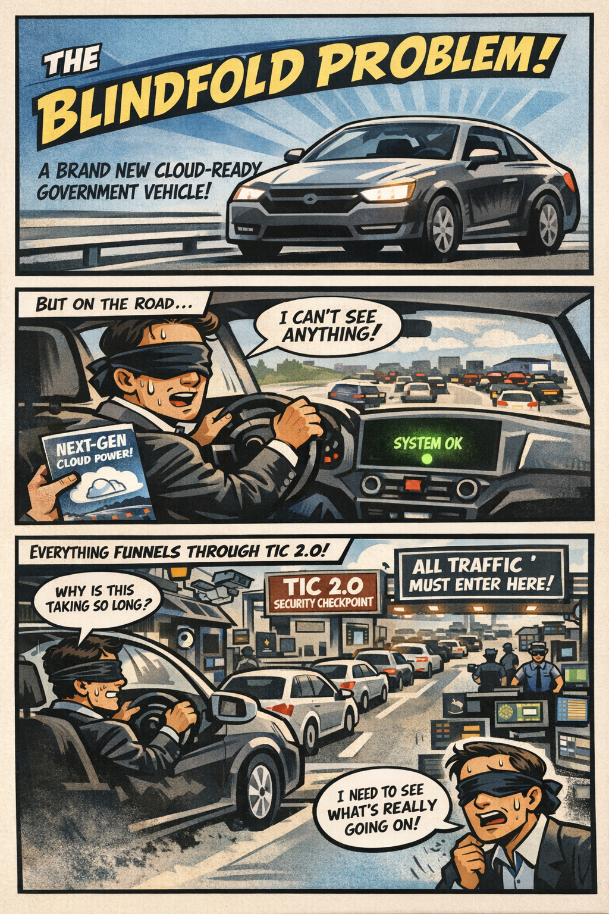

The first thing you notice is the silence. Not the peaceful kind — the suspicious kind. The kind that makes you wonder what’s missing. You’ve just climbed into a brand‑new “Cloud‑Ready Government Vehicle,” the sort of machine that arrives with a glossy brochure, a ribbon‑cutting photo op, and a promise that it will “transform the way you drive into the future.” You settle into the seat, close the door, and look at the dashboard. That’s when you realize the silence isn’t the problem. The problem is the dashboard itself. It’s empty. Completely empty. No gauges, no indicators, no map, no sense of where you are or what the car is doing. Instead, the entire dashboard has been replaced by one large, glowing green light in the center that says, with unwavering confidence, SYSTEM OK.

You stare at it for a moment, trying to decide whether this is a bold new design philosophy or a manufacturing oversight. The green light continues to glow, offering no further explanation. You put the car in drive. It moves. It accelerates. It turns when you turn the wheel. So technically, everything is working. But you have no idea whether you’re going 30 or 90, whether the engine is overheating, whether you’re almost out of gas, or whether the road ahead is a bridge or a boat ramp. You’re not doing anything wrong. The car just wasn’t built with gauges yet.

That is what the federal cloud experience became starting around 2019. Agencies were driving a system that worked — mostly — but without the telemetry, location signals, or visibility needed to understand why it behaved the way it did. And importantly, this wasn’t because anyone made a mistake. It wasn’t because agencies, FedRAMP, or cloud providers failed. It was simply the architecture everyone inherited.

How the Blindfold Formed

The Blindfold emerged from the way cloud was understood in 2017. At that time, cloud was treated as a secure datacenter extension, not a distributed, identity‑anchored ecosystem. TIC 2.0 was designed to centralize inspection and protect federal systems, not to carry identity, region, or session signals. Cloud providers themselves had not yet built the telemetry‑rich, region‑aware systems that would later become essential. And the federal WAN was still optimized for client‑server applications. MPLS abstracted distance, TIC 2.0 concentrated inspection, and neither exposed the signals cloud workloads would soon require.

There was another constraint that mattered just as much. Because of how the FedRAMP Moderate boundaries were defined, cloud service providers were not allowed to bring the same telemetry pipelines, location services, and operational dashboards into GCC‑Moderate that already existed in the Commercial cloud. They could not add them, even when they wanted to, because the boundary prohibited the very signals those features depended on. GCC‑Moderate wasn’t missing features because it was behind or neglected; it was missing them because the architecture explicitly prevented cloud providers from delivering the same visibility their Commercial customers had. This series focuses on that exact condition across Microsoft 365, Entra ID, Azure, and AWS’s US Cloud Moderate environments — all of which inherited the same blindfold for the same architectural reason.

The architecture made perfect sense for the era. It simply did not anticipate what cloud would become.

Why Cloud Began to Feel Unpredictable

As cloud workloads matured, they began relying on signals the TIC 2.0 boundary never carried. Identity needed to be evaluated continuously, not just at login. Certificates carried metadata that influenced session behavior. Sessions needed to persist across changing network conditions. Browsers quietly selected cloud regions based on location and latency. Private endpoints expected the network to reveal where the user actually was. Token refreshes became sensitive to delay. Real‑time media needed to understand the path it was taking. And the cloud expected telemetry — constant, rich, detailed telemetry — to make sense of all of it.

None of these signals were visible inside TIC 2.0. They weren’t blocked out of neglect or misconfiguration; they were never part of the design. The architecture had been built before anyone knew these signals would matter. So when cloud services began depending on them, agencies were left with a system that worked, but without the information needed to understand why it behaved the way it did. Cloud wasn’t random. It only looked that way because the gauges weren’t there.

Why Headquarters and Field Offices See Different Systems

Supervisors at headquarters sit close to identity controllers, cloud egress points, and the TIC 2.0 boundary. Their path to cloud is short, stable, and minimally inspected. Field offices and teleservice centers sit behind branch routers, WAN optimizers, MPLS tail circuits, regional hubs, and multiple inspection layers. Their path is longer, more variable, and more sensitive to latency and region selection. Both groups are correct. They are simply describing different parts of the same system.

Why This Is a Visibility Problem, Not a People Problem

When identity, region, and session signals are hidden, every team falls back to the tools they do have. Network teams rely on packet capture, security teams rely on logs, cloud teams rely on dashboards, and supervisors rely on user reports. Each tool shows a different slice of the truth, but none show the whole picture. This is not dysfunction. It is instrumentation mismatch. The architecture hides the signals that matter most.

The Root of Modernization Pain

Every modernization challenge — WAN, cloud, call centers, M365, Amazon Connect — traces back to one fact: you cannot operate a cloud you cannot see. Not because people aren’t trying, not because teams aren’t skilled, and not because leadership doesn’t care. The architecture simply predates the workloads. TIC 3.0 exists because the cloud changed, not because anyone failed.

Closing Thought

The Blindfold Problem is not about blame. It is about visibility. Even if TIC 3.0 is fully implemented, the gauges do not return on their own. Telemetry, location services, and cloud dashboards remain restricted as long as the original FedRAMP boundaries stay in place. Those boundaries must be deliberately lifted, documented, and modernized before the architecture can see what the cloud is actually doing. Only then do the experiences at headquarters and field offices begin to converge, and only then does modernization become something other than guesswork. And if TIC 2.0 were retired and agencies operated solely under the TIC 3.0 Cloud Use Case, the Blindfold would finally come off, because the architecture would no longer be hiding the very signals the cloud depends on.

## About the Author

**Michal Doroszewski** is a technology strategist focused on cloud
architecture, identity platforms, and federal modernization. He writes
about the structural and architectural forces that shape government IT,
translating complex technical constraints into clear, accessible
narratives for leaders and practitioners.

::: {.callout-note collapse="true"}
## Provenance
Source: `inbox/Article 01 The Blindfold Problem Bylined.docx` (round-2 drop, 2026-04-17). This article
was drafted before the UIAO substrate was formalized on GitHub; it is
published here per the pre-UIAO promotion path in ADR-030 with the byline
and body preserved and filename qualifiers dropped.
:::

---

**Book:** [*FedRAMP Boundaries — Articles on Application-Aware Networking*](index.qmd)
 · [Previous](what-we-dont-know-were-missing.qmd) · [Next](article-02-boundary-problem.qmd)
