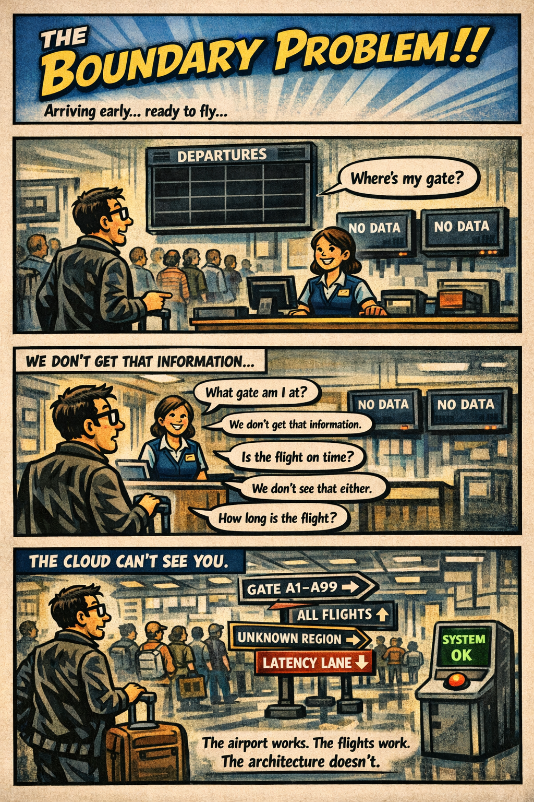

You arrive at the airport early, confident and prepared. You check the departures board — but it’s blank. You ask the agent what gate your flight is at. They smile and say, “We don’t get that information.” You ask how far the gate is. “We don’t track that.” You ask if your flight is on time. “We don’t see that either.” You ask how long the flight is. “We don’t know.” You’re not being blocked. You’re being blindfolded. The airport is working. The scanners are working. The flights are working. But the architecture guarantees that no one knows where they’re going, how far it is, or how long it will take to get there.

That is what boundaries became in the federal cloud. Not broken. Not malicious. Just designed for a world where location, identity, and session signals weren’t needed — and now they are. Boundaries are supposed to protect systems, but in cloud they do something else entirely. They define what the cloud is allowed to see. And when the boundary hides the signals the cloud depends on, the cloud stops behaving like cloud. It starts behaving like a sealed‑off airport where everyone is moving, but no one knows where they’re headed.

What the Boundary Actually Blocks

The federal boundary was built for a world where packets mattered and context didn’t. Cloud workloads flipped that model. They depend on signals, not packets — and the FedRAMP Moderate boundary strips or obscures many of those signals by design. Nothing is misconfigured. Nothing is broken. The architecture simply predates the workloads.

When traffic enters the boundary, the cloud loses the information it needs to route, adapt, and explain itself. The cloud sees the request, but not the environment. It sees the authentication, but not the path. It sees the workload, but not the location. It sees the user, but not the session. It sees the packet, but not the context.

This is why GCC‑Moderate behaves differently than Commercial. Commercial cloud sees everything it needs. GCC‑Moderate sees only what the boundary allows — and the boundary allows very little.

The missing signals fall into several categories:

- Identity signals — continuous evaluation, token refresh metadata, certificate attributes, and session‑level identity hints that Commercial cloud uses to maintain stable, predictable behavior.

- Location signals — browser region selection, latency‑based routing, private endpoint locality, and geolocation hints that determine which region a workload should use.

- Session signals — path stability, packet timing, jitter tolerance, and media‑flow telemetry that real‑time workloads depend on.

- Telemetry signals — the high‑volume, high‑resolution data streams that cloud providers use to populate dashboards, detect anomalies, and tune performance.

- Operational signals — the health, routing, and diagnostic data that Commercial cloud exposes to administrators but GCC‑Moderate cannot, because the boundary prevents the cloud from seeing the environment it is operating in.

- Dashboard signals — the aggregated, cross‑layer visibility that Commercial cloud provides through built‑in dashboards. These dashboards cannot exist in GCC‑Moderate because the boundary blocks the underlying telemetry they require.

When these signals are missing, the cloud behaves like the airport with the blank departures board. It is not refusing to help. It simply cannot see what it needs to see.

This is why two users in two different offices can have two completely different experiences with the same cloud service. The cloud is not inconsistent. The boundary is inconsistent. And because the boundary hides the signals the cloud depends on, the cloud cannot correct the inconsistency.

This is also why cloud providers could not add the same dashboards, telemetry, and location‑aware features to GCC‑Moderate that Commercial customers have had for years. They were not allowed to. The boundary prohibited the signals those features required. The result was not a degraded product. It was a constrained product — constrained by an architecture that predates the workloads.

The Boundary Problem is not a cloud problem. It is not a network problem. It is not a people problem. It is an architectural problem. And architectural problems can be fixed — but only once they are seen.

Updated Diagram — Boundary Problem (Screen‑Ready)

+---------------------------------------------------------------+

|                        FEDERAL BOUNDARY                       |

|                                                               |

|   Incoming Cloud Traffic --> [ Inspection / NAT / TLS Break ] |

|                                                               |

|   Signals Lost:                                               |

|     - Identity Continuity                                     |

|     - Region / Location                                       |

|     - Session Path / Stability                                |

|     - Certificate Metadata                                    |

|     - Telemetry Streams                                       |

|     - Dashboard Visibility                                    |

|                                                               |

+---------------------------------------------------------------+

| (Cloud sees only packet-level data)

                 v

+---------------------------------------------------------------+

|                        GCC-MODERATE CLOUD                     |

|                                                               |

|   What Cloud CAN See:                                         |

|     - Source IP (post-NAT)                                    |

|     - Basic Authentication Event                              |

|                                                               |

|   What Cloud CANNOT See:                                      |

|     - User Location                                           |

|     - Path Stability                                          |

|     - Token Refresh Timing                                    |

|     - Browser Region Selection                                |

|     - Endpoint Locality                                       |

|     - Real-Time Media Telemetry                               |

|     - Operational Health Signals                              |

|     - Dashboard Inputs                                        |

|                                                               |

+---------------------------------------------------------------+

| (Cloud cannot optimize or adapt)

                 v

+---------------------------------------------------------------+

|                     USER EXPERIENCE VARIATION                 |

|                                                               |

|   HQ: Short path, stable, predictable                         |

|   Field Office: Long path, variable, unpredictable            |

|                                                               |

|   Cloud is not inconsistent — the boundary is.                |

+---------------------------------------------------------------+

## About the Author

**Michal Doroszewski** is a technology strategist focused on cloud
architecture, identity platforms, and federal modernization. He writes
about the structural and architectural forces that shape government IT,
translating complex technical constraints into clear, accessible
narratives for leaders and practitioners.

::: {.callout-note collapse="true"}
## Provenance
Source: `inbox/Article 02 The Boundary Problem Bylined.docx` (round-2 drop, 2026-04-17). This article
was drafted before the UIAO substrate was formalized on GitHub; it is
published here per the pre-UIAO promotion path in ADR-030 with the byline
and body preserved and filename qualifiers dropped.
:::

---

**Book:** [*FedRAMP Boundaries — Articles on Application-Aware Networking*](index.qmd)
 · [Previous](article-01-blindfold-problem.qmd) · [Next](article-03-distance-problem.qmd)
