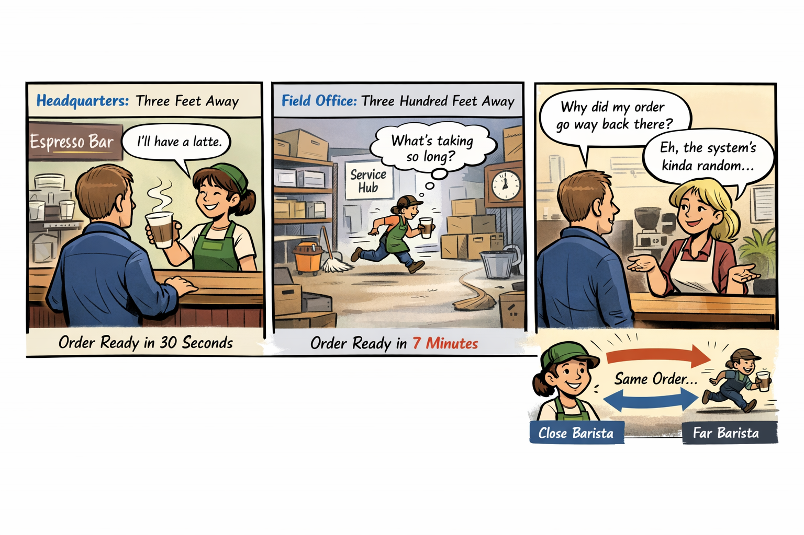

You’re standing in line at a coffee shop, second in queue, close enough to smell the espresso but far enough back to observe the entire operation like a field study. The person in front of you orders a simple drink — nothing complicated, nothing that requires latte art or a foam dissertation. The barista three feet away nods, taps the screen, and hands over the drink almost instantly, the whole exchange landing with the smooth timing of a studio drummer who has been playing the same groove for twenty years.

Then it’s your turn.

You place the exact same order. Same drink. Same size. Same everything. The barista smiles, taps the screen, and you watch as your order is routed — not to the drummer‑steady barista three feet away, but to the one stationed somewhere in the back of the building, past the storage racks and the industrial mop sink. You can see her weaving around obstacles with the frantic energy of a roadie sprinting across the stage because the guitarist just snapped a string mid‑solo. Seven minutes later, your drink arrives. Same system. Same order. Completely different tempo.

You ask the manager why this happens. She shrugs and says, “The system decides which barista gets which drink. Sometimes it picks the close one. Sometimes it picks the far one. It’s complicated.”

That is the Distance Problem. Not the physical kind — the architectural kind. The kind created when a system hides distance, pretends distance doesn’t matter, and then behaves unpredictably because distance always mattered.

Cloud Architecture and Distance

Cloud was supposed to make distance irrelevant, but that only works when the network is allowed to reveal distance. The federal WAN doesn’t. It hides it behind MPLS, hub‑and‑spoke routing, regional aggregation points, WAN optimizers, and inspection layers that turn a simple path into a cross‑country relay race. Headquarters sits three feet from the barista. Field offices sit three hundred feet away. The architecture decides who gets which barista, not the workload, and the cloud reacts to the path it sees, not the one people assume exists.

Legacy WAN vs. Cloud Expectations

The WAN was built for a world where applications lived in data centers and users lived on the LAN. Everything was designed to pull traffic inward, centralize inspection, and treat all users as if they were in the same place. Cloud expects the opposite. It expects local breakout, region‑aware routing, identity‑anchored access, and session continuity. When cloud traffic enters a legacy WAN, the path becomes longer, more variable, and more fragile. The cloud sees a user who appears to be “in” the hub, not in the field office, and the session behaves accordingly.

Session Behavior and Distance Sensitivity

Modern cloud sessions depend on timing, stability, and proximity. Token refreshes need to arrive on time. Browsers need to select the right region. Media flows need predictable paths. Private endpoints need to understand locality. Conditional Access needs accurate signals. Every one of these behaviors is sensitive to distance, and every one of them breaks when the path is stretched, rerouted, or abstracted. The cloud isn’t malfunctioning. It’s responding to the only truth it can see, even if that truth is distorted by the architecture beneath it.

Real-Time Workloads and Fragility

This distortion becomes most visible in real‑time workloads. Media flows expect to take the shortest path. They expect to understand where the user is. They expect the network to reveal distance, not hide it. When the WAN forces media traffic through a hub, the flow becomes longer, more fragile, and more prone to failure. The cloud cannot compensate for a path it cannot see. It cannot optimize around a distance it does not know exists. It cannot correct a problem that the architecture insists is not there.

Identity and Conditional Access

Identity behaves the same way. Conditional Access policies depend on location signals, timing signals, and session continuity. When those signals are stretched or obscured, the system begins to make decisions that appear arbitrary. A user may be challenged unexpectedly. A session may be re‑evaluated unnecessarily. A token may expire sooner than expected. None of this is random. It is the predictable outcome of an architecture that hides the very information identity systems rely on.

Dashboards and Telemetry Loss

Even dashboards suffer. Cloud dashboards are built on telemetry that assumes the cloud can see the environment it is operating in. When the WAN hides distance, the dashboards lose context. They show symptoms without causes, patterns without explanations, and anomalies without origins. Administrators are left with a view of the system that is technically accurate but operationally useless. The cloud is not withholding information. It simply does not have it.

Modernization Struggles

This is why modernization efforts struggle. Every attempt to improve performance, stabilize sessions, or enhance user experience runs into the same invisible wall. The architecture hides distance, and the cloud cannot compensate for what it cannot see. Teams troubleshoot symptoms, not causes. Fixes work in headquarters but fail in field offices. Improvements appear promising in testing but collapse in production. The system behaves like a coffee shop that routes orders unpredictably, and no amount of tuning changes the fact that the routing logic is blind to distance.

The Matter of Truth

The Distance Problem is not a matter of bandwidth, speed, or hardware. It is a matter of truth. Cloud systems are designed to operate in a world where distance is visible, measurable, and meaningful. The federal WAN was designed to operate in a world where distance is abstracted, hidden, and irrelevant. Those two worlds cannot coexist without conflict. The conflict shows up as user experience, and the user experience becomes the story people tell about modernization.

The Only Way Forward

The only way forward is to let the cloud see the real path. The architecture must stop hiding distance and start revealing it. Only then can the cloud behave the way it was designed to behave, and only then can modernization become something other than a guessing game.

## About the Author

**Michal Doroszewski** is a technology strategist focused on cloud
architecture, identity platforms, and federal modernization. He writes
about the structural and architectural forces that shape government IT,
translating complex technical constraints into clear, accessible
narratives for leaders and practitioners.

::: {.callout-note collapse="true"}
## Provenance
Source: `inbox/Article 03 The Distance Problem FINAL REGEN.docx` (round-2 drop, 2026-04-17). This article
was drafted before the UIAO substrate was formalized on GitHub; it is
published here per the pre-UIAO promotion path in ADR-030 with the byline
and body preserved and filename qualifiers dropped.
:::

---

**Book:** [*FedRAMP Boundaries — Articles on Application-Aware Networking*](index.qmd)
 · [Previous](article-02-boundary-problem.qmd) · [Next](article-04-identity-problem.qmd)
