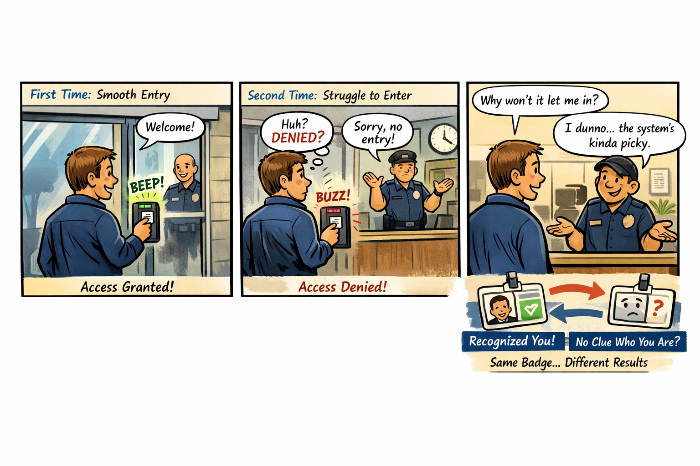

You’re standing in front of an office building that looks perfectly normal from the outside—glass doors, badge reader, the faint hum of HVAC doing its best. You tap your badge against the reader. It beeps, flashes green, and the door unlocks with the smooth confidence of a system that knows exactly who you are. You walk inside feeling like a trusted employee in a well‑run organization. Five minutes later, you step back outside to grab something from your car. When you return, you tap your badge again. This time the reader hesitates. It blinks. It thinks. It blinks again. Then it flashes red with the kind of judgmental finality usually reserved for game shows and airport kiosks. You try again. Red. You try the other door. Red. You wave at the security guard through the glass, and he shrugs in a way that says, “The system decides these things. It’s complicated.” You haven’t changed. Your badge hasn’t changed. Your job hasn’t changed. The only thing that changed was the system’s opinion of you. That is the Identity Problem. Not the authentication kind—the architectural kind. The kind that appears when the system responsible for trust is forced to make decisions without the signals trust depends on. The kind that makes identity behave like a moody automatic door: sometimes instant, sometimes hesitant, sometimes convinced you’re an entirely different person than you were ten minutes ago. Identity isn’t malfunctioning. It’s guessing.

How Identity Became the New Perimeter

Cloud made identity the new perimeter. Not because it was fashionable, but because it was the only boundary that followed the user, the device, and the session across every environment. Identity became the control plane for access, policy, risk, compliance, and trust. But a perimeter only works if it can see what it’s protecting. In the federal cloud, identity is asked to enforce modern trust with half the lights turned off. The signals that matter — location, timing, risk, continuity — are distorted by distance, hidden by the WAN, or blocked by boundaries that were designed before those signals existed. Identity is left to interpret shadows, and the shadows don’t always agree.

Why Headquarters and Field Offices See Different Identity Behavior

Headquarters sits close to cloud egress, identity controllers, and stable paths. Field offices sit behind WAN optimizers, MPLS circuits, regional hubs, and inspection layers. Identity sees stable timing in headquarters and stretched timing in the field. It sees consistent region selection in headquarters and region drift in the field. It sees predictable token refreshes in headquarters and late or dropped refreshes in the field. Identity isn’t inconsistent. The architecture is. Identity is simply reacting to the truth it can see — even if that truth is distorted by distance, inspection, and boundary constraints.

Why Conditional Access Feels Arbitrary

Conditional Access is supposed to be the adult in the room — the system that evaluates risk, enforces policy, and keeps the organization safe. But Conditional Access depends on signals that never arrive in GCC‑Moderate. Risk scoring, token anomalies, session instability, region drift, device trust failures — all of it is missing. The system behaves like a smoke detector with the batteries removed. It still exists. It still looks functional. It still has a policy engine. But it cannot detect the very conditions it was built to evaluate. So it falls back to the only signals it has left: timing, location, and session continuity. And those signals are the ones most distorted by the WAN. This is why users are challenged unexpectedly. This is why sessions break unpredictably. This is why identity “feels random.” It isn’t random. It’s blind.

Why Identity Dashboards Don’t Match Reality

Identity dashboards in GCC‑Moderate show successful logins, failed logins, and basic audit logs. But they do not show risk events, token anomalies, or privileged access patterns. Administrators see symptoms without causes, patterns without explanations, and anomalies without origins. Identity isn’t withholding information. It simply doesn’t have it.

The Human Cost of Invisible Identity

When identity cannot see, users are blamed for behavior they didn’t cause. Help desks chase ghosts. Network teams and cloud teams argue from different realities. Security teams lack the telemetry needed to enforce Zero Trust. Leadership hears conflicting stories that are all true but incomplete. This is not dysfunction. It is instrumentation mismatch. Identity is being asked to operate a modern trust system inside a legacy visibility boundary.

The Root of the Identity Problem

Identity is not failing. It is not misconfigured. It is not behind. It is not immature. It is restricted. The FedRAMP Moderate boundary prevents the cloud from delivering the same identity telemetry, risk analytics, and trust signals that exist in Commercial environments. The architecture predates the workloads, and identity is forced to operate without the signals it was designed to use. You cannot enforce Zero Trust with a partial identity system. You cannot evaluate risk without risk telemetry. You cannot secure sessions you cannot see. You cannot modernize trust inside a blindfold.

The Only Way Forward

The Identity Problem is not solved by more training, more MFA, more logging, more dashboards, or more tuning. It is solved by visibility. Identity must be allowed to see the signals it was built to evaluate. The boundary must be modernized. The telemetry pipelines must be restored. The architecture must stop hiding the truth. Only then can identity behave the way it was designed to behave. Only then can Zero Trust become real. Only then can modernization stop feeling like guesswork.

## About the Author

**Michal Doroszewski** is a technology strategist focused on cloud
architecture, identity platforms, and federal modernization. He writes
about the structural and architectural forces that shape government IT,
translating complex technical constraints into clear, accessible
narratives for leaders and practitioners.

::: {.callout-note collapse="true"}
## Provenance
Source: `inbox/Article 04 The Identity Problem REFORMATTED.docx` (round-2 drop, 2026-04-17). This article
was drafted before the UIAO substrate was formalized on GitHub; it is
published here per the pre-UIAO promotion path in ADR-030 with the byline
and body preserved and filename qualifiers dropped.
:::

---

**Book:** [*FedRAMP Boundaries — Articles on Application-Aware Networking*](index.qmd)
 · [Previous](article-03-distance-problem.qmd) · [Next](article-05-arbitrariness-problem.qmd)
