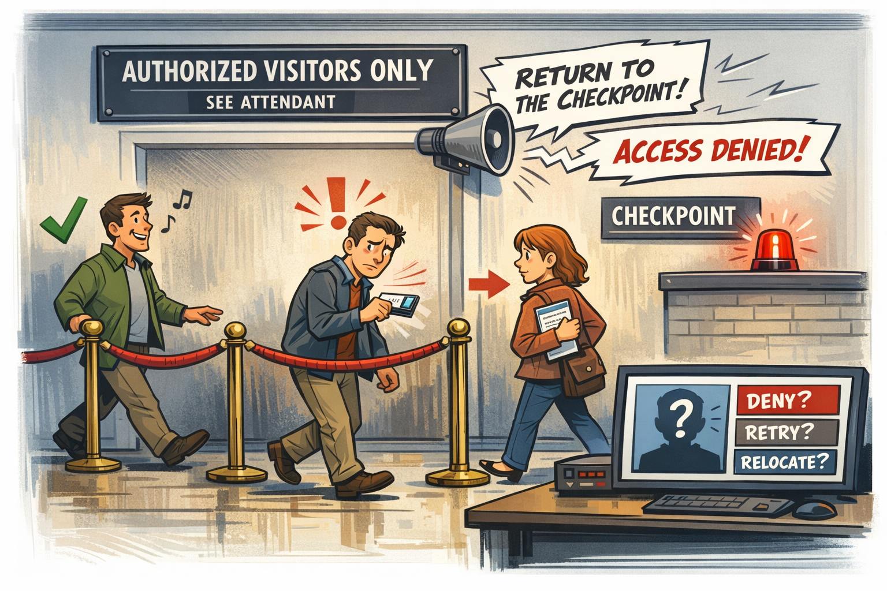

You’re standing in line at a museum, waiting to see an exhibit everyone insists is “transformative,” when you reach a small velvet rope stretched across a doorway. It’s not dramatic. It’s not even particularly authoritative. It’s just there, accompanied by a sign that politely instructs you to “SEE ATTENDANT,” even though no attendant exists. People ahead of you slip under the rope without hesitation. Some breeze through. Others are stopped by an invisible force that seems to evaluate them silently before deciding whether they may proceed. One person is waved through instantly. Another is told to wait. A third is redirected to a different hallway entirely, even though all three are holding the same ticket.

You duck under the rope. Nothing happens. You take two steps forward. Suddenly a speaker crackles overhead and a disembodied voice instructs you to return to the checkpoint. You step back and the voice goes silent. You step forward and it returns, louder this time, as if the building itself is losing patience. You haven’t changed. Your ticket hasn’t changed. The exhibit hasn’t changed. The only thing that changed was the boundary’s opinion of you.

That is the Boundary Problem. Not the security‑guard kind — the architectural kind. The kind that appears when a system is forced to enforce rules it cannot fully see, using signals it does not fully receive, inside a structure that predates the workloads it is now responsible for protecting. The boundary isn’t malfunctioning. It’s improvising.

How the Boundary Became the Bottleneck

Boundaries were built for a world where applications lived in data centers, users lived on the LAN, and trust was something you enforced at a choke point. The federal architecture inherited that world. TIC 2.0 concentrated inspection. MPLS abstracted distance. Firewalls enforced location‑based trust. Everything flowed inward through a small number of controlled gateways.

Cloud inverted that model. Workloads became distributed. Identity became the perimeter. Sessions became dynamic. Region selection became automatic. Telemetry became essential. But the boundary stayed where it was — unchanged, unmoved, and unprepared. The result is an architecture where the cloud expects to see the world clearly, but the boundary insists on dimming the lights.

Why the Boundary Hides the Signals Cloud Depends On

Modern cloud systems rely on signals that were never part of the original boundary design. Location matters because cloud services need to understand where the user actually is. Timing matters because token refreshes and session continuity depend on it. Continuity matters because cloud sessions assume stability. Risk matters because identity systems evaluate behavior in real time. Region matters because cloud workloads optimize themselves based on geography.

The boundary hides all of it. Traffic is routed through hubs that distort distance. Inspection layers delay token refreshes. Optimizers reshape packets in ways cloud systems interpret as instability. Region selection is influenced by where the boundary sits, not where the user sits. Risk signals never arrive because the boundary blocks the telemetry pipelines that generate them. The cloud isn’t confused. It’s blindfolded.

Why Headquarters and Field Offices Experience Different Boundaries

Headquarters sits close to the boundary. Field offices sit behind it. Headquarters sees short paths, stable timing, predictable region selection, and fewer inspection layers. Field offices see long paths, stretched timing, region drift, and multiple layers of inspection and optimization that rewrite the truth.

The boundary behaves consistently. The experience does not. To headquarters, the boundary looks reasonable. To field offices, it looks like a moody museum rope with a mind of its own.

Why Security Tools Misinterpret Boundary‑Distorted Signals

Security tools assume they are receiving clean, unmodified signals. But the boundary modifies everything. Token refreshes arrive late. Region selection appears inconsistent. Session continuity looks unstable. Device trust appears unreliable. Risk scoring never arrives.

Security teams see anomalies that aren’t anomalies. Cloud teams see failures that aren’t failures. Network teams see stability that isn’t stability. Everyone is correct. Everyone is wrong. The boundary is the translator — and it is mistranslating.

Why Dashboards Lose Context at the Boundary

Dashboards depend on telemetry. Telemetry depends on visibility. Visibility depends on the boundary allowing signals to pass. In GCC‑Moderate, many of those signals never make it through. Identity dashboards show logins but not risk. Network dashboards show packets but not truth. Cloud dashboards show symptoms but not causes.

Administrators see patterns without explanations and anomalies without origins. The system isn’t withholding information. It simply doesn’t have it.

The Human Cost of Boundary‑Induced Blindness

When the boundary hides truth, users are blamed for behavior they didn’t cause. Help desks chase ghosts. Network teams and cloud teams argue from different realities. Security teams enforce policies without the signals those policies depend on. Leadership receives conflicting reports that are all true but incomplete.

This is not dysfunction. It is architectural misalignment. The boundary is enforcing rules written for a world that no longer exists.

The Root of the Boundary Problem

The boundary predates the workloads. It predates identity‑anchored trust, region‑aware routing, continuous evaluation, and cloud‑native telemetry. It was built to protect a system that no longer resembles the one it is now protecting.

You cannot modernize cloud behavior inside a boundary that hides cloud truth. You cannot enforce Zero Trust with partial visibility. You cannot optimize paths the cloud cannot see. You cannot troubleshoot symptoms without causes. The boundary is not failing. It is outdated.

The Only Way Forward

The boundary must be modernized. Not removed. Not bypassed. Modernized. It must allow the signals cloud systems depend on — identity telemetry, risk analytics, region awareness, session continuity, real‑time media truth, and accurate location and timing.

Only then can cloud behave the way it was designed to behave.

Only then can identity enforce trust accurately.

Only then can modernization stop feeling like a guessing game.

Only then can the architecture see what it is actually doing.

## About the Author

**Michal Doroszewski** is a technology strategist focused on cloud
architecture, identity platforms, and federal modernization. He writes
about the structural and architectural forces that shape government IT,
translating complex technical constraints into clear, accessible
narratives for leaders and practitioners.

::: {.callout-note collapse="true"}
## Provenance
Source: `inbox/Article 05 The Boundary Problem.docx` (round-2 drop, 2026-04-17). This article
was drafted before the UIAO substrate was formalized on GitHub; it is
published here per the pre-UIAO promotion path in ADR-030 with the byline
and body preserved and filename qualifiers dropped.
:::

---

**Book:** [*FedRAMP Boundaries — Articles on Application-Aware Networking*](index.qmd)
 · [Previous](article-04-identity-problem.qmd) · [Next](article-06-telemetry-problem.qmd)
