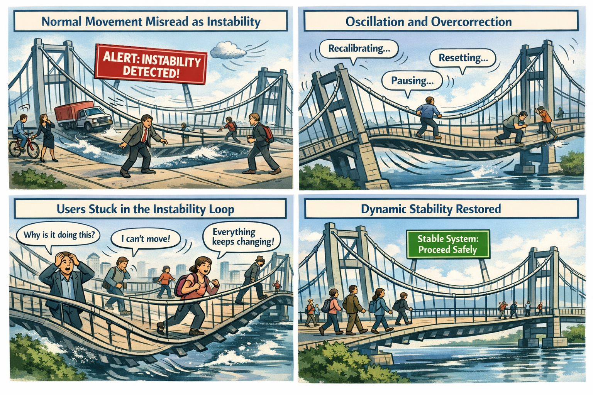

The Bridge That Never Stops Moving

You’re standing on a suspension bridge. Not a dangerous one — a normal one. Steel cables, anchored towers, engineered sway. The kind of bridge that moves because it is supposed to. You take a step. The deck shifts slightly. You take another. The bridge settles. A breeze rolls through. The cables hum. The structure flexes, absorbs, and returns to center.

Then something changes.

The bridge begins interpreting normal movement as instability. A gust of wind triggers a full stop. A passing truck causes a reset. A pedestrian’s footsteps trigger a “structural anomaly.” The bridge pauses, recalibrates, and restarts its stability sequence. The deck stiffens, then loosens, then stiffens again. The sensors disagree. The anchors disagree. The cables disagree. The bridge is not collapsing — it is overcorrecting.

People try to cross anyway. Some freeze. Some turn back. Some attempt to time the oscillation. A cyclist dismounts. A runner hesitates. A commuter mutters, “It wasn’t doing this yesterday.” The bridge is still standing. The engineering is still sound. The materials are still strong. But the system that interprets movement has lost its ability to stabilize.

That is the Stability Problem — not the “bad load balancer” kind, but the architectural kind. The kind that appears when cloud systems misinterpret normal variation as risk, normal transitions as anomalies, and normal user behavior as instability. The kind that turns a flexible, resilient structure into a platform that overcorrects itself into dysfunction.

Stability Is the Tenth Layer of Modernization

Visibility shows what is happening. Continuity preserves identity across transitions. Control determines what the system is allowed to do. Signals carry the truth. Evaluation interprets the truth. Decision enforces the truth. Automation scales the enforcement. Remediation repairs the damage. Recovery restores coherence. But stability determines whether the system can remain functional while everything moves.

Modern cloud systems are designed to operate under motion — shifting networks, variable latency, changing device states, dynamic risk signals, and evolving context. Stability is not the absence of movement. Stability is the ability to return to center after movement.

When stability is grounded in truth, the system flexes and recovers. When stability is grounded in uncertainty, the system oscillates. A system that cannot stabilize cannot modernize.

Why GCC‑Moderate Breaks Stability

The FedRAMP Moderate boundary was built for static equilibrium, not dynamic stability. It filters the signals, delays the timing, distorts the context, mislabels the risk, and fragments the truth. Stability engines receive posture without continuity, identity without region accuracy, location without timing, and risk without context.

The system is not malfunctioning — it is overcorrecting. It is trying to stabilize using partial truth.

Headquarters and Field Offices Experience Stability Differently

At headquarters, stability behaves like a well‑tuned bridge. Signals arrive intact, timing is preserved, context is coherent, and the system flexes and returns to center.

In field offices, stability behaves like a bridge with mismatched sensors. Signals arrive late, context is distorted, risk is misinterpreted, and the system oscillates.

The same user, same device, same request — different stability outcome. The architecture creates two realities, and stability enforces both.

Why Stability Failures Are Misdiagnosed

When stability collapses, every team sees a different oscillation. Security sees fluctuating risk. Identity sees posture loops. Network sees latency spikes. Operations sees region drift. Users see unpredictability. Everyone is correct, and everyone is wrong. The failure is architectural. Stability is reacting to the uncertainty created by the boundary.

Modernization Stalls Without Stability

Without stability, sessions oscillate, policies contradict themselves, risk fluctuates, access becomes unpredictable, devices misclassify, users lose confidence, and teams chase phantom instability. This is not a performance problem. It is architectural instability in interpretation.

The Root of the Stability Problem

The stability problem is not caused by bad thresholds, misconfigured policies, or user error. It is caused by an architecture that cannot reliably deliver the truth required for dynamic equilibrium. The boundary filters the truth, the WAN delays the truth, the inspection layers distort the truth, the region model mislabels the truth, and the identity platform receives partial truth. Stability cannot function on partial truth. Stability cannot return to center inside a fog.

The Only Way Forward

Stability integrity must be restored. Identity‑critical signals must pass. Timing must be preserved. Region awareness must be accurate. Device posture must be current. Risk evaluation must be complete. Session context must be intact. Policy logic must receive the full truth. Only then can the system flex without oscillating. Only then can trust remain predictable. Only then can modernization move forward without instability.

Disclaimer

Not all agencies will experience the issues described in this article. These behaviors occur primarily in architectures where cloud identity, Conditional Access, and real‑time policy evaluation depend on signals that traverse GCC‑Moderate boundaries, WAN inspection layers, or region‑variable paths. Agencies with direct Active Directory authentication, on‑premises identity controllers, or short, stable network paths may see different outcomes. These observations reflect common patterns in GCC‑Moderate cloud environments, not universal conditions.

## About the Author

**Michal Doroszewski** is a technology strategist focused on cloud
architecture, identity platforms, and federal modernization. He writes
about the structural and architectural forces that shape government IT,
translating complex technical constraints into clear, accessible
narratives for leaders and practitioners.

::: {.callout-note collapse="true"}
## Provenance
Source: `inbox/Article 20 The Stability Layer.docx` (round-2 drop, 2026-04-17). This article
was drafted before the UIAO substrate was formalized on GitHub; it is
published here per the pre-UIAO promotion path in ADR-030 with the byline
and body preserved and filename qualifiers dropped.
:::

---

**Book:** [*FedRAMP Boundaries — Articles on Application-Aware Networking*](index.qmd)
 · [Previous](article-19-recovery-layer.qmd) · [Next](article-21-resilience-layer.qmd)
