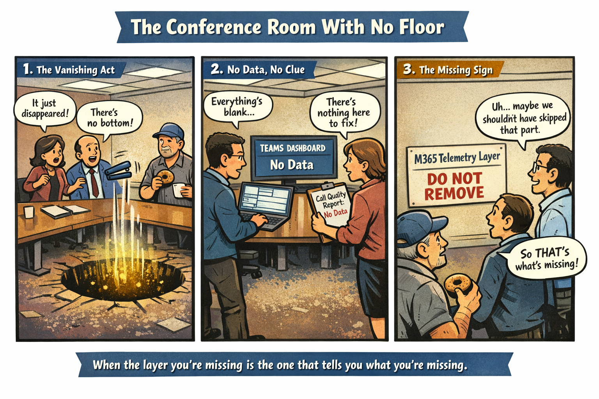

The Room With the Missing Floor

The renovation crew swore the building was structurally sound. The blueprints looked fine. The walls were straight. The doors opened. The lights turned on. Everything seemed normal until someone dropped a pen in Conference Room 4B and it didn’t hit the floor.

It just… kept falling.

People gathered around the spot where the pen vanished. Someone tossed a paperclip. Gone. Someone else dropped a stapler. Gone. Carl from Facilities, who had already lived through three asbestos scares and one raccoon incident, stared into the void and whispered, “That’s not in the maintenance manual.”

The problem wasn’t the room. The problem was the missing floor — a structural layer no one knew existed until it wasn’t there.

And that’s exactly what’s happening in your M365 environment.

You’re walking around on a platform that looks complete, feels complete, and functions well enough… but an entire layer underneath is missing, and you don’t even know it’s supposed to be there.

Comic Panel

Description:

A federal conference room where a group of employees is staring at a spot on the carpet where objects are falling straight through into a glowing void. A sign on the wall reads: “M365 Telemetry Layer — Do Not Remove.” Carl from Facilities is holding a donut and peering into the hole. A caption reads: “When the layer you’re missing is the one that tells you what you’re missing.”

The Unknown Unknowns of Microsoft 365

The most significant gap in your M365 environment is not a feature, a dashboard, or a SKU. It is the absence of the observability layer that allows the cloud to understand itself. In commercial tenants, this layer collects signals from identity, devices, networks, applications, and data, then correlates them into insights that administrators can act on. In GCC‑Moderate, many of these signals never arrive due to boundary restrictions, which means the insights that depend on them never materialize. The result is an environment that functions but cannot explain itself.

This creates a category of missing capability that is fundamentally invisible. You do not know that you are missing certain signals because the system does not warn you about their absence. You do not know that you are missing certain insights because the dashboards that would display them do not appear. You do not know that you are missing certain correlations because the AI that performs them is not present. The environment appears stable because the indicators that would reveal instability are not available.

The absence of network path telemetry is a prime example. In a fully instrumented tenant, Teams and other services continuously evaluate the quality of the connection between the user and the cloud. They detect packet loss, jitter, latency, and routing anomalies. They identify whether VPN hairpinning or firewall inspection is degrading performance. Without these signals, the system cannot diagnose issues, and administrators cannot see the root causes of user complaints. The environment feels unpredictable because the mechanisms that would explain its behavior are missing.

Device telemetry is similarly absent. Endpoint analytics, compliance signals, and performance metrics provide critical context for understanding user experience. Without them, the system cannot determine whether a device is healthy, compliant, or performing poorly. This forces administrators to rely on anecdotal reports rather than data. The environment becomes reactive, and issues persist longer because the signals that would reveal them are not available.

Identity signals are also degraded. Risk scoring, location context, and device trust are essential components of Zero Trust. Without them, conditional access policies must operate in a reduced‑fidelity mode. The system cannot distinguish between normal and anomalous behavior, which increases operational risk. The absence is silent because the system does not indicate that it is missing the information required to make more informed decisions.

The cumulative effect is an environment that cannot see itself. It cannot measure its own health, cannot diagnose its own issues, and cannot validate its own improvements. This is the unknown unknown: the missing layer that prevents you from knowing what you are missing. Modernization requires restoring this layer so the environment can become observable, measurable, and predictable.

## About the Author

**Michal Doroszewski** is a technology strategist focused on cloud
architecture, identity platforms, and federal modernization. He writes
about the structural and architectural forces that shape government IT,
translating complex technical constraints into clear, accessible
narratives for leaders and practitioners.

::: {.callout-note collapse="true"}
## Provenance
Source: `inbox/What We Don’t Even Know We’re Missing.docx` (round-2
drop, 2026-04-17). Published per the pre-UIAO promotion path in ADR-030
with the byline and body preserved.
:::

---

**Book:** [*FedRAMP Boundaries — Articles on Application-Aware Networking*](index.qmd) · [Next](article-01-blindfold-problem.qmd)
