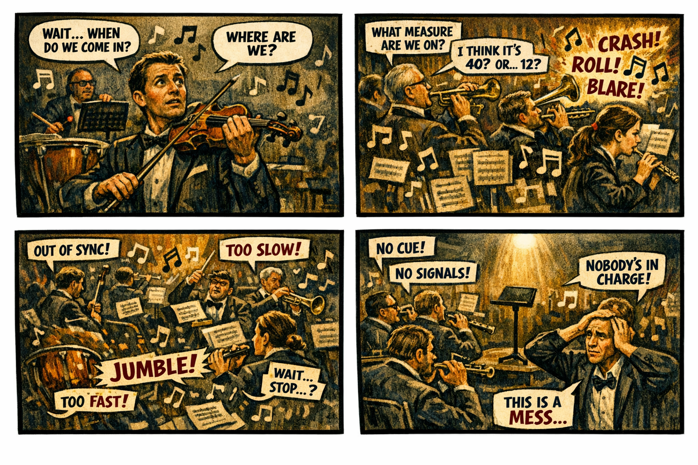

Series 5 is the architectural response to the diagnosis laid out in [Series 1](../series-01-federal-modernization/index.qmd). Where Series 1 names the problems, Series 5 builds the layers that solve them — one at a time, in deliberate order.

## Architectural reading — Part II of the book

Eleven articles. Each layer assumes the one below it. Skipping ahead is not recommended — the signal layer cannot exist without the visibility layer that feeds it, and the decision layer cannot exist without the evaluation layer that scores its inputs.

- [Article 11 — The Visibility Layer](../application-aware-networking-book/article-11-visibility-layer.qmd) — What you cannot see, you cannot govern.
- [Article 12 — The Continuity Layer](../application-aware-networking-book/article-12-continuity-layer.qmd) — Keeping what visibility revealed.
- [Article 13 — The Control Layer](../application-aware-networking-book/article-13-control-layer.qmd) — Turning observation into action.
- [Article 14 — The Signal Layer](../application-aware-networking-book/article-14-signal-layer.qmd) — Promoting events into intent.
- [Article 15 — The Evaluation Layer](../application-aware-networking-book/article-15-evaluation-layer.qmd) — Scoring signals against policy.
- [Article 16 — The Decision Layer](../application-aware-networking-book/article-16-decision-layer.qmd) — What happens after evaluation.
- [Article 17 — The Automation Layer](../application-aware-networking-book/article-17-automation-layer.qmd) — Executing decisions at scale.
- [Article 18 — The Remediation Layer](../application-aware-networking-book/article-18-remediation-layer.qmd) — Closing the loop.
- [Article 19 — The Recovery Layer](../application-aware-networking-book/article-19-recovery-layer.qmd) — When remediation is not enough.
- [Article 20 — The Stability Layer](../application-aware-networking-book/article-20-stability-layer.qmd) — From recovery to rhythm.
- [Article 21 — The Resilience Layer](../application-aware-networking-book/article-21-resilience-layer.qmd) — The architecture learns.

## Core themes

- **Identity as the root namespace.**
- **Deterministic addressing.** Every address traces to an identity.
- **Session anchoring.** Sessions persist across changing network conditions.
- **Overlays as layered constructs.** Each layer is bounded and independently testable.
- **Telemetry as the control plane.** The environment becomes observable, governable, and modernizable only when all layers align.

## UIAO canon anchors

Series 5 articles cite the following canonical documents:

- [UIAO_101](https://github.com/WhalerMike/uiao/blob/main/src/uiao/canon/specs/Platform-Overview.md) — Platform Overview
- [UIAO_102](https://github.com/WhalerMike/uiao/blob/main/src/uiao/canon/specs/Platform-Services-Layer.md) — Platform Services Layer
- [UIAO_110](https://github.com/WhalerMike/uiao/blob/main/src/uiao/canon/specs/drift.md) — Drift Engine Specification
- [UIAO_114](https://github.com/WhalerMike/uiao/blob/main/src/uiao/canon/specs/ha.md) — High-Availability & Fault-Tolerance Layer
- [UIAO_117](https://github.com/WhalerMike/uiao/blob/main/src/uiao/canon/specs/recovery.md) — Recovery Layer
- [UIAO_120](https://github.com/WhalerMike/uiao/blob/main/src/uiao/canon/specs/zero-trust.md) — Zero-Trust Integration Layer

## Terminology note

The articles in this series were drafted before the UIAO substrate was formalized. They use a four-layer architectural model in prose (Authority / Control / Overlay / Underlay) which, under the pending ADR-030 terminology reconciliation, sits above UIAO's six-control-plane decomposition (Identity, Addressing, Overlay, Telemetry, Management, Governance). Both framings describe the same architecture at different abstraction tiers.

## What comes next

Series 5 completes the core arc. Series 2 (Missing Dashboards), Series 6 (Federal Telemetry Collapse), and Series 9 (Compliance & Governance Reality) will expand on specific themes raised here. Those series remain in roadmap state until their first articles ship.
