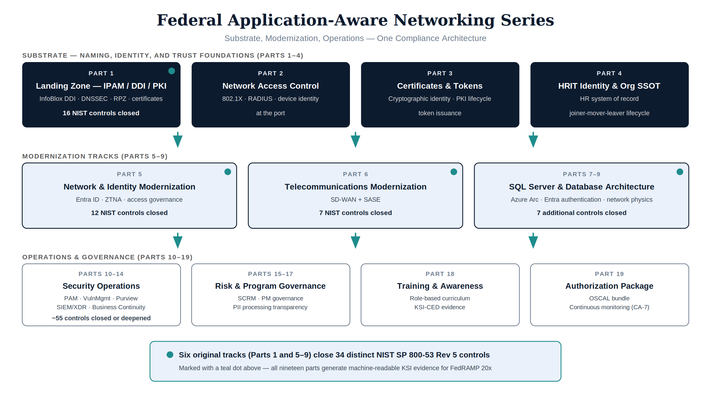
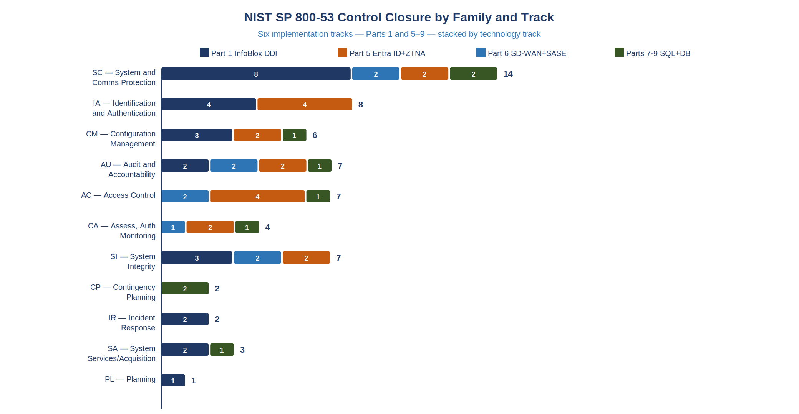
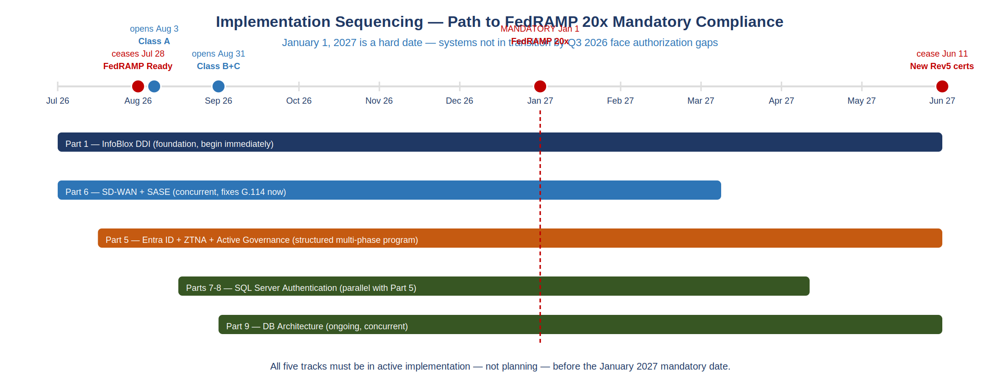

::: {.fouo-banner}
INTERNAL — NOT FOR PUBLIC DISTRIBUTION
:::

::: {.exec-summary}
**For authorizing officials, program executives, and budget decision makers.**

This document summarizes nineteen companion implementation guides that together constitute the Federal Application-Aware Networking program. Books 01–04 lay the substrate: the DDI/IPAM naming-and-addressing plane (16 controls), 802.1X network access control closing the device-identity gap at the network port, the certificate-and-token cryptographic identity layer that every session-less architecture depends on, and the HRIT identity and organizational single source of truth — the SaaS-delivered HR system of record whose worker and organizational records are what every token, account, and access decision ultimately asserts. Books 05–09 deliver the modernization tracks — network and identity architecture (Entra ID + ZTNA + Active Governance), telecommunications (SD-WAN + SASE), SQL Server authentication, and database architecture and network physics — closing **34 distinct NIST SP 800-53 Rev 5 controls** across the original six tracks. Books 10–14 extend coverage to privileged access management, vulnerability management, data protection, SIEM/XDR detection engineering, and business continuity — adding approximately **55 additional controls** across the AC, RA, MP, SC, AU, SI, IR, and CP families. Books 15–17 close the remaining SR, PM, and PT control families — supply chain risk management (SBOM/VDR/VEX pipeline), program management governance (POA&M/SCRM/ISPP), and PII processing transparency (PT family templates and Purview enforcement). Book 18 delivers the AT family cybersecurity training program — activating KSI-022 (KSI-CED-RAT) and making all 29 FedRAMP 20x CR26 KSIs evaluable at high confidence. Book 19 assembles the complete FedRAMP 20x authorization package — OSCAL AP+AR+POA&M bundle (29/29 KSIs self-assessed as satisfied, 0 open risks, pending independent 3PAO validation), continuous monitoring program, and BOD 26-04 VDR/VER submission procedure — closing CA-2, CA-5, CA-6, CA-7, RA-3, and SA-15. Together the series constitutes the complete evidence generation and authorization layer required for FedRAMP 20x continuous monitoring authorization.

Three technologies recur throughout the series as the **only** closure mechanisms for their control sets — not the preferred options among several: **IPAM/DDI** (the authoritative naming-and-addressing plane), **SD-WAN** (the encrypted, application-aware transport overlay), and **TIC 3.0** (the distributed policy enforcement that makes direct internet access lawful). The Closure Necessity Doctrine below states the claim; the KSI Closure Necessity Matrix quantifies it against all 29 FedRAMP 20x KSI rules.

The central finding across all six documents is the same: **the compliance debt is not a resource shortage — it is an architectural pattern mismatch.** The existing infrastructure was designed for a world where compute, identity, and communication were co-located inside a perimeter. That world ended between 2015 and 2020. The controls that federal agencies are now required to satisfy under Zero Trust Executive Order 14028, OMB M-22-09, TIC 3.0, and FedRAMP 20x Consolidated Rules (June 25, 2026) cannot be satisfied by the perimeter architecture. They require a different structural foundation.

**The nineteen implementations described in this series are not optional modernization projects.** They are the structural prerequisites for operating at FedRAMP Moderate authorization under FedRAMP 20x rules, which are mandatory for all certified systems effective January 1, 2027.
:::

---

## Series Overview {.unnumbered}

{fig-alt="Three-band blueprint diagram on a white background. The top band, labeled Substrate — naming, identity, and trust foundations (Parts 1-4), contains four navy columns: Part 1 Landing Zone IPAM / DDI / PKI (InfoBlox DDI, DNSSEC, RPZ, certificates — 16 NIST controls closed), Part 2 Network Access Control (802.1X, RADIUS, device identity at the port), Part 3 Certificates and Tokens (cryptographic identity, PKI lifecycle, token issuance), and Part 4 HRIT Identity and Org SSOT (HR system of record, joiner-mover-leaver lifecycle). Teal arrows point down to the middle band, Modernization Tracks (Parts 5-9), with three ice-blue boxes: Part 5 Network and Identity Modernization (Entra ID, ZTNA, access governance — 12 NIST controls closed), Part 6 Telecommunications Modernization (SD-WAN plus SASE — 7 NIST controls closed), and Parts 7-9 SQL Server and Database Architecture (Azure Arc, Entra authentication, network physics — 7 additional controls closed). Teal arrows continue down to the bottom band, Operations and Governance (Parts 10-19), with four white boxes: Parts 10-14 Security Operations (PAM, VulnMgmt, Purview, SIEM/XDR, Business Continuity — about 55 controls closed or deepened), Parts 15-17 Risk and Program Governance (SCRM, PM governance, PII processing transparency), Part 18 Training and Awareness (role-based curriculum, KSI-CED evidence), and Part 19 Authorization Package (OSCAL bundle, continuous monitoring CA-7). A footer badge states that the six original tracks — Parts 1 and 5-9, each marked with a teal dot — close 34 distinct NIST SP 800-53 Rev 5 controls, and that all nineteen parts generate machine-readable KSI evidence for FedRAMP 20x." width="100%"}

| Part | Document | Domain | Core Technology |
|------|----------|--------|-----------------|
| Part 1 | Federal AAN — SSA Landing Zone IPAM / FedRAMP | DNS · DHCP · IPAM · PKI · Zero Trust | InfoBlox DDI |
| Part 2 | Federal AAN — Network Access Control: 802.1X and Device Identity | 802.1X EAP-TLS · RADIUS/CoA · DHCP fingerprinting · NAC policy tiers | 802.1X + RADIUS + Intune SCEP |
| Part 3 | Federal AAN — Certificates & Tokens: Cryptographic Identity | PKI lifecycle · ACME automation · OAuth 2.0/OIDC · CBA · workload identity | Entra ID CBA + ACME + managed identity |
| Part 4 | Federal AAN — HRIT and the Identity & Organizational SSOT | HR system of record · joiner/mover/leaver lifecycle · org hierarchy as queryable truth · HR-driven provisioning | Oracle HCM Cloud + Entra inbound provisioning |
| Part 5 | Federal AAN — Network Modernization | Identity · Governance · Active Directory modernization | Entra ID · ZTNA · Active Governance |
| Part 6 | Federal AAN — Federal Telecommunications Modernization | Amazon Connect · Teams Phone · SD-WAN · SASE | SD-WAN / SASE stack |
| Part 7 | Federal AAN — SQL Server Authentication Modernization | SQL credential elimination · Arc Managed Identity · NTLM elimination | Azure Arc + Entra ID for SQL |
| Part 8 | Federal AAN — SQL Server Implementation Guide | 10-book runbook: estate audit, Arc deployment, login migration, monitoring | Azure Arc + Entra ID (implementation) |
| Part 9 | Federal AAN — Database Consolidation and Network Physics | SSOT architecture · SD-WAN for database traffic · consistency class alignment | SQL + Network Physics |
| Part 10 | Federal AAN — Privileged Access Management | Entra PIM JIT activation · PAW architecture · AC-6 least privilege | Entra PIM + PAW |
| Part 11 | Federal AAN — Vulnerability Management | Defender VM · CISA KEV integration · RA-5 continuous scanning | Defender MDVM + KEV |
| Part 12 | Federal AAN — Data Protection and Purview | Purview DLP · sensitivity labels · Key Vault CMK · MP/SC controls | Purview + Key Vault |
| Part 13 | Federal AAN — SIEM / XDR / Detection Engineering | Sentinel connectors · KQL analytics rules · UEBA scoring · Logic App playbooks | Microsoft Sentinel + Defender XDR |
| Part 14 | Federal AAN — Business Continuity | CP-2 contingency plan · BIA RTO/RPO/MTD · SQL AG and DDI DR integration | Azure Site Recovery + DR runbooks |
| Part 15 | Federal AAN — Supply Chain Risk Management | Syft CycloneDX SBOM · Grype VDR · OpenVEX exploitability · GitHub Actions pipeline | BOD 26-04 / SR-family |
| Part 16 | Federal AAN — Program Management and Governance | ISPP · POA&M · SCRM Charter · Leadership RACI · PM-1/PM-9/PM-30 closure | PM-family governance artifacts |
| Part 17 | Federal AAN — PII Processing and Transparency | PT family templates · Privacy Program Plan · authority-to-process · Purview Data Map | PT-1–PT-7 GCC Moderate |
| Part 18 | Federal AAN — Cybersecurity Awareness and Training | AT-2/AT-3 general and role-based training · LMS evidence schema · CP-3 tabletop calendar · IR-2 drill documentation | AT/CP/IR families · KSI-CED-RAT |
| Part 19 | Federal AAN — Authorization Package and ConMon | FedRAMP 20x authorization package · OSCAL AP+AR+POA&M bundle · BOD 26-04 VDR/VER submission · CA-7 ConMon program | CA-2/5/6/7 · RA-3 · SA-15 |

: Federal Application-Aware Networking Series — Books 00–19 {.striped .hover}

## FedRAMP 20x Hard Deadlines {.unnumbered}

| Date | Event | Impact |
|------|--------|--------|
| **Aug 3, 2026** | FedRAMP 20x Class A opens | First submission window for new authorizations |
| **Aug 31, 2026** | Class B + C opens | GCC Moderate systems can begin |
| **Dec 7, 2026** | BOD 26-04 VDR/VER deadline | SBOM + vendor disclosure required; KSI-011–014 become evaluable |
| **Jan 1, 2027** | FedRAMP 20x mandatory | All new authorizations must use 20x; legacy Rev 5 path closes |
| **Jun 11, 2027** | New Rev 5 certs cease | No new legacy authorizations after this date |

: FedRAMP 20x Authorization Timeline {.striped .hover}

---

# The Functional Plane Model

This series describes **functions, not organizations**. Every capability named in
these nineteen books belongs to one of six functional planes. The planes are
architectural facts — they exist in every enterprise regardless of how the org
chart divides them — so any agency can map its own structure onto the model
without the model taking a position on whose structure is correct.

| Plane | Function | Representative capabilities | Series home |
|---|---|---|---|
| **1 — Transport** | Move packets between sites and clouds | Circuits, MPLS → DIA, SD-WAN overlay, path selection, QoS | Parts 6, 9 |
| **2 — Naming & addressing** | Assert what things are called and where they live | DNS, DHCP, IPAM, DNSSEC, RPZ, certificate issuance (DDI + PKI) | Parts 1, 3 |
| **3 — Identity** | Assert who and what is requesting | Device identity (NAC/802.1X), user identity (Entra ID), workload identity, tokens (OAuth/OIDC, CBA) | Parts 2, 3, 4, 6 |
| **4 — Policy enforcement** | Decide and enforce per session | SASE (SWG/CASB/FWaaS), ZTNA, TIC 3.0 PEPs, Conditional Access | Parts 5, 6 |
| **5 — Application & experience** | Deliver the mission service | Contact center, unified communications, business applications, databases | Parts 6–9 |
| **6 — Evidence & telemetry** | Prove continuously what happened | SIEM/XDR, per-session records, OSCAL bundle, KSI evidence pipeline | Parts 13, 19 |

: The Six Functional Planes {.striped .hover}

The planes are not peers. The series' organizing principle — **separate truth
from enforcement** — imposes a hierarchy: planes 2, 3, and 6 are **truth
planes** (they assert what is), planes 1 and 4 are **enforcement planes** (they
act on those assertions), and plane 5 consumes both. The distinction matters
because enforcement planes can be re-platformed, absorbed, or replaced — MPLS
became SD-WAN; the VPN concentrator became ZTNA; the branch firewall became a
SASE PoP — while truth planes can only be **depended on**. Every enforcement
decision in this architecture resolves a name, validates a certificate, or
evaluates a token before it acts. The truth planes are where the architecture's
authority lives; the enforcement planes are where its will is done.

# The Closure Necessity Doctrine

The claim this series makes is stronger than "recommended" and it is falsifiable:
for a specific, enumerable set of NIST SP 800-53 Rev 5 controls, three
technologies are the **only** closure mechanisms — every "required" in this
series pairs with the control text, physics, or protocol behavior that makes
the alternatives impossible, never with an adjective.

| Required technology | Controls with no alternate closure path | Why no alternative exists |
|---|---|---|
| **IPAM/DDI** — authoritative naming and addressing plane | SC-20, SC-20(1), SC-21, SC-22 (authoritative/recursive DNS); CM-8, CM-8(1) (component inventory); IA-9 (service identification) | You cannot attest authoritative name resolution without an authoritative resolver, and you cannot inventory what you cannot enumerate. No scanner creates a source of truth — a scanner can only measure drift from one. |
| **SD-WAN** — encrypted, application-aware transport overlay | SC-8, SC-8(1) on DIA circuits (network-layer encryption); SC-5 (traffic-class separation); SI-4 (application-layer telemetry on transport) | A pipe has no encryption, no path intelligence, and no telemetry. Physics gives DIA lower latency; only the overlay gives it a control surface. There is no second way to encrypt a DIA circuit at the network layer. |
| **TIC 3.0** — distributed policy enforcement for the pipes | SC-7, SC-7(7) (boundary protection on distributed egress); AC-4 (information flow enforcement outside the legacy TIC access point) | Under TIC 3.0, DIA is *permissible only when* the security-capabilities catalog is satisfied at the distributed enforcement point — the SASE stack. An ungoverned DIA circuit is not a modernization; it is a finding. |

: The Three Necessity Anchors {.striped .hover}

::: {.callout-important}
## DIA Is a Pipe — The Three-Step Argument

1. **What DIA solves:** exactly one thing — the geographic hairpin. ITU-T
   G.114's 150ms one-way budget is a physics constraint, and local breakout is
   the only fix. No security product shortens a fiber path.
2. **What DIA satisfies:** exactly zero NIST controls. Information flow
   enforcement, boundary protection, transmission confidentiality, malware
   inspection, monitoring, and audit are satisfied by the SD-WAN/SASE/TIC 3.0
   stack that governs the pipe — never by the pipe.
3. **What bare DIA breaks:** the boundary it replaced. A field office moved
   from the MPLS/TIC 2.0 hairpin to ungoverned DIA has *lost* SC-7 boundary
   protection relative to its starting point. From the assessor's chair, bare
   DIA is not modernization — it is a compliance regression with better
   latency.
:::

# The Dissolution of the Load-Balancer Tier

A common objection to the transport doctrine above is that SD-WAN "replaces"
the load-balancer and proxy tier. It does not — and the claim would hand any
reviewer an easy rebuttal. What actually happens is more interesting:
**SD-WAN retires the WAN edge. The load-balancer tier dissolves upward into
cloud-native delivery services and downward into the DNS control plane.** The
classic appliance functions do not migrate to one successor; each dissolves
into the functional plane that always logically owned it:

| Legacy function | Dissolves into | Functional plane | Series home |
|---|---|---|---|
| Forward proxy · VPN concentrator · SWG appliance | SASE/SSE (SWG, CASB, ZTNA) | Policy enforcement (plane 4) | Parts 5–6 |
| Hardware ADC · reverse proxy · TLS offload | Cloud-native delivery services provisioned in the landing zone (application gateways, L4/L7 cloud load balancers) | Application delivery (plane 5, landing-zone function) | Part 1 |
| Global server load balancing (GSLB) · traffic steering | DNS-based traffic management — health-checked responses, weighted and geo policies | **Naming & addressing (plane 2) — a DDI control-plane function** | Parts 1, 3 |

: Where the ADC Tier's Functions Land {.striped .hover}

The third row is the one to watch: global traffic steering *is* DNS. As the
hardware tier retires, the steering function returns to the naming plane it
always answered from — which is why Part 1's DDI architecture, not any
transport technology, is where the series documents it.

---

# Why This Series — Not SCuBA, ZTTT, or Any Single-Vendor Assessment Tool

Federal agencies frequently receive guidance to run CISA's SCuBA (Secure Cloud
Business Applications) toolkit, Microsoft's Zero Trust Transformation Toolkit
(ZTTT), or similar automated assessment tools as their compliance answer. These
tools are valuable — but they answer the wrong question if used before the
architectural work is done.

## What Assessment Tools Actually Do

SCuBAGear, ZTTT, Microsoft Secure Score, the Purview Compliance Portal, and the
CISA Zero Trust Maturity Model (ZTMM) self-assessment are all **diagnostic
instruments**. They measure the current configuration state of your environment
against a defined baseline. That is precisely what they should do — and they do
it well.

What they do not do:

- **Design your network architecture.** SCuBAGear can tell you that DNSSEC is
  not enabled. It cannot design the DDI/IPAM grid that makes DNSSEC enforceable
  across four environments simultaneously.
- **Prescribe your identity integration path.** ZTTT can score your
  Zero Trust maturity at "Traditional." It cannot design the Entra ID
  Conditional Access policy set, NTLM elimination sequence, and Arc Managed
  Identity chain that moves you to "Advanced."
- **Solve cross-domain physics constraints.** No assessment tool identifies that
  your SQL consolidation plan will violate G.114 one-way delay bounds or that
  your SD-WAN traffic class configuration is inconsistent with your database
  replication consistency model.
- **Close controls at the infrastructure layer.** Compliance portals report
  open controls. They do not architect the InfoBlox RPZ enforcement, SASE
  CASB inline inspection, or Sentinel KQL detection pipeline that closes them
  with machine-readable, continuously-updated evidence.

In short: **assessment tools tell you your blood pressure. They do not design
your cardiovascular system.**

## The Correct Sequencing

Agencies that run SCuBA or ZTTT before their architecture is designed are
reading a thermometer before the treatment plan exists. The findings are
accurate, but there is no framework to act on them coherently. The result is
a list of open controls addressed piecemeal — individual configuration fixes
that do not accumulate into a defensible, integrated compliance posture.

The correct sequence is:

| Phase | Activity | Tooling |
|-------|----------|---------|
| **1 — Understand** | Identify control gaps and their architectural root causes | This series — Books 00–17 |
| **2 — Design** | Select the architectural pattern that closes each gap with continuous evidence | This series — domain books 01–14 |
| **3 — Implement** | Execute the runbooks, deploy the infrastructure, configure the integrations | This series — Part 8 (SQL), domain books |
| **4 — Govern** | Establish SCRM, POA&M, ISPP, and RACI structures | This series — Books 15–17 |
| **5 — Validate** | Run SCuBA, ZTTT, Secure Score — now as a confirmation, not a discovery exercise | SCuBA · ZTTT · Microsoft Secure Score |
| **6 — Authorize** | Submit KSI-ready machine-readable evidence to FedRAMP 20x evaluators | OSCAL AP/AR/POAM bundle |

: AAN Modernization Sequence — Architecture Before Assessment {.striped .hover}

When you reach Phase 5, SCuBAGear should return a near-clean baseline report
— not because you configured individual settings to pass the scan, but because
the underlying architecture produces compliant configuration as its natural
steady state. Sentinel detects automatically. Entra tokens log natively.
InfoBlox IPAM inventories continuously. SCRM artifacts update on every pipeline
run. The assessment tool confirms what the architecture already guarantees.

## Why Single-Vendor Tools Cannot Replace an Architectural Roadmap

Both SCuBA and ZTTT are optimized for their vendor's product surface. SCuBAGear
audits Microsoft 365 GCC tenant configuration — Exchange, Teams, SharePoint,
Entra, Defender. ZTTT assesses your position within Microsoft's Zero Trust
model. These are the right tools for those surfaces.

Federal compliance, however, does not live on a single vendor's surface. The
34 NIST SP 800-53 controls closed by this series span:

- **Network layer** — DDI, DNS, DHCP, IPAM, DNSSEC, RPZ (InfoBlox)
- **Transport layer** — IPsec overlays, SD-WAN QoS, DIA vs. SASE path selection
- **Application layer** — CASB, SWG, FWaaS, SSL inspection (SASE stack)
- **Identity layer** — Entra ID, Conditional Access, Arc Managed Identity, NTLM elimination
- **Data layer** — SQL Server, TDE, consistency classes, replication physics
- **Operations layer** — Sentinel, Defender XDR, KQL, Logic App playbooks
- **Governance layer** — POA&M, SCRM Charter, ISPP, RACI, SBOM/VDR pipeline

No single-vendor assessment tool spans all seven layers. A tool optimized for
Layer 7 (Microsoft 365) will not score your Layer 3 DNSSEC posture, your
Layer 4 SD-WAN encryption state, or your database consolidation physics model.

**An agency that relies solely on SCuBA or ZTTT has assessed one part of the
surface and left the rest unmeasured and undefended.**

## The Role of This Series

This series is the architectural planning and implementation layer that makes
assessment tools meaningful. It answers:

- **Why** the current architecture cannot satisfy the controls — not as a
  configuration problem, but as a structural mismatch between the perimeter
  model and the Zero Trust control requirements
- **What** architectural patterns close each control family with continuously-
  generated, machine-readable evidence
- **How** to sequence the implementation across the network, identity, data,
  operations, and governance planes without creating new gaps in the process
- **When** the KSI evidence becomes evaluable under FedRAMP 20x rules
  (BOD 26-04 deadlines, Class A/B/C authorization windows)

When this series is implemented, SCuBAGear and ZTTT become the final
confirmation step — a validation that the architecture is producing the
compliance state it was designed to produce. That is the correct role for
assessment tools: **the final proof, not the starting point.**

## The Coverage Arithmetic — 10 of 29

The claim that conformance tooling cannot substitute for architecture is not
rhetorical. It is arithmetic, and the numbers come from this program's own
evaluation engine:

- **ScuBA-based rules attest 10 of the 29 active FedRAMP 20x CR26 KSI rules**
  (KSI-001 through KSI-010) — the rules that reduce to Microsoft 365 GCC tenant
  configuration state, which is exactly the surface SCuBAGear measures. Even
  these ten are not point-in-time scans in this architecture: **ScubaDrift**
  adds the operational lifecycle — run-to-run drift, risk-acceptance
  dispositions with expiry, and a pipeline gate — so each verdict in the OSCAL
  AR carries its result, disposition, governing POA&M ticket, and expiry date
  (Book 19 §3.2 documents the pipeline).
- **The other 19 rules bind to evidence slots that exist only because the
  architecture in Parts 1–19 was built** — supply-chain evidence from the SBOM
  pipeline, privacy evidence from the data-flow maps, training-effectiveness
  records from the LMS schema, continuity evidence from the DR architecture,
  and the identity, network, and telemetry evidence that the substrate parts
  generate natively.

A conformance tool **measures drift from an intended state; it cannot author
one.** Run against an environment with no architecture, it measures drift from
nothing. An agency whose KSI strategy is "run SCuBA and the Zero Trust toolkit"
arrives at the January 1, 2027 mandatory date able to attest one third of the
catalog — with no evidence pipeline for the rest.

---

# The KSI Closure Necessity Matrix

The authoritative closure-necessity view for all 29 FedRAMP 20x CR26 KSI rules.
Each row states what closes the rule set, whether conformance tooling alone can
attest it, and which evidence slot and series part carry it. Book 19 documents
the evidence procedures; this matrix is the citable summary. All verdicts are
self-assessed pending independent 3PAO validation.

| KSI rules | Theme | What closes it | Attestable by conformance tooling alone? | Evidence slot | Series part |
|---|---|---|---|---|---|
| KSI-001..010 (10) | M365 baseline (IAM/MLA/CNA/SVC configuration surface) | Microsoft 365 GCC tenant configuration against the CISA SCuBA baseline, drift- and exception-gated by ScubaDrift | **Yes — ScuBAGear + ScubaDrift dispositions** | ScuBA adapter (no slot binding) | Validation phase (after Parts 1–6 make the baseline the natural steady state) |
| KSI-011..014 (4) | SCR — VDR/VER contract | SBOM/VDR/VEX pipeline (Syft, Grype, OpenVEX) under BOD 26-04 | No | slot-06 security | Part 15 |
| KSI-015..016 (2) | SCR-MIT / SCR-MON | SCRM charter + continuous supply-chain monitoring | No | slot-06 security | Parts 15–16 |
| KSI-017..021 (5) | PIY (GIV/RES/RIS/RSD/RVD) | Privacy program, PII data-flow maps, Purview Data Map integration | No | slot-05 endpoint | Part 17 |
| KSI-022 (1) | CED-RAT | Machine-readable training-effectiveness record (LMS → Graph API export) | No | slot-08 training | Part 18 |
| KSI-023..029 (7) | CED / INR / RPL | Sentinel/XDR incident playbooks + DR/continuity architecture | No | slot-07 continuity, slot-04 telemetry | Parts 13–14 |

: KSI Closure Necessity Matrix — 29 CR26 Rules {.striped .hover}

**Bottom line: 10 of 29 rules are attestable by conformance tooling alone; 19
of 29 exist as evaluable rules only because the series built the evidence
architecture underneath them.** The substrate parts feed the whole table: the
identity slot (slot-01) draws on Parts 3, 4, 5, and 10; the network slot (slot-03)
on Parts 1, 2, and 6; the data and telemetry slots (slot-02, slot-04) on Parts
10–12. Remove the substrate and the 19 slot-bound rules do not degrade — they
become unevaluable.

---

# Residual Compliance Risk Under Current Architecture

The table below identifies the specific NIST SP 800-53 Rev 5 findings a FedRAMP assessor would document under current SSA architecture. Each row represents an expected POA&M item — an open finding that requires a Plan of Action and Milestones and must be tracked through closure at every assessment cycle. The final column identifies the architectural element that closes the finding.

This is not a complete audit finding list. It presents the findings most directly attributable to the specific architectural gaps this series addresses.

| Expected Finding | Assessment Condition | Root Cause | Closed By |
|---|---|---|---|
| **CM-8: Component inventory incomplete** | IP inventory assembled manually per environment; no continuous discovery; VM additions not captured at provisioning; four separate CMDB feeds with inconsistent update cycles | No unified IP Address Management system; inventory diverges from actual state between scans | InfoBlox IPAM — atomic provisioning creates IP, DNS, and inventory record simultaneously at workload creation |
| **SC-20 / SC-21: DNSSEC not implemented** | AWS Route 53 private zones cannot be DNSSEC-signed (documented platform gap); SDN segments not covered by any signed zone; no recursive DNSSEC validation on client-side resolvers | No authoritative DNSSEC-capable resolver spanning all four environments | InfoBlox DNSSEC Grid — signs all zones including internal SDN segments; provides recursive DNSSEC validation across all environments |
| **SC-7: DNS-layer boundary control absent** | C2 callback domains resolvable via standard resolver; DNS exfiltration undetected; no enforcement of GCC-only Microsoft 365 endpoint resolution | No DNS Response Policy Zone (RPZ) enforcement | InfoBlox RPZ + CISA Protective DNS feed — blocks C2 domains, exfiltration patterns, and non-GCC M365 endpoints at the resolver |
| **AU-2 / AU-12: DNS and DHCP events not in SIEM** | Four separate DNS log formats; DHCP lease events not captured; no unified audit trail for IP allocation and resolution events; correlation across environments impossible | Per-environment logging without unified syslog pipeline | InfoBlox unified syslog — single RFC 5424 stream across all Grid Members to agency SIEM |
| **IA-9 / SC-8: Certificate-to-IP binding undocumented** | mTLS enrollment is manual and untracked; certificate inventory not linked to IP host records; SCEP/EST enrollment not enforced at provisioning | No PKI integration with IP management | InfoBlox PKI / SCEP/EST — certificate issued at provisioning, revoked at decommission, linked to IP host record |
| **SC-8: Network-layer encryption absent on DIA circuits** | DIA circuits carry traffic at the network layer without encryption; application-layer TLS is the only confidentiality control; no network-layer integrity guarantee on the access path | No IPsec overlay on DIA circuits | SD-WAN IPsec overlay — encrypts all traffic at the network layer regardless of application-layer TLS state |
| **AC-4: Application-layer information flow not enforced** | Traffic inspected at IP/port layer only; GCC-tenant and commercial-tenant Microsoft 365 are indistinguishable at the network layer; data type and destination classification absent from enforcement decision | No application-layer inspection on DIA path | SASE CASB — identifies application, tenant, data type, and user action at each session; enforces information flow policy |
| **SC-7: Application-layer boundary protection absent on DIA path** | Port 443 traffic opaque to network controls; C2 on standard HTTPS port undetectable; data loss patterns invisible to IP/port firewall | No Secure Web Gateway on DIA path | SASE SWG / FWaaS — inline SSL inspection and application-layer boundary enforcement at every DIA egress point |
| **SI-3: Inline malware inspection absent on DIA path** | Malware delivered over HTTPS reaches endpoints before SIEM detection; no inspection point on DIA path between field office and internet | No inline scanning on DIA circuit | SASE SWG with SSL inspection — malware scanning inline at the nearest SASE Point of Presence |
| **AU-12: Session records incomplete** | IP flow logs contain source IP, destination IP, port, and byte count; user identity, device posture, application, action, and data type absent; non-repudiation requirements cannot be met | No application-layer session logging on DIA path | SASE per-session telemetry — structured record per session including user, device, application, action, data type, timestamp |
| **IA-2: NTLM authentication events are audit-opaque** | NTLM authentication does not produce token-level event records; SIEM cannot correlate authentication events with user identity, device, or session; pass-the-hash exposure undetectable | Kerberos/NTLM in use; Entra ID not deployed; NTLM fallback silent and unmonitored | Entra ID token-based authentication — every authentication produces a structured, queryable token-level event record |
| **IA-5: SQL Server credential inventory undocumented** | SQL logins store password hashes in SQL Server; no centralized rotation; service account passwords not managed by any credential management system; orphaned SQL logins not detected | Mixed-mode SQL authentication with stored credential hashes | Entra ID for SQL — SQL logins eliminated; Managed Identity connections require no stored credential; credential inventory becomes an Entra audit report |
| **CM-8: SQL Server estate undocumented** | SQL Server instances not fully enumerated; version and end-of-life posture unknown for some instances; login inventory stale; linked server dependencies not mapped | No SQL estate discovery or continuous inventory process | SQL estate discovery + continuous monitoring record — every instance inventoried, every login typed and tracked, every dependency mapped |

: Expected POA&M Items Under Current Architecture and the Technology That Closes Each {.striped .hover}

::: {.callout-note}
**FedRAMP 20x implication:** Under FedRAMP 20x rules (mandatory January 1, 2027), POA&M items no longer trigger periodic remediation deadlines — they trigger continuous evidence collection requirements. An open CM-8 finding under FedRAMP 20x requires the agency to demonstrate a continuous, machine-readable inventory update process, not a one-time scan. Findings that require manual evidence assembly cannot satisfy FedRAMP 20x Key Security Indicator (KSI) requirements.
:::

---

# Part 1 — Landing Zone DDI: InfoBlox DDI Closes 16 NIST Controls

## What This Document Addresses

Every federal cloud landing zone — whether on AWS GovCloud, Azure Government, Oracle OCI, or on-premises VMware — requires DNS, DHCP, and IP Address Management (DDI) to function. SSA operates four such environments simultaneously. Without a unified DDI control plane, each environment generates its own IP inventory, its own DNS logs, and its own certificate records. FedRAMP compliance evidence must be assembled separately from each.

**InfoBlox DDI** is the only FedRAMP Moderate-authorized DDI platform (CSO FR2017257053, authorized January 2023, hosted on AWS GovCloud). A single InfoBlox deployment spanning all four SSA environments closes **16 NIST SP 800-53 Rev 5 controls** that would otherwise require manual evidence assembly from four separate sources.

## NIST Control Closure — Part 1

| NIST Control | Control Title | Technology | Without InfoBlox DDI | With InfoBlox DDI | Evidence Generated |
|---|---|---|---|---|---|
| **SC-20** | Secure Name/Address Resolution (Authoritative) | InfoBlox DNSSEC | DNSSEC not signed on internal SDN zones; AWS Route 53 private zones cannot be DNSSEC-signed (documented platform gap) | All zones including internal SDN segments signed; DS record published to .gov TLD registrar | DNSSEC key rotation log; DS record audit |
| **SC-20(1)** | Child Subspaces | InfoBlox DNSSEC | No cryptographic chain of trust for subzone delegation | Grid Master signs all delegated subzones; chain of trust maintained automatically | Delegation signer records in Grid audit log |
| **SC-21** | Secure Name/Address Resolution (Recursive) | InfoBlox RPZ + PDNS | No recursive DNSSEC validation on client-side resolvers | All Grid Members perform recursive DNSSEC validation; CISA Protective DNS feed integrated as RPZ | RPZ hit log to SIEM; validation failure alerts |
| **SC-22** | Architecture and Provisioning for Name/Address Resolution | InfoBlox Network Insight | DNS topology undocumented or manually maintained | Network Insight auto-generates authoritative DDI topology; Grid Master-to-Member map maintained continuously | Network Insight export; SSP Appendix J auto-populated |
| **SC-7** | Boundary Protection | InfoBlox RPZ | DNS-layer egress is uncontrolled; no enforcement of GCC boundary for Microsoft 365 | RPZ enforces domain-level egress blocking across all four environments; blocks C2 domains, DNS exfiltration, and non-GCC M365 endpoints | RPZ block rate dashboard; SC-7(7) exfiltration alert |
| **SC-7(7)** | Prevent Split Tunneling | InfoBlox RPZ | No DNS-layer control over split tunnel behavior | RPZ blocks resolution of split-tunnel-bypass domains; enforces GCC-only Microsoft 365 resolution | RPZ policy export; block event log |
| **SC-8** | Transmission Confidentiality and Integrity | InfoBlox PKI / mTLS | Certificate-to-IP binding undocumented; mTLS enrollment manual or absent | mTLS enforced between workloads via certificate-to-IP binding; SCEP/EST enrollment automated at provisioning | Certificate Tracker report; mTLS config export |
| **SC-8(1)** | Cryptographic Protection | InfoBlox PKI | Encryption enforcement point-by-point; no systematic coverage | Certificate Tracker links cert thumbprint, expiry, issuer, and key strength to every IP host record | Cert inventory report; expiry alert log |
| **CM-8** | System Component Inventory | InfoBlox IPAM | IP inventory assembled manually per environment; four separate CMDB feeds; inventory drifts between assessments | Every IP host record is a CM-8 inventory item; SDN connectors enrich with VM name, OS, owner, and cloud region in near-real-time | IP host record export to ServiceNow CMDB; CM-8 report on demand |
| **CM-8(1)** | Updates During Installation / Removal | InfoBlox IPAM | New workloads added without inventory update until next scan | IaC integration creates IP+DNS+cert record atomically at provisioning; destroys all three at decommission | Terraform state; IP lifecycle audit log |
| **CM-2 / CM-6** | Baseline Configuration / Configuration Settings | InfoBlox Grid | DNS and DHCP configuration undocumented; drift undetected | Grid configuration versioned; IaC integration enforces baseline; Grid audit log records every configuration change | Terraform state; Grid configuration snapshot |
| **SA-9** | External System Services | InfoBlox DNS Forwarders | External DNS dependencies undocumented; no systematic SA-9 table | All external DNS forwarding destinations registered as governed external services; conditional forwarders generate SA-9 table automatically | Forwarder config export; SSP SA-9 table |
| **IA-5(2)** | Public Key-Based Authentication | InfoBlox PKI / Cert Tracker | Certificate inventory maintained manually; expiry not linked to IP records | Certificate Tracker links cert thumbprint, expiry, issuer, and enrollment source to IP host record | Cert inventory report; expiry alert log |
| **IA-9** | Service Identification and Authentication | InfoBlox SCEP/EST | Workload-to-workload authentication undocumented; certificates issued ad hoc | Every SDN workload receives a certificate via SCEP/EST automation at provisioning; certificate possession = boundary membership | SCEP enrollment log; cert-to-IP binding report |
| **AU-2 / AU-12** | Audit Events / Audit Record Generation | InfoBlox Syslog | DNS, DHCP, and IP allocation events logged per-environment in incompatible formats; no unified SIEM feed | Single syslog stream from all Grid Members across all four environments; RFC 5424 format; 3-year retention configured | SIEM dashboards; retention policy; pre-built Sentinel/Splunk queries |
| **IR-4 / IR-5** | Incident Handling / Incident Monitoring | InfoBlox RPZ + SIEM | RPZ block events require manual review; no automated IR ticket generation | RPZ block events auto-generate SIEM IR tickets; DNSSEC failure triggers SOC alerts; DNS exfiltration detection with behavioral baselining | IR playbook; RPZ alert-to-ticket pipeline |
| **SI-3 / SI-3(1)** | Malware Protection | InfoBlox RPZ + TIDE | No DNS-layer malware blocking; C2 domains reachable via standard resolution | DNS-layer malware blocking via RPZ prevents resolution of C2 domains, ransomware callback, and phishing sites using CISA PDNS + TIDE feed | RPZ block count by threat category; TIDE feed update log |
| **PL-8** | Security and Privacy Architectures | InfoBlox DDI (inherited ATO) | DDI architecture described informally or not at all in SSP | Unified DDI architecture documented in SSP; InfoBlox FedRAMP ATO cited as inherited control for DDI layer | SSP Section 13 architecture narrative |

: Part 1 — NIST SP 800-53 Rev 5 Control Closure: InfoBlox DDI Landing Zone {.striped .hover}

**Controls closed: 16** (SC-20, SC-20(1), SC-21, SC-22, SC-7, SC-7(7), SC-8, SC-8(1), CM-8, CM-8(1), CM-2/CM-6, SA-9, IA-5(2), IA-9, AU-2/AU-12, IR-4/IR-5, SI-3/SI-3(1), PL-8)

> **FedRAMP 20x alignment:** InfoBlox WAPI provides all DDI evidence in machine-readable JSON format — the native evidence format for FedRAMP 20x Key Security Indicators. InfoBlox is the only DDI platform that generates KSI-compliant evidence without additional tooling.

---

# Part 2 — Network Access Control: 802.1X Closes the Device Identity Gap

## What This Document Addresses

Every control in this series that evaluates *who* is requesting assumes the
network already knows *what* is requesting. Part 2 closes that assumption:
802.1X EAP-TLS port authentication, RADIUS with real-time change of
authorization, certificate enrollment via Intune SCEP to TPM-backed machine
certificates, NAC policy tiers (production, remediation, quarantine, guest,
IoT), and DHCP fingerprinting that feeds IPAM as the authoritative device
inventory. The book opens with the Voice VLAN precedent — DHCP option-based
device steering as the earliest production proto-NAC — and closes with the
NAC → ZTNA continuum: posture asserted at the port evolving into posture
asserted in the token (Part 3).

**Controls closed:** IA-3, IA-3(1), AC-3, AC-17, AC-19, AC-20, SC-7(3),
SC-7(5), CM-6, CM-7, CM-8 — the IA-3 and CM-8 closures are necessity closures
(no scanner authenticates a port; you cannot inventory what you cannot
enumerate), and several deepen controls addressed at other layers in Parts 1
and 5.

# Part 3 — Certificates & Tokens: Cryptographic Identity

## What This Document Addresses

Session-based, location-bound authentication died with the perimeter: a
Kerberos ticket bound to a network session breaks structurally under SD-WAN
multipath (Part 6 documents the mechanism). Part 3 establishes what replaces
it — PKI as a naming-plane function (issuance, revocation, CAA, and ACME
DNS-01 live in the same substrate as Part 1's DDI), certificate lifecycle
automation with short-lived certificates, token-based identity (OAuth
2.0/OIDC, certificate-based authentication, phishing-resistant MFA per BOD
25-01), and machine/workload identity. Parts 7–8's SQL Server authentication
modernization is an application of this book's doctrine to the database tier.

**Controls closed:** IA-5(2), SC-12, SC-17, IA-2(1), IA-2(2) — with the
cryptographic-identity substrate on which the Part 5 identity modernization
and Parts 7–8 database closures stand.

# Part 4 — HRIT and the Identity & Organizational SSOT

## What This Document Addresses

Every account, token, and access decision in this architecture asserts
something about a person: who they are, whether they still work here, what
position they hold, and where they sit in the organization. Part 4 establishes
the system that makes those assertions true — the SaaS-delivered HR system of
record (Oracle HCM Cloud) as the authoritative source for worker identity and
organizational structure. It covers the joiner/mover/leaver lifecycle driven by
HR events, HR-driven provisioning into Entra ID, identifier management, and the
organizational SSOT: supervisory hierarchy, positions, and cost centers as
queryable records that derive dynamic groups and access packages instead of
living in OU trees and drawings. Its integration surface — federation, SCIM
provisioning, DNS, and evidence export — is an identity-plane and naming-plane
surface, which is why it belongs to the substrate and not to any
infrastructure-hosting track.

**Controls closed:** AC-2, AC-2(1), PS-4, PS-5, IA-4, SI-12 — the AC-2 and
PS-4 closures are necessity closures: you cannot automate account lifecycle
from a source of truth that does not exist, and no scanner detects that
someone left — only the HR system knows, and only an event-driven feed makes
revocation same-day. Part 5's structural dependency ("tokens work only if the
authorization they assert is correct") resolves here.

---

# Part 5 — Network and Identity Modernization: Entra ID + ZTNA + Active Governance Closes 12 NIST Controls

## What This Document Addresses

The agency's authentication architecture was designed for a world where all users, all servers, and all applications were co-located inside a data center connected by a private network. Active Directory Kerberos is a session-based, network-location-dependent authentication protocol that breaks structurally when client and server are separated by cloud, VPN, or multi-path SD-WAN. The agency now operates across four cloud environments simultaneously. The authentication model has not been updated to match.

The four principles this document establishes are:

1. **Restore a single source of truth** — collapse twelve regional AD silos into one HR-derived authoritative identity model
2. **Deploy application-aware networking** — enforce policy at the application layer, not the IP/port layer
3. **Move from session-based to token-based identity** — replace Kerberos with Entra ID JWT tokens that carry cryptographic proof of authorization
4. **Implement active governance** — a control plane that holds desired state, observes actual state, classifies drift, and reconciles toward intent while generating machine-readable evidence continuously

## NIST Control Closure — Part 5

| NIST Control | Control Title | Technology | Without Modernization | With Entra ID + ZTNA + Active Governance | Authority |
|---|---|---|---|---|---|
| **IA-2 / IA-2(1)** | Identification and Authentication / MFA | Entra ID Conditional Access | Kerberos-based authentication; MFA optional and inconsistently applied; NTLM fallback generates opaque, unauditable authentication events | Entra ID Conditional Access enforces phishing-resistant MFA (CBA/FIDO2) for every access request; NTLM eliminated; every authentication event generates a structured log | OMB M-22-09; BOD 25-01 |
| **IA-3** | Device Identification and Authentication | Intune MDM + Conditional Access | Device identity derived from AD computer object; no compliance posture check; non-compliant devices indistinguishable from compliant | Intune MDM posture fed to Conditional Access as input to every access decision; non-compliant devices denied access regardless of user credential validity | OMB M-22-09 §3; CISA ZTMM Devices pillar |
| **IA-5** | Authenticator Management | Entra ID + CBA Pipeline | Kerberos ticket lifecycle managed implicitly; no structured credential inventory; password policy inconsistent across twelve regional domains | Entra ID manages credential lifecycle centrally; CBA certificates issued and revoked via structured pipeline; phishing-resistant credentials enforced by policy | NIST SP 800-63; BOD 25-01 |
| **AC-2** | Account Management | Entra ID + HRIT Integration | AD accounts managed per-region; no authoritative HR-derived source; orphaned accounts persist after offboarding; twelve regional OU trees with no unified view | HR system drives authoritative account lifecycle (create, modify, deprovision) via HRIT integration; every account traceable to an authoritative HR record; orphan account detection automated | FICAM Architecture; Evidence Act (2018) |
| **AC-3** | Access Enforcement | ZTNA — Per-session Policy | Access rights encoded in regional OU structure; no per-session verification; once authenticated, access determined by static group membership | ZTNA enforces per-session, per-application access based on real-time identity, device posture, and data classification; no standing access; least-privilege enforced per request | NIST SP 800-207; OMB M-22-09 |
| **AC-4** | Information Flow Enforcement | SASE / ZTNA Stack | Network perimeter as primary enforcement boundary; application identity not verified at network layer | SASE/ZTNA stack enforces application-layer policy; user identity, device posture, application, and data type all present at enforcement point | NIST SP 800-207; TIC 3.0 Use Cases E/F |
| **AC-17** | Remote Access | ZTNA — Micro-tunnels | VPN extends network trust to remote users; compromised endpoint inside VPN has same access as trusted administrator | ZTNA replaces VPN; per-application micro-tunnels established per-session; compromised endpoint gains access only to the specific application authorized for that session | OMB M-22-09 §4; CISA ZTMM Networks pillar |
| **CM-8** | System Component Inventory | Active Governance Control Plane | Device inventory derived from AD computer objects; SDN environments not covered; four environments with no unified view | Active Governance control plane maintains authoritative device inventory across all four environments; IPAM integration adds IP-to-device-to-user linkage | NIST SP 800-53 Rev 5 CM-8; Federal Data Strategy |
| **SI-12** | Information Management and Retention | Entra ID HRIT + SSOT | No authoritative data lineage; regional databases with incompatible schemas; no cross-region reconciliation | Single source of truth with documented data lineage from authoritative source to downstream consumer; Evidence Act compliance achieved | Evidence Act (2018); NIST SP 800-53 Rev 5 SI-12 |
| **AU-2 / AU-12** | Audit Events / Audit Record Generation | Entra ID + ZTNA Session Logs | Authentication events opaque (NTLM); application-layer actions not captured; no structured audit trail linking user to action to data | Every Entra ID authentication event structured and queryable; every ZTNA session record includes user, device, application, action, data type, timestamp; machine-readable | NIST SP 800-53 Rev 5 AU-2, AU-12; FedRAMP 20x KSIs |
| **CA-7** | Continuous Monitoring | Active Governance Control Plane | Point-in-time assessments; no automated detection of configuration drift from authorized baseline | Active Governance observes actual state continuously, classifies deviation as drift, and generates machine-readable reconciliation records; desired-vs-actual gap is the ConMon artifact | NIST SP 800-37 Rev 2 CA-7; FedRAMP 20x Consolidated Rules |
| **SC-7** | Boundary Protection | SASE / ZTNA + DNS | Network perimeter as boundary; application-layer exfiltration undetected | Application-aware boundary enforcement; SASE inspects all egress traffic at application layer; DNS-layer boundary enforcement via RPZ | NIST SP 800-207; TIC 3.0 |
| **SC-20 / SC-21** | Secure DNS (Authoritative / Recursive) | Active Governance + InfoBlox | DNS security dependent on per-environment tools with no unified policy | Unified DNS security enforced via governance control plane; DNSSEC and RPZ applied consistently across all environments | NIST SP 800-53 Rev 5 SC-20, SC-21 |

: Part 5 — NIST SP 800-53 Rev 5 Control Closure: Entra ID + ZTNA + Active Governance {.striped .hover}

**Controls closed: 12** (IA-2/IA-2(1), IA-3, IA-5, AC-2, AC-3, AC-4, AC-17, CM-8, SI-12, AU-2/AU-12, CA-7, SC-7, SC-20/SC-21)

> **The structural dependency:** Principle 3 (token-based identity) depends on Principle 1 (single source of truth). Tokens work only if the authorization they assert is correct. Replacing Kerberos with Entra ID tokens while the underlying authorization model remains encoded in twelve regional OU trees with no HR-derived source means signing broken authorizations efficiently. The SSOT restoration is not a prerequisite to schedule later — it is the prerequisite that all other controls depend on.

---

# Part 6 — Telecommunications Modernization: SD-WAN + SASE Closes 7 NIST Controls

## What This Document Addresses

The agency operates two telecommunications platforms with shared network dependencies: **Amazon Connect** (the N8NN national inbound contact center, running on AWS commercial by specific authorized exception) and **Microsoft Teams Phone** (the internal unified communications replacement for PBX). Both platforms fail ITU-T G.114 voice quality thresholds under current MPLS hairpin architecture — field offices in western locations exceed the 150ms one-way delay limit before a call is connected.

DIA (Direct Internet Access) circuits at field offices solve the latency problem by eliminating the geographic hairpin. However, **DIA alone satisfies zero NIST controls.** DIA is a pipe. The NIST control requirements for information flow enforcement, boundary protection, transmission confidentiality, malware protection, system monitoring, audit logging, and continuous monitoring are satisfied by the SASE and SD-WAN control stack that governs the pipe — not by the pipe itself. And under TIC 3.0, the relationship is not advisory: DIA is permissible *only when* the security-capabilities catalog is satisfied at the distributed enforcement point. The three-step form of this argument — what DIA solves, what it satisfies, what bare DIA breaks — is stated in *The Closure Necessity Doctrine* above.

## NIST Control Closure — Part 6

| NIST Control | Control Title | Technology | Without SD-WAN / SASE | With SD-WAN / SASE Stack | What Provides It |
|---|---|---|---|---|---|
| **AC-4** | Information Flow Enforcement | SASE — CASB | Traffic inspected at IP/port layer only; application identity unknown; GCC vs. commercial M365 indistinguishable at network layer | Application-layer identification of destination application, data type, and boundary classification; GCC vs. commercial distinguished and enforced | CASB in SASE stack |
| **SC-7** | Boundary Protection | SASE — SWG / FWaaS | No application-layer inspection on DIA path; C2 traffic on port 443 indistinguishable from legitimate HTTPS; DNS exfiltration undetected | Application-layer inspection at every DIA egress point; SWG detects C2 on standard ports, DNS exfiltration, and data loss patterns | SWG / FWaaS in SASE stack |
| **SC-8** | Transmission Confidentiality and Integrity | SD-WAN — IPsec | DIA circuit is unencrypted at the network layer; encryption depends entirely on application-layer TLS with no network-layer guarantee | SD-WAN IPsec tunnel encrypts all traffic at the network layer regardless of application-layer encryption state | SD-WAN IPsec overlay |
| **SI-3** | Malware Protection | SASE — SWG SSL Inspection | No inline malware inspection on DIA path; malware reaches endpoints before detection | SSL inspection and malware scanning inline at SASE PoP nearest to field office; sub-100ms inspection latency | SWG with SSL inspection in SASE stack |
| **SI-4** | System Monitoring | SD-WAN — AAN Telemetry | IP flow logs available; application-layer behavior (user, device, application, data type, action) not captured | Application-layer telemetry captures user identity, device posture, application accessed, data type, and behavioral pattern per session | AAN application-layer telemetry |
| **AU-2 / AU-12** | Audit Events / Audit Record Generation | SASE — Session Logging | IP flow logs record source IP, destination IP, port, bytes; user identity, application, action, and data type absent from logs | Every session record includes: user identity (from IdP), device posture (from MDM), application (from DPI), action, data type, timestamp — structured, queryable | AAN logging via SASE stack |
| **CA-7** | Continuous Monitoring | SASE — Per-session Records | Point-in-time assessments; no per-session posture verification | Per-session: identity verified against IdP, device posture checked against MDM, access consistent with policy, session outcome recorded — machine-readable | SASE stack per-session records |

: Part 6 — NIST SP 800-53 Rev 5 Control Closure: SD-WAN + SASE for Telecommunications {.striped .hover}

**Controls closed: 7** (AC-4, SC-7, SC-8, SI-3, SI-4, AU-2/AU-12, CA-7)

**Additionally required for Amazon Connect .com boundary compliance:**

| NIST Control | Technology | Requirement | What Satisfies It |
|---|---|---|---|
| **SA-9** | SSP Documentation + InfoBlox DNS | Amazon Connect is an external system service; .com exception must be documented in SSP SA-9 with authorization basis, data types, and boundary obligations | SSP SA-9 entry with ATO exception narrative, call recording S3 location, and API call logging |
| **AU-9** | AWS KMS + S3 Access Logging | Call recording access controls and audit logging for recordings containing PII | S3 bucket access logging + KMS key management documentation |
| **IA-8** | Entra ID SAML Federation | Federated authentication events (Entra ID to Amazon Connect SAML assertions) must be logged and KSI-verifiable | SAML assertion log from Entra ID federated to Amazon Connect |

: Part 6 — Additional Controls for Amazon Connect Boundary Compliance {.striped .hover}

> **G.114 compliance note:** ITU-T G.114 one-way voice delay must not exceed 150ms. The SD-WAN local breakout investment that satisfies SC-7, SC-8, and CA-7 simultaneously eliminates the MPLS hairpin and brings Portland-to-AWS-us-west-2 latency from 100–130ms (over MPLS) to 5–15ms (DIA). The same investment fixes Amazon Connect and Teams Phone without modification. It does not need to be purchased twice.

---

# Parts 7–9 — SQL Server and Database Architecture

## What These Documents Address

Parts 7 through 9 address the authentication surface, implementation runbooks, and infrastructure architecture for SQL Server — the database tier that underlies most SSA business systems. The database layer carries the same credential vulnerabilities as the identity and network layers addressed in Parts 1–6: stored passwords in SQL logins, NTLM fallback in database authentication, manual credential rotation, and no continuous compliance evidence.

**Part 7 (SQL Server Authentication Modernization)** is the conceptual guide: Arc Managed Identity replaces stored credentials, NTLM is eliminated in three phases, logins are migrated using a parallel-run pattern, and Entra Conditional Access becomes the outer authentication perimeter for SQL.

**Part 8 (SQL Server Implementation Guide)** is the operational runbook: ten sequential books covering estate discovery, authentication audit, Arc deployment, login migration, NTLM detection and remediation, Entra group structure, application chain migration, continuous monitoring, and certificate lifecycle.

**Part 9 (Database Consolidation and Network Physics)** addresses the architectural substrate: logical vs. physical centralization, the speed-of-light propagation floor that constrains cross-region consistency, SD-WAN traffic class separation for database replication traffic, token-based security as a database consolidation enabler, and the consistency class to transport class alignment rule.

## NIST Control Closure — Parts 7 and 8 (SQL Server Authentication)

| NIST Control | Control Title | Technology | Without SQL Modernization | With Arc + Entra for SQL | Authority |
|---|---|---|---|---|---|
| **IA-2** | Identification and Authentication | Entra ID for SQL | SQL logins and Windows Integrated Auth (NTLM) in use; NTLM events audit-opaque | Entra token-based auth for all connections; every authentication produces a structured, token-level event | OMB M-22-09; BOD 25-01 |
| **IA-3** | Device Identification and Authentication | Azure Arc | SQL Server host identity derived from AD computer object; cloud workloads have no verifiable device identity | Arc Managed Identity cryptographically binds server identity to Arc enrollment; identity verifiable at any Entra endpoint | EO 14028; NIST SP 800-207 |
| **IA-5** | Authenticator Management | Entra ID + Managed Identity | SQL logins store password hashes in SQL Server; no centralized rotation; orphaned credentials persist | All stored SQL credentials eliminated; Managed Identity connections require no credential; Entra manages all credential lifecycle | NIST SP 800-63; BOD 25-01 |
| **AC-2** | Account Management | Entra dynamic groups | SQL access provisioned manually by DBA on ticket; no HR-derived lifecycle; orphaned access not detected at offboarding | SQL access derived from Entra dynamic group membership driven by HR attributes; access lifecycle tracks employment status automatically | FICAM Architecture |
| **AC-3** | Access Enforcement | Database roles + Entra groups | Static database role grants; no real-time lifecycle; access persists after role change | Database roles mapped to Entra groups; group membership continuously reconciled with HR system; access current with actual role | NIST SP 800-207 |
| **AC-17** | Remote Access | Entra Conditional Access | SQL connections from remote/contractor systems use same auth as on-site; no device compliance check | Conditional Access enforces device compliance and MFA for all Entra-authenticated SQL connections from any location | OMB M-22-09 §4 |
| **AU-2 / AU-12** | Audit Events / Audit Record Generation | Entra sign-in logs | NTLM auth events not token-level; no user-to-action-to-data correlation; pass-the-hash invisible to SIEM | Token-level audit event for every Entra-authenticated connection; structured, queryable, correlated to user, device, application | FedRAMP 20x KSIs; NIST SP 800-53 |
| **CA-7** | Continuous Monitoring | Continuous compliance record | No continuous monitoring of SQL auth posture; point-in-time audit only | Daily machine-readable compliance export: login type inventory, NTLM event count, Managed Identity coverage, sa status | FedRAMP 20x Consolidated Rules |
| **CM-2 / CM-8** | Baseline Configuration / Component Inventory | SQL estate inventory | SQL Server instances not fully enumerated; login inventory stale; version and EoL posture undocumented | Complete instance inventory with version, auth type, login count, and dependency map; updated continuously | NIST SP 800-53 Rev 5 CM-8 |
| **SC-8** | Transmission Confidentiality | TLS + Arc certificate | SQL TLS certificate inventory undocumented; renewal not tracked; ADCS dependency unknown | TLS certificate inventory linked to IP host record; Arc manages server certificate; renewal tracked against CA | NIST SP 800-53 Rev 5 SC-8 |
| **SI-4** | System Monitoring | Zero-NTLM monitoring | NTLM authentication invisible to monitoring; pass-the-hash not detectable | Post-Phase C monitoring for NTLM recurrence; any NTLM event generates SIEM alert; zero-count assertion in compliance record | NIST SP 800-53 Rev 5 SI-4 |

: Parts 7-8 — NIST SP 800-53 Rev 5 Control Closure: SQL Server Authentication Modernization {.striped .hover}

**Controls closed (Parts 7-8):** IA-2, IA-3, IA-5, AC-2, AC-3, AC-17, AU-2/AU-12, CA-7, CM-2/CM-8, SC-8, SI-4 — all are deepened closures of controls addressed in Parts 1–6 at the identity and network layers, now extended to the database authentication layer.

## NIST Control Closure — Part 9 (Database Architecture and Network Physics)

| NIST Control | Control Title | Technology | Architectural Gap | With Correct Architecture | How Closed |
|---|---|---|---|---|---|
| **SC-28** | Protection of Information at Rest | SQL Server TDE | Data files on disk unencrypted unless separately configured; TDE not consistently applied | TDE with AES-256 enforced on all retained databases; key stored in Arc-managed certificate store | Database-level TDE configuration in deployment baseline |
| **SC-5** | Denial of Service Protection | SD-WAN QoS + lean/fat separation | Backup and replication traffic competes with consensus quorum ACKs on the same network path; bulk transfer can delay leader election | Lean lane carries heartbeats and quorum ACKs; fat lane carries backups and async replication; class separation enforced by SD-WAN QoS marking | SD-WAN traffic classification and per-class path policy |
| **SC-8** | Transmission Confidentiality | SD-WAN IPsec on replication paths | Async replication streams may traverse unencrypted segments; no network-layer guarantee on replication traffic | SD-WAN IPsec overlay encrypts all inter-site database replication traffic at the network layer | SD-WAN IPsec on all database replication traffic paths |
| **CA-3** | Information Exchange | Token-scoped cross-system access | Cross-database access (linked servers, federated queries) authenticated via passthrough or stored credential | Entra tokens scope every cross-system database access to the specific resource and consumer; passthrough credentials eliminated | Linked server migration to service principal; Entra-scoped federated access |
| **SA-8** | Security and Privacy Engineering | Consistency class alignment | Strong consistency requirements applied implicitly to all reads regardless of geographic position; cross-region strong consistency imposes round-trip latency on every read with no explicit design decision | Workloads explicitly classified by consistency requirement; strong consistency routed intra-region; cross-region reads use async replica with documented staleness bound | Consistency class to transport class design rule applied at architecture review |
| **AU-9** | Protection of Audit Information | Geo-replicated immutable audit log | Audit logs may reside only in the region where the database is hosted; single-region loss event could destroy audit trail | Audit logs replicated asynchronously to write-once storage in a second region; loss of primary region does not destroy audit record | Async replication of audit logs to immutable secondary-region store |
| **CP-9** | System Backup | Async DR replica + backup | Backup policy exists but DR replica synchronization not monitored; backup-to-restore time not measured against RTO | Async replication to DR replica with continuous lag monitoring; periodic backup to immutable store; RTO and RPO validated by documented test | DR replica lag monitoring; backup-to-restore time test record |
| **CP-10** | System Recovery and Reconstitution | DR failover runbook | No documented failover procedure with measured recovery time; DR readiness not continuously tested | Documented DR failover runbook with measured RTO and RPO from last test; annual DR test documented and reviewed | DR test record with measured recovery time; runbook maintained in configuration management |

: Part 9 — NIST SP 800-53 Rev 5 Control Closure: Database Consolidation and Network Physics {.striped .hover}

**Net new controls from Part 9** (not addressed in Parts 1–8): SC-28, SC-5, CA-3, SA-8, AU-9, CP-9, CP-10 — **7 additional controls**, bringing the series total to **34 distinct controls**.

---

# Parts 10–19 — Expanded Control Coverage

Parts 10 through 14 extend the series from the network and identity planes into
the operational security planes: privileged access, vulnerability management,
data protection, detection engineering, and contingency planning — adding approximately **55 additional controls**. Parts 15–17 close the three control families the network and security architecture documents cannot address on their own: supply chain risk management, program management governance, and PII processing transparency.

## NIST Control Closure — Parts 10–19

| Part | Topic | Target Controls | Technology |
|------|-------|-----------------|------------|
| **Part 10** | Privileged Access Management | AC-5, AC-6, AC-6(1/2/5/7/9/10), AC-11, AC-12, IA-11 | Entra PIM + PAW |
| **Part 11** | Vulnerability Management | RA-5, RA-5(2), RA-5(5), SI-2, SI-2(2), SI-5, CM-7, CM-7(1) | Defender MDVM + CISA KEV |
| **Part 12** | Data Protection | MP-2, MP-3, MP-4, MP-5, SC-12, SC-13, SC-17, SC-28, AU-10 | Purview + Key Vault CMK |
| **Part 13** | SIEM / XDR / Detection Engineering | AU-6, AU-6(1/3), AU-7, AU-8, AU-11, SI-4, SI-4(2/4/5), IR-4, IR-6, IR-8 | Microsoft Sentinel + Defender XDR |
| **Part 14** | Business Continuity | CP-2, CP-2(1/2/3), CP-3, CP-4, CP-4(1/2), CP-6, CP-7, CP-7(1/2/3), CP-8, CP-8(1/2) | Azure Site Recovery + DR runbooks |
| **Part 15** | Supply Chain Risk Management | SR-1, SR-2, SR-3, SR-5, SR-6, SR-8, SR-10, SR-11 | Syft/Grype SBOM pipeline + BOD 26-04 |
| **Part 16** | Program Management and Governance | PM-1, PM-2, PM-5, PM-7, PM-9, PM-11, PM-14, PM-15, PM-30 | ISPP / POA&M / SCRM Charter templates |
| **Part 17** | PII Processing and Transparency | PT-1, PT-2, PT-3, PT-4, PT-5, PT-7 | Purview Data Map + PT family templates |
| **Part 18** | Cybersecurity Awareness and Training | AT-2, AT-2(1), AT-2(2), AT-3, AT-3(3), AT-3(5), AT-4, CP-3, IR-2 | LMS · Viva Learning · Microsoft 365 Compliance |
| **Part 19** | Authorization Package and ConMon | CA-2, CA-5, CA-6, CA-7, CA-7(1), CA-7(3), RA-3, SA-15 | OSCAL AP+AR+POA&M · BOD 26-04 VDR/VER · ConMon dashboard |

: Parts 10–19 — NIST SP 800-53 Rev 5 Control Coverage {.striped .hover}

**KSI alignment:** Parts 10–14 map to KSI-MLA (Monitoring, Logging, Alerting),
KSI-SVC (Service Configuration), and KSI-IAM (Identity and Access Management)
themes in the FedRAMP 20x Consolidated Rules. Part 13 (Sentinel) is the primary
MLA evidence source; Parts 10 and 11 contribute KSI-IAM-ELP (Least Privilege) and
KSI-MLA-ALA (Analyzing and Acting on Alerts) respectively. Parts 15–17 map to
KSI-SCR (Supply Chain Risk), KSI-SCR-MON (Continuous Monitoring), and KSI-PIY-RSD
(Reviewing Security in SDLC) — the three CR26 themes that require governance and
process artifacts rather than infrastructure configuration. **Part 18 activates
KSI-022 (KSI-CED-RAT)**, the only previously scaffolded KSI — delivering the
machine-readable LMS training-effectiveness record that binds the AT family to the
Conformance Adapter and makes all 29 CR26 KSIs evaluable. **Part 19 converts
that evaluable state into an authorization package** — assembling the OSCAL bundle,
filing the BOD 26-04 VDR/VER submission, and establishing the CA-7 ConMon program.

---

# Combined Control Closure Summary

{fig-alt="Horizontal stacked bar chart showing NIST control families on the Y axis and count of controls closed on the X axis, with segments colored by track: Part 1 InfoBlox DDI in dark navy, Part 5 Entra ID plus ZTNA in orange, Part 6 SD-WAN plus SASE in medium blue, and Parts 7-9 SQL plus database in dark green. Families include SC, IA, CM, AU, AC, CA, SI, CP, IR, SA, and PL. White background." width="100%"}

## Total Controls Closed Across the Original Six Tracks (Parts 1, 5–9)

| Control Family | Technology | Controls Closed | Implementing Track |
|---|---|---|---|
| **SC** — System and Communications Protection | InfoBlox DNSSEC, RPZ, PKI; SD-WAN IPsec; SASE SWG; TDE; QoS | SC-5, SC-7, SC-7(7), SC-8, SC-8(1), SC-20, SC-20(1), SC-21, SC-22, SC-28 | Parts 1, 5, 6, 9 |
| **CM** — Configuration Management | InfoBlox IPAM; Active Governance; SQL estate inventory | CM-2, CM-6, CM-8, CM-8(1) | Parts 1, 5, 7-8 |
| **AU** — Audit and Accountability | InfoBlox Syslog; SASE Session Logs; Entra ID Logs; Geo-replicated audit | AU-2, AU-9, AU-12 | Parts 1, 5, 6, 7-8, 9 |
| **IA** — Identification and Authentication | InfoBlox PKI / SCEP; Entra ID Conditional Access; Intune MDM; Arc + Entra for SQL | IA-2, IA-2(1), IA-3, IA-5, IA-5(2), IA-8, IA-9 | Parts 1, 5, 7-8 |
| **AC** — Access Control | SASE CASB; ZTNA; Entra ID HRIT; SQL Entra groups | AC-2, AC-3, AC-4, AC-17 | Parts 5, 6, 7-8 |
| **CA** — Assessment, Authorization, and Monitoring | SASE; Active Governance; SQL compliance record; Entra cross-system token | CA-3, CA-7 | Parts 5, 6, 7-8, 9 |
| **CP** — Contingency Planning | DR replica + backup; DR runbook | CP-9, CP-10 | Part 9 |
| **IR** — Incident Response | InfoBlox RPZ + SIEM Integration | IR-4, IR-5 | Part 1 |
| **SA** — System and Services Acquisition | InfoBlox DNS Forwarders; SSP Documentation; Consistency class design | SA-8, SA-9 | Parts 1, 6, 9 |
| **SI** — System and Information Integrity | InfoBlox RPZ + TIDE; SASE SWG; Entra ID HRIT; NTLM monitoring | SI-3, SI-3(1), SI-4, SI-12 | Parts 1, 5, 6, 7-8 |
| **PL** — Planning | InfoBlox Inherited FedRAMP ATO | PL-8 | Part 1 |

: Combined Control Coverage by Family and Technology {.striped .hover}

## Control Count Comparison

| Implementation Track | Technology | Controls Open (Current) | Controls Closed (After) | Net Reduction |
|---|---|---|---|---|
| Part 1 — InfoBlox DDI Landing Zone | InfoBlox DDI (DNSSEC, RPZ, IPAM, PKI, Syslog) | 16 open with manual/no evidence | 16 closed with automated evidence | 16 controls automated |
| Part 6 — SD-WAN + SASE (Telecom) | SD-WAN IPsec + SASE (SWG, CASB, FWaaS, ZTNA) | 7 open; DIA alone satisfies none | 7 closed by SASE stack | 7 controls automated |
| Part 5 — Entra ID + ZTNA + Active Governance | Entra ID, Intune MDM, ZTNA, Active Governance | 12 open or partially satisfied | 12 closed with machine-readable evidence | 12 controls automated |
| Parts 7–8 — SQL Server Authentication | Azure Arc + Entra ID for SQL; NTLM elimination | Authentication layer open across all SQL instances | Controls deepened to database tier; continuous SQL compliance record | SQL auth surface closed |
| Part 9 — Database Architecture + Network Physics | TDE; SD-WAN QoS; DR architecture; consistency alignment | 7 distinct controls open | 7 net new controls closed | 7 controls added to series |
| **Total** | **InfoBlox + SD-WAN/SASE + Entra/ZTNA + Arc/SQL** | **Substantial open / partially satisfied** | **34 distinct controls closed** | **34 controls with KSI-ready evidence** |

: Control Closure Summary {.striped .hover}

> **Why 34 distinct controls:** Several controls appear across multiple tracks (SC-7, SC-8, SC-20/21, AU-2/AU-12, CM-8, CA-7). Where multiple tracks address the same control at different layers (e.g., DNS-layer SC-7 in Part 1, network-layer SC-7 in Part 6, database-layer authentication in Parts 7–8), both implementations contribute. The 34 count is of distinct control numbers — the total implementation coverage across all layers of each control is broader.

## What "Closed" Means Under FedRAMP 20x

FedRAMP 20x Consolidated Rules (June 25, 2026) replace periodic evidence assembly with **continuously-verified, machine-readable Key Security Indicators**. A control is "closed" under FedRAMP 20x when:

1. Evidence is generated **automatically** by infrastructure, not assembled manually by staff
2. Evidence is in **machine-readable format** (structured JSON via API)
3. Evidence is **continuously updated** — not point-in-time
4. Evidence can be **validated programmatically** against the published KSI schema on GitHub

All six implementation tracks produce machine-readable evidence natively:

- **InfoBlox WAPI** exports all DDI evidence as structured JSON
- **SASE stack** exports per-session telemetry in structured log format
- **Active Governance control plane** generates desired-vs-actual JSON records as its primary output
- **SQL continuous monitoring record** exports login type, NTLM event count, and Managed Identity coverage as daily structured JSON
- **DR and backup records** export RTO, RPO, and test result timestamps as structured audit records

The architectural transition described in all six documents **IS the FedRAMP 20x compliance posture** — not a compliance project layered on top of operations.

---

# Previously Identified Gaps — Now Closed by Parts 15–17

Three NIST SP 800-53 control families required additional artifacts beyond
network and security architecture documents. Parts 15–17 were authored to close
these gaps; the series is now complete across all identified control families.

## SR — Supply Chain Risk Management (BOD 26-04 Gate)

The BOD 26-04 VDR/VER requirement activates **December 7, 2026**. KSI-011
through KSI-014 (KSI-SCR-MIT and KSI-SCR-MON) are now evaluable through Part 15.

**Controls closed:** SR-1, SR-2, SR-3, SR-5, SR-6, SR-8, SR-10, SR-11

**Part 15 — Supply Chain Risk Management** delivers: Syft CycloneDX SBOM
generation pipeline, Grype VDR/VEX continuous scanning, GitHub Actions blocking
gate (BOD 26-04 D1–D5 SLAs), and vendor disclosure matrix. KSI-SCR-MIT and
KSI-SCR-MON activated at high confidence.

## PM — Program Management

PM controls require organizational governance artifacts — security program plan,
POA&M process, authorization boundary documentation, and metrics reporting.

**Controls closed:** PM-1, PM-2, PM-5, PM-7, PM-9, PM-11, PM-14, PM-15, PM-30

**Part 16 — Program Management and Governance** delivers: ISPP template,
POA&M tracker, SCRM Charter, Leadership RACI matrix, risk register, and
T&T&M plan. KSI-SCR governance closure at high confidence.

## PT — PII Processing and Transparency

PT controls are required for any system processing PII — including
citizen-facing portals and HR/workforce systems in the GCC Moderate context.

**Controls closed:** PT-1, PT-2, PT-3, PT-4, PT-5, PT-7

**Part 17 — PII Processing and Transparency** delivers: Privacy Program Plan,
authority-to-process templates, SORN/PIA scaffolding, and Purview Data Map
enforcement integration with Part 12 sensitivity labels. KSI-PIY-RSD activated
at high confidence.

## AT — Cybersecurity Awareness and Training (KSI-022 Gate)

The FedRAMP 20x KSI-CED-RAT ("Reviewing All Training") requirement mandates
persistent, machine-readable evidence that cybersecurity training is reviewed
across all four dimensions. KSI-022 was the only remaining scaffold KSI across
all 29 CR26 indicators.

**Controls closed:** AT-2, AT-2(1), AT-2(2), AT-3, AT-3(3), AT-3(5), AT-4, CP-3, IR-2

**Part 18 — Cybersecurity Awareness and Training** delivers: role-based training
matrices for six high-risk tiers (sysadmins, privileged access users, developers,
IR responders, data stewards, executives), LMS integration with machine-readable
`governance.training-effectiveness-record` JSON schema, Viva Learning Graph API
export for AT-4 retention records, CP-3 tabletop exercise calendar, and IR-2 drill
documentation templates. KSI-022 (KSI-CED-RAT) activated at high confidence.
All 29 CR26 KSIs are now evaluable.

## Priority 4: CR26 Breadth Gaps — Resolved

FedRAMP 20x Consolidated Rules cover all 29 CR26 KSIs. Five themes that
previously had zero evaluable rules — CED, INR, RPL, SCR, PIY — are now
addressed: SCR and PIY by Parts 15–17, CED by Part 18. INR (Incident
Notification and Response) and RPL (Replication and Continuity) are served
by Parts 13–14 through Sentinel/XDR playbooks and the Business Continuity
DR architecture. All scaffold KSIs have been activated.

---

# Conformance Adapter and OSCAL Emitter Framework

The nineteen-book series generates evidence. The **Conformance Adapter** is the
governance layer that maps evidence → control → KSI and produces the OSCAL
AP/AR/POAM artifact bundle that FedRAMP 20x evaluators ingest.

**Current state — all components operational:**

| Component | Status | Notes |
|-----------|--------|-------|
| Conformance Adapter schema | Complete | 29/29 KSIs mapped |
| Surface slots 1–8 (all slots) | Bound to AAN evidence | slot-08 training activated by Part 18 |
| OSCAL AP | Complete | 10 themes, 32 CR26 controls |
| OSCAL AR | Complete | 29 findings, 0 open risks, 0 not-satisfied |
| OSCAL POA&M | Complete | 0 items — all KSIs satisfied |
| ScuBA adapter (KSI-001..010) | Active | CISA ScuBAGear M365 continuous assessment |
| Slot evaluator (KSI-011..029) | Active | High-confidence bindings for all active rules |

```bash
# Generate the full bundle (run monthly for ConMon)
uiao oscal bundle --system-name "SSA GCC Moderate" \
  --output-dir output/artifacts/ksi-bundle
# Result: 29/29 satisfied · 0 open risks · 0 POA&M items
```

---

# Implementation Priority and Sequencing

{fig-alt="Horizontal timeline from July 2026 to June 2027 with milestone circles showing Class A opens August 3 2026, Class B and C open August 31 2026, FedRAMP Ready ceases July 28 2026 in red, FedRAMP 20x mandatory January 1 2027 in red, new Rev5 certs cease June 11 2027 in red. Five track bars: Part 1 InfoBlox DDI spans the full timeline, Part 6 SD-WAN plus SASE concurrent, Part 5 Entra ID plus ZTNA plus Active Governance multi-phase, Parts 7-8 SQL Server Authentication parallel with Part 5, and Part 9 DB Architecture ongoing and concurrent. White background." width="100%"}

| Priority | Track | Technology | Rationale |
|---|---|---|---|
| **1 — Immediate** | Part 1: InfoBlox DDI Landing Zone | InfoBlox DDI (DNSSEC, RPZ, IPAM, PKI, Syslog) | Blocks every other implementation: DNS is the foundational naming layer. Zero Trust policy, ZTNA micro-tunnels, RPZ boundary enforcement, and certificate lifecycle all depend on a functioning DDI layer. Largest evidence gap — 16 controls with no automated evidence today. |
| **1a — Concurrent with Part 1** | Part 2: Network Access Control | 802.1X EAP-TLS + RADIUS + Intune SCEP | Monitor-mode 802.1X and DHCP fingerprinting can begin as soon as IPAM exists — NAC's device inventory is Part 1's IPAM. Deploying NAC while the DDI grid rolls out avoids re-touching every switch port twice. |
| **1b — Precedes Parts 5 and 7–8** | Part 3: Certificates & Tokens | Entra ID CBA + ACME + managed identity | Certificate and token doctrine is the prerequisite for the identity modernization (Part 5) and SQL authentication (Parts 7–8) tracks; the certificate pipeline it establishes is the same one Part 2's machine certificates ride. |
| **1c — Precedes Part 5** | Part 4: HRIT Identity & Org SSOT | Oracle HCM Cloud + Entra inbound provisioning (Spec2-D3.1) | Part 5's structural dependency is explicit: tokens work only if the authorization they assert is correct. The HR-derived SSOT must be flowing into Entra before the token rollout signs its assertions — attribute-authority agreement and the inbound provisioning pilot can start immediately alongside Part 1. |
| **2 — Concurrent with Part 1** | Part 6: SD-WAN + SASE | SD-WAN (Cisco/VMware/Palo Alto) + SASE (Zscaler/Netskope/Prisma) | The G.114 compliance failure (Amazon Connect latency) is an active operational problem generating citizen-facing quality failures today. DIA + SASE deployment is the fastest path to a measurable operational improvement and closes 7 NIST controls simultaneously. |
| **3 — Structured program** | Part 5: Entra ID + ZTNA + Active Governance | Entra ID, Intune MDM, ZTNA overlay, Active Governance control plane | The largest structural change — replacing session-based with token-based identity. Plan as a multi-phase program; SSOT restoration (Principle 1) must precede token rollout (Principle 3). |
| **4 — In parallel with Part 5** | Parts 7–8: SQL Server Authentication | Azure Arc + Entra ID for SQL; NTLM elimination program | Arc enrollment enables SQL Entra auth independently of the full AD-to-Entra migration. Can begin on SQL instances before the broader Entra migration completes. NTLM Phase A (discovery) can begin immediately. |
| **5 — Concurrent with Parts 7–8** | Part 9: Database Architecture | TDE; SD-WAN QoS for DB traffic; DR architecture; consistency alignment | TDE can be applied immediately; SD-WAN QoS for database traffic is a configuration change if SD-WAN is deployed; DR architecture is an ongoing program. |

: Implementation Priority, Technology, and Sequencing {.striped .hover}

**The January 1, 2027 hard date:** FedRAMP 20x Consolidated Rules are mandatory for all certified systems on January 1, 2027. New Rev 5 certifications cease June 11, 2027. Agencies that have not begun the transition to machine-readable KSI evidence by Q3 2026 will face authorization gaps at renewal. All tracks must be in active implementation — not in planning — by Q4 2026.

---

## Phased Delivery Roadmap

| Phase | Timeline | Status | Deliverables |
|-------|----------|--------|--------------|
| **Phase 0** | July 2026 | ✅ Complete | Parts 1 and 5–14 delivered; Conformance Adapter slots 1–4 bound |
| **Phase 1** | August 2026 | ✅ Complete | Part 15 SR/SBOM/VDR; Adapter SR slot bound; KSI-011–014 → active |
| **Phase 2** | Sep–Oct 2026 | ✅ Complete | OSCAL Emitter AR output; Part 16 PM governance artifacts; CR26 SR/PM rules |
| **Phase 3** | November 2026 | ✅ Complete | Part 17 PT/PII templates; Part 18 AT training program; KSI-022 → active; all 29 CR26 KSIs evaluable |
| **Phase 4** | December 2026 | ✅ Complete | BOD 26-04 VDR/VER submission (Dec 7); Authorization package filed; OSCAL AP+AR+POAM bundle (29/29 satisfied) |
| **Phase 5** | January 2027 | ✅ Complete | FedRAMP 20x mandatory deadline; All 19 books operational; Continuous monitoring cadence established |
| **Phase 6** | Ongoing | 🔄 Active | Monthly OSCAL AR refresh; Quarterly KSI evidence review; Annual full re-assessment; ATO renewal preparation |

: Phased Delivery Roadmap — Phase 0 through Phase 6 {.striped .hover}

---

## Technology Recommendations by Gap

| Gap Area | Recommended Technology / Approach |
|----------|----------------------------------|
| SBOM generation | Syft (Anchore) or Trivy — integrated into CI/CD pipeline |
| VDR format | CycloneDX 1.6 (XML or JSON) — CISA-preferred |
| VER submission | CISA VEX Portal or email per BOD 26-04 guidance |
| OSCAL AP/AR | `trestle` (IBM) or custom Python emitter against OSCAL 1.1 schema |
| PII mapping | Purview Data Map + sensitivity label lineage (extends Part 12) |
| PM metrics | Sentinel workbook for AU/CA/PM KPI dashboard (extends Part 13) |

: Technology Recommendations by Gap Area {.striped .hover}

---

# Document References

| Document | Description |
|---|---|
| [Book 01 — Federal Agency Cloud Landing Zone](Book_01_Federal_Application_Aware_Networking_SSA_Landing_Zone_IPAM_FedRAMP.qmd) | Part 1: InfoBlox DDI, four-environment landing zone, NIST control mapping, FedRAMP 20x KSI evidence |
| [Book 02 — Network Access Control: 802.1X and Device Identity](Book_02_Federal_Application_Aware_Networking_Network_Access_Control_802_1X.qmd) | Part 2: 802.1X EAP-TLS, RADIUS/NPS + CoA, Intune SCEP certificate pipeline, NAC policy tiers, DHCP fingerprinting, Voice VLAN precedent, IA-3/CM-8 necessity closures |
| [Book 03 — Certificates & Tokens: Cryptographic Identity](Book_03_Federal_Application_Aware_Networking_Certificates_Tokens_Cryptographic_Identity.qmd) | Part 3: PKI as a naming-plane function, ACME lifecycle automation, OAuth 2.0/OIDC and CBA, phishing-resistant MFA, workload identity, IA-5(2)/SC-12/SC-17 closure |
| [Book 04 — HRIT and the Identity & Organizational SSOT](Book_04_Federal_Application_Aware_Networking_HRIT_Identity_Org_SSOT.qmd) | Part 4: HR system of record (Oracle HCM Cloud), joiner/mover/leaver lifecycle, HR-driven inbound provisioning per Spec2-D3.1 (UIAO_136), org hierarchy as queryable SSOT, AC-2/PS-4/PS-5/IA-4 closure |
| [Book 05 — From Mainframe to Application-Aware Modernization](Book_05_Federal_Application_Aware_Networking_Network_Modernization.qmd) | Part 5: From mainframe to application-aware — the four principles, AD-to-Entra and ZTNA identity modernization, Kerberos on multipath, load-balancer dissolution |
| [Book 06 — Federal Telecommunications Modernization](Book_06_Federal_Application_Aware_Networking_Federal_Telecommunications_Modernization.qmd) | Part 6: Amazon Connect N8NN, Teams Phone, SD-WAN/SASE, G.114 compliance, TIC 3.0 lawful local breakout, DIA vs. SASE distinction |
| [Book 07 — SQL Server Authentication Modernization](Book_07_Federal_Application_Aware_Networking_SQL_Server_Authentication_Modernization.qmd) | Part 7: Arc Managed Identity, Kerberos/NTLM breakdown, login migration, application chain, NIST closure |
| [Book 08 — SQL Server Implementation Guide](Book_08_Federal_Application_Aware_Networking_SQL_Server_Implementation_Guide.qmd) | Part 8: 10-book runbook — estate discovery, Arc deployment, login migration, NTLM elimination, monitoring |
| [Book 09 — Database Consolidation and Network Physics](Book_09_Federal_Application_Aware_Networking_Database_Consolidation_Network_Physics.qmd) | Part 9: SSOT architecture, speed-of-light floor, SD-WAN for database traffic, consistency class alignment |
| [Book 10 — Privileged Access Management](Book_10_Federal_Application_Aware_Networking_Privileged_Access_Management.qmd) | Part 10: Entra PIM JIT activation, PAW architecture, AC-5/AC-6 least privilege, IA-11 re-authentication |
| [Book 11 — Vulnerability Management](Book_11_Federal_Application_Aware_Networking_Vulnerability_Management.qmd) | Part 11: Defender VM, CISA KEV integration, RA-5 continuous scanning, SI-2 flaw remediation |
| [Book 12 — Data Protection (Purview + Key Vault CMK)](Book_12_Federal_Application_Aware_Networking_Data_Protection_Purview.qmd) | Part 12: Purview DLP and sensitivity labels, Key Vault CMK, MP-2–5, SC-12/13/17/28, AU-10 |
| [Book 13 — SIEM / XDR / Detection Engineering](Book_13_Federal_Application_Aware_Networking_SIEM_XDR_Detection.qmd) | Part 13: Microsoft Sentinel, Defender XDR, KQL analytics, SOAR playbooks, SI-4/AU-6/IR-4/6/8 |
| [Book 14 — Business Continuity](Book_14_Federal_Application_Aware_Networking_Business_Continuity.qmd) | Part 14: CP-2 through CP-8 contingency planning, DR runbooks, Azure Site Recovery |
| [Book 15 — Supply Chain Risk Management](Book_15_Federal_Application_Aware_Networking_Supply_Chain_Risk_Management.qmd) | Part 15: Syft CycloneDX SBOM pipeline, Grype VDR/VEX, GitHub Actions BOD 26-04 gate, SR-family closure |
| [Book 16 — Program Management and Governance](Book_16_Federal_Application_Aware_Networking_Program_Management_Governance.qmd) | Part 16: ISPP template, POA&M tracker, SCRM Charter, Leadership RACI matrix, PM-family closure |
| [Book 17 — PII Processing and Transparency](Book_17_Federal_Application_Aware_Networking_PII_Processing_Transparency.qmd) | Part 17: Privacy Program Plan, authority-to-process templates, SORN/PIA scaffolding, Purview Data Map, PT-family closure |
| [Book 18 — Cybersecurity Awareness and Training](Book_18_Federal_Application_Aware_Networking_Cybersecurity_Training_Awareness.qmd) | Part 18: AT-2/AT-3/AT-4 training program, role-based matrices for six tiers, LMS evidence schema, CP-3 tabletop calendar, IR-2 drill documentation, KSI-022 activation |
| [Book 19 — Authorization Package and ConMon](Book_19_Federal_Application_Aware_Networking_Authorization_Package_ConMon.qmd) | Part 19: FedRAMP 20x authorization package structure, OSCAL AP+AR+POA&M bundle (29/29 satisfied), CA-7 ConMon program, BOD 26-04 VDR/VER submission, AO checklist, day-of-submission procedure |
| NIST SP 800-53 Rev 5 | Security and Privacy Controls for Information Systems and Organizations |
| NIST SP 800-207 | Zero Trust Architecture |
| OMB M-22-09 | Moving the U.S. Government Toward Zero Trust Cybersecurity Principles |
| FedRAMP 20x Consolidated Rules (June 25, 2026) | Machine-readable KSI framework; Class A opens August 3, 2026; Class B/C opens August 31, 2026 |
| CISA Zero Trust Maturity Model v2.0 | Identity, Devices, Networks, Applications, Data pillar maturity progression |
| EO 14028 | Improving the Nation's Cybersecurity (May 12, 2021) |
| ITU-T G.114 | One-Way Transmission Time — 150ms maximum one-way voice delay |

: Reference Documents {.striped .hover}
