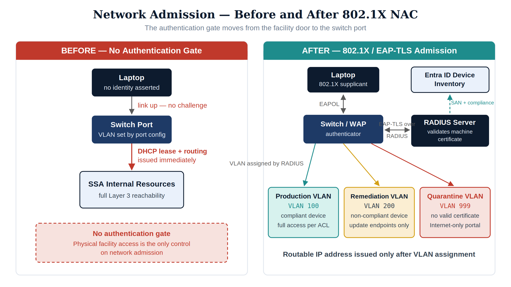
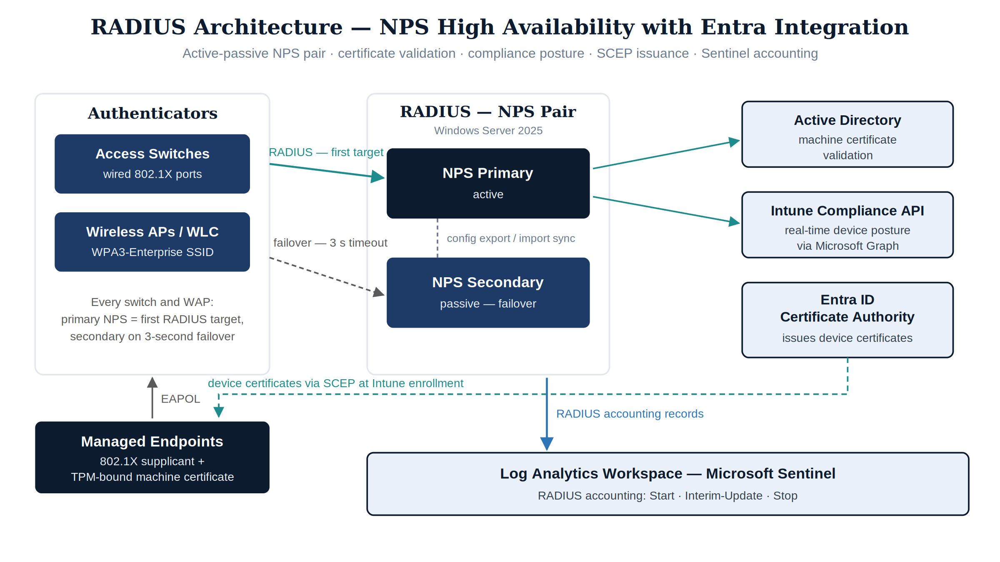
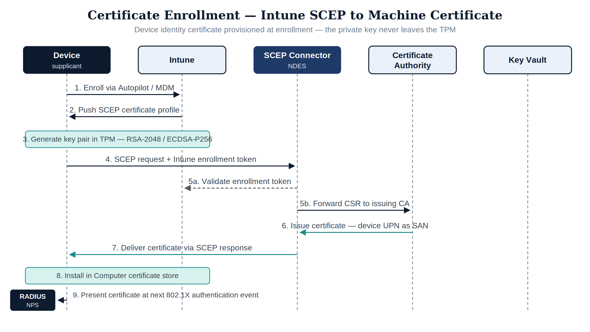
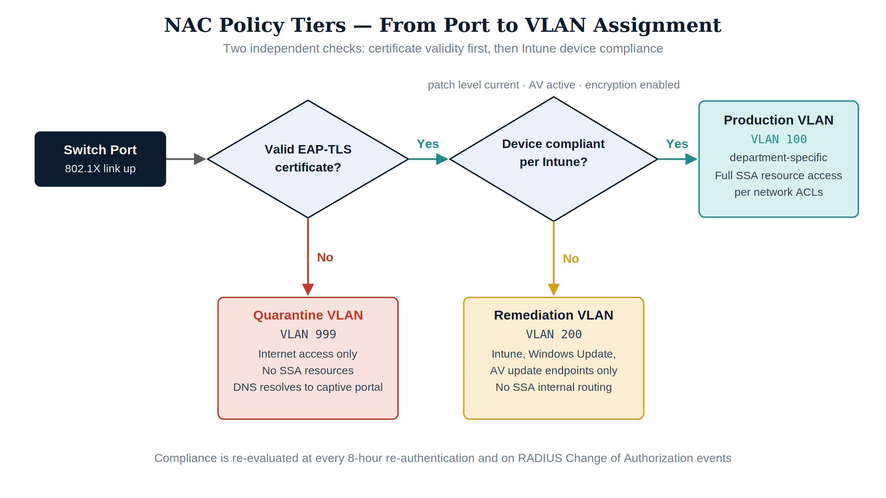
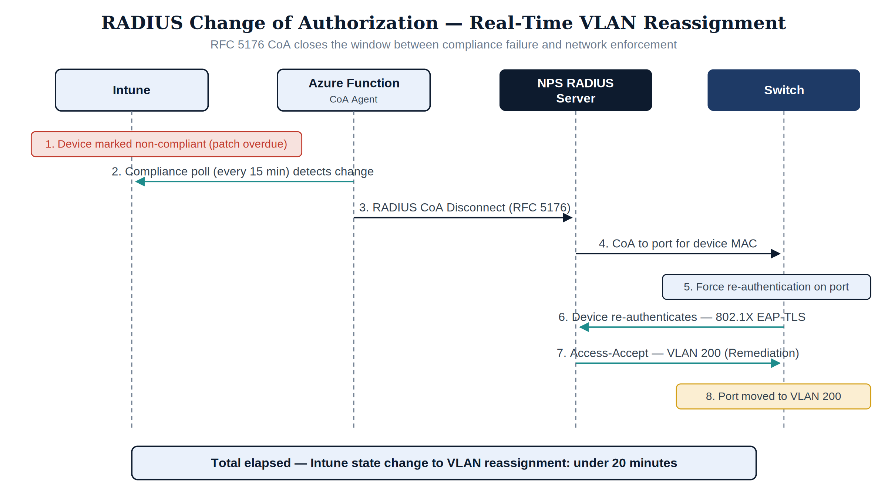
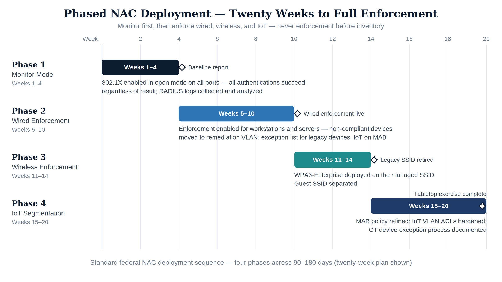
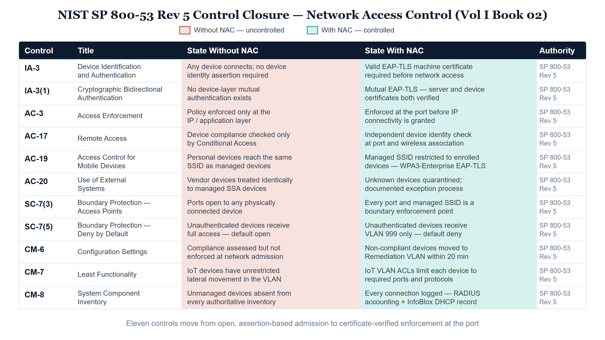

::: {.fouo-banner}
INTERNAL — NOT FOR PUBLIC DISTRIBUTION
:::

::: {.callout-important}
**Series Context** — This document is Part 2 of the Federal Application-Aware Networking series. Part 1 establishes the cloud landing zone and the authoritative naming and addressing plane — IPAM, DHCP, DNS, and certificate issuance (DDI/PKI). This part lays the device identity substrate directly on top of that plane: before any certificate is trusted, any token is minted, or any application flow is authorized, the network must be able to answer the question *what is physically connected to this port?* Part 3 (Certificates and Tokens) builds the cryptographic identity plane on this substrate, and every subsequent part — network modernization, telecommunications, database consolidation, privileged access, telemetry, and the authorization package — depends on the answer being enforced at the wire.
:::

# What This Document Addresses

Part 1 of this series established the naming and addressing plane: every device that joins the network receives an address from an authoritative DHCP service, a name in an authoritative DNS zone, and a record in an authoritative IPAM database. That plane can *observe* and *record* every device — but observation is not authentication. The naming and addressing plane, by itself, cannot decide whether the device should have been admitted at all.

No control laid above it answers the simpler question either: *what is physically plugged into this network port?*

A threat actor with physical access to a conference room, a decommissioned office wing, or an unmonitored wiring closet can connect an unauthorized device to the SSA network and begin reconnaissance, lateral movement, or data exfiltration without presenting any user identity at all. Every identity control the rest of this series builds — the certificate and token plane of Part 3, the application authentication modernization of Parts 7–8, the privileged access controls of Part 10 — is downstream of network admission. Those controls are effective only after a device has already been granted connectivity; built on unauthenticated ports, they are built on an unverified floor.

Network Access Control (NAC) with 802.1X port-based authentication addresses this at the wire. Before a device receives an IP address and network routing, it must present a cryptographically valid machine certificate to a RADIUS server that can verify the device's identity against the Entra ID device inventory. If the certificate is absent, expired, or does not correspond to an enrolled managed device, the port is placed into a quarantine VLAN with no access to SSA resources.

This document covers the architecture, certificate provisioning pipeline, RADIUS design, policy tier structure, InfoBlox integration, Sentinel logging, and phased implementation for 802.1X NAC across the SSA GCC Moderate boundary. It closes the **IA-3** (Device Identification and Authentication) control family at the only layer where it can be closed — the point of network admission — and lays the **SC-7** (Boundary Protection) and **CM-8** (System Component Inventory) foundations that Parts 3 through 19 extend upward through certificates, applications, telemetry, and the authorization package.

::: {.callout-note}
**Device Identity vs. User Identity** — NAC and 802.1X operate at the *device* layer, prior to any user authentication event. A device that fails 802.1X admission is quarantined regardless of the user credential that would subsequently be presented. This is a complementary, not redundant, control: Zero Trust requires verifying both *who is the user* and *what is the device*, independently.
:::

# The Device Identity Gap

## Why User Identity Alone Is Insufficient

The AAN series thesis is: *Physics constrains, token liberates.* The parts that follow this one implement the token side — Part 3 mints the cryptographic identities, and Parts 5 through 10 bind transport, applications, and privileged access to them, until every user and service identity assertion is backed by a cryptographic token. But a token is presented by a device, and the integrity of the token depends on the integrity of the device presenting it. That is why the device identity substrate is laid *now*, immediately after the naming and addressing plane, rather than at the end.

Consider the following two scenarios in the completed architecture this series builds:

**Scenario A — Credential theft on a managed device.** An attacker phishes a user's FIDO2 hardware key and clones the credential. The attacker can now present a valid Entra ID token. Conditional Access evaluates device compliance — the token is presented from the attacker's unmanaged laptop, which fails the `compliant` device filter. Access is denied. The user identity control and the device compliance check together stop the attack.

**Scenario B — Physical port access on an uncontrolled network.** An attacker connects a laptop to a wired jack in an SSA conference room. Without NAC, the switch port assigns a DHCP lease and routes traffic immediately. The attacker now has Layer 3 connectivity to SSA internal resources — without presenting any user credential at all. All user identity controls are irrelevant until the attacker chooses to attempt authentication. The window for passive reconnaissance, ARP poisoning, DNS poisoning, and lateral movement scanning is open from the moment the cable is plugged in.

NAC closes Scenario B at the port level. The attacker's laptop presents no machine certificate, 802.1X authentication fails, and the port is placed in the quarantine VLAN. The attacker has Layer 3 connectivity to the quarantine segment only — no routing to SSA resources, no DNS resolution for internal names.

## The Federal Physical Access Reality

Federal facilities operate under physical access controls — PIV badge readers, mantrap entries, visitor escort requirements. These controls are strong at building perimeters but are not equivalent to network port authentication:

- **Conference rooms** are routinely accessible to vendors, contractors, and visitors with valid facility badges who do not have SSA IT authorization.
- **Wiring closets** in older federal buildings frequently lack electronic access control distinct from the floor-level badge reader.
- **Decommissioned office areas** retain live switch ports until physical decommissioning is completed — often weeks to months after occupancy ends.
- **Hoteling workstations** in hot-desk environments have live ports by design, and the physical occupant changes daily.
- **IoT and OT devices** (printers, badge readers, HVAC controllers, video conferencing endpoints) connect to the same switch fabric as workstations and servers in many federal deployments.

Each of these is a live network connection with no authentication gate. NAC with 802.1X makes the authentication gate the switch port itself — independent of the physical access regime.

## Before and After: The Structural Comparison

{#fig-nac01 fig-alt="Two-panel diagram. Left panel labeled BEFORE shows a laptop connecting to a switch port and immediately receiving a DHCP lease and routing to SSA resources with no authentication gate. Right panel labeled AFTER shows the same laptop initiating 802.1X EAP exchange with the switch acting as authenticator, forwarding the EAP-TLS exchange to a RADIUS server, which validates the machine certificate against Entra ID device inventory, and the switch placing the port into the appropriate VLAN — compliant, non-compliant, or quarantine — before any IP address is issued to a routable segment." width="100%"}

**Before this document** — a device connecting to any SSA switch port in a managed facility receives network access determined solely by VLAN configuration on the port. No device identity assertion is required. Physical access to the facility is the only gate.

**After this document** — every switch port and wireless access point requires a valid machine certificate issued to an Entra-enrolled device. Devices that cannot present a valid certificate are placed in a quarantine VLAN. Devices that present a valid certificate from a non-compliant device (patch compliance failure, AV disabled) are placed in a remediation VLAN. Only devices that are enrolled, compliant, and certificate-valid receive access to the production VLAN.

# The Voice VLAN Precedent

Network Access Control did not begin with 802.1X. It began, in production networks, with a telephone.

When IP telephony arrived in the late 1990s — before IEEE 802.1X-2001 was ratified, and years before supplicant software was broadly deployable — every desk deployment faced the same problem NAC solves today: two very different device classes, a phone and a workstation, sharing the same wall jack, requiring different network segments, different QoS treatment, and different access scope. The mechanism that solved it was not an authentication protocol. It was DHCP. A phone booting on the data VLAN sent a DHCP request that declared its device class — the vendor class identifier in option 60, and a characteristic pattern of requested options. The DHCP server recognized the class and answered with vendor-specific options carrying the voice VLAN ID and the address of the configuration server. The phone released its data-VLAN lease, re-tagged its traffic onto the voice VLAN, and requested a new address there. The switch never authenticated anything; the *naming and addressing plane* identified the device and the network differentiated its admission accordingly.

This is the structural precedent for everything in this document. Voice VLAN steering was the earliest production case of the pattern NAC generalizes: a device asserts an identity, an authoritative service classifies it, and the network assigns it a segment scoped to its function — before the device touches any production resource. Every element of the modern NAC policy tier structure is visible in embryo: device classification (option 60 fingerprint), differentiated VLAN assignment (voice vs. data), and function-scoped access (the phone reaches call control, not file shares). The DHCP server was acting as a policy decision point a decade before that term entered the architecture vocabulary.

The precedent also carried a structural weakness, and naming it precisely is what motivates the rest of this document: **DHCP option-based steering is identity by assertion, not by proof.** Any device can transmit a phone's vendor class identifier; nothing in the exchange is cryptographically verified. That is acceptable for QoS steering, where the worst case of a false claim is mis-prioritized traffic. It is not acceptable for access control, where the worst case is an unauthorized device in a production segment. 802.1X with EAP-TLS replaces the assertion with a proof — a machine certificate whose private key never leaves the device — while the assertion-based lineage survives, deliberately and in a constrained role, in two places later in this document: MAC Authentication Bypass for devices that cannot run a supplicant, and DHCP fingerprinting as the classification and anomaly-detection signal that the IPAM layer feeds back into the NAC decision. The naming and addressing plane asserted device identity first; the identity plane this book builds makes the assertion provable.

# NAC Architecture — RADIUS, 802.1X, and EAP-TLS

## The Authentication Stack

802.1X Network Access Control is a port-based authentication framework defined in IEEE 802.1X-2020. It introduces three roles to every network admission event:

- **Supplicant** — the software on the device requesting network access. On Windows, this is the built-in 802.1X supplicant configured via Intune policy. On Linux, `wpa_supplicant` is the standard. On macOS, the native supplicant is configured through MDM.
- **Authenticator** — the network device that enforces access (a managed switch or wireless access point). The authenticator does not validate credentials itself; it relays the EAP exchange between the supplicant and the authentication server and enforces the VLAN assignment returned by the authentication server.
- **Authentication Server** — the RADIUS server that validates the supplicant's credentials and returns the access decision (VLAN ID, session timeout, filter rules).

The exchange protocol between supplicant and authentication server is the Extensible Authentication Protocol (EAP), carried over RADIUS between the authenticator and the authentication server.

## EAP Method Selection — Why EAP-TLS for Federal

NIST SP 800-120 (Recommendation for EAP Methods Used in Wireless Network Access Authentication) and NIST SP 800-153 (Guidelines for Securing Wireless Local Area Networks) both recommend EAP-TLS as the strongest EAP method for federal environments. The choice is not optional under FedRAMP Moderate:

| EAP Method | Credential | Server Certificate | Client Certificate | FIPS Approved | Federal Suitability |
|------------|-----------|-------------------|-------------------|---------------|---------------------|
| EAP-PEAP/MSCHAPv2 | Password | Required | Not required | No (MSCHAPv2) | Not acceptable — NTLM derivative |
| EAP-TTLS/PAP | Password | Required | Not required | No | Not acceptable — plaintext credential in tunnel |
| EAP-PEAP/EAP-TLS | Certificate | Required | Required | Yes | Acceptable — but EAP-TLS alone is simpler |
| **EAP-TLS** | **Certificate** | **Required** | **Required** | **Yes** | **Recommended — mutual certificate authentication** |

: EAP Method Comparison for Federal NAC {.striped .hover}

EAP-TLS provides mutual authentication: the RADIUS server presents its certificate to the supplicant (server identity), and the supplicant presents its machine certificate to the RADIUS server (device identity). Both assertions are cryptographically verified. Neither side can be impersonated without access to the private key of the relevant certificate authority.

This matters structurally: EAP-PEAP/MSCHAPv2, used in many legacy federal wireless deployments, is vulnerable to offline dictionary attacks against captured handshakes and rogue AP attacks (a malicious AP presents a self-signed server certificate that the supplicant accepts due to misconfigured validation). EAP-TLS with strict CA pinning eliminates both attack classes.

## RADIUS Server Design for Federal Environments

The RADIUS server is the authentication server in the 802.1X architecture. For SSA GCC Moderate, the recommended RADIUS implementation is **Microsoft Network Policy Server (NPS)** deployed on Windows Server 2025 in a highly available configuration, integrated with Entra ID via **Entra ID Certificate Authority** for cloud-issued device certificates.

For agencies with existing infrastructure investment, **Cisco Identity Services Engine (ISE)** and **Aruba ClearPass** are the dominant federal alternatives; both support the same EAP-TLS + Entra integration described in this document.

{#fig-nac02 fig-alt="Architecture diagram showing two NPS servers in an active-passive pair. Each switch and WAP in the building is configured with the primary NPS server as the first RADIUS target and the secondary as the failover. NPS servers connect to Active Directory for machine certificate validation and to the Intune Compliance API (via Graph) for real-time device compliance posture. The Entra ID CA issues device certificates during Intune enrollment via SCEP. A third connection shows RADIUS accounting records flowing to a Log Analytics workspace for Sentinel." width="100%"}

**NPS High Availability** — NPS does not natively replicate configuration between nodes. The standard approach for federal environments is:

1. Deploy two NPS servers in the same region.
2. Configure all RADIUS clients (switches, WAPs) with both servers, primary and secondary, with a 3-second failover timeout.
3. Use a shared NPS configuration export/import script (or Group Policy) to keep policy synchronized.
4. Monitor NPS availability with a Sentinel heartbeat alert (absence of RADIUS accounting events for > 5 minutes from a production authenticator triggers a P2 alert).

**RADIUS Shared Secrets** — Each authenticator (switch, WAP) requires a shared secret with the RADIUS server. For federal environments:

- Generate secrets with 32+ characters of cryptographic randomness.
- Store secrets in Azure Key Vault and rotate on a 180-day schedule.
- Use RADIUS over TLS (RadSec, RFC 6614) where the switch/WAP firmware supports it — this replaces the shared secret model with mutual TLS between authenticator and authentication server, eliminating the weakest link in the RADIUS trust chain.

## 802.1X Port Configuration

Every managed switch port that faces an end-device (not an uplink or trunk) is configured for 802.1X authentication. The configuration specifies three possible outcomes:

```
# Cisco IOS-XE example — port facing endpoint
interface GigabitEthernet1/0/1
 switchport mode access
 switchport access vlan 10          ! fallback only -- 802.1X overrides
 authentication port-control auto   ! enable 802.1X
 authentication host-mode multi-auth! allow phone + PC on same port
 authentication order dot1x mab     ! try 802.1X first, then MAB
 authentication priority dot1x mab  ! 802.1X always wins if both present
 dot1x pae authenticator
 dot1x timeout tx-period 10
 dot1x max-reauth-req 3
 spanning-tree portfast
 ip dhcp snooping limit rate 15
```

The `authentication order dot1x mab` line implements the fallback sequence: the port attempts 802.1X first (30-second window for a supplicant to respond). If no 802.1X supplicant responds, the port falls back to MAC Authentication Bypass (MAB) for devices that cannot participate in 802.1X (printers, IP phones, badge readers). MAB is covered in Section 6.

# Certificate Infrastructure and Device Enrollment

## The Certificate Trust Chain

NAC with EAP-TLS requires every managed device to hold a machine certificate trusted by the RADIUS server's CA. This certificate is distinct from the user certificate (used for user authentication to Entra ID). The machine certificate proves device identity — that this physical device is an SSA-enrolled managed endpoint — independently of which user is logged in.

The certificate trust chain for SSA GCC Moderate NAC:

```
Entra ID Certificate Authority (Root)
  └─ SSA Device Identity CA (Intermediate, deployed via Intune)
       └─ Device Machine Certificates (issued per-device at enrollment)
```

The RADIUS server (NPS) is configured to trust the SSA Device Identity CA. Any device that presents a certificate signed by this CA and passes the revocation check is recognized as a managed SSA device.

## Intune SCEP Certificate Enrollment

Certificates are provisioned via Simple Certificate Enrollment Protocol (SCEP), configured as an Intune device configuration profile. The enrollment flow:

1. Device completes Intune enrollment (Autopilot or manual MDM enrollment).
2. Intune pushes the SCEP certificate profile to the device.
3. The device generates a key pair locally (private key never leaves the device — stored in TPM where available).
4. The device sends a SCEP certificate request to the Intune SCEP connector (NDES server or cloud SCEP).
5. The SCEP connector forwards the request to the issuing CA after validating the Intune enrollment token.
6. The CA issues the certificate and returns it to the device via SCEP.
7. The device installs the certificate in the Computer certificate store (not the user store — this is critical for machine authentication to work before any user logs in).

{#fig-nac03 fig-alt="Sequence diagram with five participants: Device, Intune, SCEP Connector (NDES), Certificate Authority, and Key Vault. Step 1: Device enrolls with Intune via Autopilot. Step 2: Intune pushes SCEP profile. Step 3: Device generates RSA-2048 or ECDSA-P256 key pair in TPM. Step 4: Device sends SCEP request with Intune enrollment token to NDES. Step 5: NDES validates token with Intune API and forwards CSR to CA. Step 6: CA issues certificate with device UPN as SAN and returns to NDES. Step 7: NDES delivers certificate to device. Step 8: Device installs certificate in Computer store. Step 9: On next 802.1X authentication event, device presents this certificate to RADIUS." width="100%"}

**Intune SCEP Profile — Key Parameters:**

```json
{
  "certificateStore": "Machine",
  "keyUsage": "DigitalSignature, KeyEncipherment",
  "subjectNameFormat": "CN={{DeviceName}}",
  "subjectAlternativeNameType": "UserPrincipalName",
  "subjectAlternativeNameValue": "{{DeviceId}}@ssagov.onmicrosoft.com",
  "certificateValidityPeriodValue": 1,
  "certificateValidityPeriodScale": "Years",
  "renewalThresholdPercentage": 20,
  "keyStorageProvider": "Enroll to TPM KSP if present, otherwise Software KSP",
  "scepServerUrls": ["https://ndes.ssagov.onmicrosoft.com/certsrv/mscep/mscep.dll"]
}
```

The `subjectAlternativeNameValue` uses `{{DeviceId}}` — the Intune Device ID. The NPS policy is configured to validate that the SAN in the presented certificate corresponds to an active, compliant device in the Entra ID device inventory via the Graph API. A certificate from a device that has since been wiped, deleted from Entra ID, or marked non-compliant is rejected even if the certificate itself has not expired.

## Certificate Revocation

Two revocation mechanisms operate in parallel:

- **CRL (Certificate Revocation List)** — the CA publishes a CRL every 24 hours. NPS checks the CRL before accepting a certificate. The CRL distribution point URL must be reachable from all NPS servers (HTTP, not LDAP, for resilience).
- **OCSP (Online Certificate Status Protocol)** — for real-time revocation checks. The CA's OCSP responder answers per-certificate status queries in under 500ms. NPS queries OCSP on every authentication if the CA supports it and the certificate includes an OCSP stapling extension.

When a device is decommissioned, stolen, or wiped, the device certificate is revoked in the CA within the same change window. The next 802.1X re-authentication (which occurs every 8 hours per the NPS policy) will fail the revocation check and move the port to the quarantine VLAN.

# NAC Policy Tier Structure

## Overview

The RADIUS server returns a VLAN assignment (and optionally a filter policy and session timeout) for each authenticated device. The VLAN assignment is the enforcement mechanism — it determines which network segment the device enters and therefore which resources it can reach.

{#fig-nac04 fig-alt="Flowchart starting at switch port. First decision: does the device present a valid EAP-TLS certificate? No leads to Quarantine VLAN (VLAN 999): Internet access only, no SSA resources, DNS resolves to captive portal. Yes leads to second decision: is the device compliant per Intune (patch level current, AV active, encryption enabled)? No leads to Remediation VLAN (VLAN 200): access to Intune, Windows Update, and AV update endpoints only. Yes leads to Production VLAN (VLAN 100, department-specific): full SSA resource access per network ACLs." width="100%"}

| Tier | VLAN | Condition | Network Access |
|------|------|-----------|----------------|
| **Production** | 100–190 (dept) | Valid cert + Intune compliant | Full SSA resource access per ACL |
| **Remediation** | 200 | Valid cert + Intune non-compliant | Intune, Windows Update, AV endpoints only |
| **Quarantine** | 999 | No valid cert or cert revoked | Internet-only; captive portal |
| **Guest** | 500 | MAB — unmanaged device | Internet-only; no SSA routing |
| **IoT** | 300 | MAB — approved MAC prefix | IoT management VLAN only |

: NAC Policy Tiers {.striped .hover}

## Production VLAN

A device reaches the production VLAN by satisfying two independent checks:

1. **Certificate validity** — the machine certificate is valid, not expired, issued by the SSA Device Identity CA, and not revoked (CRL/OCSP check passes).
2. **Intune compliance** — the NPS Network Policy queries the Intune Compliance API (via the NPS Extension for Azure MFA / Intune, or via a custom RADIUS attribute returned by a NAC-aware proxy) and confirms the device is in the `compliant` state.

The Intune compliance policy for NAC includes at minimum:

- OS patch level: current within 30 days
- BitLocker: enabled and recovery key escrowed to Entra ID
- Microsoft Defender Antivirus: enabled, definitions current within 7 days
- Secure Boot: enabled
- TPM: present and enabled
- Firewall: enabled on all profiles

A device that passes certificate validation but fails any compliance check is placed in the Remediation VLAN — it is never silently admitted to production. The Intune compliance status is re-evaluated on the 8-hour RADIUS session re-authentication. A device that fails compliance mid-day receives a Change of Authorization (CoA) message from the NAC policy engine and is moved from the production VLAN to the Remediation VLAN without requiring physical port action.

## Remediation VLAN

The Remediation VLAN (VLAN 200) has a limited ACL that permits:

- HTTPS to `*.manage.microsoft.com` (Intune management traffic)
- HTTPS to `*.update.microsoft.com` and `*.windowsupdate.com` (Windows Update)
- HTTPS to `*.wdcp.microsoft.com` and `*.wd.microsoft.com` (Defender definition updates)
- DNS resolution for those names via the SSA DNS forwarder
- No routing to any SSA internal resource

A device placed in the Remediation VLAN can self-remediate: Windows Update runs automatically, Defender updates its definitions, and Intune re-evaluates compliance on the next check-in cycle (up to 8 hours). When the device returns to `compliant` state in Intune, the NAC policy engine sends a RADIUS CoA to the switch and the port is moved to the production VLAN without requiring manual intervention or a physical reconnect.

## Quarantine VLAN

The Quarantine VLAN (VLAN 999) receives devices that fail certificate authentication entirely: no certificate presented, certificate from an unknown CA, expired certificate, or certificate revoked. These are devices that are either not SSA-managed or have been decommissioned.

A captive portal DNS redirect sends HTTP traffic from the quarantine VLAN to an internal page that explains: *"This device is not authorized for SSA network access. If you believe this is in error, contact the SSA Help Desk."* This prevents the user from believing the network is simply down and generating a flood of unrelated help desk calls.

## MAC Authentication Bypass (MAB) — Guest and IoT

Devices that cannot participate in 802.1X (IP phones, printers, badge readers, IP cameras, HVAC controllers) are handled via MAC Authentication Bypass (MAB). After the 802.1X timeout expires with no supplicant response, the switch sends the device's MAC address to the RADIUS server as the authentication credential.

The NPS MAB policy matches the MAC address against two lookup tables:

- **Approved IoT/OT MAC prefixes** — manufacturer OUI prefixes for approved device categories (e.g., the OUI prefix for the SSA-standard IP phone model, the badge reader vendor). These receive VLAN 300 (IoT VLAN) with restricted routing to their management systems only.
- **Guest** — any MAC that does not match an approved prefix or an explicitly registered guest MAC receives VLAN 500 (Guest VLAN) with Internet routing only.

::: {.callout-warning}
**MAB is Identity by Assertion, Not Proof** — MAC addresses are trivially spoofable. MAB provides device *classification*, not device *authentication*. An attacker who knows an approved IoT device's MAC address can spoof it and receive IoT VLAN access. MAB should be restricted to device categories where 802.1X supplicant support is technically impossible (embedded firmware devices, legacy OT equipment), and the IoT VLAN should have minimal routing scope. For any device category where 802.1X is feasible, 802.1X must be required.
:::

# Posture Assessment Integration

## Intune Compliance as the Posture Signal

The posture check in SSA's NAC deployment is driven by Intune device compliance state, not by an inline NAC probe. This architectural choice is intentional:

- **Inline NAC posture probes** (agent-based or agentless) add a second management plane that must be kept synchronized with the MDM inventory — creating a reconciliation burden and a potential source of false positives/negatives.
- **Intune compliance** is the authoritative posture signal for all Windows and macOS endpoints already enrolled in Intune. The compliance policy runs on the device via the Intune Management Extension, evaluates the same controls that would be checked by a NAC probe (patch level, AV, encryption), and reports the result to the Intune service.

The NPS Extension for Intune NAC (or equivalent) reads the Intune compliance status for the device identified by the certificate SAN at authentication time and includes it in the RADIUS Access-Accept or Access-Reject.

## RADIUS Change of Authorization (CoA) for Real-Time Enforcement

The standard 802.1X re-authentication interval (8 hours) means a device that fails compliance mid-day could remain on the production VLAN for up to 8 hours. RADIUS Change of Authorization (CoA, RFC 5176) eliminates this window.

The NAC policy engine (implemented as an Azure Function that polls the Intune compliance API every 15 minutes) sends a RADIUS CoA Disconnect or Re-Auth message to the switch when a device's compliance state changes from `compliant` to `nonCompliant`. The switch immediately re-authenticates the device, the RADIUS server returns the Remediation VLAN, and the port moves without any manual intervention.

{#fig-nac05 fig-alt="Sequence diagram with four participants: Intune, Azure Function (CoA Agent), NPS RADIUS Server, and Switch. Step 1: Intune marks device as non-compliant (patch overdue). Step 2: Azure Function polling Intune compliance detects state change. Step 3: Azure Function sends RADIUS CoA Disconnect message to NPS (RFC 5176). Step 4: NPS forwards CoA to the switch port associated with the device MAC. Step 5: Switch forces re-authentication on the port. Step 6: Device re-authenticates via 802.1X. Step 7: NPS returns VLAN 200 (Remediation) in the Access-Accept. Step 8: Switch moves port to VLAN 200. Total elapsed time from Intune state change to VLAN reassignment: under 20 minutes." width="100%"}

# Wired and Wireless NAC

## Wired 802.1X

Wired 802.1X is enabled on all access-layer switch ports connected to end devices. Uplink ports (trunks between switches, router-on-a-stick uplinks) are excluded from 802.1X and rely on physical security of the network infrastructure layer.

The key operational consideration for wired NAC rollout is the **multi-auth mode** setting. A single switch port may have both an IP phone (connected to the wall jack) and a PC (connected to the phone's PC port, daisy-chained through the phone). The `authentication host-mode multi-auth` configuration allows both devices to authenticate independently: the phone authenticates via MAB (VLAN 300 / voice VLAN), and the PC authenticates via EAP-TLS (VLAN 100 / data VLAN). The switch tags the traffic from each device with the appropriate VLAN, and both devices coexist on the same physical port.

## Wireless 802.1X — WPA3-Enterprise

Wireless 802.1X uses the same EAP-TLS supplicant and certificate infrastructure as wired, but the authenticator is the Wireless Access Point (WAP) or Wireless LAN Controller (WLC). The SSID for managed SSA devices is configured as WPA3-Enterprise (SAE + EAP-TLS), which provides Protected Management Frames (PMF) and eliminates the KRACK-class attacks that affect WPA2-Enterprise.

A separate guest SSID (WPA3-Personal or open with a captive portal) is provided for personal devices and visitors on a completely separate VLAN with no routing to SSA resources.

```
# Cisco WLC / Catalyst Center SSID configuration (CLI equivalent)
wlan SSA-Managed 1 SSA-Managed
 security wpa wpa3
 security wpa akm dot1x
 security dot1x eap-profile SSA-EAP-TLS
 no security wpa wpa2
 radio policy dot11 6ghz
 radio policy dot11 5ghz
 radio policy dot11 24ghz
 no shutdown
```

The WPA3-Enterprise SSID presents the RADIUS server certificate to the supplicant during EAP-TLS negotiation. The Windows 802.1X supplicant (configured via Intune) is set to validate the server certificate against a pinned root CA — the Entra ID Certificate Authority. A rogue access point presenting a different certificate is rejected by the supplicant, preventing credential theft or session hijacking even if the rogue AP has the same SSID name.

## Session Timeout and Re-Authentication

NPS Network Policy sets the following session parameters:

| Parameter | Value | Rationale |
|-----------|-------|-----------|
| Session-Timeout | 28800 (8 hours) | Re-auth once per work shift; balance between security and overhead |
| Termination-Action | RADIUS-Request | Re-authenticate (not disconnect) on timeout |
| Idle-Timeout | 1800 (30 min) | Disconnect inactive ports (unattended devices, power-off) |

Re-authentication at 8 hours forces the RADIUS server to re-check certificate validity and Intune compliance at least once per shift, even without a CoA event. A device that was compliant at 08:00 but failed a compliance check at 14:00 will be moved to the Remediation VLAN no later than 16:00 (next re-auth) in the worst case, or within 20 minutes if the CoA agent is operational.

# InfoBlox Integration

## DHCP Fingerprinting and Device Profiling

InfoBlox DDI (deployed in Part 1) integrates with NAC to provide device profiling — classifying devices by DHCP fingerprint (the pattern of DHCP options requested by a device) before or in parallel with 802.1X authentication. This serves two purposes:

1. **IoT / OT device identification** — devices that cannot participate in 802.1X are identified by their DHCP fingerprint (e.g., a Cisco IP phone requests specific DHCP options that match its device class). InfoBlox Grid feeds the device classification to the RADIUS server, enabling the NPS MAB policy to assign the correct VLAN based on device type rather than relying solely on MAC OUI lookup.

2. **Anomaly detection** — a device that presents a valid SSA machine certificate but whose DHCP fingerprint does not match any known Windows/macOS pattern (e.g., a Linux system or Android device) generates an alert in Sentinel. This catches cases where a valid certificate has been extracted from a managed device and installed on an unauthorized system.

## IPAM-Driven VLAN Assignment

InfoBlox IPAM maintains the authoritative mapping of VLAN → IP address range → network policy. When NPS assigns a device to a VLAN, InfoBlox DHCP serves the address from the correct scope and records the assignment in the IPAM database. The IPAM record links:

- Device MAC address
- Device DNS name (from the Entra ID device object)
- Assigned VLAN and IP address
- Assignment timestamp and lease duration
- NAC authentication result (certificate SAN, compliance verdict)

This record is the **CM-8 device inventory artifact** for NAC-controlled devices. Every device that has ever connected to the SSA network — managed or not — has a DHCP record in InfoBlox. The NAC authentication result annotates the record with the identity assertion that was presented (or absent).

# Logging and Monitoring

## RADIUS Accounting to Sentinel

NPS RADIUS Accounting sends a record for every authentication event — Start, Interim-Update, and Stop — to a Log Analytics workspace via the NPS RADIUS accounting log forwarding. The events include:

- Device MAC address (Calling-Station-Id)
- Switch IP and port (NAS-IP-Address, NAS-Port)
- Authentication result (Access-Accept / Access-Reject)
- VLAN assigned (Tunnel-Private-Group-ID)
- Reason for rejection (if applicable)
- Certificate SAN (User-Name attribute in EAP-TLS)
- Session duration

These events are the **IA-3 control evidence artifact** — a complete audit trail of every device identity assertion and its outcome.

## Sentinel Analytics Rules for NAC

```kusto
// Alert: device admitted to production VLAN without Intune compliance
Event
| where Source == "NPS"
| extend vlan = extract("Tunnel-Private-Group-ID=([0-9]+)", 1, RenderedDescription)
| extend certSAN = extract("User-Name=([^;]+)", 1, RenderedDescription)
| where vlan in ("100", "101", "102", "110", "120")  // production VLANs
| join kind=leftouter (
    IntuneDeviceComplianceOrg
    | where ComplianceState != "compliant"
    | project DeviceId, ComplianceState
  ) on $left.certSAN == $right.DeviceId
| where isnotempty(ComplianceState)
| project TimeGenerated, certSAN, vlan, ComplianceState
```

```kusto
// Alert: repeated 802.1X failures (possible rogue device or cert expiry)
Event
| where Source == "NPS"
| where RenderedDescription contains "Access-Reject"
| extend mac = extract("Calling-Station-Id=([0-9A-F:-]+)", 1, RenderedDescription)
| summarize FailCount = count(), Ports = make_set(NASPort) by mac, bin(TimeGenerated, 1h)
| where FailCount >= 5
| project TimeGenerated, mac, FailCount, Ports
```

```kusto
// Alert: certificate fingerprint mismatch (possible cert theft + replay)
NpsRadius_CL
| extend certSAN = extract("User-Name=([^;]+)", 1, RawData)
| extend macAddr = extract("Calling-Station-Id=([^;]+)", 1, RawData)
| join kind=inner (
    EntraDevices
    | project DeviceId, ExpectedMac = PhysicalIds
  ) on $left.certSAN == $right.DeviceId
| where not(macAddr in (ExpectedMac))
| project TimeGenerated, certSAN, macAddr, ExpectedMac
| extend AlertSeverity = "High"
```

The certificate fingerprint mismatch rule is the operational detection for certificate theft: if a valid device certificate is presented from a MAC address that does not match the enrolled device's MAC, Sentinel generates a High-severity alert and the CoA agent immediately quarantines the port.

# Phased Implementation

Deploying 802.1X across an existing federal environment requires a phased approach. Enabling enforcement before all devices are enrolled results in a network outage — printers, badge readers, and other non-802.1X devices lose connectivity. The standard federal NAC deployment sequence is four phases over 90–180 days.

{#fig-nac06 fig-alt="Gantt-style timeline diagram with four swim lanes. Phase 1 Monitor Mode (weeks 1–4): 802.1X enabled in open mode on all ports, all authentications succeed regardless of result, RADIUS logs collected and analyzed. Phase 2 Wired Enforcement (weeks 5–10): enforcement enabled for workstations and servers, non-compliant devices moved to remediation VLAN, exception list for legacy devices, IoT on MAB. Phase 3 Wireless Enforcement (weeks 11–14): WPA3-Enterprise deployed on managed SSID, guest SSID separated. Phase 4 IoT Segmentation (weeks 15–20): MAB policy refined, IoT VLAN ACLs hardened, OT device exception process documented." width="100%"}

## Phase 1 — Monitor Mode (Weeks 1–4)

Configure 802.1X on all ports in **open mode** (`authentication open` on Cisco IOS-XE). In open mode:

- The 802.1X authentication exchange occurs normally.
- RADIUS returns Accept or Reject based on certificate validation and compliance.
- The switch **ignores the Reject** — all devices receive network access regardless of authentication result.
- All authentication events are logged to Sentinel.

The purpose of Phase 1 is discovery: identify every device that fails authentication (no certificate, expired certificate, non-compliant) before enforcement is enabled. This produces the inventory that informs the exception list for Phases 2–4.

At the end of Phase 1, produce a report:

- Count of devices that passed EAP-TLS with compliant status
- Count of devices that passed EAP-TLS but failed compliance
- Count of devices with no supplicant (MAB fallback)
- Count of devices with expired or missing certificates
- Count of unrecognized MAB devices

This report is the baseline for Phase 2 readiness.

## Phase 2 — Wired Enforcement (Weeks 5–10)

Remove `authentication open` from workstation and server ports. Devices that fail authentication are now placed in the Quarantine or Remediation VLAN. The exception list from Phase 1 is entered as explicit MAB bypass rules for devices that cannot participate in 802.1X.

Key tasks:

1. Remediate all managed workstations with expired certificates (Intune SCEP profile re-push).
2. Register all approved IoT/OT devices in the InfoBlox MAC database with device class tags.
3. Configure the captive portal for the quarantine VLAN.
4. Enable the CoA agent (Azure Function) and test the compliance-state-change VLAN reassignment.
5. Enable the Sentinel analytics rules and configure alert routing to the SSA SOC.

## Phase 3 — Wireless Enforcement (Weeks 11–14)

Deploy the WPA3-Enterprise SSID and migrate managed devices from the legacy WPA2-Personal or WPA2-Enterprise SSID. The migration is device-by-device via Intune Wi-Fi profile push:

1. Push the new WPA3-Enterprise Wi-Fi profile to all Intune-enrolled devices.
2. The profile includes the EAP-TLS settings, RADIUS server certificate trust, and the SSID name.
3. Devices connect to the new SSID automatically using the machine certificate.
4. Retire the legacy SSID after all managed device migrations are confirmed in Sentinel.

The guest SSID is deployed in parallel, isolated on VLAN 500, with captive portal acknowledgment required for first-time access.

## Phase 4 — IoT Segmentation and Hardening (Weeks 15–20)

Refine the MAB policy based on operational experience from Phases 2–3:

- Apply ACLs on the IoT VLAN (VLAN 300) to restrict each device category to only the management ports and protocols it requires (e.g., IP phones receive SIP/RTP to the voice gateway only; badge readers receive OSDP to the physical access control server only).
- Document the exception process for new IoT device deployments (asset registration in InfoBlox before deployment is a prerequisite for MAB approval).
- Conduct a tabletop exercise simulating a rogue device plugged into a conference room port — verify that the quarantine VLAN fires, Sentinel alerts, and the CoA agent responds correctly.

# NIST SP 800-53 Rev 5 Control Closure

The following table maps each NIST control addressed by this document to its state before and after implementation.

{#fig-nac07 fig-alt="Table-style diagram with five columns: Control ID, Control Title, State Without NAC, State With NAC, and Primary Authority. Rows cover IA-3, IA-3(1), AC-3, AC-17, AC-19, AC-20, SC-7(3), SC-7(5), CM-6, CM-7, CM-8. Color coding: red rows indicate non-compliant or uncontrolled state without NAC, green rows indicate controlled state with NAC." width="100%"}

| Control | Title | Without This Document | With This Document | Authority |
|---------|-------|----------------------|-------------------|-----------|
| **IA-3** | Device Identification and Authentication | Devices connect to SSA network ports without presenting any device identity assertion; the network cannot distinguish a managed SSA workstation from an unauthorized device on the same physical port | Every device must present a valid EAP-TLS machine certificate issued by the SSA Device Identity CA before receiving network access; certificate SAN is validated against the Entra ID device inventory; unauthorized devices are quarantined | NIST SP 800-53 Rev 5 IA-3 |
| **IA-3(1)** | Cryptographic Bidirectional Authentication | No device-layer mutual authentication exists; switches do not authenticate to devices and devices do not authenticate to the network | EAP-TLS provides mutual authentication: the RADIUS server presents its certificate to the supplicant (network identity), and the supplicant presents its machine certificate to the RADIUS server (device identity); both are verified cryptographically | NIST SP 800-53 Rev 5 IA-3(1) |
| **AC-3** | Access Enforcement | Network access policy is enforced only at the IP/application layer (firewalls, Entra Conditional Access); a device that gains Layer 3 connectivity bypasses application-layer controls until it attempts to authenticate | Network access policy is enforced at the port layer before IP connectivity is granted; a device that cannot authenticate never receives a routed IP address in a production segment | NIST SP 800-53 Rev 5 AC-3 |
| **AC-17** | Remote Access | VPN and remote access require user authentication via Entra ID; device compliance is evaluated by Conditional Access | NAC certificate validation at the physical port and wireless association layer provides an independent device identity assertion that pre-dates any user remote access session; posture verification is consistent across in-office and remote access paths | NIST SP 800-53 Rev 5 AC-17 |
| **AC-19** | Access Control for Mobile Devices | Mobile devices and personal laptops connecting to SSA wireless receive the same SSID access as managed devices; no device identity check distinguishes them | WPA3-Enterprise with EAP-TLS restricts the managed SSID to Intune-enrolled devices with valid machine certificates; personal devices and unmanaged mobile devices cannot authenticate to the managed SSID and are directed to the guest SSID | NIST SP 800-53 Rev 5 AC-19 |
| **AC-20** | Use of External Systems | Vendor and contractor devices that connect to SSA conference room ports are treated identically to managed SSA devices by the network | Vendor and contractor devices that cannot present a valid SSA machine certificate are placed in the quarantine VLAN; if vendor NAC access is required, an explicit exception process (MAC registration + IoT VLAN + time-limited ACL) is used with documented approval | NIST SP 800-53 Rev 5 AC-20 |
| **SC-7(3)** | Boundary Protection — Access Points | Network access points (switch ports, WAPs) are open to any physically connected device; the boundary is the building perimeter, not the network port | Every switch port and WAP SSID (managed) is a boundary enforcement point; 802.1X authentication is the access control mechanism at each access point; unauthorized devices cannot traverse the boundary regardless of physical facility access | NIST SP 800-53 Rev 5 SC-7(3) |
| **SC-7(5)** | Boundary Protection — Deny by Default | Unauthenticated devices receive full network access by VLAN assignment; the default is open | Unauthenticated devices (no 802.1X supplicant, no MAB match) receive VLAN 999 (quarantine) with no routing to SSA resources; the default is deny; access must be explicitly granted by a successful authentication | NIST SP 800-53 Rev 5 SC-7(5) |
| **CM-6** | Configuration Settings | Device configuration compliance (patch level, AV, encryption) is assessed by Intune but is not enforced at the network admission layer; a non-compliant device can connect to the production network | Intune compliance state is evaluated at every 802.1X authentication and on CoA events (every 15 minutes for state changes); a device that fails Intune compliance is moved to the Remediation VLAN within 20 minutes of the compliance state change | NIST SP 800-53 Rev 5 CM-6 |
| **CM-7** | Least Functionality | Any device that obtains physical network connectivity receives production VLAN routing; IoT devices and printers have unrestricted lateral movement potential within the VLAN | IoT and OT devices receive VLAN 300 with ACLs restricting them to only the management ports and protocols their function requires; a printer can reach the print server port only, not the file server or Active Directory | NIST SP 800-53 Rev 5 CM-7 |
| **CM-8** | System Component Inventory | Device inventory is maintained in Intune (enrolled managed devices) and SCCM/MEM, but unmanaged devices that connect to the network are not captured in any authoritative inventory | Every device that connects to a NAC-controlled port generates a RADIUS accounting record linked to an InfoBlox DHCP record; managed and unmanaged devices alike are recorded with MAC address, port, VLAN, authentication result, and timestamp; this is the authoritative network device inventory | NIST SP 800-53 Rev 5 CM-8 |

: NIST SP 800-53 Rev 5 control closure for Part 2 — Network Access Control {.striped .hover}

> **Closure Necessity — IA-3 at the point of admission.** IA-3 requires the system to uniquely identify and authenticate devices *before establishing a network connection*. The connection is established at exactly one place — the switch port or the wireless association — so the authentication must interpose at that place, before an address is issued and routing begins. Only a port-based authentication protocol carrying a verifiable device credential (802.1X with EAP-TLS, backed by the device identity substrate this document builds) can do that: a vulnerability scanner discovers a device only after it is already connected, an MDM agent reports only from devices already enrolled, and a firewall evaluates packets from devices already admitted. There is no configuration setting, scanner finding, or policy document that authenticates a port.

> **Closure Necessity — CM-8 and the enumeration problem.** CM-8 requires a component inventory that *accurately reflects the system* and *includes all components within the system* — including the components nobody enrolled. An MDM inventory contains only devices that completed enrollment; a scanner sees only the address ranges and time windows it is pointed at. The one plane every device must touch in order to function at all — managed or rogue — is the addressing plane: to communicate, it must obtain an address. IPAM with DHCP fingerprinting, annotated by the NAC authentication result, is therefore the only mechanism that enumerates *every* component and is thus the authoritative CM-8 inventory. You cannot inventory what you cannot enumerate, and no scanner creates a source of truth; it can only measure drift from one.

::: {.callout-note}
**FedRAMP 20x Key Security Indicator Alignment**

**KSI-CMT-LMC (KSI-011) — Least Functionality / Configuration Management**: NAC posture enforcement via Intune compliance provides a network-layer gate that prevents non-compliant devices from accessing production resources. This lays a network-admission enforcement point beneath the KSI-011 evidence depth that Parts 15 and 16 later establish at the policy and governance layer.

**KSI-CMT-VTD (KSI-014) — Vulnerability and Threat Detection**: The NAC posture check evaluates Defender AV definition currency and OS patch level at network admission — the same indicators Part 11 later uses for KSI-014 vulnerability management evidence. A device with an overdue patch that passes vulnerability scanner thresholds on its scheduled scan date but falls out of compliance between scans is caught by NAC posture at the next re-authentication. NAC provides continuous enforcement between point-in-time scan windows.

**KSI-IAM-MFA (KSI-001) — Multi-Factor Authentication**: EAP-TLS machine certificate authentication is a hardware-bound device credential (certificate key in TPM) that constitutes a device MFA factor — something the device *has* (the certificate) combined with hardware attestation (TPM key non-exportability). This deepens the KSI-001 evidence narrative by extending phishing-resistant authentication from the user identity layer to the device identity layer.

Agencies implementing this document should capture the following as OSCAL AR evidence artifacts: NPS RADIUS accounting log export (90-day retention, per AU-11); Intune compliance report export showing NAC-enrolled devices; InfoBlox DHCP audit log for the NAC-controlled VLAN scopes; and the Phase 1 monitor-mode baseline report.
:::

# From Port to Token: the NAC → ZTNA Continuum

Every admission decision in this document answers the same three questions: *is this device known, is its identity proven, and is its posture current?* What varies across the rest of the series is not the questions — it is where the answer is enforced.

At the port, the answer is enforced by VLAN assignment: a switch consults a RADIUS server, and the device lands in a segment scoped to its trust level. That enforcement is location-bound by construction — it protects the wire, and only the wire. The moment the same device reaches an application through a cloud front door, a ZTNA broker, or a conditional access gateway, the port's verdict is out of scope. Zero Trust Network Access re-asks the three questions at every access request, and it enforces the answer not in a VLAN but in a **token**: the device certificate minted here becomes a claim, the Intune compliance state evaluated here becomes a claim, and the access token carries both to whatever policy enforcement point sits in front of the resource.

This is a continuum, not a replacement. Part 3 (Certificates and Tokens) takes the machine certificate this document provisions for the RADIUS exchange and generalizes it into the series' cryptographic identity plane — the same SCEP pipeline, the same TPM-bound keys, the same revocation infrastructure, now issuing identities for users, services, and workloads as well as switch-port admission. Part 5 (application-aware modernization) then rebuilds the network itself around those identities, so that transport policy, not just admission policy, is decided per-application and per-identity. Posture asserted at the port evolves into posture asserted in the token; the port remains the enforcement point for the one layer no token can reach — the physical wire — while the token carries the identical device identity everywhere the wire does not go.

---

*Federal Application-Aware Networking — Part 2 of the series. Part 1 established the authoritative naming and addressing plane; Part 2 lays the device identity substrate on top of it, closing the device identity gap at the network port before any higher-layer identity assertion is made. Part 3 builds the certificate and token identity plane on this substrate, and Parts 5 through 19 carry those identities through transport, applications, operations, and the authorization package. Together the nineteen parts provide self-assessed evidence for all 29 FedRAMP 20x CR26 KSIs and 106+ NIST SP 800-53 Rev 5 controls pending independent 3PAO validation.*
