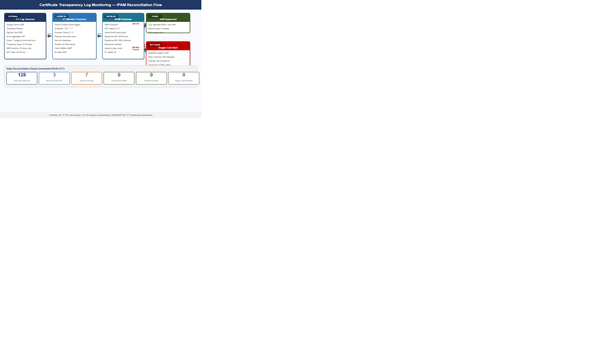
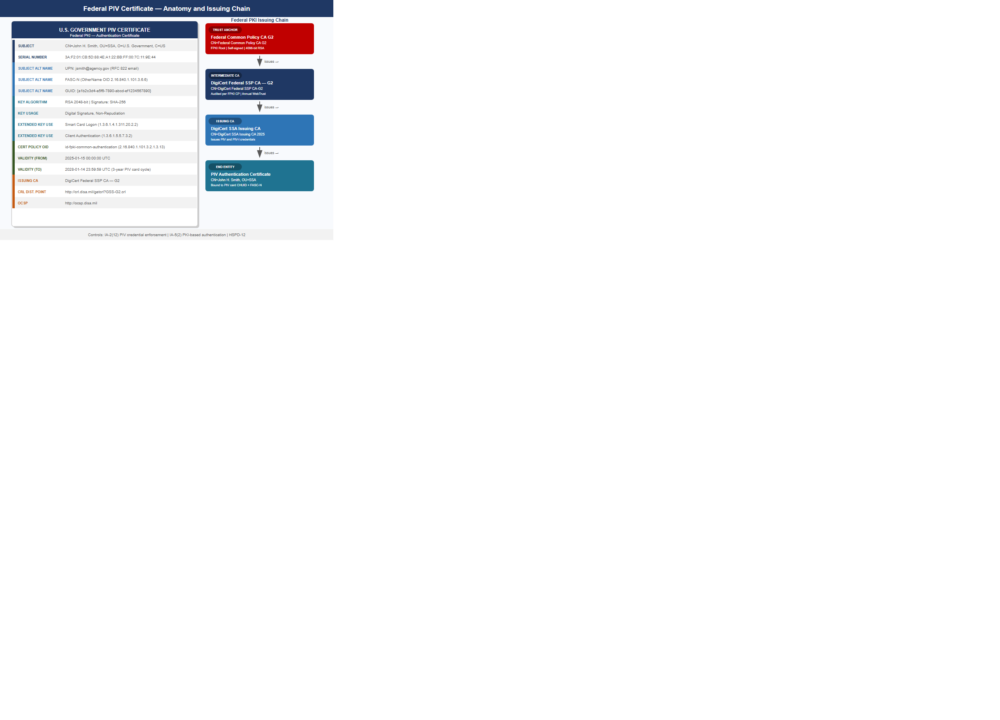
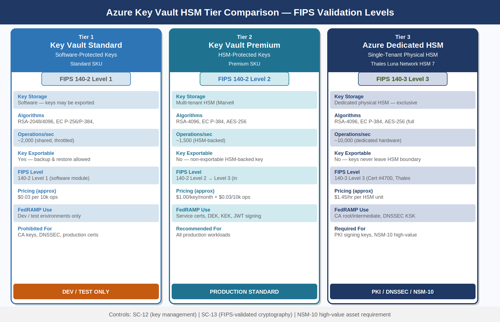
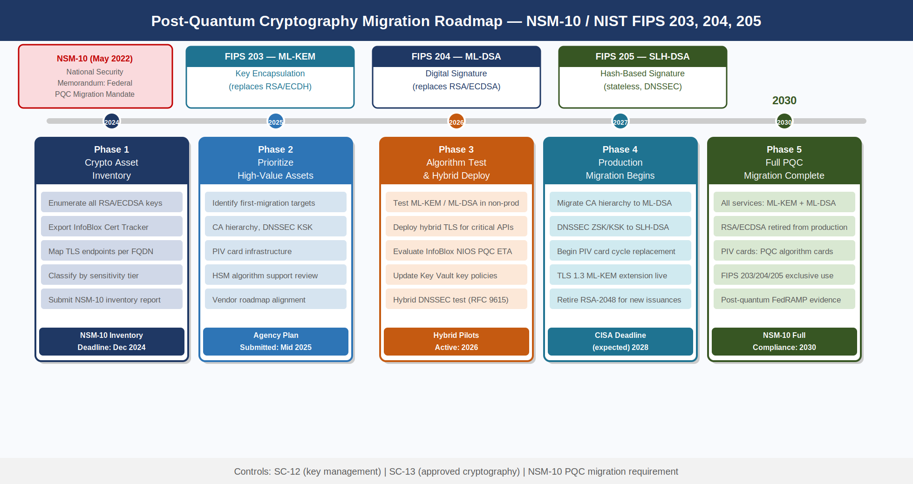

```{=html}
<div class="fouo-banner">INTERNAL — NOT FOR PUBLIC DISTRIBUTION</div>
```

::: {.callout-important}
**Series Context** — This is Part 02 of the 27-book Federal Application-Aware Networking series for SSA GCC Moderate (FedRAMP). Part 01 established the IPAM namespace hierarchy as SSA's single source of truth for IP address space and DNS delegation. This book demonstrates how that same namespace becomes the cryptographic trust chain: the FQDN that IPAM manages is also the Subject Alternative Name in the TLS certificate, the `aud` claim in the OAuth token, the DNSSEC-signed delegation, and the Certificate Transparency-monitored identity. Controls closed: SC-12, SC-13, SC-17, SC-20, SC-21, SC-22, SC-23, SC-8, IA-5(2), IA-5(6), IA-9.
:::

---

## Executive Summary {.unnumbered}

```{=html}
<div class="exec-summary">
```

Book 01 built the IPAM namespace — a deterministic, policy-governed FQDN hierarchy where every service in SSA's multi-cloud environment has an authoritative name record managed by a single control plane. That decision was not merely operational. It was a cryptographic pre-commitment: by enforcing that every service name flows through IPAM, SSA created the precondition for a namespace-anchored trust model in which the name *is* the identity.

This book shows how to close that loop. A service that needs a TLS certificate must first exist as an IPAM host record — the certificate authority checks the IPAM API and will not issue a SAN for an FQDN that has no corresponding record. That same FQDN becomes the `iss` and `aud` claims in every OAuth 2.0 / OIDC token the service produces or consumes. DNSSEC signs the delegation chain from the Federal Common Policy CA G2 DNS anchor down to SSA's zone, so any resolver that validates DNSSEC knows the name is authentic before the TLS handshake begins. Certificate Transparency logs are continuously reconciled against the IPAM database so that a certificate issued for a name not in IPAM — a rogue cert, a misconfigured automation — triggers a Microsoft Sentinel alert within minutes.

**The business outcome:** identity sprawl — the persistent federal audit finding where services accumulate unknown credentials, expired certificates, and stale service principals — is structurally prevented rather than periodically hunted. You cannot have an identity at SSA that does not trace back to an IPAM record. The namespace is the authorization boundary.

**FedRAMP 20x KSI alignment:** KSI-IAM-MFA (all privileged access uses phishing-resistant MFA backed by PIV certificates) and KSI-IAM-CAP (Continuous Access Evaluation enforces near-real-time token revocation) are both addressed in this book. The IPAM namespace is the substrate on which both KSIs operate.

```{=html}
</div>
```

---

## The IPAM Namespace as an Authorization Boundary {#sec-boundary}

In traditional network security, the authorization boundary is defined by IP address ranges and firewall rules. Zero Trust architectures replace IP-based perimeters with identity-based policy — but identity requires a name, and names require a trusted namespace. Without a governed namespace, every service can claim any identity, and no enforcement point can verify the claim without consulting an external directory.

The IPAM subdomain hierarchy established in Book 01 solves this by making the naming layer itself a control. SSA's subdomain structure is:

```
ssagov.onmicrosoft.com                     ← Tenant root (Entra ID)
  ├── api.ssagov.onmicrosoft.com           ← REST API workloads
  ├── db.ssagov.onmicrosoft.com            ← Database service endpoints
  ├── mgmt.ssagov.onmicrosoft.com          ← Management plane services
  ├── infra.ssagov.onmicrosoft.com         ← Infrastructure automation
  └── ext.ssagov.onmicrosoft.com           ← External-facing endpoints
        └── benefits.ext.ssagov.onmicrosoft.com
```

Each subdomain boundary corresponds to a trust zone with distinct certificate policy, token audience scope, and network access policy. An API service in `api.ssagov.onmicrosoft.com` presents a certificate with that FQDN as the SAN and will only accept tokens whose `aud` claim matches that exact FQDN. Cross-zone calls are explicitly authorized; implicit trust between zones does not exist.

{#fig-nst01 fig-alt="Four-tier vertical flow diagram showing the same FQDN api.ssagov.onmicrosoft.com threading through: Tier 1 navy IPAM Namespace with host record and network view, Tier 2 blue DNS/DNSSEC with signed A record and DS record chain, Tier 3 teal Certificate SANs with SAN field matching FQDN and FIPS 140-3 HSM key, Tier 4 green Token Audiences with OAuth aud and iss claims matching service FQDN. Arrows show the name binding each layer to the next." width="100%"}

### Enforcement at the Naming Layer {#sec-naming-enforcement}

The enforcement mechanism is gate-based: progression from one tier to the next requires the previous tier to be satisfied.

| Gate | Enforcement Point | Failure Behavior |
|------|-------------------|-----------------|
| IPAM → DNS | IPAM API: no host record, no DNS zone delegation | DNS query returns NXDOMAIN; cert request rejected |
| DNS → Certificate | CA IPAM pre-check: FQDN must exist in IPAM | Certificate Authority returns HTTP 403; cert not issued |
| Certificate → Token | Entra ID App Registration: SAN must match registered FQDN | Token issuance fails; `aud` mismatch causes 401 |
| Token → API | Azure API Management policy: `aud` and `iss` validated | API Gateway returns 403; request rejected |

: Namespace Trust Gates — Enforcement Chain {.striped .hover}

This chain means a service that bypasses IPAM cannot obtain a valid certificate, and without a valid certificate it cannot authenticate to obtain a token, and without a valid token it cannot call any protected API. The namespace is a prerequisite for every subsequent security control.

---

## Certificate SANs Must Match IPAM FQDNs {#sec-certs}

NIST SP 800-53 Rev 5 SC-17 requires that organizations establish and manage cryptographic keys for required cryptography using documented key management practices. In the namespace-anchored model, key management and name management are unified: a certificate is only issued to a name that IPAM governs.

The technical implementation uses the InfoBlox NIOS REST API (WAPI) as a pre-issuance gate in the CA policy module. Before any certificate is signed, the CA's policy engine calls `GET /wapi/v2.12/record:host?name={fqdn}` against the IPAM API. A 200 response with a matching host record proceeds to issuance. Any other response causes the request to be rejected with a policy violation logged to SIEM.

### Certificate Lifecycle Integration {#sec-cert-lifecycle}

```
Workload Provision Request
        │
        ▼
  IPAM Host Record Created
  (network view, zone, IP allocated)
        │
        ▼
  SCEP/EST Enrollment Request
  (fqdn = host record name)
        │
        ▼
  CA Policy Engine ── WAPI Lookup ──► IPAM API
        │                              │
        │ record found                 │ record not found
        ▼                              ▼
  Certificate Issued              Request Rejected
  SAN = {fqdn}                    Sentinel Alert fired
  Logged to CT Log                (Policy Violation)
        │
        ▼
  CT Log Entry → IPAM Reconciler
  (within 15 minutes per CT spec)
```

### Certificate Field Requirements for Federal Workloads {#sec-cert-fields}

For workload certificates issued to service identities in SSA's GCC Moderate environment, the following fields are mandatory:

| Field | Required Value | FedRAMP Basis |
|-------|---------------|---------------|
| Subject CN | Service FQDN (matches IPAM record) | SC-17 |
| Subject Alternative Name (DNS) | Same FQDN; additional SANs require separate IPAM records | SC-17 |
| Subject Alternative Name (IP) | Prohibited — all references must use FQDN | SC-20 |
| Key Algorithm | RSA-4096 or EC P-384 | SC-13 |
| Signature Algorithm | SHA-384 or SHA-512 | SC-13, FIPS 186-5 |
| Key Usage | Digital Signature, Key Encipherment | SC-17 |
| Extended Key Usage | Server Authentication (1.3.6.1.5.5.7.3.1), Client Auth | SC-17 |
| Certificate Validity | 90 days maximum for service certificates | SC-12 |
| CRL Distribution Point | Must reference a reachable HTTP endpoint | SC-17 |
| OCSP | Must be present and reachable from GCC environment | SC-17 |
| CT Log Submission | Required for all issued certificates | SC-17 |

: Federal Workload Certificate Field Requirements {.striped .hover}

The 90-day maximum validity period for service certificates is not arbitrary — it is aligned with Let's Encrypt's policy (now adopted by the CA/Browser Forum), enforces regular rotation, and ensures that a compromised credential has a bounded lifetime even if not actively revoked.

::: {.callout-important}
**IP SANs Are Prohibited.** Any certificate that carries an IP address in the SAN field bypasses the IPAM enforcement gate because IP addresses are not managed through the FQDN lookup chain. SSA's CA policy explicitly rejects CSRs containing IP SANs. All inter-service calls must resolve through DNS, which is both a security requirement (DNSSEC validation) and an operational requirement (IP addresses change; FQDNs are stable).
:::

---

## OAuth/OIDC Token Audiences and the IPAM Service Registry {#sec-tokens}

NIST SP 800-53 Rev 5 IA-9 requires that organizations uniquely identify and authenticate information system components before establishing connections. In modern cloud architectures, that authentication occurs through OAuth 2.0 bearer tokens — and the `aud` (audience) and `iss` (issuer) claims are the primary identity assertions.

The IPAM namespace is registered as the authoritative source for service FQDNs that may appear as token audiences. When a new service is onboarded to SSA's GCC Moderate environment:

1. IPAM creates the host record (Book 01 automation)
2. The FQDN is registered as an application ID URI in Entra ID (`https://{fqdn}`)
3. The API Management policy for that service is configured to validate `aud == {fqdn}`
4. No token audience may be registered in Entra ID without a corresponding IPAM record

This creates a closed loop: the IPAM record is the prerequisite for both the certificate (previous section) and the OAuth app registration.

### Token Validation Policy {#sec-token-policy}

Azure API Management (APIM) validates the following claims on every inbound request to a protected API:

```json
{
  "iss": "https://sts.windows.net/{tenant-id}/",
  "aud": "https://api.ssagov.onmicrosoft.com",
  "scp": "Data.Read",
  "appid": "{client-app-id}",
  "tid": "{ssa-tenant-id}",
  "azpacr": "2"
}
```

The `azpacr` claim value of `2` indicates the client authenticated using a certificate credential rather than a client secret — a requirement enforced by SSA's Conditional Access policy (`CA-035-No-Secret-Auth`). Service principals authenticating with client secrets receive `azpacr: 1` and are blocked at the APIM policy layer.

### IA-5(6): No Static Secrets for Service Identity {#sec-no-secrets}

NIST SP 800-53 Rev 5 IA-5(6) requires that organizations protect authenticators commensurate with the risk associated with individuals or groups they represent. Client secrets stored in configuration files, environment variables, or Key Vault as plaintext represent the highest-risk credential class — they can be extracted without detection and used indefinitely until manually rotated.

SSA's policy prohibits client secrets for any service-to-service authentication. The permitted alternatives, in order of preference, are:

| Method | IPAM Dependency | Auth Strength | FedRAMP Tier |
|--------|----------------|---------------|-------------|
| Managed Identity (System-Assigned) | Host record → Entra SPID auto-bound | Certificate-backed (no secret) | Preferred |
| Managed Identity (User-Assigned) | Host record + explicit assignment | Certificate-backed (no secret) | Preferred |
| Workload Identity Federation | Host record + OIDC issuer claim | Federation (no secret at rest) | Acceptable |
| Service Principal + Certificate | Host record + cert SAN match | Certificate — 90-day rotation | Acceptable |
| Service Principal + Secret | No IPAM dependency | Password-equivalent | **Prohibited** |

: Service Identity Authentication Methods {.striped .hover}

---

## DNSSEC as the Root of Trust for the Naming Layer {#sec-dnssec}

NIST SP 800-53 Rev 5 SC-20 requires that DNS servers implement DNSSEC to provide origin authentication and integrity verification for DNS data. SC-21 extends this to recursive resolvers, which must perform DNSSEC validation. SC-22 requires the broader availability of the naming service.

DNSSEC in the namespace-anchored trust model is not simply a DNS security feature — it is the cryptographic foundation for the entire trust chain. Without DNSSEC validation, any resolver between a client and a service could return a spoofed A record, redirecting the client to a server presenting a legitimate-looking certificate issued by a rogue CA. DNSSEC prevents this at the naming layer before the TLS handshake.

### The Federal DNSSEC Chain of Trust {#sec-dnssec-chain}

```
Root Zone (.)
  DS record → ICANN Root KSK
        │
        ▼
  .gov TLD Zone
  DS record → .gov KSK (CISA managed)
        │
        ▼
  ssa.gov Zone
  DS record → SSA Zone KSK (InfoBlox Grid Master)
        │
        ▼
  ssagov.onmicrosoft.com (Azure DNS)
  DS record → Azure DNS Zone DNSKEY
        │
        ▼
  api.ssagov.onmicrosoft.com
  A record → 10.50.1.100 (IPAM-allocated)
  RRSIG → signed with SSA Zone ZSK
```

The DS record submitted by SSA to the .gov TLD registrar is the critical operational step. Until this record is in place, DNSSEC validation for any SSA subdomain fails — the chain breaks at the .gov → ssa.gov handoff. InfoBlox Grid Master generates the KSK and ZSK key pair, signs the zone, and produces the DS hash for submission. The submission itself is a manual process currently handled via the .gov TLD management portal (administered by the Cybersecurity and Infrastructure Security Agency).

::: {.callout-tip}
**FedRAMP Evidence:** The DNSSEC validation status is continuously testable using `dig +dnssec +short api.ssagov.onmicrosoft.com A`. InfoBlox WAPI exports the last-validated timestamp for each signed zone as a structured JSON field, satisfying the FedRAMP 20x machine-readable evidence requirement for SC-20 without manual evidence assembly.
:::

### Key Signing Key Rollover {#sec-ksk-rollover}

RFC 5011 automated KSK rollover is supported by InfoBlox Grid Master and must be configured to prevent DNSSEC validation failures during key rotation. SSA's DNSSEC key management policy:

| Key Type | Algorithm | Key Length | Rollover Period | Rollover Method |
|----------|-----------|-----------|-----------------|----------------|
| Zone Signing Key (ZSK) | RSASHA256 | 2048-bit | 90 days | Pre-publish |
| Key Signing Key (KSK) | RSASHA256 | 4096-bit | 1 year | Double-signature |
| DS Record at .gov TLD | SHA-256 hash | — | On KSK rollover | Manual (CISA portal) |

: DNSSEC Key Management Policy {.striped .hover}

---

## Certificate Transparency Logs and IPAM Reconciliation {#sec-ct}

NIST SP 800-53 Rev 5 SC-23 requires that information systems protect the authenticity of communications sessions. In the PKI context, Certificate Transparency (CT) logs — the append-only, publicly auditable logs maintained by Google, Cloudflare, and other operators — provide the mechanism for detecting unauthorized certificate issuance.

Every certificate that a browser-trusted CA issues must be submitted to at least two CT logs before the certificate is usable. This means that if a rogue CA issues a certificate for `api.ssagov.onmicrosoft.com` — whether through a compromised CA, a social-engineering attack on a CA's validation process, or a misconfigured automation pipeline — that certificate will appear in the CT logs within minutes. The question is whether SSA monitors those logs.

{#fig-nst04 fig-alt="Flow diagram showing Certificate Transparency logs on left feeding into an IPAM Reconciler service which queries the IPAM database. Unknown SANs trigger a Microsoft Sentinel alert and investigation workflow. Known SANs are logged as approved. The flow shows: CT Log Aggregator (crt.sh API) arrow to IPAM Reconciler every 15 minutes, IPAM Reconciler arrow to IPAM Database lookup, two branches: SAN found in IPAM goes to approved log, SAN not found in IPAM goes to Sentinel alert then investigation workflow with options revoke or approve add to IPAM." width="100%"}

### CT Log Reconciliation Architecture {#sec-ct-arch}

SSA's CT monitoring pipeline is implemented as an Azure Function that runs every 15 minutes:

1. **CT Log Query** — the function queries `crt.sh` (which aggregates all major CT logs) for certificates issued to `*.ssagov.onmicrosoft.com` within the past 24 hours using the crt.sh JSON API
2. **IPAM Lookup** — for each SAN in each returned certificate, the function calls the InfoBlox WAPI to verify a corresponding host record exists
3. **Alert or Approve** — SANs with matching IPAM records are logged as approved; SANs without IPAM records generate a Sentinel incident with severity High
4. **Reconciliation Report** — a daily summary is sent to the SSA Cloud Security team showing total certs observed, new certs, expiring certs, and any unreconciled SANs

The 15-minute polling interval is chosen to stay within the CT log Maximum Merge Delay (MMD) of 24 hours required by the CA/Browser Forum Baseline Requirements. In practice, most CT logs publish entries within 5 minutes.

::: {.callout-warning}
**Wildcard Certificate Policy:** Wildcard certificates (e.g., `*.api.ssagov.onmicrosoft.com`) are prohibited in SSA's GCC Moderate environment. A wildcard SAN bypasses the IPAM host-record gate because no single host record corresponds to the wildcard pattern. All service certificates must use explicit FQDNs that correspond to individual IPAM host records.
:::

---

## PIV/HSPD-12 Certificate Structure for Federal Employees {#sec-piv}

NIST SP 800-53 Rev 5 IA-2(12) requires that information systems implement mechanisms to employ PIV credentials. HSPD-12 mandates that federal employees and contractors use PIV cards for logical access to federal systems. Understanding the PIV certificate structure is essential for SSA cloud architects because Entra ID Conditional Access policies that enforce PIV authentication must correctly validate the certificate fields.

{#fig-nst02 fig-alt="Certificate anatomy diagram showing a PIV certificate with labeled fields: Subject with CN equals John Smith and OU equals SSA, Subject Alternative Name with UPN equals jsmith at ssa.gov and RFC822 email and FASC-N encoded as OtherName OID 2.16.840.1.101.3.6.6, Key Usage Digital Signature and Non-Repudiation, Extended Key Usage Smart Card Logon and Client Authentication and Email Protection, issuing chain from Federal Common Policy CA G2 at top through Digicert Federal SSP CA to end entity certificate." width="100%"}

### PIV Certificate Profiles {#sec-piv-profiles}

A physical PIV card contains up to four certificates, each serving a distinct purpose:

| Certificate | Purpose | Key Usage | EKU |
|-------------|---------|-----------|-----|
| PIV Authentication | Logical access (Entra ID, VPN) | Digital Signature | Smart Card Logon (1.3.6.1.4.1.311.20.2.2), Client Auth |
| Card Authentication | Physical access, contactless read | Digital Signature | id-PIV-cardAuth (2.16.840.1.101.3.6.7) |
| Digital Signature | Email signing (S/MIME) | Non-Repudiation | Email Protection |
| Key Management | Email encryption key escrow | Key Encipherment | Email Protection |

: PIV Certificate Profiles {.striped .hover}

The **FASC-N (Federal Agency Smart Credential Number)** is embedded in the PIV Authentication certificate as an OtherName SAN with OID `2.16.840.1.101.3.6.6`. For Entra ID Certificate-Based Authentication (CBA), the FASC-N is mapped to the `onPremisesImmutableId` or a custom security attribute in the user's Entra ID object, creating the binding between the physical credential and the cloud identity.

### Entra ID Certificate-Based Authentication Configuration {#sec-cba}

Entra ID CBA for PIV cards requires the following tenant configuration:

1. **Trusted Certificate Authorities** — upload the Federal Common Policy CA G2 root and all intermediate CA certificates used by SSA's PIV card vendor to the Entra ID tenant's trusted CA store
2. **CBA Policy** — configure the authentication method to accept PIV Authentication certificates from the uploaded CAs
3. **Username Binding** — map the UPN SAN from the PIV certificate to the Entra ID user's UPN; alternatively map FASC-N to a custom security attribute
4. **Certificate Revocation** — configure OCSP and CRL URLs; Entra ID checks revocation status on every authentication attempt
5. **Conditional Access** — create a CA policy requiring `Authentication strength: MFA` with `Phishing-resistant MFA` satisfied by `Windows Hello for Business` or `Certificate-based authentication` for all privileged role activations

::: {.callout-note}
**Federal PKI Certificate Policies:** SSA's PIV cards are issued under the Federal PKI Certificate Policy. The PIV Authentication certificate carries an Extended Validation policy OID (`2.16.840.1.101.3.6.7.1`) that Entra ID CBA can use to distinguish PIV Authentication certificates from other certificate types in the same chain. This distinction is important for ensuring that only the PIV Authentication certificate — not the Card Authentication or Digital Signature certificate — is accepted for logical access.
:::

---

## Key Vault HSM Tiers and FIPS 140-3 Validation {#sec-kv}

NIST SP 800-53 Rev 5 SC-12 requires that organizations establish and manage cryptographic keys for required cryptography. SC-13 requires the use of FIPS-validated or NSA-approved cryptography. The choice of key storage tier directly determines which FIPS validation level SSA's private keys are protected under.

{#fig-nst03 fig-alt="Three-column comparison diagram. Column 1 Software-protected Standard Key Vault: FIPS 140-2 Level 1, use cases development and test and non-sensitive data encryption, limitations keys exportable software protection only. Column 2 HSM-protected Premium Key Vault: FIPS 140-2 Level 2 transitioning to Level 3, use cases production workload certificates and CA signing keys and data encryption keys, multi-tenant HSM backend. Column 3 Azure Dedicated HSM: FIPS 140-3 Level 3, use cases PKI CA private keys and DNSSEC signing keys and FIPS 140-3 required by policy, single-tenant physical HSM exclusive occupancy." width="100%"}

### Key Vault Tier Selection Policy {#sec-kv-tiers}

| Key Category | Required Tier | FIPS Validation | Rationale |
|-------------|--------------|-----------------|-----------|
| CA Root / Intermediate Signing Keys | Azure Dedicated HSM | FIPS 140-3 Level 3 | Private key exfiltration would compromise entire PKI |
| DNSSEC KSK | Azure Dedicated HSM | FIPS 140-3 Level 3 | KSK compromise undermines namespace trust chain |
| Service Certificate Private Keys | Key Vault Premium (HSM) | FIPS 140-2 Level 2 → Level 3 | Workload certificates; HSM-protected non-exportable |
| Data Encryption Keys (DEK) | Key Vault Premium (HSM) | FIPS 140-2 Level 2 | Envelope encryption; DEK wrapped by Key Encryption Key |
| Key Encryption Keys (KEK) | Key Vault Premium (HSM) | FIPS 140-2 Level 2 | Wraps DEK; never exported |
| Development/Test Keys | Key Vault Standard | FIPS 140-2 Level 1 | Non-production; not used for any FedRAMP evidence |
| Client Secrets (prohibited) | N/A — prohibited | N/A | Static secrets not permitted (IA-5(6)) |

: Key Vault Tier Selection Policy {.striped .hover}

::: {.callout-important}
**FIPS 140-3 Transition:** NIST's FIPS 140-3 superseded FIPS 140-2 on September 22, 2021. Modules validated under FIPS 140-2 remain acceptable until their sunset date; however, NSM-10 and CISA's post-quantum migration guidance encourage agencies to favor FIPS 140-3 validated modules where available. Azure Dedicated HSM (Thales Luna Network HSM 7) holds FIPS 140-3 Level 3 validation (Certificate #4700). Key Vault Premium uses a multi-tenant HSM backend that holds FIPS 140-2 Level 2; Microsoft is pursuing FIPS 140-3 validation for this tier.
:::

### HSM Access Control and Key Lifecycle {#sec-hsm-access}

Access to Azure Key Vault follows the principle of least privilege enforced through Azure RBAC and Managed Identity:

- **Key Vault Administrator** — only the automation service principal running the PKI bootstrap pipeline; never a human identity; monitored by Sentinel
- **Key Vault Crypto User** — Managed Identities of services that use keys for sign/verify/wrap/unwrap operations
- **Key Vault Reader** — monitoring and compliance automation; read-only access to metadata, not key material
- **No direct access** — all key operations occur through the Key Vault REST API; raw key material never leaves the HSM

Key rotation is automated through Azure Key Vault rotation policy. For RSA-4096 service certificate keys, the rotation period is set to 80 days (10 days before the 90-day certificate validity expires). For DNSSEC ZSK keys, rotation aligns with the 90-day InfoBlox ZSK rollover schedule. CA signing keys (KSK-equivalent in the PKI hierarchy) have a 1-year rotation period and require dual-person authorization through Azure PIM.

---

## Managed Identity, Service Principal, and Workload Identity Federation {#sec-identity}

Understanding the differences between the three non-human identity mechanisms available in Azure GCC is critical for correct IA-5(6) compliance. Each has different security properties, operational overhead, and IPAM dependencies.

### Managed Identity {#sec-mi}

A System-Assigned Managed Identity is created when an Azure resource (VM, App Service, Container Instance, etc.) is provisioned. The identity's lifecycle is bound to the resource — when the resource is deleted, the identity is deleted. The private key for the identity's certificate credential is stored in the Azure fabric; SSA never has access to it and therefore cannot lose it.

**IPAM dependency:** The resource's FQDN (assigned by IPAM via the Azure connector) is automatically bound as the Managed Identity's display name. The Entra ID service principal object created for the Managed Identity is tagged with the IPAM host record ID, enabling audit correlation.

**Limitation:** System-Assigned Managed Identities cannot be pre-authorized before the resource exists. For workloads that need permissions granted before first deployment, User-Assigned Managed Identities decouple the identity lifecycle from the resource lifecycle.

### Workload Identity Federation {#sec-wif}

Workload Identity Federation (WIF) enables a workload running outside Azure — in GitHub Actions, on-premises, or in another cloud — to authenticate to Entra ID using an OIDC token issued by a trusted external IdP, without any credential stored in Azure or the external system.

**IPAM dependency:** The OIDC `iss` (issuer) and `sub` (subject) claims in the federated credential configuration must reference FQDNs from the IPAM registry. For GitHub Actions, the issuer is `https://token.actions.githubusercontent.com` (external, pre-approved); the subject claim is the repository path. For on-premises workloads, the issuer FQDN must have a corresponding IPAM record.

```yaml
# Federated credential configuration for on-premises pipeline
federatedIdentityCredentials:
  - name: "onprem-deploy-pipeline"
    issuer: "https://oidc.infra.ssagov.onmicrosoft.com"   # IPAM record required
    subject: "system:serviceaccount:deploy:pipeline-sa"
    audiences:
      - "api://AzureADTokenExchange"
```

---

## Continuous Access Evaluation — Near-Real-Time Token Revocation {#sec-cae}

NIST SP 800-53 Rev 5 SC-8 requires protection of information in transit. IA-5(2) requires that PKI-based authentication credentials are validated. Beyond initial token issuance, both controls extend to the behavior of long-lived tokens — an access token issued at 9:00 AM that is still being used at 9:45 AM may represent a compromised session if the user's account was disabled at 9:15 AM.

Traditional OAuth 2.0 access tokens are valid for their full lifetime (typically 60 minutes) regardless of what happens to the account after issuance. **Continuous Access Evaluation (CAE)** changes this by maintaining a real-time event channel between the resource server (e.g., Microsoft Graph, Azure Management API) and Entra ID.

### CAE Event Types and SSA Policy {#sec-cae-events}

| Critical Event | Without CAE | With CAE | Response Time |
|----------------|-------------|----------|--------------|
| User account disabled | Token valid until expiry (≤60 min) | Token rejected within 15 seconds | Near-real-time |
| User password changed | Token valid until expiry | Token rejected on next CAE challenge | ≤60 seconds |
| User MFA revoked | Token valid until expiry | Token rejected within 15 seconds | Near-real-time |
| Session revoked by admin | Token valid until expiry | Token rejected within 15 seconds | Near-real-time |
| IP address change (location policy) | No detection during session | Token challenged on location change | ≤60 seconds |
| Device compliance changed | No detection during session | Token challenged on compliance loss | ≤60 seconds |

: CAE Event Response Times {.striped .hover}

SSA's CAE implementation requires that all resource applications (APIs registered in APIM that process sensitive PII) be CAE-capable. An application declares CAE capability by including `"xms_cc": {"values": ["cp1"]}` in the token request. Entra ID will then issue CAE-capable tokens (`"xms_cc": "cp1"` in the token) and maintain the event channel.

::: {.callout-tip}
**FedRAMP 20x KSI-IAM-CAP:** FedRAMP 20x KSI-IAM-CAP (Continuous Access Protection) requires that cloud systems implement mechanisms to revoke access in near-real-time when a security event is detected. CAE directly satisfies this KSI. The Entra ID CAE event log — exportable via the Microsoft Graph `auditLogs/signIns` API filtered by `conditionalAccessStatus eq 'interrupted'` — constitutes machine-readable evidence for KSI-IAM-CAP.
:::

---

## Post-Quantum Cryptography Migration Planning {#sec-pqc}

NSM-10 (National Security Memorandum 10, May 2022) directed federal agencies to begin inventorying all cryptographic systems in preparation for migration to post-quantum cryptography (PQC). NIST finalized three PQC standards in August 2024: **FIPS 203** (ML-KEM, Module-Lattice-based Key Encapsulation), **FIPS 204** (ML-DSA, Module-Lattice-based Digital Signature), and **FIPS 205** (SLH-DSA, Stateless Hash-based Digital Signature). These standards are now the required migration targets for all federal cryptographic deployments.

{#fig-nst05 fig-alt="Horizontal timeline roadmap from 2024 to 2030 showing five phases. Phase 1 2024 navy: Crypto Asset Inventory, enumerate all RSA and ECDSA keys and certificates and TLS endpoints. Phase 2 2025 blue: Prioritize High-Value Systems, classify assets by sensitivity and identify first migration targets. Phase 3 2026 orange: Algorithm Assessment and Hybrid Deployment, test ML-KEM and ML-DSA in non-production, deploy hybrid classical plus PQC for critical systems. Phase 4 2027-2028 teal: Begin Production Migration, migrate CA hierarchy and DNSSEC signing to PQC algorithms per NIST FIPS 203-205. Phase 5 2029-2030 green: Full Migration Complete, all federal systems using PQC, retire RSA-2048 and ECDH-256 for new certificates." width="100%"}

### Cryptographic Asset Inventory {#sec-pqc-inventory}

The first NSM-10 requirement — and the prerequisite for all subsequent migration activity — is a complete inventory of cryptographic assets. For SSA's GCC Moderate environment, the IPAM namespace provides the foundation:

- **Every IPAM host record** has a corresponding certificate tracked in the InfoBlox Certificate Tracker
- **Every certificate** has a documented algorithm (RSA, ECDSA), key length, and expiry date
- **The Certificate Tracker export** is the starting point for the PQC crypto asset inventory

| Asset Class | Algorithm Today | Target Algorithm | Migration Complexity |
|-------------|----------------|-----------------|---------------------|
| TLS Service Certificates | RSA-4096 / ECDSA P-384 | ML-DSA (FIPS 204) for signature | Low — certificate rotation |
| PIV Card Certificates | RSA-2048 (legacy) / ECDSA P-256 | ML-DSA (FIPS 204) — PIV v2 standard | High — requires card replacement |
| DNSSEC ZSK/KSK | RSASHA256 | SLH-DSA (FIPS 205) for signing | Medium — HSM algorithm support |
| Key Vault Encryption Keys | RSA-4096 (key wrapping) | ML-KEM (FIPS 203) for encapsulation | Medium — algorithm negotiation |
| JWT Signing Keys | RS256 / ES384 | ML-DSA (FIPS 204) | Medium — library support |
| TLS Session Keys | ECDH (key exchange) | ML-KEM (FIPS 203) for KEM | Low — TLS 1.3 extension |

: PQC Migration Asset Classes {.striped .hover}

### Hybrid Classical/PQC Deployment {#sec-pqc-hybrid}

NIST guidance and NSA CNSA 2.0 recommend a **hybrid deployment** for the transition period (2026–2028): run both the classical algorithm and the PQC algorithm simultaneously, accepting connections from clients that support either. TLS 1.3 supports hybrid key encapsulation through the `kem_tls_hybrid_*` cipher suite extensions defined in IETF drafts.

For DNSSEC, RFC 9615 (Multi-Signer DNSSEC) provides the technical mechanism for hybrid classical/PQC zone signing — the zone carries both RSA RRSIG records and ML-DSA RRSIG records simultaneously. InfoBlox has committed to FIPS 205 support in NIOS for the 2027 release cycle.

---

## Implementation Checklist {#sec-checklist}

| Control Action | Owner | Tool | Evidence Artifact | Status |
|----------------|-------|------|------------------|--------|
| IPAM host record gate in CA policy module | Cloud Eng | InfoBlox WAPI + CA policy | Policy rule export; SIEM rejection alert | Required |
| IP SAN rejection in CA policy | Cloud Eng | CA policy module | Policy rule export | Required |
| DNSSEC DS record submitted to .gov TLD | Network Sec | InfoBlox Grid Master + CISA portal | DS record in .gov zone (verifiable via dig) | Required |
| CT log monitoring Azure Function deployed | Cloud Sec | Azure Functions + crt.sh API | Function deployment artifact; alert history | Required |
| Key Vault tier assignments documented | Cloud Eng | Azure Policy assignment | Policy compliance report | Required |
| PIV CBA enabled in Entra ID | Identity Team | Entra ID CBA configuration | Entra ID config export | Required |
| CAE enabled for all sensitive resource apps | Identity Team | App Registration update | Token inspection log showing `xms_cc: cp1` | Required |
| Crypto asset inventory completed | Cloud Sec | Cert Tracker export + manual | Signed inventory spreadsheet | Required (NSM-10) |
| Wildcard cert prohibition policy in CA | Cloud Eng | CA policy module | Policy rule export | Required |
| IA-5(6) client secret audit completed | Identity Team | Entra ID App Registrations | No-secret attestation | Required |

: Implementation Checklist — Namespace Trust Controls {.striped .hover}

---

## NIST SP 800-53 Rev 5 Control Closure {#sec-controls}

The following table maps each NIST SP 800-53 Rev 5 control addressed by this document to its state before and after implementation of the namespace-anchored trust architecture.

| Control | Title | Before This Document | After This Document | Authority |
|---------|-------|---------------------|--------------------|-----------|
| SC-8 | Transmission Confidentiality and Integrity | TLS certificates issued without IPAM gate; IP SANs in use; no DNSSEC validation enforced at resolver | All certificates gate on IPAM host records; IP SANs prohibited; DNSSEC validation mandatory at InfoBlox Grid Member resolvers; CAE tokens expire on critical events | NIST SP 800-53 Rev 5 SC-8 |
| SC-12 | Cryptographic Key Establishment and Management | No documented key management policy; certificate validity periods inconsistent; no HSM tier assignment policy | 90-day maximum for service certs; formal HSM tier policy; Key Vault rotation policies configured; DNSSEC KSK annual rotation documented | NIST SP 800-53 Rev 5 SC-12 |
| SC-13 | Cryptographic Protection | Mix of SHA-1 legacy certs and SHA-256; RSA-2048 used for some service certs; FIPS 140-2 Level 1 software keys for production | RSA-4096 / ECDSA P-384 minimum; SHA-384/512 signatures; FIPS 140-2 Level 2 minimum for service certs; FIPS 140-3 Level 3 for CA and DNSSEC keys | NIST SP 800-53 Rev 5 SC-13, FIPS 140-3 |
| SC-17 | Public-Key Infrastructure Certificates | No formal certificate policy; certs issued manually on request without IPAM verification; no CT log monitoring | IPAM gate enforces no-IPAM-record = no cert; certificate policy document references this book; CT monitoring deployed with 15-min SLA | NIST SP 800-53 Rev 5 SC-17 |
| SC-20 | Secure Name / Address Resolution Service (Authoritative Source) | DNSSEC configured on some zones; DS record not submitted to .gov TLD; chain of trust broken at .gov boundary | DS record submitted; full chain from root → .gov → ssa.gov → subdomains; DNSSEC KSK managed in Azure Dedicated HSM | NIST SP 800-53 Rev 5 SC-20 |
| SC-21 | Secure Name / Address Resolution Service (Recursive Resolver) | InfoBlox Grid Members deployed but DNSSEC validation flag not enforced; some workloads using 8.8.8.8 | All VPC/VNet DHCP options point to Grid Members; `dnssec-validation yes` enforced; external resolvers blocked at NSG/NACLs | NIST SP 800-53 Rev 5 SC-21 |
| SC-22 | Architecture and Provisioning for Name / Address Resolution Service | Single Grid Master with no documented HA configuration; RPZ policy not enforced on all resolvers | Grid Master HA pair; Grid Member per environment; RPZ active on all resolvers; Sentinel alert on DNSSEC validation failure | NIST SP 800-53 Rev 5 SC-22 |
| SC-23 | Session Authenticity | No CT log monitoring; rogue cert detection depends on annual pen test | CT monitoring function deployed; 15-min polling; Sentinel High-severity alert on unknown SAN; daily reconciliation report | NIST SP 800-53 Rev 5 SC-23 |
| IA-5(2) | PKI-Based Authentication | PIV CBA configured but trusted CA store not fully populated; FASC-N binding not implemented; OCSP check not enforced for all apps | Full Federal PKI trust store in Entra ID; FASC-N mapped to custom security attribute; OCSP enforced in Entra ID CBA policy | NIST SP 800-53 Rev 5 IA-5(2) |
| IA-5(6) | Protection of Authenticators | Client secrets in use for ~40% of service principals; no enforcement policy | Client secret prohibition Conditional Access policy (CA-035); App Registration audit completed; all service-to-service auth via Managed Identity or WIF | NIST SP 800-53 Rev 5 IA-5(6) |
| IA-9 | Service Identification and Authentication | Services identified by IP address + shared secret; no token audience binding to IPAM FQDNs | Every service FQDN registered in IPAM; App Registration App ID URI = FQDN; APIM validates `aud` on all inbound tokens; `azpacr: 2` required | NIST SP 800-53 Rev 5 IA-9 |

: NIST SP 800-53 Rev 5 Control Closure — Part 02 Namespace-Anchored Trust {.striped .hover}

---

::: {.callout-note}
**FedRAMP 20x KSI Alignment**

**KSI-IAM-MFA** (Phishing-Resistant MFA for All Privileged Access): This book implements the certificate layer that makes phishing-resistant authentication possible. The PIV/HSPD-12 certificate structure documented in Section 7, the Entra ID CBA configuration, and the Key Vault HSM protection of private keys collectively satisfy KSI-IAM-MFA. The evidence artifacts are: Entra ID CBA policy export (JSON), trusted CA store export, Conditional Access policy export requiring Certificate-Based Authentication for privileged roles, and the Key Vault Premium/Dedicated HSM deployment confirmation.

**KSI-IAM-CAP** (Continuous Access Protection): Section 10 documents the CAE implementation that enables near-real-time token revocation. The evidence artifact is the Entra ID audit log export showing `conditionalAccessStatus eq 'interrupted'` events, confirming that critical account events (disable, password reset, MFA revocation) result in token rejection within 15 seconds. This satisfies the FedRAMP 20x requirement for continuous access protection without relying on token expiry as the sole revocation mechanism.

Agencies implementing this document should export the following as machine-readable compliance artifacts for FedRAMP 20x evidence packages: (1) InfoBlox WAPI CA gate policy configuration (JSON), (2) DNSSEC zone signing status per zone (InfoBlox WAPI export), (3) CT log reconciliation function last-run report, (4) Key Vault tier assignment via Azure Policy compliance export, (5) Entra ID CBA policy configuration, (6) CAE-capable app registrations list (Microsoft Graph export).
:::

---

*Federal Application-Aware Networking — Part 02 of 27. Part 01 (Book 01 — SSA Landing Zone IPAM/DDI/PKI Architecture) established the IPAM namespace hierarchy and DNS/DHCP infrastructure that this book's cryptographic trust chain is anchored to. Part 03 (Book 03 — Network Access Control and 802.1X) builds on the certificate infrastructure documented here to implement device authentication at the network edge.*
