::: {.exec-summary}
**For decision makers: read this page first.**

This document tells the story of how your agency's IT architecture evolved across forty years — and why the architecture that served you well through 2010 is now working against your mission. The first three acts are history. The fourth act is the path forward.

**The core problem is not a technology shortage.** Your agency has invested heavily in security tools, network capacity, and cloud migration. The problem is that the foundational services beneath those investments — the network, the directory, the address management, the access control model — were designed for a world that no longer exists.

**Five things every decision maker needs to understand:**

1. **High bandwidth does not mean low latency.** Your agency has invested in large private circuits connecting field offices to regional data centers. Those circuits provide guaranteed bandwidth. They do not change the physics of distance.

2. **The federal government is five to ten years behind the commercial sector on this transition.** Major banks, healthcare networks, and manufacturers hit these same breaking points between 2015 and 2020 and modernized. The path is known. The delay has a cost measured in program integrity, not just performance.

3. **Your DNS, DHCP, and IP address management were not designed to be security controls — but they now are.** Every Zero Trust policy references services by name. Every FedRAMP boundary enforcement decision depends on DNS resolution. Every device inventory required by federal compliance mandates depends on IP address management.

4. **VPN is not Zero Trust.** A VPN tunnel extends trust to everyone inside it. A compromised endpoint inside the tunnel has the same access as a trusted administrator. You cannot fully implement Zero Trust while VPN is the primary access mechanism.

5. **The cost of not modernizing is not abstract.** Duplicate payments, records that cannot be reconciled, benefits issued against data that cannot be traced to an authoritative source — these are the downstream consequences of accumulated architectural debt.
:::

::: {.callout-note}
**The one sentence the whole story turns on:** Active Directory conflated **the directory (truth)** with **the domain controller (the in-path enforcer)**. Every act of this story is a consequence of that conflation. NIST SP 800-207 and OMB M-22-09 require agencies to separate these roles: a governance layer holds and reconciles authoritative state; identity providers, network enforcement points, and data platforms remain the runtime data planes beneath it.
:::

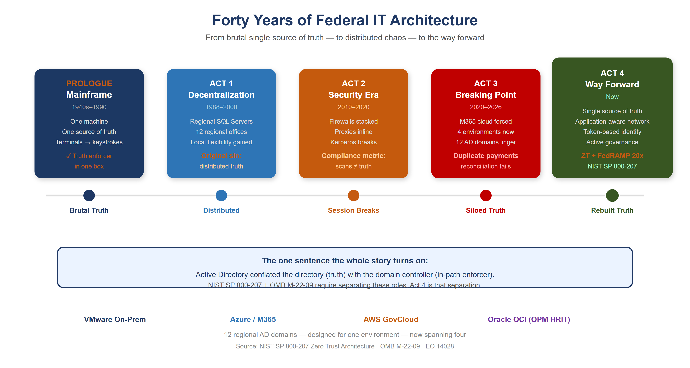{fig-alt="Timeline showing four acts of federal IT architecture evolution. Prologue 1940s-1990: Mainframe, one source of truth, truth enforcer in one box. Act 1 1988-2000: Decentralization, 12 regional offices, original sin of distributed truth. Act 2 2010-2020: Security Era, firewalls stacked, proxies inline, Kerberos breaks, compliance scans not truth. Act 3 2020-2026: Breaking Point, M365 cloud forced, 4 environments now, 12 AD domains linger, duplicate payments. Act 4 Now: Way Forward with NIST SP 800-207 and OMB M-22-09. The one sentence shown: AD conflated directory with domain controller." width="100%"}

# Prologue — The Mainframe Era (1940s–1990s)

{fig-alt="Large IBM-style mainframe computer center-left with glowing SSOT database cylinder inside. Multiple green-screen terminal icons connected via lines. Label 1940s-1990s One Source of Truth. Right side shows what this provided: one version of every record, no regional discrepancies, physical security equals network security, truth and enforcement in one box. Arrow pointing right to the architecture that worked until it did not." width="100%"}

Your agency's entire operation ran on mainframes. IBM systems, mostly. One massive computer in a locked room. Everything happened there: all the data, all the logic, all the state.

Users didn't have computers. They had **terminals** — green screens, keyboards. A terminal was a dumb device that sent keystrokes to the mainframe and received screen refreshes back. Text-based, synchronous, simple.

The model was brutally elegant: **one source of truth.** The mainframe *was* the truth. When you asked "how many people received benefits this month," there was one answer, and it came from one place. No ambiguity. No regional variations. No hidden discrepancies.

Security was implicit. If you weren't sitting at a terminal physically connected to that mainframe room, you couldn't access anything. **The network was the security perimeter.** Control physical access, and you controlled everything.

And crucially: the machine that *held* the truth was the same machine that *enforced* access to it. Truth and enforcement lived in one box. Remember that; it is the seed of everything that follows.

# Act 1 — The Great Decentralization (Late 1980s–2000)

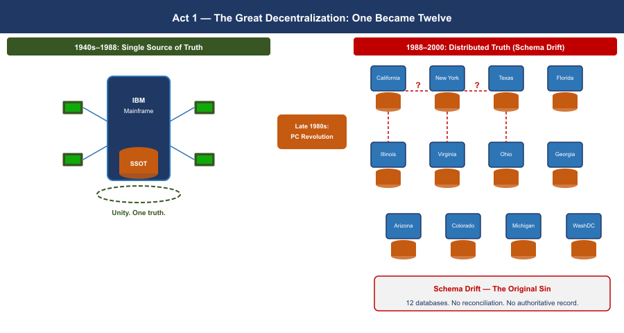{fig-alt="Before and after comparison. Left 1940s-1988: single mainframe with one glowing database, all terminals connected to it, green glow of unity. Arrow Late 1980s PC Revolution. Right 1988-2000: same mainframe broken into 12 small server boxes scattered in circular arrangement labeled California, New York, Texas, Florida, Illinois and others. Each has own database icon. Dashed arrows between servers showing inconsistent sync with question marks. Red Schema drift callout. Label The Original Sin: Distributed Truth." width="100%"}

By the late 1980s, the entire world was rejecting the mainframe model — not because mainframes stopped working, but because the economics broke and the technology changed.

Minicomputers had already proven you didn't need one godlike machine. Then PCs arrived. Networks got faster. The vision became irresistible: put a SQL Server in every region. Put applications in every office. Spread programming expertise to the edges. Let local teams build solutions for their local problems — because they understood those problems better than Washington ever could.

For your agency, this was revolutionary. Twelve regional offices could each have their own database administrators, their own application developers, their own tools tailored to how their states and territories worked.

**But here is where the architecture broke.**

With the mainframe, there was one source of truth. One database. One version of the record. The moment you put SQL Servers in twelve regions, you lost that. Now California had its own database. Massachusetts had its own. New York had its own. And they didn't always talk to each other — or they did, but inconsistently. Regional systems evolved their own schemas, their own business logic, their own definitions of what a "benefit" even meant.

The vision of distributed intelligence was real and good. But it came at a cost: **distributed truth.** And nobody replaced the single source of truth that the mainframe had given you.

That became the original sin — the moment the architecture started to drift. The regional variations that seemed like flexibility in 1993 would calcify into incompatible silos by 2020.

# Act 2 — When Security Ate the Architecture (2010–2020)

{fig-alt="Visual of a request trying to flow from branch office laptop to data center server, passing through five inline security devices each adding delay: Firewall adding 15ms, NAT adding 8ms, IDS inline probe adding 12ms, Proxy and DLP scanner adding 20ms, Compliance scanner adding 25ms. Total clock at right shows 80ms added versus Kerberos 5ms timeout limit. Kerberos ticket shown breaking as cracked icon. Request arrow enters at left, Session broken with red X at bottom. Note: latency kills sessions by exceeding timeouts, security devices designed to break sessions do exactly that." width="100%"}

Around 2010, your agency started consolidating compute. Simultaneously — and this is the critical inflection — **cybersecurity became a board-level imperative.** Not just "have a firewall." Defense-in-depth. Layered security. Multiple inspection points.

**But here is the problem:** the tools chosen to enforce security were fundamentally incompatible with the session-based client-server model your entire infrastructure depended on.

Load balancers became inline proxies. Intrusion detection systems were inserted into the traffic path. Multiple NAT sessions. Firewalls stacked on firewalls. Every packet from a field office to a regional data center had to traverse security devices designed to *break* sessions — to inspect, decrypt, re-encrypt, verify, block.

Active Directory Kerberos tickets have a lifespan. They are bound to a specific session. When a packet gets intercepted, decrypted, re-encrypted, and NATted three times, the session breaks. The Kerberos ticket becomes invalid. The application loses trust in where the request came from.

> **The physics that cannot be negotiated:** Portland to Washington is approximately 4,500 km in a straight line. Actual fiber routing adds roughly 20%, bringing the real fiber distance to approximately 5,400 km. At 200,000 km/second — the speed of light through glass fiber — that distance sets an unavoidable propagation floor of 27 ms one-way, 54 ms round-trip minimum, before any queue delay, security inspection, or application processing. Active Directory authentication expects sub-5 ms round-trip to a domain controller. **No amount of bandwidth changes this. Bandwidth is volume. Latency is distance. You cannot buy your way out of geography.**

## Asymmetric Routing: The Second Session Killer

Latency kills sessions by exceeding protocol timeouts. A second mechanism, equally destructive and entirely independent of latency, operated simultaneously: **asymmetric routing.**

Asymmetric routing occurs when the outbound path of a session and the return path traverse different physical or logical routes through stateful network devices. A stateful firewall maintains a session table keyed on the five-tuple. When a SYN packet arrives, the device creates an entry expecting the SYN-ACK to return through it. When the SYN-ACK returns via a different path, that second device sees a SYN-ACK with no corresponding session entry — it drops it as unsolicited. The TCP three-way handshake never completes.

> **Asymmetric routing vs. latency: independent killers that compound.** Latency kills sessions by exceeding protocol timeouts. Asymmetric routing kills sessions by preventing TCP from completing its three-way handshake at all — even with perfect, sub-millisecond latency on both paths. In environments where both conditions exist simultaneously — the federal standard — they compound.

**How SD-WAN overlay eliminates asymmetric routing:** The SD-WAN overlay tunnel is established between two edge devices as a single logical connection. Inside the tunnel, individual packets may physically traverse any available path. But at the application layer, both directions of every session enter and exit the same SD-WAN edge device. The stateful inspection happens at the tunnel endpoint, which sees both directions. Asymmetric physical routing below the tunnel is structurally removed.

# Act 3 — The Breaking Point (2020–2026)

{fig-alt="Four overlapping environments shown as quadrants: VMware on-premises at left, AWS GovCloud at upper right, Azure and M365 at lower right, Oracle OCI with OPM HRIT at bottom. Identity siloed in twelve Regional AD Domains at center with arrows pointing to all four environments but failing to cross boundaries with red X marks. Field office laptop at lower left shows user stuck between environments. Label: Identity was here, Compute went there. Arrow: The twelve AD domains cannot follow. Color: navy, teal, amber." width="100%"}

Then M365 happened. Microsoft forced the issue. Your agency migrated to Microsoft 365 — Exchange Online, Teams, SharePoint. Suddenly your email and collaboration lived in Azure, managed by Microsoft, unreachable by your session-based authentication model.

And here is the critical moment: the agency still had **twelve regional Active Directory domains.** Still had the OU tree structure designed for when compute lived regionally. Still had MPLS circuits connecting field offices to regional data centers that were increasingly just logical boundaries, not physical anchors.

Now a field office in Portland authenticates to a regional DC physically in Washington. An application running on VMware queries a service in AWS. Email lives in Azure. The session-based contract — the assumption that client and server are talking synchronously over a trusted link — is fracturing across three environments and an upcoming fourth.

> **The hard realization.** The bulk of mission compute still runs on VMware on-premises. Red Hat workloads are moving to AWS GovCloud. Email and collaboration are in Azure. OPM HRIT on Oracle OCI is the next boundary arriving. Identity is still in twelve regional AD domains designed for a world where all four of those environments were the same room. The infrastructure could *do* things but could not *verify* them across that boundary. With program integrity now a national imperative, that is no longer acceptable.

Meanwhile, the regional variations that started in Act 1 had calcified into institutional silos. California's benefit calculation differed from Massachusetts's. Regional databases had evolved incompatible schemas. And because single source of truth had never been restored, **nobody could see the discrepancies.** The fragmentation that made the system agile in 1995 had become the hiding place for systemic error — duplicate payments across states, records that should have been closed years ago, reconciliations nobody could complete.

# The Physics Argument Decision Makers Have Not Heard

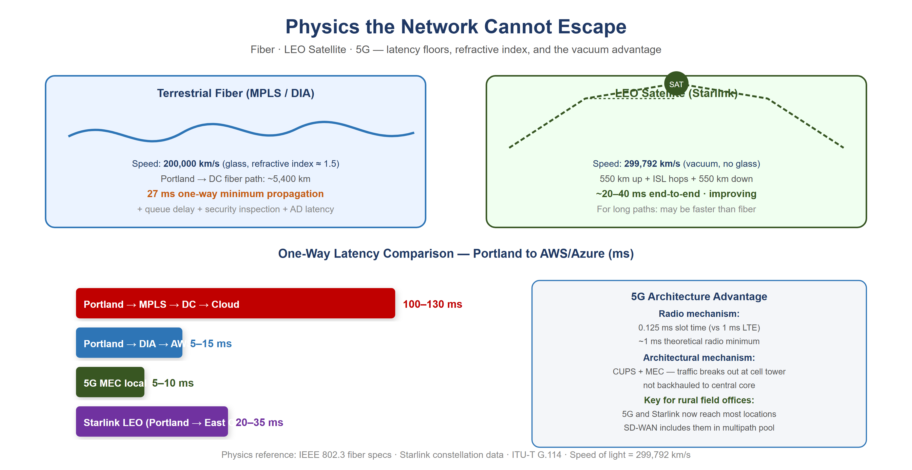{fig-alt="Two panels comparing terrestrial fiber at 200,000 km/s with squiggly path routing, versus LEO satellite at 299,792 km/s in vacuum with direct arc path at 550km altitude. Bar chart shows: Portland via MPLS through DC at 100-130ms one-way, Portland DIA to AWS us-west-2 at 5-15ms, 5G MEC at 5-10ms, Starlink LEO for long haul at 20-35ms. 5G architecture note explains CUPS and MEC local breakout advantage for rural field offices." width="100%"}

When a decision maker hears "the MPLS hairpin is causing latency problems," the response is almost always: "add a Direct Internet Access circuit at the branch." DIA eliminates the geographic hairpin. That improvement is real.

And then leadership will conclude that the network problem is solved. **It is not.**

DIA is a pipe. It is a better-positioned pipe than the MPLS circuit it supplements, but it is still a single, unintelligent pipe with no visibility into what is happening on it, no ability to respond when it degrades, and no way to know whether it is actually the best available path to your destination.

## Why Satellite Latency Is No Longer What You Remember

The satellite internet that federal IT professionals evaluated and rejected for decades was geostationary (GEO) — satellites parked at 35,786 km altitude. The physics are unforgiving: approximately 238 ms of one-way propagation delay. No enterprise application tolerates this gracefully. That ruling does not apply to LEO.

Starlink and similar Low Earth Orbit constellations operate at approximately 550 km altitude. Current practical end-to-end latency: **20–40 ms and improving.** That places LEO satellite in the same competitive range as broadband DIA circuits.

> **The vacuum advantage:** Light travels through optical fiber at approximately 200,000 km/second — two-thirds the speed of light in vacuum, due to the refractive index of glass. Light travels through the vacuum of space at 299,792 km/second. For the same physical path length, a signal through space arrives **50% sooner** than a signal through fiber. This is not a technology gap that better fiber will close. It is physics.

For the longest domestic paths — Pacific Northwest to mid-Atlantic — the terrestrial fiber route may traverse 4,000 km or more of physical cable. The LEO vacuum path traverses 550 km up, geometrically direct inter-satellite laser link hops through space, and 550 km down at propagation speed 50% higher than fiber. **Under the right conditions the satellite path is not a compromise — it is the physics-optimal path.**

## 5G: Lower Latency Through Architecture, Not Just Physics

5G reduces latency through two distinct mechanisms:

**The radio mechanism:** 5G's shorter radio frame duration (0.125 ms slot time versus 1 ms in LTE) reduces the fundamental waiting time. Practical mid-band sub-6 GHz 5G achieves 5–10 ms across the air interface.

**The architectural mechanism:** 5G's Control and User Plane Separation (CUPS) and Multi-access Edge Computing (MEC) allow traffic to break out of the carrier's network locally — at the cell tower or a nearby edge node — rather than backhauling to a central core. This is particularly significant for federal field offices in locations where broadband ISP options are limited.

# What Application-Aware Networking Actually Means

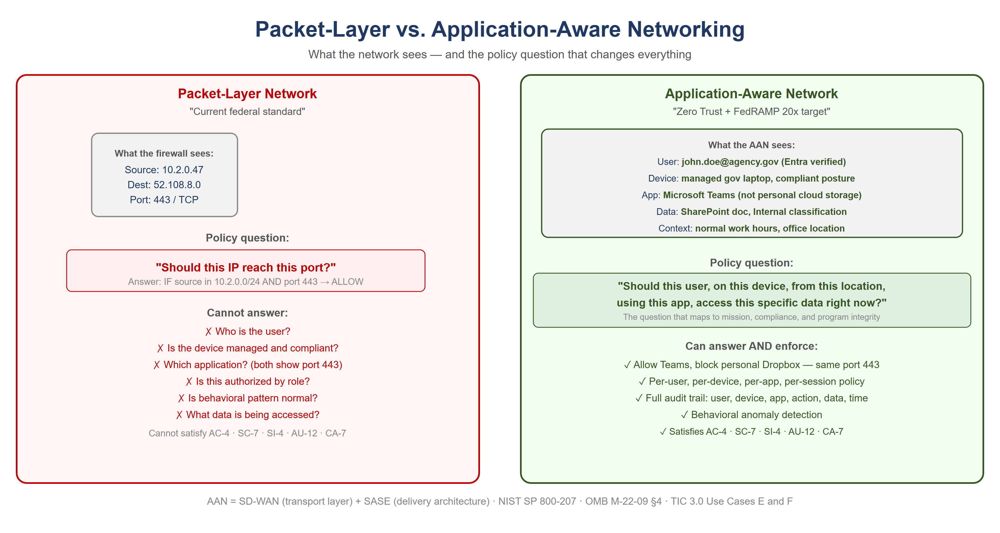{fig-alt="Split comparison. Left panel: Packet-Layer Network shows firewall seeing only Source IP 10.2.0.47, Destination 52.108.8.0, Port 443 TCP. Policy question: should this IP reach this port? Cannot answer who the user is, device compliance, which application, whether authorized by role, behavioral patterns, or what data is accessed. Cannot satisfy AC-4, SC-7, SI-4, AU-12, CA-7. Right panel: Application-Aware Network sees full transaction: user John Doe Entra verified, managed gov laptop compliant, Microsoft Teams not personal cloud storage, SharePoint Internal classification, normal work hours. Policy question: should this user on this device from this location using this app access this data right now? Can satisfy all NIST controls." width="100%"}

The phrase "application-aware networking" appears in policy documents and vendor briefings without ever being explained in plain terms. Here is the plain version.

**Your current network sees a packet.** Specifically, it sees: source IP address, destination IP address, source port, destination port, protocol. It has no idea who sent the packet, what application it belongs to, whether the user is who they claim to be, whether the device is managed and compliant, or whether the data being accessed is the data policy says they should access. It sees a packet. It checks a rule. It allows or denies.

**Application-aware networking sees a transaction.** Specifically, it sees: a specific employee, on a managed government laptop that passed compliance check this morning, running Microsoft Teams, requesting a SharePoint document classified as internal, from an office location that is consistent with their normal work pattern, at a time of day that is expected, to access a file that their role and organizational attributes authorize them to access. The network enforces policy against the full context of the transaction — not against a packet.

> **The policy question that changes everything:** Packet-level enforcement asks: *should this IP address be allowed to reach this port?* Application-aware enforcement asks: *should this user, on this device, from this location, using this application, be allowed to access this specific data right now?* The second question is the one that maps to your mission, your compliance requirements, and your program integrity mandate.

## What SD-WAN Overlay Does With New Transports

The overlay treats 5G and LEO satellite exactly the same way it treats MPLS and broadband DIA: as transports to probe continuously, measure precisely, and steer traffic across based on what is performing best for each application class at each moment.

The agency does not need to decide in advance that Starlink is better than DIA for Teams calls. The overlay makes that determination empirically, in real time, and changes it when conditions change.

# SD-WAN Active-Active Multipath

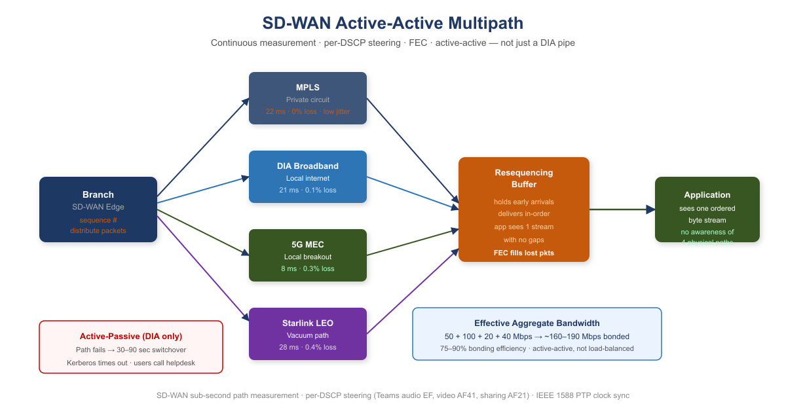{fig-alt="Flow diagram showing Branch SD-WAN Edge distributing packets across four simultaneous paths: MPLS at 22ms 0% loss, DIA Broadband at 21ms 0.1% loss, 5G MEC at 8ms 0.3% loss, Starlink LEO at 28ms 0.4% loss. Packets are distributed with sequence numbers. Resequencing Buffer holds early arrivals and delivers in-order using FEC to fill lost packets. Application sees one ordered byte stream with no awareness of four physical paths. Effective aggregate bandwidth 160-190 Mbps from four paths." width="100%"}

An SD-WAN overlay runs continuous, simultaneous probes on every available transport using sub-second probe intervals. The probes measure three things on each path independently: **latency**, **jitter**, and **packet loss**. When a path degrades, the overlay knows within seconds.

## Forward Error Correction: Recovering Toward the Physics Floor

**Forward Error Correction (FEC)** sends redundant data alongside the primary transmission. The receiver can reconstruct a lost packet from the redundant data without any retransmission. The application experiences only the propagation delay — the physics floor — with no retransmission penalty.

FEC does not make the signal travel faster. It removes the latency tax that lossy paths impose on top of the physics minimum. On a path with consistent packet loss, the benefit scales with loss rate and round-trip time.

## Active-Active vs. Active-Passive: The Failover That Is Not a Failover

Traditional WAN design is **active-passive**: MPLS is the primary circuit, DIA broadband is the standby. During switchover — typically 30–90 seconds — authentication sessions time out. VPN tunnels drop. Users re-authenticate.

**Active-active multipath** carries traffic on all available paths simultaneously, all the time. When a path fails or degrades, the remaining paths absorb its load within milliseconds. The voice session continues from the RTP sequence number where the failed path left off. **The Teams call did not drop. The authentication session did not timeout.**

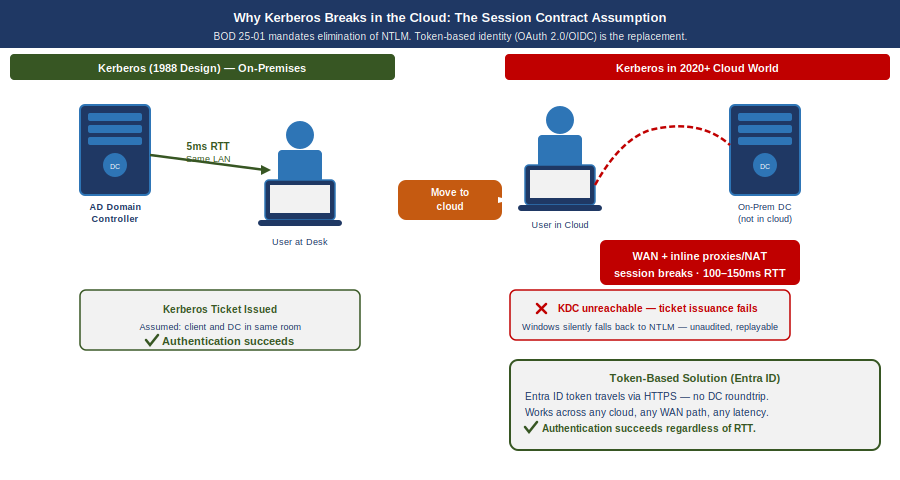{fig-alt="Diagram showing a Kerberos ticket bound to a session. Left path MPLS direct shows ticket valid because path is single consistent route. Right path SD-WAN multi-path shows same packet crossing three different physical paths: primary fiber, backup LTE, and peer DIA. At right the session loses continuity across path switch and Kerberos ticket becomes invalid showing cracked padlock icon. Bottom comparison: MPLS stateful session survives until path failure then breaks hard. SD-WAN active-active retries within 50ms but existing session token is invalidated. Token-based auth survives both. Navy, teal, amber, white background." width="100%"}

> **Why this matters specifically for Kerberos and session-based authentication:** A Kerberos ticket exchange that is mid-flight when a path fails is retransmitted automatically. Under active-passive failover, the client times out after several seconds — this is the "logon takes 45 seconds" symptom field offices report. Under active-active multipath, the request was already distributed across multiple paths. The user experiences a 50 ms pause rather than a 30-second timeout.

## Why "DIA to M365 Will Solve It" Is Half the Answer

| Capability | DIA Circuit Only | SD-WAN Intelligent Overlay |
|---|---|---|
| Eliminates MPLS geographic hairpin to cloud | ✔ Yes | ✔ Yes |
| Visibility into path quality (latency, jitter, loss) | ✘ None | ✔ Continuous, per-transport |
| Responds to path degradation before users notice | ✘ None | ✔ Sub-second reweighting |
| Splits a single conversation across multiple paths simultaneously | ✘ One path only | ✔ Active-active multipath with resequencing |
| Aggregates bandwidth from all transports | ✘ One path only | ✔ Bonded capacity = sum of all paths |
| Routes audio, video, and data streams of one call to different paths | ✘ None | ✔ Per-stream application steering |
| Fails over within milliseconds without dropping sessions | ✘ 30–90 second switchover | ✔ Seamless — all paths already active |
| Uses 5G local breakout when faster than wireline | ✘ None | ✔ Measured and included in multipath pool |
| Uses LEO satellite vacuum path when faster than fiber | ✘ None | ✔ Measured and included in multipath pool |
| Applies FEC to recover toward physics minimum on lossy paths | ✘ None | ✔ Per-transport FEC |
| Provides audit trail of path decisions (TIC 3.0 / AU-12) | ✘ None | ✔ Every decision is a logged event |

## What the Commercial World Figured Out — and When

| Current Federal Practice | When Commercial Moved On | What Replaced It | Why |
|---|---|---|---|
| MPLS for all branch connectivity | 2014–2018 | SD-WAN on broadband + LTE | Cost, flexibility, local breakout |
| Central internet breakout through DC | 2016–2019 | Local internet breakout at branch | Cloud apps do not need to go through DC |
| VPN as primary remote access | 2019–2021 | ZTNA / SASE overlay | Per-app access replaces per-network trust |
| Windows DNS / per-site DNS servers | 2017–2020 | Unified DDI (InfoBlox, BlueCat) | DNS became a security control surface |
| DHCP as invisible per-site utility | 2017–2020 | IPAM as inventory and compliance evidence | Zero Trust requires authoritative device inventory |
| Network-layer firewall as primary security | 2018–2022 | Application-layer enforcement (SASE, ZTNA) | Packets carry no useful identity or intent |
| Session-based application authentication | 2015–2019 | Token-based (OAuth 2.0 / OIDC) | Sessions break across WAN; tokens are stateless |

> **This is not a forecast.** Every item in this table is a completed transition in the commercial sector. The federal government is executing these transitions now, under compliance mandates — Zero Trust Executive Order, TIC 3.0, FedRAMP 20x — that commercial enterprises were not subject to. That makes the federal transition harder, not easier. The path is known. The delay has a cost.

# Why Direct Internet Access Alone Does Not Satisfy NIST Controls

When agencies present DIA as a modernization achievement, they have solved a connectivity problem. They have not solved a compliance problem. DIA is a transit service — a pipe to the internet. It satisfies exactly one federal requirement: it provides network connectivity to internet-hosted services. Every security control governing what traverses that connectivity must be applied by a separate control stack. The pipe itself contributes nothing to compliance.

| NIST Control | What It Requires | What Provides It |
|---|---|---|
| AC-4 Information Flow Enforcement | Application-layer enforcement identifying the destination application, not just the destination IP | CASB in SASE stack |
| SC-7 Boundary Protection | Application-layer inspection; detect C2 on port 443, exfiltration in DNS | SWG / FWaaS in SASE stack |
| SC-8 Transmission Confidentiality and Integrity | Network-layer encryption | SD-WAN IPsec tunnel — DIA alone encrypts nothing |
| SI-3 Malware Protection | Inline malware inspection at appropriate locations | SWG with SSL inspection in SASE stack |
| SI-4 System Monitoring | Application-layer telemetry — user, device, app, data, behavioral pattern | AAN application telemetry |
| AU-2 / AU-12 Audit Events / Audit Record Generation | User Z on device D accessed application A, performed action V on data type C — not just IP flows | Application-layer logging via AAN |
| CA-7 Continuous Monitoring | Per-session: identity verified, device posture, access consistent with policy — machine-readable | AAN and SASE stack |

> **The precise relationship: DIA enables compliance; AAN and SASE achieve it.** DIA provides the connectivity that makes cloud-hosted services reachable without the MPLS hairpin. It is necessary. It is not sufficient. When an agency presents "we have DIA" as a compliance achievement, the correct technical response is: **you have the pipe. Where is the control stack?**

# Act 4 — The Way Forward: Application-Aware Modernization

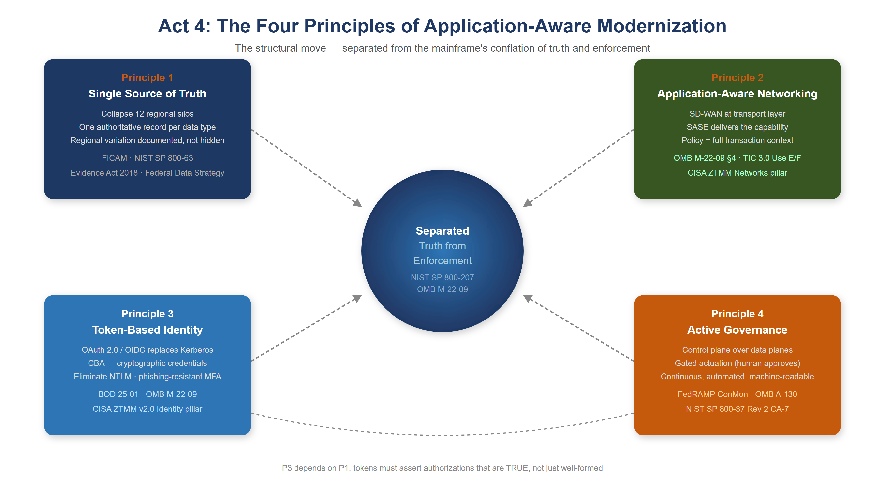{fig-alt="Hub diagram with Separated Truth from Enforcement center (NIST SP 800-207, OMB M-22-09). Four principle boxes: Principle 1 Single Source of Truth showing collapse 12 regional silos, one authoritative record, FICAM and Evidence Act 2018. Principle 2 Application-Aware Networking showing SD-WAN and SASE, OMB M-22-09 and TIC 3.0. Principle 3 Token-Based Identity showing OAuth 2.0 OIDC, CBA, eliminate NTLM, BOD 25-01. Principle 4 Active Governance showing control plane over data planes, gated actuation, FedRAMP ConMon. Arrow shows P3 depends on P1: tokens must assert authorizations that are true." width="100%"}

You can't fix this by patching the old model. You can't bolt Zero Trust onto a Kerberos-in-MPLS architecture. You can't add more proxies. The only way forward is to rebuild the foundation around one structural move and four principles that follow from it.

The structural move is the one sentence this whole story turns on. Active Directory conflated **the directory (truth)** with **the domain controller (the in-path enforcer)**. NIST SP 800-207 and OMB M-22-09 require the modern architecture to keep these separate: the governance layer holds and reconciles authoritative state, while identity providers, enforcement points, and data platforms remain the runtime data planes.

## Principle 1 — Restore a Single Source of Truth

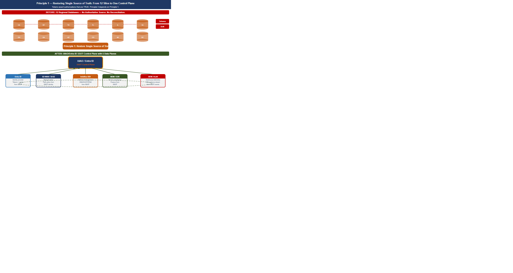{fig-alt="Before panel on left shows twelve siloed regional database cylinders, each with slightly different schema, connected to each other with dotted conflict arrows and question marks. After panel on right shows a single SSOT hub cylinder at center labeled authoritative source, with clean solid arrows to twelve regional endpoints labeled derived and auditable. Evidence Act 2018 badge and Federal Data Strategy badge shown below. Bottom note: regional variation is transparent and traceable to policy, not hidden in schema drift. Navy, teal, amber palette, white background." width="100%"}

Every data type the federal government manages must have **one authoritative source.** Not twelve regional databases with eventual consistency. Not caches that drift. One source, cryptographically verifiable, auditable: you must know where every piece of data came from, who accessed it, when, and why.

For your agency, that means collapsing the twelve regional silos into a unified model — not by erasing regional autonomy, but by making it **transparent.** If California's benefit calculation differs from Massachusetts's, that difference is documented, auditable, and traceable back to policy, not hidden in schema variation.

The **Federal Identity, Credential, and Access Management (FICAM) Architecture** and NIST SP 800-63 require that every governed object carry a complete, authoritative set of identity attributes derived from authoritative sources such as HR systems and device management platforms. The **Evidence Act (2018)** and the **Federal Data Strategy** mandate that those attributes trace back to a single authoritative system of record for each data type, with a documented data lineage from source to decision.

## Principle 2 — Application-Aware Networking and Cybersecurity

You can't enforce security at the network layer anymore. The network is the Internet now. The only way to know whether a transaction is legitimate is to understand what the application is doing: *Is this user authorized to access this data? Is the data being accessed the data policy says they should access? Is the request from a compliant device, from a location that makes sense?*

That is application-aware networking. **NIST SP 800-207's** seven zero trust tenets require exactly this: all communication secured regardless of network location; access determined per-session with least privilege; integrity and behavior monitored continuously. **OMB M-22-09** §4 requires agencies to implement network visibility and traffic inspection that operates at the application layer, not the IP/port layer. **TIC 3.0** Use Cases E and F mandate application-layer visibility as a condition of compliant remote and branch connectivity.

**Application-Aware Networking framework alignment:**

- **SD-WAN is AAN at the transport layer.** SD-WAN achieves application awareness through DPI or FQDN/signature-based identification, then applies per-application path selection dynamically based on real-time path quality measurement. SD-WAN alone does not enforce access control based on user identity or device posture. That requires SASE.
- **SASE is the delivery architecture that completes AAN.** SASE converges SD-WAN with cloud-delivered security services — CASB, FWaaS, ZTNA, SWG — at the network edge. It brings user identity (from the IdP via SAML/OIDC), device posture (from MDM/EDR), application identity (from DPI), and data classification (from CASB) into a single enforcement point distributed geographically near the user.
- **CISA ZTMM maps AAN to the Networks pillar maturity progression.** Traditional: all decisions at IP/port layer, no application visibility. Initial: basic application identification. Advanced: application-aware routing and enforcement — the FedRAMP ConMon standard posture. Optimal: fully dynamic, identity-driven, application-aware policy with continuous behavioral monitoring.

## Principle 3 — Move From Session-Based to Token-Based Identity

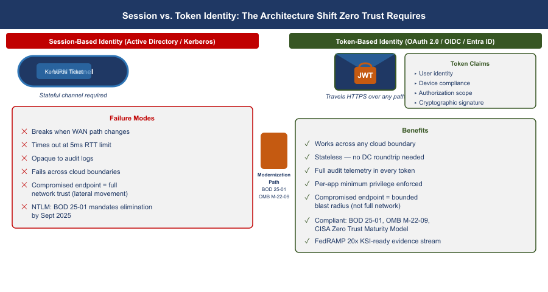{fig-alt="Split comparison diagram. Left panel Session-Based AD Kerberos shows field office laptop sending Kerberos ticket to domain controller in regional DC, DC calling back to validate, session maintained as stateful link, red X when VPN or network drops. Right panel Token-Based Entra ID shows laptop requesting JWT access token from Entra ID cloud, receiving signed token, presenting token directly to app server at AWS GovCloud; server verifies signature without calling back, green checkmark. Badges: BOD 25-01 SCuBA, OMB M-22-09, CISA ZTMM Identity Optimal. Caption: the token carries proof; the session assumed trust." width="100%"}

Active Directory Kerberos assumes clients and servers are in the same room. Tokens assume they are strangers on the Internet.

A token is a cryptographically signed assertion: *this user is who they claim to be; this device is compliant; this request is authorized; timestamp now; signature here.* The server doesn't need to trust the network or call back to a domain controller — it just verifies the signature.

Entra ID, Conditional Access, and device-compliance policies are the token-based equivalents of what AD used to do. **BOD 25-01** mandates SCuBA secure configuration baselines for Microsoft 365 that require modern authentication throughout. **OMB M-22-09** requires phishing-resistant MFA government-wide. The **CISA Zero Trust Maturity Model v2.0** Identity pillar at Advanced and Optimal levels requires Certificate-Based Authentication (CBA) as the primary mechanism. NTLM has no zero-trust story: every NTLM event is opaque to telemetry, invisible to audit logs, and must be eliminated.

> **Tokens only work if the authoritative identity model is correct.** If you don't know what a user is actually authorized to do — if that is still encoded in twelve regional OU trees with no authoritative HR-derived source — tokens won't save you. You will just be signing broken authorizations very efficiently. **That is why Principle 3 depends on Principle 1: the token must assert an authorization that is *true* rather than merely *well-formed.***

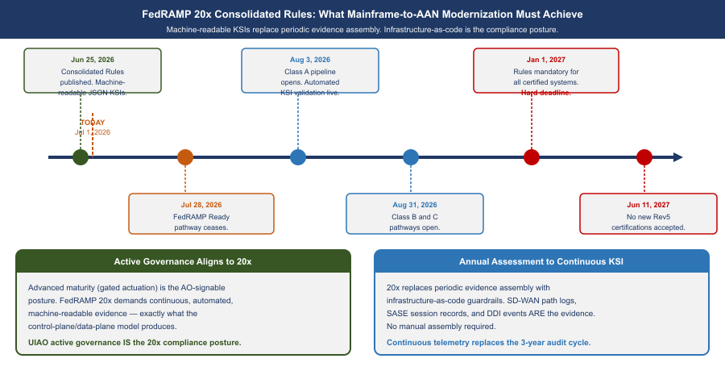{fig-alt="Timeline with two eras separated by a vertical line labeled Jan 1 2027. Left era labeled FedRAMP Rev 5 shows stack: Annual Assessment binder, manual evidence assembly, auditor review meeting, ATO letter at end of 12 months. Right era labeled FedRAMP 20x shows stack: KSI JSON records emitted continuously, automated drift detection, machine-readable compliance report, no manual assembly. Key dates shown as milestones along top rail: Jun 25 2026 Consolidated Rules published, Aug 3 2026 Class A opens, Aug 31 2026 Class B plus C open, Jul 28 2026 FedRAMP Ready ceases, Jun 11 2027 new Rev5 certs cease. Active Governance control plane icon shown feeding KSI records to FedRAMP 20x pipeline. Navy, teal, amber, white background." width="100%"}

## FedRAMP 20x Consolidated Rules — What Modernization Must Achieve {#sec-fedramp-20x-mainframe}

FedRAMP published its **Consolidated Rules for 2026** on June 25, 2026, establishing the most significant shift in federal cloud authorization since FedRAMP's inception. The core change: **periodic evidence assembly is replaced by continuously-verified, machine-readable Key Security Indicators (KSIs) enforced by infrastructure-as-code.**

For agencies on the mainframe-to-AAN modernization path, this is not a compliance burden — it is the confirmation that the architectural direction is correct.

| FedRAMP 20x Requirement | What the Modern Architecture Provides |
|---|---|
| Continuous, automated KSI verification | SD-WAN probes every transport every second; SASE logs every session; DDI logs every DNS query |
| Machine-readable evidence format (JSON) | SD-WAN telemetry APIs, SIEM structured exports, InfoBlox WAPI — all native JSON |
| Infrastructure-as-code guardrails | Terraform for DDI, IaC for SASE policy, GitOps for network config — guardrails enforced at commit |
| No manual evidence assembly for assessments | The control plane's continuous observation IS the evidence — not a report prepared for an assessor |
| Automated KSI: all DNS encrypted or integrity-protected | DNSSEC on all zones; DoH/DoT on Grid Members |
| Automated KSI: no CIDR overlap between environments | Terraform InfoBlox provider blocks overlapping allocation at request time |
| Automated KSI: every workload has machine identity | SCEP/EST auto-enrollment triggered at IP provisioning |

: FedRAMP 20x Consolidated Rules Alignment {.striped .hover}

**Key dates all agencies must track:**

- **July 28, 2026:** FedRAMP Ready submissions cease — no new Ready pathway submissions accepted
- **August 3, 2026:** Class A pipeline opens
- **August 31, 2026:** Class B and C pipelines open
- **January 1, 2027:** Consolidated Rules mandatory for all certified systems — all ConMon evidence must meet machine-readable KSI format
- **June 11, 2027:** No new Rev5 certifications accepted

::: {.callout-important}
**The precise alignment:** FedRAMP 20x's demand for "continuous, automated, machine-readable evidence" maps exactly to what the Active Governance control plane produces. A governance substrate that holds desired state, observes actual state, classifies drift, and reconciles toward intent — while generating structured JSON records of every observation and action — IS a FedRAMP 20x-compliant ConMon implementation. The architectural transition IS the compliance posture.
:::

## Principle 4 — Govern Actively: The Control Plane Over the Data Plane

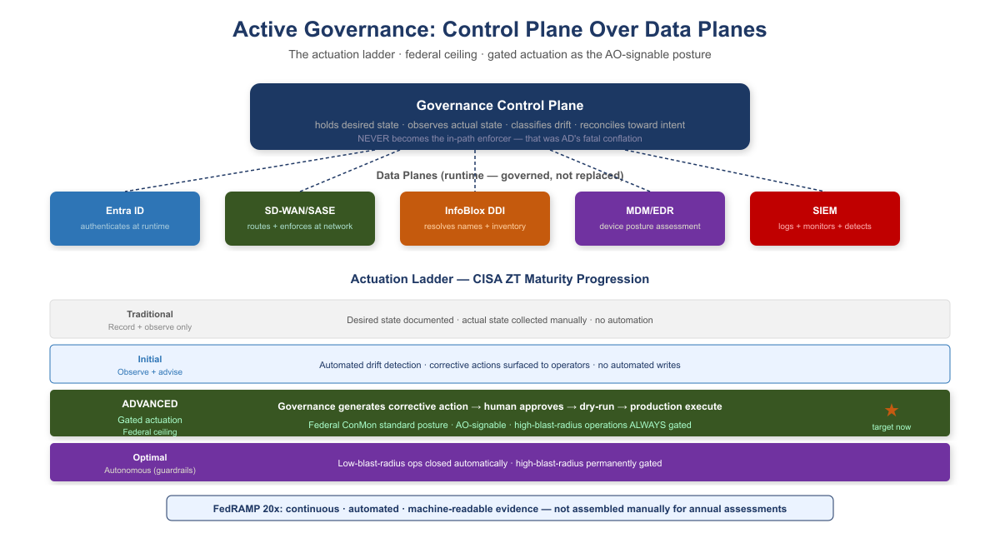{fig-alt="Governance Control Plane at top showing it holds desired state, observes actual state, classifies drift, reconciles toward intent, and NEVER becomes the in-path enforcer. Five data planes below: Entra ID, SD-WAN/SASE, InfoBlox DDI, MDM/EDR, SIEM. Actuation ladder shows four levels: Traditional record and observe only, Initial observe and advise, Advanced gated actuation marked as federal ceiling and AO-signable with star, Optimal autonomous within guardrails. FedRAMP 20x requirement: continuous automated machine-readable evidence." width="100%"}

A governance substrate that embodies these principles is not a passive registry that records desired state and reports divergence. It is an **active reconciliation control plane**: it holds desired state, observes actual state, classifies drift, and reconciles toward intent — while identity providers, network fabrics, endpoint management platforms, DDI systems, and SIEM platforms remain the **data planes** that authenticate, route, resolve, and store at runtime.

| CISA ZT Stage | Governance Posture | What This Means in Practice |
|---|---|---|
| Traditional | Record and observe only | Desired state documented; actual state collected manually. No automated detection or correction. |
| Initial | Observe and advise | Automated detection of drift from policy. Corrective actions generated and surfaced to operators. No automated writes. |
| **Advanced** | **Gated actuation** | **Governance framework generates a corrective action; a human approves before it executes. Dry-run required before production. Federal ConMon standard posture.** |
| Optimal | Autonomous within guardrails | Governance framework closes the loop without human intervention for enumerated low-blast-radius operation classes. High-blast-radius operations remain gated permanently. |

> **What this means for authorizing officials:** FedRAMP continuous monitoring and OMB M-22-09 expect agencies to operate at Advanced maturity as the production standard. Advanced maturity — gated actuation, where the governance framework generates a corrective action and a human approves before it executes — is the posture an Authorizing Official can sign. High-blast-radius operations — tenant-wide role changes, network policy updates that touch thousands of endpoints — remain gated permanently regardless of overall maturity level.

# Federal Framework Alignment

The following table maps each concept in this narrative to the federal mandate, standard, or policy that requires or validates it.

| Concept / Narrative Claim | Federal Mandate | Standard / Reference |
|---|---|---|
| Separate truth from runtime enforcement | EO 14028 (May 2021), OMB M-22-09 | NIST SP 800-207 §2 (Zero Trust tenets) |
| Single source of truth for identity and data | Evidence Act (2018), Federal Data Strategy | NIST SP 800-53 Rev 5 CM-8, SI-12 |
| Authoritative identity attributes from HR / authoritative sources | FICAM Architecture, OMB M-22-09 | NIST SP 800-63 Digital Identity Guidelines |
| Application-aware networking; per-transaction policy enforcement | OMB M-22-09 §4, EO 14028 | NIST SP 800-207, TIC 3.0 Use Cases E and F |
| Phishing-resistant MFA / Certificate-Based Authentication | BOD 25-01, OMB M-22-09 | CISA ZTMM v2.0 Identity pillar (Advanced/Optimal) |
| Eliminate NTLM; move to token-based identity | BOD 25-01 (M365 SCuBA baselines) | CISA ZTMM v2.0 Identity pillar |
| Device compliance as input to access decisions | OMB M-22-09 §3 | CISA ZTMM v2.0 Devices pillar |
| SD-WAN local internet breakout; eliminate MPLS hairpin | TIC 3.0 (Trusted Internet Connections) | CISA ZTMM v2.0 Networks pillar |
| SASE / ZTNA as access model replacing VPN | OMB M-22-09 §4, TIC 3.0 | NIST SP 800-207, CISA ZTMM Networks pillar |
| Unified DNS as security control (DNSSEC, RPZ, threat blocking) | FedRAMP Moderate SC-20/21 | NIST SP 800-53 Rev 5 SC-20, SC-21 |
| IP address inventory as compliance evidence (CM-8) | FedRAMP Moderate | NIST SP 800-53 Rev 5 CM-8 |
| Audit provenance: every transaction traceable to authorized source | FedRAMP Moderate AU-2/12 | NIST SP 800-53 Rev 5 AU-2, AU-12 |
| Continuous monitoring; automated KSI enforcement | FedRAMP 20x Consolidated Rules (Jun 25, 2026); OMB Circular A-130 | NIST SP 800-37 Rev 2 CA-7; FedRAMP 20x KSIs; mandatory Jan 1, 2027 |
| Gated actuation as standard governance posture (Advanced maturity) | FedRAMP ConMon, OMB M-22-09 | CISA ZTMM v2.0 Automation and Orchestration pillar |
| Machine-readable KSI evidence; no manual evidence assembly | FedRAMP 20x Consolidated Rules — Class A/B/C pipelines open Aug 3/31, 2026 | FedRAMP 20x JSON evidence format; GitHub-published structured rules |

# Appendix A — Cisco Catalyst SD-WAN and Microsoft Intelligent Network Routing: Federal Implementation Reference {#appendix-cisco-inr}

::: {.callout-note}
**Scope: FedRAMP Moderate civilian agencies using Microsoft 365 GCC.** This appendix is scoped to **FedRAMP Moderate** — civilian federal agencies operating M365 GCC tenants. GCC High, DoD IL4/IL5, and FedRAMP High authorizations are out of scope. Book 02's main narrative describes SD-WAN in platform-neutral terms. This appendix addresses the specific combination that most FedRAMP Moderate agencies encounter: **Cisco Catalyst SD-WAN** as the branch transport platform and **Microsoft Intelligent Network Routing (INR)** as the M365 traffic optimization layer.
:::

## A.1 — Cisco Catalyst SD-WAN: What It Is and What It Is Not

Cisco Catalyst SD-WAN (formerly the Viptela platform, acquired 2017 and rebranded 2023) is Cisco's enterprise SD-WAN solution. In federal contexts it is typically deployed as one of two configurations: **on-premises managed** (SD-WAN Manager self-hosted in agency data center or GovCloud) or **cloud-delivered** (Cisco SD-WAN Cloud SaaS, which carries its own FedRAMP authorization surface).

The platform has four functional planes:

| Plane | Component | What It Does |
|---|---|---|
| **Management** | SD-WAN Manager (vManage) | Policy authoring, template deployment, telemetry aggregation, audit logging — the authoritative governance surface for all WAN configuration |
| **Control** | SD-WAN Controller (vSmart) | Distributes routing policy and reachability information to all WAN Edge devices; OMP (Overlay Management Protocol) equivalent of BGP for the SD-WAN fabric |
| **Orchestration** | SD-WAN Validator (vBond) | Zero-touch provisioning; authenticates WAN Edge devices before they join the fabric; single network-facing IP that field offices reach to onboard |
| **Data** | WAN Edge (cEdge / ISR / ASR) | The physical or virtual device at the branch; applies policy, measures paths, performs DPI, steers traffic — the only plane users' packets traverse |

: Cisco Catalyst SD-WAN Functional Planes {.striped .hover}

**The FedRAMP boundary implication:** Only SD-WAN Manager (the management plane) is a cloud-hosted SaaS component when using the cloud-delivered model. The data plane (cEdge at the branch) is hardware deployed within the agency boundary. The control and orchestration planes operate at the agency-managed FedRAMP boundary or in GovCloud. This boundary partitioning is the first question an Authorizing Official must document.

::: {.callout-important}
**What Cisco Catalyst SD-WAN does not provide by itself.** Like all SD-WAN platforms, Cisco Catalyst SD-WAN does not provide user identity awareness, device posture enforcement, or data classification. It provides application identification (via DPI signatures and FQDN matching), path quality measurement, and application-steered routing. The SASE layer — Cisco Umbrella, or a third-party CASB/SWG — provides the identity and data planes. The two must be present together for the full AAN control stack.
:::

## A.2 — Microsoft Intelligent Network Routing: What It Is

**Microsoft Intelligent Network Routing (INR)** is not a product name — it is the operational model through which Microsoft routes M365 traffic across its global private backbone. Understanding it matters for Cisco Catalyst SD-WAN deployments because it changes the answer to a specific question federal IT architects regularly get wrong: *where should agency SD-WAN terminate M365 traffic?*

The model works as follows:

**Microsoft's global private backbone.** Microsoft operates one of the largest private wide-area networks on Earth — approximately 200,000 km of dedicated fiber connecting Azure regions, edge PoPs, and peering sites globally. When an agency user's Teams call reaches a Microsoft network edge node, it travels the remainder of its journey entirely on Microsoft's private backbone — not the public internet. Microsoft's backbone applies active routing intelligence: if the usual path experiences congestion or latency, traffic is rerouted on the private backbone automatically, in real time, without any action from the agency.

**The front door matters more than the destination.** The single most important routing decision in a Cisco Catalyst SD-WAN + M365 deployment is: *which Microsoft edge node does agency traffic enter through?* Traffic that enters the Microsoft network at the nearest geographically optimal PoP travels the rest of its path on Microsoft's private backbone. Traffic that backhauled to a central agency DC first — and then exits from that DC's internet connection — enters a geographically suboptimal PoP and forfeits the backbone optimization.

> **The physics in one sentence:** A Teams call from a Portland field office that breaks out to the internet locally and reaches Microsoft's Seattle edge PoP will have lower latency than the same call backhauled to a DC-area internet connection and entering Microsoft's Ashburn PoP — even though the Ashburn PoP is geographically closer to Microsoft's Teams infrastructure.

**Microsoft 365 Network Connectivity Principles.** Microsoft has published formal connectivity principles for M365 that SD-WAN deployments must follow to activate INR optimization. The three that drive Cisco Catalyst SD-WAN configuration are:

1. **Local network egress for M365 traffic.** Branch offices must break out M365 traffic directly to the internet — not haul it to the agency DC first. In Cisco Catalyst SD-WAN, this is implemented as a **Cloud OnRamp for SaaS** policy that matches M365 IP/domain prefixes and steers them to a DIA or 5G path with direct internet access.

2. **Avoid network hairpins.** Traffic must not flow through an agency proxy or security stack that introduces geographic detours. FedRAMP-compliant proxy inspection must occur at or very near the local breakout point, not at a central scrubbing center. In Cisco Catalyst SD-WAN, this is typically handled by integrating Cisco Umbrella at the branch or in the SASE PoP geographically nearest the breakout point.

3. **Differentiate M365 traffic categories.** Microsoft publishes three endpoint categories — **Optimize** (Teams media, SharePoint Online), **Allow** (general M365), and **Default** (non-M365). The **Optimize** category carries the strictest routing requirements: no inspection, no proxy, no detour. Cisco Catalyst SD-WAN DPI signatures for the Optimize category steer that traffic directly to the best available local path with maximum priority.

## A.3 — The Integration: How Cisco Catalyst SD-WAN Activates Microsoft INR

The integration is implemented through **Cisco SD-WAN Cloud OnRamp for SaaS**, a native feature of Cisco Catalyst SD-WAN that monitors the quality of multiple paths to SaaS destinations and routes each application to its best-performing path in real time.

**How it works in practice:**

1. **Cloud OnRamp probe architecture.** From each branch WAN Edge, Cloud OnRamp sends periodic HTTP probes to Microsoft's M365 service endpoints using each available transport simultaneously — MPLS, DIA broadband, 5G, LEO satellite. The probes measure round-trip latency and loss to the Microsoft front door specifically (not a synthetic endpoint).

2. **Real-time gateway selection.** For each branch, Cloud OnRamp maintains a per-transport quality score for each M365 service. When a Teams call begins, the WAN Edge steers it to whichever transport is currently delivering the lowest latency to the Microsoft Optimize endpoint — this path selection is re-evaluated continuously, not at session start only.

3. **Microsoft Peering Service (MAPS).** For agencies with MPLS circuits from carriers that participate in **Microsoft Azure Peering Service (MAPS)**, Cisco Catalyst SD-WAN can route M365-bound traffic to the carrier's MAPS hand-off point. The carrier then delivers the traffic directly to the nearest Microsoft edge over a private BGP-peered connection — bypassing the public internet entirely while maintaining the local breakout benefit. This is the highest-fidelity INR activation path for agencies with qualified MPLS carriers.

4. **Azure Virtual WAN integration.** For agencies using Azure for other workloads, Cisco Catalyst SD-WAN can peer directly with **Azure Virtual WAN hubs**. In this architecture, M365 traffic flows from the branch WAN Edge through an IPsec tunnel to the Azure Virtual WAN hub in the geographically nearest Azure region, then onto Microsoft's backbone to the M365 service. This is the preferred architecture for agencies already using Azure Government or GCC High — it unifies the WAN topology.

| Integration Path | What Agency Has | What INR Quality Level It Achieves |
|---|---|---|
| Cloud OnRamp + DIA local breakout | DIA circuit at branch; any ISP | Good — reaches nearest Microsoft front door; public internet hand-off |
| Cloud OnRamp + 5G local breakout | 5G radio at branch | Good to excellent — low latency to local cell tower; ISP hand-off to Microsoft |
| Cloud OnRamp + MPLS (non-MAPS carrier) | MPLS circuit; carrier not MAPS-enrolled | Moderate — MPLS reach may introduce geographic suboptimality |
| Cloud OnRamp + MAPS carrier | MPLS circuit; MAPS-enrolled carrier | Excellent — private BGP hand-off to Microsoft backbone |
| Cisco SD-WAN + Azure Virtual WAN (commercial) | Azure commercial presence; FedRAMP Moderate | Excellent — traffic on Microsoft backbone from Azure VWan hub |
| Cisco SD-WAN + Azure Virtual WAN + MAPS | Both Azure presence and MAPS carrier | Optimal — dual private backbone integration; maximum redundancy |

: Cisco Catalyst SD-WAN + Microsoft INR Integration Paths — FedRAMP Moderate {.striped .hover}

## A.4 — FedRAMP-Specific Considerations

The Cisco Catalyst SD-WAN + Microsoft INR architecture introduces three categories of FedRAMP-specific compliance questions that do not arise in the platform-neutral SD-WAN narrative.

### A.4.1 — Boundary Documentation

FedRAMP requires that the **authorization boundary** be precisely documented: every component that processes, transmits, or stores federal data must be identified, and components outside the boundary must be documented as external services with appropriate data flow diagrams.

In a Cisco Catalyst SD-WAN + Microsoft INR deployment, the boundary documentation must account for:

| Component | Inside or Outside FedRAMP Boundary | Documentation Required |
|---|---|---|
| Branch WAN Edge (cEdge) | **Inside** | Component inventory; CM-8 entry |
| SD-WAN Manager (self-hosted GovCloud) | **Inside** | Full FedRAMP control inheritance |
| SD-WAN Manager (Cisco cloud SaaS) | **Outside** — external service | Interconnection Security Agreement (ISA); verify Cisco SD-WAN Manager FedRAMP authorization status |
| SD-WAN Controller (vSmart) | **Inside** | Component inventory |
| Microsoft M365 GCC | **Outside** — FedRAMP-authorized external service | Microsoft CSP ISA; FedRAMP Moderate package reference (M365 GCC) |
| Azure Virtual WAN hub (commercial) | **Outside** — FedRAMP-authorized external service | Azure FedRAMP Moderate package reference; data flow to/from |
| MAPS carrier hand-off point | **Outside** — carrier service | Service agreement; no federal data at rest at carrier POP |
| Cloud OnRamp probes to M365 | Telemetry only; no federal data in probe | Document as monitoring telemetry; not a data flow |

: Cisco Catalyst SD-WAN + INR — FedRAMP Boundary Component Classification {.striped .hover}

::: {.callout-important}
**The most common boundary documentation error.** Agencies document the WAN Edge hardware and stop. They do not document the SD-WAN management plane (SD-WAN Manager) as a separate component with its own authorization surface. If SD-WAN Manager is cloud-hosted by Cisco, it must either be covered by a FedRAMP-authorized Cisco offering or excluded from the boundary with an ISA documenting what data crosses to it — typically configuration and telemetry, not federal mission data. Check Cisco's current FedRAMP authorization status with the FedRAMP Marketplace before designing the boundary.
:::

### A.4.2 — TIC 3.0 Alignment

TIC 3.0 Use Cases E (Branch/Remote Office Internet Access) and F (Remote Users) govern how SD-WAN local breakout interacts with federal security requirements. The Cisco Catalyst SD-WAN + Microsoft INR local breakout architecture is **aligned with TIC 3.0 Use Case E** — but only if the following conditions are met:

1. **TICAP or MSSP security stack is present at or near the local breakout point.** TIC 3.0 allows local breakout (eliminating the backhaul through a TICAP) for agencies that implement a **branch-based security stack** that provides equivalent inspection — typically Cisco Umbrella (DNS security, CASB) collocated with the branch SD-WAN Edge or via a nearby SASE PoP. Cisco Catalyst SD-WAN natively integrates with Umbrella via the SD-WAN Manager Umbrella connector; this integration must be in the architecture or TIC 3.0 compliance is not met.

2. **Optimize-category M365 traffic is the only traffic exempted from proxy inspection.** Microsoft's INR guidance for the Optimize category states that proxy inspection degrades Teams media quality and is not required — Microsoft's own TLS encryption is the transmission confidentiality control. TIC 3.0 permits this exemption **only for the Optimize category** and only when the traffic goes exclusively to Microsoft-published IP/domain prefixes. All other traffic must pass through the inspection stack.

3. **Audit telemetry from the local breakout is forwarded to the agency SIEM.** TIC 3.0 requires that the security posture of local breakout paths be continuously observable. In Cisco Catalyst SD-WAN, the path decision log (which transport was selected for which flow, at what quality) and the Umbrella DNS log must be exported to Sentinel or equivalent. This is the AU-12 evidence contract for the SD-WAN layer.

### A.4.3 — NIST Control Satisfaction

| NIST SP 800-53 Rev 5 Control | What It Requires | How Cisco Catalyst SD-WAN + INR Satisfies It |
|---|---|---|
| **SC-8** Transmission Confidentiality and Integrity | Encrypt all WAN traffic | IPsec BFD tunnels between all cEdge WAN Edges — including DIA and 5G paths; Cisco's DTLS-over-UDP for data-plane encryption; cipher suite is configurable to FIPS 140-3 validated AES-256-GCM |
| **SC-20 / SC-21** Secure DNS | DNS responses integrity-protected | Cisco Umbrella (DNS-over-HTTPS / DNS-over-TLS) on branch; SD-WAN Manager integrates Umbrella DNS policy — all branch DNS queries resolve through Umbrella, not local recursive resolvers |
| **AC-4** Information Flow Enforcement | Application-layer flow control | DPI-based application identification classifies each flow by application ID (Teams, SharePoint, O365, etc.); Cloud OnRamp policy applies per-application path selection; CASB in Umbrella applies per-application data classification and DLP |
| **AU-2 / AU-12** Audit Events / Audit Record Generation | Every flow traceable to source, destination, application, policy decision | SD-WAN Manager retains full flow telemetry: WAN Edge ID, source/destination IP, application ID, path selected, policy applied, timestamp; exported via syslog or streaming telemetry to SIEM |
| **CA-7** Continuous Monitoring | Real-time observation of security posture | Cloud OnRamp path-quality metrics (per-transport latency, jitter, loss) exported continuously; Umbrella DNS security events; deviation from desired path policy triggers alert in SD-WAN Manager |
| **SI-4** System Monitoring | Detect anomalies in communications | Cisco SD-WAN integrates with Cisco Cyber Vision and Cisco XDR for behavioral anomaly detection; Umbrella cloud-delivered security provides CASB and threat intelligence integration |
| **CM-7** Least Functionality | Disable unused services on branch devices | cEdge configuration templates in SD-WAN Manager enforce device hardening baseline (no unused services, no local management plane access); template drift is detected and alerted by SD-WAN Manager |
| **CM-2** Baseline Configuration | Maintain authorized baseline | SD-WAN Manager configuration templates ARE the authoritative baseline — every device must conform to the template; configuration drift triggers an automated alert and corrective action |
| **IR-4** Incident Handling | Contain and isolate during incident | SD-WAN Manager policy can be pushed to isolate a branch or device within seconds — change the data-plane policy to block all traffic except OOB management; no physical access to branch required |

: Cisco Catalyst SD-WAN + Microsoft INR — NIST SP 800-53 Rev 5 Control Satisfaction {.striped .hover}

## A.5 — FedRAMP 20x KSI Evidence Contracts

The following table maps the AAN evidence layer to FedRAMP 20x KSI themes for the Cisco Catalyst SD-WAN + Microsoft INR configuration.

| FedRAMP 20x KSI Theme | CR26 Control | What Cisco Catalyst SD-WAN Produces | Evidence Format |
|---|---|---|---|
| **KSI-CNA** (Cloud Native Architecture) | KSI-CNA-EIS | Cloud OnRamp SaaS policy defines authorized M365 egress paths; deviation from policy is a logged event | SD-WAN Manager audit log (JSON) |
| **KSI-MLA** (Monitoring, Logging, Alerting) | KSI-MLA-OSM | Per-flow telemetry: every WAN Edge flow with application ID, path selected, policy applied, timestamp | Streaming telemetry to SIEM (structured JSON or syslog) |
| **KSI-MLA** | KSI-MLA-EVC | SD-WAN Manager alert correlation: path quality degradation + flow reroute event = correlated security event | Cisco XDR or SIEM correlation rule |
| **KSI-SVC** (Service Configuration) | KSI-SVC-VRI | cEdge device configuration must match SD-WAN Manager template; any drift is detected and logged | Configuration compliance report (SD-WAN Manager REST API export) |
| **KSI-CMT** (Change Management) | KSI-CMT-LMC | Every policy change in SD-WAN Manager is a timestamped audit log entry: who changed what, when, from what prior state | SD-WAN Manager change audit log (JSON) |
| **KSI-CMT** | KSI-CMT-VTD | Policy template validation runs in dry-run mode before commit; template is version-controlled in Git | SD-WAN Manager template commit log + Git SHA reference |

: Cisco Catalyst SD-WAN + Microsoft INR — FedRAMP 20x KSI Evidence Contracts {.striped .hover}

::: {.callout-note}
**The AAN slot binding for this appendix.** The evidence contracts in the table above are satisfied by AAN slot 03 (network control plane), which binds to Book 02 (SD-WAN/SASE/UC) in the Conformance Adapter. The Cisco Catalyst SD-WAN + Microsoft INR configuration is a specific implementation of the generic SD-WAN evidence described in slot 03. No additional slot binding is required — the slot-03 controls (KSI-CNA, KSI-MLA, KSI-SVC, KSI-CMT) are already satisfied when the platform-specific configuration in this appendix is in place.
:::

## A.6 — Implementation Sequence for a Greenfield FedRAMP Moderate Deployment

The following sequence reflects what a Cisco Catalyst SD-WAN + Microsoft INR deployment looks like in a FedRAMP Moderate civilian environment, from authorization to production.

**Step 1 — Boundary documentation.** Classify every SD-WAN component against the FedRAMP Moderate boundary table in §A.4.1. Determine whether SD-WAN Manager will be self-hosted or cloud-delivered (Cisco SaaS); verify that the cloud-delivered option holds a current FedRAMP Moderate authorization on the FedRAMP Marketplace before including it in the authorization boundary. Draft ISAs for all external service connections (Microsoft M365 GCC, Azure VWan if used).

**Step 2 — Baseline template development.** Build cEdge configuration templates in SD-WAN Manager for each branch archetype (small office, large office, high-availability site). Templates should enforce: FIPS mode, no local management plane, Umbrella DNS integration, minimum cipher suite (AES-256-GCM), NTP synchronized to agency time sources, SNMP disabled in favor of streaming telemetry.

**Step 3 — Cloud OnRamp policy for M365.** Configure Cloud OnRamp for SaaS using Microsoft's published Optimize and Allow category endpoint lists (GCC or GCC High). Validate that Teams media (Optimize category) is steered to the best-measured DIA/5G path, not through a proxy. Configure the fallback policy for when all local paths degrade below threshold — fail to the MPLS circuit with minimal additional latency rather than dropping sessions.

**Step 4 — Umbrella DNS integration.** Activate the SD-WAN Manager + Umbrella integration. Verify all branch DNS queries resolve through Umbrella and do not fall back to local resolvers. Configure Umbrella DNS policy to block known-malicious domains, apply CASB policy for M365 tenant restriction (preventing personal tenant use on government devices).

**Step 5 — SIEM telemetry wiring.** Configure SD-WAN Manager streaming telemetry export to the agency SIEM (Sentinel or equivalent). Verify receipt of: flow event records, policy change audit log, path quality metrics, device compliance state. Confirm AU-12 evidence is being generated for every flow.

**Step 6 — FedRAMP 20x KSI evidence validation.** Using the evidence contracts in §A.5, verify that SIEM receives the required structured events for each KSI. Confirm the evidence passes the format and completeness requirements of the `uiao oscal bundle` assessment results generator.

::: {.callout-note}
**This appendix does not substitute for Cisco professional services or a system integrator.** The implementation sequence above is a decision-maker-level orientation, not an engineering runbook. Every agency deployment requires site surveys, carrier qualification (MAPS enrollment), and Cisco SD-WAN Manager template development that must be executed by certified Cisco Catalyst SD-WAN engineers. What this appendix provides is the compliance framing and boundary documentation structure that should govern that engagement from the start — not the configuration commands.
:::
