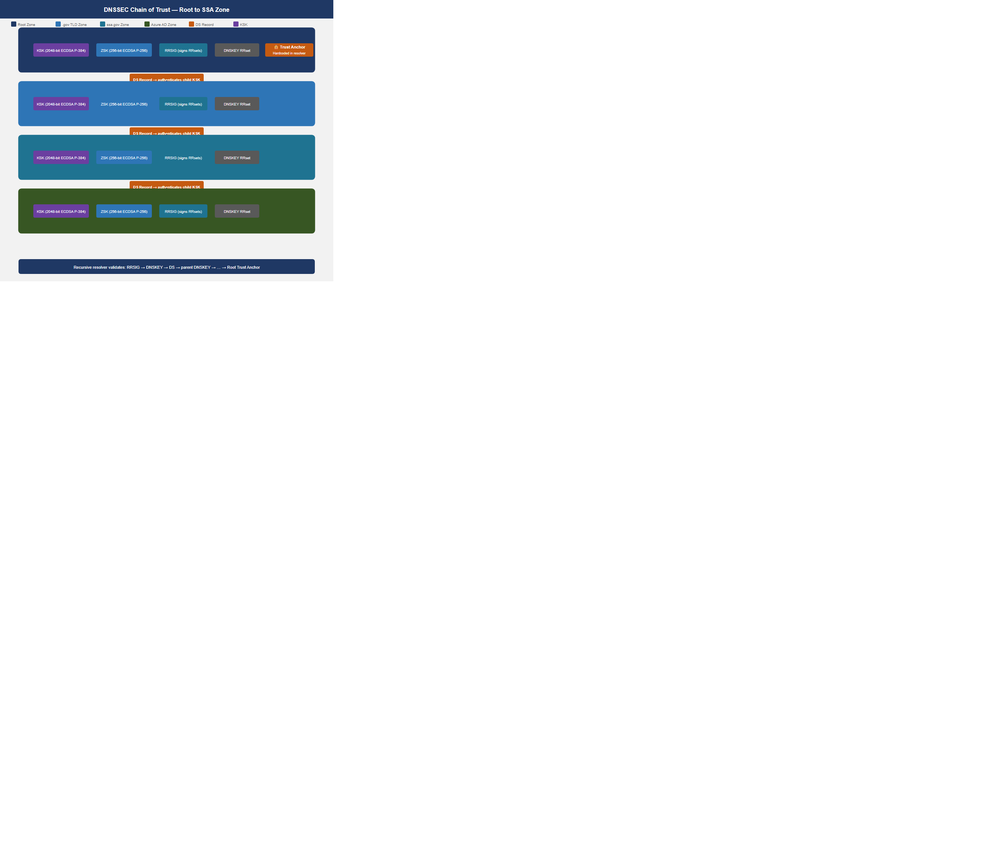
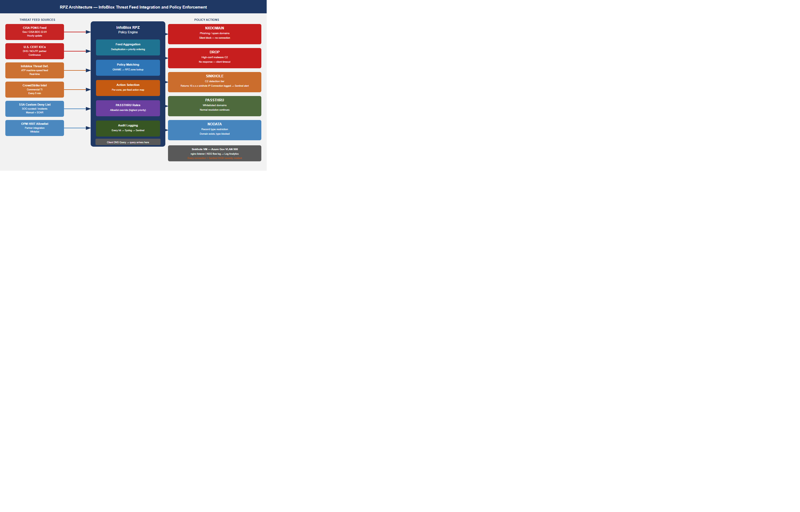
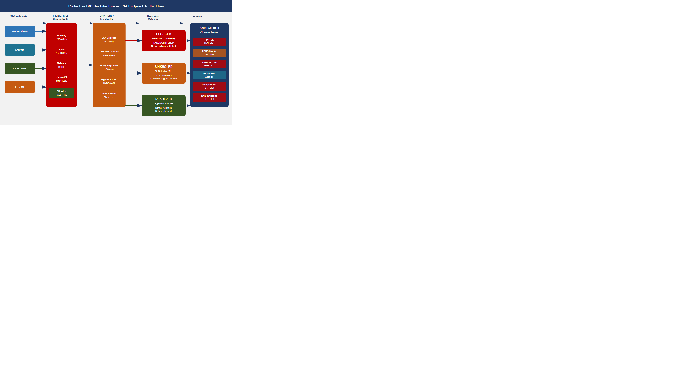
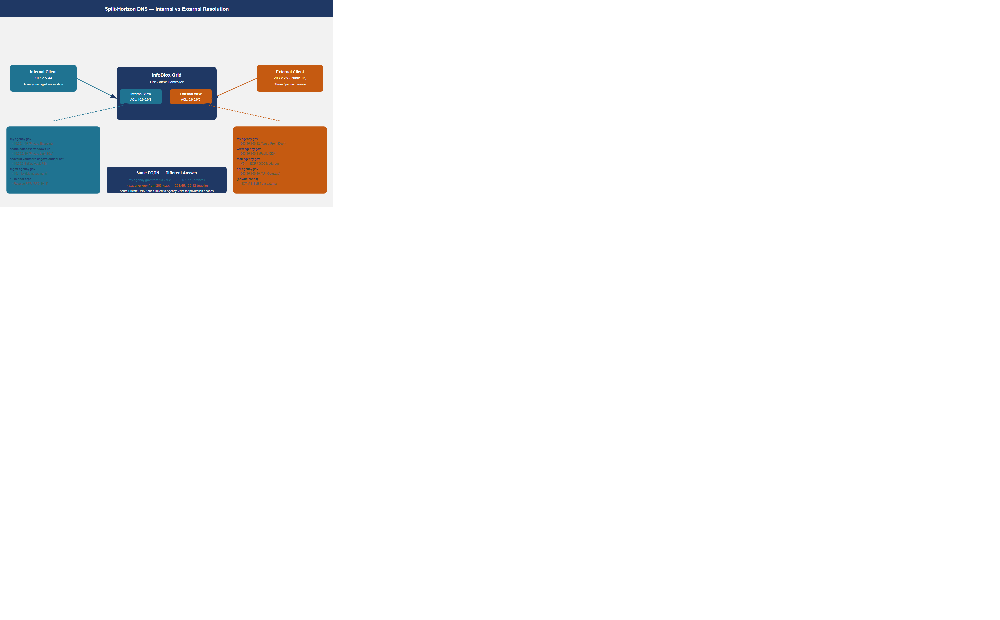
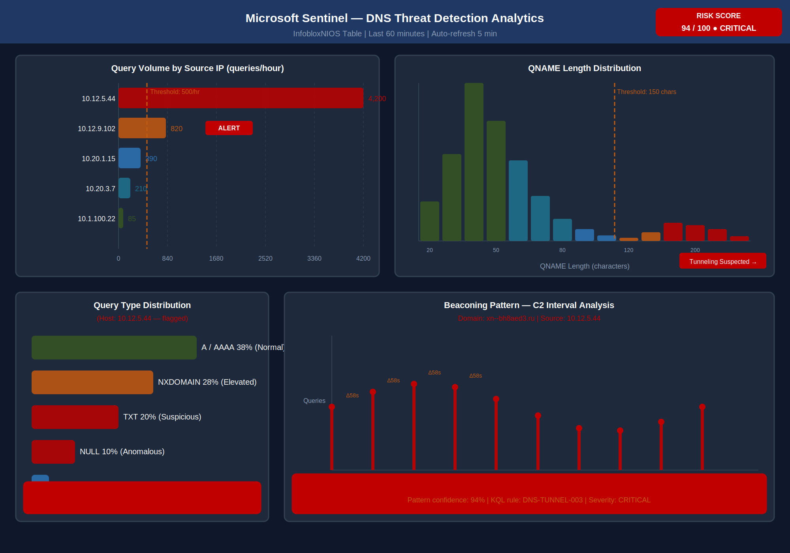

::: {.fouo-banner}
INTERNAL — NOT FOR PUBLIC DISTRIBUTION
:::

::: {.callout-important}
**Series Context** — This is Part 04 of the 27-part Federal Application-Aware Networking series for SSA GCC Moderate (FedRAMP). Part 01 deployed InfoBlox DDI and established the unified DNS/DHCP/IPAM control plane. Part 02 hardened namespace trust and certificate lifecycle. Part 03 enforced device identity at the network port via 802.1X NAC. **Part 04 hardens the DNS protocol layer itself.** DNS is the universal dependency: every downstream control — NAC (Part 03), certificate enrollment (Part 02), ZTNA (Part 06) — can be subverted by DNS spoofing if the DNS layer is unauthenticated. Parts 05–06 extend into SD-WAN and Zero Trust Network Access. Parts 11–13 address SQL Server authentication. Parts 14–16 cover PAM, vulnerability management, and secrets management.
:::

---

## Executive Summary {.unnumbered}

::: {.exec-summary}

DNS is simultaneously the most critical and most exploited protocol in federal networks. Every TLS session begins with a DNS resolution. Every certificate validation begins with a DNS lookup. Every cloud workload communicates via DNS. And DNS operates, by default, over an unauthenticated, plaintext UDP channel that has not fundamentally changed since RFC 1034 (1987).

For SSA GCC Moderate, the DNS attack surface is broad: the agency resolves names across four environments (VMware on-premises, Azure Government, AWS GovCloud, OCI), serves citizens over public DNS, and relies on DNS for every internal service — LDAP, Kerberos, Exchange Online, SharePoint, Teams, and SAP. A single spoofed DNS response can redirect an administrator's browser to a credential-harvesting page, redirect a Kerberos KDC lookup to an attacker-controlled server, or redirect certificate enrollment requests to an untrusted CA — all while the user sees a valid-looking URL.

**This document closes the DNS security gap across four mechanisms:**

**1. DNSSEC (SC-20, SC-21, SC-22).** Cryptographic authentication of DNS responses using a chain of digital signatures from the DNS root through .gov TLD to every SSA zone. Responses that cannot be verified against the chain of trust are rejected at the recursive resolver. DNSSEC eliminates DNS cache poisoning, Kaminsky-style attacks, and BGP hijacking of DNS zones.

**2. Response Policy Zones (SI-3, CM-7).** InfoBlox RPZ implements DNS-layer threat enforcement: queries for known-malicious domains are overridden with NXDOMAIN, DROP, or sinkhole responses before the client ever receives a usable address. RPZ threat feeds — CISA, commercial intelligence, and SSA-custom lists — update automatically. A malware-infected endpoint attempting to contact its C2 infrastructure receives no DNS resolution and is detected in Sentinel.

**3. Protective DNS (SC-21, SI-4(25)).** All SSA endpoint DNS traffic is routed through a PDNS service that adds a second AI-powered threat-intelligence layer above RPZ: domain generation algorithm (DGA) detection, lookalike domain scoring, newly registered domain inspection, and passive DNS analysis. CISA provides PDNS as a no-cost service to federal civilian agencies; Infoblox Threat Defense provides the commercial-grade supplemental layer.

**4. DNS Logging and Detection (AU-12, SI-4(25)).** Every DNS query resolved by the InfoBlox grid is logged, shipped to Azure Log Analytics, and analyzed by Microsoft Sentinel analytics rules that detect DNS tunneling, DGA beaconing, and data exfiltration over DNS. DNS telemetry closes a critical visibility gap: SIEM enrichment from DNS logs reveals the who, what, and when of every lateral movement attempt that crossed a DNS boundary.

Together these four mechanisms satisfy NIST SP 800-53 Rev 5 controls SC-20, SC-21, SC-22, SI-3, SI-4(25), AU-12, and CM-7, and produce machine-readable KSI evidence for FedRAMP 20x KSI-CMT-VTD and KSI-CMT-LMC.

:::

---

## The DNS Attack Surface — Why DNS Security Is Non-Negotiable

### DNS as the Universal Attack Vector

DNS is the prerequisite for every network communication. Before a browser opens a TLS connection, it resolves a hostname. Before Kerberos issues a ticket, it resolves `_kerberos._tcp.realm`. Before an endpoint checks in to Intune, it resolves `enrollment.manage.microsoft.com`. This universality makes DNS the highest-leverage attack surface in any network — a single successful DNS interception can subvert every protocol layered above it.

The major DNS attack categories for federal networks are:

| Attack Class | Mechanism | Federal Impact | Closed By |
|---|---|---|---|
| **Cache poisoning** | Inject forged A/AAAA records into resolver cache | Redirect admin UI, phishing | DNSSEC, Source Port Rand. |
| **DNS spoofing (on-path)** | MITM between resolver and authoritative | Intercept any resolution | DNSSEC, DoT |
| **DNS tunneling** | Encode data in TXT/NULL query subdomains | Exfiltrate data, C2 channel | RPZ, Sentinel KQL |
| **C2 via DNS** | Malware uses DNS for command-and-control | Dwell time, lateral movement | RPZ sinkholes, PDNS |
| **DGA** | Malware generates algorithm-derived domains | Evade static blocklists | PDNS AI scoring, Sentinel |
| **Zone hijacking** | Compromise authoritative zone delegation | Redirect all traffic for a domain | DNSSEC, registry locks |
| **BGP hijacking of DNS** | Reroute DNS traffic at the routing layer | Intercept resolution globally | DNSSEC RRSIG validation |
| **Lookalike / typosquat** | Domains visually similar to legitimate targets | Phishing, credential theft | PDNS lookalike scoring |

: DNS attack surface for federal environments {.striped .hover}

### The DNS Security Stack

The defense-in-depth approach in this document addresses all eight attack classes through layered controls that operate at different points in the DNS query lifecycle:

1. **DNSSEC** — authenticates the response data itself (the record is signed by the authoritative zone owner)
2. **RPZ** — blocks known-bad domains before resolution is returned to the client
3. **DoT/DoH** — encrypts the resolver-to-client channel to prevent on-path interception
4. **Sinkholes** — redirect C2 domains to a logging endpoint for detection
5. **PDNS** — AI-assisted reputation scoring for unknown domains not yet on blocklists
6. **Split-horizon** — ensures internal names are never exposed to external resolvers
7. **DNS logging pipeline** — feeds the SIEM for anomaly detection and forensics

---

## DNSSEC — Cryptographic Authentication of DNS Data

DNSSEC (RFC 4033, 4034, 4035) adds a public-key signature layer to DNS. Every record set (RRset) in a signed zone is signed with the zone's private Zone Signing Key (ZSK). The ZSK public key is published in the zone as a DNSKEY record, which is in turn authenticated by the Key Signing Key (KSK). The KSK is linked to the parent zone via a Delegation Signer (DS) record — creating a chain of trust from the DNS root down to every signed leaf zone.

### Key Hierarchy: ZSK and KSK

Two key types serve distinct roles:

**Zone Signing Key (ZSK)**
- Signs all RRsets in the zone (A, AAAA, MX, CNAME, etc.)
- Shorter lifetime: 90 days recommended for .gov zones (CISA DHS Binding Operational Directive 18-01)
- Smaller key size acceptable: 1024-bit RSA or ECDSA P-256 is standard
- Rollover is automated by InfoBlox DNSSEC key management; no manual intervention required
- Pre-publication rollover method: new ZSK published before old ZSK expires; both are active during overlap period

**Key Signing Key (KSK)**
- Signs only the DNSKEY RRset (the set of ZSK and KSK public keys published in the zone)
- Longer lifetime: 1 year recommended; more conservative 2-year cycles acceptable for stable zones
- Larger key: 2048-bit RSA or ECDSA P-384
- Rollover requires coordination with parent zone (DS record update at .gov registry)
- Double-signature rollover method: new KSK added to the zone alongside old KSK; parent DS updated; old KSK removed after TTL propagation

### Zone Signing and DS Records

When InfoBlox signs an SSA zone, the signing pipeline produces:

1. **DNSKEY records** — the ZSK and KSK public keys are published in the zone apex
2. **RRSIG records** — each RRset is accompanied by a signature computed over the RRset and signed with the ZSK
3. **NSEC/NSEC3 records** — authenticated denial of existence; NSEC3 prevents zone enumeration by hashing owner names
4. **DS record (in parent zone)** — a hash of the zone's KSK DNSKEY, published in the parent zone (.gov TLD) to establish the delegation link

The DS record is the cryptographic bridge between parent and child zones. When a recursive resolver validates a response for `ssa.gov`, it:

1. Fetches the DNSKEY records for `ssa.gov`
2. Verifies the DNSKEY RRset is signed with the KSK (RRSIG check)
3. Computes the hash of the KSK and compares to the DS record in `.gov`
4. Fetches the DNSKEY records for `.gov`, verifies the DS is signed by the `.gov` ZSK
5. Repeats up the chain to the DNS root, whose trust anchor is hardcoded in the resolver

A response that cannot be validated at any step in the chain returns SERVFAIL — the resolver refuses to return an unvalidatable answer.

{#fig-dns01 fig-alt="Vertical chain-of-trust diagram with four levels. Level 1 (root .): KSK signs DNSKEY, ZSK signs all RRsets, trust anchor hardcoded in resolvers. Level 2 (.gov TLD): KSK authenticated by DS record in root, ZSK signs .gov RRsets. Level 3 (ssa.gov): KSK authenticated by DS record in .gov, ZSK signs ssa.gov RRsets. Level 4 (ssagov.onmicrosoft.com): ZSK signs Azure AD DNS zone. Color coding: navy for root, blue for .gov, teal for ssa.gov, green for Azure zone. Arrows show DS record links between levels." width="100%"}

### Trust Anchor Distribution

The root zone trust anchor (the root KSK public key) is distributed via:

- **IANA ITAR (Internet Assigned Numbers Authority Trust Anchor Repository)** — the authoritative source
- **RFC 5011 automated rollover** — resolvers that implement RFC 5011 detect root KSK rollovers automatically via the trust anchor revocation mechanism
- **InfoBlox Grid configuration** — the root trust anchor is pre-loaded in InfoBlox's DNSSEC validation configuration; SSA operations teams verify the trust anchor fingerprint against the IANA ITAR after each root KSK rollover (last rollover: October 2018; next expected: IANA discretion)

::: {.callout-important}
**SC-20 Control Closure:** DNSSEC zone signing on all SSA-authoritative zones satisfies SC-20 — the authoritative name/address resolution service uses cryptographic mechanisms to authenticate the source and integrity of responses. InfoBlox provides continuous DNSSEC signing without manual intervention; KSK/ZSK lifecycle events generate Sentinel alerts requiring security team acknowledgment within the SSA change management SLA.
:::

### DNSSEC Validation at the Recursive Resolver

InfoBlox recursive resolvers in the SSA Grid perform full DNSSEC validation (DNSSEC OK bit set, AD flag validation) for all queries from internal clients. Configuration requirements:

```
# InfoBlox Grid DNSSEC Validation — critical settings
dnssec-validation auto;          # Use built-in root trust anchor + RFC 5011
dnssec-enable yes;               # Enable DNSSEC processing
dnssec-lookaside no;             # DLV is deprecated (RFC 8749); disable
max-cache-size 256M;             # Sufficient for DNSSEC-augmented cache
```

For zones where a parent zone has not yet deployed DNSSEC (relevant for some legacy `onmicrosoft.com` sub-delegations), InfoBlox can be configured with a **negative trust anchor (NTA)** that temporarily suspends DNSSEC validation for a specific zone while a fix is coordinated. NTAs are logged and must be reviewed by the SSA security team within 24 hours; they expire automatically after 24 hours.

::: {.callout-important}
**SC-21 Control Closure:** InfoBlox recursive resolver DNSSEC validation with `dnssec-validation auto` satisfies SC-21 — the recursive/caching name resolution service validates authenticated responses by checking the chain of trust. The InfoBlox FedRAMP CSO (FR2017257053) covers this configuration.
:::

---

## Response Policy Zones — DNS-Layer Threat Enforcement

Response Policy Zones (RPZ, RFC 8600) allow a recursive resolver to override DNS responses based on policy rules. When a client queries for a domain that matches an RPZ policy, the resolver substitutes a policy-defined response — NXDOMAIN (domain doesn't exist), DROP (no response at all), PASSTHRU (bypass all other RPZ rules), or a local A record pointing to a sinkhole — instead of forwarding the query to the authoritative server.

RPZ operates below the application layer: the client never makes a TCP connection to the malicious domain because the DNS resolution itself returns a policy-enforced response. This makes RPZ more effective than IP-based blocking for threat feeds because domain infrastructure rotates rapidly across IP addresses — but the domain name remains constant.

### RPZ Policy Actions

| Action | DNS Response | Use Case | Detection Value |
|---|---|---|---|
| **NXDOMAIN** | Domain does not exist | Block phishing, spam, adware | Low — silent block |
| **NODATA** | Domain exists, no records | Block specific record types | Medium |
| **DROP** | No response (timeout) | Block C2, malware callbacks | Medium — client retry visible |
| **Local A (sinkhole)** | Returns sinkhole IP | Detect and log malware callbacks | **High** — connection attempt logged |
| **PASSTHRU** | Normal resolution | Whitelist override | Administrative |
| **CNAME → sinkhole** | Redirect via CNAME | Log + block with context | **High** |

: RPZ policy actions available in InfoBlox {.striped .hover}

For C2 blocking, the **sinkhole** pattern provides the highest detection value: the malware callback attempt succeeds at the DNS layer (the infected endpoint gets an IP address) but that IP is the SSA sinkhole server, which logs the connection, timestamps it, and alerts Sentinel. The infected endpoint is identified and isolated before it can reach the actual C2 infrastructure.

### Threat Feed Integration

InfoBlox supports three categories of RPZ threat feed:

**Category A — CISA and Government Sources**
- CISA Protective DNS feed (PDNS blocklist, updated hourly)
- U.S. CERT Known Bad Domain list
- FBI's Internet Crime Complaint Center (IC3) DNS indicators
- NCIJTF (National Cyber Investigative Joint Task Force) feeds via CISA relay

**Category B — Commercial Threat Intelligence**
- Infoblox Threat Defense ATP feed (automated, machine-speed update)
- CrowdStrike Falcon Intelligence DNS feed
- Recorded Future DNS risk rules
- VirusTotal passive DNS integration

**Category C — SSA Custom Intelligence**
- Manually curated SSA deny list (legacy domains from prior incident investigations)
- OPM HRIT partner domain allowlist (prevents PDNS false positives on OPM integration traffic)
- Azure Government IP range feed converted to reverse PTR policy rules
- Custom entries from SSA SOC playbooks (Sentinel SOAR automated feed updates)

{#fig-dns02 fig-alt="Architecture diagram with three layers. Top layer: threat feed sources in three columns — CISA/Government feeds (CISA PDNS, US-CERT, FBI IC3), Commercial Intelligence feeds (Infoblox Threat Defense, CrowdStrike, Recorded Future), and SSA Custom feeds (deny list, OPM allowlist, SOC playbooks). Middle layer: InfoBlox RPZ Policy Engine with four action paths — NXDOMAIN for phishing/spam, DROP for high-confidence malware, Sinkhole IP for C2 detection, PASSTHRU for whitelisted domains. Bottom layer: client query flow showing a query arriving, matching RPZ policy, and receiving a policy response before upstream resolution." width="100%"}

### DNS Sinkholes for C2 Detection

A DNS sinkhole is a server (typically a lightweight HTTP/HTTPS listener) that accepts all connections directed to it by RPZ policy. Every connection is logged with source IP, destination domain, query type, timestamp, and client VLAN. This log is the highest-confidence malware indicator available in SSA's environment: no legitimate software intentionally contacts a domain that RPZ has classified as C2 infrastructure.

Sinkhole deployment for SSA:

- **Sinkhole IP:** A dedicated Azure Government VM (10.x.x.x RFC 1918, isolated VLAN 900) running a minimal nginx listener
- **TLS certificate:** A self-signed certificate for the sinkhole IP; malware callback attempts that perform certificate validation will fail — but the DNS-layer log still records the attempt
- **Logging:** All TCP SYN packets to the sinkhole VM are logged via Azure NSG flow logs → Log Analytics → Sentinel incident queue
- **RPZ sinkhole rule:** All Infoblox Threat Defense ATP feed domains with confidence ≥ 85 receive a sinkhole A record rather than NXDOMAIN; this converts detections into incidents

::: {.callout-tip}
**Operational Insight:** RPZ NXDOMAIN for a known-bad domain is effective prevention, but it produces no Sentinel alert and creates no investigation trail. The sinkhole pattern converts every C2 callback attempt into a high-fidelity Sentinel incident with full context (affected endpoint IP, domain queried, time). The small operational cost of maintaining the sinkhole VM yields disproportionate detection value — particularly for detecting endpoints that are compromised but not yet exhibiting other indicators.
:::

::: {.callout-important}
**SI-3 Control Closure:** RPZ threat feed enforcement with automatic sinkhole routing satisfies SI-3 — malicious code protection mechanisms that detect, quarantine, and block malicious code (here: DNS-encoded malware C2 and command delivery). The InfoBlox Threat Defense ATP feed provides the threat signature database; RPZ is the enforcement mechanism; Sentinel is the alert and quarantine initiation platform.
:::

---

## DNS over TLS and DNS over HTTPS

DNS has historically operated over unencrypted UDP/TCP port 53. On-path attackers (including malicious insiders and compromised network devices) can observe all DNS queries, even if DNSSEC validates the response integrity. DNS over TLS (DoT, RFC 7858) and DNS over HTTPS (DoH, RFC 8484) encrypt the resolver-to-client channel.

### DNS over TLS (DoT) — Port 853

DoT wraps DNS messages in a TLS session on TCP port 853. InfoBlox Grid members present a TLS server certificate (issued by the SSA Internal CA from Part 02) to connecting clients. Clients that validate the certificate against the SSA CA trust store know they are communicating with a legitimate SSA resolver, not a rogue resolver injected by an attacker.

InfoBlox DoT configuration for SSA:

- **TLS certificate:** Issued by SSA Intermediate CA (from Part 02 PKI), SAN = `resolver01.mgmt.ssa.gov`, `resolver02.mgmt.ssa.gov`
- **Protocol version:** TLS 1.3 required; TLS 1.2 permitted for legacy clients during transition
- **Cipher suites:** AES-256-GCM-SHA384, CHACHA20-POLY1305-SHA256 (FIPS 140-2 approved)
- **Client configuration:** Intune DNS profile pushed to all managed endpoints specifying DoT resolvers and requiring certificate validation
- **Fallback policy:** DoT failure does NOT fall back to plaintext DNS; clients that cannot establish DoT receive no DNS service and are flagged in Sentinel

### DNS over HTTPS (DoH) — Policy for Internal Resolvers

DoH is a design choice that creates a policy conflict in enterprise environments: when endpoints perform DoH to public resolvers (Cloudflare 1.1.1.1, Google 8.8.8.8), they bypass the enterprise resolver entirely — including RPZ threat enforcement, DNSSEC validation, DNS logging, and split-horizon resolution. The result is an enterprise DNS policy void.

**SSA DoH policy:**

| Scenario | Policy | Mechanism |
|---|---|---|
| Managed endpoints → SSA internal resolver | **Permitted** (DoH to SSA resolver is encouraged) | Intune DNS profile specifies DoH server URL |
| Managed endpoints → public DoH (Cloudflare, Google) | **Blocked** | Azure Firewall FQDN deny rule + Sentinel alert on port-443 traffic to 1.1.1.1/8.8.8.8 |
| Unmanaged devices / BYOD | **Blocked by default** | No route to public resolvers from SSA-managed VLANs |
| Browser-native DoH (Chrome, Firefox) | **Disabled via GPO/Intune policy** | `chrome://policy` DoH mode set to `off`; Firefox `doh-rollout.disable-heuristics` set to `true` |

The SSA internal DoH endpoint (https://resolver.ssa.gov/dns-query) is published on the internal network only; it is not accessible from the public internet. This allows managed endpoints to benefit from DoH's encrypted channel while retaining full RPZ enforcement and logging.

---

## Protective DNS

Protective DNS (PDNS) adds a second AI-assisted threat intelligence layer above RPZ. Where RPZ blocks domains that appear on threat feeds (known-bad), PDNS blocks domains that are *likely bad* based on behavioral signals — domains that have not yet appeared on any feed but exhibit characteristics of malware infrastructure (newly registered, high entropy, lookalike of a legitimate domain, registered in a high-risk TLD).

### CISA Protective DNS Service

CISA provides a no-cost PDNS service to all federal civilian agencies under BDO 22-01. The CISA PDNS service:

- Routes all DNS queries from enrolled federal endpoints through CISA-managed resolvers
- Applies CISA's threat intelligence feed (updated machine-speed from CISA's own OSINT and government sharing partners)
- Blocks queries for domains in categories: malware, phishing, C2, lookalike, DGA, newly-registered-suspicious
- Provides a daily summary report to the agency SOC and to CISA's Federal Civilian Monitoring operations
- Requires no on-premises infrastructure from SSA beyond a DNS forwarding configuration

CISA PDNS integration for SSA:

- Primary PDNS resolver: `198.xx.xx.1` (CISA-allocated, GCC routing confirmed)
- Secondary PDNS resolver: `198.xx.xx.2` (CISA secondary for availability)
- SSA InfoBlox forwards queries for public Internet domains to CISA PDNS resolvers
- Internal and split-horizon zones are resolved locally; only external query traffic traverses CISA PDNS
- CISA PDNS block events are reported back to SSA's Log Analytics workspace via CISA's PDNS API

### Infoblox Threat Defense (Commercial Supplemental Layer)

Infoblox Threat Defense provides three capabilities that supplement CISA PDNS:

**1. DNS Early Detection and Response (EDAR)**
Machine-learning models trained on passive DNS data from 10+ trillion DNS queries per year detect behavioral anomalies — DGA patterns, fast-flux infrastructure, newly-registered domains with high risk scores — at the query level, before any blocklist entry exists.

**2. Lookalike Domain Detection**
Compares every queried domain against a database of 250,000+ high-value targets (financial institutions, federal agencies, cloud providers) using Levenshtein distance, homoglyph analysis, and TLD substitution. A query for `ssa-gov.com` triggers an alert even if the domain has no threat feed entry.

**3. DNS Threat Analytics**
Passive DNS behavioral analysis identifies devices exhibiting DGA patterns (high query volume for non-existent domains with random-appearing names), DNS tunneling indicators (TXT record abuse, unusually large DNS payloads), and data exfiltration (regular beaconing intervals to the same base domain over time).

{#fig-dns04 fig-alt="Flow diagram with four horizontal stages. Stage 1: SSA endpoints (workstations, servers, cloud workloads) send DNS queries. Stage 2: InfoBlox RPZ layer applies threat feed enforcement — known-bad domains are blocked here. Stage 3: CISA PDNS / Infoblox Threat Defense applies AI behavioral analysis — DGA, lookalike, newly registered domains are blocked here. Stage 4: Three outcome paths — Block with NXDOMAIN (malware C2 / phishing), Block with Sinkhole (high-value C2 for detection), and Pass to resolution (legitimate queries). All events logged to Azure Sentinel regardless of outcome." width="100%"}

---

## Split-Horizon DNS

Split-horizon DNS (also called split-brain DNS or split-view DNS) configures the same Fully Qualified Domain Name (FQDN) to resolve differently depending on whether the query originates from an internal or external network. This is architecturally required for SSA's hybrid cloud environment.

### Why Split-Horizon Is Required for SSA

The core tension: SSA services have both public-facing and internal-facing endpoints. A service like the SSA Employee Portal may be:
- Accessible externally at `myssa.ssa.gov` → resolves to Azure Front Door public IP (203.x.x.x)
- Accessible internally at `myssa.ssa.gov` → resolves to private endpoint IP (10.x.x.x) — routing directly to the Azure private network, bypassing internet transit

Without split-horizon, internal clients resolving `myssa.ssa.gov` receive the public IP and traverse the full internet circuit to reach a service that is physically co-located with them in Azure Government. This increases latency (20–50ms for an avoidable round-trip), consumes egress bandwidth, and forces all internal traffic through the SSA internet boundary controls unnecessarily.

More critically: Private Endpoint DNS resolution depends on split-horizon. An Azure Private Endpoint for SQL Server changes the FQDN `ssadb.database.windows.net` to `ssadb.privatelink.database.windows.net` — but only internally. External clients still see the public endpoint. The internal Private Link DNS zone must override public resolution for managed clients.

### InfoBlox Split-Horizon Configuration

InfoBlox implements split-horizon through **DNS Views**:

- **Internal View:** Authoritative for all internal zones (RFC 1918 reverse zones, `mgmt.ssa.gov`, `internal.ssa.gov`, Azure Private Link zones). Returns RFC 1918 addresses. Applied to queries from internal management networks.
- **External View:** Authoritative for only the public-facing zones (`ssa.gov` public records). Returns public IP addresses. Applied to queries from internet-facing resolvers.
- **Hybrid Zones:** Zones that exist in both views with different record sets. The zone file is the same; InfoBlox view ACLs determine which record set a given client receives.

View selection is based on source IP ACL: queries from the RFC 1918 internal address space are directed to the Internal View; queries from public IP space are directed to the External View.

{#fig-dns03 fig-alt="Split-horizon architecture diagram with two resolution paths. Left path: Internal client at 10.x.x.x queries InfoBlox internal view, receives RFC 1918 address (10.x.x.x) for ssa.gov service, traffic routes directly via Azure private network. Right path: External client at public IP queries external authoritative DNS, receives public IP (203.x.x.x) for same ssa.gov FQDN, traffic routes through Azure Front Door. Center: InfoBlox Grid with Internal View ACL (source: RFC 1918) and External View ACL (source: any public). Azure Private DNS Zones shown connected to Internal View for privatelink.database.windows.net and privatelink.blob.core.windows.net zones." width="100%"}

### Azure Private DNS Zones

Azure Private DNS Zones are the cloud-native mechanism for resolving Azure Private Endpoint FQDNs. For SSA's Azure Government tenant, every Private Link-enabled service requires a corresponding Private DNS Zone:

| Azure Service | Private DNS Zone | Internal Resolution |
|---|---|---|
| Azure SQL Database | `privatelink.database.windows.us` | `ssadb.database.windows.us` → 10.x.x.x |
| Azure Blob Storage | `privatelink.blob.core.usgovcloudapi.net` | `ssastorage.blob...` → 10.x.x.x |
| Azure Key Vault | `privatelink.vaultcore.usgovcloudapi.net` | `ssavault.vaultcore...` → 10.x.x.x |
| Azure Container Registry | `privatelink.azurecr.us` | `ssaacr.azurecr.us` → 10.x.x.x |
| Azure Monitor | `privatelink.monitor.azure.us` | `oms.opinsights.azure.us` → 10.x.x.x |

These Private DNS Zones are linked to the SSA Azure Virtual Network and are configured as conditional forwarder targets in InfoBlox: queries for `*.privatelink.database.windows.us` are forwarded from InfoBlox to the Azure DNS resolver (168.63.129.16) within the virtual network. This integrates Azure's Private Link DNS into the InfoBlox split-horizon framework without duplicating zone management.

::: {.callout-important}
**SC-22 Control Closure:** The split-horizon DNS architecture with distinct Internal and External views satisfies SC-22 — the architecture and provisioning for name/address resolution ensures that only authorized internal servers are reachable from internal queries, and that internal network topology is not disclosed to external resolvers. Azure Private DNS Zone integration ensures Private Endpoint resolutions never leak to public DNS.
:::

---

## DNS Logging Pipeline

DNS is the most information-dense log source in any network environment. Every lateral movement event, every malware callback, every data exfiltration attempt, and every unauthorized access attempt leaves a DNS trail. The challenge is volume: SSA's InfoBlox grid processes 5–15 million DNS queries per day across all environments. The logging pipeline must collect all of it, filter for signal, and deliver actionable detections to the SOC.

### InfoBlox → Syslog → Log Analytics

The pipeline has three stages:

**Stage 1 — InfoBlox DNS Query Logging**
InfoBlox Grid member DNS logging is configured to emit a structured syslog record for every query and response. The syslog message includes:

```
<facility.priority> timestamp hostname dns_query_log: client @IP#port (QNAME): QTYPE class (response)
```

Example:
```
Jul  6 14:32:17 ib-grid-01 named[8192]: client @0x7f8b1c0 10.12.5.44#54311 (evil-c2-domain.ru): query: evil-c2-domain.ru IN A +E(0)DC (10.1.1.10)
```

Log fields captured: client IP, source port, query name (FQDN), query type, class, DNS flags (recursion desired, EDNS), response code (NOERROR, NXDOMAIN, SERVFAIL), response time, and RPZ policy hit indicator.

**Stage 2 — Log Analytics Ingestion**
InfoBlox Grid members forward syslog to a Log Analytics workspace via the Azure Monitor Agent (AMA) syslog connector or, for on-premises Grid members, via the Microsoft Sentinel Infoblox connector (native connector available in the Sentinel content hub). The connector parses the InfoBlox syslog format into the `InfobloxNIOS` table in Log Analytics.

DNS query volume is high; Log Analytics ingestion costs are managed by:
- Filtering to log only query types TXT, NULL, ANY, PTR (high tunneling risk) and all NXDOMAIN responses
- Logging all RPZ policy hits regardless of query type
- Sampling A/AAAA queries for known-good domains at 1% to maintain volume baselines without full retention

**Stage 3 — Sentinel Analytics Rules**
Microsoft Sentinel analytics rules process the `InfobloxNIOS` table to surface detections.

### DNS Tunneling Detection

DNS tunneling encodes data in DNS query names and responses to create a covert channel through DNS. Tools like `iodine`, `dnscat2`, and `dns2tcp` are commonly used by attackers and red teams. Detection signals:

1. **High subdomain length** — tunneled data encoded as base32/base64 in subdomain labels produces queries with total QNAME lengths of 180–250 characters (normal: 30–80 characters)
2. **High entropy** — tunneled subdomains have Shannon entropy > 3.5 bits/character (normal DNS labels: 1.5–2.5 bits/character)
3. **High query rate** — a single domain receiving > 100 queries per minute from a single source (normal: < 5 per minute)
4. **Unusual query types** — TXT, NULL, and CNAME queries used as carriers; the same source IP making > 20 TXT queries per minute is highly anomalous
5. **Beaconing intervals** — regular DNS queries at fixed intervals (±5 seconds jitter) to the same base domain indicate an automated C2 beacon

KQL detection rule for DNS tunneling in Sentinel:

```kql
// DNS Tunneling Detection — SSA Sentinel Analytics Rule
// Detects high-volume, high-entropy subdomain queries characteristic of DNS tunneling tools
InfobloxNIOS
| where TimeGenerated > ago(1h)
| where EventSubType == "DNS_QUERY"
| extend QNAME = tostring(InfobloxDNSQName)
| extend SubdomainLen = strlen(QNAME)
| extend SubdomainParts = split(QNAME, ".")
| extend Subdomain = strcat_array(array_slice(SubdomainParts, 0, array_length(SubdomainParts) - 2), ".")
| extend SubdomainEntropy = log2(countof(Subdomain, "a") + countof(Subdomain, "b") + 1.0)
| where SubdomainLen > 150 or SubdomainEntropy > 3.5
| summarize
    QueryCount      = count(),
    UniqueSubdomain = dcount(Subdomain),
    AvgQNAMELen     = avg(SubdomainLen),
    MaxQNAMELen     = max(SubdomainLen),
    SampleQNAME     = any(QNAME),
    QueryTypes      = make_set(InfobloxDNSQType)
  by bin(TimeGenerated, 15m), InfobloxClientIP, BaseDomain = tostring(array_slice(SubdomainParts, -2, 0))
| where QueryCount > 50 or AvgQNAMELen > 120
| extend AlertSeverity = case(QueryCount > 500, "High", QueryCount > 100, "Medium", "Low")
| project TimeGenerated, InfobloxClientIP, BaseDomain, QueryCount, AvgQNAMELen, MaxQNAMELen, AlertSeverity, SampleQNAME
```

### DGA Detection

Domain Generation Algorithm (DGA) malware generates a pseudo-random list of domain names using a seed value (often the current date) and attempts to contact each in sequence until one resolves. DGA detection is based on:

- **High NXDOMAIN rate from a single source:** > 50 NXDOMAIN responses per minute to the same source IP indicates DGA scanning
- **Domain name randomness score:** DGA-generated names lack the English-word patterns present in legitimate domain names; n-gram language model scoring identifies DGA candidates
- **Second-level domain length:** DGA domains average 15–20 characters in the SLD (legitimate average: 7–9 characters)

```kql
// DGA Detection — High NXDOMAIN Rate
InfobloxNIOS
| where TimeGenerated > ago(15m)
| where InfobloxDNSRCode == "NXDOMAIN"
| summarize
    NXDomainCount = count(),
    UniqueQNames  = dcount(InfobloxDNSQName),
    SampleDomains = make_list(InfobloxDNSQName, 10)
  by bin(TimeGenerated, 5m), InfobloxClientIP
| where NXDomainCount > 100 and UniqueQNames > 80
| extend ConfidenceScore = round(toreal(UniqueQNames) / toreal(NXDomainCount) * 100.0, 1)
| where ConfidenceScore > 70
| project TimeGenerated, InfobloxClientIP, NXDomainCount, UniqueQNames, ConfidenceScore, SampleDomains
```

{#fig-dns05 fig-alt="Dashboard-style diagram with four analytics panels. Panel 1: Query Volume by Source IP bar chart showing one endpoint at 4,200 queries per hour with an alert threshold line at 500 queries per hour — endpoint flagged in red. Panel 2: QNAME Length distribution histogram with normal distribution peaking at 45 characters and a suspicious tail extending to 240 characters; alert threshold at 150 characters shown as vertical dotted line. Panel 3: Query Type distribution pie chart showing 65 percent A queries normal, 22 percent NXDOMAIN elevated, 8 percent TXT unusual, 5 percent NULL anomalous. Panel 4: Beaconing Pattern timeline showing regular query intervals at 58-second periods to the same base domain — annotated as C2 beaconing pattern. Overall risk score of 94 out of 100 shown in upper right in red." width="100%"}

::: {.callout-important}
**AU-12 Control Closure:** InfoBlox DNS query logging with syslog forwarding to Log Analytics satisfies AU-12 — audit record generation. DNS query logs capture sufficient information to reconstruct DNS resolution events: who queried (client IP), what was queried (FQDN, query type), when (timestamp with millisecond precision), what response was returned (NOERROR/NXDOMAIN/SERVFAIL + response data or RPZ override), and from which resolver (Grid member identity). Retention is 90 days in Log Analytics hot tier and 365 days in Azure Storage cold tier, satisfying AU-11.
:::

::: {.callout-important}
**SI-4(25) Control Closure:** DNS tunneling detection (KQL analytics rules) and DGA detection (NXDOMAIN rate rules) deployed in Sentinel satisfy SI-4(25) — network visibility via optimized network traffic analysis. DNS telemetry provides the widest-coverage network visibility source available: every lateral movement attempt, every malware callback, and every data exfiltration attempt that crosses a DNS boundary appears in the log stream. The Sentinel analytics rules convert raw DNS volume into actionable incidents with millisecond detection latency.
:::

---

## Implementation Guide

Implementation of DNS security for SSA GCC Moderate is structured in four phases aligned to the FedRAMP 20x Consolidated Rules timeline.

### Phase 1 — DNSSEC and Resolver Hardening (Weeks 1–4)

**Objectives:** Sign all SSA-authoritative zones; enable DNSSEC validation on all InfoBlox recursive resolvers; distribute trust anchors.

Tasks:
1. Generate KSK and ZSK key pairs on InfoBlox Grid primary using HSM-backed key storage (requires InfoBlox Advanced DNS Protection module or external HSM integration per NIST FIPS 140-2 Level 3)
2. Sign `ssa.gov` zone and all sub-zones with DNSSEC; publish DNSKEY RRset
3. Coordinate DS record publication with .gov TLD registry (DOTGOV program via CISA)
4. Enable `dnssec-validation auto` on all InfoBlox recursive resolvers; verify with `dig +dnssec +cd @resolver-ip ssa.gov A` that AD flag is set
5. Configure RFC 5011 automated trust anchor rollover monitoring
6. Create Sentinel alert for DNSSEC validation failure events (SERVFAIL responses with DNSSEC DO bit)

Validation test:
```bash
# Verify DNSSEC chain is intact for SSA zone
dig +dnssec +multiline ssa.gov DNSKEY @resolver01.mgmt.ssa.gov
# Expect: AD flag in response flags; RRSIG records present; rc=0

# Verify DNSSEC validation catches invalid signatures
dig +dnssec ssa.gov A @resolver01.mgmt.ssa.gov
# Expect: AD=1 in response flags (authenticated data)
```

### Phase 2 — RPZ Deployment and Threat Feed Integration (Weeks 3–6)

**Objectives:** Deploy RPZ zones for all three threat feed categories; configure DNS sinkholes; integrate with Sentinel.

Tasks:
1. Provision sinkhole VM in Azure Government (isolated VLAN 900, NSG flow logging to Log Analytics)
2. Configure InfoBlox RPZ zones: `rpz.cisa.gov`, `rpz.infoblox-atpfeed`, `rpz.ssa-custom`
3. Integrate CISA PDNS feed via InfoBlox Threat Intelligence Data Exchange (TIDE) API
4. Configure Infoblox Threat Defense ATP feed subscription (requires Infoblox Threat Defense license)
5. Populate SSA custom RPZ from existing IOC inventory (prior incident investigations)
6. Create Sentinel Infoblox connector and validate `InfobloxNIOS` table ingestion
7. Deploy DNS tunneling KQL analytics rule (alert threshold: Medium severity, 15-minute window)
8. Deploy DGA detection KQL analytics rule (alert threshold: High severity, 5-minute window)

### Phase 3 — PDNS Integration and DoT/DoH Enforcement (Weeks 5–8)

**Objectives:** Route all external DNS through CISA PDNS; enforce DoT on internal resolvers; block rogue DoH.

Tasks:
1. Submit CISA PDNS enrollment request (federally mandated, BDO 22-01 enrollment via CISA portal)
2. Configure InfoBlox forwarder to CISA PDNS resolvers for all external queries
3. Enable DoT (port 853) on InfoBlox resolver listeners; generate and install TLS certificates from SSA Internal CA
4. Deploy Intune DNS configuration profile: specify DoT resolver with certificate pinning to SSA Internal CA
5. Create Azure Firewall FQDN rules blocking public DoH providers (1.1.1.1, 8.8.8.8, dns.google, cloudflare-dns.com) from managed endpoints
6. Deploy Group Policy / Intune policy disabling browser-native DoH in Chrome and Firefox

### Phase 4 — Split-Horizon Hardening and Azure Private DNS (Weeks 7–10)

**Objectives:** Audit and harden all split-horizon zone configurations; integrate Azure Private DNS Zones.

Tasks:
1. Audit all InfoBlox DNS Views for correctness: verify internal view returns only RFC 1918 addresses for private services
2. Configure Azure Private DNS Zones for all Private Link-enabled services in SSA Azure Government subscription
3. Link Private DNS Zones to SSA Virtual Network; configure InfoBlox conditional forwarder for `privatelink.*` zones
4. Verify split-horizon behavior: from internal client, `nslookup ssadb.database.windows.us` must return RFC 1918 address, not public Azure IP
5. Run DNSSEC validation audit across all zones in all views; confirm no NTAs are in effect beyond approved exceptions

---

## NIST SP 800-53 Rev 5 Control Closure

The following table maps each NIST control addressed by this document to its state before and after implementation.

| Control | Title | Without This Document | With This Document | Authority |
|---|---|---|---|---|
| **SC-20** | Secure Name/Address Resolution Service (Authoritative Source) | SSA-authoritative DNS zones (`ssa.gov` and sub-zones) are served over unsigned DNS; there is no mechanism for resolvers to verify that a response originated from the legitimate authoritative server; DNS cache poisoning and zone hijacking attacks produce valid-looking responses | All SSA-authoritative zones are DNSSEC-signed with ECDSA P-256 ZSK and P-384 KSK; RRSIG records accompany every RRset; DS records are published in .gov TLD registry; resolvers that receive a forged or tampered response will compute an RRSIG mismatch and return SERVFAIL to the client | NIST SP 800-53 Rev 5 SC-20; RFC 4033/4034/4035 |
| **SC-21** | Secure Name/Address Resolution Service (Recursive or Caching Resolver) | InfoBlox recursive resolvers process DNSSEC-signed responses but do not perform validation (`dnssec-validation no`); clients receive responses without any chain-of-trust verification; a spoofed but syntactically valid response is indistinguishable from a legitimate one | `dnssec-validation auto` is enabled on all InfoBlox recursive resolvers; resolvers verify RRSIG signatures against the chain of trust terminating at the hardcoded root trust anchor; responses that fail validation return SERVFAIL; DNSSEC OK bit is set in resolver outbound queries | NIST SP 800-53 Rev 5 SC-21; RFC 4033 §3.2 |
| **SC-22** | Architecture and Provisioning for Name/Address Resolution Service | Public and internal DNS zones share the same view; internal-only FQDNs (Azure Private Endpoints, RFC 1918 management hosts) are visible to external resolvers; Azure Private Link DNS zones are not configured; internal clients performing `nslookup` on private services receive public IPs and traverse the internet | Split-horizon DNS Views enforce strict internal/external separation; internal view returns RFC 1918 addresses for all private services; Azure Private DNS Zones linked to SSA Virtual Network provide Private Link resolution; external resolvers have no visibility into internal zone content or RFC 1918 address space | NIST SP 800-53 Rev 5 SC-22 |
| **SI-3** | Malicious Code Protection | DNS layer has no capability to detect or block malware-associated domains; a compromised endpoint successfully resolves C2 domain FQDNs and establishes command-and-control channels; no DNS-based signal is available to the SOC; detection depends entirely on endpoint EDR and network IDS | RPZ zones enforce NXDOMAIN for known-phishing and spam domains, DROP for high-confidence malware infrastructure, and sinkhole routing for C2 domains; Infoblox Threat Defense ATP feed updates RPZ automatically at machine speed; sinkhole connections generate Sentinel incidents with source IP, domain, and timestamp | NIST SP 800-53 Rev 5 SI-3 |
| **SI-4(25)** | System Monitoring — Optimized Network Traffic Analysis | DNS telemetry is not collected; SOC has no visibility into DNS query patterns; DNS tunneling and DGA activity are undetectable without endpoint forensics; dwell time for DNS-based C2 is unbounded | InfoBlox DNS query logs are ingested into Log Analytics; Sentinel analytics rules detect DNS tunneling (high entropy, long QNAME, unusual query types), DGA (high NXDOMAIN rate), and C2 beaconing (regular intervals); detection latency is under 15 minutes; all incidents include source IP, domain name, and query volume metrics | NIST SP 800-53 Rev 5 SI-4(25) |
| **AU-12** | Audit Record Generation | DNS queries are not audited; no record exists of what domains SSA endpoints resolved, when, or what responses were received; forensic reconstruction of an incident's DNS timeline is impossible; compliance gaps exist for AU-3 (content of audit records) and AU-11 (audit record retention) | Every DNS query processed by InfoBlox is logged with client IP, QNAME, QTYPE, response code, RPZ hit indicator, resolver identity, and millisecond timestamp; logs are forwarded to Log Analytics and retained for 90 days (hot) and 365 days (cold); the audit record satisfies AU-3 completeness and AU-11 retention requirements | NIST SP 800-53 Rev 5 AU-12 |
| **CM-7** | Least Functionality | All DNS query types are permitted from all endpoints; there is no restriction on which resolvers endpoints can use; endpoints can bypass enterprise DNS controls by querying public DoH providers; IoT and operational technology devices can perform arbitrary DNS queries | RPZ restricts DNS query responses to only permitted destinations; DoH to public resolvers is blocked at the Azure Firewall; browser DoH is disabled via MDM policy; InfoBlox DNS Views ensure endpoints receive only the records appropriate to their network segment; IoT VLAN DNS is forwarded through a restricted RPZ zone with a more aggressive block policy | NIST SP 800-53 Rev 5 CM-7 |

: NIST SP 800-53 Rev 5 control closure for Part 04 — DNS Security {.striped .hover}

::: {.callout-note}
**FedRAMP 20x KSI Alignment**

**KSI-CMT-VTD (KSI-014) — Vulnerability and Threat Detection:** DNS-layer threat detection via RPZ, PDNS, DNS tunneling analytics, and DGA detection constitutes continuous network-layer threat detection operating at the DNS protocol layer — the widest-coverage network visibility source available. The Sentinel KQL analytics rules produce machine-readable detection evidence for KSI-014 at a granularity that network-layer packet capture cannot achieve (volume, behavioral patterns, FQDN-level identity). Evidence artifacts for OSCAL submission: Infoblox RPZ hit log export (showing threat feed enforcement events); Sentinel incident export for DNS tunneling and DGA analytics (90-day window); CISA PDNS enrollment confirmation and block event summary report.

**KSI-CMT-LMC (KSI-011) — Least Functionality / Configuration Management:** RPZ enforcement of permitted DNS destinations, blocking of rogue public DoH resolvers, and DNS View segmentation constitute configuration management at the DNS resolution layer. An endpoint subject to RPZ cannot resolve C2 domains regardless of operating system, user account, or application configuration. Evidence artifacts: RPZ zone configuration export from InfoBlox WAPI REST API (machine-readable JSON); Azure Firewall rule export blocking public DoH; Intune DNS configuration profile showing DoT enforcement.

**KSI-IAM-CTE (KSI-006) — Cryptographic Trust Enforcement:** DNSSEC zone signing and resolver-side DNSSEC validation constitute cryptographic trust enforcement at the DNS layer — a prerequisite for trusting any other cryptographic assertion in the system (TLS certificates, Kerberos tickets, OIDC tokens all begin with a DNS resolution). DNSSEC evidence artifacts: DNSKEY RRset export for all signed zones; Sentinel alert export confirming zero DNSSEC validation failures in the 90-day evidence window; DS record publication confirmation from .gov TLD registry.

All KSI evidence is available via the InfoBlox WAPI REST API (machine-readable JSON) and the Sentinel API (structured query results), satisfying the FedRAMP 20x requirement for automated, machine-readable compliance evidence without manual assembly.
:::

---

*Federal Application-Aware Networking — Part 04 of the 27-part series. Part 03 established device identity at the network port with 802.1X NAC; Part 04 closes the DNS security gap that NAC depends on — a device authenticated by NAC can still be redirected by a spoofed DNS response unless DNSSEC, RPZ, and PDNS are in place. Part 05 extends the secure network foundation into SD-WAN and wide-area application performance. Together Parts 01–04 establish the complete network-layer security foundation — unified DDI, namespace trust, device identity, and DNS integrity — required before any Zero Trust application access control can be trusted.*
