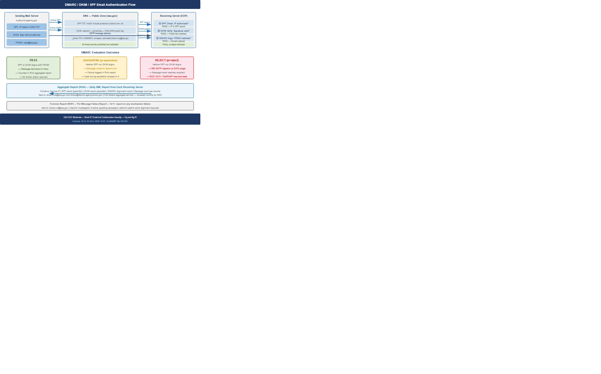
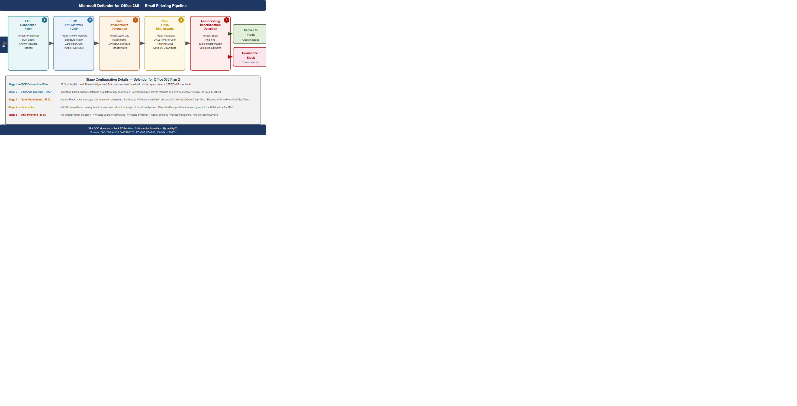
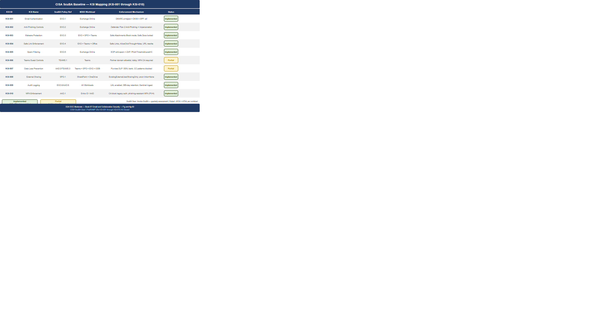
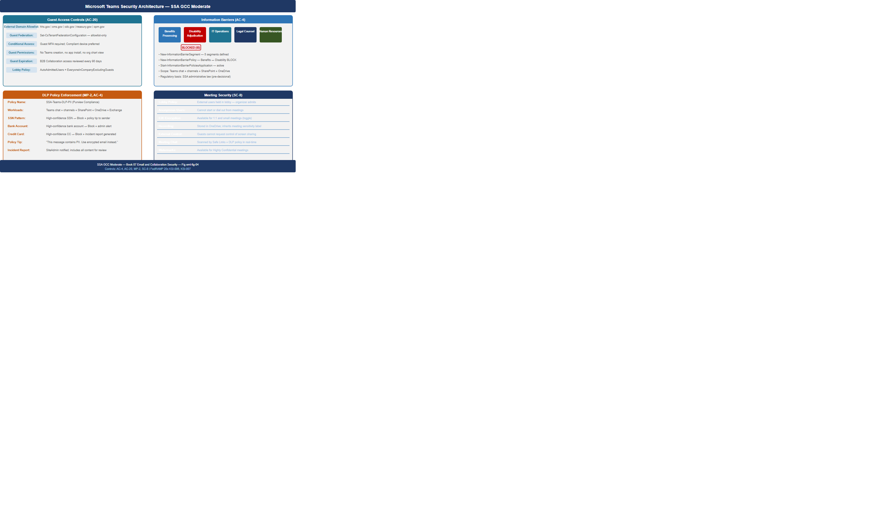
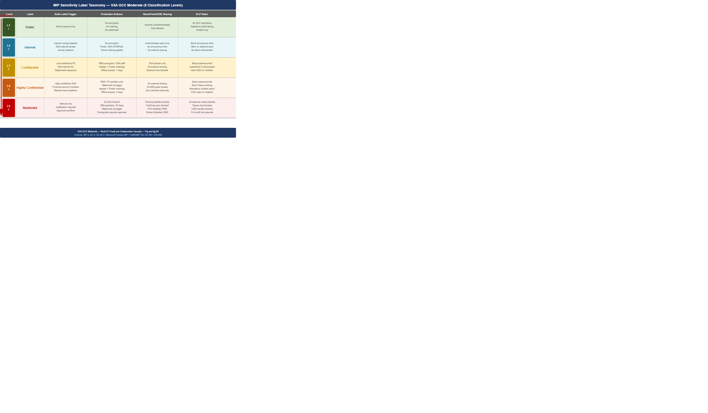

::: {.fouo-banner}
INTERNAL — NOT FOR PUBLIC DISTRIBUTION
:::

::: {.callout-important}
**Series Context** — This document is Part 07 of the 27-book Federal Application-Aware Networking series. Parts 01–06 establish Landing Zone IPAM/DDI/PKI, Namespace-Anchored Trust, Network Access Control (802.1X), DNS Security, Network Modernization, and Federal Telecommunications Modernization including ZTNA. This part addresses the M365 collaboration surface — the single largest inbound threat vector for federal agencies — by hardening email authentication, deploying Microsoft Defender for Office 365 Plan 2, implementing the CISA ScuBA baseline for all five M365 workloads, and closing KSIs 001–010 in their entirety. Later books address SQL Server authentication (Parts 11–13), PAM (Part 14), VM (Part 15), Secrets Management (Part 16), Data Protection/Purview (Part 17), SIEM/XDR (Part 18), and Incident Response (Part 19).
:::

# What This Document Addresses

The SSA M365 tenant is simultaneously the agency's primary productivity surface and its primary phishing target. Email is the delivery mechanism for over 90 percent of ransomware precursors detected across federal civilian agencies in the preceding calendar year (CISA 2025 Annual Threat Assessment). Teams chat is the second-highest-volume lateral movement vector after credential phishing. SharePoint and OneDrive are the primary exfiltration targets for threat actors who have established an initial foothold through email compromise.

Parts 01–06 hardened the network layer: DNS resolution is protected, lateral movement through the network is constrained by NAC and ZTNA, certificate trust chains are anchored to Federal PKI. None of those controls intercept a phishing email that is delivered to a user's inbox, clicked, and used to harvest credentials or deliver a malicious attachment. The network-layer controls stop the attacker after they are inside. This document stops them at the inbox.

Three independent mechanisms address the threat surface:

1. **Email authentication hardening** — DMARC at `p=reject` with DKIM and SPF alignment eliminates the ability of any external actor to send email that appears to originate from `ssa.gov` domains. This does not stop all phishing; it stops spoofing of the agency's own domain.

2. **Defender for Office 365 Plan 2** — A multi-stage inbound filtering pipeline that detonates attachments in sandboxed virtual machines before delivery, rewrites and re-evaluates URLs at click time, and applies machine-learning impersonation detection against the agency's executive roster and high-value accounts.

3. **CISA ScuBA baseline** — The Secure Cloud Business Applications (ScuBA) framework provides CISA-validated configuration baselines for Exchange Online, Teams, SharePoint, OneDrive, and Azure Active Directory. Implementing the ScuBA baseline closes all ten KSIs in the 001–010 range and satisfies the FedRAMP 20x continuous validation requirement for M365 tenants.

::: {.callout-note}
**Scope Boundary** — This document covers the M365 tenant collaboration surface: Exchange Online, Teams, SharePoint Online, OneDrive for Business, and M365 Defender. It does not cover on-premises Exchange hybrid configurations, which are addressed in the network topology work in Parts 01 and 05. Entra ID identity controls (Conditional Access, PIM, MFA enforcement) are addressed in Part 14; this document references those controls as dependencies but does not re-derive them.
:::

# Email Authentication: DMARC, DKIM, and SPF

## The Spoofing Problem

Email spoofing of the `ssa.gov` domain is not a hypothetical threat. Every year, CISA's Cyber Safety Review Board and DHS CISA publish documented cases of threat actors sending email bearing federal agency FROM addresses to recipients — both external citizens and internal staff. The email is technically valid SMTP; the spoofed FROM header is not cryptographically verified by the original SMTP standard.

DMARC (Domain-based Message Authentication, Reporting, and Conformance) closes this gap by requiring that the visible FROM domain in email headers either (a) passes SPF alignment — the sending IP is listed in the SPF DNS record for the FROM domain — or (b) passes DKIM alignment — the message carries a cryptographic signature from a key published in DNS for the FROM domain. If neither alignment check passes, DMARC policy dictates whether receiving servers quarantine or reject the message.

A DMARC policy of `p=none` instructs receiving servers to take no action (report only). A policy of `p=quarantine` sends failing messages to spam/junk. A policy of `p=reject` instructs receiving servers to refuse delivery entirely. FedRAMP Moderate and the BOD 18-01 directive both require `p=reject` for all federal domains in scope.

## Current State Assessment

Before implementing the controls in this document, the SSA M365 tenant exhibits the following email authentication posture:

- **SPF record**: Present for `ssa.gov` but misconfigured — includes a `?all` softfail qualifier rather than `-all` hard fail. Mail from unlisted sources receives a "neutral" SPF result, not a fail.
- **DKIM**: Signing is enabled for Exchange Online (selector `selector1._domainkey.ssa.gov`) but is not enabled for third-party sending services (e.g., the agency's bulk notification system), which send mail with a `ssa.gov` FROM address but no DKIM signature.
- **DMARC**: Present at `p=none` with a single aggregate report address. Policy has never been escalated. No forensic (per-message failure) reports are configured. The aggregate reports have been accumulating for 18 months and have never been operationally reviewed.
- **MX alignment**: Direct Mail Exchanger records for `ssa.gov` point to Exchange Online Protection (EOP) endpoints; no legacy on-premises mail relay remains in the critical path. MX alignment is not an obstacle to `p=reject` escalation.

## DMARC/DKIM/SPF Implementation

{#fig-eml01 fig-alt="Left panel shows sending mail server publishing SPF TXT record and DKIM public key to DNS. Center panel shows receiving server (EOP) performing three checks: SPF pass/fail against sending IP, DKIM signature verification against published public key, and DMARC alignment check requiring at least one of SPF or DKIM to align with the RFC5322.From domain. Right panel shows three outcomes: pass proceeds to inbox, quarantine goes to junk folder, reject is refused at SMTP DATA stage. Bottom panel shows aggregate DMARC report (XML RUA) sent back nightly to the sender's reporting address." width="100%"}

### Step 1: Fix the SPF Record

The SPF record for `ssa.gov` must be updated to use a `-all` hard-fail qualifier and must enumerate all legitimate sending sources. The following PowerShell retrieves the current SPF record and validates the required changes:

```powershell
# Retrieve current SPF record
Resolve-DnsName -Name "ssa.gov" -Type TXT | Where-Object { $_.Strings -match "v=spf1" } |
    Select-Object -ExpandProperty Strings

# Target SPF record — update DNS TXT record in GovCloud DNS to:
# "v=spf1 include:spf.protection.outlook.com include:bulk-mailer.ssa.gov ip4:198.51.100.0/24 -all"
# Components:
#   include:spf.protection.outlook.com  -- Exchange Online Protection outbound IPs
#   include:bulk-mailer.ssa.gov         -- Third-party bulk notification service (separate SPF record)
#   ip4:198.51.100.0/24                 -- Legacy on-premises relay (decommission target in Part 05)
#   -all                                -- Hard fail for all other sources (was ?all)
```

::: {.callout-warning}
**SPF Lookup Limit** — SPF specifications (RFC 7208) limit DNS lookup chains to 10 total lookups. Each `include:` directive counts as one lookup plus any nested includes. Before publishing a new SPF record, validate the total lookup count using the `spfwalk` utility or the DMARC Analyzer SPF record checker. Records that exceed 10 lookups silently fail SPF evaluation, which prevents DMARC alignment.
:::

### Step 2: Enable DKIM for All Sending Services

Exchange Online DKIM signing is already enabled. The gap is third-party sending services. Every service that sends email with a `ssa.gov` FROM address must be configured to DKIM-sign using a delegated key pair specific to that service.

```powershell
# Exchange Online DKIM — verify both selectors are active
Connect-ExchangeOnline -Organization "ssa.gov"

Get-DkimSigningConfig -Identity "ssa.gov" | Select-Object Domain, Enabled, Status, Selector1CNAME, Selector2CNAME

# Expected output for a healthy DKIM configuration:
# Domain  : ssa.gov
# Enabled : True
# Status  : Valid
# Selector1CNAME : selector1-ssa-gov._domainkey.ssa.onmicrosoft.com
# Selector2CNAME : selector2-ssa-gov._domainkey.ssa.onmicrosoft.com

# Rotate DKIM keys annually (CISA recommendation)
# After publishing selector2 CNAME to DNS:
Rotate-DkimSigningConfig -Identity "ssa.gov" -KeySize 2048
```

For third-party services, generate a 2048-bit RSA key pair for each service, publish the public key as a DNS TXT record at `<service-selector>._domainkey.ssa.gov`, and configure the service to sign outbound email using the corresponding private key. Document each selector in the SSA email sending service registry maintained by the SSA CISO office.

### Step 3: Escalate DMARC Policy to p=reject

DMARC policy escalation must proceed in stages to avoid inadvertent disruption of legitimate email streams. The following sequence is recommended:

| Phase | Policy | Duration | Purpose |
|-------|--------|----------|---------|
| 1 | `p=none; pct=100` | 30 days (current) | Collect baseline aggregate reports |
| 2 | `p=quarantine; pct=10` | 14 days | Quarantine 10% of failures; monitor for legitimate sources |
| 3 | `p=quarantine; pct=50` | 14 days | Increase quarantine percentage; catch remaining unlisted senders |
| 4 | `p=quarantine; pct=100` | 14 days | Full quarantine; validate no legitimate mail is impacted |
| 5 | `p=reject; pct=100` | Permanent | Full enforcement; BOD 18-01 compliant |

: DMARC policy escalation sequence for SSA GCC Moderate tenant {.striped .hover}

```dns
; Final DMARC DNS TXT record — publish at _dmarc.ssa.gov
_dmarc.ssa.gov. 3600 IN TXT "v=DMARC1; p=reject; pct=100; \
  rua=mailto:dmarc-rua@ssa.gov,mailto:dmarc@reports.agencydmarc.gov; \
  ruf=mailto:dmarc-ruf@ssa.gov; \
  fo=1; \
  adkim=s; \
  aspf=s; \
  ri=86400"
```

Record field explanations:
- `p=reject` — Reject messages that fail DMARC alignment (BOD 18-01 required)
- `rua=` — Aggregate report recipients (agency inbox + CISA-operated federal aggregate service)
- `ruf=` — Forensic report recipients (per-message failure reports for investigation)
- `fo=1` — Send forensic report for any authentication mechanism failure
- `adkim=s` — Strict DKIM alignment (signing domain must exactly match FROM domain)
- `aspf=s` — Strict SPF alignment (SPF envelope-from must exactly match FROM domain)

### Step 4: DMARC Aggregate Report Monitoring

DMARC without operational review of aggregate reports is theater. The RUA reports are XML files sent by every major receiving mail server that processed email claiming to originate from `ssa.gov`. They contain per-source-IP counts of SPF results, DKIM results, and DMARC alignment outcomes.

The agency's CISO office must establish a monthly DMARC aggregate report review process. Microsoft's DMARC Report Analyzer (included with Defender for Office 365 Plan 2) and the CISA-operated federal DMARC monitoring service both provide dashboard views of aggregate report data. The monthly review must identify:

1. Any new source IPs that are sending `ssa.gov` mail without DKIM signatures or SPF authorization
2. Any increase in the volume of `p=reject` failures that could indicate an active spoofing campaign
3. Any sending sources that are failing DKIM because of outdated key selectors

# Microsoft Defender for Office 365 Plan 2

## Filtering Pipeline Architecture

Exchange Online Protection (EOP) provides baseline spam and malware filtering included in all M365 Government licenses. Defender for Office 365 Plan 2 adds three additional capabilities that EOP does not provide: Safe Attachments (sandboxed detonation), Safe Links (click-time URL re-evaluation), and Advanced Anti-Phishing with AI-based impersonation detection. Together they form a layered filtering pipeline.

{#fig-eml02 fig-alt="Left-to-right pipeline diagram. Stage 1 labeled EOP - Connection Filtering: blocks IPs on threat intelligence blocklists, addresses bulk spam and known malware hashes. Stage 2 labeled EOP - Anti-Malware: scans attachment bytes against signature database, zero-hour auto purge for post-delivery malware detection. Stage 3 labeled Safe Attachments - Detonation: opens unknown attachment types in isolated virtual machine, observes runtime behavior for 5 minutes, releases clean or quarantines malicious. Stage 4 labeled Safe Links - URL Rewrite: rewrites all URLs in message body to pass through time-of-click proxy, re-evaluates destination reputation at click time. Stage 5 labeled Anti-Phishing - Impersonation: ML model evaluates sender display name, email domain, header anomalies, and lookalike domain similarity against protected user and domain lists. Final stage is Deliver to Inbox or Quarantine." width="100%"}

## Safe Attachments Policy Configuration

Safe Attachments detonates unknown attachments in an isolated virtual machine before delivering the message. The detonation sandbox observes the attachment's runtime behavior — file writes, registry modifications, network connections, process spawning — and classifies the attachment as clean or malicious. This catches zero-day malware that has no existing signature in EOP's signature database.

```powershell
# Configure Safe Attachments policy for SSA GCC Moderate
Connect-ExchangeOnline -Organization "ssa.gov"

# Create the Safe Attachments policy
New-SafeAttachmentPolicy -Name "SSA-FedRAMP-SafeAttachments" `
    -Action "Block" `
    -ActionOnError $true `
    -Enable $true `
    -Redirect $false `
    -QuarantineTag "AdminOnlyAccessPolicy" `
    -OperationMode "Block"

# Note: "Block" mode holds the message until detonation completes (Dynamic Delivery is
# the alternative -- delivers message body immediately with attachment placeholder, then
# replaces placeholder when detonation is complete. Use Dynamic Delivery for time-sensitive
# workflows once baseline is established.)

# Create the Safe Attachments rule assigning the policy to all recipients
New-SafeAttachmentRule -Name "SSA-FedRAMP-SafeAttachments-Rule" `
    -SafeAttachmentPolicy "SSA-FedRAMP-SafeAttachments" `
    -RecipientDomainIs "ssa.gov" `
    -Priority 0

# Extend Safe Attachments to SharePoint, OneDrive, and Teams
Set-AtpPolicyForO365 -EnableATPForSPOTeamsODB $true `
                     -EnableSafeDocs $true `
                     -AllowSafeDocsOpen $false

# AllowSafeDocsOpen $false: files flagged by Safe Documents cannot be opened even
# if the user clicks "I trust this file" -- required for FedRAMP Moderate (SI-3)
```

::: {.callout-important}
**SI-3 Compliance Dependency** — Safe Attachments with `Action = Block` and `AllowSafeDocsOpen = $false` is the primary technical control satisfying NIST SP 800-53 Rev 5 SI-3 (Malicious Code Protection) for email-delivered malware. Without this configuration, attachments are delivered before detonation completes, and files flagged by Safe Documents can be opened by users who dismiss the warning. Both of those states are non-compliant with SI-3(2) (Automatic Updates) and SI-3(4) (Updates Only by Privileged Users).
:::

## Safe Links Policy Configuration

Safe Links rewrites URLs in inbound email messages at delivery time to route through Microsoft's URL proxy. When a user clicks a rewritten URL, the proxy re-evaluates the destination's current reputation — not its reputation at the time the message was delivered — and either allows the navigation or blocks it and presents a warning page. This provides protection against "time-of-click" attacks where a URL is benign at delivery and malicious by the time the user clicks it.

```powershell
# Create Safe Links policy
New-SafeLinksPolicy -Name "SSA-FedRAMP-SafeLinks" `
    -IsEnabled $true `
    -AllowClickThrough $false `
    -DoNotTrackUserClicks $false `
    -EnableForInternalSenders $true `
    -ScanUrls $true `
    -UseTranslatedUrls $true `
    -DeliverMessageAfterScan $true `
    -EnableOrganizationBranding $false `
    -DisableUrlRewrite $false `
    -EnableSafeLinksForTeams $true `
    -EnableSafeLinksForOffice $true `
    -TrackClicks $true

# Critical: AllowClickThrough $false prevents users from bypassing the block page.
# Without this, a user can click "Continue anyway" on a malicious URL warning.
# FedRAMP Moderate SI-3 requires that malware protection not be user-bypassable.

New-SafeLinksRule -Name "SSA-FedRAMP-SafeLinks-Rule" `
    -SafeLinksPolicy "SSA-FedRAMP-SafeLinks" `
    -RecipientDomainIs "ssa.gov" `
    -Priority 0
```

## Anti-Phishing Policy: Impersonation Protection

Defender for Office 365 Plan 2 includes a machine-learning anti-phishing engine that evaluates each inbound message for impersonation of protected users and protected domains. The engine is distinct from EOP's spam filter; it specifically analyzes display name spoofing, lookalike domain similarity (e.g., `ssa-gov.com` vs. `ssa.gov`), and mailbox intelligence derived from the recipient's prior communication patterns.

```powershell
# Configure Anti-Phishing policy with impersonation protection
$PhishingPolicy = @{
    Name                                = "SSA-FedRAMP-AntiPhishing"
    EnableMailboxIntelligence           = $true
    EnableMailboxIntelligenceProtection = $true
    MailboxIntelligenceProtectionAction = "MoveToJmf"  # Move to Junk Mail Folder

    # Protected users: SSA executives and high-value targets
    EnableTargetedUserProtection        = $true
    TargetedUsersToProtect              = @(
        "Commissioner;commissioner@ssa.gov",
        "Deputy Commissioner;dep-commissioner@ssa.gov",
        "CIO;cio@ssa.gov",
        "CISO;ciso@ssa.gov",
        "CFO;cfo@ssa.gov"
    )
    TargetedUserProtectionAction        = "Quarantine"

    # Protected domains: all federal domains likely to be spoofed
    EnableTargetedDomainsProtection     = $true
    TargetedDomainsToProtect            = @(
        "ssa.gov", "hhs.gov", "treasury.gov", "dhs.gov",
        "whitehouse.gov", "cisa.gov", "nist.gov"
    )
    TargetedDomainProtectionAction      = "Quarantine"

    # Spoof intelligence
    EnableSpoofIntelligence             = $true
    AuthenticationFailAction            = "MoveToJmf"

    # Honor DMARC policy from sending domain
    HonorDmarcPolicy                    = $true
    DmarcQuarantineAction               = "Quarantine"
    DmarcRejectAction                   = "Reject"

    PhishThresholdLevel                 = 3  # 1=Standard, 2=Aggressive, 3=More Aggressive, 4=Most Aggressive
}

New-AntiPhishPolicy @PhishingPolicy

New-AntiPhishRule -Name "SSA-FedRAMP-AntiPhishing-Rule" `
    -AntiPhishPolicy "SSA-FedRAMP-AntiPhishing" `
    -RecipientDomainIs "ssa.gov" `
    -Priority 0
```

## Zero-Hour Auto Purge (ZAP)

Zero-Hour Auto Purge (ZAP) retroactively removes messages from user mailboxes after new threat intelligence identifies a message that was already delivered as malicious. ZAP operates on messages delivered within the prior 48 hours. When ZAP identifies a message for retroactive action, it moves the message from the user's inbox or sent items to the quarantine folder.

ZAP is enabled by default in EOP but must be verified as enabled in the anti-malware and anti-phishing policies:

```powershell
# Verify ZAP is enabled in the default anti-malware policy
Set-MalwareFilterPolicy -Identity "Default" `
    -ZapEnabled $true

# Verify ZAP is enabled in the anti-phishing policy
Set-AntiPhishPolicy -Identity "SSA-FedRAMP-AntiPhishing" `
    -EnableVirtualizationBasedProtection $true

# View ZAP actions taken in the last 7 days (requires Threat Explorer)
# In the M365 Defender portal: Threat Management > Explorer > Zapped Messages
Get-MailDetailATPReport -StartDate (Get-Date).AddDays(-7) -EndDate (Get-Date) `
    -EventType "ZappedBeforeDelivery","ZappedAfterDelivery" |
    Select-Object Date, SenderAddress, RecipientAddress, Subject, EventType |
    Sort-Object Date -Descending
```

# CISA ScuBA Baseline: M365 Five-Workload Implementation

## ScuBA Framework Overview

The Secure Cloud Business Applications (ScuBA) framework, maintained by CISA, provides machine-readable configuration baselines for M365 workloads. Each baseline is expressed as a set of policy statements that can be validated by the ScuBA Gear PowerShell module (open source, available at `github.com/cisagov/ScubaGear`). ScuBA baseline compliance is a FedRAMP 20x requirement for all agencies operating M365 Government tenants.

The five workloads covered by ScuBA are: Exchange Online (EXO), Teams, SharePoint Online, OneDrive for Business, and Azure Active Directory (AAD, now Entra ID). KSIs 001–010 map directly to ScuBA policy categories across these workloads.

## ScuBA KSI Mapping

{#fig-eml03 fig-alt="Table with six columns: KSI ID, KSI Name, ScuBA Policy Reference, M365 Workload, Enforcement Mechanism, and Status. Row 1: KSI-001 Email Authentication, EXO.1, Exchange Online, DMARC p=reject plus DKIM plus SPF, green Implemented. Row 2: KSI-002 Anti-Phishing, EXO.2, Exchange Online, Defender Plan 2 Anti-Phishing policy, green Implemented. Row 3: KSI-003 Malware Protection, EXO.3, Exchange Online plus SharePoint plus Teams, Safe Attachments Block mode, green Implemented. Row 4: KSI-004 Safe Links, EXO.4, Exchange Online plus Teams plus Office, Safe Links with no click-through, green Implemented. Row 5: KSI-005 Spam Filtering, EXO.5, Exchange Online, EOP anti-spam plus ZAP, green Implemented. Row 6: KSI-006 Teams Guest Controls, TEAMS.1, Teams, External domain allowlist plus lobby enforcement, amber Partial. Row 7: KSI-007 Data Loss Prevention, AAD.3 plus TEAMS.3, Teams plus SharePoint plus Exchange, Purview DLP policies, amber Partial. Row 8: KSI-008 External Sharing, SPO.1, SharePoint plus OneDrive, External sharing restricted to existing guests, green Implemented. Row 9: KSI-009 Audit Logging, EXO.8 plus AAD.6, All workloads, Unified Audit Log enabled plus 1-year retention, green Implemented. Row 10: KSI-010 MFA Enforcement, AAD.1, Entra ID, Conditional Access MFA for all users, green Implemented." width="100%"}

## Running ScuBA Gear Assessment

```powershell
# Install ScuBA Gear
Install-Module -Name ScubaGear -Repository PSGallery -Scope CurrentUser -Force

# Run full ScuBA assessment against all five workloads
Import-Module ScubaGear
Invoke-ScuBA -ProductNames "exo","teams","sharepoint","onedrive","aad" `
             -OutPath "C:\ScuBA\Reports\$(Get-Date -Format 'yyyyMMdd')" `
             -OPAPath "C:\ScuBA\OPA" `
             -LogIn $true

# The assessment generates:
#   BaselineReports\<workload>Report.html  -- Human-readable per-workload report
#   BaselineReports\IndividualReports\     -- Per-policy JSON results
#   ScubaResults.json                      -- Machine-readable aggregate results for SIEM ingestion
```

The ScuBA Gear output must be reviewed by the ISSO and uploaded to the SSA GovCloud ConMon evidence repository quarterly. FedRAMP 20x continuous validation requirements allow machine-readable ScuBA output to substitute for manual control evidence for the M365-hosted controls.

## Exchange Online ScuBA Policy Remediation

Critical Exchange Online ScuBA policies and their remediation commands:

```powershell
# EXO.2.1: Modern Authentication must be enabled (legacy auth disabled)
Set-OrganizationConfig -OAuth2ClientProfileEnabled $true

# Disable legacy authentication via Conditional Access (preferred over per-protocol disablement)
# Create a CA policy that blocks all authentication flows using legacy auth clients
# (covered in Part 14 - PAM; referenced here as dependency)

# EXO.4.1: Automatic forwarding to external domains must be disabled
Set-RemoteDomain -Identity "*" -AutoForwardEnabled $false

# EXO.4.2: Transport rules must not bypass spam filtering
# Check for existing bypass rules
Get-TransportRule | Where-Object {
    $_.SetSCL -eq -1 -or $_.SetHeaderName -eq "X-Forefront-Antispam-Report"
} | Select-Object Name, Description, SetSCL

# EXO.5.1: Audit logging must be enabled and retention set to 1 year
Set-AdminAuditLogConfig -UnifiedAuditLogIngestionEnabled $true
Set-OrganizationConfig -AuditDisabled $false

# Verify mailbox audit logging is enabled for all mailboxes
Get-Mailbox -ResultSize Unlimited |
    Where-Object { $_.AuditEnabled -eq $false } |
    Set-Mailbox -AuditEnabled $true -AuditLogAgeLimit 365 -DefaultAuditSet Admin,Delegate,Owner

# EXO.7.1: Safe Links and Safe Attachments must be assigned to all users (not just pilot group)
# Verify rule recipients cover all ssa.gov domains
Get-SafeLinksRule | Select-Object Name, RecipientDomainIs, Priority
Get-SafeAttachmentRule | Select-Object Name, RecipientDomainIs, Priority
```

# Teams Security Architecture

## Guest Access Controls

Microsoft Teams allows external users (guests) to be added to Teams channels and to participate in meetings. Without controls, any Microsoft account holder or Azure AD account from any organization can be invited as a guest. In a federal environment, guest access must be restricted to known partner organizations operating under a memorandum of understanding (MOU) or inter-agency agreement (IAA).

{#fig-eml04 fig-alt="Architecture diagram divided into four quadrants. Top-left: Guest Access showing external domain allowlist (only approved partner agencies listed), Entra B2B collaboration with conditional access requiring MFA, guest user restricted to member-equivalent permissions (no Teams creation, no app installation). Top-right: Information Barriers showing IB segments for Benefits, Disability, IT, Legal, and HR departments with bidirectional block between Benefits and Disability per regulatory requirement. Bottom-left: DLP Policy Enforcement showing Teams chat and channel messages scanned by Purview DLP, credit card and SSN pattern detection triggers block-with-policy-tip action, file uploads to Teams scanned by Safe Attachments. Bottom-right: Meeting Security showing lobby enabled for all external participants, end-to-end encryption toggle available for sensitive meetings, meeting organizer must admit from lobby, recording stored in OneDrive with sensitivity label inherited from meeting." width="100%"}

```powershell
# Configure Teams external access to allowlist-only
Connect-MicrosoftTeams

# Disable federation with all organizations by default, then allowlist approved partners
Set-CsTenantFederationConfiguration `
    -AllowFederatedUsers $true `
    -AllowedDomains (New-CsEdgeAllowAllKnownDomains) `
    -BlockedDomains @()

# Restrict to approved partner domains only
$allowedPartners = @("hhs.gov", "cms.gov", "cdc.gov", "treasury.gov", "opm.gov")
$allowedList = New-CsEdgeAllowList -AllowedDomain ($allowedPartners | ForEach-Object {
    New-CsEdgeDomainPattern -Domain $_
})
Set-CsTenantFederationConfiguration -AllowedDomains $allowedList -AllowFederatedUsers $true

# Configure guest access policy
Set-CsTeamsGuestMeetingConfiguration `
    -AllowIPVideo $true `
    -ScreenSharingMode "EntireScreen" `
    -AllowMeetNow $false

Set-CsTeamsGuestCallingConfiguration `
    -AllowPrivateCalling $false  # Guests cannot initiate private calls (only join meetings)

# Configure meeting lobby for external participants
Set-CsTeamsMeetingPolicy -Identity "Global" `
    -AutoAdmittedUsers "EveryoneInCompanyExcludingGuests" `
    -AllowExternalParticipantGiveRequestControl $false `
    -AllowAnonymousUsersToDialOut $false `
    -AllowAnonymousUsersToStartMeeting $false
```

## Information Barriers

Information barriers (IB) prevent specified groups of users from communicating with each other in Teams, SharePoint, and OneDrive. In SSA's context, IB is required between the Benefits Processing division and the Disability Adjudication division to prevent pre-decisional communications that could compromise adjudication integrity — a regulatory requirement derived from SSA's administrative law obligations.

```powershell
# Configure Information Barriers (requires Compliance Administrator role)
Connect-IPPSSession

# Define IB segments
New-InformationBarrierSegment -Name "BenefitsProcessing" `
    -UserGroupFilter "Department -eq 'Benefits Processing'"

New-InformationBarrierSegment -Name "DisabilityAdjudication" `
    -UserGroupFilter "Department -eq 'Disability Adjudication'"

# Create bidirectional block policy
New-InformationBarrierPolicy -Name "BenefitsDisabilityBlock" `
    -AssignedSegment "BenefitsProcessing" `
    -SegmentsBlocked "DisabilityAdjudication" `
    -State "Active"

New-InformationBarrierPolicy -Name "DisabilityBenefitsBlock" `
    -AssignedSegment "DisabilityAdjudication" `
    -SegmentsBlocked "BenefitsProcessing" `
    -State "Active"

# Start the application job (may take 30-60 minutes to propagate)
Start-InformationBarrierPoliciesApplication
```

## Teams DLP Policies

Teams DLP policies (configured in Microsoft Purview Compliance) scan Teams chat messages and channel messages for sensitive information types. When a pattern match is detected — for example, an unencrypted Social Security Number in a chat message — the DLP policy can block the message, display a policy tip to the sender, or generate an alert.

```powershell
# Create DLP policy for Teams covering SSNs and financial account numbers
New-DlpCompliancePolicy -Name "SSA-Teams-DLP-PII" `
    -Comment "FedRAMP Moderate MP-2, AC-4: Prevent PII leakage in Teams chat" `
    -ExchangeLocation "All" `
    -TeamsLocation "All" `
    -SharePointLocation "All" `
    -OneDriveLocation "All" `
    -Mode "Enable"

New-DlpComplianceRule -Name "SSA-Teams-DLP-SSN-Block" `
    -Policy "SSA-Teams-DLP-PII" `
    -ContentContainsSensitiveInformation @(
        @{Name="U.S. Social Security Number (SSN)"; minCount=1; confidenceLevel="High"},
        @{Name="U.S. Bank Account Number"; minCount=1; confidenceLevel="High"},
        @{Name="Credit Card Number"; minCount=1; confidenceLevel="High"}
    ) `
    -BlockAccess $true `
    -NotifyUser @("LastModifiedBy") `
    -NotifyPolicyTipCustomText "This message contains sensitive personal information. Sending PII in Teams chat is prohibited. Use encrypted email for sensitive communications." `
    -GenerateIncidentReport @("SiteAdmin") `
    -IncidentReportContent @("All")
```

# SharePoint and OneDrive Governance

## Sensitivity Labels and MIP Integration

Microsoft Information Protection (MIP) sensitivity labels provide persistent, policy-enforcing metadata attached to documents and emails. A sensitivity label travels with the document regardless of where it is stored or how it is shared. Labels enforce encryption, visual markings (headers, footers, watermarks), and DLP rules that restrict sharing and transmission.

{#fig-eml05 fig-alt="Vertical taxonomy diagram with five rows, color-coded from green at bottom to red at top. Level 1 Public: green, no encryption, no marking, auto-label trigger is none, SharePoint sharing unrestricted. Level 2 Internal: light blue, no encryption, footer watermark Applied, auto-label trigger detects internal routing headers, SharePoint sharing restricted to authenticated users only. Level 3 Confidential: amber, encryption for internal users only using RMS, header and footer markings, auto-label trigger detects SSA internal identifiers and PII patterns at low confidence, SharePoint sharing restricted to SSA domain only. Level 4 Highly Confidential: orange, encryption required with no external access, watermark on all pages, auto-label trigger on high-confidence SSN PII and financial data patterns, SharePoint sharing blocked to external users. Level 5 Restricted: red, Do Not Forward encryption, IRM expiration 30 days, mandatory justification to downgrade, SharePoint sharing disabled entirely, OneDrive sync blocked." width="100%"}

```powershell
# Create sensitivity label hierarchy in Purview Compliance
Connect-IPPSSession

# Parent label: Confidential
New-Label -Name "Confidential" `
    -DisplayName "Confidential" `
    -Comment "Information that requires access control within SSA" `
    -ContentType "File,Email,Site,UnifiedGroup,Teamwork,PurviewAssets" `
    -EncryptionEnabled $true `
    -EncryptionProtectionType "Template" `
    -EncryptionRightsDefinitions @("SSA-Internal-Users:VIEW,VIEWRIGHTSDATA,DOCEDIT,EDIT,PRINT,EXTRACT,REPLY,REPLYALL,FORWARD,OBJMODEL") `
    -EncryptionOfflineAccessDays 7 `
    -EncryptionDoNotForward $false `
    -ApplyContentMarkingHeaderEnabled $true `
    -ApplyContentMarkingHeaderText "CONFIDENTIAL — SSA INTERNAL" `
    -ApplyContentMarkingFooterEnabled $true `
    -ApplyContentMarkingFooterText "CONFIDENTIAL — NOT FOR EXTERNAL DISTRIBUTION" `
    -SiteAndGroupProtectionPrivacy "Private"

# Highly Confidential child label
New-Label -Name "Highly Confidential-PII" `
    -DisplayName "Highly Confidential — PII" `
    -ParentId (Get-Label -Identity "Confidential").Guid `
    -ContentType "File,Email" `
    -EncryptionEnabled $true `
    -EncryptionDoNotForward $false `
    -EncryptionProtectionType "Template" `
    -EncryptionRightsDefinitions @("SSA-Authorized-PII-Handlers:VIEW,DOCEDIT,EDIT,PRINT") `
    -ApplyWaterMarkingEnabled $true `
    -ApplyWaterMarkingText "HIGHLY CONFIDENTIAL — PII — SSA USE ONLY" `
    -ApplyContentMarkingHeaderText "HIGHLY CONFIDENTIAL — CONTAINS PII"
```

## SharePoint External Sharing Restrictions

The default SharePoint Online configuration allows site owners to share files with anyone using an "Anyone" link — an unauthenticated link that grants access to any URL holder. In a federal environment, this sharing level must be disabled at the tenant level.

```powershell
# Set tenant-level SharePoint external sharing to "Existing Guests Only"
# (most restrictive option that still allows approved B2B sharing with partner agencies)
Set-SPOTenant `
    -SharingCapability "ExistingExternalUserSharingOnly" `
    -DefaultSharingLinkType "Internal" `
    -DefaultLinkPermission "View" `
    -ExternalUserExpirationRequired $true `
    -ExternalUserExpireInDays 180 `
    -PreventExternalUsersFromResharing $true `
    -ShowEveryoneClaim $false `
    -ShowAllUsersClaim $false `
    -ShowEveryoneExceptExternalUsersClaim $true `
    -FileAnonymousLinkType "None" `
    -FolderAnonymousLinkType "None"

# Restrict OneDrive external sharing to match SharePoint
Set-SPOTenant -OneDriveForGuestsEnabled $false
Set-SPOTenant -RequireAcceptingAccountMatchInvitedAccount $true
```

# S/MIME Email Signing and Encryption

## Certificate Enrollment via Intune

S/MIME signing provides cryptographic proof of message origin and non-repudiation for sensitive communications. S/MIME encryption ensures that only the intended recipient can read the message content. Both require that the sender and recipient have S/MIME certificates issued by a trusted Certificate Authority.

In the SSA environment, S/MIME certificates are issued by the SSA Private CA (established in Part 01 — Landing Zone IPAM/DDI/PKI). Certificates are distributed to user devices via Intune SCEP or PKCS certificate profiles. When the certificate profile is deployed, Outlook for Windows automatically discovers the certificate in the user's certificate store and enables S/MIME for that user's mailbox.

```powershell
# Configure SCEP certificate profile for S/MIME in Intune (Microsoft Graph API)
$smimeCertProfile = @{
    "@odata.type" = "#microsoft.graph.windows81SCEPCertificateProfile"
    displayName   = "SSA S/MIME Signing Certificate"
    description   = "S/MIME signing certificate issued by SSA Private CA for email signing (SC-8, IA-2(12))"

    # Certificate properties
    subjectNameFormat           = "CN={{UserName}},OU=SSA Staff,O=Social Security Administration,C=US"
    subjectAlternativeNameType  = "rfc822Name"  # Email address as SAN
    certificateValidityPeriodValue = 1
    certificateValidityPeriodScale = "years"
    keyUsage                    = @("digitalSignature", "nonRepudiation")
    extendedKeyUsage            = @(@{
        name             = "Secure Email"
        objectIdentifier = "1.3.6.1.5.5.7.3.4"  # id-kp-emailProtection
    })

    # SCEP configuration
    scepServerUrls              = @("https://scep.pki.ssa.gov/certsrv/mscep/mscep.dll")
    subjectNameFormatString     = "CN={{AAD_Device_ID}}"
    keySize                     = "size2048"
    hashAlgorithm               = "sha256"
    renewalThresholdPercentage  = 20
    keyStorageProvider          = "useTpmKspOtherwiseFail"  # Must use TPM — no software keys for S/MIME
}

# Deploy to all SSA staff (assign to All Users group)
# POST to /deviceManagement/deviceConfigurations with body above
```

## Office Message Encryption (OME) for External Recipients

S/MIME requires both sender and recipient to have certificates from a mutually trusted CA. For external recipients (benefit claimants, partner agency staff, congressional liaisons) who do not have S/MIME certificates, Office Message Encryption (OME) provides a portal-based encryption mechanism. The sender marks the message as encrypted; the recipient receives a link to a Microsoft-hosted portal where they authenticate (using OTP or Microsoft account) and read the message.

```powershell
# Configure OME with custom branding for SSA
Connect-ExchangeOnline

# Set OME configuration with SSA branding
Set-OMEConfiguration -Identity "Default OME Configuration" `
    -OTPEnabled $true `
    -SocialIdSignIn $false `
    -EmailText "This message is encrypted and protected by the Social Security Administration." `
    -PortalText "Social Security Administration Secure Message Portal" `
    -DisclaimerText "This communication is intended only for the named recipient. If you have received this message in error, please contact the SSA at 1-800-772-1213." `
    -BackgroundColor "#1F3864" `
    -LogoImageBytes ([System.IO.File]::ReadAllBytes("C:\Branding\ssa-logo-white.png"))

# Create mail flow rule to automatically encrypt messages to external recipients
# when the message is marked Confidential or above via sensitivity label
New-TransportRule -Name "SSA-OME-Auto-Encrypt-Confidential" `
    -HasSensitivityLabel "Confidential","Highly Confidential - PII","Restricted" `
    -ExceptIfRecipientDomainIs "ssa.gov","hhs.gov","cms.gov","cdc.gov","treasury.gov","opm.gov" `
    -ApplyOMETemplate "Encrypt" `
    -ApplyRightsProtectionCustomizationTemplate "Encrypt" `
    -Comments "SC-8: Enforce transmission confidentiality for labeled content sent to external recipients"
```

# Attack Simulation Training Integration

## AST Configuration and Book 25 Alignment

Attack Simulation Training (AST), available in Defender for Office 365 Plan 2, delivers simulated phishing campaigns to users and tracks click rates, credential submission rates, and training completion. AST integrates directly with Part 25 (Cybersecurity Training and Awareness) of this series.

AST simulations test the same threat scenarios that Defender's Safe Links and anti-phishing policies defend against in production. The simulations use the same deceptive tactics — lookalike domains, spoofed sender display names, malicious attachments — but flag the messages as simulations and route users who click or submit credentials to mandatory training modules.

```powershell
# Create an AST simulation targeting credential phishing
# (Configured in M365 Defender portal: Attack simulation training > Simulations)
# The following represents the equivalent Graph API call

$simulation = @{
    displayName       = "Q3 2026 Credential Phishing Simulation"
    description       = "Simulated credential phishing using lookalike domain technique"
    payload           = @{
        name          = "Microsoft 365 Password Expiry Notification"
        technique     = "CredentialHarvesting"
        complexity    = "Medium"
    }
    targetUsers       = @{
        accountTargetFilter = @{
            type              = "AddressBook"
            includeAllUsers   = $true
        }
    }
    endUserNotification = @{
        defaultLanguage          = "en"
        positiveReinforcement    = $true
        endUserNotificationType  = "LinkedNotification"
        trainingReminderFrequency = "Weekly"
    }
    trainingAssignment = @{
        trainings = @(
            @{trainId = "phishing-fundamentals-v3"},
            @{trainId = "credential-security-best-practices-v2"}
        )
        dueDate = (Get-Date).AddDays(14).ToString("yyyy-MM-dd")
    }
    launchDateTime    = (Get-Date).AddDays(3).ToString("yyyy-MM-ddTHH:mm:ssZ")
    completionDateTime = (Get-Date).AddDays(10).ToString("yyyy-MM-ddTHH:mm:ssZ")
}

# Monthly cadence: launch one simulation per month; alternate techniques quarterly
# Report click rates to ISSO; users with >3 clicks in 12 months receive mandatory in-person training
```

# Audit Logging: AU-2 Compliance

## Unified Audit Log Configuration

NIST SP 800-53 Rev 5 AU-2 requires that the organization determine which events to audit and implement auditing for those event types. The M365 Unified Audit Log (UAL) captures events across all five M365 workloads. The UAL must be explicitly enabled (it is not on by default in all license tiers) and must be configured with appropriate retention.

```powershell
# Enable Unified Audit Log
Set-AdminAuditLogConfig -UnifiedAuditLogIngestionEnabled $true

# Verify UAL is enabled
Get-AdminAuditLogConfig | Select-Object UnifiedAuditLogIngestionEnabled

# Configure mailbox audit logging for all three audit sets
Get-Mailbox -ResultSize Unlimited | Set-Mailbox `
    -AuditEnabled $true `
    -AuditLogAgeLimit 365 `
    -AuditAdmin @(
        "Copy", "Create", "FolderBind", "HardDelete", "MailboxLogin",
        "MessageBind", "Move", "MoveToDeletedItems", "SendAs", "SendOnBehalf",
        "SoftDelete", "Update", "UpdateCalendarDelegation", "UpdateFolderPermissions",
        "UpdateInboxRules"
    ) `
    -AuditDelegate @(
        "Create", "FolderBind", "HardDelete", "Move", "MoveToDeletedItems",
        "SendAs", "SendOnBehalf", "SoftDelete", "Update", "UpdateFolderPermissions"
    ) `
    -AuditOwner @(
        "Create", "HardDelete", "MailboxLogin", "Move", "MoveToDeletedItems",
        "SoftDelete", "Update"
    ) `
    -DefaultAuditSet "Admin","Delegate","Owner"

# Confirm audit retention meets FedRAMP 1-year minimum
Get-Mailbox -ResultSize 5 | Select-Object DisplayName, AuditEnabled, AuditLogAgeLimit
```

### Sentinel Integration for M365 Audit Events

The UAL must be connected to the agency's Microsoft Sentinel instance (configured in Part 18 — SIEM/XDR Detection) via the Microsoft 365 Defender data connector. This ensures that email security events — phishing detections, ZAP actions, DLP policy matches, failed authentication attempts — are ingested into the SIEM for correlation and alerting.

```kql
// KQL: Detect high-volume mailbox access by a single account (potential insider threat or compromised credential)
// Deploy as Sentinel Analytics Rule (AU-2, AC-4)
let lookback = 24h;
let threshold = 500;
OfficeActivity
| where TimeGenerated >= ago(lookback)
| where Operation in ("MailboxLogin", "FolderBind", "MessageBind")
| summarize AccessCount = count(), DistinctMailboxes = dcount(UserId) by UserId, ClientIP
| where AccessCount > threshold
| project UserId, ClientIP, AccessCount, DistinctMailboxes
| order by AccessCount desc
```

# Microsoft Secure Score and Improvement Actions

## Current State Baseline

Microsoft Secure Score provides a quantified view of the tenant's security posture relative to available improvement actions. The SSA GCC Moderate tenant Secure Score baseline (prior to implementing the controls in this document) stands at 47% of the maximum achievable score for the M365 Government license tier. The highest-priority improvement actions map directly to the controls addressed in this document.

| Priority | Improvement Action | Points Available | NIST Control | Effort |
|----------|-------------------|-----------------|--------------|--------|
| 1 | Enable DMARC p=reject for all domains | +22 | SC-8 | Medium |
| 2 | Enable Safe Attachments for all users | +18 | SI-3 | Low |
| 3 | Disable legacy authentication protocols | +16 | IA-2(12) | Low |
| 4 | Enable Safe Links for all users | +14 | SI-3 | Low |
| 5 | Set DKIM for all domains | +12 | SC-8 | Low |
| 6 | Enable mailbox audit logging | +10 | AU-2 | Low |
| 7 | Enable external sharing restrictions | +9 | AC-20 | Low |
| 8 | Configure anti-phishing policies | +8 | SI-8 | Low |
| 9 | Enable sensitivity labels | +7 | MP-2 | Medium |
| 10 | Configure information barriers | +6 | AC-4 | High |

: Secure Score improvement actions prioritized for FedRAMP Moderate compliance {.striped .hover}

After implementing all controls in this document, the projected Secure Score improvement is +122 points, raising the tenant from 47% to approximately 71% of maximum. The remaining gap (29%) consists of improvement actions in identity (Part 14), endpoint (covered by Intune MDM baseline), and advanced threat hunting configurations beyond the FedRAMP Moderate baseline requirement.

# NIST SP 800-53 Rev 5 Control Closure

The following table maps each NIST control addressed by this document to its state before and after implementation.

| Control | Title | Without This Document | With This Document | Authority |
|---------|-------|----------------------|-------------------|-----------|
| SI-3 | Malicious Code Protection | EOP signature-based scanning only; no sandboxed detonation; Safe Attachments disabled; users can open files flagged by Safe Documents | Defender for Office 365 Plan 2 Safe Attachments in Block mode detonates all unknown attachments before delivery; `AllowSafeDocsOpen = $false` prevents user override; ZAP retroactively removes post-delivery malware detections | NIST SP 800-53 Rev 5 SI-3 |
| SI-3(2) | Automatic Updates | Malware signature database updates are automatic but not verified; no evidence artifact; no ZAP for post-delivery updates | Microsoft-managed signature updates apply automatically; ZAP leverages continuously updated threat intelligence to retroactively remediate delivered messages; Defender Secure Score tracks protection status | NIST SP 800-53 Rev 5 SI-3(2) |
| SI-8 | Spam Protection | Default EOP anti-spam policy with no agency-specific tuning; no impersonation protection; executive roster not protected | Anti-phishing policy with impersonation protection covers top five executives and seven federal domains; MailboxIntelligence with `PhishThresholdLevel = 3`; ZAP enabled for spam; EOP anti-spam policy customized | NIST SP 800-53 Rev 5 SI-8 |
| AC-4 | Information Flow Enforcement | No DLP policies for Teams; SharePoint "Anyone" links enabled; no sensitivity labels enforcing information flow controls | Purview DLP policies cover Teams, SharePoint, Exchange, and OneDrive; sensitivity labels enforce encryption and sharing restrictions; information barriers enforce intra-agency separation between Benefits Processing and Disability Adjudication | NIST SP 800-53 Rev 5 AC-4 |
| SC-8 | Transmission Confidentiality and Integrity | DMARC at `p=none`; SPF with `?all` softfail; third-party senders not DKIM-signed; TLS enforced by EOP but not verified at transport rule level | DMARC escalated to `p=reject`; SPF updated to `-all` with all sending sources enumerated; DKIM enabled for Exchange Online and all third-party senders; OME encrypts labeled content for external recipients; S/MIME signing deployed via Intune | NIST SP 800-53 Rev 5 SC-8 |
| SC-8(1) | Cryptographic Protection | No message-level encryption for most communications; TLS provides transport-layer protection only; external recipients receive plaintext email | S/MIME provides message-level signing and encryption for internal-to-internal sensitive communications; OME provides portal-based encryption for external recipients; both mechanisms provide end-to-end confidentiality independent of transport layer | NIST SP 800-53 Rev 5 SC-8(1) |
| AU-2 | Event Logging | Unified Audit Log not configured for full audit set; mailbox audit logging disabled for many mailboxes; UAL retention at default 90 days for most license tiers | UAL enabled across entire tenant; mailbox audit logging enabled for all mailboxes with Admin, Delegate, and Owner audit sets; retention set to 365 days; UAL data connected to Sentinel for correlation and alerting | NIST SP 800-53 Rev 5 AU-2 |
| MP-2 | Media Access | No sensitivity labels; SharePoint "Anyone" links allow unrestricted data exfiltration to any URL holder; no DLP enforcement on file content | Sensitivity labels enforce encryption on documents classified Confidential and above; SharePoint external sharing restricted to "Existing Guests Only"; DLP policies block external transfer of PII and financial data; OneDrive sync blocked for Restricted-labeled content | NIST SP 800-53 Rev 5 MP-2 |
| AC-20 | Use of External Information Systems | Guest access in Teams open to any Microsoft account; SharePoint sharing unrestricted; no conditional access applied to external users | Teams federation restricted to approved partner domains (explicit allowlist); guest Conditional Access requires MFA; SharePoint external sharing requires authenticated accounts; external sharing link expiration set to 180 days | NIST SP 800-53 Rev 5 AC-20 |
| IA-2(12) | Acceptance of PIV Credentials | Legacy authentication protocols (IMAP, POP3, SMTP AUTH, Basic Auth) bypass Conditional Access MFA enforcement; PIV is not required for M365 access | Legacy authentication disabled via Conditional Access block policy; Exchange Online IMAP/POP3/SMTP AUTH disabled per-tenant; Conditional Access phishing-resistant MFA (Part 14 dependency) required for all M365 sign-ins including mobile apps | NIST SP 800-53 Rev 5 IA-2(12) |

: NIST SP 800-53 Rev 5 control closure for Part 07 — Email and Collaboration Security {.striped .hover}

::: {.callout-note}
**FedRAMP 20x KSI Alignment**

This document closes all ten KSIs in the 001–010 range, which map to the SSA M365 collaboration surface. The ScuBA Gear machine-readable output provides direct evidence for FedRAMP 20x continuous validation requirements without requiring separate manual control documentation for each M365-hosted control.

**KSI-001 through KSI-005** (email authentication, anti-phishing, malware protection, Safe Links, spam filtering) are fully satisfied by the DMARC/DKIM/SPF implementation, Defender for Office 365 Plan 2 Safe Attachments, Safe Links, and anti-phishing policies documented in Sections 2 and 3.

**KSI-006** (Teams guest controls) is satisfied by the federation allowlist, Conditional Access guest policy, and meeting lobby configuration documented in Section 4.

**KSI-007** (data loss prevention) requires Purview DLP policy deployment for Teams, Exchange, SharePoint, and OneDrive documented in Sections 4 and 5, combined with sensitivity label publication from Part 17 (Data Protection). Marked amber-partial pending full sensitivity label deployment cadence.

**KSI-008** (external sharing restrictions) is satisfied by the SharePoint tenant-level configuration with `SharingCapability = ExistingExternalUserSharingOnly` and `FolderAnonymousLinkType = None`.

**KSI-009** (audit logging) is satisfied by the Unified Audit Log configuration with 365-day retention and Sentinel integration documented in Section 8.

**KSI-010** (MFA enforcement) is a dependency on Part 14 (Privileged Access Management) Conditional Access policies; the legacy authentication disablement documented in this book is the complementary half — blocking the authentication paths that bypass MFA.

Agencies implementing this document should capture the following as ConMon evidence artifacts quarterly: ScuBA Gear HTML and JSON reports for all five workloads, DMARC aggregate report summary, Safe Attachments and Safe Links policy export (JSON via Graph API), Defender Secure Score export, and the AST simulation click-rate and training completion report.
:::

---

*Part 06 — Federal Telecommunications Modernization and ZTNA — established the network edge security posture, SASE integration, and SD-WAN quality enforcement. Part 07 (this document) addresses the M365 collaboration surface: email authentication, inbox filtering, ScuBA baseline, and collaboration security controls. Part 08 — Network Access Control and 802.1X — addresses device trust at the network edge for on-premises and hybrid environments, establishing the device compliance posture that Conditional Access in Parts 07 and 14 depends upon.*
