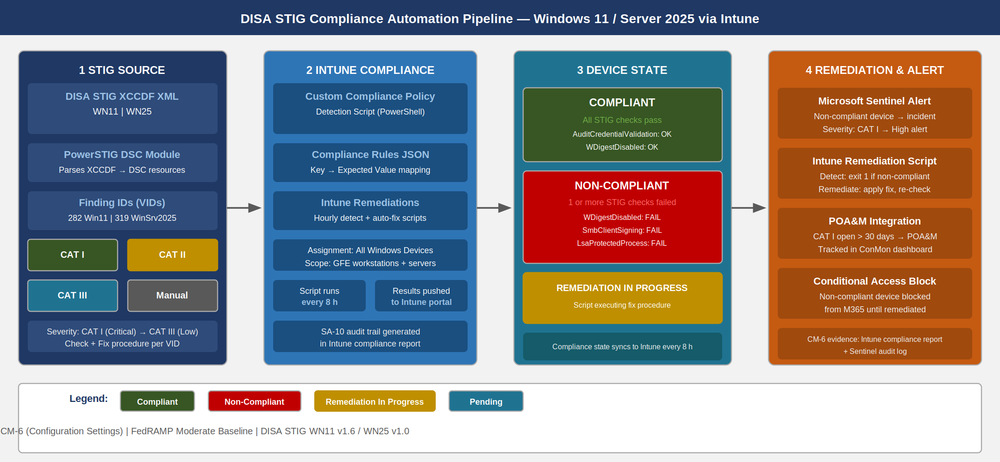
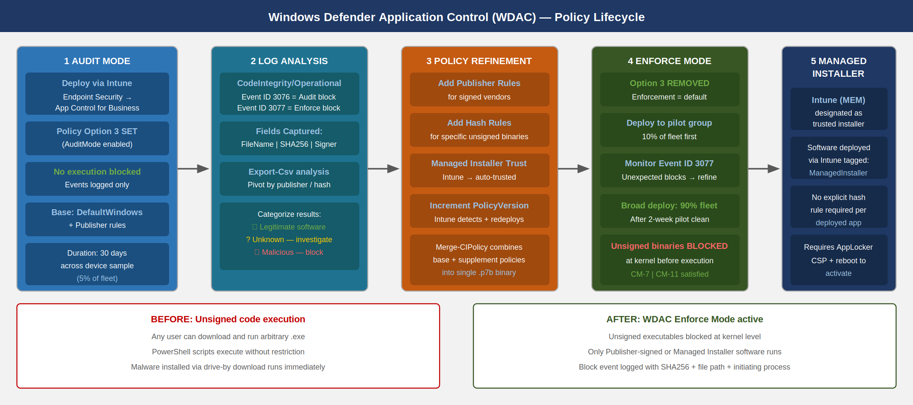
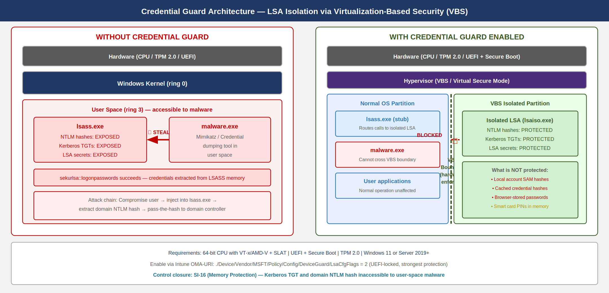
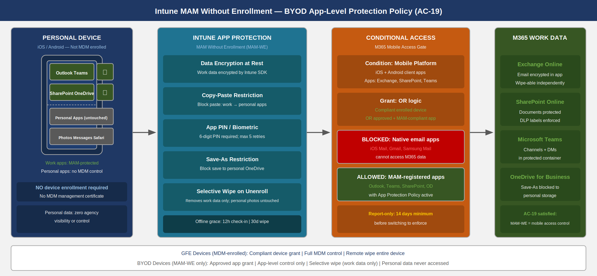

::: {.fouo-banner}
INTERNAL — NOT FOR PUBLIC DISTRIBUTION
:::

::: {.callout-important}
**Series Context** — This is Part 08 of the Federal Application-Aware Networking series. Parts 01–07 established DDI/PKI infrastructure, namespace-anchored trust, network access control (802.1X), DNS security, network modernization, federal telecommunications/ZTNA, and privileged access management. Part 08 secures the device layer — every managed Windows endpoint, server, and BYOD mobile device in the agency environment. Part 09 onward addresses data protection, SIEM/XDR, incident response, business continuity, supply chain risk management, program management, PII/privacy, security training, and the final ATO package.
:::

# What This Document Addresses

Part 07 of this series eliminated standing administrative privilege. A domain administrator now activates just-in-time elevation, works from a dedicated Privileged Access Workstation (PAW), and has session scope bounded to 1–8 hours. Those controls are meaningful only if the device from which the administrator authenticates is itself trustworthy.

An endpoint that runs unsigned code, has disabled audit logging, carries an unpatched kernel vulnerability, or can be reached by malware that extracts Credential Guard–protected secrets through a hardware bypass is not a trustworthy device — regardless of how tightly the Entra ID role is scoped. The authentication controls from Parts 01–07 limit the blast radius of a compromised identity. They do not limit the blast radius of a compromised device.

This document closes the device layer through five interlocking mechanisms:

1. **DISA STIG compliance** — automated configuration baselines enforced and drift-detected via Intune compliance policies and PowerShell DSC, targeting Windows 11 and Windows Server 2025.
2. **CIS Benchmark Level 2 hardening** — registry, service, and audit policy settings deployed through Intune configuration profiles.
3. **Windows Defender Application Control (WDAC)** — policy authoring, managed installer trust, and enforcement blocking all unsigned code execution.
4. **Defender for Endpoint deep configuration** — EDR block mode, all 25 attack surface reduction rules calibrated for federal environments, tamper protection, and advanced hunting.
5. **Credential Guard and memory protection** — Virtualization-Based Security (VBS), LSA isolation, Exploit Guard, Control Flow Guard, and heap spray protection.
6. **Mobile and BYOD controls** — Intune MAM without enrollment (app-level protection policies), Conditional Access requiring MAM compliance for M365 access.
7. **Endpoint DLP** — preventing data exfiltration at the device layer independent of cloud DLP controls.
8. **Vulnerability management integration** — Defender for Endpoint Threat and Vulnerability Management (TVM) feeding the VM workflow (Part 15).

::: {.callout-note}
**Credential Guard and PIM are Complementary, Not Redundant** — Part 07 protects administrative credentials by limiting when they exist. This document protects those same credentials on the device where they are used. Both controls are necessary. Credential Guard prevents malware from extracting Kerberos TGTs from memory even if the device is infected. PIM limits the TGT's scope. Neither is sufficient alone.
:::

# DISA STIG Compliance Automation

## The Federal Baseline Requirement

Department of Defense Information Security Risk Management (DISA) STIGs are the authoritative configuration baselines for systems operating at or above the moderate classification level. For civilian agencies operating under FedRAMP Moderate, STIG compliance is not a direct regulatory mandate — but it is an operationally defensible and auditor-recognized baseline that satisfies CM-6 (Configuration Settings) at a level reviewers accept without requiring custom justification.

The Windows 11 STIG (STIG ID: WN11) and the Windows Server 2025 STIG (STIG ID: WN25) together cover:

- Password policy, account lockout, and authentication requirements (IAM controls)
- Audit policy — which events are logged, at what level (AU controls)
- Service disablement — removal of components with excessive attack surface
- Registry hardening — SMB signing, NTLM restriction, RDP security settings
- Windows Defender configuration — AV signature, real-time protection, cloud-delivered protection
- BitLocker encryption requirements
- User Rights Assignments — least-privilege for service accounts and users

The STIG delivers 282 findings for Windows 11 and 319 for Windows Server 2025. Each finding maps to a Vulnerability ID (VID), a severity (CAT I / CAT II / CAT III), a Check procedure, and a Fix procedure. The operational challenge is applying these at scale across a managed endpoint fleet without per-machine manual work.

## STIG to Intune: The Automation Pipeline

{#fig-edr01 fig-alt="Four-stage pipeline. Stage 1 labeled STIG XCCDF Source shows the DISA STIG XCCDF XML file with PowerSTIG parser producing structured rule objects. Stage 2 labeled Intune Compliance Policy shows the Intune portal with custom compliance settings referencing a PowerShell detection script. Stage 3 labeled Device Compliance State shows devices color-coded green for compliant and red for non-compliant reporting against the policy. Stage 4 labeled Remediation shows non-compliant devices triggering alerts to Sentinel and optional auto-remediation via Intune Remediations (proactive remediation scripts). Arrows connect all four stages left to right." width="100%"}

The pipeline has three components: policy authoring, device evaluation, and remediation. None of these steps are performed manually at scale.

**Policy Authoring with PowerSTIG.** Microsoft's PowerSTIG DSC module parses the DISA STIG XCCDF XML and converts it to Desired State Configuration (DSC) resources. These resources can be applied directly to a machine via DSC or exported as a compliance policy check list for Intune.

```powershell
# Install PowerSTIG
Install-Module -Name PowerSTIG -Scope AllUsers -Force -AllowClobber

# Import the module
Import-Module PowerSTIG

# Generate a DSC configuration for Windows 11 STIG (STIG Version 1, Release 6)
configuration StigBaseline_Win11 {
    param(
        [string[]]$ComputerName = 'localhost'
    )

    Import-DscResource -ModuleName PowerStig

    Node $ComputerName {
        # Apply the Windows 11 STIG baseline
        WindowsClient Baseline {
            OsVersion   = '11'
            StigVersion = '1.6'
            # Exclude CAT III findings for initial deployment (add progressively)
            Exception = @{
                'V-253286' = @{ Identity = 'Administrators' }  # logon locally
                'V-253288' = @{ Identity = 'Administrators, Backup Operators' }  # backup
            }
        }
    }
}

# Compile to MOF
StigBaseline_Win11 -OutputPath "C:\DSC\Win11STIG"
Write-Host "MOF generated. Test with: Test-DscConfiguration -Path C:\DSC\Win11STIG -Verbose"
```

**Intune Custom Compliance Policy.** Intune supports custom compliance policies that execute a PowerShell detection script on the device and compare the JSON output to a rules file. This mechanism carries STIG checks directly into Intune's compliance engine without requiring DSC infrastructure on every device.

```powershell
# Intune Custom Compliance Detection Script: STIG_Win11_Core_Checks.ps1
# This script runs on the device and returns a JSON object with key/value pairs
# Intune compares the returned values against the compliance rules JSON

$results = [ordered]@{}

# VID V-253260: Audit Credential Validation - Success and Failure must be enabled
$auditSetting = auditpol /get /subcategory:"Credential Validation" 2>&1
$results['AuditCredentialValidation'] = if ($auditSetting -match 'Success and Failure') { 'Compliant' } else { 'NonCompliant' }

# VID V-253262: SMB client must have SMB packet signing enabled
$smbClientSigning = (Get-ItemProperty -Path 'HKLM:\SYSTEM\CurrentControlSet\Services\LanmanWorkstation\Parameters' -Name 'RequireSecuritySignature' -ErrorAction SilentlyContinue).RequireSecuritySignature
$results['SmbClientSigning'] = if ($smbClientSigning -eq 1) { 'Compliant' } else { 'NonCompliant' }

# VID V-253264: WDigest authentication must be disabled
$wdigest = (Get-ItemProperty -Path 'HKLM:\SYSTEM\CurrentControlSet\Control\SecurityProviders\WDigest' -Name 'UseLogonCredential' -ErrorAction SilentlyContinue).UseLogonCredential
$results['WDigestDisabled'] = if ($wdigest -eq 0) { 'Compliant' } else { 'NonCompliant' }

# VID V-253266: LSASS must be configured to run as a Protected Process Light (PPL)
$lsaProtection = (Get-ItemProperty -Path 'HKLM:\SYSTEM\CurrentControlSet\Control\Lsa' -Name 'RunAsPPL' -ErrorAction SilentlyContinue).RunAsPPL
$results['LsaProtectedProcess'] = if ($lsaProtection -ge 1) { 'Compliant' } else { 'NonCompliant' }

# VID V-253270: Solicited Remote Assistance must not be allowed
$solicitedRA = (Get-ItemProperty -Path 'HKLM:\SOFTWARE\Policies\Microsoft\Windows NT\Terminal Services' -Name 'fAllowToGetHelp' -ErrorAction SilentlyContinue).fAllowToGetHelp
$results['SolicitedRADisabled'] = if ($solicitedRA -eq 0) { 'Compliant' } else { 'NonCompliant' }

# VID V-253272: AutoPlay must be disabled for all drives
$autoPlay = (Get-ItemProperty -Path 'HKLM:\SOFTWARE\Microsoft\Windows\CurrentVersion\Policies\Explorer' -Name 'NoDriveTypeAutoRun' -ErrorAction SilentlyContinue).NoDriveTypeAutoRun
$results['AutoPlayDisabled'] = if ($autoPlay -eq 255) { 'Compliant' } else { 'NonCompliant' }

# VID V-253280: Windows Defender Real-Time Protection must be enabled
$rtProtection = (Get-MpPreference).DisableRealtimeMonitoring
$results['DefenderRealTimeEnabled'] = if ($rtProtection -eq $false) { 'Compliant' } else { 'NonCompliant' }

# VID V-253282: Network Location Awareness service must run under a reduced-privilege account
$nlaSvc = Get-Service -Name 'NlaSvc' -ErrorAction SilentlyContinue
$results['NlaServiceRunning'] = if ($nlaSvc.Status -eq 'Running') { 'Compliant' } else { 'NonCompliant' }

# Return JSON for Intune compliance engine
return $results | ConvertTo-Json -Compress
```

The corresponding compliance rules JSON (uploaded to Intune alongside the detection script) maps each returned key to an expected value:

```json
{
  "Rules": [
    {
      "SettingName": "AuditCredentialValidation",
      "Operator": "IsEquals",
      "DataType": "String",
      "Operand": "Compliant",
      "MoreInfoUrl": "https://stigviewer.com/stig/windows_11/2023-09-29/finding/V-253260",
      "RemediationStrings": [
        {
          "Language": "en_US",
          "Title": "V-253260: Audit Credential Validation not enabled",
          "Description": "Run: auditpol /set /subcategory:'Credential Validation' /success:enable /failure:enable"
        }
      ]
    },
    {
      "SettingName": "WDigestDisabled",
      "Operator": "IsEquals",
      "DataType": "String",
      "Operand": "Compliant",
      "MoreInfoUrl": "https://stigviewer.com/stig/windows_11/2023-09-29/finding/V-253264",
      "RemediationStrings": [
        {
          "Language": "en_US",
          "Title": "V-253264: WDigest authentication is enabled",
          "Description": "Set HKLM:\\SYSTEM\\CurrentControlSet\\Control\\SecurityProviders\\WDigest\\UseLogonCredential to 0"
        }
      ]
    }
  ]
}
```

## Drift Detection and Automated Remediation

Non-compliant devices require a response path beyond alert-and-wait. Intune Remediations (formerly Proactive Remediations) provide a paired detection + remediation script mechanism that runs on a schedule (hourly configurable) and automatically corrects drift.

```powershell
# Intune Remediation: Fix WDigest Credential Exposure (V-253264)
# Detection Script:
$wdigest = (Get-ItemProperty -Path 'HKLM:\SYSTEM\CurrentControlSet\Control\SecurityProviders\WDigest' `
    -Name 'UseLogonCredential' -ErrorAction SilentlyContinue).UseLogonCredential
if ($wdigest -ne 0) {
    Write-Host "WDigest is enabled -- non-compliant"
    exit 1  # Signal: needs remediation
}
Write-Host "WDigest is disabled -- compliant"
exit 0

# Remediation Script:
Set-ItemProperty -Path 'HKLM:\SYSTEM\CurrentControlSet\Control\SecurityProviders\WDigest' `
    -Name 'UseLogonCredential' -Value 0 -Type DWord -Force
Write-Host "WDigest disabled successfully"
```

::: {.callout-warning}
**CAT I STIG Findings Are Non-Negotiable** — CAT I (critical) findings represent configurations where an exploitable vulnerability exists with no mitigating control. In a FedRAMP Moderate environment, CAT I findings that remain open beyond 30 days must appear in the POA&M with a concrete remediation date. Automated drift remediation via Intune Remediations reduces the POA&M backlog by catching and fixing drift before the next compliance scan cycle.
:::

# CIS Benchmark Level 2 Hardening

## Registry Settings via Intune Configuration Profiles

CIS Benchmark Level 2 for Windows 11 adds hardening settings beyond the STIG baseline, targeting environments with high security requirements. Key registry settings deployed via Intune Custom OMA-URI profiles:

| CIS Control | Registry Path | Value | Purpose |
|-------------|--------------|-------|---------|
| 2.3.1.1 | HKLM\SYSTEM\...\Lsa\NoLMHash | 1 | Disable LM hash storage |
| 2.3.1.2 | HKLM\SYSTEM\...\Lsa\LmCompatibilityLevel | 5 | NTLMv2 only, refuse LM/NTLMv1 |
| 2.3.7.1 | HKLM\SOFTWARE\...\LSA\RestrictAnonymous | 1 | Restrict anonymous enumeration |
| 17.5.1 | HKLM\SYSTEM\...\Audit\ProcessCreation | 1 | Enable process creation audit |
| 18.3.3 | HKLM\SYSTEM\...\Control\Lsa\MSV1_0\NTLMMinClientSec | 537395200 | NTLMv2 session + 128-bit encryption |
| 18.4.3 | HKLM\SOFTWARE\...\Network\OfflineFiles\Enabled | 0 | Disable offline files (lateral movement risk) |
| 18.9.86.1 | HKLM\SOFTWARE\...\WinRM\Service\AllowUnencrypted | 0 | Require WinRM encryption |

: CIS Benchmark Level 2 key registry settings for Intune OMA-URI deployment {.striped .hover}

## Service Disablement

Services with excessive attack surface are disabled at the Intune configuration profile level. The following services are disabled for workstations in a managed federal environment:

```powershell
# CIS Benchmark service disablement -- applied via Intune PowerShell script
# or DSC configuration

$servicesToDisable = @(
    'RemoteRegistry',    # Remote Registry -- external modification vector
    'XblAuthManager',   # Xbox Live Auth -- no gaming in federal fleet
    'XblGameSave',      # Xbox Live Game Save
    'XboxGipSvc',       # Xbox Accessory Management
    'WMPNetworkSvc',    # Windows Media Player Network Sharing
    'Fax',              # Fax Service
    'MapsBroker',       # Downloaded Maps Manager -- unnecessary telemetry
    'PhoneSvc',         # Phone Service -- unnecessary on managed workstations
    'PrintNotify',      # Printer Extensions and Notifications (if no printers)
    'RetailDemo',       # Retail Demo Service
    'DiagTrack'         # Connected User Experiences and Telemetry (privacy control)
)

foreach ($svcName in $servicesToDisable) {
    $svc = Get-Service -Name $svcName -ErrorAction SilentlyContinue
    if ($svc) {
        Set-Service -Name $svcName -StartupType Disabled
        Stop-Service -Name $svcName -Force -ErrorAction SilentlyContinue
        Write-Host "Disabled: $svcName" -ForegroundColor Yellow
    } else {
        Write-Host "Not present (OK): $svcName" -ForegroundColor Gray
    }
}
```

## Audit Policy Hardening

FedRAMP Moderate requires AU-2 (Event Logging) and AU-12 (Audit Record Generation). The STIG baseline covers minimum audit requirements; CIS Level 2 extends to a more complete audit policy that supports forensic investigation and SIEM alert fidelity.

```powershell
# Advanced Audit Policy configuration -- applied via Group Policy or Intune
# Maps to CIS Benchmark Windows 11 section 17.x

$auditSettings = @(
    @{ Subcategory = 'Credential Validation';        Success = $true;  Failure = $true  },
    @{ Subcategory = 'Kerberos Authentication Service'; Success = $true; Failure = $true },
    @{ Subcategory = 'Kerberos Service Ticket Operations'; Success = $true; Failure = $true },
    @{ Subcategory = 'Computer Account Management'; Success = $true;  Failure = $true  },
    @{ Subcategory = 'Distribution Group Management'; Success = $true; Failure = $false },
    @{ Subcategory = 'Security Group Management';   Success = $true;  Failure = $true  },
    @{ Subcategory = 'User Account Management';     Success = $true;  Failure = $true  },
    @{ Subcategory = 'Process Creation';            Success = $true;  Failure = $false },
    @{ Subcategory = 'Account Lockout';             Success = $false; Failure = $true  },
    @{ Subcategory = 'Logon';                       Success = $true;  Failure = $true  },
    @{ Subcategory = 'Special Logon';               Success = $true;  Failure = $false },
    @{ Subcategory = 'Audit Policy Change';         Success = $true;  Failure = $true  },
    @{ Subcategory = 'Authentication Policy Change';Success = $true;  Failure = $true  },
    @{ Subcategory = 'Sensitive Privilege Use';     Success = $true;  Failure = $true  },
    @{ Subcategory = 'IPsec Driver';               Success = $true;  Failure = $true  },
    @{ Subcategory = 'Other System Events';         Success = $true;  Failure = $true  },
    @{ Subcategory = 'Security System Extension';   Success = $true;  Failure = $true  },
    @{ Subcategory = 'System Integrity';            Success = $true;  Failure = $true  },
    @{ Subcategory = 'File System';                 Success = $false; Failure = $true  },
    @{ Subcategory = 'Registry';                    Success = $false; Failure = $true  },
    @{ Subcategory = 'Removable Storage';           Success = $true;  Failure = $true  }
)

foreach ($audit in $auditSettings) {
    $successFlag = if ($audit.Success) { 'enable' } else { 'disable' }
    $failureFlag = if ($audit.Failure) { 'enable' } else { 'disable' }
    $result = auditpol /set /subcategory:"$($audit.Subcategory)" /success:$successFlag /failure:$failureFlag 2>&1
    $status = if ($LASTEXITCODE -eq 0) { 'OK' } else { 'FAILED' }
    Write-Host "[$status] $($audit.Subcategory): Success=$($audit.Success) Failure=$($audit.Failure)"
}
```

# Windows Defender Application Control (WDAC)

## The Application Control Imperative

Every STIG and CIS hardening control in the prior section reduces configuration drift. None of them prevent a user or attacker from executing an unsigned binary that was never present in the environment's software inventory. Application whitelisting — in its modern form, WDAC — closes this gap.

WDAC is Windows Defender Application Control, introduced in Windows 10 1703 as the successor to AppLocker. Key architectural differences from AppLocker:

- WDAC is enforced by the kernel (not a service that can be stopped)
- WDAC policy files are code-integrity policies protected by Secure Boot
- WDAC cannot be bypassed by disabling a service or renaming an executable
- WDAC works with Intune without requiring Active Directory Group Policy

CM-7 (Least Functionality) and CM-11 (User-Installed Software) both require controls that prevent unauthorized software from executing. WDAC satisfies both controls with a single mechanism.

## WDAC Policy Lifecycle

{#fig-edr02 fig-alt="Five-stage horizontal flow diagram. Stage 1 labeled Audit Mode Deployment shows a WDAC XML policy file with AuditMode flag deployed via Intune. Stage 2 labeled Event Log Analysis shows the CodeIntegrity operational event log with blocked items catalogued by signer, file hash, and PE header. Stage 3 labeled Policy Refinement shows an administrator reviewing blocked events and adding publisher rules or hash rules. Stage 4 labeled Enforce Mode Deployment shows the refined policy redeployed with EnforcementMode set to Enforced. Stage 5 labeled Managed Installer shows Intune tagged as a managed installer so all software it deploys is automatically trusted without individual rules. A before/after panel shows unsigned code execution allowed before and blocked after." width="100%"}

WDAC deployment follows a disciplined progression from audit to enforcement. Skipping the audit phase in a production environment will block legitimate software and generate an incident.

## Policy Authoring

WDAC policies are XML files authored through PowerShell (`New-CIPolicy`) or the WDAC Wizard (GUI tool). The recommended starting point for a managed fleet is the Windows default policy, extended with publisher rules for your software catalog.

```powershell
# Phase 1: Generate a base WDAC policy in AUDIT mode
# Start from the Windows default policy (permits Windows components)

# Create a base policy from the Windows default rules
$defaultPolicyPath = "$env:WinDir\schemas\CodeIntegrity\ExamplePolicies\DefaultWindows_Audit.xml"
$workingPolicyPath = "C:\WDACPolicies\AgencyBaseline_Audit.xml"

Copy-Item $defaultPolicyPath $workingPolicyPath

# Add publisher rules for Microsoft Office (example)
$officeFiles = Get-ChildItem -Path "C:\Program Files\Microsoft Office\root\Office16" `
    -Filter "*.exe" -Recurse -ErrorAction SilentlyContinue

if ($officeFiles) {
    $officeRules = New-CIPolicyRule -DriverFiles $officeFiles -Level Publisher -Fallback Hash
    Merge-CIPolicy -PolicyPaths $workingPolicyPath -Rules $officeRules -OutputFilePath $workingPolicyPath
    Write-Host "Added Office publisher rules" -ForegroundColor Green
}

# Configure managed installer (Intune/MEM as trusted installer)
$managedInstallerRule = New-CIPolicyRule -Level ManagedInstaller -SpecificFileNameLevel None
Merge-CIPolicy -PolicyPaths $workingPolicyPath -Rules $managedInstallerRule -OutputFilePath $workingPolicyPath

# Enable audit mode (do not enforce yet)
Set-RuleOption -FilePath $workingPolicyPath -Option 3   # Enabled: Audit Mode
Set-RuleOption -FilePath $workingPolicyPath -Option 12  # Enabled: Enforce Store Applications

# Set policy version
Set-CIPolicySetting -FilePath $workingPolicyPath -Key '{PolicyInfo}' -ValueName 'PolicyVersion' -ValueType String -Value '1.0.0.1'

Write-Host "Audit mode policy generated at: $workingPolicyPath"
Write-Host "Next step: Convert to binary and deploy via Intune"
Write-Host "  ConvertFrom-CIPolicy -XmlFilePath '$workingPolicyPath' -BinaryFilePath 'C:\WDACPolicies\AgencyBaseline.p7b'"
```

**Collecting Audit Events.** After audit mode deployment, run the following on a sample device population to identify software that would be blocked in enforcement mode:

```powershell
# Query WDAC audit events from the last 7 days
$events = Get-WinEvent -LogName 'Microsoft-Windows-CodeIntegrity/Operational' -ErrorAction SilentlyContinue |
    Where-Object { $_.Id -in @(3076, 3077) -and $_.TimeCreated -gt (Get-Date).AddDays(-7) } |
    ForEach-Object {
        $props = $_.Properties
        [PSCustomObject]@{
            TimeCreated  = $_.TimeCreated
            EventId      = $_.Id
            PolicyMode   = if ($_.Id -eq 3076) { 'Audit' } else { 'Block' }
            FileName     = $props[1].Value
            SHA256Hash   = $props[8].Value
            SignerName   = $props[16].Value  # May be empty for unsigned files
            ProcessName  = $props[3].Value
        }
    }

# Export to CSV for policy refinement
$events | Export-Csv -Path "C:\WDACPolicies\AuditEvents_$(Get-Date -Format 'yyyyMMdd').csv" -NoTypeInformation

# Summarize unsigned executables (priority rule additions)
Write-Host "`nUnsigned executables seen in audit mode (add hash or publisher rules):"
$events | Where-Object { -not $_.SignerName } |
    Select-Object FileName, SHA256Hash -Unique |
    Format-Table -AutoSize

Write-Host "`nTotal audit events: $($events.Count)"
Write-Host "Unique unsigned files: $(($events | Where-Object { -not $_.SignerName } | Select-Object FileName -Unique).Count)"
```

## Transitioning to Enforce Mode

After 30 days of audit mode with no new unsigned-file events from legitimate applications, transition to enforce mode:

```powershell
# Phase 2: Convert audit policy to enforcement mode
$auditPolicyPath  = "C:\WDACPolicies\AgencyBaseline_Audit.xml"
$enforcePolicyPath = "C:\WDACPolicies\AgencyBaseline_Enforce.xml"

# Copy audit policy and switch to enforcement
Copy-Item $auditPolicyPath $enforcePolicyPath

# Remove audit mode option (Option 3)
Set-RuleOption -FilePath $enforcePolicyPath -Option 3 -Delete
# Note: NOT setting option 3 = enforcement mode (audit is opt-in, not opt-out)

# Increment policy version (Intune uses this to detect policy updates)
# Policy version format: Major.Minor.Build.Revision
Set-CIPolicySetting -FilePath $enforcePolicyPath -Key '{PolicyInfo}' -ValueName 'PolicyVersion' -ValueType String -Value '2.0.0.1'

# Convert to binary for Intune deployment
$binaryPath = "C:\WDACPolicies\AgencyBaseline_Enforce.p7b"
ConvertFrom-CIPolicy -XmlFilePath $enforcePolicyPath -BinaryFilePath $binaryPath

Write-Host "Enforcement mode policy compiled: $binaryPath"
Write-Host "Upload this file to Intune: Endpoint Security > Application Control > Create Policy"
Write-Host "Assign to a pilot group FIRST -- verify no production blocking before broad rollout"
```

::: {.callout-important}
**Intune as Managed Installer** — For WDAC to trust software deployed through Intune, Intune (MEM/MDM) must be designated as a managed installer in the WDAC policy. This is a one-time configuration that tags all software installed by Intune with a trusted origin marker. Without this, every Intune-deployed application must have an explicit rule (hash or publisher) in the WDAC policy. The managed installer designation is set via the `AppLocker` CSP and requires a reboot to take effect.
:::

# Defender for Endpoint: Deep Configuration

## EDR Block Mode

Microsoft Defender for Endpoint (MDE) operates in two modes: **passive mode** (when a third-party AV is the primary protection) and **active mode** (when Defender is the primary AV). In active mode, enabling **EDR in block mode** gives the EDR component the ability to remediate threats detected on endpoints even when behavioral detections occur post-breach — i.e., after initial infection when the attacker is already present.

EDR block mode is distinct from real-time protection. It covers the period between infection and investigation: when MDE's EDR engine detects suspicious behavior through behavioral analysis (not signature matching), it can block and quarantine the associated processes and files without waiting for an analyst to review the alert.

```powershell
# Verify EDR block mode status
$defenderStatus = Get-MpComputerStatus
Write-Host "EDR Block Mode: $($defenderStatus.AMEngineVersion)"  # Proxy check

# Enable via Intune or via registry (for testing):
Set-ItemProperty -Path 'HKLM:\SOFTWARE\Policies\Microsoft\Windows Advanced Threat Protection' `
    -Name 'ForceDefenderPassiveMode' -Value 0 -Type DWord

# Verify MDE onboarding status
$senseKey = Get-ItemProperty -Path 'HKLM:\SOFTWARE\Microsoft\Windows Advanced Threat Protection' `
    -Name 'OnboardingState' -ErrorAction SilentlyContinue
Write-Host "MDE Onboarding State: $(if ($senseKey.OnboardingState -eq 1) { 'Onboarded' } else { 'NOT onboarded' })"
```

## Attack Surface Reduction Rules

Attack Surface Reduction (ASR) rules are behavioral rules enforced by Defender for Endpoint that block specific attack techniques — not by signature, but by technique class. An ASR rule can block macro code from spawning child processes regardless of whether the macro's signature is known to any threat intelligence feed.

{#fig-edr03 fig-alt="Table visualization with 12 rows of ASR rules. Each row contains the rule name, abbreviated GUID, recommended mode (Block shown in green, Audit shown in amber, Off shown in gray), and the attack technique the rule prevents. Header row in navy. Rules include: Block executable content from email client and webmail (Block), Block all Office applications from creating child processes (Audit), Block Office applications from creating executable content (Block), Block Office applications from injecting code into other processes (Block), Block JavaScript or VBScript from launching downloaded executable content (Block), Block execution of potentially obfuscated scripts (Audit), Block Win32 API calls from Office macros (Block), Block credential stealing from LSASS (Block), Block process creations originating from PSExec and WMI commands (Audit), Block untrusted and unsigned processes that run from USB (Block), Block persistence through WMI event subscription (Block), Use advanced protection against ransomware (Audit)." width="100%"}

The full Defender for Endpoint ASR rule set contains 25 rules. For federal environments at FedRAMP Moderate, the recommended posture is:

**Block Mode (enforce immediately):**

| Rule Name | GUID | What It Prevents |
|-----------|------|-----------------|
| Block executable content from email/webmail | BE9BA2D9-53EA-4CDC-84E5-9B1EEEE46550 | Malicious attachments executing directly |
| Block Office apps from injecting into processes | 75668C1F-73B5-4CF0-BB93-3ECF5CB7CC84 | Office-based code injection (Cobalt Strike) |
| Block Win32 API calls from Office macros | 92E97FA1-2EDF-4476-BDD6-9DD0B4DDDC7B | Macro-based lateral movement |
| Block credential stealing from LSASS | 9E6C4E1F-7D60-472F-BA1A-A39EF669E4B0 | Mimikatz and pass-the-hash attacks |
| Block untrusted processes from USB | B2B3F03D-6A65-4F7B-A9C7-1C7EF74A9BA4 | USB-borne malware execution |
| Block persistence through WMI subscription | E6DB77E5-3DF2-4CF1-B95A-636979351E5B | WMI-based persistence (fileless malware) |
| Block executable content from email client | BE9BA2D9-53EA-4CDC-84E5-9B1EEEE46550 | Email-delivered payload execution |

: ASR rules recommended for Block mode in federal FedRAMP Moderate environments {.striped .hover}

**Audit Mode first (test 30 days before blocking):**

| Rule Name | GUID | Why Audit First |
|-----------|------|----------------|
| Block Office apps from creating child processes | D4F940AB-401B-4EFC-AADC-AD5F3C50688A | Legitimate macros spawn processes in some agency workflows |
| Block obfuscated script execution | 5BEB7EFE-FD9A-4556-801D-275E5FFC04CC | PowerShell automation scripts may trigger false positives |
| Block PSExec/WMI process creation | D1E49AAC-8F56-4280-B9BA-993A6D77406C | IT management tools use PSExec/WMI legitimately |
| Advanced ransomware protection | C1DB55AB-C21A-4637-BB3F-A12568109D35 | High false positive rate against backup software |

: ASR rules requiring audit-first testing in federal environments {.striped .hover}

```powershell
# Configure ASR rules via PowerShell (for testing)
# In production, deploy via Intune: Endpoint Security > Attack Surface Reduction

# Block mode rules (enforce immediately)
$blockRules = @(
    'BE9BA2D9-53EA-4CDC-84E5-9B1EEEE46550',  # Executable content from email
    '75668C1F-73B5-4CF0-BB93-3ECF5CB7CC84',  # Office inject into processes
    '92E97FA1-2EDF-4476-BDD6-9DD0B4DDDC7B',  # Win32 API from Office macros
    '9E6C4E1F-7D60-472F-BA1A-A39EF669E4B0',  # Credential stealing from LSASS
    'B2B3F03D-6A65-4F7B-A9C7-1C7EF74A9BA4',  # Untrusted processes from USB
    'E6DB77E5-3DF2-4CF1-B95A-636979351E5B',  # WMI event subscription persistence
    '3B576869-A4EC-4529-8536-B80A7769E899',  # Office apps from creating executable content
    '7674BA52-37EB-4A4F-A9A1-F0F9A1619A2C',  # Adobe Reader from creating child processes
    'D3E037E1-3EB8-44C8-A917-57927947596D',  # JS/VBS from downloaded executable
    '26190899-1602-49E8-8B27-EB1D0A1CE869'   # Office comm apps from creating child processes
)

# Audit mode rules (30-day pilot)
$auditRules = @(
    'D4F940AB-401B-4EFC-AADC-AD5F3C50688A',  # Office creating child processes
    '5BEB7EFE-FD9A-4556-801D-275E5FFC04CC',  # Obfuscated script execution
    'D1E49AAC-8F56-4280-B9BA-993A6D77406C',  # PSExec/WMI process creation
    'C1DB55AB-C21A-4637-BB3F-A12568109D35'   # Advanced ransomware protection
)

# Apply block rules
foreach ($rule in $blockRules) {
    Set-MpPreference -AttackSurfaceReductionRules_Ids $rule -AttackSurfaceReductionRules_Actions Enabled
}

# Apply audit rules
foreach ($rule in $auditRules) {
    Set-MpPreference -AttackSurfaceReductionRules_Ids $rule -AttackSurfaceReductionRules_Actions AuditMode
}

Write-Host "ASR rules configured. Verify with:"
Write-Host "  Get-MpPreference | Select-Object -ExpandProperty AttackSurfaceReductionRules_Ids"
```

## Tamper Protection

Tamper protection prevents malicious actors — including local administrator accounts — from disabling Windows Defender components. It is enforced through the Defender service's self-protection mechanism and cannot be disabled via registry or PowerShell when Intune manages the device.

```powershell
# Verify tamper protection status
$mpStatus = Get-MpComputerStatus
Write-Host "Tamper Protection: $($mpStatus.IsTamperProtected)"
Write-Host "Tamper Protection Source: $($mpStatus.TamperProtectionSource)"  # 'MDM' when Intune-managed
```

Tamper protection must be enabled in the Intune Endpoint Security > Antivirus policy. When enabled via Intune, it cannot be disabled by local admins, Group Policy, or PowerShell — only through the Intune portal by an authorized security administrator.

## Advanced Hunting Queries

Defender for Endpoint's advanced hunting (KQL) surfaces behavioral data not visible in alert views. The following queries target high-priority federal threat patterns:

```kusto
// Hunt: LSASS memory access by non-system processes (credential dumping)
DeviceEvents
| where Timestamp > ago(24h)
| where ActionType == "LsassProcessAccessed"
| where InitiatingProcessFileName !in~ (
    "lsass.exe", "csrss.exe", "werfault.exe",
    "taskmgr.exe", "wmiprvse.exe", "SecurityHealthService.exe"
)
| project Timestamp, DeviceName, InitiatingProcessFileName,
    InitiatingProcessCommandLine, InitiatingProcessAccountName,
    InitiatingProcessIntegrityLevel
| order by Timestamp desc

// Hunt: Unsigned executables running from %TEMP% or user-writable paths
DeviceProcessEvents
| where Timestamp > ago(7d)
| where ProcessVersionInfoOriginalFileName == "" or
    (FolderPath has @"\Temp\" and ProcessIntegrityLevel !in ("System", "High"))
| where InitiatingProcessFileName !in~ ("msiexec.exe", "setup.exe", "install.exe")
| summarize RunCount = count(), Devices = dcount(DeviceName) by
    FileName, FolderPath, SHA256, InitiatingProcessFileName
| where RunCount < 5  // Low-prevalence binaries are more suspicious
| order by RunCount asc

// Hunt: WMI subscription creation (fileless persistence)
DeviceEvents
| where Timestamp > ago(7d)
| where ActionType in (
    "WmiBindEventFilterToConsumer",
    "WmiFilterRegistration"
)
| project Timestamp, DeviceName, InitiatingProcessFileName,
    InitiatingProcessCommandLine, AdditionalFields
| order by Timestamp desc
```

# Credential Guard and Memory Protection

## Credential Guard Architecture

Credential Guard uses Virtualization-Based Security (VBS) to isolate the Local Security Authority (LSA) subsystem — the Windows component responsible for storing and processing authentication credentials — into a separate protected environment called the Isolated LSA process. The Isolated LSA runs in the hypervisor-protected Virtual Secure Mode (VSM) partition, separate from the normal Windows kernel and user space.

{#fig-edr04 fig-alt="Two-panel architectural diagram side by side. Left panel labeled Without Credential Guard shows the Windows kernel space at the top, below it the LSA process in user space with NTLM hashes and Kerberos TGTs labeled as accessible. A malware process in user space is shown with an arrow reaching directly into the LSA process credential store, labeled successful credential theft. Right panel labeled With Credential Guard shows the same Windows kernel, but the LSA is split: a stub in normal user space and an Isolated LSA in a VBS hypervisor-protected partition separated by a hardware boundary. The malware process points an arrow at the stub but is blocked at the boundary with a red X. Text notes: domain credentials protected; local account credentials and cached credentials not protected." width="100%"}

The practical protection Credential Guard provides:

**What is protected:**
- Domain user NTLM password hashes (used for pass-the-hash attacks)
- Kerberos Ticket Granting Tickets (used for pass-the-ticket and golden ticket attacks)
- LSA secrets for service accounts running under domain credentials

**What is NOT protected:**
- Local account credentials (local admin password hashes)
- Cached credential hashes (for offline logon) — cached in normal LSA space
- SAM database hashes — these are local account credentials
- Credentials in user-mode memory (not handled by LSA) — browser-stored passwords

This means Credential Guard is effective against domain credential theft via Mimikatz-style `sekurlsa::logonpasswords` extraction. It is not effective against pass-the-hash attacks targeting local administrator credentials. Local Administrator Password Solution (LAPS) from Part 07 addresses the local credential surface.

## Enabling Credential Guard via Intune

```powershell
# Intune Device Configuration > Endpoint Protection > Windows Defender Credential Guard
# OMA-URI settings for Credential Guard enablement

# URI: ./Device/Vendor/MSFT/Policy/Config/DeviceGuard/EnableVirtualizationBasedSecurity
# Value: 1 (Enable)

# URI: ./Device/Vendor/MSFT/Policy/Config/DeviceGuard/RequirePlatformSecurityFeatures
# Value: 1 (Secure Boot) or 3 (Secure Boot + DMA Protection)

# URI: ./Device/Vendor/MSFT/Policy/Config/DeviceGuard/LsaCfgFlags
# Value: 1 (Enable Credential Guard without UEFI lock)
#        2 (Enable Credential Guard with UEFI lock -- recommended for federal)
#        0 (Disable)

# Verify Credential Guard status via PowerShell on the device:
$cgInfo = Get-CimInstance -ClassName Win32_DeviceGuard -Namespace root\Microsoft\Windows\DeviceGuard
Write-Host "VBS Running: $($cgInfo.VirtualizationBasedSecurityStatus -eq 2)"
Write-Host "Credential Guard Running: $(($cgInfo.SecurityServicesRunning) -contains 1)"
Write-Host "Credential Guard Configuration: $(($cgInfo.SecurityServicesConfigured) -contains 1)"
```

**Hardware Requirements for Credential Guard:**
- 64-bit CPU with virtualization extensions (Intel VT-x / AMD-V)
- SLAT (Second Level Address Translation — Intel EPT or AMD NPT)
- UEFI firmware with Secure Boot support
- TPM 2.0 (strongly recommended; required for UEFI lock)
- Windows 11 or Windows Server 2019+

::: {.callout-note}
**Credential Guard Does Not Break Kerberos** — A common deployment concern is that isolating the LSA will break Kerberos authentication. Credential Guard moves TGT storage to the isolated environment but does not remove the authentication path. The isolated LSA still performs Kerberos operations — it just does so in VBS, where the TGT cannot be extracted by tools running in the normal OS environment.
:::

## Exploit Guard and Memory Protection

Windows Defender Exploit Guard (WDEG) provides process-level memory protections configurable per-application. These complement Credential Guard (which is a system-wide LSA protection) with per-application stack protections:

**Control Flow Guard (CFG)** — enforced by the kernel and compiler: validates that indirect function calls target legitimate code, preventing control flow hijacking (return-oriented programming, ROP chain attacks). CFG is enabled globally for Windows system binaries; it must be explicitly enabled in custom application builds.

**Heap Spray Protection** — limits the ability of malicious heap allocations to pre-position shellcode at predictable memory addresses. Configurable via WDEG process settings.

**Export Address Table (EAT) Access Filtering** — prevents processes from enumerating exported function addresses in loaded DLLs, which is a prerequisite for most shellcode that resolves API addresses dynamically.

```powershell
# Configure Exploit Guard process mitigations for high-value applications
# These settings are deployed via Intune or Group Policy (WDEG XML)

# Generate an Exploit Guard configuration file
$mitigationConfig = @"
<?xml version="1.0" encoding="UTF-8"?>
<MitigationPolicy>
  <AppConfig Executable="lsass.exe">
    <ASLR ForceRelocateImages="true" RequireInfo="false" BottomUp="true" HighEntropy="true"/>
    <DEP Enable="true" EmulateAtlThunks="false"/>
    <HeapSpray TerminateOnHeapSpray="true"/>
    <Payload EnableExportAddressFilter="true" EnableExportAddressFilterPlus="true"
             EnableImportAddressFilter="true" EnableRopStackPivot="true"
             EnableRopCallerCheck="true" EnableRopSimExec="true"/>
  </AppConfig>
  <AppConfig Executable="MicrosoftEdge.exe">
    <ASLR ForceRelocateImages="true" RequireInfo="false" BottomUp="true" HighEntropy="true"/>
    <DEP Enable="true" EmulateAtlThunks="false"/>
    <ControlFlowGuard Enable="true" SuppressExports="false"/>
    <Payload EnableExportAddressFilter="true" EnableImportAddressFilter="true"
             EnableRopStackPivot="true" EnableRopCallerCheck="true"/>
  </AppConfig>
  <AppConfig Executable="outlook.exe">
    <DEP Enable="true" EmulateAtlThunks="false"/>
    <ControlFlowGuard Enable="true" SuppressExports="false"/>
    <Payload EnableRopStackPivot="true" EnableRopCallerCheck="true" EnableRopSimExec="true"/>
    <ImageLoad PreferSystem32="true"/>
  </AppConfig>
</MitigationPolicy>
"@

$configPath = "C:\Windows\System32\GroupPolicy\Machine\ExploitGuardPolicy.xml"
Set-Content -Path $configPath -Value $mitigationConfig -Encoding UTF8

# Apply the configuration
Set-ProcessMitigation -PolicyFilePath $configPath
Write-Host "Exploit Guard configuration applied"

# Verify specific process mitigations
$lsasMitigation = Get-ProcessMitigation -Name lsass.exe
Write-Host "LSASS ASLR: $($lsasMitigation.ASLR.Enable)"
Write-Host "LSASS DEP: $($lsasMitigation.DEP.Enable)"
```

SI-16 (Memory Protection) is satisfied by the combination of Credential Guard (isolating LSA), Exploit Guard (per-process memory controls), and hardware-enforced CFG for Windows system binaries.

# Mobile Device Management for BYOD

## MAM Without Enrollment: The Federal BYOD Model

Federal agencies have two categories of mobile device users: employees with government-furnished equipment (GFE) managed by Intune MDM, and contractors or part-time workers using personal devices. Full MDM enrollment of personal devices (with device-level compliance, remote wipe, etc.) is both legally complex and practically difficult to mandate for non-GFE users.

Intune Mobile Application Management (MAM) without enrollment provides a middle path: app-level data protection policies applied to specific Microsoft 365 applications on personal devices, without requiring the device itself to be enrolled in MDM. The agency controls the work data within the app; it does not control the personal device.

{#fig-edr05 fig-alt="Left to right flow diagram. Left block labeled Personal Device (iOS or Android) shows a personal smartphone with three app icons: Work apps labeled Outlook, Teams, SharePoint shown with a green shield icon for protected; Personal apps shown with a gray icon for untouched. Center block labeled Intune App Protection Policy shows four policy controls: encryption of work data at rest; copy-paste restriction between work and personal apps; PIN or biometric requirement for app access; selective wipe of work data only (personal data untouched). Right block labeled Conditional Access shows the M365 access gate with the requirement: device must be enrolled (MDM) OR app must be MAM-registered and compliant. Bottom arrow labeled No MDM required shows a personal device with MAM only still gaining access to M365 apps through the Conditional Access require approved app or app protection policy grant control." width="100%"}

## MAM Policy Configuration

```powershell
# MAM App Protection Policy (configured via Intune portal)
# Equivalent Graph API call for automation:

$mamPolicyBody = @{
    displayName = "Federal BYOD - MAM App Protection Policy"
    description = "App-level protection for personal devices accessing M365 work data"
    periodOfflineBeforeAccessCheck = "PT12H"       # Require check-in every 12 hours offline
    periodOfflineBeforeWipeIsEnforced = "P30D"      # Wipe work data after 30 days offline
    pinRequired = $true
    minimumPinLength = 6
    allowedDataStorageLocations = @("oneDriveForBusiness", "sharePoint")
    organizationalCredentialsRequired = $false
    allowedInboundDataTransferSources = "managedApps"    # Only managed app data in
    allowedOutboundDataTransferDestinations = "managedApps"  # Only managed app data out
    fingerprintBlocked = $false                 # Allow biometric as PIN alternative
    saveBehavior = "block"                      # Block Save As to personal locations
    maximumPinRetries = 5
    simplePinBlocked = $true                    # Block PINs like 1234
    minimumRequiredOsVersion = "14.0"           # iOS 14+
    managedBrowserToOpenLinksRequired = $false
    customBrowserProtocol = ""
    disableAppPinIfDevicePinIsSet = $false     # Require app PIN even if device has PIN
    exemptedAppProtocols = @(
        @{ name = "tel"; value = "tel:" },
        @{ name = "mailto"; value = "mailto:" }
    )
}

# The policy is assigned to M365 app targets:
# - Microsoft Outlook
# - Microsoft Teams
# - Microsoft SharePoint
# - Microsoft OneDrive
# - Microsoft Office (Word, Excel, PowerPoint)
```

## Conditional Access: Requiring MAM Compliance

The MAM policy alone does not block unprotected apps from accessing M365 data. Conditional Access must enforce the requirement that all M365 access from mobile devices uses either a compliant enrolled device or an approved app under a MAM policy.

```powershell
# Conditional Access: Require approved app or app protection policy for mobile
# This prevents M365 access from native email clients (iOS Mail, Gmail) on personal devices

$mobileCAPolicy = @{
    displayName = "BYOD - Require MAM or Compliant Device for M365 Mobile"
    state       = "enabledForReportingButNotEnforced"  # Report-only first

    conditions = @{
        users = @{
            includeUsers = @("All")
            excludeGroups = @("GFE-Devices-Group-Id")  # GFE users go through MDM CA
        }
        clientAppTypes = @("mobileAppsAndDesktopClients")
        platforms = @{
            includePlatforms = @("android", "iOS")
        }
        applications = @{
            includeApplications = @(
                "00000003-0000-0ff1-ce00-000000000000",  # SharePoint Online
                "00000002-0000-0ff1-ce00-000000000000",  # Exchange Online
                "1fec8e78-bce4-4aaf-ab1b-5451cc387264"   # Microsoft Teams
            )
        }
    }

    grantControls = @{
        operator = "OR"
        builtInControls = @(
            "compliantDevice",          # OR enrolled compliant device
            "approvedApplication",      # OR approved Microsoft app
            "compliantApplication"      # OR MAM-compliant app
        )
    }
}
```

AC-19 (Mobile Device Access Controls) is closed by the combination of MAM policies controlling in-app data handling and Conditional Access preventing unmanaged app access to M365 data.

# Endpoint Data Loss Prevention

## DLP at the Device Layer

Microsoft Purview Endpoint DLP (introduced alongside Microsoft Purview Sensitivity Labels from Part 09 of this series) extends DLP enforcement to the device itself — independently of whether the file is stored in SharePoint, Exchange, or a local drive.

Endpoint DLP policy rules are enforced by the Defender for Endpoint agent already present on managed devices. This is not a separate deployment; it is a policy layer activated on top of the existing MDE installation. Key capabilities:

- **Copy to removable media** — block or audit copying sensitive labeled files to USB drives
- **Copy to network share** — block or audit copying to unmanaged SMB shares
- **Upload to browser** — block or audit uploading sensitive files to non-approved cloud services via Edge or Chrome
- **Print** — block or audit printing of sensitive documents
- **Clipboard** — restrict clipboard operations for sensitive content

```powershell
# Verify MDE onboarding for Endpoint DLP (prerequisite check)
$mdeStatus = Get-MpComputerStatus
$onboardingReg = Get-ItemProperty -Path 'HKLM:\SOFTWARE\Microsoft\Windows Advanced Threat Protection' `
    -Name 'OnboardingState' -ErrorAction SilentlyContinue

if ($onboardingReg.OnboardingState -eq 1) {
    Write-Host "MDE Onboarded: YES -- Endpoint DLP available" -ForegroundColor Green
} else {
    Write-Host "MDE Onboarded: NO -- Endpoint DLP not available" -ForegroundColor Red
    Write-Host "Onboard via Intune: Endpoint Security > Endpoint Detection and Response"
}

# Endpoint DLP policies are configured in the Microsoft Purview compliance portal:
# Data Loss Prevention > Policies > Create policy
# Choose: Endpoint DLP locations (not Exchange or SharePoint)
# Assign sensitivity label conditions and actions per location
```

The integration with Sensitivity Labels from Part 09 means that when a user applies a "Confidential" label to a document, Endpoint DLP automatically enforces copy/print/upload restrictions based on the label — without requiring the user to know the DLP rule exists.

# Vulnerability Management Integration

## TVM as the Threat Surface Feed

Defender for Endpoint's Threat and Vulnerability Management (TVM) is the automated vulnerability inventory for managed endpoints. TVM continuously inventories:

- Software installed on each device (including version)
- Known CVEs affecting installed software (mapped to NVD and Microsoft MSRC)
- Missing Windows updates (security patches, feature updates)
- Security configuration weaknesses (aligned to CIS and Microsoft Security Score)
- Certificate expiry issues (domain and device certificates)

TVM feeds into the vulnerability management workflow described in Part 15 of this series. The integration is bidirectional:

1. **TVM → VM Workflow** — TVM exports device-level CVE findings to Defender for Cloud / Microsoft Defender Vulnerability Management, which aggregates findings across the estate and prioritizes by exploitability (KEV status, EPSS score, exposed surface).

2. **VM Workflow → Remediation** — Part 15 describes the patch ring model, SLA tracking, and POA&M integration. TVM findings are the authoritative source of truth for the endpoint portion of that workflow.

```kusto
// Advanced Hunting: Devices with KEV-listed CVEs (CISA Known Exploited Vulnerabilities)
// Run in Defender for Endpoint Advanced Hunting

DeviceTvmSoftwareVulnerabilities
| where Timestamp > ago(7d)
| where VulnerabilitySeverityLevel in ("Critical", "High")
| join kind=leftouter (
    DeviceTvmSoftwareVulnerabilitiesKB
    | where IsExploitAvailable == 1 or CvssScore >= 8.0
    | project CveId, VulnerabilityDescription, IsExploitAvailable, CvssScore
) on CveId
| where IsExploitAvailable == 1  // Focus on exploitable vulns
| summarize
    AffectedDevices = dcount(DeviceId),
    OldestDevice = min(DeviceName),
    MaxCvss = max(CvssScore)
    by CveId, SoftwareName, SoftwareVersion
| order by AffectedDevices desc
| take 25

// Devices missing critical patches for more than 30 days
DeviceTvmSoftwareVulnerabilities
| where Timestamp > ago(1d)
| where VulnerabilitySeverityLevel == "Critical"
| join kind=leftouter DeviceInfo on DeviceId
| where isnotempty(PublicIpAddress)  // Internet-exposed devices -- higher priority
| summarize PatchAge = datediff(day, min(Timestamp), now()) by DeviceId, DeviceName, CveId
| where PatchAge > 30
| order by PatchAge desc
```

SI-2 (Flaw Remediation) is closed by TVM detecting CVEs and driving remediation through the Part 15 VM workflow. The KSI-CMT-VTD (Vulnerability Tracking and Disclosure) metric is satisfied by TVM's continuous asset-to-CVE mapping.

# SA-10: Developer Security and DevSec Integration

## Endpoint Controls for Developer Workstations

SA-10 (Developer Security) addresses the security of the development environment itself. Developer workstations present a distinct risk profile from standard user workstations: they typically require elevated local privileges for build tools, package managers, and containerization; they hold source code, API keys, and infrastructure credentials; and they run software packages from external registries that may contain supply chain threats.

WDAC policy for developer workstations requires a relaxed but still controlled posture:

```powershell
# Developer workstation WDAC supplement policy
# Applied in addition to the standard baseline policy (not instead of it)
# This policy allows developer tools while maintaining audit visibility

$devPolicyPath = "C:\WDACPolicies\DeveloperSupplement.xml"

# Create a supplemental policy targeting developer tool paths
New-CIPolicy -ScanPath "C:\Program Files\Git\bin" -Level Publisher -FilePath $devPolicyPath
$vsCodeRules = New-CIPolicyRule -DriverFiles (Get-ChildItem "C:\Users\*\AppData\Local\Programs\Microsoft VS Code\*.exe" -Recurse -ErrorAction SilentlyContinue) -Level Publisher -Fallback Hash
Merge-CIPolicy -PolicyPaths $devPolicyPath -Rules $vsCodeRules -OutputFilePath $devPolicyPath

# Package manager trust (Chocolatey, winget for approved packages only)
Set-RuleOption -FilePath $devPolicyPath -Option 13  # Enabled: Managed Installer (strict)

# Set as supplemental policy referencing the base policy GUID
$basePolicyGuid = "{BASE_POLICY_GUID}"  # Replace with actual base policy GUID
```

Developer workstations are also subject to Endpoint DLP policies that prevent exfiltration of code containing embedded secrets. Integration with GitHub Advanced Security secret scanning (from Part 21, Supply Chain Risk Management) provides the SDLC-layer complement to the device-layer controls configured here.

# SC-39: Process Isolation

## Windows Process Isolation Architecture

SC-39 (Process Isolation) requires that processes run in separate execution domains such that one process cannot interfere with another's data or execution. Windows achieves this through:

- **Virtual Address Space (VAS) isolation** — each process has its own address space; kernel-enforced boundaries prevent cross-process memory access without explicit system calls
- **Integrity levels** — Windows Mandatory Integrity Control assigns integrity levels (Untrusted, Low, Medium, High, System) to processes and objects; higher-integrity code cannot be injected into by lower-integrity code
- **Protected Process Light (PPL)** — elevates critical system processes (lsass.exe, antimalware services) to a protection level that prevents even local administrators from injecting code or attaching debuggers
- **AppContainer and Sandbox** — browser extensions, UWP apps, and Windows Sandbox run in low-privilege isolated containers

```powershell
# Verify LSA protection level (PPL)
$lsaProtection = Get-ItemProperty -Path 'HKLM:\SYSTEM\CurrentControlSet\Control\Lsa' `
    -Name 'RunAsPPL' -ErrorAction SilentlyContinue

switch ($lsaProtection.RunAsPPL) {
    2       { Write-Host "LSA running as PPL (UEFI-locked): Strongest protection" -ForegroundColor Green }
    1       { Write-Host "LSA running as PPL: Strong protection" -ForegroundColor Green }
    0       { Write-Host "LSA NOT PPL protected: Vulnerable to LSASS injection" -ForegroundColor Red }
    $null   { Write-Host "LSA PPL registry key absent: Default (no PPL)" -ForegroundColor Red }
}

# Check process isolation for antimalware (WdNisSvc, MsMpEng)
Get-Process -Name "MsMpEng", "WdNisSvc" -ErrorAction SilentlyContinue |
    Select-Object Name, Id, @{
        Name='IntegrityLevel'
        Expression={ (& icacls /findsid "$($_.Id)" 2>$null) }
    }
```

# NIST SP 800-53 Rev 5 Control Closure

The following table documents the specific control requirements satisfied by the technical configurations in this document, the mechanism that provides the evidence, and the change in posture from before to after.

| Control | Control Name | Before | After | Mechanism |
|---------|-------------|--------|-------|-----------|
| CM-6 | Configuration Settings | Ad hoc, manually verified at annual audit | Continuous automated compliance via Intune custom compliance policies with STIG detection scripts; drift detected within hours; Intune Remediations auto-correct CAT II/III findings | DISA STIG XCCDF → PowerSTIG DSC → Intune compliance + remediation scripts |
| CM-7 | Least Functionality | All user-installed software permitted; no application allowlisting in place | WDAC enforce mode blocks all unsigned code; only Publisher-trusted or Managed Installer (Intune) software executes; every blocked attempt logged to CodeIntegrity event log | WDAC policy (audit → enforce) deployed via Intune; Managed Installer designation for MEM |
| SI-2 | Flaw Remediation | Vulnerability scanning on quarterly schedule; patch compliance tracked manually in spreadsheets | TVM continuously inventories software-to-CVE mappings; KEV-listed CVEs flagged for 15-day remediation; patch compliance dashboards in Defender for Cloud; feeds Part 15 VM workflow | Defender for Endpoint TVM; KQL advanced hunting for unpatched CVEs; Defender for Cloud aggregation |
| SI-3 | Malicious Code Protection | Windows Defender enabled as default but without EDR, ASR rules, or tamper protection; settings drift permitted | Defender for Endpoint with EDR block mode, 10 ASR rules in Block, 4 in Audit; tamper protection enabled via Intune (cannot be disabled by local admin); cloud-delivered protection enabled | MDE full configuration via Intune Endpoint Security policies; tamper protection locked via MDM |
| SI-16 | Memory Protection | No VBS, no Credential Guard; LSA running in user space accessible to Mimikatz | Credential Guard isolates LSA in VBS hypervisor partition; Kerberos TGTs and domain NTLM hashes inaccessible to user-space malware; Exploit Guard enabled for lsass.exe, Edge, Outlook | Credential Guard via Intune OMA-URI (LsaCfgFlags=2 UEFI lock); Exploit Guard XML policy |
| SA-10 | Developer Security | Developer workstations excluded from hardening for tool compatibility; no application control | Developer workstations have supplemental WDAC policy covering developer tool paths (Git, VS Code, package managers); Endpoint DLP prevents secret exfiltration from dev workstations | WDAC supplemental policy; Endpoint DLP sensitive info types including credentials/secrets |
| SC-39 | Process Isolation | lsass.exe running as standard process; injectable by any local admin process | lsass.exe protected by PPL (RunAsPPL=2, UEFI-locked); antimalware processes at PPL level; VBS active for Credential Guard isolation | Registry: RunAsPPL=2; Credential Guard; MDE PPL for antimalware service |
| AC-19 | Mobile Device Access Controls | No MAM policy for personal devices; iOS Mail app and Gmail can access M365 data without policy enforcement | Intune MAM-WE (without enrollment) policy on Outlook, Teams, SharePoint, OneDrive; Conditional Access requires compliant device OR MAM-compliant app; native email clients blocked | Intune App Protection Policy; Conditional Access "require approved app or app protection policy" grant control |
| CM-11 | User-Installed Software | Standard users can install software downloaded from internet; no allowlisting | WDAC enforce mode blocks execution of unsigned software regardless of installation method; Managed Installer trust limits software that executes to Intune-deployed + Publisher-signed catalog | WDAC enforce mode; Managed Installer CSP; audit trail in CodeIntegrity/Operational event log |

: NIST SP 800-53 Rev 5 Control Closure — Book 08 Endpoint Security {.striped .hover}

::: {.callout-note}
**FedRAMP 20x KSI Alignment**

**KSI-CMT-LMC (Least-Privilege Management Controls):** WDAC enforce mode with Managed Installer trust directly operationalizes the least-functionality principle (CM-7, CM-11). Only software authorized through the Intune Managed Installer path or explicitly Publisher-trusted in the WDAC policy can execute. This eliminates the full class of attacks that depend on an attacker being able to drop and run an arbitrary binary on an endpoint.

**KSI-CMT-VTD (Vulnerability Tracking and Disclosure):** Defender for Endpoint TVM provides the continuous asset-to-CVE inventory that KSI-CMT-VTD measures. TVM's software inventory is updated on every check-in (approximately every 12 hours), KEV-listed CVEs are automatically flagged, and the Part 15 VM workflow consumes TVM output to drive patch SLA tracking. The combination satisfies the FedRAMP 20x automated vulnerability tracking requirement without manual scanning cycles.
:::

---

*Book 07 — Privileged Access Management — covered the elimination of standing administrative privilege via Entra PIM and the establishment of Privileged Access Workstations. This book — Book 08 — secured every endpoint in the environment: the device on which those JIT-elevated sessions run, and every other managed and BYOD device. Book 09 — Data Protection and Microsoft Purview — addresses the data layer: sensitivity labels, information protection policies, encryption key management, and the Purview compliance portal configuration that this book's Endpoint DLP integration depends on.*
