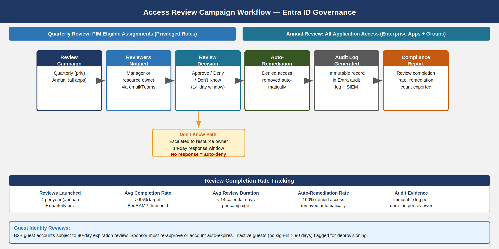

::: {.fouo-banner}
INTERNAL — NOT FOR PUBLIC DISTRIBUTION
:::

::: {.callout-important}
**Series Context** — This document is Part 09 of the 27-book Federal Application-Aware Networking series (Books 00–26). Parts 01–08 established the foundational layers: DDI and IPAM (Book 01), Namespace-Anchored Trust and PKI (Book 02), Network Access Control with 802.1X (Book 03), DNS Security and Protective DNS (Book 04), Federal Network Modernization and ZTNA (Books 05–06), Email and Collaboration Security (Book 07), and Vulnerability Management (Book 08). Parts 01–08 authenticate users and devices — they answer the question "is this entity who it claims to be?" This book asks the next question: "who is this entity, what access should they have, and is that access still appropriate?" Identity Governance and Administration (IGA) manages the full lifecycle of every account from the moment an employee is hired through transfer, departure, and beyond. A credential that survives a termination event is a standing attack surface; an account whose privileges were never adjusted after a role change is a least-privilege failure waiting to be exploited. This book closes both gaps through Entra ID Governance, JML automation, access reviews, and entitlement management. Controls closed: AC-2, AC-2(1), AC-2(2), AC-2(3), AC-2(4), AC-2(7), AC-5, PS-4, PS-5, PS-7, AC-6(7).
:::

# What This Document Addresses

Federal identity programs fail at a predictable set of points that FedRAMP assessors have learned to probe systematically. The first failure is lifecycle latency: when an employee leaves SSA, how long does their Entra ID account remain active? FedRAMP assessors have found accounts active for weeks or months after separation. PS-4 (Personnel Termination) requires that access be terminated on the day of separation; the reality in many agencies is that HR notifies IT through a manual email chain that may take days to process. The second failure is privilege creep: an employee who was promoted from a GS-9 analyst role to a GS-13 supervisory role three years ago may still have access to every system they accumulated in the previous role, plus the new supervisory access, because access is additive and revocation is manual. AC-6(7) (Review of User Privileges) requires periodic review of user privileges with the explicit goal of detecting and removing excess access. The third failure is entitlement opacity: when an assessor asks "who has access to the Benefits Administration system?" no one can produce an authoritative answer from a single source — access is scattered across Active Directory groups, SharePoint permissions, application-native roles, and service account membership. The fourth failure is segregation of duties enforcement: in small federal IT organizations, the same person sometimes holds Global Administrator and Security Administrator roles, or Finance Approver and Finance Requester roles, creating conditions for undetected fraud or insider threat.

This document addresses all four failures through a unified Identity Governance architecture built on Microsoft Entra ID Governance, with automation linked to the HR system of record (Workday/SAP) via the System for Cross-domain Identity Management (SCIM) protocol. The architecture is not aspirational — every component described is available in Entra ID Governance today and is included in the SSA Microsoft 365 GCC Moderate licensing agreement.

The technical content is organized as follows: Section 2 covers the Joiner/Mover/Leaver lifecycle and its automation. Section 3 covers access reviews — the quarterly and annual campaigns that catch what automation misses. Section 4 covers entitlement management — the access package model that makes access requestable, time-limited, and auditable. Section 5 covers Segregation of Duties policy. Section 6 covers identity risk scoring and risk-based Conditional Access. Section 7 covers guest identity lifecycle for B2B collaborators. Section 8 covers orphaned account detection and cleanup. Section 9 maps all controls closed.

::: {.callout-note}
**Licensing Note** — The features described in this document require **Entra ID Governance** (formerly Azure AD Identity Governance), which is included in Microsoft 365 GCC Moderate E3/E5 with the Entra ID Governance add-on or bundled in Microsoft 365 E5. Entra ID P2 is required for Privileged Identity Management (PIM) and Identity Protection. Confirm license assignment before implementing access reviews and PIM-based entitlement workflows.
:::

---

# The Joiner/Mover/Leaver Lifecycle

## The Problem: Manual Identity Operations at Scale

SSA processes thousands of personnel actions annually — new hires, role changes, transfers between components, contractors on-boarded and off-boarded, and retirements. Each event requires corresponding identity operations: creating accounts, modifying group memberships, revoking access packages, disabling accounts, and eventually deleting them. Performed manually, these operations are slow, inconsistent, and frequently incomplete. A termination event that generates an HR system record on a Friday afternoon may not reach the IT operations team until Monday morning — leaving the departing employee's account active over a weekend.

The automated JML architecture eliminates manual handoffs by creating a direct machine-to-machine integration between the HR system and Entra ID. The HR system (Workday or SAP SuccessFactors) is the system of record for every personnel attribute: name, employee ID, department, job code, manager, start date, and term date. Entra ID is the identity authority for cloud access. The SCIM protocol provides the standard bridge between them.

## Joiner: Account Provisioning on Day Zero

When a new hire record is created in Workday with a start date, Workday's SCIM provisioning channel pushes the new identity to Entra ID within minutes. The Entra provisioning agent creates the account, sets initial attributes from the Workday profile, and triggers the access package assignment logic based on the employee's job code and department.

The account creation sequence is:

1. Workday record created with `startDate`, `department`, `jobCode`, `manager`, and `employeeType` attributes
2. SCIM push to Entra ID provisioning endpoint (Azure AD Provisioning service, tenant-scoped)
3. Entra creates user object with UPN derived from `firstName.lastName@ssa.gov` (or `@ctr.ssa.gov` for contractors)
4. Attribute mapping applies: `department` → Entra `department`; `manager` → Entra `manager`; `jobCode` → Entra `extensionAttribute1`
5. Access package auto-assignment policy evaluates `jobCode` against catalog membership rules; matching packages are assigned automatically
6. MFA registration link emailed to personal address on file in Workday (pre-hire flow) or to manager for day-1 delivery
7. Account is in active state before the employee's first workday

The Service Level Agreement (SLA) for Joiner provisioning is **account active within 30 minutes of HR system record creation**. This SLA is enforced by the Entra provisioning job schedule (configurable to near-real-time with incremental sync cycles of 40 minutes maximum).

### Attribute-Driven Access Package Auto-Assignment

Entra ID Governance access packages support **auto-assignment policies** — rules that automatically assign an access package to any user matching a dynamic group or attribute filter. This eliminates the need for managers to request access for new hires; access follows the job code.

```powershell
# Create auto-assignment policy for Benefits-Admin access package
# Requires: Entra ID Governance license + Global Admin or Identity Governance Admin

$policyBody = @{
    displayName  = "Auto-Assign: Benefits Admin Access — JobCode HR-BEN-*"
    description  = "Automatically assigns Benefits Admin access package to all users with jobCode matching HR-BEN-*"
    accessPackageId = "<benefits-admin-package-id>"
    specificAllowedTargets = @(
        @{
            "@odata.type" = "#microsoft.graph.attributeRuleMembers"
            description   = "Users with HR Benefits job codes"
            membership    = @{
                "@odata.type" = "#microsoft.graph.dynamicAttributeMembership"
                rules         = @(
                    @{
                        claim      = "extensionAttribute1"
                        operation  = "startsWith"
                        value      = "HR-BEN-"
                    }
                )
            }
        }
    )
    automaticRequestSettings = @{
        requestAccessForAllowedTargets = $true
        removeAccessWhenTargetLeavesAllowedTargets = $true
        accessRemovalAfterExpiration   = $false
    }
    expiration = @{
        durationType  = "noExpiration"
        durationInDays = $null
    }
    requestApprovalSettings = @{
        isApprovalRequiredForAdd    = $false
        isApprovalRequiredForUpdate = $false
    }
} | ConvertTo-Json -Depth 8

# POST to Graph API: /v1.0/identityGovernance/entitlementManagement/assignmentPolicies
Invoke-MgGraphRequest -Method POST `
    -Uri "https://graph.microsoft.com/v1.0/identityGovernance/entitlementManagement/assignmentPolicies" `
    -Body $policyBody -ContentType "application/json"
```

The `removeAccessWhenTargetLeavesAllowedTargets` flag is the critical Mover control: if the user's `extensionAttribute1` changes to a non-matching job code (role change), the access package is automatically removed. This is the mechanism that prevents privilege creep without requiring a manual review.

## Mover: Attribute-Driven Access Re-Evaluation

When an employee moves to a new role, the HR system updates the Workday record with the new department, job code, and manager. The SCIM sync propagates these changes to Entra within the provisioning cycle window (maximum 40 minutes for incremental sync). Entra updates the user's attributes, which in turn triggers dynamic group membership re-evaluation and access package policy re-evaluation.

The Mover sequence is:

1. Workday role change record created with new `department`, `jobCode`, `manager`
2. SCIM incremental sync pushes attribute delta to Entra provisioning endpoint
3. Entra updates user attributes
4. Dynamic groups re-evaluate membership based on updated attributes
5. Access packages with auto-assignment policies re-evaluate: packages where the user no longer satisfies the eligibility rule are revoked; packages where the user now satisfies a new rule are assigned
6. Approval workflow triggered for any new access packages that require manager approval for moves (configurable per package)

**SLA for Mover access re-evaluation: old access removed and new access active within 4 hours of HR system update.**

::: {.callout-warning}
**The Gap That Access Reviews Catch** — Attribute-driven auto-assignment handles access packages with auto-assignment policies. It does NOT automatically handle access granted through manual requests, group membership added outside the entitlement management system, or direct role assignments in application-native systems (e.g., direct SharePoint site permissions, Salesforce profile assignments). The quarterly and annual access reviews described in Section 3 are the control that catches these cases.
:::

## Leaver: 60-Minute Account Disable SLA

The Leaver workflow is the highest-stakes lifecycle event from a security standpoint. A terminated employee whose account remains active is a standing credential risk — particularly if they departed under adversarial circumstances. The 60-minute SLA from HR event to account disable is a binding requirement for this implementation.

The Leaver sequence is:

1. Workday termination record created (either on term date for planned departures or immediately for involuntary separations)
2. SCIM push propagates `active: false` to Entra provisioning endpoint
3. Entra disables the account — all active sessions are revoked via continuous access evaluation (CAE)
4. All access package assignments are removed (cascade from account disable + explicit revocation)
5. Manager notified of account disable with list of access packages revoked
6. Account soft-deleted after 30 days (Entra Recycle Bin — recoverable during 30-day window)
7. Account permanently deleted after 30-day soft-delete period

The 60-minute SLA requires that the Workday SCIM provisioning job runs on a near-real-time cycle. The default Entra provisioning cycle is 40 minutes for incremental sync. For involuntary terminations requiring immediate action, a manual trigger is available through the Graph API.

```powershell
# Emergency immediate account disable — for involuntary terminations
# Bypasses the 40-minute SCIM sync cycle
# Requires: User Administrator role or Privileged Authentication Administrator

param(
    [Parameter(Mandatory)]
    [string]$UserPrincipalName,

    [Parameter(Mandatory)]
    [string]$TerminationReason,   # Recorded in audit log

    [string]$TicketNumber = "N/A"
)

# Disable account immediately
Update-MgUser -UserId $UserPrincipalName -AccountEnabled $false

# Revoke all active sessions (Continuous Access Evaluation enforcement)
Revoke-MgUserSignInSession -UserId $UserPrincipalName

# Remove all group memberships except mail-enabled security groups (for archival)
$groups = Get-MgUserMemberOf -UserId $UserPrincipalName -All |
    Where-Object { $_.'@odata.type' -eq '#microsoft.graph.group' }
foreach ($g in $groups) {
    Remove-MgGroupMemberByRef -GroupId $g.Id -DirectoryObjectId (Get-MgUser -UserId $UserPrincipalName).Id
}

# Remove all access package assignments
$assignments = Get-MgEntitlementManagementAssignment -Filter "principal/userPrincipalName eq '$UserPrincipalName'" -All
foreach ($a in $assignments) {
    $cancelBody = @{ assignmentState = "canceled" } | ConvertTo-Json
    Invoke-MgGraphRequest -Method PATCH `
        -Uri "https://graph.microsoft.com/v1.0/identityGovernance/entitlementManagement/assignments/$($a.Id)" `
        -Body $cancelBody -ContentType "application/json"
}

# Log to audit stream
Write-EventLog -LogName Application -Source "SSA-IGA" -EventId 4000 -EntryType Warning `
    -Message "Emergency account disable: $UserPrincipalName | Reason: $TerminationReason | Ticket: $TicketNumber"

Write-Host "Account disabled: $UserPrincipalName"
Write-Host "Sessions revoked: $(($groups).Count) group memberships removed"
Write-Host "Access packages revoked: $(($assignments).Count)"
Write-Host "Timestamp: $(Get-Date -Format 'yyyy-MM-ddTHH:mm:ssZ')"
```

{#fig-iga01 fig-alt="Three swim lane diagram on a light gray background. Top lane labeled JOINER in teal: five boxes showing HR System Trigger, Entra Account Created, Access Package Assigned, Welcome Email Sent, Day-1 Ready connected by arrows. Middle lane labeled MOVER in blue: five boxes showing Role Change in HR, Entra Attributes Updated, Access Re-Evaluated, Old Access Removed, New Access Active. Bottom lane labeled LEAVER in orange: five boxes showing Termination in HR, Account Disabled, Access Packages Revoked, Guest Access Ended, Account Deleted with final two boxes in red. SLA callout bars at bottom: Joiner 30 min, Mover 4 hours, Leaver 60 min disable then 30 days delete." width="100%"}

---

# Access Reviews

## Why Automation Is Not Sufficient

The JML automation described in Section 2 handles access changes triggered by HR system events: hires, transfers, and terminations that flow through Workday. It does NOT handle:

- Direct role assignments made outside the access package system (e.g., a sysadmin manually adding someone to a privileged group)
- Access granted before the entitlement management system was implemented
- Application-native permissions that are not connected to Entra ID governance
- Access that is technically within policy but no longer operationally needed ("stale access")
- PIM eligible role assignments that were granted and never reviewed

Access reviews are the control mechanism that catches these cases. NIST SP 800-53 Rev 5 AC-2(4) requires automated auditing of account management actions; AC-6(7) explicitly requires the organization to "review at least annually the privileges assigned to all users to validate the need for such privileges." FedRAMP Moderate adds specificity: quarterly review for privileged role assignments, annual review for all application access.

## Access Review Campaign Configuration

Entra ID Governance access reviews are configured as campaigns — time-bounded review periods with defined reviewers, scope, and automated remediation. The following campaigns are required for FedRAMP Moderate compliance:

| Campaign | Scope | Frequency | Reviewer | Auto-Remediation |
|---|---|---|---|---|
| PIM Eligible Roles | All PIM eligible assignments (Global Admin, Security Admin, User Admin, etc.) | Quarterly | Resource owner + ISSO | Denied = PIM assignment removed |
| Application Access | All enterprise application assignments | Annual | Direct manager | Denied = app assignment removed |
| Group Membership | All security groups > 10 members | Annual | Group owner | Denied = member removed |
| Guest Access | All B2B guest accounts | 90 days | Sponsor | No response = account expired |
| Privileged Group Membership | Tier 0 and Tier 1 groups (domain admins, schema admins, etc.) | Quarterly | ISSO | Denied = immediate removal |

: Access review campaign configuration for FedRAMP Moderate compliance {.striped .hover}

## Reviewer Assignment Logic

Access review effectiveness depends on assigning the right reviewer. A reviewer who does not know the access they are reviewing will approve everything. Entra ID Governance supports three reviewer assignment models:

**Manager review** assigns the user's direct manager as the reviewer. This is appropriate for broad application access where the manager has operational knowledge of what access is needed. The limitation is that a manager who manages many people may approve access reflexively rather than thoughtfully.

**Resource owner review** assigns the owner of the resource (application, group, or access package) as the reviewer. This is appropriate for privileged access and specialized applications where the resource owner knows the access model better than the manager.

**Self-review** asks the user themselves whether they still need the access. This is appropriate only for low-risk access and should never be used for privileged roles. FedRAMP assessors will flag privileged self-reviews as a control deficiency.

**Fallback reviewer** should always be configured. If the assigned reviewer does not respond within the review window, the fallback reviewer (typically the ISSO or a designated identity governance administrator) receives the assignment. Without a fallback, a non-responsive manager causes reviews to lapse.

```powershell
# Create quarterly PIM eligible role access review
# Targets all PIM-eligible Global Admin, Security Admin, User Admin assignments
# Reviewer: resource owner (role-specific owner group) with ISSO fallback

Connect-MgGraph -Scopes "AccessReview.ReadWrite.All"

$reviewBody = @{
    displayName = "Quarterly PIM Eligible Role Review — $(Get-Date -Format 'yyyy-QQ')"
    descriptionForAdmins = "Quarterly review of all PIM eligible role assignments per FedRAMP Moderate AC-6(7)"
    descriptionForReviewers = "Review each user's continued need for the privileged role. Deny if access is no longer needed or if you are unsure. Denied access is removed automatically."
    instanceEnumerationScope = @{
        "@odata.type" = "#microsoft.graph.accessReviewQueryScope"
        query         = "/roleManagement/directory/roleEligibilitySchedules?`$expand=principal,roleDefinition"
        queryType     = "MicrosoftGraph"
    }
    scope = @{
        "@odata.type" = "#microsoft.graph.accessReviewQueryScope"
        query         = "/roleManagement/directory/roleEligibilitySchedules?`$filter=roleDefinition/displayName in ('Global Administrator','Security Administrator','User Administrator','Privileged Role Administrator','Exchange Administrator')"
        queryType     = "MicrosoftGraph"
    }
    reviewers = @(
        @{
            query     = "./manager"
            queryType = "MicrosoftGraph"
        }
    )
    fallbackReviewers = @(
        @{
            query     = "/users/<isso-user-object-id>"
            queryType = "MicrosoftGraph"
        }
    )
    settings = @{
        mailNotificationsEnabled        = $true
        reminderNotificationsEnabled    = $true
        justificationRequiredOnApproval = $true
        defaultDecisionEnabled          = $true
        defaultDecision                 = "Deny"       # No response = deny
        instanceDurationInDays          = 14
        autoApplyDecisionsEnabled       = $true        # Auto-remove denied access
        recommendationsEnabled          = $true        # Show last sign-in data to reviewer
        recurrence = @{
            pattern = @{
                type     = "absoluteMonthly"
                interval = 3             # Every 3 months = quarterly
            }
            range = @{
                type      = "noEnd"
                startDate = "2026-07-01"
            }
        }
    }
} | ConvertTo-Json -Depth 10

Invoke-MgGraphRequest -Method POST `
    -Uri "https://graph.microsoft.com/v1.0/identityGovernance/accessReviews/definitions" `
    -Body $reviewBody -ContentType "application/json"

Write-Host "Quarterly PIM access review campaign created."
```

::: {.callout-important}
**Default Decision Must Be Deny** — The `defaultDecision: "Deny"` setting is required for FedRAMP Moderate compliance. If a reviewer does not respond within the review window, the access is automatically denied and removed. An `Approve` default or `Approve` recommendation override defeats the purpose of the review — a non-responsive reviewer becomes an implicit approval of all access they were assigned to review.
:::

## Access Review Evidence for Assessors

Each access review campaign produces an immutable audit trail that serves as the AC-6(7) evidence artifact. The audit record includes:

- Campaign name, start date, end date, and scope definition
- Every reviewer assignment (user ID, role, assignment method)
- Every review decision (approve/deny/don't know) with timestamp and justification text
- Every auto-remediation action taken (access removed, group membership revoked, PIM assignment cleared)
- Completion rate (percentage of assignments reviewed before campaign close)
- Fallback escalations (where primary reviewer did not respond)

This evidence is exportable from the Entra admin portal under **Identity Governance > Access Reviews > Completed Reviews > Download report** and is retained in the Entra audit log for 90 days with long-term export available to Log Analytics.

{#fig-iga02 fig-alt="Horizontal flow diagram with six main process boxes connected by arrows: Review Campaign Created (navy, quarterly or annual), Reviewers Notified (blue, manager or resource owner via email and Teams), Review Decision (teal, approve deny or don't know with 14-day window), Auto-Remediation (green, denied access removed automatically), Audit Log Generated (gray, immutable record in Entra audit log plus SIEM), Compliance Report (orange, review completion rate and remediation count exported). A branch from Review Decision downward shows the Don't Know path escalated to resource owner with 14-day window and no response equals auto-deny. Below all boxes is a completion rate tracking bar showing metrics for reviews launched, average completion rate over 95 percent target, average review duration under 14 days, auto-remediation rate 100 percent, and audit evidence per decision." width="100%"}

---

# Entitlement Management

## The Access Package Model

Traditional access management grants access as individual permissions scattered across systems — Active Directory group membership here, SharePoint permission there, application role assigned directly. This creates the entitlement opacity problem: no one can answer "who has access to system X" without querying each system individually and aggregating the results.

Entra ID Governance's entitlement management model reorganizes access around **access packages** — bundles of resources (application roles, group memberships, SharePoint sites) that represent a coherent business function. Instead of granting individual permissions, access management consists of assigning access packages to users. The inventory of "who has access to what" becomes a query against access package assignments — a single source of truth.

### Catalogs

Access packages are organized into **catalogs** — logical groupings by business domain. SSA should define catalogs aligned to its major functional areas:

| Catalog | Description | Owner | Visibility |
|---|---|---|---|
| HR Systems | Benefits, payroll, HR administration tools | HR Data Steward | SSA employees only |
| Finance Systems | General ledger, AP/AR, budget tools | CFO Office | SSA employees only |
| IT Operations | Infrastructure tools, monitoring, deployment | CISO Office | IT staff only |
| Case Management | Social Security case processing systems | Program Operations | SSA employees + contractors |
| External Collaboration | Tools accessible to connected organizations (contractors, state agencies) | Business Owner | SSA + connected orgs |

: Entitlement management catalog structure {.striped .hover}

### Access Package Anatomy

Each access package contains:

**Resources** — the specific permissions included. An access package can bundle multiple resources that are always needed together. For example, "Benefits Admin Access" might include: the `Benefits-Admin` app role in the Benefits Management application; membership in the `Benefits-Staff-SG` security group (which grants network access via NAC policy from Book 03); and the Benefits Team SharePoint site with Edit permissions.

**Policies** — the rules governing who can request the package, how approval works, and how long assignments last. A package can have multiple policies targeting different populations (SSA employees vs. contractors vs. connected organization users) with different approval requirements.

**Expiration** — all access package assignments in this implementation are time-limited. Assignments do not exist as permanent, standing entitlements. The maximum assignment duration is 365 days. At expiration, the user must re-request the access, triggering a new approval cycle.

## Approval Workflow Configuration

```powershell
# Create access package with two-stage approval workflow
# Stage 1: Direct manager (required)
# Stage 2: Resource owner (triggered if duration > 90 days or sensitivity flag set)

$packagePolicy = @{
    displayName     = "Benefits Admin Access — Standard Policy"
    description     = "Standard eligibility policy for SSA employees requesting Benefits Admin access"
    accessPackageId = "<benefits-admin-package-id>"
    allowedTargetScope = "specificDirectoryUsers"
    specificAllowedTargets = @(
        @{
            "@odata.type" = "#microsoft.graph.groupMembers"
            groupId       = "<ssa-all-employees-group-id>"
        }
    )
    expiration = @{
        durationType   = "afterDuration"
        durationInDays = 365
    }
    requestApprovalSettings = @{
        isApprovalRequiredForAdd    = $true
        isApprovalRequiredForUpdate = $false
        approvalMode                = "Serial"
        approvalStages = @(
            @{
                durationBeforeAutomaticDenial = "P14D"   # 14-day stage timeout = deny
                isApproverJustificationRequired = $true
                isEscalationEnabled             = $true
                durationBeforeEscalation        = "P7D"  # Escalate after 7 days
                primaryApprovers = @(
                    @{
                        "@odata.type" = "#microsoft.graph.requestorManager"
                        managerLevel  = 1
                    }
                )
                escalationApprovers = @(
                    @{
                        "@odata.type" = "#microsoft.graph.singleUser"
                        userId        = "<isso-user-id>"
                    }
                )
            },
            @{
                durationBeforeAutomaticDenial   = "P7D"
                isApproverJustificationRequired = $true
                isEscalationEnabled             = $false
                primaryApprovers = @(
                    @{
                        "@odata.type" = "#microsoft.graph.singleUser"
                        userId        = "<benefits-resource-owner-id>"
                    }
                )
            }
        )
    }
    requestorSettings = @{
        scopeType         = "SpecificDirectorySubjects"
        acceptRequests    = $true
        allowedRequestors = @(
            @{
                "@odata.type" = "#microsoft.graph.groupMembers"
                groupId       = "<ssa-all-employees-group-id>"
            }
        )
    }
    reviewSettings = @{
        isEnabled              = $true
        expirationBehavior     = "removeAccess"
        isReviewerJustificationRequired = $true
        reviewers = @(
            @{
                query     = "./manager"
                queryType = "MicrosoftGraph"
            }
        )
        schedule = @{
            startDateTime = "2026-07-01T00:00:00Z"
            expiration = @{
                duration    = "P14D"
                type        = "afterDuration"
            }
            recurrence = @{
                pattern = @{
                    type     = "absoluteMonthly"
                    interval = 12    # Annual review
                }
                range = @{
                    type      = "noEnd"
                    startDate = "2026-07-01"
                }
            }
        }
    }
} | ConvertTo-Json -Depth 12

Invoke-MgGraphRequest -Method POST `
    -Uri "https://graph.microsoft.com/v1.0/identityGovernance/entitlementManagement/assignmentPolicies" `
    -Body $packagePolicy -ContentType "application/json"

Write-Host "Benefits Admin access package policy created with two-stage approval and annual review."
```

{#fig-iga03 fig-alt="Four-column diagram on light gray background. Left column shows three catalog boxes: HR Systems Catalog in teal, Finance Systems Catalog in blue, IT Operations Catalog in navy, each showing owner, visibility, connected orgs, and review cycle. Center-left column shows five access package boxes: Benefits Admin Access, Payroll Read Only, Payroll Write Access in teal, GL Approver Role in blue, Prod Deploy Access in navy, each with catalog, permission level, and max duration. Center-right column shows four policy component boxes in blue: Resources Included showing app roles groups and SharePoint, Approval Policy showing two-stage manager then resource owner, Expiration Policy showing 365 day max with 30-day notice, Eligibility Policy showing SSA employees can request. Right column shows four request flow boxes connected by arrows: User Self-Service Request in teal, Stage 1 Approval in blue, Time-Limited Assignment in green, Expiration plus Offboarding in orange." width="100%"}

---

# Segregation of Duties

## SoD Policy Framework

Segregation of Duties (SoD) is the control principle that no single individual should hold incompatible combinations of access that would allow them to initiate and complete a sensitive transaction without oversight. In an identity context, SoD applies both to IAM roles (e.g., a person who can create users should not also be the approver for privileged role assignments) and to business roles (e.g., a person who can approve financial transactions should not also be the person requesting them).

NIST SP 800-53 Rev 5 AC-5 (Separation of Duties) requires that incompatible duties be separated and that access controls enforce the separation. The implementation uses two enforcement mechanisms:

**Hard SoD (Blocked)** — Conditional Access policy prevents a user from holding both roles simultaneously. The assignment of the second role triggers a CA policy that blocks access to the environment until the incompatibility is resolved. This is appropriate for role combinations that represent absolute prohibitions — cases where no business justification can override the separation.

**Soft SoD (Justification Required)** — PIM activation for one of the conflicting roles requires a documented business justification and approval from the ISSO. The conflicting access is time-limited (PIM activation window, typically 4–8 hours). This is appropriate for role combinations that may be legitimately needed in specific operational scenarios.

## Incompatible Role Combinations

The following role combinations are designated as SoD violations in the SSA IGA implementation:

| Role A | Role B | Violation Type | Enforcement | Rationale |
|---|---|---|---|---|
| Global Administrator | Security Administrator | Hard SoD | CA block at assignment | Global Admin can disable Security Admin; separation prevents single point of failure |
| Global Administrator | User Administrator | Hard SoD | CA block at assignment | User Admin creates accounts; Global Admin holds all permissions; combined = unrestricted identity control |
| Finance Approver | Finance Requester | Hard SoD | CA block at assignment | Same individual cannot both request and approve financial transactions |
| Prod Deploy | Prod Audit | Hard SoD | CA block at assignment | Developer cannot audit their own deployments; separation enables reliable audit trail |
| Prod Deploy | Prod Read-Only Audit | Soft SoD | PIM gate + justification | Access for debugging is sometimes legitimate but requires ISSO approval |
| Security Administrator | Exchange Administrator | Soft SoD | PIM gate + justification | Mail flow rule changes can affect security policies; concurrent hold requires justification |
| User Administrator | Privileged Role Administrator | Hard SoD | CA block at assignment | Combined role allows self-escalation of privileges |
| Application Administrator | Cloud App Security Administrator | Soft SoD | PIM gate + justification | Combined access allows modification of CASB policies governing their own applications |

: SoD incompatible role combinations for SSA GCC Moderate {.striped .hover}

## SoD Detection and Reporting

Entra ID Governance surfaces SoD violations in the **Identity Governance dashboard** under Entitlement Management > Access Packages > SoD Policies. When a user holds two roles designated as incompatible:

- A **risk event** is created in Entra Identity Protection
- The violation appears in the **Entra Identity Governance SoD violation report**
- A **Conditional Access block** (for hard SoD) prevents access until one role is removed, or a **PIM activation challenge** (for soft SoD) requires justification before concurrent access is permitted
- The violation is written to the Entra audit log and forwarded to the Sentinel SIEM workspace described in Book 18

```powershell
# Query SoD violations from Microsoft Graph — Identity Governance
# Requires: EntitlementManagement.Read.All permission

$sodViolations = Invoke-MgGraphRequest -Method GET `
    -Uri "https://graph.microsoft.com/v1.0/identityGovernance/entitlementManagement/assignments?`$filter=state eq 'Delivered'&`$expand=accessPackage,target&`$top=999"

# Cross-reference against incompatible pairs (defined in local policy table)
$incompatiblePairs = @(
    @("Global Administrator", "Security Administrator"),
    @("Global Administrator", "User Administrator"),
    @("Finance Approver", "Finance Requester"),
    @("Prod Deploy", "Prod Audit"),
    @("User Administrator", "Privileged Role Administrator")
)

$violations = @()
$userAssignments = $sodViolations.value | Group-Object { $_.target.id }

foreach ($userGroup in $userAssignments) {
    $heldPackages = $userGroup.Group | Select-Object -ExpandProperty accessPackage | Select-Object -ExpandProperty displayName

    foreach ($pair in $incompatiblePairs) {
        if ($heldPackages -contains $pair[0] -and $heldPackages -contains $pair[1]) {
            $violations += [PSCustomObject]@{
                UserId    = $userGroup.Name
                Package1  = $pair[0]
                Package2  = $pair[1]
                Type      = "HARD_SOD"
                Detected  = (Get-Date).ToString("yyyy-MM-ddTHH:mm:ssZ")
            }
        }
    }
}

$violations | Format-Table -AutoSize
$violations | ConvertTo-Json | Set-Content ".\sod-violations-$(Get-Date -Format 'yyyy-MM-dd').json"
Write-Host "SoD violation scan complete. Violations found: $($violations.Count)"
```

{#fig-iga04 fig-alt="Grid matrix with eight role labels on both the row header column in navy and the column header row in navy: Global Admin, Security Admin, Finance Approver, Finance Requester, Prod Deploy, Prod Audit, User Admin, App Registration. Intersection cells are color coded: red cells labeled HARD for blocked role combinations such as Global Admin plus Security Admin or Global Admin plus User Admin, amber cells labeled SOFT for combinations requiring justification such as Global Admin plus Finance Approver, and green cells labeled OK for compatible combinations. Diagonal cells are gray labeled with dash symbol for same-role intersection. A right-side enforcement column shows CA Policy block plus alert for hard violations and PIM gate plus justification for soft violations. A callout box at the bottom describes the Entra Identity Governance SoD violation report and the 48-hour ISSO acknowledgement requirement for soft violations." width="100%"}

---

# Identity Risk Scoring

## Entra Identity Protection Overview

Entra Identity Protection is the Microsoft service that continuously evaluates user accounts and sign-in events for behavioral indicators of compromise. It maintains two independent risk scores:

- **User risk** — the probability that the user account itself has been compromised (e.g., credentials stolen and available to an attacker). User risk is based on signals like leaked credentials found in dark web data breaches, anomalous account behavior, and threat intelligence correlation.
- **Sign-in risk** — the probability that a specific sign-in event was not performed by the legitimate account owner. Sign-in risk is evaluated in real time at the moment of authentication.

Both scores are on a three-level scale: Low, Medium, and High. These scores feed into Conditional Access policies that determine what authentication is required or whether access is blocked entirely.

## Risk Event Categories

Identity Protection evaluates the following risk events, which contribute to user and sign-in risk scores:

| Risk Event | Type | Risk Contribution | Detection Method |
|---|---|---|---|
| Leaked credentials | User risk | High | Microsoft threat intelligence — credentials found in breach databases or dark web marketplaces |
| Impossible travel | Sign-in risk | High | Two sign-ins from locations that are physically impossible to reach within the elapsed time |
| Atypical travel | Sign-in risk | Medium | Travel patterns inconsistent with user baseline (unfamiliar geographic locations) |
| Unfamiliar sign-in properties | Sign-in risk | Medium | New ASN (ISP), unfamiliar device fingerprint, unusual browser or OS not previously seen for this account |
| Malware-linked IP address | Sign-in risk | High | Source IP address listed in Microsoft threat intelligence as associated with botnet C2 or malware distribution |
| Anonymous IP address | Sign-in risk | Medium | Tor exit node, known VPN provider, or proxy server — attacker anonymization pattern |
| Password spray | User risk | High | Pattern of failed password attempts across multiple accounts from a single source — automated credential attack |
| Azure AD threat intelligence | Sign-in risk | High/Medium | Microsoft internal threat intelligence flagging — catch-all for anomalies not covered by other detectors |

: Entra Identity Protection risk event categories and detection methods {.striped .hover}

## Risk-Based Conditional Access Policies

Risk scores trigger Conditional Access policies that enforce proportionate authentication requirements. The policy ladder is:

**High User Risk → Block + Require Password Reset:** The account is blocked from all access. The user must perform a self-service password reset (SSPR) before access is restored. The password reset clears the user risk score, because the previous credential is no longer valid. This policy applies unconditionally — no business justification overrides a high user risk block.

**Medium User Risk → Require MFA + Compliant Device:** The user is prompted for MFA at every sign-in and must be on a compliant device (Intune-managed, BitLocker enabled, not jailbroken). Session lifetime is reduced to 1 hour. The policy auto-remediates: if the user completes MFA successfully and no additional risk events occur, the risk score automatically decreases over time.

**High Sign-in Risk → Block Sign-in:** The specific sign-in attempt is blocked. The user receives a notification and can re-attempt from a trusted location. Persistent high sign-in risk from the same user triggers escalation to the SOC.

**Medium Sign-in Risk → Require MFA for Session:** The specific sign-in requires MFA challenge. A successful MFA response from a phishing-resistant authenticator (FIDO2 key, Windows Hello for Business) clears the sign-in risk for that session.

```powershell
# Create risk-based Conditional Access policies
# Requires: Global Administrator or Conditional Access Administrator role

Connect-MgGraph -Scopes "Policy.ReadWrite.ConditionalAccess"

# Policy 1: High User Risk — Block access, require password reset
$highUserRiskPolicy = @{
    displayName  = "SSA-CA-HighUserRisk-Block"
    state        = "enabled"
    conditions   = @{
        users      = @{ includeUsers = @("All"); excludeGroups = @("<break-glass-group-id>") }
        applications = @{ includeApplications = @("All") }
        userRiskLevels = @("high")
        platforms    = @{ includePlatforms = @("all") }
    }
    grantControls = @{
        operator        = "OR"
        builtInControls = @("block")
    }
    sessionControls = $null
} | ConvertTo-Json -Depth 8

# Policy 2: Medium User Risk — Require MFA + compliant device
$medUserRiskPolicy = @{
    displayName  = "SSA-CA-MediumUserRisk-MFA-CompliantDevice"
    state        = "enabled"
    conditions   = @{
        users      = @{ includeUsers = @("All"); excludeGroups = @("<break-glass-group-id>") }
        applications = @{ includeApplications = @("All") }
        userRiskLevels = @("medium")
    }
    grantControls = @{
        operator        = "AND"
        builtInControls = @("mfa", "compliantDevice")
    }
    sessionControls = @{
        signInFrequency = @{
            value         = 1
            type          = "hours"
            isEnabled     = $true
            authenticationType = "primaryAndSecondaryAuthentication"
        }
    }
} | ConvertTo-Json -Depth 8

# Policy 3: High Sign-in Risk — Block
$highSigninRiskPolicy = @{
    displayName  = "SSA-CA-HighSigninRisk-Block"
    state        = "enabled"
    conditions   = @{
        users          = @{ includeUsers = @("All"); excludeGroups = @("<break-glass-group-id>") }
        applications   = @{ includeApplications = @("All") }
        signInRiskLevels = @("high")
    }
    grantControls = @{
        operator        = "OR"
        builtInControls = @("block")
    }
} | ConvertTo-Json -Depth 8

foreach ($policy in @($highUserRiskPolicy, $medUserRiskPolicy, $highSigninRiskPolicy)) {
    $result = Invoke-MgGraphRequest -Method POST `
        -Uri "https://graph.microsoft.com/v1.0/identity/conditionalAccess/policies" `
        -Body $policy -ContentType "application/json"
    Write-Host "Created CA policy: $($result.displayName)"
}
```

{#fig-iga05 fig-alt="Four-column diagram on light gray background. Left column labeled Risk Event Detections contains six colored boxes: Leaked Credentials and Impossible Travel in red, Atypical Travel, Unfamiliar Sign-in Properties, and Anonymous IP in amber, Malware-Linked IP in red, each with arrows pointing right. Center column labeled Risk Score Aggregation shows two stacked rectangles: User Risk Score with HIGH in red, MEDIUM in amber, LOW in green levels, and Sign-in Risk Score with the same three levels. The levels connect to the right column via arrows. Third column labeled Conditional Access Risk Policies shows four boxes: High User Risk Block in red, Medium User Risk MFA in amber, High Sign-in Risk Block in red, Medium Sign-in Risk MFA in amber, each with arrows to the far right column. Right column labeled Remediation Outcomes shows five boxes: Password Reset plus MFA Re-register in red, MFA Challenge Passed in amber, ISSO Risk Dismiss in navy, No Response Escalate in red, Self-Remediation low risk in green." width="100%"}

---

# Guest Identity Lifecycle

## B2B Collaboration Governance

SSA collaborates with state Social Security agencies, contractors, oversight bodies (OMB, OIG), and third-party service providers. Many of these external collaborators require access to SSA systems — SharePoint sites, Teams channels, specific applications. Entra B2B (Business-to-Business) federation provides the mechanism: external users authenticate to their own organization's identity provider and are granted guest access to SSA resources through Entra B2B invitation.

PS-7 (Third-Party Personnel Security) requires that third-party personnel who have access to SSA information systems be subject to personnel security requirements commensurate with the level of access and risk involved. The B2B governance controls implement this requirement.

## Guest Account Controls

**Invitation gating** — All B2B invitations must be sent through the access package request workflow, not through ad hoc SharePoint or Teams invitations. The "External user" eligibility category in the access package system routes B2B requests through a sponsor approval workflow. Direct invitations (via Teams or SharePoint "share" functionality) are blocked by a guest invitation policy in Entra:

```powershell
# Block ad hoc guest invitations — only allow through access packages
Update-MgPolicyAuthorizationPolicy -GuestUserRoleId "2af84b1e-32c8-42b7-82bc-daa82404023b" `
    -AllowInvitesFrom "adminsAndGuestInviters"   # Only designated sponsors can invite

# Set B2B collaboration restrictions — allow only approved domains
$b2bPolicy = @{
    b2bCollaborationInbound = @{
        usersAndGroups = @{
            accessType  = "allowedByPolicy"
            users       = @()
            groups      = @()
        }
        applications = @{
            accessType  = "allowedByPolicy"
            targets     = @()
        }
    }
    b2bDirectConnectInbound = @{
        usersAndGroups = @{
            accessType  = "blockedByPolicy"
        }
    }
}
# Apply via /policies/crossTenantAccessPolicy
```

**Automatic expiration** — All B2B guest access packages have a maximum assignment duration of 180 days. At expiration, the guest account is automatically disabled. The sponsor receives a 30-day advance notification and must re-approve to extend.

**Inactive guest cleanup** — Guest accounts with no sign-in activity for 90 days are flagged by the orphaned account detection process (Section 8) and disabled, regardless of package expiration date.

**Access review for guests** — B2B guest accounts are subject to a 90-day access review. The assigned sponsor reviews the continued need for access. No response from the sponsor within the 14-day review window results in automatic access revocation.

| Guest Control | Mechanism | SLA/Threshold |
|---|---|---|
| Initial access via access package | Entitlement Management B2B invitation | Sponsor approves within 5 business days |
| Maximum access duration | Access package expiration policy | 180 days; re-approval required to extend |
| Inactive account disable | Orphaned account detection (Section 8) | 90 days no sign-in → disable |
| Periodic review | Access review campaign (90-day cadence) | 14-day review window; no response = deny |
| Account deletion | Post-disable cleanup | 30 days after disable → soft delete; 30 more days → permanent |

: B2B guest identity lifecycle controls {.striped .hover}

---

# Orphaned Account Detection and Cleanup

## The Orphaned Account Problem

An orphaned account is a user account that exists in Entra ID but has no active, legitimate owner — either because the owner left the organization and the account was not properly deprovisioned, or because the account was created for a purpose that no longer exists (a project that ended, a contractor whose contract expired). Orphaned accounts represent standing credential risk: an attacker who compromises the credentials to a dormant account has potential access that is unlikely to be noticed because the account is not regularly monitored.

AC-2(3) (Disable Inactive Accounts) and AC-2(4) (Automated Audit Actions) establish the requirement to identify and act on dormant accounts. The implementation uses a two-stage process: disable after 90 days of inactivity, delete after a further 30 days.

## Detection Script

```powershell
# Orphaned account detection and automated disable/delete pipeline
# Runs daily via Azure Automation or Logic App
# Thresholds: disable at 90 days inactive; delete at 30 days post-disable

param(
    [int]$InactiveDaysThreshold = 90,
    [int]$DisabledDeleteDaysThreshold = 30,
    [switch]$WhatIf,
    [string]$LogAnalyticsWorkspaceId,
    [string]$NotificationGroupId   # Group to receive disable/delete notifications
)

$disableThreshold = (Get-Date).AddDays(-$InactiveDaysThreshold)
$deleteThreshold  = (Get-Date).AddDays(-$DisabledDeleteDaysThreshold)

# Exclusion list: break-glass accounts, service accounts, shared mailboxes
$excludedGroups = @("<break-glass-group-id>", "<service-accounts-group-id>")
$excludedUsers  = (foreach ($gid in $excludedGroups) {
    Get-MgGroupMember -GroupId $gid -All | Select-Object -ExpandProperty Id
}) | Sort-Object -Unique

# --- Identify candidates for DISABLE (inactive, currently enabled) ---
$disableCandidates = Get-MgUser -All -Filter "accountEnabled eq true" `
    -Property "id,userPrincipalName,displayName,accountEnabled,signInActivity,userType,assignedLicenses" |
    Where-Object {
        $_.Id -notin $excludedUsers -and
        $_.UserType -eq "Member" -and           # Guests handled separately
        (
            $_.SignInActivity.LastSignInDateTime -lt $disableThreshold -or
            ($null -eq $_.SignInActivity.LastSignInDateTime -and           # Never signed in
             (Get-MgUser -UserId $_.Id).CreatedDateTime -lt $disableThreshold)
        )
    }

# --- Identify candidates for DELETE (disabled for 30+ days) ---
$deleteCandidates = Get-MgUser -All -Filter "accountEnabled eq false" `
    -Property "id,userPrincipalName,displayName,accountEnabled,signInActivity,deletedDateTime" |
    Where-Object {
        $_.Id -notin $excludedUsers -and
        # Use last disabled date from audit log
        (Get-MgAuditLogDirectoryAudit -Filter "activityDisplayName eq 'Disable account' and targetResources/any(t: t/id eq '$($_.Id)')" `
            | Sort-Object activityDateTime -Descending | Select-Object -First 1).activityDateTime -lt $deleteThreshold
    }

# --- DISABLE action ---
foreach ($user in $disableCandidates) {
    if (-not $WhatIf) {
        Update-MgUser -UserId $user.Id -AccountEnabled $false
        Write-EventLog -LogName Application -Source "SSA-IGA" -EventId 4001 -EntryType Warning `
            -Message "Orphaned account disabled: $($user.UserPrincipalName) | Last sign-in: $($user.SignInActivity.LastSignInDateTime)"
    }
    Write-Host "DISABLE: $($user.UserPrincipalName) | Last sign-in: $($user.SignInActivity.LastSignInDateTime)"
}

# --- DELETE action ---
foreach ($user in $deleteCandidates) {
    if (-not $WhatIf) {
        Remove-MgUser -UserId $user.Id   # Moves to Recycle Bin (30-day recoverable delete)
        Write-EventLog -LogName Application -Source "SSA-IGA" -EventId 4002 -EntryType Warning `
            -Message "Orphaned account soft-deleted: $($user.UserPrincipalName)"
    }
    Write-Host "DELETE: $($user.UserPrincipalName)"
}

# Summary output
$summary = [PSCustomObject]@{
    RunDate         = (Get-Date).ToString("yyyy-MM-ddTHH:mm:ssZ")
    DisableCandidates = $disableCandidates.Count
    DeleteCandidates  = $deleteCandidates.Count
    WhatIfMode        = $WhatIf.IsPresent
}
$summary | ConvertTo-Json | Set-Content ".\orphan-cleanup-$(Get-Date -Format 'yyyy-MM-dd').json"
Write-Host "`nOrphan cleanup summary: $($summary | ConvertTo-Json)"
```

## Exclusions and Break-Glass Accounts

Not all accounts with no recent sign-in activity are orphaned. The exclusion list must include:

- **Break-glass (emergency access) accounts** — These are intentionally not used in day-to-day operations. Disabling them during an incident involving Entra would be catastrophic. Break-glass accounts must be in a named exclusion group and must have sign-in activity monitored separately (any sign-in to a break-glass account is an alert event).
- **Service accounts** — Service accounts managed by Azure Managed Identity or workload identity federation may authenticate through certificate or managed identity channels that do not produce sign-in activity in the user sign-in log. Identify service accounts through naming convention (`svc-*@ssa.gov`) and group them in an exclusion group.
- **Shared mailboxes** — Exchange Online shared mailboxes are often licensed as user accounts but are accessed via delegation, not direct sign-in. They should be excluded from orphan detection or evaluated through a separate shared account review.

::: {.callout-important}
**Break-Glass Account Sign-In is a Security Event** — Configure an Azure Monitor alert to trigger whenever a break-glass account (identified by UPN pattern or group membership) completes a successful sign-in. Route this alert to the SOC via the Sentinel SIEM integration described in Book 18. A break-glass sign-in during normal operations indicates either an incident or unauthorized use of emergency credentials.
:::

---

# Shared and Temporary Account Controls

## AC-2(2): Temporary Account Removal

Temporary accounts — created for contractors with defined engagement end dates, for project-specific access, or for vendor support sessions — must be automatically removed at the end of their authorized period. Manual removal is not acceptable for FedRAMP Moderate: the human process introduces latency that creates standing credential risk.

The implementation enforces temporary account control through the access package expiration mechanism: contractor access packages have a maximum duration equal to the contract end date. At expiration, access is removed automatically. The contractor's Entra account (if created as a member account for a long-term contractor) is linked to an access package with auto-expiration. When the last access package expires, the account enters the orphaned account detection pipeline and is disabled within 90 days unless re-assigned a new access package.

For short-duration vendor support access (days to weeks), use Entra **Entitlement Management connected organizations** with a time-limited B2B access package. The vendor authenticates with their own credentials; the B2B access package expires at the agreed end of the support engagement.

## AC-2(7): Role-Based Access Schemes

Role-based access schemes require that access be determined by the user's role, not by individual privilege grants. The access package auto-assignment model described in Section 2 is the implementation of role-based access: job code in Workday maps to access package eligibility in Entra. A user's access is a function of their current role attributes, not of individually negotiated permissions.

The role-based scheme is validated quarterly through the PIM access review campaign (Section 3) and annually through the full application access review. Any direct role assignment that is not mediated through the access package system is flagged as a policy exception and must be documented with business justification and approved by the ISSO.

---

# NIST Control Closure Table

The following table maps each NIST SP 800-53 Rev 5 control addressed by this implementation to the specific mechanism that satisfies it, the state before this implementation, and the authoritative guidance that establishes the requirement.

| Control | Title | Without This Implementation | With This Implementation | Authority |
|---|---|---|---|---|
| AC-2 | Account Management | Account lifecycle managed through manual IT helpdesk tickets; no authoritative account inventory; deprovisioning SLA undefined and unenforced | Entra ID Governance provides authoritative account inventory; SCIM integration with Workday automates full lifecycle; deprovisioning within 60 minutes of HR event | NIST SP 800-53 Rev 5 AC-2; FedRAMP Moderate baseline |
| AC-2(1) | Automated System Account Management | Account creation and removal triggered by manual notifications; no automation; audit trail fragmented across helpdesk tickets | SCIM provisioning automates account creation, attribute updates, and removal; full audit trail in Entra provisioning logs and audit log | NIST SP 800-53 Rev 5 AC-2(1) |
| AC-2(2) | Automated Temporary and Emergency Account Management | Temporary contractor accounts created with no expiration; manual tracking in spreadsheets; frequently not removed at contract end | All access packages have maximum duration; contractor access expires at contract end date; emergency accounts in break-glass group excluded from orphan detection but monitored separately | NIST SP 800-53 Rev 5 AC-2(2) |
| AC-2(3) | Disable Inactive Accounts | No automated detection of dormant accounts; accounts of former employees occasionally active months after separation | Orphaned account detection script runs daily; accounts with no sign-in for 90 days are disabled; disabled accounts deleted after 30 further days; exclusion list prevents false positives | NIST SP 800-53 Rev 5 AC-2(3) |
| AC-2(4) | Automated Audit Actions | Account management audit actions recorded only in helpdesk system logs; not correlated with identity events | All account management actions logged in Entra audit log; forwarded to Sentinel SIEM; daily orphan cleanup script writes structured event log entries; alert on break-glass sign-in | NIST SP 800-53 Rev 5 AC-2(4) |
| AC-2(7) | Role-Based Access Schemes | Access granted through ad hoc group membership; no mapping between business role and access entitlements; privilege accumulation undetected | Access packages implement role-based entitlements; job code in Workday maps to access package eligibility; auto-assignment ensures access follows role; quarterly and annual reviews validate alignment | NIST SP 800-53 Rev 5 AC-2(7) |
| AC-5 | Separation of Duties | No formal SoD policy; same individual may hold incompatible roles; no automated detection or enforcement | SoD policy defines 8 incompatible role pairs; hard SoD enforced by Conditional Access block; soft SoD enforced by PIM gate with ISSO approval; daily SoD violation scan with report | NIST SP 800-53 Rev 5 AC-5 |
| PS-4 | Personnel Termination | HR notifies IT via email; no defined SLA; accounts remain active for days to weeks after termination | Workday termination event triggers SCIM push within provisioning cycle; account disabled within 60 minutes; emergency disable PowerShell script available for immediate action; all sessions revoked via CAE | NIST SP 800-53 Rev 5 PS-4; OMB M-22-09 |
| PS-5 | Personnel Transfer | Role change has no corresponding access change; old access accumulates; new access granted manually and slowly | Workday role change updates Entra attributes via SCIM; access package auto-assignment policies re-evaluate; old packages revoked; new packages assigned; Mover SLA 4 hours | NIST SP 800-53 Rev 5 PS-5 |
| PS-7 | Third-Party Personnel Security | Contractors invited via ad hoc SharePoint share or Teams invitation; no tracking; no expiration; no review | All contractor access through Entitlement Management B2B access packages; maximum 180-day duration; sponsor approval required; 90-day access review; inactive guest cleanup after 90 days no sign-in | NIST SP 800-53 Rev 5 PS-7 |
| AC-6(7) | Review of User Privileges | No formal access review; privilege review conducted only during security assessment cycles; evidence not retained | Quarterly PIM eligible role access review; annual application access review; automated reviewer assignment; auto-remediation of denied access; immutable audit trail retained 90 days in Entra, long-term in Log Analytics | NIST SP 800-53 Rev 5 AC-6(7) |

: NIST SP 800-53 Rev 5 control closure — Part 09 Identity Governance and Administration {.striped .hover}

---

# FedRAMP 20x KSI Alignment

::: {.callout-note}
**FedRAMP 20x KSI Alignment — Part 09 Identity Governance and Administration**

FedRAMP 20x replaces annual point-in-time assessment with continuous Key Security Indicators (KSIs) evaluated against machine-readable evidence streams. The KSI family relevant to this document is **KSI-IAM-PAC** (Identity and Access Management — Privileged Access Controls). The IGA implementation produces the following continuous KSI artifacts:

**KSI-IAM-PAC-01 — Account Lifecycle Automation:**
The Entra provisioning log provides a continuous record of account creation, attribute updates, and deprovisioning events correlated with Workday HR events. The KSI check verifies that no HR termination event has an Entra disable action occurring more than 60 minutes later. Any violation triggers an automatic alert and appears in the KSI dashboard.

**KSI-IAM-PAC-02 — Access Review Completion Rate:**
The Entra Identity Governance access review report exports completion rate per campaign. The FedRAMP 20x target is 95% or higher for each quarterly PIM review and annual application access review. Campaigns that close below 95% require a remediation plan submitted to the ISSO within 5 business days.

**KSI-IAM-PAC-03 — Privileged Role SoD Compliance:**
The daily SoD violation scan output (`sod-violations-<date>.json`) is the KSI artifact for AC-5. Any active hard SoD violation (Role A + Role B held simultaneously) requires remediation within 24 hours. Soft SoD violations without ISSO justification on file require remediation within 48 hours.

**KSI-IAM-PAC-04 — Inactive Account Remediation:**
The orphan cleanup script produces a daily `orphan-cleanup-<date>.json` summary. The KSI tracks the count of accounts disabled due to inactivity over the trailing 30 days and verifies that no disabled account has been left in a disabled-but-not-deleted state for more than 60 days.

**KSI-IAM-PAC-05 — Guest Account Currency:**
All B2B guest accounts must have a valid access package assignment and an active sponsor. The KSI checks for guest accounts with no package assignment (orphaned guest) or whose sponsor has left the organization. Orphaned guests are disabled within 24 hours of detection.

**Evidence Package for Assessment:**
- Entra provisioning log export — JML event record with timestamps and SLA calculation
- Access review campaign completion reports — per-campaign completion rate and remediation actions
- SoD violation scan output — daily JSON with all active and historical violations
- Orphan cleanup audit log — daily disable and delete actions with justification
- Access package assignment report — current snapshot of all active assignments with expiration dates

All artifacts are produced by the automation described in this document. No manual evidence assembly is required for an assessment request. Log Analytics retention is configured for 2 years to satisfy FedRAMP 20x long-term evidence requirements.
:::

---

*Part 09 of 27 — Identity Governance and Administration follows the authentication infrastructure established in Parts 01–08 (DDI/IPAM, Namespace Trust, NAC, DNS Security, Network Modernization, Federal Telecom/ZTNA, Email Security, Vulnerability Management) and precedes Part 10 (Secrets Management) and Part 11 (SQL Server Authentication Modernization), which extend least-privilege controls to non-human identities and database service accounts respectively.*
