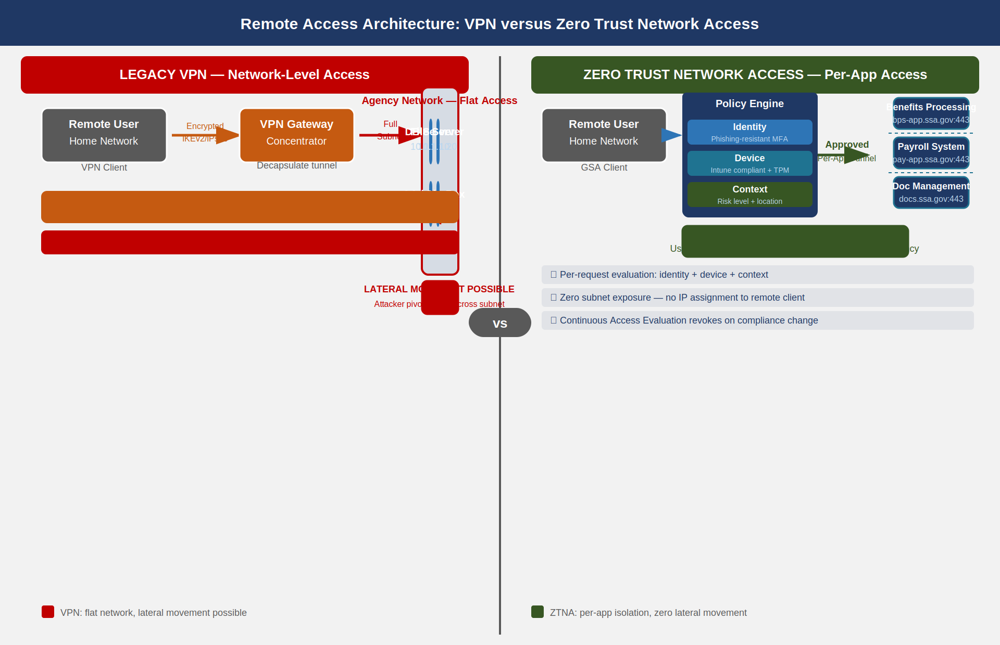

::: {.fouo-banner}
INTERNAL — NOT FOR PUBLIC DISTRIBUTION
:::

::: {.callout-important}
**Series Context** — This is Part 10 of the 27-book Federal Application-Aware Networking series. Parts 1–9 establish Landing Zone IPAM/DDI/PKI (01), Namespace-Anchored Trust (02), Network Access Control / 802.1X (03), DNS Security (04), Network Modernization (05), Federal Telecommunications and ZTNA (06), Email and Collaboration Security (07), Endpoint Security and EDR (08), and Data Protection via Microsoft Purview (09). This part addresses the most disruptive transition in federal network modernization: migrating remote-access workers from legacy VPN to Zero Trust Network Access (ZTNA), retiring the network perimeter concept, and closing the AC-17, CA-3, SC-7, SC-8, and IA-3 control families. Parts 11–26 address SQL Server authentication (11–13), Privileged Access Management (14), virtual machine security (15), secrets management (16), data protection (17), SIEM/XDR (18), incident response (19), business continuity (20), supply chain (21), CSPM (22), program management (23), PII processing (24), security training (25), and the authorization package (26).
:::

# What This Document Addresses

Parts 1 through 9 of this series address network physics, identity infrastructure, endpoint security, and data classification. They answer the questions: what is on the network, who is allowed to reach it, from what device, and whether the payload is protected at rest. One question remains structurally unresolved by those controls: how does a worker outside the agency boundary — working from home, from a hotel, or from a remote field office — connect to agency resources in a way that satisfies zero trust principles?

The answer in most federal agencies today is a VPN.

VPN was the right answer in 2005. In 2026, VPN is the single most persistent source of unresolved risk in the federal remote-access posture. Not because VPN encryption is broken — TLS 1.3 and IKEv2 with strong cipher suites are cryptographically sound — but because VPN was architected around a perimeter model that no longer exists. VPN grants network-layer access to a subnet; zero trust requires per-application access evaluated against identity, device compliance, and request context. Those are incompatible architectures. A VPN concentrator sitting in front of an agency data center is not zero trust, regardless of what authentication methods are layered on top of it.

This document addresses the migration from VPN to Zero Trust Network Access (ZTNA) using Microsoft Entra Private Access, the Global Secure Access platform, and Microsoft Intune for device compliance enforcement. It covers the architectural differences that make VPN fundamentally incompatible with zero trust, the phased deprecation plan, the split-tunneling routing model, the Conditional Access policies required for remote scenarios, device posture enforcement for Government-Furnished Equipment (GFE), and connection monitoring. It closes nine NIST SP 800-53 Rev 5 controls: AC-17, AC-17(1), AC-17(2), AC-17(3), AC-17(4), CA-3, SC-7, SC-8, and IA-3.

::: {.callout-note}
**Scope Boundary** — This document addresses remote access for the agency workforce: employees, contractors, and agency-approved users working from locations outside SSA network boundaries. It does not address machine-to-machine or system-to-system connections between federal information systems (those are addressed under CA-3 and the interconnection agreement framework separately). Site-to-site WAN circuits and SD-WAN policy are addressed in Book 05. ZTNA for citizen-facing applications is addressed in Book 06.
:::

# The VPN Architecture Problem

## How VPN Actually Works

A VPN client, upon authentication, receives a virtual network interface with an IP address drawn from an agency-internal address pool. From that point forward, the client's traffic is routed through an encrypted tunnel to a VPN concentrator — a physical or virtual appliance at the edge of the agency data center — where it is decapsulated and forwarded onto the agency network as if the client were a workstation physically plugged into an office switch.

This architecture has three structural properties that are incompatible with zero trust:

**Property 1 — Network-layer access, not application-layer access.** The VPN grants the remote client an IP address on an agency subnet. IP-level routing determines what that client can reach. In practice, remote workers are placed on subnets with broad routing permissions, because the alternative — maintaining per-user or per-role VPN split-route configurations — is operationally infeasible at scale. The result is that a remote worker's device, once VPN-connected, has network reachability to every server on the agency network that the subnet routing permits. This is not access control; it is proximity.

**Property 2 — Lateral movement enabled by default.** Because the VPN grants network-layer adjacency, a compromised remote device can communicate with other devices on the same subnet, enumerate the network, and escalate from one system to another. The VPN concentrator does not inspect or restrict east-west traffic within the agency network after the tunnel is established. NIST SP 800-207 (Zero Trust Architecture) specifically identifies this behavior as the primary deficiency of VPN: "A VPN grants access to the network; ZTNA grants access to specific resources. A compromised endpoint on a VPN has network adjacency to all resources visible to its subnet."

**Property 3 — Hairpinning to the data center.** Every packet from a remote worker — including traffic destined for Microsoft 365, which lives entirely in Microsoft's cloud — is routed through the VPN tunnel, into the agency data center, and then out to the internet from the data center's egress point. This hairpin adds latency, saturates the VPN concentrator's bandwidth capacity, and adds a point of failure between the remote worker and cloud-hosted services. Microsoft's own guidance for Microsoft 365 explicitly states that sending Microsoft 365 traffic through a VPN concentrator produces "significantly degraded user experience and sub-optimal network performance" and recommends direct internet breakout for all Microsoft 365 traffic categories.

{#fig-rax01 fig-alt="Side-by-side architecture diagram. Left panel labeled VPN: a user with a VPN client connects through an encrypted tunnel to a VPN gateway, which grants access to a flat network containing all agency servers. A red arrow labeled Lateral Movement possible points between servers. Right panel labeled ZTNA: a user with a ZTNA client is evaluated by identity, device compliance, and context signals before receiving a per-application tunnel that connects to a single specific application. A green label indicates No lateral movement is possible. The diagrams use navy and blue color coding for ZTNA, red and gray for VPN risks." width="100%"}

## The Authentication Problem Does Not Fix the Architecture Problem

A common federal response to VPN risk is to layer additional authentication controls on top of the existing VPN concentrator: require phishing-resistant MFA for VPN login, enforce device certificates, add risk-based authentication. These controls reduce the risk that an unauthorized user establishes a VPN session. They do not change what happens after the session is established. A user who is fully authenticated with a PIV-derived credential, on a managed device with a valid device certificate, connecting over a VPN — once connected — has the same flat network access problem as a user who authenticated with a username and password.

The architecture problem is not "who authenticated to the VPN." The architecture problem is "what can the VPN do once authenticated." The answer is: anything the subnet routing permits. Adding stronger authentication to a VPN does not convert it to zero trust. It makes unauthorized entry harder, which matters, but the interior posture remains incompatible with NIST SP 800-207.

## FIPS 140-3 and Cipher Suite Compliance

The cryptographic operations within the VPN tunnel are not the problem. IPsec IKEv2 with AES-256-GCM and SHA-384 satisfies FIPS 140-3 when implemented by a FIPS-validated cryptographic module. The current legacy VPN platform must be verified to use FIPS-validated modules (certificate list maintained by NIST CMVP); non-compliant VPN appliances in inventory must be identified and scheduled for decommissioning as part of Phase 1. This satisfies SC-8 for the transit encryption requirement throughout the migration, both for the legacy VPN and for the ZTNA TLS 1.3 tunnel.

# The Zero Trust Network Access Model

## ZTNA Architecture Principles

Zero Trust Network Access replaces the network-adjacency model with an application-specific access model. Under ZTNA, there is no virtual network interface issued to the remote client. There is no subnet address assignment. The remote worker's device connects to a ZTNA gateway — in the Entra Private Access implementation, this gateway is the Microsoft Global Secure Access service — which evaluates three signals before permitting any connection:

1. **Identity signal** — Is the user identity verified, via what credential, and at what assurance level? A phishing-resistant credential (FIDO2, Windows Hello for Business, or PIV-derived smartcard) is required for access to agency internal applications.

2. **Device compliance signal** — Is the device enrolled in Microsoft Intune, currently compliant with the assigned compliance policy, and running a current Microsoft Defender for Endpoint signature? A device that has not checked in within 24 hours is considered non-compliant until it checks in and passes the compliance evaluation.

3. **Context signal** — What is the risk level of the user account at this moment? What named location is the request originating from? Is the request occurring during expected working hours? Is there an active Identity Protection risk event on the account?

When all three signals are evaluated and the Conditional Access policy permits access, ZTNA establishes a per-application tunnel from the client to the specific application — not to the network the application lives on. The client can reach exactly the application endpoints defined in the Application Segment configuration; it has no network reachability to any other host on the agency network. If the device falls out of compliance during the session (for example, Defender detects malware), Continuous Access Evaluation revokes the access token within minutes.

## Entra Private Access and the Global Secure Access Platform

Microsoft Entra Private Access is the ZTNA component of the Microsoft Global Secure Access platform (the SSE — Security Service Edge — layer of Microsoft's SASE architecture). It provides ZTNA for on-premises and IaaS-hosted applications using a connector-based architecture that requires no inbound firewall rule from the internet to the agency data center.

The architecture has four logical components:

**Private Network Connector.** A Windows Server process deployed inside the agency network perimeter, installed on two or more domain-joined Windows Server 2019/2022 hosts for high availability. The connector makes outbound HTTPS connections to the Microsoft Entra service on port 443. No inbound firewall rules are required. The connector authenticates to Entra using a managed identity certificate issued at installation time. All traffic between the client and on-premises applications flows through this connector, inbound from the Microsoft backbone.

**Application Segment.** A configuration object in Entra Private Access that defines the specific IP addresses (or FQDN patterns) and port ranges that a given ZTNA "application" exposes. An Application Segment for the SSA benefits processing application might define `bps-app.ssa.gov:443` only. A user with access to that Application Segment cannot reach any other port on that server, or any other server in the data center, through the ZTNA tunnel.

**Enterprise Application Assignment.** Each Application Segment is associated with an Enterprise Application object in Entra ID. Users and groups are assigned to that application. The assignment determines who can request a ZTNA tunnel to that Application Segment. Conditional Access policy is evaluated at each connection using the Enterprise Application as the target resource.

**Global Secure Access Client.** The lightweight agent installed on managed GFE endpoints via Intune that intercepts traffic matching the Application Segment definitions and routes it through the ZTNA tunnel. For Windows 11 endpoints, the client integrates with the Windows Filtering Platform at the kernel level. It is policy-managed; users cannot disable it without an Intune action.

{#fig-rax02 fig-alt="Architecture diagram showing on-premises SSA application servers connecting to two redundant Private Network Connector hosts inside the agency firewall. The connectors make outbound-only HTTPS connections to the Microsoft backbone cloud. The backbone connects to the Global Secure Access service, where Conditional Access policy evaluates identity, device compliance, and location signals. After policy evaluation, a per-application tunnel is delivered to the user's GFE device running the Global Secure Access client. A separate path shows private DNS queries from the client routing through the ZTNA tunnel to an on-premises DNS server via the connector for name resolution of internal FQDNs." width="100%"}

## Private DNS Integration

On-premises applications are typically addressed by internal DNS names that do not resolve in public DNS. The ZTNA architecture must account for this: if a user's device queries `bps-app.ssa.gov` and that name only resolves on an internal DNS server, the Global Secure Access client must route that DNS query through the ZTNA tunnel to the internal resolver.

Entra Private Access addresses this through the Private DNS feature. When a DNS suffix is registered in the Private DNS configuration (for example, `ssa.gov` for internal FQDNs), the Global Secure Access client intercepts DNS queries for that suffix and routes them through the connector to the internal DNS server. The resolution result is returned to the client; subsequent connections to the resolved IP address are routed through the appropriate Application Segment tunnel.

::: {.callout-warning}
**DNS Suffix Scope** — The Private DNS suffix must be scoped precisely. Registering `.gov` as a private DNS suffix would cause the client to attempt to route all `.gov` DNS queries through the internal resolver, including queries for public `.gov` sites. Configure only the specific agency subdomain (e.g., `.internal.ssa.gov`) rather than the top-level agency domain. Work with the DDI team (Book 01) to confirm the private suffix scope before deploying.
:::

## Connector Redundancy and Health Monitoring

Each connector group should contain a minimum of two connector instances, deployed on separate Windows Server hosts in separate physical racks or virtual host clusters. The Entra Private Access service performs active health monitoring against each connector and automatically routes traffic away from an unhealthy connector within 60 seconds of failure detection. Connector health status is visible in the Microsoft Entra admin center under **Global Secure Access > Connect > Connectors**.

A connector is considered unhealthy if it has not made a successful heartbeat to the Entra service within 120 seconds. Causes of connector failure include: network outages blocking outbound port 443, Windows Server crash or patch reboot, resource exhaustion on the connector host, and certificate expiration on the connector's managed identity. All connector health events are logged to Microsoft Entra audit logs and should be forwarded to the Sentinel workspace (Book 18) for alerting.

# Phased VPN Deprecation

## Migration Philosophy

VPN deprecation is a behavioral change more than a technical one. The technical configuration — deploying connectors, configuring Application Segments, installing the Global Secure Access client — can be completed in days. The challenge is the long tail of applications that have implicit dependencies on VPN-granted network access: applications that use IP address–based access control lists, applications that authenticate via Kerberos tickets obtained over the network after VPN connection, applications that use broadcast protocols, and applications with hard-coded data center IP addresses in their configuration.

The migration plan uses a three-phase parallel operation model. Neither the VPN nor the ZTNA platform is ever a single point of failure during migration. Each phase has defined success criteria and a clear rollback criterion if the success criteria are not met.

{#fig-rax03 fig-alt="Horizontal timeline diagram divided into three phases. Phase 1 spans months 1 through 3 and is labeled ZTNA Parallel Deployment. Key milestones include connector deployment completed, pilot users onboarded, Application Segments defined, and success criteria of 50 pilot users on ZTNA with no VPN fallback. Phase 2 spans months 4 through 6 and is labeled ZTNA Default for Managed Devices. All managed GFE devices receive Global Secure Access client via Intune. VPN access restricted to a defined list of legacy applications. Success criteria of 90 percent of remote traffic through ZTNA. Phase 3 spans months 7 through 9 and is labeled VPN Decommission. Legacy applications either migrated to ZTNA-compatible auth or moved to cloud. VPN concentrator decommissioned. Success criteria of 100 percent of remote traffic through ZTNA or direct internet. Color-coded green for Phase 3 completion, amber for Phase 2, blue for Phase 1." width="100%"}

## Phase 1: Parallel Deployment (Months 1–3)

Phase 1 establishes the ZTNA infrastructure alongside the existing VPN without removing any VPN access. The objectives are to validate connector deployment, confirm that Application Segments correctly define application access boundaries, and verify that Conditional Access policy integration works end-to-end.

**Phase 1 Activities:**

*Week 1–2 — Infrastructure Deployment.*
Deploy two Private Network Connector hosts in the production data center. Connector hosts should be Windows Server 2022 with a minimum of 4 vCPU and 8 GB RAM for up to 250 concurrent users per connector pair. Install the connector software, complete the Entra registration workflow, and confirm connector health shows as Active in the admin center. Configure the connector group assignment for the agency's primary data center location.

*Week 3–4 — Application Segment Definition.*
Work with application owners to enumerate all on-premises applications currently accessed over VPN. For each application, document: the DNS name, the IP address (or CIDR range), and the ports and protocols required. Create an Application Segment for each application with the minimum-necessary port scope. Assign the Application Segment to an Enterprise Application object. Configure Private DNS suffixes for internal DNS names.

*Week 5–8 — Pilot User Group.*
Select a pilot group of 30–50 users who are technically capable and available for troubleshooting. Deploy the Global Secure Access client to pilot devices via an Intune configuration profile targeted at the pilot group. Configure Conditional Access policy for the pilot group: require compliant device and phishing-resistant MFA for all Application Segment enterprise applications. Do not modify VPN access for pilot users — they should have both available and should use ZTNA by preference.

*Week 9–12 — Validation and Correction.*
Monitor pilot user experience through the Global Secure Access traffic dashboard. Identify applications with latency above 150ms end-to-end (indicating possible connector routing issues). Identify any applications that fail with "connection refused" or DNS resolution errors (indicating missing Application Segment scope or Private DNS suffix). Resolve all identified issues before advancing to Phase 2.

**Phase 1 Success Criteria (all must pass):**
- All connector instances showing Active status with no sustained health failures
- Pilot users able to reach all assigned Application Segments without VPN fallback
- End-to-end latency for internal applications within 20% of on-premises direct-access baseline
- Zero Conditional Access policy bypass events detected in sign-in logs
- Private DNS resolution working for all internal FQDNs in scope

## Phase 2: ZTNA Default, VPN Restricted (Months 4–6)

Phase 2 deploys the Global Secure Access client to all managed GFE endpoints via Intune and restricts VPN access to a defined list of legacy applications that cannot yet be reached via ZTNA. VPN becomes the exception; ZTNA becomes the default.

**ZTNA Deployment to All Managed Endpoints.**
Target the Global Secure Access client deployment to the Intune device group representing all managed Windows 11 endpoints. The deployment uses a Win32 app package distributed via Intune. The client is configured via an Intune configuration profile specifying: traffic forwarding profile enabled, all defined Application Segment FQDNs in scope, and Microsoft 365 traffic set to Direct — not through the ZTNA tunnel (see Section 6).

**VPN Restriction to Legacy-Only.**
Update the VPN concentrator access policy to permit connections only from devices that are on the legacy-application access group. Remove broad-access VPN groups. Establish a formal exception process: to retain VPN access for a legacy application, the application owner must submit an exception request documenting: (a) the application name, (b) why it cannot be reached via ZTNA (specific technical reason), (c) the migration plan and timeline, and (d) the additional monitoring controls applied to VPN sessions for that application.

All VPN sessions that remain authorized during Phase 2 must have enhanced logging: session duration, bytes transferred, destination IP addresses accessed, and user identity. These logs are forwarded to the Sentinel workspace for anomaly detection.

**Phase 2 Success Criteria:**
- 90% or more of remote user sessions using ZTNA (measured by Global Secure Access traffic dashboard)
- VPN exception list documented, approved, and reviewed by the ISSO
- No unauthorized VPN connections detected (VPN access for non-excepted users blocked)
- All Intune-managed endpoints running the Global Secure Access client in active state
- Helpdesk ticket volume for remote access issues below 110% of Phase 1 baseline

## Phase 3: VPN Retirement (Months 7–9)

Phase 3 completes the migration of all applications remaining on the VPN exception list and decommissions the VPN concentrator infrastructure.

**Legacy Application Migration Options.** Applications remaining on the VPN exception list at the start of Phase 3 have four migration paths:

| Migration Path | Applies When | ZTNA Compatibility |
|---|---|---|
| Direct ZTNA Application Segment | App uses FQDN or IP/port-based access | Full ZTNA compatibility |
| Kerberos header injection | App uses Windows Integrated Authentication | Compatible via Entra App Proxy Kerberos delegation |
| Move to cloud (PaaS/SaaS) | App is a candidate for modernization | Replaces on-premises instance; direct ZTNA not needed |
| Decommission | App has no active users | Remove from service; no migration needed |

: Legacy application migration paths for Phase 3 {.striped .hover}

**VPN Concentrator Decommission.**
After the last application on the VPN exception list is migrated, VPN user-access sessions are disabled at the concentrator. The concentrator continues to serve any remaining site-to-site circuits (these are separate from user access VPN and are addressed in Book 05). After 30 days of zero user-access sessions confirmed in logs, the user-access VPN service is shut down. The concentrator hardware is scheduled for disposal or repurposing after a 90-day hold period.

**Phase 3 Success Criteria:**
- 100% of remote user sessions using ZTNA or direct internet (Microsoft 365)
- VPN user-access service showing zero sessions for 30 consecutive days
- All Application Segments validated by application owners as functionally equivalent to prior VPN access
- Formal ISSO sign-off on VPN decommission recorded in the Plan of Action and Milestones (POA&M) closure record

::: {.callout-note}
**Site-to-Site Circuits Remain Active** — The Phase 3 decommission applies to user-access (client) VPN only. Site-to-site IPsec tunnels between SSA field offices and the data center, and between agency systems (CA-3 interconnections), are not affected by this migration. Those circuits are governed by separate Interconnection Security Agreements and are documented in the System Security Plan as CA-3 connections.
:::

# Split-Tunneling Policy

## Traffic Routing Architecture

The Global Secure Access client enforces a three-category traffic routing policy on all managed GFE endpoints. The policy determines whether each traffic flow is sent through the ZTNA tunnel, through a direct internet path via the agency Secure Web Gateway (SWG), or through the legacy VPN (during Phase 1 and Phase 2 only). This policy is configured in the Global Secure Access traffic forwarding profile assigned through Intune.

{#fig-rax04 fig-alt="Decision tree diagram for remote worker traffic routing. At the top is the GFE endpoint with Global Secure Access client. Three branches emerge: first branch for Microsoft 365 traffic (Exchange Online, SharePoint Online, Teams, OneDrive) goes directly to internet via Secure Web Gateway using Microsoft 365 optimized endpoints, annotated with bandwidth savings of 60 to 80 percent versus hairpinning. Second branch for SSA on-premises application traffic (matching Application Segment FQDNs) routes through ZTNA connector to on-premises application servers. Third branch for emergency legacy apps during Phase 1 and 2 only routes through VPN with time-limited session and full session logging. All three branches show their respective destination endpoints at the bottom of the diagram." width="100%"}

## Category 1: Microsoft 365 Traffic — Direct Internet

All Microsoft 365 traffic — Exchange Online, SharePoint Online, Teams, OneDrive, and the Microsoft 365 admin portal — must be routed directly to the internet, bypassing both the ZTNA tunnel and the VPN. Microsoft publishes the canonical set of optimized IP address ranges and FQDNs for Microsoft 365 at `https://endpoints.office.com/endpoints/worldwide`. These endpoints are marked as **Optimize** category in Microsoft's documentation and must not be proxied.

Routing Microsoft 365 traffic through a VPN concentrator or through the ZTNA connector introduces four avoidable failure modes:
- Concentrator bandwidth saturation from Teams media traffic (audio/video encoded at 1–4 Mbps per stream)
- TCP retransmit cascades when the concentrator queue fills under load, producing audio dropouts in Teams calls
- TLS inspection at the concentrator breaking Microsoft's HSTS preloads and pinned certificates
- Latency doubling from the hairpin (remote worker → concentrator → internet → Microsoft) versus direct (remote worker → internet → Microsoft)

The Global Secure Access client excludes the Microsoft 365 Optimize endpoints from the ZTNA traffic interception list. Traffic to these endpoints flows directly from the GFE endpoint through the local ISP connection to Microsoft's network via Azure Front Door.

**Secure Web Gateway Integration.** Direct Microsoft 365 traffic does not mean unmonitored traffic. Microsoft Defender for Endpoint, running on all GFE endpoints, enforces SmartScreen URL filtering, network protection rules, and behavioral analysis on direct internet traffic. For agencies with Microsoft Defender for Cloud Apps (MDCA) deployed, the Global Secure Access client's Microsoft 365 traffic forwarding profile integrates with MDCA to provide CASB-layer visibility into Microsoft 365 sessions. This integration satisfies the monitoring requirement of AC-17(1) for the direct-internet traffic category.

## Category 2: SSA On-Premises Application Traffic — ZTNA

All traffic destined for FQDNs or IP ranges defined in Entra Private Access Application Segments is intercepted by the Global Secure Access client and routed through the ZTNA tunnel. The tunnel is per-application: a new tunnel is established for each application that the user accesses, evaluated against its specific Conditional Access policy, and torn down when the session ends or the token expires.

The Application Segment definitions serve as the authoritative list of on-premises resources accessible from remote endpoints. Any on-premises resource not listed in an Application Segment is unreachable from a remote endpoint. This is the enforcement mechanism for CA-3 (inter-system connections): the Application Segment list is the machine-readable record of which remote users are permitted to access which internal systems, replacing the informal "they can reach anything on the VPN subnet" model.

## Category 3: General Internet Traffic — Secure Web Gateway

Traffic that is neither Microsoft 365 nor an SSA Application Segment — general public internet browsing, personal cloud services, other web traffic — is routed through the agency Secure Web Gateway (SWG). The SWG enforces acceptable-use policy, blocks known-malicious sites via threat intelligence feed, applies DLP rules to outbound content (integration with the Purview DLP configuration from Book 09), and provides a complete proxy log for audit purposes.

The SWG integration is enforced through the Global Secure Access internet traffic forwarding profile. During Phase 1 and Phase 2, when the Global Secure Access client is not yet deployed to all endpoints, the legacy VPN hairpin serves as the effective SWG path for non-pilot users. After Phase 3 completion, the SWG path via Global Secure Access is the universal control for all managed endpoint internet traffic.

# Government-Furnished Equipment Controls for Remote Workers

## Intune Compliance Policy Requirements

A GFE endpoint is eligible to establish a ZTNA session only if it is currently compliant with the Intune compliance policy assigned to its device group. Non-compliant devices are blocked by Conditional Access before a ZTNA tunnel is established. The compliance policy for remote-access eligible endpoints must include the following requirements:

| Compliance Check | Setting | Enforcement |
|---|---|---|
| OS version | Windows 11 22H2 minimum | Block if older |
| BitLocker encryption | Required | Block if not encrypted |
| Secure Boot | Required | Block if disabled |
| Microsoft Defender Antivirus | Required, real-time protection active | Block if disabled |
| Defender for Endpoint risk level | Low or Medium (not High, not Clear) | Block if High |
| Code integrity | WDAC policy enforced | Block if not enforced |
| Intune enrollment | Required (not user enrollment, device enrollment) | Block if not enrolled |
| Last check-in | Within 24 hours | Block if last check-in older than 24 hours |
| Sign-in risk (Identity Protection) | Low or None | Block if medium or high |

: Intune compliance policy requirements for ZTNA-eligible GFE endpoints {.striped .hover}

The Defender for Endpoint risk level integration is critical. When Defender detects a threat on a device — even while a ZTNA session is active — it raises the device risk level to High. The Continuous Access Evaluation mechanism propagates this signal to Entra ID within minutes, revoking active access tokens for the affected device's ZTNA sessions. The user is presented with a "Your device does not meet compliance requirements" message and cannot re-establish a ZTNA session until the device is remediated and risk level returns to Low or Medium.

## Home Network Isolation Guidance

SSA GFE endpoints should be configured with Windows Firewall Domain Profile enabled, applied when the device is connected to the corporate network (physical or ZTNA tunnel), and the Public Profile enabled for home network connections. The specific home network guidance for GFE users covers:

**Network Profile Assignment.** The Windows Global Secure Access client registers the ZTNA tunnel as a network connection. When this connection is active, Windows Network Location Awareness should detect the tunnel as a domain-type connection and apply the Domain Firewall profile. This behavior must be validated in the pilot deployment and adjusted via Group Policy if needed.

**Home Network Lateral Movement Block.** The Public Firewall Profile, applied when the GFE is connected to a home network (no ZTNA or VPN active), should block all inbound connections by default and permit only outbound connections that the user or Windows services initiate. This prevents the GFE from being reachable from other home network devices while at home.

**BYOD Device Isolation.** The GFE endpoint guidance should advise remote workers not to connect the GFE to a home network that includes unmanaged personal devices with known security issues (e.g., devices with EOL operating systems). While SSA cannot mandate the composition of an employee's home network, the GFE compliance policy enforces this indirectly: if a home router is compromised and performs ARP spoofing against the GFE, Defender for Endpoint's network protection rules detect and block the anomalous traffic, raising the device risk level and triggering compliance failure.

## GFE Configuration Baseline for Remote Workers

The GFE configuration baseline for remote workers is enforced via Intune configuration profiles and is distinct from the standard on-premises GFE baseline. Remote-worker GFE additions to the standard baseline include:

```powershell
# Intune Configuration Profile — Remote Worker GFE Additions
# Applied via: Devices > Configuration Profiles > Windows 10 and later
# Assignment: Remote-Worker GFE device group

# Always-On VPN (legacy bridge, Phase 1 and Phase 2 only)
# This profile is removed at Phase 3 completion

$alwaysOnVpnProfile = @{
    "@odata.type" = "#microsoft.graph.windows10VpnConfiguration"
    displayName = "SSA-AlwaysOn-Legacy-VPN"
    connectionType = "ikEv2"
    servers = @(
        @{ address = "vpn-legacy.ssa.gov"; isDefaultServer = $true }
    )
    authenticationMethod = "certificate"
    # Machine tunnel: establishes before user login (device certificate)
    vpnClientConfigurationId = "ssa-machine-tunnel"
    enableAlwaysOn = $true
    enableMachineTunnel = $true
    machineTunnelServerCertificateCommonName = "vpn-legacy.ssa.gov"
    # Split tunnel: only legacy app subnets go through VPN
    splitTunneling = $true
    routes = @(
        # Legacy app server subnets only — not 0.0.0.0/0
        @{ destinationPrefix = "10.100.50.0"; prefixLength = 24 }  # Benefits Processing legacy
        @{ destinationPrefix = "10.100.51.0"; prefixLength = 24 }  # Payroll legacy system
    )
}

# Windows Firewall — Public Profile (home network)
# Disable inbound connections, log dropped packets
$firewallPublicProfile = @{
    enableFirewall = $true
    firewallEnabled = $true
    inboundConnectionsBlocked = $true
    outboundConnectionsAllowed = $true
    inboundNotificationsBlocked = $true
    firewallIPSecExemptionsNone = $true
    logSuccessfulConnections = $false
    logBlockedConnections = $true
    logFilePath = "%systemroot%\system32\LogFiles\Firewall\pfirewall.log"
    logMaxFileSizeInKilobytes = 4096
}
```

The Always-On VPN machine tunnel configuration establishes a VPN session using a device certificate before the user logs in, enabling Group Policy updates, Windows Update, and Defender signature downloads to occur over the VPN before the user authenticates. During Phase 3, this profile is superseded by the Global Secure Access client, which provides the same pre-logon connectivity for domain services via the ZTNA machine tunnel feature.

# Conditional Access for Remote Access Scenarios

## Conditional Access Policy Architecture

Remote access Conditional Access policies operate differently from on-premises policies because the physical network location is not a trust indicator. An on-premises endpoint accessing a resource from a trusted IP range has implicit location assurance. A remote endpoint has no such assurance — the IP address from which the request appears may be a residential ISP, a hotel network, a coffee shop, or a Tor exit node. Conditional Access policy for remote scenarios must evaluate all three trust signals — identity, device, and context — on every access request, without relying on network location as a positive signal.

The SSA remote access Conditional Access policy set comprises four policies, applied in order of decreasing specificity:

**Policy 1 — High-Risk Block.** Blocks all access when the user account's Identity Protection risk level is High. This policy applies regardless of device compliance or MFA completion. A high-risk event indicates that the identity provider has detected credential compromise with high confidence. No amount of MFA or device compliance resolves a compromised credential; the session must be blocked pending manual remediation by the identity team.

**Policy 2 — Privileged Account Remote Access Restriction.** For accounts in privileged roles (Global Administrator, Security Administrator, Privileged Role Administrator, and equivalent), remote access from a non-Privileged Access Workstation (PAW) is blocked. Privileged actions require a PAW that is dedicated to administrative use, not shared with general-purpose remote-worker tasks. This policy implements AC-17(4): privileged commands via remote access are explicitly controlled.

**Policy 3 — Compliant Device + Phishing-Resistant MFA.** For standard user accounts accessing internal application resources (Application Segments), requires both device compliance (Intune compliant) and phishing-resistant MFA (FIDO2, Windows Hello for Business, or PIV-derived certificate). Named location is used as an additional signal: requests from known-bad locations trigger additional scrutiny but do not automatically grant access even from known-good locations.

**Policy 4 — Unknown Device Isolation.** For devices that are not Intune-enrolled (BYOD, unmanaged devices), blocks access to all internal Application Segments. Users on unmanaged devices may access Microsoft 365 applications through browser-only sessions with Conditional Access App Control applied (prevents download and enforces session monitoring via MDCA). Internal on-premises applications are inaccessible from unmanaged devices, period.

{#fig-rax05 fig-alt="Color-coded matrix with three dimensions. The horizontal axis shows Device State in three columns: Compliant Managed, Non-Compliant Managed, and Unmanaged BYOD. The vertical axis shows User Risk in three rows: Low Risk, Medium Risk, and High Risk. The cells at each intersection show the access decision. Compliant plus Low Risk shows Allow with phishing-resistant MFA. Compliant plus Medium Risk shows Allow with step-up MFA and session monitoring. Compliant plus High Risk shows Block pending remediation in all cases. Non-Compliant plus Low Risk shows Allow Microsoft 365 browser-only, block on-premises apps. Non-Compliant plus Medium or High Risk shows Block all. Unmanaged plus any risk level shows Allow Microsoft 365 browser-only with MDCA session control, block on-premises apps. Color coding: green for Allow, amber for conditional or restricted, red for Block." width="100%"}

## Conditional Access Configuration for Application Segments

Each Entra Private Access Application Segment is associated with an Enterprise Application object. Conditional Access policies can target these Enterprise Applications specifically, allowing different access requirements for different on-premises applications.

```powershell
# Configure Conditional Access policy for Internal Application ZTNA access
# Requires: Global Administrator or Conditional Access Administrator role

# Create the Conditional Access policy for ZTNA application access
$caPolicy = @{
    displayName = "SSA-ZTNA-Remote-Access-Compliant-Device"
    state = "enabled"
    conditions = @{
        users = @{
            includeGroups = @("grp-remote-workers", "grp-contractors-remote")
            excludeGroups = @("grp-break-glass-accounts")
        }
        applications = @{
            # Target all Entra Private Access application segments
            # Add each Enterprise Application ID as it is created
            includeApplications = @(
                "guid-benefits-processing-app"
                "guid-payroll-legacy-app"
                "guid-document-mgmt-app"
            )
        }
        platforms = @{
            includePlatforms = @("windows")
        }
        signInRiskLevels = @("none", "low")  # Block medium and high via Policy 1
    }
    grantControls = @{
        operator = "AND"
        builtInControls = @(
            "compliantDevice",
            "mfa"                    # Satisfied by WHFB or FIDO2
        )
    }
    sessionControls = @{
        signInFrequency = @{
            value = 4
            type = "hours"
            isEnabled = $true
        }
        continuousAccessEvaluation = @{
            mode = "strictLocation"  # Revoke immediately on location change
        }
    }
}

# Apply the policy
New-MgIdentityConditionalAccessPolicy -BodyParameter ($caPolicy | ConvertTo-Json -Depth 10)
```

## Named Location Configuration

Named locations in Conditional Access represent IP ranges or countries that carry trust or distrust signals. For SSA remote access:

**Trusted Named Locations** — The IP ranges of SSA field offices, the Baltimore headquarters campus, and the Woodlawn facility are registered as named locations. These are not trusted in the sense of bypassing authentication — they remain subject to all Conditional Access requirements — but they are used to distinguish expected geographic patterns from anomalous patterns.

**Sanctioned Country Filter** — Access from countries not on the approved travel list is flagged with elevated risk by Identity Protection. The Conditional Access policy set does not block based solely on country, because federal employees travel internationally on official duty, but a sign-in from a country with no prior travel history triggers a step-up MFA requirement and a session monitoring flag.

**Anonymous IP Detection** — Sign-ins from Tor exit nodes, anonymizing proxies, and known VPN provider IP ranges are automatically flagged by Entra Identity Protection as "Anonymous IP address" risk events. These trigger the medium-risk path in the Conditional Access matrix, requiring step-up authentication and session monitoring.

## Continuous Access Evaluation

Continuous Access Evaluation (CAE) extends Conditional Access enforcement beyond the initial sign-in. Under CAE, when a disqualifying event occurs — account disabled, password reset, device risk raised, location suddenly changes to a blocked country — the Entra service sends a real-time revocation event to the CAE-capable resource (Microsoft 365 services are CAE-capable; Entra Private Access Application Segments inherit CAE through the token validation at the connector). The resource revokes the session token within approximately 1 minute, compared to the standard 60–90 minute access token lifetime without CAE.

CAE is automatically enabled for the Microsoft 365 services. For Entra Private Access Application Segments, CAE enforcement is enabled through the Conditional Access session control setting `continuousAccessEvaluation: strictLocation`. This means that if the user's network location changes materially during a ZTNA session — indicating possible token theft and relay — the session is terminated and a new authentication is required.

# Device Authentication for ZTNA Endpoints

## IA-3 Device Authentication Model

NIST SP 800-53 Rev 5 control IA-3 requires that devices connecting to the information system be uniquely identified and authenticated before establishing a connection. For ZTNA endpoints, device authentication is implemented through two complementary mechanisms:

**Microsoft Entra ID Join and Hybrid Join.** Every GFE endpoint must be either Entra ID Joined or Hybrid Entra Joined (domain-joined and synchronized to Entra ID). The join state establishes a device identity in Entra ID, backed by a device certificate stored in the TPM (Trusted Platform Module). The device certificate is the machine-level credential; it is proof of possession of the device identity, and it is used to authenticate the device before the user credential is evaluated.

**Intune Device Compliance Certificate.** During Conditional Access evaluation, the device presents its Entra ID device certificate to prove identity. The Conditional Access policy evaluates the device certificate, confirms the device is enrolled in Intune and compliant with the assigned compliance policy, and only then evaluates the user credential. This is the two-layer authentication model: device authenticates, then user authenticates — neither alone is sufficient.

**TPM-Backed Key Storage.** The device certificate private key is stored in the device TPM and is non-exportable. This means the certificate cannot be copied off the device and used to impersonate the device from another machine. If a device is lost or stolen and the device is disabled in Entra ID, the device certificate is revoked; any subsequent ZTNA session attempt from that device fails device authentication.

```powershell
# Verify device TPM attestation and Entra join state
# Run on GFE endpoint as part of compliance verification

# Check TPM status
$tpm = Get-Tpm
if (-not $tpm.TpmPresent -or -not $tpm.TpmReady) {
    Write-Warning "TPM not present or not ready — device does not meet IA-3 requirements"
}

# Verify Entra ID join state
$dsregStatus = dsregcmd /status
if ($dsregStatus -match "AzureAdJoined : YES") {
    Write-Host "Device is Entra ID Joined — device identity established"
} elseif ($dsregStatus -match "DomainJoined : YES" -and $dsregStatus -match "WorkplaceJoined : YES") {
    Write-Host "Device is Hybrid Entra Joined — device identity established"
} else {
    Write-Warning "Device is not Entra ID Joined or Hybrid Joined — ZTNA authentication will fail"
}

# Verify device certificate in TPM
$deviceCert = Get-ChildItem Cert:\LocalMachine\My |
    Where-Object { $_.Subject -match "CN=device:" -and $_.Issuer -match "Microsoft Device" }

if ($deviceCert) {
    $certExpiry = $deviceCert.NotAfter
    $daysUntilExpiry = ($certExpiry - (Get-Date)).Days
    Write-Host "Device certificate found. Expires: $certExpiry ($daysUntilExpiry days)"

    # Verify key is TPM-backed (non-exportable)
    $keySpec = $deviceCert.PrivateKey
    if ($null -eq $keySpec) {
        # CNG key — check via CertUtil
        certutil -verifystore My $deviceCert.Thumbprint 2>&1 |
            Select-String "CERT_KEY_PROV_INFO_PROP_ID" | ForEach-Object { Write-Host $_ }
    }
} else {
    Write-Warning "No device certificate found — IA-3 device authentication will fail"
}
```

## Machine Tunnel Pre-Authentication

For the legacy bridge period (Phase 1 and Phase 2), the Always-On VPN machine tunnel establishes a device-authenticated connection before the user logs in. This machine tunnel uses a certificate issued to the machine — stored in the computer's certificate store — rather than a user certificate. The machine tunnel provides:

- Group Policy download and application at Windows startup
- Microsoft Defender for Endpoint policy updates before user logon
- Windows Update service access before user session
- Domain controller reachability for Kerberos pre-authentication during user login

The machine tunnel is authenticated with the device certificate and does not carry user traffic. When the user logs in, the user tunnel is established using the user's credential (Windows Hello for Business derived credential), which adds the user identity layer on top of the already-authenticated device tunnel.

During Phase 3, the Always-On VPN machine tunnel is replaced by the Global Secure Access client's machine-context ZTNA tunnel, which provides the same pre-logon connectivity via the ZTNA architecture rather than the legacy VPN.

# Connection Monitoring and Circuit Breaker Controls

## Global Secure Access Traffic Dashboard

The Global Secure Access traffic dashboard in the Microsoft Entra admin center provides real-time visibility into ZTNA tunnel establishment events, per-application traffic volumes, connector health, and authentication failures. The dashboard is available at `https://entra.microsoft.com` under **Global Secure Access > Monitor > Traffic Logs**.

Key metrics to monitor continuously:

| Metric | Warning Threshold | Critical Threshold | Response |
|---|---|---|---|
| Connector health failures | 1 connector unhealthy | 2 connectors unhealthy (group fully down) | Alert on-call engineer; traffic continues via secondary connector group |
| ZTNA tunnel establishment failure rate | >5% over 15 minutes | >15% over 5 minutes | Investigate authentication or connector issues |
| End-to-end application latency | >150ms P95 | >300ms P95 | Check connector resource utilization; check routing path |
| Conditional Access policy block rate | >2x baseline | >5x baseline | Investigate identity protection risk events |
| Private DNS resolution failure rate | >1% | >5% | Check Private DNS configuration and internal resolver health |
| Active VPN sessions (Phase 2) | Any non-excepted user | N/A | Alert ISSO; investigate unauthorized VPN use |

: ZTNA connection monitoring thresholds and response actions {.striped .hover}

## Log Forwarding to Microsoft Sentinel

All Global Secure Access events must be forwarded to the Microsoft Sentinel workspace (Book 18) for long-term retention and correlation. The forwarding is configured through the Entra diagnostic settings.

```powershell
# Configure Global Secure Access log forwarding to Sentinel Log Analytics Workspace

$lawResourceId = "/subscriptions/sub-agency-prod/resourceGroups/rg-security-ops/providers/Microsoft.OperationalInsights/workspaces/law-agency-sentinel"

# Enable diagnostic settings on the Entra tenant for Global Secure Access
# Note: This uses the Microsoft.Entra diagnosticSettings resource

$diagSettings = @{
    name = "gsa-to-sentinel"
    workspaceId = $lawResourceId
    logs = @(
        @{ category = "NetworkAccessTrafficLogs"; enabled = $true; retentionPolicy = @{ enabled = $true; days = 365 } }
        @{ category = "EnrichedOffice365AuditLogs"; enabled = $true; retentionPolicy = @{ enabled = $true; days = 365 } }
        @{ category = "RemoteNetworkHealthLogs"; enabled = $true; retentionPolicy = @{ enabled = $true; days = 365 } }
    )
}

# Apply via REST API (Graph API for Entra diagnostic settings)
$uri = "https://management.azure.com/providers/Microsoft.Aadiam/diagnosticSettings/gsa-to-sentinel?api-version=2017-04-01"
Invoke-AzRestMethod -Uri $uri -Method PUT -Payload ($diagSettings | ConvertTo-Json -Depth 10)

Write-Host "Global Secure Access logs forwarding to Sentinel workspace enabled"
```

## Sentinel Detection Rules for Remote Access

The following KQL queries provide detection coverage for remote access anomalies. These are implemented as Sentinel Scheduled Analytics rules.

```kql
// Detection: Successful ZTNA session followed by VPN session — possible policy bypass
// Frequency: Every 15 minutes, look-back 30 minutes

let ztna_sessions = NetworkAccessTrafficLogs
| where TimeGenerated > ago(30m)
| where TrafficType == "PrivateAccess"
| where ResultType == "Success"
| project TimeGenerated, UserPrincipalName, DeviceId, ApplicationId;

let vpn_sessions = SigninLogs
| where TimeGenerated > ago(30m)
| where AppDisplayName contains "VPN" or ClientAppUsed == "VpnClient"
| where ResultType == 0
| project TimeGenerated, UserPrincipalName, DeviceDetail;

ztna_sessions
| join kind=inner vpn_sessions on UserPrincipalName
| where abs(datetime_diff('minute', TimeGenerated, TimeGenerated1)) < 10
| project UserPrincipalName, DeviceId, ZtnaTime = TimeGenerated, VpnTime = TimeGenerated1
| order by ZtnaTime desc

// Detection: Device compliance failure during active ZTNA session
// Triggers when Intune marks device non-compliant while session is active

IntuneAuditLogs
| where TimeGenerated > ago(15m)
| where OperationName == "Patch managedDevice"
| where Properties contains "complianceState" and Properties contains "noncompliant"
| project TimeGenerated, DeviceId = tostring(Properties["deviceId"]),
    UserPrincipalName = tostring(Properties["userPrincipalName"])
| join kind=inner (
    NetworkAccessTrafficLogs
    | where TimeGenerated > ago(15m)
    | where TrafficType == "PrivateAccess"
    | where ResultType == "Success"
) on $left.DeviceId == $right.DeviceId
| project TimeGenerated, UserPrincipalName, DeviceId, ComplianceFailureTime = TimeGenerated
```

## Circuit Breaker for On-Premises Connector Failures

If all connectors in a connector group fail simultaneously — for example, due to a data center power event or network segmentation failure — users cannot reach on-premises applications. The circuit breaker pattern for this failure mode is:

1. **Detection** (0–2 minutes): Connector health alerts fire in Sentinel when both connectors in a group show Inactive status simultaneously. PagerDuty on-call alert sent to data center operations team.

2. **Short-circuit communication** (2–5 minutes): A network operations runbook confirms the failure scope. If the failure is isolated to the connector hosts (not a broader data center event), the runbook triggers a restart of the connector service on both hosts.

3. **Escalation path** (5–30 minutes): If connector restart does not restore connectivity within 5 minutes, the escalation path is: (a) validate that outbound HTTPS from connector hosts to `*.msappproxy.net` is reachable; (b) if outbound connectivity is blocked, escalate to the network team to investigate firewall rule changes; (c) if the connector hosts are unreachable, escalate to the data center team for VM health investigation.

4. **Emergency VPN restoration** (30+ minutes, approved by ISSO): If the connector failure cannot be resolved within 30 minutes and the affected applications are business-critical, the ISSO may authorize temporary VPN access for the affected applications. This action is logged, time-limited to 4 hours, and requires ISSO written authorization in the change management system. The exception is recorded in the POA&M as a temporary deviation.

# Boundary Protection and Inter-System Connections

## SC-7 Boundary Protection Under ZTNA

Traditional boundary protection (SC-7) was implemented at the network perimeter: a firewall or VPN concentrator defined the boundary, and everything inside was implicitly trusted. Under ZTNA, the boundary concept shifts from a network perimeter to an application perimeter. The boundary is now defined at the Application Segment level — each application has its own logical boundary, enforced by the combination of Conditional Access policy and the Private Network Connector's routing scope.

The agency boundary protection architecture under ZTNA comprises:

**Outer boundary** — The internet edge, where inbound connections from the public internet are permitted only to the specific endpoints published via Entra External Identities or Entra Application Proxy (for partner-facing applications). All other inbound connections from the internet to the agency data center are blocked at the perimeter firewall. The ZTNA architecture requires no inbound firewall rules because all connectivity is initiated outbound by the connector.

**Application boundary** — The Application Segment definition, which restricts ZTNA-tunneled traffic to specific IP addresses and ports. The connector enforces this boundary: it will only forward traffic that matches the Application Segment definition to the downstream application. Traffic to other hosts in the data center is dropped at the connector.

**Inter-system boundary** — CA-3 connections between SSA systems and other federal agencies or contractors are documented in Interconnection Security Agreements (ISAs) and implemented as site-to-site IPsec circuits with specific traffic filtering rules. These are not affected by the ZTNA migration. The ZTNA architecture does not change the CA-3 connection inventory; it changes how remote workers reach SSA systems, not how SSA systems connect to each other.

## CA-3 Connection Inventory Maintenance

The Entra Private Access Application Segment configuration serves as a machine-readable extension of the CA-3 interconnection inventory for remote-access connections. Each Application Segment entry corresponds to a remote-access connection type: it documents who (user/group assignment), from where (Conditional Access context), to what (Application Segment FQDN/IP/port), and under what controls (Conditional Access policy).

The Application Segment list must be reconciled against the SSP System Security Plan quarterly as part of continuous monitoring. New Application Segments (new remote-access connections) are reviewed by the ISSO before creation. Deprecated Application Segments (applications migrated to cloud or decommissioned) are removed within 30 days of decommission. This process is the technical implementation of CA-3's requirement to maintain an accurate record of all authorized inter-system connections.

# NIST SP 800-53 Rev 5 Control Closure

The following table documents the before and after control posture for each control addressed in this document.

| Control | Control Name | Before (Legacy VPN) | After (ZTNA) | Evidence |
|---|---|---|---|---|
| AC-17 | Remote Access | VPN provides encrypted tunnel but no per-application access control. Network-level access to entire subnet after authentication. No automated session monitoring. | ZTNA provides per-application access, evaluated against identity + device + context on every request. Sessions monitored via Global Secure Access traffic dashboard. | Entra Private Access configuration; Conditional Access policy export; Global Secure Access traffic logs in Sentinel |
| AC-17(1) | Remote Access — Automated Monitoring | Sign-in logs captured but not analyzed in real time. VPN session logs stored locally, not correlated. No automated anomaly detection. | All ZTNA tunnel events forwarded to Sentinel. Scheduled analytics rules detect compliance failures, policy bypasses, and connector anomalies in real time. Alerts integrated with incident response workflow. | Sentinel analytics rule export; alert integration with ITSM; Global Secure Access diagnostic settings |
| AC-17(2) | Remote Access — Protection of Confidentiality and Integrity | VPN uses IPsec IKEv2 with AES-256. FIPS 140-3 validation of concentrator cryptographic module not confirmed. | ZTNA uses TLS 1.3 with AES-256-GCM. Global Secure Access client enforces TLS 1.3 minimum. Microsoft's cryptographic implementation is FIPS 140-3 validated (CMVP certificate #4825). All application-layer traffic encrypted end-to-end. | CMVP certificate reference; TLS configuration in Global Secure Access portal; network capture confirming TLS 1.3 |
| AC-17(3) | Remote Access — Managed Access Control Points | VPN concentrator is a single managed access control point but does not enforce per-application or per-user differentiated access. All users on same subnet. | Entra Private Access enforces access through two control points: Conditional Access policy (identity/device gate) and Application Segment (network-layer gate). Both control points are centrally managed in Entra. | Conditional Access policy configuration; Application Segment definitions; connector group configuration |
| AC-17(4) | Remote Access — Privileged Commands | No restriction on privileged commands via VPN. Administrators use same VPN as standard users to access administrative interfaces. | Privileged account remote access restricted by Conditional Access policy to PAW-enrolled devices only. Standard GFE cannot be used for privileged administrative sessions. PAW access logged separately. | PAW Conditional Access policy targeting privileged role groups; Entra sign-in logs filtered to privileged roles |
| CA-3 | Inter-System Connections | ISAs documented but VPN grants broad network access beyond what ISAs define. No machine-readable enforcement of connection scope. | Application Segment definitions enforce connection scope at the network layer. Application Segment list = machine-readable CA-3 inventory for remote-access connections. Quarterly reconciliation against SSP required. | Application Segment export; quarterly reconciliation procedure; ISSO review records |
| SC-7 | Boundary Protection | Network perimeter firewall defines boundary. VPN places remote clients inside the perimeter. No per-application boundary enforcement. | Application Segment boundaries enforce per-application perimeter. Connectors enforce inbound-traffic restrictions. No inbound firewall exceptions required. Internet edge firewall blocks all inbound connections to data center. | Connector configuration; Application Segment definitions; firewall rule review confirming no inbound VPN rules post-migration |
| SC-8 | Transmission Confidentiality and Integrity | IPsec IKEv2 with AES-256 encrypts VPN tunnel. Microsoft 365 traffic hairpinned through VPN, adding latency but maintaining encryption. FIPS 140-3 validation status of concentrator uncertain. | TLS 1.3 with AES-256-GCM encrypts all ZTNA tunnels. Microsoft 365 traffic flows directly over TLS to Microsoft network. FIPS 140-3 validated implementation confirmed (CMVP #4825). No plaintext transmission paths. | TLS configuration; CMVP certificate; traffic capture showing TLS 1.3 for ZTNA and direct Microsoft 365 paths |
| IA-3 | Device Identification and Authentication | VPN device authentication uses certificate enrolled in machine certificate store. Certificate is software-stored and potentially exportable. No TPM binding confirmed. | Entra ID device certificate stored in TPM, non-exportable. Intune compliance required before Conditional Access grants session. Device identity verified at Entra level before user credential evaluated. | dsregcmd /status output; TPM attestation certificate; Intune device compliance report |

: NIST SP 800-53 Rev 5 control closure table — Remote Access Modernization {.striped .hover}

::: {.callout-note}
**FedRAMP 20x KSI Alignment** — This document's controls directly satisfy the KSI-IAM-CAP (Identity, Credential, and Access Management — Capability) key security indicator under FedRAMP 20x. KSI-IAM-CAP requires that access to information system resources be granted based on continuous evaluation of identity, device posture, and context — not static network-location trust. The ZTNA architecture implemented here satisfies KSI-IAM-CAP by enforcing Conditional Access policy on every application session, requiring phishing-resistant MFA and compliant device for all internal application access, revoking access in real time when device compliance changes (via CAE), maintaining per-application access scope rather than network-level trust, and monitoring all remote access sessions with automated anomaly detection in Microsoft Sentinel. VPN concentrators that grant subnet-level access without per-application policy evaluation do not satisfy KSI-IAM-CAP regardless of how strong the VPN authentication is. This migration is required to reach a KSI-IAM-CAP-satisfied state.
:::

---

*Previous: [Book 09 — Data Protection: Microsoft Purview Classification, DLP, and Cryptographic Key Management](Book_09_Federal_Application_Aware_Networking_Data_Protection_Purview.qmd) | Next: Book 11 — SQL Server Authentication Modernization: Kerberos, Managed Identity, and Arc-Enabled Hybrid Authentication*
