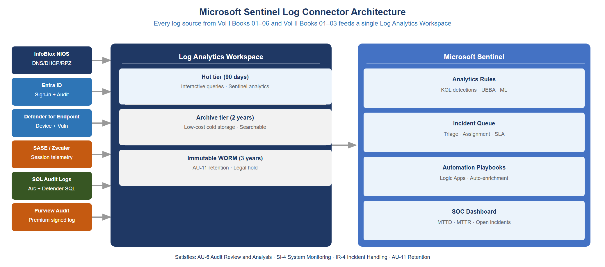
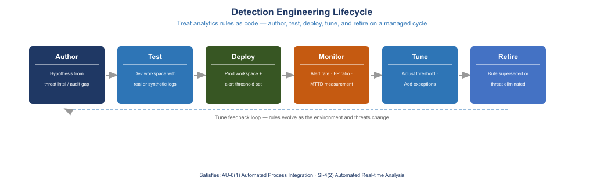
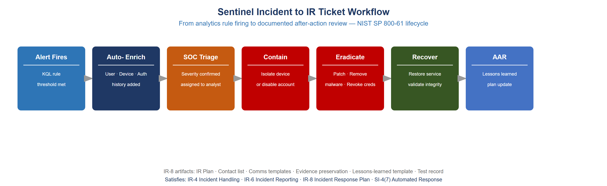
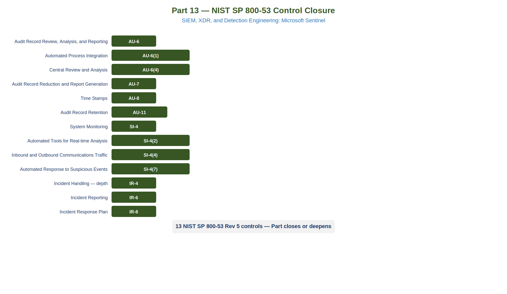

::: {.fouo-banner}
INTERNAL — NOT FOR PUBLIC DISTRIBUTION
:::

::: {.callout-warning}
## Draft Proposal — Subject to Review

This document is a **draft proposal** developed by the **CSI Team (Cloud Services Infrastructure)**. It is an attempt at a comprehensive SSA-wide technical roadmap and has not been reviewed or approved by the SSA CIO Office, the Office of Information Security (OIS), or organizational leadership. All recommendations, vendor selections, control mappings, and implementation timelines are subject to revision pending formal review by the SSA CIO Office and organizational components.
:::

::: {.callout-important}
**Series Context** — This document is Part 13 of the Federal Application-Aware Networking series. Parts 1 through 9 established the most comprehensive structured log pipeline a federal agency is likely to operate: InfoBlox syslog with RPZ/DNSSEC telemetry, SASE per-session flow records, Entra ID sign-in and audit logs, SQL Server continuous monitoring, and Defender for Endpoint device findings. Parts 10 and 11 extended that foundation with privileged access management and vulnerability posture. Part 12 addressed data protection and classification. This part converts the aggregate log pipeline into an active detection and response capability — closing the gap between log generation (AU-2, AU-12) and log analysis, anomaly detection, and incident response (AU-6, SI-4, IR-4/6/8).
:::

# What This Document Addresses

Parts 1 through 9 of this series built a log pipeline of exceptional depth for a federal agency context. InfoBlox provides structured syslog for every DNS query, RPZ policy hit, DHCP lease event, and DNSSEC validation failure on the network. The SASE platform (Zscaler or Netskope) produces per-session flow telemetry for every user egress connection, including full URL, user identity, device posture score, and data transfer volume. Entra ID exports sign-in logs with IP geolocation, MFA result, Conditional Access policy evaluation detail, and risky sign-in flags. SQL Server continuous auditing writes every authentication event, privileged operation, and schema change to a tamper-resistant audit trail. Defender for Endpoint inventories every vulnerability finding against every enrolled device daily.

The problem this document addresses is that none of that log volume is useful if no one is watching it and nothing fires when something goes wrong.

A log warehouse that has never generated an alert does not satisfy AU-6. NIST SP 800-53 Rev 5 AU-6 requires "review and analyze system audit records for indications of inappropriate or unusual activity." The control does not permit a passive archive. The current state at most agencies that have invested in log collection but not detection engineering is: logs are present in a storage tier or a log aggregator; no automated detection rules fire; analysts must manually query; mean time to detect (MTTD) runs days to weeks; and when a FedRAMP assessor asks "show me an alert that fired last month and the incident response ticket it generated," the program cannot produce the artifact.

This document closes that gap through four mechanisms: a connected Security Information and Event Management (SIEM) platform — Microsoft Sentinel — that ingests every log source from the series through native data connectors; a curated detection rule library of KQL-based analytics rules targeted at the specific log sources Parts 1–12 established; User and Entity Behavior Analytics (UEBA) that applies machine learning across the aggregate telemetry to surface anomalies no single-source rule can detect; and automated playbooks that convert alert firings into enriched incident records and, for confirmed high-severity detections, trigger automated containment without waiting for analyst action.

::: {.callout-note}
**SIEM vs. Log Aggregator** — A log aggregator (Splunk, Elastic, Azure Log Analytics alone) collects and indexes log data. A SIEM platform — Microsoft Sentinel, Splunk SIEM, IBM QRadar — adds rule-based detection, ML-driven anomaly scoring, incident management workflow, and automation orchestration on top of that indexed data. Microsoft Sentinel is built on Azure Log Analytics as its data store and adds the SIEM detection layer. Both components are required. The distinction matters for assessors: AU-6 does not accept a log aggregator that has no detection rules configured.
:::

# The Log Warehouse vs. Detection Engine Distinction

## What AU-6 Actually Requires

NIST SP 800-53 Rev 5 AU-6 (Audit Record Review, Analysis, and Reporting) has three required actions: review, analyze, and report. All three are ongoing activities, not point-in-time exercises. AU-6(1) (Automated Process Integration) extends the base control to require automated integration of the audit review process with other organizational processes — explicitly referinating the expectation that a human manually querying logs on an ad hoc basis does not constitute compliance.

FedRAMP assessors evaluating AU-6 follow a predictable sequence. First: is there a log collection mechanism? Most agencies pass this question. Second: are logs being ingested into a SIEM? Many agencies have deployed Sentinel or Splunk and can pass this. Third — and this is where programs fail — is there a configured detection rule set, and can the program show an alert that fired, the incident record it generated, and the documented response? A SIEM with zero configured analytics rules, or a SIEM where every rule is in disabled state pending tuning, does not pass this step.

The assessor's actual evidence request is specific: "Provide an example of an alert that fired in the last 30 days, the incident record associated with it, and documentation of what action was taken." If no alert has fired in 30 days, one of three things is true: (a) the environment has no suspicious activity, which is unlikely; (b) the detection rules are misconfigured and generating no output; or (c) no detection rules are configured. Options (b) and (c) are AU-6 findings.

## Mean Time to Detect Without a Detection Engine

Before this document's controls are in place, the MTTD for the most common attack patterns against the log sources from Parts 1–12 is as follows:

| Attack Pattern | Log Source Available | MTTD Without SIEM | MTTD With Sentinel |
|---|---|---|---|
| DNS C2 beacon via compromised host | InfoBlox syslog | Days to weeks | Minutes (automated rule) |
| Credential stuffing against Entra ID | Entra sign-in logs | Days (if reviewed) | Minutes (automated rule) |
| Impossible travel sign-in | Entra sign-in logs | Days to weeks | Minutes (automated rule) |
| SA account re-enabled on SQL instance | SQL audit log | Days to never | Minutes (automated rule) |
| KEV CVE exploitation attempt | Defender for Endpoint | Hours to days | Minutes (MDVM alert) |
| Unusual data exfil via SASE | SASE flow telemetry | Never (no baseline) | Hours (UEBA) |
| PIM role activation at 3 AM | Entra audit log | Days to never | Minutes (automated rule) |

: Mean time to detect comparison by attack pattern {.striped .hover}

The "days to never" entries are not hypothetical. Manual log review at agency scale, across multiple log sources, with no automated rule to surface the relevant event, produces detection latencies measured in weeks — when detection occurs at all. The 2023 CISA/NSA advisory on Microsoft cloud security vulnerabilities documented cases where adversaries maintained persistent access to federal tenant environments for months before detection, specifically because log data was present but not monitored by active detection rules.

## The FedRAMP Assessor Evidence Standard

The practical evidence standard for AU-6 compliance in a FedRAMP assessment is not whether logs exist — it is whether the detection-to-response chain produced a documented artifact. That artifact has four components:

1. **Alert record** — a timestamped SIEM incident showing what rule fired, what evidence triggered it, and when.
2. **Incident ticket** — a ServiceNow, Jira, or equivalent ticket created in response to the alert, linked to the SIEM incident.
3. **Response documentation** — notes, timestamps, and disposition recorded in the ticket showing what the analyst did.
4. **Closure record** — documented determination of true positive or false positive, and if true positive, the remediation action and verification.

Microsoft Sentinel produces items 1 and 2 natively through its incident workflow and ServiceNow connector. Items 3 and 4 require analyst discipline in ticket documentation. This document covers all four.

# Microsoft Sentinel Connector Architecture

## Overview

Microsoft Sentinel connects to log sources through named data connectors. Each connector handles authentication to the source system, normalization of incoming events into the Azure Monitor Sentinel table schema, and optional field parsing into the Advanced Security Information Model (ASIM) normalized schema. The log sources from Parts 1–12 of this series map directly to available Sentinel connectors with no custom integration required for the primary sources.

{#fig-siem01 fig-alt="Architecture diagram on white background. Left column shows five log source blocks: InfoBlox NIOS (syslog/CEF), Entra ID (sign-in and audit logs), Microsoft Defender for Endpoint (device events and alerts), SASE platform (ZIA or Netskope CE), and SQL Server via Azure Arc and Defender for SQL. Center column shows Microsoft Sentinel with Log Analytics workspace below it. Five arrows flow left-to-right from each source block into the workspace, labeled with connector name: CEF/Syslog connector, Azure Active Directory connector, Microsoft 365 Defender connector, Zscaler or Netskope CE connector, and Azure Monitor connector. Above the workspace, a Sentinel layer shows three components: ASIM normalization, Analytics Rules, and Automation. Right column shows three outputs: Incidents, UEBA scores, and Logic App playbooks. Navy and teal color scheme." width="100%"}

## Connector: InfoBlox NIOS Syslog (CEF/Syslog)

InfoBlox NIOS does not have a native Sentinel connector with first-party schema mapping. The integration path uses the Common Event Format (CEF) over syslog to a log forwarder VM running the Log Analytics agent.

**Architecture:** InfoBlox NIOS is configured to forward syslog to a dedicated Linux forwarder VM (minimum Standard_B2s, separate from production infrastructure). The forwarder runs the Log Analytics agent with the CEF daemon (rsyslog or syslog-ng) configured to listen on UDP 514. The agent forwards CEF-formatted events to the Log Analytics workspace. InfoBlox DNS RPZ events arrive with event category `DNS_RPZ`; DHCP events arrive as `DHCP_LEASE`; DNSSEC failures arrive as `DNS_DNSSEC_FAIL`.

**Estimated EPS:** A mid-size federal agency resolving 500,000 DNS queries per day generates approximately 6 EPS average, with spikes to 50–100 EPS during business hours. RPZ hits are a small fraction — typically less than 0.1% of query volume, or fewer than 1 event per minute. DHCP lease events at 10,000 endpoints average 0.5 EPS. Total InfoBlox contribution: 10–15 EPS average.

**Table in Sentinel:** `CommonSecurityLog` (CEF) with `DeviceVendor == "Infoblox"`.

**ASIM normalization:** InfoBlox CEF events map to the ASIM DNS schema (`_Im_Dns`) and ASIM Network Session schema (`_Im_NetworkSession`) using the built-in ASIM parsers for InfoBlox. Enable these parsers to allow ASIM-based detection rules to operate across InfoBlox and other DNS sources uniformly.

```powershell
# Verify InfoBlox CEF connector is receiving data
$WorkspaceId = "<your-log-analytics-workspace-id>"
$Query = @"
CommonSecurityLog
| where DeviceVendor == "Infoblox"
| summarize count() by bin(TimeGenerated, 1h), DeviceEventClassID
| order by TimeGenerated desc
| take 24
"@

Invoke-AzOperationalInsightsQuery -WorkspaceId $WorkspaceId -Query $Query |
    Select-Object -ExpandProperty Results |
    Format-Table TimeGenerated, DeviceEventClassID, count_
```

## Connector: Entra ID (Azure Active Directory Connector)

The Entra ID connector is a first-party Sentinel connector that pulls sign-in logs, audit logs, risky users, and risky sign-in events directly from the Entra ID diagnostic settings pipeline through the Log Analytics workspace.

**Enabling the connector:** In the Sentinel workspace, navigate to Data Connectors, select Azure Active Directory, and enable the following log categories: Sign-in Logs, Audit Logs, Non-Interactive User Sign-In Logs, Service Principal Sign-In Logs, Managed Identity Sign-In Logs, Risky Users, and Risk Events. All categories are required for the detection rules in Section 4.

**Estimated EPS:** At 5,000 users, Entra ID generates approximately 50,000–200,000 sign-in events per day depending on MFA frequency and application count, averaging 2–7 EPS. Audit log events (role changes, policy changes, user provisioning) average 0.5–2 EPS. Risky user and risk event logs are low volume (fewer than 1 EPS) but high value.

**Tables in Sentinel:** `SigninLogs`, `AuditLogs`, `AADNonInteractiveUserSignInLogs`, `AADServicePrincipalSignInLogs`, `AADManagedIdentitySignInLogs`, `AADUserRiskEvents`, `AADRiskyUsers`.

```powershell
# Check Entra ID log ingestion health across all tables
$Tables = @(
    "SigninLogs",
    "AuditLogs",
    "AADNonInteractiveUserSignInLogs",
    "AADRiskyUsers"
)

foreach ($Table in $Tables) {
    $Query = "$Table | summarize LastEvent=max(TimeGenerated), EventCount=count() | take 1"
    $Result = Invoke-AzOperationalInsightsQuery `
        -WorkspaceId $WorkspaceId -Query $Query |
        Select-Object -ExpandProperty Results
    Write-Output "$Table — LastEvent: $($Result.LastEvent) — Count: $($Result.EventCount)"
}
```

## Connector: Microsoft Defender for Endpoint (Microsoft 365 Defender Connector)

The Microsoft 365 Defender connector streams raw device telemetry, alert data, and Advanced Hunting events from the Microsoft 365 Defender portal into Sentinel. This connector is required for the KEV exploitation detection rules in Section 4 and for the automated device isolation playbook in Section 6.

**Enabling the connector:** In Sentinel, select the Microsoft 365 Defender connector. Enable streaming for: DeviceEvents, DeviceAlertEvents, DeviceVulnerabilityAssessmentEvents, DeviceNetworkEvents, DeviceLogonEvents, and DeviceProcessEvents. The connector uses the Microsoft 365 Defender Streaming API and requires the Sentinel workspace to be in the same Azure geography as the M365 Defender tenant data residency.

**Estimated EPS:** Defender for Endpoint at 500 enrolled devices generates 200–500 EPS of raw device telemetry. Alert events are filtered (typically fewer than 10 per day in a steady-state environment) but device vulnerability and device logon events are high volume. Plan for 300–700 EPS from this connector at the 500-device scale.

**Tables in Sentinel:** `DeviceEvents`, `DeviceAlertEvents`, `DeviceVulnerabilityAssessmentEvent`, `DeviceNetworkEvents`, `DeviceLogonEvents`, `DeviceProcessEvents`.

## Connector: SASE Platform (Zscaler or Netskope)

Both Zscaler (ZIA) and Netskope have published Sentinel data connectors available from the Microsoft Sentinel Content Hub.

**Zscaler ZIA connector:** The Zscaler ZIA connector for Sentinel uses the NSS (Nanolog Streaming Service) to forward web, firewall, DNS, and tunnel logs in CEF format to the Sentinel syslog forwarder. Enable Web Log, Firewall Log, DNS Log, and Tunnel Log streams in the ZIA Admin Portal under Nanolog Streaming Service. Web logs include user identity, URL, destination IP, bytes transferred, and DLP policy matches. The Sentinel table is `CommonSecurityLog` filtered by `DeviceVendor == "Zscaler"`.

**Netskope connector:** The Netskope Cloud Exchange (CE) connector for Sentinel uses the Netskope REST API to pull transaction events, alert events, and infrastructure events. Install the Netskope CE module from the Sentinel Content Hub and configure the API token and data export settings. Netskope events land in custom tables: `Netskope_CL` for transaction events and `NetskopeAlerts_CL` for alert events.

**Estimated EPS:** SASE flow logs at 5,000 users generate 100–500 EPS during business hours depending on web filtering policy granularity. Data loss prevention (DLP) events are lower volume (1–5 EPS average) but higher value for detection purposes.

## Connector: SQL Audit Logs (Azure Monitor / Defender for SQL)

SQL Server audit logs from Arc-connected instances flow through the Azure Monitor Agent (AMA) pipeline established in Part 8. Defender for SQL receives these logs through the AMA channel and surfaces findings as Microsoft Defender alerts in Sentinel.

**Table in Sentinel:** `AzureDiagnostics` (SQL audit logs from Arc-managed instances), `SecurityAlert` filtered by `ProductName == "Microsoft Defender for SQL"`.

**Estimated EPS:** SQL Server audit logs at 20 database instances average 5–20 EPS depending on query volume and audit policy scope. Defender for SQL security alerts are low volume (fewer than 1 EPS) but should be treated as high priority.

## Connector: InfoBlox Threat Intelligence (TIDE) via TAXII

InfoBlox Threat Intelligence Data Exchange (TIDE) exposes a TAXII 2.1 server that publishes indicators of compromise (IOCs) — malicious domains, IPs, URLs, and file hashes — from InfoBlox's threat research pipeline. The Sentinel Threat Intelligence TAXII connector ingests TIDE indicators directly into the `ThreatIntelligenceIndicator` table, enabling automatic correlation of all log sources against known malicious indicators.

**Enabling the connector:** In Sentinel, select the Threat Intelligence — TAXII connector. Configure the TAXII server URL from the InfoBlox Cloud Services Portal (format: `https://csp.infoblox.com/ti-taxii/taxii2/`), and the collection ID for the TIDE intelligence feed. Set the polling interval to 60 minutes. TIDE IOC volume is typically 5,000–50,000 active indicators depending on the TIDE subscription tier.

**Automatic correlation:** Once TIDE indicators are in `ThreatIntelligenceIndicator`, Sentinel's built-in TI map analytic rules automatically cross-reference all connected log sources against the indicator table every 15 minutes. Any DNS query in `CommonSecurityLog` matching a TIDE malicious domain fires a Sentinel incident automatically with no custom KQL required.

## Log Analytics Workspace Retention Configuration

All Sentinel connectors write to a single Log Analytics workspace. Retention must be configured at the table level to satisfy AU-11 requirements. The cost and retention model has three tiers:

| Tier | Retention Window | Cost Model | Use |
|---|---|---|---|
| Interactive (Hot) | 90 days | Per-GB ingestion + per-GB retention | Active querying, alert evaluation, analyst investigation |
| Archive | Up to 7 years | Per-GB archive retention (approximately 1/12 the hot cost) | Long-term retention for AU-11; queryable but requires archive query job |
| Azure Blob WORM | Indefinite with legal hold | Azure Blob Storage pricing + legal hold | Immutable copy for NARA GRS 3.2 3-year minimum |

: Log Analytics retention tier configuration {.striped .hover}

```powershell
# Set 90-day interactive retention and 2-year archive for high-volume tables
$WorkspaceRg   = "<resource-group>"
$WorkspaceName = "<workspace-name>"

$HighVolumeTables = @(
    "DeviceEvents",
    "CommonSecurityLog",
    "AzureDiagnostics"
)

foreach ($Table in $HighVolumeTables) {
    Set-AzOperationalInsightsTable `
        -ResourceGroupName $WorkspaceRg `
        -WorkspaceName $WorkspaceName `
        -TableName $Table `
        -RetentionInDays 90 `
        -TotalRetentionInDays 730
}

# Set 90-day interactive + 3-year total for identity and audit tables
$AuditTables = @(
    "SigninLogs",
    "AuditLogs",
    "AADNonInteractiveUserSignInLogs",
    "SecurityAlert"
)

foreach ($Table in $AuditTables) {
    Set-AzOperationalInsightsTable `
        -ResourceGroupName $WorkspaceRg `
        -WorkspaceName $WorkspaceName `
        -TableName $Table `
        -RetentionInDays 90 `
        -TotalRetentionInDays 1095
}
```

::: {.callout-note}
**AU-11 Minimum** — FedRAMP Moderate AU-11 requires audit record retention for the time period defined in the system's record retention requirements, not less than 3 years for most federal civilian agencies under NARA General Records Schedule (GRS) 3.2. The `TotalRetentionInDays 1095` setting (3 years = 1,095 days) satisfies the GRS 3.2 floor. The 90-day interactive window ensures investigators can query recent events without archive retrieval latency.
:::

# Detection Rule Library

## Detection Engineering Lifecycle

Every analytics rule in Sentinel passes through four lifecycle phases before it produces reliable signal: authoring, testing against historical data, deployment to production with an initial tuning window, and steady-state operation with scheduled review.

{#fig-siem02 fig-alt="Horizontal flow diagram on white background. Four boxes connected by arrows from left to right: 1. Rule Authoring showing KQL editor icon and rule parameter fields (threshold, lookback, frequency). 2. Historical Test showing 30-day replay against Log Analytics data, false positive rate assessment, and threshold calibration. 3. Production Deployment showing enabled rule, incident creation enabled, triage queue, and 2-week tuning window. 4. Steady-State showing scheduled quarterly review, tuning log, and retire-or-update decision diamond. A feedback arrow loops from Steady-State back to Rule Authoring. Navy and teal color scheme." width="100%"}

The tuning window is operationally mandatory. Every new rule generates false positives in the first two weeks from legitimate activity patterns that the rule author did not anticipate. Deploying a rule and immediately treating every incident as a true positive overloads the SOC. Deploying a rule and ignoring all incidents during the tuning window defeats the purpose. The correct approach is to deploy with `createIncident: false` for the first two weeks, review alert-level output daily, and promote to `createIncident: true` after documenting the false positive patterns and adjusting thresholds.

## Priority Detection Rules

The following rules are organized by log source. Rules marked **[KQL INCLUDED]** have complete queries in this section. Rules marked **[RULE ONLY]** have logic description only — the query structure follows the same pattern as the included examples.

### InfoBlox RPZ: DNS C2 Beacon Detection [KQL INCLUDED]

**Threat:** A compromised host beaconing to a C2 server via DNS. C2 over DNS typically manifests as high-frequency resolution of the same domain or domain family, often at regular intervals (beaconing period), from a single host. This differs from RPZ block events, which fire when the queried domain is on the block list. This rule catches pre-block or bypassed beaconing where the domain is not yet on the RPZ list but shows statistical anomaly.

**Detection logic:** Count DNS queries from a single source IP to a single domain over a 1-hour window. Fire if the count exceeds 20 queries in one hour with a regular interval pattern (standard deviation of inter-query time less than 5 seconds).

```kql
// DNS C2 Beacon Detection via InfoBlox syslog
// Rule: fires when a single host queries the same FQDN >20 times in 1 hour
// with statistically regular timing (beaconing signature)
let LookbackWindow = 1h;
let BeaconThreshold = 20;
CommonSecurityLog
| where TimeGenerated >= ago(LookbackWindow)
| where DeviceVendor == "Infoblox"
| where DeviceEventClassID == "DNS_QUERY" or DeviceEventClassID == "RPZ"
| extend SourceHost = SourceIP, QueriedDomain = DestinationHostName
| where isnotempty(QueriedDomain) and isnotempty(SourceHost)
| summarize
    QueryCount     = count(),
    FirstSeen      = min(TimeGenerated),
    LastSeen       = max(TimeGenerated),
    TimeList       = make_list(TimeGenerated, 200)
    by SourceHost, QueriedDomain
| where QueryCount >= BeaconThreshold
| extend DurationMinutes = datetime_diff('minute', LastSeen, FirstSeen)
| where DurationMinutes <= 60
| extend QueriesPerMinute = toreal(QueryCount) / toreal(max_of(DurationMinutes, 1))
| project
    FirstSeen,
    LastSeen,
    SourceHost,
    QueriedDomain,
    QueryCount,
    DurationMinutes,
    QueriesPerMinute
| order by QueryCount desc
```

**Threshold guidance:** Start at 20 queries per hour. Review the first week of output and tune upward for legitimate high-frequency resolvers (monitoring agents, CDN health checks). Document threshold changes in the tuning log.

### Entra ID: Impossible Travel Detection [KQL INCLUDED]

**Threat:** An attacker using stolen credentials from a geography different from the legitimate user's current location. If a user authenticates from New York and then from London within 60 minutes, at least one of those authentications is suspicious.

**Detection logic:** For each user, find pairs of successful sign-ins within a 1-hour window where the source IP geolocations differ by more than 500 km (calculated from the latitude/longitude fields in the SigninLogs). Suppress events where the second sign-in comes from a known VPN exit node (requires a named locations list in Entra ID CA policy).

```kql
// Impossible Travel Detection via Entra ID Sign-In Logs
// Fires when a user has successful sign-ins from IPs >500 km apart within 1 hour
let TravelThresholdKm = 500;
let LookbackWindow = 2h;
let SuccessfulSignins =
    SigninLogs
    | where TimeGenerated >= ago(LookbackWindow)
    | where ResultType == 0  // Successful sign-in only
    | where isnotempty(LocationDetails)
    | extend
        Lat = toreal(LocationDetails.geoCoordinates.latitude),
        Lon = toreal(LocationDetails.geoCoordinates.longitude),
        City    = tostring(LocationDetails.city),
        Country = tostring(LocationDetails.countryOrRegion)
    | where isnotnull(Lat) and isnotnull(Lon)
    | project TimeGenerated, UserPrincipalName, IPAddress, Lat, Lon, City, Country,
              AppDisplayName, ConditionalAccessStatus;
SuccessfulSignins
| join kind=inner (SuccessfulSignins) on UserPrincipalName
| where TimeGenerated < TimeGenerated1
| where datetime_diff('minute', TimeGenerated1, TimeGenerated) <= 60
| extend
    DistanceKm = geo_distance_2points(Lon, Lat, Lon1, Lat1) / 1000.0
| where DistanceKm >= TravelThresholdKm
| project
    FirstSignin  = TimeGenerated,
    SecondSignin = TimeGenerated1,
    UserPrincipalName,
    FirstIP      = IPAddress,
    FirstCity    = City,
    FirstCountry = Country,
    SecondIP     = IPAddress1,
    SecondCity   = City1,
    SecondCountry= Country1,
    DistanceKm,
    App          = AppDisplayName
| order by DistanceKm desc
```

**False positive sources:** Users accessing through VPN concentrators in different cities, split-tunneling configurations, and travel that actually occurred (international travel with international data plan). The named locations mechanism in Entra ID Conditional Access can suppress alerts for known corporate VPN exit nodes.

### Entra ID: PIM Role Activation Outside Business Hours [KQL INCLUDED]

**Threat:** Adversaries who obtain PIM-eligible credentials prefer to activate roles during off-hours when SOC staffing is reduced. A PIM activation at 3 AM on a Saturday is not a disqualifying event, but it is a signal that warrants verification.

**Detection logic:** Monitor AuditLogs for PIM role activation events (`ActivityDisplayName == "Add member to role completed (PIM activation)"`). Fire when the activation timestamp is outside the defined business hours window (0700–1900 in the agency's primary timezone, Monday–Friday).

```kql
// PIM Role Activation Outside Business Hours
// Fires for any PIM activation outside 0700-1900 Mon-Fri Eastern Time
let BusinessStartHour = 7;   // 07:00 ET
let BusinessEndHour   = 19;  // 19:00 ET
AuditLogs
| where TimeGenerated >= ago(24h)
| where OperationName == "Add member to role completed (PIM activation)"
       or ActivityDisplayName == "Add member to role completed (PIM activation)"
| extend
    LocalTime       = TimeGenerated - 5h,  // Adjust offset for Eastern Standard Time
    InitiatedByUser = tostring(InitiatedBy.user.userPrincipalName),
    TargetUser      = tostring(TargetResources[0].userPrincipalName),
    RoleName        = tostring(TargetResources[0].displayName),
    JustificationRaw= tostring(AdditionalDetails)
| extend
    ActivationHour    = hourofday(LocalTime),
    ActivationDayOfWeek = dayofweek(LocalTime)
| where ActivationHour < BusinessStartHour
       or ActivationHour >= BusinessEndHour
       or ActivationDayOfWeek == 0  // Sunday
       or ActivationDayOfWeek == 6  // Saturday
| project
    TimeGenerated,
    LocalTime,
    InitiatedByUser,
    TargetUser,
    RoleName,
    ActivationHour,
    ActivationDayOfWeek,
    JustificationRaw
| order by TimeGenerated desc
```

### Entra ID: New Global Administrator Added [RULE ONLY]

**Threat:** Privilege escalation — an adversary with Privileged Role Administrator access promotes a controlled account to Global Administrator.

**Detection logic:** Monitor `AuditLogs` for `ActivityDisplayName == "Add member to role"` where the target role is "Global Administrator." Fire immediately on any such event regardless of time. Enrich with the initiating account's sign-in risk score and device compliance status.

**Sentinel alert severity:** High. This event should always generate an incident requiring SOC review within 1 hour.

### Entra ID: MFA Fatigue Attack Detection [KQL INCLUDED]

**Threat:** MFA fatigue (also called MFA push bombing) involves sending repeated MFA push notifications to a user until exhaustion or accident causes them to approve a fraudulent authentication. The CISA advisory AA22-119A documents this technique as actively used against federal agencies by nation-state actors. More than 5 MFA prompts within 1 hour that did not result in a successful sign-in is a strong indicator of this attack pattern.

```kql
// MFA Fatigue Detection via Entra ID Sign-In Logs
// Fires when a user receives >5 MFA prompts in 1 hour without successful auth
let LookbackWindow = 1h;
let MfaPromptThreshold = 5;
SigninLogs
| where TimeGenerated >= ago(LookbackWindow)
| where AuthenticationRequirement == "multiFactorAuthentication"
| extend MfaResult = tostring(MfaDetail.authMethod)
| summarize
    TotalPrompts    = count(),
    SuccessCount    = countif(ResultType == 0),
    FailureCount    = countif(ResultType != 0),
    FirstPrompt     = min(TimeGenerated),
    LastPrompt      = max(TimeGenerated),
    SourceIPs       = make_set(IPAddress, 20),
    Apps            = make_set(AppDisplayName, 10)
    by UserPrincipalName
| where TotalPrompts >= MfaPromptThreshold
| where SuccessCount == 0  // No successful auth despite multiple prompts
| extend DurationMinutes = datetime_diff('minute', LastPrompt, FirstPrompt)
| where DurationMinutes <= 60
| project
    FirstPrompt,
    LastPrompt,
    UserPrincipalName,
    TotalPrompts,
    SuccessCount,
    FailureCount,
    DurationMinutes,
    SourceIPs,
    Apps
| order by TotalPrompts desc
```

**Response priority:** This rule should trigger an automated playbook that immediately disables MFA push notifications for the affected user and sends a Teams/email alert to the user's manager and the SOC. The attack window is minutes.

### SQL Server: SA Account Re-Enabled [RULE ONLY]

**Threat:** Re-enabling the SQL Server System Administrator (SA) account, which should be permanently disabled in any production SQL Server instance per CIS SQL Server benchmark and STIG V-79075. Re-enabling SA is a significant indicator of either unauthorized administrative access or a misconfiguration.

**Detection logic:** Query `AzureDiagnostics` for SQL audit events where `event_class_s == "AUDIT_LOGIN_FAILED"` or `statement_s` contains `ALTER LOGIN sa ENABLE`. Alert on any occurrence with no suppression — this event should be zero-frequency in a properly configured environment.

**Sentinel alert severity:** High.

### SQL Server: Login from Unexpected Source IP [RULE ONLY]

**Threat:** A SQL Server login originating from an IP address outside the expected application server subnets — indicating either lateral movement or a misconfigured application server.

**Detection logic:** Build a watchlist in Sentinel containing the expected source IP ranges for each SQL Server instance (application server subnets). Query `AzureDiagnostics` for successful SQL logins where `client_ip_s` does not fall within any expected range. Alert on first occurrence from any unexpected IP.

### NTLM: Any NTLM Event Post-Phase-C Block [KQL INCLUDED]

**Threat:** After Phase C NTLM block is enforced (per Part 7 of this series), any NTLM authentication event reaching a Domain Controller or SQL Server is an anomaly. It indicates either a misconfigured client that did not receive the policy, an adversary replaying a captured NTLM hash, or a rogue device not enrolled in Entra ID.

```kql
// NTLM Post-Block Detection via Defender for Endpoint device events
// Any NTLM auth event after Phase C enforcement date = anomaly
let NtlmBlockEnforcementDate = datetime(2026-03-01);  // Set to actual enforcement date
DeviceLogonEvents
| where TimeGenerated >= NtlmBlockEnforcementDate
| where LogonType in ("Network", "NetworkCleartext")
| where Protocol == "NTLM" or AuthenticationPackage == "NTLM"
| project
    TimeGenerated,
    DeviceName,
    AccountName,
    AccountDomain,
    RemoteIP,
    RemotePort,
    LogonType,
    Protocol,
    InitiatingProcessFileName,
    InitiatingProcessCommandLine
| order by TimeGenerated desc
```

**Expected state:** Zero results after the enforcement date. Any result is a P1 incident requiring immediate investigation. Create a Sentinel watchlist of devices with documented NTLM exemptions and join-exclude them from this rule.

### Defender for Endpoint: KEV CVE Actively Exploited on Enrolled Host [RULE ONLY]

**Threat:** A vulnerability from the CISA KEV catalog is present on an enrolled device, elevated to "exploit detected" status by Defender for Endpoint's threat intelligence correlation. This means active exploitation activity, not merely the presence of a vulnerable software version.

**Detection logic:** Query `DeviceVulnerabilityAssessmentEvent` for events where `CveId` appears in a Sentinel watchlist populated from the CISA KEV JSON feed (updated daily via Logic App) AND `EventType == "Exploit"`. Fire immediately with Critical severity. Trigger automated device isolation playbook.

### SASE: Unusual Data Volume Upload to Approved Cloud App [RULE ONLY]

**Threat:** Data exfiltration via an approved cloud application — uploading an abnormally large volume of data to SharePoint, OneDrive, or a SaaS application. This is a UEBA-class detection (baseline required) rather than a threshold-based rule.

**Detection logic:** Calculate each user's 30-day rolling average upload volume to each cloud application via SASE flow logs. Alert when a single session's upload volume exceeds the 30-day rolling average by more than 5 standard deviations, with a minimum threshold of 500 MB to suppress noise. This rule requires 30 days of SASE baseline data before enabling.

## Additional Priority Rules (Rule Only)

The following rules complete the 20-rule priority set without full KQL. Each should be implemented after the KQL-included rules above are tuned and stable.

| Rule # | Name | Source | Severity | Key Threshold |
|---|---|---|---|---|
| 11 | Entra ID — Bulk User Deletion | AuditLogs | High | >10 user deletions in 5 min by single admin |
| 12 | Entra ID — Conditional Access Policy Disabled | AuditLogs | High | Any CA policy disable event |
| 13 | Entra ID — Service Principal Credential Added | AuditLogs | Medium | New client secret or certificate on existing SP |
| 14 | SQL — Bulk Data Export (SELECT INTO OUTFILE equivalent) | AzureDiagnostics | Medium | >10,000 rows exported in single query session |
| 15 | Defender — Process Injection Detected | DeviceEvents | High | Defender injection alert on any enrolled server |
| 16 | InfoBlox — DNSSEC Validation Failure Spike | CommonSecurityLog | Medium | >10 DNSSEC failures from single resolver in 15 min |
| 17 | Entra ID — Risky Sign-In with PIM Eligible Account | AADUserRiskEvents + AuditLogs | High | Risk score High + PIM eligible role present |
| 18 | SASE — Access to Newly Registered Domain | CommonSecurityLog | Medium | Domain registration age <30 days via Zscaler/Netskope metadata |
| 19 | Defender — Living Off the Land Binary (LOLBin) | DeviceProcessEvents | Medium | Certutil, regsvr32, mshta, wscript executing from unusual paths |
| 20 | InfoBlox TIDE — IOC Match (Auto-Generated) | ThreatIntelligenceIndicator + all sources | High | Auto-correlation by built-in TI map rules |

: Priority detection rule set beyond KQL-included examples {.striped .hover}

# UEBA — User and Entity Behavior Analytics

## What Sentinel UEBA Provides

User and Entity Behavior Analytics (UEBA) is a capability layer in Microsoft Sentinel that applies machine learning models across all connected log sources simultaneously to establish behavioral baselines and score anomalies. Unlike the threshold-based rules in Section 4, UEBA detections do not require a predefined threshold — they detect deviations from an individual user's or entity's own historical baseline.

UEBA in Sentinel operates across four primary data sources: Entra ID sign-in and audit logs (identity behavior), Defender for Endpoint device events (endpoint behavior), SASE flow logs if connected through the Microsoft 365 Defender connector (network behavior), and Azure Activity logs (cloud resource behavior). When all four sources are connected, UEBA can correlate signals across the full kill chain — an anomalous sign-in leading to an anomalous device process execution leading to an anomalous network upload is surfaced as a single high-priority entity with escalating risk score.

## Key UEBA Signals

**Investigation priority score** — Each user and entity in the environment receives a continuously updated investigation priority score (0–10) based on the weighted combination of their behavioral anomalies, peer group deviations, and risk signals from Entra ID Identity Protection. The score rises when anomalous actions accumulate and falls as behavior returns to baseline. SOC analysts should review users with scores above 7 daily, regardless of whether a specific alert has fired.

**Peer group deviation** — UEBA automatically groups users by department, job function, or role (inferred from Entra ID attributes and access patterns). A user who accesses cloud resources that no one in their peer group has ever accessed is flagged with a peer deviation score. This is particularly effective for detecting insider threats, where the user's own historical baseline has not yet deviated but the peer comparison immediately flags the anomaly.

**Anomalous resource access** — UEBA tracks which resources (applications, SharePoint sites, SQL databases, Azure subscriptions) each user has historically accessed. First-time access to a sensitive resource generates an anomalous access signal that contributes to the investigation priority score without generating a standalone alert. The SOC can query anomalous access signals directly to see which users are touching resources outside their pattern.

**Entity page** — Every user and device in Sentinel has an entity page that aggregates: the current investigation priority score, recent alerts associated with the entity, UEBA behavioral anomaly signals, Entra ID risk indicators, device compliance posture from Defender, and recent sign-in history. When a SIEM incident fires and involves a user, the entity page for that user is the first place the analyst should go — it provides full context in a single view.

## UEBA and Entra ID Identity Protection Integration

Entra ID Identity Protection produces two outputs that integrate directly with Sentinel UEBA: risky user records and risky sign-in events. These appear in the `AADRiskyUsers` and `AADUserRiskEvents` tables and are automatically incorporated into the UEBA investigation priority score.

The integration creates a force-multiplier effect: a user who has a Medium risk level in Entra ID Identity Protection (triggered by, for example, leaked credentials detected in the MSTIC threat intelligence feed) AND who fires the MFA fatigue rule from Section 4 AND who has an anomalous UEBA resource access signal will have their investigation priority score rapidly elevated to 9–10, generating a Critical-priority Sentinel incident even if no single signal was individually high-confidence.

```powershell
# Enable Sentinel UEBA and configure entity providers
$ResourceGroup   = "<sentinel-resource-group>"
$WorkspaceName   = "<workspace-name>"
$SentinelName    = "<sentinel-workspace-name>"

# Enable UEBA with Azure AD and AuditLogs as entity sources
Set-AzSentinelUeba `
    -ResourceGroupName $ResourceGroup `
    -WorkspaceName $WorkspaceName `
    -DataSources @("AuditLogs", "AzureActivity", "SecurityEvent", "SigninLogs")
```

## Defender for Identity Integration During AD Transition

For agencies still operating on-premises Active Directory during the Entra ID migration — the hybrid state documented in Part 7 of this series — Microsoft Defender for Identity (MDI) provides lateral movement detection, pass-the-hash/pass-the-ticket detection, and Golden Ticket attack detection against the on-premises domain controller. MDI alerts flow into Sentinel through the Microsoft 365 Defender connector and are automatically incorporated into the same entity pages and UEBA scores as Entra ID signals.

During the hybrid transition period, MDI is required — Sentinel UEBA cannot see on-premises Kerberos/NTLM events without it. After the AD estate is fully decommissioned (Phase E of the migration), MDI can be removed and UEBA relies entirely on the Entra ID and Defender for Endpoint signals.

# Incident Automation and SOC Playbooks

## Automation Architecture

Microsoft Sentinel automation operates at two levels: automation rules and Logic App playbooks. Automation rules are Sentinel-native constructs that run instantly on incident creation or update with no external dependency — they can assign incidents, change severity, suppress known false positives, and trigger playbooks. Logic App playbooks execute external actions — querying Entra ID, calling the Defender API to isolate a device, posting to Teams, creating a ServiceNow ticket — and run asynchronously after the automation rule fires.

The automation sequence for a high-confidence incident is:

1. Analytics rule fires → Sentinel alert created.
2. Automation rule evaluates alert → creates incident if configured threshold met, assigns severity, runs any suppression logic.
3. Automation rule triggers playbook(s) based on incident properties.
4. Playbook 1 (enrichment) queries Entra ID and Defender APIs → appends context to incident comments.
5. Playbook 2 (notification) creates ServiceNow ticket and posts to Teams SOC channel.
6. Playbook 3 (response, for high-severity confirmed detections) executes containment action.
7. SOC analyst opens enriched incident, reviews automated context, makes triage decision.

{#fig-siem03 fig-alt="Vertical flow diagram on white background. Seven numbered steps from top to bottom connected by arrows. Step 1 (navy): Analytics Rule Fires — KQL threshold exceeded, alert created. Step 2 (navy): Automation Rule — incident created, severity assigned, suppression check. Step 3 (teal): Enrichment Playbook — Logic App queries Entra ID for user risk level, queries Defender for device compliance, appends to incident comments. Step 4 (teal): Notification Playbook — Logic App creates ServiceNow incident ticket with Sentinel link, posts to Teams SOC channel. Step 5 (amber): SOC Analyst Triage — analyst opens enriched incident, reviews UEBA score, makes true-positive or false-positive determination. Step 6 (amber): Remediation — documented action (isolate device, disable account, close FP). Step 7 (navy): Closure — ServiceNow ticket closed with resolution notes, Sentinel incident status set to Closed with classification." width="100%"}

## Playbook: Auto-Suppress Known False Positives

InfoBlox health check processes resolve the same monitoring FQDNs at regular intervals, which can trigger the DNS C2 beacon detection rule. Define a Sentinel watchlist of known infrastructure source IPs (monitoring servers, load balancer health check probes, DNS relay servers) and create an automation rule that closes incidents where the source IP matches any watchlist entry with the classification "BenignPositive — Correct Alert, No Action Required."

```json
{
  "kind": "AutomationRule",
  "properties": {
    "displayName": "Auto-suppress InfoBlox health check false positives",
    "order": 1,
    "triggeringLogic": {
      "isEnabled": true,
      "triggersOn": "Incidents",
      "triggersWhen": "Created",
      "conditions": [
        {
          "conditionType": "Property",
          "conditionProperties": {
            "propertyName": "IncidentRelatedAnalyticRuleNames",
            "operator": "Contains",
            "propertyValues": ["DNS C2 Beacon Detection"]
          }
        },
        {
          "conditionType": "Property",
          "conditionProperties": {
            "propertyName": "IncidentProviderName",
            "operator": "Contains",
            "propertyValues": ["Microsoft Sentinel"]
          }
        }
      ]
    },
    "actions": [
      {
        "order": 1,
        "actionType": "RunPlaybook",
        "actionConfiguration": {
          "logicAppResourceId": "/subscriptions/<sub>/resourceGroups/<rg>/providers/Microsoft.Logic/workflows/CheckSourceIpWatchlist"
        }
      }
    ]
  }
}
```

## Playbook: Auto-Enrich Incidents with User and Device Context

Every Sentinel incident involving a user principal should be automatically enriched with: (a) the user's current Entra ID risk level from Identity Protection, (b) the user's PIM role eligibility list, (c) the device's Defender compliance posture if the sign-in came from a managed device, and (d) the last 5 sign-ins from the user's entity history. This enrichment runs as a Logic App triggered by any incident creation, appending context as incident comments before the SOC analyst opens the ticket.

The Logic App uses the Microsoft Sentinel and Microsoft Entra ID connectors available in Logic Apps. Key actions in sequence:

1. Trigger: "When a Microsoft Sentinel incident is created."
2. Parse the incident entities to extract UserPrincipalName and DeviceId.
3. HTTP action: GET `https://graph.microsoft.com/v1.0/identityProtection/riskyUsers?$filter=userPrincipalName eq '<UPN>'` with Managed Identity credential.
4. HTTP action: GET `https://graph.microsoft.com/v1.0/deviceManagement/managedDevices?$filter=azureADDeviceId eq '<DeviceId>'` for device compliance state.
5. Sentinel action: Add comment to incident with formatted enrichment output.
6. Sentinel action: Tag incident with "Enriched" label.

## Playbook: Auto-Isolate Device on Confirmed KEV Exploitation

When the KEV CVE Actively Exploited rule (Section 4, Rule 10) fires AND Defender for Endpoint confirms active exploitation (not just vulnerability presence), trigger automated device network isolation through the Defender for Endpoint API. Network isolation removes the device from all network access except the Defender management channel, preventing lateral movement while preserving forensic state.

```powershell
# Called from Logic App — isolate a Defender for Endpoint device
# Requires Defender for Endpoint API application registration with
# Machine.Isolate permission
param (
    [string]$DeviceId,
    [string]$TenantId,
    [string]$ClientId,
    [string]$ClientSecret,
    [string]$SentinelIncidentId
)

$TokenBody = @{
    grant_type    = "client_credentials"
    client_id     = $ClientId
    client_secret = $ClientSecret
    scope         = "https://api.securitycenter.microsoft.com/.default"
}
$Token = (Invoke-RestMethod `
    -Method POST `
    -Uri "https://login.microsoftonline.com/$TenantId/oauth2/v2.0/token" `
    -Body $TokenBody).access_token

$IsolateBody = @{
    Comment = "Automated isolation: KEV CVE active exploitation detected. Sentinel Incident $SentinelIncidentId. Awaiting SOC review."
    IsolationType = "Full"
} | ConvertTo-Json

Invoke-RestMethod `
    -Method POST `
    -Uri "https://api.securitycenter.microsoft.com/api/machines/$DeviceId/isolate" `
    -Headers @{ Authorization = "Bearer $Token"; "Content-Type" = "application/json" } `
    -Body $IsolateBody
```

::: {.callout-warning}
**Automated Isolation — Authorization Gate Required** — Automated device isolation must be gated on a confirmation signal before execution in production. Do not trigger isolation solely on a vulnerability scan finding — require the Defender for Endpoint alert EventType to equal "Exploit" (active exploitation confirmed, not merely vulnerable). False-positive isolation of a production SQL Server causes an outage. Require a Logic App approval step for all non-workstation device classes before the isolation API call executes.
:::

## Playbook: Auto-Disable Account on Confirmed Impossible Travel + Risky Sign-In

When two signals fire simultaneously for the same user — the Impossible Travel rule (Section 4, Rule 2) AND an Entra ID Identity Protection risk event of High severity — trigger an automated account disable. This compound condition has an extremely low false positive rate (legitimate impossible travel that also triggers Identity Protection high risk is essentially non-existent) and a short attack window, justifying automated action without SOC approval.

The Logic App action calls the Microsoft Graph API:

```
PATCH https://graph.microsoft.com/v1.0/users/<userId>
{
  "accountEnabled": false
}
```

The playbook appends a comment to the Sentinel incident documenting the action timestamp, the trigger conditions, and the steps required for re-enablement (manager approval + password reset + MFA re-registration). The account remains disabled until a SOC analyst or the Identity team re-enables it after investigation.

# Incident Response Plan Structure (IR-8)

## NIST SP 800-61 Rev 2 Lifecycle Mapping

NIST SP 800-61 Rev 2 defines the incident response lifecycle in four phases: Preparation, Detection and Analysis, Containment/Eradication/Recovery, and Post-Incident Activity. Microsoft Sentinel's incident workflow maps directly to this lifecycle:

| NIST 800-61 Phase | Sentinel Mechanism | Required Documentation |
|---|---|---|
| Preparation | Detection rules deployed; playbooks configured; contact lists in Sentinel watchlists | IR plan document; contact list; training records |
| Detection and Analysis | Analytics rule fires; UEBA scores escalate; incident created; enrichment playbook appends context | Incident record with timeline; evidence log |
| Containment | Automated isolation or account disable playbook; manual containment action documented in incident | Containment action record with timestamps |
| Eradication | Patch applied; credential reset; policy corrected; re-scan confirms remediation | Eradication record; verification scan output |
| Recovery | System returned to production; monitoring extended; SOC on elevated watch for 72 hours | Recovery action record; post-isolation validation |
| Post-Incident Activity | Lessons learned meeting; IR plan updated; detection rule tuned if false positive | Lessons learned document; tuning log entry |

: NIST SP 800-61 phase to Sentinel incident workflow mapping {.striped .hover}

## The Seven IR Artifacts FedRAMP Assessors Require

FedRAMP assessors evaluating IR-8 request a specific set of documented artifacts. The presence of these documents is separately evaluated from the presence of the SIEM system — an agency can have a fully deployed Sentinel environment and still fail IR-8 if the documentation artifacts are missing.

**Artifact 1 — IR Plan Document:** A written incident response plan covering scope, roles and responsibilities, detection criteria, escalation procedures, communication protocol (including US-CERT/CISA reporting obligations for significant incidents), evidence preservation requirements, and recovery objectives. This is the IR-8 control document. It must be reviewed and updated annually. Minimum length is typically 20–40 pages for a federal moderate system; assessors will review for completeness against the NIST 800-61 lifecycle sections.

**Artifact 2 — Incident Response Contact List:** A current (updated quarterly minimum) contact list including: internal SOC escalation chain, system owner, ISSO, ISSM, Agency CISO, Legal counsel, Public Affairs (for incidents with public disclosure risk), US-CERT reporting contact (`https://www.cisa.gov/report`), and FBI Cyber Division contact for criminal referral (if applicable). Assessors verify the list is dated and actively maintained.

**Artifact 3 — Communication Templates:** Pre-drafted notification templates for: initial internal escalation, agency leadership notification, US-CERT/CISA notification per OMB M-20-04 (72-hour reporting requirement for major incidents), and external disclosure (if required). Templates reduce response time under pressure and ensure legally required notification elements are included without drafting under stress.

**Artifact 4 — Evidence Preservation Procedure:** A documented procedure for preserving forensic evidence from Sentinel incidents: incident record export to PDF, Log Analytics query results export to storage account, Defender for Endpoint device memory dump and disk image procedure, and chain of custody documentation. Assessors will ask whether evidence was preserved in the last incident and how.

**Artifact 5 — Lessons Learned Template:** A standard template used after each significant incident (P0 and P1 severity) to document: timeline reconstruction, root cause, detection gap assessment, containment effectiveness rating, and specific remediation actions with owners and due dates. Sentinel incident comments can serve as the raw material; the lessons learned template formalizes and stores the output.

**Artifact 6 — Tabletop Exercise Record:** Documentation of at least one tabletop exercise conducted in the past 12 months. The exercise scenario should be realistic for the threat environment — a DNS C2 beacon leading to lateral movement is a direct tabletop scenario derived from the log sources in this series. Record: exercise date, participants, scenario, actions taken, gaps identified, and follow-up items with owners and status.

**Artifact 7 — Annual IR Test Record:** FedRAMP requires that the IR plan be tested annually (IR-3). The test can be the tabletop exercise (Artifact 6) or a live-fire drill using Sentinel's testing capabilities (Sentinel analytics rules support a "test rule" function that fires a simulated alert through the full automation chain). Record the test date, method, outcome, and any plan updates resulting from the test.

::: {.callout-note}
**US-CERT Reporting Threshold** — OMB M-20-04 requires federal agencies to report major incidents to US-CERT within 1 hour of discovery. A major incident is defined as an incident that is likely to result in demonstrable harm to the national security interests, foreign relations, or economy of the United States, or is likely to have significant adverse effect on significant agency operations. In practical terms: any confirmed data breach, any successful ransomware deployment, and any confirmed APT access to federal systems are major incidents. The IR plan must document the 1-hour notification pathway explicitly.
:::

# AU-11 Retention Architecture

## Three-Tier Design

The AU-11 retention requirement — preserve audit records for a period sufficient to support after-the-fact investigations — maps to a three-tier architecture that balances query performance, cost, and compliance assurance.

**Tier 1 — Interactive (90 days):** All ingested logs remain in the hot Log Analytics workspace for 90 days. Events in this tier are queryable in real-time via KQL, available for Sentinel analytics rules, and accessible to UEBA. This tier is the most expensive (per-GB ingestion plus per-GB retention) but is required for active detection operations. The 90-day window ensures that a detection rule authored today can look back through the full quarter without an archive retrieval delay.

**Tier 2 — Archive (2 additional years, 90 days to 3 years total):** Log Analytics archive tier retains data at approximately 1/12th the hot tier cost. Archived data is not queryable in real-time — a query job must be submitted, which runs asynchronously and returns results to a temporary workspace. Archive tier satisfies the FedRAMP ConMon requirement for 3-year audit record availability at an operationally sustainable cost.

**Tier 3 — Immutable WORM Storage (3 years minimum, policy-driven):** Export daily snapshots from the Log Analytics workspace to Azure Blob Storage with legal hold (object immutability, WORM — Write Once Read Many). This tier satisfies the NARA General Records Schedule 3.2 requirement for disposition-controlled federal records. Legal hold prevents deletion even by subscription administrators until the hold is explicitly lifted through a documented process.

```powershell
# Configure Azure Blob WORM storage with legal hold for AU-11 immutable retention
$StorageRg       = "<storage-resource-group>"
$StorageAccount  = "<audit-storage-account>"
$ContainerName   = "sentinel-audit-worm"

# Create storage account with immutability support
New-AzStorageAccount `
    -ResourceGroupName $StorageRg `
    -Name $StorageAccount `
    -Location "usgovvirginia" `
    -SkuName "Standard_GRS" `
    -Kind "StorageV2" `
    -AllowBlobPublicAccess $false `
    -MinimumTlsVersion "TLS1_2"

$StorageCtx = (Get-AzStorageAccount `
    -ResourceGroupName $StorageRg `
    -Name $StorageAccount).Context

# Create container for immutable audit storage
New-AzStorageContainer -Name $ContainerName -Context $StorageCtx

# Apply time-based retention policy: 1,095 days (3 years) minimum
Set-AzStorageContainerStoredAccessPolicy -Container $ContainerName `
    -Context $StorageCtx

Add-AzRmStorageContainerImmutabilityPolicy `
    -ResourceGroupName $StorageRg `
    -StorageAccountName $StorageAccount `
    -ContainerName $ContainerName `
    -ImmutabilityPeriod 1095 `
    -AllowProtectedAppendWriteAll $false
```

## Cost Model

Log Analytics pricing at scale is a primary budget consideration for SIEM deployments. The following model is illustrative at the EPS volumes estimated in Section 2.

| Component | Daily Volume (GB) | Monthly Cost Model |
|---|---|---|
| Ingestion (all connectors combined) | 50–150 GB/day | Per-GB ingestion charge |
| Interactive retention (90 days) | Accumulating to 4,500–13,500 GB | Per-GB/day retention |
| Archive retention (2 years beyond 90 days) | Policy tier activation | ~8% of interactive retention cost |
| WORM Blob Storage (3 years, GRS) | Compressed export | Azure Blob GRS pricing |
| Logic App playbook executions | Per-action billing | Minor relative to data costs |

: Sentinel cost model components {.striped .hover}

::: {.callout-important}
**Commitment Tier Discount** — Microsoft Sentinel offers commitment tier pricing (100 GB/day through 5,000 GB/day tiers) that reduces per-GB ingestion cost by 15–65% compared to pay-as-you-go pricing. Any agency ingesting more than 100 GB/day should evaluate commitment tier pricing before the system reaches steady state. The 12-month commitment tier requires no upfront payment — it is a pricing rate selection, not a prepayment. Evaluate at the 60-day mark after all connectors are live.
:::

# NIST Control Closure

The following table documents the NIST SP 800-53 Rev 5 controls addressed by this document, the gap that existed before implementation, the mechanism this document provides, and the authoritative reference.

> **Closure Necessity — SI-4(4) on application-layer telemetry.** SI-4(4) requires monitoring of inbound and outbound communications traffic for unusual or unauthorized activities. A bare circuit emits packets, and router flow logs see what packets expose: IP pairs, ports, byte counts — not the session, the user, the device posture, or the application. The per-session telemetry the detection rules in this table consume — full URL, user identity, posture score, transfer volume — exists only because the SD-WAN/SASE stack of Parts 5–6 decodes traffic at an application-aware enforcement point and emits it. No collector, connector, or analytics rule can extract application-layer fields from traffic that was never decoded in the path: without the overlay, the SI-4 and SI-4(4) rows below have no input, and the control does not close.

{#fig-siem04 fig-alt="List-style diagram on white background titled Part 13 — NIST SP 800-53 Control Closure, with the subtitle SIEM, XDR, and Detection Engineering: Microsoft Sentinel. Thirteen green control chips are stacked vertically — AU-6, AU-6(1), AU-6(4), AU-7, AU-8, AU-11, SI-4, SI-4(2), SI-4(4), SI-4(7), IR-4, IR-6, and IR-8 — each with its control name to the left, from Audit Record Review, Analysis, and Reporting at the top through Incident Response Plan at the bottom. A summary badge at the bottom reads 13 NIST SP 800-53 Rev 5 controls — Part closes or deepens." width="100%"}

| Control | Title | Without This Document | With This Document | Authority |
|---|---|---|---|---|
| AU-6 | Audit Record Review, Analysis, and Reporting | Logs present in Log Analytics; no automated analysis; MTTD weeks to never; assessors cannot be shown a fired alert | Sentinel analytics rules evaluate all log sources continuously; every rule firing creates an incident; incidents are reviewed by SOC within defined SLA; alert + ticket chain is auditable | NIST SP 800-53 Rev 5 AU-6; FedRAMP Moderate Baseline |
| AU-6(1) | Automated Process Integration | Manual query of logs required; no automated escalation from audit review to incident management | Logic App playbooks connect Sentinel incidents to ServiceNow automatically; enrichment appends Entra ID risk and device compliance; no manual copy-paste between systems | NIST SP 800-53 Rev 5 AU-6(1) |
| AU-6(4) | Central Review and Analysis | Log sources (InfoBlox, Entra, SQL, Defender) are in separate silos; no single review point | All log sources ingest to single Log Analytics workspace; all analytics rules query the unified workspace; all incidents appear in single Sentinel incident queue | NIST SP 800-53 Rev 5 AU-6(4) |
| AU-7 | Audit Record Reduction and Report Generation | Analysts manually construct audit reports from raw log sources; no on-demand reporting | Sentinel workbooks provide pre-built operational dashboards; KQL-based report queries produce structured output on demand; Log Analytics export to CSV/JSON for evidence packaging | NIST SP 800-53 Rev 5 AU-7 |
| AU-8 | Time Stamps | Log source timestamps may differ due to NTP drift; correlation across sources unreliable | Sentinel normalizes all event timestamps to UTC on ingestion; ASIM schema enforces canonical time field; NTP monitoring from InfoBlox NIOS provides network-wide time sync baseline | NIST SP 800-53 Rev 5 AU-8 |
| AU-11 | Audit Record Retention | Logs retained in default Log Analytics 30-day window; no archive tier configured; no WORM copy | Three-tier retention: 90-day interactive, 2-year archive tier, 3-year WORM Blob with legal hold; per-table retention configured to meet NARA GRS 3.2 minimum | NIST SP 800-53 Rev 5 AU-11; NARA GRS 3.2 |
| SI-4 | System Monitoring | No automated monitoring; network and endpoint telemetry not correlated; no anomaly detection | 20-rule priority detection library; UEBA behavioral baseline across all log sources; TIDE IOC auto-correlation; Defender for Endpoint real-time telemetry | NIST SP 800-53 Rev 5 SI-4 |
| SI-4(2) | Automated Tools and Mechanisms for Real-time Analysis | Log data available but no automated analysis tools running against it | Sentinel analytics rules evaluate logs continuously at configurable frequency (5–60 min); UEBA models update hourly; TI indicator correlation runs every 15 min | NIST SP 800-53 Rev 5 SI-4(2) |
| SI-4(4) | Inbound and Outbound Communications Traffic | No monitoring of DNS traffic patterns or SASE egress at user level | InfoBlox RPZ monitoring covers all DNS (inbound and internal); SASE connector covers all user egress with URL, user, and volume telemetry; Defender network events cover endpoint-level outbound | NIST SP 800-53 Rev 5 SI-4(4) |
| SI-4(7) | Automated Response to Suspicious Events | No automated response; all containment actions require manual analyst intervention | Automated device isolation playbook for confirmed KEV exploitation; automated account disable for compound impossible travel + high-risk sign-in; automated suppression for known FP patterns | NIST SP 800-53 Rev 5 SI-4(7) |
| IR-4 | Incident Handling | Incident handling process informal; no structured workflow; no automated enrichment; escalation paths undocumented | Sentinel incident queue provides structured handling; automation rules assign severity and owner; enrichment playbooks provide context before analyst touch; playbook actions documented in incident comments | NIST SP 800-53 Rev 5 IR-4 |
| IR-6 | Incident Reporting | No formal incident reporting chain; US-CERT notification timing undocumented | IR plan documents 1-hour US-CERT reporting requirement; communication templates drafted for major incident notification; ServiceNow incident record provides timestamped documentation chain for reporting evidence | NIST SP 800-53 Rev 5 IR-6; OMB M-20-04 |
| IR-8 | Incident Response Plan | No formal written IR plan; IR-8 is a documentation finding in every FedRAMP assessment | Written IR plan covering all NIST 800-61 phases; seven required artifacts defined and authored; annual test and tabletop exercise schedule documented; assessors can be shown all artifacts with current review dates | NIST SP 800-53 Rev 5 IR-8; NIST SP 800-61 Rev 2 |

: NIST SP 800-53 Rev 5 control closure for Part 13 {.striped .hover}

---

::: {.callout-important}
## FedRAMP 20x Key Security Indicator Alignment

FedRAMP 20x replaces the point-in-time assessment model with continuous Key Security Indicators (KSIs) evaluated through machine-readable evidence. The controls this document closes map to three KSI families:

**KSI-AU (Audit and Accountability):** The Sentinel alert history provides machine-readable evidence that AU-6 review is occurring. The Log Analytics retention configuration export confirms AU-11 compliance. FedRAMP 20x automation queries `SecurityAlert` and `SecurityIncident` tables directly to verify alert frequency and incident response timestamps — no manual evidence package required.

**KSI-SI (System and Information Integrity):** The 20-rule detection library, UEBA scores, and Defender for Endpoint integration provide continuous SI-4 evidence. The KSI-SI automation can query Sentinel for the number of analytics rules in enabled state, the last alert firing timestamp, and the MTTD metric across the last 30 days. A Sentinel workspace with zero enabled rules or zero alerts in 30 days fails the KSI-SI automated check.

**KSI-IR (Incident Response):** FedRAMP 20x KSI-IR automation verifies that the Sentinel incident workflow produces complete incident records: incident created, incident assigned, incident closed with classification. The seven IR artifacts (IR-8) remain documentation requirements — FedRAMP 20x does not automate document review, but the machine-readable evidence from Sentinel reduces the documentation burden for the controls that produce automated outputs.

The shift from periodic ConMon reporting to continuous KSI evaluation means that detection gaps visible only at assessment time are now visible continuously. A detection rule that goes disabled, a connector that stops ingesting, or a MTTD metric that drifts beyond the baseline will surface in the KSI dashboard before the next assessment cycle. The discipline required to pass FedRAMP 20x KSI-AU, KSI-SI, and KSI-IR is the same discipline required to operate an effective SIEM — the controls and the operations are now the same artifact.
:::
