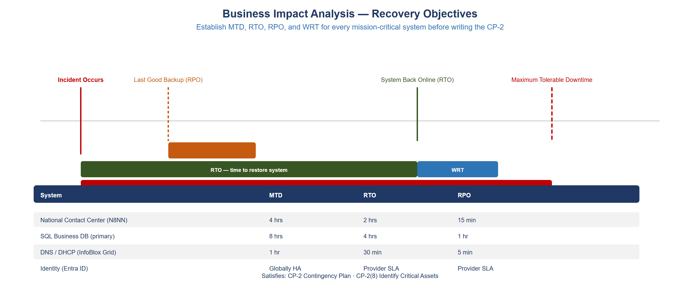
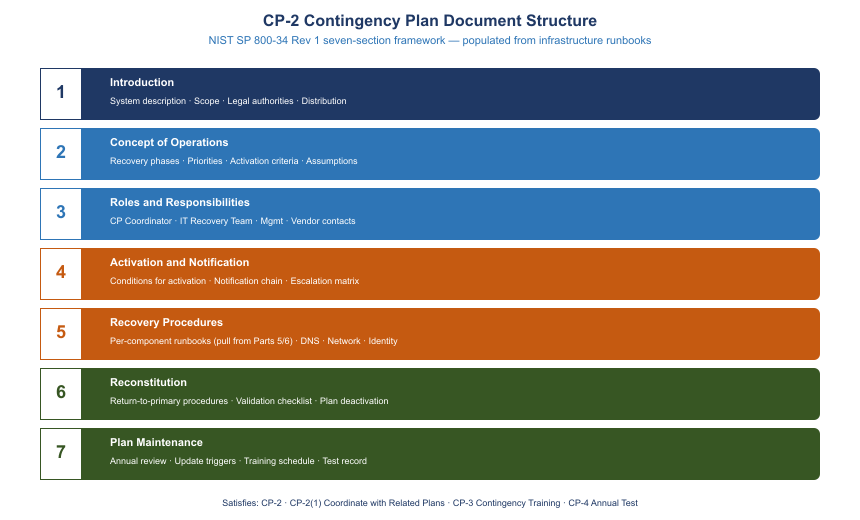
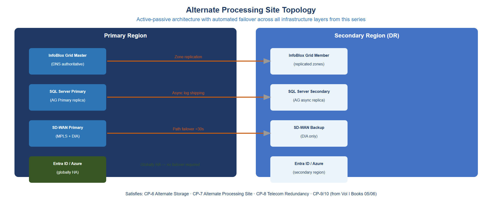
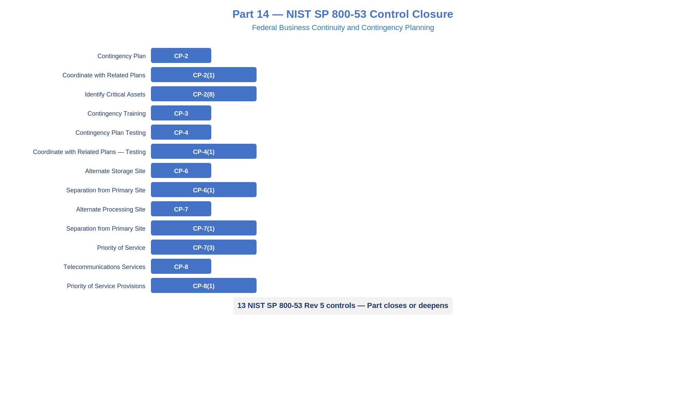

::: {.fouo-banner}
INTERNAL — NOT FOR PUBLIC DISTRIBUTION
:::

::: {.callout-warning}
## Draft Proposal — Subject to Review

This document is a **draft proposal** developed by the **CSI Team (Cloud Services Infrastructure)**. It is an attempt at a comprehensive SSA-wide technical roadmap and has not been reviewed or approved by the SSA CIO Office, the Office of Information Security (OIS), or organizational leadership. All recommendations, vendor selections, control mappings, and implementation timelines are subject to revision pending formal review by the SSA CIO Office and organizational components.
:::

## What This Document Addresses

Parts 1 through 13 of this series built the infrastructure substrate for a resilient federal network: DNS with Grid replication (Part 1), SD-WAN with dual underlay circuits and automatic path failover (Part 6), identity with break-glass access procedures (Parts 3 and 10), SQL Server Always On Availability Groups with geo-replicated disaster recovery replicas (Parts 8 and 9), and a centralized logging and alerting fabric (Part 13). Each part produced runbooks, configuration templates, and tested recovery procedures. A FedRAMP assessor reviewing all thirteen parts would find a technically impressive architecture. They would also find that the agency cannot demonstrate compliance with CP-2.

The reason is structural. CP-2 is not satisfied by capable infrastructure. CP-2 is satisfied by a document: a Contingency Plan that has been approved by a designated official, distributed to all recovery personnel, tested on a defined cycle, and updated when the system changes or after every test. The runbook in Part 8 that walks a DBA through failing over an Availability Group is a recovery procedure. It is not a Contingency Plan. The SD-WAN configuration in Part 6 that automatically steers traffic onto the backup DIA circuit when MPLS degrades is a resilience capability — one that lives in the overlay's probe-driven path selection, not in the circuit. It is not a Contingency Plan either. An assessor who opens the Plan of Action and Milestones and sees CP-2 open can turn off the screens showing a perfectly functioning DR failover and write a High finding, because the artifact does not exist.

This document closes that gap. It assembles the infrastructure components from Parts 1 through 13 into a formal CP-2 Contingency Plan structure aligned to NIST SP 800-34 Rev 1, adds the organizational and testing layers that infrastructure alone cannot provide, and closes the full CP control family through CP-10. Agencies can use this document as a direct template: the section outlines are populated with enough specificity to guide authors, the Business Impact Analysis methodology produces the RTO/RPO values that anchor the plan, and the testing framework produces the artifacts an assessor expects to see.

## Technology Without a Plan Fails CP-2

### What Assessors Actually Check

A FedRAMP assessor arriving to evaluate the CP control family will request three categories of artifacts: the Contingency Plan document itself, evidence that the plan has been tested, and evidence that personnel have been trained. The infrastructure review is secondary — assessors use it to verify that the capabilities the plan claims are real, not fictional. If the plan claims a two-hour RTO for the primary database and the technical review reveals that the DR replica is in the same availability zone as the primary, the plan has an inconsistency finding. But if no plan exists, no amount of correctly configured infrastructure resolves the finding.

NIST SP 800-34 Rev 1 defines the Contingency Plan as an organizational policy document with a specific structure. It must identify the system, state its criticality, define roles and responsibilities, establish activation thresholds, document recovery procedures for each component, describe reconstitution back to the primary site, and specify how the plan is maintained. Each of these is a prose or tabular artifact that requires human authorship, organizational review, and signature. A Terraform plan that deploys a geo-redundant SQL replica is a capability. The sentence "Database recovery will be performed by the Database Recovery Lead using the procedure in Appendix B, targeting completion within two hours of plan activation" is the plan artifact that CP-2 requires.

The distinction matters operationally as well. During an actual contingency, recovery teams under pressure need explicit authority to act, clear role assignments, and step-by-step procedures they can follow without consulting architectural diagrams. A well-structured CP-2 document provides that authority. A collection of technical runbooks stored in a wiki does not, because it lacks the activation criteria, the notification chain, and the reconstitution procedures that transform individual recovery steps into a coordinated organizational response.

### What a DR Runbook Is and Is Not

The DR runbooks in Parts 8 and 9 are Section 5 content for the Contingency Plan. They are not the Contingency Plan itself. The difference is visible in what each artifact contains.

A DR runbook answers: given that a decision to fail over has already been made, here are the technical steps to execute it, in order, with expected outputs at each step. It assumes someone has already declared an outage, notified affected parties, assembled the recovery team, and authorized the failover. It picks up at the moment a DBA sits down at a console.

A CP-2 Contingency Plan answers: how does the organization know when to activate the plan, who has the authority to activate it, who gets notified and in what order, which systems are recovered first, what does the team do between activating the plan and completing recovery, and how do they know when recovery is complete and operations can return to normal. It covers the decisions and coordination that precede and follow the technical recovery steps.

An agency that has only runbooks has the middle of the response documented. The CP-2 document provides the beginning (activation, notification, role assembly) and the end (validation, reconstitution, deactivation) that the runbooks assume but do not contain.

## Business Impact Analysis Methodology

### Purpose and Scope

The Business Impact Analysis (BIA) is the prerequisite to the Contingency Plan. It cannot be delegated entirely to the technical team, because the critical inputs — tolerable downtime thresholds, acceptable data loss windows, and recovery priority ordering — are business decisions, not technical ones. A DBA can tell you how long a database failover takes. Only the mission owner can tell you how long the organization can function without it.

The BIA produces four values for each mission-critical system:

- **Maximum Tolerable Downtime (MTD)**: the longest period the organization can sustain an outage before mission impact becomes unacceptable. This is the ceiling. If the system is not recovered before the MTD expires, the agency faces regulatory, mission, or public consequences that cannot be remediated by recovery alone.
- **Recovery Time Objective (RTO)**: the targeted elapsed time from incident declaration to full system restoration. The RTO must be less than the MTD; the gap between them is a buffer for complications.
- **Recovery Point Objective (RPO)**: the maximum tolerable data loss, expressed as time. An RPO of 15 minutes means the agency accepts losing up to 15 minutes of transactions during a recovery event.
- **Work Recovery Time (WRT)**: the time required after technical restoration to validate data integrity, reconcile transactions, clear backlogs, and return to normal operations. RTO + WRT must be less than MTD.

### Conducting the BIA

**Step 1: System inventory and scoping.** Begin with the asset inventory. The SQL estate inventory from Part 8 provides the structured data layer; the DDI dependency map from Part 1 provides the network dependency topology. Every system that appears in either inventory is a BIA candidate. Systems that are not in the inventory are not in scope for the contingency plan, which is an additional reason to maintain accurate asset inventories.

**Step 2: Stakeholder interviews.** For each candidate system, interview the mission owner (the senior official responsible for the business function the system supports), the system owner (the technical lead), and one or more power users who perform high-volume transactions. The mission owner determines the MTD. The system owner determines the RTO and whether it is technically achievable. The power users identify WRT requirements by describing the manual reconciliation or catchup procedures they perform after a system disruption.

Interview questions for mission owners:

1. If this system were unavailable starting right now, at what point would you be required to escalate to your director?
2. At what point would the unavailability affect your agency's external commitments or statutory obligations?
3. Are there specific time windows — end-of-day processing, scheduled batch jobs, federal reporting deadlines — during which an outage would be more severe?
4. What manual workaround procedures exist, and how long can staff sustain them?

**Step 3: Transaction rate analysis.** Pull peak transaction rates from monitoring (the Sentinel dashboards from Part 13 are the source for this). For a federal contact center such as an emergency services coordination system: record the peak call volume by hour for the past 90 days, identify the top five business days by call volume, and calculate the volume of call records that accumulate during a 15-minute window at peak load. That number is the RPO's concrete meaning: it is the number of call records the agency accepts losing if a failure occurs at peak time.

**Step 4: Dependency mapping.** For each system, enumerate upstream and downstream dependencies using the IPAM dependency map from Part 1 and the SQL replication topology from Part 9. A dependency that has a longer RTO than the dependent system creates a recovery constraint: the dependent system cannot be recovered before the dependency is available, regardless of what its own RTO says. These constraints must be resolved by either adjusting RTO values or architecting away the hard dependency.

**Step 5: BIA table.** Compile results into a formal table for mission owner and ISSO review and sign-off.

| System | MTD | RTO | RPO | WRT | Primary Dependencies |
|---|---|---|---|---|---|
| Emergency Contact Center (telephony platform) | 4 hours (business hours) | 2 hours | 15 minutes (call recording) | 30 minutes | DNS (DDI), Identity Provider (Entra), WAN circuit |
| Case Management Database (SQL primary) | 8 hours | 4 hours | 5 minutes | 60 minutes | SQL AG replica, DDI, Active Directory |
| Internal Collaboration Platform | 24 hours | 8 hours | 60 minutes | 2 hours | Identity Provider, Storage |
| Network Services — DDI | 2 hours | 1 hour | N/A (stateless resolution) | 15 minutes | Physical network, Grid replication |
| SD-WAN Control Plane | 30 minutes | 15 minutes (automatic) | N/A | 5 minutes | Internet DIA circuit |
| Identity Provider (cloud-hosted) | 4 hours | N/A (vendor-managed HA) | N/A | 15 minutes (break-glass validation) | Internet connectivity |
| Audit Logging Platform | 12 hours | 6 hours | 60 minutes | 30 minutes | Storage, network |
| Application Binaries / Deployment Store | 48 hours | 24 hours | 24 hours | 4 hours | Storage, DDI |

: BIA Summary — Mission-Critical Systems {.striped .hover}

{fig-alt="Bar chart comparing MTD, RTO, and RTO plus WRT values for eight mission-critical systems. The emergency contact center shows the tightest constraint with a 4-hour MTD and 2.5-hour combined RTO plus WRT. The SQL case management database shows 8-hour MTD and 5-hour combined RTO plus WRT. All systems show RTO plus WRT below their MTD ceiling, confirming the recovery architecture is achievable. Systems are color-coded: MTD in navy, RTO in teal, WRT extension in amber." width="100%"}

::: {.callout-important}
## BIA Values Require Mission-Owner Signature

The MTD value in each BIA row is a mission decision, not a technical estimate. Before the BIA is incorporated into the Contingency Plan, each mission owner must review and sign the row corresponding to their system. If the mission owner believes the MTD is incorrect, the technical RTO must be re-evaluated to close the gap, not the MTD adjusted downward to match a convenient technical answer.
:::

## CP-2 Contingency Plan Document Structure

NIST SP 800-34 Rev 1 defines seven sections for a federal Contingency Plan. This section provides the structural outline for each section with sufficient detail for agency authors to populate it. The runbooks from Parts 8 and 9 are explicitly referenced as appendix content that satisfies Section 5 recovery procedure requirements.

{fig-alt="Flowchart showing the seven sections of a NIST SP 800-34 Rev 1 Contingency Plan arranged vertically with left-side annotations mapping each section to its corresponding NIST control. Section 1 Introduction maps to CP-2 system identification. Section 2 Concept of Operations maps to CP-2 recovery priorities. Section 3 Roles and Responsibilities maps to CP-2 personnel and CP-3 training. Section 4 Activation and Notification maps to CP-2 activation criteria. Section 5 Recovery Procedures maps to CP-2 recovery steps, CP-6 alternate storage, and CP-7 alternate processing. Section 6 Reconstitution maps to CP-2 reconstitution. Section 7 Plan Maintenance maps to CP-2 review cycle. Arrows indicate sequential dependency from declaration through reconstitution." width="100%"}

### Section 1: Introduction

**1.1 Purpose.** This Contingency Plan establishes procedures and responsibilities for restoring mission-critical information systems operated by [Agency Name] following an unplanned disruption. It is developed in accordance with NIST SP 800-34 Rev 1, NIST SP 800-53 Rev 5 control CP-2, and the agency's Information Security Continuous Monitoring strategy.

**1.2 Scope.** This plan applies to the following systems and their supporting infrastructure:

- [List each system from the BIA table, with its Federal Information System designation if applicable]
- Network infrastructure: SD-WAN fabric, DDI (DNS/DHCP/IPAM), and associated WAN circuits
- Cloud-hosted services operating under the agency's FedRAMP authorization boundary
- Third-party services with interconnection agreements (list each)

**1.3 System Description.** [Summarize the mission-critical systems covered by this plan in plain language: what they do, who uses them, and why they are essential to the agency mission. Reference the System Security Plan for the full system description.]

**1.4 Applicable Laws, Regulations, and Policies.**

- Federal Information Security Modernization Act (FISMA) of 2014
- OMB Circular A-130, Managing Information as a Strategic Resource
- NIST SP 800-34 Rev 1, Contingency Planning Guide for Federal Information Systems
- NIST SP 800-53 Rev 5, Security and Privacy Controls for Information Systems and Organizations
- [Agency-specific continuity of operations plan (COOP) reference]
- [FedRAMP authorization package reference]

**1.5 Record of Changes.**

| Version | Date | Author | Summary of Changes |
|---|---|---|---|
| 1.0 | [Initial date] | [Author] | Initial plan publication |
| 1.1 | [Date] | [Author] | Updated per [annual test / system change] |

: Plan Change History {.striped .hover}

**1.6 Plan Approval.** This plan is approved by [Authorizing Official Name and Title] and takes effect on [date]. The System Owner and Information System Security Officer co-sign the plan cover page. The plan must be re-approved following any update to Section 3, 4, or 5.

### Section 2: Concept of Operations

**2.1 Recovery Phases.** Contingency response proceeds through five phases:

1. **Activation** — the triggering event is detected, evaluated against activation thresholds, and the plan is formally declared active by authorized personnel.
2. **Notification** — the Contingency Plan Coordinator notifies recovery team members, management, and external stakeholders in accordance with the notification tree in Section 4.
3. **Recovery** — technical recovery teams execute component-level recovery procedures (Appendices A through E) in priority order.
4. **Validation** — recovered systems are tested against defined acceptance criteria before being returned to production use.
5. **Reconstitution** — once validation is complete, operations are returned to the primary site (if applicable), temporary workarounds are terminated, and the plan is deactivated.

**2.2 Recovery Priorities.** Systems are recovered in the following priority order, based on the MTD values from the BIA:

| Priority | System | MTD | Rationale |
|---|---|---|---|
| 1 | Network Services (DDI, SD-WAN) | 2 hours / 30 minutes | All other systems depend on network connectivity |
| 2 | Identity Provider | 4 hours (break-glass available) | Authentication required before any application recovery |
| 3 | Emergency Contact Center | 4 hours | Statutory mission obligation; public-facing |
| 4 | Case Management Database | 8 hours | Operational continuity for case workers |
| 5 | Audit Logging Platform | 12 hours | Required for incident investigation; not operational blocker |
| 6 | Internal Collaboration Platform | 24 hours | Staff can use manual alternates |
| 7 | Application Deployment Store | 48 hours | No active sessions depend on deployment pipeline |

: Recovery Priority Order {.striped .hover}

**2.3 Assumptions and Conditions.**

- The alternate processing site (secondary cloud region) is provisioned and tested at least annually.
- Recovery personnel are familiar with their roles and have completed annual contingency training (CP-3).
- Contact information in the notification tree (Section 4) is reviewed and updated quarterly.
- The alternate storage site (Section 5, CP-6) contains current copies of all data and application artifacts.
- Internet connectivity is available at the alternate site. If Internet connectivity is also disrupted, the plan assumes connectivity is restored within one hour.
- This plan does not address scenarios in which all personnel with recovery authority are simultaneously unavailable (addressed by the agency COOP).

**2.4 Points of Contact.** [Reference Section 3 for role-based contacts. Do not embed personal phone numbers in the body of the plan; maintain a separately controlled contact roster that is updated independently of plan revisions.]

### Section 3: Roles and Responsibilities

**3.1 Contingency Plan Coordinator (CPC).** The CPC is the single individual with authority to declare plan activation, direct recovery team resources, communicate with executive management, and declare plan deactivation upon successful reconstitution. The CPC is typically the IT Manager or Deputy CIO. Alternate: [named alternate with same authority when primary CPC is unavailable].

Responsibilities:
- Evaluate triggering events against activation thresholds
- Formally declare plan activation (verbal followed by documented declaration within two hours)
- Notify the Management Team and external stakeholders
- Coordinate across recovery team leads
- Authorize the transition from Recovery Phase to Reconstitution Phase
- Conduct After-Action Review and initiate plan update

**3.2 IT Recovery Team Leads.**

| Role | Responsibilities | Backup |
|---|---|---|
| Network Recovery Lead | SD-WAN failover, DDI Grid failover, circuit coordination with carrier NOC | [Alternate name] |
| Database Recovery Lead | SQL AG failover, data integrity validation, backup restoration if needed | [Alternate name] |
| Identity Recovery Lead | Break-glass account activation, Conditional Access policy adjustment, Entra ID validation | [Alternate name] |
| Application Recovery Lead | Failover of application tier to alternate region, DNS cutover validation | [Alternate name] |
| Security and Logging Lead | Confirm audit logging continuity, validate Sentinel workspace in alternate region | [Alternate name] |

: IT Recovery Team Roles {.striped .hover}

**3.3 Management Team.** The Management Team (director level and above) is notified at plan activation. Their role is to authorize extended outage communications, approve any decision to invoke manual workaround procedures that affect public or partner agency operations, and receive status updates at defined intervals (every two hours during active recovery).

**3.4 Vendor and Service Provider Contacts.**

| Vendor | Service | Contact Type | Contact |
|---|---|---|---|
| Cloud Service Provider | Primary and alternate cloud regions | NOC, Escalation | [CSP support portal; P1 incident phone] |
| SD-WAN Vendor | Overlay fabric | TAC | [Case portal; TAC direct phone] |
| Primary WAN Carrier | MPLS circuit | NOC | [Circuit ID; NOC phone] |
| Backup Internet Provider | DIA circuit | NOC | [Circuit ID; NOC phone] |
| DDI Platform Vendor | Grid software | Support | [Case portal; critical support phone] |

: Vendor Contact Directory {.striped .hover}

**3.5 External Stakeholders.** Identify partner agencies with interconnection agreements, public-facing service users who must be notified during an outage, and oversight bodies (Inspector General, oversight committee) with reporting obligations. Notification timelines and templates are maintained in the notification tree (Appendix F).

### Section 4: Activation and Notification

**4.1 Activation Thresholds.** The Contingency Plan is activated when one or more of the following conditions is confirmed:

- An outage affecting Priority 1 or Priority 2 systems that has persisted or is projected to persist beyond 30 minutes without a clear resolution path
- A security incident that has caused or is likely to cause data destruction, ransomware encryption of production systems, or loss of availability of authentication infrastructure
- A physical facility event (fire, flood, loss of power without generator restoration within one hour) affecting the primary data center or primary cloud region
- A declaration by the Cloud Service Provider of a regional outage affecting availability zone redundancy
- Direction from the agency COOP to activate IT contingency procedures

**4.2 Activation Decision Authority.** The CPC has authority to activate the plan. In the absence of the CPC, the designated alternate CPC has equal authority. The Management Team is notified concurrently with activation; they do not need to approve activation.

**4.3 Notification Procedure.**

Step 1 (0–15 minutes post-decision): CPC declares activation verbally and notifies all IT Recovery Team Leads simultaneously via the agency emergency notification system. If the emergency notification system is unavailable, use the out-of-band contact roster (stored offline in the CPC's secure binder and as an encrypted file in the alternate Key Vault described in Section 5).

Step 2 (15–30 minutes): IT Recovery Team Leads confirm receipt and report to their designated recovery stations (physical or remote). Each lead does a 60-second status check: Is my team available? Do I have access to recovery procedures? Do I have access to necessary credentials? The Network Recovery Lead reports first because all subsequent work depends on network availability.

Step 3 (30–60 minutes): CPC notifies Management Team with initial situation report: what failed, when, what the impact is, what the projected recovery timeline is, and what decisions (if any) are needed from management immediately.

Step 4 (60 minutes and every 2 hours thereafter): CPC issues status updates to Management Team. Format: [Systems recovered], [Systems still recovering], [Projected completion], [Issues blocking recovery], [Decisions needed].

Step 5 (as applicable): If the outage affects public-facing services or partner agency connections, the Management Team authorizes external notification. External notification templates are in Appendix F.

**4.4 Escalation.** If recovery is not on track to meet the MTD for any Priority 1 or Priority 2 system, the CPC escalates to the CIO or acting CIO. If the outage is the result of a security incident, the ISSO notifies the agency CISO and, if required by the incident response plan, CISA within the required reporting window.

### Section 5: Recovery Procedures

**5.1 Structure.** Recovery procedures are organized by system component in the order of recovery priority established in Section 2.2. Each component procedure is maintained as an appendix to this plan. The appendices contain the runbooks developed and tested by the IT Recovery Teams; this section provides the summary of each procedure, the acceptance criteria that must be met before the component is declared recovered, and the estimated time to complete recovery.

::: {.callout-note}
## Appendix Cross-References

Appendix A — Network Recovery Procedures (SD-WAN failover and DDI Grid failover; derived from the runbooks in Parts 1 and 6 of this series)

Appendix B — Database Recovery Procedures (SQL AG failover and point-in-time restore; derived from the runbooks in Parts 8 and 9 of this series)

Appendix C — Identity Recovery Procedures (break-glass account activation and Conditional Access adjustment; derived from Parts 3 and 10 of this series)

Appendix D — Application and Cloud Service Recovery Procedures (application tier failover to secondary region)

Appendix E — Audit Logging Recovery Procedures (Sentinel workspace validation and log analytics continuity; derived from Part 13 of this series)

Appendix F — Notification Templates and External Stakeholder Contact Roster
:::

**5.2 Component Recovery Summary.**

| Component | Appendix | Estimated Duration | Acceptance Criteria |
|---|---|---|---|
| SD-WAN automatic circuit failover | A-1 | 3–5 minutes (automatic) | All spoke sites show active BGP via backup DIA; no packet loss for 60 seconds |
| DDI Grid failover to alternate Grid member | A-2 | 15–30 minutes | DNS resolution functional from all sites; DHCP leases active; IPAM data current |
| Break-glass identity access | C-1 | 5 minutes | Break-glass accounts authenticate successfully; MFA bypass documented |
| SQL AG failover (synchronous replica) | B-1 | 5–15 minutes | Secondary replica promoted; application connection string updated; read/write functional |
| SQL AG failover (async DR replica, RPO applies) | B-2 | 30–60 minutes | DR replica promoted; data integrity check complete; missing transactions identified and logged |
| Application tier failover to secondary region | D-1 | 30–60 minutes | Application health checks pass in secondary region; DNS A records updated; user sessions functional |
| Audit logging validation | E-1 | 30 minutes | Sentinel workspace receiving events; no gaps in log ingestion longer than RPO threshold |

: Component Recovery Summary {.striped .hover}

**5.3 Manual Workaround Procedures.** For each Priority 1 system, document the manual procedure that staff can execute if technical recovery extends beyond the RTO. For the emergency contact center: activate the designated backup PSTN lines, brief supervisors on manual call-tracking using the paper-based backup form (stored at each supervisor station), and notify the public-facing status page of reduced capacity. Manual workaround authorization is the CPC's decision; it does not replace technical recovery, which continues in parallel.

### Section 6: Reconstitution

**6.1 Reconstitution Decision.** The CPC authorizes transition to the Reconstitution Phase when all Priority 1 through Priority 4 systems have met their acceptance criteria and have been operational in the recovery environment for at least one hour without incident. Priority 5 through 7 systems may still be in recovery when reconstitution of Priority 1–4 systems begins.

**6.2 Return to Primary Site.** Reconstitution to the primary site follows the reverse of the recovery sequence: applications are failed back after DNS, network, database, and identity are confirmed stable at the primary site. Failback procedures for each component are documented in the corresponding appendix (labeled as -R sections: Appendix A-1-R for SD-WAN failback, Appendix B-1-R for SQL AG failback, and so forth).

**6.2.1 Data Synchronization Before Failback.** Before failing back the SQL primary, verify that all transactions written to the DR replica during the contingency period have been replicated to the primary. If the primary site is being restored from backup (rather than being resynchronized from a live replica), execute a data integrity reconciliation to identify any transactions written to the DR replica that are not present in the restored primary, and apply them manually or via the procedure in Appendix B-3.

**6.3 Validation.** After reconstitution, each Recovery Team Lead executes a validation checklist confirming that:
- All services are running at normal capacity on primary infrastructure
- Data integrity checks are complete and no unexplained gaps exist
- Audit logging has resumed on primary infrastructure with no gap
- All temporary workarounds (manual call-tracking, break-glass accounts, Conditional Access policy adjustments) have been reversed
- Monitoring and alerting thresholds are reset to normal baselines

**6.4 Deactivation.** The CPC formally declares the plan deactivated in writing (email with date/time stamp, addressed to the Management Team and all Recovery Team Leads). The deactivation notice includes a summary of the event timeline, which systems were recovered and when, and the scheduled date for the After-Action Review.

**6.5 After-Action Review.** The After-Action Review (AAR) is conducted within five business days of plan deactivation. It produces an AAR report (template in Appendix G) covering: what worked, what did not, what would have been done differently, and specific plan updates required. Plan updates are completed within 30 days of the AAR.

### Section 7: Plan Maintenance

**7.1 Review Cycle.** The Contingency Plan is reviewed and updated annually, or following any of these triggering events:
- A contingency event that results in plan activation
- A contingency plan test that reveals significant gaps
- A material change to any system covered by the plan (new application, architecture change, change in service provider, change in WAN topology)
- A change in recovery team personnel or organizational structure
- A change in applicable law, regulation, or agency policy

**7.2 Update Responsibility.** The ISSO owns the annual review process. Recovery Team Leads are responsible for keeping their corresponding appendices current. The mission owners are responsible for re-validating BIA values annually.

**7.3 Distribution.** The current plan version is maintained in the document management system. A printed copy is maintained in the CPC's secure binder and at the alternate site. All Recovery Team Leads receive notification when a new version is published.

## Alternate Storage Site (CP-6)

### What CP-6 Requires

CP-6 requires the organization to establish an alternate storage site that includes backup copies of information sufficient to support recovery operations, and that is geographically separated from the primary site to reduce the likelihood that a single event (natural disaster, regional power failure, physical attack) affects both simultaneously.

The geo-replicated database architecture from Part 9 addresses the structured data component of CP-6. The async replica in the secondary cloud region receives continuous transaction log shipping and can be promoted to primary within 30–60 minutes. For CP-6 purposes, this constitutes an alternate storage site for the database tier. However, CP-6 covers more than the database.

### Structured Data (Database Tier)

The SQL Server Always On Availability Group architecture from Parts 8 and 9 provides continuous replication of database content to the DR replica in the secondary region. The RPO for structured data is bounded by the replication lag: for synchronous replicas (same metropolitan region), RPO approaches zero; for async replicas (cross-region), RPO reflects replication lag, which in normal network conditions is under 60 seconds and bounded by the configurable maximum replication lag setting.

CP-6(1) requires separation from the primary site. The async DR replica must be in a different geographic region, not merely a different availability zone within the same region. Verify the region separation in the cloud console and document the physical distance and administrative separation in the CP-2.

### Unstructured Data (Files, Collaboration Content)

Unstructured data stored in cloud collaboration platforms (document management, shared file stores) must also be covered by an alternate storage arrangement. For Microsoft 365 Government Cloud tenants, multi-geo data residency configuration replicates content to a secondary geo location. Confirming CP-6 coverage for unstructured data requires:

1. Verifying that multi-geo is enabled and that the secondary geo location is in a different region from the primary
2. Documenting the replication frequency and any RPO limitations (Microsoft's SLA defines the replication commitment)
3. Including this verification in the annual CP-6 test

### Application Binaries and Configuration Baselines

Two additional categories must be addressed for a complete CP-6 implementation:

**Application binaries.** The software packages needed to deploy or redeploy application components must be available at the alternate site. For cloud-managed device platforms (device management service), verify that the application catalog is accessible from the secondary region. For Arc-managed servers, verify that extension packages and configuration baselines are stored in a secondary region storage account.

**Configuration baselines.** Infrastructure-as-code (Terraform state, ARM templates, Bicep files) and device management policies (device management service policy exports, compliance policy backups) must be stored in a location accessible from the alternate site. Store these artifacts in a secondary region Key Vault or storage account, and include their recovery in the application recovery procedures (Appendix D).

```powershell
# Export device management policies to the alternate Key Vault
# Run quarterly or after any policy change

$SecondaryKeyVaultName = "kv-agency-dr-<region>"
$ExportPath = "C:\CP6\PolicyExports"
$Timestamp = Get-Date -Format "yyyyMMdd-HHmmss"

# Export device compliance policies via Microsoft Graph
Connect-MgGraph -Scopes "DeviceManagementConfiguration.Read.All"

$Policies = Get-MgDeviceManagementDeviceCompliancePolicy
foreach ($Policy in $Policies) {
    $PolicyJson = $Policy | ConvertTo-Json -Depth 10
    $SafeName = $Policy.DisplayName -replace '[^A-Za-z0-9-]', '-'
    $FilePath = "$ExportPath\$SafeName-$Timestamp.json"
    Set-Content -Path $FilePath -Value $PolicyJson -Encoding UTF8
}

# Upload to secondary Key Vault storage
$StorageContext = New-AzStorageContext -StorageAccountName "staagencydr<region>" `
    -UseConnectedAccount

Get-ChildItem -Path $ExportPath -Filter "*.json" | ForEach-Object {
    Set-AzStorageBlobContent -File $_.FullName `
        -Container "policy-exports" `
        -Blob "compliance/$($_.Name)" `
        -Context $StorageContext `
        -Force
}

Write-Output "Policy export complete. Files uploaded to alternate region storage."
```

### Validating CP-6 Compliance

An annual CP-6 validation test confirms that the alternate storage site contains a copy sufficient to restore operations. The test procedure:

1. Identify the most recent backup or replica snapshot in the alternate site for each data category
2. Restore a test instance from that backup in an isolated environment (not production)
3. Confirm data integrity: compare row counts, checksums on critical tables, and representative record spot-checks against a known-good baseline
4. Document: backup age at time of test, restore duration, integrity check results, any gaps identified
5. Update the CP-2 with the test date and results

## Alternate Processing Site (CP-7)

### Cloud-Native Workloads

For cloud-native applications deployed to a primary cloud region, the alternate processing site is the secondary cloud region. The CSP's FedRAMP ATO covers both regions, satisfying the requirement for a formally authorized alternate processing environment. CP-7 additionally requires:

- **Documented capacity agreements.** The CSP service agreement must support spinning up production-equivalent capacity in the secondary region. For reserved instance commitments, verify that reservations cover both regions or that on-demand capacity is available.
- **Documented RTO for primary-to-secondary failover.** This value comes from the last DR test, not from design estimates.
- **Tested failover.** At least annually, execute an actual failover of at least one critical workload to the secondary region and document the elapsed time.

CP-7(1) requires separation from the primary site: the secondary region must be geographically and administratively separate. Document the region pair in the CP-2: primary region [name], secondary region [name], physical distance [miles/km], administrative separation confirmed by [CSP documentation reference].

CP-7(3) requires priority-of-service provisions: the agency must have a mechanism to ensure access to alternate processing capacity during a widespread disaster, even under high demand. For commercial CSPs, this is typically addressed through the FedRAMP authorization and the CSP's service continuity commitments. Document the specific commitment (support tier, SLA reference) in the CP-2.

{fig-alt="Network topology diagram on a white background showing two cloud regions side by side. The left box labeled Primary Region contains: SD-WAN hub, DDI Grid primary, SQL AG primary replica, application tier, and Sentinel workspace. The right box labeled Secondary Region contains: DIA circuit termination, DDI Grid alternate member, SQL AG DR replica, application tier standby, and Sentinel secondary workspace. Connecting the two regions are four labeled arrows: one for SQL transaction log shipping (teal, labeled RPO less than 60 seconds), one for DDI Grid replication (navy), one for SD-WAN overlay tunnel over DIA (amber, labeled automatic failover), and one for DNS cutover via health check (red, labeled RTO 5 minutes). Below the diagram a legend distinguishes automatic failover paths from manual failover paths." width="100%"}

### SQL Server Alternate Processing

The SQL Server Always On Availability Group architecture provides both CP-6 (alternate storage via the replica) and CP-7 (alternate processing via failover) in a single architecture. For CP-7 documentation purposes, the key requirement is that the AG failover is tested, not just configured.

Document in the CP-2:
- Primary SQL instance: [server name, region, role: PRIMARY]
- Synchronous replica: [server name, region or availability zone, role: SYNCHRONOUS_SECONDARY]
- Asynchronous DR replica: [server name, region, role: ASYNCHRONOUS_SECONDARY]
- Last tested RTO for synchronous failover: [N minutes, from last test date]
- Last tested RTO for async DR failover (includes data integrity check): [N minutes, from last test date]

### Network and SD-WAN Alternate Processing

The SD-WAN dual-underlay architecture from Part 6 provides automatic alternate path selection that satisfies CP-7 for WAN connectivity. The alternate path is a capability of the overlay — the fabric probes both underlays continuously and steers traffic per class — not of the circuits underneath it. The critical documentation requirements:

```powershell
# Retrieve SD-WAN circuit status for CP-7 documentation
# Execute from the SD-WAN management platform API or CLI

# Example using generic REST API call to SD-WAN orchestrator
$OrchestratorUrl = "https://<sdwan-orchestrator>/api/v1"
$Headers = @{ "Authorization" = "Bearer $env:SDWAN_API_TOKEN" }

$Circuits = Invoke-RestMethod -Uri "$OrchestratorUrl/underlay/circuits" `
    -Headers $Headers -Method GET

foreach ($Circuit in $Circuits) {
    [PSCustomObject]@{
        CircuitName      = $Circuit.name
        Provider         = $Circuit.provider
        Type             = $Circuit.type          # MPLS or DIA
        BandwidthMbps    = $Circuit.bandwidth_mbps
        SLAUptimePct     = $Circuit.sla.uptime_percent
        FailoverRole     = $Circuit.failover_role  # PRIMARY or BACKUP
        LastTestedDate   = $Circuit.last_tested
    }
} | Format-Table -AutoSize
```

The output of this command, run at the time of the annual test, becomes the CP-7 evidence exhibit for SD-WAN alternate processing documentation.

### Amazon Connect Multi-Region Failover

For cloud contact center platforms (such as the Amazon Connect deployment referenced in Part 6), CP-7 requires documented multi-region failover. The failover mechanism uses DNS-based health checks with automatic routing policy changes.

```powershell
# Validate Route 53 health check configuration for contact center failover
# Requires AWS Tools for PowerShell

Import-Module AWSPowerShell.NetCore

$HealthChecks = Get-R53HealthCheck -Region "us-east-1"
$ContactCenterHC = $HealthChecks | Where-Object {
    $_.HealthCheckConfig.FullyQualifiedDomainName -like "*contact-center*"
}

foreach ($HC in $ContactCenterHC) {
    $Status = Get-R53HealthCheckStatus -HealthCheckId $HC.Id
    [PSCustomObject]@{
        HealthCheckId     = $HC.Id
        FQDN              = $HC.HealthCheckConfig.FullyQualifiedDomainName
        Protocol          = $HC.HealthCheckConfig.Type
        FailureThreshold  = $HC.HealthCheckConfig.FailureThreshold
        CurrentStatus     = ($Status.HealthCheckObservations | Select-Object -First 1).StatusReport.Status
    }
}
```

Document the health check configuration, the DNS routing policy (failover routing with primary and secondary record sets), and the time-to-failover as observed in the last test.

## Telecommunications Service Redundancy (CP-8)

### CP-8 Requirements

CP-8 requires the organization to establish alternate telecommunications services, including necessary agreements, to support resumption of system operations for essential mission and business functions within the RTO. CP-8(1) requires priority-of-service provisions with primary and alternate telecommunications service providers.

### SD-WAN Dual Underlay as CP-8 Implementation

The SD-WAN architecture from Part 6 directly implements CP-8. The distinction that matters for the CP-2 documentation: the circuits supply capacity and physically separate paths; the *service redundancy* CP-8 asks for — detection, failover, and resumption of operations — is supplied by the overlay that governs them. The dual underlay consists of:

**Primary path (MPLS):** Carrier-grade MPLS circuit providing deterministic latency for voice and video traffic. Characteristics to document:
- Primary carrier name and circuit ID
- Committed bandwidth (upload/download)
- Committed latency and jitter SLA
- Contracted uptime SLA and MTTR
- NOC contact and escalation path

**Backup path (DIA — Direct Internet Access):** Broadband Internet circuit from a different provider. The circuit contributes exactly two things: bandwidth and a physically separate path. It becomes an alternate telecommunications *service* in the CP-8 sense only because the SD-WAN overlay probes it continuously, encrypts it, and can steer per-class traffic onto it when MPLS degrades — a second circuit without the overlay is added bandwidth, not added resilience. Characteristics to document:
- Backup carrier name and circuit ID
- Committed bandwidth
- Best-effort latency characteristics
- NOC contact and escalation path
- Physical path separation from primary circuit (verify that backup circuit does not share physical infrastructure at the building entry point or regional exchange)

**Automatic failover.** The SD-WAN fabric runs both underlays active-active and measures each continuously — BFD (Bidirectional Forwarding Detection) or equivalent liveness detection, plus per-path probes for packet loss, latency, and jitter. When the primary path degrades below configured thresholds, the overlay steers traffic to the backup path without manual intervention; for brownout conditions caught by the probes, per-class steering completes in under a second, with the overlay resequencing packets and moving voice and transaction classes first. The failover detection and cutover time is configurable and must be documented from observation, not from the datasheet. This paragraph is where the CP-8 capability actually lives: failover, resequencing, and per-class path policy are overlay functions. The circuits beneath them are interchangeable capacity.

> **Closure Necessity — CP-8 on the dual underlay.** Most of the CP family closes with authored artifacts, not technology: CP-2 is a signed plan, CP-3 is a training record, CP-4 is a documented test. No network purchase produces any of those, and this document exists precisely because infrastructure alone cannot. CP-8 is the one place in the family where the mechanism matters. The control requires alternate telecommunications services that support *resumption of operations* within the RTO. Two circuits from two carriers satisfy the "alternate services" clause on paper; by themselves they resume nothing. Traditional dual-homing fails over on routing-protocol reconvergence — tens of seconds to minutes, all-or-nothing, with no per-class policy and no recorded evidence of path health — against a 15-minute RTO and a 30-minute MTD for the network layer. The mechanism that makes the alternate service resume operations inside that budget is SD-WAN active-active multipath: probe-driven path selection, sub-second steering on brownout, and per-class path policy. A second DIA circuit without the overlay adds bandwidth, not resilience.

```powershell
# Query SD-WAN path quality metrics for CP-8 documentation
# Retrieves real-time and historical path quality from orchestrator

$OrchestratorUrl = "https://<sdwan-orchestrator>/api/v1"
$Headers = @{ "Authorization" = "Bearer $env:SDWAN_API_TOKEN" }

# Get current path status for each edge site
$Sites = Invoke-RestMethod -Uri "$OrchestratorUrl/edges" `
    -Headers $Headers -Method GET

foreach ($Site in $Sites) {
    $PathStatus = Invoke-RestMethod `
        -Uri "$OrchestratorUrl/edges/$($Site.id)/path-quality" `
        -Headers $Headers -Method GET

    foreach ($Path in $PathStatus.paths) {
        [PSCustomObject]@{
            Site            = $Site.name
            PathName        = $Path.name
            Underlay        = $Path.underlay_type    # MPLS or BROADBAND
            State           = $Path.state            # UP or DOWN
            LossPercent     = $Path.metrics.loss_pct
            LatencyMs       = $Path.metrics.latency_ms
            JitterMs        = $Path.metrics.jitter_ms
            ActiveForTraffic = $Path.is_active
        }
    }
} | Format-Table -AutoSize
```

### CP-8 Documentation Block for CP-2

Include the following table in Section 2 or as a dedicated subsection of Section 5 in the CP-2:

| Circuit | Provider | Type | Bandwidth | SLA Uptime | CP-8 Role |
|---|---|---|---|---|---|
| MPLS-PRIMARY-01 | [Carrier A] | MPLS | [N] Mbps symmetrical | 99.9% | Primary |
| DIA-BACKUP-01 | [Carrier B] | Broadband Internet | [N] Mbps / [N] Mbps | 99.5% | Backup (overlay-steered automatic failover) |
| OOB-MGMT | [Carrier C] | LTE/cellular | [N] Mbps / [N] Mbps | Best effort | Out-of-band management only |

: CP-8 Telecommunications Circuit Inventory {.striped .hover}

**Failover detection threshold:** [N] ms latency or [N]% packet loss sustained for [N] seconds.

**Failover cutover time (observed in last test):** [N] seconds.

**Priority-of-service provision:** The agency has a [Tier N] support agreement with [Carrier A] that includes disaster declaration priority restoration. Reference: [Contract number or support agreement ID]. For the backup DIA circuit, [Carrier B] provides [commercial SLA]. If neither circuit is available, the out-of-band cellular management circuit provides minimal connectivity for command-and-control operations.

## Contingency Plan Testing (CP-4)

### What FedRAMP Assessors Expect

CP-4 requires annual testing of the contingency plan. At Moderate baseline, FedRAMP accepts tabletop exercises as the minimum, with functional testing required for critical systems. What assessors specifically look for:

1. **Test plan:** a document prepared before the test that defines the scenario, objectives, participants, schedule, and metrics
2. **Test execution record:** evidence that the test actually happened — sign-in sheet or meeting record, completed test script with pass/fail for each step, metrics collected during the exercise
3. **Lessons learned:** a list of findings from the test, categorized by severity
4. **Plan update:** evidence that the CP-2 was updated to reflect lessons learned from the test

Assessors are suspicious of clean test results. A tabletop that produces zero findings is more likely to indicate an inadequate scenario than a perfectly prepared team. Include at least one deliberate complication in each test (a key team member is "unavailable," a contact number in the notification tree is "wrong," the backup storage site credential has "expired") to surface realistic gaps.

### Annual Test Cycle

**Year 1 (Initial): Tabletop Exercise.** Suitable for a newly created contingency plan. Use the scenario and agenda below.

**Year 2: Functional Test.** Requires actually failing over at least one critical system to the alternate site and measuring recovery time against the documented RTO.

**Year 3: Full Recovery Test.** Recommend for agencies with high-criticality systems. Simulate complete loss of the primary site and execute all Section 5 recovery procedures in sequence.

Return to Year 1 after a Year 3 full recovery test, or after a major architecture change that resets the test baseline.

### Tabletop Exercise: Ransomware Scenario

**Scenario.** At 9:15 AM on a Tuesday morning, the Security Operations Center receives alerts from the endpoint detection system indicating lateral movement across the network and encrypted files on three Windows servers. By 9:30 AM, the SQL primary database server is unresponsive and the IT team suspects ransomware has encrypted the database files. The primary cloud region hosting application workloads shows degraded performance. At 9:45 AM, the CPC is notified.

**Objectives.**
1. Practice the activation and notification procedures from Section 4
2. Identify which recovery procedures from Section 5 would be invoked, in what order
3. Surface gaps in the notification tree and contact roster
4. Exercise the decision to fail over to async DR replica (accepting data loss up to RPO)
5. Practice the management update briefing format

**Agenda (2 hours).**

| Time | Activity | Facilitator Notes |
|---|---|---|
| 0:00–0:10 | Scenario introduction and ground rules | Read scenario aloud; confirm all participants have their assigned roles |
| 0:10–0:25 | Activation decision | Inject: CPC is in a meeting with external stakeholders; alternate CPC must make the call. Does alternate CPC know they have this authority? |
| 0:25–0:45 | Notification exercise | Walk notification tree step by step; have participants call out the action they would take. Inject: one IT Recovery Team Lead's phone number in the roster is wrong. |
| 0:45–1:05 | Recovery sequencing | Which systems are recovered first? In what order? What is the expected time for each? Inject: the synchronous AG replica is in the same region and also affected; only the async DR replica is clean. |
| 1:05–1:20 | Management briefing simulation | CPC role-plays briefing the Management Team at the one-hour mark. What information is available? What decisions are needed? |
| 1:20–1:45 | Gap identification | Open discussion: what information did participants need that they could not find? What procedures were unclear? What contacts were missing? |
| 1:45–2:00 | Close and next steps | Facilitator summarizes gaps; assigns owners and due dates for plan updates |

: Tabletop Exercise Agenda {.striped .hover}

**Test metrics to record.**

| Metric | Target | Actual (Record During Exercise) |
|---|---|---|
| Time from scenario inject to activation declaration | < 30 minutes | [Record actual] |
| Time from activation to notification of all Recovery Team Leads | < 15 minutes | [Record actual] |
| Percentage of contacts in notification tree reachable on first attempt | > 90% | [Record actual] |
| Percentage of recovery procedures located within 2 minutes | 100% | [Record actual] |
| Completeness of management briefing (did it include all required elements?) | 100% | [Record actual] |

: Tabletop Exercise Test Metrics {.striped .hover}

### After-Action Report Template

The AAR is the artifact that ties the test evidence together and demonstrates to assessors that findings are being tracked and resolved.

**Section 1 — Exercise Summary.** Date, location, participants, scenario, duration.

**Section 2 — What Worked Well.** List specific procedures or team behaviors that performed as expected. Be specific: "The Network Recovery Lead identified the SD-WAN failover status within three minutes of the scenario inject using the monitoring dashboard procedure in Appendix A-1."

**Section 3 — Findings.** Structured finding format:

| Finding ID | Category | Description | Root Cause | Corrective Action | Owner | Due Date |
|---|---|---|---|---|---|---|
| AAR-2026-01 | Contact Information | Alternate CPC's mobile number in the notification tree was for a former employee | Roster not updated following personnel change | Update contact roster; add quarterly roster review to IT Manager calendar | ISSO | 30 days |
| AAR-2026-02 | Recovery Procedures | Team was unsure of the RPO implication when failing over to async DR replica | Procedure does not state the RPO value explicitly | Add RPO callout box to Appendix B-2 introduction | Database Recovery Lead | 30 days |

: AAR Findings Tracker {.striped .hover}

**Section 4 — Plan Updates Required.** List each section of the CP-2 that must be updated, the required change, and the target date.

**Section 5 — Approvals.** CPC signature, ISSO signature, date. This signed AAR is the CP-4 evidence artifact.

## Integration with Parts 1 Through 13

Each prior part of this series contributes a specific capability to the CP framework. This section maps those contributions to their corresponding CP control satisfaction, enabling the Contingency Plan to reference existing technical documentation rather than re-documenting architecture.

| Series Part | Capability | CP Control Contribution |
|---|---|---|
| Part 1 (DDI — DNS/DHCP/IPAM) | Grid replication with alternate Grid member in DR region | CP-6: alternate storage for DNS zone data; CP-7: alternate processing for name resolution; CP-8: DNS continuity supports all other failover dependencies |
| Part 3 (Certificates and Tokens — cryptographic identity) | Cloud-hosted globally redundant identity; Conditional Access; certificate issuance and revocation continuity | CP-7: identity is inherently multi-region, and certificate authority continuity ensures TLS-dependent services can be restored at the alternate site; CP-2: break-glass accounts ensure identity access independent of Conditional Access availability |
| Part 6 (SD-WAN) | Dual underlay (MPLS + DIA) governed by active-active overlay multipath with automatic path failover | CP-8: primary and alternate telecommunications services — failover, resequencing, and per-class path policy live in the overlay; CP-7: alternate network path to cloud processing site |
| Part 8 (SQL — on-premises) | AG synchronous replica for RPO near zero | CP-6: synchronous replica as alternate storage; CP-7: synchronous failover for minimal RTO SQL recovery |
| Part 9 (SQL — cloud DR) | AG async replica in secondary region | CP-6(1): geographically separated alternate storage; CP-7(1): geographically separated alternate processing; CP-9: backup of structured data |
| Part 10 (Privileged Access and MFA) | Break-glass accounts for emergency access | CP-2: ensures recovery teams can authenticate during Conditional Access disruption or MFA outage |
| Parts 2 and 6 (NAC policy tiers; SD-WAN/SASE policy) | Network admission and egress policy backup — 802.1X policy tiers, SD-WAN templates, SASE FWaaS rules | CP-6: configuration baseline for admission and egress policy stored in alternate region; CP-7: network policy can be restored at alternate site |
| Part 19 (Authorization Package and ConMon) | OSCAL bundle, ScubaDrift ledger, and compliance baseline exports | CP-6: configuration and compliance baselines (device management policy exports, compliance rules, ConMon history) stored in alternate Key Vault |
| Part 13 (Sentinel/SIEM) | Geo-redundant Log Analytics workspace | CP-9: audit logs replicated to alternate region; AU-9: integrity of audit records maintained during primary site outage |

: Series Integration with CP Control Family {.striped .hover}

::: {.callout-note}
## Referencing Series Parts in the CP-2

When populating the CP-2 appendices, reference the series documentation directly rather than duplicating technical content. Example reference text for Appendix A: "SD-WAN circuit failover is executed automatically by the SD-WAN fabric when primary path quality degrades below configured thresholds. Manual procedure for validating automatic failover and restoring traffic balance after the primary circuit recovers is documented in the SD-WAN operational guide [reference to Part 6 implementation document, maintained in the document management system at (URL)]." The CP-2 owns the activation, notification, sequencing, and acceptance criteria; the technical guides own the step-by-step execution details.
:::

## NIST SP 800-53 Rev 5 Control Closure

{fig-alt="Heat map grid on a white background showing CP control family coverage. Rows represent controls CP-2 through CP-10. Columns represent coverage dimensions: Document Artifact, Tested Evidence, Technical Architecture, and Training Record. Cells are colored: green for fully satisfied, amber for partially satisfied or satisfied with conditions, and grey for not applicable or addressed in prior parts. CP-2 shows all four cells green. CP-4 shows Document Artifact and Tested Evidence green, Technical Architecture grey. CP-6 and CP-7 show Document Artifact amber and Technical Architecture green, indicating the architecture exists but documentation must reference it. CP-8 shows all four cells green via the SD-WAN dual underlay." width="100%"}

| Control | Title | Without This Framework | With This Framework | Authority |
|---|---|---|---|---|
| CP-2 | Contingency Plan | No formal CP-2 document; DR runbooks exist but do not constitute a plan; assessor finding is High | CP-2 document authored per NIST SP 800-34 Rev 1 seven-section structure; BIA values documented; mission owner sign-off; annual review scheduled | NIST SP 800-53 Rev 5 CP-2; NIST SP 800-34 Rev 1 |
| CP-2(1) | Coordinate with Related Plans | Contingency plan developed in isolation from agency COOP and IR plan | CP-2 Section 1.4 cross-references COOP; Section 4.4 escalation connects to IR plan; annual review includes coordination with COOP coordinator | NIST SP 800-53 Rev 5 CP-2(1) |
| CP-2(8) | Identify Critical Assets | No formal identification of which assets are most critical to mission | BIA table with MTD values identifies and rank-orders critical assets; Section 2.2 recovery priority table is the CP-2(8) evidence | NIST SP 800-53 Rev 5 CP-2(8) |
| CP-3 | Contingency Training | No annual training requirement enforced; personnel may be unaware of their roles | Tabletop exercise constitutes annual training for all participants; attendance record satisfies CP-3; plan includes training requirement in Section 7 | NIST SP 800-53 Rev 5 CP-3 |
| CP-4 | Contingency Plan Testing | No test of contingency plan; architecture tested informally but no documented test plan or AAR | Annual tabletop (minimum) with documented test plan, execution record, metrics, and signed AAR; lessons learned drive plan updates | NIST SP 800-53 Rev 5 CP-4 |
| CP-4(1) | Coordinate with Related Plans | Testing done in isolation; does not account for simultaneous COOP or IR activation | Test scenario includes activation of escalation to COOP; IR notification inject included in tabletop; AAR distributed to COOP and IR plan owners | NIST SP 800-53 Rev 5 CP-4(1) |
| CP-6 | Alternate Storage Site | Database replicated but not formally documented as alternate storage; unstructured data and config baselines not addressed | SQL async DR replica in secondary region documented as alternate storage; multi-geo replication for unstructured data; policy exports in secondary Key Vault; annual restore test | NIST SP 800-53 Rev 5 CP-6; NIST SP 800-34 Rev 1 Section 3.5 |
| CP-6(1) | Separation from Primary Site | Replica in same region (availability zone only) does not satisfy geographic separation | Async DR replica confirmed in separate geographic region; physical separation documented in CP-2; region pair selected per CSP disaster recovery guidance | NIST SP 800-53 Rev 5 CP-6(1) |
| CP-7 | Alternate Processing Site | No formal alternate processing site; failover capability exists but not documented in CP | Secondary cloud region documented as alternate processing site; application failover procedures in Appendix D; SQL AG failover in Appendix B; tested RTO values from last DR test recorded in CP-2 | NIST SP 800-53 Rev 5 CP-7 |
| CP-7(1) | Separation from Primary Site | Secondary region in same metro area; single disaster could affect both | Secondary region confirmed geographically separated; CSP region pair documentation referenced; separation requirement stated in CP-2 alternate site section | NIST SP 800-53 Rev 5 CP-7(1) |
| CP-7(3) | Priority of Service | No priority-of-service agreements with CSP or telecom carriers | Tier N CSP support agreement documented; carrier priority restoration agreements referenced in CP-8 documentation block; out-of-band cellular circuit for command-and-control | NIST SP 800-53 Rev 5 CP-7(3) |
| CP-8 | Telecommunications Services | Single-carrier WAN; no documented alternate; SD-WAN dual underlay not formally tied to CP | SD-WAN dual underlay (MPLS + DIA, separate carriers) documented as primary and alternate telecommunications in CP-2; overlay probe-driven automatic failover configuration documented; annual path failover test | NIST SP 800-53 Rev 5 CP-8 |
| CP-8(1) | Priority of Service Provisions | No priority restoration agreement with telecom carriers | Primary carrier priority restoration SLA documented; backup carrier commercial SLA documented; cellular OOB management for command-and-control when both fail | NIST SP 800-53 Rev 5 CP-8(1) |
| CP-9 | System Backup | Addressed in Parts 8 and 9; extended here to audit logs and config baselines | Audit log backup via geo-redundant Log Analytics (Part 13) explicitly referenced in CP-2 as CP-9 evidence; config baseline exports in secondary Key Vault documented | NIST SP 800-53 Rev 5 CP-9 |
| CP-10 | System Recovery and Reconstitution | Recovery procedures exist but reconstitution back to primary site not documented | Section 6 of CP-2 documents reconstitution: data sync before failback, per-component failback procedures in appendices (-R sections), validation checklist, and formal deactivation declaration | NIST SP 800-53 Rev 5 CP-10 |

: NIST SP 800-53 Rev 5 Control Closure — Part 14 Business Continuity {.striped .hover}

---

::: {.callout-important}
## FedRAMP 20x Key Security Indicator Alignment

FedRAMP 20x shifts the authorization model toward continuous, evidence-based assessment against Key Security Indicators (KSIs). The contingency planning framework in this document directly addresses two KSI areas that assessors can validate programmatically rather than through point-in-time document review.

**KSI: Backup and Recovery (maps to CP-6, CP-7, CP-9).** A FedRAMP 20x-ready implementation provides machine-readable evidence of backup recency and integrity, not just a policy document claiming backups occur. The SQL AG replication lag metric, the Log Analytics geo-redundancy configuration, and the secondary Key Vault contents are all query-able via API. Agencies preparing for 20x assessment should expose these metrics through a compliance dashboard that answers: "What is the current RPO for each critical system, and when was the last successful recovery test?"

**KSI: Incident Response and Continuity (maps to CP-2, CP-4, IR-4).** FedRAMP 20x assessors will look for evidence that contingency plans are living documents connected to operational telemetry, not static PDFs filed at authorization time. The connection points in this framework are the Sentinel alerts (Part 13) that trigger the activation threshold evaluation, the SD-WAN monitoring dashboards that evidence CP-8 path health, and the AAR tracking table that shows findings from prior tests are being resolved. Automate the evidence collection: a scheduled export of circuit uptime, replication lag, and backup age to the ISCM continuous monitoring system satisfies KSI evidence requirements without manual artifact assembly at assessment time.

The Contingency Plan document is the assessor-facing artifact. The monitoring, replication, and failover capabilities from Parts 1 through 13 are the automated evidence substrate. Part 14 closes the gap between having the capability and being able to demonstrate it.
:::
