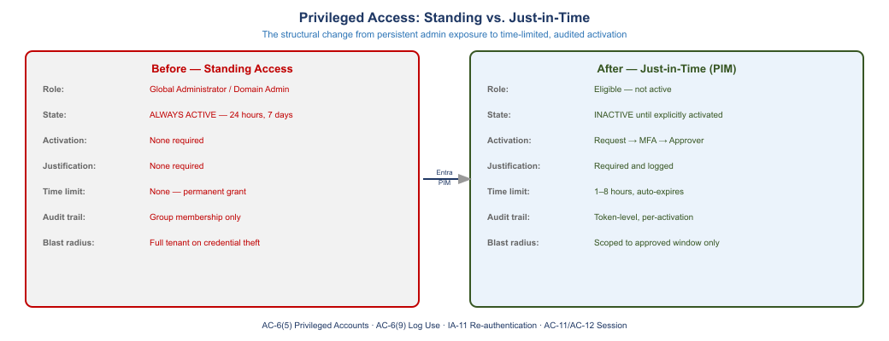
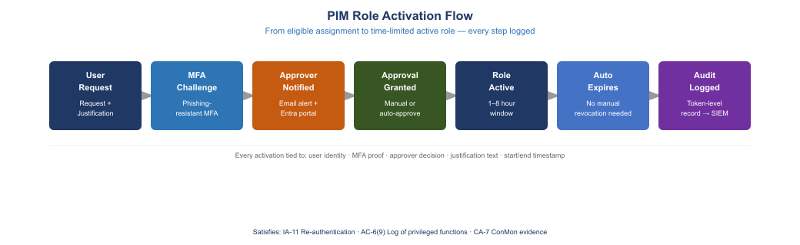
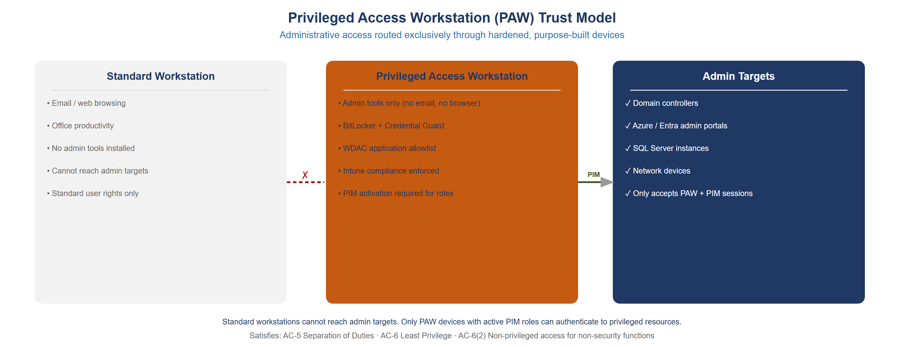
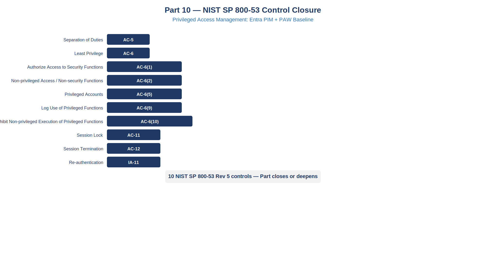

::: {.fouo-banner}
INTERNAL — NOT FOR PUBLIC DISTRIBUTION
:::

::: {.callout-important}
**Series Context** — This document is Part 7 of the Federal Application-Aware Networking series. Parts 1–6 establish Landing Zone IPAM/DDI/PKI, Telecommunications Modernization, Network Modernization, SQL Server Authentication Modernization, SQL Server Implementation, and Database Consolidation and Network Physics. This part addresses the privileged access layer — the administrative credential surface that remains exploitable even after all token-based authentication controls from Parts 1–6 are in place.
:::

# What This Document Addresses

Parts 1 through 6 of this series replaced password-hash authentication with Managed Identity tokens, eliminated NTLM from SQL Server connections, removed standing service account credentials from application connection strings, and established Arc as the identity bridge for hybrid server workloads. Each of those changes materially reduced the attack surface for credential theft and lateral movement.

They did not eliminate it.

The residual risk is not in service accounts or application credentials — those are now credential-free or token-gated. The residual risk is in *administrative accounts*: the identities that hold Global Administrator, Privileged Role Administrator, server local Administrator, and equivalent standing roles. A standard user account that has been compromised can escalate to standing admin through credential reuse, social engineering, or MFA bypass — and once it does, every token-gated control in the environment is irrelevant. The attacker is now the admin.

Standing privilege is the structural problem. "Standing" means the role is always active. A Global Administrator account is always a Global Administrator, 24 hours per day, whether the holder is actively performing administrative work or not. Every minute that the role is active and the account is not in use is a minute where a compromised credential grants unrestricted tenant control. Across a federal environment operating 8,760 hours per year, a standing Global Administrator has that scope for 8,752 hours more than is operationally necessary.

This document closes that gap through three mechanisms: Privileged Identity Management (PIM) for just-in-time role activation, Privileged Access Workstations (PAW) for device-scoped session trust, and session policy controls for re-authentication, session lock, and session termination. Together these mechanisms reduce the window of administrative exposure from continuous to bounded and auditable.

::: {.callout-note}
**Authentication vs. Authorization Scope** — Parts 1–3 addressed authentication quality: who is asserting this identity, and can we verify it cryptographically? This document addresses authorization scope: what can that verified identity do, and for how long? Both axes must be controlled. A strongly-authenticated identity with standing Global Admin scope is not a Zero Trust architecture — it is a strongly-authenticated standing target.
:::

# The Standing Privilege Problem

## What Standing Admin Access Means Structurally

Standing administrative access means a role assignment persists indefinitely in the directory. The user does not activate the role, does not present justification, does not require approver consent, and does not face a time limit on the scope. The role is always active.

In practice this means:

- A compromised authentication token for a standing Global Admin grants Global Admin scope immediately, without any additional step.
- A successful MFA fatigue attack against a standing Privileged Role Administrator grants the ability to promote any account to any role.
- A session hijacking attack against a standing Security Administrator's browser grants the ability to modify Conditional Access policies that protect the entire tenant.

The attack surface is not theoretical. CISA AA23-278A (Scattered Spider) and Microsoft's September 2023 threat intelligence on Storm-0558 both document adversaries that specifically targeted standing Global Admin accounts. In both cases the attackers understood that once they held a standing admin identity, all other controls were downstream and therefore controllable by them.

## Why Standing Privilege Survives After Entra Token Adoption

Parts 1–6 deploy Entra ID authentication — Managed Identity tokens, Conditional Access, Entra-native OS login. These controls verify identity quality. They do not reduce role scope.

A user who previously authenticated with NTLM and held Global Admin standing access now authenticates with an Entra ID token through Conditional Access with MFA — and still holds Global Admin standing access. The authentication is stronger. The authorization scope is unchanged.

The confusion between authentication quality and authorization scope is common in federal migration programs. Programs declare "we moved to Entra ID" and treat the credential migration as the security outcome. It is a necessary precondition, not a sufficient outcome. Authorization scope reduction requires a distinct mechanism: PIM.

## Before and After: The Structural Comparison

{#fig-pam01 fig-alt="Two-panel diagram. Left panel labeled BEFORE shows a Domain Admin account connected continuously to all resources, with NTLM credential visible 24x7, no approval gate, and no time limit. Right panel labeled AFTER shows a standard user account requesting PIM activation, going through MFA plus justification plus optional approver, receiving a time-limited role token (1 to 8 hours), and then connecting to resources. After the window expires the role deactivates automatically. The after state highlights the bounded exposure window vs. the before state's continuous exposure." width="100%"}

**Before this document** — a federal administrator holds standing Domain Admin and standing Global Admin simultaneously. The Domain Admin is backed by Kerberos/NTLM. The Global Admin is an always-active Entra ID role. Any compromise of the user's Entra ID session grants Global Admin immediately with no additional step.

**After this document** — the same administrator holds no standing admin role. The Entra ID Global Admin assignment is *eligible*, not *active*. When the administrator needs to perform an administrative task, they request activation through PIM, present MFA, provide a justification, wait for approver consent (if configured), and receive a time-limited role token valid for 1–8 hours. When the window expires, the role deactivates automatically. A compromised session gives an attacker nothing beyond the standard user scope.

::: {.callout-warning}
**Compliance Dependency** — OMB M-22-09 (Moving the U.S. Government Toward Zero Trust Cybersecurity Principles) requires agencies to implement least-privilege access controls and time-bound privilege. NIST SP 800-207 (Zero Trust Architecture) requires that privilege be granted per-request, not standing. PIM is the Microsoft implementation of these requirements. CMMC 2.0 Level 2 and FedRAMP Moderate both require AC-6 Least Privilege and AC-6(5) Privileged Accounts controls that PIM directly satisfies.
:::

# Entra PIM Architecture

## Core Concepts: Eligible vs. Active

Privileged Identity Management (PIM) introduces two assignment states for directory roles:

**Active assignment** is the traditional state. The role is assigned and immediately effective. The user can exercise the role at any time without any additional step. Active assignments are appropriate for automated service principals and break-glass accounts. They are not appropriate for human administrators.

**Eligible assignment** is the PIM state. The role is assigned but not effective. The user must explicitly activate the role, satisfying configured requirements (MFA, justification, approver), to receive a time-limited active session. When the time window expires, the role returns to eligible-only. No persistent active scope exists between activations.

The operational difference is decisive: an eligible assignment is worthless to an attacker who has compromised the user's session but not completed the activation ceremony. An active assignment is immediately exploitable.

## PIM Activation Flow

{#fig-pam02 fig-alt="Flowchart showing the PIM activation sequence. Step 1: Administrator submits activation request with justification text and requested duration in the Entra ID portal or My Access. Step 2: Entra ID Conditional Access enforces MFA at activation time, requiring a fresh authentication proof. Step 3: If approver is configured, the approver receives an email notification and approves or denies the request. Step 4: Upon approval, Entra ID issues a time-limited active role assignment with an expiration timestamp. Step 5: All steps generate audit log entries in the Entra ID audit log and feed to Microsoft Sentinel or equivalent SIEM. Step 6: At expiration the role automatically deactivates with no user action required." width="100%"}

The activation flow has five stages:

1. **Request.** The user navigates to the Entra ID portal (My Access or the PIM blade) and submits an activation request. The request includes a justification text field (required) and a requested duration (1–8 hours, bounded by policy).

2. **MFA enforcement.** Entra ID Conditional Access requires a fresh MFA proof at activation time, regardless of whether the user already completed MFA at session start. This is the IA-11 re-authentication requirement: a new privileged action requires a new authentication assertion.

3. **Approver notification (optional).** If the role policy requires approver consent, a designated approver receives an email or Teams notification and must approve the request within a configured window (default 24 hours; for sensitive roles, configure 1–4 hours). If no approval is received within the window, the request expires and access is denied.

4. **Time-limited activation.** Upon approval (or immediately if no approver is configured), the role becomes active for the requested duration. The user can now exercise Global Admin or equivalent scope. The expiration timestamp is fixed at activation time — it cannot be extended without a new activation request.

5. **Automatic deactivation.** At expiration, the role returns to eligible-only automatically. No user action is required. No manual deactivation step can be forgotten.

Every stage generates an audit log entry in the Entra ID audit log under the "PIM" category. These entries are structured and queryable in Microsoft Sentinel (Defender for Cloud via the Entra connector) and in Log Analytics.

## Roles to Protect with PIM

The following roles carry sufficient scope to control the entire Entra ID tenant or Azure subscription and must be converted to eligible-only. No human account should hold any of these as a standing active assignment.

| Role | Scope | Risk if Compromised |
|------|-------|---------------------|
| Global Administrator | Full tenant | Modify any object, add credentials to any app, bypass all policies |
| Privileged Role Administrator | Role management | Promote any account to Global Admin, disable PIM |
| Security Administrator | Security settings | Modify Conditional Access, disable MFA, change Named Locations |
| Exchange Administrator | Exchange Online | Access any mailbox, create email forwarding rules |
| SharePoint Administrator | SharePoint Online | Access any site collection, modify permissions |
| Intune Administrator | Endpoint management | Push malicious config to all managed devices, disable compliance |
| Azure subscription Owner | Azure resources | Create, modify, delete any Azure resource including Arc servers |
| Azure subscription Contributor | Azure resources | Modify resources, exfiltrate data from storage and databases |

: Roles requiring PIM eligible-only assignment for all human accounts {.striped .hover}

Service principals (managed identities, automation accounts) may retain active assignments for the minimum scope their function requires. Human accounts may not retain active assignments for any role in this table.

## Enumerating and Converting Standing Assignments

The first operational step is discovery: find every human account that holds an active (standing) assignment for any role in the table above.

```powershell
# Requires: Az.Resources module, Microsoft.Graph module
# Run as Global Admin (this is a bootstrap task -- use break-glass if PIM is not yet configured)

Import-Module Microsoft.Graph.Identity.Governance
Connect-MgGraph -Scopes "RoleManagement.Read.All", "Directory.Read.All"

# Define privileged roles to audit
$privilegedRoles = @(
    "62e90394-69f5-4237-9190-012177145e10",  # Global Administrator
    "e8611ab8-c189-46e8-94e1-60213ab1f814",  # Privileged Role Administrator
    "194ae4cb-b126-40b2-bd5b-6091b380977d",  # Security Administrator
    "29232cdf-9323-42fd-ade2-1d097af3e4de",  # Exchange Administrator
    "f28a1f50-f6e7-4571-818b-6a12f2af6b6c",  # SharePoint Administrator
    "3a2c62db-5318-420d-8d74-23affee5d9d5",  # Intune Administrator
)

Write-Host "=== Standing Active Role Assignments (Human Accounts) ===" -ForegroundColor Cyan

foreach ($roleId in $privilegedRoles) {
    $roleDefinition = Get-MgRoleManagementDirectoryRoleDefinition -UnifiedRoleDefinitionId $roleId

    # Get active (standing) assignments -- not eligible, not time-limited
    $activeAssignments = Get-MgRoleManagementDirectoryRoleAssignment `
        -Filter "roleDefinitionId eq '$roleId'" `
        -ExpandProperty "principal"

    foreach ($assignment in $activeAssignments) {
        $principal = $assignment.Principal

        # Filter to user accounts only (exclude service principals)
        if ($principal.AdditionalProperties['@odata.type'] -eq '#microsoft.graph.user') {
            [PSCustomObject]@{
                Role          = $roleDefinition.DisplayName
                User          = $principal.AdditionalProperties['displayName']
                UPN           = $principal.AdditionalProperties['userPrincipalName']
                AssignmentId  = $assignment.Id
                DirectoryScope = $assignment.DirectoryScopeId
            }
        }
    }
} | Format-Table -AutoSize
```

After enumerating standing assignments, convert each human account from active to eligible. This is done through the PIM API via Microsoft Graph.

```powershell
# Convert a standing active assignment to PIM eligible
# Run AFTER confirming the account and role with the account holder

Import-Module Microsoft.Graph.Identity.Governance
Connect-MgGraph -Scopes "RoleManagement.ReadWrite.Directory", "Directory.Read.All"

function Convert-ToPimEligible {
    param(
        [string]$UserUpn,
        [string]$RoleDefinitionId,
        [string]$Justification = "Converting standing assignment to PIM eligible per PAM policy"
    )

    $user = Get-MgUser -Filter "userPrincipalName eq '$UserUpn'"
    if (-not $user) {
        Write-Error "User $UserUpn not found"
        return
    }

    # Step 1: Remove the standing active assignment
    $existingAssignment = Get-MgRoleManagementDirectoryRoleAssignment `
        -Filter "principalId eq '$($user.Id)' and roleDefinitionId eq '$RoleDefinitionId'"

    if ($existingAssignment) {
        Remove-MgRoleManagementDirectoryRoleAssignment -UnifiedRoleAssignmentId $existingAssignment.Id
        Write-Host "Removed standing assignment for $UserUpn on role $RoleDefinitionId" -ForegroundColor Yellow
    }

    # Step 2: Create PIM eligible assignment (no end date = permanent eligible)
    $eligibleParams = @{
        Action           = "adminAssign"
        Justification    = $Justification
        RoleDefinitionId = $RoleDefinitionId
        DirectoryScopeId = "/"
        PrincipalId      = $user.Id
        ScheduleInfo     = @{
            StartDateTime = (Get-Date).ToUniversalTime().ToString("yyyy-MM-ddTHH:mm:ssZ")
            Expiration    = @{
                Type = "noExpiration"
            }
        }
    }

    New-MgRoleManagementDirectoryRoleEligibilityScheduleRequest -BodyParameter $eligibleParams
    Write-Host "Created PIM eligible assignment for $UserUpn on role $RoleDefinitionId" -ForegroundColor Green
}

# Example usage -- run once per account per role
Convert-ToPimEligible `
    -UserUpn "admin.user@agency.gov" `
    -RoleDefinitionId "62e90394-69f5-4237-9190-012177145e10"  # Global Administrator
```

## PIM Policy Configuration

PIM policy is configured per role. The following settings represent the recommended baseline for federal environments operating at FedRAMP Moderate or High:

```powershell
# Configure PIM role policy for Global Administrator
# Sets: max activation duration, MFA required, justification required, approver required

Import-Module Microsoft.Graph.Identity.Governance
Connect-MgGraph -Scopes "Policy.ReadWrite.RoleManagement"

$globalAdminRoleId = "62e90394-69f5-4237-9190-012177145e10"

# Get the current policy for the role
$policy = Get-MgPolicyRoleManagementPolicy `
    -Filter "scopeId eq '/' and scopeType eq 'DirectoryRole'" |
    Where-Object {
        (Get-MgPolicyRoleManagementPolicyAssignment `
            -Filter "policyId eq '$($_.Id)'").RoleDefinitionId -eq $globalAdminRoleId
    } | Select-Object -First 1

Write-Host "Policy ID for Global Administrator: $($policy.Id)"

# Update activation rules:
# - Maximum duration: 4 hours (240 minutes) for Global Admin
# - MFA required at activation
# - Justification required
# - Approver required (ticket number or security team approval)

$updateRules = @(
    @{
        "@odata.type"        = "#microsoft.graph.unifiedRoleManagementPolicyExpirationRule"
        Id                   = "Expiration_EndUser_Assignment"
        IsExpirationRequired = $true
        MaximumDuration      = "PT4H"   # ISO 8601 duration: 4 hours max
    },
    @{
        "@odata.type"          = "#microsoft.graph.unifiedRoleManagementPolicyAuthenticationContextRule"
        Id                     = "AuthenticationContext_EndUser_Assignment"
        IsEnabled              = $true
        ClaimValue             = "c1"   # Authentication context requiring fresh MFA
    },
    @{
        "@odata.type"           = "#microsoft.graph.unifiedRoleManagementPolicyEnablementRule"
        Id                      = "Enablement_EndUser_Assignment"
        EnabledRules            = @("MultiFactorAuthentication", "Justification")
    }
)

foreach ($rule in $updateRules) {
    Update-MgPolicyRoleManagementPolicyRule `
        -UnifiedRoleManagementPolicyId $policy.Id `
        -UnifiedRoleManagementPolicyRuleId $rule.Id `
        -BodyParameter $rule
}

Write-Host "PIM policy updated for Global Administrator role" -ForegroundColor Green
```

::: {.callout-note}
**Activation Duration by Role Sensitivity** — Global Administrator and Privileged Role Administrator activations should be limited to 4 hours maximum. Security Administrator, Exchange Administrator, and SharePoint Administrator can be configured at 8 hours for operational efficiency. Azure subscription Owner/Contributor for server management tasks can be set to 8 hours. All durations must be reviewed and approved in the agency's PAM policy documentation before implementation.
:::

# Just-in-Time Server Access

## The Standing Local Administrator Problem

After Parts 4–5 deploy Arc Managed Identity for SQL Server authentication, the SQL Engine no longer accepts NTLM or password-hash logins. But the Windows Server host running that SQL Engine still has a standing local Administrator account — or a domain account with local admin rights — that can be used to log into the OS, modify SQL Server configuration, access the data files directly, or install software.

Arc-enabled JIT server access addresses this layer. The mechanism is identical in principle to directory role PIM: an administrator holds an *eligible* assignment for the Virtual Machine Administrator Login role, requests activation, satisfies MFA and justification, and receives a time-limited OS-level credential. The standing local Administrator is disabled.

## Arc JIT SSH and RDP Architecture

Azure Arc JIT access uses two distinct mechanisms depending on the protocol:

**SSH via Arc.** The `az ssh` command establishes an SSH tunnel through the Arc agent to the target host. The tunnel is authenticated using an Entra ID token issued after PIM activation. The local SSH daemon validates the token through the Arc agent. No SSH key needs to be distributed or managed. The session is logged in Arc activity logs.

**RDP via Arc.** The `az network bastion rdp` command (or the Azure portal "Connect" blade for Arc) establishes a proxied RDP session through the Arc connectivity layer. The RDP connection is authenticated using a time-limited certificate issued to the Entra ID user after PIM activation. No public RDP endpoint needs to be exposed.

Both mechanisms require:

- Azure Arc agent installed and connected on the target host
- `Virtual Machine Administrator Login` or `Virtual Machine User Login` role assigned as PIM-eligible to the administrator's Entra ID account
- The target host's Azure resource group and subscription scoped to the role assignment
- Network connectivity from the host to Arc endpoints (TCP 443 to management.azure.com and guestconfiguration endpoint)

{#fig-pam03 fig-alt="Three-column diagram. Left column labeled Standard User Device shows a device running standard apps and accessing standard resources through Entra ID Conditional Access with a standard policy. Middle column labeled PAW Device shows a dedicated hardened device with WDAC application allowlist, Credential Guard enabled, no email or browser for general use, and Intune compliance policy enforced. PAW device accesses Arc portal and PIM activation through a privileged Conditional Access policy requiring PAW compliance. Right column labeled Admin Target shows Arc-enabled servers, Azure subscription resources, and Entra ID administration. Lines from the PAW device to admin targets are shown as solid approved paths. Lines from the standard user device to admin targets are shown as blocked. No path runs from the standard user device to admin targets." width="100%"}

## Configuring JIT Access via Arc

```powershell
# Prerequisites:
# - Arc agent installed on target host
# - Az.ConnectedMachine module installed
# - Privileged Role Administrator or Owner on the Arc-connected resource

Import-Module Az.ConnectedMachine
Import-Module Az.Resources
Connect-AzAccount

# Variables -- adjust for your environment
$subscriptionId  = "00000000-0000-0000-0000-000000000000"
$resourceGroup   = "rg-arc-servers-prod"
$arcServerName   = "sql-prod-01"
$adminUpn        = "admin.user@agency.gov"

# Step 1: Confirm the Arc server is connected
$arcServer = Get-AzConnectedMachine `
    -ResourceGroupName $resourceGroup `
    -Name $arcServerName

if ($arcServer.Status -ne "Connected") {
    Write-Error "Arc server $arcServerName is not connected. Status: $($arcServer.Status)"
    return
}

Write-Host "Arc server $arcServerName is connected. OS: $($arcServer.OsName)" -ForegroundColor Green

# Step 2: Get the administrator's Entra ID object ID
$adminUser = Get-AzADUser -UserPrincipalName $adminUpn
if (-not $adminUser) {
    Write-Error "User $adminUpn not found in Entra ID"
    return
}

# Step 3: Assign Virtual Machine Administrator Login as PIM-eligible
# This uses the Azure RBAC PIM API (resource-scoped PIM)
$vmAdminLoginRoleId = "1c0163c0-47e6-4577-8991-ea5c82e286e4"  # Virtual Machine Administrator Login

$resourceId = "/subscriptions/$subscriptionId/resourceGroups/$resourceGroup/providers/Microsoft.HybridCompute/machines/$arcServerName"

# Create PIM eligible assignment at resource scope
$pimEligibleBody = @{
    properties = @{
        principalId         = $adminUser.Id
        roleDefinitionId    = "/subscriptions/$subscriptionId/providers/Microsoft.Authorization/roleDefinitions/$vmAdminLoginRoleId"
        requestType         = "AdminAssign"
        scheduleInfo        = @{
            startDateTime = (Get-Date).ToUniversalTime().ToString("yyyy-MM-ddTHH:mm:ssZ")
            expiration    = @{
                type = "noExpiration"
            }
        }
        justification       = "JIT admin access for Arc server $arcServerName per PAM policy"
    }
} | ConvertTo-Json -Depth 5

$eligibilityUri = "https://management.azure.com$resourceId/providers/Microsoft.Authorization/roleEligibilityScheduleRequests/$(New-Guid)?api-version=2020-10-01"

$token = (Get-AzAccessToken -ResourceUrl "https://management.azure.com/").Token
$headers = @{ Authorization = "Bearer $token"; "Content-Type" = "application/json" }

Invoke-RestMethod -Uri $eligibilityUri -Method PUT -Headers $headers -Body $pimEligibleBody
Write-Host "PIM eligible assignment created for $adminUpn on $arcServerName" -ForegroundColor Green

# Step 4: Disable the built-in local Administrator account on the host
# Run this via Arc Run Command -- does not require local connectivity
$disableLocalAdminScript = @'
# Disable local Administrator account
$adminAccount = Get-LocalUser -Name "Administrator" -ErrorAction SilentlyContinue
if ($adminAccount -and $adminAccount.Enabled) {
    Disable-LocalUser -Name "Administrator"
    Write-Output "Local Administrator account disabled."
} else {
    Write-Output "Local Administrator account already disabled or not found."
}

# Verify no other local admin accounts exist (except Arc-managed)
$localAdmins = Get-LocalGroupMember -Group "Administrators" |
    Where-Object { $_.PrincipalSource -eq "Local" -and $_.Name -notmatch "Administrator" }

if ($localAdmins) {
    Write-Warning "Additional local admin accounts found:"
    $localAdmins | ForEach-Object { Write-Warning "  $($_.Name)" }
} else {
    Write-Output "No unauthorized local admin accounts found."
}
'@

$runCommandParams = @{
    ResourceGroupName = $resourceGroup
    MachineName       = $arcServerName
    RunCommandName    = "DisableLocalAdmin-$(Get-Date -Format yyyyMMddHHmm)"
    Location          = $arcServer.Location
    Script            = @($disableLocalAdminScript)
}

Invoke-AzConnectedMachineRunCommand @runCommandParams
```

## JIT Session Flow for Operators

Once JIT is configured, the operator workflow is:

1. Open the Entra ID portal or My Access (myaccess.microsoft.com) and request activation of the `Virtual Machine Administrator Login` role for the specific Arc server resource.
2. Complete MFA re-authentication and provide justification.
3. Wait for activation confirmation (immediate if no approver required, otherwise wait for approval notification).
4. Connect using the Arc SSH or RDP command:

```powershell
# SSH via Arc -- requires Az CLI with ssh extension
az ssh arc --resource-group rg-arc-servers-prod --name sql-prod-01

# RDP via Arc -- opens proxied RDP session
az ssh arc --resource-group rg-arc-servers-prod --name sql-prod-01 --rdp
```

The session credential is derived from the PIM activation token. If the PIM activation window expires while the session is active, the next re-authentication attempt fails. The operator must request a new PIM activation to continue.

::: {.callout-note}
**No Public Ports Required** — Arc JIT sessions route through the Arc connectivity layer to the Azure control plane. The host does not need an exposed SSH port (TCP 22) or RDP port (TCP 3389) on any network interface. The only required egress from the host is HTTPS (TCP 443) to Arc management endpoints. This eliminates the most commonly exploited server attack vector: publicly accessible management ports.
:::

# Privileged Access Workstation Baseline

## What a PAW Is

A Privileged Access Workstation is a dedicated, hardened computing device used exclusively for administrative tasks. It is not a general-purpose workstation. Email, web browsing, productivity applications, and anything not directly related to administrative tool use are prohibited on a PAW.

The trust model for a PAW differs from a standard workstation in one fundamental way: the PAW's device identity is itself a security control. A Conditional Access policy can require that PIM activation and administrative portal access occur only from a device with a valid PAW compliance certificate. An attacker who has compromised a user's credentials cannot activate a PIM role from a non-PAW device, even if they have completed MFA — because the device compliance check fails.

This is the boundary between authentication-only security (what Parts 1–6 deliver) and device-bound security (what the PAW delivers): the device itself is an additional authentication factor for privileged actions.

## PAW Hardware and OS Baseline

A PAW requires dedicated hardware. It cannot be a virtual machine on a shared hypervisor — the hypervisor's management layer would then be a higher-trust target than the PAW. Recommended minimum:

- Dedicated physical laptop or workstation, not shared
- Secure Boot enabled, Trusted Platform Module (TPM) 2.0 present
- Windows 11 Pro or Enterprise (Windows 10 is acceptable for transition; Windows 11 is the target)
- Entra ID Joined (not hybrid-joined; the PAW must not require a domain controller)
- Intune-managed (MDM enrollment required for compliance policy enforcement)

## Intune Compliance Policy for PAW

The PAW compliance policy enforces the hardened baseline through Intune device compliance rules. Non-compliant devices fail the Conditional Access check and cannot access the privileged portal or activate PIM roles.

```powershell
# Create Intune device compliance policy for PAW baseline
# Requires: DeviceManagementConfiguration.ReadWrite.All Graph permission

Import-Module Microsoft.Graph.DeviceManagement
Connect-MgGraph -Scopes "DeviceManagementConfiguration.ReadWrite.All"

$pawCompliancePolicy = @{
    "@odata.type"                            = "#microsoft.graph.windows10CompliancePolicy"
    displayName                              = "PAW Compliance Baseline"
    description                              = "Enforces PAW hardware and software controls for privileged access"

    # BitLocker full-disk encryption required
    bitLockerEnabled                         = $true

    # Secure Boot required
    secureBootEnabled                        = $true

    # TPM 2.0 required
    tpmRequired                              = $true

    # Antivirus and antispyware required and up to date
    antivirusRequired                        = $true
    antiSpywareRequired                      = $true
    antivirusSignatureUpToDate               = $true

    # Windows Defender real-time protection required
    defenderEnabled                          = $true

    # Minimum OS version -- require Windows 11 22H2 or later
    osMinimumVersion                         = "10.0.19045"   # Windows 10 22H2 minimum; set 10.0.22621 for Win11 22H2

    # Code integrity / WDAC
    codeIntegrityEnabled                     = $true

    # Credential Guard (requires Virtualization-Based Security)
    deviceThreatProtectionRequiredSecurityLevel = "secured"

    # Mark non-compliant after 1 day (no grace period for privileged devices)
    passwordRequiredToUnlockFromIdle         = $true
    passwordMinutesOfInactivityBeforeLock    = 15
    passwordExpirationDays                   = 365
    passwordMinimumLength                    = 14
    passwordRequiredType                     = "alphanumeric"
}

$newPolicy = New-MgDeviceManagementDeviceCompliancePolicy -BodyParameter $pawCompliancePolicy
Write-Host "PAW compliance policy created: $($newPolicy.Id)" -ForegroundColor Green

# Assign the compliance policy to the PAW device group
$pawGroupId = "00000000-0000-0000-0000-000000000001"   # Replace with actual PAW Entra group ID

$assignmentBody = @{
    assignments = @(
        @{
            target = @{
                "@odata.type" = "#microsoft.graph.groupAssignmentTarget"
                groupId       = $pawGroupId
            }
        }
    )
}

Set-MgDeviceManagementDeviceCompliancePolicyAssignment `
    -DeviceCompliancePolicyId $newPolicy.Id `
    -BodyParameter $assignmentBody

Write-Host "PAW compliance policy assigned to PAW device group" -ForegroundColor Green
```

## Windows Defender Application Control (WDAC) on PAW

A PAW should run only a minimal set of approved administrative tools. Windows Defender Application Control (WDAC) enforces an application allowlist: only code-signed applications in the allowlist can execute. Unsigned software, unapproved tools, and malware all fail to execute regardless of user privilege level.

The PAW WDAC policy should allowlist:

- Microsoft-signed system binaries (Winload, NTOSKRNL, system32 DLLs)
- Azure CLI (Microsoft-signed)
- Azure PowerShell modules (Microsoft-signed)
- Microsoft Graph PowerShell SDK (Microsoft-signed)
- Edge browser (restricted to Application Guard mode for any web access)
- Entra ID portal progressive web app
- Remote Desktop client (for Arc RDP proxy sessions)
- Remote Server Administration Tools (RSAT) where required

Web browsing on a PAW should be constrained to Edge with Application Guard enabled — every browsing session runs in a Hyper-V isolated container and cannot access the PAW's local storage, credentials, or installed applications.

```powershell
# Verify WDAC is enforced on a PAW (run on the PAW host)
$wdacStatus = Get-CimInstance -ClassName Win32_DeviceGuard -Namespace "root\Microsoft\Windows\DeviceGuard"

Write-Host "Code Integrity Policy Enforcement Status: $($wdacStatus.CodeIntegrityPolicyEnforcementStatus)"
# Expected: 2 = enforced, 1 = audit mode, 0 = disabled

Write-Host "User Mode Code Integrity: $($wdacStatus.UsermodeCodeIntegrityPolicyEnforcementStatus)"
# Expected: 2 = enforced

Write-Host "Credential Guard: $($wdacStatus.SecurityServicesRunning)"
# Expected array includes 1 (Credential Guard) and 2 (HVCI)
```

## Conditional Access Policy: PIM Activation Requires PAW

The PAW enforcement point is a Conditional Access policy that gates PIM activation and administrative portal access on device compliance. An administrator who has credentials and has completed MFA cannot activate a PIM role from a non-PAW device.

```powershell
# Create Conditional Access policy requiring PAW device compliance for PIM activation
# Requires: Policy.ReadWrite.ConditionalAccess Graph permission

Import-Module Microsoft.Graph.Identity.SignIns
Connect-MgGraph -Scopes "Policy.ReadWrite.ConditionalAccess"

$pawConditionalAccessPolicy = @{
    displayName = "PAM - Require PAW for Privileged Role Activation"
    state       = "enabledForReportingButNotEnforced"   # Start in report-only mode

    conditions = @{
        users = @{
            includeGroups = @("00000000-0000-0000-0000-000000000002")  # Replace: Privileged Admins group
            excludeGroups = @("00000000-0000-0000-0000-000000000003")  # Replace: Break-glass accounts group
        }
        applications = @{
            # Target: Microsoft Azure Management, Microsoft Graph, and the Entra ID portal
            includeApplications = @(
                "797f4846-ba00-4fd7-ba43-dac1f8f63013",  # Microsoft Azure Management
                "00000003-0000-0000-c000-000000000000",  # Microsoft Graph
                "74658136-14ec-4630-ad9b-26e160ff0fc6"   # Azure AD portal (MicrosoftAzureActiveDirectory)
            )
        }
        platforms = @{
            includePlatforms = @("windows")   # PAW is Windows
        }
    }

    grantControls = @{
        operator       = "AND"
        builtInControls = @("mfa", "compliantDevice")
        # compliantDevice enforces the Intune PAW compliance policy
    }

    sessionControls = @{
        signInFrequency = @{
            value           = 1
            type            = "hours"
            isEnabled       = $true
            authenticationType = "primaryAndSecondaryAuthentication"
        }
    }
}

$newCaPolicy = New-MgIdentityConditionalAccessPolicy -BodyParameter $pawConditionalAccessPolicy
Write-Host "Conditional Access policy created: $($newCaPolicy.Id)" -ForegroundColor Green
Write-Host "IMPORTANT: Policy is in report-only mode. Review sign-in logs for 14 days before enabling." -ForegroundColor Yellow
```

::: {.callout-important}
**Report-Only Mode First** — All Conditional Access policies should be deployed in `enabledForReportingButNotEnforced` (report-only) mode for a minimum of 14 days before switching to `enabled`. During the report-only period, monitor the Entra ID sign-in log for any accounts that would be blocked. Blocking a privileged administrator from a critical system without warning creates an outage. The report-only period surfaces unexpected devices and users before enforcement.
:::

# Emergency Access Accounts

## Why Break-Glass Must Exist

Every security control that blocks an administrative path creates a risk: if the control itself fails, administrators cannot recover the environment. Conditional Access policies that require PAW compliance will block access if the Intune service is down, if the PAW is lost or destroyed, or if PIM itself has a service outage. Without a break-glass path, these scenarios result in permanent tenant lockout.

Break-glass accounts are the exception to all controls. They are not used in normal operations. They exist to restore access when the control plane that enforces access controls is itself unavailable.

## Break-Glass Account Design

Two break-glass accounts are required. Two accounts protect against the failure of a single account (lost credential, locked out, Entra soft-delete). They are configured as follows:

**Account type.** Cloud-only accounts. Not synced from on-premises Active Directory, not federated through any identity provider. Cloud-only accounts are accessible even when the on-premises AD, ADFS, or Entra Connect infrastructure is down.

**Role assignment.** Active (standing) Global Administrator. This is the one exception to the eligible-only rule — break-glass must have immediate standing access because PIM may be the system that is unavailable.

**Conditional Access exclusion.** Both break-glass accounts are excluded from every Conditional Access policy by group membership. A break-glass account must not be blocked by a PAW compliance requirement, MFA requirement, Named Location restriction, or any other Conditional Access control.

**Credential storage.** A 20+ character randomly generated password stored in physical form in a secured safe. The credentials are never stored in a password manager, a credential vault, or any digital system accessible from the network. Two sealed envelopes in two physically separate safes, each held by a different senior official.

**Second factor.** A FIDO2 hardware security key (not TOTP, not push notification) registered as the MFA method. The hardware key is stored alongside the password in the physical safe. The hardware key cannot be phished, replayed over the network, or MFA-fatigued — it requires physical possession of the device and physical proximity to the authentication terminal.

**Naming convention.** Use an account name that does not identify the purpose. `bg-acct-01@agency.gov` is discoverable; a name following the normal account naming convention with no indicator of elevated privilege is less targeted.

```powershell
# Create break-glass accounts
# Run as Global Admin using an existing admin account -- do this BEFORE converting all admins to PIM eligible

Import-Module Microsoft.Graph.Users
Import-Module Microsoft.Graph.Identity.DirectoryManagement
Connect-MgGraph -Scopes "User.ReadWrite.All", "RoleManagement.ReadWrite.Directory", "Directory.ReadWrite.All"

function New-BreakGlassAccount {
    param(
        [string]$AccountNumber,       # "01" or "02"
        [string]$Domain               # Agency tenant domain, e.g. "agency.gov"
    )

    # Generate a cryptographically random 24-character password
    $passwordBytes = New-Object byte[] 24
    [System.Security.Cryptography.RandomNumberGenerator]::Create().GetBytes($passwordBytes)
    $password = [Convert]::ToBase64String($passwordBytes).Substring(0, 24) -replace '[+/=]', 'X'

    Write-Host "BREAK-GLASS ACCOUNT $AccountNumber PASSWORD (record offline now):" -ForegroundColor Red
    Write-Host $password -ForegroundColor Red
    Write-Host "STORE THIS PASSWORD IN THE PHYSICAL SAFE IMMEDIATELY" -ForegroundColor Red

    $accountUpn = "bg-cloud-$AccountNumber@$Domain"

    $userParams = @{
        DisplayName          = "Break Glass $AccountNumber"
        UserPrincipalName    = $accountUpn
        MailNickname         = "bg-cloud-$AccountNumber"
        AccountEnabled       = $true
        PasswordProfile      = @{
            Password                      = $password
            ForceChangePasswordNextSignIn = $false
        }
        PasswordPolicies     = "DisablePasswordExpiration"
        UsageLocation        = "US"
    }

    $bgUser = New-MgUser -BodyParameter $userParams
    Write-Host "Break-glass account created: $accountUpn (ID: $($bgUser.Id))" -ForegroundColor Green

    # Assign Global Administrator standing (active, not eligible)
    $globalAdminRoleId = "62e90394-69f5-4237-9190-012177145e10"

    $roleAssignmentBody = @{
        roleDefinitionId = $globalAdminRoleId
        principalId      = $bgUser.Id
        directoryScopeId = "/"
    }

    New-MgRoleManagementDirectoryRoleAssignment -BodyParameter $roleAssignmentBody
    Write-Host "Global Administrator role assigned (standing active) to $accountUpn" -ForegroundColor Green

    return $bgUser.Id
}

# Create both break-glass accounts
$bg01Id = New-BreakGlassAccount -AccountNumber "01" -Domain "agency.gov"
$bg02Id = New-BreakGlassAccount -AccountNumber "02" -Domain "agency.gov"

Write-Host ""
Write-Host "Next steps:" -ForegroundColor Cyan
Write-Host "1. Register a FIDO2 hardware key for each account at account registration" -ForegroundColor Cyan
Write-Host "2. Place credentials in separate physical safes" -ForegroundColor Cyan
Write-Host "3. Exclude both accounts from all Conditional Access policies" -ForegroundColor Cyan
Write-Host "4. Configure audit alert for any sign-in or role activation" -ForegroundColor Cyan
```

## Break-Glass Audit Alert

Any use of a break-glass account is an anomalous event. An audit alert must fire immediately when either break-glass account signs in or activates any role. The alert should notify the CISO, the SOC, and at least one additional senior official.

```powershell
# Create Microsoft Sentinel alert rule for break-glass account use
# Requires: Sentinel Contributor on the Log Analytics workspace

$workspaceId   = "00000000-0000-0000-0000-000000000004"   # Replace with your workspace ID
$resourceGroup = "rg-sentinel-prod"
$workspaceName = "law-sentinel-prod"

# KQL query: detect any sign-in by break-glass accounts
$alertQuery = @'
SigninLogs
| where UserPrincipalName in ("bg-cloud-01@agency.gov", "bg-cloud-02@agency.gov")
| project TimeGenerated, UserPrincipalName, AppDisplayName, IPAddress, ResultType, Location, DeviceDetail
| order by TimeGenerated desc
'@

$alertRuleBody = @{
    kind       = "Scheduled"
    properties = @{
        displayName            = "CRITICAL - Break-Glass Account Sign-In Detected"
        description            = "A break-glass (emergency access) account has signed in. This is an anomalous event requiring immediate investigation."
        severity               = "High"
        enabled                = $true
        query                  = $alertQuery
        queryFrequency         = "PT5M"   # Check every 5 minutes
        queryPeriod            = "PT5M"   # Look back 5 minutes
        triggerOperator        = "GreaterThan"
        triggerThreshold       = 0
        suppressionDuration    = "PT1H"
        suppressionEnabled     = $false
        tactics                = @("PrivilegeEscalation", "InitialAccess")
        incidentConfiguration  = @{
            createIncident         = $true
            groupingConfiguration  = @{
                enabled              = $true
                reopenClosedIncident = $true
                lookbackDuration     = "PT5M"
                matchingMethod       = "AllEntities"
            }
        }
    }
} | ConvertTo-Json -Depth 8

$alertUri = "https://management.azure.com/subscriptions/$subscriptionId/resourceGroups/$resourceGroup/providers/Microsoft.OperationalInsights/workspaces/$workspaceName/providers/Microsoft.SecurityInsights/alertRules/breakglass-signin-alert?api-version=2023-02-01"

$token = (Get-AzAccessToken -ResourceUrl "https://management.azure.com/").Token
$headers = @{ Authorization = "Bearer $token"; "Content-Type" = "application/json" }

Invoke-RestMethod -Uri $alertUri -Method PUT -Headers $headers -Body $alertRuleBody
Write-Host "Break-glass alert rule created in Microsoft Sentinel" -ForegroundColor Green
```

## Quarterly Break-Glass Testing

Break-glass accounts must be tested quarterly. An untested break-glass credential is an unknown credential — the password may have been rotated inadvertently, the hardware key may have failed, or the account may have been disabled by a policy that was not supposed to apply to it.

The quarterly test is:

1. Retrieve the break-glass credential from the physical safe under dual-person control.
2. Sign into the Entra ID portal using the break-glass account credentials and FIDO2 key.
3. Verify Global Administrator access is active (check role assignments).
4. Sign out immediately.
5. Re-seal the credential and return it to the safe.
6. Document the test in the audit log (create a manual incident or note in the SIEM).

The test should trigger the Sentinel alert. Confirm the alert fires within 5 minutes. This validates both the account and the detection capability simultaneously.

# Session Management and Re-authentication

## AC-11: Session Lock

NIST SP 800-53 Rev 5 AC-11 requires that systems initiate a session lock after a period of user inactivity and retain the lock until the user re-authenticates. For federal systems, the standard is 15 minutes of inactivity.

Session lock is enforced at two layers on privileged workstations:

**Windows OS screen lock** is enforced via Intune configuration profile. The screen lock policy is applied to the PAW device group and cannot be overridden by the local user.

```powershell
# Create Intune configuration profile for session lock (15 minutes)
# Requires: DeviceManagementConfiguration.ReadWrite.All

$sessionLockProfile = @{
    "@odata.type"     = "#microsoft.graph.windows10GeneralConfiguration"
    displayName       = "PAW Session Lock - 15 Minute Idle"
    description       = "Enforces AC-11 session lock at 15 minutes inactivity for PAW devices"

    # Screen lock after 15 minutes of inactivity
    passwordMinutesOfInactivityBeforeScreenTimeout = 15

    # Require password to unlock from idle
    passwordRequiredToUnlockFromIdle = $true

    # Prevent users from changing screen timeout setting
    settingsBlockSettingsApp = $false  # Allow Settings app but enforce via policy
}

$newLockProfile = New-MgDeviceManagementDeviceConfiguration -BodyParameter $sessionLockProfile
Write-Host "Session lock profile created: $($newLockProfile.Id)" -ForegroundColor Green

# Assign to PAW group
$pawGroupId = "00000000-0000-0000-0000-000000000001"
$assignmentBody = @{
    assignments = @(
        @{
            target = @{
                "@odata.type" = "#microsoft.graph.groupAssignmentTarget"
                groupId       = $pawGroupId
            }
        }
    )
}

Set-MgDeviceManagementDeviceConfigurationAssignment `
    -DeviceConfigurationId $newLockProfile.Id `
    -BodyParameter $assignmentBody

Write-Host "Session lock profile assigned to PAW group" -ForegroundColor Green
```

## AC-12: Session Termination

NIST SP 800-53 Rev 5 AC-12 requires the system to automatically terminate a session after defined conditions. For privileged sessions, the maximum session lifetime is a policy decision that balances security and operational friction.

Recommended sign-in frequency settings:

- **Standard user sessions:** 8-hour sign-in frequency (aligned with a work day)
- **Privileged portal sessions (admins):** 8-hour sign-in frequency for the base Entra session
- **PIM-activated role sessions:** 1-hour sign-in frequency — the Conditional Access session control forces re-authentication every hour during an active PIM session, independent of the PIM activation window

The PIM session frequency is enforced through the Conditional Access session control `signInFrequency`:

```powershell
# Create Conditional Access policy enforcing 1-hour re-auth for PIM-activated sessions
# This is a separate policy targeting the PIM portal access after activation

$pimSessionFrequencyPolicy = @{
    displayName = "PAM - 1-Hour Re-auth During Active PIM Session"
    state       = "enabledForReportingButNotEnforced"

    conditions = @{
        users = @{
            includeGroups = @("00000000-0000-0000-0000-000000000002")  # Privileged Admins group
            excludeGroups = @("00000000-0000-0000-0000-000000000003")  # Break-glass accounts group
        }
        applications = @{
            includeApplications = @(
                "797f4846-ba00-4fd7-ba43-dac1f8f63013",  # Azure Management
                "00000003-0000-0000-c000-000000000000"   # Microsoft Graph
            )
        }
    }

    grantControls = @{
        operator        = "AND"
        builtInControls = @("mfa")
    }

    sessionControls = @{
        signInFrequency = @{
            value           = 1
            type            = "hours"
            isEnabled       = $true
            # frequencyInterval = "timeBased" is the default
        }
        persistentBrowser = @{
            mode      = "never"
            isEnabled = $true
        }
    }
}

$newSessionPolicy = New-MgIdentityConditionalAccessPolicy -BodyParameter $pimSessionFrequencyPolicy
Write-Host "PIM session frequency policy created: $($newSessionPolicy.Id)" -ForegroundColor Green
```

## IA-11: Re-authentication for Privileged Actions

NIST SP 800-53 Rev 5 IA-11 requires re-authentication when circumstances or security policy require it. For PIM, this means that every activation request requires a fresh MFA proof — regardless of how recently the user authenticated for their standard session.

The mechanism is Entra ID Authentication Context. An Authentication Context is a named security signal that a Conditional Access policy can require for specific actions. The PIM activation flow is bound to an Authentication Context that requires fresh MFA (Step-Up Authentication).

```powershell
# Create Authentication Context for PIM activation re-auth
Import-Module Microsoft.Graph.Identity.SignIns
Connect-MgGraph -Scopes "Policy.ReadWrite.ConditionalAccess", "Policy.Read.All"

# Create the authentication context
$authContextBody = @{
    id          = "c1"
    displayName = "PIM Activation Requires Fresh MFA"
    description = "IA-11 re-authentication requirement for privileged role activation"
    isAvailable = $true
}

New-MgIdentityConditionalAccessAuthenticationContextClassReference `
    -AuthenticationContextClassReferenceId "c1" `
    -BodyParameter $authContextBody

Write-Host "Authentication context c1 created for PIM step-up MFA" -ForegroundColor Green

# Create Conditional Access policy that enforces strong auth when context c1 is requested
$stepUpPolicy = @{
    displayName = "PAM - Step-Up MFA for PIM Activation (Auth Context c1)"
    state       = "enabled"   # This can be enabled immediately -- it only fires when c1 is requested

    conditions = @{
        users = @{
            includeGroups = @("00000000-0000-0000-0000-000000000002")  # Privileged Admins
            excludeGroups = @("00000000-0000-0000-0000-000000000003")  # Break-glass
        }
        applications = @{
            includeAuthenticationContextClassReferences = @("c1")
        }
    }

    grantControls = @{
        operator        = "OR"
        builtInControls = @("mfa")
    }
}

New-MgIdentityConditionalAccessPolicy -BodyParameter $stepUpPolicy
Write-Host "Step-up MFA Conditional Access policy created for auth context c1" -ForegroundColor Green
```

With this configuration, when a user initiates a PIM activation, Entra ID sends an Authentication Context challenge of `c1`. The Conditional Access evaluation sees `c1` in flight and requires fresh MFA. The user must complete MFA even if they completed it 30 minutes ago at login. This satisfies IA-11.

# NIST SP 800-53 Rev 5 Control Closure

The following table maps each NIST control addressed by this document to its state before and after implementation.

{#fig-pam04 fig-alt="Table-style diagram with five columns: Control ID, Control Title, State Without PAM Controls, State With PAM Controls, and Primary Authority. Rows cover AC-5 through AC-6-10 and AC-11, AC-12, IA-11. Color coding: red rows indicate non-compliant state without controls, green rows indicate compliant state with controls." width="100%"}

| Control | Title | Without This Document | With This Document | Authority |
|---------|-------|----------------------|-------------------|-----------|
| AC-5 | Separation of Duties | Standing Global Admin accounts combine administrative authorization with routine operations; no separation between role assignment and role use | PIM requires a separate authorization ceremony (request, MFA, justification, optional approver) before role is active; role assignment and role use are distinct events | NIST SP 800-53 Rev 5 AC-5 |
| AC-6 | Least Privilege | Standing admin assignments grant maximum scope for the duration of employment regardless of current task | PIM eligible assignments grant scope only for the duration of the activation window (1–8 hours); scope returns to zero between activations | NIST SP 800-53 Rev 5 AC-6 |
| AC-6(1) | Authorize Access to Security Functions | Access to security functions (Conditional Access editing, role management, security policy) is always available to standing admins | PIM activation for Security Administrator and Privileged Role Administrator roles requires explicit authorization ceremony; Conditional Access policy gates on PAW device compliance | NIST SP 800-53 Rev 5 AC-6(1) |
| AC-6(2) | Non-privileged Access for Non-security Functions | Admins performing routine tasks (email, documents) use the same account scope as their administrative role — elevated scope is always in use | Admins use a standard account for routine tasks; privileged roles are activated only when needed through PIM; PAW is used only for admin tasks, never for general productivity | NIST SP 800-53 Rev 5 AC-6(2) |
| AC-6(5) | Privileged Accounts | Privileged accounts exist with no inventory, no defined scope justification, and no audit trail of activation events | PIM eligible assignments constitute the inventory of privileged accounts; each activation generates an audit event with justification, requestor, approver, and time window | NIST SP 800-53 Rev 5 AC-6(5) |
| AC-6(9) | Log Use of Privileged Functions | NTLM-based admin sessions do not generate token-level audit events; standing admin session activities are not distinguishable from normal use in the audit log | PIM activation and deactivation are logged; Sentinel analytics rules correlate activation events with subsequent administrative actions during the activation window | NIST SP 800-53 Rev 5 AC-6(9) |
| AC-6(10) | Prohibit Non-privileged Users from Executing Privileged Functions | Any account that discovers a standing admin credential can immediately execute privileged functions; no additional gate | PIM eligible assignments require activation ceremony; PAW Conditional Access blocks role activation from non-compliant devices; Credential Guard blocks credential extraction from PAW memory | NIST SP 800-53 Rev 5 AC-6(10) |
| AC-11 | Session Lock | Screen lock timeout may be configured per-device with no enforcement; users can override or disable | Intune configuration profile enforces 15-minute idle screen lock on PAW devices; policy is not user-overridable; compliance policy flags non-compliant devices | NIST SP 800-53 Rev 5 AC-11 |
| AC-12 | Session Termination | Administrative sessions may persist indefinitely; no automatic termination | Conditional Access sign-in frequency policy limits privileged portal sessions to 8 hours; PIM-activated sessions are subject to 1-hour re-authentication; sessions exceeding the limit require fresh MFA to continue | NIST SP 800-53 Rev 5 AC-12 |
| IA-11 | Re-authentication | Subsequent privileged actions within an active session do not require additional authentication proof | Authentication Context `c1` bound to PIM activation requires fresh MFA proof at every activation, regardless of session age; IA-11 satisfied for all privileged role activations | NIST SP 800-53 Rev 5 IA-11 |

: NIST SP 800-53 Rev 5 control closure for Part 7 — Privileged Access Management {.striped .hover}

::: {.callout-note}
**FedRAMP 20x Key Security Indicator Alignment**

FedRAMP 20x KSI-IAM-02 (Privileged Account Management) requires that agencies implement just-in-time access for privileged roles and that privileged accounts be separately inventoried and monitored. The PIM eligible assignment inventory, PIM activation audit trail, and Sentinel alert rules documented in this part directly satisfy KSI-IAM-02.

FedRAMP 20x KSI-IAM-03 (Multi-Factor Authentication) requires phishing-resistant MFA for all privileged access. The combination of Entra ID MFA at PIM activation, FIDO2 hardware keys for break-glass accounts, and PAW device compliance for the Conditional Access session satisfies KSI-IAM-03 at the phishing-resistant tier.

FedRAMP 20x KSI-EDR-01 (Endpoint Detection and Response) requires that privileged workstations be monitored with endpoint detection coverage. The PAW baseline with WDAC, Credential Guard, and Microsoft Defender for Endpoint provides the required coverage; the PAW Intune compliance policy ensures the coverage is continuously verified.

Agencies implementing this document should reference the FedRAMP 20x Machine-Readable Evidence guidelines and capture the following as control evidence artifacts: PIM eligible assignment export (JSON from Microsoft Graph), PIM activation audit log export (90-day retention), Conditional Access policy export, Intune compliance policy export, and the break-glass quarterly test record.
:::

---

*Federal Application-Aware Networking — Part 7 of the series. Part 8 addresses audit log architecture and SIEM integration: structured log forwarding from Arc servers, SQL Server extended events, Entra ID sign-in logs, and PIM audit events into a centralized Log Analytics workspace with Sentinel analytics rules.*
