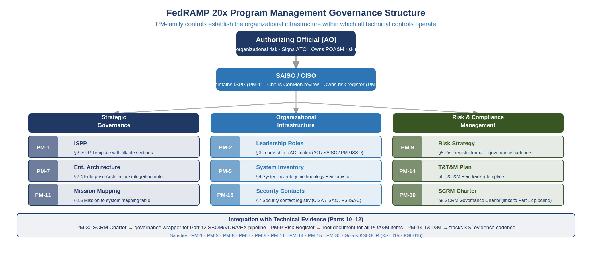

::: {.fouo-banner}
INTERNAL — NOT FOR PUBLIC DISTRIBUTION
:::

::: {.callout-warning}
## Draft Proposal — Subject to Review

This document is a **draft proposal** developed by the **CSI Team (Cloud Services Infrastructure)**. It is an attempt at a comprehensive SSA-wide technical roadmap and has not been reviewed or approved by the SSA CIO Office, the Office of Information Security (OIS), or organizational leadership. All recommendations, vendor selections, control mappings, and implementation timelines are subject to revision pending formal review by the SSA CIO Office and organizational components.
:::

## What This Document Addresses

FedRAMP 20x Authorization requires organizational governance artifacts that
exist outside the technical control stack. Program Management (PM) controls
establish the organizational infrastructure — leadership accountabilities,
program plans, metrics, and risk management frameworks — within which all
technical controls operate. Without these artifacts, technical evidence
cannot be contextualized against organizational mission and risk posture.

This document provides:

1. **Information Security Program Plan (ISPP)** — a structured outline
   satisfying PM-1, PM-7, PM-11 with a fillable template
2. **Program Leadership RACI** — roles, responsibilities, and accountability
   matrix satisfying PM-2
3. **System Inventory Framework** — inventory methodology and automation
   approach satisfying PM-5
4. **Risk Management Strategy** — risk register format and governance cadence
   satisfying PM-9
5. **Testing, Training, and Monitoring (T&T&M) Plan** — tracker template
   satisfying PM-14
6. **Security Contact Registry** — industry liaison contacts satisfying PM-15
7. **Supply Chain Risk Management (SCRM) Governance Charter** — organizational
   SCRM framework satisfying PM-30 and providing the organizational backbone
   for the technical evidence established in Part 15

Together these artifacts close nine NIST SP 800-53 Rev 5 PM family controls
and provide the PM-30 evidence that, combined with Part 15's technical
SBOM/VDR/VEX pipeline, seeds KSI-SCR coverage (KSI-015, KSI-016).

---

# Program Management Governance in the FedRAMP 20x Context

## Why PM Controls Gate Authorization

FedRAMP 20x Key Security Indicators evaluate *outcomes*, not checklist
compliance. PM controls are the organizational preconditions that determine
whether technical controls can achieve sustainable outcomes:

- **PM-1** (ISPP) is the document that contextualizes all other controls —
  without it, there is no authoritative statement of what the security program
  is trying to achieve
- **PM-9** (Risk Management Strategy) determines how the organization decides
  which risks to accept, mitigate, transfer, or avoid — every POA&M item
  references this decision framework
- **PM-30** (SCRM Strategy) is the organizational commitment that makes the
  Part 15 SBOM/VDR/VEX pipeline a governance artifact rather than a technical
  experiment — it binds leadership to the supply chain risk posture

## PM Controls Closed by This Document

| Control | Title | Artifact |
|---------|-------|----------|
| PM-1 | Information Security Program Plan | §2 ISPP Template |
| PM-2 | Info Security Program Leadership Roles | §3 Leadership RACI |
| PM-5 | System Inventory | §4 Inventory Framework |
| PM-7 | Enterprise Architecture | §2.4 EA Integration |
| PM-9 | Risk Management Strategy | §5 Risk Register Framework |
| PM-11 | Mission/Business Process Definition | §2.5 Mission Mapping |
| PM-14 | Testing, Training, and Monitoring | §6 T&T&M Plan |
| PM-15 | Security/Privacy Contact with Groups | §7 Contact Registry |
| PM-30 | Supply Chain Risk Management Strategy | §8 SCRM Charter |

> **Closure Necessity — PM family.** Every PM control in this book closes
> through a governance artifact — the ISPP, the leadership RACI, the system
> inventory framework, the risk register, the T&T&M plan, the SCRM charter —
> signed by named officials. None of them closes through the network substrate:
> no resolver, overlay, or enforcement point can author an organizational
> risk-tolerance statement or a leadership accountability matrix. The series
> asserts network necessity elsewhere only where control text, physics, or
> protocol behavior forecloses every alternative; conceding that PM governance
> is closed by documents, not technology, is what makes those assertions
> credible.

{fig-alt="Hierarchical governance diagram. Top tier: Authorizing Official (AO) who accepts organizational risk, signs ATO, and owns POA&M risk threshold. Second tier: SAISO/CISO who maintains ISPP, chairs ConMon review, and owns the risk register. Three governance columns flow from SAISO: Strategic Governance (PM-1 ISPP, PM-7 Enterprise Architecture, PM-11 Mission Mapping); Organizational Infrastructure (PM-2 Leadership Roles, PM-5 System Inventory, PM-15 Security Contacts); Risk and Compliance Management (PM-9 Risk Strategy, PM-14 T&T&M Plan, PM-30 SCRM Charter). Bottom integration note, labeled Integration with Technical Evidence (Parts 13-15): PM-30 SCRM Charter connects to the Part 15 SBOM/VDR/VEX pipeline; PM-9 Risk Register grounds all POA&M items; PM-14 tracks KSI evidence cadence." width="100%"}

---

# Information Security Program Plan (PM-1, PM-7, PM-11)

## ISPP Document Template

The Information Security Program Plan (ISPP) is the governing document for
SSA's cloud security program under FedRAMP 20x. It must be maintained by
the designated Senior Agency Information Security Officer (SAISO/CISO) and
reviewed annually or after major system changes.

### ISPP Section Outline

**Section 1 — Purpose and Scope**

> [FILLABLE] This Information Security Program Plan establishes the security
> management framework for [SYSTEM NAME], a [IMPACT LEVEL: Low/Moderate/High]
> impact system operated by the Social Security Administration (SSA) Cloud
> Services Team under FedRAMP 20x Authorization.
>
> **Authorization Boundary:** [Reference the boundary diagram from the SSP.
> The boundary must match the system inventory in §PM-5 and the
> authorization package submitted to FedRAMP PMO.]
>
> **Effective Date:** [DATE]  **Review Cycle:** Annual / After major change
>
> **Document Owner:** [NAME, TITLE] — SAISO/CISO
>
> **Approver:** [NAME, TITLE] — Authorizing Official (AO)

**Section 2 — Legal and Regulatory Authority**

- Federal Information Security Modernization Act (FISMA) 2014, 44 U.S.C. §3551
- OMB Circular A-130, Managing Federal Information as a Strategic Resource
- NIST SP 800-53 Rev 5, Security and Privacy Controls for Information Systems
- FedRAMP 20x Authorization Framework (GSA, 2026)
- CISA Binding Operational Directive 26-04 (SBOM/VDR/VER, effective Dec 7, 2026)
- Executive Order 14028, Improving the Nation's Cybersecurity (May 2021)

**Section 3 — Security Program Objectives**

> [FILLABLE] The SSA cloud security program is designed to achieve the
> following risk-based objectives, prioritized in alignment with SSA's
> mission of delivering critical citizen services:
>
> 1. Protect the confidentiality, integrity, and availability of citizen PII
>    and benefit payment data
> 2. Maintain continuous FedRAMP Moderate authorization across all cloud
>    service offerings used to deliver [MISSION FUNCTIONS]
> 3. Achieve and sustain KSI scores meeting the FedRAMP 20x Authorize
>    threshold across all 10 KSI themes by [DATE]
> 4. Satisfy the BOD 26-04 SBOM/VDR/VER requirement by December 7, 2026

**Section 4 — Program Resources and Budget**

> [FILLABLE] Security program resources are allocated as follows:
>
> | Resource Category | FY[YEAR] Allocation | Notes |
> |------------------|---------------------|-------|
> | FTE (security staff) | [N FTE] | ISSO, Security Architect, DevSecOps |
> | Tools and licensing | $[AMOUNT] | SIEM, vulnerability scanning, SBOM tooling |
> | Training and certification | $[AMOUNT] | CISSP, FedRAMP training, vendor certs |
> | Third-party assessment (3PAO) | $[AMOUNT] | Annual assessment + readiness review |
> | Contingency / incident response | $[AMOUNT] | IR retainer + tabletop exercises |

## Enterprise Architecture Integration (PM-7)

The SSA security architecture is integrated into the enterprise architecture
at three levels:

**Technical Reference Architecture (TRA):** Security controls are embedded in
the TRA as mandatory capabilities. The AAN Part 1–9 series establishes the
technical baseline; security controls are not bolt-ons but architectural
primitives (Zero Trust, encrypted transit, identity-first network access).

**Application Lifecycle Integration:** Every new application must complete
a Privacy Threshold Analysis (PTA) and Security Categorization before design
begins. Architecture review gates include:

1. **Concept** — security classification, boundary definition, data flow
2. **Design** — control selection, threat modeling, SBOM requirement binding
3. **Build** — security testing requirements, SBOM generation, CI gates
4. **Deploy** — ATO/P-ATO check, SBOM/VDR submission, KSI baseline
5. **Operate** — continuous monitoring, annual assessment, POA&M management

**EA Artifacts That Reference Security Architecture:**

- Target Architecture Document (TAD) — references AAN Part 1-16 control mappings
- Data Architecture — references Part 12 (Purview/CMK) for data-at-rest controls
- Network Architecture — references Part 1-6, 9 for network security

## Mission and Business Process Definition (PM-11)

### Critical Mission Functions

SSA operates the following mission-critical processes relevant to this
authorization boundary:

| Mission Function | System Dependency | Impact if Unavailable | RTO | RPO |
|-----------------|-------------------|----------------------|-----|-----|
| Benefit payment disbursement | [SYSTEM] | Direct citizen harm | 4h | 1h |
| Disability determination | [SYSTEM] | Service delay | 24h | 4h |
| Online account services (my Social Security) | [SYSTEM] | Service degradation | 8h | 2h |
| Contact center CRM | [SYSTEM] | Citizen service impact | 4h | 1h |

> [FILLABLE] Complete the above table for all mission functions within the
> authorization boundary. RTO/RPO values must align with the Contingency Plan
> (CP controls, Part 14) and the Business Impact Analysis (BIA).

---

# Program Leadership and Accountability (PM-2)

## Security Leadership RACI

FedRAMP 20x requires named individuals in security leadership roles. The
following RACI (Responsible / Accountable / Consulted / Informed) matrix
defines accountabilities for security program activities.

### Role Definitions

| Role | Title | Responsibilities |
|------|-------|-----------------|
| **AO** | Authorizing Official | Accepts organizational risk; signs ATO |
| **SAISO/CISO** | Chief Information Security Officer | Owns the ISPP; chairs Security Council |
| **ISSO** | Information System Security Officer | Day-to-day control operation; POA&M |
| **AO Rep** | AO Representative | Delegates AO oversight functions |
| **3PAO** | Third-Party Assessment Organization | Annual security assessment |
| **Privacy Officer** | Privacy Program Manager | PT controls; Privacy Impact Assessments |
| **DevSecOps Lead** | DevSecOps Team Lead | CI/CD security gates; SBOM pipeline |
| **SOC Lead** | Security Operations Center Lead | Sentinel monitoring; incident response |

### RACI Matrix — Key Program Activities

| Activity | AO | CISO | ISSO | DevSecOps | SOC | Privacy |
|----------|----|------|------|-----------|-----|---------|
| ATO decision | **A** | R | C | I | I | C |
| Annual security assessment | A | **R** | R | C | C | C |
| POA&M management | I | A | **R** | C | C | I |
| Incident response | A | R | **R** | C | **R** | C |
| SBOM/VDR submission (BOD 26-04) | I | A | R | **R** | I | I |
| KSI continuous monitoring | I | A | R | R | **R** | I |
| Privacy Impact Assessment | I | C | C | C | I | **R** |
| Security training | I | **A** | R | C | C | I |

> [FILLABLE] Replace role titles with named individuals. The AO and CISO
> must be SSA employees; the ISSO may be a contractor with documented oversight.
> The 3PAO must be FedRAMP-recognized.

---

# System Inventory Framework (PM-5)

## Inventory Requirements

NIST SP 800-53 PM-5 requires a current, complete inventory of all system
components within the authorization boundary. FedRAMP 20x additionally
requires that the inventory be machine-readable and kept in sync with
the deployed state.

## Automation Approach

The SSA system inventory is maintained through a three-layer approach:

**Layer 1 — Infrastructure Inventory (Automated)**

Azure Resource Graph queries provide real-time inventory of all Azure resources
within the authorization boundary subscription(s). A scheduled Logic App
exports the inventory to a structured JSON format every 24 hours.

```kusto
// Azure Resource Graph — authorization boundary inventory
resources
| where subscriptionId in ("[SUBSCRIPTION_IDS]")
| project
    resourceId = id,
    resourceType = type,
    resourceName = name,
    location,
    resourceGroup,
    tags,
    properties
| order by resourceType, resourceName
```

**Layer 2 — Software Inventory (SBOM)**

Part 15 establishes the SBOM pipeline using Syft. Every container image
deployed in production generates a CycloneDX 1.6 SBOM at build time. The
SBOM manifest is the machine-readable software component inventory.

Reconciliation between the infrastructure inventory (Layer 1) and the SBOM
inventory (Layer 2) is performed monthly by the DevSecOps team. Discrepancies
are logged as POA&M items if not resolved within 30 days.

**Layer 3 — Personnel and Account Inventory (Identity)**

Entra ID (Part 5) provides the authoritative account inventory. The ISSO
reviews privileged account counts weekly (referenced by KSI-003). The
Part 5 evidence artifacts satisfy CM-8(1) automated inventory updates for
the identity plane.

## Inventory Template

> [FILLABLE] Complete the following inventory for all components within the
> authorization boundary:

| Component ID | Component Name | Type | Location | Owner | SBOM ID | Last Reviewed |
|-------------|----------------|------|----------|-------|---------|---------------|
| [ID] | [Name] | [Server/Container/SaaS/Network] | [Azure Region] | [Team] | [SHA256] | [Date] |

---

# Risk Management Strategy (PM-9)

## Risk Management Framework

SSA's risk management strategy follows NIST SP 800-39 (Managing Information
Security Risk) at three tiers:

- **Tier 1 (Organization):** Risk framing — risk tolerance, risk assumptions,
  risk constraints, priorities, and trade-offs defined by SSA leadership
- **Tier 2 (Mission/Process):** Risk assessment — enterprise-level risk
  register maintained by the CISO
- **Tier 3 (System):** Risk response — system-level POA&M, continuous
  monitoring, authorization decisions

## Risk Appetite Statement

> [FILLABLE — requires CISO and AO sign-off]
>
> SSA accepts residual risk at the Moderate impact level for systems that
> process citizen benefit data, consistent with FIPS 199 categorization.
> The organization's risk tolerance for the following categories is:
>
> | Risk Category | Tolerance | Rationale |
> |---------------|-----------|-----------|
> | Availability | Low (RTO ≤ 4h for critical) | Benefit payment continuity |
> | Confidentiality — PII | Very Low | Citizen trust; statutory obligation |
> | Confidentiality — Internal | Moderate | Business operations |
> | Integrity | Low | Payment accuracy; audit trail |
> | Supply Chain | Low | BOD 26-04 and EO 14028 mandate |

## Risk Register Format

The SSA enterprise risk register is maintained in the POA&M tracker and
reviewed monthly by the ISSO, quarterly by the CISO.

| Risk ID | Control | Description | Likelihood | Impact | Score | Owner | Status | Due |
|---------|---------|-------------|-----------|--------|-------|-------|--------|-----|
| [R-NNN] | [ID] | [Description] | [1-5] | [1-5] | [L×I] | [Name] | Open/Closed | [Date] |

**Scoring matrix:** Score = Likelihood (1=Rare, 5=Certain) × Impact (1=Negligible, 5=Catastrophic)

- Score 1–4: Accept (document and monitor)
- Score 5–9: Mitigate (POA&M required within 90 days)
- Score 10–15: Mitigate urgently (POA&M required within 30 days)
- Score 16–25: Escalate to AO (POA&M required within 15 days)

## Risk Response Options

For each identified risk the ISSO documents the chosen response:

1. **Mitigate:** Implement or strengthen a control to reduce likelihood/impact
2. **Transfer:** Contractually shift risk to a cloud service provider or vendor
3. **Accept:** Document acceptance with AO concurrence (time-bounded for score > 4)
4. **Avoid:** Remove the system component or functionality that generates the risk

---

# Testing, Training, and Monitoring Plan (PM-14)

## T&T&M Framework

PM-14 requires the organization to implement a security testing, training, and
monitoring program with defined schedules and accountability.

## Testing Schedule

| Test Type | Frequency | Responsible | Evidence Artifact |
|-----------|-----------|-------------|------------------|
| Annual security assessment (3PAO) | Annual | AO / CISO | Assessment report |
| Penetration test | Annual | 3PAO | Pen test report |
| Tabletop incident response exercise | Semi-annual | ISSO / SOC | Exercise after-action report |
| Control spot-check (automated KSI monitoring) | Continuous | DevSecOps / SOC | Sentinel dashboard |
| Vulnerability scan (Defender VM) | Continuous | SOC | Part 11 Defender VM output |
| SBOM/VDR scan (Grype CI gate) | Every PR merge | DevSecOps | Part 15 CI logs |
| Contingency plan test | Annual | ISSO | CP-4 test results |
| Configuration baseline review | Quarterly | DevSecOps | GitHub baseline diff |

## Training Requirements

All personnel with access to systems within the authorization boundary must
complete:

| Training | Frequency | Audience | Tracking System |
|----------|-----------|----------|----------------|
| Security awareness (role-based) | Annual | All users | [LMS NAME] |
| FedRAMP procedures | Annual | ISSO, security team | [LMS NAME] |
| Incident response procedures | Semi-annual | ISSO, SOC, DevSecOps | Tabletop exercise roster |
| SBOM/supply chain awareness | Annual | DevSecOps, procurement | [LMS NAME] |
| Privacy (PII handling) | Annual | All users with PII access | [LMS NAME] |

## Continuous Monitoring Program

The continuous monitoring program for SSA's FedRAMP 20x authorization is
operationalized through the Part 13 Sentinel XDR platform with the following
monitoring dimensions:

| Dimension | KSI Theme | Sentinel Workbook | Alert Cadence |
|-----------|-----------|------------------|---------------|
| Identity anomalies | KSI-IAM | Identity & Access | Real-time |
| Network anomalies | KSI-CNA | Network Security | Real-time |
| Endpoint threats | KSI-PIY | Endpoint Protection | Real-time |
| Vulnerability posture | KSI-MLA | Vulnerability Dashboard | Daily |
| SBOM drift / CVE ingestion | KSI-CMT / KSI-SCR | SBOM Dashboard | Per-commit |
| Log completeness | KSI-MLA | Log Analytics Health | Hourly |

---

# Security Contact Registry (PM-15)

## Industry and Government Liaison Contacts

PM-15 requires the organization to maintain current contacts with security
groups, associations, and government organizations. The following registry
is maintained by the CISO and reviewed quarterly.

### Government Contacts

| Organization | Contact Type | Notification Trigger | Contact Method |
|-------------|-------------|---------------------|----------------|
| CISA (US-CERT) | Incident reporting | All incidents meeting FISMA thresholds | ir@cisa.dhs.gov |
| CISA KEV team | Vulnerability intel | KEV additions affecting SSA SBOM components | kev@cisa.dhs.gov |
| FedRAMP PMO | Authorization | Significant change, annual assessment | info@fedramp.gov |
| OMB Cyber | Policy guidance | Major policy changes | [OMB POC] |
| SSA IG | Audit coordination | Audit notification, investigation referral | [IG POC] |

### Industry and ISAC Contacts

| Organization | Membership | Contact Purpose | Cadence |
|-------------|-----------|----------------|---------|
| MS-ISAC | Active member | Threat intelligence sharing | Monthly briefing |
| IT-ISAC | Liaison | Federal IT threat feeds | Quarterly |
| Microsoft MSRC | Vendor subscription | CVE notification for Azure/M365 | Automatic (RSS) |
| CISA PSIRT feeds | Subscription | VEX/VDR-relevant vendor advisories | Automatic |
| NIST NVD | Data consumer | CVE/CVSS feed for SBOM VDR generation | Daily automated pull |

### Security Industry Contacts

| Organization | Purpose |
|-------------|---------|
| Cloud Security Alliance (CSA) | FedRAMP best practices; STAR registry |
| ACT-IAC | Federal IT policy; FedRAMP 20x working groups |
| ISACA | Audit frameworks; COBIT alignment |

---

# Supply Chain Risk Management Governance Charter (PM-30)

## Charter Purpose and Authority

This Supply Chain Risk Management (SCRM) Governance Charter establishes SSA's
organizational commitment to identifying, assessing, and managing supply chain
risks across the lifecycle of cloud services used to deliver SSA's mission.

**Authority:** This charter is approved by the [SSA CISO / CIO] and reviewed
annually. It implements the requirements of NIST SP 800-161r1, EO 14028
§4(c), and FedRAMP 20x KSI-SCR.

**Scope:** All cloud services, third-party software components, hardware
components, and system integrators within the FedRAMP authorization boundary.

## SCRM Organizational Structure

```
SSA CIO
└── CISO (SCRM Executive Sponsor)
    ├── ISSO (SCRM Program Manager — day-to-day)
    │   ├── DevSecOps Lead (SBOM pipeline owner)
    │   ├── Procurement Security Liaison (SR-2 acquisition clauses)
    │   └── Vendor Risk Analyst (supplier assessments, SR-6)
    └── Legal / Contracts (FOCI reviews, supply chain clauses)
```

## SCRM Risk Categories

SSA's SCRM program addresses five supply chain risk categories aligned with
NIST SP 800-161r1:

| Category | Examples | Controls | Part 15/16 Evidence |
|----------|---------|----------|-------------------|
| **Counterfeit components** | Fake open-source packages, typosquatting | SR-3, SR-10 | SBOM + Cosign verification |
| **Tampered components** | Compromised build pipeline, malicious update | SR-3, SA-10, SA-11 | SLSA provenance, Grype CI gate |
| **Vulnerable components** | Known CVEs in SBOM dependencies | SR-5, SR-6, SR-11 | VDR (Grype output), KEV integration |
| **Unauthorized access by supplier** | Vendor with excessive access | SR-6, AC-21 | Part 5 vendor access review |
| **Vendor financial/operational risk** | Vendor bankruptcy, PSIRT closure | SR-8, PM-9 | Vendor disclosure matrix (Part 15) |

## SCRM Risk Assessment Process

The SCRM risk assessment is performed:
- **Annually** — full assessment of all critical suppliers
- **On new procurement** — for any new third-party software component
- **On CVE disclosure** — triggered by KEV additions or vendor PSIRT advisories
- **On change** — when the SBOM diff shows a new dependency or version bump

**Assessment Inputs:**
1. SBOM manifest (Syft output, Part 15) — identifies all components and suppliers
2. VDR (Grype output, Part 15) — identifies exploitable vulnerabilities
3. Vendor disclosure matrix (Part 15 §7) — supplier security posture
4. KEV feed (CISA, integrated via Part 13 Sentinel) — known exploited CVEs
5. PSIRT/MSRC subscriptions (Part 15 §6.3) — vendor security advisories

**Assessment Output:**
- SCRM risk register update (referenced in PM-9 §5.2 above)
- VEX assertions for each CVE (OpenVEX format, Part 15 §5)
- Remediation actions (POA&M items for unmitigated critical CVEs)

## Supplier Requirements

All suppliers of software components within the authorization boundary must:

1. **Provide an SBOM** in CycloneDX 1.6 or SPDX 2.3 format for all software
   delivered, within 30 days of contract award and within 15 days of any
   production update
2. **Maintain a PSIRT** or designate a security contact reachable within
   24 hours of a critical CVE disclosure
3. **Notify SSA** within 72 hours of discovery of any security incident that
   may affect components in SSA's production environment
4. **Submit VEX assertions** for CVEs identified in their components within
   30 days of CISA CVE publication
5. **Accept SSA SCRM audit rights** — the right to audit the supplier's
   security practices with 30 days' notice

> [FILLABLE] Insert contract clause language for SR-2/SR-3 requirements.
> Coordinate with SSA Contracts and Procurement to embed SBOM requirement
> in the standard Acquisition/Vendor Agreement template.

## BOD 26-04 Compliance Posture

CISA Binding Operational Directive 26-04 requires all FCEB agencies to
submit SBOM, VDR, and VER for all federal systems by **December 7, 2026**.

| BOD 26-04 Tier | Requirement | SSA Status | Evidence |
|---------------|-------------|------------|----------|
| Tier 1: SBOM | Machine-readable SBOM for all systems | Implemented | Part 15, Syft pipeline |
| Tier 2: VDR | Vulnerability Disclosure Report | Implemented | Part 15, Grype output |
| Tier 3: VER | Vulnerability Exploitability eXchange | Implemented | Part 15, OpenVEX JSON |

SSA's SCRM program satisfies all three BOD 26-04 tiers through the technical
pipeline established in Part 15 (SBOM + VDR + VEX Framework) and the
organizational governance framework established in this charter.

## SCRM Governance Cadence

| Activity | Frequency | Owner | Output |
|----------|-----------|-------|--------|
| SBOM scan (CI gate) | Every PR merge | DevSecOps | VDR (Grype) |
| VEX assertion review | 90-day cycle | ISSO | Signed VEX JSON |
| Vendor disclosure matrix review | Annual + on change | Vendor Risk Analyst | Updated matrix |
| SCRM risk register review | Quarterly | ISSO | Risk register update |
| Supplier SBOM receipt | On delivery + quarterly | Procurement Liaison | Supplier SBOM log |
| PSIRT subscription check | Monthly | DevSecOps | Subscription roster |
| SCRM charter review | Annual | CISO | Approved charter revision |
| BOD 26-04 submission check | Pre-deadline (Oct 1) | CISO / AO | VDR/VER submission package |

## Charter Approval

This SCRM Governance Charter has been reviewed and approved by:

| Role | Name | Signature | Date |
|------|------|-----------|------|
| CISO / SAISO | [NAME] | [SIGNATURE] | [DATE] |
| CIO | [NAME] | [SIGNATURE] | [DATE] |
| AO | [NAME] | [SIGNATURE] | [DATE] |
| Privacy Officer | [NAME] | [SIGNATURE] | [DATE] |

> [FILLABLE] Obtain signatures before submission in the FedRAMP authorization
> package. The signed charter is the PM-30 evidence artifact. It must be
> dated and version-controlled; include version number and supersession note
> when updated.

---

# Appendix A — PM Control Traceability Matrix

| Control | Title | §Reference | Artifact | Status |
|---------|-------|-----------|---------|--------|
| PM-1 | Information Security Program Plan | §2 | ISPP Template | ✅ Template provided |
| PM-2 | Info Security Program Leadership Roles | §3 | Leadership RACI | ✅ Template provided |
| PM-5 | System Inventory | §4 | Inventory Framework | ✅ Template + automation |
| PM-7 | Enterprise Architecture | §2.4 | EA Integration | ✅ Architecture gates |
| PM-9 | Risk Management Strategy | §5 | Risk Register | ✅ Template provided |
| PM-11 | Mission/Business Process Definition | §2.5 | Mission Map | ✅ Template provided |
| PM-14 | Testing, Training, and Monitoring | §6 | T&T&M Plan | ✅ Template provided |
| PM-15 | Security Contact with Groups | §7 | Contact Registry | ✅ Template provided |
| PM-30 | Supply Chain Risk Management Strategy | §8 | SCRM Charter | ✅ Template provided |

---

# Appendix B — Integration with AAN Technical Series

| AAN Part | PM Control Dependencies |
|----------|------------------------|
| Part 5 (Entra ID / ZTNA) | PM-5 (system inventory — identity plane) |
| Part 11 (Defender VM) | PM-14 (testing — vulnerability scan cadence) |
| Part 12 (Purview / Key Vault) | PM-11 (mission mapping — PII-bearing processes) |
| Part 13 (Sentinel) | PM-14 (monitoring program — Sentinel workbooks) |
| Part 14 (Contingency) | PM-9 (risk register — RTO/RPO inputs) |
| Part 15 (SBOM/VDR/VEX) | PM-30 (SCRM charter — technical backbone) |
| **Part 16 (this document)** | PM-1, PM-2, PM-5, PM-7, PM-9, PM-11, PM-14, PM-15, PM-30 |

The PM governance artifacts in Part 16 provide the organizational layer that
contextualizes the technical evidence from Parts 1–15. Together they form a
complete FedRAMP 20x authorization package for the PM and SR control families.
