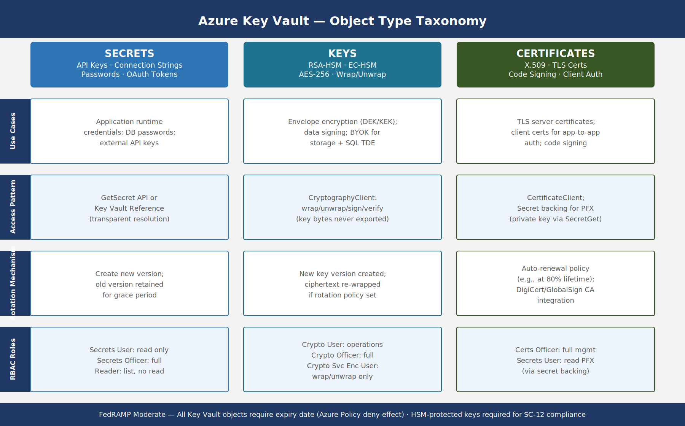

::: {.fouo-banner}
INTERNAL — NOT FOR PUBLIC DISTRIBUTION
:::

::: {.callout-important}
**Series Context** — This document is Part 16 of the Federal Application-Aware Networking series. Parts 1–15 establish Landing Zone IPAM/DDI/PKI, Namespace-Anchored Trust, Network Access Control, DNS Security, Network Modernization, Federal Telecommunications/ZTNA, SQL Server Authentication (Parts 11–13), Privileged Access Management (Part 14), and Virtual Machine Identity (Part 15). This part addresses operational secrets — the credentials, connection strings, API keys, and symmetric keys that applications use at runtime. Hardcoded secrets are the leading cause of cloud data breaches. This book closes IA-5, IA-5(7), SC-12, SA-15, CM-3, and AC-6.
:::

# What This Document Addresses

Parts 1 through 15 of this series established strong identity for users (Entra ID, MFA, Conditional Access), strong identity for machines (Managed Identity, Arc, hybrid Kerberos replacement), strong identity for privileged administrators (PIM, PAW, JIT access), and strong identity for virtual workloads (IMDS, VM system-assigned MI, AKS workload identity). Every one of those mechanisms answers the question: *who is this entity, and can we verify it?*

There is a second, equally urgent question that those mechanisms do not fully answer: *what does that entity know, and should any code or configuration store it?*

The answer is that applications have always needed runtime secrets — database passwords, API keys, OAuth client secrets, symmetric encryption keys, third-party service tokens. For decades, those secrets lived in configuration files, environment variables, connection strings embedded in application code, and CI/CD pipeline variables stored as plaintext in version control. Each of those locations is an exfiltration surface. A single repository containing a hardcoded AWS access key, rotated annually or never, gives an attacker with read access to the repository a long-lived credential for cloud infrastructure.

The 2023 GitHub token scanning report found over 10 million secrets exposed in public repositories. Federal repositories are not immune. CISA's 2023 advisory on Chinese state-sponsored actors (Volt Typhoon) specifically identified hardcoded credentials in application configurations as an initial access vector. FedRAMP 20x's KSI-IAM-CAP key security indicator explicitly requires that application authenticators be stored in approved secrets vaults, not in code, environment variables, or configuration files.

This document addresses the complete operational secrets lifecycle:

1. **Key Vault object taxonomy** — what Azure Key Vault stores and why each object type is distinct.
2. **Application secret access patterns** — how applications retrieve secrets without storing them locally, with Managed Identity as the preferred zero-credential pattern.
3. **Secret rotation automation** — how secrets expire, rotate, and propagate to applications automatically without downtime.
4. **Pipeline secrets governance** — how CI/CD systems access secrets without embedding static credentials, using OIDC federation.
5. **GitHub Advanced Security secret scanning** — how committed secrets are detected before and after they reach the repository.
6. **Secret lifecycle governance** — the policy framework that prevents never-expiring secrets, unauthorized creation, and unreviewed access.
7. **HashiCorp Vault patterns** — multi-cloud secrets management where Azure Key Vault is not the primary.
8. **Emergency break-glass procedures** — how to access secrets when the normal automated path is unavailable.

::: {.callout-note}
**Scope Boundary** — Book 02 covers certificate and PKI key management as an identity infrastructure concern — issuing CAs, trust anchors, and OCSP. This book covers operational secrets that applications consume at runtime. Certificates appear here only in the context of their lifecycle integration with Key Vault — specifically, auto-renewal and the Key Vault certificate object type that combines key, certificate, and policy in a single managed unit.
:::

# Hardcoded Secrets: The Problem This Book Solves

## Why Hardcoded Secrets Are Structurally Dangerous

A hardcoded secret is any authenticator embedded in a location that was not designed to be an authenticator store. Configuration files, environment variables in Dockerfiles, `.env` files committed to version control, pipeline YAML with inline variable values, and application constants in source code are all hardcoded secret locations.

The structural problem is permanence. Authenticator stores — Key Vault, PAM solutions, password managers — are designed to enforce expiry, log access, and control rotation. Configuration files and source code have no such enforcement. A secret embedded in a configuration file in 2019 may still be present in that file in 2026, unchanged, because there is no mechanism to detect that it has never rotated and no automated trigger to change it.

The attack surface compounds across time. A repository with a hardcoded credential accumulates every developer, contractor, and integration system that has cloned the repository since the credential was committed. Each clone is an independent exposure. Git history preserves deleted secrets — removing a secret from the current branch does not remove it from the commit log. An attacker with access to any clone of the repository at any point in its history can extract the secret.

Federal environments face additional exposure through third-party software supply chains. Libraries imported via npm, pip, or NuGet carry their own configuration patterns. If a library expects a secret to be passed via environment variable and the application injects that variable from a committed `.env` file, the exposure pathway is indirect but real.

## The FedRAMP Baseline Requirement

IA-5(7) states: *"The information system does not allow authenticators to be embedded in clear text in application code."* This is a baseline Moderate control. Non-compliance is not a finding that can be accepted as a risk — it is a control gap that blocks Authorization to Operate.

IA-5 more broadly requires that authenticators be protected, distributed only to authorized entities, changed according to a defined schedule, and revoked when compromised. Environment variables and configuration files cannot satisfy these requirements without tooling explicitly designed to enforce them.

SA-15 requires that development processes ensure security — specifically, that pipelines do not introduce insecure practices including hardcoded credentials. A pipeline that injects a secret from a checked-in `.env` file violates SA-15 regardless of whether the resulting application is secure at runtime.

CM-3 requires that changes be controlled. Secret rotation is a change to an authenticator value. Without a defined process, rotation is either manual (prone to omission) or automated without approval tracking (violating change control). The correct architecture automates rotation within a controlled process that produces an auditable change record.

# Key Vault Object Taxonomy

Azure Key Vault stores three distinct object types. Understanding the taxonomy is essential because each type has different access patterns, rotation mechanisms, and RBAC roles. Treating all three as interchangeable "secrets" is a common configuration error that leads to inadequate access controls.

{#fig-sec01 fig-alt="Three-column diagram. Left column labeled Secrets contains API keys, connection strings, passwords, and opaque string values with use cases for application runtime credentials, access pattern via GetSecret API or Key Vault reference, rotation by creating new version, and RBAC roles Key Vault Secrets User and Key Vault Secrets Officer. Middle column labeled Keys contains RSA and EC cryptographic keys, HSM-protected operations, and wrap/unwrap functions with use cases for data encryption keys and signing operations, access pattern via CryptographyClient for wrap/unwrap/sign/verify only, rotation by creating new key version with automatic re-wrap if needed, and RBAC roles Key Vault Crypto User and Key Vault Crypto Officer. Right column labeled Certificates contains X.509 certificates with integrated private keys, auto-renewal policies, and CA integration with use cases for TLS and code signing, access pattern via CertificateClient, rotation via automatic renewal before expiry, and RBAC role Key Vault Certificates Officer." width="100%"}

## Secrets: Opaque String Values

Key Vault **Secrets** are arbitrary string values treated as opaque — Key Vault has no knowledge of or concern for their format or semantics. A secret is simply a name, a value, and metadata including content type, activation date, expiry date, enabled flag, and version identifier.

Every mutation that changes the value creates a new version. Prior versions are retained and remain accessible unless explicitly disabled or purged. This versioning behavior is critical for rotation — the application can continue using the current version while the rotation process creates the next version, then switch atomically.

Secret use cases in federal environments:

- **Database connection strings** — including server hostname, database name, user ID, and password for SQL Server, PostgreSQL, Oracle, and other managed database services. These must not include embedded credentials for service accounts that have standing access.
- **API keys for external services** — PIV validation services, CISA threat feeds, GSA shared services APIs, commercial data brokers, and third-party SaaS integrations accessed by government applications.
- **OAuth client secrets** — for applications registered in Entra ID that require a client credential to obtain tokens. Note: the preferred pattern is to replace client secrets with client certificates (stored as Key Vault Certificates), but existing applications during migration may require the client secret pattern.
- **Symmetric encryption keys** — passphrase-equivalent values used to encrypt data at rest in application storage when Azure native encryption is insufficient (e.g., column-level encryption in SQL Server using application-managed keys).
- **Webhook signing secrets** — used by applications to validate that inbound webhook calls are authentic.

**RBAC Roles for Secrets:**

| Role | Can List | Can Read Value | Can Create/Update | Can Delete |
|------|----------|----------------|-------------------|------------|
| Key Vault Secrets User | No | Yes | No | No |
| Key Vault Secrets Officer | Yes | Yes | Yes | Yes |
| Key Vault Reader | Yes | No | No | No |

Applications use Key Vault Secrets User. Human operators responsible for secret lifecycle management use Key Vault Secrets Officer. Read-only audit and monitoring use Key Vault Reader. No application should hold Key Vault Secrets Officer — that would allow the application to overwrite its own secrets, creating an escalation path.

## Keys: Cryptographic Operations Only

Key Vault **Keys** are cryptographic key materials. Unlike Secrets, Key Vault does not return the raw key bytes in normal operation — instead, it exposes cryptographic *operations* using the key: encrypt, decrypt, wrap, unwrap, sign, verify. The key bytes never leave Key Vault (or the HSM boundary if HSM-protected).

This is the critical distinction between a Key Vault Key and a Key Vault Secret containing a base64-encoded key: a Key stored as a Secret can be exfiltrated. A Key stored as a Key Vault Key cannot — the application can only ask Key Vault to perform operations on its behalf.

Key types and their federal use cases:

- **RSA-HSM 2048/3072/4096** — asymmetric encryption and signing. HSM-protected means the key was generated inside the Hardware Security Module and never exported. Required for keys protecting FedRAMP High data; strongly recommended for FedRAMP Moderate.
- **EC-HSM P-256/P-384** — elliptic curve keys for ECDSA signing and ECDH key agreement. P-384 is preferred for federal use per CNSS Policy 15.
- **AES-256** — symmetric keys for AES-CBC and AES-GCM encryption operations. Used with the wrapKey/unwrapKey operations to implement envelope encryption for large datasets.

Envelope encryption pattern: a local Data Encryption Key (DEK) encrypts the data. The DEK is encrypted (wrapped) by the Key Vault Key Encryption Key (KEK) before being stored alongside the data. The DEK bytes are never stored unencrypted. To decrypt data, the application unwraps the DEK using Key Vault, then uses the DEK in memory to decrypt the data locally.

**RBAC Roles for Keys:**

| Role | Permitted Operations |
|------|----------------------|
| Key Vault Crypto User | Encrypt, Decrypt, Wrap, Unwrap, Sign, Verify |
| Key Vault Crypto Officer | All operations plus Create, Update, Delete, List |
| Key Vault Crypto Service Encryption User | Get, Wrap, Unwrap (for service encryption scenarios) |

## Certificates: Integrated X.509 Lifecycle

Key Vault **Certificates** combine a private key, a public certificate, and a lifecycle policy in a single managed object. When an application retrieves a certificate from Key Vault, it can get the full PFX bundle (private key + certificate chain) for TLS termination, or the certificate-only DER/PEM for signature verification.

Certificate-specific features:

- **Integrated issuance** — Key Vault integrates with DigiCert and GlobalSign for automated DV and OV certificate issuance. Internal CA integration uses the PKCS#10 CSR workflow — Key Vault generates the key pair and CSR, the CA issues the certificate, the administrator imports the signed certificate, and Key Vault stores the complete object.
- **Auto-renewal policy** — the certificate lifecycle policy specifies renewal trigger (percentage of lifetime or days before expiry), renewal action (auto-renew for supported CAs, email-notification for manual renewal), and validity period. FedRAMP environments should configure renewal at 80% lifetime minimum.
- **Secret backing** — every Key Vault Certificate has a corresponding Secret object in the same vault containing the PFX. Applications that need the private key access it via the Secrets API using `GetSecret` on the certificate name.

::: {.callout-warning}
**PIV and DoD PKI Certificates** — Federal government PIV certificates and DoD-issued certificates are not stored in Key Vault — they are issued and revoked through the Federal PKI hierarchy and stored on PIV cards and in the user's Entra ID profile. Key Vault Certificates are for machine identities (TLS server certificates, code signing certificates, client certificates for application-to-application authentication). Do not conflate the two.
:::

# Application Secret Access Patterns

## Pattern 1: Managed Identity (Zero Credential)

The Managed Identity pattern eliminates the need for the application to manage *any* credential to access Key Vault. The application's Azure-hosted compute resource (VM, Function App, App Service, AKS pod) has a system-assigned or user-assigned Managed Identity. That identity is an Entra ID service principal with no secret — it authenticates using the Azure Instance Metadata Service (IMDS) endpoint at `169.254.169.254`.

{#fig-sec02 fig-alt="Flow diagram with five numbered steps. Step 1: Azure-hosted application resource (VM, Function App, AKS pod) requests an access token from the IMDS endpoint at 169.254.169.254 with resource scope set to vault.azure.net. Step 2: The Azure fabric validates the Managed Identity, contacts Entra ID, and returns a short-lived bearer token (valid 1 hour). Step 3: Application presents the bearer token to the Key Vault REST API in the Authorization header. Step 4: Key Vault validates the token against Entra ID, checks RBAC assignment for the Managed Identity's object ID, and returns the secret value. Step 5: Application uses the secret value in memory and discards it. Annotation at the bottom reads: No credential stored in code, config file, environment variable, or pipeline. The Managed Identity's token is issued by Azure infrastructure and cannot be extracted or reused outside the VM context." width="100%"}

**Why Managed Identity is the required pattern:**

The IMDS endpoint is only accessible from within the Azure compute fabric. A token obtained from IMDS is scoped to the requesting identity and has a 1-hour TTL. It cannot be extracted and reused from outside the compute environment — the token is the credential, and its issuance requires the Azure fabric to validate that the requesting process is running on the assigned resource.

This means there is literally no long-lived credential to steal. An attacker who compromises the application's code repository gains nothing useful for accessing Key Vault. An attacker who compromises the application's configuration management database gains nothing. The only attack surface is the running compute instance itself — which is addressed by the endpoint security, EDR, and VM controls in Books 08 and 15.

**Implementation steps:**

1. Enable system-assigned Managed Identity on the Azure resource (ARM template or Terraform `identity` block, `type = "SystemAssigned"`).
2. Assign Key Vault Secrets User role to the Managed Identity's object ID on the Key Vault or individual secret scope.
3. In application code, use `DefaultAzureCredential` from the Azure Identity SDK — this automatically uses IMDS in Azure-hosted environments and falls back to developer credentials locally (environment variable, Azure CLI, Visual Studio).
4. Retrieve the secret once at startup (for connection strings) or on each use (for rotating secrets). Use `SecretClient.GetSecretAsync(name)` — no version specified means latest version, which automatically picks up rotated secrets.

```python
# Python example — no credential in code
from azure.identity import DefaultAzureCredential
from azure.keyvault.secrets import SecretClient

credential = DefaultAzureCredential()
client = SecretClient(vault_url="https://ssa-prod-kv.vault.azure.net/", credential=credential)
secret = client.get_secret("sql-connection-string")
connection_string = secret.value  # Used in memory, never stored to disk
```

**AKS workload identity** uses the same conceptual pattern with Kubernetes-specific plumbing: the pod annotation `azure.workload.identity/client-id` links the Kubernetes service account to a user-assigned Managed Identity. The Azure Workload Identity webhook injects the `AZURE_FEDERATED_TOKEN_FILE` and `AZURE_CLIENT_ID` environment variables, and `DefaultAzureCredential` automatically uses federated token exchange to obtain a Key Vault token. The pod never holds a static credential.

## Pattern 2: App Configuration + Key Vault Reference

Azure App Configuration is a centralized configuration store that integrates with Key Vault through references. An App Configuration key contains not the secret value but a Key Vault URI pointing to the secret. When the application reads the configuration key, the App Configuration SDK resolves the reference and returns the current secret value from Key Vault.

This pattern is valuable when:
- Applications already use App Configuration for non-secret configuration values and want a unified configuration API.
- Feature flags, connection strings, and application settings all come from one endpoint.
- The team wants to audit configuration reads through a single service.

The application authenticates to App Configuration using Managed Identity. App Configuration, in turn, authenticates to Key Vault using its own system-assigned Managed Identity, which is granted Key Vault Secrets User on the target vault.

**Key Vault reference syntax in App Configuration:**

```
Key:    ConnectionStrings:Database
Value:  {"uri":"https://ssa-prod-kv.vault.azure.net/secrets/sql-connection-string"}
```

The application code reads `ConnectionStrings:Database` from the App Configuration provider without knowing it is a Key Vault reference. The resolution is transparent.

**Auto-refresh:** Configure the App Configuration provider with a sentinel key and a refresh interval. When Key Vault rotates the secret and creates a new version, the application's next configuration refresh cycle picks up the new value automatically without restarting.

## Pattern 3: Service Principal with Certificate

Some applications cannot use Managed Identity — they run outside Azure (on-premises workloads not Arc-connected, third-party SaaS, non-Azure cloud) or require a non-IMDS authentication mechanism. For these cases, the recommended pattern is service principal authentication using a certificate, not a client secret.

The certificate is stored in Key Vault as a Certificate object. At startup, the application:
1. Reads the certificate from Key Vault using an initial bootstrap credential (typically the local machine certificate store or an Arc Managed Identity for hybrid workloads).
2. Uses the certificate to authenticate as the service principal to Entra ID.
3. Receives an access token and accesses target resources.

The bootstrap credential is the only static element, and it is a certificate with a defined expiry, not a password. Certificate rotation is managed by Key Vault's auto-renewal policy.

::: {.callout-note}
**Pattern Priority Hierarchy** — For federal SSA workloads, apply patterns in this order of preference: (1) Managed Identity (system-assigned for single-resource workloads, user-assigned for workloads that need a shared identity across multiple resources), (2) AKS Workload Identity for containerized workloads, (3) App Configuration + Key Vault Reference for applications using App Configuration, (4) Service Principal + Certificate for hybrid or external workloads, (5) Service Principal + Client Secret as a last resort only during migration — must have a documented plan to migrate to pattern 1, 2, 3, or 4 within 90 days.
:::

# Secret Rotation Automation

## Why Manual Rotation Fails

Manual secret rotation is the operational practice where a human operator generates a new credential value, updates the target system's expected authenticator, updates the Key Vault secret, and restarts or notifies the application. The failure modes are predictable:

- **Operator omission** — the rotation schedule exists on paper but does not trigger an automated action. Rotation happens when an operator remembers or when a compliance scan flags the expired secret.
- **Partial rotation** — the operator updates Key Vault but forgets to update the target system (or vice versa), causing application failures that require emergency rollback.
- **Rotation-induced outage** — the application continues using the cached old secret value after rotation because there is no mechanism to invalidate the cache.
- **Rotation-resistant secrets** — some secrets are never rotated because the operator cannot identify all the places they are used.

IA-5 requires rotation on a defined schedule. CM-3 requires that the rotation be a controlled change. A manual rotation process can satisfy neither requirement consistently across dozens or hundreds of secrets.

## Automated Rotation Architecture

Azure Key Vault expiry events, Event Grid, and Azure Functions compose a rotation automation architecture that requires no human intervention for the rotation itself while producing a complete audit trail.

{#fig-sec03 fig-alt="Timeline-based flow diagram with six numbered stages. Stage 1 at time T-30 days: Key Vault generates a SecretNearExpiry event as the secret approaches its expiry date. Stage 2: Azure Event Grid routes the event to the rotation Azure Function subscription. Stage 3 at time T: Azure Function executes the rotation handler — it connects to the target system (SQL Server, AD, third-party API) using a privileged rotation credential stored separately, generates a new credential value, and sets the new value on the target system. Stage 4: Function creates a new version of the Key Vault secret with the new value. Stage 5: Function updates the secret expiry to current date plus rotation period. Stage 6 at time T plus 5 minutes: Application using Key Vault reference or polling GetSecret with no version picks up the new version automatically. Annotation shows that the old version remains accessible for a grace period to allow in-flight requests to complete." width="100%"}

**Rotation function design:**

The rotation function must be idempotent — if it is triggered twice (Event Grid guarantees at-least-once delivery), running it a second time should not break the application. The pattern is:

1. Get the current secret version from Key Vault.
2. Generate a new credential value (for passwords: cryptographically random, complexity-compliant; for API keys: call the target API's key generation endpoint).
3. Attempt to set the new value on the target system.
4. If step 3 succeeds, create a new Key Vault secret version with the new value.
5. Set the old version's enabled flag to false after a grace period (default: 24 hours to allow connection pool drain).
6. Emit a rotation-completed event to Log Analytics for audit.

**Rotation privilege model:** The rotation function uses a separate Managed Identity with elevated permissions on the target system (e.g., `ALTER ANY LOGIN` in SQL Server, or the key-rotation permission in a third-party API). This identity has no access to production application data — it only holds the minimum permissions needed to change the target credential. Key Vault access for the rotation function is scoped to the specific secret being rotated (secret-level RBAC, not vault-level).

**SQL Server password rotation example:**

The rotation function connects to SQL Server as the rotation identity (using its own Managed Identity, not the secret being rotated), executes:

```sql
ALTER LOGIN [app_svc_account] WITH PASSWORD = 'new_random_value' OLD_PASSWORD = 'old_value';
```

Then creates the new Key Vault secret version. This two-step atomic pattern ensures that the password is changed on the target system and in Key Vault within the same function execution, with the old version available as rollback if the function fails partway through.

## Rotation Schedules by Secret Classification

Not all secrets have the same rotation risk. Higher-value secrets — those that grant broad access or access to sensitive data — require more frequent rotation.

| Secret Classification | Rotation Period | Trigger | Rotation Method |
|----------------------|-----------------|---------|-----------------|
| Database admin credentials | 30 days | Key Vault expiry event | Automated (rotation function) |
| Application service account passwords | 90 days | Key Vault expiry event | Automated (rotation function) |
| API keys for external services | 90 days | Key Vault expiry event | Semi-automated (function calls API rotation endpoint) |
| OAuth client secrets | 180 days | Key Vault expiry event | Semi-automated or manual with JIRA ticket |
| TLS certificates (2-year) | At 80% of lifetime (~580 days) | Key Vault certificate policy | Automated (DigiCert/GlobalSign integration) |
| Emergency break-glass secrets | 180 days | Manual (scheduled quarterly review) | Manual with ISSO approval |

**No never-expiring secrets policy:** Key Vault allows secrets to be created without an expiry date. This must be explicitly prohibited. Azure Policy `[Preview]: Azure Key Vault secrets should have an expiration date` enforces this at the policy layer — secrets created without expiry generate a policy compliance finding and, with `deny` effect, are blocked at creation time.

::: {.callout-warning}
**Rotation Grace Period and Connection Pools** — Applications using persistent connection pools (SQL Server connection pools, HTTP keep-alive connections) may hold connections authenticated with the old credential for the duration of the pool lifetime. Configure the grace period for old secret versions to be at least as long as the maximum connection pool lifetime (default SQL Server pool: 5 minutes; configure for 60 minutes to be safe). The application should also implement retry logic that re-fetches the secret and reconnects on authentication failure.
:::

# Pipeline Secrets Governance

## The Static Secret Problem in CI/CD

CI/CD pipelines require credentials to access deployment targets, container registries, Key Vaults, and cloud APIs. The naive implementation stores these as static secrets in the pipeline system — GitHub Actions secrets, Azure DevOps variable group values, Jenkins credentials store. Static pipeline secrets have three structural weaknesses:

1. **Long-lived** — a static secret configured in GitHub Actions in 2022 may still be valid in 2026. Pipeline secrets are rarely rotated because rotation requires finding and updating every pipeline that uses the secret.
2. **Widely shared** — repository secrets in GitHub Actions are accessible to all workflows in the repository. An attacker who can execute a workflow can exfiltrate the secret with a `curl` command to an external endpoint.
3. **No audit trail** — GitHub Actions logs show that a secret was used but not by whom or from what IP. There is no Entra ID sign-in log for a static client secret used in a pipeline.

## OIDC Federation: Eliminating Static Pipeline Credentials

OpenID Connect (OIDC) federation allows GitHub Actions workflows to obtain short-lived Azure access tokens without storing any static credential in GitHub. The mechanism uses GitHub's OIDC token endpoint, which issues a signed JWT describing the workflow context (repository, branch, environment, workflow name), and Entra ID's federated credential feature, which trusts that JWT.

{#fig-sec04 fig-alt="Two-panel comparison diagram. Top panel labeled OLD PATTERN shows GitHub Actions workflow using a static client secret stored in GitHub repository secrets to authenticate to Azure as a service principal. The static secret has a 1-year or longer lifetime and is accessible to all workflows in the repository. Bottom panel labeled NEW PATTERN shows six steps: Step 1, workflow requests OIDC token from GitHub at https://token.actions.githubusercontent.com using the ACTIONS_ID_TOKEN_REQUEST_TOKEN. Step 2, GitHub issues a signed JWT containing claims for repository, branch, environment, and workflow name with a 5-minute TTL. Step 3, workflow presents JWT to Entra ID tenant at the token endpoint with grant type urn:ietf:params:oauth:grant-type:jwt-bearer. Step 4, Entra ID validates JWT signature against GitHub's JWKS endpoint, checks subject claim against federated credential filter (e.g., repo:SSA-Gov/app:environment:production), and issues a 1-hour Azure access token. Step 5, workflow uses access token to access Key Vault and Azure resources. Step 6, token expires after 1 hour, no credential persists in GitHub." width="100%"}

**GitHub Actions OIDC configuration:**

In the GitHub Actions workflow:

```yaml
permissions:
  id-token: write
  contents: read

jobs:
  deploy:
    runs-on: ubuntu-latest
    environment: production
    steps:
      - name: Azure Login via OIDC
        uses: azure/login@v2
        with:
          client-id: ${{ vars.AZURE_CLIENT_ID }}
          tenant-id: ${{ vars.AZURE_TENANT_ID }}
          subscription-id: ${{ vars.AZURE_SUBSCRIPTION_ID }}
```

Note that `client-id`, `tenant-id`, and `subscription-id` are non-secret configuration values (`vars`, not `secrets`). No credential is stored in GitHub.

**Entra ID federated credential configuration:**

The service principal registered in Entra ID has a federated credential with:
- **Issuer:** `https://token.actions.githubusercontent.com`
- **Subject:** `repo:SSA-Gov/mission-app:environment:production`
- **Audience:** `api://AzureADTokenExchange`

The subject filter `environment:production` ensures that only workflows targeting the `production` GitHub Environment can obtain the token — workflows on feature branches, pull requests, or other environments are rejected by the subject mismatch.

**Azure Pipelines equivalent:** Azure Pipelines supports workload identity federation through the Azure Resource Manager service connection with federation type. The service connection does not store a client secret — it exchanges the pipeline's OIDC token for an Azure access token at runtime using the same mechanism.

## GitHub Environments and Deployment Protection

GitHub Environments add a governance layer to OIDC-federated deployments. The production environment is configured with:

- **Required reviewers** — at least one designated reviewer must approve deployment to production. This satisfies CM-3 (configuration change control) for production deployments.
- **Wait timer** — a configurable delay between approval and execution, providing a final cancellation window.
- **Branch protection rules** — only workflows running from protected branches (main, release) can access the production environment's OIDC credentials.
- **Deployment log** — every deployment to the environment is logged with actor, branch, commit SHA, and approval chain.

This combination means a production deployment requires: a passing pipeline on a protected branch, reviewer approval, and a workflow context that matches the federated credential subject. An attacker who compromises a developer's GitHub account on a feature branch cannot access the production OIDC credential.

## Azure Pipelines Variable Groups with Key Vault Integration

For Azure Pipelines environments, variable groups can be linked directly to Azure Key Vault. The pipeline accesses the variable group, and the Azure DevOps service resolves Key Vault references at runtime using the service connection identity.

```yaml
variables:
  - group: ssa-production-secrets  # Linked to Key Vault via service connection

steps:
  - script: |
      echo "Connecting with resolved secret"
      # $(sql-connection-string) is resolved from Key Vault at pipeline queue time
```

Key Vault-linked variable groups do not cache secret values in Azure Pipelines — they are resolved fresh on each pipeline run. Variable group secrets are masked in pipeline logs (the value is replaced with `***`).

# GitHub Advanced Security: Secret Scanning

## Push Protection: Pre-Commit Blocking

GitHub Advanced Security (GHAS) secret scanning with push protection intercepts pushes containing secrets before they reach the repository. The scanning runs on the push payload at the GitHub server side — the commit is received by GitHub but not accepted to the branch until the scan completes.

{#fig-sec05 fig-alt="Three-section diagram. Left section Push Protection shows a developer making a git push with a hardcoded API key in a config file. GitHub intercepts the push, scans the diff, matches a known secret pattern (AWS access key format), and blocks the push with an error message showing the file path and secret type. Developer receives guidance to move the secret to Key Vault. Center section Historical Scan shows the GitHub Security tab with a list of secret scanning alerts including secret type, file path, commit SHA, date found, and status. Each alert links to the rotation guidance for that secret type. Analysts mark alerts as resolved after rotation or as false positive after review. Right section Custom Patterns shows a regex pattern definition for SSA internal API key format (SSA-[A-Z]{4}-[0-9]{8}-[a-f0-9]{32}), test strings, and scan coverage showing the pattern applied across all repositories in the SSA GitHub organization." width="100%"}

**What push protection catches:** GHAS maintains a database of over 200 secret patterns — provider-specific formats for AWS access keys, Azure service principal secrets, GitHub personal access tokens, Slack tokens, Stripe API keys, Google service account credentials, and more. Microsoft's own Azure credential formats (SAS tokens, storage account keys, Azure DevOps PATs) are included.

**Developer workflow when push is blocked:**

1. Git push is rejected with a message identifying the secret type and file path.
2. Developer receives options: (a) remove the secret and re-commit, (b) mark as false positive, (c) request bypass (requires administrative approval).
3. If bypass is requested, the bypass is logged in the GHAS audit log with the actor's identity and the justification provided.

**Organization-level enforcement:** Enable push protection at the organization level in GitHub Enterprise — this ensures that new repositories inherit the policy without requiring per-repository configuration. `Settings > Security > Code security > Push protection: Enable for all repositories`.

## Historical Scanning and Alert Management

For repositories where secrets were committed before push protection was enabled, GHAS historical scanning identifies secrets in the commit history. Findings appear in the repository's Security tab as secret scanning alerts.

**Alert triage process:**

Each alert requires a disposition:
- **Rotate and close** — confirm the secret is real, rotate it (triggering the Key Vault rotation process), and mark the alert as resolved. The old credential is now invalid regardless of who else has the commit history.
- **False positive** — the pattern matched something that is not a live secret (a test value, a documentation example, a value from a deleted sandbox). Requires human review and explicit false-positive marking.
- **Already rotated** — the secret was rotated since the commit. Verify rotation, mark resolved.

Alerts are never dismissed without a documented disposition. ISSO reviews open alerts weekly via the Security Overview dashboard.

## Custom Patterns for SSA-Specific Secrets

Standard GHAS patterns cover common commercial secret formats. SSA-specific internal credentials — internal API gateway keys, legacy mainframe access tokens, SSA case management system authentication tokens — have formats that are not in the standard pattern database.

Define custom patterns in `Settings > Security > Code security > Custom patterns`:

```
Pattern name:   SSA Internal API Key
Regex:          SSA-[A-Z]{4}-[0-9]{8}-[a-f0-9]{32}
Test string:    SSA-APPS-20240115-a3f9e2b1c4d5e6f7a8b9c0d1e2f3a4b5
```

Custom patterns apply across all repositories in the organization. They appear in the same alert interface as standard patterns and support the same disposition workflow.

::: {.callout-note}
**Secret Scanning vs. Static Analysis** — GHAS secret scanning detects literal secret values committed to version control. It does not detect secrets passed at runtime via environment injection that were themselves sourced from a secrets manager (correct pattern) or hardcoded in a deployment script that is not version-controlled. Complement secret scanning with Infrastructure-as-Code scanning (Microsoft Defender for DevOps, Checkov, Semgrep) to catch secrets in Terraform, Bicep, and Helm charts.
:::

# Secret Lifecycle Governance

## Policy Framework

Operational secrets governance requires a written policy that defines the full lifecycle. The following framework aligns with IA-5, IA-5(7), CM-3, and AC-6.

**Creation:** Secrets are created only by authorized personnel (Key Vault Secrets Officer role). Creation requests are tracked in the ITSM system. Every secret must have:
- A descriptive name following the naming convention: `{environment}-{service}-{credential-type}` (e.g., `prod-sqlserver-app-password`).
- A content type describing the secret format (e.g., `application/x-connection-string`).
- An expiry date not exceeding the rotation period for the classification.
- A tag set including: `owner` (team), `application` (system using the secret), `classification` (internal/sensitive/critical), `rotation-method` (automated/semi-automated/manual).

**Distribution:** Secrets are never distributed by email, Teams message, or ticket comment. Distribution is access grant — the receiving Managed Identity or service principal is granted Key Vault Secrets User on the secret.

**Storage:** No secret value is stored outside Key Vault. Logging is configured to capture all access events. Key Vault diagnostic settings send logs to Log Analytics workspace within the same FedRAMP boundary.

**Rotation:** Secrets rotate on the schedule defined in Section 5.2. Automated rotation is the default. Manual rotation requires a change ticket with ISSO approval and post-rotation verification step.

**Revocation:** Compromised secrets are revoked by disabling the current version immediately, then rotating. The security incident ticket references the Key Vault audit log entries showing unauthorized access.

**Destruction:** Secrets are deleted (soft-delete) and purged after the associated application is decommissioned. Key Vault soft-delete retains secrets for 90 days. Purge protection prevents permanent deletion before the retention period — this ensures that accidentally deleted secrets can be recovered and that secrets cannot be purged to destroy audit evidence.

## Access Log Review

Key Vault audit logs capture every read, write, list, and delete operation with: caller identity (Managed Identity object ID or service principal name), source IP, operation name, key vault resource ID, secret name, and HTTP status code.

Monthly access review:
1. Export Key Vault audit logs from Log Analytics for the prior month.
2. Review for: secrets accessed by identities not in the approved access list, secrets accessed from unexpected IP ranges (off-network access), secrets accessed at unusual hours (outside business hours for human-initiated access), failed access attempts (indicator of misconfiguration or unauthorized access attempt).
3. Document review completion in the continuous monitoring evidence repository.

Log Analytics query for unauthorized access attempts:

```kusto
AzureDiagnostics
| where ResourceType == "VAULTS"
| where OperationName == "SecretGet"
| where ResultType != "Success"
| summarize Count = count() by CallerIPAddress, identity_claim_oid_g, bin(TimeGenerated, 1h)
| order by Count desc
```

# HashiCorp Vault for Multi-Cloud Environments

## When Azure Key Vault Is Not Sufficient

Azure Key Vault is the primary secrets manager for Azure-native workloads within the FedRAMP Moderate boundary. However, SSA operates workloads across multiple cloud environments and on-premises infrastructure. In multi-cloud scenarios where a single control plane is required, HashiCorp Vault provides a provider-agnostic secrets management platform.

Use HashiCorp Vault when:
- Applications span Azure and AWS and need a single secrets API rather than Key Vault and AWS Secrets Manager.
- On-premises applications need secrets access without a hybrid network path to Azure Key Vault.
- The secrets rotation logic requires custom business rules not supported by Key Vault's native rotation model.
- Database secrets engine dynamic credentials are required — Vault generates a unique, time-limited username and password for each application connection, eliminating the concept of a shared service account password.

## Vault Architecture in a FedRAMP Environment

HashiCorp Vault is deployed in a high-availability cluster (3 or 5 nodes) using integrated Raft storage. The Vault cluster is:
- Deployed in the federal landing zone within the FedRAMP authorization boundary.
- Auto-unsealed using Azure Key Vault (the Vault unseal key is a Key Vault Key — Vault calls Key Vault's unwrap operation at startup).
- Authenticated to Entra ID using the Azure auth method — applications on Azure use Managed Identity to authenticate to Vault, just as they would to Azure Key Vault directly.
- Authenticated via Kubernetes auth method for AKS workloads.

**Dynamic database credentials** — Vault's database secrets engine connects to the database with a management credential and, on request, issues a new database user with a TTL (e.g., 1 hour). The application gets a unique credential that expires automatically. There is no shared service account password to rotate.

::: {.callout-note}
**HashiCorp Vault vs. Azure Key Vault Decision Matrix** — For workloads that are 100% Azure-native and within the FedRAMP authorization boundary, prefer Azure Key Vault — it has zero operational overhead and native Managed Identity integration. Introduce HashiCorp Vault when multi-cloud or on-premises requirements create gaps that Key Vault's native features cannot fill. Operating both simultaneously for Azure workloads introduces unnecessary complexity.
:::

# Emergency Break-Glass Procedures

## When Automated Access Fails

The normal secrets access path — Managed Identity to Key Vault via Entra ID — depends on multiple Azure services. If Entra ID is unavailable, if Key Vault is experiencing a regional outage, or if a Managed Identity configuration error prevents access, applications cannot retrieve secrets through normal channels.

Break-glass procedures provide an emergency path that bypasses the normal access model. Because break-glass access is inherently less controlled, it must be:

- **Auditable** — every break-glass access is logged with the actor, timestamp, and justification.
- **Time-limited** — break-glass credentials expire after 8 hours and are not extended without a new approval.
- **Dual-control** — two ISSO-level personnel must jointly authorize break-glass access (four-eyes principle).
- **Reviewed post-incident** — break-glass access is reviewed in the post-incident report and triggers a root cause analysis to prevent recurrence.

## Break-Glass Secret Store

Break-glass credentials are stored in a separate Key Vault with the following characteristics:

- **No Managed Identity access** — break-glass Key Vault does not accept Managed Identity access. It requires human authentication with PIV + MFA.
- **Just-in-time access policy** — the vault's access policy grants no standing access. A PIM-eligible role is activated per incident, with a maximum 8-hour window.
- **Geographic redundancy** — break-glass secrets are replicated to a secondary Azure region. If the primary region is down, the secondary vault is accessible.
- **Printed sealed envelope backup** — for scenarios where Azure is completely unavailable, break-glass credentials are printed, sealed, and stored in a physical safe at the primary data center. The envelope seal is checked monthly; the content is rotated semi-annually.

**Activation procedure:**

1. ISSO-1 initiates a break-glass request in the ITSM system with incident ticket reference.
2. ISSO-2 approves the request in both the ITSM system and the PIM activation request.
3. Both ISSOs authenticate to the break-glass Key Vault using PIV-backed MFA.
4. The break-glass credential is retrieved and used for the emergency operation.
5. Post-incident: the break-glass credential is rotated, PIM role deactivates automatically, and a post-incident report documents the access.

# Control Closure Summary

## NIST SP 800-53 Rev 5 Control Closure

The following table documents the before-state (typical federal agency without this book's controls) and after-state (post-implementation) for each control this book closes.

| Control | Control Title | Before State | After State | Implementation Mechanism |
|---------|---------------|--------------|-------------|--------------------------|
| **IA-5** | Authenticator Management | Secrets stored in config files and environment variables with no defined rotation schedule; rotation performed ad hoc when issues arise or never | All operational secrets stored in Azure Key Vault with mandatory expiry dates; rotation automated via Event Grid and Azure Functions; access logged to Log Analytics; no standing access for application workloads | Key Vault, Managed Identity, rotation automation, Azure Policy `deny` on no-expiry secrets |
| **IA-5(7)** | Authenticator Management — No Embedded Authenticators | Hardcoded database passwords in application source code and connection strings in config files; API keys in `.env` files committed to version control; pipeline YAML with inline secrets | Zero hardcoded secrets enforced by GHAS push protection blocking commits; all runtime secrets retrieved from Key Vault via Managed Identity; pipeline secrets replaced with OIDC federation | GHAS secret scanning + push protection, Key Vault Managed Identity pattern, OIDC federated credentials for pipelines |
| **SC-12** | Cryptographic Key Establishment and Management | Symmetric encryption keys stored as plaintext values in configuration or embedded in code; no key rotation process; no HSM protection | Cryptographic keys stored as Key Vault Key objects (RSA-HSM, EC-HSM); raw key bytes never exported; operations performed via Key Vault CryptographyClient; rotation creates new key version; DEK/KEK envelope encryption pattern | Azure Key Vault Keys (HSM-protected), CryptographyClient for all cryptographic operations, key rotation policy |
| **SA-15** | Development Process, Standards, and Tools | CI/CD pipelines use static service principal client secrets stored in GitHub Actions secrets or Azure DevOps variable groups; no policy preventing hardcoded credentials in IaC | Pipelines use OIDC federation — no static credential stored in CI/CD system; GHAS push protection blocks secret commits; IaC scanned by Defender for DevOps; Key Vault-linked variable groups for remaining parameter injection | GitHub OIDC federation, Azure Pipelines workload identity federation, GHAS push protection, Defender for DevOps |
| **CM-3** | Configuration Change Control | Secret rotation performed ad hoc without change control; no audit trail of who changed which secret when; application outages during uncoordinated rotation | Secret rotation is a controlled change: automated rotation produces Key Vault audit log entries; manual rotation requires ITSM change ticket with ISSO approval; rotation is tracked in Key Vault version history; post-rotation verification is a required change step | Key Vault version history, Log Analytics audit, ITSM integration, rotation automation producing structured audit records |
| **AC-6** | Least Privilege | Application workloads hold Key Vault Secrets Officer (can read and write all secrets); no secret-level RBAC scoping; broad service principal credentials shared across multiple applications | Each workload has a dedicated Managed Identity with Key Vault Secrets User scoped to only the secrets it requires (secret-level RBAC, not vault-level); rotation function identity scoped to only secrets it rotates; no application holds Key Vault Secrets Officer | Key Vault RBAC at secret level, dedicated per-workload Managed Identities, least-privilege rotation identity |

::: {.callout-note}
**FedRAMP 20x KSI Alignment** — This book directly satisfies **KSI-IAM-CAP** (Identity and Access Management Capability): *"Application authenticators are stored in an approved secrets management vault, not in application code, configuration files, or environment variables."* The Managed Identity pattern eliminates static application credentials entirely for Azure-native workloads. OIDC federation eliminates static credentials from CI/CD pipelines. GHAS push protection prevents accidental introduction of hardcoded secrets. Azure Policy enforces expiry on all Key Vault objects at creation time. Together these controls meet the KSI-IAM-CAP requirement without manual attestation — the policy enforcement and audit logs provide continuous, automated evidence for FedRAMP 20x's key security indicator verification model.
:::

---

*Part 15 — Virtual Machine Identity: Arc, IMDS, and Hybrid Workload Authentication — established machine identity for Azure and Arc-connected workloads. This book, Part 16, built the operational secrets layer on top of that identity foundation. Part 17 — Data Protection: Microsoft Purview, Information Barriers, and At-Rest Encryption — extends protection to the data that secrets-protected applications produce and store.*
