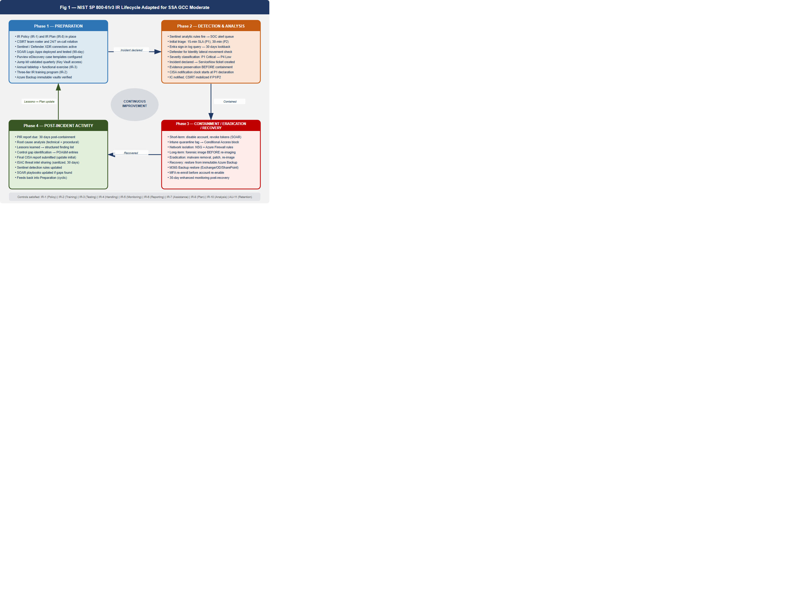
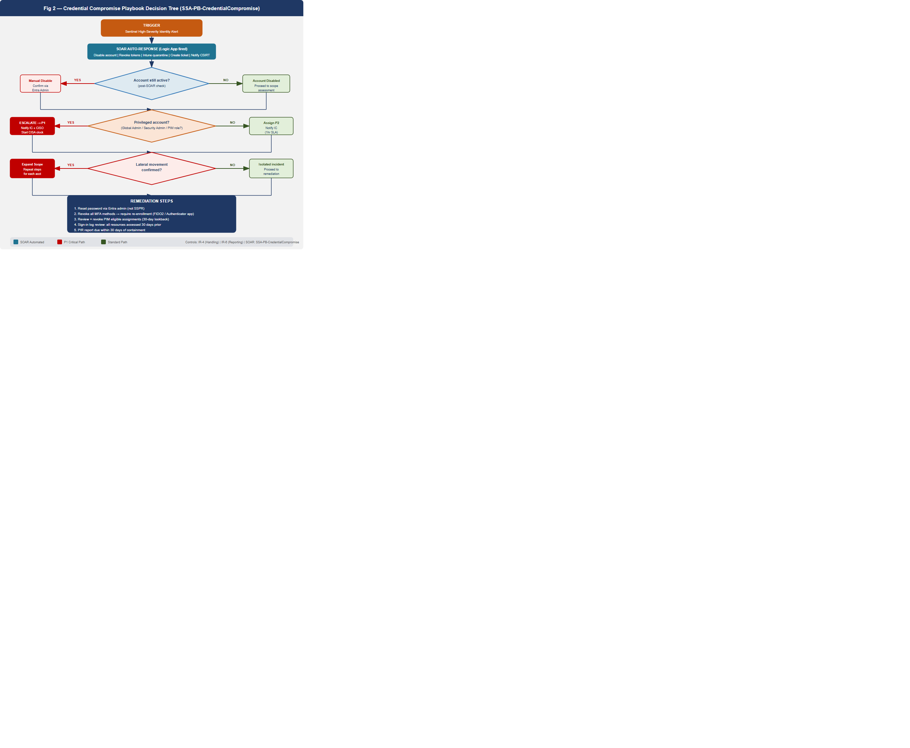
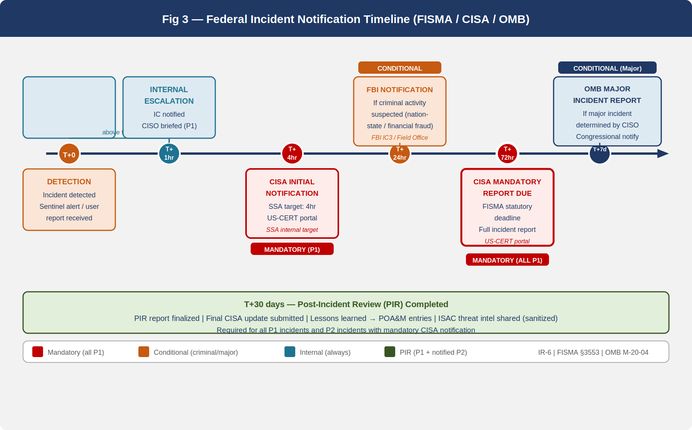
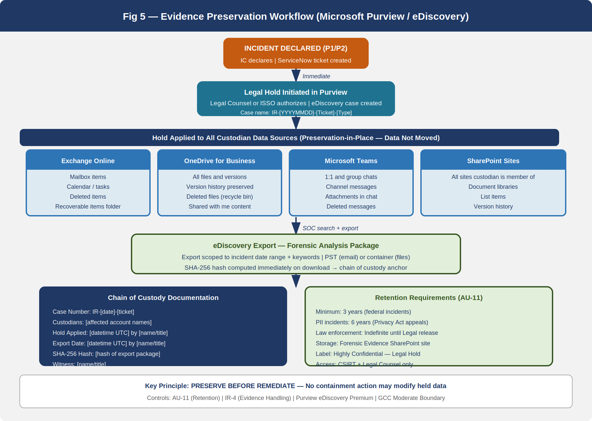

::: {.fouo-banner}
INTERNAL — NOT FOR PUBLIC DISTRIBUTION
:::

::: {.callout-important}
**Series Context** — This is Part 19 of the 27-book Federal Application-Aware Networking series (Books 00–26). Parts 1–6 establish Landing Zone IPAM/DDI/PKI, Namespace-Anchored Trust, Network Access Control, DNS Security, Federal Network Modernization, and Federal Telecommunications/ZTNA. Parts 7–10 address PAM, Endpoint/EDR, Data Protection (Purview), and Remote Access. Parts 11–13 address SQL Server authentication and database consolidation. Parts 14–16 address Secrets Management, Vulnerability Management, and VM/ConMon. Part 17 addresses Data Protection (Book 17). Part 18 addresses SIEM/XDR detection. **This Part 19** activates the respond capability: incident response planning, federal playbooks, mandatory CISA notification, SOAR automation, evidence preservation, and post-incident review — closing the IR control family. Part 20 addresses Business Continuity; Part 21 Supply Chain Risk; Parts 22–26 complete the authorization package.
:::

# What This Document Addresses

Part 18 of this series (SIEM/XDR Detection) establishes the *detection* capability: Microsoft Sentinel ingests signals from every layer of the SSA cloud environment, correlates them against MITRE ATT&CK-aligned detection rules, generates high-fidelity alerts, and surfaces them to the Security Operations Center. Detection without a structured respond capability is instrumentation without consequence. An alert that identifies a compromised privileged account is valuable only if the organization can act on it faster than the adversary can exploit it.

This document activates the respond capability. It defines the IR program structure required to satisfy NIST SP 800-53 Rev 5 controls IR-1 through IR-10 and the audit retention control AU-11, all of which remain open after Part 18. The document covers four layers of operational readiness:

1. **Program structure** — the IR policy (IR-1), the written IR plan (IR-8), and the cross-functional IR team with defined roles and responsibilities
2. **Lifecycle procedures** — the NIST SP 800-61 Rev 3 IR lifecycle adapted to SSA's Microsoft 365 GCC / Azure Government environment
3. **Federal playbooks** — four scenario-specific playbooks (credential compromise, ransomware, data exfiltration, insider threat) with decision trees and automated first-response sequences
4. **Federal notification obligations** — the CISA 72-hour rule, FBI coordination, OMB major incident reporting, and ISAC channel requirements

::: {.callout-note}
**Relationship to Part 18** — Sentinel and Defender XDR generate the alerts that trigger every playbook in this document. IR practitioners should read Part 18 before implementing the procedures here. Specifically, the Sentinel alert severity classifications, the analytic rule naming conventions, and the Defender for Identity alert categories used in the credential compromise playbook are defined in Part 18.
:::

# IR Program Foundation

## IR Policy and Procedures — IR-1

NIST SP 800-53 Rev 5 IR-1 requires a formal, organization-level IR policy that is reviewed and updated at a defined frequency, and subordinate procedures that translate policy into actionable steps. The policy must address the purpose, scope, roles, responsibilities, management commitment, and coordination among organizational entities.

The SSA IR Policy is a Tier 1 document owned by the CISO. It establishes:

- **Purpose**: To minimize the impact of security incidents on SSA operations, data, and mission delivery by ensuring the agency can detect, contain, eradicate, recover from, and learn from security events in a repeatable, documented manner.
- **Scope**: All SSA information systems operating under the GCC Moderate Authorization to Operate (ATO), including Microsoft 365 GCC workloads, Azure Government IaaS/PaaS, on-premises network infrastructure in SSA-managed data centers, and third-party managed services operating under SSA ISAs.
- **Review cycle**: Annual review with ad hoc updates triggered by any PIR that identifies a policy gap, any FedRAMP significant change, or any change in CISA binding operational directives that affect IR obligations.
- **Approval authority**: CISO signature required; CIO concurrence required for changes that affect notification timelines.

The subordinate SSA IR Procedures document (Tier 2) operationalizes the policy across the NIST 800-61r3 lifecycle phases. Both documents are stored in the SSA GCC SharePoint site under the Records Management library with sensitivity label "Confidential — Internal Use" and legal hold applied as described in Section 8.

## IR Team Structure

The SSA Computer Security Incident Response Team (CSIRT) is a standing, cross-functional body. It activates in full at P1/P2 severity and operates in monitoring posture for P3/P4 events. The standing roles are:

| Role | Individual | Responsibility |
|------|------------|----------------|
| Incident Commander (IC) | ISSO (primary); CISO (P1 escalation) | Declares incident severity, owns timeline, authorizes containment actions |
| SOC Lead | SOC Manager | Coordinates technical investigation, Sentinel/Defender triage |
| SOC Analyst (on-call) | Rotates weekly | Initial alert triage, first-response SOAR validation |
| Legal Counsel | SSA OGC representative | Legal hold initiation, law enforcement coordination, privilege assessment |
| Communications Lead | SSA OCPL representative | Internal and external communications, congressional notification if required |
| Privacy Officer | SSA SAOP designee | PII/Privacy Act impact assessment, Privacy Incident Report if triggered |
| IT Operations Lead | Network/Systems SME | Isolation execution, backup assessment, recovery coordination |
| CISO | Agency CISO | Executive escalation, OMB notification approval, after-action authority |
| HR Liaison | SSA HR (insider threat events) | Employee relations coordination, administrative action authorization |

The CSIRT maintains a 24/7 on-call rotation for P1 and P2 events. On-call contacts are maintained in the SSA ServiceNow On-Call Management module and validated monthly.

## Incident Severity Classification

SSA uses a four-tier severity model aligned with CISA's National Cyber Incident Scoring System (NCISS) and FedRAMP Moderate impact:

| Priority | Label | Criteria | SOC Response SLA | IC Notification SLA |
|----------|-------|----------|------------------|---------------------|
| P1 | Critical | Active data exfiltration confirmed; ransomware spreading; privileged credential compromise with lateral movement; system unavailability affecting mission-critical benefit delivery | 15 minutes | Immediate |
| P2 | High | Suspected privilege escalation; phishing campaign with confirmed clicks; malware isolated on single endpoint; single account compromise | 30 minutes | 1 hour |
| P3 | Medium | Policy violation (DLP alert, conditional access block); unusual sign-in patterns without confirmed compromise; failed brute force | 2 hours | Next business day |
| P4 | Low | Informational alerts; false positive review; user-reported suspicious email not confirmed malicious | 8 hours | Weekly summary |

P1 events trigger mandatory CISA notification (see Section 7). P2 events may trigger CISA notification depending on scope. P3/P4 events are logged and reviewed at weekly SOC stand-up.

# NIST SP 800-61 Rev 3 IR Lifecycle at SSA

{#fig-ir01 fig-alt="Circular diagram showing four IR lifecycle phases: Preparation, Detection and Analysis, Containment Eradication and Recovery, and Post-Incident Activity, with SSA-specific annotations." width="100%"}

The lifecycle shown in @fig-ir01 is not a one-time sequence. Each incident generates lessons that feed back into preparation, updating playbooks, improving detection rules, and identifying control gaps for the POA&M.

## Phase 1 — Preparation

Preparation is the only phase that occurs before an incident is declared. It encompasses every activity that reduces the cost and impact of the respond-phase activities.

**IR Plan maintenance**: The SSA IR Plan (the Tier 2 document described in IR-8, Section 5) is reviewed annually and after each P1 incident. The plan documents the incident classification criteria, escalation paths, communication templates, and the contact lists that enable rapid mobilization.

**Tooling readiness**: Preparation ensures that every tool required during response is pre-configured and tested before it is needed under pressure:

- Microsoft Sentinel: All data connectors active, analytic rules tuned, SOAR playbooks (Logic Apps) deployed and tested in the last 90 days
- Microsoft Defender XDR: Defender for Identity, Defender for Endpoint, Defender for Cloud Apps, and Defender for Office 365 all enrolled and alert-generating
- Microsoft Purview: eDiscovery cases and custodian management configured for rapid legal hold initiation
- ServiceNow: IR ticket template deployed, on-call routing configured, SOAR integration active
- Secure communication channel: Dedicated Microsoft Teams channel ("SSA-CSIRT-Bridge") for incident coordination, separate from standard SSA Teams to avoid potential contamination if a Teams compromise is suspected

**Training and testing**: IR-2 requires IR training for all personnel with IR responsibilities. IR-3 requires annual testing. Section 9 details both requirements.

**Jump kit**: A documented set of pre-approved scripts, PowerShell modules, and access credentials (stored in Azure Key Vault under break-glass procedures from Part 16) that IR practitioners can execute during containment without waiting for change advisory board approval. The jump kit is reviewed quarterly.

## Phase 2 — Detection and Analysis

Detection originates in Part 18 (SIEM/XDR). The analysis sub-phase begins when a Sentinel alert or direct user report reaches the SOC queue. The analysis workflow proceeds as follows:

1. **Initial triage** (SOC Analyst, target: 15 minutes from alert generation): Confirm alert is not a known false positive. Check Sentinel alert entity map for affected users, devices, and IPs. Query the Sentinel Log Analytics workspace for correlated events in the prior 72 hours. Assign initial severity.

2. **Scope determination** (SOC Lead, target: 30 minutes from initial triage): Determine whether the event affects a single user/device (contained scope) or shows evidence of lateral movement (expanded scope). Lateral movement indicators include:
   - Multiple Azure AD sign-in events from disparate geographies within a short time window
   - PIM elevation from accounts that do not normally use privileged roles
   - Defender for Identity alerts: Pass-the-Hash, Pass-the-Ticket, Overpass-the-Hash, LDAP reconnaissance
   - Defender for Cloud Apps anomaly alerts indicating impossible travel or mass download

3. **Incident declaration**: If scope determination confirms a security event (not a false positive), the SOC Lead creates an IR ticket in ServiceNow and notifies the Incident Commander. The IC formally declares the incident and assigns a priority level. From this moment, the notification clock starts for CISA and other mandatory reporting.

4. **Evidence capture initiation**: As soon as an incident is declared, the SOC Analyst initiates evidence preservation (Section 8) before any containment actions that might alter evidence. This sequencing — preserve before remediate — is a hard procedural requirement.

## Phase 3 — Containment, Eradication, and Recovery

Containment strategy is determined by the incident type and the trade-off between operational impact and adversary dwell time. SSA uses a **short-term / long-term containment** model:

**Short-term containment** (goal: stop bleeding within the first hour):
- Disable affected Entra ID accounts via Azure AD portal or PowerShell (automated via SOAR for high-confidence alerts)
- Revoke active refresh tokens for affected accounts (SOAR automated)
- Apply Intune compliance quarantine tag to affected devices (removes access to conditional access-protected resources)
- Block source IP addresses at Azure Firewall and network security groups if confirmed malicious

**Long-term containment** (goal: hold adversary position while preparing eradication):
- Preserve affected systems in current state for forensic imaging before re-imaging
- Apply network microsegmentation rules to isolate affected workloads
- Monitor for adversary pivot attempts using enhanced Sentinel alert thresholds
- Rotate all service account passwords and API keys that may have been exposed

**Eradication**:
- Remove malware, persistence mechanisms, and unauthorized accounts
- Re-image compromised endpoints using Intune autopilot deployment
- Patch the vulnerability or misconfiguration that enabled the incident
- Validate that eradication is complete using Defender for Endpoint threat hunt queries

**Recovery**:
- Restore from the most recent known-good backup. SSA uses Azure Backup with immutable vaults (backup retention: 90 days, soft-delete: 14 days) and Microsoft 365 Backup for Exchange, SharePoint, and OneDrive.
- Validate restored data integrity via hash comparison against last known-good state
- Re-enable accounts only after MFA re-enrollment is complete and device compliance is confirmed
- Conduct enhanced monitoring for 30 days post-recovery to detect adversary re-entry

## Phase 4 — Post-Incident Activity

Every declared incident (P1 through P3) requires a Post-Incident Review (PIR). P1 incidents require a formal PIR report. Section 10 describes the PIR format and the process for translating lessons learned into POA&M entries.

# Incident Response Plan — IR-8

The SSA IR Plan is the Tier 2 document that provides the operational narrative for executing the lifecycle described in Section 3. NIST SP 800-53 Rev 5 IR-8 requires the plan to:

- Provide the organization with a roadmap for implementing the IR capability
- Describe the structure and organization of the IR capability
- Provide a high-level approach for how the IR capability fits into the overall organization
- Meet the unique requirements of the organization as they relate to mission, size, structure, and functions
- Define reportable incidents
- Provide metrics for measuring the IR capability
- Define resources and management support needed for the IR capability
- Address sharing of IR information
- Be reviewed and updated at a defined frequency

The SSA IR Plan document satisfies these requirements in the following sections:

**Section 1 — Purpose and Scope**: Defines the plan's applicability to all SSA GCC Moderate-authorized systems.

**Section 2 — IR Team and Roles**: Mirrors the CSIRT structure in Section 2 of this book.

**Section 3 — Incident Definitions**: Defines what constitutes a reportable incident under FISMA (any actual or suspected unauthorized access, use, disclosure, modification, or destruction of SSA information or information systems), distinguishes incidents from events, and maps incident types to the four playbooks in Section 6.

**Section 4 — Metrics**: SSA tracks the following IR KPIs on a monthly basis, reported to the CISO:
- Mean Time to Detect (MTTD): measured from adversary action to Sentinel alert
- Mean Time to Contain (MTTC): measured from incident declaration to containment confirmation
- Mean Time to Recover (MTTR): measured from containment to system restoration
- CISA notification timeliness: percentage of P1 incidents reported within 72 hours
- PIR completion rate: percentage of P1/P2 incidents with completed PIR within 30 days

**Section 5 — Resources**: Documents the Sentinel workspace, Defender XDR licenses, Purview eDiscovery, ServiceNow ITSM, and the jump kit described in Section 3.1.

**Section 6 — IR Information Sharing**: Defines the channels and classifications for sharing IR information internally (CSIRT-Bridge Teams channel), with CISA (US-CERT web portal), with law enforcement (FBI IC3 and field office), and with the Federal SSA ISAC.

The IR Plan is stored in SharePoint, version-controlled, and reviewed annually. The CISO signs the annual review attestation.

# IR Training and Testing

## IR Training — IR-2

NIST SP 800-53 Rev 5 IR-2 requires the organization to provide IR training to system users consistent with their assigned roles and responsibilities, and to review and update training at defined frequencies.

SSA's IR training program is tiered by role:

**Tier 1 — All SSA Staff**: Annual IR awareness training covering how to recognize and report a security incident, the SSA Help Desk reporting number (x4800), and the prohibition on independently investigating or remediating a suspected incident. Delivered via the SSA Learning Management System (LMS). Completion is tracked and tied to account access provisioning (accounts are flagged after 30 days of non-completion). This training satisfies the AT-2 annual awareness requirement as well.

**Tier 2 — IT and System Administrators**: Annual hands-on training covering the containment procedures for their specific administrative domain (e.g., Exchange admins train on mailbox isolation and legal hold; network admins train on firewall rule deployment and NSG modification; Azure admins train on Entra account disable and PIM revocation). Delivered via instructor-led sessions recorded in the LMS.

**Tier 3 — CSIRT Members**: Quarterly training covering current threat intelligence, playbook updates, and tabletop exercise participation. Includes at least one simulated incident scenario per quarter using Sentinel alert injection into the non-production tenant.

Training records are maintained in the SSA LMS with a minimum retention of 3 years, satisfying AU-11 requirements for this control family.

## IR Testing — IR-3

NIST SP 800-53 Rev 5 IR-3 requires the organization to test the IR capability using defined tests and exercises at defined frequencies. For FedRAMP Moderate, this means at a minimum an annual tabletop exercise. SSA conducts:

**Annual Tabletop Exercise**: A structured, facilitated exercise in which CSIRT members and key stakeholders walk through a realistic incident scenario without actually executing system changes. The exercise tests:
- Incident declaration and escalation procedures
- Communication flows (internal escalation, CISA notification, OMB reporting)
- Decision-making under ambiguity (incomplete information, adversary deception)
- Legal hold initiation
- Media and congressional inquiry handling

The tabletop uses a scorecard with the following dimensions:

| Dimension | Scoring Criteria | Max Points |
|-----------|-----------------|------------|
| Speed | Was each milestone reached within the target SLA? | 25 |
| Completeness | Were all required notifications and actions taken? | 25 |
| Communication | Was internal communication clear and documented? | 20 |
| Evidence Handling | Was evidence preserved before containment actions? | 15 |
| Lessons Learned | Did participants identify at least 3 actionable improvements? | 15 |

**Annual Functional Exercise** (P1 scenario): SSA conducts one full functional exercise per year in which the actual SOAR playbooks are executed against simulated alert data in the non-production tenant. This validates that Logic Apps trigger correctly, that SOAR actions (account disable, session revoke, Intune quarantine) complete successfully, and that ServiceNow ticket creation and Teams notification function as designed.

Exercise results are documented in the SSA Test and Evaluation Report, submitted to the AO as part of annual ConMon reporting. Identified deficiencies become POA&M items.

# IR Playbooks

## Overview

SSA maintains four mandatory federal IR playbooks. Each playbook follows a common structure: trigger definition, severity assignment, decision tree, step-by-step procedures, automated actions, evidence requirements, and notification checklist. Playbooks are stored in the CSIRT SharePoint library, reviewed semi-annually, and version-controlled.

## Playbook 1 — Credential Compromise / Account Takeover

{#fig-ir02 fig-alt="Decision tree flowchart showing credential compromise playbook from Sentinel alert trigger through account disable, scope assessment, lateral movement check, and remediation steps including password reset and MFA re-enrollment." width="100%"}

**Trigger**: Sentinel high-severity alert from one of the following sources — Microsoft Entra Identity Protection (Risk Policy: User At Risk, Sign-In At Risk), Defender for Identity (Suspected credential theft, Kerberos anomaly), Defender for Cloud Apps (Impossible travel, Mass download from cloud storage), or user-reported suspicious activity.

**Immediate Actions (0–15 minutes)**:

1. SOC Analyst acknowledges Sentinel alert and opens IR ticket (SOAR-automated)
2. Query Entra sign-in logs for the affected account: last 30 days, focus on successful authentications from unfamiliar IPs or devices, PIM elevation events, and role assignment changes
3. Determine account status: Is the account currently active? If yes, SOAR playbook immediately disables account and revokes refresh tokens (see Section 7 for SOAR detail). If account is already disabled (self-remediated or prior detection), proceed to scope assessment.
4. Determine access scope: Was this a standard user account, or did the account hold privileged roles (Global Admin, Security Admin, Exchange Admin, Privileged Role Admin)?
   - Standard user: Assign P2, proceed to lateral movement check
   - Privileged user: Immediately escalate to P1, notify IC, initiate CISA notification clock

**Scope Assessment (15–60 minutes)**:

5. Query Defender for Identity for lateral movement indicators: Pass-the-Hash, Pass-the-Ticket, NTLM relay, unauthorized LDAP queries from the compromised account
6. Query Sentinel for other accounts that authenticated from the same IP address or device as the compromised account in the prior 14 days
7. Review PIM assignment history: Did the compromised account request or receive role activations in the prior 30 days that were not expected based on the user's normal work pattern?
8. Review Microsoft Defender for Cloud Apps activity log for anomalous cloud app access

**Remediation (1–24 hours)**:

9. Reset account password via Entra admin portal (do not use self-service reset, which may not revoke all tokens immediately)
10. Require MFA re-enrollment: Revoke all existing MFA methods and require re-registration at next sign-in. For privileged accounts, require hardware FIDO2 key or Authenticator app with number matching; SMS/voice is not acceptable for privileged account MFA re-enrollment.
11. Review and revoke all PIM eligible assignment activations from the 30 days prior to the incident. Document which assignments were active and for how long.
12. If lateral movement is confirmed: expand scope to affected accounts; repeat steps 9–11 for each; escalate severity.
13. Conduct sign-in log review for 30 days prior to detection: identify all resources accessed, data downloaded, emails sent, and administrative actions taken by the compromised account. This review is required for the PIR and for CISA notification content.
14. Issue internal notification to affected user's manager and HR (for P1 events, also notify CISO).
15. Complete PIR within 30 days.

**Federal Notification Check**: If compromised account is a privileged user (Global Admin, Security Admin, or any role with standing access to PII repositories), trigger CISA notification (Section 7).

## Playbook 2 — Ransomware

**Trigger**: Defender for Endpoint alert (Ransomware behavior detected), Sentinel custom analytic rule (mass file encryption pattern), user report of encrypted files, or Help Desk ticket cluster indicating sudden inability to open files.

**Immediate Actions (0–15 minutes)**:

1. SOC Analyst confirms ransomware indicator: Are file extensions changing? Is encryption activity spreading across multiple devices/file shares?
2. If confirmed: Immediately declare P1 incident. Notify IC, CISO, IT Operations Lead.
3. Network isolation — critical: Apply Intune device compliance policy to quarantine all devices showing encryption behavior. This removes Conditional Access access to M365 resources. For on-premises hosts, apply firewall rule to block lateral movement at the VLAN boundary.
4. Activate CSIRT full team notification via CSIRT-Bridge Teams channel.

**Isolation Procedure (15–60 minutes)**:

5. Identify the Patient Zero device — the first device showing encryption behavior. Preserve in current state for forensic imaging before any remediation.
6. Map the blast radius: Which file shares, OneDrive folders, SharePoint sites, and Azure file shares have been affected? Use SharePoint audit log and OneDrive Activity Reports.
7. Determine the entry vector: Was this a phishing email (check Defender for Office 365 Threat Explorer), a compromised credential (cross-reference Playbook 1), a vulnerable exposed service (check Azure Defender for Servers alerts), or supply chain compromise (check software inventory)?
8. Cut off the entry vector: Block the sender domain, disable the compromised account, or block the vulnerable service — whichever applies.

**Backup Assessment (1–4 hours)**:

9. Azure Backup vault: Confirm vault is immutable and soft-delete is enabled. Identify the most recent clean recovery point (before the earliest confirmed encryption timestamp from Step 6).
10. Microsoft 365 Backup: Identify the most recent clean backup point for Exchange, SharePoint, and OneDrive content.
11. If recovery points are available and confirmed clean: Proceed to recovery. Document the RPO gap (time between last clean backup and incident onset).
12. If recovery points are contaminated: Escalate to CISO immediately. This constitutes a major incident and requires OMB notification.

**Recovery from Immutable Backup**:

13. Re-image all compromised endpoints via Intune Autopilot (wipe-and-reprovision). Do not restore from device backup — reprovision from clean image only.
14. Restore file share data from Azure Backup immutable vault to clean storage target. Validate integrity via hash comparison.
15. Restore M365 content (mailboxes, SharePoint, OneDrive) via Microsoft 365 Backup restoration workflow.
16. Validate that restored environment is clean using Defender for Endpoint post-recovery scan.
17. Re-enable access progressively (starting with lowest-privileged users) with enhanced monitoring for 30 days.

**Lessons Learned — Mandatory Ransomware PIR Items**:
- Was the entry vector patched within 24 hours of identification?
- Were backup recovery points within RPO targets?
- Was network segmentation effective at containing blast radius?
- Were any backup vaults affected? If yes, immediate remediation of immutability configuration is a P1 POA&M item.

## Playbook 3 — Data Exfiltration

**Trigger**: Microsoft Purview DLP alert (high-severity: PII, CUI, or financial data exfiltration confirmed), Defender for Cloud Apps alert (mass download, unusual data transfer), Sentinel custom analytic rule (large outbound transfer outside business hours), or law enforcement notification.

**Immediate Actions (0–15 minutes)**:

1. SOC Analyst confirms exfiltration alert: Identify the data type (PII, CUI, financial), volume, source user/device, and destination (external email, USB, cloud storage, web upload).
2. Declare P1 if PII or CUI confirmed. Declare P2 if data type is unconfirmed.
3. Do not immediately block the exfiltration channel — preserve the evidence trail. Coordinate with Legal Counsel before taking action that may alter evidence.
4. Initiate legal hold (Section 8) immediately upon P1 declaration.

**Evidence Preservation (15–60 minutes)**:

5. In Microsoft Purview eDiscovery, create a new case: "IR-[YYYYMMDD]-[TicketNumber]-Exfiltration".
6. Add custodians: the source user account and any accounts that accessed the same data in the prior 30 days.
7. Apply hold to: Exchange mailbox, OneDrive for Business, Teams chat, SharePoint sites the user has access to.
8. Do not delete, quarantine, or modify any data under hold without Legal Counsel authorization.
9. Export the DLP alert event detail from Purview Compliance portal. Hash the export file (SHA-256) and document in the chain of custody log.
10. Export Defender for Cloud Apps activity log for the affected user, 30 days prior. Hash and document.

**Legal Hold and Notification**:

11. Legal Counsel assesses whether exfiltration constitutes a Privacy Act breach (Section 208 of E-Government Act) or a FISMA reportable incident.
12. If PII of more than 500 individuals is confirmed: Privacy Officer initiates SSA Privacy Incident Response per the SSA Privacy Program Plan. HHS/SSA senior leadership notification may be required.
13. Initiate CISA notification (Section 7). Include: data type, estimated volume, affected individuals count (if known), likely destination.
14. If destination analysis suggests criminal activity (sale of PII, nation-state actor): notify FBI field office and FBI IC3.

**Containment (1–4 hours)**:

15. After evidence is preserved and Legal Counsel confirms, disable the exfiltration channel: block the external email domain, revoke external sharing in SharePoint, apply Purview DLP endpoint block for USB/cloud upload.
16. Disable the source account and revoke tokens.
17. Assess whether other accounts with similar access permissions show exfiltration indicators.

## Playbook 4 — Insider Threat

**Trigger**: Sentinel behavioral analytics alert (UEBA: anomalous user behavior score exceeding threshold), Defender for Cloud Apps alert (unusual volume of data access or download by authenticated user), Purview Insider Risk Management alert (departing employee data theft indicator, data leak by disgruntled employee), or manager/HR report of suspected misuse.

**Immediate Actions (0–30 minutes)**:

1. SOC Analyst reviews the behavioral alert. Key distinction: insider threat alerts involve authenticated, authorized users exhibiting anomalous behavior — this is different from an external attacker using a compromised account. Do not confuse with Playbook 1.
2. Notify HR Liaison and Legal Counsel immediately — before any action that affects the employee. Insider threat cases have employment law implications that require HR and Legal involvement before account restriction.
3. Do not notify the suspected employee or their direct management chain (risk of evidence destruction).
4. Initiate covert evidence collection: Pull Purview Insider Risk Management activity detail, Defender for Cloud Apps access log, email metadata (not content — content requires Legal authorization).

**Investigation (30 minutes – 24 hours)**:

5. HR Liaison confirms the employee's current status: Active, PIP, resignation submitted, termination pending? The answer affects the urgency of account restriction.
6. Legal Counsel advises on scope of evidence collection: Is content review authorized? Is device forensic imaging authorized?
7. If employee has submitted resignation or is under active HR investigation: Coordinate with HR and Legal on immediate account restriction timeline.
8. Behavioral analysis: Map the timeline of anomalous activity. Correlate with HR events (notice of resignation, performance review, manager change).

**Account Restriction and Forensic Imaging**:

9. With HR and Legal authorization: Disable account access to sensitive repositories (SharePoint, SharePoint PII sites, Azure data stores). Do not fully disable the account if doing so would alert the employee prematurely — coordinate timing with HR.
10. Coordinate forensic imaging of the employee's assigned endpoint. The imaging must follow chain of custody procedures: documented by the IT Operations Lead, witnessed, hash-verified.
11. Preserve all relevant data under Purview legal hold (same procedure as Playbook 3, Step 5–10).
12. Once forensic image is complete and evidence is preserved: Fully disable account and terminate active sessions.

**HR Coordination**:

13. All account restriction and termination actions are coordinated with HR and timed to occur concurrent with or immediately following the HR administrative action (termination meeting, administrative leave notice). This is a hard requirement — IT action that precedes the HR action may create legal liability.
14. PIR includes HR debrief on the procedural coordination. Lessons learned often identify opportunities to improve the offboarding automation (Lifecycle Workflows in Entra ID) to reduce the window between HR action and account disable.

# SOAR Automation

{#fig-ir04 fig-alt="Flowchart showing Sentinel alert triggering Logic App which executes automated actions: disable Entra account, revoke sessions, tag device in Intune, create ServiceNow ticket, notify SOC via Teams. Human approval gate shown before destructive actions." width="100%"}

## Logic Apps Architecture

Microsoft Sentinel SOAR playbooks are implemented as Azure Logic Apps deployed in the SSA Azure Government subscription. Logic Apps are the preferred SOAR mechanism for GCC Moderate because they are natively integrated with Sentinel, operate within the Azure Government boundary (no data leaves the FedRAMP boundary), and can be triggered by Sentinel analytic rule alerts with entity enrichment pre-populated.

The SSA SOAR playbook architecture uses a **hub-and-spoke model**:
- **Hub playbook** (`SSA-IR-Hub`): Receives all high-severity Sentinel alerts, performs initial enrichment (Entra user lookup, Defender device lookup, IP reputation check via Microsoft Threat Intelligence), and routes to the appropriate spoke based on alert type.
- **Spoke playbooks**: Scenario-specific Logic Apps that execute the automated first-response for each incident type.

## Account Takeover Playbook — Automated Steps

The credential compromise SOAR playbook executes the following actions automatically upon receiving a high-confidence Sentinel alert (confidence score ≥ 85):

**Automated (no human approval required)**:
1. Query Entra ID: Confirm account existence and current state
2. Disable Entra ID account (set `accountEnabled: false` via Microsoft Graph API)
3. Revoke all active refresh tokens (`revokeSignInSessions` via Graph)
4. Tag device as "Compromised" in Microsoft Intune (set `managedDeviceComplianceState: noncompliant` via Intune API — triggers Conditional Access block)
5. Create ServiceNow IR ticket (P2 default, escalated to P1 by IC if warranted)
6. Post alert summary to SSA-CSIRT-Bridge Teams channel with entity cards (user, device, source IP, alert name)
7. Add Sentinel comment with automated action summary (for audit trail)

**Human-in-the-loop gate (IC approval required)**:
- Full account deletion (as opposed to disable)
- Network firewall rule changes that affect more than one /24 subnet
- PIM role assignment revocation for shared service accounts
- Any action affecting more than 20 user accounts simultaneously

**Approval workflow**: The Logic App sends an adaptive card to the CSIRT-Bridge Teams channel requesting IC approval. The IC approves or rejects within the Teams interface. The Logic App polls for the response with a 4-hour timeout. If no response is received within 4 hours, the Logic App sends an escalation notification to the CISO.

## SOAR Playbook Catalog

| Playbook Name | Trigger | Automated Actions | Approval Required? |
|--------------|---------|-------------------|-------------------|
| `SSA-PB-CredentialCompromise` | Entra Identity Protection: User At Risk (High) | Disable account, revoke tokens, Intune quarantine, ticket | No (disable); Yes (delete) |
| `SSA-PB-MassDownload` | MDCA: Mass download alert | Revoke cloud app session, create ticket, notify SOC | Yes (block user) |
| `SSA-PB-PhishingEmail` | MDO: High-confidence phish delivered | Soft-delete email, purge from all mailboxes, block sender | No (soft-delete); Yes (hard-delete) |
| `SSA-PB-EndpointCompromise` | MDE: Active malware alert | Isolate device from network via Defender isolation mode | No |
| `SSA-PB-RansomwareBehavior` | MDE: Ransomware behavior | Isolate device, notify CSIRT, create P1 ticket | No |
| `SSA-PB-InsiderRisk` | Purview IRM: Critical severity | Notify SOC + HR + Legal, create ticket | Yes (all account actions) |

All playbooks are stored in the SSA-SOAR resource group in Azure Government. Logic App run history is retained for 90 days in the Log Analytics workspace (AU-11 compliance). Each Logic App execution generates an audit record in Sentinel with the triggering alert ID, the actions taken, and the identity of any human approver.

# Federal Notification Requirements — IR-6

{#fig-ir03 fig-alt="Timeline diagram showing notification milestones: T+0 incident detected, T+1hr internal escalation to CISO, T+4hr CISA notification initiated, T+24hr FBI notification if criminal activity suspected, T+72hr CISA mandatory report submitted, T+7d OMB major incident report, T+30d PIR completed." width="100%"}

## CISA 72-Hour Rule (FISMA)

Under FISMA as amended by the Federal Information Security Modernization Act of 2022, federal agencies must report cybersecurity incidents to CISA within 72 hours of identification. The SSA IR policy adopts a more conservative internal target: CISA notification *initiated* within 4 hours of P1 incident declaration, with the full CISA report submitted within 72 hours.

The CISA reporting channel is the US-CERT web portal (us-cert.cisa.gov). The SSA ISSO maintains credentials for the portal. The submitted report must include:

- Incident date and time (local and UTC)
- Incident type (using CISA's incident category taxonomy)
- Affected systems (count, type, classification level)
- Data type affected (PII, CUI, operational data, infrastructure)
- Estimated scope (number of affected users, data volume if known)
- Current status (contained, uncontained, under investigation)
- Point of contact at SSA

The CISA report is a living document — SSA submits an initial report at T+72 hours and updates it as the investigation progresses. The final report is submitted after PIR completion (T+30 days).

::: {.callout-important}
**CISA BOD 23-01 Interaction** — CISA Binding Operational Directive 23-01 requires federal agencies to enumerate internet-facing assets and report vulnerabilities. If an IR investigation determines that the incident exploited a vulnerability that was known to CISA's CISA KEV (Known Exploited Vulnerabilities) catalog and was not remediated within the BOD 23-01 timeline, SSA must include this in the CISA incident report and initiate an expedited POA&M entry.
:::

## FBI Coordination

When incident analysis indicates criminal activity — including but not limited to: nation-state attribution, financial fraud, identity theft for resale, insider theft for financial gain — SSA coordinates with the FBI through two channels:

1. **FBI Internet Crime Complaint Center (IC3)**: Online complaint submission for cybercrime. Appropriate for incidents where SSA is a victim and seeks investigative referral.
2. **FBI Washington Field Office / Cyber Division**: Direct coordination for major incidents (P1) with nation-state indicators or incidents affecting critical infrastructure dependencies.

Legal Counsel coordinates FBI engagement. SSA does not independently approach FBI media contacts or public affairs offices regarding incidents.

## OMB Major Incident Reporting

OMB Memorandum M-20-04 defines a major incident as one that is "likely to jeopardize — without regard to dollar value — the confidentiality, integrity, or availability of an information system or the information the system processes, stores, or transmits." Under OMB guidance, SSA must report major incidents to Congress through the appropriate House and Senate committees within 7 days.

The OMB major incident determination is made by the CISO with concurrence from SSA leadership. The determination criteria include:
- Exfiltration or confirmed unauthorized access to PII of 100,000 or more individuals
- Confirmed exfiltration of CUI that affects national security equities
- System unavailability affecting SSA benefit payment delivery for more than 8 hours
- Any ransomware event where backups are confirmed affected

## ISAC Reporting

SSA participates in the Multi-State Information Sharing and Analysis Center (MS-ISAC) and coordinates with sector-specific ISACs as appropriate. IR findings — particularly threat intelligence (indicators of compromise, adversary TTPs) derived from incidents — are shared with ISAC partners in a sanitized, agency-identifying format within 30 days of PIR completion. This sharing is voluntary but strongly recommended by CISA and is noted in the FedRAMP KSI-INR-IRR alignment (Section 12).

# Evidence Preservation — AU-11

{#fig-ir05 fig-alt="Flowchart showing evidence preservation process: incident declared triggers legal hold in Purview covering mailbox, OneDrive, Teams, and SharePoint, followed by eDiscovery export with chain of custody documentation and 3-year retention policy." width="100%"}

## AU-11 Audit Record Retention

NIST SP 800-53 Rev 5 AU-11 requires the organization to retain audit records for a defined period to provide support for after-the-fact investigations of security incidents. For SSA GCC Moderate, the required retention is:

- **Minimum**: 1 year active retention, 2 years archive (total 3 years)
- **For incidents involving PII**: 6 years active to support Privacy Act amendment and appeal timelines
- **For incidents under law enforcement investigation**: Indefinite hold until legal counsel authorizes release

Sentinel Log Analytics workspace is configured with a 90-day hot tier and a 2-year archive tier (Basic Logs) using Azure Monitor Log Analytics archive feature. This provides online searchability for the most recent 90 days and cold retrieval for older records, satisfying the AU-11 requirement within the Azure Government boundary.

Microsoft 365 audit logs (Unified Audit Log) are retained for 1 year by default for E3 licenses and 10 years for E5 licenses. SSA GCC licenses include Microsoft 365 E5 Security, providing 10-year audit log retention for M365 services — exceeding the minimum requirement.

## Purview Legal Hold Procedures

Legal hold in Microsoft Purview (Compliance portal → Content Search → eDiscovery → Core eDiscovery or Premium eDiscovery) operates on a custodian model. A custodian is a person whose data is placed on hold. The hold preserves all versions of all content in the custodian's data sources — it does not delete or quarantine; it prevents deletion.

**Legal hold initiation procedure**:

1. Legal Counsel (or ISSO with Legal Counsel authorization) opens the Purview Compliance portal
2. Navigate to eDiscovery → Premium eDiscovery → Cases → New Case
3. Case naming convention: `IR-[YYYYMMDD]-[TicketNumber]-[IncidentType]` (e.g., `IR-20260701-INC0042891-Exfiltration`)
4. Add custodians: the affected user accounts identified by the SOC
5. Data sources to hold (select all applicable):
   - Exchange Online mailbox (including calendar, tasks, deleted items, recoverable items)
   - OneDrive for Business
   - Microsoft Teams chat
   - SharePoint sites the custodian is a member of
6. Apply hold: Custodians receive an automated hold notification (Legal Counsel may suppress if covert investigation)
7. Document in the IR ticket: case name, custodians added, data sources, date/time hold applied, name of person who applied the hold

**eDiscovery export for forensic analysis**:

8. Once hold is confirmed: SOC creates a search within the eDiscovery case scoped to the relevant date range and keywords (malware file names, known-bad email subjects, specific document names)
9. Export results to a PST (for email) or container format (for files)
10. Record the SHA-256 hash of each exported file immediately upon download — this is the chain of custody anchor
11. Store exports in the SSA Forensic Evidence SharePoint site (access-restricted to CSIRT members and Legal Counsel) with sensitivity label "Highly Confidential — Legal Hold"
12. Document chain of custody: who exported, when, from which system, to which storage location, hash value

**Chain of Custody Template**:

| Field | Value |
|-------|-------|
| Case Number | IR-[date]-[ticket] |
| Custodian(s) | [account names] |
| Data Source | Exchange / OneDrive / Teams / SharePoint |
| Date Hold Applied | [datetime UTC] |
| Applied By | [name, title] |
| Export Date | [datetime UTC] |
| Exported By | [name, title] |
| Export Location | [SharePoint URL] |
| SHA-256 Hash | [hash of export package] |
| Witness | [name, title] |

## Retention for IR-Specific Records

In addition to audit log retention, the following IR artifacts are retained for the minimum periods specified:

| Document | Retention Period | Storage Location |
|----------|-----------------|-----------------|
| IR tickets (ServiceNow) | 3 years | ServiceNow archive |
| PIR reports | 3 years | CSIRT SharePoint library |
| CISA notification submissions | 6 years | CSIRT SharePoint library |
| Tabletop exercise records | 3 years | CSIRT SharePoint library |
| Training completion records | 3 years | SSA LMS |
| Legal hold documentation | 6 years (minimum) | Purview eDiscovery |
| Forensic image chain of custody | Life of case + 3 years | Forensic Evidence SharePoint |
| SOAR Logic App run history | 90 days (hot) + archive | Log Analytics workspace |

# Post-Incident Review — IR-4 / IR-5 / IR-10

## PIR Report Structure

Every P1 incident and every P2 incident where notification to CISA was required must produce a written Post-Incident Review (PIR) report within 30 days of incident containment. The PIR report has a standard structure:

**Section 1 — Executive Summary** (1 page): High-level description of the incident, impact, response timeline, and key findings. Written for a non-technical audience (CISO, agency leadership, potentially OMB reviewers).

**Section 2 — Incident Timeline**: Chronological log of all significant events from first detection to full recovery. Timestamps in UTC. Sources cited for each entry (Sentinel alert ID, ServiceNow ticket number, Logic App run ID).

**Section 3 — Root Cause Analysis**: The technical root cause of the incident (not the immediate trigger, but the underlying control failure or vulnerability). For example: "The immediate trigger was a phishing email that delivered credential-harvesting malware. The root cause was a gap in MFA enforcement for legacy authentication protocols that allowed the harvested credentials to be used without MFA challenge."

**Section 4 — Impact Assessment**: Confirmed and estimated impact — data types and volumes affected, systems unavailable, users impacted, estimated recovery cost, and external impact (partner agencies, benefit recipients if applicable).

**Section 5 — Response Assessment**: Evaluation of the IR response against the playbook. Were SLAs met? Were all required notifications made on time? Were containment actions effective? Did SOAR automation perform as designed?

**Section 6 — Lessons Learned**: A structured list of improvements, each with:
- Finding description
- Root cause
- Recommended corrective action
- Owner (ISSO, SOC Lead, IT Operations, HR, Legal)
- Target completion date

**Section 7 — Control Gap Analysis**: For each lesson learned, the PIR author maps the finding to the NIST SP 800-53 control that was inadequate. This mapping becomes the input to the POA&M update.

**Section 8 — POA&M Entries**: Formal POA&M entries (using the SSA POA&M template from Part 16/ConMon) for each control gap identified in Section 7. The PIR author submits these entries to the ISSO for incorporation into the system-level POA&M.

## Incident Monitoring Metrics — IR-5

NIST SP 800-53 Rev 5 IR-5 requires the organization to track and document security incidents. SSA satisfies this through the monthly IR metrics report produced by the SOC Lead and submitted to the CISO. The metrics dashboard is maintained in a Power BI report connected to the Sentinel Log Analytics workspace and the ServiceNow IR ticket data.

Monthly metrics include:
- Total incidents by severity and type (P1-P4, by playbook category)
- MTTD, MTTC, MTTR (mean values and trend vs. prior 12 months)
- CISA notification timeliness (percentage meeting 72-hour requirement)
- PIR completion rate (percentage of required PIRs completed within 30 days)
- SOAR playbook execution rate (percentage of eligible alerts that triggered automated response vs. required manual action)
- Open POA&M items from prior PIRs (count, age, overdue)

## Integrated Information Security Analysis — IR-10

NIST SP 800-53 Rev 5 IR-10 (Integrated Information Security Analysis Team) requires the organization to establish an integrated team of information security professionals tasked with analyzing and advising on security events. The SSA CSIRT structure described in Section 2 satisfies this requirement. The CSIRT's integration with the IR lifecycle, the POA&M process (Part 16), the ConMon program (Part 16), and the SIEM/XDR detection capability (Part 18) constitutes the integrated security analysis function.

The CSIRT meets monthly in standing session to review the metrics dashboard, discuss open incidents, review PIR findings, and assess the state of POA&M remediation. The meeting minutes are retained in the CSIRT SharePoint library for 3 years.

# IR Assistance — IR-7

NIST SP 800-53 Rev 5 IR-7 requires the organization to provide an IR support resource that offers advice and assistance to system users for the handling and reporting of security incidents. SSA satisfies this through two mechanisms:

**Internal IR Assistance**: The SSA Help Desk (ext. 4800, open 24/7) is the primary user-facing channel for incident reporting. Help Desk staff are trained to ask the four key triage questions (What did you see? When did you see it? What system or account was involved? Have you clicked anything or taken any other action?), create a ServiceNow ticket, and immediately escalate any confirmed or suspected security incident to the SOC on-call queue. The Help Desk script is reviewed semi-annually and updated after any PIR that identifies a Help Desk triage failure.

**External IR Assistance**: For major incidents (P1) exceeding the SSA SOC's investigative capacity, SSA has a pre-established Incident Response Retainer with a third-party DFIR (Digital Forensics and Incident Response) provider. The retainer provides:
- 24/7 expert escalation support
- Forensic imaging capability for physical evidence
- Expert witness availability for law enforcement proceedings
- Malware reverse engineering support for novel threats

The retainer agreement is reviewed annually by Legal Counsel and the CISO. The third-party provider operates under a current FedRAMP Moderate ATO and has signed an ISA with SSA. The provider's personnel undergo background checks consistent with SSA's contractor screening requirements.

---

# NIST SP 800-53 Rev 5 Control Closure Summary

The following table summarizes the control closure achieved by this document. "Before" represents the posture documented in Part 18 and prior books. "After" represents the posture achieved by fully implementing the procedures in this document.

| Control | Control Name | Before (Post-Part 18) | After (This Document) | Evidence Artifact |
|---------|-------------|----------------------|----------------------|-------------------|
| IR-1 | Incident Response Policy and Procedures | Partially Met — SOC procedures exist but no formal IR policy document | Met — IR Policy (Tier 1) and IR Procedures (Tier 2) documents drafted, approved, and in review cycle | IR Policy, IR Procedures document |
| IR-2 | Incident Response Training | Partially Met — General security awareness training exists | Met — Three-tier IR training program (Tier 1 all staff, Tier 2 IT admins, Tier 3 CSIRT) with LMS tracking | LMS training records, training curriculum |
| IR-3 | Incident Response Testing | Not Met — No documented IR testing program | Met — Annual tabletop exercise + annual functional exercise with SOAR test; scorecard documented | Tabletop exercise records, functional exercise after-action report |
| IR-4 | Incident Handling | Partially Met — SOC procedures ad hoc; no written playbooks | Met — Four federal playbooks (credential compromise, ransomware, exfiltration, insider threat) with decision trees and documented procedures | Four playbook documents; ServiceNow IR ticket template |
| IR-5 | Incident Monitoring | Partially Met — Sentinel dashboards exist but no formal metric reporting | Met — Monthly IR metrics report (MTTD, MTTC, MTTR, CISA timeliness) submitted to CISO; Power BI dashboard | Monthly IR metrics reports |
| IR-6 | Incident Reporting | Not Met — No documented CISA notification procedure; no OMB major incident determination process | Met — CISA 72-hour reporting procedure documented; FBI coordination procedure; OMB major incident criteria defined; ISAC sharing process | CISA notification procedure; sample notification templates |
| IR-7 | Incident Response Assistance | Partially Met — Help Desk exists but no documented DFIR retainer | Met — Help Desk triage script; DFIR retainer in place with FedRAMP ATO'd provider | Help Desk script; DFIR retainer agreement |
| IR-8 | Incident Response Plan | Not Met — No written IR Plan document | Met — IR Plan document satisfying all IR-8 content requirements, reviewed annually, version-controlled | SSA IR Plan document |
| IR-10 | Integrated Information Security Analysis | Not Met — No integrated CSIRT with cross-functional membership | Met — CSIRT charter with defined membership (ISSO, SOC, Legal, Comms, Privacy, HR, CISO), monthly standing meeting | CSIRT charter; meeting minutes |
| AU-11 | Audit Record Retention | Partially Met — Sentinel 90-day hot; M365 audit log 1 year | Met — Sentinel 90-day hot + 2-year archive; M365 audit 10 years (E5); Purview eDiscovery legal hold for incident evidence; documented retention schedule | Log Analytics workspace configuration; M365 audit log policy; retention schedule |

---

::: {.callout-note}
**FedRAMP 20x KSI Alignment**

This document directly addresses the FedRAMP 20x Key Security Indicators for Incident Response and Recovery (KSI-INR-IRR). The KSI-INR-IRR indicators require continuous, automated evidence of:

- **KSI-INR-IRR-1 (IR Plan)**: An IR plan exists and is reviewed annually. Satisfied by the SSA IR Plan (Section 5) with annual CISO attestation.
- **KSI-INR-IRR-2 (IR Testing)**: Annual tabletop exercise conducted and results documented. Satisfied by Section 9.2 with annual exercise records submitted to AO.
- **KSI-INR-IRR-3 (Incident Monitoring)**: Incidents tracked and metrics reported. Satisfied by Section 10.2 monthly metrics to CISO, fed into ConMon package.
- **KSI-INR-IRR-4 (CISA Notification)**: P1 incidents reported to CISA within 72 hours. Satisfied by Section 7.1 with CISA submission records as evidence artifact.
- **KSI-INR-IRR-5 (Evidence Preservation)**: Legal hold and chain of custody procedures in place. Satisfied by Section 8.2 Purview eDiscovery procedures.

FedRAMP 20x continuous monitoring shifts from point-in-time evidence collection to automated, continuous validation. SSA satisfies this requirement through the Sentinel → ServiceNow → Power BI metrics pipeline, which provides real-time and trended IR performance data without requiring manual evidence extraction at assessment time.
:::

---

*Previous: Part 18 — SIEM and XDR: Microsoft Sentinel, Defender XDR, and Continuous Threat Detection — establishing the detection capability that feeds every playbook in this document. Next: Part 20 — Business Continuity and Disaster Recovery: FISMA Contingency Planning, Azure Site Recovery, and RTO/RPO Validation — extending the recovery discipline from individual incidents to full system contingency scenarios.*
