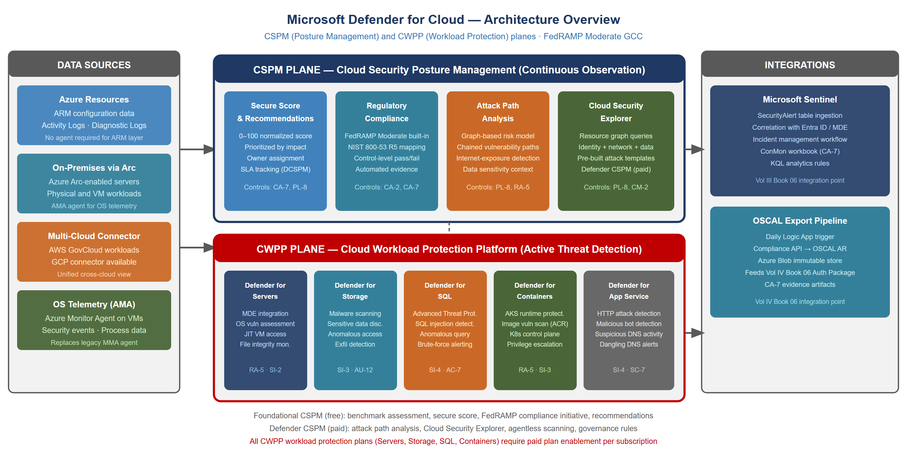
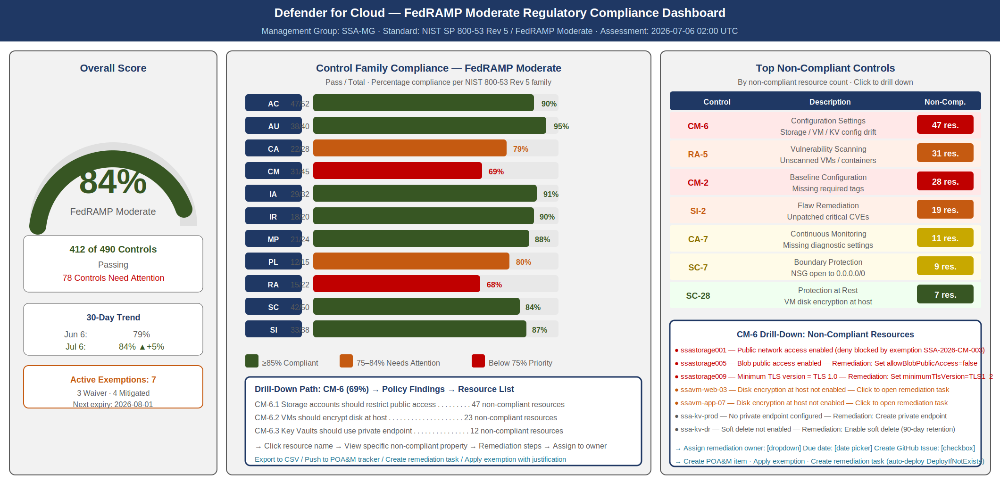
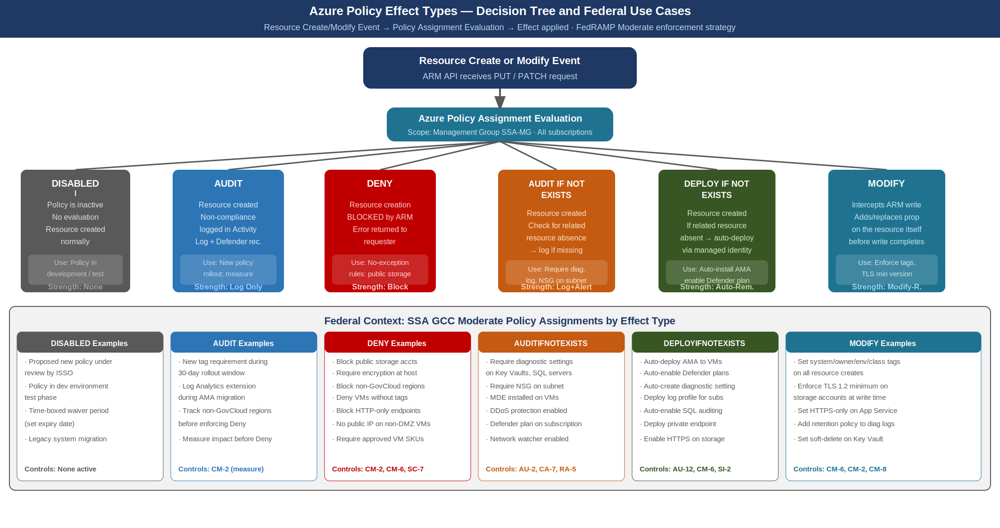
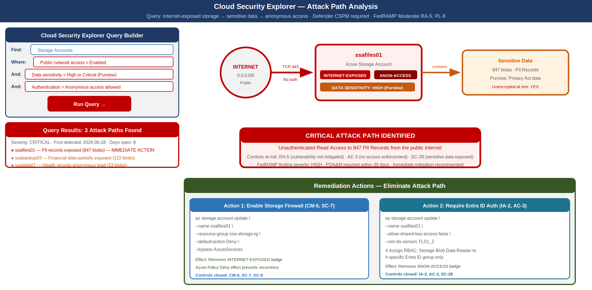
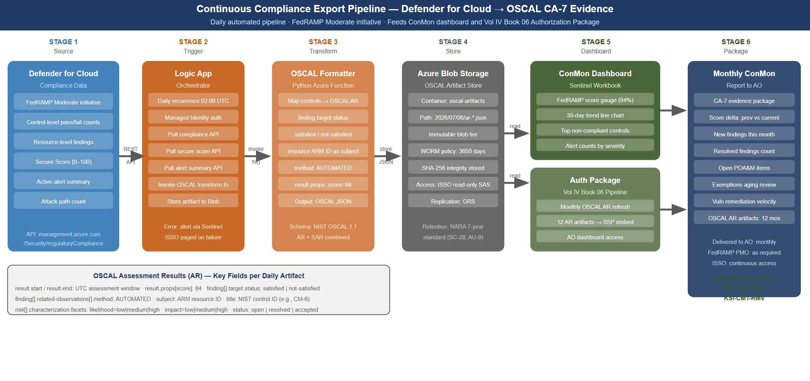

::: {.fouo-banner}
INTERNAL — NOT FOR PUBLIC DISTRIBUTION
:::

::: {.callout-important}
**Series Context** — This document is Part 22 of the 27-part Federal Application-Aware Networking series. Parts 1–5 establish the infrastructure foundation: Landing Zone IPAM/DDI/PKI, Namespace-Anchored Trust, Network Modernization, DNS Security, and Federal Telecommunications Modernization. Parts 6–10 cover Zero Trust Network Access, Remote Access, Email and Collaboration Security, Data Protection, and SIEM/XDR Detection Engineering. Parts 11–16 address Business Continuity, Supply Chain Risk Management, Program Management/Governance, PII Processing, Cybersecurity Training, and Authorization Package/ConMon. Parts 17–21 cover Network Access Control, Secrets Management, Virtual Machine Security, Privileged Access Management, and additional identity controls. This part — Part 22 — provides the continuous visibility layer that confirms all controls deployed in Parts 1–21 remain in their configured state and surfaces drift before it becomes an assessor finding. Parts 23–26 address Program Management integration, PII processing, Security Awareness, and the final Authorization Package.
:::

# What This Document Addresses

Parts 1 through 21 of this series deploy technical controls. Each part installs a component — a PKI hierarchy, a DNS security layer, a Zero Trust network policy, a Privileged Access Management gateway, a Secrets vault, a vulnerability scanner — and leaves that component in a known-good configuration. The authorization package assembled in Part 26 will attest that every control is implemented and effective.

There is, however, a structural gap between deploying a control and proving that the control remains deployed in its authorized configuration 180 days later. Azure environments are dynamic. Administrators make configuration changes. New resources are provisioned without the required tags, encryption settings, or diagnostic log configurations. Service principals accumulate permissions beyond their intended scope. Public network access is re-enabled on a storage account for a temporary test and never disabled. These changes are individually small and individually defensible; in aggregate they represent configuration drift that erodes the security posture that the authorization was granted against.

Cloud Security Posture Management (CSPM) is the discipline of continuously evaluating the actual state of an environment against a defined security baseline and producing a prioritized, evidence-backed picture of where the environment deviates from that baseline. Microsoft Defender for Cloud is the CSPM platform for SSA's Azure GCC Moderate environment. Azure Policy is the enforcement mechanism that prevents certain classes of drift from occurring at all. Together, these two capabilities provide the continuous monitoring substrate required by CA-7 and the automated assessment evidence required by CA-2.

::: {.callout-note}
**Scope Boundary** — This document addresses cloud resource posture management: the configuration state of Azure resources, operating system vulnerabilities, container runtime security, and SQL database threat protection. Network security posture (firewall policy, DNS filtering, SD-WAN path integrity) is addressed in Parts 1–6. Endpoint posture (MDE health, compliance policy) is addressed in Part 8. Identity posture (Conditional Access, PIM assignments, privileged role holders) is addressed in Parts 14 and 17. CSPM in this document provides the cross-cutting correlation layer that aggregates signals from all those domains into a unified compliance view.
:::

# Defender for Cloud Architecture

## Two-Plane Model

Microsoft Defender for Cloud operates on two distinct planes that serve different but complementary purposes. Understanding the boundary between the planes is essential for correct capability deployment, cost planning, and control mapping.

**The CSPM plane** — Cloud Security Posture Management — provides visibility, assessment, and recommendation. It evaluates resource configurations against security benchmarks and regulatory compliance initiatives, computes a Secure Score, identifies attack paths through graph-based analysis, and surfaces improvement recommendations prioritized by impact. The CSPM plane does not block resource operations; it observes and reports. The foundational CSPM tier is included at no additional cost for all Azure subscriptions.

**The CWPP plane** — Cloud Workload Protection Platform — provides threat detection and active protection for specific workload types: virtual machines, containers, storage accounts, SQL databases, and App Service instances. CWPP features require enabling Defender plan extensions (paid) for each workload type. CWPP integrates with Microsoft Defender for Endpoint (MDE) for OS-level telemetry, performs just-in-time VM access control, and generates security alerts that flow into Microsoft Sentinel for correlation.

The two planes share a data foundation: they both ingest from Azure Resource Manager (ARM) configuration data, Azure Activity Logs, diagnostic logs from resources, and OS-level data from the Log Analytics Agent (or Azure Monitor Agent) installed on virtual machines.

{#fig-cspm01 fig-alt="Architecture diagram showing two horizontal planes. Top plane labeled CSPM contains four boxes: Secure Score and Recommendations, Regulatory Compliance (FedRAMP Moderate), Attack Path Analysis, and Cloud Security Explorer. Bottom plane labeled CWPP contains five boxes: Defender for Servers (MDE integration, OS vulnerability), Defender for Storage (malware scan, sensitive data), Defender for SQL (ATP, query anomaly), Defender for Containers (AKS runtime), and Defender for App Service. Left side shows three data source pillars feeding both planes: Azure Resources (ARM/policy), On-Premises via Arc, and Multi-Cloud via Connector. Right side shows two integration outputs: Microsoft Sentinel (alerts and compliance events) and OSCAL Export (CA-7 continuous monitoring artifacts). Arrows flow from data sources up into both planes, and from both planes rightward into integrations." width="100%"}

## Foundational CSPM vs. Defender CSPM

Defender for Cloud offers two tiers of CSPM capability:

**Foundational CSPM (free)** is enabled automatically for all Azure subscriptions. It provides the Microsoft Cloud Security Benchmark (MCSB) assessment, basic Secure Score, security recommendations for misconfigured resources, the FedRAMP Moderate regulatory compliance initiative (read-only assessment), and resource inventory. For a FedRAMP Moderate environment, Foundational CSPM alone satisfies the minimum bar for CA-7 continuous monitoring evidence collection.

**Defender CSPM (paid, per-billable-resource)** adds attack path analysis, Cloud Security Explorer graph queries, agentless vulnerability scanning (no Log Analytics Agent required), data sensitivity context, governance and workflow automation, and enhanced regulatory compliance with custom initiative support. For SSA GCC Moderate, Defender CSPM is required to support the attack path analysis capability (Cloud Security Explorer) described in Section 6 and to enable agentless scanning for resources where the Log Analytics Agent cannot be deployed.

| Capability | Foundational CSPM | Defender CSPM |
|---|---|---|
| Microsoft Cloud Security Benchmark | Yes | Yes |
| FedRAMP Moderate regulatory compliance | Yes | Yes |
| Secure Score | Basic | Enhanced |
| Security recommendations | Yes | Yes |
| Attack path analysis | No | Yes |
| Cloud Security Explorer | No | Yes |
| Agentless VM vulnerability scan | No | Yes |
| Data sensitivity (Purview integration) | No | Yes |
| Governance rules and SLA tracking | No | Yes |
| Custom initiatives | Limited | Full |

: Foundational CSPM vs. Defender CSPM Feature Comparison {.striped .hover}

## Data Connectivity

Defender for Cloud collects data from four source types:

**Azure native resources.** ARM configuration data is collected automatically without agent deployment. Storage account access settings, Key Vault network policies, virtual network security groups, and diagnostic log configurations are assessed through ARM API queries on a continuous basis. No agent is required for ARM-layer posture assessment.

**On-premises servers via Azure Arc.** Physical or virtual servers in SSA's on-premises data centers can be enrolled in Azure Arc, projecting them into Azure Resource Manager as Arc-enabled servers. Once Arc-enrolled, the server appears in Defender for Cloud inventory and receives the same OS vulnerability assessment and Defender for Servers protections as an Azure VM. For hybrid environments, Arc is the required connectivity mechanism.

**Multi-cloud via connector.** Defender for Cloud supports native connectors for AWS and GCP environments. SSA's GCC Moderate environment is primarily Azure-native, but any AWS GovCloud workloads can be connected through the multi-cloud connector to provide a unified cross-cloud compliance view.

**OS-level telemetry via Azure Monitor Agent.** Defender for Servers Plan 2 deploys the Azure Monitor Agent (AMA) to enrolled VMs, collecting OS vulnerability data, security events, and process telemetry. AMA replaces the legacy Log Analytics Agent (MMA) and should be the deployment target for all new VM enrollments.

# FedRAMP Moderate Regulatory Compliance Initiative

## Initiative Architecture

Defender for Cloud provides a built-in regulatory compliance initiative for NIST SP 800-53 Rev 5 and FedRAMP Moderate. These initiatives are Azure Policy initiative definitions that map individual Azure Policy definitions to specific NIST control identifiers. When the initiative is assigned to a subscription or management group, Defender for Cloud evaluates every resource in scope against every policy in the initiative and reports the result as a compliance percentage per control family.

The FedRAMP Moderate built-in initiative contains over 400 policy definitions mapped to the FedRAMP Moderate control baseline. The initiative is automatically updated by Microsoft as new policy definitions are added and as FedRAMP baseline requirements evolve.

To assign the FedRAMP Moderate initiative at the SSA management group level:

```bash
# Assign FedRAMP Moderate built-in initiative to management group
az policy assignment create \
  --name "fedramp-moderate-ssa" \
  --display-name "FedRAMP Moderate — SSA GCC" \
  --policy-set-definition "/providers/Microsoft.Authorization/policySetDefinitions/e95f5a9f-57ad-4d03-bb0b-b1d16db93693" \
  --scope "/providers/Microsoft.Management/managementGroups/SSA-MG" \
  --sku standard \
  --assign-identity \
  --location eastus
```

The `--assign-identity` flag creates a system-assigned managed identity for the assignment, which is required for policies with `DeployIfNotExists` and `Modify` effects to perform automated remediation.

## Compliance Dashboard and Scoring

The FedRAMP Moderate compliance dashboard in Defender for Cloud presents compliance state at three levels of granularity:

**Overall compliance score.** A single percentage representing the ratio of compliant resources to total assessed resources across all controls in the initiative. This is the headline number that ISSO and AO review in monthly ConMon reporting. A new environment typically begins at 40–60% compliance; a well-configured GCC Moderate environment should reach and maintain 80%+ compliance for the FedRAMP Moderate initiative.

**Control family breakdown.** The dashboard decomposes the overall score into control families (AC, AU, CA, CM, IA, IR, MP, RA, SC, SI, etc.) and shows the pass/fail resource count for each family. This view identifies which control families are contributing most to the compliance gap and enables prioritized remediation planning.

**Individual control drill-down.** For each NIST control, the dashboard lists every Azure Policy definition that contributes to that control, the resources assessed against each policy, and the specific findings for non-compliant resources. This is the view that an assessor uses during a CA-2 assessment to verify that specific controls are satisfied.

{#fig-cspm02 fig-alt="Compliance dashboard mockup showing three panels. Left panel: circular gauge showing 84 percent overall compliance with label FedRAMP Moderate and count 412 of 490 controls passing. Center panel: horizontal bar chart showing control families. AC family shows 47 of 52 passing (green bar 90 percent). AU shows 38 of 40 passing (95 percent). CA shows 22 of 28 passing (79 percent, amber). CM shows 31 of 45 passing (69 percent, red). IA shows 29 of 32 passing (91 percent). IR shows 18 of 20 passing (90 percent). RA shows 15 of 22 passing (68 percent, red). SC shows 42 of 50 passing (84 percent). SI shows 33 of 38 passing (87 percent). Right panel: top failing controls table showing CM-6 with 47 non-compliant resources, RA-5 with 31 resources, CM-2 with 28 resources, SI-2 with 19 resources, and CA-7 with 11 resources. Arrow shows drill-down path from control name to specific resource findings." width="100%"}

## Automated Evidence Collection for CA-2

The FedRAMP Moderate initiative in Defender for Cloud provides the technical evidence substrate for CA-2 (Security Assessments). Traditional CA-2 assessments involve a point-in-time review of documentation and a sample-based technical test of control implementation. In an automated CSPM environment, the assessment is continuous and the evidence is machine-generated.

For each control in the FedRAMP Moderate initiative, Defender for Cloud maintains:

- The policy definitions contributing to the control
- The assessment result for every resource in scope (compliant / non-compliant / exempt)
- The timestamp of the most recent assessment
- The specific finding details for non-compliant resources (what property is wrong, what the expected value is)

This data is exportable via the Defender for Cloud REST API, the Defender for Cloud continuous export feature (to Log Analytics or Event Hub), and the Microsoft Secure Score API. The exported data constitutes machine-generated CA-2 evidence that can be included in the authorization package and refreshed on a continuous basis without manual artifact assembly.

# Azure Policy for Compliance Enforcement

## Policy Effect Types

Azure Policy is the enforcement mechanism layer below Defender for Cloud recommendations. Where CSPM observes and reports, Azure Policy can prevent, remediate, or automatically correct non-compliant resource configurations. Understanding the available effect types is essential for designing a policy assignment strategy that balances security enforcement with operational flexibility.

{#fig-cspm03 fig-alt="Decision tree flowchart. Top box: Resource Create or Modify Event. Arrow down to: Policy Assignment Evaluation. Six branches emerge: Branch 1: Disabled — policy is off, no evaluation occurs, use case: policy in development. Branch 2: Audit — resource created, non-compliance logged in activity log, Defender for Cloud recommendation generated, use case: new policy before enforcement. Branch 3: Deny — resource creation blocked, ARM returns error, use case: block public storage accounts, require encryption. Branch 4: AuditIfNotExists — resource created, check for related resource existence (e.g., diagnostic setting), log non-compliance if related resource absent, use case: require diagnostic logs on all VMs. Branch 5: DeployIfNotExists — resource created, check for related resource, if absent automatically deploy it using managed identity, use case: auto-deploy Log Analytics extension, auto-enable Defender plan. Branch 6: Modify — resource created or updated, policy adds or replaces a property (tag, setting) before write completes, use case: enforce required tags, set TLS minimum version. Bottom row shows enforcement strength from left to right: None, Log Only, Block, Log+Alert, Auto-Remediate New, Auto-Remediate Existing." width="100%"}

**Disabled.** The policy definition is inactive. No evaluation occurs. Use this effect during policy development and testing to register the definition without triggering evaluations.

**Audit.** Resources are created or modified normally. Non-compliant resources are flagged in the compliance log and surfaced as Defender for Cloud recommendations. No resource operation is blocked. Audit is the appropriate starting effect when introducing a new policy to an existing environment — it allows teams to understand the compliance impact before switching to enforcement mode.

**Deny.** Resource creation or modification is blocked if the operation would result in a non-compliant configuration. Azure Resource Manager returns an error to the requester. Deny is the strongest preventive control and should be applied to conditions with no legitimate exception — for example, blocking the creation of storage accounts with public network access enabled, or blocking VMs without encryption at host enabled.

**AuditIfNotExists.** The resource itself is created normally, but Defender for Cloud checks for a related resource (a diagnostic setting, an extension, a network security group rule) that should exist. If the related resource is absent, the resource is flagged as non-compliant. AuditIfNotExists is used for patterns where the primary resource (a VM, a Key Vault) is compliant by itself, but compliance requires an associated resource to be present.

**DeployIfNotExists.** Like AuditIfNotExists, but when the related resource is absent, the policy automatically deploys it using the managed identity of the policy assignment. DeployIfNotExists is the most powerful remediation effect. It enables auto-enrollment of VMs into Defender for Servers, auto-deployment of the Log Analytics extension, auto-enabling of diagnostic settings, and other automated remediation actions. The policy assignment must have a managed identity with the necessary permissions to deploy the related resource.

**Modify.** During a resource create or update operation, the policy intercepts the ARM write and adds or replaces a property on the resource before the write completes. Unlike DeployIfNotExists (which deploys a separate resource), Modify alters the resource being written. Common use cases include enforcing required tags on all resources, setting minimum TLS version on storage accounts and App Service instances, and enabling HTTPS-only on storage accounts.

## Initiative Assignment Strategy

For SSA GCC Moderate, policy assignments are organized in three tiers:

**Management Group level — FedRAMP Moderate built-in initiative.** The FedRAMP Moderate built-in initiative is assigned at the SSA Management Group root, ensuring all child subscriptions are in scope. The assignment uses Audit effect for controls that have operational exceptions and Deny effect for controls with no legitimate exception (public storage accounts, unencrypted disks, non-TLS endpoints).

**Subscription level — SSA custom security baseline initiative.** A custom initiative containing SSA-specific controls supplements the FedRAMP Moderate built-in initiative. This custom initiative covers requirements not expressed in the built-in initiative: required resource tags (system, owner, environment, data-classification), approved VM SKUs, network watcher enablement, and Azure Defender plan enrollment enforcement.

**Resource Group level — workload-specific exemptions.** Where a specific workload legitimately cannot satisfy a policy (a legacy application that requires an older TLS version during a migration window), the exemption is applied at the resource group level with a documented justification, an expiration date, and ISSO approval. Exemptions without expiration dates are not permitted; all exemptions are reviewed at each annual assessment.

## Remediation Tasks

Azure Policy remediation tasks address existing non-compliant resources. When a policy with a `DeployIfNotExists` or `Modify` effect is newly assigned to a subscription that contains existing resources, those resources were not evaluated at creation time and may be non-compliant. Remediation tasks trigger the policy effect against the existing resource population.

```bash
# Create a remediation task for the Log Analytics extension DeployIfNotExists policy
az policy remediation create \
  --name "deploy-ama-vms" \
  --policy-assignment "fedramp-moderate-ssa" \
  --definition-reference-id "DeployLogAnalyticsAgent" \
  --resource-type "Microsoft.Compute/virtualMachines" \
  --location-filters "eastus" "eastus2" \
  --resource-discovery-mode ReEvaluateCompliance
```

Remediation tasks run asynchronously and can be monitored in the Azure Policy remediation blade. For large environments (hundreds of VMs), remediation tasks process resources in parallel batches. The ISSO should schedule remediation tasks during low-traffic windows for policies that install extensions or modify running workloads.

## Exemption Management

Policy exemptions are the formal mechanism for documenting acknowledged non-compliance. An exemption removes a resource from the compliance calculation for a specific policy, but the exemption itself is recorded and auditable. FedRAMP assessors reviewing the compliance dashboard will see the exemption count alongside the compliance score.

Exemptions use one of two categories:

**Waiver.** The resource does not comply and the non-compliance is accepted with a risk decision. This corresponds to a Plan of Action and Milestones (POA&M) item. The exemption should reference the POA&M item ID and include the risk acceptance justification.

**Mitigated.** The resource does not comply with the specific policy definition, but the risk is mitigated by a compensating control documented elsewhere. This is used when a resource legitimately cannot satisfy the policy as written but has an equivalent protection in place.

```json
{
  "type": "Microsoft.Authorization/policyExemptions",
  "name": "legacy-app-tls-exemption",
  "properties": {
    "policyAssignmentId": "/providers/Microsoft.Management/managementGroups/SSA-MG/providers/Microsoft.Authorization/policyAssignments/fedramp-moderate-ssa",
    "policyDefinitionReferenceIds": ["RequireTLS12StorageAccount"],
    "exemptionCategory": "Waiver",
    "displayName": "Legacy App TLS 1.2 — POA&M SSA-2026-CM-004",
    "description": "Legacy application requires TLS 1.0 during migration window. Risk accepted per POA&M SSA-2026-CM-004. Expires 2026-10-01.",
    "expiresOn": "2026-10-01T00:00:00Z",
    "metadata": {
      "poamId": "SSA-2026-CM-004",
      "approvedBy": "ISSO",
      "approvalDate": "2026-07-01"
    }
  }
}
```

# Secure Score: Benchmark Scoring Methodology

## Score Computation

Microsoft Defender for Cloud's Secure Score provides a normalized measure of an environment's security posture. The score is computed from the FedRAMP Moderate initiative's security recommendations, weighted by the potential security impact of each recommendation.

The formula for Secure Score is:

```
Current Score = Sum(max_score_per_control × healthy_resources_ratio)
Max Score = Sum(max_score_per_control) for all controls
Secure Score % = Current Score / Max Score × 100
```

Each security control (a logical grouping of related recommendations) has a maximum score value (1 to 10 points) that represents the relative impact of implementing that control. Controls addressing authentication weaknesses (MFA, admin accounts) have higher max scores than controls addressing logging configurations.

The score is computed daily. Point-in-time snapshots should be captured monthly for ConMon reporting to satisfy CA-7 trending requirements. The historical score series demonstrates whether the environment's posture is improving, stable, or degrading over time.

## Improvement Actions Prioritized by Impact

Defender for Cloud presents improvement actions ranked by the point gain available. For a new GCC Moderate deployment, the highest-impact actions are typically:

| Rank | Recommendation | Impact (pts) | Controls Addressed |
|---|---|---|---|
| 1 | Enable MFA for accounts with owner permissions | 10 | IA-2, IA-2(1), IA-2(2) |
| 2 | Enable MFA for accounts with write permissions | 10 | IA-2 |
| 3 | Restrict public network access on storage accounts | 8 | CM-6, SC-7 |
| 4 | Enable vulnerability assessment for VMs | 8 | RA-5, SI-2 |
| 5 | Enable Defender for Servers on all VMs | 7 | SI-3, SI-4 |
| 6 | Enable disk encryption for VMs | 7 | SC-28, SC-28(1) |
| 7 | Restrict access to storage accounts using firewall rules | 6 | SC-7, CM-6 |
| 8 | Enable audit logging for Azure SQL databases | 6 | AU-2, AU-12 |
| 9 | Deploy Log Analytics agent to VMs | 5 | AU-12, SI-4 |
| 10 | Enable diagnostic settings for all management plane resources | 5 | AU-2, AU-12 |

: Secure Score Improvement Actions — Ranked by Impact {.striped .hover}

The improvement actions list is the primary planning tool for the ISSO when prioritizing remediation work. Each action includes: the number of unhealthy resources, the remediation steps (with links to Azure documentation), the option to assign the action to an owner with a due date (Defender CSPM governance feature), and the potential score gain.

## Score Tracking and Trending

Score trending over time is the primary CA-7 evidence artifact for security posture. The Defender for Cloud REST API exposes historical score data:

```bash
# Retrieve Secure Score history via REST API
GET https://management.azure.com/subscriptions/{subscriptionId}/providers/Microsoft.Security/secureScores/ascScore/secureScoreHistoryItems?api-version=2020-01-01
```

The ISSO should configure a monthly export of the Secure Score to the SSA ConMon dashboard (Microsoft Sentinel workbook, as described in Section 7) and include the score trend line in the monthly ConMon report delivered to the AO. A declining score trend is an early warning indicator that requires immediate investigation and remediation tracking via POA&M.

# Defender for Cloud Workload Protections

## Defender for Servers

Defender for Servers provides OS-level vulnerability assessment and threat detection for Azure VMs and Arc-enabled on-premises servers. It integrates with Microsoft Defender for Endpoint (MDE) — the same endpoint protection agent deployed in Part 8 — and supplements that integration with cloud-side analysis.

**Plan 1 vs. Plan 2.** Defender for Servers Plan 1 provides MDE integration (the MDE license is included), just-in-time VM access, and adaptive application controls. Plan 2 adds OS vulnerability assessment (powered by Qualys, embedded), file integrity monitoring, agentless disk scanning, and network map. For FedRAMP Moderate, Plan 2 is required to satisfy RA-5 (vulnerability scanning) for the VM population.

**OS Vulnerability Assessment.** Defender for Servers Plan 2 continuously scans VMs for OS and installed application vulnerabilities. Results are presented in the Defender for Cloud recommendations blade as specific CVEs with severity scores, affected VMs, and remediation guidance (patch, configuration change, or compensating control). The vulnerability scan results are the primary RA-5 and SI-2 evidence artifacts for the VM population.

**Just-in-Time VM Access.** JIT VM access eliminates standing remote management access (RDP port 3389, SSH port 22) on Azure VMs. Management ports are closed by Network Security Group rule when not in use. An administrator requests access through Defender for Cloud or PowerShell; the policy opens the port for a defined time window (maximum 3 hours) from the requester's IP address, then closes it automatically. JIT access satisfies AC-17 and CM-7 by eliminating persistent open management ports.

```bash
# Request JIT access to a VM
az security jit-policy initiate \
  --resource-group "prod-vm-rg" \
  --vm-name "ssavm01" \
  --location "eastus" \
  --ports "[{\"number\":3389,\"allowedSourceAddressPrefix\":\"203.0.113.10\",\"maxDuration\":\"PT3H\",\"endTimeUtc\":\"2026-07-06T12:00:00.000Z\"}]"
```

## Defender for Storage

Defender for Storage protects Azure Storage accounts from two threat categories: malware in uploaded content and unauthorized data access.

**Malware scanning.** When enabled, Defender for Storage scans every blob uploaded to a protected storage account for malware. The scan uses the Microsoft antimalware engine and results are available within seconds of upload completion. A malicious file upload triggers a Defender for Cloud alert and (with Sentinel integration enabled) a Sentinel incident. This capability addresses SI-3 (malware protection) for cloud-hosted file storage.

**Sensitive data discovery.** Defender for Storage integrates with Microsoft Purview data classification (deployed in Part 9) to identify storage accounts containing sensitive data types. When a storage account contains blobs classified as PII, financial data, or health information, that sensitivity context is surfaced in the Cloud Security Explorer graph, enabling higher-priority remediation of access control findings on sensitive data stores.

**Anomalous access detection.** Defender for Storage analyzes access patterns and generates alerts for anomalous behaviors: access from unusual geolocations, access from Tor exit nodes, access pattern consistent with data exfiltration, and sudden spikes in enumeration operations.

## Defender for SQL

Defender for SQL provides Advanced Threat Protection (ATP) for Azure SQL Database, SQL Managed Instance, and SQL Server on Azure VMs. It extends the SQL Server authentication hardening deployed in Parts 11–13 with runtime threat detection.

**Threat categories detected:**

| Alert Category | Example Trigger | NIST Control |
|---|---|---|
| SQL Injection | Query containing UNION SELECT or comment-based injection pattern | SI-10, AC-4 |
| Anomalous login | Login from unusual location or at unusual time | IA-2, AC-2 |
| Brute force attack | High-frequency failed login attempts | SI-4, AC-7 |
| Potential data exfiltration | Large result set returned to unusual destination | SI-4, AU-12 |
| Suspicious stored procedure | Execution of xp_cmdshell or other high-risk procedure | CM-7, SI-7 |
| Unsafe action | DROP TABLE, schema modification outside change window | CM-5, AU-12 |

: Defender for SQL Alert Categories and NIST Control Mapping {.striped .hover}

Alerts are correlated with the audit log telemetry from SQL Server Advanced Auditing (configured in Part 11) to provide a complete picture of the SQL access event that triggered the alert. This correlation is performed automatically when both Defender for SQL and SQL Advanced Auditing are configured with the same Log Analytics workspace destination.

## Defender for Containers

Defender for Containers provides runtime threat protection for Azure Kubernetes Service (AKS) clusters, including image vulnerability assessment, runtime anomaly detection, and Kubernetes control plane protection.

**Image vulnerability assessment.** Defender for Containers scans container images in Azure Container Registry (ACR) for OS and application vulnerabilities. The assessment runs at image push time and on a continuous schedule. Findings are presented as Defender for Cloud recommendations mapped to RA-5. Images with critical vulnerabilities should be blocked from deployment using Azure Policy (Deny effect on AKS pod admission) until the vulnerabilities are remediated.

**AKS runtime protection.** The Defender for Containers sensor (deployed as a DaemonSet) monitors container processes, network connections, and file system activity within running pods. Alerts are generated for: container escape attempts, privilege escalation, cryptomining activity, and lateral movement patterns. These alerts flow into Sentinel as high-priority incidents.

**Kubernetes control plane protection.** Defender for Containers monitors the AKS API server audit log for suspicious management plane activity: creation of privileged containers, hostPath volume mounts, NodePort services exposing ports to the internet, and RBAC role bindings that grant excessive permissions.

# Cloud Security Explorer: Attack Path Analysis

## Graph-Based Attack Path Model

Cloud Security Explorer is a Defender CSPM feature that builds a graph model of the Azure environment — resources, identities, network paths, data sensitivity — and enables analysts to query for chained risk conditions that span multiple resource properties. Unlike point-in-time vulnerability assessments, Cloud Security Explorer reasons about combinations of conditions that create attack paths even when individual conditions are not individually alarming.

The graph model includes:

- **Resource nodes:** Every Azure resource with its configuration properties (public access enabled/disabled, encryption state, diagnostic log configuration, RBAC assignments)
- **Identity nodes:** Every Entra ID principal (user, service principal, managed identity) with its assigned roles and permissions
- **Network nodes:** Virtual networks, subnets, Network Security Groups, and their rule sets
- **Data sensitivity nodes:** Classification labels from Purview, indicating which resources contain sensitive data
- **Connectivity edges:** Which identities have which permissions on which resources; which resources are network-reachable from which other resources or from the internet

{#fig-cspm04 fig-alt="Graph visualization diagram. Center-left: orange-bordered node labeled Storage Account (ssafiles01) with three property badges: Internet-Exposed (red badge), Data Sensitivity: HIGH (red badge), and Authentication: Anonymous Allowed (red badge). Three arrows point from a globe node labeled Internet (Public) to the storage account. Arrow from storage account points right to a node labeled Sensitive Data - PII Records with count 847 blobs. Below the storage account, a dashed arrow points to a red box labeled Attack Path: Unauthenticated Read of PII Data. Bottom section shows two remediation action boxes connected by arrows: Action 1: Enable Storage Firewall (remove Internet-Exposed badge) and Action 2: Require Entra ID Authentication (remove Anonymous Allowed badge). Implementing both actions eliminates the attack path. Severity rating shown as CRITICAL." width="100%"}

## Querying Attack Paths

Cloud Security Explorer provides a query builder with pre-built templates for common attack path patterns. For SSA GCC Moderate, the following queries should be run weekly and remediation findings tracked as high-priority improvement actions:

**Internet-exposed resources with sensitive data:**

```
Find: Storage Accounts
Where: Public network access = Enabled
And: Contains data with sensitivity = High or Critical
```

**Internet-exposed VMs without MFA:**

```
Find: Virtual Machines
Where: Management port (RDP/SSH) is exposed to internet
And: Associated account has MFA = Disabled
```

**Overprivileged service principals:**

```
Find: Service Principals
Where: Role assignment = Owner or Contributor (subscription scope)
And: Last activity > 90 days ago
```

**Resources accessible to compromised identities:**

```
Find: Resources
Where: Accessible by identity with: Sign-in risk = High
And: Resource sensitivity = High
```

Each query result includes the remediation steps (enable storage firewall, disable public RDP, revoke Owner assignment) and the priority score based on data sensitivity and attack feasibility. The query results are exportable to CSV for POA&M tracking and Sentinel ingestion.

# Integration with Microsoft Sentinel

## Alert Flow: Defender for Cloud to Sentinel

Microsoft Sentinel integration with Defender for Cloud is enabled through the Defender for Cloud data connector in Sentinel. Once enabled, every Defender for Cloud security alert is automatically ingested into the `SecurityAlert` table in the Sentinel Log Analytics workspace. No additional configuration is required to begin receiving alerts.

The Sentinel integration provides two capabilities beyond alert ingestion: correlation and incident management.

**Correlation.** Sentinel analytics rules can correlate Defender for Cloud alerts with signals from other data sources: Entra ID sign-in logs, network firewall logs, Defender for Endpoint alerts, and the SBOM/VDR data pipeline from Part 12. A Defender for Cloud alert about anomalous VM behavior is much more significant when it co-occurs with a high-risk Entra sign-in from the same machine. Sentinel correlation rules produce compound incidents that provide the analyst with the full context needed to make a triage decision.

**Incident management.** Sentinel incidents generated from Defender for Cloud alerts follow the same workflow as all other Sentinel incidents: assignment to an analyst, investigation using the investigation graph, playbook execution for automated response, and closure with a classification. This unified workflow prevents the common failure mode of security alerts from multiple tools that are never acted upon because they live in separate consoles with separate notification workflows.

KQL analytic rule for critical Defender for Cloud alerts:

```kql
SecurityAlert
| where TimeGenerated > ago(1h)
| where ProductName == "Azure Security Center"
| where AlertSeverity in ("High", "Critical")
| where Status == "New"
| extend ResourceId = tostring(Entities[0].ResourceId)
| join kind=leftouter (
    SigninLogs
    | where TimeGenerated > ago(1h)
    | where RiskLevelDuringSignIn in ("high", "medium")
    | project SigninTime = TimeGenerated, UserPrincipalName, IPAddress, RiskLevel = RiskLevelDuringSignIn
) on $left.CompromisedEntity == $right.UserPrincipalName
| project TimeGenerated, AlertName, AlertSeverity, ResourceId,
          CompromisedEntity, SigninTime, IPAddress, RiskLevel
| order by TimeGenerated desc
```

## Compliance Dashboard in Sentinel Workbook

The Sentinel workbook for CSPM compliance provides the ISSO and AO with a unified view of posture state across the management group. The workbook queries from three data sources:

1. **SecurityResources (Azure Resource Graph):** Real-time resource compliance state from Defender for Cloud
2. **AzureActivity:** Policy evaluation events and remediation task activity
3. **SecurityAlert:** Defender for Cloud alerts ingested via the data connector

Key workbook panels:

| Panel | Data Source | Refresh | Purpose |
|---|---|---|---|
| FedRAMP Compliance Score (gauge) | SecurityResources | 1-hour | Headline score for ConMon report |
| Compliance Trend (line chart) | SecurityResources (30-day) | Daily | CA-7 trending evidence |
| Top Non-Compliant Controls (table) | SecurityResources | 1-hour | Prioritized remediation backlog |
| Active Defender Alerts (count by severity) | SecurityAlert | 15-min | Operations awareness |
| Secure Score by Control Family (bar chart) | SecurityResources | Daily | Control family gap analysis |
| New Non-Compliant Resources (yesterday) | SecurityResources / AzureActivity | Daily | Drift detection |
| Exemptions Approaching Expiry | AzureActivity | Daily | Exemption hygiene tracking |

: ConMon Sentinel Workbook Panels {.striped .hover}

# Custom Initiatives: SSA-Specific Controls

## Extending the FedRAMP Moderate Initiative

The built-in FedRAMP Moderate initiative covers the controls that can be evaluated through Azure resource configuration. It does not cover agency-specific controls that are customizations of the baseline: mandatory resource tagging, approved VM SKU lists, required diagnostic log categories beyond the minimum, or custom network topology requirements.

SSA's custom security baseline initiative is defined as an Azure Policy initiative that supplements the FedRAMP Moderate built-in initiative. The custom initiative is maintained in the SSA-ISCM GitHub repository as a JSON initiative definition, deployed via the CI/CD pipeline, and assigned at the SSA Management Group level.

### Custom Policy Definitions

**Required resource tags:**

```json
{
  "if": {
    "allOf": [
      {"field": "type", "notIn": ["Microsoft.Resources/resourceGroups"]},
      {
        "anyOf": [
          {"field": "tags['system']", "exists": "false"},
          {"field": "tags['owner']", "exists": "false"},
          {"field": "tags['environment']", "exists": "false"},
          {"field": "tags['data-classification']", "exists": "false"}
        ]
      }
    ]
  },
  "then": {"effect": "Deny"}
}
```

**Require diagnostic settings to be sent to the specified Log Analytics workspace:**

```json
{
  "if": {
    "allOf": [
      {"field": "type", "in": ["Microsoft.KeyVault/vaults", "Microsoft.Storage/storageAccounts", "Microsoft.Sql/servers/databases"]},
      {"field": "Microsoft.Insights/diagnosticSettings/workspaceId", "notContains": "/workspaces/ssa-sentinel-law"}
    ]
  },
  "then": {"effect": "DeployIfNotExists"}
}
```

## SSA Custom Initiative Structure

| Policy Name | Effect | Controls Addressed | Rationale |
|---|---|---|---|
| Require system tag | Deny | CM-8 | Asset inventory requires system assignment |
| Require owner tag | Deny | CM-8, CM-2 | Configuration baseline requires owner identification |
| Require environment tag | Deny | CM-6 | Separate dev/test/prod baseline configurations |
| Require data-classification tag | Deny | MP-4, MP-5 | Data handling requirements tied to classification |
| Require diagnostic logs to SSA workspace | DeployIfNotExists | AU-2, AU-12 | Centralized audit log collection |
| Block public IP on non-DMZ VMs | Deny | SC-7, CM-7 | Network perimeter control |
| Require Azure Monitor Agent | DeployIfNotExists | AU-12, SI-4 | OS telemetry for Defender |
| Enforce approved VM SKUs | Deny | CM-2, CM-6 | Baseline configuration management |
| Block resource creation outside approved regions | Deny | CM-6, SA-9 | Data residency (FedRAMP GCC requirement) |
| Require private endpoints on Key Vaults | Deny | SC-7, SC-12 | Key access over private network only |

: SSA Custom Security Baseline Initiative — Policy Inventory {.striped .hover}

# Continuous Compliance Export for CA-7

## Export Architecture

The continuous compliance export pipeline translates Defender for Cloud compliance data into structured artifacts that feed the continuous monitoring program and the OSCAL-based authorization package (Part 26). The pipeline runs on a daily schedule and produces OSCAL-formatted Assessment Results (AR) documents that represent the machine-readable CA-7 evidence.

{#fig-cspm05 fig-alt="Data flow diagram with six stages connected by arrows. Stage 1: Defender for Cloud Compliance Data — box contains icons for FedRAMP Moderate initiative compliance state, secure score, alert counts, and resource findings. Arrow labeled Daily trigger to Stage 2: Logic App Orchestrator — box shows Logic App with HTTP trigger on schedule, sub-action Pull compliance API (REST), sub-action Pull secure score API, sub-action Pull alert summary. Arrow labeled Transform to Stage 3: OSCAL Formatter — box shows Python function that maps compliance findings to OSCAL Assessment Results (AR) schema with control mapping, observation entries, and risk entries. Arrow labeled Store to Stage 4: Azure Blob Storage (OSCAL Artifacts) — box shows immutable blob container with folder structure 2026/07/06/ar-fedramp-moderate-2026-07-06.json. Arrow labeled Ingest to Stage 5: ConMon Dashboard (Sentinel Workbook) — box shows workbook reading OSCAL artifacts from blob, computing score trend, and rendering compliance panels. Arrow labeled Monthly refresh to Stage 6: Authorization Package (Book 26 Pipeline) — box shows OSCAL System Security Plan (SSP) with embedded assessment results, feeding ATO package assembly. Each stage box has a color-coded label indicating: Stage 1 blue (source), Stages 2-3 orange (processing), Stage 4 gray (storage), Stages 5-6 green (consumption)." width="100%"}

## Logic App Implementation

The Logic App that drives the continuous export pipeline is triggered by a daily recurrence and performs the following actions in sequence:

```json
{
  "definition": {
    "triggers": {
      "Recurrence": {
        "type": "Recurrence",
        "recurrence": {"frequency": "Day", "interval": 1, "startTime": "2026-07-06T02:00:00Z"}
      }
    },
    "actions": {
      "Get_Compliance_Results": {
        "type": "Http",
        "inputs": {
          "method": "GET",
          "uri": "https://management.azure.com/providers/Microsoft.Management/managementGroups/SSA-MG/providers/Microsoft.Security/regulatoryComplianceStandards/FedRAMP_Moderate/regulatoryComplianceControls?api-version=2019-01-01",
          "authentication": {"type": "ManagedServiceIdentity"}
        }
      },
      "Get_Secure_Score": {
        "type": "Http",
        "inputs": {
          "method": "GET",
          "uri": "https://management.azure.com/providers/Microsoft.Management/managementGroups/SSA-MG/providers/Microsoft.Security/secureScores/ascScore?api-version=2020-01-01",
          "authentication": {"type": "ManagedServiceIdentity"}
        }
      },
      "Transform_to_OSCAL": {
        "type": "Function",
        "inputs": {
          "function": {"id": "/subscriptions/.../functions/oscal-transformer"},
          "body": {
            "complianceData": "@body('Get_Compliance_Results')",
            "secureScore": "@body('Get_Secure_Score')",
            "assessmentDate": "@utcNow()",
            "standard": "FedRAMP_Moderate"
          }
        }
      },
      "Store_OSCAL_Artifact": {
        "type": "ApiConnection",
        "inputs": {
          "host": {"connection": {"name": "@parameters('$connections')['azureblob']['connectionId']"}},
          "method": "put",
          "path": "/datasets/default/files",
          "queries": {
            "folderPath": "@{formatDateTime(utcNow(),'yyyy/MM/dd')}",
            "name": "ar-fedramp-moderate-@{formatDateTime(utcNow(),'yyyy-MM-dd')}.json"
          }
        }
      }
    }
  }
}
```

## OSCAL Assessment Results Mapping

The OSCAL transformer function maps Defender for Cloud compliance findings to the OSCAL Assessment Results (AR) schema:

| Defender for Cloud Concept | OSCAL Field | Notes |
|---|---|---|
| Regulatory compliance control | `finding.related-observations[].observation.title` | Maps by NIST 800-53 control ID |
| Non-compliant resource | `finding.related-observations[].observation.subject` | Resource ARM ID as OSCAL subject reference |
| Compliance state | `finding.target.status` | "satisfied" or "not-satisfied" |
| Policy definition name | `finding.related-observations[].observation.method` | "AUTOMATED" — indicates machine assessment |
| Alert severity | `risk.characterization.facets.value` | Maps to OSCAL risk-level |
| Secure Score | `result.props[name=score].value` | Numeric 0–100 |
| Assessment date | `result.start` / `result.end` | UTC timestamp |

: OSCAL AR Mapping for Defender for Cloud Compliance Data {.striped .hover}

The OSCAL AR artifact is consumed by:

1. The Sentinel ConMon workbook, which reads the current day's artifact to populate the compliance dashboard
2. The Part 26 Authorization Package pipeline, which includes the most recent 12 OSCAL AR artifacts as the CA-7 continuous monitoring evidence in the authorization package
3. The monthly ConMon report generator, which compares the current AR to the prior month's AR to produce a delta report (new findings, resolved findings, score trend)

# Implementation Checklist

## Phase 1: Foundation (Week 1–2)

| Action | Owner | Validation |
|---|---|---|
| Enable Foundational CSPM on all subscriptions in SSA Management Group | Azure Admin | Defender for Cloud blade shows all subscriptions covered |
| Assign FedRAMP Moderate built-in initiative at Management Group level | Azure Admin | Policy compliance blade shows initiative assigned with scope coverage |
| Enable continuous export to Log Analytics workspace | ISSO | SecurityResources table populated in Log Analytics |
| Connect Defender for Cloud to Sentinel via data connector | SOC Engineer | SecurityAlert table receiving Defender alerts |
| Establish baseline Secure Score reading | ISSO | Score recorded in ConMon tracker |

: Phase 1 Implementation Checklist {.striped .hover}

## Phase 2: Workload Protection (Week 3–4)

| Action | Owner | Validation |
|---|---|---|
| Enable Defender for Servers Plan 2 on all production VMs | Azure Admin | Defender plans blade shows all VMs enrolled |
| Enable Defender for Storage on all production storage accounts | Azure Admin | Storage accounts show "Protected" status |
| Enable Defender for SQL on all Azure SQL databases | Azure Admin | SQL databases show Advanced Threat Protection = On |
| Enable Defender for Containers on all AKS clusters | Azure Admin | AKS clusters show Defender plan = On |
| Deploy Azure Monitor Agent to all VMs (replace MMA) | Azure Admin | AMA extension shows healthy on all VMs |

: Phase 2 Implementation Checklist {.striped .hover}

## Phase 3: Enforcement and Export (Week 5–6)

| Action | Owner | Validation |
|---|---|---|
| Enable Defender CSPM for attack path analysis | Azure Admin | Cloud Security Explorer queries return results |
| Deploy SSA custom initiative via CI/CD pipeline | DevOps | Custom initiative shows in Policy blade; assignments active |
| Run initial remediation tasks for DeployIfNotExists policies | Azure Admin | Remediation task completion > 95% |
| Deploy Logic App continuous export pipeline | DevOps | Daily OSCAL AR artifacts appearing in blob storage |
| Deploy Sentinel ConMon workbook | SOC Engineer | Workbook renders compliance panels from Log Analytics |
| Document all current policy exemptions with POA&M references | ISSO | Exemption list matches open POA&M items |

: Phase 3 Implementation Checklist {.striped .hover}

# References

| Document | Relevance |
|---|---|
| NIST SP 800-53 Rev 5 | Source control requirements: CA-2, CA-7, RA-5, CM-2, CM-6, SI-2, PL-8 |
| NIST SP 800-137 | Information Security Continuous Monitoring framework |
| FedRAMP Continuous Monitoring Strategy Guide | ConMon reporting requirements for FedRAMP authorization |
| FedRAMP 20x Consolidated Rules (Jun 25, 2026) | KSI-CMT-LMC (continuous monitoring telemetry), KSI-CMT-RMV (risk and vulnerability management) |
| Microsoft Defender for Cloud documentation | Defender plan capabilities, CSPM architecture, regulatory compliance |
| Azure Policy built-in initiative: FedRAMP Moderate | Policy set definition ID: e95f5a9f-57ad-4d03-bb0b-b1d16db93693 |
| OSCAL Assessment Results schema (NIST) | Machine-readable CA-7 artifact format |
| [Book 10 — SIEM/XDR Detection Engineering](Book_10_Federal_Application_Aware_Networking_SIEM_XDR_Detection.qmd) | Sentinel workspace; KQL analytics; alert correlation |
| [Book 08 — Vulnerability Management](Book_08_Federal_Application_Aware_Networking_Vulnerability_Management.qmd) | Defender for Servers; OS vulnerability assessment; KEV integration |
| [Book 16 — Authorization Package and ConMon](Book_16_Federal_Application_Aware_Networking_Authorization_Package_ConMon.qmd) | OSCAL SSP and AR format; ConMon reporting cadence |
| [Book 12 — Supply Chain Risk Management](Book_12_Federal_Application_Aware_Networking_Supply_Chain_Risk_Management.qmd) | SBOM/VDR pipeline; Sentinel ingestion for vulnerability telemetry |

: Reference Documents {.striped .hover}

---

# NIST SP 800-53 Rev 5 Control Closure

| Control | Title | Without This Framework | With This Framework | Authority |
|---|---|---|---|---|
| CA-2 | Security Assessments | Point-in-time manual assessment of sampled resources; assessor relies on documentation and configuration screenshots; evidence is stale immediately after assessment | Defender for Cloud FedRAMP Moderate initiative continuously evaluates every resource in scope; machine-generated compliance findings are the CA-2 evidence; assessment data is refreshed daily; OSCAL AR artifact documents the automated assessment methodology | NIST SP 800-53 Rev 5 CA-2; FedRAMP Continuous Monitoring Strategy Guide |
| CA-2(1) | Independent Assessors | Security assessments conducted by internal team without independent tooling; no separation between operator and assessor | Defender for Cloud assessment engine is operated by Microsoft independently of SSA administrators; results cannot be altered by SSA operators; ISSO reviews automated output without the ability to change the underlying evaluation | NIST SP 800-53 Rev 5 CA-2(1) |
| CA-7 | Continuous Monitoring | Monthly or quarterly manual review of security configurations; compliance state unknown between reviews; drift undetected | Defender for Cloud evaluates compliance state continuously; Secure Score captured daily; compliance trend exported to Sentinel ConMon workbook; OSCAL AR produced daily; monthly ConMon report generated from machine data; AO receives authoritative posture state rather than point-in-time snapshot | NIST SP 800-53 Rev 5 CA-7; NIST SP 800-137; FedRAMP Continuous Monitoring Strategy Guide |
| CA-7(1) | Independent Assessment | Continuous monitoring performed by operations team with no independent validation mechanism | Defender for Cloud assessment is independent of SSA Azure administrator actions; compliance state cannot be masked by resource-level changes without triggering a new assessment; ISSO and AO visibility is direct, not filtered through operations team | NIST SP 800-53 Rev 5 CA-7(1) |
| RA-5 | Vulnerability Monitoring and Scanning | Vulnerability scans run quarterly by external scanner; OS and application vulnerabilities may persist for months between scans; no container image scanning | Defender for Servers Plan 2 provides continuous OS vulnerability assessment for all VMs; Defender for Containers scans container images at push time and on schedule; findings presented per CVE with severity, affected resources, and remediation guidance; scan results updated continuously | NIST SP 800-53 Rev 5 RA-5; FedRAMP RA-5 vulnerability scanning requirement |
| RA-5(2) | Update Vulnerabilities to be Scanned | Static scanner plugin set; updated quarterly; newly disclosed CVEs not reflected until next scheduled update | Defender for Servers uses continuously updated vulnerability intelligence; Microsoft Threat Intelligence feed is updated in real time; newly disclosed CVEs are reflected in the assessment within hours of NVD publication | NIST SP 800-53 Rev 5 RA-5(2) |
| RA-5(5) | Privileged Access | Vulnerability scan requires privileged credentials managed outside the scanner; credential rotation is a manual process | Defender for Servers uses Azure managed identity for agentless disk scanning; no credential management required; credential exposure risk eliminated | NIST SP 800-53 Rev 5 RA-5(5) |
| CM-2 | Baseline Configuration | Configuration baselines documented in static Word documents; no enforcement mechanism; drift undetected until audit | Azure Policy Deny effects block resource creation that violates the configuration baseline; SSA custom initiative defines the baseline programmatically; Policy definitions are the machine-readable baseline documentation; deviation is prevented at the API layer before the resource is created | NIST SP 800-53 Rev 5 CM-2; NIST SP 800-128 |
| CM-2(2) | Automation Support for Accuracy | Configuration baselines maintained manually; accuracy depends on human documentation discipline; version control inconsistent | Azure Policy initiative definitions in SSA-ISCM GitHub repository are the authoritative baseline; deployed via CI/CD pipeline; Policy compliance API provides real-time accuracy verification for every resource in scope | NIST SP 800-53 Rev 5 CM-2(2) |
| CM-6 | Configuration Settings | Configuration settings specified in documentation but enforcement is manual and inconsistent; settings drift over time; no detection mechanism | Azure Policy Deny and Modify effects enforce configuration settings at the ARM API layer; settings cannot be violated without triggering a policy denial or a policy Modify correction; non-compliant settings flagged immediately in Defender for Cloud; remediation tasks correct existing drift | NIST SP 800-53 Rev 5 CM-6; NIST SP 800-70 |
| CM-6(1) | Automated Central Management | Configuration settings managed per-resource by individual administrators; no central enforcement or audit | Azure Policy assignments at Management Group level provide centralized configuration enforcement for all resources in all child subscriptions; AzureActivity log records every policy evaluation event; Defender for Cloud provides the central management console | NIST SP 800-53 Rev 5 CM-6(1) |
| SI-2 | Flaw Remediation | Vulnerabilities discovered in quarterly scans; remediation tracked in spreadsheet; no integration between scanner findings and change management | Defender for Servers and Defender for Containers surface vulnerabilities as prioritized Defender for Cloud recommendations; remediation is tracked via Defender CSPM governance feature (owner, due date, SLA); findings flow to Sentinel for incident management; resolved vulnerabilities close automatically when re-scan confirms remediation | NIST SP 800-53 Rev 5 SI-2 |
| SI-2(2) | Automated Flaw Remediation Status | Manual status updates on vulnerability remediation; reporting to ISSO is periodic and narrative | Defender for Cloud provides real-time remediation status per finding; Sentinel query retrieves remediation velocity (CVEs resolved per week); OSCAL AR includes current open/closed finding counts; AO dashboard shows SI-2 status without manual status collection | NIST SP 800-53 Rev 5 SI-2(2) |
| PL-8 | Security and Privacy Architectures | Security architecture documented in static SSP narrative; architecture review not connected to live environment state | Cloud Security Explorer graph model represents the live security architecture; attack path analysis identifies architectural gaps not visible in documentation; Defender for Cloud Secure Score maps to architectural control domains; recommendations are the machine-generated architecture review findings | NIST SP 800-53 Rev 5 PL-8 |

: NIST SP 800-53 Rev 5 Control Closure — Part 22 Cloud Security Posture Management {.striped .hover}

---

::: {.callout-note}
**FedRAMP 20x KSI Alignment**

FedRAMP 20x Consolidated Rules (June 25, 2026) identify continuous machine-readable telemetry as the primary evidence basis for authorization, replacing point-in-time documentation review. Two KSI clusters directly addressed by this document:

**KSI-CMT-LMC (Continuous Monitoring Telemetry).** A FedRAMP 20x-ready environment exposes compliance state as a queryable API, not as a periodic report. Defender for Cloud satisfies this requirement through the regulatory compliance REST API, the Security Graph API, and the continuous export to Log Analytics. An assessor can query the current FedRAMP Moderate compliance state for the entire management group in a single API call and receive a structured JSON response with per-control pass/fail counts and resource-level finding details. The Sentinel ConMon workbook provides the human-readable presentation layer over the same underlying API data. Agencies preparing for FedRAMP 20x assessment should ensure the continuous export is configured and the workbook is accessible to the assessor's read-only account before the assessment begins.

**KSI-CMT-RMV (Risk and Vulnerability Management).** FedRAMP 20x requires that vulnerability findings be tracked from discovery to remediation with machine-readable status at each stage. Defender for Servers and Defender for Containers provide the discovery layer; the Defender CSPM governance feature provides the tracking layer (owner, due date, SLA, completion status); and the OSCAL AR export provides the documentation layer. The daily OSCAL AR artifact records the open CVE count, the high/critical finding count, and the remediation velocity for the prior 30 days. This data is directly comparable across assessment periods, enabling the AO to evaluate whether the vulnerability management program is improving or degrading without reviewing narrative reports.

Part 22 closes the gap between having the security controls deployed (Parts 1–21) and being able to demonstrate continuously that those controls remain in their authorized configuration. The OSCAL AR pipeline initiated in this document feeds directly into the Part 26 Authorization Package, providing the CA-7 evidence artifacts that the ATO maintenance process depends on.
:::

---

*This document is Part 22 of the Federal Application-Aware Networking series. Part 21 (Supply Chain Risk Management: SBOM, VDR, and VEX Framework) establishes the component inventory and vulnerability disclosure pipeline that CSPM ingests as additional risk signal. Part 23 (Program Management and Governance) addresses the organizational governance framework that directs the remediation priorities surfaced by this CSPM implementation.*
