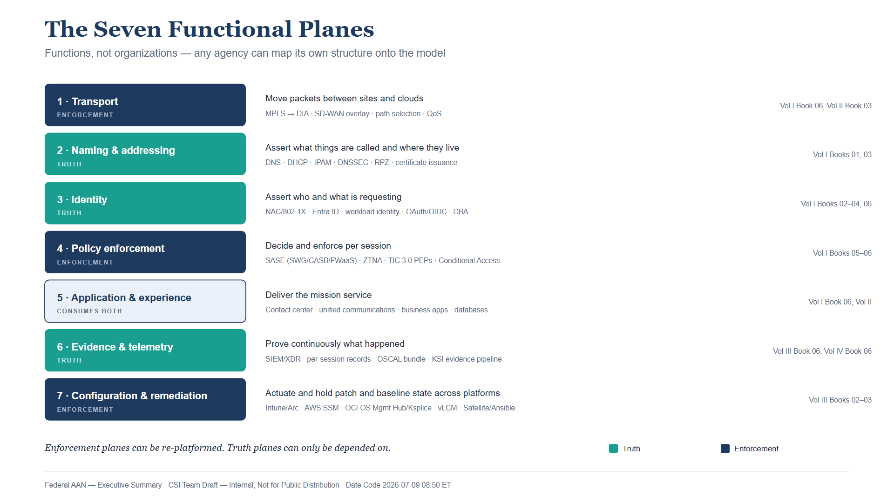
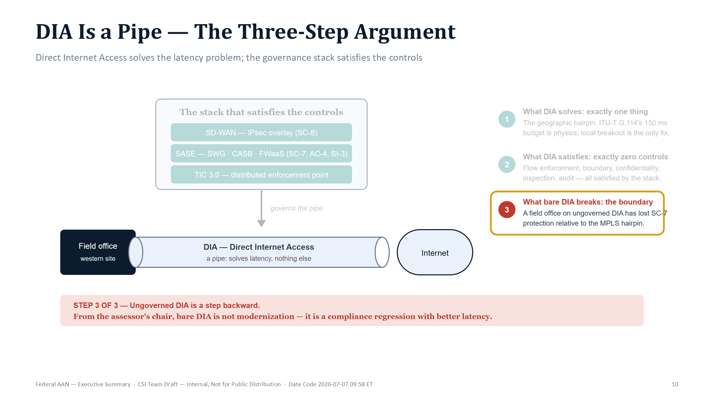
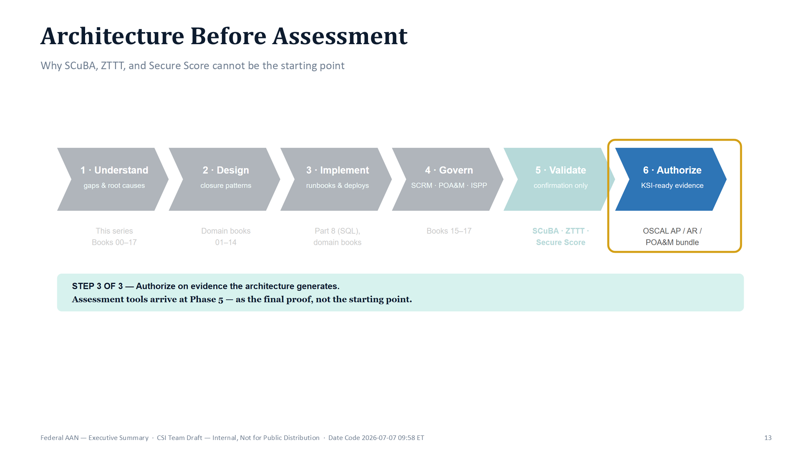
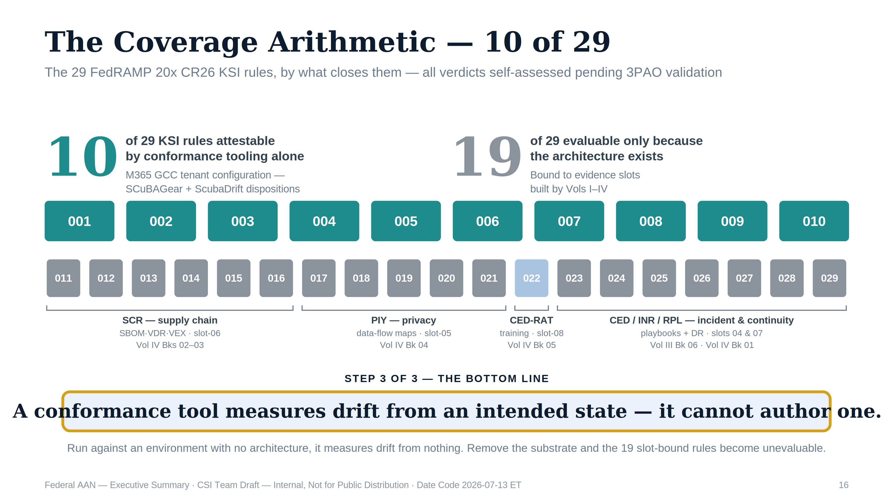

::: {.fouo-banner}
INTERNAL — NOT FOR PUBLIC DISTRIBUTION
:::

::: {.callout-warning}
## Draft Proposal — Subject to Review

This document is a **draft proposal** developed by the **CSI Team (Cloud Services Infrastructure)**. It is an attempt at a comprehensive SSA-wide technical roadmap and has not been reviewed or approved by the SSA CIO Office, the Office of Information Security (OIS), or organizational leadership. All recommendations, vendor selections, control mappings, and implementation timelines are subject to revision pending formal review by the SSA CIO Office and organizational components.

**Date Code:** 2026-07-12 20:10 ET
:::

::: {.callout-note}
## This is the technical compendium — the two-page brief is Book 00a

This document is the full technical body: the thesis, the doctrine, and the
per-book NIST SP 800-53 control-closure tables. **Authorizing officials, program
executives, and budget decision-makers should start with
[Vol 0 Book 00a — Executive Brief](Vol_0_Book_00a_FedAAN_Executive_Brief.qmd)**,
which carries the thesis, the three binding deadlines, the decisions required
from OIS/CIO, the cost of inaction, and role-based reading paths in two pages.
Everything below is the detail behind that brief.
:::

## About This Document {.unnumbered}

This series was developed by the **CSI Team (Cloud Services Infrastructure)** as a technical planning document for SSA's FedRAMP 20x compliance transition. It represents an SSA-wide analysis of the architectural work required to satisfy NIST SP 800-53 Rev 5 controls and FedRAMP 20x Key Security Indicators under the Consolidated Rules effective January 1, 2027.

**What this is:** A comprehensive technical roadmap — mapping twenty-three implementation areas to specific control families, identifying closure mechanisms, and sequencing the work against the regulatory timeline. It is an attempt at a true enterprise-wide view, not a CSI-scoped one.

**What this is not:** A final implementation mandate, an organizational assignment of responsibilities, or a procurement decision. The CSI Team does not hold authority over the full scope of what this series describes. Security policy authority, control ownership, budget authority, and implementation accountability span multiple organizations and must be established through a formal alignment process.

**OIS and security leadership:** The Office of Information Security (OIS) will have substantial influence over the security architecture, policy framework, and control ownership decisions described in this series. This document has not yet been reviewed by OIS. That review — and OIS's active participation in shaping the implementation approach — is a required step before any commitments are made.

**Expected revision process:** This roadmap will necessarily be modified as it is reviewed by:

- **CIO Office** — strategic direction, enterprise architecture alignment, and prioritization
- **Office of Information Security (OIS)** — security policy, control ownership, assessment methodology, and risk acceptance authority
- **Organizational leaders** — operational feasibility, resource capacity, and accountability mapping across SSA's organizational units
- **Program offices** — system-specific applicability of the recommended controls and implementation sequencing

**The compliance timeline is not advisory.** The FedRAMP 20x mandatory date of January 1, 2027 is a regulatory requirement, not an internal target. The architectural gap this series describes is real, and the window to close it is closing. This roadmap does not reduce that urgency — it maps the path. Closing it requires alignment and action across all of the organizations named above.

::: {.callout-important}
## Series Extension — Multi-CSP Coordination and the Accreditation Substrate

This keystone **has been extended** to close two gaps the Microsoft-reference drafting left open — **multi-CSP patch and systems management** (how AWS, Oracle OCI, VMware, and Red Hat native stacks coordinate with the Azure/Intune stack rather than living under one Microsoft plane — see *The Management-Plane Coordination Doctrine* below) and **the network enforcement substrate** (how Cisco, Palo Alto, and Juniper gear closes NIST controls through the NIAP / DISA STIG / FIPS 140-3 / DoDIN APL gate FedRAMP does not cover — see *Theme F — The Accreditation Substrate* below).

**Four books formalize the extension:** Network Enforcement Substrate (Vol I Book 07), Patch & Systems Management (Vol III Book 03), Cloud-Native Security Posture & Containers (Vol III Book 04), and the Multi-Cloud Evidence Fabric (Vol III Book 07). Multi-CSP sections were also added to Privileged Access Management (Vol III Book 01), Data Protection (Vol III Book 05), and Business Continuity (Vol IV Book 01). At this extension the series was organized in **six volumes** — a program volume (Vol 0), the four implementation volumes (Volumes I–IV), and the enablement volume (**Volume V — Training & Certification**), which teaches the corpus and produces the training-slot evidence (KSI-CED) the authorization package depends on. *Series Extension II* (below) carries this to the current **ten volumes (0–IX)**, adding the implementation, coordination, and day-2 volumes.

**Reconciliation of the headline figures:**

- **Book count** — twenty-three implementation books (was nineteen), plus this Executive Summary, the Product Inventory Questionnaire, five volume overviews, and the four **Volume V enablement books** (compliance track, implementation track, assessment & certification, vendor training & labs). Volume V is training/enablement material, not counted among the twenty-three implementation books; it teaches them.
- **"34 distinct controls"** remains the total for the *original six tracks* (Vol I Book 01 and the modernization/data tracks); the four extension books close *additional* controls enumerated in their own "Authorities Closed Here" tables, generated from the compliance spine.
- **"29 KSIs"** is unchanged — the ADR-111 rule-set decomposition. The extension books add *evidence* for existing network, endpoint, telemetry, and security slots; none adds a new KSI rule, and because their evidence is architecture-generated rather than conformance-tool-attestable, they reinforce the "19 of 29 require the architecture" finding below.
:::

::: {.callout-important}
## Series Extension II — Implementation, Coordination & Day-2 Operations (Volumes VI–IX)

The series **has been extended again**, from six volumes to **ten (Volumes 0–IX)**.
Where Volumes I–IV establish the architecture (*what must be true and why*) and
Volume V teaches it, four further volumes make it **buildable and operable**:

- **Volume VI — Implementation.** The deployable layer: landing-zone and network
  IaC, identity-as-code, the detection-rule and SOAR-playbook libraries,
  configuration baselines, the evidence/ConMon pipeline, and validation
  harnesses. Where an architecture book *closes* a control, the matching Vol VI
  book *deploys it as code* — the "how" beneath the "what."
- **Volume VII — ServiceNow Automation for Federal Control Compliance.** The
  coordination layer that turns M365 and Azure control state into tracked tasks,
  reviewable change, machine-readable evidence, and authorization-package input.
  ServiceNow is a **workflow/enforcement plane**: its CMDB *reconciles to* the
  authoritative IPAM/DDI asset identity (CM-8 join key) and never becomes the
  SSOT; actuation stays platform-native.
- **Volume VIII — Multi-Cloud DDI Landing-Zone Automation.** The naming/addressing
  plane realized across **Azure, AWS, GCP, OCI, and VMware** — the series' *one
  deliberate multi-CSP breadth exception* (by author direction), with ServiceNow
  as the governed front door for DDI change (the InfoBlox DDI kit, bound in as a
  named volume).
- **Volume IX — ServiceNow Day-2 Operations.** The governed catalog for routine
  Entra/M365/Azure day-2 work — helpdesk, the landing-zone front door,
  app-registration governance, and Teams telephony — extending the Vol VII
  discipline from compliance drift to everyday operations.

**Reconciliation of the headline figures (unchanged where it matters):**

- **"34 distinct controls" and "29 KSI rules"** remain the closure arithmetic of
  the *architecture* corpus (the original six tracks and the ADR-111 rule set).
  Volumes VI–IX **do not, in the main, close new control numbers** — they
  *deploy, coordinate, evidence, and operate* controls the architecture volumes
  already close. The single genuinely-new control number they add is **CM-5**
  (separation-of-duties over DDI change, Vol VIII). The full per-control view,
  including every Vol VI/VII/VIII/IX contribution, lives in the **Series Control
  Crosswalk** (Vol 0's appendix), whose series total moved from 145 to 146
  distinct controls for exactly that CM-5 reason.
- **The scope parameter is unchanged: FedRAMP Moderate & Microsoft GCC Moderate.**
  Volume VIII's multi-CSP DDI breadth is the sole, author-directed exception;
  every other volume holds the Moderate boundary.
:::

---

::: {.exec-summary}
**For authorizing officials, program executives, and budget decision makers.**

This series comprises twenty-three companion implementation guides for the Federal Application-Aware Networking program, organized across Volumes I–IV:

**Vol I Books 01–04 — Substrate** (naming, identity, and trust foundations):

- **Vol I Book 01** — DDI/IPAM naming-and-addressing plane — 16 NIST SP 800-53 Rev 5 controls
- **Vol I Book 02** — Network Access Control (802.1X EAP-TLS, RADIUS, device identity at the port)
- **Vol I Book 03** — Certificates & Tokens — the cryptographic identity layer every session-less architecture depends on
- **Vol I Book 04** — OPM HRIT Identity & Org SSOT — the HR system of record whose worker records underpin every token, account, and access decision

**Vol I Books 05–06 and Vol II — Modernization Tracks** — closing **34 distinct NIST SP 800-53 Rev 5 controls** across the original six tracks:

- **Vol I Book 05** — Network and Identity Modernization (Entra ID, ZTNA, Active Governance)
- **Vol I Book 06** — Federal Telecommunications Modernization (SD-WAN, SASE)
- **Vol I Book 07** — Network Enforcement Substrate *(extension: customer-edge SC-7/SC-8/IA-3 via the NIAP/STIG/FIPS/APL gate)*
- **Vol II Books 01–02** — SQL Server Authentication Modernization and Implementation Guide
- **Vol II Book 03** — Database Consolidation and Network Physics

**Vol III and Vol IV Book 01 — Security Operations** — approximately **55 additional controls** across the AC, RA, MP, SC, AU, SI, IR, and CP families:

- **Vol III Book 01** — Privileged Access Management
- **Vol III Book 02** — Vulnerability Management
- **Vol III Book 03** — Patch & Systems Management *(extension: multi-CSP SI-2/CM)*
- **Vol III Book 04** — Cloud-Native Security Posture & Containers *(extension: CSPM/CNAPP/K8s)*
- **Vol III Book 05** — Data Protection and Purview
- **Vol III Book 06** — SIEM/XDR Detection Engineering
- **Vol III Book 07** — Multi-Cloud Evidence Fabric *(extension: telemetry → CDM → KSI)*
- **Vol IV Book 01** — Business Continuity

**Vol IV Books 02–04 — Risk and Program Governance** (SR, PM, and PT control families):

- **Vol IV Book 02** — Supply Chain Risk Management (SBOM/VDR/VEX pipeline)
- **Vol IV Book 03** — Program Management and Governance (POA&M/SCRM/ISPP)
- **Vol IV Book 04** — PII Processing and Transparency (PT family templates, Purview enforcement)

**Vol IV Book 05 — Training and Awareness** — AT family cybersecurity training program — activates KSI-022 (KSI-CED-RAT), making all 29 KSI rules in the series' ADR-111 rule set evaluable at high confidence.

**Vol IV Book 06 — Authorization Package and ConMon** — OSCAL AP+AR+POA&M bundle (29/29 rules self-assessed, pending independent security control assessment (SCA)), continuous monitoring program, and BOD 26-04 VDR/VER submission — closing CA-2, CA-5, CA-6, CA-7, RA-3, and SA-15.

---

**Together, the twenty-three implementation books constitute the complete evidence-generation and authorization-package layer for the agency's RMF authorization, with continuous-monitoring evidence structured in the FedRAMP 20x KSI idiom.** Each book maps its implementations directly to the NIST SP 800-53 Rev 5 controls it closes, and Vol IV Book 06 assembles those mappings into a machine-readable OSCAL authorization package ready for independent SCA. The FedRAMP cloud services SSA consumes (M365 GCC, AWS GovCloud, DDI SaaS) are inherited as leveraged authorizations; SSA itself does not submit to the FedRAMP PMO.

**Beyond the architecture corpus, four further volumes make it buildable and operable** (the ten-volume series, 0–IX): **Volume VI** deploys the architecture as code (IaC, detection and SOAR libraries, baselines, the evidence pipeline); **Volume VII** coordinates M365/Azure control state into tracked ServiceNow tasks and KSI evidence; **Volume VIII** realizes the DDI naming plane across every cloud (Azure, AWS, GCP, OCI, VMware — the one deliberate multi-CSP exception); and **Volume IX** governs routine day-2 operations (helpdesk, landing-zone front door, app-registration, Teams telephony) through the same ServiceNow discipline. These volumes deploy, coordinate, and operate the controls the architecture closes rather than closing new ones — see *Series Extension II* above and the Series Control Crosswalk appendix for the full per-control view.

Three technologies recur throughout the series as the **only** closure mechanisms for their control sets — not the preferred options among several: **IPAM/DDI** (the authoritative naming-and-addressing plane), **SD-WAN** (the encrypted, application-aware transport overlay), and **TIC 3.0** (the distributed policy enforcement that makes direct internet access lawful). The Closure Necessity Doctrine below states the claim; the KSI Closure Necessity Matrix quantifies it against all 29 KSI rules in the series' ADR-111 rule set.

The central finding across all six documents is the same: **the compliance debt is not a resource shortage — it is an architectural pattern mismatch.** The existing infrastructure was designed for a world where compute, identity, and communication were co-located inside a perimeter. That world ended between 2015 and 2020. The controls that federal agencies are now required to satisfy under Zero Trust Executive Order 14028, OMB M-22-09, TIC 3.0, and FedRAMP 20x Consolidated Rules (June 25, 2026) cannot be satisfied by the perimeter architecture. They require a different structural foundation.

**The twenty-three implementations described in this series are not optional modernization projects.** They are the structural prerequisites for an agency Moderate authorization whose evidence survives the FedRAMP 20x transition. CR26 is mandatory for the cloud service offerings SSA inherits effective January 1, 2027; SSA's obligation is to ensure inherited services are on the 20x path and to structure its own ConMon evidence on the same KSI schema so inheritance stays clean.
:::

---

## Series Overview {.unnumbered}

{fig-alt="Three-band blueprint diagram on a white background. The subtitle reads five volumes, 23 implementation books. The top band, labeled Substrate — naming, identity, and trust foundations (Vol I Books 01–04), contains four navy columns: Vol I Book 01 Landing Zone IPAM / DDI / PKI (InfoBlox DDI, DNSSEC, RPZ, certificates — 16 NIST controls closed), Vol I Book 02 Network Access Control (802.1X, RADIUS, device identity at the port), Vol I Book 03 Certificates and Tokens (cryptographic identity, PKI lifecycle, token issuance), and Vol I Book 04 HRIT Identity and Org SSOT (HR system of record, joiner-mover-leaver lifecycle). Teal arrows point down to the middle band, Modernization Tracks (Vol I Books 05–07 and Vol II), with four ice-blue boxes: Vol I Book 05 Network and Identity Modernization (Entra ID, ZTNA, Active Governance — 12 NIST controls closed), Vol I Book 06 Telecommunications Modernization (SD-WAN plus SASE — 7 NIST controls closed), Vol I Book 07 Network Enforcement Substrate (NIAP, DISA STIG, FIPS 140-3, DoDIN APL — an extension book, the accreditation substrate, drawn with a dashed border), and Vol II Books 01–03 SQL Server and Database Architecture (Azure Arc, Entra authentication, network physics — 7 additional controls closed). Teal arrows continue down to the bottom band, Operations and Governance (Vol III and Vol IV), with four white boxes: Vol III plus Vol IV Book 01 Security Operations (PAM, VulnMgmt, Purview, SIEM/XDR, Business Continuity, plus the extension books Patch and Systems Management, Cloud-Native Posture, and the Multi-Cloud Evidence Fabric — about 55 controls closed or deepened), Vol IV Books 02–04 Risk and Program Governance (SCRM, PM governance, PII processing transparency), Vol IV Book 05 Training and Awareness (role-based curriculum, KSI-CED evidence), and Vol IV Book 06 Authorization Package (OSCAL bundle, continuous monitoring CA-7). A footer badge states that the six original tracks — Vol I Books 01, 05–06 and Vol II, each marked with a teal dot — close 34 distinct NIST SP 800-53 Rev 5 controls, that four extension books (Vol I Book 07 and Vol III Books 03, 04, 07) close additional controls, and that all 23 implementation books generate machine-readable KSI evidence for FedRAMP 20x." width="100%"}

| Designation | Document | Domain | Core Technology |
|------|----------|--------|-----------------|
| Vol I Book 01 | Federal AAN — SSA Landing Zone IPAM / FedRAMP | DNS · DHCP · IPAM · PKI · Zero Trust | InfoBlox DDI |
| Vol I Book 02 | Federal AAN — Network Access Control: 802.1X and Device Identity | 802.1X EAP-TLS · RADIUS/CoA · DHCP fingerprinting · NAC policy tiers | 802.1X + RADIUS + Intune SCEP |
| Vol I Book 03 | Federal AAN — Certificates & Tokens: Cryptographic Identity | PKI lifecycle · ACME automation · OAuth 2.0/OIDC · CBA · workload identity | Entra ID CBA + ACME + managed identity |
| Vol I Book 04 | Federal AAN — OPM HRIT and the Identity & Organizational SSOT | HR system of record · joiner/mover/leaver lifecycle · org hierarchy as queryable truth · HR-driven provisioning | Oracle HCM Cloud + Entra inbound provisioning |
| Vol I Book 05 | Federal AAN — Network Modernization | Identity · Governance · Active Directory modernization | Entra ID · ZTNA · Active Governance |
| Vol I Book 06 | Federal AAN — Federal Telecommunications Modernization | Amazon Connect · Teams Phone · SD-WAN · SASE | SD-WAN / SASE stack |
| Vol II Book 01 | Federal AAN — SQL Server Authentication Modernization | SQL credential elimination · Arc Managed Identity · NTLM elimination | Azure Arc + Entra ID for SQL |
| Vol II Book 02 | Federal AAN — SQL Server Implementation Guide | 10-book runbook: estate audit, Arc deployment, login migration, monitoring | Azure Arc + Entra ID (implementation) |
| Vol II Book 03 | Federal AAN — Database Consolidation and Network Physics | SSOT architecture · SD-WAN for database traffic · consistency class alignment | SQL + Network Physics |
| Vol III Book 01 | Federal AAN — Privileged Access Management | Entra PIM JIT activation · PAW architecture · AC-6 least privilege | Entra PIM + PAW |
| Vol III Book 02 | Federal AAN — Vulnerability Management | Defender VM · CISA KEV integration · RA-5 continuous scanning | Defender MDVM + KEV |
| Vol III Book 05 | Federal AAN — Data Protection and Purview | Purview DLP · sensitivity labels · Key Vault CMK · MP/SC controls | Purview + Key Vault |
| Vol III Book 06 | Federal AAN — SIEM / XDR / Detection Engineering | Sentinel connectors · KQL analytics rules · UEBA scoring · Logic App playbooks | Microsoft Sentinel + Defender XDR |
| Vol IV Book 01 | Federal AAN — Business Continuity | CP-2 contingency plan · BIA RTO/RPO/MTD · SQL AG and DDI DR integration | Azure Site Recovery + DR runbooks |
| Vol IV Book 02 | Federal AAN — Supply Chain Risk Management | Syft CycloneDX SBOM · Grype VDR · OpenVEX exploitability · GitHub Actions pipeline | BOD 26-04 / SR-family |
| Vol IV Book 03 | Federal AAN — Program Management and Governance | ISPP · POA&M · SCRM Charter · Leadership RACI · PM-1/PM-9/PM-30 closure | PM-family governance artifacts |
| Vol IV Book 04 | Federal AAN — PII Processing and Transparency | PT family templates · Privacy Program Plan · authority-to-process · Purview Data Map | PT-1–PT-7 GCC Moderate |
| Vol IV Book 05 | Federal AAN — Cybersecurity Awareness and Training | AT-2/AT-3 general and role-based training · LMS evidence schema · CP-3 tabletop calendar · IR-2 drill documentation | AT/CP/IR families · KSI-CED-RAT |
| Vol IV Book 06 | Federal AAN — Authorization Package and ConMon | Agency RMF authorization package (ConMon evidence modeled on the FedRAMP 20x KSI schema) · OSCAL AP+AR+POA&M bundle · BOD 26-04 VDR/VER submission · CA-7 ConMon program | CA-2/5/6/7 · RA-3 · SA-15 |
| Vol V Book 00–04 | Federal AAN — Training & Certification | Enablement · two-track model · eight evidence slots as curriculum · rubric ladder · vendor labs | AAN Practitioner/Assessor credentials · KSI-CED |
| Vol VI Book 00 | Federal AAN — Implementation (Overview) | The deployable layer — architecture operationalized as code | IaC · CI/CD · CM-2/CM-3 |
| Vol VI Book 01 | Federal AAN — Landing Zone & Network as Code | SC-7/SC-20/21/22, CM-8 realized as reviewable infrastructure code | Terraform / Bicep |
| Vol VI Book 02 | Federal AAN — Identity & Access as Code | AC-2/5/6, IA-2/3/5, SC-17 as policy-as-code | Entra · SCIM · policy-as-code |
| Vol VI Book 03 | Federal AAN — Detection Engineering | AU-6, SI-4 analytics rule library | Sentinel KQL rules |
| Vol VI Book 04 | Federal AAN — Response Automation (SOAR) | IR-4/6, AC-12 playbook library | Logic Apps / SOAR |
| Vol VI Book 05 | Federal AAN — Data Protection Deployment | MP-2–5, SC-12/28, AU-10 deployment | Purview · Key Vault |
| Vol VI Book 06 | Federal AAN — Configuration Baselines & Hardening | CM-2/3/6/7, SI-2 baselines | Machine Config · hardening |
| Vol VI Book 07 | Federal AAN — Evidence & ConMon Pipeline | AU-6/12, CA-5/7 evidence wiring | OSCAL emitter pipeline |
| Vol VI Book 08 | Federal AAN — Validation & Test Harnesses | CA-2/7, SI-4 validation | Conformance test harnesses |
| Vol VII Book 00 | Federal AAN — ServiceNow Automation (Overview) | The coordination layer for M365/Azure control compliance | ServiceNow (Gov) + in-boundary MID Server |
| Vol VII Book 01 | Federal AAN — CMDB Reconciliation & Asset Identity | CM-8 (reconciled to IPAM/DDI), CM-3 | ServiceNow Discovery / Service Graph |
| Vol VII Book 02 | Federal AAN — M365 Control-Compliance Automation | CM-6, AC-2, CA-7 drift → tracked task | Graph · SCuBA · ServiceNow |
| Vol VII Book 03 | Federal AAN — Azure Control-Compliance Automation | CM-6, SI-2, RA-5 → remediation task | Azure Policy · Defender · ServiceNow |
| Vol VII Book 04 | Federal AAN — Control Attestation, Evidence & KSI | CA-2, CA-5, CA-7 → OSCAL/KSI evidence | ServiceNow IRM/GRC · OSCAL |
| Vol VII Book 05 | Federal AAN — The ServiceNow Compliance App | Scoped app · Flows · ATF · Update Set | ServiceNow scoped app |
| Vol VIII Book 00–A | Federal AAN — Multi-Cloud DDI Landing-Zone Automation | SC-20/22, CM-8, CM-3/CM-5, AU-2 across Azure/AWS/GCP/OCI/VMware (multi-CSP exception) | InfoBlox DDI + ServiceNow front door |
| Vol IX Book 00 | Federal AAN — Day-2 Operations (Overview) | The governed catalog for routine Entra/M365/Azure day-2 work | ServiceNow · Graph via in-boundary MID |
| Vol IX Book 01 | Federal AAN — Helpdesk & ITSM Catalog | AC-2, IA-5, AC-6 as governed catalog items | ServiceNow catalog over Entra |
| Vol IX Book 02 | Federal AAN — Landing Zone Front Door | CM-2, CM-8, CM-3 (catalog → IaC → CMDB) | Terraform / Bicep · CMDB |
| Vol IX Book 03 | Federal AAN — App Registration Governance | IA-5(2), SC-17, AC-6 · consent + secret/cert lifecycle | ACME short-lived certs |
| Vol IX Book 04 | Federal AAN — Teams Telephony Catalog & SCuBA Drift | CM-3, CM-6, AU-2 · E911 validation | Teams Phone · SCuBA loop |

: Federal Application-Aware Networking Series — Vols 0–IX {.striped .hover}

## FedRAMP 20x Hard Deadlines {.unnumbered}

| Date | Event | Impact |
|------|--------|--------|
| Jul 6, 2026 | 20x Marketplace listings open | CSPs may enter the initial implementation stage |
| Jul 28, 2026 | FedRAMP Ready goes legacy | No new Ready submissions accepted |
| **Aug 3, 2026** | FedRAMP 20x Class A opens | First submission window for new authorizations |
| Aug 10, 2026 | Temporary Rev5 Program Certification opens | Class B/C Ready-conversion and lost-sponsor paths |
| **Aug 31, 2026** | Class B + C opens | Class C (Moderate) CSO certifications open — the pipeline SSA's inherited providers enter |
| **Dec 7, 2026** | BOD 26-04 VDR/VER deadline | SBOM + vendor disclosure required; KSI-011–014 become evaluable |
| **Jan 1, 2027** | FedRAMP 20x mandatory | All new authorizations must use 20x; legacy Rev 5 path closes |
| **Jun 11, 2027** | New Rev 5 certs cease | No new legacy authorizations after this date |

: FedRAMP 20x Authorization Timeline {.striped .hover}

## The Broader Federal Clock {.unnumbered}

FedRAMP 20x is the nearest deadline family, not the only one. The dates below
are the other federal mandates whose clocks run against the same NIST control
families this series closes. The authoritative, fully-sourced timeline —
including the elapsed baseline (M-21-31 logging, M-21-07 IPv6, M-22-09 Zero
Trust, BOD 25-01 SCuBA) — is maintained in the companion document
*Federal AAN / ConMon Compliance Gap Roadmap*, which is the series' single
source of truth for federal dates.

| Date | Mandate | What it means here |
|------|---------|--------------------|
| **Aug 7, 2026** | BOD 26-04 agency policies due | Vulnerability-management policy must support risk-based remediation (Vol III Book 02 — Vulnerability Management) |
| **Sep 21, 2026** | FIPS 140-2 certificates → NIST Historical List | No new procurement reliance on 140-2-only modules; verify FIPS 140-3 tracking (SC-13 — Vol I Book 03 and Vol III Book 05) |
| **Dec 7, 2026** | BOD 26-04 remediation timelines in force | Four-variable risk model live: 3-day KEV+exposed tier through deferral (Vol III Book 02) |
| Jan 1, 2027 | CNSA 2.0 acquisition gate (NSS-scoped) | ML-KEM-1024 + ML-DSA-87 for new NSS acquisitions; civilian PQC trajectory follows via M-23-02 |
| ~Aug 2027 | Next NIST SP 800-53 scheduled release | 2-year cadence from Release 5.2.0 (Aug 27, 2025, which added SA-15(13), SA-24, SI-2(7) — not yet mapped in Vol III Book 02 or Vol IV Book 02; tracked in the roadmap) |
| 2030 / 2035 | Quantum-vulnerable crypto deprecated / prohibited | M-23-02 annual crypto inventories run through the 2035 migration horizon (Vol I Book 03 and Vol III Book 05) |

: The broader federal clock — mandates beyond FedRAMP 20x {.striped .hover}

---

# The Functional Plane Model

This series describes **functions, not organizations**. Every capability named
across these ten volumes belongs to one of seven functional planes — including the
coordination capabilities of Volumes VII–IX, which live on the workflow/enforcement
and naming planes (ServiceNow on plane 6/7, multi-cloud DDI on plane 2). The planes are
architectural facts — they exist in every enterprise regardless of how the org
chart divides them — so any agency can map its own structure onto the model
without the model taking a position on whose structure is correct.

{fig-alt="Stacked diagram of the seven functional planes, each with role, function description, and owning books. 1 Transport (enforcement, navy): move packets between sites and clouds — MPLS to DIA, SD-WAN overlay, path selection, QoS; Vol I Book 06 and Vol II Book 03. 2 Naming and addressing (truth, teal): assert what things are called and where they live — DNS, DHCP, IPAM, DNSSEC, RPZ, certificate issuance; Vol I Books 01 and 03. 3 Identity (truth, teal): assert who and what is requesting — NAC 802.1X, Entra ID, workload identity, OAuth OIDC, CBA; Vol I Books 02–04 and 06. 4 Policy enforcement (enforcement, navy): decide and enforce per session — SASE (SWG CASB FWaaS), ZTNA, TIC 3.0 PEPs, Conditional Access; Vol I Books 05–06. 5 Application and experience (consumes both, ice blue): deliver the mission service — contact center, unified communications, business apps, databases; Vol I Book 06 and Vol II. 6 Evidence and telemetry (truth, teal): prove continuously what happened — SIEM XDR, per-session records, OSCAL bundle, KSI evidence pipeline; Vol III Book 06 and Vol IV Book 06. 7 Configuration and remediation (enforcement, navy): actuate and hold patch and baseline state across platforms — Intune/Arc, AWS SSM, OCI OS Management Hub/Ksplice, VMware vLCM, Red Hat Satellite/Ansible; Vol III Books 02–03. A legend marks teal as truth planes and navy as enforcement planes. Footer axiom: enforcement planes can be re-platformed; truth planes can only be depended on. White background. Date Code 2026-07-09 08:50 ET." width="100%"}

| Plane | Function | Representative capabilities | Series home |
|---|---|---|---|
| **1 — Transport** | Move packets between sites and clouds | Circuits, MPLS → DIA, SD-WAN overlay, path selection, QoS | Vol I Book 06, Vol II Book 03 |
| **2 — Naming & addressing** | Assert what things are called and where they live | DNS, DHCP, IPAM, DNSSEC, RPZ, certificate issuance (DDI + PKI) | Vol I Books 01, 03 |
| **3 — Identity** | Assert who and what is requesting | Device identity (NAC/802.1X), user identity (Entra ID), workload identity, tokens (OAuth/OIDC, CBA) | Vol I Books 02, 03, 04, 06 |
| **4 — Policy enforcement** | Decide and enforce per session | SASE (SWG/CASB/FWaaS), ZTNA, TIC 3.0 PEPs, Conditional Access | Vol I Books 05, 06 |
| **5 — Application & experience** | Deliver the mission service | Contact center, unified communications, business applications, databases | Vol I Book 06 and Vol II |
| **6 — Evidence & telemetry** | Prove continuously what happened | SIEM/XDR, per-session records, OSCAL bundle, KSI evidence pipeline | Vol III Book 06, Vol IV Book 06 |
| **7 — Configuration & remediation** | Actuate and hold patch and baseline state across platforms | Intune/Arc, AWS SSM, OCI OS Management Hub/Ksplice, VMware vLCM, Red Hat Satellite/Ansible; the unified compliance-record emitter | Vol III Book 02 + Vol III Book 03 (Patch & Systems Management) |

: The Seven Functional Planes {.striped .hover}

The planes are not peers. The series' organizing principle — **separate truth
from enforcement** — imposes a hierarchy: planes 2, 3, and 6 are **truth
planes** (they assert what is), planes 1, 4, and 7 are **enforcement planes**
(they act on those assertions), and plane 5 consumes both. The distinction matters
because enforcement planes can be re-platformed, absorbed, or replaced — MPLS
became SD-WAN; the VPN concentrator became ZTNA; the branch firewall became a
SASE PoP — while truth planes can only be **depended on**. Every enforcement
decision in this architecture resolves a name, validates a certificate, or
evaluates a token before it acts. The truth planes are where the architecture's
authority lives; the enforcement planes are where its will is done.

# The Closure Necessity Doctrine

The claim this series makes is stronger than "recommended" and it is falsifiable:
for a specific, enumerable set of NIST SP 800-53 Rev 5 controls, three
technologies are the **only** closure mechanisms — every "required" in this
series pairs with the control text, physics, or protocol behavior that makes
the alternatives impossible, never with an adjective.

| Required technology | Controls with no alternate closure path | Why no alternative exists |
|---|---|---|
| **IPAM/DDI** — authoritative naming and addressing plane | SC-20, SC-20(1), SC-21, SC-22 (authoritative/recursive DNS); CM-8, CM-8(1) (component inventory); IA-9 (service identification) | You cannot attest authoritative name resolution without an authoritative resolver, and you cannot inventory what you cannot enumerate. No scanner creates a source of truth — a scanner can only measure drift from one. |
| **SD-WAN** — encrypted, application-aware transport overlay | SC-8, SC-8(1) on DIA circuits (network-layer encryption); SC-5 (traffic-class separation); SI-4 (application-layer telemetry on transport) | A pipe has no encryption, no path intelligence, and no telemetry. Physics gives DIA lower latency; only the overlay gives it a control surface. There is no second way to encrypt a DIA circuit at the network layer. |
| **TIC 3.0** — distributed policy enforcement for the pipes | SC-7, SC-7(7) (boundary protection on distributed egress); AC-4 (information flow enforcement outside the legacy TIC access point) | Under TIC 3.0, DIA is *permissible only when* the security-capabilities catalog is satisfied at the distributed enforcement point — the SASE stack. An ungoverned DIA circuit is not a modernization; it is a finding. |

: The Three Necessity Anchors {.striped .hover}

> **Baseline caveat:** These closure claims are made against the NIST SP 800-53 Rev 5 control baseline and FedRAMP 20x CR26 rules effective June 25, 2026. Changes to the control baseline, new FedRAMP-authorized product entries, or revised assessment guidance may alter these closure paths. Validate with OIS and the agency's independent assessor before using these claims as the basis for authorization decisions.

::: {.callout-important}
## Mechanism, Not Product — Read the Necessity Claims Correctly

"No alternate closure path" is a claim about **mechanism classes**, never
about vendors. "Only port-based authentication closes IA-3" names a protocol
behavior; it does not name a product. Every product named in this series
(InfoBlox, NPS, Cisco Catalyst SD-WAN, Entra ID, Oracle HCM Cloud, Sentinel)
is a **deployed example of its mechanism**, and for every layer there are
FedRAMP-authorized alternatives that satisfy the same mechanism — the
alternatives matrix in the companion *Federal AAN / ConMon Compliance Gap
Roadmap* enumerates them per layer.

The program doctrine that follows: **multiple compliant paths exist before
the agency chooses; exactly one exists after.** The agency must select one
implementation path per layer, and per governance the selected path becomes
mandatory once chosen — because split implementations of a truth plane
recreate the fragmented-truth problem this series exists to end.
:::

::: {.callout-important}
## DIA Is a Pipe — The Three-Step Argument

{fig-alt="Diagram of the three-step DIA argument. A field office (western site) connects through a pipe labeled DIA — Direct Internet Access, a pipe: solves latency, nothing else — to the internet. Above the pipe, a governance stack box labeled the stack that satisfies the controls contains three layers: SD-WAN IPsec overlay (SC-8), SASE with SWG CASB FWaaS (SC-7, AC-4, SI-3), and TIC 3.0 distributed enforcement point; an arrow labeled governs the pipe points down to the pipe. Right rail lists the three steps: 1 what DIA solves — exactly one thing, the geographic hairpin, ITU-T G.114's 150 ms budget is physics and local breakout is the only fix; 2 what DIA satisfies — exactly zero controls: flow enforcement, boundary, confidentiality, inspection, audit are all satisfied by the stack; 3 (highlighted) what bare DIA breaks — the boundary: a field office on ungoverned DIA has lost SC-7 protection relative to the MPLS hairpin. Red banner: ungoverned DIA is a step backward — from the assessor's chair, bare DIA is not modernization, it is a compliance regression with better latency. White background. Source: Vol 0 Book 00 Executive Summary briefing deck, Date Code 2026-07-07 09:58 ET." width="100%"}

1. **What DIA solves:** exactly one thing — the geographic hairpin. ITU-T
   G.114's 150ms one-way budget is a physics constraint, and local breakout is
   the only fix. No security product shortens a fiber path.
2. **What DIA satisfies:** exactly zero NIST controls. Information flow
   enforcement, boundary protection, transmission confidentiality, malware
   inspection, monitoring, and audit are satisfied by the SD-WAN/SASE/TIC 3.0
   stack that governs the pipe — never by the pipe.
3. **What bare DIA breaks:** the boundary it replaced. A field office moved
   from the MPLS/TIC 2.0 hairpin to ungoverned DIA has *lost* SC-7 boundary
   protection relative to its starting point. From the assessor's chair, bare
   DIA is not modernization — it is a compliance regression with better
   latency.
:::

# The Dissolution of the Load-Balancer Tier

A common objection to the transport doctrine above is that SD-WAN "replaces"
the load-balancer and proxy tier. It does not — and the claim would hand any
reviewer an easy rebuttal. What actually happens is more interesting:
**SD-WAN retires the WAN edge. The load-balancer tier dissolves upward into
cloud-native delivery services and downward into the DNS control plane.** The
classic appliance functions do not migrate to one successor; each dissolves
into the functional plane that always logically owned it:

| Legacy function | Dissolves into | Functional plane | Series home |
|---|---|---|---|
| Forward proxy · VPN concentrator · SWG appliance | SASE/SSE (SWG, CASB, ZTNA) | Policy enforcement (plane 4) | Vol I Books 05–06 |
| Hardware ADC · reverse proxy · TLS offload | Cloud-native delivery services provisioned in the landing zone (application gateways, L4/L7 cloud load balancers) | Application delivery (plane 5, landing-zone function) | Vol I Book 01 |
| Global server load balancing (GSLB) · traffic steering | DNS-based traffic management — health-checked responses, weighted and geo policies | **Naming & addressing (plane 2) — a DDI control-plane function** | Vol I Books 01, 03 |

: Where the ADC Tier's Functions Land {.striped .hover}

The third row is the one to watch: global traffic steering *is* DNS. As the
hardware tier retires, the steering function returns to the naming plane it
always answered from — which is why Vol I Book 01's DDI architecture, not any
transport technology, is where the series documents it.

---

# The Management-Plane Coordination Doctrine

The series' Microsoft-shaped reference stack — InfoBlox DDI, Entra ID, Intune,
Azure Arc, Sentinel — is a faithful *example* of each mechanism, but it answers
only half the question a multi-cloud federal agency actually faces:

> **When compute lives on Azure, AWS GovCloud, Oracle OCI, VMware, and Red Hat
> at the same time — is everything governed under one Microsoft plane (Intune /
> Azure Arc), or does each platform run its own management stack? And if the
> latter, how do they coordinate into one compliance picture?**

The doctrine answer is neither monoculture nor free-for-all: **the management
plane splits in two — actuation is platform-native; governance is unified.**

## Actuation Is Platform-Native — No Overlay Repeals a Support Boundary

Each platform patches and configures with the stack its own support model
requires. This is a support-contract and physics constraint of the same kind as
the G.114 latency floor — not a preference to be optimized away.

| Platform | Guest-OS actuation | Platform / appliance actuation |
|---|---|---|
| **Microsoft** | Intune (WUfB / Autopatch), Azure Update Manager (+ Arc for hybrid) | SaaS layer CSP-managed (M365) |
| **AWS** | Systems Manager (SSM) Patch Manager / State Manager | EC2 Image Builder (golden AMI); RDS / Lambda CSP-managed |
| **Oracle (OCI)** | OS Management Hub; **Ksplice** (zero-downtime kernel) | Autonomous Database self-patching |
| **VMware** | Workspace ONE (endpoints) | **vSphere Lifecycle Manager** (ESXi + firmware) |
| **Red Hat** | Satellite (content / patch), Ansible Automation Platform, Insights | — |

: Actuation Stacks by Platform — the SI-2 / CM Closure Mechanism per Cell {.striped .hover}

**Azure Arc governs the guest OS across clouds and on-prem — it does not patch
ESXi, firmware, or a managed database service.** A "put everything under Arc"
claim fails at the first hypervisor or appliance. Arc is one important
actuation-and-visibility tool inside the plane; it is not the plane. The same
holds in reverse for every vendor — no single stack reaches every layer of a
genuinely multi-cloud estate.

## Governance Is Unified — Coordination Lives in a Contract, Not a Tool

Coordination does not happen by forcing every workload onto one vendor's
console. It happens by requiring every native stack to emit the **same
machine-readable compliance record** — patch state, baseline conformance,
last-scan time, remediation-SLA class — into one evidence lake (Sentinel /
Log Analytics), and up into **CISA CDM** and the FedRAMP 20x KSI evidence
pipeline. Any stack that satisfies the contract is admissible. The series
mandates the *contract*, never the vendor.

::: {.callout-important}
## The Join Key Is Authoritative Asset Identity — Coordination Is a Naming-Plane Necessity

You cannot correlate an AWS instance, an Azure Arc server, a VMware VM, and a
Red Hat host into one compliance picture unless every asset carries **one
authoritative name and address**. The naming/addressing plane (Vol I Book 01's DDI,
CM-8) is the join key on which multi-stack coordination depends — which makes
heterogeneous management a **Closure Necessity argument for IPAM/DDI**, not an
argument against it.

It is also a federal mandate: **CISA BOD 23-01** requires agency-wide asset
visibility and vulnerability enumeration across exactly this heterogeneity. An
agency running five management stacks with five inventories and no authoritative
join key does not have asset visibility — it has five partial views that cannot
be reconciled at audit.
:::

In the Functional Plane Model the split is clean: **actuation is an
enforcement-plane function** (per-vendor, re-platformable — plane 7);
**the evidence contract is a truth-plane function** (unified, depended-on —
plane 6). Vol III Book 02 (Vulnerability Management) is the *assessment* half of this
plane — what is unpatched — and the reference implementation of the evidence
contract on the Microsoft stack; the **Patch & Systems Management** book (Vol III
Book 03) generalizes the contract to every platform above and owns the
*remediation* half (SI-2, SI-2(2), CM-2 / CM-6).

# Theme F — The Accreditation Substrate

Every control this series closes is closed by a *mechanism*; every mechanism
ships inside a *product*; every product a federal agency buys must carry a
*federal accreditation*. The gate differs by what the product is — and the
series names the gate, not just the mechanism.

| Product class | Accreditation gate | What it certifies |
|---|---|---|
| **CSP services** (M365, Azure, AWS, OCI, VMware Cloud) | **FedRAMP** (Moderate, per the series scope) | The service's control implementation, assessed by a 3PAO and authorized for federal use |
| **Network & endpoint gear** (firewalls, switches, SD-WAN edge, NAC) | **NIAP Common Criteria + DISA STIG + FIPS 140-3 + DoDIN APL** | The device's evaluated configuration, hardened baseline, validated crypto module, and DoD-approved-products listing |

: The Two Accreditation Gates {.striped .hover}

The distinction matters because the two halves of a federal architecture are
accredited on **different registries with different evidence**. A control
inherited from a FedRAMP CSP is attested from the CSP's package; the same
control closed by an on-premises firewall at a field-office DIA edge is attested
from that appliance's NIAP evaluation, its STIG-compliance scan, and its
FIPS 140-3 certificate — evidence the CSP package never contains. The
**Network Enforcement Substrate** book (Vol I Book 07) formalizes this gate for the
customer-owned edge, and every book that closes a control names which registry
carries its evidence.

---

# Why This Series — Not SCuBA, ZTTT, or Any Single-Vendor Assessment Tool

Federal agencies frequently receive guidance to run CISA's SCuBA (Secure Cloud
Business Applications) toolkit, Microsoft's Zero Trust Transformation Toolkit
(ZTTT), or similar automated assessment tools as their compliance answer. These
tools are valuable — but they answer the wrong question if used before the
architectural work is done.

## What Assessment Tools Actually Do

SCuBAGear, ZTTT, Microsoft Secure Score, the Purview Compliance Portal, and the
CISA Zero Trust Maturity Model (ZTMM) self-assessment are all **diagnostic
instruments**. They measure the current configuration state of your environment
against a defined baseline. That is precisely what they should do — and they do
it well.

What they do not do:

- **Design your network architecture.** SCuBAGear can tell you that DNSSEC is
  not enabled. It cannot design the DDI/IPAM grid that makes DNSSEC enforceable
  across four environments simultaneously.
- **Prescribe your identity integration path.** ZTTT can score your
  Zero Trust maturity at "Traditional." It cannot design the Entra ID
  Conditional Access policy set, NTLM elimination sequence, and Arc Managed
  Identity chain that moves you to "Advanced."
- **Solve cross-domain physics constraints.** No assessment tool identifies that
  your SQL consolidation plan will violate G.114 one-way delay bounds or that
  your SD-WAN traffic class configuration is inconsistent with your database
  replication consistency model.
- **Close controls at the infrastructure layer.** Compliance portals report
  open controls. They do not architect the InfoBlox RPZ enforcement, SASE
  CASB inline inspection, or Sentinel KQL detection pipeline that closes them
  with machine-readable, continuously-updated evidence.

In short: **assessment tools tell you your blood pressure. They do not design
your cardiovascular system.**

## The Correct Sequencing

Agencies that run SCuBA or ZTTT before their architecture is designed are
reading a thermometer before the treatment plan exists. The findings are
accurate, but there is no framework to act on them coherently. The result is
a list of open controls addressed piecemeal — individual configuration fixes
that do not accumulate into a defensible, integrated compliance posture.

{fig-alt="Chevron flow of six phases: 1 Understand — gaps and root causes (this series, Vol 0 Book 00 through Vol IV Book 04); 2 Design — closure patterns (domain books across Vols I–IV); 3 Implement — runbooks and deploys (Vol II Book 02 SQL, domain books); 4 Govern — SCRM, POA&M, ISPP (Vol IV Books 02–04); 5 Validate — confirmation only (SCuBA, ZTTT, Secure Score, teal); 6 Authorize (highlighted, blue) — KSI-ready evidence via the OSCAL AP AR POA&M bundle. Caption: authorize on evidence the architecture generates — assessment tools arrive at Phase 5 as the final proof, not the starting point. White background. Source: Vol 0 Book 00 Executive Summary briefing deck, Date Code 2026-07-07 09:58 ET." width="100%"}

The correct sequence is:

| Phase | Activity | Tooling |
|-------|----------|---------|
| **1 — Understand** | Identify control gaps and their architectural root causes | This series — Vol 0 Book 00 through Vol IV Book 04 |
| **2 — Design** | Select the architectural pattern that closes each gap with continuous evidence | This series — domain books across Vols I–IV |
| **3 — Implement** | Execute the runbooks, deploy the infrastructure, configure the integrations | This series — Vol II Book 02 (SQL), domain books |
| **4 — Govern** | Establish SCRM, POA&M, ISPP, and RACI structures | This series — Vol IV Books 02–04 |
| **5 — Validate** | Run SCuBA, ZTTT, Secure Score — now as a confirmation, not a discovery exercise | SCuBA · ZTTT · Microsoft Secure Score |
| **6 — Authorize** | Submit KSI-ready machine-readable evidence to FedRAMP 20x evaluators | OSCAL AP/AR/POAM bundle |

: AAN Modernization Sequence — Architecture Before Assessment {.striped .hover}

When you reach Phase 5, SCuBAGear should return a near-clean baseline report
— not because you configured individual settings to pass the scan, but because
the underlying architecture produces compliant configuration as its natural
steady state. Sentinel detects automatically. Entra tokens log natively.
InfoBlox IPAM inventories continuously. SCRM artifacts update on every pipeline
run. The assessment tool confirms what the architecture already guarantees.

## Why Single-Vendor Tools Cannot Replace an Architectural Roadmap

Both SCuBA and ZTTT are optimized for their vendor's product surface. SCuBAGear
audits Microsoft 365 GCC tenant configuration — Exchange, Teams, SharePoint,
Entra, Defender. ZTTT assesses your position within Microsoft's Zero Trust
model. These are the right tools for those surfaces.

::: {.callout-note}
## Vendor Selection Status
SD-WAN and SASE SSE vendor selections are pending agency procurement review. The shortlists in this series reflect FedRAMP authorization status and federal use-case alignment at time of writing. Final selection requires validation against current FedRAMP Marketplace listings, agency-specific environment testing, and applicable procurement authority. All KSI self-assessments are self-assessed pending independent security control assessment (SCA).
:::

Federal compliance, however, does not live on a single vendor's surface. The
34 NIST SP 800-53 controls closed by this series span:

- **Network layer** — DDI, DNS, DHCP, IPAM, DNSSEC, RPZ (InfoBlox)
- **Transport layer** — SD-WAN IPsec overlay, QoS traffic classification, DIA local breakout path selection (Cisco Catalyst SD-WAN / VMware VeloCloud (Broadcom) / Palo Alto SD-WAN — *agency selection pending*)
- **Application layer** — CASB inline inspection, SWG, FWaaS, SSL/TLS inspection — delivered by the SASE SSE stack (Zscaler Internet Access (ZIA) / Netskope SSE / Palo Alto Prisma Access — *agency selection pending*)
- **Identity layer** — Entra ID, Conditional Access, Arc Managed Identity, NTLM elimination
- **Data layer** — SQL Server, TDE, consistency classes, replication physics
- **Operations layer** — Sentinel, Defender XDR, KQL, Logic App playbooks
- **Governance layer** — POA&M, SCRM Charter, ISPP, RACI, SBOM/VDR pipeline

No single-vendor assessment tool spans all seven layers. A tool optimized for
Layer 7 (Microsoft 365) will not score your Layer 3 DNSSEC posture, your
Layer 4 SD-WAN encryption state, or your database consolidation physics model.

**An agency that relies solely on SCuBA or ZTTT has assessed one part of the
surface and left the rest unmeasured and undefended.**

## The Role of This Series

This series is the architectural planning and implementation layer that makes
assessment tools meaningful. It answers:

- **Why** the current architecture cannot satisfy the controls — not as a
  configuration problem, but as a structural mismatch between the perimeter
  model and the Zero Trust control requirements
- **What** architectural patterns close each control family with continuously-
  generated, machine-readable evidence
- **How** to sequence the implementation across the network, identity, data,
  operations, and governance planes without creating new gaps in the process
- **When** the KSI evidence becomes evaluable under FedRAMP 20x rules
  (BOD 26-04 deadlines, Class A/B/C authorization windows)

When this series is implemented, SCuBAGear and ZTTT become the final
confirmation step — a validation that the architecture is producing the
compliance state it was designed to produce. That is the correct role for
assessment tools: **the final proof, not the starting point.**

## The Coverage Arithmetic — 10 of 29

The claim that conformance tooling cannot substitute for architecture is not
rhetorical. It is arithmetic, and the numbers come from this program's own
evaluation engine:

{fig-alt="Diagram of the 29 KSI rules in the ADR-111 rule set by what closes them, all verdicts self-assessed pending independent SCA. Left stat: 10 of 29 KSI rules attestable by conformance tooling alone — M365 GCC tenant configuration, SCuBAGear plus ScubaDrift dispositions — shown as a teal row of rule chips 001-010. Right stat: 19 of 29 evaluable only because the architecture exists, bound to evidence slots built by Vols I–IV — shown as a grey row of rule chips 011-029 with grouping brackets: SCR supply chain (SBOM VDR VEX, slot-06, Vol IV Books 02–03), PIY privacy (data-flow maps, slot-05, Vol IV Book 04), CED-RAT training (slot-08, Vol IV Book 05), and CED INR RPL incident and continuity (playbooks plus DR, slots 04 and 07, Vol III Book 06 and Vol IV Book 01). Highlighted bottom line: a conformance tool measures drift from an intended state — it cannot author one; run against an environment with no architecture, it measures drift from nothing. White background. Source: Vol 0 Book 00 Executive Summary briefing deck, Date Code 2026-07-13 ET." width="100%"}

- **ScuBA-based rules attest 10 of the 29 active FedRAMP 20x CR26 KSI rules**
  (KSI-001 through KSI-010) — the rules that reduce to Microsoft 365 GCC tenant
  configuration state, which is exactly the surface SCuBAGear measures. Even
  these ten are not point-in-time scans in this architecture: **ScubaDrift**
  adds the operational lifecycle — run-to-run drift, risk-acceptance
  dispositions with expiry, and a pipeline gate — so each verdict in the OSCAL
  AR carries its result, disposition, governing POA&M ticket, and expiry date
  (Vol IV Book 06 §3.2 documents the pipeline).
- **The other 19 rules bind to evidence slots that exist only because the
  architecture in Vols I–IV was built** — supply-chain evidence from the SBOM
  pipeline, privacy evidence from the data-flow maps, training-effectiveness
  records from the LMS schema, continuity evidence from the DR architecture,
  and the identity, network, and telemetry evidence that the substrate parts
  generate natively.

A conformance tool **measures drift from an intended state; it cannot author
one.** Run against an environment with no architecture, it measures drift from
nothing. An agency whose KSI strategy is "run SCuBA and the Zero Trust toolkit"
arrives at the January 1, 2027 mandatory date able to attest one third of the
catalog — with no evidence pipeline for the rest.

---

# The KSI Closure Necessity Matrix

The authoritative closure-necessity view for all 29 KSI rules in the series'
ADR-111 rule set. Each row states what closes the rule set, whether conformance
tooling alone can attest it, and which evidence slot and series part carry it.
Vol IV Book 06 documents the evidence procedures; this matrix is the citable summary.
All verdicts are self-assessed pending independent security control assessment
(SCA).

> **KSI-count reconciliation (initial diff published).** The 29 rules in this
> matrix are the ADR-111 rule decomposition, not the published CR26 Moderate KSI
> catalog. The rule-ID-by-rule-ID diff against the CR26 catalog committed in-repo
> now exists — see **`AAN_CR26_Reconciliation.md`** (generated from the rule
> YAMLs and the FedRAMP CR26 OSCAL catalog). Its result: of **46** CR26
> indicators across the 10 themes, **19 are explicitly mapped 1:1** to an
> internal rule (themes CMT/PIY/SCR/CED/INR/RPL, fully covered), and **27 are
> not yet bound to an indicator ID** — the IAM/CNA/SVC/MLA themes, which the 10
> ScuBA baseline rules attest at the baseline level without an indicator-ID
> binding. So **"29/29 satisfied" is a claim about the internal rule set, and CR26
> indicator-level coverage is 19/46 explicitly mapped**; the POA&M is expected to
> be non-empty once the unmapped indicators are assessed against the finalized
> CR26 Moderate list (June 25, 2026) by an independent SCA.

| KSI rules | Theme | What closes it | Attestable by conformance tooling alone? | Evidence slot | Series part |
|---|---|---|---|---|---|
| KSI-001..010 (10) | M365 baseline (IAM/MLA/CNA/SVC configuration surface) | Microsoft 365 GCC tenant configuration against the CISA SCuBA baseline, drift- and exception-gated by ScubaDrift | **Yes — ScuBAGear + ScubaDrift dispositions** | ScuBA adapter (no slot binding) | Validation phase (after Vol I makes the baseline the natural steady state) |
| KSI-011..014 (4) | SCR — VDR/VER contract | SBOM/VDR/VEX pipeline (Syft, Grype, OpenVEX) under BOD 26-04 | No | slot-06 security | Vol IV Book 02 |
| KSI-015..016 (2) | SCR-MIT / SCR-MON | SCRM charter + continuous supply-chain monitoring | No | slot-06 security | Vol IV Books 02–03 |
| KSI-017..021 (5) | PIY (GIV/RES/RIS/RSD/RVD) | Privacy program, PII data-flow maps, Purview Data Map integration | No | slot-05 endpoint | Vol IV Book 04 |
| KSI-022 (1) | CED-RAT | Machine-readable training-effectiveness record (LMS → Graph API export) | No | slot-08 training | Vol IV Book 05 |
| KSI-023..029 (7) | CED / INR / RPL | Sentinel/XDR incident playbooks + DR/continuity architecture | No | slot-07 continuity, slot-04 telemetry | Vol III Book 06 and Vol IV Book 01 |

: KSI Closure Necessity Matrix — 29 CR26 Rules {.striped .hover}

**Bottom line: 10 of 29 rules are attestable by conformance tooling alone; 19
of 29 exist as evaluable rules only because the series built the evidence
architecture underneath them.** The substrate parts feed the whole table: the
identity slot (slot-01) draws on Vol I Books 03, 04, 05 and Vol III Book 01; the network slot (slot-03)
on Vol I Books 01, 02, and 06; the data and telemetry slots (slot-02, slot-04) on Vol III Books
01, 02, and 05. Remove the substrate and the 19 slot-bound rules do not degrade — they
become unevaluable.

---

# Residual Compliance Risk Under Current Architecture

The table below identifies the specific NIST SP 800-53 Rev 5 findings a FedRAMP assessor would document under current SSA architecture. Each row represents an expected POA&M item — an open finding that requires a Plan of Action and Milestones and must be tracked through closure at every assessment cycle. The final column identifies the architectural element that closes the finding.

This is not a complete audit finding list. It presents the findings most directly attributable to the specific architectural gaps this series addresses.

| Expected Finding | Assessment Condition | Root Cause | Closed By |
|---|---|---|---|
| **CM-8: Component inventory incomplete** | IP inventory assembled manually per environment; no continuous discovery; VM additions not captured at provisioning; four separate CMDB feeds with inconsistent update cycles | No unified IP Address Management system; inventory diverges from actual state between scans | InfoBlox IPAM — atomic provisioning creates IP, DNS, and inventory record simultaneously at workload creation |
| **SC-20 / SC-21: DNSSEC not implemented** | AWS Route 53 private zones cannot be DNSSEC-signed (documented platform gap); SDN segments not covered by any signed zone; no recursive DNSSEC validation on client-side resolvers | No authoritative DNSSEC-capable resolver spanning all four environments | InfoBlox DNSSEC Grid — signs all zones including internal SDN segments; provides recursive DNSSEC validation across all environments |
| **SC-7: DNS-layer boundary control absent** | C2 callback domains resolvable via standard resolver; DNS exfiltration undetected; no enforcement of GCC-only Microsoft 365 endpoint resolution | No DNS Response Policy Zone (RPZ) enforcement | InfoBlox RPZ + CISA Protective DNS feed — blocks C2 domains, exfiltration patterns, and non-GCC M365 endpoints at the resolver |
| **AU-2 / AU-12: DNS and DHCP events not in SIEM** | Four separate DNS log formats; DHCP lease events not captured; no unified audit trail for IP allocation and resolution events; correlation across environments impossible | Per-environment logging without unified syslog pipeline | InfoBlox unified syslog — single RFC 5424 stream across all Grid Members to agency SIEM |
| **IA-9 / SC-8: Certificate-to-IP binding undocumented** | mTLS enrollment is manual and untracked; certificate inventory not linked to IP host records; SCEP/EST enrollment not enforced at provisioning | No PKI integration with IP management | InfoBlox PKI / SCEP/EST — certificate issued at provisioning, revoked at decommission, linked to IP host record |
| **SC-8: Network-layer encryption absent on DIA circuits** | DIA circuits carry traffic at the network layer without encryption; application-layer TLS is the only confidentiality control; no network-layer integrity guarantee on the access path | No IPsec overlay on DIA circuits | SD-WAN IPsec overlay — encrypts all traffic at the network layer regardless of application-layer TLS state |
| **AC-4: Application-layer information flow not enforced** | Traffic inspected at IP/port layer only; GCC-tenant and commercial-tenant Microsoft 365 are indistinguishable at the network layer; data type and destination classification absent from enforcement decision | No application-layer inspection on DIA path | SASE CASB — identifies application, tenant, data type, and user action at each session; enforces information flow policy |
| **SC-7: Application-layer boundary protection absent on DIA path** | Port 443 traffic opaque to network controls; C2 on standard HTTPS port undetectable; data loss patterns invisible to IP/port firewall | No Secure Web Gateway on DIA path | SASE SWG / FWaaS — inline SSL inspection and application-layer boundary enforcement at every DIA egress point |
| **SI-3: Inline malware inspection absent on DIA path** | Malware delivered over HTTPS reaches endpoints before SIEM detection; no inspection point on DIA path between field office and internet | No inline scanning on DIA circuit | SASE SWG with SSL inspection — malware scanning inline at the nearest SASE Point of Presence |
| **AU-12: Session records incomplete** | IP flow logs contain source IP, destination IP, port, and byte count; user identity, device posture, application, action, and data type absent; non-repudiation requirements cannot be met | No application-layer session logging on DIA path | SASE per-session telemetry — structured record per session including user, device, application, action, data type, timestamp |
| **IA-2: NTLM authentication events are audit-opaque** | NTLM authentication does not produce token-level event records; SIEM cannot correlate authentication events with user identity, device, or session; pass-the-hash exposure undetectable | Kerberos/NTLM in use; Entra ID not deployed; NTLM fallback silent and unmonitored | Entra ID token-based authentication — every authentication produces a structured, queryable token-level event record |
| **IA-5: SQL Server credential inventory undocumented** | SQL logins store password hashes in SQL Server; no centralized rotation; service account passwords not managed by any credential management system; orphaned SQL logins not detected | Mixed-mode SQL authentication with stored credential hashes | Entra ID for SQL — SQL logins eliminated; Managed Identity connections require no stored credential; credential inventory becomes an Entra audit report |
| **CM-8: SQL Server estate undocumented** | SQL Server instances not fully enumerated; version and end-of-life posture unknown for some instances; login inventory stale; linked server dependencies not mapped | No SQL estate discovery or continuous inventory process | SQL estate discovery + continuous monitoring record — every instance inventoried, every login typed and tracked, every dependency mapped |

: Expected POA&M Items Under Current Architecture and the Technology That Closes Each {.striped .hover}

::: {.callout-note}
**FedRAMP 20x implication:** Under FedRAMP 20x rules (mandatory January 1, 2027), POA&M items no longer trigger periodic remediation deadlines — they trigger continuous evidence collection requirements. An open CM-8 finding under FedRAMP 20x requires the agency to demonstrate a continuous, machine-readable inventory update process, not a one-time scan. Findings that require manual evidence assembly cannot satisfy FedRAMP 20x Key Security Indicator (KSI) requirements.
:::

---

# Vol I Book 01 — Landing Zone DDI: InfoBlox DDI Closes 16 NIST Controls

## What This Document Addresses

Every federal cloud landing zone — whether on AWS GovCloud, Azure Government, Oracle OCI, or on-premises VMware — requires DNS, DHCP, and IP Address Management (DDI) to function. SSA operates four such environments simultaneously. Without a unified DDI control plane, each environment generates its own IP inventory, its own DNS logs, and its own certificate records. FedRAMP compliance evidence must be assembled separately from each.

**InfoBlox DDI** is one of a small number of FedRAMP Moderate-authorized DDI platforms (CSO FR2017257053, authorized January 2023, hosted on AWS GovCloud; verify current authorization on the FedRAMP Marketplace at time of procurement). A single InfoBlox deployment spanning all four SSA environments closes **16 NIST SP 800-53 Rev 5 controls** that would otherwise require manual evidence assembly from four separate sources.

## NIST Control Closure — Vol I Book 01

| NIST Control | Control Title | Technology | Without InfoBlox DDI | With InfoBlox DDI | Evidence Generated |
|---|---|---|---|---|---|
| **SC-20** | Secure Name/Address Resolution (Authoritative) | InfoBlox DNSSEC | DNSSEC not signed on internal SDN zones; AWS Route 53 private zones cannot be DNSSEC-signed (documented platform gap) | All zones including internal SDN segments signed; DS record published to .gov TLD registrar | DNSSEC key rotation log; DS record audit |
| **SC-20(1)** | Child Subspaces | InfoBlox DNSSEC | No cryptographic chain of trust for subzone delegation | Grid Master signs all delegated subzones; chain of trust maintained automatically | Delegation signer records in Grid audit log |
| **SC-21** | Secure Name/Address Resolution (Recursive) | InfoBlox RPZ + PDNS | No recursive DNSSEC validation on client-side resolvers | All Grid Members perform recursive DNSSEC validation; CISA Protective DNS feed integrated as RPZ | RPZ hit log to SIEM; validation failure alerts |
| **SC-22** | Architecture and Provisioning for Name/Address Resolution | InfoBlox Network Insight | DNS topology undocumented or manually maintained | Network Insight auto-generates authoritative DDI topology; Grid Master-to-Member map maintained continuously | Network Insight export; SSP Appendix J auto-populated |
| **SC-7** | Boundary Protection | InfoBlox RPZ | DNS-layer egress is uncontrolled; no enforcement of GCC boundary for Microsoft 365 | RPZ enforces domain-level egress blocking across all four environments; blocks C2 domains, DNS exfiltration, and non-GCC M365 endpoints | RPZ block rate dashboard; SC-7(7) exfiltration alert |
| **SC-7(7)** | Prevent Split Tunneling | InfoBlox RPZ | No DNS-layer control over split tunnel behavior | RPZ blocks resolution of split-tunnel-bypass domains; enforces GCC-only Microsoft 365 resolution | RPZ policy export; block event log |
| **SC-8** | Transmission Confidentiality and Integrity | InfoBlox PKI / mTLS | Certificate-to-IP binding undocumented; mTLS enrollment manual or absent | mTLS enforced between workloads via certificate-to-IP binding; SCEP/EST enrollment automated at provisioning | Certificate Tracker report; mTLS config export |
| **SC-8(1)** | Cryptographic Protection | InfoBlox PKI | Encryption enforcement point-by-point; no systematic coverage | Certificate Tracker links cert thumbprint, expiry, issuer, and key strength to every IP host record | Cert inventory report; expiry alert log |
| **CM-8** | System Component Inventory | InfoBlox IPAM | IP inventory assembled manually per environment; four separate CMDB feeds; inventory drifts between assessments | Every IP host record is a CM-8 inventory item; SDN connectors enrich with VM name, OS, owner, and cloud region in near-real-time | IP host record export to ServiceNow CMDB; CM-8 report on demand |
| **CM-8(1)** | Updates During Installation / Removal | InfoBlox IPAM | New workloads added without inventory update until next scan | IaC integration creates IP+DNS+cert record atomically at provisioning; destroys all three at decommission | Terraform state; IP lifecycle audit log |
| **CM-2 / CM-6** | Baseline Configuration / Configuration Settings | InfoBlox Grid | DNS and DHCP configuration undocumented; drift undetected | Grid configuration versioned; IaC integration enforces baseline; Grid audit log records every configuration change | Terraform state; Grid configuration snapshot |
| **SA-9** | External System Services | InfoBlox DNS Forwarders | External DNS dependencies undocumented; no systematic SA-9 table | All external DNS forwarding destinations registered as governed external services; conditional forwarders generate SA-9 table automatically | Forwarder config export; SSP SA-9 table |
| **IA-5(2)** | Public Key-Based Authentication | InfoBlox PKI / Cert Tracker | Certificate inventory maintained manually; expiry not linked to IP records | Certificate Tracker links cert thumbprint, expiry, issuer, and enrollment source to IP host record | Cert inventory report; expiry alert log |
| **IA-9** | Service Identification and Authentication | InfoBlox SCEP/EST | Workload-to-workload authentication undocumented; certificates issued ad hoc | Every SDN workload receives a certificate via SCEP/EST automation at provisioning; certificate possession = boundary membership | SCEP enrollment log; cert-to-IP binding report |
| **AU-2 / AU-12** | Audit Events / Audit Record Generation | InfoBlox Syslog | DNS, DHCP, and IP allocation events logged per-environment in incompatible formats; no unified SIEM feed | Single syslog stream from all Grid Members across all four environments; RFC 5424 format; 3-year retention configured | SIEM dashboards; retention policy; pre-built Sentinel/Splunk queries |
| **IR-4 / IR-5** | Incident Handling / Incident Monitoring | InfoBlox RPZ + SIEM | RPZ block events require manual review; no automated IR ticket generation | RPZ block events auto-generate SIEM IR tickets; DNSSEC failure triggers SOC alerts; DNS exfiltration detection with behavioral baselining | IR playbook; RPZ alert-to-ticket pipeline |
| **SI-3 / SI-3(1)** | Malware Protection | InfoBlox RPZ + TIDE | No DNS-layer malware blocking; C2 domains reachable via standard resolution | DNS-layer malware blocking via RPZ prevents resolution of C2 domains, ransomware callback, and phishing sites using CISA PDNS + TIDE feed | RPZ block count by threat category; TIDE feed update log |
| **PL-8** | Security and Privacy Architectures | InfoBlox DDI (Path A: inherited CSO / Path B: agency-carried) | DDI architecture described informally or not at all in SSP | Unified DDI architecture documented in SSP; under Path A the InfoBlox CSO is cited as an inherited control for the DDI layer, under Path B (the closer fit for SSA's topology per Vol I Book 01) the DDI layer is documented as an agency-operated component with natively generated evidence | SSP Section 13 architecture narrative |

: Vol I Book 01 — NIST SP 800-53 Rev 5 Control Closure: InfoBlox DDI Landing Zone {.striped .hover}

**Controls closed: 16** (SC-20, SC-20(1), SC-21, SC-22, SC-7, SC-7(7), SC-8, SC-8(1), CM-8, CM-8(1), CM-2/CM-6, SA-9, IA-5(2), IA-9, AU-2/AU-12, IR-4/IR-5, SI-3/SI-3(1), PL-8)

> **FedRAMP 20x alignment:** InfoBlox WAPI generates all DDI evidence natively as machine-readable JSON — the evidence format the FedRAMP 20x KSI schema expects — with no additional tooling. Mechanism-class peers with full REST APIs (e.g., BlueCat) can satisfy the same evidence contract; the ConMon roadmap's alternatives matrix documents the substitution consequences.

---

# Vol I Book 02 — Network Access Control: 802.1X Closes the Device Identity Gap

## What This Document Addresses

Every control in this series that evaluates *who* is requesting assumes the
network already knows *what* is requesting. Vol I Book 02 closes that assumption
with five interlocking mechanisms:

- **802.1X EAP-TLS** — port authentication with TPM-backed machine certificates issued via Intune SCEP
- **RADIUS with Change of Authorization (CoA)** — real-time policy enforcement; non-compliant devices moved to the remediation VLAN without requiring re-authentication
- **NAC policy tiers** — production, remediation, quarantine, guest, and IoT lanes with distinct access rights
- **DHCP fingerprinting** — device classification feeding IPAM as the authoritative device inventory
- **NAC → ZTNA continuum** — posture asserted at the port evolves into posture asserted in the token (Vol I Book 03)

The book opens with the Voice VLAN precedent — DHCP option-based device steering as the earliest production proto-NAC — to ground the architecture in operational history before extending to the full EAP-TLS model.

**Controls closed:** IA-3, IA-3(1), AC-3, AC-17, AC-19, AC-20, SC-7(3),
SC-7(5), CM-6, CM-7, CM-8 — the IA-3 and CM-8 closures are necessity closures
(no scanner authenticates a port; you cannot inventory what you cannot
enumerate), and several deepen controls addressed at other layers in Vol I Books 01
and 05.

# Vol I Book 03 — Certificates & Tokens: Cryptographic Identity

## What This Document Addresses

Session-based, location-bound authentication died with the perimeter: a
Kerberos ticket bound to a network session breaks structurally under SD-WAN
multipath (Vol I Book 06 documents the mechanism). Vol I Book 03 establishes what replaces
it:

- **PKI as a naming-plane function** — certificate issuance, revocation, CAA, and ACME DNS-01 live in the same substrate as Vol I Book 01's DDI
- **Certificate lifecycle automation** — short-lived certificates with automated ACME renewal; expiry linked to IP host records
- **Token-based identity** — OAuth 2.0/OIDC, certificate-based authentication (CBA), and phishing-resistant MFA per BOD 25-01
- **Machine and workload identity** — managed identity for non-human principals that cannot hold passwords

The SQL Server authentication modernization in Vol II Books 01–02 is a direct application of this book's cryptographic identity doctrine to the database tier.

**Controls closed:** IA-5(2), SC-12, SC-17, IA-2(1), IA-2(2) — with the
cryptographic-identity substrate on which the Vol I Book 05 identity modernization
and Vol II Books 01–02 database closures stand.

# Vol I Book 04 — OPM HRIT and the Identity & Organizational SSOT

## What This Document Addresses

Every account, token, and access decision in this architecture asserts
something about a person: who they are, whether they still work here, what
position they hold, and where they sit in the organization. Vol I Book 04 establishes
the system that makes those assertions true — Oracle HCM Cloud as the
authoritative source for worker identity and organizational structure:

- **Joiner/mover/leaver lifecycle** — HR events drive same-day account creation, role change, and deprovisioning into Entra ID via SCIM
- **Organizational SSOT** — supervisory hierarchy, positions, and cost centers as queryable records that derive dynamic groups and access packages instead of living in OU trees and static drawings
- **Identifier management** — canonical identifiers anchored to the HR record flow through all downstream systems
- **Identity-plane and naming-plane integration** — federation, SCIM provisioning, DNS, and evidence export make this a substrate function, not a hosting-track function

**Controls closed:** AC-2, AC-2(1), PS-4, PS-5, IA-4, SI-12 — the AC-2 and
PS-4 closures are necessity closures: you cannot automate account lifecycle
from a source of truth that does not exist, and no scanner detects that
someone left — only the HR system knows, and only an event-driven feed makes
revocation same-day. Vol I Book 05's structural dependency ("tokens work only if the
authorization they assert is correct") resolves here.

---

# Vol I Book 05 — Network and Identity Modernization: Entra ID + ZTNA + Active Governance Closes 12 NIST Controls

> **"Active Governance" is an architectural pattern, not a product.** Wherever it appears in this document's technology columns, it names a control-plane role: continuously observe actual state, compare it to desired state, and emit machine-readable reconciliation records. Any conformance/reconciliation engine that satisfies that contract fills the role; no product selection is implied.

## What This Document Addresses

The agency's authentication architecture was designed for a world where all users, all servers, and all applications were co-located inside a data center connected by a private network. Active Directory Kerberos is a session-based, network-location-dependent authentication protocol that breaks structurally when client and server are separated by cloud, VPN, or multi-path SD-WAN. The agency now operates across four cloud environments simultaneously. The authentication model has not been updated to match.

The four principles this document establishes are:

1. **Restore a single source of truth** — collapse twelve regional AD silos into one HR-derived authoritative identity model
2. **Deploy application-aware networking** — enforce policy at the application layer, not the IP/port layer
3. **Move from session-based to token-based identity** — replace Kerberos with Entra ID JWT tokens that carry cryptographic proof of authorization
4. **Implement active governance** — a control plane that holds desired state, observes actual state, classifies drift, and reconciles toward intent while generating machine-readable evidence continuously

## NIST Control Closure — Vol I Book 05

| NIST Control | Control Title | Technology | Without Modernization | With Entra ID + ZTNA + Active Governance | Authority |
|---|---|---|---|---|---|
| **IA-2 / IA-2(1)** | Identification and Authentication / MFA | Entra ID Conditional Access | Kerberos-based authentication; MFA optional and inconsistently applied; NTLM fallback generates opaque, unauditable authentication events | Entra ID Conditional Access enforces phishing-resistant MFA (CBA/FIDO2) for every access request; NTLM eliminated; every authentication event generates a structured log | OMB M-22-09; BOD 25-01 |
| **IA-3** | Device Identification and Authentication | Intune MDM + Conditional Access | Device identity derived from AD computer object; no compliance posture check; non-compliant devices indistinguishable from compliant | Intune MDM posture fed to Conditional Access as input to every access decision; non-compliant devices denied access regardless of user credential validity | OMB M-22-09 §3; CISA ZTMM Devices pillar |
| **IA-5** | Authenticator Management | Entra ID + CBA Pipeline | Kerberos ticket lifecycle managed implicitly; no structured credential inventory; password policy inconsistent across twelve regional domains | Entra ID manages credential lifecycle centrally; CBA certificates issued and revoked via structured pipeline; phishing-resistant credentials enforced by policy | NIST SP 800-63; BOD 25-01 |
| **AC-2** | Account Management | Entra ID + OPM HRIT Integration | AD accounts managed per-region; no authoritative HR-derived source; orphaned accounts persist after offboarding; twelve regional OU trees with no unified view | HR system drives authoritative account lifecycle (create, modify, deprovision) via OPM HRIT integration; every account traceable to an authoritative HR record; orphan account detection automated | FICAM Architecture; Evidence Act (2018) |
| **AC-3** | Access Enforcement | ZTNA — Per-session Policy | Access rights encoded in regional OU structure; no per-session verification; once authenticated, access determined by static group membership | ZTNA enforces per-session, per-application access based on real-time identity, device posture, and data classification; no standing access; least-privilege enforced per request | NIST SP 800-207; OMB M-22-09 |
| **AC-4** | Information Flow Enforcement | SASE / ZTNA Stack | Network perimeter as primary enforcement boundary; application identity not verified at network layer | SASE/ZTNA stack enforces application-layer policy; user identity, device posture, application, and data type all present at enforcement point | NIST SP 800-207; TIC 3.0 Use Cases E/F |
| **AC-17** | Remote Access | ZTNA — Micro-tunnels | VPN extends network trust to remote users; compromised endpoint inside VPN has same access as trusted administrator | ZTNA replaces VPN; per-application micro-tunnels established per-session; compromised endpoint gains access only to the specific application authorized for that session | OMB M-22-09 §4; CISA ZTMM Networks pillar |
| **CM-8** | System Component Inventory | Active Governance Control Plane | Device inventory derived from AD computer objects; SDN environments not covered; four environments with no unified view | Active Governance control plane maintains authoritative device inventory across all four environments; IPAM integration adds IP-to-device-to-user linkage | NIST SP 800-53 Rev 5 CM-8; Federal Data Strategy |
| **SI-12** | Information Management and Retention | Entra ID OPM HRIT + SSOT | No authoritative data lineage; regional databases with incompatible schemas; no cross-region reconciliation | Single source of truth with documented data lineage from authoritative source to downstream consumer; Evidence Act compliance achieved | Evidence Act (2018); NIST SP 800-53 Rev 5 SI-12 |
| **AU-2 / AU-12** | Audit Events / Audit Record Generation | Entra ID + ZTNA Session Logs | Authentication events opaque (NTLM); application-layer actions not captured; no structured audit trail linking user to action to data | Every Entra ID authentication event structured and queryable; every ZTNA session record includes user, device, application, action, data type, timestamp; machine-readable | NIST SP 800-53 Rev 5 AU-2, AU-12; FedRAMP 20x KSIs |
| **CA-7** | Continuous Monitoring | Active Governance Control Plane | Point-in-time assessments; no automated detection of configuration drift from authorized baseline | Active Governance observes actual state continuously, classifies deviation as drift, and generates machine-readable reconciliation records; desired-vs-actual gap is the ConMon artifact | NIST SP 800-37 Rev 2 CA-7; FedRAMP 20x Consolidated Rules |
| **SC-7** | Boundary Protection | SASE / ZTNA + DNS | Network perimeter as boundary; application-layer exfiltration undetected | Application-aware boundary enforcement; SASE inspects all egress traffic at application layer; DNS-layer boundary enforcement via RPZ | NIST SP 800-207; TIC 3.0 |
| **SC-20 / SC-21** | Secure DNS (Authoritative / Recursive) | Active Governance + InfoBlox | DNS security dependent on per-environment tools with no unified policy | Unified DNS security enforced via governance control plane; DNSSEC and RPZ applied consistently across all environments | NIST SP 800-53 Rev 5 SC-20, SC-21 |

: Vol I Book 05 — NIST SP 800-53 Rev 5 Control Closure: Entra ID + ZTNA + Active Governance {.striped .hover}

**Controls closed: 12** (IA-2/IA-2(1), IA-3, IA-5, AC-2, AC-3, AC-4, AC-17, CM-8, SI-12, AU-2/AU-12, CA-7, SC-7, SC-20/SC-21)

> **The structural dependency:** Principle 3 (token-based identity) depends on Principle 1 (single source of truth). Tokens work only if the authorization they assert is correct. Replacing Kerberos with Entra ID tokens while the underlying authorization model remains encoded in twelve regional OU trees with no HR-derived source means signing broken authorizations efficiently. The SSOT restoration is not a prerequisite to schedule later — it is the prerequisite that all other controls depend on.

---

# Vol I Book 06 — Telecommunications Modernization: SD-WAN + SASE Closes 7 NIST Controls

## What This Document Addresses

The agency operates two telecommunications platforms with shared network dependencies: **Amazon Connect** (the N8NN national inbound contact center, running on AWS commercial by specific authorized exception) and **Microsoft Teams Phone** (the internal unified communications replacement for PBX). Both platforms fail ITU-T G.114 voice quality thresholds under current MPLS hairpin architecture — field offices in western locations exceed the 150ms one-way delay limit before a call is connected.

DIA (Direct Internet Access) circuits at field offices solve the latency problem by eliminating the geographic hairpin. However, **DIA alone satisfies zero NIST controls.** DIA is a pipe. The NIST control requirements for information flow enforcement, boundary protection, transmission confidentiality, malware protection, system monitoring, audit logging, and continuous monitoring are satisfied by the SASE and SD-WAN control stack that governs the pipe — not by the pipe itself. And under TIC 3.0, the relationship is not advisory: DIA is permissible *only when* the security-capabilities catalog is satisfied at the distributed enforcement point. The three-step form of this argument — what DIA solves, what it satisfies, what bare DIA breaks — is stated in *The Closure Necessity Doctrine* above.

## NIST Control Closure — Vol I Book 06

| NIST Control | Control Title | Technology | Without SD-WAN / SASE | With SD-WAN / SASE Stack | What Provides It |
|---|---|---|---|---|---|
| **AC-4** | Information Flow Enforcement | SASE — CASB | Traffic inspected at IP/port layer only; application identity unknown; GCC vs. commercial M365 indistinguishable at network layer | Application-layer identification of destination application, data type, and boundary classification; GCC vs. commercial distinguished and enforced | CASB in SASE stack |
| **SC-7** | Boundary Protection | SASE — SWG / FWaaS | No application-layer inspection on DIA path; C2 traffic on port 443 indistinguishable from legitimate HTTPS; DNS exfiltration undetected | Application-layer inspection at every DIA egress point; SWG detects C2 on standard ports, DNS exfiltration, and data loss patterns | SWG / FWaaS in SASE stack |
| **SC-8** | Transmission Confidentiality and Integrity | SD-WAN — IPsec | DIA circuit is unencrypted at the network layer; encryption depends entirely on application-layer TLS with no network-layer guarantee | SD-WAN IPsec tunnel encrypts all traffic at the network layer regardless of application-layer encryption state | SD-WAN IPsec overlay |
| **SI-3** | Malware Protection | SASE — SWG SSL Inspection | No inline malware inspection on DIA path; malware reaches endpoints before detection | SSL inspection and malware scanning inline at SASE PoP nearest to field office; sub-100ms inspection latency | SWG with SSL inspection in SASE stack |
| **SI-4** | System Monitoring | SD-WAN — AAN Telemetry | IP flow logs available; application-layer behavior (user, device, application, data type, action) not captured | Application-layer telemetry captures user identity, device posture, application accessed, data type, and behavioral pattern per session | AAN application-layer telemetry |
| **AU-2 / AU-12** | Audit Events / Audit Record Generation | SASE — Session Logging | IP flow logs record source IP, destination IP, port, bytes; user identity, application, action, and data type absent from logs | Every session record includes: user identity (from IdP), device posture (from MDM), application (from DPI), action, data type, timestamp — structured, queryable | AAN logging via SASE stack |
| **CA-7** | Continuous Monitoring | SASE — Per-session Records | Point-in-time assessments; no per-session posture verification | Per-session: identity verified against IdP, device posture checked against MDM, access consistent with policy, session outcome recorded — machine-readable | SASE stack per-session records |

: Vol I Book 06 — NIST SP 800-53 Rev 5 Control Closure: SD-WAN + SASE for Telecommunications {.striped .hover}

**Controls closed: 7** (AC-4, SC-7, SC-8, SI-3, SI-4, AU-2/AU-12, CA-7)

**Additionally required for Amazon Connect .com boundary compliance:**

| NIST Control | Technology | Requirement | What Satisfies It |
|---|---|---|---|
| **SA-9** | SSP Documentation + InfoBlox DNS | Amazon Connect is an external system service; .com exception must be documented in SSP SA-9 with authorization basis, data types, and boundary obligations | SSP SA-9 entry with ATO exception narrative, call recording S3 location, and API call logging |
| **AU-9** | AWS KMS + S3 Access Logging | Call recording access controls and audit logging for recordings containing PII | S3 bucket access logging + KMS key management documentation |
| **IA-8** | Entra ID SAML Federation | Federated authentication events (Entra ID to Amazon Connect SAML assertions) must be logged and KSI-verifiable | SAML assertion log from Entra ID federated to Amazon Connect |

: Vol I Book 06 — Additional Controls for Amazon Connect Boundary Compliance {.striped .hover}

> **G.114 compliance note:** ITU-T G.114 one-way voice delay must not exceed 150ms. The SD-WAN local breakout investment that satisfies SC-7, SC-8, and CA-7 simultaneously eliminates the MPLS hairpin and brings Portland-to-AWS-us-west-2 latency from 100–130ms (over MPLS) to 5–15ms (DIA). The same investment fixes Amazon Connect and Teams Phone without modification. It does not need to be purchased twice.

---

# Vol II — SQL Server and Database Architecture

## What These Documents Address

Vol II Books 01–03 address the authentication surface, implementation runbooks, and infrastructure architecture for SQL Server — the database tier that underlies most SSA business systems. The database layer carries the same credential vulnerabilities as the identity and network layers addressed in Vol I: stored passwords in SQL logins, NTLM fallback in database authentication, manual credential rotation, and no continuous compliance evidence.

**Vol II Book 01 (SQL Server Authentication Modernization)** is the conceptual guide: Arc Managed Identity replaces stored credentials, NTLM is eliminated in three phases, logins are migrated using a parallel-run pattern, and Entra Conditional Access becomes the outer authentication perimeter for SQL.

**Vol II Book 02 (SQL Server Implementation Guide)** is the operational runbook: ten sequential books covering estate discovery, authentication audit, Arc deployment, login migration, NTLM detection and remediation, Entra group structure, application chain migration, continuous monitoring, and certificate lifecycle.

**Vol II Book 03 (Database Consolidation and Network Physics)** addresses the architectural substrate: logical vs. physical centralization, the speed-of-light propagation floor that constrains cross-region consistency, SD-WAN traffic class separation for database replication traffic, token-based security as a database consolidation enabler, and the consistency class to transport class alignment rule.

## NIST Control Closure — Vol II Books 01–02 (SQL Server Authentication)

| NIST Control | Control Title | Technology | Without SQL Modernization | With Arc + Entra for SQL | Authority |
|---|---|---|---|---|---|
| **IA-2** | Identification and Authentication | Entra ID for SQL | SQL logins and Windows Integrated Auth (NTLM) in use; NTLM events audit-opaque | Entra token-based auth for all connections; every authentication produces a structured, token-level event | OMB M-22-09; BOD 25-01 |
| **IA-3** | Device Identification and Authentication | Azure Arc | SQL Server host identity derived from AD computer object; cloud workloads have no verifiable device identity | Arc Managed Identity cryptographically binds server identity to Arc enrollment; identity verifiable at any Entra endpoint | EO 14028; NIST SP 800-207 |
| **IA-5** | Authenticator Management | Entra ID + Managed Identity | SQL logins store password hashes in SQL Server; no centralized rotation; orphaned credentials persist | All stored SQL credentials eliminated; Managed Identity connections require no credential; Entra manages all credential lifecycle | NIST SP 800-63; BOD 25-01 |
| **AC-2** | Account Management | Entra dynamic groups | SQL access provisioned manually by DBA on ticket; no HR-derived lifecycle; orphaned access not detected at offboarding | SQL access derived from Entra dynamic group membership driven by HR attributes; access lifecycle tracks employment status automatically | FICAM Architecture |
| **AC-3** | Access Enforcement | Database roles + Entra groups | Static database role grants; no real-time lifecycle; access persists after role change | Database roles mapped to Entra groups; group membership continuously reconciled with HR system; access current with actual role | NIST SP 800-207 |
| **AC-17** | Remote Access | Entra Conditional Access | SQL connections from remote/contractor systems use same auth as on-site; no device compliance check | Conditional Access enforces device compliance and MFA for all Entra-authenticated SQL connections from any location | OMB M-22-09 §4 |
| **AU-2 / AU-12** | Audit Events / Audit Record Generation | Entra sign-in logs | NTLM auth events not token-level; no user-to-action-to-data correlation; pass-the-hash invisible to SIEM | Token-level audit event for every Entra-authenticated connection; structured, queryable, correlated to user, device, application | FedRAMP 20x KSIs; NIST SP 800-53 |
| **CA-7** | Continuous Monitoring | Continuous compliance record | No continuous monitoring of SQL auth posture; point-in-time audit only | Daily machine-readable compliance export: login type inventory, NTLM event count, Managed Identity coverage, sa status | FedRAMP 20x Consolidated Rules |
| **CM-2 / CM-8** | Baseline Configuration / Component Inventory | SQL estate inventory | SQL Server instances not fully enumerated; login inventory stale; version and EoL posture undocumented | Complete instance inventory with version, auth type, login count, and dependency map; updated continuously | NIST SP 800-53 Rev 5 CM-8 |
| **SC-8** | Transmission Confidentiality | TLS + Arc certificate | SQL TLS certificate inventory undocumented; renewal not tracked; ADCS dependency unknown | TLS certificate inventory linked to IP host record; Arc manages server certificate; renewal tracked against CA | NIST SP 800-53 Rev 5 SC-8 |
| **SI-4** | System Monitoring | Zero-NTLM monitoring | NTLM authentication invisible to monitoring; pass-the-hash not detectable | Post-Phase C monitoring for NTLM recurrence; any NTLM event generates SIEM alert; zero-count assertion in compliance record | NIST SP 800-53 Rev 5 SI-4 |

: Vol II Books 01–02 — NIST SP 800-53 Rev 5 Control Closure: SQL Server Authentication Modernization {.striped .hover}

**Controls closed (Vol II Books 01–02):** IA-2, IA-3, IA-5, AC-2, AC-3, AC-17, AU-2/AU-12, CA-7, CM-2/CM-8, SC-8, SI-4 — all are deepened closures of controls addressed in Vol I at the identity and network layers, now extended to the database authentication layer.

## NIST Control Closure — Vol II Book 03 (Database Architecture and Network Physics)

| NIST Control | Control Title | Technology | Architectural Gap | With Correct Architecture | How Closed |
|---|---|---|---|---|---|
| **SC-28** | Protection of Information at Rest | SQL Server TDE | Data files on disk unencrypted unless separately configured; TDE not consistently applied | TDE with AES-256 enforced on all retained databases; key stored in Arc-managed certificate store | Database-level TDE configuration in deployment baseline |
| **SC-5** | Denial of Service Protection | SD-WAN QoS + lean/fat separation | Backup and replication traffic competes with consensus quorum ACKs on the same network path; bulk transfer can delay leader election | Lean lane carries heartbeats and quorum ACKs; fat lane carries backups and async replication; class separation enforced by SD-WAN QoS marking | SD-WAN traffic classification and per-class path policy |
| **SC-8** | Transmission Confidentiality | SD-WAN IPsec on replication paths | Async replication streams may traverse unencrypted segments; no network-layer guarantee on replication traffic | SD-WAN IPsec overlay encrypts all inter-site database replication traffic at the network layer | SD-WAN IPsec on all database replication traffic paths |
| **CA-3** | Information Exchange | Token-scoped cross-system access | Cross-database access (linked servers, federated queries) authenticated via passthrough or stored credential | Entra tokens scope every cross-system database access to the specific resource and consumer; passthrough credentials eliminated | Linked server migration to service principal; Entra-scoped federated access |
| **SA-8** | Security and Privacy Engineering | Consistency class alignment | Strong consistency requirements applied implicitly to all reads regardless of geographic position; cross-region strong consistency imposes round-trip latency on every read with no explicit design decision | Workloads explicitly classified by consistency requirement; strong consistency routed intra-region; cross-region reads use async replica with documented staleness bound | Consistency class to transport class design rule applied at architecture review |
| **AU-9** | Protection of Audit Information | Geo-replicated immutable audit log | Audit logs may reside only in the region where the database is hosted; single-region loss event could destroy audit trail | Audit logs replicated asynchronously to write-once storage in a second region; loss of primary region does not destroy audit record | Async replication of audit logs to immutable secondary-region store |
| **CP-9** | System Backup | Async DR replica + backup | Backup policy exists but DR replica synchronization not monitored; backup-to-restore time not measured against RTO | Async replication to DR replica with continuous lag monitoring; periodic backup to immutable store; RTO and RPO validated by documented test | DR replica lag monitoring; backup-to-restore time test record |
| **CP-10** | System Recovery and Reconstitution | DR failover runbook | No documented failover procedure with measured recovery time; DR readiness not continuously tested | Documented DR failover runbook with measured RTO and RPO from last test; annual DR test documented and reviewed | DR test record with measured recovery time; runbook maintained in configuration management |

: Vol II Book 03 — NIST SP 800-53 Rev 5 Control Closure: Database Consolidation and Network Physics {.striped .hover}

**Net new controls from Vol II Book 03** (not addressed in Vol I or Vol II Books 01–02): SC-28, SC-5, CA-3, SA-8, AU-9, CP-9, CP-10 — **7 additional controls**, bringing the series total to **34 distinct controls**.

---

# Vols III–IV — Expanded Control Coverage

Vol III and Vol IV Book 01 extend the series from the network and identity planes into
the operational security planes: privileged access, vulnerability management,
data protection, detection engineering, and contingency planning — adding approximately **55 additional controls**. Vol IV Books 02–04 close the three control families the network and security architecture documents cannot address on their own: supply chain risk management, program management governance, and PII processing transparency.

## NIST Control Closure — Vols III–IV

| Designation | Topic | Target Controls | Technology |
|------|-------|-----------------|------------|
| **Vol III Book 01** | Privileged Access Management | AC-5, AC-6, AC-6(1/2/5/7/9/10), AC-11, AC-12, IA-11 | Entra PIM + PAW |
| **Vol III Book 02** | Vulnerability Management | RA-5, RA-5(2), RA-5(5), SI-2, SI-2(2), SI-5, CM-7, CM-7(1) | Defender MDVM + CISA KEV |
| **Vol III Book 05** | Data Protection | MP-2, MP-3, MP-4, MP-5, SC-12, SC-13, SC-17, SC-28, AU-10 | Purview + Key Vault CMK |
| **Vol III Book 06** | SIEM / XDR / Detection Engineering | AU-6, AU-6(1/3), AU-7, AU-8, AU-11, SI-4, SI-4(2/4/5), IR-4, IR-6, IR-8 | Microsoft Sentinel + Defender XDR |
| **Vol IV Book 01** | Business Continuity | CP-2, CP-2(1/2/3), CP-3, CP-4, CP-4(1/2), CP-6, CP-7, CP-7(1/2/3), CP-8, CP-8(1/2) | Azure Site Recovery + DR runbooks |
| **Vol IV Book 02** | Supply Chain Risk Management | SR-1, SR-2, SR-3, SR-5, SR-6, SR-8, SR-10, SR-11 | Syft/Grype SBOM pipeline + BOD 26-04 |
| **Vol IV Book 03** | Program Management and Governance | PM-1, PM-2, PM-5, PM-7, PM-9, PM-11, PM-14, PM-15, PM-30 | ISPP / POA&M / SCRM Charter templates |
| **Vol IV Book 04** | PII Processing and Transparency | PT-1, PT-2, PT-3, PT-4, PT-5, PT-7 | Purview Data Map + PT family templates |
| **Vol IV Book 05** | Cybersecurity Awareness and Training | AT-2, AT-2(1), AT-2(2), AT-3, AT-3(3), AT-3(5), AT-4, CP-3, IR-2 | LMS · Viva Learning · Microsoft 365 Compliance |
| **Vol IV Book 06** | Authorization Package and ConMon | CA-2, CA-5, CA-6, CA-7, CA-7(1), CA-7(3), RA-3, SA-15 | OSCAL AP+AR+POA&M · BOD 26-04 VDR/VER · ConMon dashboard |

: Vols III–IV — NIST SP 800-53 Rev 5 Control Coverage {.striped .hover}

**KSI alignment:** Vol III and Vol IV Book 01 map to KSI-MLA (Monitoring, Logging, Alerting),
KSI-SVC (Service Configuration), and KSI-IAM (Identity and Access Management)
themes in the FedRAMP 20x Consolidated Rules. Vol III Book 06 (Sentinel) is the primary
MLA evidence source; Vol III Books 01 and 02 contribute KSI-IAM-ELP (Least Privilege) and
KSI-MLA-ALA (Analyzing and Acting on Alerts) respectively. Vol IV Books 02–04 map to
KSI-SCR (Supply Chain Risk), KSI-SCR-MON (Continuous Monitoring), and KSI-PIY-RSD
(Reviewing Security in SDLC) — the three CR26 themes that require governance and
process artifacts rather than infrastructure configuration. **Vol IV Book 05 activates
KSI-022 (KSI-CED-RAT)**, the only previously scaffolded KSI — delivering the
machine-readable LMS training-effectiveness record that binds the AT family to the
Conformance Adapter and makes all 29 CR26 KSIs evaluable. **Vol IV Book 06 converts
that evaluable state into an authorization package** — assembling the OSCAL bundle,
filing the BOD 26-04 VDR/VER submission, and establishing the CA-7 ConMon program.

---

# Volumes VI–IX — Deployment, Coordination & Day-2 Coverage

Volumes I–IV close the controls and Volume V teaches them; **Volumes VI–IX make
them buildable and operable.** These four volumes overwhelmingly *re-express*
controls the architecture volumes already close — at the deployment plane (Vol VI,
as code) and the workflow/enforcement plane (Vols VII–IX, as governed, evidenced
ServiceNow work) — rather than closing new control numbers. The **one** genuinely
new control number across all four is **CM-5** (separation-of-duties over DDI
change, Vol VIII). The **Series Control Crosswalk** (Vol 0 appendix) carries the
full per-control index; the tables below summarize each volume's contribution.

## Volume VI — Implementation (the architecture, as deployable code)

Each Vol VI book *deploys* what an architecture book *closes* — so both the "what"
and the "how" are visible on one row of the crosswalk.

| Designation | Topic | Controls operationalized (primary families) | Technology |
|---|---|---|---|
| **Vol VI Book 00** | Implementation Overview | CM-2, CM-3 (deploy discipline) | IaC · CI/CD |
| **Vol VI Book 01** | Landing Zone & Network as Code | SC-7, SC-20/21/22, CM-8, AC-4 | Terraform / Bicep |
| **Vol VI Book 02** | Identity & Access as Code | AC-2/5/6, IA-2/3/5/11, SC-17 | Entra · SCIM · policy-as-code |
| **Vol VI Book 03** | Detection Engineering | AU-6, SI-4, AC-7/AC-12 | Sentinel KQL rule library |
| **Vol VI Book 04** | Response Automation (SOAR) | IR-4/6, AC-12, AC-2(13) | Logic Apps / SOAR playbooks |
| **Vol VI Book 05** | Data Protection Deployment | MP-2–5, SC-12/17/28, AU-10 | Purview · Key Vault |
| **Vol VI Book 06** | Configuration Baselines & Hardening | CM-2/3/6/7, SI-2 | Machine Config · hardening |
| **Vol VI Book 07** | Evidence & ConMon Pipeline | AU-6/12, CA-5/7 | OSCAL emitter pipeline |
| **Vol VI Book 08** | Validation & Test Harnesses | CA-2/7, SI-4 | Conformance test harnesses |

: Volume VI — control operationalization as deployable code {.striped .hover}

## Volume VII — ServiceNow Control-Compliance Automation

The coordination layer. ServiceNow's CMDB **reconciles to** the authoritative
IPAM/DDI asset identity (CM-8 join key) and never becomes the SSOT; cloud reach is
via Graph/native APIs from an in-boundary MID Server, with no standing admin, and
actuation stays platform-native.

| Designation | Topic | Controls coordinated | Mechanism (function, not product) |
|---|---|---|---|
| **Vol VII Book 01** | CMDB Reconciliation & Asset Identity | CM-8, CM-3 | CMDB reconciled to the IPAM/DDI CM-8 join key; change gated before actuation |
| **Vol VII Book 02** | M365 Control-Compliance Automation | CM-6, AC-2, CA-7 | SCuBA/baseline drift → tracked ServiceNow task; M365 test results → attestation → KSI feed |
| **Vol VII Book 03** | Azure Control-Compliance Automation | CM-6, SI-2, RA-5 | Azure Policy / Defender / Update Manager findings → ServiceNow remediation tasks |
| **Vol VII Book 04** | Control Attestation, Evidence & KSI | CA-2, CA-5, CA-7 | ServiceNow IRM/GRC control tests + POA&M → OSCAL/KSI evidence into the ConMon package |

: Volume VII — ServiceNow control-compliance coordination {.striped .hover}

## Volume VIII — Multi-Cloud DDI Landing-Zone Automation

The naming/addressing plane realized across **Azure, AWS, GCP, OCI, and VMware** —
the series' one deliberate multi-CSP breadth exception — with ServiceNow as the
governed front door for DDI change. Naming-plane *necessity* is anchored in Vol I
Book 01; here it is the multi-cloud build-out.

| Designation | Topic | Controls | Mechanism |
|---|---|---|---|
| **Vol VIII Book 06** | Cross-Platform Operations & Multi-Cloud Governance | SC-20, SC-22, CM-8 | One authoritative Infoblox DDI plane across all five clouds; IPAM as the CM-8 join key |
| **Vol VIII Book 07** | ServiceNow Orchestration — Governed DDI Front Door | CM-3, **CM-5**, AU-2 | Catalog → Flow approval/SoD → Terraform apply → validation → CMDB close; immutable audit trail |

: Volume VIII — multi-cloud DDI, the naming plane across every cloud {.striped .hover}

## Volume IX — ServiceNow Day-2 Operations

The governed catalog for routine Entra/M365/Azure day-2 work — same discipline as
Vol VII (Graph via in-boundary MID, no standing admin, every action audited and
reconciled to CM-8).

| Designation | Topic | Controls | Mechanism |
|---|---|---|---|
| **Vol IX Book 01** | Helpdesk & ITSM Catalog | AC-2, IA-5, AC-6 | Joiner/mover/leaver, credential resets, and time-bound group requests as governed catalog items — no standing elevation from a helpdesk click |
| **Vol IX Book 02** | Landing Zone Front Door | CM-2, CM-8, CM-3 | Catalog → speculative Terraform plan → apply → validation → CMDB close; subnets reconciled to IPAM/DDI at provisioning |
| **Vol IX Book 03** | App Registration Governance | IA-5(2), SC-17, AC-6 | Short-lived (ACME) app credentials with mandatory expiry; scoped consent gated by a security approver; orphaned registrations flagged |
| **Vol IX Book 04** | Teams Telephony Catalog & SCuBA Drift | CM-3, CM-6, AU-2 | Number/calling-policy/voice-routing changes with E911 validation; Teams SCuBA drift folded into the Vol VII M365 loop |

: Volume IX — governed day-2 operations {.striped .hover}

---

# Combined Control Closure Summary

{fig-alt="Horizontal stacked bar chart showing NIST control families on the Y axis and count of controls closed on the X axis, with segments colored by track: Vol I Book 01 InfoBlox DDI in dark navy, Vol I Book 05 Entra ID plus ZTNA in orange, Vol I Book 06 SD-WAN plus SASE in medium blue, and Vol II SQL plus database in dark green. Families include SC, IA, CM, AU, AC, CA, SI, CP, IR, SA, and PL. White background." width="100%"}

## Total Controls Closed Across the Original Six Tracks (Vol I Books 01, 05, 06 and Vol II)

| Control Family | Technology | Controls Closed | Implementing Track |
|---|---|---|---|
| **SC** — System and Communications Protection | InfoBlox DNSSEC, RPZ, PKI; SD-WAN IPsec; SASE SWG; TDE; QoS | SC-5, SC-7, SC-7(7), SC-8, SC-8(1), SC-20, SC-20(1), SC-21, SC-22, SC-28 | Vol I Books 01, 05, 06 and Vol II Book 03 |
| **CM** — Configuration Management | InfoBlox IPAM; Active Governance; SQL estate inventory | CM-2, CM-6, CM-8, CM-8(1) | Vol I Books 01, 05 and Vol II Books 01–02 |
| **AU** — Audit and Accountability | InfoBlox Syslog; SASE Session Logs; Entra ID Logs; Geo-replicated audit | AU-2, AU-9, AU-12 | Vol I Books 01, 05, 06 and Vol II |
| **IA** — Identification and Authentication | InfoBlox PKI / SCEP; Entra ID Conditional Access; Intune MDM; Arc + Entra for SQL | IA-2, IA-2(1), IA-3, IA-5, IA-5(2), IA-8, IA-9 | Vol I Books 01, 05 and Vol II Books 01–02 |
| **AC** — Access Control | SASE CASB; ZTNA; Entra ID OPM HRIT; SQL Entra groups | AC-2, AC-3, AC-4, AC-17 | Vol I Books 05–06 and Vol II Books 01–02 |
| **CA** — Assessment, Authorization, and Monitoring | SASE; Active Governance; SQL compliance record; Entra cross-system token | CA-3, CA-7 | Vol I Books 05–06 and Vol II |
| **CP** — Contingency Planning | DR replica + backup; DR runbook | CP-9, CP-10 | Vol II Book 03 |
| **IR** — Incident Response | InfoBlox RPZ + SIEM Integration | IR-4, IR-5 | Vol I Book 01 |
| **SA** — System and Services Acquisition | InfoBlox DNS Forwarders; SSP Documentation; Consistency class design | SA-8, SA-9 | Vol I Books 01, 06 and Vol II Book 03 |
| **SI** — System and Information Integrity | InfoBlox RPZ + TIDE; SASE SWG; Entra ID OPM HRIT; NTLM monitoring | SI-3, SI-3(1), SI-4, SI-12 | Vol I Books 01, 05, 06 and Vol II Books 01–02 |
| **PL** — Planning | InfoBlox Inherited FedRAMP ATO | PL-8 | Vol I Book 01 |

: Combined Control Coverage by Family and Technology {.striped .hover}

## Control Count Comparison

| Implementation Track | Technology | Controls Open (Current) | Controls Closed (After) | Net Reduction |
|---|---|---|---|---|
| Vol I Book 01 — InfoBlox DDI Landing Zone | InfoBlox DDI (DNSSEC, RPZ, IPAM, PKI, Syslog) | 16 open with manual/no evidence | 16 closed with automated evidence | 16 controls automated |
| Vol I Book 06 — SD-WAN + SASE (Telecom) | SD-WAN IPsec + SASE (SWG, CASB, FWaaS, ZTNA) | 7 open; DIA alone satisfies none | 7 closed by SASE stack | 7 controls automated |
| Vol I Book 05 — Entra ID + ZTNA + Active Governance | Entra ID, Intune MDM, ZTNA, Active Governance | 12 open or partially satisfied | 12 closed with machine-readable evidence | 12 controls automated |
| Vol II Books 01–02 — SQL Server Authentication | Azure Arc + Entra ID for SQL; NTLM elimination | Authentication layer open across all SQL instances | Controls deepened to database tier; continuous SQL compliance record | SQL auth surface closed |
| Vol II Book 03 — Database Architecture + Network Physics | TDE; SD-WAN QoS; DR architecture; consistency alignment | 7 distinct controls open | 7 net new controls closed | 7 controls added to series |
| **Total** | **InfoBlox + SD-WAN/SASE + Entra/ZTNA + Arc/SQL** | **Substantial open / partially satisfied** | **34 distinct controls closed** | **34 controls with KSI-ready evidence** |

: Control Closure Summary {.striped .hover}

> **Why 34 distinct controls:** Several controls appear across multiple tracks (SC-7, SC-8, SC-20/21, AU-2/AU-12, CM-8, CA-7). Where multiple tracks address the same control at different layers (e.g., DNS-layer SC-7 in Vol I Book 01, network-layer SC-7 in Vol I Book 06, database-layer authentication in Vol II Books 01–02), both implementations contribute. The 34 count is of distinct control numbers — the total implementation coverage across all layers of each control is broader.

## What "Closed" Means Under FedRAMP 20x

FedRAMP 20x Consolidated Rules (June 25, 2026) replace periodic evidence assembly with **continuously-verified, machine-readable Key Security Indicators**. A control is "closed" under FedRAMP 20x when:

1. Evidence is generated **automatically** by infrastructure, not assembled manually by staff
2. Evidence is in **machine-readable format** (structured JSON via API)
3. Evidence is **continuously updated** — not point-in-time
4. Evidence can be **validated programmatically** against the published KSI schema on GitHub

All six implementation tracks produce machine-readable evidence natively:

- **InfoBlox WAPI** exports all DDI evidence as structured JSON
- **SASE stack** exports per-session telemetry in structured log format
- **Active Governance control plane** generates desired-vs-actual JSON records as its primary output
- **SQL continuous monitoring record** exports login type, NTLM event count, and Managed Identity coverage as daily structured JSON
- **DR and backup records** export RTO, RPO, and test result timestamps as structured audit records

The architectural transition described in all six documents **IS the FedRAMP 20x compliance posture** — not a compliance project layered on top of operations.

---

# Previously Identified Gaps — Now Closed by Vol IV Books 02–04

Three NIST SP 800-53 control families required additional artifacts beyond
network and security architecture documents. Vol IV Books 02–04 were authored to close
these gaps; the series is now complete across all identified control families.

## SR — Supply Chain Risk Management (BOD 26-04 Gate)

The BOD 26-04 VDR/VER requirement activates **December 7, 2026**. KSI-011
through KSI-014 (KSI-SCR-MIT and KSI-SCR-MON) are now evaluable through Vol IV Book 02.

**Controls closed:** SR-1, SR-2, SR-3, SR-5, SR-6, SR-8, SR-10, SR-11

**Vol IV Book 02 — Supply Chain Risk Management** delivers: Syft CycloneDX SBOM
generation pipeline, Grype VDR/VEX continuous scanning, GitHub Actions blocking
gate (BOD 26-04 D1–D5 SLAs), and vendor disclosure matrix. KSI-SCR-MIT and
KSI-SCR-MON activated at high confidence.

## PM — Program Management

PM controls require organizational governance artifacts — security program plan,
POA&M process, authorization boundary documentation, and metrics reporting.

**Controls closed:** PM-1, PM-2, PM-5, PM-7, PM-9, PM-11, PM-14, PM-15, PM-30

**Vol IV Book 03 — Program Management and Governance** delivers: ISPP template,
POA&M tracker, SCRM Charter, Leadership RACI matrix, risk register, and
T&T&M plan. KSI-SCR governance closure at high confidence.

## PT — PII Processing and Transparency

PT controls are required for any system processing PII — including
citizen-facing portals and HR/workforce systems in the GCC Moderate context.

**Controls closed:** PT-1, PT-2, PT-3, PT-4, PT-5, PT-7

**Vol IV Book 04 — PII Processing and Transparency** delivers: Privacy Program Plan,
authority-to-process templates, SORN/PIA scaffolding, and Purview Data Map
enforcement integration with Vol III Book 05 sensitivity labels. KSI-PIY-RSD activated
at high confidence.

## AT — Cybersecurity Awareness and Training (KSI-022 Gate)

The FedRAMP 20x KSI-CED-RAT ("Reviewing All Training") requirement mandates
persistent, machine-readable evidence that cybersecurity training is reviewed
across all four dimensions. KSI-022 was the only remaining scaffold KSI across
all 29 CR26 indicators.

**Controls closed:** AT-2, AT-2(1), AT-2(2), AT-3, AT-3(3), AT-3(5), AT-4, CP-3, IR-2

**Vol IV Book 05 — Cybersecurity Awareness and Training** delivers: role-based training
matrices for six high-risk tiers (sysadmins, privileged access users, developers,
IR responders, data stewards, executives), LMS integration with machine-readable
`governance.training-effectiveness-record` JSON schema, Viva Learning Graph API
export for AT-4 retention records, CP-3 tabletop exercise calendar, and IR-2 drill
documentation templates. KSI-022 (KSI-CED-RAT) activated at high confidence.
All 29 CR26 KSIs are now evaluable.

## Priority 4: CR26 Breadth Gaps — Resolved

FedRAMP 20x Consolidated Rules cover all 29 CR26 KSIs. Five themes that
previously had zero evaluable rules — CED, INR, RPL, SCR, PIY — are now
addressed: SCR and PIY by Vol IV Books 02–04, CED by Vol IV Book 05. INR (Incident
Notification and Response) and RPL (Replication and Continuity) are served
by Vol III Book 06 and Vol IV Book 01 through Sentinel/XDR playbooks and the Business Continuity
DR architecture. All scaffold KSIs have been activated.

---

# Conformance Adapter and OSCAL Emitter Framework

The twenty-three-book series generates evidence. The **Conformance Adapter** is the
governance layer that maps evidence → control → KSI and produces the OSCAL
AP/AR/POAM artifact bundle that FedRAMP 20x evaluators ingest.

**Current state.** The tooling is authored and the bundle emits; every KSI
verdict below is **self-assessed against the internal ADR-111 rule set, not yet
mapped to the finalized CR26 Moderate indicator catalog, and pending independent
SCA and implementation** (see the KSI-count reconciliation open item above). The
Maturity column states the highest state actually reached, never more:

> **Maturity legend.** **Authored** = the deliverable documents/tooling exist ·
> **Ref-impl** = a reference implementation runs and emits the artifact ·
> **Deployed** = running against the SSA estate · **Assessed** = independently
> validated by a 3PAO/SCA. No cell below claims past **Ref-impl**.

| Component | Maturity | Self-assessed result (internal rule set — pending CR26 + SCA) |
|-----------|----------|------|
| Conformance Adapter schema | Authored | 29/29 of the ADR-111 rule set mapped (not the ~56–63 CR26 indicators) |
| Surface slots 1–8 (all slots) | Ref-impl | Bound to AAN evidence; slot-08 training activated by Vol IV Book 05 |
| OSCAL AP | Ref-impl | 10 themes, 32 CR26 controls |
| OSCAL AR | Ref-impl | 29 findings, 0 open **in the internal rule set** — expected non-empty once CR26-mapped and assessed |
| OSCAL POA&M | Ref-impl | 0 items in the internal rule set; POA&M expected non-empty after CR26 mapping + SCA |
| ScuBA adapter (KSI-001..010) | Ref-impl | CISA ScuBAGear M365 continuous assessment |
| Slot evaluator (KSI-011..029) | Ref-impl | High-confidence bindings for all active rules |

```bash
# Generate the full bundle (run monthly for ConMon)
uiao oscal bundle --system-name "SSA GCC Moderate" \
  --output-dir output/artifacts/ksi-bundle
# Result: 29/29 self-assessed satisfied against the internal ADR-111 rule set,
#   pending CR26 rule-ID reconciliation and independent SCA (POA&M expected
#   non-empty once mapped/assessed).
```

---

# Implementation Priority and Sequencing

{fig-alt="Horizontal timeline from July 2026 to June 2027 with milestone circles showing Class A opens August 3 2026, Class B and C open August 31 2026, FedRAMP Ready ceases July 28 2026 in red, FedRAMP 20x mandatory January 1 2027 in red, new Rev5 certs cease June 11 2027 in red. Five track bars: Vol I Book 01 InfoBlox DDI spans the full timeline, Vol I Book 06 SD-WAN plus SASE concurrent, Vol I Book 05 Entra ID plus ZTNA plus Active Governance multi-phase, Vol II Books 01–02 SQL Server Authentication parallel with Vol I Book 05, and Vol II Book 03 DB Architecture ongoing and concurrent. White background." width="100%"}

| Priority | Track | Technology | Rationale |
|---|---|---|---|
| **1 — Immediate** | Vol I Book 01: InfoBlox DDI Landing Zone | InfoBlox DDI (DNSSEC, RPZ, IPAM, PKI, Syslog) | Blocks every other implementation: DNS is the foundational naming layer. Zero Trust policy, ZTNA micro-tunnels, RPZ boundary enforcement, and certificate lifecycle all depend on a functioning DDI layer. Largest evidence gap — 16 controls with no automated evidence today. |
| **1a — Concurrent with Vol I Book 01** | Vol I Book 02: Network Access Control | 802.1X EAP-TLS + RADIUS + Intune SCEP | Monitor-mode 802.1X and DHCP fingerprinting can begin as soon as IPAM exists — NAC's device inventory is Vol I Book 01's IPAM. Deploying NAC while the DDI grid rolls out avoids re-touching every switch port twice. |
| **1b — Precedes Vol I Book 05 and Vol II Books 01–02** | Vol I Book 03: Certificates & Tokens | Entra ID CBA + ACME + managed identity | Certificate and token doctrine is the prerequisite for the identity modernization (Vol I Book 05) and SQL authentication (Vol II Books 01–02) tracks; the certificate pipeline it establishes is the same one Vol I Book 02's machine certificates ride. |
| **1c — Precedes Vol I Book 05** | Vol I Book 04: OPM HRIT Identity & Org SSOT | Oracle HCM Cloud + Entra inbound provisioning (Spec2-D3.1) | Vol I Book 05's structural dependency is explicit: tokens work only if the authorization they assert is correct. The HR-derived SSOT must be flowing into Entra before the token rollout signs its assertions — attribute-authority agreement and the inbound provisioning pilot can start immediately alongside Vol I Book 01. |
| **2 — Concurrent with Vol I Book 01** | Vol I Book 06: SD-WAN + SASE | SD-WAN (Cisco/VMware/Palo Alto) + SASE (Zscaler/Netskope/Prisma) | The G.114 compliance failure (Amazon Connect latency) is an active operational problem generating citizen-facing quality failures today. DIA + SASE deployment is the fastest path to a measurable operational improvement and closes 7 NIST controls simultaneously. |
| **3 — Structured program** | Vol I Book 05: Entra ID + ZTNA + Active Governance | Entra ID, Intune MDM, ZTNA overlay, Active Governance control plane | The largest structural change — replacing session-based with token-based identity. Plan as a multi-phase program; SSOT restoration (Principle 1) must precede token rollout (Principle 3). |
| **4 — In parallel with Vol I Book 05** | Vol II Books 01–02: SQL Server Authentication | Azure Arc + Entra ID for SQL; NTLM elimination program | Arc enrollment enables SQL Entra auth independently of the full AD-to-Entra migration. Can begin on SQL instances before the broader Entra migration completes. NTLM Phase A (discovery) can begin immediately. |
| **5 — Concurrent with Vol II Books 01–02** | Vol II Book 03: Database Architecture | TDE; SD-WAN QoS for DB traffic; DR architecture; consistency alignment | TDE can be applied immediately; SD-WAN QoS for database traffic is a configuration change if SD-WAN is deployed; DR architecture is an ongoing program. |

: Implementation Priority, Technology, and Sequencing {.striped .hover}

**The January 1, 2027 hard date:** FedRAMP 20x Consolidated Rules are mandatory on January 1, 2027 for the certified cloud service offerings SSA inherits. New Rev 5 certifications cease June 11, 2027. An agency whose inherited services transition to machine-readable KSI evidence while its own ConMon evidence stays manual will face inheritance friction at renewal — which is why this series structures agency evidence on the same KSI schema. All tracks must be in active implementation — not in planning — by Q4 2026.

---

## Phased Delivery Roadmap

The roadmap tracks two things that must not be conflated: **authoring** (the
books, templates, and evidence pipeline — complete as of July 2026) and
**implementation** (deployment against the estate — not started; draft pending
OIS review). Phase dates below are implementation milestones; "Authored" means
the deliverable documents and tooling exist, not that the milestone has been
executed.

| Phase | Timeline | Authoring | Implementation | Deliverables |
|-------|----------|-----------|----------------|--------------|
| **Phase 0** | July 2026 | ✅ Complete | ⬜ Not started | Vol I Books 01 and 05–06, Vol II Books 01–03, Vol III Books 01, 02, 05, 06, and Vol IV Book 01 delivered; Conformance Adapter slots 1–4 bound |
| **Phase 1** | August 2026 | ✅ Complete | ⬜ Not started | Vol IV Book 02 SR/SBOM/VDR; Adapter SR slot bound; KSI-011–014 → active |
| **Phase 2** | Sep–Oct 2026 | ✅ Complete | ⬜ Not started | OSCAL Emitter AR output; Vol IV Book 03 PM governance artifacts; CR26 SR/PM rules |
| **Phase 3** | November 2026 | ✅ Complete | ⬜ Not started | Vol IV Book 04 PT/PII templates; Vol IV Book 05 AT training program; KSI-022 → active; all 29 ADR-111 KSI rules evaluable |
| **Phase 4** | December 2026 | ✅ Complete | ⬜ Not started | BOD 26-04 VDR/VER submission (due Dec 7); Authorization package assembled for the SSA AO; OSCAL AP+AR+POAM bundle (29/29 self-assessed, pending independent SCA) |
| **Phase 5** | January 2027 | ✅ Complete | ⬜ Not started | CR26 mandatory for inherited CSOs; All 23 implementation books operational; Continuous monitoring cadence established |
| **Phase 6** | Ongoing | ✅ Complete | ⬜ Not started | Monthly OSCAL AR refresh; Quarterly KSI evidence review; Annual full re-assessment; ATO renewal preparation |

: Phased Delivery Roadmap — Phase 0 through Phase 6 (authoring vs. implementation) {.striped .hover}

---

## Technology Recommendations by Gap

| Gap Area | Recommended Technology / Approach |
|----------|----------------------------------|
| SBOM generation | Syft (Anchore) or Trivy — integrated into CI/CD pipeline |
| VDR format | CycloneDX 1.6 (XML or JSON) — CISA-preferred |
| VER submission | CISA VEX Portal or email per BOD 26-04 guidance |
| OSCAL AP/AR | `uiao oscal bundle` Python emitter — OSCAL document version pinned in Vol IV Book 06 §2.1 (currently 1.0.4); verify FedRAMP's current machine-readable schema target before each authorization-cycle freeze |
| PII mapping | Purview Data Map + sensitivity label lineage (extends Vol III Book 05) |
| PM metrics | Sentinel workbook for AU/CA/PM KPI dashboard (extends Vol III Book 06) |

: Technology Recommendations by Gap Area {.striped .hover}

---

# Document References

| Document | Description |
|---|---|
| [Vol I Book 01 — Federal Agency Cloud Landing Zone](Vol_I_Book_01_FedAAN_SSA_Landing_Zone_IPAM_FedRAMP.qmd) | Vol I Book 01: InfoBlox DDI, four-environment landing zone, NIST control mapping, FedRAMP 20x KSI evidence |
| [Vol I Book 02 — Network Access Control: 802.1X and Device Identity](Vol_I_Book_02_FedAAN_Network_Access_Control_802_1X.qmd) | Vol I Book 02: 802.1X EAP-TLS, RADIUS/NPS + CoA, Intune SCEP certificate pipeline, NAC policy tiers, DHCP fingerprinting, Voice VLAN precedent, IA-3/CM-8 necessity closures |
| [Vol I Book 03 — Certificates & Tokens: Cryptographic Identity](Vol_I_Book_03_FedAAN_Certificates_Tokens_Cryptographic_Identity.qmd) | Vol I Book 03: PKI as a naming-plane function, ACME lifecycle automation, OAuth 2.0/OIDC and CBA, phishing-resistant MFA, workload identity, IA-5(2)/SC-12/SC-17 closure |
| [Vol I Book 04 — OPM HRIT and the Identity & Organizational SSOT](Vol_I_Book_04_FedAAN_HRIT_Identity_Org_SSOT.qmd) | Vol I Book 04: HR system of record (Oracle HCM Cloud), joiner/mover/leaver lifecycle, HR-driven inbound provisioning per Spec2-D3.1 (UIAO_136), org hierarchy as queryable SSOT, AC-2/PS-4/PS-5/IA-4 closure |
| [Vol I Book 05 — From Mainframe to Application-Aware Modernization](Vol_I_Book_05_FedAAN_Network_Modernization.qmd) | Vol I Book 05: From mainframe to application-aware — the four principles, AD-to-Entra and ZTNA identity modernization, Kerberos on multipath, load-balancer dissolution |
| [Vol I Book 06 — Federal Telecommunications Modernization](Vol_I_Book_06_FedAAN_Federal_Telecommunications_Modernization.qmd) | Vol I Book 06: Amazon Connect N8NN, Teams Phone, SD-WAN/SASE, G.114 compliance, TIC 3.0 lawful local breakout, DIA vs. SASE distinction |
| [Vol II Book 01 — SQL Server Authentication Modernization](Vol_II_Book_01_FedAAN_SQL_Server_Authentication_Modernization.qmd) | Vol II Book 01: Arc Managed Identity, Kerberos/NTLM breakdown, login migration, application chain, NIST closure |
| [Vol II Book 02 — SQL Server Implementation Guide](Vol_II_Book_02_FedAAN_SQL_Server_Implementation_Guide.qmd) | Vol II Book 02: 10-book runbook — estate discovery, Arc deployment, login migration, NTLM elimination, monitoring |
| [Vol II Book 03 — Database Consolidation and Network Physics](Vol_II_Book_03_FedAAN_Database_Consolidation_Network_Physics.qmd) | Vol II Book 03: SSOT architecture, speed-of-light floor, SD-WAN for database traffic, consistency class alignment |
| [Vol III Book 01 — Privileged Access Management](Vol_III_Book_01_FedAAN_Privileged_Access_Management.qmd) | Vol III Book 01: Entra PIM JIT activation, PAW architecture, AC-5/AC-6 least privilege, IA-11 re-authentication |
| [Vol III Book 02 — Vulnerability Management](Vol_III_Book_02_FedAAN_Vulnerability_Management.qmd) | Vol III Book 02: Defender VM, CISA KEV integration, RA-5 continuous scanning, SI-2 flaw remediation |
| [Vol III Book 05 — Data Protection (Purview + Key Vault CMK)](Vol_III_Book_05_FedAAN_Data_Protection_Purview.qmd) | Vol III Book 05: Purview DLP and sensitivity labels, Key Vault CMK, MP-2–5, SC-12/13/17/28, AU-10 |
| [Vol III Book 06 — SIEM / XDR / Detection Engineering](Vol_III_Book_06_FedAAN_SIEM_XDR_Detection.qmd) | Vol III Book 06: Microsoft Sentinel, Defender XDR, KQL analytics, SOAR playbooks, SI-4/AU-6/IR-4/6/8 |
| [Vol IV Book 01 — Business Continuity](Vol_IV_Book_01_FedAAN_Business_Continuity.qmd) | Vol IV Book 01: CP-2 through CP-8 contingency planning, DR runbooks, Azure Site Recovery |
| [Vol IV Book 02 — Supply Chain Risk Management](Vol_IV_Book_02_FedAAN_Supply_Chain_Risk_Management.qmd) | Vol IV Book 02: Syft CycloneDX SBOM pipeline, Grype VDR/VEX, GitHub Actions BOD 26-04 gate, SR-family closure |
| [Vol IV Book 03 — Program Management and Governance](Vol_IV_Book_03_FedAAN_Program_Management_Governance.qmd) | Vol IV Book 03: ISPP template, POA&M tracker, SCRM Charter, Leadership RACI matrix, PM-family closure |
| [Vol IV Book 04 — PII Processing and Transparency](Vol_IV_Book_04_FedAAN_PII_Processing_Transparency.qmd) | Vol IV Book 04: Privacy Program Plan, authority-to-process templates, SORN/PIA scaffolding, Purview Data Map, PT-family closure |
| [Vol IV Book 05 — Cybersecurity Awareness and Training](Vol_IV_Book_05_FedAAN_Cybersecurity_Training_Awareness.qmd) | Vol IV Book 05: AT-2/AT-3/AT-4 training program, role-based matrices for six tiers, LMS evidence schema, CP-3 tabletop calendar, IR-2 drill documentation, KSI-022 activation |
| [Vol IV Book 06 — Authorization Package and ConMon](Vol_IV_Book_06_FedAAN_Authorization_Package_ConMon.qmd) | Vol IV Book 06: authorization package structure, OSCAL AP+AR+POA&M bundle (29/29 self-assessed, pending independent SCA), CA-7 ConMon program, BOD 26-04 VDR/VER submission, AO authorization checklist, authorization-decision procedure |
| [Vol V Book 00 — Training & Certification (Volume Overview)](Vol_V_Book_00_FedAAN_Training_Certification_Overview.qmd) | Vol V Book 00: the enablement volume — the two-track model, the 10-of-29 coverage-gap thesis, and training as a control (AT-2/AT-3, KSI-CED) |
| [Vol V Book 01 — The Compliance Track](Vol_V_Book_01_FedAAN_Compliance_Track.qmd) | Vol V Book 01: the eight evidence slots as curriculum — book → control → KSI → evidence, modules A0–A8, the eight-slot-walk capstone |
| [Vol V Book 02 — The Implementation Track](Vol_V_Book_02_FedAAN_Implementation_Track.qmd) | Vol V Book 02: eight engineering modules (B1–B8), build-and-land-evidence, labs as worked exercises |
| [Vol V Book 03 — Assessment, Rubrics & Certification](Vol_V_Book_03_FedAAN_Assessment_Certification.qmd) | Vol V Book 03: the four-level rubric ladder, capstone scoring, the KSI Closure Necessity Matrix as exam, and the AAN Practitioner / Assessor credentials |
| [Vol V Book 04 — Vendor Training & Lab Environments](Vol_V_Book_04_FedAAN_Vendor_Training_Lab_Environments.qmd) | Vol V Book 04: external courses mapped per volume, and the fixture / trial-tenant / product-eval lab environments (Theme F realization layer) |
| [Vol VI Book 00 — Implementation (Overview)](Vol_VI_Book_00_FedAAN_Implementation_Overview.qmd) | Vol VI Book 00: the deployable layer — architecture operationalized as code; CM-2/CM-3 deploy discipline |
| [Vol VI Book 01 — Landing Zone & Network as Code](Vol_VI_Book_01_FedAAN_Landing_Zone_Network_as_Code.qmd) | Vol VI Book 01: SC-7/SC-20/21/22, CM-8, AC-4 as reviewable Terraform/Bicep |
| [Vol VI Book 02 — Identity & Access as Code](Vol_VI_Book_02_FedAAN_Identity_Access_as_Code.qmd) | Vol VI Book 02: AC-2/5/6, IA-2/3/5/11, SC-17 as policy-as-code |
| [Vol VI Book 03 — Detection Engineering](Vol_VI_Book_03_FedAAN_Detection_Engineering.qmd) | Vol VI Book 03: AU-6, SI-4, AC-7/AC-12 — the Sentinel KQL analytics rule library |
| [Vol VI Book 04 — Response Automation (SOAR)](Vol_VI_Book_04_FedAAN_Response_Automation_SOAR.qmd) | Vol VI Book 04: IR-4/6, AC-12, AC-2(13) — the SOAR playbook library |
| [Vol VI Book 05 — Data Protection Deployment](Vol_VI_Book_05_FedAAN_Data_Protection_Deployment.qmd) | Vol VI Book 05: MP-2–5, SC-12/17/28, AU-10 deployment (Purview, Key Vault) |
| [Vol VI Book 06 — Configuration Baselines & Hardening](Vol_VI_Book_06_FedAAN_Configuration_Baselines_Hardening.qmd) | Vol VI Book 06: CM-2/3/6/7, SI-2 baselines and hardening |
| [Vol VI Book 07 — Evidence & ConMon Pipeline](Vol_VI_Book_07_FedAAN_Evidence_ConMon_Pipeline.qmd) | Vol VI Book 07: AU-6/12, CA-5/7 — the evidence/ConMon pipeline deployment (OSCAL emitter) |
| [Vol VI Book 08 — Validation & Test Harnesses](Vol_VI_Book_08_FedAAN_Validation_Test_Harnesses.qmd) | Vol VI Book 08: CA-2/7, SI-4 — conformance validation and test harnesses |
| [Vol VII Book 00 — ServiceNow Automation (Overview)](Vol_VII_Book_00_FedAAN_ServiceNow_Automation_Overview.qmd) | Vol VII Book 00: the coordination layer — ServiceNow (Gov) + in-boundary MID Server; CMDB reconciled to IPAM/DDI, actuation platform-native |
| [Vol VII Book 01 — CMDB Reconciliation & Asset Identity](Vol_VII_Book_01_FedAAN_CMDB_Reconciliation_Asset_Identity.qmd) | Vol VII Book 01: CM-8 (reconciled to the IPAM/DDI join key), CM-3 change gate |
| [Vol VII Book 02 — M365 Control-Compliance Automation](Vol_VII_Book_02_FedAAN_M365_Control_Compliance_Automation.qmd) | Vol VII Book 02: CM-6, AC-2, CA-7 — SCuBA/baseline drift → tracked task → KSI feed |
| [Vol VII Book 03 — Azure Control-Compliance Automation](Vol_VII_Book_03_FedAAN_Azure_Control_Compliance_Automation.qmd) | Vol VII Book 03: CM-6, SI-2, RA-5 — Azure Policy/Defender findings → ServiceNow remediation |
| [Vol VII Book 04 — Control Attestation, Evidence & KSI](Vol_VII_Book_04_FedAAN_Control_Attestation_Evidence_KSI.qmd) | Vol VII Book 04: CA-2, CA-5, CA-7 — IRM/GRC control tests + POA&M → OSCAL/KSI evidence |
| [Vol VII Book 05 — The ServiceNow Compliance App](Vol_VII_Book_05_FedAAN_ServiceNow_Compliance_App.qmd) | Vol VII Book 05: the scoped app — Flows, ATF tests, Update Set |
| [Vol VIII Book 00 — Multi-Cloud DDI Landing-Zone Automation (Overview)](Vol_VIII_Book_00_FedAAN_DDI_Automation_Overview.qmd) | Vol VIII Book 00: SC-20/22, CM-8, CM-3/CM-5, AU-2 across Azure/AWS/GCP/OCI/VMware — the InfoBlox DDI kit (multi-CSP exception); full chapters in `infoblox-ddi-book/` |
| [Vol IX Book 00 — Day-2 Operations (Overview)](Vol_IX_Book_00_FedAAN_Day2_Operations_Overview.qmd) | Vol IX Book 00: the governed day-2 catalog — same discipline as Vol VII, reconciled to CM-8 |
| [Vol IX Book 01 — Helpdesk & ITSM Catalog](Vol_IX_Book_01_FedAAN_Helpdesk_ITSM_Catalog.qmd) | Vol IX Book 01: AC-2, IA-5, AC-6 as governed catalog items over Entra/M365/Azure |
| [Vol IX Book 02 — Landing Zone Front Door](Vol_IX_Book_02_FedAAN_Landing_Zone_Front_Door.qmd) | Vol IX Book 02: CM-2, CM-8, CM-3 — catalog → IaC → CMDB, reconciled to IPAM/DDI |
| [Vol IX Book 03 — App Registration Governance](Vol_IX_Book_03_FedAAN_App_Registration_Governance.qmd) | Vol IX Book 03: IA-5(2), SC-17, AC-6 — short-lived app credentials, scoped consent, orphan attestation |
| [Vol IX Book 04 — Teams Telephony Catalog & SCuBA Drift](Vol_IX_Book_04_FedAAN_Teams_Telephony_Catalog.qmd) | Vol IX Book 04: CM-3, CM-6, AU-2 — number/routing changes with E911 validation; Teams SCuBA drift into the M365 loop |
| NIST SP 800-53 Rev 5 | Security and Privacy Controls for Information Systems and Organizations |
| NIST SP 800-207 | Zero Trust Architecture |
| OMB M-22-09 | Moving the U.S. Government Toward Zero Trust Cybersecurity Principles |
| FedRAMP 20x Consolidated Rules (June 25, 2026) | Machine-readable KSI framework; Class A opens August 3, 2026; Class B/C opens August 31, 2026 |
| CISA Zero Trust Maturity Model v2.0 | Identity, Devices, Networks, Applications, Data pillar maturity progression |
| EO 14028 | Improving the Nation's Cybersecurity (May 12, 2021) |
| ITU-T G.114 | One-Way Transmission Time — 150ms maximum one-way voice delay |

: Reference Documents {.striped .hover}
