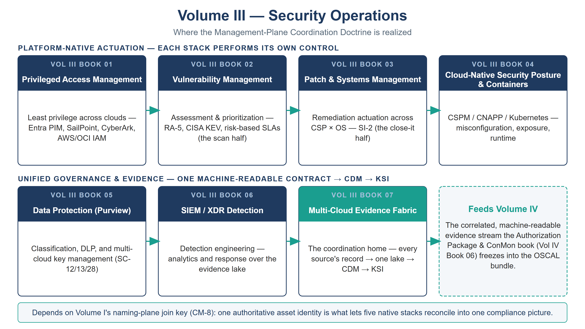

::: {.fouo-banner}
INTERNAL — NOT FOR PUBLIC DISTRIBUTION
:::

::: {.aan-warning}
## Draft Proposal — Subject to Review

This document is a **draft proposal** developed by the **CSI Team (Cloud Services Infrastructure)**. It has not been reviewed or approved by the  CIO Office, the Office of Information Security (OIS), or organizational leadership.

**Date Code:** 2026-07-08 16:23 ET
:::

# Volume Purpose

**Volume III is where the series' operational security planes live — and where
the Management-Plane Coordination Doctrine (Vol 0 Book 00, Executive Summary) is
realized.** The doctrine's split runs through every book here: **actuation is
platform-native** (privileged access, patching, and posture are
performed by each platform's own stack), while **governance and evidence are
unified** into one machine-readable contract that flows to CISA CDM and the
FedRAMP 20x KSI pipeline.

This is the volume that answers, for a genuinely multi-cloud federal estate, the
question the doctrine poses: *not "which single console runs everything," but
"which native stack actuates, and how does its evidence join the one compliance
picture."* The Multi-Cloud Evidence Fabric closes that loop; the other books
feed it.

{#fig-vol3-map fig-alt="A house-style volume map for Volume III, Security Operations, on a white background with a navy title and grey subtitle. Two labeled rows of book nodes show the Management-Plane Coordination Doctrine split. The top row, PLATFORM-NATIVE ACTUATION — EACH STACK PERFORMS ITS OWN CONTROL, holds four navy nodes joined by teal arrows: Book 01 Privileged Access Management; Book 02 Vulnerability Management (the scan half, RA-5, CISA KEV); Book 03 Patch & Systems Management (the close-it half, SI-2); and Book 04 Cloud-Native Security Posture & Containers. The bottom row, UNIFIED GOVERNANCE & EVIDENCE — ONE MACHINE-READABLE CONTRACT to CDM to KSI, holds Book 05 Data Protection (Purview) and Book 06 SIEM/XDR Detection feeding Book 07 Multi-Cloud Evidence Fabric, which is drawn with a teal header to mark it as the coordination home; a dashed teal callout reads Feeds Volume IV. A footer band notes the dependency on Volume I's naming-plane join key (CM-8) that lets five native stacks reconcile into one compliance picture. White background. Authored house-style diagram." width="100%"}

# Books in This Volume

| Book | Title | Role |
|---|---|---|
| **Vol III Book 01** | Privileged Access Management | Least privilege across clouds — Entra PIM, SailPoint, CyberArk, AWS/OCI IAM |
| **Vol III Book 02** | Vulnerability Management | Assessment & prioritization — RA-5, CISA KEV, risk-based SLAs (the *scan* half) |
| **Vol III Book 03** | Patch & Systems Management | Remediation actuation across CSP × OS — SI-2 (the *close-it* half) |
| **Vol III Book 04** | Cloud-Native Security Posture & Containers | CSPM / CNAPP / Kubernetes — misconfiguration, exposure, runtime |
| **Vol III Book 05** | Data Protection (Purview) | Classification, DLP, and multi-cloud key management (SC-12/13/28) |
| **Vol III Book 06** | SIEM / XDR Detection | Detection engineering — analytics and response over the evidence lake |
| **Vol III Book 07** | Multi-Cloud Evidence Fabric | The coordination home — every source's record → one lake → CDM → KSI |

: Volume III — Security Operations {.striped .hover}

# How This Volume Fits the Program

Volume III **depends on** Volume I's naming-plane join key (Vol I Book 01, CM-8)
— without one authoritative asset identity, five stacks produce five inventories
that cannot be reconciled. It **produces** the correlated, machine-readable
evidence stream (Vol III Book 07) that Volume IV's Authorization Package & ConMon
book (Vol IV Book 06) freezes into the OSCAL bundle. Truth is separated from
enforcement throughout: the evidence fabric is a truth plane, depended on; the
actuation stacks are enforcement planes, re-platformable per vendor.
