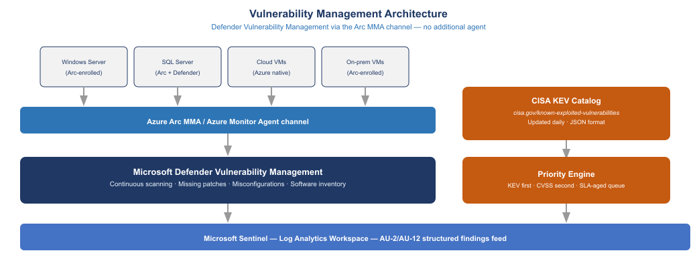
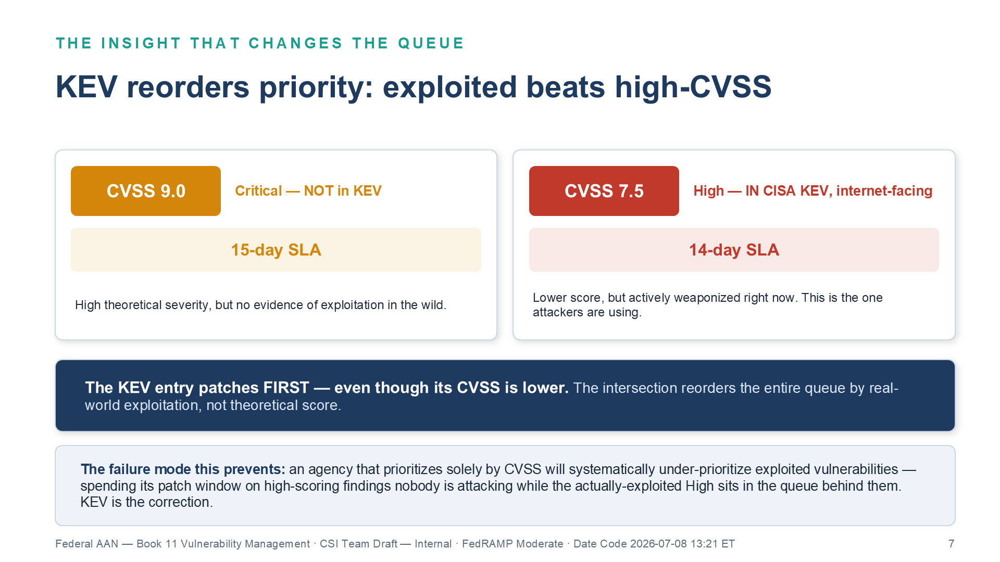
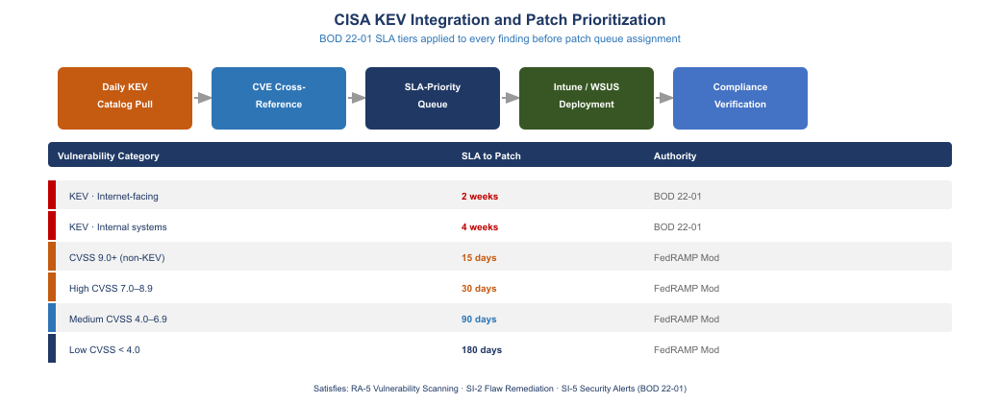
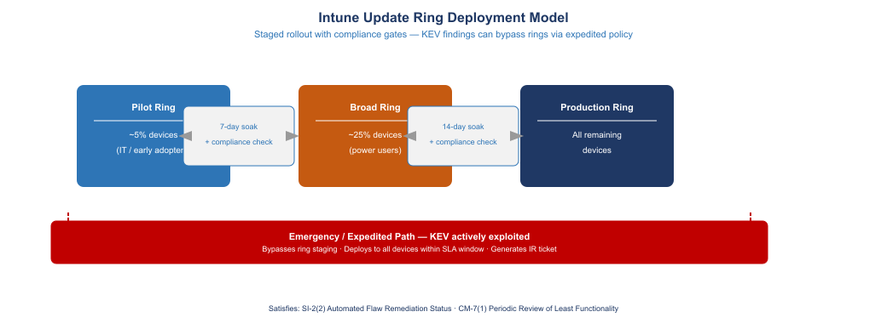
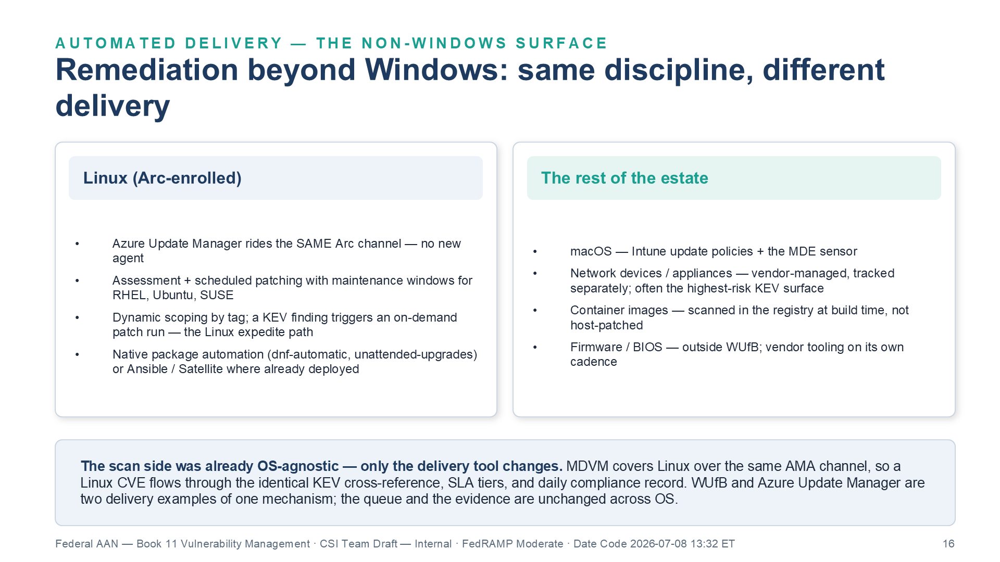
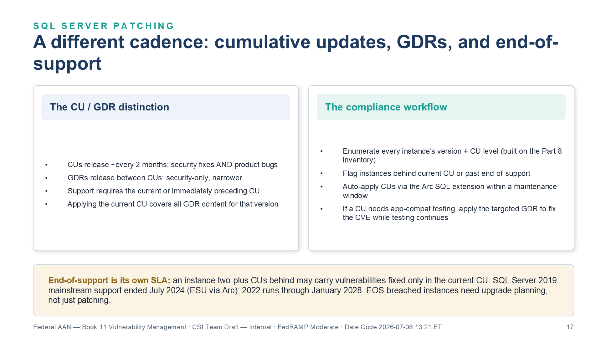
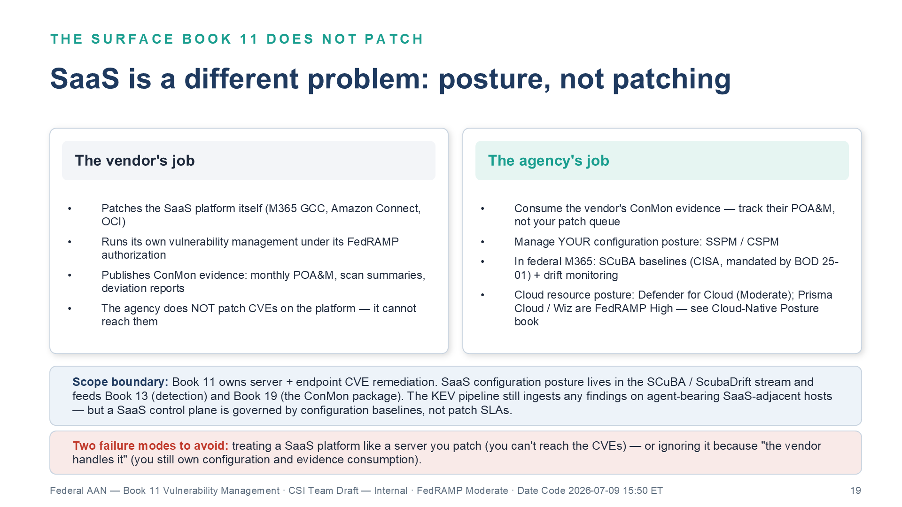
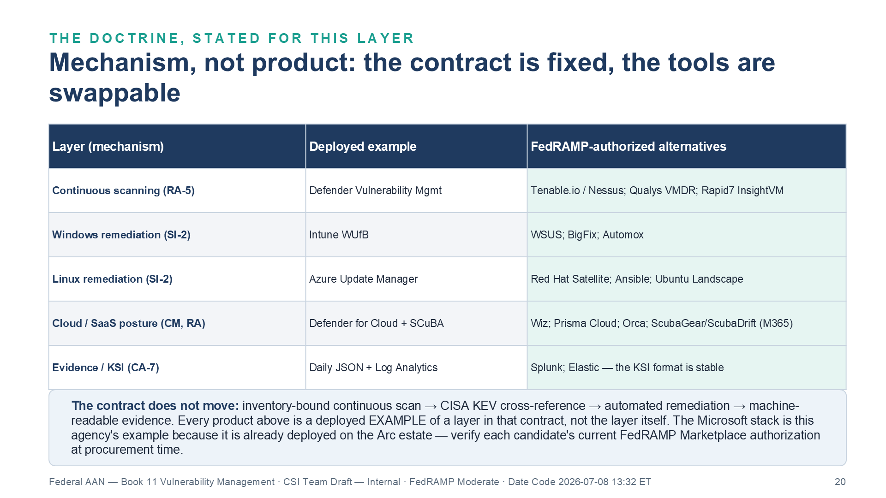
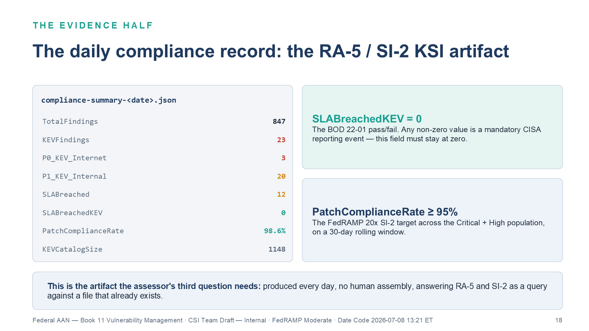
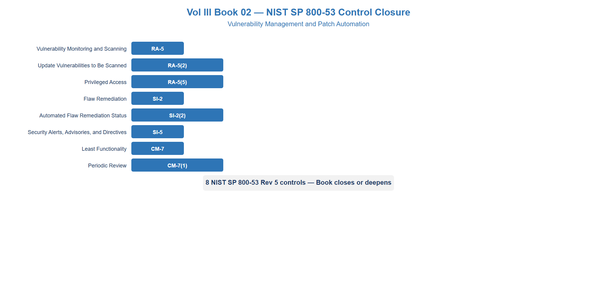

::: {.fouo-banner}
INTERNAL — NOT FOR PUBLIC DISTRIBUTION
:::

::: {.aan-warning}
## Draft Proposal — Subject to Review

This document is a **draft proposal** developed by the **CSI Team (Cloud Services Infrastructure)**. It is an attempt at a comprehensive -wide technical roadmap and has not been reviewed or approved by the  CIO Office, the Office of Information Security (OIS), or organizational leadership. All recommendations, vendor selections, control mappings, and implementation timelines are subject to revision pending formal review by the  CIO Office and organizational components.

**Date Code:** 2026-07-08 16:07 ET
:::

::: {.aan-important}
**Series Context** — This document is Vol III Book 02 of the Federal Application-Aware Networking series. Vol I Book 01 and the Volume II SQL Server books (Vol II Book 01–02) established the asset enumeration foundation: InfoBlox IPAM provides the authoritative IP and hostname inventory; Azure Arc enrollment provides the managed-node registry; the SQL Server implementation guide extends that registry to database instances. You cannot scan what you have not enumerated. Volumes I and II, plus Vol III Book 01 (Privileged Access Management), close the enumeration gap. This part establishes what to do with the enumeration: continuous vulnerability posture management linked to CISA's Known Exploited Vulnerabilities catalog and automated patch delivery through Windows Update for Business.
:::

::: {.aan-note}
## Scope Boundary — Assessment Here, Multi-CSP Actuation Next Door

This book is the **assessment and prioritization half** of the vulnerability plane — RA-5 scanning, KEV cross-reference, risk-based SLAs, and the machine-readable compliance record — worked as the **Microsoft/Defender reference implementation** of the series' evidence contract. The **remediation-actuation half (SI-2)** across the other platforms an agency runs — AWS Systems Manager, Oracle OS Management Hub and Ksplice, VMware vSphere Lifecycle Manager, Red Hat Satellite/Ansible — and the unified compliance record that coordinates them live in the **Patch & Systems Management** book, per the Management-Plane Coordination Doctrine (Executive Summary). Windows Update for Business and Azure Update Manager appear here as the Microsoft delivery examples; that book generalizes them to the whole estate.
:::

# What This Document Addresses

Federal vulnerability management fails at three distinct points, and FedRAMP assessors have learned to probe all three. The first failure is enumeration: assessors ask to see the asset inventory and find that it was produced six months ago by a one-time Nessus scan, does not include cloud-hosted assets, and does not account for assets added after the scan date. Volume I and the Vol II SQL Server books (Vol II Book 01–02) close that gap. The second failure is prioritization: agencies receive vulnerability findings ranked by CVSS score and apply generic severity buckets — Critical gets patched in 30 days, High in 60 days — without cross-referencing against the CISA Known Exploited Vulnerabilities (KEV) catalog, which represents the empirical set of vulnerabilities actively weaponized in the wild. The third failure is evidence: when an assessor asks whether the patch SLA was met for a specific CVE on a specific machine, the agency cannot produce a machine-readable record. There is no continuous output that tracks CVE-to-machine-to-patch-date. Each assessment cycle involves manual evidence assembly from disparate tools.

This document closes the second and third gaps. It builds on the Arc-enrolled inventory from Vol II Book 01 (SQL Server Authentication Modernization) and the SQL Server inventory from Vol II Book 02 (SQL Server Implementation Guide) to establish: (a) a continuous vulnerability scan using Microsoft Defender Vulnerability Management (MDVM) delivered through the Arc monitoring channel already deployed, (b) daily cross-reference against the CISA KEV catalog JSON feed, (c) a prioritized patch queue with BOD 22-01 SLA assignments, (d) automated patch delivery through Intune Windows Update for Business rings, and (e) a daily machine-readable compliance record that becomes the RA-5 KSI artifact for FedRAMP 20x.

The architecture deliberately avoids introducing new agents. Every Arc-enrolled server already runs the Azure Monitor Agent (AMA). Microsoft Defender for Endpoint (MDE) uses that same channel for its vulnerability assessment module. No additional per-server software deployment is required for the vulnerability scanning capability — the scanner follows the inventory, not the other way around.

{fig-alt="Architecture diagram showing Arc-enrolled servers on the left connected via Azure Monitor Agent (AMA) channel to Azure Arc in the center. Arc feeds into Microsoft Defender Vulnerability Management (MDVM) which receives daily CISA KEV JSON feed from the right. MDVM outputs to a prioritized patch queue below, which feeds into Intune Windows Update for Business rings. The diagram shows Windows Server 2012R2 through 2025 coverage and SQL Server installed software inventory. All components on white background with navy and teal color scheme." width="100%"}

---

# The Patch SLA Gap

## What FedRAMP Assessors Check

FedRAMP assessors evaluating RA-5 (Vulnerability Monitoring and Scanning) and SI-2 (Flaw Remediation) look for three things in sequence. First, is there a vulnerability scanner? A scanner that runs quarterly satisfies the question technically but triggers immediate follow-up about continuous monitoring. Second, is there a documented patch SLA by severity tier? Most agencies have a policy document with CVSS-based tiers. Third — and this is where most agencies fail — is the SLA being met, and can the agency demonstrate this with a machine-readable record that shows CVE, affected machine, detection date, patch date, and SLA outcome?

The third question is where the assessment typically stalls. An agency can show a scan report. It can show a policy document. But when the assessor asks "show me CVE-2023-34362 on machine SQL-PROD-07, when it was detected, when it was patched, and whether that fell within your stated SLA," the answer requires pulling from a vulnerability scanner, correlating with a patch management system, and manually assembling a record that may not exist in the format requested.

This document's architecture produces that record continuously and automatically.

## CISA BOD 22-01 and the KEV Catalog

Binding Operational Directive 22-01, issued by CISA in November 2021, established the Known Exploited Vulnerabilities catalog as a binding federal requirement. BOD 22-01 applies to all federal civilian executive branch agencies under FISMA. The KEV catalog (available at `https://www.cisa.gov/known-exploited-vulnerabilities-catalog`) is updated daily and published as a structured JSON feed at `https://www.cisa.gov/sites/default/files/feeds/known_exploited_vulnerabilities.json`.

The directive requires agencies to remediate each KEV entry by the **due date CISA assigns to that entry in the catalog** — historically within about two weeks for CVEs assigned in 2021 or later, and within six months for pre-2021 CVEs. BOD 22-01 sets **no** internet-facing/internal split; the per-entry catalog due date applies regardless of network exposure. (The exposure-based tiering below is 's own operational SLA, at least as tight as the catalog deadline; a network-exposure split historically traces to the now-superseded BOD 19-02, which used critical-15-day / high-30-day timelines. BOD 22-01 and BOD 19-02 were both superseded by **BOD 26-04** in June 2026, whose risk-based model this program also honors.) These deadlines are binding requirements with reporting obligations.

The consequence for FedRAMP is significant. CVSS 9.0 (Critical) without KEV status carries 's 15-day non-KEV Critical SLA. But a CVSS 7.5 (High) that appears in the KEV catalog must be remediated by its CISA-assigned KEV due date — and carries 's P0/P1 KEV SLA (14–28 days), far tighter than the 30-day non-KEV High tier. The KEV intersection changes the priority ordering entirely. Agencies that prioritize solely by CVSS will systematically under-prioritize exploited vulnerabilities.

{#fig-vuln05 fig-alt="Two comparison cards side by side. Left, a CVSS 9.0 badge in amber labeled Critical, not in KEV, carrying a 15-day SLA — high theoretical severity but no evidence of exploitation in the wild. Right, a CVSS 7.5 badge in red labeled High, in CISA KEV and internet-facing, carrying a 14-day SLA — lower score but actively weaponized right now, the one attackers are using. A navy bar between and below states that the KEV entry patches first even though its CVSS is lower, because the intersection reorders the entire queue by real-world exploitation rather than theoretical score. Blue bar: the failure mode this prevents is that an agency prioritizing solely by CVSS systematically under-prioritizes exploited vulnerabilities, spending its patch window on high-scoring findings nobody is attacking while the actually-exploited High waits behind them. White background. Source: Vol III Book 02 Vulnerability Management briefing deck, Date Code 2026-07-08 13:21 ET." width="100%"}

## Patch SLA Table

The following table defines the SLA tiers used in this implementation. The underlying KEV obligation — remediate by the CISA-assigned catalog due date — is BOD 22-01; the P0/P1 internet-facing vs internal split and their day counts are 's own operational SLA (set at least as tight as the catalog deadline). The non-KEV tiers follow NIST SP 800-40 Rev 4 guidance and align with standard FedRAMP Moderate patch-management expectations.

| Priority | Criteria | SLA (Calendar Days) | Authority |
|---|---|---|---|
| P0 — KEV Internet-Facing | CVE in CISA KEV AND system has external exposure | 14 days | BOD 22-01 (KEV due date);  SLA tier |
| P1 — KEV Internal | CVE in CISA KEV AND system is internal only | 28 days | BOD 22-01 (KEV due date);  SLA tier |
| P2 — Critical Non-KEV | CVSS 9.0–10.0, not in KEV | 15 days |  policy (informed by SP 800-40 R4; 15-day count traces to superseded BOD 19-02) |
| P3 — High Non-KEV | CVSS 7.0–8.9, not in KEV | 30 days |  policy (informed by SP 800-40 R4; 30-day count traces to superseded BOD 19-02) |
| P4 — Medium | CVSS 4.0–6.9 | 90 days | Agency Policy |
| P5 — Low | CVSS 0.1–3.9 | 180 days | Agency Policy |

: Patch SLA tiers by priority class {.striped .hover}

::: {.aan-warning}
**KEV Intersection Is Not Automatic** — No vulnerability scanner automatically flags KEV status. The CVSS score and the KEV catalog are maintained by different organizations (NVD/CVSS by NIST, KEV by CISA) and are not linked in standard scanner outputs. The cross-reference must be performed explicitly, either through a tool that integrates both feeds or through the automation described in Section 3 of this document.
:::

---

# Defender for Endpoint and Arc Integration

## How MDVM Uses the Arc Agent Channel

Microsoft Defender Vulnerability Management (MDVM) is the vulnerability assessment module within Microsoft Defender for Endpoint (MDE). On Arc-enrolled servers, MDVM uses the Azure Monitor Agent (AMA) channel that was installed during Arc enrollment. This is the critical architectural point: the scanning infrastructure already exists on every Arc-enrolled machine. No additional agent installation, no additional firewall rules, no separate scanner credentials.

The AMA channel was established in Vol II Book 02 (SQL Server Implementation Guide) of this series as the mechanism through which Arc-enrolled servers report hardware inventory, software inventory, and configuration state to Azure. MDVM piggybacks on this same channel to deliver:

- **Software inventory** — all installed software with version numbers, compared against vendor support lifecycle data
- **Missing patches** — operating system patches from Windows Update not yet applied, cross-referenced against CVSS scores and KEV status
- **Security configurations** — registry settings, service configurations, and enabled features compared against security baselines
- **SQL Server inventory** — SQL Server instances, versions, and cumulative update levels (critical for Section 5)

The result is that Arc enrollment is the single gate that enables vulnerability management. An agent added to the Arc inventory is automatically scanned. An agent removed from Arc enrollment is automatically removed from the scan scope. The inventory and the scan scope are always in sync because they are the same list.

## Coverage Matrix

| OS / Component | MDVM Coverage | Notes |
|---|---|---|
| Windows Server 2012 R2 | Yes (via MMA fallback) | ESU required; MMA not AMA |
| Windows Server 2016 | Yes | AMA channel |
| Windows Server 2019 | Yes | AMA channel |
| Windows Server 2022 | Yes | AMA channel, full baseline |
| Windows Server 2025 | Yes | AMA channel, full baseline |
| SQL Server 2014–2019 | Yes (software inventory) | CU-level tracking |
| SQL Server 2022 | Yes (software inventory + config) | Full baseline |
| Windows 10/11 (Intune-joined) | Yes | MDE sensor via Intune |
| Linux (Arc-enrolled) | Yes | AMA channel |

: MDVM coverage matrix for Arc-enrolled assets {.striped .hover}

::: {.aan-note}
**Windows Server 2012 R2 Exception** — Windows Server 2012 R2 uses the legacy Microsoft Monitoring Agent (MMA) rather than AMA, because AMA requires Windows Server 2016 or later. Arc enrollment on 2012 R2 provides Extended Security Updates (ESU) at no additional cost and installs MMA for the vulnerability channel. The MDVM data is equivalent; only the agent version differs. All 2012 R2 instances should be on an active upgrade path to 2022.
:::

## Verifying MDE Onboarding Status for Arc-Enrolled Machines

After Arc enrollment, MDVM onboarding is confirmed through the Defender portal. The following PowerShell script queries the Arc-enrolled machine list and cross-references against the MDE onboarding status using the Microsoft Security Graph API. Run this script from a workstation with the `Az` PowerShell module installed and an authenticated session with Defender API permissions (`WindowsDefenderATP: Machine.Read.All`).

```powershell
# Verify MDE onboarding status for all Arc-enrolled servers
# Requires: Az module, Microsoft.Graph module
# Permissions: WindowsDefenderATP Machine.Read.All, Azure Connected Machine Reader

param(
    [Parameter(Mandatory)]
    [string]$SubscriptionId,

    [Parameter(Mandatory)]
    [string]$ResourceGroupName,

    [string]$OutputPath = ".\mde-onboarding-status.csv"
)

# Authenticate to Azure
Connect-AzAccount -Subscription $SubscriptionId

# Retrieve all Arc-enrolled machines in the resource group
$arcMachines = Get-AzConnectedMachine -ResourceGroupName $ResourceGroupName |
    Select-Object Name, Location, OSName, Status, AgentVersion,
                  @{N='ArcId'; E={$_.Id}},
                  @{N='LastStatusChange'; E={$_.LastStatusChange}}

Write-Host "Found $($arcMachines.Count) Arc-enrolled machines"

# Obtain MDE API token via Managed Identity or service principal
$tenantId     = (Get-AzContext).Tenant.Id
$mdeTenantUrl = "https://api.securitycenter.microsoft.com"

$tokenRequest = @{
    Uri    = "https://login.microsoftonline.com/$tenantId/oauth2/v2.0/token"
    Method = 'POST'
    Body   = @{
        grant_type    = 'client_credentials'
        client_id     = $env:MDE_CLIENT_ID
        client_secret = $env:MDE_CLIENT_SECRET
        scope         = 'https://api.securitycenter.microsoft.com/.default'
    }
}
$token = (Invoke-RestMethod @tokenRequest).access_token

$authHeader = @{ Authorization = "Bearer $token" }

# Pull all machines registered in MDE
$mdeMachines = @()
$mdeUri = "$mdeTenantUrl/api/machines?`$select=id,computerDnsName,osPlatform,healthStatus,onboardingStatus"

do {
    $response = Invoke-RestMethod -Uri $mdeUri -Headers $authHeader -Method GET
    $mdeMachines += $response.value
    $mdeUri = $response.'@odata.nextLink'
} while ($mdeUri)

Write-Host "Found $($mdeMachines.Count) machines in MDE"

# Build lookup by DNS name (normalized to lowercase)
$mdeLookup = @{}
foreach ($m in $mdeMachines) {
    $key = $m.computerDnsName.ToLower().Split('.')[0]
    $mdeLookup[$key] = $m
}

# Cross-reference Arc machines against MDE
$results = foreach ($arc in $arcMachines) {
    $shortName = $arc.Name.ToLower()
    $mdeRecord = $mdeLookup[$shortName]

    [PSCustomObject]@{
        MachineName       = $arc.Name
        ArcStatus         = $arc.Status
        OS                = $arc.OSName
        ArcAgentVersion   = $arc.AgentVersion
        MDEOnboarded      = ($null -ne $mdeRecord)
        MDEHealthStatus   = if ($mdeRecord) { $mdeRecord.healthStatus } else { 'NOT_FOUND' }
        MDEOnboardStatus  = if ($mdeRecord) { $mdeRecord.onboardingStatus } else { 'NOT_ONBOARDED' }
        LastArcStatusChange = $arc.LastStatusChange
    }
}

# Output summary
$notOnboarded = $results | Where-Object { -not $_.MDEOnboarded }
$unhealthy    = $results | Where-Object { $_.MDEHealthStatus -eq 'Inactive' }

Write-Host ""
Write-Host "=== MDE Onboarding Summary ==="
Write-Host "Total Arc machines:  $($results.Count)"
Write-Host "MDE onboarded:       $(($results | Where-Object MDEOnboarded).Count)"
Write-Host "Not in MDE:          $($notOnboarded.Count)"
Write-Host "MDE inactive:        $($unhealthy.Count)"

if ($notOnboarded.Count -gt 0) {
    Write-Warning "The following machines are Arc-enrolled but NOT in MDE:"
    $notOnboarded | ForEach-Object { Write-Warning "  - $($_.MachineName)" }
}

# Export to CSV
$results | Export-Csv -Path $OutputPath -NoTypeInformation
Write-Host ""
Write-Host "Full results written to: $OutputPath"
```

::: {.aan-note}
**Onboarding Lag** — After Arc enrollment, MDE onboarding typically completes within 24–48 hours as the AMA channel establishes connectivity and the Defender sensor is provisioned. Run this verification script 48 hours after a batch enrollment to catch stragglers before declaring the enrollment complete.
:::

---

# CISA KEV Integration and Prioritization

## The KEV Catalog JSON Feed

CISA publishes the KEV catalog as a machine-readable JSON feed updated on a rolling daily basis. The feed schema includes, for each entry: `cveID`, `vendorProject`, `product`, `vulnerabilityName`, `dateAdded`, `shortDescription`, `requiredAction`, `dueDate`, and `notes`. The `dueDate` field represents the CISA-assigned remediation deadline, which may differ from the BOD 22-01 standard timelines for entries that carried specific due dates at time of catalog addition.

The feed URL is stable and does not require authentication:
`https://www.cisa.gov/sites/default/files/feeds/known_exploited_vulnerabilities.json`

The catalog currently contains over 1,000 entries and grows by 5–20 entries per week. The daily automation pull should be scheduled to run before the morning patch queue review so that overnight additions are reflected in the day's priority assignments.

## KEV Pull and CVE Cross-Reference

The following PowerShell script downloads the KEV catalog, extracts CVE IDs, queries the Defender VM API for current vulnerability findings on Arc-enrolled machines, and produces a prioritized patch queue with SLA assignments. This script is designed to run daily as a scheduled task or Azure Automation runbook.

```powershell
# CISA KEV + Defender VM daily patch priority queue
# Schedule: Daily 06:00 local time, before morning ops standup
# Output: JSON + CSV patch queue with SLA assignments

param(
    [string]$KevFeedUrl   = 'https://www.cisa.gov/sites/default/files/feeds/known_exploited_vulnerabilities.json',
    [string]$OutputDir    = '.\patch-queue',
    [string]$HistoryDir   = '.\patch-queue\history',
    [switch]$ExportCsv
)

$today     = Get-Date -Format 'yyyy-MM-dd'
$timestamp = Get-Date -Format 'yyyyMMdd-HHmmss'

# Ensure output directories exist
@($OutputDir, $HistoryDir) | ForEach-Object {
    if (-not (Test-Path $_)) { New-Item -ItemType Directory -Path $_ | Out-Null }
}

Write-Host "[$(Get-Date -Format 'HH:mm:ss')] Downloading CISA KEV catalog..."

# Download KEV catalog with retry
$kevData = $null
$retryCount = 0
do {
    try {
        $kevData = Invoke-RestMethod -Uri $KevFeedUrl -TimeoutSec 30
        break
    } catch {
        $retryCount++
        if ($retryCount -ge 3) { throw "Failed to download KEV catalog after 3 attempts: $_" }
        Start-Sleep -Seconds 10
    }
} while ($retryCount -lt 3)

# Build KEV lookup: CVE ID -> catalog entry
$kevCatalog = @{}
foreach ($entry in $kevData.vulnerabilities) {
    $kevCatalog[$entry.cveID] = @{
        DateAdded       = [datetime]$entry.dateAdded
        DueDate         = if ($entry.dueDate) { [datetime]$entry.dueDate } else { $null }
        VendorProduct   = "$($entry.vendorProject) $($entry.product)"
        RequiredAction  = $entry.requiredAction
        ShortDesc       = $entry.shortDescription
    }
}

Write-Host "[$(Get-Date -Format 'HH:mm:ss')] KEV catalog loaded: $($kevCatalog.Count) entries"

# --- MDE Defender VM API query ---
$tenantId = (Get-AzContext).Tenant.Id
$tokenRequest = @{
    Uri    = "https://login.microsoftonline.com/$tenantId/oauth2/v2.0/token"
    Method = 'POST'
    Body   = @{
        grant_type    = 'client_credentials'
        client_id     = $env:MDE_CLIENT_ID
        client_secret = $env:MDE_CLIENT_SECRET
        scope         = 'https://api.securitycenter.microsoft.com/.default'
    }
}
$token      = (Invoke-RestMethod @tokenRequest).access_token
$authHeader = @{ Authorization = "Bearer $token" }
$mdeBase    = 'https://api.securitycenter.microsoft.com/api'

Write-Host "[$(Get-Date -Format 'HH:mm:ss')] Querying Defender VM for active vulnerabilities..."

# Pull all active vulnerability findings (machine + CVE combinations)
$findings   = @()
$findingUri = "$mdeBase/vulnerabilities/machinesvulnerabilities?`$select=cveId,machineId,fixingKbId,severity,cvssV3,productName,softwareVersion,recommendedSecurityUpdate"

do {
    $response  = Invoke-RestMethod -Uri $findingUri -Headers $authHeader -Method GET
    $findings += $response.value
    $findingUri = $response.'@odata.nextLink'
} while ($findingUri)

Write-Host "[$(Get-Date -Format 'HH:mm:ss')] Retrieved $($findings.Count) CVE-machine findings"

# Pull machine details for exposure classification
$machines   = @{}
$machineUri = "$mdeBase/machines?`$select=id,computerDnsName,isInternetFacing,osPlatform,rbacGroupName"

do {
    $response  = Invoke-RestMethod -Uri $machineUri -Headers $authHeader -Method GET
    foreach ($m in $response.value) { $machines[$m.id] = $m }
    $machineUri = $response.'@odata.nextLink'
} while ($machineUri)

# Build prioritized patch queue
$patchQueue = foreach ($finding in $findings) {
    $cve         = $finding.cveId
    $machineInfo = $machines[$finding.machineId]
    $isKev       = $kevCatalog.ContainsKey($cve)
    $isInternet  = $machineInfo -and $machineInfo.isInternetFacing

    # Assign priority and SLA
    $priority = switch ($true) {
        ($isKev -and $isInternet)   { 'P0-KEV-Internet'; break }
        ($isKev -and -not $isInternet) { 'P1-KEV-Internal'; break }
        ($finding.severity -eq 'Critical') { 'P2-Critical'; break }
        ($finding.severity -eq 'High')     { 'P3-High'; break }
        ($finding.severity -eq 'Medium')   { 'P4-Medium'; break }
        default                            { 'P5-Low' }
    }

    $slaDays = switch ($priority) {
        'P0-KEV-Internet' { 14 }
        'P1-KEV-Internal' { 28 }
        'P2-Critical'     { 15 }
        'P3-High'         { 30 }
        'P4-Medium'       { 90 }
        default           { 180 }
    }

    # SLA due date: KEV findings use the CISA-assigned catalog dueDate (the deadline CISA
    # actually assigned), falling back to dateAdded + window only when dueDate is absent.
    # Non-KEV findings run from today.
    if ($isKev) {
        $kevEntry = $kevCatalog[$cve]
        $slaDue   = if ($kevEntry.DueDate) { $kevEntry.DueDate } else { $kevEntry.DateAdded.AddDays($slaDays) }
    } else {
        $slaDue   = ([datetime]::Today).AddDays($slaDays)
    }
    $daysLeft  = ([datetime]$slaDue - [datetime]::Today).Days

    [PSCustomObject]@{
        Priority         = $priority
        CVE              = $cve
        MachineName      = if ($machineInfo) { $machineInfo.computerDnsName } else { $finding.machineId }
        MachineGroup     = if ($machineInfo) { $machineInfo.rbacGroupName } else { 'Unknown' }
        IsInternetFacing = $isInternet
        InKEV            = $isKev
        CvssV3           = $finding.cvssV3
        Severity         = $finding.severity
        Product          = $finding.productName
        ProductVersion   = $finding.softwareVersion
        FixKB            = $finding.fixingKbId
        SLADueDateUTC    = $slaDue.ToString('yyyy-MM-dd')
        DaysRemaining    = $daysLeft
        SLABreached      = ($daysLeft -lt 0)
        KEVDateAdded     = if ($isKev) { $kevCatalog[$cve].DateAdded.ToString('yyyy-MM-dd') } else { '' }
        RequiredAction   = if ($isKev) { $kevCatalog[$cve].RequiredAction } else { '' }
        AsOfDate         = $today
    }
}

# Sort by priority then days remaining (most urgent first)
$priorityOrder = @{ 'P0-KEV-Internet'=0; 'P1-KEV-Internal'=1; 'P2-Critical'=2;
                    'P3-High'=3; 'P4-Medium'=4; 'P5-Low'=5 }
$patchQueue = $patchQueue | Sort-Object {
    $priorityOrder[$_.Priority] * 10000 + [Math]::Max(-9999, $_.DaysRemaining)
}

# Summary metrics for the daily compliance record
$summary = [ordered]@{
    AsOfDate             = $today
    TotalFindings        = $findings.Count
    TotalMachines        = ($patchQueue | Select-Object -ExpandProperty MachineName -Unique).Count
    KEVFindings          = ($patchQueue | Where-Object InKEV).Count
    P0_KEV_Internet      = ($patchQueue | Where-Object Priority -eq 'P0-KEV-Internet').Count
    P1_KEV_Internal      = ($patchQueue | Where-Object Priority -eq 'P1-KEV-Internal').Count
    P2_Critical          = ($patchQueue | Where-Object Priority -eq 'P2-Critical').Count
    P3_High              = ($patchQueue | Where-Object Priority -eq 'P3-High').Count
    P4_Medium            = ($patchQueue | Where-Object Priority -eq 'P4-Medium').Count
    P5_Low               = ($patchQueue | Where-Object Priority -eq 'P5-Low').Count
    SLABreached          = ($patchQueue | Where-Object SLABreached).Count
    SLABreachedKEV       = ($patchQueue | Where-Object { $_.SLABreached -and $_.InKEV }).Count
    MachinesOutOfSLA     = ($patchQueue | Where-Object SLABreached |
                             Select-Object -ExpandProperty MachineName -Unique).Count
    PatchComplianceRate  = if ($findings.Count -gt 0) {
                               [Math]::Round(100 * (1 - ($patchQueue | Where-Object SLABreached).Count / $findings.Count), 1)
                           } else { 100 }
    KEVCatalogSize       = $kevCatalog.Count
    KEVCatalogAsOf       = $kevData.catalogVersion
}

# Write daily output files
$queuePath   = Join-Path $OutputDir "patch-queue-$today.json"
$summaryPath = Join-Path $OutputDir "compliance-summary-$today.json"
$archivePath = Join-Path $HistoryDir "patch-queue-$timestamp.json"

$patchQueue  | ConvertTo-Json -Depth 4 | Set-Content $queuePath   -Encoding UTF8
$summary     | ConvertTo-Json -Depth 2 | Set-Content $summaryPath -Encoding UTF8
Copy-Item $queuePath $archivePath

if ($ExportCsv) {
    $patchQueue | Export-Csv -Path (Join-Path $OutputDir "patch-queue-$today.csv") -NoTypeInformation
}

# Console output
Write-Host ""
Write-Host "=== Daily Patch Queue Summary ($today) ==="
Write-Host "Total CVE-machine findings:  $($summary.TotalFindings)"
Write-Host "Machines with findings:      $($summary.TotalMachines)"
Write-Host "KEV findings:                $($summary.KEVFindings)"
Write-Host "  P0 (KEV Internet-facing):  $($summary.P0_KEV_Internet)"
Write-Host "  P1 (KEV Internal):         $($summary.P1_KEV_Internal)"
Write-Host "SLA breached (total):        $($summary.SLABreached)"
Write-Host "SLA breached (KEV):          $($summary.SLABreachedKEV)"
Write-Host "Patch compliance rate:       $($summary.PatchComplianceRate)%"
Write-Host ""
Write-Host "Patch queue written to: $queuePath"
Write-Host "Compliance summary:     $summaryPath"

if ($summary.SLABreachedKEV -gt 0) {
    Write-Warning "ALERT: $($summary.SLABreachedKEV) KEV findings have breached their BOD 22-01 SLA. Escalate immediately."
}
```

{fig-alt="Flow diagram showing the daily KEV integration pipeline on a white background. Left column: CISA KEV JSON feed downloaded daily at 06:00 UTC, 1000-plus CVE entries extracted into an in-memory lookup table. Center column: Defender VM API queried for all active CVE-machine findings, machine exposure classification (internet-facing vs internal) pulled from MDE machine table. Right column: Cross-reference produces priority assignments P0 through P5, SLA due dates calculated from KEV dateAdded or scan date, patch queue sorted by priority then days remaining. Bottom: compliance-summary JSON written to storage as the RA-5 KSI artifact. Color coding: P0 red, P1 orange, P2 amber, P3 yellow, P4 teal, P5 navy." width="100%"}

::: {.aan-important}
**BOD 22-01 Reporting Obligation** — Agencies subject to BOD 22-01 must report remediation status for KEV catalog entries to CISA through the Continuous Diagnostics and Mitigation (CDM) program. The daily compliance summary JSON produced by the script above is structured to support onward reporting into the CDM Agency Dashboard; coordinate the field mapping with your CDM team to configure automated upload of the summary file.
:::

---

# Patch Automation — Azure Update Manager (Servers) and Intune WUfB (Clients)

::: {.aan-important}
**Correct the delivery lane by machine class.** Intune Windows Update for
Business (WUfB) update rings support **Windows client editions only** (Pro,
Enterprise, Education, LTSC) — **not Windows Server** — and an Intune
`windows10CompliancePolicy` evaluates only devices **enrolled in Intune MDM**.
An Arc-enrolled server is connected through the Azure Connected Machine agent,
**not** MDM-enrolled, so neither WUfB rings nor an Intune compliance policy
reaches it. For this book's estate — **Arc-enrolled Windows Servers** (domain
controllers, database servers) — patch delivery and enforcement run through
**Azure Update Manager** (periodic assessment, scheduled patching via
maintenance configurations, dynamic scoping) governed by **Azure Policy**, the
same lane the Linux section below uses. The WUfB ring and compliance-policy
material that follows applies to the **Windows 10/11 client fleet** (field-office
workstations), not the server estate. *A full Azure Update Manager
implementation for the Windows-server lane is tracked as follow-up work; the
scripts below are the client lane.*
:::

## Windows Update for Business Architecture (Windows 10/11 clients)

Windows Update for Business (WUfB) is Microsoft's managed update service that delivers Windows patches directly from Microsoft's Content Delivery Network without requiring an on-premises WSUS server. When managed through Intune (endpoint management), WUfB provides granular control over update timing, ring-based deployment, and compliance enforcement.

The WUfB ring model is the central mechanism for controlled patch rollout. Rings define groups of machines that receive updates at different points in the release cycle. This allows a patch to be validated on a small pilot population before broad deployment, and for emergency patches to bypass the normal ring schedule via the expedited update mechanism.

::: {.aan-note}
**WSUS vs. WUfB** — Agencies running WSUS for on-premises patch management can migrate to WUfB for Arc-enrolled and Intune-managed machines without decommissioning WSUS for machines that remain outside that management boundary. WUfB and WSUS can coexist. The migration path is to place Intune-managed machines in WUfB policy and leave the remaining population in WSUS until it is enrolled.
:::

## Ring Configuration

Three rings are defined for this implementation. The pilot ring contains machines used by IT staff and technically capable early adopters — typically 5–10% of the estate. The broad ring contains the main production population deployed two weeks after pilot. The production ring contains the most sensitive client workloads (executive and IT-administrator workstations, kiosks) deployed one week after broad, with an additional 72-hour observation window before forced installation. (Server workloads — domain controllers, database servers — are patched through Azure Update Manager, not these client rings; see the correction callout above.)

For KEV-driven emergency patches, all rings are bypassed by the expedited update mechanism. An expedited update policy targets all devices regardless of ring and begins downloading within 24 hours of policy assignment.

The following PowerShell script configures the three update rings via the Microsoft Graph API. It requires the `Microsoft.Graph` module and a service principal with `DeviceManagementConfiguration.ReadWrite.All` permission.

```powershell
# Configure Intune WUfB update rings for patch automation
# Requires: Microsoft.Graph PowerShell module
# Permission: DeviceManagementConfiguration.ReadWrite.All

param(
    [Parameter(Mandatory)]
    [string]$TenantId,

    [Parameter(Mandatory)]
    [string]$ClientId,

    [Parameter(Mandatory)]
    [string]$ClientSecret
)

# Authenticate to Microsoft Graph
$tokenBody = @{
    grant_type    = 'client_credentials'
    client_id     = $ClientId
    client_secret = $ClientSecret
    scope         = 'https://graph.microsoft.com/.default'
}
$token      = (Invoke-RestMethod -Uri "https://login.microsoftonline.com/$TenantId/oauth2/v2.0/token" -Method POST -Body $tokenBody).access_token
$authHeader = @{
    Authorization  = "Bearer $token"
    'Content-Type' = 'application/json'
}

$graphBase = 'https://graph.microsoft.com/v1.0'

# Ring definitions
$rings = @(
    @{
        displayName          = 'WUfB-Ring-Pilot'
        description          = 'Pilot ring: IT staff and early adopters. Receives updates immediately after Patch Tuesday.'
        featureUpdatesDeferred = 30          # Days to defer feature updates
        qualityUpdatesDeferral = 0           # Quality (security) updates deferred 0 days in pilot
        deadlineForQualityUpdates = 3        # Force install 3 days after deferral period
        deadlineGracePeriod  = 2             # 2-day grace period after deadline
        autoRestartNotificationDismissal = 'notConfigured'
        scheduleRestartWarningInHours    = 4
        scheduleImminentRestartWarningInMinutes = 15
    },
    @{
        displayName          = 'WUfB-Ring-Broad'
        description          = 'Broad ring: general production population. Receives updates 14 days after pilot.'
        featureUpdatesDeferred = 60
        qualityUpdatesDeferral = 14
        deadlineForQualityUpdates = 7
        deadlineGracePeriod  = 2
        autoRestartNotificationDismissal = 'notConfigured'
        scheduleRestartWarningInHours    = 8
        scheduleImminentRestartWarningInMinutes = 30
    },
    @{
        displayName          = 'WUfB-Ring-Production'
        description          = 'Production ring: sensitive servers (DCs, DB servers). 21 days after pilot, 72-hour observation.'
        featureUpdatesDeferred = 90
        qualityUpdatesDeferral = 21
        deadlineForQualityUpdates = 7
        deadlineGracePeriod  = 3
        autoRestartNotificationDismissal = 'notConfigured'
        scheduleRestartWarningInHours    = 12
        scheduleImminentRestartWarningInMinutes = 60
    }
)

foreach ($ring in $rings) {
    $body = @{
        '@odata.type'                            = '#microsoft.graph.windowsUpdateForBusinessConfiguration'
        displayName                               = $ring.displayName
        description                               = $ring.description
        microsoftUpdateServiceAllowed             = $true
        driversExcluded                           = $false
        qualityUpdatesDeferralPeriodInDays        = $ring.qualityUpdatesDeferral
        featureUpdatesDeferralPeriodInDays        = $ring.featureUpdatesDeferred
        qualityUpdatesWillBeRolledBack            = $false
        featureUpdatesWillBeRolledBack            = $false
        qualityUpdatesPauseStartDateTime          = $null
        featureUpdatesPauseStartDateTime          = $null
        businessReadyUpdatesOnly                  = 'businessReadyOnly'
        skipChecksBeforeRestart                   = $false
        updateNotificationLevel                   = 'defaultNotifications'
        deadlineForQualityUpdatesInDays           = $ring.deadlineForQualityUpdates
        deadlineForFeatureUpdatesInDays           = 14
        deadlineGracePeriodInDays                 = $ring.deadlineGracePeriod
        postponeRebootUntilAfterDeadline          = $false
        autoRestartNotificationDismissal          = $ring.autoRestartNotificationDismissal
        scheduleRestartWarningInHours             = $ring.scheduleRestartWarningInHours
        scheduleImminentRestartWarningInMinutes   = $ring.scheduleImminentRestartWarningInMinutes
    } | ConvertTo-Json -Depth 5

    $uri = "$graphBase/deviceManagement/deviceConfigurations"
    $result = Invoke-RestMethod -Uri $uri -Method POST -Headers $authHeader -Body $body

    Write-Host "Created ring: $($result.displayName) (ID: $($result.id))"
}

Write-Host ""
Write-Host "Update rings created. Next steps:"
Write-Host "1. Assign device groups to each ring in the Intune portal"
Write-Host "2. Configure compliance policy (see below) to enforce patch currency"
Write-Host "3. Link compliance policy to Conditional Access for non-compliant block"
```

## Compliance Policy and Conditional Access Enforcement

The patch rings control when patches are delivered. The compliance policy defines when a **client** is considered compliant with the patch SLA. Intune's `windows10CompliancePolicy` has no native "days behind" field; patch currency is enforced by pinning `osMinimumVersion` (or `osValidOperatingSystemBuildRanges`) to the build required as of the currency deadline and refreshing it on a monthly cadence — or by a custom compliance script — so that a client more than ~30 days behind the required build is marked non-compliant, which triggers the Conditional Access enforcement gate: the client loses access to enterprise applications until patching is completed. The policy below leaves those version fields empty for the agency to populate with its current baseline build.

```powershell
# Create Intune compliance policy: patch currency enforcement
# Client patch-currency compliance (Windows 10/11 only; servers use Azure Update Manager).
# Enforce "~30 days behind" by pinning osMinimumVersion / build ranges to the required
# build and refreshing monthly — the empty fields below are placeholders to populate.

$compliancePolicy = @{
    '@odata.type'   = '#microsoft.graph.windows10CompliancePolicy'
    displayName     = 'Patch-Currency-Compliance'
    description     = 'Marks machines non-compliant if OS patches are more than 30 days behind. Triggers CA block.'
    osMinimumVersion = ''
    osMaximumVersion = ''
    mobileOsMinimumVersion = ''
    mobileOsMaximumVersion = ''
    passwordRequired = $false
    passwordBlockSimple = $false
    passwordRequiredType = 'deviceDefault'
    passwordMinimumLength = 0
    passwordMinutesOfInactivityBeforeLock = 0
    passwordExpirationDays = 0
    passwordPreviousPasswordBlockCount = 0
    requireHealthyDeviceReport = $true
    osValidOperatingSystemBuildRanges = @()
    deviceThreatProtectionEnabled = $true
    deviceThreatProtectionRequiredSecurityLevel = 'medium'
    configurationManagerComplianceRequired = $false
    tpmRequired = $false
    # Patch currency: populate with the build range required as of the currency deadline
    # (empty = enforces nothing; refresh monthly to the current baseline build)
    validOperatingSystemBuildRanges = @()
    storageRequireEncryption = $false
    activeFirewallRequired = $true
    defenderEnabled = $true
    defenderVersion = ''
    signatureOutOfDate = $false     # Defender signatures
    rtpEnabled = $true              # Real-time protection required
    antivirusRequired = $true
    antiSpywareRequired = $true
    bitLockerEnabled = $false
    secureBootEnabled = $true
    codeIntegrityEnabled = $false
    validOperatingSystemBuildRangesAsStrings = @()
} | ConvertTo-Json -Depth 5

$compUri = "$graphBase/deviceManagement/deviceCompliancePolicies"
$compResult = Invoke-RestMethod -Uri $compUri -Method POST -Headers $authHeader -Body $compliancePolicy

Write-Host "Compliance policy created: $($compResult.displayName) (ID: $($compResult.id))"
Write-Host "Assign this policy to all managed device groups and link to a Conditional Access policy."
```

::: {.aan-warning}
**Grace Period Before Enforcement** — When deploying this compliance policy for the first time against a population with accumulated patch debt, set a 30-day grace period in Conditional Access before the non-compliance block takes effect. Use the first 30 days to remediate the backlog. Immediately blocking access on day one will generate helpdesk volume that obscures the machines that genuinely need emergency attention.
:::

{fig-alt="Deployment ring diagram on white background. Three horizontal lanes labeled Pilot ring at top (5-10% IT staff, deferral 0 days), Broad ring in middle (90% production population, deferral 14 days), Production ring at bottom (sensitive servers, deferral 21 days). Timeline arrow runs left to right: Patch Tuesday release, then pilot deployment, then plus-14-day broad deployment, then plus-21-day production deployment. Emergency bypass arrow labeled KEV Expedited Update Policy bypasses all rings and targets all machines within 24 hours. Compliance gate shown on right side: WUfB compliance policy checks patch currency, non-compliant machines blocked by Conditional Access from enterprise applications. Ring assignment boxes show Intune device group filter icons. Color scheme: pilot in teal, broad in navy, production in amber, emergency in red, compliance gate in green." width="100%"}

---

# Remediation Beyond Windows

The scanning half of this architecture is operating-system agnostic. Microsoft Defender Vulnerability Management covers Linux over the same Azure Monitor Agent channel it uses for Windows, so a Linux CVE flows through the identical CISA KEV cross-reference, the identical six-tier SLA table, and the identical daily compliance record described above. Detection, prioritization, and evidence do not change by operating system. What changes is the patch **delivery** mechanism — Windows Update for Business is Windows-only — so the remediation lane needs a non-Windows equivalent.

{#fig-vuln08 fig-alt="Two panels. Left, Linux (Arc-enrolled): Azure Update Manager rides the same Arc channel with no new agent, providing assessment plus scheduled patching with maintenance windows for RHEL, Ubuntu, and SUSE, dynamic scoping by tag, and an on-demand patch run as the Linux KEV-expedite path; native package automation (dnf-automatic, unattended-upgrades) or Ansible/Satellite are valid where already deployed. Right, the rest of the estate: macOS via Intune update policies and the MDE sensor; network devices and appliances vendor-managed and tracked separately, often the highest-risk KEV surface; container images scanned in the registry at build time rather than host-patched; firmware and BIOS outside WUfB on vendor tooling. Blue bar: the scan side was already OS-agnostic — only the delivery tool changes; WUfB and Azure Update Manager are two delivery examples of one mechanism and the queue and the evidence are unchanged across OS. White background. Source: Vol III Book 02 Vulnerability Management briefing deck, Date Code 2026-07-08 13:32 ET." width="100%"}

## Linux Patch Delivery

For Arc-enrolled Linux hosts, **Azure Update Manager** is the direct analogue to WUfB and rides the same Arc connection already established for scanning — no additional agent. It provides assessment and scheduled patching with maintenance windows across RHEL, Ubuntu, and SUSE, dynamic machine scoping by tag, and an on-demand patch run that serves as the Linux equivalent of the KEV expedited path. Where an agency already operates native package automation (`dnf-automatic`, `unattended-upgrades`) or configuration management (Ansible, Red Hat Satellite, Ubuntu Landscape), those remain valid delivery mechanisms; Update Manager is the default because it inherits the same Arc inventory gate that governs the Windows estate.

## The Rest of the Estate

The remediation program must account for surfaces that neither WUfB nor Update Manager reaches:

- **macOS** — patched through Intune update policies with the MDE sensor providing the vulnerability signal.
- **Network devices and appliances** — vendor-managed on their own firmware cadence, tracked separately from the host patch queue. These are frequently the single highest-risk KEV surface: edge VPN, firewall, and load-balancer CVEs dominate the exploited-in-the-wild entries in the KEV catalog, and they are outside every host-based patch tool.
- **Container images** — remediated by scanning in the registry at build time and rebuilding, not by patching running hosts.
- **Firmware and BIOS** — outside WUfB entirely; addressed through vendor tooling on its own cadence.

::: {.aan-note}
**One mechanism, several delivery tools** — WUfB (Windows) and Azure Update Manager (Linux) are two delivery examples of a single mechanism: inventory-bound automated remediation on an SLA. The priority queue, the KEV cross-reference, and the machine-readable compliance record are constant across the operating-system surface. This is the point generalized in the *Mechanism, Not Product* section below — and generalized *across cloud platforms* (AWS Systems Manager, Oracle OS Management Hub/Ksplice, VMware vSphere Lifecycle Manager, Red Hat Satellite/Ansible) in the **Patch & Systems Management** book, which defines the unified compliance record every stack emits. The network-device and appliance surface flagged above is closed by the **Network Enforcement Substrate** book, whose gear is accredited via NIAP/STIG/FIPS rather than FedRAMP.
:::

# SQL Server Patching

## SQL Server Cumulative Update Lifecycle

SQL Server patching follows a different cadence than Windows patching. Microsoft releases Cumulative Updates (CUs) for each SQL Server version approximately every two months, with General Distribution Releases (GDRs) for critical security fixes released between CUs. The distinction matters for compliance: a GDR addresses only security vulnerabilities, while a CU addresses both security vulnerabilities and product bugs.

For FedRAMP compliance, the relevant requirement is that SQL Server instances remain within the supported cumulative update range. Microsoft's support policy requires that instances run the current or immediately preceding CU to receive support for issues discovered after that CU's release. An instance running a CU that is two or more versions behind the current CU may have known security vulnerabilities that are fixed only in the current CU.

The Microsoft SQL Server support lifecycle page (`https://learn.microsoft.com/en-us/sql/sql-server/end-of-support/sql-server-end-of-life-overview`) defines the end-of-support dates for each version. SQL Server 2019 runs through its end-of-support date of January 8, 2030 (mainstream support ended February 2025; extended security updates are available via Arc enrollment) — see the CU map below. SQL Server 2022 mainstream support runs through January 2028.

{#fig-vuln06 fig-alt="Two panels. Left, the CU/GDR distinction: Cumulative Updates release about every two months carrying both security fixes and product bugs; GDRs release between CUs and are security-only and narrower; support requires the current or immediately preceding CU; applying the current CU covers all GDR content for that version. Right, the compliance workflow: enumerate every instance's version and CU level built on the Vol II Book 02 inventory; flag instances behind current CU or past end-of-support; auto-apply CUs via the Arc SQL extension within a maintenance window; if a CU needs application-compatibility testing, apply the targeted GDR to fix the CVE while testing continues. Amber bar: end-of-support is its own SLA — an instance two or more CUs behind may carry vulnerabilities fixed only in the current CU; SQL Server 2019 runs to its end-of-support date of January 8 2030 with ESU via Arc, 2022 runs through January 2028; EOS-breached instances need upgrade planning, not just patching. White background. Source: Vol III Book 02 Vulnerability Management briefing deck, Date Code 2026-07-08 13:21 ET." width="100%"}

## Enumerating SQL Server Versions Across the Estate

The following script builds on the Vol II Book 02 SQL Server inventory to enumerate all SQL Server instances, their current version, the current available CU, and whether they are within support. It uses the Arc-enrolled machine list as the inventory source and queries each instance via `sqlcmd`.

```powershell
# Enumerate SQL Server versions across all Arc-enrolled machines
# Produces a CU-level inventory for compliance tracking
# Prerequisite: sqlcmd installed on management workstation, network access to SQL instances

param(
    [Parameter(Mandatory)]
    [string]$SubscriptionId,

    [string]$ResourceGroupName,

    [string]$OutputPath = ".\sql-version-inventory.csv",

    [PSCredential]$SqlCredential   # If using SQL auth; omit for Windows auth
)

# Connect to Azure and retrieve Arc-enrolled SQL Server extensions
Connect-AzAccount -Subscription $SubscriptionId

$sqlExtFilter = if ($ResourceGroupName) {
    Get-AzConnectedMachineExtension -ResourceGroupName $ResourceGroupName |
        Where-Object ExtensionType -eq 'WindowsAgent.SqlServer'
} else {
    Get-AzConnectedMachineExtension |
        Where-Object ExtensionType -eq 'WindowsAgent.SqlServer'
}

Write-Host "Found $($sqlExtFilter.Count) machines with SQL Server Arc extension"

# Current CU baselines (update quarterly as new CUs release)
# Source: https://learn.microsoft.com/en-us/sql/sql-server/latest-updates-for-microsoft-sql-server
$currentCuMap = @{
    '2022' = @{ MajorMinor = '16.0'; CurrentCU = 'CU17'; CurrentBuild = '16.0.4175.1'; EOS = '2033-01-11' }
    '2019' = @{ MajorMinor = '15.0'; CurrentCU = 'CU29'; CurrentBuild = '15.0.4415.2'; EOS = '2030-01-08' }
    '2017' = @{ MajorMinor = '14.0'; CurrentCU = 'CU31'; CurrentBuild = '14.0.3465.1'; EOS = '2027-10-12' }
    '2016' = @{ MajorMinor = '13.0'; CurrentCU = 'SP3'; CurrentBuild  = '13.0.6441.1'; EOS = '2026-07-14' }
    '2014' = @{ MajorMinor = '12.0'; CurrentCU = 'SP3 CU4+GDR'; CurrentBuild = '12.0.6449.1'; EOS = '2024-07-09' }
}

$inventory = foreach ($ext in $sqlExtFilter) {
    $machineName = $ext.MachineName

    # Query SQL Server version via sqlcmd (Windows auth to Arc-enrolled machine)
    $query = "SET NOCOUNT ON; SELECT @@SERVERNAME AS ServerName, @@VERSION AS FullVersion, SERVERPROPERTY('ProductVersion') AS ProductVersion, SERVERPROPERTY('ProductLevel') AS ProductLevel, SERVERPROPERTY('ProductUpdateLevel') AS CULevel, SERVERPROPERTY('Edition') AS Edition;"

    try {
        $result = if ($SqlCredential) {
            sqlcmd -S $machineName -U $SqlCredential.UserName -P ($SqlCredential.GetNetworkCredential().Password) -Q $query -h-1 -s'|' -W 2>$null
        } else {
            sqlcmd -S $machineName -E -Q $query -h-1 -s'|' -W 2>$null
        }

        if ($result -and $result.Count -ge 1) {
            $cols          = $result[0] -split '\|'
            $productVersion = $cols[2].Trim()
            $versionParts  = $productVersion.Split('.')
            $majorVersion  = $versionParts[0]

            # Map major version number to SQL year
            $sqlYear = switch ($majorVersion) {
                '16' { '2022' }
                '15' { '2019' }
                '14' { '2017' }
                '13' { '2016' }
                '12' { '2014' }
                '11' { '2012' }
                default { 'Unknown' }
            }

            $cuInfo = $currentCuMap[$sqlYear]
            $isSupported    = $cuInfo -and ([datetime]$cuInfo.EOS -gt [datetime]::Today)
            $currentBuildOk = $cuInfo -and ($productVersion -ge $cuInfo.CurrentBuild)

            [PSCustomObject]@{
                MachineName      = $machineName
                ServerName       = $cols[0].Trim()
                SQLYear          = $sqlYear
                ProductVersion   = $productVersion
                CurrentAvailCU   = if ($cuInfo) { $cuInfo.CurrentCU } else { 'Unknown' }
                CurrentAvailBuild = if ($cuInfo) { $cuInfo.CurrentBuild } else { 'Unknown' }
                AtCurrentCU      = $currentBuildOk
                EOS              = if ($cuInfo) { $cuInfo.EOS } else { 'UNKNOWN' }
                WithinSupport    = $isSupported
                EOSBreached      = -not $isSupported
                Edition          = $cols[5].Trim()
                ScanDate         = (Get-Date -Format 'yyyy-MM-dd')
            }
        } else {
            [PSCustomObject]@{
                MachineName   = $machineName
                ServerName    = 'CONNECTION_FAILED'
                SQLYear       = 'Unknown'
                ProductVersion = 'Unknown'
                ScanDate      = (Get-Date -Format 'yyyy-MM-dd')
            }
        }
    } catch {
        [PSCustomObject]@{
            MachineName   = $machineName
            ServerName    = 'ERROR'
            SQLYear       = 'Unknown'
            ProductVersion = $_.Exception.Message
            ScanDate      = (Get-Date -Format 'yyyy-MM-dd')
        }
    }
}

# Summary
$behindCU    = $inventory | Where-Object { $_.AtCurrentCU -eq $false -and $_.SQLYear -ne 'Unknown' }
$eosBreached = $inventory | Where-Object EOSBreached -eq $true

Write-Host ""
Write-Host "=== SQL Server Version Inventory ==="
Write-Host "Total instances scanned:   $($inventory.Count)"
Write-Host "Behind current CU:         $($behindCU.Count)"
Write-Host "End-of-support breached:   $($eosBreached.Count)"

if ($eosBreached.Count -gt 0) {
    Write-Warning "The following instances are past end-of-support and require immediate upgrade planning:"
    $eosBreached | ForEach-Object {
        Write-Warning "  $($_.MachineName) — SQL $($_.SQLYear) (EOS: $($_.EOS))"
    }
}

$inventory | Export-Csv -Path $OutputPath -NoTypeInformation
Write-Host "Inventory written to: $OutputPath"
```

## Deploying SQL Server Cumulative Updates via Arc Extension Management

SQL Server CUs can be deployed through Arc extension management using the Azure Connected Machine PowerShell module. The Arc SQL Server extension (`WindowsAgent.SqlServer`) supports automatic patching configuration that applies CUs according to a defined maintenance window.

```powershell
# Enable automatic SQL Server CU patching via Arc extension
# This configures the Arc SQL extension to auto-apply CUs within a maintenance window

param(
    [Parameter(Mandatory)]
    [string]$SubscriptionId,

    [Parameter(Mandatory)]
    [string]$ResourceGroupName,

    # Maintenance window: day of week, start hour (UTC), duration in hours
    [string]$MaintenanceDay    = 'Sunday',
    [int]$MaintenanceStartHour = 2,     # 02:00 UTC
    [int]$MaintenanceDurationH = 4
)

Connect-AzAccount -Subscription $SubscriptionId

# Retrieve all machines with the SQL Server Arc extension in the resource group
$sqlMachines = Get-AzConnectedMachineExtension -ResourceGroupName $ResourceGroupName |
    Where-Object ExtensionType -eq 'WindowsAgent.SqlServer'

foreach ($machine in $sqlMachines) {
    $settings = @{
        SqlManagement = @{
            enableAutoPatching  = $true
            dayOfWeek           = $MaintenanceDay
            maintenanceWindowStartingHour = $MaintenanceStartHour
            maintenanceWindowDuration     = $MaintenanceDurationH * 60  # minutes
        }
    }

    try {
        Update-AzConnectedMachineExtension `
            -ResourceGroupName $ResourceGroupName `
            -MachineName       $machine.MachineName `
            -Name              'WindowsAgent.SqlServer' `
            -Setting           ($settings | ConvertTo-Json -Depth 5)

        Write-Host "Auto-patching enabled: $($machine.MachineName)"
    } catch {
        Write-Warning "Failed to configure auto-patching on $($machine.MachineName): $_"
    }
}
```

::: {.aan-note}
**SQL Server CU vs. GDR** — When MDVM flags a SQL Server CVE, the fix typically comes as either a Cumulative Update (CU) or a General Distribution Release (GDR). GDRs are narrower fixes available for baseline releases; CUs include all previous security fixes plus bug fixes. For compliance purposes, applying the current CU covers all GDR content for that version. If the current CU cannot be applied immediately due to application compatibility testing requirements, applying the targeted GDR addresses the specific CVE while testing continues.
:::

---

# SaaS and the Shared-Responsibility Boundary

The architecture above governs assets the agency operates: servers and endpoints it enrolls, scans, and patches. Software-as-a-service is a different problem, and forcing it into the server model is a category error. Under shared responsibility, the vendor patches the SaaS platform; the agency manages its configuration posture and consumes the vendor's continuous-monitoring evidence.

{#fig-vuln09 fig-alt="Two panels. Left, the vendor's job: patches the SaaS platform itself (M365 GCC, Amazon Connect, OCI), runs its own vulnerability management under its FedRAMP authorization, publishes ConMon evidence as a monthly POA&M plus scan summaries and deviation reports; the agency does not patch CVEs on the platform and cannot reach them. Right, the agency's job: consume the vendor's ConMon evidence and track the vendor POA&M rather than a patch queue; manage the agency's own configuration posture via SSPM/CSPM; in federal M365 that is SCuBA baselines mandated by BOD 25-01 plus drift monitoring; cloud resource posture via Defender for Cloud or Wiz/Prisma/Orca. Blue scope-boundary bar and a red bar naming two failure modes: treating a SaaS platform like a server you patch, or ignoring it because the vendor handles it. White background. Source: Vol III Book 02 Vulnerability Management briefing deck, Date Code 2026-07-08 13:32 ET." width="100%"}

## The Vendor's Responsibility

For a FedRAMP-authorized SaaS — Microsoft 365 GCC, Amazon Connect, Oracle OCI — the vendor patches the platform, runs its own vulnerability management under its FedRAMP authorization, and publishes continuous-monitoring evidence: a monthly Plan of Action and Milestones (POA&M), scan summaries, and deviation reports. The agency does not, and cannot, patch CVEs on the platform. The vendor's open findings are the agency's **inherited** risk, tracked through the vendor's POA&M rather than through the agency's own patch queue.

## The Agency's Responsibility

The agency's obligation for SaaS is configuration posture, not flaw remediation — SaaS security posture management (SSPM) and cloud security posture management (CSPM). In the federal Microsoft 365 environment this is **SCuBA**: CISA's Secure Cloud Business Applications baselines, mandated by BOD 25-01, with continuous drift monitoring against them (assessed with CISA's open-source ScubaGear). For cloud resource posture, Microsoft Defender for Cloud is the FedRAMP **Moderate** option; the most complete CNAPP peers — Palo Alto Prisma Cloud and Wiz for Government — are FedRAMP **High**-authorized, so at the Moderate baseline they require a documented High-covering-Moderate boundary treatment. That CSPM/CNAPP decision is owned in full by Vol III Book 04 (Cloud-Native Posture); this part defers to it rather than re-litigating the vendor choice.

::: {.aan-important}
**Scope boundary** — This part owns server and endpoint CVE remediation. SaaS configuration posture lives in the SCuBA / ScubaDrift stream and feeds the detection layer (Vol III Book 06 — SIEM/XDR Detection) and the authorization package's continuous-monitoring evidence (Vol IV Book 06 — Authorization Package & ConMon). The daily KEV pipeline still ingests findings from any agent-bearing hosts, but a SaaS control plane is governed by configuration baselines, not patch SLAs. The two failure modes to avoid are symmetric: treating a SaaS platform like a server the agency patches (it cannot reach the CVEs), or ignoring it because "the vendor handles it" (the agency still owns configuration posture and evidence consumption).
:::

# Mechanism, Not Product

Every implementation in this part binds to a Microsoft product — Defender Vulnerability Management for scanning, Windows Update for Business and Azure Update Manager for remediation, the Arc SQL extension for cumulative updates, Log Analytics for evidence. That is this agency's *deployed example*, chosen because the tooling already rides the Arc estate at no incremental agent cost. It is not the mechanism, and the series doctrine requires the distinction be explicit.

{#fig-vuln10 fig-alt="A three-column table separating the mechanism (named by NIST control) from the deployed example from FedRAMP-authorized alternatives. Continuous scanning (RA-5): Defender Vulnerability Management example; Tenable.io/Nessus, Qualys VMDR, Rapid7 InsightVM alternatives. Windows remediation (SI-2): Intune WUfB example; WSUS, BigFix, Automox alternatives. Linux remediation (SI-2): Azure Update Manager example; Red Hat Satellite, Ansible, Ubuntu Landscape alternatives. Cloud/SaaS posture (CM, RA): Defender for Cloud plus SCuBA as the FedRAMP Moderate example; the CNAPP peers Prisma Cloud and Wiz for Government are FedRAMP High and are governed by Vol III Book 04 Cloud-Native Posture; CISA open-source ScubaGear assesses M365. Evidence/KSI (CA-7): daily JSON plus Log Analytics example; Splunk, Elastic with a stable KSI format. Blue bar: the contract does not move — inventory-bound continuous scan, CISA KEV cross-reference, automated remediation, machine-readable evidence — and every product is a deployed example of a layer, not the layer itself; verify current FedRAMP Marketplace authorization at procurement. White background. Source: Vol III Book 02 Vulnerability Management briefing deck, Date Code 2026-07-08 13:32 ET." width="100%"}

The **contract** does not move regardless of product choice: an inventory-bound continuous scan, a daily CISA KEV cross-reference, automated remediation on an SLA, and a machine-readable compliance record. Each layer of that contract has FedRAMP-authorized alternatives to the Microsoft example:

| Layer (mechanism) | Deployed example | FedRAMP-authorized alternatives |
|---|---|---|
| Continuous scanning (RA-5) | Defender Vulnerability Management | Tenable.io / Nessus; Qualys VMDR; Rapid7 InsightVM |
| Windows remediation (SI-2) | Intune WUfB | WSUS; BigFix; Automox |
| Linux remediation (SI-2) | Azure Update Manager | Red Hat Satellite; Ansible; Ubuntu Landscape |
| Cloud / SaaS posture (CM, RA) | Defender for Cloud + SCuBA (Moderate) | Prisma Cloud / Wiz are FedRAMP **High** — see Vol III Book 04; ScubaGear (open source) for M365 |
| Evidence / KSI (CA-7) | Daily JSON + Log Analytics | Splunk; Elastic (the KSI format is stable) |

: Mechanism-to-product mapping for the vulnerability-management contract {.striped .hover}

An agency operating a different stack implements the same four-layer contract with different products; the KEV logic, the SLA tiers, and the KSI evidence format are unchanged. The standing caveat applies: verify each candidate's current authorization on the FedRAMP Marketplace at procurement time, because authorization status changes.

# Continuous Monitoring Record

## Daily Machine-Readable Compliance Output

The daily patch queue script in Section 3 produces two JSON files: a full CVE-machine finding list and a compliance summary. The compliance summary is the primary artifact for FedRAMP 20x KSI reporting. Its structure is designed to answer the specific questions an automated KSI engine asks about RA-5 compliance without human assembly.

{#fig-vuln07 fig-alt="A mock compliance-summary JSON panel on the left listing key-value metrics: TotalFindings 847, KEVFindings 23, P0_KEV_Internet 3, P1_KEV_Internal 20, SLABreached 12, SLABreachedKEV 0 highlighted in teal, PatchComplianceRate 98.6 percent in teal, KEVCatalogSize 1148. Two metric cards on the right call out the two fields that carry the compliance verdict: SLABreachedKEV equals 0 is the BOD 22-01 pass/fail where any non-zero value is a mandatory CISA reporting event; PatchComplianceRate at or above 95 percent is the  program SI-2 target across the Critical and High population on a 30-day rolling window. Blue bar: this is the artifact the assessor's third question needs — produced every day with no human assembly, answering RA-5 and SI-2 as a query against a file that already exists. White background. Source: Vol III Book 02 Vulnerability Management briefing deck, Date Code 2026-07-08 13:21 ET." width="100%"}

The compliance summary JSON produced daily has the following structure:

```json
{
  "AsOfDate": "2026-07-02",
  "TotalFindings": 847,
  "TotalMachines": 142,
  "KEVFindings": 23,
  "P0_KEV_Internet": 3,
  "P1_KEV_Internal": 20,
  "P2_Critical": 104,
  "P3_High": 289,
  "P4_Medium": 398,
  "P5_Low": 33,
  "SLABreached": 12,
  "SLABreachedKEV": 0,
  "MachinesOutOfSLA": 8,
  "PatchComplianceRate": 98.6,
  "KEVCatalogSize": 1148,
  "KEVCatalogAsOf": "2026-07-01"
}
```

For the RA-5 KSI assessment, the key metrics are `SLABreachedKEV` (must be zero for BOD 22-01 compliance) and `PatchComplianceRate` (the program's operational target is 95% or higher across the active finding population — all priority tiers, as the script computes it — on a 30-day rolling window; this is an  program target, not a published FedRAMP 20x threshold).

## Storing and Querying the Compliance History

The compliance record accumulates daily. For FedRAMP 20x, assessors will typically request a 90-day or 180-day compliance record. The following pattern stores daily summaries in Azure Blob Storage and enables querying across the history.

```powershell
# Archive daily compliance summary to Azure Blob Storage
# Run as final step of the daily patch-queue script

param(
    [Parameter(Mandatory)]
    [string]$StorageAccountName,

    [Parameter(Mandatory)]
    [string]$ContainerName,

    [Parameter(Mandatory)]
    [string]$SummaryFilePath
)

# Use Managed Identity (if running in Azure Automation) or Az context
$storageContext = New-AzStorageContext -StorageAccountName $StorageAccountName -UseConnectedAccount

$blobName = "vulnerability-compliance/$(Split-Path $SummaryFilePath -Leaf)"

Set-AzStorageBlobContent `
    -File       $SummaryFilePath `
    -Container  $ContainerName `
    -Blob       $blobName `
    -Context    $storageContext `
    -Force | Out-Null

Write-Host "Compliance summary archived to: $StorageAccountName/$ContainerName/$blobName"

# Generate 90-day trend report from stored summaries
$cutoffDate = (Get-Date).AddDays(-90).ToString('yyyy-MM-dd')

$blobs = Get-AzStorageBlob -Container $ContainerName -Context $storageContext -Prefix 'vulnerability-compliance/' |
    Where-Object { $_.Name -match '\d{4}-\d{2}-\d{2}' -and $Matches[0] -ge $cutoffDate } |
    Sort-Object Name

$trend = foreach ($blob in $blobs) {
    $content = $blob | Get-AzStorageBlobContent -Destination ($env:TEMP + '\' + (Split-Path $blob.Name -Leaf)) -Force -Context $storageContext
    $data    = Get-Content ($env:TEMP + '\' + (Split-Path $blob.Name -Leaf)) -Raw | ConvertFrom-Json

    [PSCustomObject]@{
        Date                = $data.AsOfDate
        PatchComplianceRate = $data.PatchComplianceRate
        SLABreached         = $data.SLABreached
        SLABreachedKEV      = $data.SLABreachedKEV
        KEVFindings         = $data.KEVFindings
        TotalFindings       = $data.TotalFindings
    }
}

# Output 90-day trend
$trend | Format-Table -AutoSize
$trend | Export-Csv -Path ".\compliance-trend-90day.csv" -NoTypeInformation
Write-Host "90-day trend exported to: .\compliance-trend-90day.csv"
```

## Azure Monitor Workbook for Operations

The daily JSON data can be ingested into a Log Analytics workspace and surfaced through an Azure Monitor Workbook for operational visibility. Create a custom log table (`VulnCompliance_CL`) and configure a Data Collection Rule to ingest the daily summary JSON. The workbook provides the operations team with a dashboard showing patch compliance rate trend, KEV finding counts, and SLA breach alerts without requiring them to parse JSON files.

```powershell
# Send daily compliance summary to Log Analytics custom table
param(
    [Parameter(Mandatory)]
    [string]$WorkspaceId,

    [Parameter(Mandatory)]
    [string]$WorkspaceKey,

    [Parameter(Mandatory)]
    [string]$SummaryFilePath
)

$summary  = Get-Content $SummaryFilePath -Raw | ConvertFrom-Json
$logEntry = $summary | ConvertTo-Json -Compress

# Log Analytics Data Collector API
$method      = 'POST'
$contentType = 'application/json'
$resource    = '/api/logs'
$rfc1123date = [DateTime]::UtcNow.ToString('r')
$body        = $logEntry
$contentLength = [System.Text.Encoding]::UTF8.GetByteCount($body)

$signatureString = "$method`n$contentLength`n$contentType`n" +
                   "x-ms-date:$rfc1123date`n$resource"
$bytesToHash     = [System.Text.Encoding]::UTF8.GetBytes($signatureString)
$keyBytes        = [System.Convert]::FromBase64String($WorkspaceKey)
$hmacsha256      = New-Object System.Security.Cryptography.HMACSHA256
$hmacsha256.Key  = $keyBytes
$signature       = [System.Convert]::ToBase64String($hmacsha256.ComputeHash($bytesToHash))

$headers = @{
    'Authorization' = "SharedKey ${WorkspaceId}:${signature}"
    'Log-Type'      = 'VulnCompliance'
    'x-ms-date'     = $rfc1123date
    'time-generated-field' = 'AsOfDate'
}

$uri = "https://$WorkspaceId.ods.opinsights.azure.com$resource?api-version=2016-04-01"
Invoke-RestMethod -Uri $uri -Method POST -ContentType $contentType -Headers $headers -Body $body

Write-Host "Compliance summary sent to Log Analytics workspace: $WorkspaceId"
```

---

# NIST Control Closure Table

The following table maps each NIST SP 800-53 Rev 5 control addressed by this implementation to the specific mechanism that satisfies it, the state before this implementation, and the authoritative guidance that establishes the requirement.

> **Closure Necessity — RA-5 on CM-8's inventory.** RA-5 requires vulnerability monitoring of the system and its hosted applications — the whole system, not the subset a scanner happens to find. A scanner enumerates only what answers it; it measures drift from an inventory, it cannot author one. The authoritative inventory is CM-8, and CM-8 closes only through the IPAM/DDI plane established in [Vol I Book 01](Vol_I_Book_01_FedAAN_SSA_Landing_Zone_IPAM_FedRAMP.qmd): every address, lease, and name a component holds exists in that plane before any scan runs. The Arc enrollment gate in this document inherits the same property — the scan scope and the inventory are the same list. No scanner configuration, scan cadence, or scoring model closes RA-5 over components the inventory cannot enumerate: you cannot scan what you cannot enumerate.

| Control | Title | Without This Implementation | With This Implementation | Authority |
|---|---|---|---|---|
| RA-5 | Vulnerability Monitoring and Scanning | Quarterly scans from manual Nessus runs; cloud assets excluded; no continuous monitoring | Continuous scanning via MDVM through Arc AMA channel; all Arc-enrolled assets covered automatically; daily finding export | NIST SP 800-53 Rev 5 RA-5; FedRAMP Moderate baseline |
| RA-5(2) | Update Vulnerabilities to Be Scanned | CVE database updated with scanner subscription renewal cycle; no KEV cross-reference | KEV catalog pulled daily; CVSS scores updated via MDVM auto-sync; scan scope expands automatically as Arc inventory grows | NIST SP 800-53 Rev 5 RA-5(2) |
| RA-5(5) | Privileged Access | Scanner requires separate privileged service account per target system; credentials managed manually | AMA channel authenticated via Azure Managed Identity; no per-system credential required; least-privilege Arc enrollment role | NIST SP 800-53 Rev 5 RA-5(5) |
| SI-2 | Flaw Remediation | Patch SLA in policy document; no automated tracking; no machine-readable compliance record | BOD 22-01 SLA tiers implemented; SLA due date calculated per CVE-machine pair; daily SLA breach report; remediation tracked to patch date | NIST SP 800-53 Rev 5 SI-2; CISA BOD 22-01 |
| SI-2(2) | Automated Flaw Remediation Status | No automated status; compliance checked only at assessment time | Daily patch-queue JSON provides automated flaw remediation status per machine; Log Analytics workbook surfaces operational view; 90-day trend available on demand | NIST SP 800-53 Rev 5 SI-2(2) |
| SI-5 | Security Alerts, Advisories, and Directives | CISA KEV alerts consumed manually via email subscription; no systematic cross-reference against estate | CISA KEV JSON feed pulled daily; every new KEV entry cross-referenced against all MDVM findings within 24 hours; BOD 22-01 remediation timeline auto-assigned | NIST SP 800-53 Rev 5 SI-5; CISA BOD 22-01 |
| CM-7 | Least Functionality | Software inventory not maintained continuously; unauthorized software discovered only during periodic scans | MDVM software inventory via Arc AMA channel provides continuous installed-software list; unauthorized software flagged against approved baseline | NIST SP 800-53 Rev 5 CM-7 |
| CM-7(1) | Periodic Review | Annual review of enabled functions and services; gaps between reviews | MDVM configuration assessment runs continuously; deviations from security baseline flagged in Defender portal; review evidence available at any time | NIST SP 800-53 Rev 5 CM-7(1) |

: NIST SP 800-53 Rev 5 control closure — Vol III Book 02 Vulnerability Management {.striped .hover}

{fig-alt="List-style diagram on white background titled Vol III Book 02 — NIST SP 800-53 Control Closure, with the subtitle Vulnerability Management and Patch Automation. Eight blue control chips are stacked vertically — RA-5, RA-5(2), RA-5(5), SI-2, SI-2(2), SI-5, CM-7, and CM-7(1) — each with its control name to the left: Vulnerability Monitoring and Scanning; Update Vulnerabilities to Be Scanned; Privileged Access; Flaw Remediation; Automated Flaw Remediation Status; Security Alerts, Advisories, and Directives; Least Functionality; and Periodic Review. A summary badge at the bottom reads 8 NIST SP 800-53 Rev 5 controls — Part closes or deepens." width="100%"}

---

# FedRAMP 20x KSI Alignment

::: {.aan-important}
**FedRAMP 20x KSI Alignment — Vol III Book 02 Vulnerability Management**

FedRAMP 20x replaces annual point-in-time assessment with continuous Key Security Indicators (KSIs) evaluated against machine-readable evidence streams. The vulnerability management implementation in this document produces the following continuous KSI artifacts:

**RA-5 KSI — Vulnerability Scan Currency:**
The daily MDVM scan run produces a timestamped finding list. The KSI check verifies that a scan completed within the past 24 hours for every Arc-enrolled asset. Coverage gaps (assets enrolled in Arc but absent from the MDVM finding list for more than 72 hours) trigger an automated alert.

**SI-2 KSI — Patch SLA Compliance Rate:**
The daily compliance summary JSON field `PatchComplianceRate` is the SI-2 KSI value. The  program targets 95% compliance or higher across the entire active finding population (all priority tiers, P0 through P5, as the script computes it — note P0/P1 are KEV findings of any severity) — an operational target, not a published FedRAMP 20x threshold. The `SLABreachedKEV` field must remain at zero to satisfy BOD 22-01.

**SI-5 KSI — KEV Remediation Timeliness:**
Every KEV catalog entry that intersects with an MDVM finding carries a calculated SLA due date. The KSI tracks the percentage of KEV findings remediated within their BOD 22-01 window. Any KEV finding that exceeds its due date and is not remediated generates a mandatory reporting event.

**Evidence Package for Assessment:**
- `patch-queue-<date>.json` — Full CVE-machine finding list with priority and SLA assignments
- `compliance-summary-<date>.json` — Daily summary metrics (the primary KSI input)
- `compliance-trend-90day.csv` — 90-day rolling compliance trend (assessor-facing)
- `mde-onboarding-status.csv` — Arc enrollment vs. MDE onboarding coverage verification
- `sql-version-inventory.csv` — SQL Server version and CU currency record

All five artifacts are produced by the scripts in this document. No manual assembly is required for an assessment request. The 90-day history is retained in Azure Blob Storage and is available on demand.
:::
