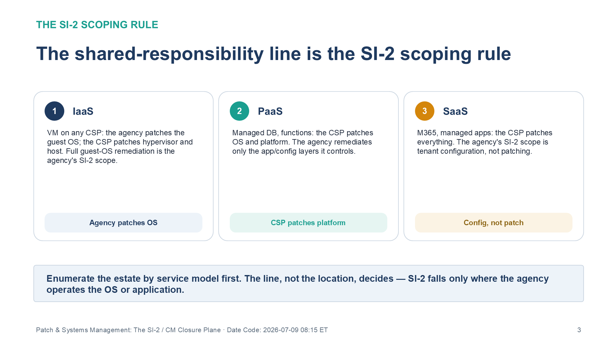
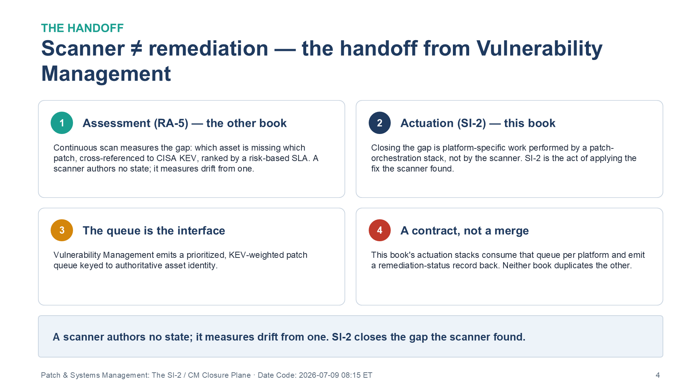
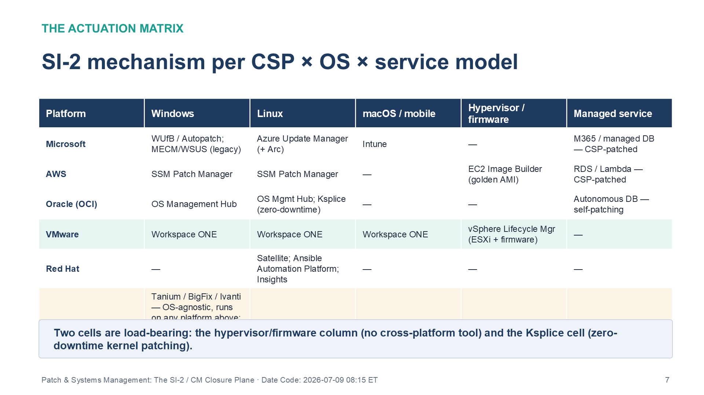

::: {.fouo-banner}
INTERNAL — NOT FOR PUBLIC DISTRIBUTION
:::

::: {.aan-warning}
## Draft Proposal — Subject to Review

This document is a **draft proposal** developed by the **CSI Team (Cloud Services Infrastructure)**. It is an attempt at a comprehensive -wide technical roadmap and has not been reviewed or approved by the  CIO Office, the Office of Information Security (OIS), or organizational leadership. All recommendations, vendor selections, control mappings, and implementation timelines are subject to revision pending formal review by the  CIO Office and organizational components.

**Date Code:** 2026-07-09 08:41 ET
:::

::: {.aan-important}
**Provisional position.** This book was drafted at temporary series slot 21 to
avoid renumbering the series while adjacent books settle. Its intended home is
immediately after the Vulnerability Management book (the assessment half), whose
remediation half it carries. Cross-references name other books by **title and
role**, not number, so the series-wide renumber does not break them.
:::

::: {.aan-important}
**Series Context** — The Vulnerability Management book answers *what is
unpatched* — continuous scanning, CISA KEV cross-reference, risk-based SLAs, and
the machine-readable compliance record, worked on the Microsoft/Defender estate.
This book answers *close it, and keep it closed*: the remediation actuation
(SI-2) and configuration state (CM-2 / CM-6) across **every** cloud platform the
agency runs — not just the Azure/Intune stack. It is the realization of the
Configuration & Remediation plane (plane 7) and of the Management-Plane
Coordination Doctrine stated in the Executive Summary.
:::

# What This Document Addresses

The Vulnerability Management book demonstrated flaw remediation on one stack:
Microsoft Defender Vulnerability Management for assessment, Intune Windows Update
for Business and Azure Update Manager for delivery, all riding the Azure Arc
channel. That is a complete and correct *reference implementation* — for the
Azure estate. It is not the whole estate.

A federal agency operating under FedRAMP Moderate typically runs compute on more
than one authorized platform at once: Azure Government / M365 GCC, **AWS
GovCloud**, **Oracle Cloud Infrastructure (OCI)**, on-premises **VMware**, and
**Red Hat** across all of them. Each platform ships its own patch and
systems-management stack, each spanning Windows, Linux, and — above the guest OS
— hypervisor, firmware, and managed-service layers that no single vendor's tool
reaches. The question this book answers is the one the coordination doctrine
poses:

> **Is SI-2 closed by forcing every workload under one Microsoft plane (Intune /
> Azure Arc), or by each platform's native stack coordinated through a common
> contract? And if the latter, what is the contract?**

The answer, per doctrine: **actuation is platform-native; governance is
unified.** This book gives the actuation matrix, defines the unifying contract,
and maps both to the SI-2 and CM control families.

# The Shared-Responsibility Line Is the SI-2 Scoping Rule

SI-2 (Flaw Remediation) does not apply uniformly to every layer of a cloud
service — it applies to the layer the *customer* operates. The shared-
responsibility line moves by service model, and it moves the SI-2 obligation
with it:

| Service model | Who patches the OS | Who patches the platform | Agency SI-2 scope |
|---|---|---|---|
| **IaaS** (VM on any CSP) | Agency | CSP (hypervisor, host) | Full guest-OS remediation is the agency's |
| **PaaS** (managed DB, functions) | CSP | CSP | Agency remediates only app/config layers it controls |
| **SaaS** (M365, managed apps) | CSP | CSP | Agency SI-2 scope is tenant configuration, not patching |

The scoping rule is therefore: **enumerate the estate by service model first;
SI-2 obligations fall only where the agency operates the OS or the application.**
A common assessment error is claiming SI-2 evidence for a fully managed PaaS
database (the CSP patches it) or, worse, *failing* to claim it for an IaaS VM
because "it's in the cloud" (the agency patches it). The line, not the location,
decides.

{#fig-psm-scoping fig-alt="Three numbered cards illustrating how the SI-2 obligation shifts by service model. Card one, IaaS: on a VM on any CSP the agency patches the guest OS while the CSP patches the hypervisor and host, so full guest-OS remediation is the agency's SI-2 scope — tagged Agency patches OS. Card two, PaaS: for a managed database or functions the CSP patches the OS and platform and the agency remediates only the app and config layers it controls — tagged CSP patches platform. Card three, SaaS: for M365 and managed apps the CSP patches everything and the agency's SI-2 scope is tenant configuration, not patching — tagged Config, not patch. A footer banner states the rule: enumerate the estate by service model first — the line, not the location, decides, and SI-2 falls only where the agency operates the OS or application. White background. Source: Vol III Book 03 — Patch & Systems Management briefing deck, Date Code 2026-07-09 17:00 ET." width="100%"}

# Scanner ≠ Remediation — the Handoff From Vulnerability Management

The Vulnerability Management book measures the gap (RA-5): which asset is missing
which patch, cross-referenced to the KEV catalog, ranked by a risk-based SLA.
That is assessment. It does not, by itself, apply a single patch. **A scanner
authors no state; it measures drift from one.** SI-2 is the act of closing the
gap the scanner found — and closing it is platform-specific work performed by a
patch-orchestration stack, not by the scanner.

The handoff is a contract, not a merge: Vulnerability Management emits a
prioritized, KEV-weighted patch queue keyed to authoritative asset identity;
this book's actuation stacks consume that queue on their respective platforms and
emit a remediation-status record back. Neither book duplicates the other.

{#fig-psm-handoff fig-alt="Four numbered cards describing the handoff from Vulnerability Management to this book. Card one, Assessment (RA-5) — the other book: continuous scanning measures the gap of which asset is missing which patch, cross-referenced to the CISA KEV catalog and ranked by a risk-based SLA; a scanner authors no state, it measures drift from one. Card two, Actuation (SI-2) — this book: closing the gap is platform-specific work performed by a patch-orchestration stack, not by the scanner; SI-2 is the act of applying the fix the scanner found. Card three, The queue is the interface: Vulnerability Management emits a prioritized, KEV-weighted patch queue keyed to authoritative asset identity. Card four, A contract, not a merge: this book's actuation stacks consume that queue per platform and emit a remediation-status record back, and neither book duplicates the other. A footer banner restates that a scanner authors no state — SI-2 closes the gap the scanner found. White background. Source: Vol III Book 03 — Patch & Systems Management briefing deck, Date Code 2026-07-09 17:00 ET." width="100%"}

# The Coordination Doctrine, Applied

## Actuation Is Platform-Native

Each platform patches with the stack its support model requires. Forcing an
overlay past that boundary breaks support and, often, physics (you cannot patch
an ESXi hypervisor with a guest-OS agent).

| Platform | Windows | Linux | macOS / mobile | Hypervisor / firmware | Managed-service (PaaS/SaaS) |
|---|---|---|---|---|---|
| **Microsoft** | WUfB / Autopatch; MECM/WSUS (legacy) | Azure Update Manager (+ Arc) | Intune | — | M365 / managed DB — CSP-patched |
| **AWS** | SSM Patch Manager | SSM Patch Manager | — | EC2 Image Builder (golden AMI) | RDS / Lambda — CSP-patched |
| **Oracle (OCI)** | OS Management Hub | OS Management Hub; **Ksplice** (zero-downtime kernel) | — | — | Autonomous DB — self-patching |
| **VMware** | Workspace ONE | Workspace ONE | Workspace ONE | **vSphere Lifecycle Manager** (ESXi + firmware) | — |
| **Red Hat** | — | Satellite; Ansible Automation Platform; Insights | — | — | — |
| **Cross-CSP overlay** | Tanium / BigFix / Ivanti — OS-agnostic, runs on any platform above | | | | |

: Actuation Stacks by Platform and Layer — the SI-2 Mechanism per Cell {.striped .hover}

Two properties of this matrix are load-bearing:

1. **The hypervisor/firmware column has no cross-platform tool.** ESXi is patched
   by vSphere Lifecycle Manager and nothing else; a network appliance's firmware
   is patched by its vendor tooling (the Network Enforcement Substrate book's
   subject). "Everything under Arc" cannot reach this column.
2. **Oracle Ksplice is a genuine capability difference, not a branding one.** It
   applies kernel and user-space patches without a reboot — which changes the
   remediation-SLA math for high-availability workloads, because the maintenance
   window that gates most patching is smaller or absent.

{#fig-psm-actuation fig-alt="A grid titled SI-2 mechanism per CSP by OS by service model, with rows for each platform and columns for Windows, Linux, macOS/mobile, Hypervisor/firmware, and Managed service. Microsoft row: WUfB/Autopatch and MECM/WSUS legacy for Windows, Azure Update Manager plus Arc for Linux, Intune for macOS, and M365/managed DB CSP-patched. AWS row: SSM Patch Manager for Windows and Linux, EC2 Image Builder golden AMI for firmware, and RDS/Lambda CSP-patched. Oracle (OCI) row: OS Management Hub for Windows and OS Management Hub plus zero-downtime Ksplice for Linux, with Autonomous DB self-patching. VMware row, tinted: Workspace ONE across Windows, Linux, and macOS, and vSphere Lifecycle Manager for ESXi plus firmware. Red Hat row: Satellite, Ansible Automation Platform, and Insights for Linux. A cross-CSP overlay row notes Tanium, BigFix, or Ivanti run OS-agnostically on any platform above. A footer banner flags two load-bearing cells: the hypervisor/firmware column has no cross-platform tool, and the Ksplice cell provides zero-downtime kernel patching. White background. Source: Vol III Book 03 — Patch & Systems Management briefing deck, Date Code 2026-07-09 17:00 ET." width="100%"}

## Governance Is Unified — the Evidence Contract

{#fig-psm-flow fig-alt="A left-to-right build-sequence: actuate platform-native, emit the normalized evidence record, correlate on the IPAM/DDI asset-identity key, roll up to CDM and KSI. Completed steps are tinted, the active step is ringed in amber, and a detail panel explains the active step." width="100%"}

Coordination is not a console; it is a record every stack must emit. The
**unified compliance record** is the contract:

| Field | Meaning |
|---|---|
| `asset_id` | Authoritative name/address from the naming plane (IPAM/DDI) — the join key |
| `platform` | Which CSP/stack produced the record |
| `os` | Guest OS or appliance class |
| `patch_state` | Current vs. required patch level |
| `baseline_conformance` | Pass/fail against the CM-2 desired-state baseline |
| `last_scan` | Timestamp of the assessment that produced the gap |
| `sla_class` | Remediation SLA tier (KEV/exposure-weighted, BOD 26-04 model) |
| `remediation_status` | Applied / scheduled / deferred (with POA&M reference) |

Every native stack — SSM, Update Manager, OS Management Hub, vLCM, Satellite —
can produce these fields. The record lands in one evidence lake (Sentinel / Log
Analytics), flows into **CISA CDM**, and becomes the SI-2 / SI-2(2) evidence in
the FedRAMP 20x KSI pipeline. The series mandates the **record**, never a single
vendor's tool.

::: {.aan-important}
## The Join Key Is Authoritative Asset Identity — CM-8 Is the Precondition for SI-2 at Scale

Five stacks produce five inventories. They become one compliance picture only if
every `remediation_status` record is keyed to the **same authoritative
`asset_id`** — the IP/hostname from the naming plane (CM-8). Without that join
key, an agency cannot answer "is CVE-X remediated across the whole estate?" — it
can only answer it per stack, which is not asset visibility. This is the
**CISA BOD 23-01** obligation, and it is why multi-platform SI-2 is a *downstream
consequence* of the naming-plane necessity argument, not an independent problem.
:::

# Configuration State, Not Just Patch Level

SI-2 closes flaws; **CM-2 / CM-6** hold the configuration that keeps them closed.
Each platform has a desired-state mechanism that is the analogue of a patch
baseline: Azure Machine Configuration (guest configuration), AWS SSM State
Manager, VMware Aria Automation, Red Hat Ansible. The discipline is identical
across them — declare a baseline, detect drift, reconcile, and emit a
`baseline_conformance` record — and it feeds the same evidence contract. A patch
applied to a host that then drifts out of its hardened baseline has not stayed
remediated; configuration state is the other half of the plane.

# The Cross-CSP Overlay Decision

An agency may choose to run a single OS-agnostic management plane — Tanium,
BigFix, or Ivanti — *on top of* every platform, instead of stitching native
stacks together. The trade is explicit:

- **Native per-platform** — no extra license, inherits each CSP's support model
  and boundary, but requires the evidence contract to normalize five outputs.
- **Single overlay** — one console and one normalized output, but an additional
  FedRAMP-authorized product in the boundary, an agent on every host, and a
  support-model seam with each platform's own tooling.

Neither is doctrinally required; both satisfy the coordination doctrine **as long
as the evidence contract is met**. The overlay does not replace the hypervisor/
firmware column — vLCM and vendor firmware tooling remain, because an OS-level
overlay cannot patch below the OS.

# The Accreditation Substrate (Theme F)

Most stacks in the actuation matrix are **CSP services** (Intune/Arc, AWS SSM, OCI
OS Management Hub), so their gate is **FedRAMP** — verify each such stack's
authorization status on the FedRAMP Marketplace at procurement, and never claim
above Moderate. But the matrix also includes **customer-operated** stacks —
vSphere Lifecycle Manager on on-premises VMware, and Red Hat Satellite / Ansible
on customer infrastructure — which carry no FedRAMP CSO. Like the customer-owned
network gear in the enforcement-substrate book, their accreditation is the
product's own (DISA STIG hardening, FIPS 140-3 validated modules), and the
authorization boundary documents them as agency-operated components, not inherited
CSP services. One boundary nuance recurs: a
**hybrid agent** — Azure Arc reaching an on-prem or AWS host, or SSM reaching a
non-AWS host — creates an interconnection the authorization boundary must
document (the agent channel crosses a boundary edge). Note it as an external-
service connection with its own agreement; do not treat the reached host as
silently in-boundary because a management agent touches it.

# Closure Necessity — Remediation Has No Substitute

> **Closure Necessity — SI-2 across platforms.** No conformance scan, no policy
> document, and no single-vendor console closes SI-2 on a genuinely multi-cloud
> estate. The flaw is closed only when the platform-native orchestration stack
> applies the patch on its own platform, and the estate is *provably* closed only
> when each stack emits a remediation-status record keyed to authoritative asset
> identity. Remove the actuation and SI-2 is open; remove the join key and SI-2 is
> unprovable.

# NIST SP 800-53 Rev 5 Control Closure — Authorities Closed Here

Generated from the series compliance spine (`aan-compliance-spine.yml`) via
`render_authorities_table.py`; not hand-maintained. Note RA-5 appears as a
*handoff* row — the assessment is the Vulnerability Management book's; this book
closes the SI-2 and CM families that act on it.

<!-- authorities:book-patch-sysmgmt — generated from aan-compliance-spine.yml; do not hand-edit -->
| Control | Title | Closing mechanism (function, not product) | Accreditation gate | Authority drivers | Evidence slot | FedRAMP 20x KSI | Tool-attestable? |
|---|---|---|---|---|---|---|---|
| CM-8 † | System Component Inventory | IPAM-keyed asset identity as the join key correlating all native-stack inventories (naming-plane necessity) | FedRAMP Moderate | NIST SP 800-53 Rev 5; CISA BOD 23-01 | Network | KSI-PIY | No |
| RA-5 | Vulnerability Monitoring and Scanning | Assessment handoff FROM Book 11 (scan measures the gap; this book actuates remediation) | FedRAMP Moderate | NIST SP 800-53 Rev 5; CISA BOD 22-01 | Endpoint | KSI-MLA | No |
| CM-2 | Baseline Configuration | Desired-state config baseline per platform (Azure Machine Config, SSM State Manager, Aria, Ansible) | FedRAMP Moderate | NIST SP 800-53 Rev 5; OMB Circular A-130 | Endpoint | KSI-CMT | No |
| CM-6 | Configuration Settings | Drift detection + reconciliation against the baseline; drift record to the evidence contract | FedRAMP Moderate | NIST SP 800-53 Rev 5; CISA SCuBA | Endpoint | KSI-CMT | No |
| SI-2 † | Flaw Remediation | Platform-native patch orchestration per CSP × OS (Intune/Arc, SSM, OS Mgmt Hub/Ksplice, vLCM, Satellite/Ansible) | FedRAMP Moderate | NIST SP 800-53 Rev 5; CISA BOD 26-04; EO 14028 | Endpoint | KSI-SVC, KSI-MLA | No |
| SI-2(2) | Automated Flaw Remediation Status | Machine-readable remediation-status record emitted by each native stack into the unified evidence contract | FedRAMP Moderate | NIST SP 800-53 Rev 5; CISA CDM | Endpoint | KSI-SVC, KSI-MLA | No |
| SI-2(3) | Time to Remediate Flaws and Benchmarks for Corrective Actions | Remediation-SLA class per asset, keyed to KEV/exposure (BOD 26-04 four-variable model) | FedRAMP Moderate | NIST SP 800-53 Rev 5; CISA BOD 22-01; CISA BOD 26-04 | Endpoint | KSI-SVC | No |

: Authorities Closed Here — Patch & Systems Management (multi-CSP SI-2/CM) († = Closure-Necessity anchor: no alternate closure path) {.striped .hover}

# FedRAMP 20x KSI Alignment

SI-2 and its enhancements feed **KSI-SVC** (Service Configuration) and
**KSI-MLA** (Monitoring, Logging, and Auditing); CM-2 and CM-6 feed **KSI-CMT**
(Change Management), and CM-8 feeds **KSI-PIY** (Policy and Inventory). In each case the KSI is attested from the unified
compliance record — the same record every native stack emits — not from a
single-tenant scan, which is why the *Tool-attestable?* column is **No** and the
evidence routes through the coordination contract and CDM. This is the multi-CSP
generalization of the machine-readable RA-5/SI-2 artifact the Vulnerability
Management book produces for the Microsoft estate.

::: {.aan-note}
## Stack Selection Status

Patch and systems-management stack selections follow the agency's platform
footprint and are pending procurement review. The native stacks mapped here are
each FedRAMP-authorized CSP capabilities; the cross-CSP overlay option
(Tanium / BigFix / Ivanti) is an alternative, not a requirement. Final selection
requires verification of each stack's authorization on the FedRAMP Marketplace,
plus agency-specific environment testing and procurement authority.
:::

# References

| Reference | Description |
|---|---|
| NIST SP 800-53 Rev 5 | SI-2, SI-2(2), SI-2(3), CM-2, CM-6, CM-8, RA-5 |
| CISA BOD 22-01 | Known Exploited Vulnerabilities catalog — <https://www.cisa.gov/known-exploited-vulnerabilities-catalog> |
| CISA BOD 23-01 | Asset visibility & vulnerability enumeration — <https://www.cisa.gov/news-events/directives/bod-23-01-improving-asset-visibility-and-vulnerability-detection-federal-networks> |
| CISA CDM Program | Continuous Diagnostics & Mitigation — <https://www.cisa.gov/cdm> |
| FedRAMP Marketplace | CSP service authorization verification — <https://marketplace.fedramp.gov/> |
| Microsoft Azure Update Manager | Windows/Linux update management (+ Arc) — <https://learn.microsoft.com/azure/update-manager/> |
| Microsoft Intune / Windows Update for Business | Windows/macOS/mobile patch delivery — <https://learn.microsoft.com/mem/intune/> |
| AWS Systems Manager Patch Manager | Windows/Linux patch orchestration — <https://docs.aws.amazon.com/systems-manager/latest/userguide/systems-manager-patch.html> |
| Amazon Inspector | Vulnerability assessment (AWS handoff) — <https://docs.aws.amazon.com/inspector/latest/user/what-is-inspector.html> |
| Oracle OS Management Hub | OCI Linux/Windows management — <https://docs.oracle.com/en-us/iaas/osmh/doc/home.htm> |
| Oracle Ksplice | Zero-downtime kernel patching — <https://docs.oracle.com/en-us/iaas/oracle-linux/ksplice/index.htm> |
| VMware vSphere Lifecycle Manager | ESXi + firmware lifecycle — <https://docs.vmware.com/en/VMware-vSphere/> |
| VMware Workspace ONE UEM | Endpoint OS patch management — <https://docs.omnissa.com/> |
| Red Hat Satellite | Content and patch management — <https://docs.redhat.com/en/documentation/red_hat_satellite> |
| Red Hat Ansible Automation Platform | Configuration/remediation actuation — <https://docs.redhat.com/en/documentation/red_hat_ansible_automation_platform> |

: Reference Documents and Vendor Sources {.striped .hover}
