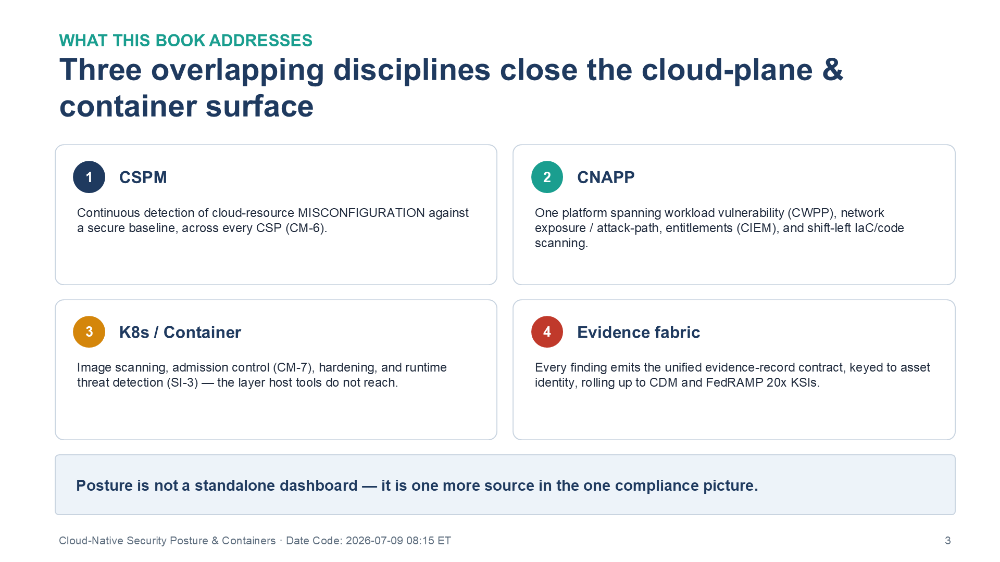
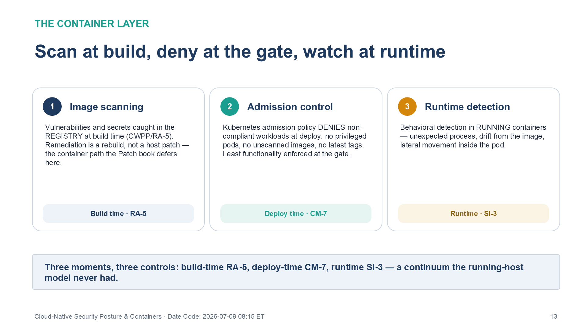
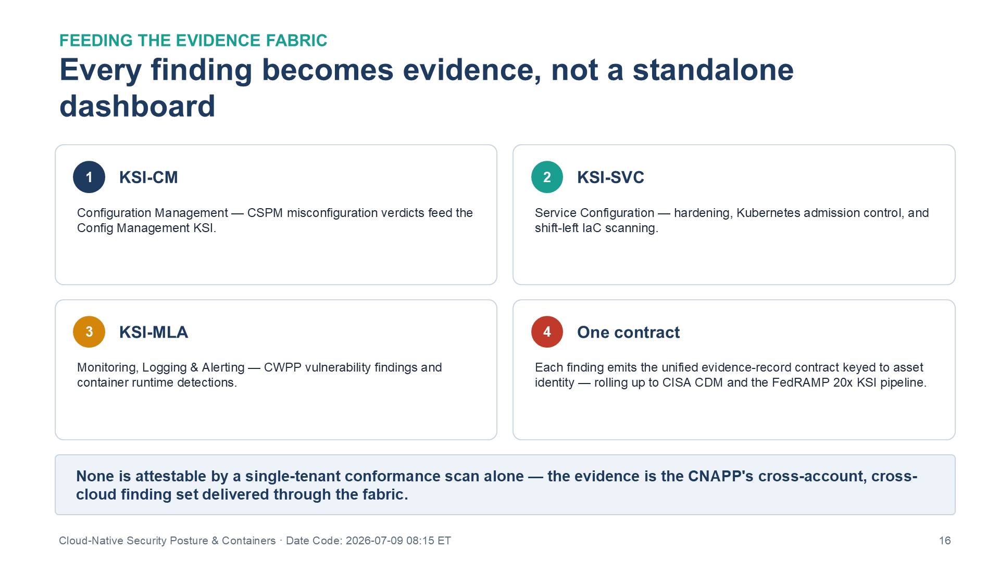

::: {.fouo-banner}
INTERNAL — NOT FOR PUBLIC DISTRIBUTION
:::

::: {.callout-warning}
## Draft Proposal — Subject to Review

This document is a **draft proposal** developed by the **CSI Team (Cloud Services Infrastructure)**. It is an attempt at a comprehensive SSA-wide technical roadmap and has not been reviewed or approved by the SSA CIO Office, the Office of Information Security (OIS), or organizational leadership. All recommendations, vendor selections, control mappings, and implementation timelines are subject to revision pending formal review by the SSA CIO Office and organizational components.

**Date Code:** 2026-07-09 08:41 ET
:::

::: {.callout-important}
**Provisional position.** This book was drafted at temporary series slot 22; its
intended home is **Volume III (Security Operations)**, alongside the Vulnerability
Management and Patch & Systems Management books. Cross-references name other
books by **title and role**, not number.
:::

::: {.callout-important}
**Series Context** — The Vulnerability Management book finds missing patches on
hosts; the Patch & Systems Management book applies them (SI-2) across platforms.
Neither sees the risks that live *in the cloud control plane and the container
layer*: a world-readable storage bucket, an over-permissive IAM role, an
internet-exposed workload, an unscanned container image, a privileged pod. This
book closes those — **cloud security posture management (CSPM)**, **cloud-native
application protection (CNAPP)**, and **Kubernetes security** — and routes their
findings into the evidence fabric like every other source.
:::

# What This Document Addresses

A host vulnerability scanner answers "what CVEs are on this VM." It does not
answer "is this storage bucket public," "can this workload reach the internet,"
"does this IAM role grant far more than it uses," or "was this container image
scanned before it ran." Those are **cloud-control-plane and container-layer**
questions, and on a multi-cloud estate (AWS GovCloud, Azure, OCI, plus
Kubernetes — AKS/EKS/OKE/OpenShift) they are where most real cloud incidents
begin: misconfiguration, excessive entitlement, and exposure — not an unpatched
kernel.

This book closes that surface with three overlapping disciplines:

- **CSPM** — continuous detection of cloud resource **misconfiguration** against
  a secure baseline, across every CSP (CM-6).
- **CNAPP** — a unified platform spanning **workload vulnerability (CWPP)**,
  **network exposure / attack-path** analysis, **entitlements (CIEM)**, and
  **shift-left IaC/code** scanning.
- **Kubernetes / container security** — image scanning, **admission control**,
  hardening (CM-7), and **runtime threat detection** (SI-3).

{#fig-cnp-disciplines fig-alt="Four numbered cards summarizing what this book closes. Card one, CSPM: continuous detection of cloud-resource misconfiguration against a secure baseline, across every CSP, closing CM-6. Card two, CNAPP: one platform spanning workload vulnerability (CWPP), network exposure and attack-path analysis, entitlements (CIEM), and shift-left IaC and code scanning. Card three, K8s / Container: image scanning, admission control (CM-7), hardening, and runtime threat detection (SI-3) — the layer host tools do not reach. Card four, Evidence fabric: every finding emits the unified evidence-record contract, keyed to asset identity, rolling up to CISA CDM and the FedRAMP 20x KSIs. A footer banner states that posture is not a standalone dashboard — it is one more source in the one compliance picture. White background. Source: Vol III Book 04 — Cloud-Native Security Posture & Containers briefing deck, Date Code 2026-07-09 17:00 ET." width="100%"}

# CSPM — Misconfiguration Is the Cloud's Dominant Risk (CM-6)

Misconfiguration is a configuration-settings control (CM-6) applied to *cloud
resources* rather than OS baselines: storage exposure, network security-group
rules, key/secret handling, logging gaps, IAM policy drift. CSPM detects it
continuously across CSPs and emits a `baseline_conformance` verdict into the
evidence fabric's contract. This is the cloud-plane complement to the Patch &
Systems Management book's OS-level CM-6 — same control, different layer; both
contribute.

::: {.callout-note}
## The Moderate decision — Defender for Cloud vs. the agency's Palo Alto preference

Under the Microsoft-preference rule (a Microsoft product is the default *when it
coordinates the multi-vendor surface at FedRAMP Moderate* — earned, not
automatic), **Microsoft Defender for Cloud** is the leading candidate: it does
multi-cloud CSPM/CWPP across **AWS, GCP, and Azure** and is available within GCC
at **FedRAMP Moderate** — a clean fit for the Moderate-only boundary.

The agency prefers **Palo Alto (Prisma Cloud)**, and Prisma Cloud is the most
complete CNAPP — but it is **FedRAMP High-only**, as is **Wiz for Government**.
Under the Moderate-exclusive rule this is a flag, not a disqualifier: High
exceeds Moderate, so either product may be used if the boundary treatment is
documented, or Defender for Cloud is selected to stay natively at Moderate. This
is an explicit procurement/boundary decision, recorded in the Product Inventory
Questionnaire's flag list.
:::

# CNAPP — One Platform, Four Overlapping Views

{#fig-cnp-attackpath fig-alt="A five-step build showing how CNAPP composes an internet-exposed workload plus a critical vulnerability plus a misconfiguration plus an over-permissioned identity into one prioritized attack-path finding. Completed steps tinted, the active step ringed in amber, with a detail panel below." width="100%"}

A cloud-native application protection platform unifies what were separate tools:

| CNAPP view | Question it answers | NIST control | This series |
|---|---|---|---|
| **CSPM** | Is the cloud resource misconfigured? | CM-6 | this book |
| **CWPP** | Is the workload/image vulnerable? | RA-5 | this book (assessment handoff to Patch for SI-2) |
| **Network exposure / attack path** | Can this workload be reached, and what can it reach? | SC-7 | this book (cloud-plane SC-7; edge SC-7 is the Network Enforcement book) |
| **CIEM** | Does this identity have far more access than it uses? | AC-6 | cross-ref Privileged Access Management book (cloud-entitlement layer) |
| **Code / IaC (shift-left)** | Is the misconfiguration or vuln present *before* deploy? | SA-11 | this book (SSDF, NIST SP 800-218) |

The **attack-path** view (SC-7) is the distinctive CNAPP capability: it composes
misconfiguration + exposure + vulnerability + entitlement into "this
internet-reachable workload has a critical vuln and an over-permissioned role to
the data store" — a single prioritized finding no host scanner produces. It is a
cloud-plane SC-7 closure, distinct from the customer-edge SC-7 the Network
Enforcement Substrate book closes on gear.

# Kubernetes & Container Security (CM-7, SI-3)

Containers add a layer host tools do not reach:

- **Image scanning** — vulnerabilities and secrets caught in the registry at
  build time (CWPP/RA-5), so remediation is a rebuild, not a host patch (this is
  the container path the Patch & Systems Management book explicitly defers here).
- **Admission control (CM-7)** — Kubernetes admission policy *denies* non-
  compliant workloads at deploy: no privileged pods, no unscanned images, no
  latest tags. Least functionality enforced at the gate.
- **Runtime threat detection (SI-3)** — behavioral detection in running
  containers (unexpected process, drift from image, lateral movement).

{#fig-cnp-container fig-alt="Three numbered cards spanning the container security lifecycle. Card one, Image scanning, tagged Build time · RA-5: vulnerabilities and secrets are caught in the registry at build time (CWPP/RA-5), so remediation is a rebuild, not a host patch — the container path the Patch book defers here. Card two, Admission control, tagged Deploy time · CM-7: Kubernetes admission policy denies non-compliant workloads at deploy — no privileged pods, no unscanned images, no latest tags — enforcing least functionality at the gate. Card three, Runtime detection, tagged Runtime · SI-3: behavioral detection in running containers spots an unexpected process, drift from the image, or lateral movement inside the pod. A footer banner sums it up: three moments, three controls — build-time RA-5, deploy-time CM-7, runtime SI-3 — a continuum the running-host model never had. White background. Source: Vol III Book 04 — Cloud-Native Security Posture & Containers briefing deck, Date Code 2026-07-09 17:00 ET." width="100%"}

# Feeding the Evidence Fabric

Every finding here — a CSPM misconfiguration verdict, a CWPP vulnerability, an
attack-path alert, an admission denial — emits the **unified evidence-record
contract** into the fabric, keyed to authoritative asset identity, and rolls up
to CISA CDM and the FedRAMP 20x KSI pipeline (see the Multi-Cloud Evidence
Fabric book). Posture is not a standalone dashboard; it is one more source in
the one compliance picture.

# NIST SP 800-53 Rev 5 Control Closure — Authorities Closed Here

Generated from the series compliance spine (`aan-compliance-spine.yml`) via
`render_authorities_table.py`; not hand-maintained. Note the *layer* distinctions:
CM-6 here is cloud-resource misconfiguration (the Patch book closes OS-baseline
CM-6); SC-7 here is cloud attack-path exposure (the Network Enforcement book
closes edge SC-7); RA-5 here is cloud/container scanning (the Vulnerability
Management book owns host RA-5).

<!-- authorities:book-cloudnative-posture — generated from aan-compliance-spine.yml; do not hand-edit -->
| Control | Title | Closing mechanism (function, not product) | Accreditation gate | Authority drivers | Evidence slot | FedRAMP 20x KSI | Tool-attestable? |
|---|---|---|---|---|---|---|---|
| CM-7 | Least Functionality | Container hardening + Kubernetes admission control (deny non-compliant workloads) | FedRAMP Moderate | NIST SP 800-53 Rev 5 | Security / supply chain | KSI-SVC | No |
| SC-7 | Boundary Protection | Cloud network-exposure and attack-path analysis (CNAPP) — internet-reachable workloads flagged | FedRAMP Moderate | NIST SP 800-53 Rev 5; NIST SP 800-207 | Network | KSI-CNA | No |
| CM-6 | Configuration Settings | Cloud resource misconfiguration detection across CSPs (CSPM) — Defender for Cloud (Moderate default); Prisma Cloud/Wiz (High) | FedRAMP Moderate | NIST SP 800-53 Rev 5; CISA SCuBA | Security / supply chain | KSI-CM, KSI-SVC | No |
| RA-5 | Vulnerability Monitoring and Scanning | Agentless cloud-workload + container-image vulnerability scanning (CNAPP/CWPP) | FedRAMP Moderate | NIST SP 800-53 Rev 5; CISA BOD 22-01 | Security / supply chain | KSI-MLA | No |
| SA-11 | Developer Testing and Evaluation | Shift-left IaC and container-image scanning in CI (CNAPP code security) | FedRAMP Moderate | NIST SP 800-53 Rev 5; NIST SP 800-218 | Security / supply chain | KSI-SVC | No |
| SI-3 | Malicious Code Protection | Container / workload runtime threat detection | FedRAMP Moderate | NIST SP 800-53 Rev 5 | Security / supply chain | KSI-MLA | No |

: Authorities Closed Here — Cloud-Native Security Posture & Containers (CSPM/CNAPP, K8s) († = Closure-Necessity anchor: no alternate closure path) {.striped .hover}

# FedRAMP 20x KSI Alignment

Cloud-native posture feeds **KSI-CM** (Configuration Management — misconfiguration
verdicts), **KSI-SVC** (Service Configuration — hardening, admission control,
IaC), and **KSI-MLA** (vulnerability + runtime findings). As with the rest of the
series' evidence, none is attestable by a single-tenant conformance scan alone —
the evidence is the CNAPP's cross-account, cross-cloud finding set delivered
through the evidence fabric.

{#fig-cnp-ksi fig-alt="Four numbered cards mapping cloud-native posture findings to FedRAMP 20x Key Security Indicators. Card one, KSI-CM: Configuration Management — CSPM misconfiguration verdicts feed the Config Management KSI. Card two, KSI-SVC: Service Configuration — hardening, Kubernetes admission control, and shift-left IaC scanning. Card three, KSI-MLA: Monitoring, Logging and Alerting — CWPP vulnerability findings and container runtime detections. Card four, One contract: each finding emits the unified evidence-record contract keyed to asset identity, rolling up to CISA CDM and the FedRAMP 20x KSI pipeline. A footer banner notes that none is attestable by a single-tenant conformance scan alone — the evidence is the CNAPP's cross-account, cross-cloud finding set delivered through the fabric. White background. Source: Vol III Book 04 — Cloud-Native Security Posture & Containers briefing deck, Date Code 2026-07-09 17:00 ET." width="100%"}

::: {.callout-note}
## Platform Selection Status

CNAPP/CSPM selection is pending agency procurement review and is an explicit
Moderate-boundary decision: **Microsoft Defender for Cloud** stays natively at
FedRAMP Moderate (multi-cloud CSPM/CWPP); the agency-preferred **Palo Alto
Prisma Cloud** and **Wiz for Government** are the most complete CNAPPs but are
**FedRAMP High**. Choose Defender for Cloud to remain at Moderate, or document
the High-covering-Moderate boundary treatment for Prisma Cloud/Wiz. Verify on
the FedRAMP Marketplace at procurement.
:::

# References

| Reference | Description |
|---|---|
| NIST SP 800-53 Rev 5 | CM-6, CM-7, SC-7, RA-5, SA-11, SI-3 |
| NIST SP 800-207 | Zero Trust Architecture (workload exposure) |
| NIST SP 800-218 | Secure Software Development Framework (shift-left) |
| CISA SCuBA | Secure Cloud Business Applications baselines — <https://www.cisa.gov/scuba> |
| CISA BOD 22-01 | Known Exploited Vulnerabilities catalog — <https://www.cisa.gov/known-exploited-vulnerabilities-catalog> |
| Microsoft Defender for Cloud (multi-cloud CSPM/CWPP) | <https://learn.microsoft.com/azure/defender-for-cloud/> |
| Palo Alto Prisma Cloud (CNAPP, FedRAMP High) | <https://www.paloaltonetworks.com/blog/prisma-cloud/fedramp-high-impact-ready/> |
| Wiz for Government (CNAPP, FedRAMP High) | <https://www.wiz.io/blog/wiz-achieves-fedramp-high-authorization> |

: Reference Documents and Vendor Sources {.striped .hover}
